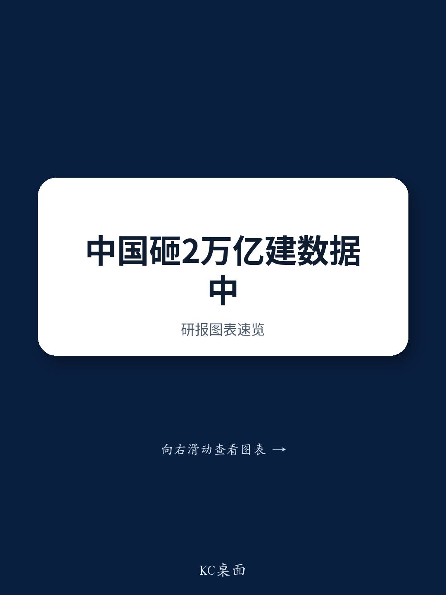
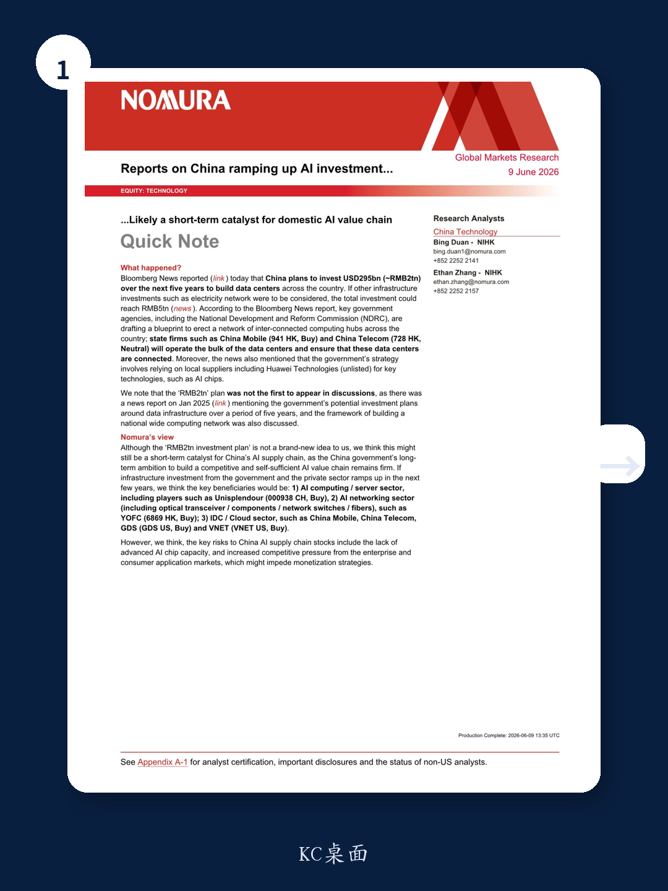
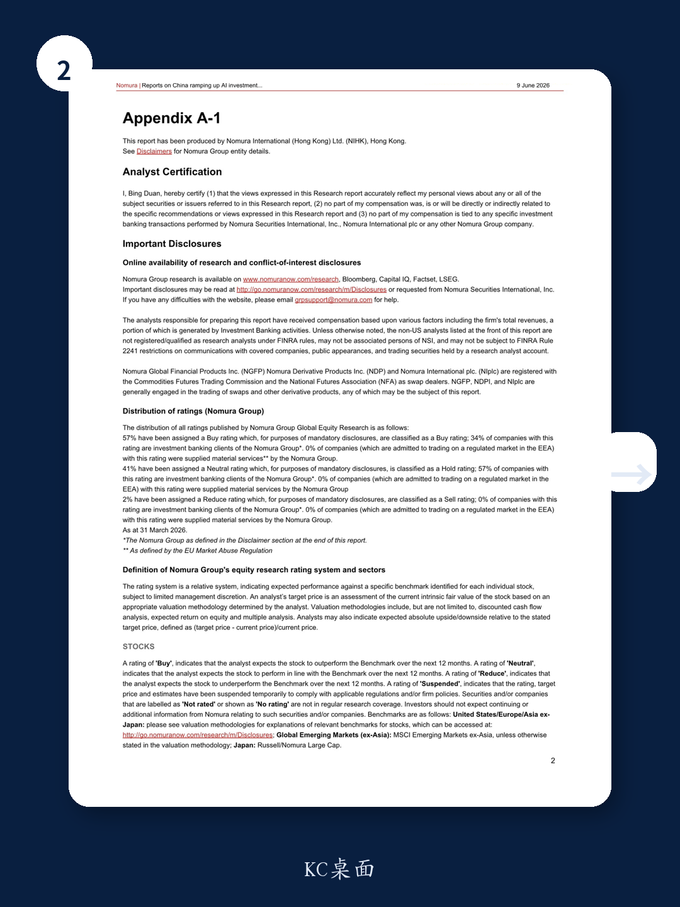

# China's USD 295 Billion Data Center Plan Is a Strategic Signal, Not a Spending Spree

The reported plan by Chinese authorities to invest approximately RMB 2 trillion in data center infrastructure over the next five years has been interpreted by many as a straightforward catalyst for the domestic AI supply chain. This reading is too narrow. The real significance of this initiative lies not in the headline figure, but in what it reveals about the strategic calculus driving China's technology policy. This is not merely a fiscal stimulus program for the technology sector. It is a coordinated national effort to build a sovereign AI infrastructure stack, one designed to operate under the constraints of semiconductor export controls and to establish a self-sufficient foundation for the next wave of industrial competition. For investors, the immediate question is not whether this plan will boost certain stock prices in the short term, but rather which parts of the value chain will capture durable value in a market where the government is the primary architect and the state-owned enterprise is the primary operator.

The timing of this announcement matters. It arrives at a moment when the global narrative around artificial intelligence is shifting from pure model innovation toward the practical challenges of deployment, energy consumption, and infrastructure scaling. China's plan to build a network of interconnected computing hubs addresses these challenges head-on, but from a distinctly different starting point than comparable efforts in the United States or Europe. Where Western data center buildouts are largely driven by private hyperscalers responding to demand from enterprise and consumer applications, China's approach is top-down, state-coordinated, and explicitly tied to national security objectives. This structural difference has profound implications for which companies benefit, how they benefit, and whether those benefits are sustainable.

The reported investment figure of RMB 2 trillion, with potential expansion to RMB 5 trillion when including ancillary infrastructure such as electricity networks, is large enough to reshape the competitive dynamics of several domestic industries. But size alone is not a strategy. The critical details lie in the implementation framework: state-owned enterprises like China Mobile and China Telecom will operate the bulk of the data centers, and the government plans to rely on local suppliers such as Huawei for key technologies including AI chips. This is not a neutral procurement decision. It is a deliberate attempt to create a parallel supply chain that can function independently of foreign technology providers. The success or failure of this plan will therefore be determined not by the amount of capital deployed, but by the ability of domestic suppliers to deliver performance that is competitive with the best available global alternatives.

## The Reported Plan Is Not New, But Its Confirmation Signals a Shift from Exploration to Execution

The first instinct of many market participants upon seeing the Bloomberg report was to treat the RMB 2 trillion figure as a surprise catalyst. A closer reading of the research note reveals that this plan has been in discussion since at least January 2025, when similar investment intentions were reported. What has changed is not the idea, but the probability of its execution. The government's willingness to allow the plan to be reported, and the involvement of specific agencies such as the National Development and Reform Commission in drafting the blueprint, suggests that internal debates have been resolved and that the project has moved from the conceptual stage into the planning stage.

This distinction is crucial for investors. A policy that is merely discussed creates uncertainty and speculative trading. A policy that is confirmed and assigned to specific implementing agencies creates a framework for fundamental analysis. The involvement of NDRC is particularly significant because it signals that this initiative has the backing of China's central economic planning apparatus, not just a single ministry or industry association. When NDRC is involved in drafting a blueprint, the likelihood of follow-through on capital allocation, land use approvals, and regulatory support increases substantially.

The research note correctly identifies this as a "short-term catalyst" for the domestic AI supply chain. But the more important implication is medium-term structural. If the government is willing to publicly commit to a five-year investment plan of this magnitude, it is because the leadership has concluded that the strategic imperative of AI sovereignty outweighs the short-term fiscal costs. This is a decision that will have consequences for years, not quarters. The initial market reaction may be driven by sentiment and positioning, but the durable investment opportunities will emerge from companies that can demonstrate they are essential to the government's plan, not merely beneficiaries of a temporary spending wave.

## The Primary Beneficiaries Are Not the Most Obvious Names, and the Value Capture Will Be Uneven

The research note identifies three broad beneficiary categories: AI computing and server providers, AI networking companies including optical transceivers and fiber, and the IDC and cloud sector. On the surface, this is a logical mapping. More data centers require more servers. More connected data centers require more networking equipment. More computing capacity requires more cloud services to manage and monetize it. But this linear logic misses the most important strategic question: which of these categories will capture the most value, and which will be commoditized by the government's procurement model?

The answer depends on the structure of competition in each segment. In the server and AI computing market, the government's stated preference for domestic suppliers such as Huawei creates a protected environment for a small number of players. Unisplendour, mentioned as a Buy-rated name in the note, operates in this space. But the constraint on advanced AI chip availability creates a ceiling on performance that no amount of government spending can immediately remove. The value captured by server manufacturers will therefore depend not on the volume of units sold, but on their ability to extract pricing power in a market where the buyer is a concentrated state entity with significant bargaining leverage.

The networking sector presents a different dynamic. Optical transceivers, network switches, and fiber infrastructure are less dependent on advanced chip manufacturing than AI accelerators. Chinese companies in these segments have already achieved competitive positions in global markets. YOFC, mentioned as a beneficiary in the note, is a case in point. The government's plan to build a nationwide network of interconnected computing hubs will require massive deployment of high-bandwidth connectivity, and domestic suppliers in this space have fewer technological bottlenecks to overcome. The risk here is not technological feasibility, but overcapacity. If the government's plan triggers a rush of investment from multiple state-owned enterprises and private players, the resulting supply glut could compress margins across the sector.

The IDC and cloud sector faces the most complex value capture dynamics. China Mobile and China Telecom are designated as the primary operators of the new data centers. This is both an opportunity and a constraint. As state-owned enterprises with access to cheap capital and government support, they have a structural advantage in winning contracts and building scale. But their mandate is to serve national objectives, not to maximize shareholder returns. The pricing of their services will be influenced by policy considerations as much as by market dynamics. Private operators such as GDS and VNET, also mentioned in the note, will need to find niches where they can offer differentiated services that the state-owned operators cannot easily replicate. This may include specialized high-performance computing for enterprise clients, colocation services for multinational companies, or value-added services in data management and security.

## The Critical Constraint Is Not Capital but Chip Availability, and This Creates a Strategic Tension

The research note identifies "the lack of advanced AI chip capacity" as a key risk to the China AI supply chain. This is the single most important factor that will determine whether the government's investment plan succeeds or falls short of its ambitions. Capital is abundant. Land and power can be allocated. Labor can be trained. But advanced semiconductor manufacturing capacity, particularly for the high-bandwidth memory and high-performance logic chips required for AI training and inference, is constrained by export controls that China cannot unilaterally remove.

This creates a strategic tension at the heart of the plan. The government wants to build a self-sufficient AI infrastructure stack. But the most critical components of that stack, the AI accelerators, remain dependent on foreign technology. Huawei's Ascend chips are a credible alternative for inference workloads, but they lag behind the latest offerings from NVIDIA in training performance. The gap may narrow over time, but it will not close overnight. In the interim, the government faces a choice: accept lower performance from domestic chips, or find ways to circumvent export controls to access foreign technology.

Neither option is ideal. Accepting lower performance means that the computing hubs built under this plan will be less efficient than their international counterparts. This has direct economic consequences. A data center that requires more chips and more power to deliver the same computational output is a more expensive data center to build and operate. The government can absorb these costs in the short term, but they will eventually show up in higher prices for cloud services and slower adoption of AI applications by domestic enterprises.

The alternative, seeking to circumvent export controls, carries its own risks. It invites further restrictions, increases the cost and complexity of supply chains, and creates uncertainty for companies that participate in such arrangements. The research note does not address this tension directly, but it is the unspoken subtext behind every discussion of China's AI ambitions. Investors in the China AI supply chain must therefore develop a view on how this tension will be resolved. Will the government prioritize performance at the expense of self-sufficiency? Or will it accept lower performance in the service of strategic autonomy? The answer to this question will determine which companies thrive and which struggle.

## The Report Leaves Open the Most Important Question: How Will Monetization Work in a Government-Led AI Ecosystem?

The research note identifies "increased competitive pressure from the enterprise and consumer application markets" as another key risk, one that might "impede monetization strategies." This is a critical observation that deserves deeper exploration. The government can build data centers. It can connect them with high-speed networks. It can fill them with servers running domestic chips. But it cannot force enterprises and consumers to use the AI applications that run on this infrastructure. Monetization depends on demand, and demand depends on the availability of compelling use cases.

This is where the government-led model faces its most significant challenge. In the United States, the AI infrastructure buildout is driven by private companies that have already demonstrated monetization pathways. Cloud providers can point to customer adoption. AI application companies can point to revenue growth. The infrastructure investment is a response to proven demand. In China, the government is building infrastructure in anticipation of demand. This is not necessarily wrong. Infrastructure often leads demand in industrial policy. But it creates a period of uncertainty during which investors must evaluate the likelihood that the demand materializes.

The risk is that the government builds a sophisticated AI computing network, but the applications that would justify its existence are slow to develop. This could happen for several reasons. Enterprise adoption of AI in China may be constrained by regulatory uncertainty, data localization requirements, or the complexity of integrating AI into existing workflows. Consumer adoption may be limited by the availability of compelling applications that justify the cost of AI-powered services. And the competitive pressure that the research note mentions could lead to a race to the bottom on pricing, eroding margins for everyone in the value chain.

The report does not answer this question, and it cannot. The answer will emerge over the next two to three years as the first phase of the data center buildout is completed and the focus shifts from construction to utilization. Investors who want to position for this outcome must therefore develop their own framework for evaluating the demand side of the equation, not just the supply side.

## A Decision Framework for Investors: Distinguish Between Infrastructure Enablers and Infrastructure Operators

The most actionable insight from this report is not a specific stock recommendation. It is the recognition that the China AI infrastructure buildout creates two distinct investment categories, each with a different risk-return profile. The first category is infrastructure enablers: companies that sell products and services to the government and state-owned enterprises for the construction of data centers. These include server manufacturers, networking equipment providers, fiber optic cable producers, and construction and engineering firms. Their revenue is tied to the pace of capital deployment, not to the ultimate utilization of the infrastructure. They benefit from the spending regardless of whether the demand materializes.

The second category is infrastructure operators: companies that own and operate data centers and cloud services. Their revenue depends on utilization rates, pricing power, and the ability to attract and retain customers. They bear the demand risk that the enablers avoid. In a scenario where demand materializes as expected, the operators will generate the most durable returns. In a scenario where demand disappoints, the operators will face margin pressure and potential asset impairments while the enablers have already booked their revenue.

This framework suggests that the appropriate investment approach depends on the investor's conviction about the demand side of the equation. For investors with high conviction that AI adoption in China will accelerate, the operators offer asymmetric upside. For investors who are uncertain about demand but believe the government will follow through on its spending commitments, the enablers offer a more defensive exposure. The research note's identification of beneficiaries spans both categories, but it does not explicitly draw this distinction. Investors should make it themselves.

The second-order implication of this framework is that the most interesting opportunities may lie in companies that bridge both categories. A server manufacturer that also offers managed services, or a networking company that provides ongoing maintenance and optimization, can capture value from both the construction phase and the operational phase. These hybrid business models are rare in China's technology sector, but they are worth identifying because they offer the most balanced exposure to the government's plan.

## The Unresolved Analytical Question Is Whether This Plan Accelerates or Delays the Commercial Viability of China's AI Ecosystem

The research note positions the investment plan as a positive catalyst for the domestic AI supply chain. This is a reasonable short-term assessment. But the strategic question that the report does not fully address is whether a government-led infrastructure buildout accelerates or delays the development of a commercially viable AI ecosystem in China. The answer is not obvious.

On one hand, the government's investment removes a critical bottleneck. Without adequate computing infrastructure, Chinese AI companies cannot train large models or deploy inference at scale. The data center plan solves this problem, at least in terms of raw capacity. On the other hand, a government-led buildout may crowd out private investment, create dependency on state-owned operators, and reduce the competitive pressure that drives innovation. The most successful AI ecosystems in the world have emerged from competitive markets where multiple players are racing to offer better, cheaper, and faster services. A centrally planned infrastructure may be more stable, but it may also be less dynamic.

This tension is not unique to China. Every country that pursues industrial policy in technology faces the same question. The difference is that China's political system gives the government the ability to accept lower efficiency in the short term in pursuit of strategic objectives. Whether this trade-off is worth making depends on the time horizon. Over five years, the government's plan will almost certainly boost the domestic AI supply chain. Over ten years, the outcome will depend on whether the ecosystem that emerges from this investment is competitive enough to survive without government support.

Investors who want to understand the full implications of this plan must therefore look beyond the headline investment figure and the list of beneficiary stocks. They must develop a view on how the structure of China's AI industry will evolve under the influence of this policy. Will the state-owned operators become efficient enough to compete with private cloud providers? Will domestic chip makers close the performance gap with global leaders? Will Chinese enterprises adopt AI at a pace that justifies the infrastructure investment? These are the questions that will determine whether the RMB 2 trillion plan is remembered as a brilliant strategic move or an expensive lesson in the limits of industrial policy.

Join the community to read the full report and review the original charts.

*This article is for learning and discussion only and does not constitute investment advice.*

Personal reading notes and learning share only. Not investment advice.

