## U.S. IT Hardware

# Memory & Storage: Is the New Memory Paradigm back? Best Idea Presentation from Bernstein's Strategic Decisions Conference

Mark C. Newman

+1 212 845 7822

mark.newman@bernsteinsg.com

April Li

+1 917 344 8339

april.li@bernsteinsg.com

Phoebe Sun

+1 917 344 8481

phoebe.sun@bernsteinsg.com

At Bernstein's $42^{nd}$ Strategic Decisions Conference, we pitched Memory and Storage as our best idea, where we brushed off our New Memory Paradigm thesis from a decade ago and addressed where we got things right and wrong and further upside from here. Enclosed are the presentation slides with key points from the speech.

AI is driving a large and unprecedented demand surge across all forms of memory and storage. As workloads evolve from training and basic chatbot inference to advanced inference and agentic AI, memory and storage requirements change. HBM & DRAM were early beneficiaries, but NAND & HDD also benefit as AI workloads become more advanced.

Data center customers now dominate demand in DRAM, NAND and HDD and are less price sensitive, which is supporting much stronger pricing than in prior cycles.

Is the New Memory Paradigm is back? We first wrote about the New Memory Paradigm in our 2013 Blackbook and 2014 Blackbook as a structural improvement thesis for the memory industry. Much of that thesis has played out as slower tech-driven supply growth and greater industry consolidation are creating stronger upcycles and less severe downcycles, which in turn creates higher highs and higher lows.

This has largely played out as expected in DRAM. Supply growth from technology migration has continued to decline and has remained well below demand growth. That has made it more difficult and more time-consuming for supply to catch up in upcycles, while also reducing the severity of downcycles.

In NAND, the structural supply constraint thesis was delayed by the 3D NAND supply expansion. Planar NAND had followed a pattern similar to DRAM, with GB per fab growth falling sharply as planar NAND approached its technical limits. The transition to 3D NAND created a one-time step-up in GB per wafer and GB per fab. However, 3D NAND is now also beginning to face diminishing returns. NAND is also earlier in the cycle than DRAM, which suggests greater upside potential from current levels.

HDD is also seeing a meaningful structural change, as this is the first time in history that the industry is both consolidated and growing. Since consolidation in 2012, the HDD industry had been shrinking because of aggressive NAND cannibalization. Those headwinds are now largely exhausted. What remains is the business-critical, or nearline, segment, which is fundamentally a capacity market where NAND cannot compete.

Long-term agreements are becoming more favorable for suppliers, with pricing, prepayments, and take-or-pay terms helping reduce cyclicality.

Overall, we continue to like the sector and see further upside. SNDK is our preferred short-term idea, given the significant earnings upside that remains as NAND is earlier in the cycle than DRAM. Seagate is our preferred long-term idea, supported by steadier earnings growth from both volume and pricing, as well as HAMR-driven cost declines.

BERNSTEIN TICKER TABLE

<table><tr><td rowspan="2">Ticker</td><td colspan="5">8 Jun 2026</td><td colspan="4">Adjusted EPS</td><td colspan="3">Adjusted P/E (x)</td></tr><tr><td>Rating</td><td>Cur</td><td>Closing Price</td><td>Price Target</td><td>TTM Rel. Perf.</td><td>Cur</td><td>2025A</td><td>2026E</td><td>2027E</td><td>2025A</td><td>2026E</td><td>2027E</td></tr><tr><td>SNDK (SanDisk)</td><td>O</td><td>USD</td><td>1,642.00</td><td>1,700.00</td><td>3802.9%</td><td>USD</td><td>2.99</td><td>64.73</td><td>200.47</td><td>549.2</td><td>25.4</td><td>8.2</td></tr><tr><td>STX (Seagate)</td><td>O</td><td>USD</td><td>876.77</td><td>1,000.00</td><td>550.1%</td><td>USD</td><td>8.10</td><td>14.89</td><td>32.49</td><td>108.2</td><td>58.9</td><td>27.0</td></tr><tr><td>WDC (Western Digital)</td><td>O</td><td>USD</td><td>526.93</td><td>590.00</td><td>800.7%</td><td>USD</td><td>4.80</td><td>9.81</td><td>20.19</td><td>109.8</td><td>53.7</td><td>26.1</td></tr><tr><td>SPX</td><td></td><td></td><td>7,405.73</td><td></td><td></td><td></td><td></td><td></td><td></td><td></td><td></td><td></td></tr></table>

O - Outperform, M - Market-Perform, U - Underperform, NR - Not Rated, CS - Coverage Suspended  
Source: Bloomberg, Bernstein estimates and analysis.

## INVESTMENT IMPLICATIONS

We are positive on Memory and Storage, with top Short-term pick SNDK and top Long-term pick STX. We also rate WDC Outperform.

## DETAILS

We are seeing an unprecedented demand surge in memory and hard disk drives, with important implications for memory and HDD stocks.

We will first discuss why AI is driving substantial demand for memory and storage. We will then revisit the New Memory Paradigm thesis from 2013 and assess whether it remains in place across DRAM, NAND, and hard disk drives. We will conclude with valuation and our top picks, STX as the long-term pick and SNDK as the short-term pick, both initiated Outperform last September.

At first glance, recommending stocks that are up roughly 4,000% and 700% over the past 12 months may seem aggressive. However, we continue to see meaningful upside in both names.

EXHIBIT 1: Agenda

## Agenda

■ AI driving unprecedented demand surge in Memory & Storage  
Is the New Memory Paradigm back?

- DRAM: Technology driven supply constraint playing out  
- NAND: Earlier cycle than DRAM  
- HDD: Consolidated and growing for the first time

Valuation and top picks

- Top ST pick: SNDK – still significant earnings upside (initiated Outperform 15 $^{th}$ Sep '25)  
- Top LT pick: STX – technology leader in HAMR (initiated Outperform 15 $^{th}$ Sep '25)

BERNSTEIN | SG GROUP

| 2

Source: Bernstein analysis

SNDK up 3,866% in 12 months, 437% YTD  
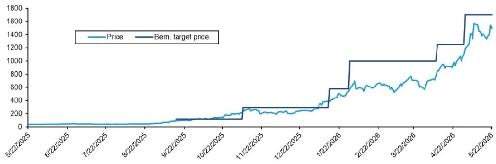

line chart

| Date       | Price | Bern. target price |
| ---------- | ----- | ----------------- |
| 5/22/2025  | 0     | 0                 |
| 6/22/2025  | 0     | 0                 |
| 7/22/2025  | 0     | 0                 |
| 8/22/2025  | 0     | 0                 |
| 9/22/2025  | 0     | 0                 |
| 10/22/2025 | 0     | 0                 |
| 11/22/2025 | 100   | 100               |
| 12/22/2025 | 150   | 150               |
| 1/22/2026  | 300   | 300               |
| 2/22/2026  | 600   | 1000              |
| 3/22/2026  | 500   | 1000              |
| 4/22/2026  | 800   | 1200              |
| 5/22/2026  | 1500  | 1800              |

STX up 621% in 12 months, 183% YTD  
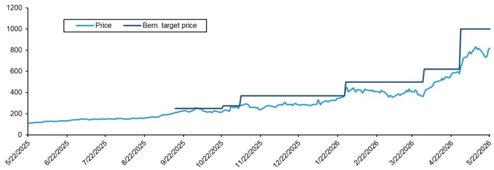

line chart

| Date       | Price | Bern. target price |
| ---------- | ----- | ------------------ |
| 5/22/2025  | 100   | -                  |
| 6/22/2025  | 120   | -                  |
| 7/22/2025  | 130   | -                  |
| 8/22/2025  | 140   | -                  |
| 9/22/2025  | 150   | 250                |
| 10/22/2025 | 160   | 260                |
| 11/22/2025 | 170   | 380                |
| 12/22/2025 | 180   | 380                |
| 1/22/2026  | 190   | 500                |
| 2/22/2026  | 200   | 500                |
| 3/22/2026  | 210   | 600                |
| 4/22/2026  | 220   | 600                |
| 5/22/2026  | 800   | 1000               |

BERNSTEIN | SG GROUP Source: Bloomberg, Bernstein

| 3

Source: Bloomberg, Bernstein

At the heart of AI is data, and that data resides in memory and storage. The hierarchy runs from SRAM at the top, which resides on GPUs and CPUs, down through HBM, DRAM, NAND, HDD, and tape at the bottom. As you move up the stack, performance increases but cost rises. As you move down the stack, performance declines but cost falls.

## EXHIBIT 3: Memory/Storage Hierarchy for AI

At the heart of AI is data, which resides in Memory and Storage  
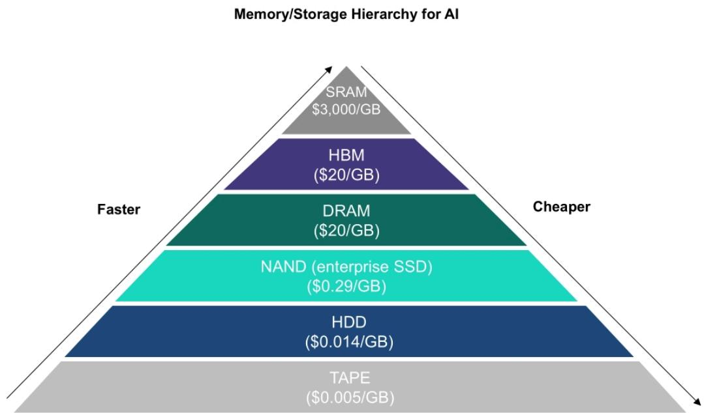

pyramid chart

| Technology | Value     |
| ---------- | --------- |
| SRAM       | $3,000/GB |
| HBM        | ($20/GB)  |
| DRAM       | ($20/GB)  |
| NAND (enterprise SSD) | ($0.29/GB) |
| HDD        | ($0.014/GB) |
| TAPE       | ($0.005/GB) |

Source: Company reports, DRAMeXchange, Trendforce, Bernstein estimates & analysis

BERNSTEIN | SG GROUP

| 4

Source: Company reports, DRAMeXchange, Trendforce, Bernstein estimates & analysis

AI is driving a large and unprecedented demand surge across all forms of memory and storage. As workloads evolve from training and basic chatbot inference to advanced inference and agentic AI, memory and storage requirements change as well. High Bandwidth Memory (HBM) and Conventional DRAM were the early beneficiaries, but NAND and HDD also benefit more as AI workloads become more advanced.

EXHIBIT 4: AI Demand for Memory & Storage  
AI is driving unprecedented demand surge in Memory & Storage  
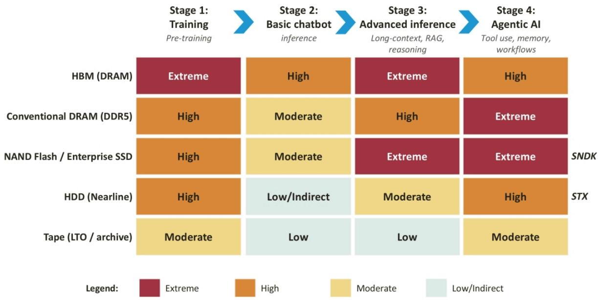

heatmap

| Category | Stage 1: Training Pre-training | Stage 2: Basic chatbot inference | Stage 3: Advanced inference Long-context, RAG, reasoning | Stage 4: Agentic AI Tool use, memory, workflows |
|---|---|---|---|---|
| HBM (DRAM) | Extreme | High | Extreme | High |
| Conventional DRAM (DDR5) | High | Moderate | High | Extreme |
| NAND Flash / Enterprise SSD | High | Moderate | Extreme | Extreme |
| HDD (Nearline) | High | Low/Indirect | Moderate | High |
| Tape (LTO / archive) | Moderate | Low | Low | Moderate |
Legend: Extreme, High, Moderate, Low/Indirect

Source: Trendforce, Company reports, Bernstein estimates and analysis

BERNSTEIN | SG GROUP

| 5

Source: Trendforce, Company reports, Bernstein estimates and analysis

This demand surge is leading data center customers to dominate demand across the major memory and storage categories. What is different this time is that hyperscalers building AI data centers are far less price sensitive than historical end customers. That dynamic has helped drive pricing up 3x to 4x over roughly the past six months.

EXHIBIT 5: Data Center Mix for NAND, DRAM, and HDD

## Less price sensitive Data Center customers now dominate demand

NAND  
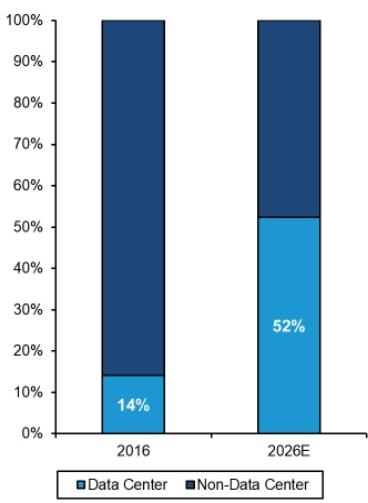

stacked bar chart

| Year | Data Center (%) | Non-Data Center (%) |
|---|---|---|
| 2016 | 14 | 87 |
| 2026E | 52 | 48 |

DRAM  
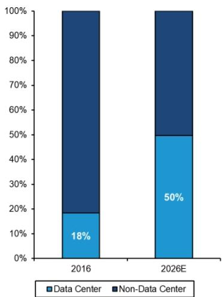

stacked bar chart

| Year | Data Center (%) | Non-Data Center (%) |
|---|---|---|
| 2016 | 18 | 75 |
| 2026E | 50 | 45 |

HDD  
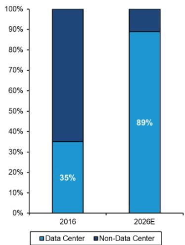

stacked bar chart

| Year | Data Center (%) | Non-Data Center (%) |
|---|---|---|
| 2016 | 35 | 64 |
| 2026E | 89 | 17 |

Source: Company reports, IDC, DRAMeXchange, Trendforce, Bernstein estimates & analysis

BERNSTEIN | SG GROUP

| 6

Source: Company reports, IDC, DRAMeXchange, Trendforce, Bernstein estimates & analysis

Is the New Memory Paradigm back? We first wrote about the New Memory Paradigm in our 2013 Blackbook and 2014 Blackbook as a structural improvement thesis for the memory industry. Much of that thesis has played out, although not without exceptions.

The New Memory Paradigm was based on diminishing returns from technology migration slowing supply growth and creating structural undersupply. In that setup, upcycles last longer and downcycles become less severe. As supply becomes harder, slower, and more expensive to add, and as industries consolidate, behavior improves and cycles show higher highs and higher lows.

EXHIBIT 6: 2013/2014 Black Book on the New Memory Paradigm

## Is the New Memory Paradigm back?

Bernstein's 2013/2014 Black Book on the New Memory Paradigm

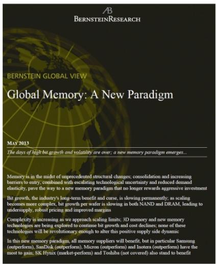

text_image

Bernstein
BERNSTEIN GLOBAL VIEW
Global Memory: A New Paradigm
MAY 2013
The days of high but growth and volatility are over; a new memory paradigm emerges...
Memory is in the midst of unprecedented structural changes: consolidation and increasing barriers to entry, combined with escalating technological uncertainty and reduced demand elasticity, pave the way to a new memory paradigm that no longer rewards aggressive investment
Bit growth, the industry's long-term benefit and curse, is slowing permanently; as scaling becomes more complex, bit growth per wafer is slowing in both NAND and DRAM, leading to undersupply, robust pricing and improved margins
Complexity is increasing as we approach scaling limits; 3D memory and new memory technologies are being explored to continue bit growth and cost declines; none of these technologies will be revolutionary enough to alter this positive supply side dynamic
In this new memory paradigm, all memory suppliers will benefit, but in particular Samsung (outperform), SanDisk (outperform), Micron (outperform) and Inotera (outperform) have the most to gain; SK Hynix (market-perform) and Toshiba (not covered) also stand to benefit

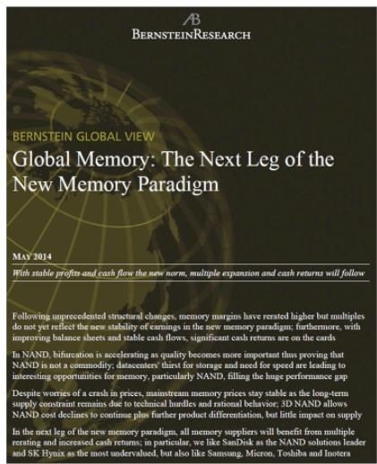

text_image

BERNSTEIN GLOBAL VIEW
Global Memory: The Next Leg of the New Memory Paradigm
MAY 2014
With stable profits and cash flow the new norm, multiple expansion and cash returns will follow
Following unprecedented structural changes, memory margins have rented higher but multiples do not yet reflect the new stability of earnings in the new memory paradigm; furthermore, with improving balance sheets and stable cash flows, significant cash returns are on the cards
In NAND, bifurcation is accelerating as quality becomes more important thus proving that NAND is not a commodity; datacenters' thirst for storage and need for speed are lending to interesting opportunities for memory, particularly NAND, filling the huge performance gap
Despite worries of a crash in prices, mainstream memory prices stay stable as the long-term supply constraint remains due to technical hurdles and rational behavior; 3D NAND allows NAND cost declines to continue plus further product differentiation, but little impact on supply
In the next leg of the new memory paradigm, all memory suppliers will benefit from multiple renting and increased cash returns, in particular, we like SmfDisk as the NAND solutions leader and SK Hynix as the most undervalued, but also like Samsung, Micron, Toshiba and Inotera

Source: Bernstein

BERNSTEIN | SG GROUP

| 7

Source: Bernstein

## The New Memory Paradigm: Diminishing returns from tech migration driving structural undersupply

DRAM Structural Supply Growth vs. Demand Growth in the 2013 New Memory Paradigm Blackbook  
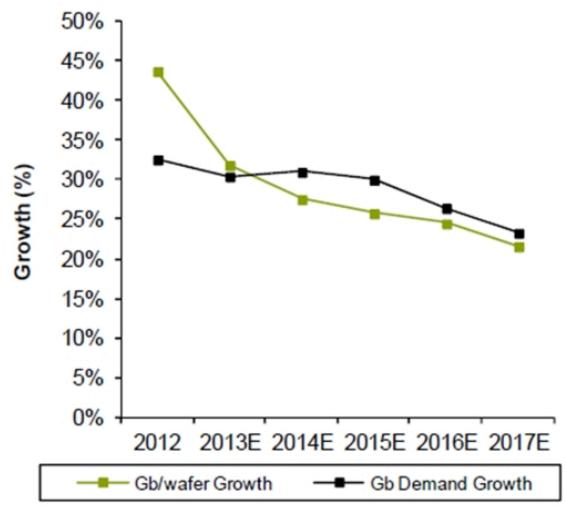

line chart

| Year | Gb/wafer Growth (%) | Gb Demand Growth (%) |
|---|---|---|
| 2012 | 43.5 | 32.5 |
| 2013E | 31.8 | 30.5 |
| 2014E | 27.5 | 31.0 |
| 2015E | 25.5 | 30.0 |
| 2016E | 24.5 | 26.5 |
| 2017E | 21.5 | 23.0 |

NAND Structural Supply Growth vs. Demand Growth in the 2013 New Memory Paradigm Blackbook  
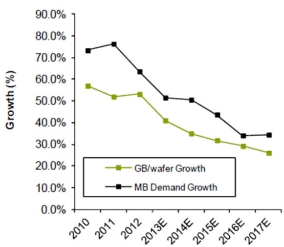

line chart

| Year   | GB/wafer Growth | MB Demand Growth |
| ------ | --------------- | ---------------- |
| 2010   | 57.0%           | 74.0%            |
| 2011   | 52.0%           | 77.0%            |
| 2012   | 53.0%           | 64.0%            |
| 2013E  | 41.0%           | 52.0%            |
| 2014E  | 35.0%           | 51.0%            |
| 2015E  | 32.0%           | 44.0%            |
| 2016E  | 29.0%           | 34.0%            |
| 2017E  | 26.0%           | 34.0%            |

Source: Company reports, DRAMeXchange, Trendforce, Bernstein estimates & analysis

BERNSTEIN | SG GROUP

| 8

Source: Company reports, DRAMeXchange, Trendforce, Bernstein estimates & analysis

This has largely played out as expected in DRAM. Supply growth from technology migration, measured here by GB per fab growth, has continued to decline and has remained well below demand growth. That has made it more difficult and more time-consuming for supply to catch up in upcycles, while also reducing the severity of downcycles.

## EXHIBIT 8: DRAM Structural Supply Growth vs. Demand Growth today

## Technology driven supply constraint has played out in DRAM

DRAM Structural Supply Growth vs. Demand Growth today

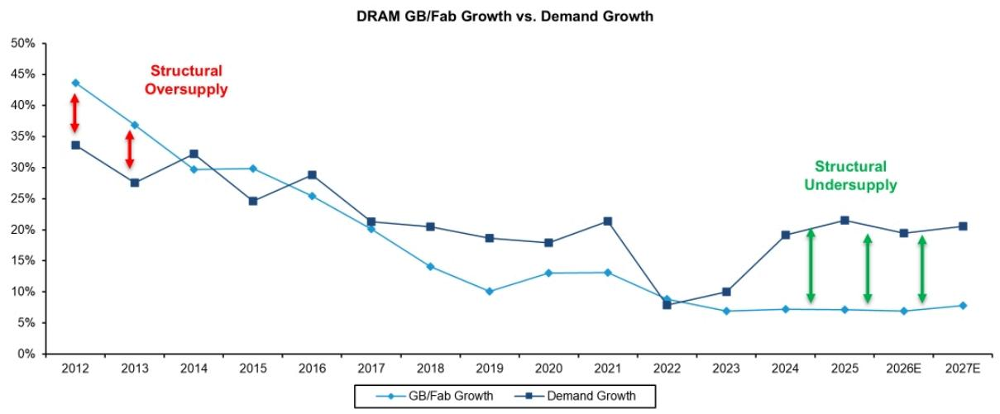

line chart

| Year | GB/Fab Growth (%) | Demand Growth (%) |
| --- | --- | --- |
| 2012 | 43.5 | 33.5 |
| 2013 | 36.8 | 27.5 |
| 2014 | 29.8 | 32.2 |
| 2015 | 29.8 | 24.7 |
| 2016 | 25.5 | 28.9 |
| 2017 | 20.5 | 21.4 |
| 2018 | 14.0 | 20.5 |
| 2019 | 10.0 | 18.6 |
| 2020 | 13.0 | 17.8 |
| 2021 | 13.0 | 21.6 |
| 2022 | 8.5 | 7.8 |
| 2023 | 6.5 | 10.0 |
| 2024 | 6.8 | 19.3 |
| 2025 | 6.8 | 21.7 |
| 2026E | 6.5 | 19.5 |
| 2027E | 7.5 | 20.7 |

Source: Company reports, DRAMeXchange, Bernstein estimates & analysis

BERNSTEIN | SG GROUP

| 9

Source: Company reports, DRAMeXchange, Bernstein estimates & analysis

DRAM and HDD have also become highly concentrated industries, which has supported better behavior overall. NAND is a younger industry and has not consolidated to the same extent, but it is still relatively concentrated.

EXHIBIT 9: Industry Concentration Across Memory/Storage Segments

## Memory/Storage segments have consolidated: HDD is the highest concentration, followed by DRAM and NAND

HHI Index – measurement of industry concentration  
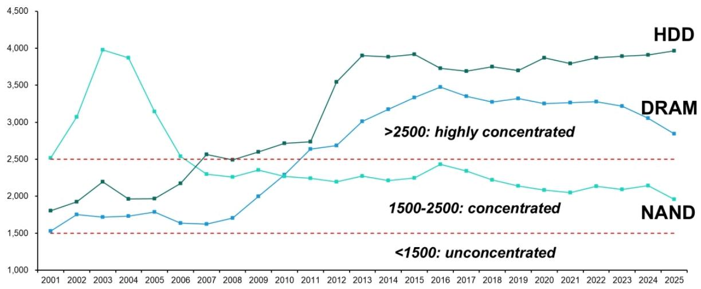

line chart

| Year | HDD | DRAM | NAND |
|---|---|---|---|
| 2001 | 1800 | 1500 | 2500 |
| 2002 | 1900 | 1700 | 3100 |
| 2003 | 2200 | 1700 | 4000 |
| 2004 | 1950 | 1750 | 3900 |
| 2005 | 1950 | 1800 | 3150 |
| 2006 | 2200 | 1650 | 2550 |
| 2007 | 2550 | 1650 | 2300 |
| 2008 | 2450 | 1700 | 2250 |
| 2009 | 2600 | 2000 | 2350 |
| 2010 | 2700 | 2300 | 2250 |
| 2011 | 2750 | 2650 | 2250 |
| 2012 | 3550 | 2700 | 2200 |
| 2013 | 3950 | 3050 | 2300 |
| 2014 | 3950 | 3200 | 2250 |
| 2015 | 3950 | 3350 | 2250 |
| 2016 | 3750 | 3480 | 2450 |
| 2017 | 3700 | 3350 | 2350 |
| 2018 | 3750 | 3300 | 2250 |
| 2019 | 3700 | 3350 | 2150 |
| 2020 | 3900 | 3280 | 2100 |
| 2021 | 3850 | 3300 | 2050 |
| 2022 | 3900 | 3320 | 2150 |
| 2023 | 3920 | 3250 | 2125 |
| 2024 | 3950 | 3150 | 2175 |
| 2025 | 4000 | 2850 | 1950 |
The chart includes annotations: '150-250: concentrated' and 'highly concentrated', and a dashed red line at ~2550.

Source: Company reports, IDC, DRAMeXchange, Trendforce, Bernstein estimates & analysis

BERNSTEIN | SG GROUP

| 10

Source: Source: Company reports, IDC, DRAMeXchange, Trendforce, Bernstein estimates & analysis

This has led to higher highs and higher lows in DRAM profitability. The COVID cycle was an exception and should be viewed as a highly unusual period.

EXHIBIT 10: DRAM Gross Margin

DRAM: Higher highs and Higher lows should continue  
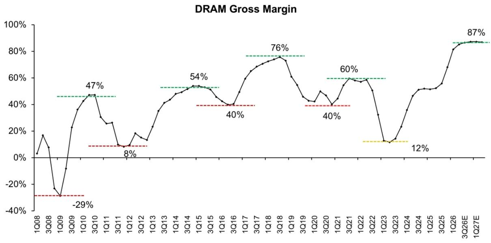

line chart

| Quarter | Gross Margin |
| ------- | ------------ |
| 1Q08    | 0%           |
| 3Q08    | 18%          |
| 1Q09    | -29%         |
| 3Q09    | -29%         |
| 1Q10    | 47%          |
| 3Q10    | 47%          |
| 1Q11    | 8%           |
| 3Q11    | 8%           |
| 1Q12    | 8%           |
| 3Q12    | 8%           |
| 1Q13    | 8%           |
| 3Q13    | 8%           |
| 1Q14    | 8%           |
| 3Q14    | 8%           |
| 1Q15    | 8%           |
| 3Q15    | 8%           |
| 1Q16    | 8%           |
| 3Q16    | 8%           |
| 1Q17    | 8%           |
| 3Q17    | 8%           |
| 1Q18    | 8%           |
| 3Q18    | 8%           |
| 1Q19    | 8%           |
| 3Q19    | 8%           |
| 1Q20    | 8%           |
| 3Q20    | 8%           |
| 1Q21    | 8%           |
| 3Q21    | 8%           |
| 1Q22    | 8%           |
| 3Q22    | 8%           |
| 1Q23    | 8%           |
| 3Q23    | 8%           |
| 1Q24    | 8%           |
| 3Q24    | 8%           |
| 1Q25    | 8%           |
| 3Q25    | 8%           |
| 1Q26    | 8%           |
| 3Q26E   | 87%          |
| 1Q27E   | 87%          |

Source: Company reports, DRAMeXchange, Trendforce, Bernstein estimates & analysis

BERNSTEIN | SG GROUP

| 11

Source: Company reports, DRAMeXchange, Trendforce, Bernstein estimates & analysis

In NAND, the structural supply constraint thesis was delayed by the 3D NAND supply expansion. Planar NAND had followed a pattern similar to DRAM, with GB per fab growth falling sharply as planar NAND approached its technical limits. The transition to 3D NAND created a one-time step-up in GB per wafer and GB per fab. However, 3D NAND is now also beginning to face diminishing returns.

EXHIBIT 11: NAND Structural Supply Growth vs. Demand Growth today

# 3D NAND adoption led to an explosion of NAND supply – this is now finally reaching diminishing returns

NAND Structural Supply Growth vs. Demand Growth today

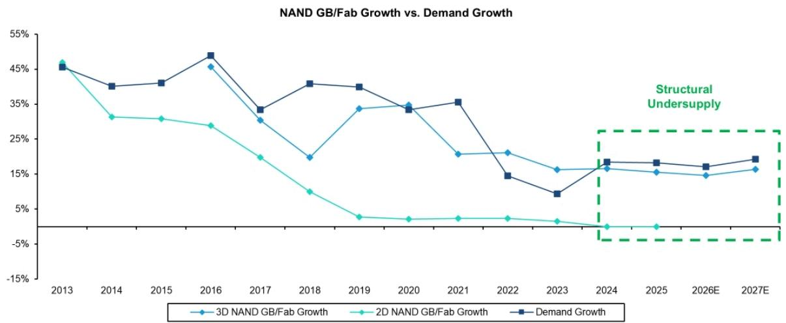

line chart

NAND GB/Fab Growth vs. Demand Growth
| Year | 3D NAND GB/Fab Growth (%) | 2D NAND GB/Fab Growth (%) | Demand Growth (%) |
|---|---|---|---|
| 2013 | 45.0 | 46.0 | 45.0 |
| 2014 | 38.0 | 29.0 | 38.0 |
| 2015 | 38.0 | 29.0 | 38.0 |
| 2016 | 45.0 | 27.0 | 46.0 |
| 2017 | 29.0 | 17.0 | 34.0 |
| 2018 | 17.0 | 8.0 | 38.0 |
| 2019 | 34.0 | 4.0 | 38.0 |
| 2020 | 34.0 | 3.0 | 34.0 |
| 2021 | 18.0 | 3.0 | 36.0 |
| 2022 | 18.0 | 3.0 | 15.0 |
| 2023 | 15.0 | -3.0 | 7.0 |
| 2024 | 16.0 | -4.0 | 17.0 |
| 2025 | 15.0 | -4.0 | 17.0 |
| 2026E | 15.0 | -4.0 | 16.0 |
| 2027E | 16.0 | -4.0 | 17.0 |
Structural Undersupply

Source: Company reports, DRAMeXchange, Trendforce, Bernstein estimates & analysis

BERNSTEIN | SG GROUP

| 12

Source: Company reports, DRAMeXchange, Trendforce, Bernstein estimates & analysis

That should lead to structurally higher profitability in NAND, similar to DRAM, with higher highs and higher lows over time. We still expect cyclicality, but as seen in DRAM, upcycles should be stronger and downcycles less severe because adding meaningful supply is increasingly difficult and time-consuming.

## EXHIBIT 12: NAND Industry Gross Margin

## NAND: Return of the New Memory Paradigm should signal higher highs and higher lows going forward

NAND Industry Gross Margin  
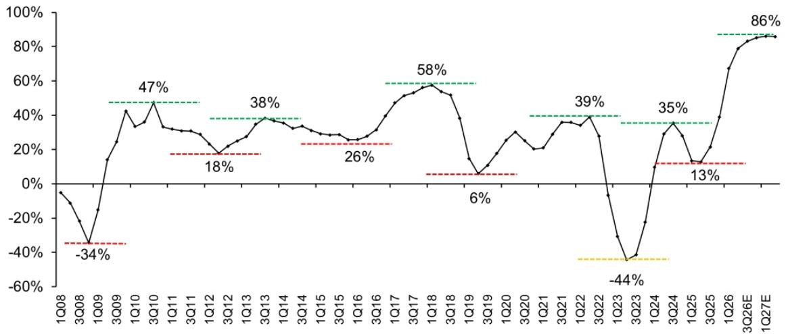

line chart

| Quarter | Value (%) |
|---|---|
| 1Q08 | -2 |
| 3Q08 | -34 |
| 1Q09 | -34 |
| 3Q09 | 15 |
| 1Q10 | 42 |
| 3Q10 | 47 |
| 1Q11 | 32 |
| 3Q11 | 30 |
| 1Q12 | 28 |
| 3Q12 | 18 |
| 1Q13 | 25 |
| 3Q13 | 38 |
| 1Q14 | 35 |
| 3Q14 | 30 |
| 1Q15 | 26 |
| 3Q15 | 25 |
| 1Q16 | 26 |
| 3Q16 | 30 |
| 1Q17 | 45 |
| 3Q17 | 58 |
| 1Q18 | 55 |
| 3Q18 | 50 |
| 1Q19 | 6 |
| 3Q19 | 6 |
| 1Q20 | 28 |
| 3Q20 | 20 |
| 1Q21 | 35 |
| 3Q21 | 39 |
| 1Q22 | 35 |
| 3Q22 | -44 |
| 1Q23 | -44 |
| 3Q23 | -20 |
| 1Q24 | 35 |
| 3Q24 | 13 |
| 1Q25 | 13 |
| 3Q25 | 35 |
| 1Q26 | 68 |
| 3Q26E | 86 |
| 1Q27E | 86 |

Source: Company reports, DRAMeXchange, Trendforce, Bernstein estimates & analysis

BERNSTEIN | SG GROUP

| 13

Source: Company reports, DRAMeXchange, Trendforce, Bernstein estimates & analysis

NAND is also earlier in the cycle than DRAM, which suggests greater upside potential from current levels. DRAM recovery began in 2023-24, while NAND remained loss-making for many companies until the recovery that began in September 2025. As a result, DRAM capex has already increased significantly to all-time highs. NAND capex, by contrast, remains well below the previous peak reached during the 3D NAND expansion.

EXHIBIT 13: DRAM, NAND Flash Capex Spending

## NAND is earlier cycle vs. DRAM, with minimal capex response so far

Capex Spending (\$mn)  
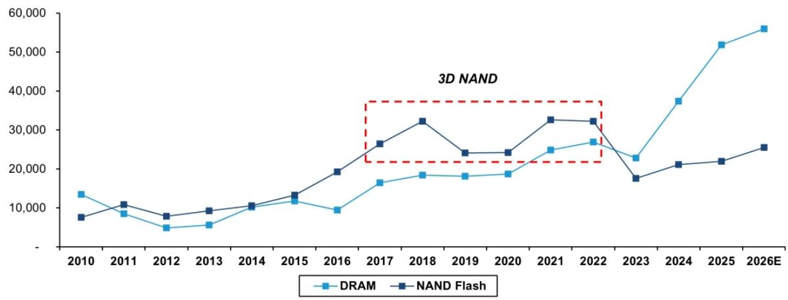

line chart

| Year | DRAM | NAND Flash |
|---|---|---|
| 2010 | 13500 | 7800 |
| 2011 | 8500 | 10800 |
| 2012 | 5200 | 8100 |
| 2013 | 6000 | 9400 |
| 2014 | 10500 | 10600 |
| 2015 | 11800 | 13200 |
| 2016 | 9700 | 19400 |
| 2017 | 16500 | 26500 |
| 2018 | 18500 | 32500 |
| 2019 | 18200 | 24200 |
| 2020 | 18700 | 24200 |
| 2021 | 24800 | 32700 |
| 2022 | 27300 | 32300 |
| 2023 | 22800 | 17400 |
| 2024 | 37500 | 21100 |
| 2025 | 51800 | 21900 |
| 2026E | 56300 | 25400 |

Source: Gartner, Bernstein estimates & analysis

BERNSTEIN | SG GROUP

| 14

Source: Gartner, Bernstein estimates & analysis

HDD is also seeing a meaningful structural change, as this is the first time in history that the industry is both consolidated and growing. Since consolidation in 2012, the HDD industry had been shrinking because of aggressive NAND cannibalization. Those headwinds are now largely exhausted, as NAND has already taken most of the PC drive and mission-critical drive markets. What remains is the business-critical, or nearline, segment, which is fundamentally a capacity market where NAND cannot compete effectively. With AI adding demand support in that segment, the HDD market is now both growing and consolidated.

EXHIBIT 14: HDD Industry Total Revenue

## HDD: Both consolidated and growing for the first time in history

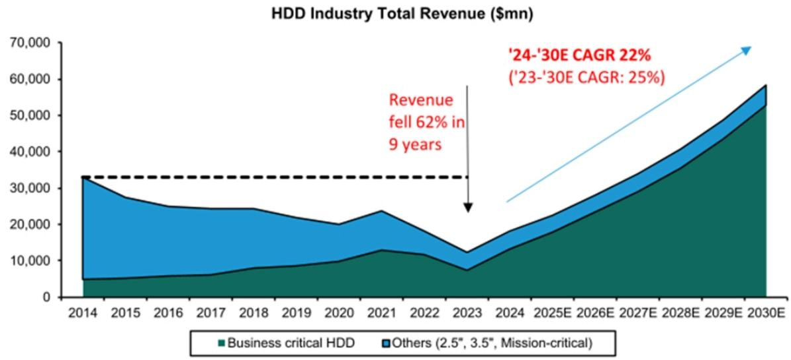

area chart

| Year   | Business critical HDD | Others (2.5", 3.5", Mission-critical) |
|--------|------------------------|------------------------------------------|
| 2014   | ~5,000                 | ~33,000                                  |
| 2015   | ~5,500                 | ~28,000                                  |
| 2016   | ~6,000                 | ~25,000                                  |
| 2017   | ~6,500                 | ~24,500                                  |
| 2018   | ~7,500                 | ~24,500                                  |
| 2019   | ~8,000                 | ~23,000                                  |
| 2020   | ~9,000                 | ~21,000                                  |
| 2021   | ~12,000                | ~24,000                                  |
| 2022   | ~11,500                | ~18,000                                  |
| 2023   | ~7,500                 | ~12,500                                  |
| 2024E  | ~14,000                | ~18,500                                  |
| 2025E  | ~17,500                | ~23,500                                  |
| 2026E  | ~21,500                | ~28,500                                  |
| 2027E  | ~26,500                | ~34,500                                  |
| 2028E  | ~31,500                | ~41,500                                  |
| 2029E  | ~37,500                | ~49,500                                  |
| 2030E  | ~44,500                | ~58,500                                  |

Source: Company reports, IDC, Gartner, Bernstein analysis and estimates

BERNSTEIN | SG GROUP

| 15

Source: Company reports, IDC, Gartner, Bernstein analysis and estimates

As a result, HDD margins should remain sustainably higher than in recent history.

EXHIBIT 15: HDD Industry Gross Margin

HDD: As a result we should also see sustainably higher margins  
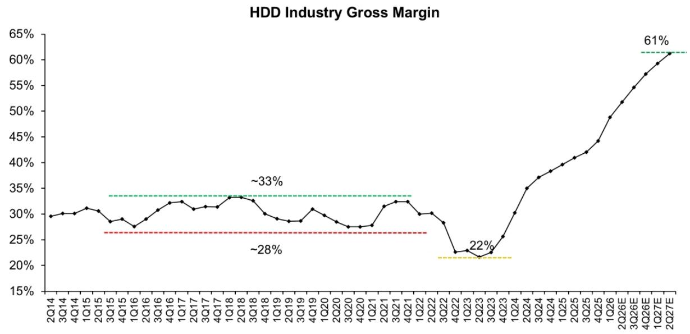

line chart

HDD Industry Gross Margin
| Quarter | Gross Margin (%) |
|---|---|
| 2Q14 | 29.5 |
| 3Q14 | 30.0 |
| 4Q14 | 30.5 |
| 1Q15 | 31.0 |
| 2Q15 | 30.0 |
| 3Q15 | 28.5 |
| 4Q15 | 29.0 |
| 1Q16 | 27.5 |
| 2Q16 | 28.5 |
| 3Q16 | 30.0 |
| 4Q16 | 32.0 |
| 1Q17 | 32.5 |
| 2Q17 | 31.0 |
| 3Q17 | 31.5 |
| 4Q17 | 31.0 |
| 1Q18 | 33.0 |
| 2Q18 | 33.5 |
| 3Q18 | 32.5 |
| 4Q18 | 30.0 |
| 1Q19 | 29.0 |
| 2Q19 | 28.5 |
| 3Q19 | 29.0 |
| 4Q19 | 30.5 |
| 1Q20 | 29.5 |
| 2Q20 | 28.5 |
| 3Q20 | 27.5 |
| 4Q20 | 27.5 |
| 1Q21 | 28.0 |
| 2Q21 | 31.0 |
| 3Q21 | 32.5 |
| 4Q21 | 32.0 |
| 1Q22 | 30.0 |
| 2Q22 | 30.0 |
| 3Q22 | 28.0 |
| 4Q22 | 22.5 |
| 1Q23 | 22.0 |
| 2Q23 | 21.5 |
| 3Q23 | 23.0 |
| 4Q23 | 25.0 |
| 1Q24 | 30.0 |
| 2Q24 | 35.0 |
| 3Q24 | 37.0 |
| 4Q24 | 38.5 |
| 1Q25 | 40.0 |
| 2Q25 | 41.5 |
| 3Q25 | 43.0 |
| 4Q25 | 44.5 |
| 1Q26 | 49.0 |
| 2Q26E | 52.0 |
| 3Q26E | 55.0 |
| 4Q26E | 58.0 |
| 1Q27E | 60.0 |
| 2Q27E | 61.0 |

Source: Company reports, IDC, Bernstein estimates & analysis

BERNSTEIN | SG GROUP

| 16

Source: Company reports, IDC, Bernstein estimates & analysis

Another positive development in memory and HDD is the increasing importance of long-term agreements. Historically, LTAs were often one-sided commitments by suppliers to guarantee volume to large customers such as Apple and Dell. Given the current shortage in memory and HDD, negotiating leverage has shifted materially back toward suppliers. New LTAs now include pricing as well as financial commitments such as prepayments and take-or-pay arrangements. Based on recent Sandisk LTAs, floor pricing in three- to five-year agreements appears to be only about 10% below recent March quarter pricing, which is constructive given that costs typically decline by around 10% per year.

EXHIBIT 16: Average Selling Price per GB

## Cyclicality should be dampened by LTA

Our calc. on LTA floor pricing suggests only $10\%$ discount to projected Jun'26 ASP

<table><tr><td>Total bits shipment ((M GB, FY 27-29)</td><td>458,849</td></tr><tr><td>% of Bits under LTA</td><td>35%</td></tr><tr><td>Bits under LTA (M GB)</td><td>160,597</td></tr><tr><td>Total LTA ($mn)</td><td>41,600</td></tr><tr><td>ASP for bits under LTA ($/GB)</td><td>$0.26</td></tr><tr><td>ASP for Jun-26 Quarter ($/GB)</td><td>$0.29</td></tr><tr><td>Delta (LTA ASP vs. Curr ASP)</td><td>-10%</td></tr></table>

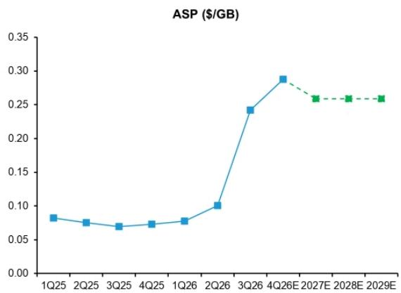

line chart

| Quarter | ASP ($/GB) |
| ------- | ---------- |
| 1Q25    | 0.08       |
| 2Q25    | 0.07       |
| 3Q25    | 0.07       |
| 4Q25    | 0.07       |
| 1Q26    | 0.08       |
| 2Q26    | 0.10       |
| 3Q26    | 0.24       |
| 4Q26E   | 0.29       |
| 2027E   | 0.26       |
| 2028E   | 0.26       |
| 2029E   | 0.26       |

Source: Company reports, Bernstein estimates and analysis

BERNSTEIN | SG GROUP

| 17

Source: Company reports, Bernstein estimates and analysis

On valuation, memory multiples remain low despite the sharp increase in memory pricing. Current multiples appear to discount an imminent collapse in profits and imply that those profits will not return. We agree that memory stocks should trade at lower multiples on close-to-peak earnings, but we also believe through-cycle earnings are expanding and that this cycle is likely to last longer and reach a higher level than previously expected. In HDD, pricing has moved only modestly so far, roughly 6% to 7% last quarter, and with more than 60% five-year EPS CAGR, there is still considerable upside from earnings growth even if multiples do not expand.

EXHIBIT 17: Memory/Storage P/FE

Memory stocks valuation suggest market priced in boom-bust  
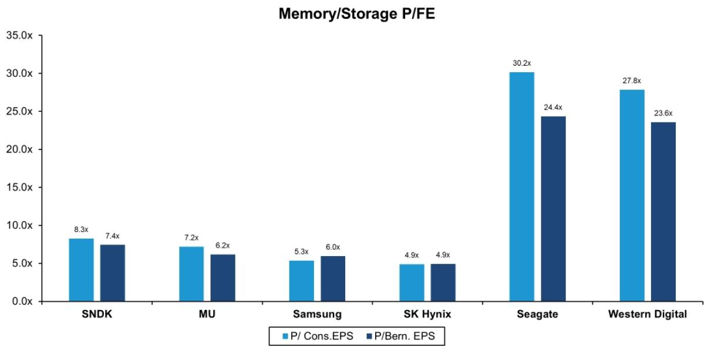

bar chart

Memory/Storage P/FE
| Company | P/ Cons.EPS (x) | P/Bern. EPS (x) |
| :--- | :--- | :--- |
| SNDK | 8.3 | 7.4 |
| MU | 7.2 | 6.2 |
| Samsung | 5.3 | 6.0 |
| SK Hynix | 4.9 | 4.9 |
| Seagate | 30.2 | 24.4 |
| Western Digital | 27.8 | 23.6 |

Source: Bloomberg (updated as of May 21), Bernstein estimates and analysis

BERNSTEIN | SG GROUP

| 18

Source: Bloomberg (updated as of May 21), Bernstein estimates and analysis

Overall, we continue to like the sector and see further upside. SNDK is our preferred short-term idea, given the significant earnings upside that remains as NAND is earlier in the cycle than DRAM. Seagate is our preferred long-term idea, supported by steadier earnings growth from both volume and pricing, as well as HAMR-driven cost declines.

## EXHIBIT 18: Global Memory & HDD Stocks

Global Memory & HDD Stocks

<table><tr><td>Company</td><td>Product</td><td>Rating</td><td>Coverage Analyst</td><td></td></tr><tr><td>Sandisk</td><td>NAND</td><td>Outperform</td><td>Mark Newman</td><td>ST top pick</td></tr><tr><td>Seagate</td><td>HDD</td><td>Outperform</td><td>Mark Newman</td><td>LT top pick</td></tr><tr><td>Western Digital</td><td>HDD</td><td>Outperform</td><td>Mark Newman</td><td></td></tr><tr><td>MU</td><td>DRAM &amp; NAND</td><td>Outperform</td><td>Mark Li</td><td></td></tr><tr><td>Samsung</td><td>DRAM &amp; NAND</td><td>Outperform</td><td>Mark Li</td><td></td></tr><tr><td>SK Hynix</td><td>DRAM &amp; NAND</td><td>Outperform</td><td>Mark Li</td><td></td></tr></table>

Source: Bernstein  
BERNSTEIN | SG GROUP  
Source: Bernstein

## I. REQUIRED DISCLOSURES

References to "Bernstein" or the "Firm" in these disclosures relate to the following entities: Bernstein Institutional Services LLC (April 1, 2024 onwards), Bernstein & Co., LLC (pre April 1, 2024), Bernstein Autonomous LLP, BSG France S.A. (April 1, 2024 onwards), Bernstein (Hong Kong) Limited 盛博香港有限公司, Bernstein (Canada) Limited, Bernstein (India) Private Limited (SEBI registration no. INH000006378), Bernstein (Singapore) Private Limited, Bernstein Japan KK (サンフォード・C・バーンスタイン株式会社) and analysts employed by SG Africa Technologies & Services to produce Bernstein under a Global Services Agreement in place between Bernstein and SG.

Bernstein is part of a joint venture between SG (SG) and AllianceBernstein, L.P. (AB). Unless specifically noted otherwise, for purposes of these disclosures, references to Bernstein's “affiliates” relate to both SG and AB and their respective affiliates.

## VALUATION METHODOLOGY

## SanDisk Corp

We value Sandisk at \$1700 on 11x our 4-year through cycle (FY26-29) EPS. This implies 8.5x our FY27 EPS.

## Seagate Technology PLC

We value Seagate at 21x our FY28 EPS of \$47.19, implying \$1,000 per share. We believe Seagate's improving fundamentals, >60% 5year EPS CAGR, and HAMR leadership easily justifies a 21x P/E, and arguably much higher.

## Western Digital Corp

We reiterate WDC Outperform, TP \$590, on 21x our FY28 EPS. PE of 21x is inline with recent market multiple and arguably conservative given its 5 year EPS CAGR of 60% (FY25-30E).

## RISKS

## SanDisk Corp

The biggest risks to the downside on Sandisk and to our price target are that: 1) Near-term numbers look high and face cyclical downside from NAND; 2) SNDK's disclosures and broader investor communications have been confusing, potentially dissuading more quality-focused investors; and 3) NAND weakness could extend beyond the current cycle and be more structural, in which case Sandisk's DCF value could be structurally lower and the impaired value of its assets may be materially below replacement cost.

## Seagate Technology PLC

The biggest risks to the downside on Seagate and to our price target are that: The HDD market is heavily exposed to hyperscale cloud, and could be impacted by a cloud capex digestion or else incremental pressure from changes in hyperscaler buying patterns. 2) WDC could close the gap in HAMR more quickly than expected, shrinking the scope for market share gain and margin improvement. 3) NAND could see better than expected technology improvement and take share from HDDs.

## Western Digital Corp

The biggest risks to the downside on WDC and to our price target are that: 1) The HDD market is heavily exposed to hyperscale cloud, and could be impacted by a cloud capex digestion or else incremental pressure from changes in hyperscaler buying patterns; 2) NAND could see better than expected technology improvement and take share from HDDs; and 3) WDC could face significant risks ahead with its HAMR technology transition which could provide a drag on gross margin and EPS.

## RATINGS DEFINITIONS, BENCHMARKS AND DISTRIBUTION

## EQUITY RATINGS DEFINITIONS

## Bernstein brand

The Bernstein brand rates stocks based on forecasts of relative performance for the next 12 months versus the S&P 500 for stocks listed on the U.S. and Canadian exchanges, versus the Bloomberg Europe Developed Markets Large and Mid Cap Price Return Index EUR (EDME) for stocks listed on the European exchanges and emerging markets exchanges outside of the Asia Pacific region, versus the Bloomberg Japan Large and Mid Cap Price Return Index USD (JPL) for stocks listed on the Japanese exchanges, and versus the Bloomberg Asia ex-Japan Large and Mid Cap Price Return Index (ASIAX) for stocks listed on the Asian (ex-Japan) exchanges -unless otherwise specified.

The Bernstein brand has three categories of ratings:

- Outperform: Stock will outpace the market index by more than 15 pp  
• Market-Perform: Stock will perform in line with the market index to within +/-15 pp  
• Underperform: Stock will trail the performance of the market index by more than 15 pp

Coverage Suspended: Coverage of a company under the Bernstein brand has been suspended. Ratings and price targets are suspended temporarily, are no longer current, and should therefore not be relied upon.

Not Rated: A rating assigned when the stock cannot be accurately valued, or the performance of the company accurately predicted, at the present time. The covering analyst may continue to publish research reports on the company to update investors on events and developments.

Not Covered (NC) denotes companies that are not under coverage.

Bernstein brand stock ratings are based on a 12-month time horizon.

## Autonomous brand – common stocks

The Autonomous brand rates common stocks as indicated below. As our benchmarks we use the Bloomberg Europe 500 Banks And Financial Services Index (BEBANKS) and Bloomberg Europe Dev Mkt Financials Large and Mid Cap Price Ret Index EUR (EDMFI) index for developed European banks and Payments, the Bloomberg Europe 500 Insurance Index (BEINSUR) for European insurers, the S&P 500 and S&P Financials for US banks and Payments coverage, S5LIFE for US Insurance, the S&P Insurance Select Industry (SPSIINS) for US Non-Life Insurers coverage, and the Bloomberg Emerging Markets Financials Large, Mid and Small Cap Price Return Index (EMLSF) for emerging market banks and insurers and Payments. Ratings are stated relative to the sector (not the market).

The Autonomous brand has three categories of common stock ratings:

- Outperform (OP): Stock will outpace the relevant index by more than 10 pp  
- Neutral (N): Stock will perform in line with the market index to within +/-10 pp  
• Underperform (UP): Stock will trail the performance of the relevant index by more than 10 pp

Coverage Suspended: Coverage of a company under the Autonomous research brand has been suspended. Ratings and price targets are suspended temporarily, are no longer current, and should therefore not be relied upon.

Not Rated: A rating assigned when the stock cannot be accurately valued, or the performance of the company accurately predicted, at the present time. The covering analyst may continue to publish research reports on the company to update investors on events and developments.

Those denoted as ‘Feature’ (e.g., Feature Outperform FOP, Feature Under Outperform FUP) are our core ideas.

Not Covered (NC) denotes companies that are not under coverage.

Autonomous brand common stock ratings are based on a 12-month time horizon.

## Autonomous brand – preferred stocks

The Autonomous brand has three categories of preferred stock ratings:

- Outperform (OP): The total return of the preferred instrument is expected to outperform preferred securities of other issuers operating in similar sectors or rating categories over the next six months.  
- Neutral (N): The total return of the preferred instrument is expected to perform in line with preferred securities of other issuers operating in similar sectors or rating categories over the next six months.  
- Underperform (UP): The total return of the preferred instrument is expected to underperform preferred securities of other issuers operating in similar sectors or rating categories over the next six months.

Autonomous preferred stock ratings are based on a 6-month time horizon.

## AUTONOMOUS CREDIT RESEARCH

Where this report contains investment recommendations for credit instruments, as defined in article 3(1)(35) of the Market Abuse Regulation, the information below is presented to comply with its disclosure requirements.

The report may also include reference(s) to published opinions by other Autonomous or Bernstein analysts covering the equity securities of the issuer(s) referenced herein. Please note an investment recommendation for credit instruments published by the author(s) of this report may differ from the published view of the analyst covering equity securities for the issuer(s) contained in this report and vice versa.

## CREDIT RATINGS DEFINITIONS

The Autonomous brand has three categories of credit ratings:

- Credit Outperform (C-OP): The total return of the Reference Credit Instrument is expected to outperform the credit spread of bonds of other issuers operating in similar sectors or rating categories over the next six months.  
- Credit Neutral (C-N): The total return of the Reference Credit Instrument is expected to perform in line with the credit spread of bonds of other issuers operating in similar sectors or rating categories over the next six months.  
- Credit Underperform (C-UP): The total return of the Reference Credit Instrument is expected to underperform the credit spread of bonds of other issuers operating in similar sectors or rating categories over the next six months.

Autonomous credit ratings are based on a 6-month time horizon.

A list of all investment recommendations produced by the author(s) of this report alongside credit ratings history are available upon request.

It is at the sole discretion of the Firm as to when to initiate, update and cease research coverage. The Firm has established, maintains and relies on information barriers to control the flow of information contained in one or more areas (i.e. the private side) within the Firm, and into other areas, units, groups or affiliates (i.e. public side) of the Firm

DISTRIBUTION OF EQUITY RATINGS/INVESTMENT BANKING SERVICES

<table><tr><td>Equity Rating</td><td>Market Abuse Regulation (MAR) and FINRA Rating Category</td><td>Global Rating Distribution</td><td>Investment Banking Relationships*</td></tr><tr><td>Outperform</td><td>BUY</td><td>51.1%</td><td>16.5%</td></tr><tr><td>Market-Perform (Bernstein Brand) Neutral (Autonomous Brand)</td><td>HOLD</td><td>36.3%</td><td>17.8%</td></tr><tr><td>Underperform</td><td>SELL</td><td>12.6%</td><td>14.9%</td></tr></table>

\* These figures represent the percentage of companies within each equity rating category for which affiliates of Bernstein have provided investment banking services within the previous 12 months.  
As of March 31, 2026. All figures are updated quarterly.

## PRICE CHARTS / RATINGS AND PRICE TARGET HISTORY

SanDisk Corp (SNDK) Rating History for Bernstein as of 06/08/2026  

line chart

| Date       | Closing Price | Price Target |
| ---------- | ------------- | ------------ |
| 09/15/2025 | $120.00       | -            |
| 11/07/2025 | $300.00       | -            |
| 01/14/2026 | $580.00       | -            |
| 01/30/2026 | $1,000.00     | -            |
| 04/09/2026 | $1,250.00     | -            |
| 04/09/2026 | $1,000.00     | -            |
| 04/09/2026 | $1,250.00     | -            |
| 05/01/2026 | $1,700.00     | -            |

Seagate Technology PLC (STX) Rating History for Bernstein as of 06/08/2026  

line chart

| Date       | Closing Price | Price Target |
| ---------- | ------------- | ------------ |
| 09/15/2025 | $250.00       | $250.00      |
| 10/23/2025 | $275.00       | $275.00      |
| 11/06/2025 | $370.00       | $370.00      |
| 01/28/2026 | $500.00       | $500.00      |
| 03/31/2026 | $620.00       | $620.00      |
| 04/29/2026 | $1,000.00     | $1,000.00    |

Western Digital Corp (WDC) Rating History for Bernstein as of 06/08/2026  

line chart

| Date       | Closing Price | Price Target |
| ---------- | ------------- | ------------ |
| 09/15/2025 | $96.00        | $96.00       |
| 10/23/2025 | $120.00       | $120.00      |
| 11/06/2025 | $170.00       | $170.00      |
| 03/31/2026 | $340.00       | $340.00      |
| 05/01/2026 | $590.00       | $590.00      |

All price target and closing price data in the chart(s) above are denominated in the currency noted in the Ticker Table of this report.

## CONFLICTS OF INTEREST

An affiliate of Bernstein has received compensation for non-investment banking securities-related products or services in the previous twelve months from the following clients: Western Digital Corp.

## OTHER MATTERS

The legal entity(ies) employing the analyst(s) listed in this report, and their location, can be determined by the country code of their phone number, as follows:

+1 Bernstein Institutional Services LLC; New York, New York, USA  
+44 Bernstein Autonomous LLP; London UK  
+212 SG Africa Technologies & Services; Casablanca, Morocco  
+33 BSG France S.A.; Paris, France  
+34 BSG France S.A.; Madrid, Spain  
+41 Bernstein Autonomous LLP; Geneva, Switzerland  
+49 BSG France S.A.; Frankfurt, Germany  
+91 Bernstein (India) Private Limited; Mumbai, India  
+852 Bernstein (Hong Kong) Limited 盛博香港有限公司; Hong Kong, China  
+65 Bernstein (Singapore) Private Limited; Singapore  
+81 Bernstein Japan KK; Tokyo, Japan

Where this report has been prepared by research analyst(s) employed by a non-US affiliate, such analyst(s), is/are (unless otherwise expressly noted below) not registered as associated persons of Bernstein Institutional Services LLC or any other SEC-registered broker-dealer and are not licensed or qualified as research analysts with FINRA. Accordingly, such analyst(s) may not be subject to FINRA's restrictions regarding (among other things) communications by research analysts with a subject company, interactions between research analysts and investment banking personnel, participation by research analysts in solicitation and marketing activities relating to investment banking transactions, public appearances by research analysts, and trading securities held by a research analyst account.

Where this report has been prepared by research analyst(s) employed by SG Africa Technologies & Services (part of the SG group of companies), it has been prepared on behalf of a Bernstein company under a Global Services Agreement in place between Bernstein and SG.

## CERTIFICATION

Each research analyst listed in this report, who is primarily responsible for the preparation of the content of this report, certifies that all of the views expressed in this publication accurately reflect that analyst's personal views about any and all of the subject securities or issuers and that no part of that analyst's compensation was, is, or will be, directly or indirectly, related to the specific recommendations or views in this publication.

## II. ADDITIONAL GLOBAL CONFLICT DISCLOSURES

It is at the sole discretion of the Firm as to when to initiate, update and cease research coverage. The Firm has established, maintains and relies on information barriers to control the flow of information contained in one or more areas (i.e., the private side) within the Firm, and into other areas, units, groups or affiliates (i.e., public side) of the Firm.

## III. OTHER IMPORTANT INFORMATION AND DISCLOSURES

Separate branding is maintained for “Bernstein” and “Autonomous” research products.

\- Bernstein produces a number of different types of research products including, among others, fundamental analysis and quantitative analysis under both the “Autonomous” and “Bernstein” brands. Recommendations contained within one type of research product may differ from recommendations contained within other types of research products, whether as a result of differing time horizons, methodologies or otherwise. Furthermore, views or recommendations within a research product issued under one brand may differ from views or recommendations under the same type of research product issued under the other brand. The Research Ratings System for the two brands and other information related to those Rating Systems are included in the previous section.

\- Autonomous operates as a separate business unit within the following entities: Bernstein Institutional Services LLC, Bernstein Autonomous LLP, Bernstein (Hong Kong) Limited 盛博香港有限公司 and Bernstein (India) Private Limited. For information relating to “Autonomous” branded products (including certain Sales materials) please visit: www.autonomous.com. For information relating to Bernstein branded products please visit: www.bernsteinresearch.com.

Analysts are compensated based on aggregate contributions to the research franchise as measured by account penetration, productivity and proactivity of investment ideas. No analysts are compensated based on performance in, or contributions to, generating investment banking revenues.

This report has been produced by an independent analyst as defined in Article 3 (1)(34)(i) of EU 596/2014 Market Abuse Regulation (“MAR”) and the same article of MAR as it forms part of United Kingdom domestic law by virtue of the European Union (Withdrawal) Act 2018.

To our readers in the United States: Bernstein Institutional Services LLC, a broker-dealer registered with the U.S. Securities and Exchange Commission (“SEC”) and a member of the U.S. Financial Industry Regulatory Authority, Inc. (“FINRA”) is distributing this publication in the United States and accepts responsibility for its contents. Where this material contains an analysis of debt product(s), such material is intended only for institutional investors and is not subject to the US independence and disclosure standards applicable to debt research prepared for retail investors.

Bernstein Institutional Services LLC may act as principal for its own account or as agent for another person (including an affiliate) in sales or purchases of any security which is a subject of this report. This report does not purport to meet the objectives or needs of any specific individuals, entities or accounts.

To our readers in Canada: If this publication pertains to a Canadian domiciled company, it is being distributed in Canada by Bernstein (Canada) Limited, which is licensed and regulated by the Canadian Investment Regulatory Organization. If the publication pertains to a non-Canadian domiciled company, it is being distributed by Bernstein Institutional Services LLC, which is licensed and regulated by both the SEC and FINRA, into Canada under the International Dealers Exemption.

This document may not be passed onto any person in Canada unless that person qualifies as "permitted client" as defined in Section 1.1 of NI 31-103.

To our readers in Brazil: This report has been prepared by Bernstein Institutional Services LLC, and Banco BTG Pactual S.A. ("BTG") is responsible for the distribution of this report in Brazil.

To readers in the United Kingdom: This publication has been issued or approved for issue in the United Kingdom by Bernstein Autonomous LLP, authorised and regulated by the Financial Conduct Authority and located at 60 London Wall, London EC2M 5SH, +44 (0)20-7170-5000. Registered in England & Wales No OC343985.

This document is for distribution only to persons who (i) have professional experience in matters relating to investments falling within Article 19(5) of the Financial Services and Markets Act 2000 (Financial Promotion) Order 2005 (as amended, the “Financial Promotion Order”), (ii) are persons falling within Article 49(2)(a) to (d) (“high net worth companies, unincorporated associations, etc.”) of the Financial Promotion Order, (iii) are outside the United Kingdom, or (iv) are persons to whom an invitation or inducement to engage in investment activity (within the meaning of section 2.1 of the FSMA) in connection with the issue or sale of any securities may otherwise lawfully be communicated or caused to be communicated (all such persons together being referred to as “relevant persons”). This document is directed only at relevant persons and must not be acted on or relied on by persons who are not relevant persons. Any investment or investment activity to which this document relates is available only to relevant persons and will be engaged in only with relevant persons.

To our readers in the member states of the EEA: This publication is being distributed by BSG France SA, which is authorised and regulated by the Autorité de Contrôle Prudentiel et de Résolution (ACPR) and Autorité des Marchés Financiers (AMF).

To our readers in Hong Kong: This publication is being distributed in Hong Kong by Bernstein (Hong Kong) Limited 盛博香港有限公司, which is licensed and regulated by the Hong Kong Securities and Futures Commission (Central Entity No. AXC846) to carry out Type 4 (Advising on Securities) regulated activities and subject to the licensing conditions mentioned in the SFC Public Register (https://www.sfc.hk/publicregWeb/corp/AXC846/details)). This publication is solely for professional investors, as defined in the Securities and Futures Ordinance (Cap. 571). The purpose of this report is solely to provide an analysis of the issuers referred to in this report and is not intended for any purpose contrary to the laws of Hong Kong.

To our readers in Singapore: This publication is being distributed in Singapore by Bernstein (Singapore) Private Limited, only to accredited investors or institutional investors, as defined in the Securities and Futures Act 2001 of Singapore ("SFA"). Recipients in Singapore should contact Bernstein (Singapore) Private Limited in respect of matters arising from, or in connection with, this publication. Bernstein (Singapore) Private Limited is regulated by the Monetary Authority of Singapore and licensed under the SFA as a capital markets services licence holder for dealing in capital markets products that are securities and collective investment schemes and an exempt financial adviser for advising on, issuing and promulgating analyses and reports on securities. Bernstein (Singapore) Private Limited is registered in Singapore with Company Registration No. 20213710W and located at One Raffles Quay, #27-11 South Tower, Singapore 048583, +65-6230-4612.

To our readers in the People's Republic of China: The securities referred to in this document are not being offered or sold and may not be offered or sold, directly or indirectly, in the People's Republic of China (for such purposes, not including the Hong Kong and Macau Special Administrative Regions or Taiwan, the "PRC") in contravention of any applicable laws of the PRC.

This document does not constitute an offer to sell or the solicitation of an offer to buy any securities in the PRC to any person to whom it is unlawful to make the offer or solicitation in the PRC.

We do not represent that this document may be lawfully distributed, or that any securities may be lawfully offered, in compliance with any applicable registration or other requirements in the PRC, or pursuant to an exemption available thereunder, or assume any responsibility for facilitating any such distribution or offering. In particular, no action has been taken by us which would permit a public offering of any securities or distribution of this document in the PRC. Accordingly, the securities are not being offered or sold within the PRC by means of this document or any other document. Neither this document nor any advertisement or other offering material may be distributed or published in the PRC, except under circumstances that will result in compliance with any applicable laws and regulations.

To our readers in Japan: This publication is being distributed in Japan by Bernstein Japan KK (サンフォード・C・バーンスタイン株式会社), which is registered in Japan as a Financial Instruments Business Operator with the Kanto Local Finance Bureau (registration number: The Director-General of Kanto Local Finance Bureau (FIBO) No.3387) and regulated by the Financial Services Agency. It is also a member of Japan Investment Advisers Association. This publication is solely for qualified institutional investors in Japan only, as defined in Article 2, paragraph (3), items (i) of the Financial Instruments and Exchange Act.

For the institutional client readers in Japan who have been granted access to the Bernstein website by Daiwa Group Inc. ("Daiwa"), your access to this document should not be construed as meaning that Bernstein is providing you with investment advice for any purposes. Whilst Bernstein has prepared this document, your relationship is, and will remain with, Daiwa, and Bernstein has neither any contractual relationship with you nor any obligations towards you.

To our readers in Australia: Bernstein (Hong Kong) Limited 盛博香港有限公司 is responsible for distributing research in Australia. It is regulated by the Securities and Exchange Commission under U.S. laws, by the Financial Conduct Authority under U.K. laws, which differs from Australian laws. Bernstein (Hong Kong) Limited 盛博香港有限公司 is exempt from the requirement to hold an Australian financial services license under the Corporations Act 2001 in respect of the provision of the following financial services to wholesale clients:

• providing financial product advice;  
• dealing in a financial product;  
• making a market for a financial product; and  
• providing a custodial or depository service.

To our readers in India: This publication is being distributed in India by Bernstein (India) Private Limited (SCB India) which is licensed and regulated by Securities and Exchange Board of India ("SEBI") as a research analyst entity under the SEBI (Research Analyst) Regulations, 2014, having registration no. INH000006378 and as a stock broker having registration no. INZ000213537. SCB India is currently engaged in the business of providing research and stock broking services. Please refer to www.bernsteinresearch.in for more information.

- SCB India is a Private limited company incorporated under the Companies Act, 2013, on April 12, 2017 bearing corporate identification number U65999MH2017FTC293762, and registered office at Level 3A, 4th Floor, First International Financial Centre, Plot Nos C-54 and C-55, G Block, Near CBI Office, Bandra Kurla Complex, Bandra (East), Mumbai 400098, Maharashtra, India (Phone No: +91-22-68421401).  
- For details of Associates (i.e., affiliates/group companies) of SCB India, kindly email MUM-BERNSTEIN-InCompliance@bernsteinsg.com.  
• SCB India does not have any disciplinary history as on the date of this report.  
- Except as noted above, SCB India and/or its Associates (i.e., affiliates/group companies), the Research Analysts authoring this report, and their relatives

• do not have any financial interest in the subject company  
• do not have actual/beneficial ownership of one percent or more in securities of the subject company;  
• is not engaged in any investment banking activities for Indian companies, as such;  
• have not managed or co-managed a public offering in the past twelve months for any Indian companies;  
- have not received any compensation for investment banking services or merchant banking services from the subject company in the past 12 months;  
• have not received compensation for brokerage services from the subject company in the past twelve months;  
- have not received any compensation or other benefits from the subject company or third party related to the specific recommendations or views in this report; and  
- do not currently, but may in the future, act as a market maker in the financial instruments of the companies covered in the report.  
- do not have any conflict of interest in the subject company as of the date of this report.

- Except as noted above, the subject company has not been a client of SCB India during twelve months preceding the date of distribution of this research report. Neither SCB India nor its Associates (i.e., affiliates/group companies) have received compensation for products or services other than investment banking, merchant banking or brokerage services from the subject company in the past twelve months.  
- The principal research analyst(s) who prepared this report, members of the analysts' team, and members of their households are not an officer, director, employee or advisory board member of the companies covered in the report.  
- Our Compliance officer / Grievance officer is Ms. Rupal Talati, who can be reached at +91-22-68421451, or MUM-BERNSTEIN-InCompliance@bernsteinsg.com / Scbin-investorgrievance@bernsteinsg.com  
- The Research investor charter and Terms & Conditions of SCB India are available on its website and may be accessed at Bernstein (India) Private Limited (https://bernsteinresearch.in/) for your reference.  
- Disclaimer: Registration granted by SEBI, and certification from NISM, is in no way a guarantee of performance of the intermediary or provide any assurance of returns to investors. Investments in securities market are subject to market risks. Read all the related documents carefully before investing.

To our readers in Switzerland: This document is provided in Switzerland by or through Bernstein Autonomous LLP, and is provided only to qualified investors as defined in article 10 of the Swiss Collective Investment Scheme Act (“CISA”) and related provisions of the Collective Investment Scheme Ordinance and in strict compliance with applicable Swiss law and regulations. The products mentioned in this document may not be suitable for all types of investors. This document is based on the Directives on the Independence of Financial Research issued by the Swiss Bankers Association (SBA) in January 2008.

To our readers in the Middle East: Bernstein Autonomous LLP, DIFC branch has its principal office at Gate Village 06, DIFC, Dubai, UAE. Bernstein Autonomous LLP, DIFC branch is regulated by the Dubai Financial Services Authority (DFSA) with the registration number CL10040 and is provisioned for Arranging Deals in Investments and Advising on Financial Products. All communications and services are directed at Professional Clients and Market Counterparties only (as defined in the DFSA rulebook). Persons other than Professional Clients and Market Counterparties, such as Retail Clients, are not the intended recipients of our communications or services.

## LEGAL

All research publications are disseminated to our clients through posting on the firm's password protected websites, bernsteinresearch.com and autonomous.com. Certain, but not all, research publications are also made available to clients through third-party vendors or redistributed to clients through alternate electronic means as a convenience.

This publication has been published and distributed in accordance with the Firm's policy for management of conflicts of interest in investment research, a copy of which is available from Bernstein Institutional Services LLC, Director of Compliance, 245 Park

Avenue, New York, NY 10167. Additional disclosures and information regarding Bernstein's business are available on our website www.bernsteinresearch.com.

The securities described herein may not be eligible for sale in all jurisdictions or to certain categories of investors where that permission profile is not consistent with the licenses held by the entities noted herein. This document is for distribution only as may be permitted by law. This publication is not directed to, or intended for distribution to or use by, any person or entity who is a citizen or resident of, or located in any locality, state, country or other jurisdiction where such distribution, publication, availability or use would be contrary to law or regulation or which would subject any of the entities referenced herein or any of their subsidiaries or affiliates to any registration or licensing requirement within such jurisdiction. This publication is based upon public sources we believe to be reliable, but no representation is made by us that the publication is accurate or complete. We do not undertake to advise you of any change in the reported information or in the opinions herein. This publication was prepared and issued by entity referred to herein for distribution to eligible counterparties or professional clients. This publication is not an offer to buy or sell any security, and it does not constitute investment, legal or tax advice. The investments referred to herein may not be suitable for you. Investors must make their own investment decisions in consultation with their professional advisors in light of their specific circumstances. The value of investments may fluctuate, and investments that are denominated in foreign currencies may fluctuate in value as a result of exposure to exchange rate movements. Information about past performance of an investment is not necessarily a guide to, indicator of, or assurance of, future performance.

This report is directed to and intended only for our clients who are “eligible counterparties”, “professional clients”, “institutional investors” and/or “professional investors” as defined by the aforementioned regulators, and must not be redistributed to retail clients as defined by the aforementioned regulators. Retail clients who receive this report should note that the services of the entities noted herein are not available to them and should not rely on the material herein to make an investment decision. The result of such act will not hold the entities noted herein liable for any loss thus incurred as the entities noted herein are not registered/ authorised/ licensed to deal with retail clients and will not enter into any contractual agreement/arrangement with retail clients. This report is provided subject to the terms and conditions of any agreement that the clients may have entered into with the entities noted herein. All research reports are disseminated on a simultaneous basis to eligible clients through electronic publication to our client portal.

The information in this report was prepared by Bernstein solely for the internal business use of our clients. Clients may store, display, analyze, reformat and print the information in this report for this limited use only. Clients may not copy, alter, create derivative works, resell, reverse engineer, commercially exploit, share or distribute any part of the information contained herein for any purpose without Bernstein's express written consent. These restrictions include extracting data or using the content to develop indices or other products. Further, you may not use this report, or any portion of this report, to train or finetune any third-party machine learning or artificial intelligence system, or as a prompt or input into any such system. You also may not, without Bernstein's express written consent, do any of the foregoing in connection with your own internal machine learning or artificial intelligence system.

Bernstein may use artificial intelligence tools in the preparation of its materials. Any such materials are reviewed by Bernstein's research analysts prior to publication.

This report has been prepared for information purposes only and is based on current public information that we consider reliable, but the entities noted herein do not warrant or represent (express or implied) as to the sources of information or data contained herein are accurate, complete, not misleading or as to its fitness for the purpose intended even though the entities noted herein rely on reputable or trustworthy data providers, it should not be relied upon as such. Opinions expressed are the author(s)' current opinions as of the date appearing on the material only and we do not undertake to advise you of any change in the reported information or in the opinions herein.

Any references to SG herein are purely factual, based upon publicly available information, and included for comparative purposes only. They do not constitute an opinion or recommendation with respect to the securities of SG.

This publication was prepared and issued by the entity referred to herein for distribution to eligible counterparties or professional clients. The information in this report is intended for general circulation and does not constitute an offer to buy or sell any security, investment, legal or tax advice nor a personal recommendation, as defined by any of the aforementioned regulators. It does not take into account the particular investment objectives, financial situations, or needs of individual investors. The report has not been reviewed by any of the aforementioned regulators and does not represent any official recommendation from the aforementioned regulators. The investments referred to herein may not be suitable for you. Investors must make their own investment decisions in consultation with advice sought from a financial adviser regarding the suitability of the investment product, taking into account the specific investment objectives, financial situation or particular needs of any recipient of the recommendation, before the recipient makes a commitment to purchase the investment product.

The analysis contained herein is based on numerous assumptions. Different assumptions could result in materially different results. The information in this report does not constitute, or form part of, any offer to sell or issue, or any offer to purchase or subscribe for shares, or to induce engage in any other investment activity. The value of any securities or financial instruments mentioned in this report may fluctuate subject to market conditions. Information about past performance of an investment is not necessarily a guide to, indicative of, or assurance of future performance. Estimates of future performance mentioned by the research analyst in this report are based on assumptions that may not be realized due to unforeseen factors like market volatility/fluctuation. In relation to securities or financial instruments denominated in a foreign currency other than the clients' home currency, movements in exchange rates will have an effect on the value, either favorable or unfavorable. Before acting on any recommendations in this report, recipients should consider the appropriateness of investing in the subject securities or financial instruments mentioned in this report and, if necessary, seek for independent professional advice.

The securities described herein may not be eligible for sale in all jurisdictions or to certain categories of investors where that permission profile is not consistent with the licenses held by the entities noted herein. This document is for distribution only as may be permitted by law. It is not directed to, or intended for distribution to or use by, any person or entity who is a citizen or resident of or located in any locality, state, country or other jurisdiction where such distribution, publication, availability or use would be contrary to law or regulation or would subject the entities noted herein to any regulation or licensing requirement within such jurisdiction.

Source: Bloomberg Index Services Limited. BLOOMBERG® is a trademark and service mark of Bloomberg Finance L.P. and its affiliates (collectively “Bloomberg”). Bloomberg or Bloomberg’s licensors own all proprietary rights in the Bloomberg Indices. Neither Bloomberg nor Bloomberg’s licensors approves or endorses this material, or guarantees the accuracy or completeness of any information herein, or makes any warranty, express or implied, as to the results to be obtained therefrom and, to the maximum extent allowed by law, neither shall have any liability or responsibility for injury or damages arising in connection therewith.

No part of this material may be reproduced, distributed or transmitted or otherwise made available without prior consent of the entities noted herein. Copyright Bernstein Institutional Services LLC Bernstein Autonomous LLP, BSG France S.A., Bernstein (Hong Kong) Limited 盛博香港有限公司, Bernstein (Canada) Limited, Bernstein (India) Private Limited (SEBI registration no. INH000006378), Bernstein (Singapore) Private Limited and Bernstein Japan KK (サンフォード・C・バーンスタイン株式会社). All rights reserved. The trademarks and service marks contained herein are the property of their respective owners. Any unauthorized use or disclosure is strictly prohibited. The entities noted herein may pursue legal action if the unauthorized use results in any defamation and/or reputational risk to the entities noted herein and research published under the Bernstein and Autonomous brands.