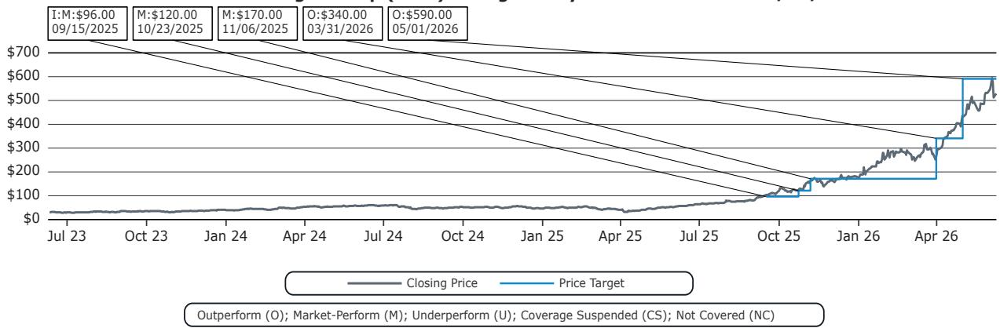
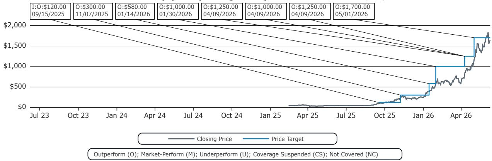
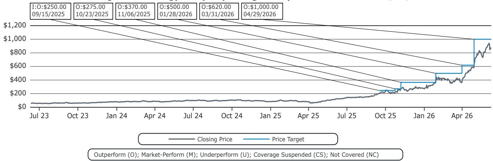

# Bernstein：存储行业的结构性重定价远未完成，真正的机会在NAND和HDD的后半场

当一家公司股价在12个月内上涨近4000%，绝大多数投资者的第一反应是“太贵了”。但Bernstein在最近的第42届战略决策会议上，恰恰把这家公司——SanDisk——作为短期首选推荐。这不是追高，而是基于一个从2013年就开始论证、至今仍在展开的结构性判断：存储行业正在经历一次“新范式”的重定价，而市场目前只定价了前半段。

这份研报的核心主张是：AI正在驱动存储行业有史以来最大规模的需求浪潮，但市场对供给侧的长期结构性约束仍然定价不足。DRAM已经验证了“新范式”的逻辑，NAND正在复制它，而HDD则出现了历史上第一次“既集中又增长”的格局。这三个细分市场合在一起，意味着存储行业的周期性正在被系统性削弱，盈利中枢正在上移。

以下是我们从这份研报中提炼出的五个关键层次。

## 1. AI对存储的需求不是一条直线，而是一个逐级放大的阶梯

大多数投资者对AI存储需求的理解停留在HBM和DRAM上。这是对的，但不够。Bernstein将AI工作负载分为四个阶段：训练、基础推理、高级推理（长上下文、RAG、推理）、以及最终Agentic AI。每个阶段对存储的需求类型和强度都不同。

训练阶段对HBM的需求是“极端的”，对NAND和HDD的需求是“高的”。但到了Agentic AI阶段，HBM的需求回落至“高”，而常规DRAM、NAND和HDD的需求全部升至“极端”或“高”。这意味着，随着AI从“生成答案”进化到“执行任务”，存储需求的重心正在从最顶层的SRAM/HBM向下迁移到NAND和HDD。

这个判断的含义很直接：如果市场对存储的定价主要基于HBM和DRAM的紧缺程度，那么当NAND和HDD的需求加速时，相关公司的盈利弹性可能会超出当前预期。Bernstein对SanDisk的短期看多，核心逻辑正是NAND目前还处于周期早期，盈利上修的潜力尚未被完全计入。

## 2. 数据中心客户主导需求，改变了定价的游戏规则

存储行业历史上最痛苦的周期，往往来自消费电子需求的剧烈波动和客户的极端价格敏感。但这一次，需求结构发生了根本性变化。

Bernstein的数据显示，到2026年，数据中心在NAND、DRAM和HDD中的需求占比将分别达到52%、50%和89%。而在2016年，这三个数字分别是14%、18%和35%。更关键的是，数据中心客户——主要是超大规模云厂商——对价格敏感度远低于历史上的PC和手机厂商。

这个变化带来了一个直接后果：在过去六个月里，存储价格已经上涨了3到4倍。在传统周期中，如此剧烈的价格上涨会迅速刺激供给扩张，然后价格崩塌。但这一次，供给端受到技术瓶颈的约束，而需求端又由“不计代价买算力”的客户主导，价格在高位停留的时间可能远超历史经验。

这意味着，存储公司的盈利周期顶部可能比市场预期的更高、更持久。对投资者而言，用历史周期估值模型来给当前存储公司定价，可能系统性低估了它们的盈利中枢。

## 3. DRAM已经验证的“新范式”，NAND正在复制，但市场尚未完全定价

Bernstein在2013年和2014年的黑皮书中首次提出了“新存储范式”的概念。核心逻辑是：随着技术迁移带来的每晶圆产出增长持续放缓，供给增长将系统性低于需求增长，导致上行周期更长、下行周期更浅，盈利呈现“更高高点和更高低点”的特征。

DRAM是这一范式最完美的验证案例。从2012年到2027年，DRAM的每晶圆产出增长率从43.5%持续下降到7.5%，而需求增长率始终在15%-22%之间波动。供给增长持续低于需求增长的结果是，DRAM的上行周期越来越长，下行周期越来越温和。行业集中度也在提高，HHI指数从2001年的1500上升到目前的接近3000，进一步强化了供给纪律。

NAND的情况更复杂一些。平面NAND原本也在走DRAM的老路，但3D NAND的转型带来了一次性的每晶圆产出跃升，暂时打破了供给约束的逻辑。然而，Bernstein指出，3D NAND现在也开始面临边际收益递减。更重要的是，NAND目前比DRAM更处于周期早期——这意味着，如果DRAM的“新范式”已经让相关公司获得了估值重估，那么NAND的盈利上修空间可能更大。

SanDisk作为NAND的纯正标的，在12个月内上涨近4000%之后，Bernstein仍然给出1700美元的目标价，隐含的P/E从2025年的549倍下降到2027年的8.2倍。这个数字本身就在讲述一个故事：市场对NAND的盈利预测可能严重滞后于实际周期的演进。

## 4. HDD出现了历史上第一次“既集中又增长”的格局，这是一个未被充分讨论的变化

如果说DRAM和NAND的故事还有一定市场共识，那么HDD可能是最被忽视的结构性机会。

自2012年行业整合以来，HDD一直处于萎缩状态，因为NAND的持续侵蚀导致需求不断下降。但Bernstein认为，这种侵蚀已经基本耗尽。剩下的市场——主要是近线存储（Nearline）——本质上是一个容量市场，NAND在成本上无法与之竞争。

更关键的是，这是HDD历史上第一次同时满足两个条件：行业高度集中（HHI指数接近5000，是存储细分中最高的），且市场在增长。在过去的任何周期中，HDD要么是增长但分散的，要么是集中但萎缩的。当“集中”和“增长”同时出现，供给纪律和定价权都会显著改善。

Bernstein对Seagate的长期看好，正是基于这一判断。作为HAMR（热辅助磁记录）技术的领导者，Seagate不仅享受量价齐升，还能通过技术升级持续降低成本。在传统周期中，HDD公司的估值往往被压制，因为市场将其视为夕阳产业。但如果“既集中又增长”的格局成立，HDD的估值体系可能需要系统性重估。

## 5. 报告尚未完全回答的关键问题：长期协议能否真正改变周期？

Bernstein在报告中提到，长期协议（LTA）正在变得更有利于供应商，包括定价、预付款和照付不议条款，这些都有助于降低周期性。这是一个重要的观察，但报告没有完全展开的是：这些LTA在多大程度上是可持续的？它们是否只是周期上行阶段的产物，还是真正改变了行业的行为模式？

历史上，存储行业的长期协议往往在周期下行时被打破，客户会以各种方式重新谈判或违约。如果这一次的LTA确实更“硬”，那么存储公司的盈利稳定性将上一个台阶，估值倍数也应该随之扩张。但如果LTA的约束力被高估，那么当需求放缓时，价格下跌的速度可能比预期更快。

这个问题对投资决策至关重要。如果LTA是真实的、可持续的，那么当前存储公司的估值可能仍然偏低。如果LTA只是周期性的权宜之计，那么当前的盈利预测和估值可能已经隐含了太多乐观假设。

## 6. 投资者需要建立一个新的观察框架：从“周期拐点”转向“结构性中枢上移”

基于以上分析，我们认为投资者在评估存储行业时，需要调整自己的分析框架。传统的存储投资逻辑是“在周期底部买入，在周期顶部卖出”，核心是判断价格拐点。但“新范式”的逻辑要求投资者回答一个不同的问题：盈利的中枢水平是否已经永久性上移？

这个问题的答案取决于三个变量：供给端的技术瓶颈是否持续（DRAM已经验证，NAND正在验证，HDD需要观察）、需求端的客户结构是否稳定（数据中心占比持续上升，且价格敏感度低）、以及行业行为是否改善（集中度提高、LTA普及）。

如果这三个变量都指向正面，那么存储行业的估值体系可能从“周期股”向“成长型周期股”迁移。这意味着，即使存储价格从当前高点回落，盈利的底部也可能远高于历史水平，从而支撑更高的估值中枢。

Bernstein的报告提供了丰富的数据来支撑这一判断，但最终结论仍然需要投资者自己验证。报告中的表格和图表——尤其是DRAM和NAND的供给增长与需求增长的对比、以及各细分行业集中度的演变——值得反复推敲。这些数据背后隐含的假设是什么？如果某个假设被证伪，会如何改变结论？

这些问题，正是我们需要继续深入讨论的地方。欢迎来星球微信群里继续探讨，我们会逐页拆解这份报告的完整图表和估值模型，并讨论哪些变量最可能成为未来6-12个月的关键转折点。

---

Personal reading notes and learning share only. Not investment advice.

