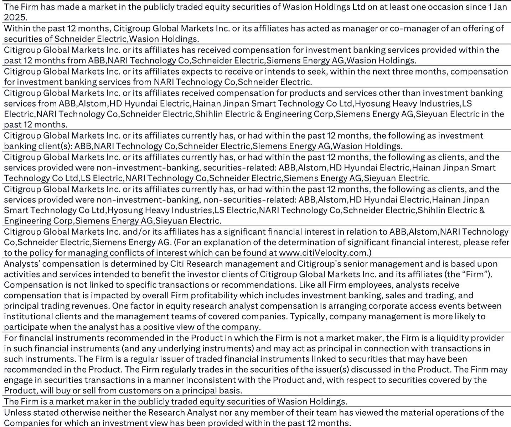
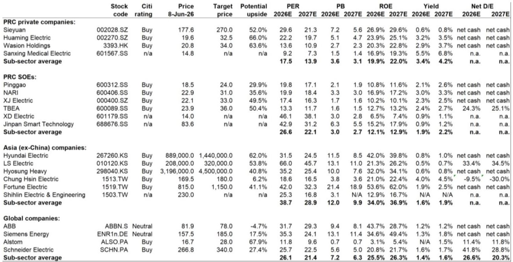
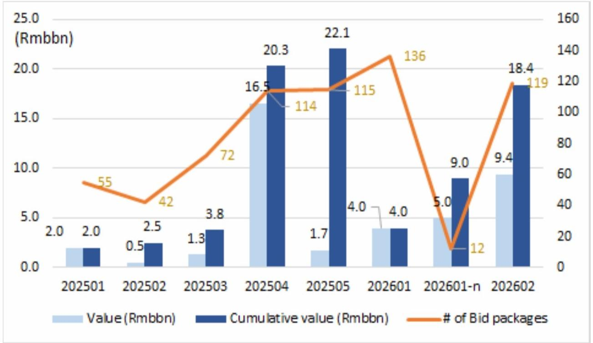

# Citi：特高压订单翻倍背后的关键信号——电网设备竞争已从“订单量”转向“议价权”

国家电网2026年第二批特高压设备招标结果出炉，总金额94亿元，是第一批的两倍有余，已接近2025年全年五批招标总额的43%。这份来自Citi研报的数据，在多数市场参与者还在关注“谁拿到了最大份额”时，揭示了一个更值得追问的结构性变化：随着招标量放大、铜价上行、交付节奏加快，这一轮电网投资的真正赢家，可能不是订单最多的企业，而是能在规模扩张中守住甚至提升毛利率的企业。

换句话说，市场对特高压板块的定价逻辑，正在从“订单驱动”切换为“盈利质量驱动”。Citi在这份研报中，通过平高、思源、特变电工三家公司的订单结构、产品交付细节和估值对比，提供了这一判断的支撑证据。

## 1. 招标金额翻倍不是线性增长，而是电网投资节奏的质变信号

2026年第二批特高压设备招标94亿元，放在历史坐标中看，意义远超数字本身。2025年全年五批合计221亿元，而2026年仅前两批就已达到184亿元。如果加上3月31日第一批的约50亿元（Citi在研报中标注了第一批为98.34亿元，但此处以正文数据为准），2026年上半年累计招标已接近去年全年。

更关键的是节奏的变化。2025年的招标集中在第四批（165亿元），呈现出“前低后高、年底集中”的特征。而2026年第二批就达到94亿元，且Citi明确指出，平高预计2026年还将有至少2个新的交流特高压项目获批，叠加2025年已获批但尚未招标的3个交流项目（达拉特-蒙西、攀枝花-西昌、浙江环网），后续招标量仍有支撑。

这意味着，电网投资不再是一次性的“脉冲式”放量，而是进入了持续高强度的建设周期。Citi在研报中援引的数据也佐证了这一点：2026年一季度全国电网资本开支同比增长40%至1675亿元，其中土建工程是主要增量——政府有意通过电网基建拉动固定资产投资，而土建支出对FAI的拉动效果快于设备采购。

所以，这一轮招标翻倍的本质，不是简单的“订单多了”，而是电网投资从“项目储备”阶段正式进入“施工高峰”阶段。设备企业的订单确认节奏、产能利用率、原材料成本传导能力，都将在这个阶段接受真正的压力测试。

## 2. 平高拿下22%份额的背后，是特高压GIS市场的寡头格局正在固化

平高以20.92亿元中标额、22.2%的份额位居第一。但比份额数字更值得关注的是产品结构：94亿元招标中，1000kV GIS（气体绝缘开关设备）占了57.4%，即54亿元。平高的核心竞争力恰好集中在这一产品线。

Citi在研报中提供了平高的交付细节：2026年预计交付15个间隔的1100kV GIS（同比增长36%），以及超过100个间隔的750kV GIS（同比增长7.5%）。其中750kV GIS在2025年的市场份额已达45%，且招标量同比增长77%。

这些数据合在一起，指向一个判断：特高压GIS市场已形成寡头格局。平高、中国西电、山东电工日立三家分走了前三位，合计份额超过50%。对于新进入者而言，特高压GIS的技术壁垒、产能门槛、国网认证周期，构成了极高的进入成本。这意味着，现有龙头企业的市场份额不仅稳定，而且有进一步集中的趋势。

但这里有一个尚未被充分讨论的问题：份额集中是否意味着定价权增强？从平高自身预期来看，公司已明确表示第二批招标价格可能因铜价上涨而上调。如果这一预期兑现，那么平高的利润率弹性将超出市场当前模型的假设。反之，如果招标价格未能充分传导成本，则份额扩张反而可能侵蚀利润。

## 3. 思源电气的“2%份额”被低估了——出口增速才是它的核心叙事

在94亿元招标中，思源电气仅中标1.96亿元，份额2.1%，排名第五。如果只看国内特高压招标，思源似乎并不突出。但Citi将思源列为行业首选之一，核心理由是“出口增速超过80%”。

这一判断背后的逻辑是：思源的竞争优势不在国内特高压领域，而在中高压开关、变电站等产品的海外市场。全球电网投资周期正在同步启动——欧洲、美国、中东、东南亚都在推进电网升级和扩容。中国设备企业在价格、交付周期、定制化能力上具有显著优势，而思源是其中出口占比最高、增速最快的标的之一。

Citi的估值表格也支持这一判断：思源2026年预期PE为29.6倍，2027年降至21.3倍，ROE从26.9%提升至29.6%，且账上净现金。相比于国内SOE企业（如平高PE 19.8倍、ROE 10.8%），思源的估值溢价背后，是市场对其海外增长持续性的定价。

这里有一个值得追问的盲点：出口业务的毛利率是否高于国内？如果出口订单的盈利能力更强，那么思源的实际利润弹性可能比市场预期的更大。Citi在研报中没有展开这一分析，但这是投资者需要自行验证的关键假设。

## 4. 铜价上涨是风险，但也是检验企业议价能力的试金石

Citi在研报中提及，平高预计第二批招标价格可能因铜价上涨而上调。这是一个容易被忽略但可能影响整个板块定价逻辑的信号。

特高压设备的核心原材料之一是铜，而铜价在2025-2026年持续走高。如果企业能够将成本上涨传导给下游（国网），那么毛利率将保持稳定甚至改善；如果不能，则订单增长反而会带来利润压力。

从Citi的估值表格看，平高2026年预期ROE仅为10.8%，在行业内处于偏低水平。如果平高能够在铜价上涨环境下维持或提升利润率，其ROE有显著上行空间，估值也将获得重估。反之，如果成本传导不畅，则当前19.8倍的PE可能并不便宜。

这里的关键变量在于：国网作为单一买方，是否愿意接受价格上涨？从逻辑上推断，国网当前面临的是“保供电、稳增长”的双重压力，设备及时交付的优先级可能高于价格谈判。如果这一假设成立，那么设备企业在2026-2027年将处于相对有利的谈判地位。

## 5. 报告没有完全回答的关键问题：估值分化之后，谁是真正的高质量增长？

Citi的估值表格覆盖了全球、亚洲、中国三个维度的电网设备企业，呈现出一个鲜明的分化格局：

- 中国民营企业（思源、华明、威胜）平均PE 17.5倍，ROE 19.9%
- 中国国有企业（平高、南瑞、许继、特变电工）平均PE 26.6倍，ROE 12.1%
- 亚洲（除中国）企业平均PE 38.7倍，ROE 34.0%
- 全球企业平均PE 26.1倍，ROE 25.5%

中国国企的PE反而高于民企，但ROE却显著低于民企和全球同行。这一“高估值低回报”的组合是否可持续？答案取决于两个尚未被充分讨论的因素：

第一，国企的订单确定性更高（背靠国网），但盈利改善的催化剂是什么？是份额提升、价格传导，还是管理效率提升？Citi的报告提供了份额和订单数据，但没有深入讨论利润率驱动因素。

第二，民企的出口业务能否持续高增长？出口业务的客户结构、区域分布、汇率风险、地缘政治风险，都可能影响其增长的可预测性。Citi在研报中未对思源的出口订单进行分区域或分客户的拆解。

这两个问题，正是决定未来6-12个月板块内部分化的关键变量。投资者需要基于更细颗粒度的数据，对每一家公司的盈利质量做出独立判断。

## 6. 一个观察框架：从“订单竞赛”转向“利润验证”的三个指标

基于上述分析，我们建议读者在跟踪这一板块时，不再仅仅关注“谁中了多少标”，而是建立以下三个维度的观察框架：

第一，毛利率趋势。如果一家公司在订单增长的同时，毛利率能够保持稳定或提升，说明它具备成本传导能力或产品结构升级优势。这是区分“规模增长”和“高质量增长”的第一道筛子。

第二，出口占比与增速。国内特高压招标虽然量大，但单一买方、集中招标的模式决定了利润空间有限。真正能带来估值溢价的，是海外市场的定价能力和增长持续性。思源电气80%的出口增速是一个参考锚，但需要持续验证其订单可见度。

第三，ROE vs. PE的匹配度。当前中国电网设备企业的估值差异较大，但ROE差异更大。如果一家公司的PE较高但ROE偏低，投资者需要明确：是市场预期其ROE将改善（如平高因价格传导），还是估值泡沫？反之，如果一家公司ROE高但PE低（如思源），则可能存在认知差。

---

这份Citi研报提供了详实的招标数据和公司订单细节，但正如上文所分析的，真正影响投资回报的变量——利润率、出口结构、成本传导——并未被完全展开。这些未解问题，恰恰是决定这一轮电网投资周期中，哪些公司能真正兑现增长、哪些只是“虚胖”的关键。

欢迎来星球微信群里继续讨论。我们会基于这份研报的原始数据，进一步拆解各家公司的订单质量、毛利率变化趋势以及出口业务的竞争格局。对于订阅用户，我们也会提供完整的研报原文、估值表格和后续跟踪框架。期待在群里与大家深入交流。

Personal reading notes and learning share only. Not investment advice.

