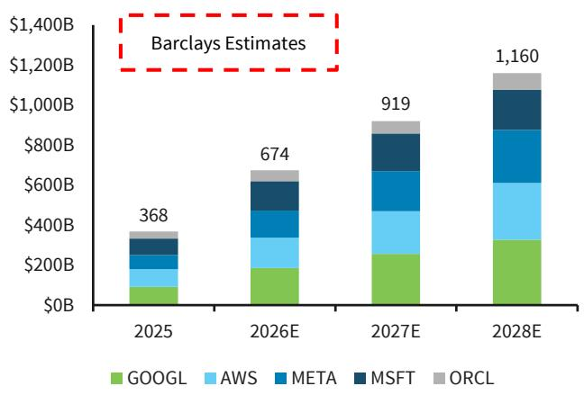
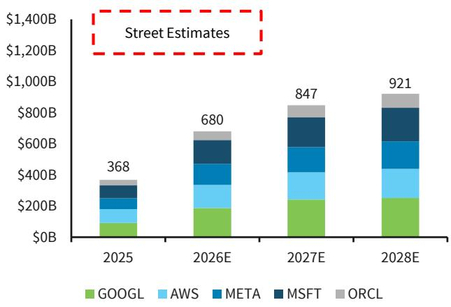
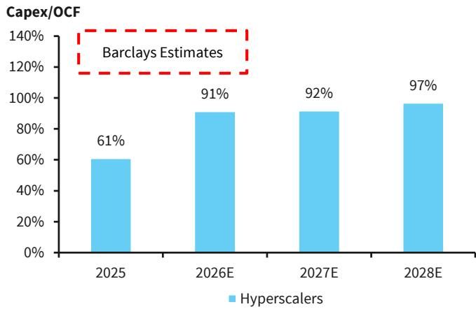
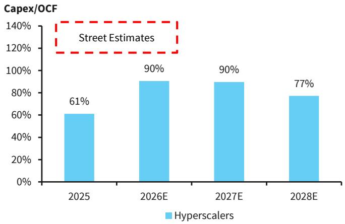
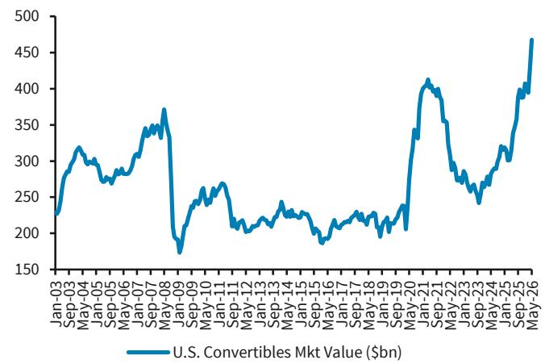
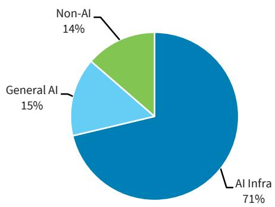
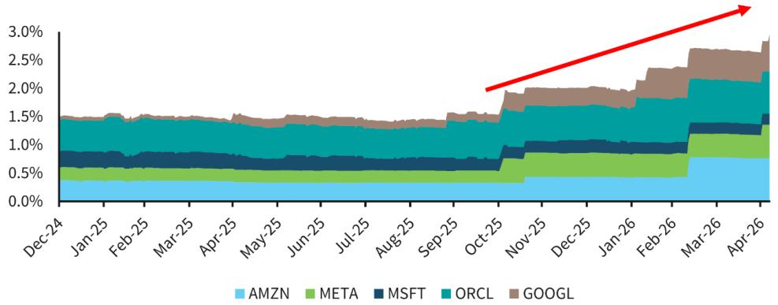

## U.S. Equity-Linked Strategies

# AI Capex Funding: Why Equity? Why Converts?

As AI capex becomes larger and longer duration, hyperscalers are broadening their funding mix beyond IG debt. Equity and equity-linked capital can preserve debt capacity, strengthen credit confidence, and support continued investment.

A reminder that we are entering the late innings of the 2026 Extel All-America Research Survey! If you’ve already submitted your ballot, thank you – we truly appreciate it. If not, our team would be grateful for your consideration for a ★★★★★ 5 Star Vote in the [Macro] → [Equity-Linked Strategies & Portfolio Strategy] categories.

Equity capital raise does not signal "last resort" financing. Debt markets remain open to AI hyperscalers, but equity broadens the funding base, reduces reliance on any single channel, and gives issuers more flexibility as AI investment stretches further into the decade. Moreover, equity can support credit confidence by strengthening credit metrics, adding a visible cushion for bondholders, and preserving future debt capacity.

Converts bridge straight debt and common equity. They provide equity-linked capital without requiring full common-stock issuance upfront, making them a flexible complement to IG debt rather than a replacement. In addition, the US convertibles market provides speed of access (one-day or overnight issuance) and structural flexibility, including dilution management tools, for issuers.

Mandatories offer the cleanest equity-credit structure. GOOGL and ORCL show how mandatories can provide equity-credit treatment on the balance sheet, conversion certainty, and balance-sheet signaling within a defined timeframe.

Who could be next? META, MSFT, and AMZN can fund AI capex, but additional equity-linked issuance would signal proactive balance-sheet management as spending stretches further into the decade; neocloud and AI infrastructure issuers such as CRWV, NBIS, and IREN already show broader convert adoption.

## U.S. Equity Strategy

Venu Krishna, CFA

+1 212 526 7328

venu.krishna@BARC.com

BCI, US

## Rex Feng

+1 212 526 6114

rex.feng@BARC.com

BCI, US

## U.S. Convertibles Strategy

## Jack Leung

+1 212 526 8432

jack.leung@BARC.com

BCI, US

THE 2026 EXTEL SURVEY IS NOW OPEN

## Support our industry-leading analysts with 5-Star votes in this year's Extel All-America Research Survey

Vote Now

View Analysts

## Why Equity?

Rex Feng BCI, US | Venu Krishna, CFA BCI, US

## The AI Capex Cycle Begins to Overwhelm Operating Cash Flows

The AI investment cycle continues to defy traditional capital intensity frameworks. Following the latest spending commitments, we believe peak capex has been deferred further out, reflecting both persistent supply constraints in training compute capacity as well as a material steepening of the demand curve as enterprise adoption accelerates and model improvements unlock new use cases. Hyperscalers are responding with sustained growth in investment over a longer horizon. The result is a growing mismatch between internally generated cash flow and projected capital requirements, as our Internet & Semis research teams point out in AI's S-Curve is Steepening (1 June 2026).

FIGURE 1. BARC now sees north of \~\$1.1T in 2028 total hyperscaler capex post-1Q results...  

stacked bar chart

| Year | GOOGL ($B) | AWS ($B) | META ($B) | MSFT ($B) | ORCL ($B) |
| :--- | :--- | :--- | :--- | :--- | :--- |
| 2025 | 100 | 70 | 60 | 60 | 38 |
| 2026E | 200 | 140 | 130 | 130 | 64 |
| 2027E | 250 | 180 | 190 | 190 | 79 |
| 2028E | 330 | 230 | 240 | 210 | 91 |
BARC Estimates
$1,160

From AI's S-Curve Is Steepening (1 June 2026).
Source: BARC Estimates, Company Disclosures

FIGURE 2. ...which is \~26% above the Street...  

stacked bar chart

| Year   | GOOGL | AWS  | META | MSFT | ORCL |
|--------|-------|------|------|------|------|
| 2025   | 100B  | 100B | 100B | 100B | 100B |
| 2026E  | 200B  | 150B | 150B | 150B | 100B |
| 2027E  | 250B  | 150B | 150B | 150B | 100B |
| 2028E  | 250B  | 150B | 150B | 150B | 100B |

From AI's S-Curve Is Steepening (1 June 2026). Source: Bloomberg, BARC

FIGURE 3. ...driving operating cash flow pressure that we expect to intensify into 2028...  

bar chart

Capex/OCF
| Year | Hyperscalers (%) |
| :--- | :--- |
| 2025 | 61 |
| 2026E | 91 |
| 2027E | 92 |
| 2028E | 97 |
BARC Estimates

Estimates from BARC' Internet research team. Note that for AMZN, capex is AWS only, while OCF is total AMZN.  
Source: BARC Estimates, Company Disclosures

FIGURE 4. ...which is not baked into consensus estimates  

bar chart

Capex/OCF
| Year | Hyperscalers (%) |
| :--- | :--- |
| 2025 | 61 |
| 2026E | 90 |
| 2027E | 90 |
| 2028E | 77 |
Street Estimates

Source: Bloomberg, BARC

## Hyperscalers Plumb the Depths of the IG Market

At this point, the marginal dollar of hyperscaler investment is less easily absorbed by cash flows and credit issuance has come to play a larger part in the funding mix. As our credit research team points out in Gigawatts Don't Build Themselves (21 May 2026), IG bond issuance from the cohort is already tracking north of \$200bn in 2026, with expectations rising toward roughly \$240bn for the full year. This level of supply is unprecedented for a non-financial sector and now exceeds the annual issuance of the largest US banks. While the depth of demand has allowed issuers to front-load funding and extend duration, issuance cannot scale one-for-one with capex indefinitely as hyperscalers test the limits of much supply the IG market will underwrite. Our credit colleagues observe this in the funding mix broadening beyond traditional unsecured bonds to alternative credit structures (data center project financing, asset-backed securities, GPU-backed loans, and joint ventures) to distribute capital intensity and optimize cost of capital.

All this being said, hyperscalers face limited near-term funding constraints from our credit analysts' perspective, and balance sheet capacity appears ample. Yet Alphabet (GOOGL) came to market last week with an \$84.75Bn equity capital raise to fund global compute infrastructure, consisting of \$16.75Bn in 3Y mandatory convertible preferred stock, a \$18Bn concurrent offering in Class A and C shares, \$40Bn at-the-market offering (ATM), and a \$10bn private placement to Berkshire Hathaway. The question some may ask then is: if credit remains available, why tap equity?

## Why Equity and Why Now?

From our perspective, equity issuance serves three critical functions. First, it broadens the funding base; by incorporating equity alongside debt, companies reduce their dependence on IG markets and create flexibility to navigate periods of market volatility. Second, equity effectively creates incremental debt capacity. By reducing leverage and strengthening credit metrics, it enables issuers to sustain future borrowing without jeopardizing ratings or widening spreads. Third, it provides a buffer that reassures credit investors. In a capital-intensive, multi-year investment cycle with uncertain end-demand, the presence of an equity cushion helps anchor market confidence and mitigate concerns around downside scenarios. The impact of this third dynamic can be seen in the case of Oracle, where the use of equity has improved credit fundamentals, reduced pressure on ratings, and introduced an implied “equity put” for future funding, reinforcing the view that high-yield outcomes are unlikely (Oracle (ORCL): Bull Case Still Intact, 7 May 2026).

In essence, the willingness to deploy equity demonstrates management's commitment to maintaining balance sheet integrity in the face of substantial funding needs. It also aligns incentives across the capital structure as hyperscalers move deeper into the AI buildout. While debt remains the dominant funding source today, equity can act as both a shock absorber and a strategic lever, enabling companies to continue investing aggressively.

Looking ahead, we expect this trend to persist. As capex continues to rise and the peak moves further out, we believe the funding mix will continue to broaden across debt, equity, and structured finance, particularly after the major players have signaled a willingness to deploy all financing tools to support the compute buildout. In this environment, we explore the unique role that equity-linked capital (e.g., convertible bonds) can play in the rapidly evolving capital funding environment.

## Why Converts?

Jack Leung BCI, US | Venu Krishna, CFA BCI, US

## Converts as the Capital-Structure Bridge for the AI Capex Cycle

The AI infrastructure funding debate is no longer just debt versus equity; it is about which form of capital best preserves balance-sheet flexibility while allowing hyperscalers to keep investing through a longer and larger capex cycle. Convertibles, which typically are considered part of the equity financing toolkit, sit directly in that gap: between balance-sheet debt capacity and outright common-equity dilution. They have long served as a funding bridge for innovation-led sectors (see Converts: The Humming Corner of Equities), and today the US convert market is increasingly aligned with the AI value chain across semiconductors, software, data-center infrastructure, crypto-linked platforms, e-commerce, and mobility. Much of the broader AI ecosystem outside the hyperscalers is already being financed through converts.

FIGURE 5. U.S. convert market value has reached a new high  

line chart

| Date     | U.S. Convertibles Mkt Value ($bn) |
| -------- | ---------------------------------- |
| Jan-03   | 230                                |
| Sep-03   | 320                                |
| May-04   | 300                                |
| Jan-05   | 280                                |
| Sep-05   | 290                                |
| May-06   | 310                                |
| Jan-07   | 340                                |
| Sep-07   | 360                                |
| May-08   | 370                                |
| Jan-09   | 180                                |
| Sep-09   | 250                                |
| May-10   | 270                                |
| Jan-11   | 260                                |
| Sep-11   | 240                                |
| May-12   | 230                                |
| Jan-13   | 220                                |
| Sep-13   | 240                                |
| May-14   | 230                                |
| Jan-15   | 220                                |
| Sep-15   | 210                                |
| May-16   | 200                                |
| Jan-17   | 210                                |
| Sep-17   | 220                                |
| May-18   | 230                                |
| Jan-19   | 240                                |
| Sep-19   | 250                                |
| May-20   | 340                                |
| Jan-21   | 410                                |
| Sep-21   | 350                                |
| May-22   | 280                                |
| Jan-23   | 260                                |
| Sep-23   | 240                                |
| May-24   | 300                                |
| Jan-25   | 350                                |
| Sep-25   | 400                                |
| May-26   | 470                                |

Source: Bloomberg, BARC

FIGURE 6. AI-related convert issuance has become a major source of growth capital  

pie chart

| Category | Percentage (%) |
| :--- | :--- |
| AI Infra | 71 |
| General AI | 15 |
| Non-AI | 14 |

Note: 2026YTD US convert issuance  
Source: Bloomberg, BARC

The market now has the scale to matter for mega-cap issuers. YTD US convert issuance has reached \~\$78bn, the strongest start to a year since the index was created in 2003, ahead of the comparable-period peaks in 2020 and 2021. US convert market value has grown from around \$315.5bn to roughly \$471.5bn, the highest level ever for the asset class. GOOGL's recent

\$16.75bn dual-tranche mandatory convertible is therefore not an isolated transaction; it underscores how equity-linked capital is becoming a larger part of the AI capex funding toolkit.

## Why Equity-Linked Capital, Not Just Straight Debt?

The reason to issue equity-linked capital is not that debt markets are closed. Credit remains available, and hyperscalers can continue to fund through IG bonds and other credit vehicles. The strategic issue is that AI capex is long-duration, highly scalable, and still uncertain in its ultimate monetization path. That type of investment is better supported by a broader funding mix than by fixed-maturity debt alone.

FIGURE 7. Hyperscaler IG supply is rising toward record levels % of Corps in GlobalAgg  

stacked bar chart

| Month | AMZN (%) | META (%) | MSFT (%) | ORCL (%) | GOOGL (%) |
| --- | --- | --- | --- | --- | --- |
| Dec-24 | 0.3 | 0.1 | 0.1 | 0.5 | 0.1 |
| Jan-25 | 0.3 | 0.1 | 0.1 | 0.5 | 0.1 |
| Feb-25 | 0.3 | 0.1 | 0.1 | 0.5 | 0.1 |
| Mar-25 | 0.3 | 0.1 | 0.1 | 0.5 | 0.1 |
| Apr-25 | 0.3 | 0.1 | 0.1 | 0.5 | 0.1 |
| May-25 | 0.3 | 0.1 | 0.1 | 0.5 | 0.1 |
| Jun-25 | 0.3 | 0.1 | 0.1 | 0.5 | 0.1 |
| Jul-25 | 0.3 | 0.1 | 0.1 | 0.5 | 0.1 |
| Aug-25 | 0.3 | 0.1 | 0.1 | 0.5 | 0.1 |
| Sep-25 | 0.3 | 0.1 | 0.1 | 0.5 | 0.1 |
| Oct-25 | 0.3 | 0.1 | 0.1 | 0.5 | 0.1 |
| Nov-25 | 0.3 | 0.2 | 0.1 | 0.5 | 0.2 |
| Dec-25 | 0.3 | 0.2 | 0.1 | 0.5 | 0.2 |
| Jan-26 | 0.3 | 0.2 | 0.1 | 0.5 | 0.2 |
| Feb-26 | 0.3 | 0.2 | 0.1 | 0.5 | 0.3 |
| Mar-26 | 0.3 | 0.2 | 0.1 | 0.5 | 0.4 |
| Apr-26 | 0.3 | 0.2 | 0.1 | 0.5 | 0.4 |

Note: Based on debt labeled "Corporate" in the LEGASTAT Index. Source: Bloomberg, BARC

Equity and converts diversify the funding base, preserve future debt capacity, strengthen credit metrics, and provide a visible equity cushion as a rising share of operating cash flow is directed toward AI infrastructure. In that sense, recent equity-linked deals should be viewed as prudent diversification of funding sources rather than funding stress: management teams are using favorable market conditions to pre-fund a multi-year AI buildout with capital that supports both growth and balance-sheet resilience. Another appeal for issuers, especially for well-established and known companies, is the speed of access (one-day and overnight pricing) and structural flexibility (via dilution management tools like concurrent call spreads) that the convertibles market provides, a function of the convert market's unique buyer mix.

## Why Mandatories? Equity Credit, Conversion Certainty, and Balance-Sheet Signaling

Within the convert toolkit, mandatories are the cleanest way to raise equity-credit capital, rather than simply low-cost debt. They typically receive near-full equity treatment, carry a defined three-year tenor, and convert into common stock on a fixed schedule. For hyperscalers, that certainty matters because the objective is not simply capital access, but visible equity reinforcement that supports credit metrics and preserves future debt capacity.

FIGURE 8. Mandatories optimize equity credit, not just coupon cost

<table><tr><td>Structure</td><td>Coupon / Dividend Cost</td><td>Conversion Premium</td><td>Equity Credit</td><td>Conversion Certainty</td><td>Credit Signal</td><td>Dilution Timing</td></tr><tr><td>Common Equity</td><td>N/A</td><td>None</td><td>Very high</td><td>Immediate</td><td>Strongest</td><td>Immediate</td></tr><tr><td>Mandatory Convert</td><td>Higher dividend</td><td>Moderate</td><td>High/near-full</td><td>Mandatory</td><td>Strong</td><td>Deferred</td></tr><tr><td>Plain Convert</td><td>Lower coupon</td><td>Higher</td><td>Limited</td><td>Investor option</td><td>Moderate</td><td>Conditional</td></tr><tr><td>Zero-Coupon Convert</td><td>Lowest cash cost</td><td>Highest</td><td>Low/debt-like</td><td>Investor option</td><td>Weakest</td><td>Conditional</td></tr></table>

Source: Bloomberg, BARC

A mandatory allows the issuer to access equity-like capital, appeal to both income-oriented and equity-linked investors, and avoid issuing all the common stock upfront, while still giving the market a clear path to balance-sheet reinforcement. This is why GOOGL and ORCL used mandatory structures. GOOGL's \$16.75bn dual-tranche mandatory convertible preferred adds equity-credit capital alongside its broader funding program, while ORCL similarly used mandatory preferred equity as part of its larger cloud and AI infrastructure funding plan. In both cases, the mandatory sits in the capital stack not because debt is scarce, but because management wants capital that reliably becomes equity within a defined window and visibly supports future debt capacity.

## Why Not Zero-Coupon Convertible Bonds? Hyperscalers Are Optimizing Equity Credit Over Coupon Cost

Hyperscalers could likely issue large zero-coupon converts with higher conversion premiums (e.g., 50% conversion premium) if their main objective were to minimize cash coupon and reduce near-term dilution. The market is clearly open for large zeros: Amkor Technology (AMKR) and ON Semiconductor (ON) both priced sizable 0% 2031 convertible notes in May 2026 with premiums above 50%. In fact, the convexity of a bond structure (i.e., equity upside via the embedded equity options plus credit support on the downside via the bond structure) is often the preferred structure within the convertible market. Bond structures currently account for \~85% of the U.S. converts market.

FIGURE 9. The converts universe is open for large zero-coupon converts

<table><tr><td>Issue Date</td><td>Issuer</td><td>Ticker</td><td>Size ($bn)</td><td>Cpn (%)</td><td>Prem (%)</td><td>Maturity</td><td>GICS Sector</td></tr><tr><td>1-May-26</td><td>Amkor Tech</td><td>AMKR</td><td>1.2</td><td>0</td><td>52.5</td><td>15-Jul-31</td><td>Info Tech</td></tr><tr><td>7-May-26</td><td>ON Semiconductor Corp</td><td>ON</td><td>1.3</td><td>0</td><td>52.5</td><td>1-May-31</td><td>Info Tech</td></tr><tr><td>14-May-26</td><td>Advanced Energy Industries</td><td>AEIS</td><td>1.2</td><td>0</td><td>50</td><td>15-May-31</td><td>Info Tech</td></tr><tr><td>19-May-26</td><td>Onto Innovation Inc</td><td>ONTO</td><td>1.5</td><td>0</td><td>50</td><td>1-Jun-31</td><td>Info Tech</td></tr><tr><td>20-May-26</td><td>SiTime Corp</td><td>SITM</td><td>1.4</td><td>0</td><td>50</td><td>15-Jun-31</td><td>Info Tech</td></tr><tr><td>27-Feb-26</td><td>Ultra Clean Holdings Inc</td><td>UCTT</td><td>0.6</td><td>0</td><td>42.5</td><td>15-Mar-31</td><td>Info Tech</td></tr><tr><td>20-May-26</td><td>Akamai Technologies Inc</td><td>AKAM</td><td>1.8</td><td>0</td><td>42.5</td><td>15-May-30</td><td>Info Tech</td></tr><tr><td>10-Feb-26</td><td>Microchip Technology</td><td>MCHP</td><td>0.9</td><td>0</td><td>40</td><td>15-Feb-30</td><td>Info Tech</td></tr><tr><td>8-May-26</td><td>Tempus AI INC</td><td>TEM</td><td>0.4</td><td>0</td><td>40</td><td>15-May-32</td><td>Health Care</td></tr><tr><td>25-Feb-26</td><td>Tandem Diabetes Care Inc</td><td>TNDM</td><td>0.3</td><td>0</td><td>37.5</td><td>15-Mar-32</td><td>Health Care</td></tr><tr><td>5-May-26</td><td>Propetro Holding Corp</td><td>PUMP</td><td>0.7</td><td>0</td><td>37.5</td><td>15-Nov-31</td><td>Energy</td></tr><tr><td>8-Jan-26</td><td>Arrowhead Pharma</td><td>ARWR</td><td>0.7</td><td>0</td><td>35</td><td>15-Jan-32</td><td>Health Care</td></tr><tr><td>20-May-26</td><td>Akamai Technologies Inc</td><td>AKAM</td><td>1.5</td><td>0</td><td>35</td><td>15-May-32</td><td>Info Tech</td></tr><tr><td>4-Feb-26</td><td>Liberty Energy Inc</td><td>LBRT</td><td>0.8</td><td>0</td><td>32.5</td><td>1-Mar-31</td><td>Energy</td></tr><tr><td>5-Mar-26</td><td>Dave Inc</td><td>DAVE</td><td>0.2</td><td>0</td><td>32.5</td><td>1-Apr-31</td><td>Financials</td></tr><tr><td>19-May-26</td><td>Hims &amp; Hers Health Inc</td><td>HIMS</td><td>0.4</td><td>0</td><td>32.5</td><td>1-Jun-32</td><td>Health Care</td></tr><tr><td>24-Feb-26</td><td>Itron, Inc</td><td>ITRI</td><td>0.8</td><td>0</td><td>30</td><td>15-Mar-32</td><td>Info Tech</td></tr><tr><td>18-Mar-26</td><td>Ormat Technologies Inc.</td><td>ORA</td><td>0.2</td><td>0</td><td>30</td><td>15-Mar-31</td><td>Utilities</td></tr><tr><td>26-Mar-26</td><td>Liberty Energy Inc</td><td>LBRT</td><td>0.5</td><td>0</td><td>30</td><td>1-Mar-32</td><td>Energy</td></tr><tr><td>13-May-26</td><td>Mirum Pharmaceuticals Inc</td><td>MIRM</td><td>0.7</td><td>0</td><td>30</td><td>1-Jun-32</td><td>Health Care</td></tr><tr><td>17-Apr-26</td><td>Hive Digital Tech</td><td>HIVE</td><td>0.1</td><td>0</td><td>17.5</td><td>15-Apr-31</td><td>Info Tech</td></tr><tr><td colspan="2"></td><td>Total</td><td>17</td><td>Avg</td><td>38.1</td><td></td><td></td></tr></table>

i.e. 22% of 2026 YTD US Convert Issuance  
Note: illustration of all 2026 YTD US zero-coupon convertible bonds issuance; 2026 YTD US overall convert issuance at \~\$78bn; sorted by % prem
Source: Bloomberg, BARC

But zeros solve a different problem from an issuer's standpoint. They optimize coupon cost and conversion premium, not capital-structure signaling. They remain debt-like instruments, rely on investor optionality to convert, and do not provide the same equity-credit treatment as mandatories. For issuers trying to reinforce credit metrics during a multi-year AI capex cycle, mandatories are the more precise tool. Zeros optimize economics whilst mandatories optimize balance-sheet credibility. Mandatory converts also hold appeal to a broader base of equity investors (equity-oriented equity investors; growth and income funds) outside the typical participants within the convertibles market.

## Who Could Be Next? Equity-Linked Capital as a Proactive Funding Tool

The next question is not whether META, MSFT, or AMZN can fund AI capex. They can. The question is how they choose to balance debt, equity, and converts as spending stretches further into the decade. Reported discussions around additional equity fundraising at META reinforce the point: incremental equity-linked issuance would not necessarily signal funding pressure, but rather proactive balance-sheet management.

FIGURE 10. AI funding mix could broaden across hyperscalers and neoclouds

<table><tr><td>Company</td><td>AI Capex / Infrastructure Exposure</td><td>IG Debt Usage</td><td>Equity-Linked / Convert Usage</td><td>Alternative Funding Channels</td><td>Future Equity-Linked Relevance</td></tr><tr><td>GOOGL</td><td>High</td><td>High</td><td>Used (mando)</td><td>Moderate</td><td>Established template for mega-cap issuers</td></tr><tr><td>ORCL</td><td>Very high</td><td>Very high</td><td>Used (mando)</td><td>High</td><td>Clearest case for credit-supportive structure</td></tr><tr><td>META</td><td>High</td><td>Rising</td><td>None</td><td>Low-moderate</td><td>Monitor; building balance-sheet flexibility</td></tr><tr><td>MSFT</td><td>High</td><td>Rising</td><td>None</td><td>Moderate</td><td>Monitor; less urgent but viable if capex extends</td></tr><tr><td>AMZN</td><td>High</td><td>Rising</td><td>None</td><td>Moderate</td><td>Monitor; broad funding mix could expand</td></tr><tr><td>CRWV</td><td>Very high (AI cloud / GPU capacity)</td><td>Limited / developing</td><td>Active convert issuer</td><td>High</td><td>Already part of AI convert funding cycle</td></tr><tr><td>NBIS</td><td>High (neocloud / AI infrastructure)</td><td>Limited / developing</td><td>Active convert issuer</td><td>Moderate-high</td><td>Demonstrates convert demand for AI infrastructure</td></tr><tr><td>IREN</td><td>High (AI/HPC data centers)</td><td>Limited / developing</td><td>Active convert issuer</td><td>Moderate</td><td>Highlights convert funding for data-center expansion</td></tr></table>

Source: Bloomberg, BARC

Given the growth, scale, and AI tilt of today's convert market, there is now a credible path for additional mega-caps to follow the GOOGL/ORCL playbook. The broader AI infrastructure ecosystem is already using converts to fund growth, while hyperscaler mandatories show how the same toolkit can migrate into the mega-cap capital stack. That makes “why equity, why convert” a central part of the AI capex narrative rather than a footnote to bond supply.

## Analyst(s) Certification(s):

We, Rex Feng, Jack Leung and Venu Krishna, CFA, hereby certify (1) that the views expressed in this research report accurately reflect our personal views about any or all of the subject securities or issuers referred to in this research report and (2) no part of our compensation was, is or will be directly or indirectly related to the specific recommendations or views expressed in this research report.

## Important Disclosures:

BARC is produced by the Investment Bank of BARC Bank PLC and its affiliates (collectively and each individually, "BARC"). All authors contributing to this research report are Research Analysts unless otherwise indicated. The publication date at the top of the report reflects the local time where the report was produced and may differ from the release date provided in GMT.

## Availability of Disclosures:

Where any companies are the subject of this research report, for current important disclosures regarding those companies please refer to https://publicresearch.barlays.com or alternatively send a written request to: BARC Compliance, 745 Seventh Avenue, 13th Floor, New York, NY 10019 or call +1-212-526-1072.

The analysts responsible for preparing this research report have received compensation based upon various factors including the firm's total revenues, a portion of which is generated by investment banking activities, the profitability and revenues of the Markets business and the potential interest of the firm's investing clients in research with respect to the asset class covered by the analyst.

Research analysts employed outside the US by affiliates of BARC Capital Inc. are not registered/qualified as research analysts with FINRA. Such non-US research analysts may not be associated persons of BARC Capital Inc., which is a FINRA member, and therefore may not be subject to FINRA Rule 2241 restrictions on communications with a subject company, public appearances and trading securities held by a research analyst's account.

Analysts regularly conduct site visits to view the material operations of covered companies, but BARC policy prohibits them from accepting payment or reimbursement by any covered company of their travel expenses for such visits.

BARC Department produces various types of research including, but not limited to, fundamental analysis, equity-linked analysis, quantitative analysis, and trade ideas. Recommendations contained in one type of BARC may differ from those contained in other types of BARC, whether as a result of differing time horizons, methodologies, or otherwise.

In order to access BARC Statement regarding Research Dissemination Policies and Procedures, please refer to https://publicresearch.BARC.com/S/RD.htm. In order to access BARC Conflict Management Policy Statement, please refer to: https://publicresearch.BARC.com/S/CM.htm.

## Other Material Conflicts

One or more of the authoring research analysts (and/or a member of the analyst's household) has long positions in index funds and/or ETFs that are designed to passively track the performance of the S&P 500, Euro Stoxx, FTSE 100, and/or Stoxx 600 Indices.

Unless otherwise indicated, prices are sourced from Bloomberg and reflect the closing price in the relevant trading market, which may not be the last available closing price at the time of publication.

## Risk Disclosure(s)

The convertible valuations are based on the BARC proprietary convertible valuation model, under which key assumptions relate to credit spread and equity volatility metrics. Material changes in any of these variables can have a significant impact on valuation. Upside/downside analysis takes into consideration likely future valuation and expected trading patterns, among others. It is based on a total return participation of the convertible relative to a +/- 25% (unless otherwise specified) change in the common stock's price over a one-year investment horizon. A material change in the company's financial situation can significantly alter this assessment.

Master limited partnerships (MLPs) are pass-through entities structured as publicly listed partnerships. For tax purposes, distributions to MLP unit holders may be treated as a return of principal. Investors should consult their own tax advisors before investing in MLP units.

## Disclosure(s) regarding Information Sources

Bloomberg® is a trademark and service mark of Bloomberg Finance L.P. and its affiliates (collectively “Bloomberg”) and the Bloomberg Indices are trademarks of Bloomberg. Bloomberg or Bloomberg’s licensors own all proprietary rights in the Bloomberg Indices. Bloomberg does not approve or endorse this material, or guarantee the accuracy or completeness of any information herein, or make any warranty, express or implied, as to the results to be obtained therefrom and, to the maximum extent allowed by law, Bloomberg shall have no liability or responsibility for injury or damages arising in connection therewith.

## Guide to the BARC Fundamental Equity Research Rating System:

Our coverage analysts use a relative rating system in which they rate stocks as Overweight, Equal Weight or Underweight (see definitions below) relative to other companies covered by the analyst or a team of analysts that are deemed to be in the same industry (the "industry coverage universe").

In addition to the stock rating, we provide industry views which rate the outlook for the industry coverage universe as Positive, Neutral or Negative (see definitions below). A rating system using terms such as buy, hold and sell is not the equivalent of our rating system. Investors should carefully read the entire research report including the definitions of all ratings and not infer its contents from ratings alone.

## Stock Rating

Overweight - The stock is expected to outperform the unweighted expected total return of the industry coverage universe over a 12-month investment horizon.

Equal Weight - The stock is expected to perform in line with the unweighted expected total return of the industry coverage universe over a 12-month investment horizon.

Underweight - The stock is expected to underperform the unweighted expected total return of the industry coverage universe over a 12-month investment horizon.

Rating Suspended - The rating and target price have been suspended temporarily due to market events that made coverage impracticable or to comply with applicable regulations and/or firm policies in certain circumstances including where the Investment Bank of BARC Bank PLC is acting in an advisory capacity in a merger or strategic transaction involving the company.

## Industry View

Positive - industry coverage universe fundamentals/valuations are improving.

Neutral - industry coverage universe fundamentals/valuations are steady, neither improving nor deteriorating.

Negative - industry coverage universe fundamentals/valuations are deteriorating.

## Types of investment recommendations produced by BARC Equity Research:

In addition to any ratings assigned under BARC' formal rating systems, this publication may contain investment recommendations in the form of trade ideas, thematic screens, scorecards or portfolio recommendations that have been produced by analysts within Equity Research. Any such investment recommendations shall remain open until they are subsequently amended, rebalanced or closed in a future research report.

BARC may also re-distribute equity research reports produced by third-party research providers that contain recommendations that differ from and/or conflict with those published by BARC' Equity Research Department.

## Disclosure of other investment recommendations produced by BARC Equity Research:

BARC Equity Research may have published other investment recommendations in respect of the same securities/instruments recommended in this research report during the preceding 12 months. To view all investment recommendations published by BARC Equity Research in the preceding 12 months please refer to https://live.barcap.com/go/research/Recommendations.

## Legal entities involved in producing BARC:

BARC Bank PLC (BARC, UK)

BARC Capital Inc. (BCI, US)

BARC Bank Ireland PLC, Frankfurt Branch (BBI, Frankfurt)

BARC Bank Ireland PLC, Paris Branch (BBI, Paris)

BARC Bank Ireland PLC, Milan Branch (BBI, Milan)

BARC Securities Japan Limited (BSJL, Japan)

BARC Bank PLC, Hong Kong Branch (BARC Bank, Hong Kong)

BARC Bank Mexico, S.A. (BBMX, Mexico)

BARC Capital Casa de Bolsa, S.A. de C.V. (BCCB, Mexico)

BARC Securities (India) Private Limited (BSIPL, India)

BARC Bank PLC, Singapore Branch (BARC Bank, Singapore)

BARC Bank PLC, DIFC Branch (BARC Bank, DIFC)

## Disclaimer:

This publication has been produced by BARC Department in the Investment Bank of BARC Bank PLC and/or one or more of its affiliates (collectively and each individually, "BARC").

It has been prepared for institutional investors and not for retail investors. It has been distributed by one or more BARC affiliated legal entities listed below or by an independent and non-affiliated third-party entity (as may be communicated to you by such third-party entity in its communications with you). It is provided for information purposes only, and BARC makes no express or implied warranties, and expressly disclaims all warranties of merchantability or fitness for a particular purpose or use with respect to any data included in this publication. To the extent that this publication states on the front page that it is intended for institutional investors and is not subject to all of the independence and disclosure standards applicable to debt research reports prepared for retail investors under U.S. FINRA Rule 2242, it is an “institutional debt research report” and distribution to retail investors is strictly prohibited. BARC also distributes such institutional debt research reports to various issuers, media, regulatory and academic organisations for their own internal informational news gathering, regulatory or academic purposes and not for the purpose of making investment decisions regarding any debt securities. Media organisations are prohibited from re-publishing any opinion or recommendation concerning a debt issuer or debt security contained in any BARC institutional debt research report. Any such recipients that do not want to continue receiving BARC institutional debt research reports should contact debtresearch@BARC.com. Unless clients have agreed to receive “institutional debt research reports” as required by US FINRA Rule 2242, they will not receive any such reports that may be co-authored by non-debt research analysts. Eligible clients may get access to such cross asset reports by contacting debtresearch@BARC.com. BARC will not treat unauthorized recipients of this report as its clients and accepts no liability for use by them of the contents which may not be suitable for their personal use. Prices shown are indicative and BARC is not offering to buy or sell or soliciting offers to buy or sell any financial instrument.

Without limiting any of the foregoing and to the extent permitted by law, in no event shall BARC, nor any affiliate, nor any of their respective officers, directors, partners, or employees have any liability for (a) any special, punitive, indirect, or consequential damages; or (b) any lost profits, lost revenue, loss of anticipated savings or loss of opportunity or other financial loss, even if notified of the possibility of such damages, arising from any use of this publication or its contents.

Other than disclosures relating to BARC, the information contained in this publication (including third-party data) has been obtained from sources that BARC believes to be reliable, but BARC does not represent or warrant that it is accurate or complete. Third-party data, including third-party forecasts and predictions, is provided for information purposes only, has not been adopted or endorsed by BARC, and does not represent the views or opinions of BARC. Presentations by Third-Party Speakers: Any views or opinions expressed by third-party speakers during a BARC-hosted event are solely those of the speaker and do not represent the views or opinions of BARC. BARC is not responsible for, and

makes no warranties whatsoever as to, the information or opinions contained in any written, electronic, audio or video presentations by any third-party speakers, and such presentations have not been adopted or endorsed by BARC and do not represent the views or opinions of BARC. Content from third-party presentations is provided for information purposes only and has not been independently verified by BARC for its accuracy or completeness.

The views in this publication are solely and exclusively those of the authoring analyst(s) and are subject to change, and BARC has no obligation to update its opinions or the information in this publication. Unless otherwise disclosed herein, the analysts who authored this report have not received any compensation from the subject companies in the past 12 months. If this publication contains recommendations, they are general recommendations that were prepared independently of any other interests, including those of BARC and/or its affiliates, and/or the subject companies. This publication does not contain personal investment recommendations or investment advice or take into account the individual financial circumstances or investment objectives of the clients who receive it. BARC is not a fiduciary to any recipient of this publication. The securities and other investments discussed herein may not be suitable for all investors and may not be available for purchase in all jurisdictions. The United States imposed sanctions on certain Chinese companies (https://ofac.treasury.gov/sanctions-programs-and-country-information/chinese-military-companies-sanctions), which may restrict U.S. persons from purchasing securities issued by those companies. Investors must independently evaluate the merits and risks of the investments discussed herein, including any sanctions restrictions that may apply, consult any independent advisors they believe necessary, and exercise independent judgment with regard to any investment decision. The value of and income from any investment may fluctuate from day to day as a result of changes in relevant economic markets (including changes in market liquidity). The information herein is not intended to predict actual results, which may differ substantially from those reflected. Past performance is not necessarily indicative of future results. The information provided does not constitute a financial benchmark and should not be used as a submission or contribution of input data for the purposes of determining a financial benchmark.

This publication is not investment company sales literature as defined by Section 270.24(b) of the US Investment Company Act of 1940, nor is it intended to constitute an offer, promotion or recommendation of, and should not be viewed as marketing (including, without limitation, for the purposes of the UK Alternative Investment Fund Managers Regulations 2013 (SI 2013/1773) or AIFMD (Directive 2011/61)) or pre-marketing (including, without limitation, for the purposes of Directive (EU) 2019/1160) of the securities, products or issuers that are the subject of this report.

Third Party Distribution: Any views expressed in this communication are solely those of BARC and have not been adopted or endorsed by any third party distributor.

United Kingdom: This document is being distributed (1) only by or with the approval of an authorised person (BARC Bank PLC) or (2) to, and is directed at (a) persons in the United Kingdom having professional experience in matters relating to investments and who fall within the definition of "investment professionals" in Article 19(5) of the Financial Services and Markets Act 2000 (Financial Promotion) Order 2005 (the "Order"); or (b) high net worth companies, unincorporated associations and partnerships and trustees of high value trusts as described in Article 49(2) of the Order; or (c) other persons to whom it may otherwise lawfully be communicated (all such persons being "Relevant Persons"). Any investment or investment activity to which this communication relates is only available to and will only be engaged in with Relevant Persons. Any other persons who receive this communication should not rely on or act upon it. BARC Bank PLC is authorised by the Prudential Regulation Authority and regulated by the Financial Conduct Authority and the Prudential Regulation Authority and is a member of the London Stock Exchange.

European Economic Area (“EEA”): This material is being distributed to any “Authorised User” located in a Restricted EEA Country by BARC Bank Ireland PLC. The Restricted EEA Countries are Austria, Bulgaria, Estonia, Finland, Hungary, Iceland, Liechtenstein, Lithuania, Luxembourg, Malta, Portugal, Romania, Slovakia and Slovenia. For any other “Authorised User” located in a country of the European Economic Area, this material is being distributed by BARC Bank PLC. BARC Bank Ireland PLC is a bank authorised by the Central Bank of Ireland whose registered office is at 1 Molesworth Street, Dublin 2, Ireland. BARC Bank PLC is not registered in France with the Autorité des marchés financiers or the Autorité de contrôle prudentiel. Authorised User means each individual associated with the Client who is notified by the Client to BARC and authorised to use the Research Services. The Restricted EEA Countries will be amended if required.

Finland: Notwithstanding Finland's status as a Restricted EEA Country, Research Services may also be provided by BARC Bank PLC where permitted by the terms of its cross-border license.

Americas: The Investment Bank of BARC Bank PLC undertakes U.S. securities business in the name of its wholly owned subsidiary BARC Capital Inc., a FINRA and SIPC member. BARC Capital Inc., a U.S. registered broker/dealer, is distributing this material in the United States and, in connection therewith accepts responsibility for its contents. Any U.S. person wishing to effect a transaction in any security discussed herein should do so only by contacting a representative of BARC Capital Inc. in the U.S. at 745 Seventh Avenue, New York, New York 10019.

Non-U.S. persons should contact and execute transactions through a BARC Bank PLC branch or affiliate in their home jurisdiction unless local regulations permit otherwise.

This material is distributed in Canada by BARC Capital Canada Inc., a registered investment dealer, a Dealer Member of Canadian Investment Regulatory Organization (www.ciro.ca), and a Member of the Canadian Investor Protection Fund (CIPF).

This material is distributed in Mexico by BARC Bank Mexico, S.A. and/or BARC Capital Casa de Bolsa, S.A. de C.V. This material is distributed in the Cayman Islands and in the Bahamas by BARC Capital Inc., which it is not licensed or registered to conduct and does not conduct business in, from or within those jurisdictions and has not filed this material with any regulatory body in those jurisdictions.

Japan: This material is being distributed to institutional investors in Japan by BARC Securities Japan Limited. BARC Securities Japan Limited is a joint-stock company incorporated in Japan with registered office of 6-10-1 Roppongi, Minato-ku, Tokyo 106-6131, Japan. It is a subsidiary of BARC Bank PLC and a registered financial instruments firm regulated by the Financial Services Agency of Japan. Registered Number: Kanto Zaimukyokucho (kinsho) No. 143.

Asia Pacific (excluding Japan): BARC Bank PLC, Hong Kong Branch is distributing this material in Hong Kong as an authorised institution regulated by the Hong Kong Monetary Authority. Registered Office: 41/F, Cheung Kong Center, 2 Queen's Road Central, Hong Kong.

All Indian securities-related research and other equity research produced by BARC' Investment Bank are distributed in India by BARC Securities (India) Private Limited (BSIPL). BSIPL is a company incorporated under the Companies Act, 1956 having CIN U67120MH2006PTC161063. BSIPL is registered and regulated by the Securities and Exchange Board of India (SEBI) as a Research Analyst: INH000001519; Portfolio Manager INP000002585; Stock Broker INZ000269539 (member of NSE and BSE); Depository Participant with the National Securities & Depositories Limited (NSDL): DP ID: IN-DP-

NSDL-478-2020; Investment Adviser: INA000000391. BSIPL is also registered as a Mutual Fund Advisor having AMFI ARN No. 53308. The registered office of BSIPL is at Nirlon Knowledge Park, 9th floor, Block B-6, Off. Western Express Highway, Goregaon (East), Mumbai – 400063, India. Telephone No: +91 22 61754000 Fax number: +91 22 61754099. Any other reports produced by BARC' Investment Bank are distributed in India by BARC Bank PLC, India Branch, an associate of BSIPL in India that is registered with Reserve Bank of India (RBI) as a Banking Company under the provisions of The Banking Regulation Act, 1949 (Regn No BOM43) and registered with SEBI as Merchant Banker (Regn No INM000002129) and also as Banker to the Issue (Regn No INBI00000950). BARC Investments and Loans (India) Limited, registered with RBI as Non Banking Financial Company (Regn No RBI CoR-07-00258), and BARC Wealth Trustees (India) Private Limited, registered with Registrar of Companies (CIN U93000MH2008PTC188438), are associates of BSIPL in India that are not authorised to distribute any reports produced by BARC' Investment Bank.

This material is distributed in Singapore by the Singapore Branch of BARC Bank PLC, a bank licensed in Singapore by the Monetary Authority of Singapore. For matters in connection with this material, recipients in Singapore may contact the Singapore branch of BARC Bank PLC, whose registered address is 10 Marina Boulevard, #23-01 Marina Bay Financial Centre Tower 2, Singapore 018983.

This material, where distributed to persons in Australia, is produced or provided by BARC Bank PLC.

This communication is directed at persons who are a “Wholesale Client” as defined by the Australian Corporations Act 2001.

Please note that the Australian Securities and Investments Commission (ASIC) has provided certain exemptions to BARC Bank PLC (BBPLC) under paragraph 911A(2)(I) of the Corporations Act 2001 from the requirement to hold an Australian financial services licence (AFSL) in respect of financial services provided to Australian Wholesale Clients, on the basis that BBPLC is authorised by the Prudential Regulation Authority of the United Kingdom (PRA) and regulated by the Financial Conduct Authority (FCA) of the United Kingdom and the PRA under United Kingdom laws. The United Kingdom has laws which differ from Australian laws. To the extent that this communication involves the provision of financial services by BBPLC to Australian Wholesale Clients, BBPLC relies on the relevant exemption from the requirement to hold an AFSL. Accordingly, BBPLC does not hold an AFSL.

This communication may be distributed to you by either: (i) BARC Bank PLC directly, (ii) Barrenjoey Markets Pty Limited (ACN 636 976 059, "Barrenjoey"), the holder of Australian Financial Services Licence (AFSL) 521800, a non-affiliated third party distributor, where clearly identified to you by Barrenjoey. Barrenjoey is not an agent of BARC Bank PLC or (iii) such other non-affiliated third-party distributor(s) as may be clearly identified to you. Such non-affiliated third-party distributor(s) are not agents of BARC Bank PLC.

This material, where distributed in New Zealand, is produced or provided by BARC Bank PLC. BARC Bank PLC is not registered, filed with or approved by any New Zealand regulatory authority. This material is not provided under or in accordance with the Financial Markets Conduct Act of 2013 (“FMCA”), and is not a disclosure document or “financial advice” under the FMCA. This material is distributed to you by either: (i) BARC Bank PLC directly or (ii) Barrenjoey Markets Pty Limited (“Barrenjoey”), a non-affiliated third party distributor, where clearly identified to you by Barrenjoey. Barrenjoey is not an agent of BARC Bank PLC. This material may only be distributed to “wholesale investors” that meet the “investment business”, “investment activity”, “large”, or “government agency” criteria specified in Schedule 1 of the FMCA.

Middle East: Nothing herein should be considered investment advice as defined in the Israeli Regulation of Investment Advisory, Investment Marketing and Portfolio Management Law, 1995 (“Advisory Law”). This document is being made to eligible clients (as defined under the Advisory Law) only. BARC Israeli branch previously held an investment marketing license with the Israel Securities Authority but it cancelled such license on 30/11/2014 as it solely provides its services to eligible clients pursuant to available exemptions under the Advisory Law, therefore a license with the Israel Securities Authority is not required. Accordingly, BARC does not maintain an insurance coverage pursuant to the Advisory Law.

This material is distributed in the United Arab Emirates (including the Dubai International Financial Centre) and Qatar by BARC Bank PLC. BARC Bank PLC in the Dubai International Financial Centre (Registered No. 0060) is regulated by the Dubai Financial Services Authority (DFSA). Principal place of business in the Dubai International Financial Centre: The Gate Village, Building 4, Level 4, PO Box 506504, Dubai, United Arab Emirates. BARC Bank PLC-DIFC Branch, may only undertake the financial services activities that fall within the scope of its existing DFSA licence. Related financial products or services are only available to Professional Clients, as defined by the Dubai Financial Services Authority. BARC Bank PLC in the UAE is regulated by the Central Bank of the UAE and is licensed to conduct business activities as a branch of a commercial bank incorporated outside the UAE in Dubai (Licence No.: 13/1844/2008, Registered Office: Building No. 6, Burj Dubai Business Hub, Sheikh Zayed Road, Dubai City) and Abu Dhabi (Licence No.: 13/952/2008, Registered Office: Al Jazira Towers, Hamdan Street, PO Box 2734, Abu Dhabi). This material does not constitute or form part of any offer to issue or sell, or any solicitation of any offer to subscribe for or purchase, any securities or investment products in the UAE (including the Dubai International Financial Centre) and accordingly should not be construed as such. Furthermore, this information is being made available on the basis that the recipient acknowledges and understands that the entities and securities to which it may relate have not been approved, licensed by or registered with the UAE Central Bank, the Dubai Financial Services Authority or any other relevant licensing authority or governmental agency in the UAE. The content of this report has not been approved by or filed with the UAE Central Bank or Dubai Financial Services Authority. BARC Bank PLC in the Qatar Financial Centre (Registered No. 00018) is authorised by the Qatar Financial Centre Regulatory Authority (QFCRA). BARC Bank PLC-QFC Branch may only undertake the regulated activities that fall within the scope of its existing QFCRA licence. Principal place of business in Qatar: Qatar Financial Centre, Office 1002, 10th Floor, QFC Tower, Diplomatic Area, West Bay, PO Box 15891, Doha, Qatar. Related financial products or services are only available to Business Customers as defined by the Qatar Financial Centre Regulatory Authority.

Russia: This material is not intended for investors who are not Qualified Investors according to the laws of the Russian Federation as it might contain information about or description of the features of financial instruments not admitted for public offering and/or circulation in the Russian Federation and thus not eligible for non-Qualified Investors. If you are not a Qualified Investor according to the laws of the Russian Federation, please dispose of any copy of this material in your possession.

Sustainable Investing Related Research: There is currently no globally accepted framework or definition (legal, regulatory or otherwise) of, nor market consensus as to what constitutes a ‘sustainable’, ‘ESG’, ‘green’, ‘climate-friendly’ or an equivalent company, investment, strategy or consideration or what precise attributes are required to be eligible to be categorised by such terms. This means there are different ways to evaluate a company or an investment and so different values may be placed on certain sustainability credentials as well as adverse ESG-related impacts of companies and ESG controversies. The evolving nature of sustainable investing considerations, models and methodologies means it can be challenging to definitively and universally classify a company or investment under a sustainable investing label and there may be areas where such companies and investments could improve or where adverse ESG-related impacts or ESG controversies exist. The evolving nature of sustainable finance related regulations and the development of jurisdiction-specific regulatory criteria also means that there is likely to be a degree of divergence as to the interpretation of such terms in the market. We expect industry guidance, market practice, and regulations in this field to continue to evolve.

Any information, data, image, or other content including from a third party source contained, referred to herein or used for whatsoever purpose by BARC or a third party (“Information”), in relation to any actual or potential ‘ESG’, ‘sustainable’ or equivalent objective, issue, factor or consideration is not intended to be relied upon for ESG or sustainability classification, regulatory regime or industry initiative purposes (“ESG Regimes”), unless otherwise stated. Nothing in these materials, including any images included therein, is intended to convey, suggest or indicate that BARC considers or represents any product, service, person or body mentioned in these materials as meeting or qualifying for any ESG or sustainability classification, label or similar standards that may exist under ESG Regimes. BARC has not conducted any assessment of compliance with ESG Regimes. Parties are reminded to make their own assessments for these purposes.

IRS Circular 230 Prepared Materials Disclaimer: BARC does not provide tax advice and nothing contained herein should be construed to be tax advice. Please be advised that any discussion of U.S. tax matters contained herein (including any attachments) (i) is not intended or written to be used, and cannot be used, by you for the purpose of avoiding U.S. tax-related penalties; and (ii) was written to support the promotion or marketing of the transactions or other matters addressed herein. Accordingly, you should seek advice based on your particular circumstances from an independent tax advisor.

© Copyright BARC Bank PLC (2026). All rights reserved. No part of this publication may be reproduced or redistributed in any manner without the prior written permission of BARC. BARC Bank PLC is registered in England No. 1026167. Registered office 1 Churchill Place, London, E14 5HP. Additional information regarding this publication will be furnished upon request.