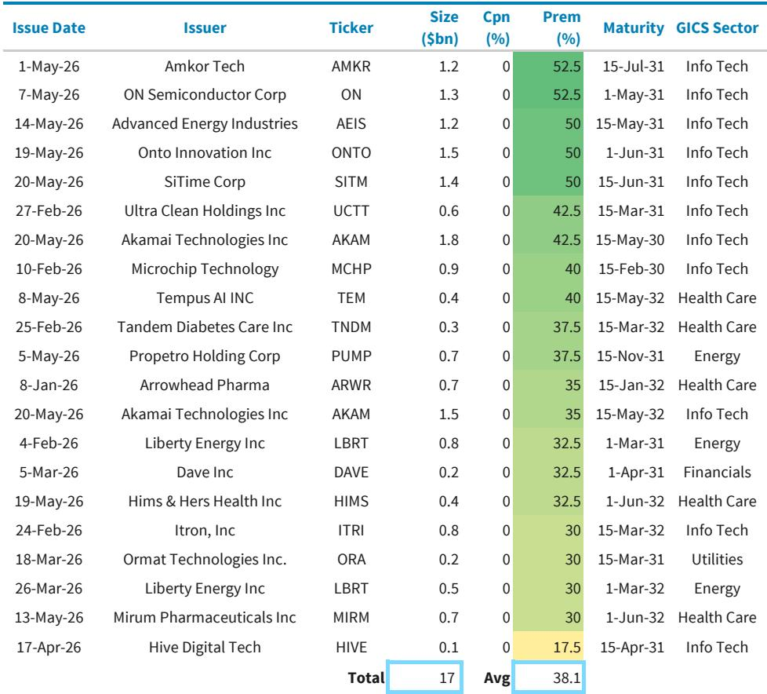
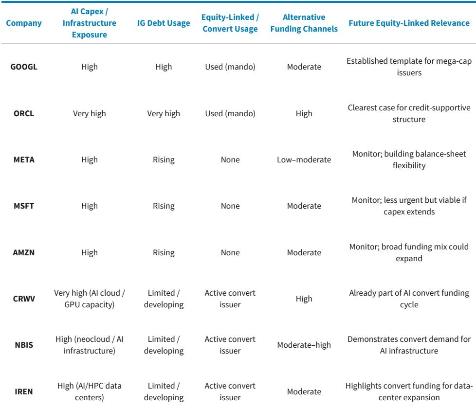
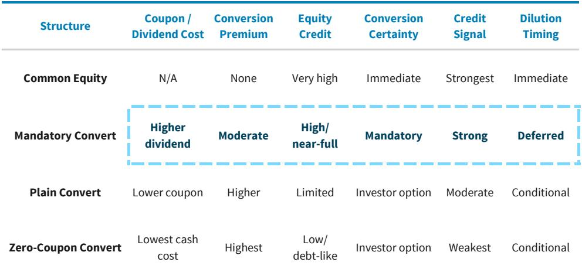

# Equity-Linked Capital Is Becoming a Strategic Imperative for the AI Capex Cycle, Not a Sign of Financial Distress

The narrative that equity issuance signals desperation is deeply misleading. As the artificial intelligence infrastructure buildout enters a phase of unprecedented capital intensity, the largest hyperscalers are not being forced into equity markets because debt has closed. They are proactively broadening their funding mix to preserve balance-sheet flexibility, strengthen credit metrics, and sustain a multi-year investment cycle that is now overwhelming internally generated cash flow. The decision to raise equity-linked capital—particularly through mandatory convertibles and convertible bonds—represents a strategic evolution in how the most creditworthy companies in the world finance long-duration, high-uncertainty capital expenditures.

The conventional framework for analyzing corporate funding assumes a pecking order: internal cash first, then debt, then equity as a last resort. That framework is breaking down. The AI capex cycle is structurally different from previous waves of capital investment. It is longer, larger, and more uncertain in its ultimate monetization path. In this environment, relying solely on debt to fund the buildout creates hidden risks: it concentrates funding concentration in a single channel, consumes debt capacity that may be needed for future opportunities, and leaves the balance sheet exposed if the demand curve for AI services does not materialize as expected. Equity and equity-linked capital address all three concerns simultaneously.

The scale of the funding gap is becoming visible. According to a recent global investment bank report, total hyperscaler capital expenditure is projected to reach approximately $1.16 trillion by 2028, a figure that is roughly 26 percent above consensus estimates. The ratio of capex to operating cash flow for the five largest hyperscalers is expected to rise from 61 percent in 2025 to 97 percent by 2028. That means nearly every dollar of internally generated cash will be consumed by capital spending. There is no room for error, no buffer for cyclical downturns, and no capacity to fund opportunistic acquisitions or share buybacks without external capital. The math simply does not work without a broader funding base.

This is not a hypothetical concern. Alphabet recently raised $84.75 billion in equity capital through a combination of mandatory convertible preferred stock, common stock offerings, an at-the-market program, and a private placement. Oracle has used similar structures. These are not companies that face funding constraints. They are companies that recognize the strategic value of pre-funding the buildout with capital that provides balance-sheet resilience rather than consuming it. The question is not whether other hyperscalers will follow. The question is which form of equity-linked capital they will choose and what that choice reveals about their strategic priorities.

## The Funding Gap Is Real and Growing Faster Than Consensus Recognizes

The most important analytical insight from the report is the divergence between the investment bank's capex estimates and the street consensus. The bank projects that hyperscaler capex will reach $1.16 trillion by 2028, while consensus estimates are roughly 26 percent lower. This gap is not trivial. It represents hundreds of billions of dollars in additional funding requirements that are not yet priced into market expectations. If the bank's estimates prove accurate, the funding mix will need to shift materially to accommodate the incremental spending.

The operating cash flow pressure is equally striking. The capex-to-OCF ratio is projected to rise from 61 percent in 2025 to 97 percent in 2028 under the bank's estimates, while consensus sees the ratio peaking around 90 percent and then declining to 77 percent by 2028. The divergence reflects fundamentally different assumptions about the duration and intensity of the AI investment cycle. The bank's research suggests that peak capex has been deferred further out, driven by persistent supply constraints in training compute capacity and a steepening demand curve as enterprise adoption accelerates. If that view is correct, the funding challenge is not a temporary spike but a structural shift.

The implication for investors is clear: the market is systematically underestimating the amount of external capital that hyperscalers will need to raise. This creates both risk and opportunity. The risk is that companies that fail to diversify their funding sources early may face more constrained choices later, particularly if credit conditions tighten or equity markets become less receptive. The opportunity is that companies that proactively broaden their funding mix can lock in favorable terms, strengthen their balance sheets, and signal confidence to the market.

## Equity-Linked Capital Preserves Debt Capacity While Providing a Visible Cushion for Credit Investors

The most common objection to equity issuance is that it dilutes existing shareholders. That objection is valid in isolation but misses the broader strategic context. The relevant comparison is not between equity and no dilution. It is between raising equity now versus raising equity later under potentially worse conditions, or between raising equity versus consuming so much debt capacity that the company loses the flexibility to respond to future opportunities or shocks.

The report makes a crucial distinction: equity capital raise does not signal "last resort" financing. Debt markets remain open to hyperscalers, and the investment bank's credit research team confirms that balance sheet capacity appears ample for the near term. The issue is not access to debt but the optimal mix of funding sources given the long-duration, uncertain nature of AI infrastructure investment.

Equity serves three critical functions in this context. First, it broadens the funding base, reducing dependence on any single channel and creating flexibility to navigate periods of market volatility. Second, it creates incremental debt capacity by reducing leverage and strengthening credit metrics. Third, it provides a visible cushion that reassures credit investors, anchoring market confidence and mitigating concerns around downside scenarios. The third function is particularly important because AI infrastructure investment has an uncertain monetization path. The presence of an equity cushion helps ensure that even if demand materializes more slowly than expected, the company can continue to service its debt and maintain investment-grade ratings.

The report cites Oracle as a case study in how equity can improve credit fundamentals. The use of equity has reduced pressure on ratings and introduced an implied "equity put" for future funding, reinforcing the view that high-yield outcomes are unlikely. This is not a theoretical benefit. It is a measurable improvement in the company's cost of capital and strategic flexibility.

## Convertibles Bridge the Gap Between Straight Debt and Common Equity with Structural Advantages

Within the equity-linked toolkit, convertible bonds occupy a unique position. They are not straight debt, because they offer conversion into equity. They are not common equity, because they provide downside protection through the bond structure. They sit in the gap between debt capacity and outright dilution, and for the AI capex cycle, that gap is exactly where the funding challenge lies.

The US convertibles market has reached a new high, with market value growing from approximately $315.5 billion to roughly $471.5 billion, the highest level since the index was created in 2003. Year-to-date issuance has reached approximately $78 billion, the strongest start to a year on record. Critically, 71 percent of 2026 year-to-date US convert issuance is related to AI infrastructure, according to the report. The market is already financing the broader AI ecosystem outside the hyperscalers, and it now has the scale to matter for mega-cap issuers.

The appeal of converts for hyperscalers is multifaceted. They provide equity-linked capital without requiring full common-stock issuance upfront. They offer speed of access, with one-day or overnight pricing available for well-established companies. They provide structural flexibility through dilution management tools such as concurrent call spreads. And they attract a unique buyer mix that includes both income-oriented investors and equity-linked investors, broadening the investor base beyond traditional bond buyers.

The report makes an important distinction between different types of convert structures. Plain-vanilla convertible bonds offer lower coupons and higher conversion premiums, but they provide limited equity credit and conversion is conditional on the investor's option. Zero-coupon converts offer the lowest cash cost but provide the weakest equity credit signal. Mandatory converts, by contrast, offer high or near-full equity credit, mandatory conversion within a defined timeframe, and a strong credit signal. For hyperscalers optimizing for equity credit rather than coupon cost, mandatories are the cleanest structure.

## Mandatory Convertibles Offer the Cleanest Equity-Credit Structure for Hyperscalers

The report's analysis of mandatory convertibles is particularly valuable because it clarifies why Alphabet and Oracle chose this structure rather than plain converts or zero-coupon bonds. A mandatory convertible allows the issuer to access equity-like capital, appeal to both income-oriented and equity-linked investors, and avoid issuing all the common stock upfront, while still giving the market a clear path to balance-sheet reinforcement.

The key insight is that mandatories optimize for equity credit, not coupon cost. The objective is not to minimize the cash dividend or coupon payment. It is to raise capital that reliably becomes equity within a defined window and visibly supports future debt capacity. For hyperscalers facing a multi-year investment cycle with uncertain end-demand, that certainty matters more than a few basis points of cost savings.

The report provides a useful framework for comparing different convert structures across six dimensions: coupon or dividend cost, conversion premium, equity credit, conversion certainty, credit signal, and dilution timing. Common equity scores highest on equity credit, conversion certainty, and credit signal, but it requires immediate dilution. Mandatory converts score high on equity credit and conversion certainty, with deferred dilution. Plain converts offer lower coupons but limited equity credit and conditional conversion. Zero-coupon converts offer the lowest cash cost but the weakest equity credit signal.

For hyperscalers, the tradeoff is clear. They could issue large zero-coupon converts with higher conversion premiums if their main objective were to minimize cash coupon and reduce near-term dilution. The market is open for such structures, as evidenced by recent deals from Amkor Technology and ON Semiconductor, both of which priced sizable zero-coupon converts with premiums above 50 percent. But hyperscalers are choosing mandatories because their objective is equity credit, not coupon cost. That choice reveals a strategic priority: balance-sheet resilience over short-term cost optimization.

## The Report Leaves an Unresolved Question About the Optimal Timing and Sequencing of Equity-Linked Issuance

While the report provides a compelling framework for why equity-linked capital matters, it does not fully answer the question of when and in what sequence hyperscalers should issue. The report identifies Meta, Microsoft, and Amazon as companies that could fund AI capex through existing resources but might benefit from additional equity-linked issuance to signal proactive balance-sheet management. It also notes that neocloud and AI infrastructure issuers such as CoreWeave, Nebius, and Iris Energy already show broader convert adoption.

But the timing question is non-trivial. Issuing equity-linked capital too early could dilute shareholders unnecessarily if the capex cycle proves shorter or less capital-intensive than expected. Issuing too late could mean missing favorable market conditions or facing more constrained choices if credit conditions tighten. The optimal approach likely depends on company-specific factors such as current leverage ratios, credit ratings, cash flow generation, and the maturity of the company's AI investment pipeline.

Another unresolved question is how the market will react as more hyperscalers follow Alphabet and Oracle into the equity-linked market. The convertibles market has grown significantly, but it is not infinitely elastic. If multiple mega-cap issuers attempt to raise tens of billions of dollars through converts simultaneously, pricing and terms could become less favorable. The report acknowledges that the US convert market has reached a new high, but it does not model the capacity constraints that could emerge under a more aggressive issuance scenario.

Finally, the report does not fully address the interaction between equity-linked issuance and other forms of alternative credit, such as data center project financing, asset-backed securities, and GPU-backed loans. The report notes that the funding mix is broadening beyond traditional unsecured bonds, but it does not provide a comprehensive framework for how different funding sources should be prioritized or sequenced. This is a meaningful gap for readers who want to understand not just why equity-linked capital matters, but how to build a complete funding strategy for the AI capex cycle.

## A Decision Framework for Evaluating Equity-Linked Issuance Opportunities

For readers who want to translate the report's analysis into actionable decisions, the following framework can help evaluate whether a particular company should consider equity-linked issuance and what structure to use.

The first question is whether the company faces a structural funding gap. A funding gap exists when the ratio of projected capex to operating cash flow exceeds 80 percent on a sustained basis. Below that threshold, the company can likely fund the buildout through a combination of internal cash flow and debt issuance without meaningful balance-sheet strain. Above that threshold, equity-linked capital becomes a strategic necessity to preserve debt capacity and credit ratings.

The second question is whether the company's credit rating is at risk. If the company is already at the lower end of its rating category or if rating agencies have signaled concern about rising leverage, equity-linked capital becomes more urgent. The report's analysis of Oracle shows how equity can reduce pressure on ratings and introduce an implied "equity put" for future funding. Companies in a similar position should prioritize mandatory converts or common equity over plain converts or zero-coupon bonds.

The third question is the duration and uncertainty of the investment cycle. For short-duration investments with clear monetization paths, straight debt is appropriate. For long-duration investments with uncertain demand, equity-linked capital provides a better match because it aligns the cost of capital with the risk profile of the investment. The longer and more uncertain the cycle, the stronger the case for mandatory converts rather than plain converts.

The fourth question is market conditions. The convertibles market currently offers favorable conditions for issuers, with strong demand from a diverse investor base and the ability to price deals quickly. Companies that can issue now should do so rather than waiting, because market conditions can change rapidly. The report notes that the US convert market has reached a new high, but it does not predict how long favorable conditions will persist.

The fifth question is the signaling effect. Equity-linked issuance sends a signal to the market about management's confidence in the investment thesis and commitment to balance-sheet discipline. Companies that issue equity-linked capital proactively, rather than reactively, can strengthen investor confidence and potentially reduce their overall cost of capital. The report's analysis of Alphabet and Oracle suggests that the market has interpreted their equity-linked issuance positively, not as a sign of distress.

## The AI Capex Cycle Is Reshaping Corporate Finance, and the Full Report Provides the Data to Navigate It

The transition from a debt-dominated funding model to a more diversified approach is not a temporary adjustment. It is a structural shift in how the most capital-intensive companies in the world finance long-duration, high-uncertainty investments. The report makes a compelling case that equity-linked capital, particularly mandatory convertibles, will play an increasingly important role in the funding mix as the AI buildout continues.

But the report also leaves important questions unanswered. How will the convertibles market absorb multiple mega-cap issuers simultaneously? What is the optimal sequencing of equity-linked issuance relative to alternative credit structures? How should investors adjust their valuation frameworks to account for the dilution that equity-linked issuance implies? These are not weaknesses of the report. They are the natural next questions that arise from a rigorous analysis, and they point to the need for deeper engagement with the underlying data and research.

For readers who want to understand the full picture, including the original charts that illustrate the funding gap, the credit market dynamics, and the structural features of different convert structures, the full report is essential reading. It provides the data and analysis needed to make informed decisions about one of the most consequential capital allocation questions of the decade.

Join the community to read the full report and review the original charts.

*This article is for learning and discussion only and does not constitute investment advice.*

Personal reading notes and learning share only. Not investment advice.

