## Global CLOs

# CLO Tracker June 2026 – What We Are Hearing From Investors

## Key Takeaways

Rising dispersion underscores the importance of manager and deal level selection. Investors favor managers with established track records, demonstrated ability to navigate credit stress, and greater control. Deals with low software exposure and high diversity are viewed favorably.  
On PC CLOs, investors remain highly selective. While required spread premiums varied considerably across investors, many cited a pickup of at least 40bp in PC AAAs as necessary to justify incremental allocation. Several accounts expressed caution against upper-middle-market deals, noting the covenant and documentation erosion seen in the space.  
On USD vs EUR, investor preference is firmly tilted toward the US from the fundamental and structural standpoints, given the greater vulnerability of European economies to energy shock. That said, investors shared our view that demand tailwinds will keep spreads tight at the senior tranches. Relative value considerations are increasingly drawing investors toward European senior tranches.  
- May tracks \~\$17bn of new issuance, rebounding from April's lows (\$6bn). Refi/reset activity was even more notable, with the strongest month YTD at a combined \$39bn, as May's spread tightening gave managers a timely window to reset transactions that had likely been deferred during April's volatility.

Exhibit 1: PC vs BSL AAAs widened to 32bp over the 3 months ending in May  
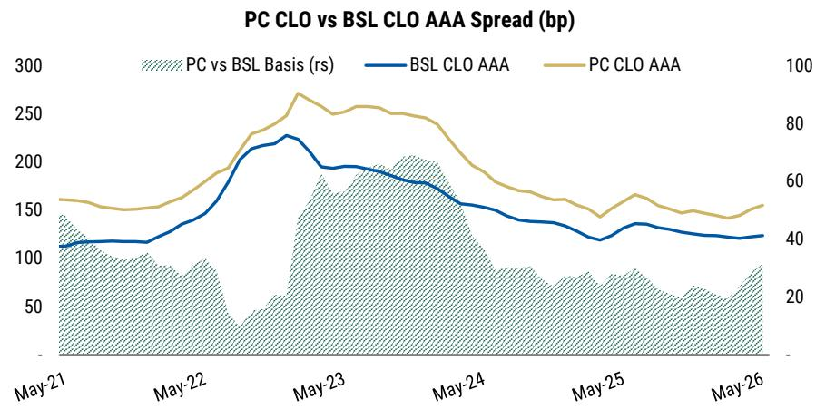

line chart

| Date   | PC vs BSL Basis (rs) | BSL CLO AAA | PC CLO AAA |
|--------|----------------------|-------------|------------|
| May-21 | ~140                 | ~110        | ~55        |
| May-22 | ~90                  | ~130        | ~60        |
| May-23 | ~180                 | ~230        | ~90        |
| May-24 | ~150                 | ~180        | ~70        |
| May-25 | ~80                  | ~130        | ~50        |
| May-26 | ~90                  | ~120        | ~55        |

Source: PitchBook LCD, MS

MS & CO. LLC

## Joyce Jiang

Strategist

Joyce.Jiang@morganstanley.com +1 212 761-0165

MS & CO. INTERNATIONAL PLC+

## Vasundhara Goel

Strategist

Vasundhara.Goel@morganstanley.com +44 20 7677-0693

MS & CO. LLC

## Gabriel Reyes Esclasans

Strategist

Gabriel.Reyes.Esclasans@morganstanley.com +1 212 761-4134

## James Egan

Strategist

James.F.Egan@MorganStanley.com +1 212 761-4715

MS does and seeks to do business with companies covered in MS. As a result, investors should be aware that the firm may have a conflict of interest that could affect the objectivity of MS. Investors should consider MS as only a single factor in making their investment decision.

## For analyst certification and other important disclosures, refer to the Disclosure Section, located at the end of this report.

+= Analysts employed by non-U.S. affiliates are not registered with FINRA, may not be associated persons of the member and may not be subject to FINRA restrictions on communications with a subject company, public appearances and trading securities held by a research analyst account.

## Client Feedback from our Outlook Marketing

We have been on the road meeting with a broad group of CLO investors across the Atlantic. Based on our client conversations, investors are overall more constructive towards US vs Europe on the macro and fundamental backdrop. However, with tight valuation, selectivity remains key. Manager quality, deal structure, and relative value considerations are becoming increasingly important as market participants focus more closely on downside risks and long-term differentiation.

## Manager Selection Remains Paramount

Across nearly all conversations, manager selection emerged as one of the most important considerations for CLO investing. With credit spreads remaining relatively tight across much of the capital stack and AI-disruption concerns driving greater dispersion in collateral performance, investors increasingly focused on manager specific alpha over broad market beta. Investors in general agree with our view that the cycle is characterized less by directional market moves and more by dispersion across portfolios, underscoring the importance of underwriting discipline, portfolio construction, and trading execution.

Investor preferences generally skew toward established managers with long track records and demonstrated performance through multiple credit cycles. This preference appears particularly strong in Europe, where many investors see limited compensation for taking emerging-manager risk given what they see as thin spread pickup for newer managers. Managers with lower software exposure and a well-thought-out framework for assessing AI risk are generally viewed more favorably. Among equity investors, there is a preference for managers with greater control, especially in private credit deals.

Manager consolidation remains topical. While new managers have sprung up at a fast pace, we have also seen a number of acquisitions among managers. Managers compete to grow scale organically or inorganically to broaden capabilities, improve efficiency and deepen relationships with investors and financing providers. Larger managers typically have greater access to warehouse financing, ability to attract large anchor investors, and more dedicated workout and restructuring resources.

Increasingly, investors also view AI and data infrastructure as important differentiators. As AI disruption becomes a more prominent investment consideration, larger platforms with greater resources and budgets are better positioned to develop AI capacity – leveraging AI tools in their credit selection and portfolio management process.

## Private Credit CLOs – Not All Deals Are Created Equal

Private credit CLOs have become a key topic of discussion across our investor meetings, although sentiment has turned more cautious amid a growing number of negative headlines surrounding direct lending, BDCs, and software related risk. Despite the recent spread widening, many investors continued to view current spread premiums vs BSL CLOs as inadequately compensated for the additional complexity, illiquidity, and valuation uncertainty inherent in private credit assets.

As highlighted in our Mid-Year Outlook (A Balancing Act), we expect defaults to ramp up to 5.5% in BSL and 8% in PC through mid 2027, as AI-exposed names are forced to confront their near-term maturity walls. We expect the basis between PC and BSL deals to widen, reflecting a more balanced supply-demand backdrop, and incrementally weaker fundamentals within PC. In particular, we view 40bp spread pickup vs BSL as an interesting entry point for PC AAAs.

Investors we spoke with broadly agree with our views. While they generally do not expect the PC vs BSL AAA spread premium to revisit 60-70bp levels observed a few years ago, given the expansion of the investor base that has structurally compressed the basis, they do view current spread levels too tight to generate appealing risk-reward for the asset class. While required spread premiums varied considerably across investors, many clients shared our view, citing a pickup of at least 40bp as necessary to justify incremental allocation, with some identifying \~150bp on PC AAAs as a practical floor for meaningful participation. The view on spread pickup was similar for both US and EU PC CLOs.

That said, investors acknowledged that private credit is too diverse to be painted in a broad brushstroke. There is wide differentiation across deals. Some investors highlighted the performance should be assessed across multiple dimensions, e.g., by financing- vs arbitrage-driven deals, and by underlying borrower size. Financing transactions, particularly those sponsored by managers with greater control over assets and workout processes, were preferred. Borrower EBITDA size is another important consideration. Several investors expressed greater caution towards upper middle market (MM) segments where documentation standards and covenant protections have gradually weakened. We noted the growing prevalence of cov-lite deals in upper MM segments amid intense competition with the BSL market in Private Credit Tracker 4Q25 – As the Credit Cycle Turns. By contrast, lower MM deals were viewed more constructively, benefitting from stronger covenant protections, smaller lender groups, and greater influence over restricting outcomes, all of which should support higher recovery rates.

Exhibit 2: PC vs BSL AAAs widened to 32bp over the 3 months ending in May  

line chart

| Date   | PC CLO AAA | BSL CLO AAA |
|--------|------------|-------------|
| May-21 | 150        | 110         |
| May-22 | 180        | 140         |
| May-23 | 270        | 220         |
| May-24 | 240        | 160         |
| May-25 | 150        | 130         |
| May-26 | 140        | 120         |

Source: PitchBook LCD, MS

Exhibit 3: PC vs BSL BBBs widened to levels last seen two years ago  
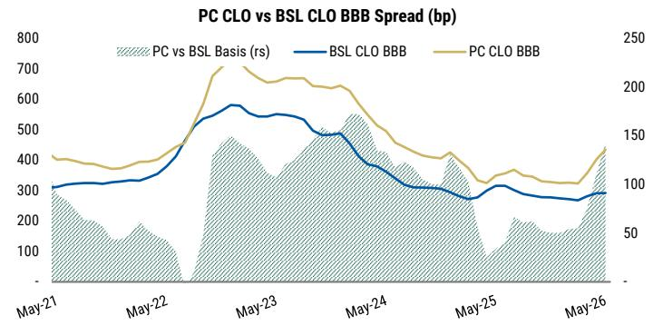

line chart

| Date   | PC vs BSL Basis (rs) | BSL CLO BBB | PC CLO BBB |
|--------|----------------------|-------------|------------|
| May-21 | ~300                 | ~300        | ~400       |
| May-22 | ~400                 | ~400        | ~500       |
| May-23 | ~500                 | ~550        | ~700       |
| May-24 | ~450                 | ~450        | ~650       |
| May-25 | ~300                 | ~300        | ~300       |
| May-26 | ~400                 | ~300        | ~450       |

Source: PitchBook LCD, MS

## Investors Prefer US Risk, but See Better Value in Europe

Regional preferences varied across investors. Most investors still favor US over Europe from a fundamental perspective. While acknowledging the greater software exposure in the US market, investors appeared more concerned about the weaker macro in Europe. The higher exposure of Europe to the energy shock ranks high in the factors, and investors also cited slower growth prospects and longer-term structural challenges as reasons for maintaining an overall preference for US over Europe.

Beyond macro considerations, investors highlighted several structural advantages of the US CLO market. The US benefits from greater market depth, a broader manager universe, and a significantly more diversified issuer base. This diversity is particularly valuable in the current environment, where aggregate credit fundamentals remain healthy, but performance dispersion across sectors and issuers continues to widen.

That said, investors also noted that European CLOs currently screen more attractive on a relative value basis, particularly at the top of the stack. Several investors preferred European AAA/AA tranches to US equivalents, also in expectation of favorable technicals with a potential demand boost from insurers under the new Solvency 2 rules. However, enthusiasm generally diminished further down the capital structure, where investors thought valuation advantages were less compelling relative to the underlying macro and credit risks and more overlap within CLO portfolios. In short, while the fundamental preference remains firmly tilted toward the US, relative value considerations are increasingly drawing investors toward Europe senior tranches.

Exhibit 4: In US NI AAAs screen cheaper to AAs and As  
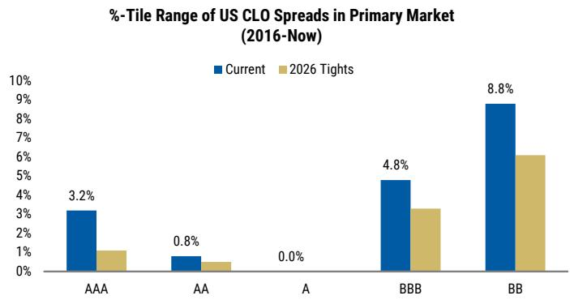

bar chart

%-Tile Range of US CLO Spreads in Primary Market (2016-Nov)
| Ticker | Current (%) | 2026 Tights (%) |
| :--- | :--- | :--- |
| AAA | 3.2 | 1.0 |
| AA | 0.8 | 0.4 |
| A | 0.0 | 0.0 |
| BBB | 4.8 | 3.2 |
| BB | 8.8 | 6.1 |

Source: MS, Bloomberg

Exhibit 5: In Europe, NI AAAs screen relatively cheaper, tracking \~45th %-tile  
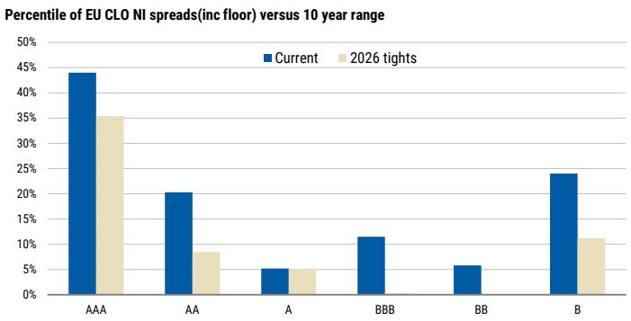

bar chart

Percentile of EU CLO NI spreads(inc floor) versus 10 year range
| Rating | Current (%) | 2026 tights (%) |
| :--- | :--- | :--- |
| AAA | 44 | 35 |
| AA | 20 | 8 |
| A | 5 | 5 |
| BBB | 11 | 0 |
| BB | 6 | 0 |
| B | 24 | 11 |

Source: MS

# Market Performance, Issuance, & Relative Value

## Cross-Asset Spreads Monitors

Exhibit 6: US Cross-Asset Spreads Monitor: 12-Month Ranges and Month-end Levels

<table><tr><td rowspan="2"></td><td colspan="6">SPREADS</td><td colspan="7">PRICES</td></tr><tr><td>Current</td><td>1Y Tights</td><td>1Y Wides</td><td>▲ MTD</td><td>▲ YTD</td><td>%-tile, 12m</td><td>Current</td><td>1Y Highs</td><td>1Y Lows</td><td>▲ MTD</td><td>▲ YTD</td><td colspan="2">%-tile, 12m</td></tr><tr><td>US CLO AAA</td><td>123</td><td>123</td><td>136</td><td>-4.50</td><td>-5.62</td><td>4.6% ■</td><td>100.21</td><td>100.35</td><td>99.97</td><td>0.05</td><td>-0.03</td><td>30.5%</td><td>■</td></tr><tr><td>US CLO AA</td><td>164</td><td>162</td><td>182</td><td>0.49</td><td>-6.68</td><td>5.0% ■</td><td>100.15</td><td>100.33</td><td>99.79</td><td>-0.07</td><td>0.03</td><td>83.3%</td><td>■</td></tr><tr><td>US CLO A</td><td>196</td><td>195</td><td>218</td><td>-1.65</td><td>-4.84</td><td>6.5% ■</td><td>100.19</td><td>100.47</td><td>99.78</td><td>-0.02</td><td>-0.16</td><td>14.6%</td><td>■</td></tr><tr><td>US CLO BBB</td><td>326</td><td>318</td><td>352</td><td>-3.51</td><td>0.38</td><td>39.3% ■</td><td>99.80</td><td>100.85</td><td>98.60</td><td>0.10</td><td>-0.42</td><td>23.5%</td><td>■</td></tr><tr><td>US CLO BB</td><td>820</td><td>684</td><td>893</td><td>-21.42</td><td>87.16</td><td>77.6% ■</td><td>93.72</td><td>98.22</td><td>90.57</td><td>0.65</td><td>-2.76</td><td>23.1%</td><td>■</td></tr><tr><td>US Loans</td><td>428</td><td>387</td><td>458</td><td>0.55</td><td>33.49</td><td>80.6% ■</td><td>95.63</td><td>97.77</td><td>94.57</td><td>-0.05</td><td>-1.45</td><td>18.9%</td><td>■</td></tr><tr><td>BB Loans</td><td>250</td><td>245</td><td>268</td><td>-0.08</td><td>-5.64</td><td>7.3% ■</td><td>99.51</td><td>99.88</td><td>98.85</td><td>-0.04</td><td>0.06</td><td>61.7%</td><td>■</td></tr><tr><td>B Loans</td><td>430</td><td>387</td><td>476</td><td>-2.22</td><td>37.95</td><td>76.8% ■</td><td>96.43</td><td>98.43</td><td>94.76</td><td>0.06</td><td>-1.63</td><td>22.7%</td><td>■</td></tr><tr><td>IG Cash Index OAS</td><td>71</td><td>71</td><td>93</td><td>-6.81</td><td>-6.10</td><td>1.5% ■</td><td>94.20</td><td>96.46</td><td>92.15</td><td>0.40</td><td>-0.99</td><td>35.9%</td><td>■</td></tr><tr><td>IG Cash Index OAS BBB</td><td>90</td><td>90</td><td>114</td><td>-7.98</td><td>-8.41</td><td>0.0% ■</td><td>94.83</td><td>97.05</td><td>92.43</td><td>0.39</td><td>-0.95</td><td>36.6%</td><td>■</td></tr><tr><td>HY Cash Index OAS</td><td>256</td><td>248</td><td>338</td><td>-15.04</td><td>-11.87</td><td>2.7% ■</td><td>97.49</td><td>98.53</td><td>95.56</td><td>-0.02</td><td>-0.56</td><td>45.9%</td><td>■</td></tr><tr><td>HY Cash Index OAS BB</td><td>150</td><td>148</td><td>212</td><td>-11.33</td><td>-13.34</td><td>1.1% ■</td><td>98.84</td><td>100.35</td><td>97.24</td><td>0.01</td><td>-1.12</td><td>30.5%</td><td>■</td></tr><tr><td>HY Cash Index OAS B</td><td>272</td><td>250</td><td>367</td><td>-20.09</td><td>4.34</td><td>25.8% ■</td><td>99.53</td><td>100.68</td><td>97.22</td><td>0.23</td><td>-0.81</td><td>49.4%</td><td>■</td></tr></table>

Source: MS, Bloomberg, Markit, PitchBook | LCD. Note: Spreads are in basis points

Exhibit 7: EU Cross-Asset Spreads Monitor: 12-Month Ranges and Month-end Levels

<table><tr><td rowspan="2"></td><td colspan="5">SPREADS</td><td rowspan="2">- %-tile, 12m</td><td colspan="7">PRICES</td></tr><tr><td>Current</td><td>1Y Tights</td><td>1Y Wides</td><td>▲ MTD</td><td>▲ YTD</td><td>Current</td><td>1Y Highs</td><td>1Y Lows</td><td>▲ MTD</td><td>▲ YTD</td><td colspan="2">%-tile, 12m</td></tr><tr><td>EU CLO AAA</td><td>102</td><td>98</td><td>113</td><td>-1.00</td><td>1.50</td><td>25.4%</td><td>■</td><td>100.0</td><td>100.0</td><td>100.0</td><td>0.00</td><td>0.00</td><td>9.8%</td></tr><tr><td>EU CLO AA</td><td>165</td><td>163</td><td>200</td><td>-10.00</td><td>-12.50</td><td>1.9%</td><td>■</td><td>100.0</td><td>100.0</td><td>99.7</td><td>0.20</td><td>0.00</td><td>54.9%</td></tr><tr><td>EU CLO A</td><td>215</td><td>198</td><td>253</td><td>-10.00</td><td>-10.00</td><td>25.4%</td><td>■</td><td>100.0</td><td>100.0</td><td>99.3</td><td>0.50</td><td>0.00</td><td>76.4%</td></tr><tr><td>EU CLO BBB</td><td>330</td><td>298</td><td>393</td><td>-20.00</td><td>-2.50</td><td>45.0%</td><td>■</td><td>99.5</td><td>100.0</td><td>98.5</td><td>0.50</td><td>-0.40</td><td>25.4%</td></tr><tr><td>EU CLO BB</td><td>643</td><td>565</td><td>735</td><td>-25.00</td><td>37.50</td><td>76.4%</td><td>■</td><td>96.8</td><td>99.7</td><td>94.0</td><td>1.75</td><td>-2.65</td><td>25.4%</td></tr><tr><td>EU CLO B</td><td>1,058</td><td>825</td><td>1,180</td><td>-15.00</td><td>112.50</td><td>80.3%</td><td>■</td><td>93.5</td><td>98.0</td><td>90.5</td><td>1.50</td><td>-4.25</td><td>23.5%</td></tr><tr><td>EU Loans</td><td>451</td><td>427</td><td>502</td><td>-19.41</td><td>2.06</td><td>49.0%</td><td>■</td><td>96.6</td><td>98.2</td><td>94.8</td><td>0.63</td><td>-0.40</td><td>29.4%</td></tr><tr><td>BB Loans</td><td>267</td><td>266</td><td>361</td><td>-4.31</td><td>-84.96</td><td>1.9%</td><td>■</td><td>100.3</td><td>100.3</td><td>96.9</td><td>0.15</td><td>2.75</td><td>98.0%</td></tr><tr><td>B Loans</td><td>428</td><td>415</td><td>477</td><td>-15.58</td><td>13.86</td><td>49.0%</td><td>■</td><td>97.6</td><td>98.7</td><td>95.9</td><td>0.54</td><td>-0.86</td><td>31.3%</td></tr><tr><td>IG Cash Index OAS</td><td>78</td><td>72</td><td>96</td><td>-2.79</td><td>-0.31</td><td>33.3%</td><td>■</td><td>97.5</td><td>98.6</td><td>95.7</td><td>0.55</td><td>-0.07</td><td>25.4%</td></tr><tr><td>IG Cash Index OAS BBB</td><td>90</td><td>83</td><td>110</td><td>-2.87</td><td>0.66</td><td>35.2%</td><td>■</td><td>98.0</td><td>99.1</td><td>96.3</td><td>0.56</td><td>-0.15</td><td>25.4%</td></tr><tr><td>HY Cash Index OAS</td><td>259</td><td>249</td><td>319</td><td>-21.78</td><td>-3.51</td><td>11.7%</td><td>■</td><td>98.0</td><td>99.5</td><td>96.0</td><td>0.40</td><td>-0.66</td><td>23.5%</td></tr><tr><td>HY Cash Index OAS BB</td><td>162</td><td>159</td><td>212</td><td>-12.59</td><td>-13.16</td><td>1.9%</td><td>■</td><td>100.4</td><td>101.9</td><td>98.7</td><td>0.37</td><td>-0.53</td><td>21.5%</td></tr><tr><td>HY Cash Index OAS B</td><td>340</td><td>290</td><td>431</td><td>-34.90</td><td>24.67</td><td>52.9%</td><td>■</td><td>98.3</td><td>100.9</td><td>95.9</td><td>0.22</td><td>-1.59</td><td>23.5%</td></tr></table>

Source: MS, Bloomberg, Markit, PitchBook | LCD. Note: Spreads are in basis points

## Total Return: CLOs and Comparable Asset Classes

Exhibit 8: Total Return Tracker: US CLOs and Comparable Asset Classes

<table><tr><td rowspan="2"></td><td colspan="4">Total Return (US)</td></tr><tr><td>May 2026</td><td>Apr 2026</td><td>2026 YTD</td><td>2025 YE</td></tr><tr><td>US CLO AAA</td><td>0.46%</td><td>0.57%</td><td>2.04%</td><td>5.42%</td></tr><tr><td>US CLO AA</td><td>0.37%</td><td>0.76%</td><td>2.26%</td><td>5.94%</td></tr><tr><td>US CLO A</td><td>0.45%</td><td>0.54%</td><td>2.20%</td><td>6.31%</td></tr><tr><td>US CLO BBB</td><td>0.68%</td><td>1.68%</td><td>2.46%</td><td>6.42%</td></tr><tr><td>US CLO BB</td><td>1.66%</td><td>2.94%</td><td>1.82%</td><td>8.94%</td></tr><tr><td>US Loans</td><td>0.51%</td><td>1.29%</td><td>1.24%</td><td>5.90%</td></tr><tr><td>BB Loans</td><td>0.48%</td><td>1.09%</td><td>2.29%</td><td>6.26%</td></tr><tr><td>B Loans</td><td>0.59%</td><td>1.39%</td><td>1.07%</td><td>6.18%</td></tr><tr><td>IG Corp</td><td>0.76%</td><td>0.45%</td><td>0.67%</td><td>7.77%</td></tr><tr><td>IG Corp BBB</td><td>0.82%</td><td>0.67%</td><td>0.91%</td><td>8.20%</td></tr><tr><td>HY Corp</td><td>0.49%</td><td>1.69%</td><td>1.68%</td><td>8.62%</td></tr><tr><td>HY Corp BB</td><td>0.50%</td><td>1.45%</td><td>1.67%</td><td>9.02%</td></tr><tr><td>HY Corp B</td><td>0.74%</td><td>1.80%</td><td>1.90%</td><td>8.44%</td></tr><tr><td>HY Corp CCC</td><td>0.21%</td><td>2.88%</td><td>1.80%</td><td>8.27%</td></tr></table>

Source: MS, Bloomberg, Markit, PitchBook | LCD

Exhibit 9: Total Return Tracker: EU CLOs and Comparable Asset Classes

<table><tr><td rowspan="2"></td><td colspan="4">Total Return (EU)</td></tr><tr><td>May 2026</td><td>Apr 2026</td><td>2026 YTD</td><td>2025 YE</td></tr><tr><td>EU CLO AAA</td><td>0.27%</td><td>0.32%</td><td>1.30%</td><td>3.20%</td></tr><tr><td>EU CLO AA</td><td>0.53%</td><td>0.50%</td><td>1.62%</td><td>4.20%</td></tr><tr><td>EU CLO A</td><td>0.87%</td><td>0.64%</td><td>1.82%</td><td>4.73%</td></tr><tr><td>EU CLO BBB</td><td>0.98%</td><td>1.01%</td><td>1.86%</td><td>6.63%</td></tr><tr><td>EU CLO BB</td><td>2.49%</td><td>1.29%</td><td>0.75%</td><td>9.50%</td></tr><tr><td>EU CLO B</td><td>2.58%</td><td>2.66%</td><td>0.57%</td><td>13.80%</td></tr><tr><td>EU Loans</td><td>0.73%</td><td>1.85%</td><td>1.52%</td><td>4.07%</td></tr><tr><td>BB Loans</td><td>0.52%</td><td>1.17%</td><td>2.48%</td><td>2.81%</td></tr><tr><td>B Loans</td><td>0.81%</td><td>1.90%</td><td>1.42%</td><td>4.69%</td></tr><tr><td>IG Corp</td><td>0.94%</td><td>0.94%</td><td>0.89%</td><td>3.03%</td></tr><tr><td>IG Corp BBB</td><td>0.96%</td><td>0.98%</td><td>0.90%</td><td>3.42%</td></tr><tr><td>HY Corp</td><td>1.02%</td><td>1.82%</td><td>1.27%</td><td>5.24%</td></tr><tr><td>HY Corp BB</td><td>1.06%</td><td>1.50%</td><td>1.23%</td><td>5.24%</td></tr><tr><td>HY Corp B</td><td>0.84%</td><td>2.51%</td><td>1.27%</td><td>5.82%</td></tr><tr><td>HY Corp CCC</td><td>1.13%</td><td>2.72%</td><td>2.79%</td><td>-2.15%</td></tr></table>

Source: MS, Bloomberg, Markit, PitchBook | LCD

## US and European CLO Portfolio Sharpe Ratios

Exhibit 10: LTM Sharpe Ratios\* of Loan Index and CLO Portfolio Total Returns

<table><tr><td colspan="14">US Deals Trailing 12 Month Sharpe Ratio</td><td></td></tr><tr><td colspan="2"></td><td>May-26</td><td>Apr-26</td><td>Mar-26</td><td>Feb-26</td><td>Jan-26</td><td>Dec-25</td><td>Nov-25</td><td>Oct-25</td><td>Sep-25</td><td>Aug-25</td><td>Jul-25</td><td>Jun-25</td><td>May-25</td></tr><tr><td rowspan="4">CLOs</td><td>25th Pct</td><td>2.29</td><td>2.46</td><td>1.90</td><td>1.55</td><td>2.23</td><td>2.88</td><td>2.85</td><td>3.09</td><td>3.41</td><td>3.53</td><td>3.66</td><td>3.56</td><td>3.35</td></tr><tr><td>Average</td><td>2.86</td><td>2.91</td><td>2.32</td><td>1.93</td><td>2.77</td><td>3.51</td><td>3.43</td><td>3.62</td><td>3.91</td><td>4.02</td><td>4.19</td><td>4.09</td><td>3.83</td></tr><tr><td>Median</td><td>2.78</td><td>2.89</td><td>2.29</td><td>1.91</td><td>2.77</td><td>3.45</td><td>3.42</td><td>3.63</td><td>3.98</td><td>4.11</td><td>4.33</td><td>4.24</td><td>3.99</td></tr><tr><td>75th Pct</td><td>3.32</td><td>3.31</td><td>2.68</td><td>2.26</td><td>3.28</td><td>4.21</td><td>4.11</td><td>4.31</td><td>4.63</td><td>4.79</td><td>4.99</td><td>4.93</td><td>4.68</td></tr><tr><td rowspan="4">Loan Index</td><td>BB</td><td>6.83</td><td>5.40</td><td>3.34</td><td>3.16</td><td>3.50</td><td>3.54</td><td>3.59</td><td>3.70</td><td>4.05</td><td>4.08</td><td>4.26</td><td>4.15</td><td>3.99</td></tr><tr><td>B</td><td>2.61</td><td>2.57</td><td>1.54</td><td>1.56</td><td>2.37</td><td>2.41</td><td>2.45</td><td>2.54</td><td>3.00</td><td>3.11</td><td>3.11</td><td>2.93</td><td>2.80</td></tr><tr><td>CCC</td><td>(0.33)</td><td>0.04</td><td>(0.69)</td><td>(0.45)</td><td>0.21</td><td>0.41</td><td>0.62</td><td>0.64</td><td>0.81</td><td>1.09</td><td>1.07</td><td>0.72</td><td>0.65</td></tr><tr><td>LL 100</td><td>2.83</td><td>2.76</td><td>1.87</td><td>1.86</td><td>2.95</td><td>2.98</td><td>2.95</td><td>3.03</td><td>3.33</td><td>3.36</td><td>3.28</td><td>3.13</td><td>3.09</td></tr></table>

<table><tr><td colspan="14">EU Deals Trailing 12 Month Sharpe Ratio</td><td></td></tr><tr><td colspan="2"></td><td>May-26</td><td>Apr-26</td><td>Mar-26</td><td>Feb-26</td><td>Jan-26</td><td>Dec-25</td><td>Nov-25</td><td>Oct-25</td><td>Sep-25</td><td>Aug-25</td><td>Jul-25</td><td>Jun-25</td><td>May-25</td></tr><tr><td rowspan="4">CLOs</td><td>25th Pct</td><td>1.34</td><td>1.48</td><td>0.81</td><td>0.73</td><td>1.28</td><td>1.66</td><td>1.71</td><td>1.80</td><td>2.35</td><td>2.48</td><td>2.76</td><td>2.86</td><td>2.84</td></tr><tr><td>Average</td><td>1.67</td><td>1.79</td><td>1.16</td><td>1.12</td><td>1.73</td><td>2.23</td><td>2.26</td><td>2.33</td><td>2.86</td><td>2.96</td><td>3.24</td><td>3.36</td><td>3.32</td></tr><tr><td>Median</td><td>1.67</td><td>1.81</td><td>1.17</td><td>1.14</td><td>1.62</td><td>2.20</td><td>2.22</td><td>2.29</td><td>2.90</td><td>3.00</td><td>3.31</td><td>3.45</td><td>3.41</td></tr><tr><td>75th Pct</td><td>2.03</td><td>2.13</td><td>1.51</td><td>1.49</td><td>2.18</td><td>2.72</td><td>2.78</td><td>2.83</td><td>3.46</td><td>3.52</td><td>3.90</td><td>4.03</td><td>3.94</td></tr><tr><td rowspan="2">Loan Index</td><td>ELLI BB</td><td>2.86</td><td>2.77</td><td>1.25</td><td>1.10</td><td>1.05</td><td>1.37</td><td>1.62</td><td>1.92</td><td>2.43</td><td>2.44</td><td>2.54</td><td>2.62</td><td>2.53</td></tr><tr><td>ELLI B</td><td>1.95</td><td>1.95</td><td>0.80</td><td>0.99</td><td>1.77</td><td>1.92</td><td>1.87</td><td>1.93</td><td>2.39</td><td>2.53</td><td>2.55</td><td>2.73</td><td>2.71</td></tr></table>

Source: MS, Intex, PitchBook | LCD. \*Note: Includes only CLO deals at least one year post-closing and still within their reinvestment period. Performance metric uses R/σ (return divided by volatility), without subtracting the risk-free rate.

## CLO Creation Volumes

In the US, 35 new issue deals, 43 refis, and 44 resets priced, totaling \$16.8bn, \$16.9bn, and \$22.1bn, respectively, over the course of the month.

In Europe, 14 new issue deals, 5 refis, and 5 resets priced, totaling €5.7bn, €1.8bn, and €2.4bn, respectively, over the course of the month.

In the US, 2026 YTD has seen 148 new issue deals, 131 refis, and 132 resets, totaling \$70.0bn, \$50.6bn, and \$63.5bn, respectively. New issue volumes are down -17.2% year over year (vs. \$84.5bn through 2025).

In Europe, 2026 YTD has seen 59 new issue deals, 18 refis, and 37 resets, totaling €24.8bn, €5.9bn, and €16.7bn, respectively. New issue volumes are down -0.1% year over year (vs. €24.8bn through 2025).

Exhibit 11: Monthly CLO Creation (New Issue and Refis/Resets)  
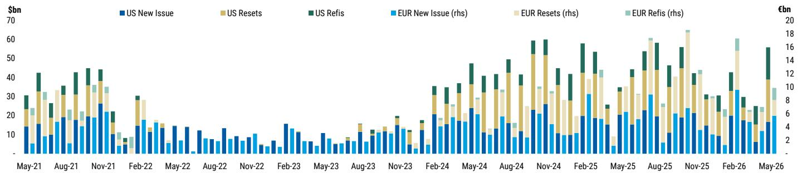

stacked bar chart

| Month | US New Issue ($bn) | US Resets ($bn) | US Refis ($bn) | EUR New Issue (rhs) ($bn) | EUR Resets (rhs) ($bn) | EUR Refis (rhs) ($bn) |
|---|---|---|---|---|---|---|
| May-21 | 14 | 15 | 8 | 3 | 2 | 2 |
| Aug-21 | 17 | 19 | 10 | 5 | 3 | 3 |
| Nov-21 | 26 | 18 | 10 | 10 | 5 | 3 |
| Feb-22 | 14 | 10 | 10 | 5 | 2 | 2 |
| May-22 | 14 | 10 | 5 | 5 | 1 | 0 |
| Aug-22 | 13 | 8 | 5 | 5 | 1 | 0 |
| Nov-22 | 8 | 8 | 5 | 5 | 1 | 0 |
| Feb-23 | 16 | 10 | 5 | 5 | 1 | 0 |
| May-23 | 8 | 5 | 5 | 5 | 1 | 0 |
| Aug-23 | 10 | 10 | 5 | 5 | 1 | 0 |
| Nov-23 | 13 | 8 | 5 | 5 | 1 | 0 |
| Feb-24 | 20 | 15 | 10 | 5 | 3 | 0 |
| May-24 | 16 | 15 | 10 | 5 | 3 | 0 |
| Aug-24 | 16 | 20 | 10 | 5 | 3 | 0 |
| Nov-24 | 24 | 30 | 10 | 5 | 3 | 0 |
| Feb-25 | 19 | 20 | 10 | 5 | 3 | 0 |
| May-25 | 21 | 18 | 5 | 5 | 3 | 0 |
| Aug-25 | 23 | 20 | 10 | 5 | 3 | 0 |
| Nov-25 | 20 | 20 | 10 | 5 | 3 | 0 |
| Feb-26 | 20 | 18 | 10 | 5 | 3 | 0 |
| May-26 | 17 | 18 | 10 | 5 | 3 | 0 |
The chart displays a stacked bar chart with categories: US New Issue, US Resets, US Refis, EUR New Issue, EUR Resets, EUR Refis. The values for each category are labeled on the bars. The x-axis represents the months from May-21 to May-26. Values are in billions of dollars. The y-axis is labeled as currency units (e.g., $bn). The chart uses color-coded segments to distinguish between positive and negative values for each category. The total value per month is also labeled as €bn.

Source: MS, PitchBook | LCD

## New Issue CLO Arb

Exhibit 12: New Issue US CLO Arb  
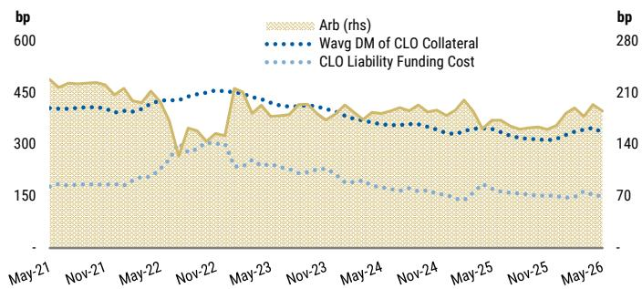

line chart

| Date    | Arb (rhs) | Wavg DM of CLO Collateral | CLO Liability Funding Cost |
|---------|-----------|---------------------------|----------------------------|
| May-21  | 450       | 400                       | 150                        |
| Nov-21  | 450       | 400                       | 150                        |
| May-22  | 450       | 400                       | 150                        |
| Nov-22  | 300       | 450                       | 200                        |
| May-23  | 450       | 450                       | 200                        |
| Nov-23  | 450       | 400                       | 150                        |
| May-24  | 450       | 350                       | 150                        |
| Nov-24  | 450       | 350                       | 150                        |
| May-25  | 450       | 350                       | 150                        |
| Nov-25  | 450       | 350                       | 150                        |
| May-26  | 450       | 350                       | 150                        |

Source: MS, PitchBook | LCD, The Yield Book. Note: We assume a ramping period of four months. In the first two months, we assume a weighted average DM of collateral consisting of 80% new issue loans and 20% loans from the secondary market. Then, we assume an even 50/50 mix of new issue and secondary loans. We then take the average of the above calculated DMs from each half to calculate the collateral DM

Exhibit 13: New Issue EU CLO Arb  
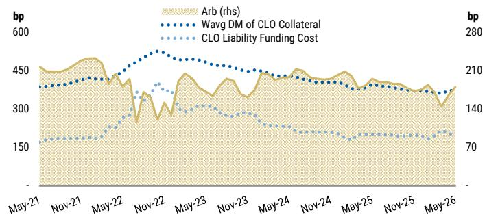

line chart

| Date    | Arb (rhs) | Wavg DM of CLO Collateral | CLO Liability Funding Cost |
|---------|-----------|---------------------------|----------------------------|
| May-21  | 450       | 350                       | 150                        |
| Nov-21  | 460       | 360                       | 155                        |
| May-22  | 440       | 380                       | 160                        |
| Nov-22  | 300       | 480                       | 350                        |
| May-23  | 450       | 470                       | 300                        |
| Nov-23  | 430       | 450                       | 280                        |
| May-24  | 440       | 440                       | 260                        |
| Nov-24  | 450       | 430                       | 240                        |
| May-25  | 430       | 420                       | 220                        |
| Nov-25  | 420       | 410                       | 210                        |
| May-26  | 350       | 380                       | 170                        |

Source: MS, PitchBook | LCD. Note: We assume a ramping period of four months. In the first two months, we assume a weighted average DM of collateral consisting of 80% new issue loans and 20% loans from the secondary market. Then, we assume an even 50/50 mix of new issue and secondary loans. We then take the average of the above calculated DMs from each half to calculate the collateral DM.

## Cross-Sector Relative Value: CLOs vs. Corporates & Loans

Exhibit 14: US CLO vs. IG Corp 24-month Z-Score  
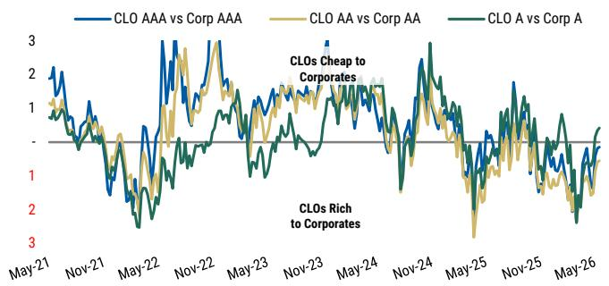

line chart

| Date    | CLO AAA vs Corp AAA | CLO AA vs Corp AA | CLO A vs Corp A |
|---------|---------------------|-------------------|-----------------|
| May-21  | ~2.0                | ~1.5              | ~1.0            |
| Nov-21  | ~1.0                | ~0.5              | ~0.0            |
| May-22  | ~2.5                | ~2.0              | ~1.5            |
| Nov-22  | ~3.0                | ~2.5              | ~2.0            |
| May-23  | ~1.5                | ~1.0              | ~0.5            |
| Nov-23  | ~2.0                | ~1.5              | ~1.0            |
| May-24  | ~1.5                | ~1.0              | ~0.5            |
| Nov-24  | ~2.5                | ~2.0              | ~1.5            |
| May-25  | ~1.0                | ~0.5              | ~0.0            |
| Nov-25  | ~1.5                | ~1.0              | ~0.5            |
| May-26  | ~1.0                | ~0.5              | ~0.0            |

Source: MS, Bloomberg, Markit

Exhibit 15: US CLO vs. HY Corp & Loans 24-month Z-Score  
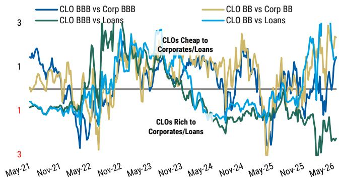

line chart

| Date    | CLO BBB vs Corp BBB | CLO BB vs Corp BB | CLO BBB vs Loans | CLO BB vs Loans |
|---------|---------------------|-------------------|------------------|-----------------|
| May-21  | ~1.5                | ~1.0              | ~0.8             | ~0.7            |
| Nov-21  | ~1.2                | ~0.9              | ~0.7             | ~0.6            |
| May-22  | ~0.8                | ~0.6              | ~0.5             | ~0.4            |
| Nov-22  | ~1.8                | ~1.5              | ~1.2             | ~1.0            |
| May-23  | ~1.6                | ~1.3              | ~1.0             | ~0.8            |
| Nov-23  | ~1.4                | ~1.1              | ~0.9             | ~0.7            |
| May-24  | ~1.2                | ~0.9              | ~0.7             | ~0.6            |
| Nov-24  | ~1.0                | ~0.7              | ~0.5             | ~0.4            |
| May-25  | ~0.8                | ~0.5              | ~0.3             | ~0.2            |
| Nov-25  | ~1.0                | ~0.7              | ~0.5             | ~0.4            |
| May-26  | ~1.5                | ~1.2              | ~0.8             | ~0.6            |

Source: MS, Bloomberg, Markit, PitchBook | LCD

Exhibit 16: EU CLO vs. IG Corp 24-month Z-Score  
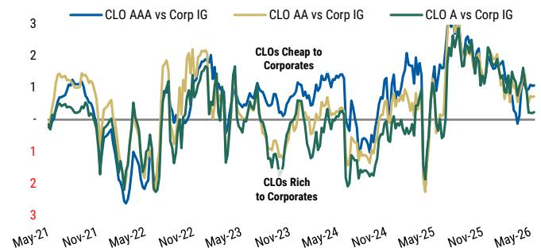

line chart

| Date   | CLO AAA vs Corp IG | CLO AA vs Corp IG | CLO A vs Corp IG |
|--------|--------------------|-------------------|------------------|
| May-21 | ~1.0               | ~1.0              | ~0.5             |
| Nov-21 | ~1.5               | ~1.5              | ~1.0             |
| May-22 | ~0.5               | ~0.5              | ~0.5             |
| Nov-22 | ~1.5               | ~1.5              | ~1.0             |
| May-23 | ~1.0               | ~1.0              | ~0.5             |
| Nov-23 | ~0.5               | ~0.5              | ~0.5             |
| May-24 | ~1.0               | ~1.0              | ~0.5             |
| Nov-24 | ~1.5               | ~1.5              | ~1.0             |
| May-25 | ~2.0               | ~2.0              | ~1.5             |
| Nov-25 | ~2.5               | ~2.5              | ~2.0             |
| May-26 | ~1.0               | ~1.0              | ~0.5             |

Source: MS. Markit, PitchBook | LCD

Exhibit 17: EU CLO vs. HY Corp & Loans 24-month Z-Score  
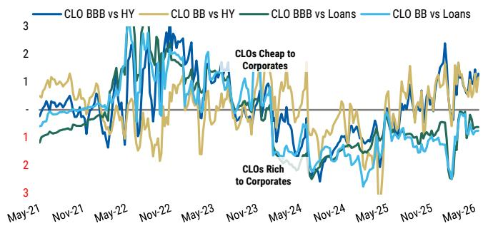

line chart

| Date    | CLO BBB vs HY | CLO BB vs HY | CLO BBB vs Loans | CLO BB vs Loans |
|---------|---------------|--------------|------------------|-----------------|
| May-21  | ~0.5          | ~0.8         | ~0.3             | ~0.4            |
| Nov-21  | ~0.7          | ~1.0         | ~0.5             | ~0.6            |
| May-22  | ~1.5          | ~1.8         | ~1.2             | ~1.6            |
| Nov-22  | ~2.5          | ~2.8         | ~2.0             | ~2.4            |
| May-23  | ~1.8          | ~1.5         | ~1.0             | ~1.3            |
| Nov-23  | ~0.5          | ~0.8         | ~0.3             | ~0.5            |
| May-24  | ~1.0          | ~1.2         | ~0.8             | ~1.0            |
| Nov-24  | ~0.5          | ~0.8         | ~0.3             | ~0.5            |
| May-25  | ~1.5          | ~1.8         | ~1.0             | ~1.2            |
| Nov-25  | ~2.0          | ~2.2         | ~1.5             | ~1.8            |
| May-26  | ~1.0          | ~1.2         | ~0.8             | ~1.0            |

Source: MS. Markit, PitchBook | LCD

## FX Hedging

We think it is useful to look at CLO AAA yields on both a hedged and unhedged basis.

We use annualized 3-month FX forwards to approximate hedging costs for yen investors. The Bloomberg tickers are JPY3M and EURJPY3M.

Note: We previously used the cross-currency basis for this analysis, but we now believe FX forwards are a more accurate encapsulation of hedging costs for overseas investors.

Exhibit 18: FX-hedged and unhedged generic US CLO yields\* for JPY-funded investors  
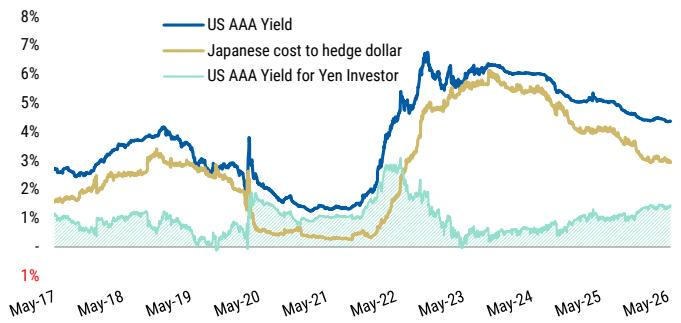

line chart

| Date   | US AAA Yield | Japanese cost to hedge dollar | US AAA Yield for Yen Investor |
|--------|--------------|-------------------------------|-------------------------------|
| May-17 | ~2.5%        | ~1.5%                         | ~1%                           |
| May-18 | ~3.5%        | ~2.5%                         | ~1.5%                         |
| May-19 | ~4.0%        | ~3.0%                         | ~1.5%                         |
| May-20 | ~3.0%        | ~1.0%                         | ~1%                           |
| May-21 | ~1.5%        | ~0.5%                         | ~1%                           |
| May-22 | ~5.0%        | ~4.0%                         | ~2.0%                         |
| May-23 | ~7.0%        | ~5.5%                         | ~1.5%                         |
| May-24 | ~6.0%        | ~5.0%                         | ~1.5%                         |
| May-25 | ~5.5%        | ~4.5%                         | ~1.5%                         |
| May-26 | ~4.5%        | ~3.0%                         | ~1.5%                         |

Source: MS, Bloomberg, Palmer Square, Markit. \*Note: Yields shown above are for the secondary market. US AAA Yield is from Palmer Square until 9/29/23, after which daily percent changes come from Markit.

Exhibit 19: FX-hedged and unhedged generic European CLO yields\* for JPY-funded investors  
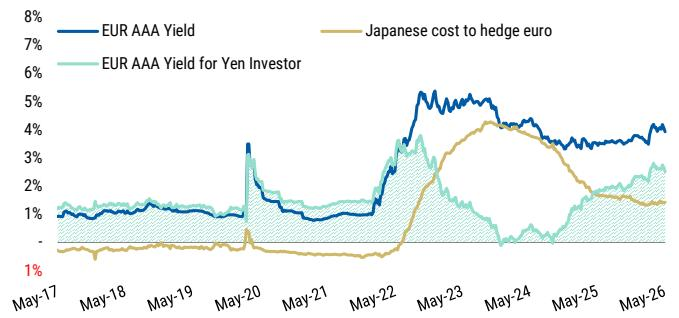

line chart

| Date   | EUR AAA Yield | Japanese cost to hedge euro | EUR AAA Yield for Yen Investor |
|--------|---------------|------------------------------|--------------------------------|
| May-17 | ~1%           | ~0%                          | ~1%                            |
| May-18 | ~1%           | ~0%                          | ~1%                            |
| May-19 | ~1%           | ~0%                          | ~1%                            |
| May-20 | ~3%           | ~0%                          | ~3%                            |
| May-21 | ~1%           | ~0%                          | ~1%                            |
| May-22 | ~4%           | ~2%                          | ~4%                            |
| May-23 | ~5%           | ~4%                          | ~3%                            |
| May-24 | ~4%           | ~4%                          | ~2%                            |
| May-25 | ~4%           | ~2%                          | ~2%                            |
| May-26 | ~4%           | ~1%                          | ~3%                            |

Source: MS, Bloomberg.\*Note: European CLO AAA yields are calculated by adding primary spreads and the 5year swap (3m Euribor)

## Liquidity Metrics, Par Coverage, & Collateral Quality Tests

## Secondary Trading Volumes by TRACE and on BWICs

We report secondary CLO/CDO trading volumes using FINRA Trade Reporting and Compliance Engine $^{®}$ (TRACE $^{®}$ ) and public BWICs.

TRACE IG volumes increased by 2.2% MoM, to \$23.5bn (against a trailing 24-month average of \$15.8bn).

TRACE BIG volumes decreased by -2.1% MoM, to \$5.0bn (against a trailing 24-month average of \$4.1bn).

US BWIC volumes increased by 20.5% MoM, to \$5.9bn (against a trailing 24-month average of \$5.2bn).

Exhibit 20: Monthly IG-rated CLO/CDO Trading Volume - TRACE  
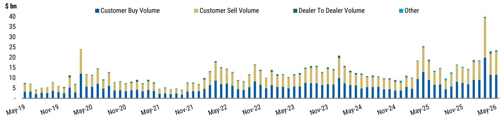

stacked bar chart

| Month | Customer Buy Volume ($ bn) | Customer Sell Volume ($ bn) | Dealer To Dealer Volume ($ bn) | Other ($ bn) |
| :--- | :--- | :--- | :--- | :--- |
| May-19 | 3 | 4 | 0 | 0 |
| Nov-19 | 2 | 5 | 0 | 0 |
| May-20 | 12 | 10 | 0 | 0 |
| Nov-20 | 6 | 5 | 0 | 0 |
| May-21 | 4 | 6 | 0 | 0 |
| Nov-21 | 2 | 5 | 0 | 0 |
| May-22 | 8 | 12 | 0 | 0 |
| Nov-22 | 6 | 7 | 0 | 0 |
| May-23 | 5 | 8 | 0 | 0 |
| Nov-23 | 7 | 10 | 0 | 0 |
| May-24 | 6 | 9 | 0 | 0 |
| Nov-24 | 4 | 7 | 0 | 0 |
| May-25 | 9 | 13 | 0 | 0 |
| Nov-25 | 7 | 11 | 0 | 0 |
| May-26 | 11 | 18 | 0 | 0 |
The chart displays stacked bars for Customer Buy Volume, Customer Sell Volume, Dealer To Dealer Volume, and Other across the timeline. The values are in billions of dollars. The data is already in English. The title is 'Customer Buy Volume, Customer Sell Volume, Dealer To Dealer Volume, Other'.

Source: MS, FINRA, TRACE

Exhibit 21: Monthly BIG-rated CLO/CDO Trading Volume - TRACE  
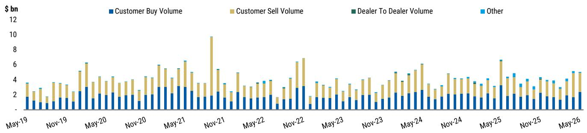

stacked bar chart

| Month | Customer Buy Volume ($ bn) | Customer Sell Volume ($ bn) | Dealer To Dealer Volume ($ bn) | Other ($ bn) |
| :--- | :--- | :--- | :--- | :--- |
| May-19 | 1.5 | 1.8 | 0.0 | 3.5 |
| Nov-19 | 1.2 | 1.5 | 0.0 | 3.0 |
| May-20 | 2.8 | 3.5 | 0.0 | 6.2 |
| Nov-20 | 1.8 | 2.0 | 0.0 | 4.0 |
| May-21 | 3.0 | 5.5 | 0.0 | 6.5 |
| Nov-21 | 1.8 | 3.5 | 0.0 | 5.5 |
| May-22 | 1.5 | 2.5 | 0.0 | 4.0 |
| Nov-22 | 1.2 | 4.0 | 0.0 | 4.5 |
| May-23 | 1.5 | 2.5 | 0.0 | 3.5 |
| Nov-23 | 1.2 | 3.0 | 0.0 | 4.0 |
| May-24 | 2.0 | 4.5 | 0.0 | 5.0 |
| Nov-24 | 1.8 | 4.5 | 0.0 | 4.0 |
| May-25 | 1.5 | 3.5 | 0.0 | 6.5 |
| Nov-25 | 2.0 | 3.5 | 0.0 | 4.5 |
| May-26 | 1.8 | 3.5 | 0.0 | 5.0 |
The chart displays a stacked bar chart with categories: Customer Buy Volume (blue), Customer Sell Volume (yellow), Dealer To Dealer Volume (green), and Other (light blue). The x-axis represents time in months from May-19 to May-26, and the y-axis represents volume in billions of dollars. The data is extracted quarterly from May-19 through May-26.

Source: MS, FINRA, TRACE

Exhibit 22: Monthly CLO BWIC Volume  
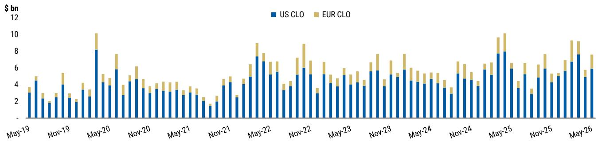

stacked bar chart

| Month    | US CLO | EUR CLO |
|----------|--------|---------|
| May-19   | 3.0    | 1.0     |
| Nov-19   | 2.0    | 1.0     |
| May-20   | 8.0    | 4.0     |
| Nov-20   | 4.0    | 2.0     |
| May-21   | 3.0    | 1.0     |
| Nov-21   | 2.0    | 1.0     |
| May-22   | 7.0    | 4.0     |
| Nov-22   | 5.0    | 3.0     |
| May-23   | 4.0    | 2.0     |
| Nov-23   | 5.0    | 2.0     |
| May-24   | 4.0    | 2.0     |
| Nov-24   | 5.0    | 2.0     |
| May-25   | 8.0    | 4.0     |
| Nov-25   | 5.0    | 2.0     |
| May-26   | 7.0    | 3.0     |

Source: MS, FINRA, TRACE

## Status of CLO Credit Enhancement and Coverage Tests

Exhibit 23: Initial AAA Par Sub by Issuance Vintage

<table><tr><td>Vintage</td><td>25th pct</td><td>50th pct</td><td>75th pct</td></tr><tr><td>2013</td><td>36.6%</td><td>37.8%</td><td>39.1%</td></tr><tr><td>2014</td><td>36.2%</td><td>37.4%</td><td>38.5%</td></tr><tr><td>2015</td><td>35.9%</td><td>36.7%</td><td>38.2%</td></tr><tr><td>2016</td><td>35.9%</td><td>36.8%</td><td>38.1%</td></tr><tr><td>2017</td><td>36.0%</td><td>36.8%</td><td>38.3%</td></tr><tr><td>2018</td><td>36.0%</td><td>37.0%</td><td>39.4%</td></tr><tr><td>2019</td><td>36.0%</td><td>36.8%</td><td>39.0%</td></tr><tr><td>2020</td><td>36.0%</td><td>38.0%</td><td>40.0%</td></tr><tr><td>2021</td><td>36.0%</td><td>37.2%</td><td>38.5%</td></tr><tr><td>2022</td><td>36.0%</td><td>37.1%</td><td>38.5%</td></tr><tr><td>2023</td><td>36.2%</td><td>38.0%</td><td>39.0%</td></tr></table>

Source: MS, Intex

Exhibit 24: Median US CLO Junior OC Cushions  
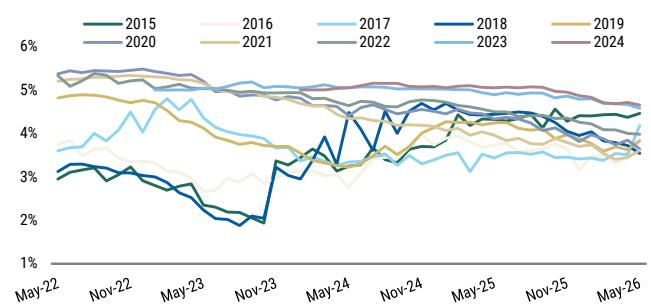

line chart

| Month    | 2015  | 2016  | 2017  | 2018  | 2019  | 2020  | 2021  | 2022  | 2023  | 2024  |
|----------|-------|-------|-------|-------|-------|-------|-------|-------|-------|-------|
| May-22   | 3.0%  | 3.0%  | 3.5%  | 3.0%  | 4.8%  | 5.5%  | 5.0%  | 5.5%  | 5.5%  | 5.5%  |
| Nov-22   | 3.0%  | 3.0%  | 3.5%  | 3.0%  | 4.8%  | 5.5%  | 5.0%  | 5.5%  | 5.5%  | 5.5%  |
| May-23   | 2.5%  | 2.5%  | 4.0%  | 2.0%  | 4.5%  | 5.0%  | 4.5%  | 5.0%  | 5.0%  | 5.0%  |
| Nov-23   | 2.0%  | 2.0%  | 3.5%  | 1.8%  | 4.0%  | 4.8%  | 4.0%  | 4.8%  | 4.8%  | 4.8%  |
| May-24   | 3.0%  | 3.0%  | 3.5%  | 4.5%  | 4.5%  | 4.8%  | 3.5%  | 4.8%  | 4.8%  | 4.8%  |
| Nov-24   | 3.5%  | 3.5%  | 3.5%  | 4.8%  | 4.8%  | 4.8%  | 3.5%  | 4.8%  | 4.8%  | 4.8%  |
| May-25   | 4.0%  | 4.0%  | 3.5%  | 4.8%  | 4.8%  | 4.8%  | 3.5%  | 4.8%  | 4.8%  | 4.8%  |
| Nov-25   | 4.0%  | 4.0%  | 3.5%  | 4.8%  | 4.8%  | 4.8%  | 3.5%  | 4.8%  | 4.8%  | 4.8%  |
| May-26   | 4.0%  | 4.0%  | 3.5%  | 4.8%  | 4.8%  | 4.8%  | 3.5%  | 4.8%  | 4.8%  | 4.8%  |

Source: MS, Intex

Exhibit 25: Median European CLO Junior OC Cushions  
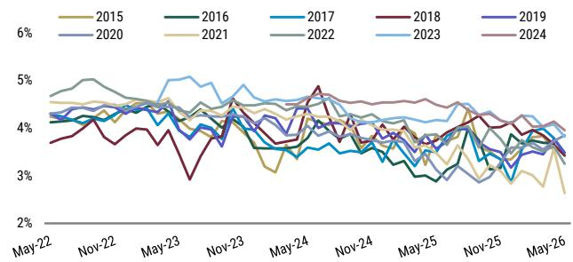

line chart

| Month | 2015 | 2016 | 2017 | 2018 | 2019 | 2020 | 2021 | 2022 | 2023 | 2024 |
| --- | --- | --- | --- | --- | --- | --- | --- | --- | --- | --- |
| May-22 |  |  |  |  |  |  |  |  |  |  |
| Nov-22 |  |  |  |  |  |  |  |  |  |  |
| May-23 |  |  |  |  |  |  |  |  |  |  |
| Nov-23 |  |  |  |  |  |  |  |  |  |  |
| May-24 |  |  |  |  |  |  |  |  |  |  |
| Nov-24 |  |  |  |  |  |  |  |  |  |  |
| May-25 |  |  |  |  |  |  |  |  |  |  |
| Nov-25 |  |  |  |  |  |  |  |  |  |  |
| May-26 |  |  |  |  |  |  |  |  |  |  |

Source: MS, Intex

Exhibit 26: Median Jr. OC Cushions by Issuance Vintage

<table><tr><td rowspan="2"></td><td colspan="3">US CLOs</td><td colspan="2">European CLOs</td></tr><tr><td>Vintage</td><td>May-26</td><td>May-25</td><td>May-26</td><td>May-25</td></tr><tr><td rowspan="10">Median Junior OC Cushion</td><td>2015</td><td>4.5%</td><td>4.3%</td><td>-</td><td>3.9%</td></tr><tr><td>2016</td><td>3.8%</td><td>3.7%</td><td>-</td><td>2.9%</td></tr><tr><td>2017</td><td>4.2%</td><td>3.4%</td><td>3.5%</td><td>3.5%</td></tr><tr><td>2018</td><td>3.5%</td><td>4.4%</td><td>3.4%</td><td>3.7%</td></tr><tr><td>2019</td><td>3.8%</td><td>4.2%</td><td>3.5%</td><td>3.6%</td></tr><tr><td>2020</td><td>3.6%</td><td>4.3%</td><td>3.9%</td><td>3.1%</td></tr><tr><td>2021</td><td>3.6%</td><td>4.0%</td><td>2.6%</td><td>3.5%</td></tr><tr><td>2022</td><td>4.0%</td><td>4.5%</td><td>3.3%</td><td>3.9%</td></tr><tr><td>2023</td><td>4.6%</td><td>4.9%</td><td>3.8%</td><td>4.2%</td></tr><tr><td>2024</td><td>4.7%</td><td>5.1%</td><td>4.0%</td><td>4.5%</td></tr></table>

Source: MS, Intex

## CCC Assets in CLO Portfolios and Interest Diversion Tests

Exhibit 27: OC Test Failures and Deferred Interest in April 2026  
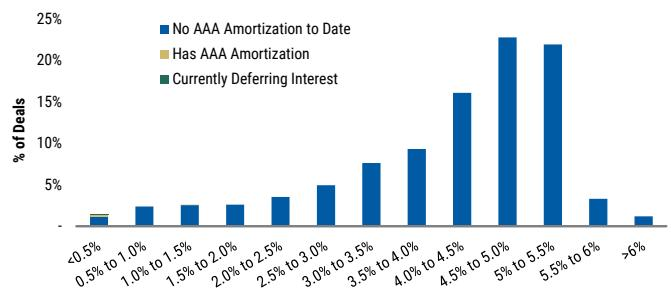

bar chart

| Rate Range | % of Deals |
| --- | --- |
| <0.5% | 1.0 |
| 0.5% to 1.0% | 2.0 |
| 1.0% to 1.5% | 2.0 |
| 1.5% to 2.0% | 2.0 |
| 2.0% to 2.5% | 3.0 |
| 2.5% to 3.0% | 4.0 |
| 3.0% to 3.5% | 5.0 |
| 3.5% to 4.0% | 7.0 |
| 4.0% to 4.5% | 9.0 |
| 4.5% to 5.0% | 16.0 |
| 5% to 5.5% | 22.0 |
| 5.5% to 6% | 21.0 |
| >6% | 1.0 |

Source: MS, Intex

Exhibit 28: Median US CLO 2.0 CCC Assets by Vintage  
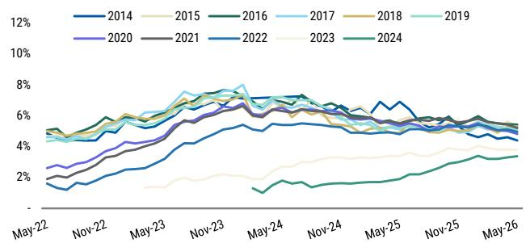

line chart

| Month    | 2014  | 2015  | 2016  | 2017  | 2018  | 2019  | 2020  | 2021  | 2022  | 2023  | 2024  |
|----------|-------|-------|-------|-------|-------|-------|-------|-------|-------|-------|-------|
| May-22   | ~1.5% | ~1.5% | ~1.5% | ~1.5% | ~1.5% | ~1.5% | ~1.5% | ~1.5% | ~1.5% | ~1.5% | ~1.5% |
| Nov-22   | ~3.0% | ~3.0% | ~3.0% | ~3.0% | ~3.0% | ~3.0% | ~3.0% | ~3.0% | ~3.0% | ~3.0% | ~3.0% |
| May-23   | ~4.5% | ~4.5% | ~4.5% | ~4.5% | ~4.5% | ~4.5% | ~4.5% | ~4.5% | ~4.5% | ~4.5% | ~4.5% |
| Nov-23   | ~6.0% | ~6.0% | ~6.0% | ~6.0% | ~6.0% | ~6.0% | ~6.0% | ~6.0% | ~6.0% | ~6.0% | ~6.0% |
| May-24   | ~7.0% | ~7.0% | ~7.0% | ~7.0% | ~7.0% | ~7.0% | ~7.0% | ~7.0% | ~7.0% | ~7.0% | ~7.0% |
| Nov-24   | ~6.5% | ~6.5% | ~6.5% | ~6.5% | ~6.5% | ~6.5% | ~6.5% | ~6.5% | ~6.5% | ~6.5% | ~6.5% |
| May-25   | ~5.5% | ~5.5% | ~5.5% | ~5.5% | ~5.5% | ~5.5% | ~5.5% | ~5.5% | ~5.5% | ~5.5% | ~5.5% |
| Nov-25   | ~4.5% | ~4.5% | ~4.5% | ~4.5% | ~4.5% | ~4.5% | ~4.5% | ~4.5% | ~4.5% | ~4.5% | ~4.5% |
| May-26   | ~3.5% | ~3.5% | ~3.5% | ~3.5% | ~3.5% | ~3.5% | ~3.5% | ~3.5% | ~3.5% | ~3.5% | ~3.5% |

Source: MS, Intex

Exhibit 29: Vintage Median %CCC in CLO Portfolios

<table><tr><td rowspan="2"></td><td colspan="3">US CLOs</td><td colspan="2">European CLOs</td></tr><tr><td>Vintage</td><td>May-26</td><td>May-25</td><td>May-26</td><td>May-25</td></tr><tr><td rowspan="10">Median CCC Assets</td><td>2015</td><td>5.3%</td><td>5.7%</td><td>-</td><td>6.3%</td></tr><tr><td>2016</td><td>5.4%</td><td>5.4%</td><td>-</td><td>6.4%</td></tr><tr><td>2017</td><td>4.8%</td><td>5.1%</td><td>3.3%</td><td>4.6%</td></tr><tr><td>2018</td><td>5.3%</td><td>4.9%</td><td>3.5%</td><td>3.5%</td></tr><tr><td>2019</td><td>5.1%</td><td>5.2%</td><td>3.8%</td><td>4.4%</td></tr><tr><td>2020</td><td>4.8%</td><td>5.3%</td><td>3.2%</td><td>4.5%</td></tr><tr><td>2021</td><td>5.2%</td><td>5.5%</td><td>4.5%</td><td>5.4%</td></tr><tr><td>2022</td><td>5.0%</td><td>4.8%</td><td>4.9%</td><td>3.8%</td></tr><tr><td>2023</td><td>3.8%</td><td>3.4%</td><td>2.3%</td><td>3.0%</td></tr><tr><td>2024</td><td>3.4%</td><td>1.9%</td><td>2.0%</td><td>1.8%</td></tr></table>

Source: MS, Intex

Exhibit 30: Median CCC Assets in CLO Portfolios  
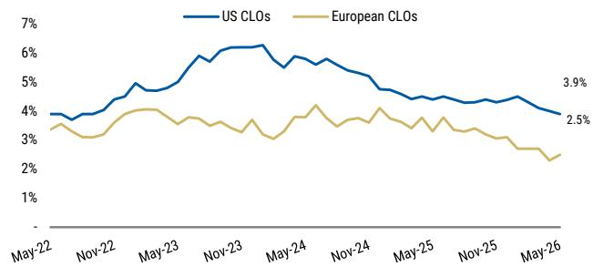

line chart

| Date   | US CLOs | European CLOs |
|--------|---------|---------------|
| May-26 | 3.9%    | 2.5%          |

Source: MS, Intex

## CLO Equity Performance

## Quarterly Equity Distributions by Vintage Quarter

Exhibit 31: Median US CLO Quarterly Equity Distributions by Vintage Quarter

<table><tr><td rowspan="2">Payment Quarter</td><td colspan="21">Vintage Quarter (by Closing Date)</td></tr><tr><td>2020-Q2</td><td>2020-Q3</td><td>2020-Q4</td><td>2021-Q1</td><td>2021-Q2</td><td>2021-Q3</td><td>2021-Q4</td><td>2022-Q1</td><td>2022-Q2</td><td>2022-Q3</td><td>2022-Q4</td><td>2023-Q1</td><td>2023-Q2</td><td>2023-Q3</td><td>2023-Q4</td><td>2024-Q1</td><td>2024-Q2</td><td>2024-Q3</td><td>2024-Q4</td><td>2025-Q1</td><td>2025-Q2</td></tr><tr><td>2021-Q2</td><td>9.6%</td><td></td><td></td><td></td><td></td><td></td><td></td><td></td><td></td><td></td><td></td><td></td><td></td><td></td><td></td><td></td><td></td><td></td><td></td><td></td><td></td></tr><tr><td>2021-Q3</td><td>4.3%</td><td>10.9%</td><td></td><td></td><td></td><td></td><td></td><td></td><td></td><td></td><td></td><td></td><td></td><td></td><td></td><td></td><td></td><td></td><td></td><td></td><td></td></tr><tr><td>2021-Q4</td><td>4.3%</td><td>4.7%</td><td>3.8%</td><td></td><td></td><td></td><td></td><td></td><td></td><td></td><td></td><td></td><td></td><td></td><td></td><td></td><td></td><td></td><td></td><td></td><td></td></tr><tr><td>2022-Q1</td><td>4.3%</td><td>4.3%</td><td>3.4%</td><td>3.3%</td><td></td><td></td><td></td><td></td><td></td><td></td><td></td><td></td><td></td><td></td><td></td><td></td><td></td><td></td><td></td><td></td><td></td></tr><tr><td>2022-Q2</td><td>4.4%</td><td>4.4%</td><td>4.0%</td><td>4.1%</td><td>4.9%</td><td></td><td></td><td></td><td></td><td></td><td></td><td></td><td></td><td></td><td></td><td></td><td></td><td></td><td></td><td></td><td></td></tr><tr><td>2022-Q3</td><td>3.6%</td><td>3.6%</td><td>3.4%</td><td>3.4%</td><td>3.5%</td><td>3.3%</td><td></td><td></td><td></td><td></td><td></td><td></td><td></td><td></td><td></td><td></td><td></td><td></td><td></td><td></td><td></td></tr><tr><td>2022-Q4</td><td>2.9%</td><td>2.8%</td><td>2.6%</td><td>2.7%</td><td>2.8%</td><td>2.7%</td><td>2.6%</td><td></td><td></td><td></td><td></td><td></td><td></td><td></td><td></td><td></td><td></td><td></td><td></td><td></td><td></td></tr><tr><td>2023-Q1</td><td>2.7%</td><td>2.7%</td><td>2.5%</td><td>2.6%</td><td>2.8%</td><td>2.8%</td><td>2.6%</td><td></td><td></td><td></td><td></td><td></td><td></td><td></td><td></td><td></td><td></td><td></td><td></td><td></td><td></td></tr><tr><td>2023-Q2</td><td>4.6%</td><td>4.8%</td><td>4.4%</td><td>4.2%</td><td>4.6%</td><td>4.5%</td><td>4.5%</td><td>4.6%</td><td>4.3%</td><td></td><td></td><td></td><td></td><td></td><td></td><td></td><td></td><td></td><td></td><td></td><td></td></tr><tr><td>2023-Q3</td><td>4.7%</td><td>4.8%</td><td>4.4%</td><td>4.4%</td><td>4.5%</td><td>4.4%</td><td>4.5%</td><td>4.5%</td><td>4.6%</td><td>4.1%</td><td></td><td></td><td></td><td></td><td></td><td></td><td></td><td></td><td></td><td></td><td></td></tr><tr><td>2023-Q4</td><td>4.7%</td><td>4.7%</td><td>4.4%</td><td>4.5%</td><td>4.4%</td><td>4.4%</td><td>4.5%</td><td>4.8%</td><td>4.7%</td><td>3.7%</td><td>3.7%</td><td></td><td></td><td></td><td></td><td></td><td></td><td></td><td></td><td></td><td></td></tr><tr><td>2024-Q1</td><td>4.4%</td><td>4.4%</td><td>3.9%</td><td>3.9%</td><td>4.1%</td><td>3.9%</td><td>4.0%</td><td>4.2%</td><td>4.1%</td><td>3.3%</td><td>2.6%</td><td>1.5%</td><td></td><td></td><td></td><td></td><td></td><td></td><td></td><td></td><td></td></tr><tr><td>2024-Q2</td><td>5.2%</td><td>4.9%</td><td>5.0%</td><td>4.7%</td><td>5.0%</td><td>4.9%</td><td>5.0%</td><td>5.2%</td><td>5.3%</td><td>4.2%</td><td>4.0%</td><td>3.9%</td><td>3.6%</td><td></td><td></td><td></td><td></td><td></td><td></td><td></td><td></td></tr><tr><td>2024-Q3</td><td>4.5%</td><td>4.9%</td><td>4.2%</td><td>4.4%</td><td>4.3%</td><td>4.2%</td><td>4.3%</td><td>4.7%</td><td>4.5%</td><td>4.4%</td><td>3.5%</td><td>3.7%</td><td>3.3%</td><td>3.3%</td><td></td><td></td><td></td><td></td><td></td><td></td><td></td></tr><tr><td>2024-Q4</td><td>4.3%</td><td>4.2%</td><td>4.1%</td><td>4.1%</td><td>4.2%</td><td>3.9%</td><td>4.1%</td><td>4.3%</td><td>4.3%</td><td>4.5%</td><td>5.8%</td><td>3.2%</td><td>3.1%</td><td>3.2%</td><td>3.3%</td><td></td><td></td><td></td><td></td><td></td><td></td></tr><tr><td>2025-Q1</td><td>4.0%</td><td>4.1%</td><td>3.4%</td><td>3.5%</td><td>3.9%</td><td>3.5%</td><td>3.5%</td><td>3.7%</td><td>4.1%</td><td>4.3%</td><td>3.9%</td><td>3.7%</td><td>3.2%</td><td>2.8%</td><td>3.1%</td><td>2.6%</td><td></td><td></td><td></td><td></td><td></td></tr><tr><td>2025-Q2</td><td>3.7%</td><td>3.3%</td><td>3.5%</td><td>3.5%</td><td>3.5%</td><td>3.5%</td><td>3.4%</td><td>3.8%</td><td>3.7%</td><td>4.2%</td><td>4.2%</td><td>3.7%</td><td>2.8%</td><td>2.4%</td><td>2.9%</td><td>3.1%</td><td>3.8%</td><td></td><td></td><td></td><td></td></tr><tr><td>2025-Q3</td><td>3.0%</td><td>2.9%</td><td>2.9%</td><td>2.8%</td><td>3.0%</td><td>3.1%</td><td>3.1%</td><td>2.9%</td><td>3.0%</td><td>3.6%</td><td>3.5%</td><td>3.5%</td><td>3.6%</td><td>2.6%</td><td>2.4%</td><td>2.9%</td><td>3.1%</td><td>2.9%</td><td></td><td></td><td></td></tr><tr><td>2025-Q4</td><td>2.8%</td><td>2.6%</td><td>2.7%</td><td>2.9%</td><td>2.9%</td><td>2.8%</td><td>3.0%</td><td>3.0%</td><td>2.9%</td><td>3.8%</td><td>3.6%</td><td>3.6%</td><td>3.4%</td><td>3.0%</td><td>2.5%</td><td>2.9%</td><td>3.2%</td><td>3.5%</td><td>3.4%</td><td></td><td></td></tr><tr><td>2026-Q1</td><td>2.8%</td><td>2.5%</td><td>2.6%</td><td>2.5%</td><td>2.9%</td><td>2.7%</td><td>2.8%</td><td>2.8%</td><td>3.0%</td><td>3.1%</td><td>3.5%</td><td>3.2%</td><td>3.1%</td><td>3.7%</td><td>2.7%</td><td>2.4%</td><td>2.8%</td><td>3.1%</td><td>3.2%</td><td>3.4%</td><td></td></tr><tr><td>2026-Q2</td><td>2.3%</td><td>2.9%</td><td>2.7%</td><td>2.2%</td><td>2.6%</td><td>2.5%</td><td>2.7%</td><td>2.5%</td><td>2.9%</td><td>3.2%</td><td>3.2%</td><td>2.9%</td><td>3.0%</td><td>3.2%</td><td>3.3%</td><td>2.2%</td><td>2.6%</td><td>3.1%</td><td>3.2%</td><td>3.5%</td><td>3.8%</td></tr></table>

Source: MS, Intex

Exhibit 32: Median EU CLO Quarterly Equity Distributions by Vintage Quarter

<table><tr><td rowspan="2">Payment Quarter</td><td colspan="21">Vintage Quarter (by Closing Date)</td></tr><tr><td>2020-Q2</td><td>2020-Q3</td><td>2020-Q4</td><td>2021-Q1</td><td>2021-Q2</td><td>2021-Q3</td><td>2021-Q4</td><td>2022-Q1</td><td>2022-Q2</td><td>2022-Q3</td><td>2022-Q4</td><td>2023-Q1</td><td>2023-Q2</td><td>2023-Q3</td><td>2023-Q4</td><td>2024-Q1</td><td>2024-Q2</td><td>2024-Q3</td><td>2024-Q4</td><td>2025-Q1</td><td>2025-Q2</td></tr><tr><td>2021-Q2</td><td>4.1%</td><td></td><td></td><td></td><td></td><td></td><td></td><td></td><td></td><td></td><td></td><td></td><td></td><td></td><td></td><td></td><td></td><td></td><td></td><td></td><td></td></tr><tr><td>2021-Q3</td><td>3.5%</td><td>1.8%</td><td></td><td></td><td></td><td></td><td></td><td></td><td></td><td></td><td></td><td></td><td></td><td></td><td></td><td></td><td></td><td></td><td></td><td></td><td></td></tr><tr><td>2021-Q4</td><td>4.1%</td><td>8.3%</td><td>3.8%</td><td></td><td></td><td></td><td></td><td></td><td></td><td></td><td></td><td></td><td></td><td></td><td></td><td></td><td></td><td></td><td></td><td></td><td></td></tr><tr><td>2022-Q1</td><td>3.9%</td><td>4.2%</td><td>2.6%</td><td>4.3%</td><td></td><td></td><td></td><td></td><td></td><td></td><td></td><td></td><td></td><td></td><td></td><td></td><td></td><td></td><td></td><td></td><td></td></tr><tr><td>2022-Q2</td><td>4.3%</td><td>4.9%</td><td>3.5%</td><td>3.7%</td><td>3.8%</td><td></td><td></td><td></td><td></td><td></td><td></td><td></td><td></td><td></td><td></td><td></td><td></td><td></td><td></td><td></td><td></td></tr><tr><td>2022-Q3</td><td>4.2%</td><td>3.8%</td><td>4.1%</td><td>3.5%</td><td>4.6%</td><td>4.0%</td><td></td><td></td><td></td><td></td><td></td><td></td><td></td><td></td><td></td><td></td><td></td><td></td><td></td><td></td><td></td></tr><tr><td>2022-Q4</td><td>4.8%</td><td>4.8%</td><td>4.1%</td><td>5.0%</td><td>3.9%</td><td>4.4%</td><td>4.5%</td><td></td><td></td><td></td><td></td><td></td><td></td><td></td><td></td><td></td><td></td><td></td><td></td><td></td><td></td></tr><tr><td>2023-Q1</td><td>3.3%</td><td>2.6%</td><td>2.5%</td><td>2.5%</td><td>2.9%</td><td>2.6%</td><td>2.8%</td><td>3.6%</td><td></td><td></td><td></td><td></td><td></td><td></td><td></td><td></td><td></td><td></td><td></td><td></td><td></td></tr><tr><td>2023-Q2</td><td>3.6%</td><td>3.1%</td><td>3.0%</td><td>3.1%</td><td>3.2%</td><td>3.5%</td><td>3.2%</td><td>3.4%</td><td>3.8%</td><td></td><td></td><td></td><td></td><td></td><td></td><td></td><td></td><td></td><td></td><td></td><td></td></tr><tr><td>2023-Q3</td><td>4.0%</td><td>4.3%</td><td>3.5%</td><td>3.9%</td><td>3.8%</td><td>3.6%</td><td>4.1%</td><td>4.0%</td><td>3.0%</td><td>0.8%</td><td></td><td></td><td></td><td></td><td></td><td></td><td></td><td></td><td></td><td></td><td></td></tr><tr><td>2023-Q4</td><td>4.2%</td><td>4.1%</td><td>3.9%</td><td>4.9%</td><td>3.8%</td><td>3.9%</td><td>4.1%</td><td>4.4%</td><td>3.2%</td><td>2.2%</td><td>0.5%</td><td></td><td></td><td></td><td></td><td></td><td></td><td></td><td></td><td></td><td></td></tr><tr><td>2024-Q1</td><td>5.7%</td><td>4.8%</td><td>4.2%</td><td>4.9%</td><td>5.1%</td><td>4.7%</td><td>4.7%</td><td>4.6%</td><td>4.6%</td><td>4.6%</td><td>2.3%</td><td>2.4%</td><td></td><td></td><td></td><td></td><td></td><td></td><td></td><td></td><td></td></tr><tr><td>2024-Q2</td><td>5.9%</td><td>6.1%</td><td>5.8%</td><td>6.6%</td><td>5.6%</td><td>6.0%</td><td>5.9%</td><td>5.5%</td><td>5.0%</td><td>5.3%</td><td>4.7%</td><td>7.1%</td><td>3.4%</td><td></td><td></td><td></td><td></td><td></td><td></td><td></td><td></td></tr><tr><td>2024-Q3</td><td>5.9%</td><td>5.0%</td><td>5.6%</td><td>5.2%</td><td>5.1%</td><td>5.4%</td><td>5.2%</td><td>5.2%</td><td>4.7%</td><td>6.4%</td><td>2.9%</td><td>4.0%</td><td>2.9%</td><td>3.9%</td><td></td><td></td><td></td><td></td><td></td><td></td><td></td></tr><tr><td>2024-Q4</td><td>5.3%</td><td>4.2%</td><td>4.9%</td><td>4.7%</td><td>5.1%</td><td>4.7%</td><td>5.2%</td><td>5.0%</td><td>4.4%</td><td>3.6%</td><td>3.7%</td><td>3.3%</td><td>3.0%</td><td>3.1%</td><td>2.4%</td><td></td><td></td><td></td><td></td><td></td><td></td></tr><tr><td>2025-Q1</td><td>5.7%</td><td>5.3%</td><td>4.9%</td><td>5.4%</td><td>5.5%</td><td>5.4%</td><td>5.0%</td><td>4.7%</td><td>5.4%</td><td>4.0%</td><td>5.1%</td><td>3.0%</td><td>4.7%</td><td>3.0%</td><td>3.4%</td><td></td><td></td><td></td><td></td><td></td><td></td></tr><tr><td>2025-Q2</td><td>5.2%</td><td>5.5%</td><td>5.9%</td><td>5.7%</td><td>5.6%</td><td>5.7%</td><td>5.4%</td><td>5.5%</td><td>5.3%</td><td>4.0%</td><td>3.9%</td><td>3.6%</td><td>6.4%</td><td>4.5%</td><td>3.3%</td><td>4.1%</td><td>3.7%</td><td></td><td></td><td></td><td></td></tr><tr><td>2025-Q3</td><td>4.4%</td><td>4.5%</td><td>5.0%</td><td>4.3%</td><td>5.4%</td><td>5.0%</td><td>4.8%</td><td>4.8%</td><td>4.5%</td><td>4.1%</td><td>4.7%</td><td>3.2%</td><td>4.7%</td><td>3.9%</td><td>3.2%</td><td>4.1%</td><td>3.7%</td><td>4.8%</td><td></td><td></td><td></td></tr><tr><td>2025-Q4</td><td>3.8%</td><td>3.9%</td><td>4.7%</td><td>3.6%</td><td>4.3%</td><td>4.4%</td><td>4.2%</td><td>4.3%</td><td>4.0%</td><td>3.5%</td><td>3.3%</td><td>2.8%</td><td>3.9%</td><td>4.7%</td><td>2.6%</td><td>3.3%</td><td>3.4%</td><td>3.4%</td><td>4.4%</td><td></td><td></td></tr><tr><td>2026-Q1</td><td>2.6%</td><td>3.1%</td><td>2.4%</td><td>1.7%</td><td>3.4%</td><td>3.1%</td><td>3.4%</td><td>3.3%</td><td>2.4%</td><td>3.0%</td><td>2.5%</td><td>1.9%</td><td>2.8%</td><td>2.8%</td><td>2.5%</td><td>2.3%</td><td>2.2%</td><td>2.7%</td><td>2.4%</td><td>2.6%</td><td></td></tr><tr><td>2026-Q2</td><td>2.3%</td><td>3.3%</td><td>3.9%</td><td>2.8%</td><td>2.8%</td><td>4.5%</td><td>4.0%</td><td>3.7%</td><td>3.6%</td><td>2.7%</td><td>3.3%</td><td>3.0%</td><td>3.3%</td><td>3.9%</td><td>4.1%</td><td>3.1%</td><td>3.7%</td><td>3.5%</td><td>3.6%</td><td>4.2%</td><td>4.2%</td></tr></table>

Source: MS, Intex

## Median US and European CLO 2.0 Equity NAVs

The median NAV for US BSL deals was down by 0.1% MoM at 43.3% at the end of May 2026

The median NAV for European BSL deals was up by 3.5% MoM at 44.7% at the end of May 2026

The S&P LSTA leveraged loan index increased by 0.02 points to 95.33 at the end of May 2026

The S&P European leveraged loan index increased by 0.41 points to 96.16 at the end of May 2026

Exhibit 33: CLO 2.0 Equity NAV Percentiles  
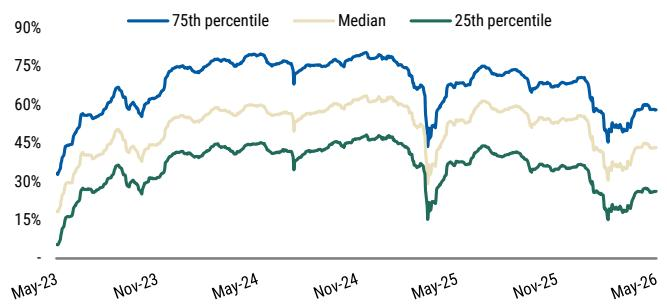

line chart

| Date   | 75th percentile | Median | 25th percentile |
|--------|-----------------|--------|-----------------|
| May-23 | ~30%            | ~25%   | ~15%            |
| Nov-23 | ~60%            | ~45%   | ~30%            |
| May-24 | ~75%            | ~55%   | ~40%            |
| Nov-24 | ~75%            | ~60%   | ~45%            |
| May-25 | ~40%            | ~40%   | ~15%            |
| Nov-25 | ~65%            | ~50%   | ~30%            |
| May-26 | ~60%            | ~45%   | ~25%            |

Source: MS, Intex, Markit

Exhibit 34: European CLO 2.0 Equity NAV Percentiles  
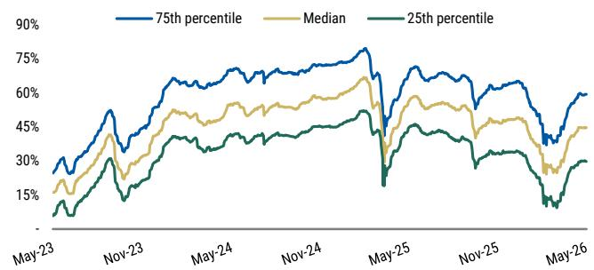

line chart

| Date   | 75th percentile | Median | 25th percentile |
|--------|-----------------|--------|-----------------|
| May-23 | ~30%            | ~20%   | ~10%            |
| Nov-23 | ~50%            | ~40%   | ~25%            |
| May-24 | ~65%            | ~50%   | ~35%            |
| Nov-24 | ~70%            | ~55%   | ~40%            |
| May-25 | ~75%            | ~60%   | ~45%            |
| Nov-25 | ~60%            | ~45%   | ~30%            |
| May-26 | ~60%            | ~45%   | ~30%            |

Source: MS, Intex, Markit

Exhibit 35:  
Median Cumulative Equity Payments & Equity NAV

<table><tr><td>Closing Quarter</td><td>Median Cumul. US Payments</td><td>Median Cumul. EU Payments</td><td>Median US NAV for Reinv Deals</td><td>Median EU NAV for Reinv Deals</td></tr><tr><td>2021-Q2</td><td>76.1%</td><td>85.7%</td><td>19.8%</td><td>26.8%</td></tr><tr><td>2021-Q3</td><td>70.3%</td><td>84.0%</td><td>29.9%</td><td>28.1%</td></tr><tr><td>2021-Q4</td><td>66.6%</td><td>76.4%</td><td>23.9%</td><td>23.8%</td></tr><tr><td>2022-Q1</td><td>66.8%</td><td>76.0%</td><td>31.8%</td><td>30.9%</td></tr><tr><td>2022-Q2</td><td>65.1%</td><td>69.6%</td><td>28.0%</td><td>33.8%</td></tr><tr><td>2022-Q3</td><td>65.8%</td><td>83.5%</td><td>38.8%</td><td>29.0%</td></tr><tr><td>2022-Q4</td><td>58.5%</td><td>81.4%</td><td>43.0%</td><td>37.0%</td></tr><tr><td>2023-Q1</td><td>52.2%</td><td>65.3%</td><td>41.9%</td><td>35.0%</td></tr><tr><td>2023-Q2</td><td>46.9%</td><td>54.1%</td><td>43.7%</td><td>40.7%</td></tr><tr><td>2023-Q3</td><td>38.2%</td><td>49.9%</td><td>51.6%</td><td>40.9%</td></tr><tr><td>2023-Q4</td><td>32.6%</td><td>40.9%</td><td>49.4%</td><td>42.9%</td></tr><tr><td>2024-Q1</td><td>27.9%</td><td>33.6%</td><td>51.3%</td><td>48.1%</td></tr><tr><td>2024-Q2</td><td>25.7%</td><td>28.4%</td><td>48.2%</td><td>47.8%</td></tr><tr><td>2024-Q3</td><td>24.4%</td><td>27.9%</td><td>49.2%</td><td>43.9%</td></tr><tr><td>2024-Q4</td><td>19.4%</td><td>21.9%</td><td>52.3%</td><td>48.5%</td></tr><tr><td>2025-Q1</td><td>17.7%</td><td>18.3%</td><td>53.9%</td><td>51.3%</td></tr><tr><td>2025-Q2</td><td>12.9%</td><td>15.7%</td><td>62.8%</td><td>53.2%</td></tr><tr><td>2025-Q3</td><td>9.1%</td><td>9.4%</td><td>61.6%</td><td>57.0%</td></tr><tr><td>2025-Q4</td><td>6.5%</td><td>5.6%</td><td>69.2%</td><td>60.1%</td></tr></table>

Source: MS, Intex, Markit

## CLO Collateral Fundamentals

## Macro Factors Affecting CLOs and CLO Collateral

Exhibit 36: US Leveraged Debt Maturity Profile  
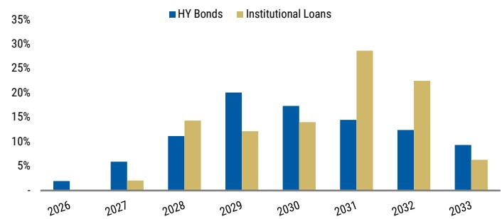

bar chart

| Year | HY Bonds (%) | Institutional Loans (%) |
|---|---|---|
| 2026 | 2 | 0 |
| 2027 | 5.5 | 2.5 |
| 2028 | 11 | 14.5 |
| 2029 | 20 | 12 |
| 2030 | 17 | 14 |
| 2031 | 14.5 | 28.5 |
| 2032 | 12.5 | 22.5 |
| 2033 | 9.5 | 6 |

Source: MS, PitchBook | LCD

Exhibit 37: Spot and Forward 3m Libor  
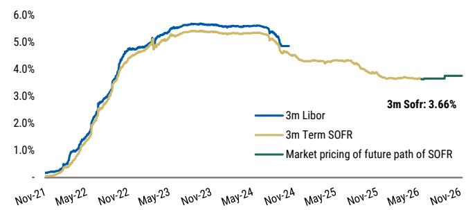

line chart

| Date    | 3m Libor | 3m Term SOFR | Market pricing of future path of SOFR |
|---------|----------|--------------|----------------------------------------|
| Nov-21  | ~0.0%    | ~0.0%        | -                                      |
| May-22  | ~1.5%    | ~1.0%        | -                                      |
| Nov-22  | ~4.0%    | ~3.5%        | -                                      |
| May-23  | ~5.5%    | ~5.0%        | -                                      |
| Nov-23  | ~5.8%    | ~5.2%        | -                                      |
| May-24  | ~5.7%    | ~5.1%        | -                                      |
| Nov-24  | ~5.0%    | ~4.8%        | -                                      |
| May-25  | -        | ~4.5%        | -                                      |
| Nov-25  | -        | ~4.2%        | -                                      |
| May-26  | -        | ~4.0%        | -                                      |
| Nov-26  | -        | ~3.8%        | 3.66%                                  |

Source: MS, Bloomberg

## Collateral Trading Below 90 for US and European CLOs

% of US CLO 2.0 collateral trading below 90: The proportion of US CLO 2.0 collateral trading below 90 increased by \~2bp to 10.0%, at the end of May

% of European CLO collateral trading below 90: The proportion of European CLO collateral trading below 90 decreased by 0.38pp, to 10.0%, at the end of May

Exhibit 38: Collateral Trading Below 90 in US & EU CLO Portfolios  
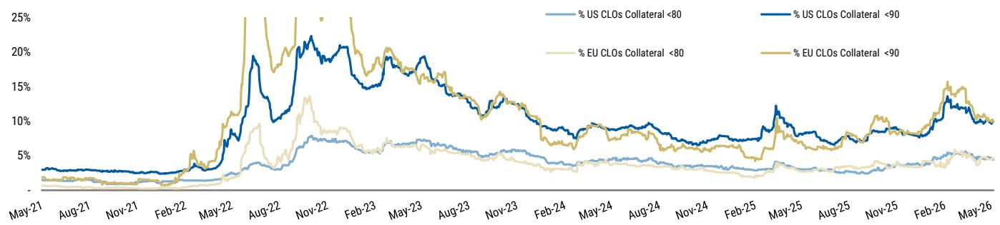

line chart

| Date    | % US CLOs Collateral <80 | % US CLOs Collateral <90 | % EU CLOs Collateral <80 | % EU CLOs Collateral <90 |
|---------|--------------------------|--------------------------|--------------------------|--------------------------|
| May-21  | ~1%                      | ~1%                      | ~1%                      | ~1%                      |
| Aug-21  | ~1%                      | ~1%                      | ~1%                      | ~1%                      |
| Nov-21  | ~1%                      | ~1%                      | ~1%                      | ~1%                      |
| Feb-22  | ~1%                      | ~1%                      | ~1%                      | ~1%                      |
| May-22  | ~3%                      | ~5%                      | ~3%                      | ~5%                      |
| Aug-22  | ~5%                      | ~15%                     | ~7%                      | ~15%                     |
| Nov-22  | ~7%                      | ~20%                     | ~10%                     | ~20%                     |
| Feb-23  | ~6%                      | ~18%                     | ~8%                      | ~18%                     |
| May-23  | ~6%                      | ~15%                     | ~7%                      | ~15%                     |
| Aug-23  | ~5%                      | ~12%                     | ~6%                      | ~12%                     |
| Nov-23  | ~4%                      | ~10%                     | ~5%                      | ~10%                     |
| Feb-24  | ~3%                      | ~8%                      | ~4%                      | ~8%                      |
| May-24  | ~3%                      | ~7%                      | ~3%                      | ~7%                      |
| Aug-24  | ~3%                      | ~6%                      | ~3%                      | ~6%                      |
| Nov-24  | ~3%                      | ~5%                      | ~3%                      | ~5%                      |
| Feb-25  | ~3%                      | ~4%                      | ~3%                      | ~4%                      |
| May-25  | ~3%                      | ~12%                     | ~3%                      | ~12%                     |
| Aug-25  | ~3%                      | ~8%                      | ~3%                      | ~8%                      |
| Nov-25  | ~3%                      | ~7%                      | ~3%                      | ~7%                      |
| Feb-26  | ~4%                      | ~10%                     | ~4%                      | ~10%                     |
| May-26  | ~4%                      | ~8%                      | ~4%                      | ~8%                      |

Source: MS, Intex

Exhibit 39: US Collateral Holdings Below 90 by Vintage Year  
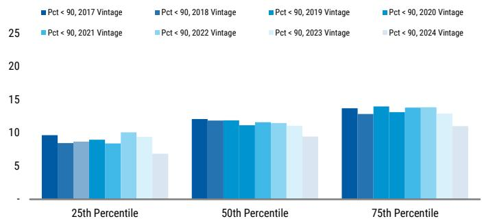

bar chart

| Category | Pct < 90, 2017 Vintage | Pct < 90, 2018 Vintage | Pct < 90, 2019 Vintage | Pct < 90, 2020 Vintage | Pct < 90, 2021 Vintage | Pct < 90, 2022 Vintage | Pct < 90, 2023 Vintage | Pct < 90, 2024 Vintage |
|---|---|---|---|---|---|---|---|---|
| 25th Percentile | 9.5 | 8.5 | 8.8 | 9.0 | 8.2 | 10.0 | 9.3 | 6.5 |
| 50th Percentile | 12.0 | 11.8 | 11.2 | 11.5 | 11.3 | 11.5 | 11.0 | 9.5 |
| 75th Percentile | 13.8 | 12.8 | 13.2 | 13.8 | 13.7 | 13.8 | 13.3 | 11.0 |

Source: MS, Intex, Markit

Exhibit 40: EU Collateral Holdings Below 90 by Vintage Year  
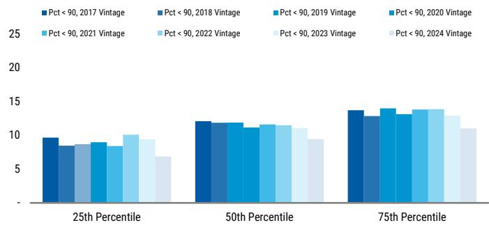

bar chart

| Category | Pct < 90, 2017 Vintage | Pct < 90, 2018 Vintage | Pct < 90, 2019 Vintage | Pct < 90, 2020 Vintage | Pct < 90, 2021 Vintage | Pct < 90, 2022 Vintage | Pct < 90, 2023 Vintage | Pct < 90, 2024 Vintage |
|---|---|---|---|---|---|---|---|---|
| 25th Percentile | 9.5 | 8.5 | 8.8 | 8.8 | 10.2 | 6.5 | 9.3 | 6.7 |
| 50th Percentile | 12.0 | 11.8 | 11.2 | 11.0 | 11.5 | 11.3 | 11.0 | 9.3 |
| 75th Percentile | 13.8 | 12.8 | 13.2 | 13.5 | 13.8 | 13.5 | 13.4 | 10.8 |

Source: MS, Intex, Markit

## Loans Priced at or Above Par for US and Europe

Exhibit 41: US Loan Index Bid Price & % Priced at or Above Par  
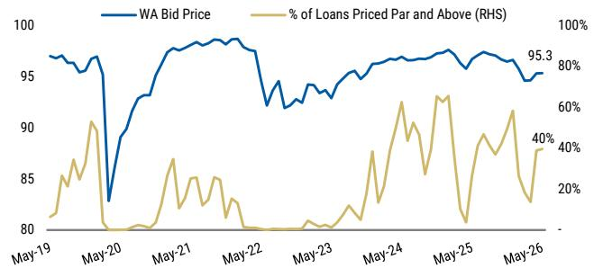

line chart

| Date   | WA Bid Price | % of Loans Priced Par and Above (RHS) |
|--------|--------------|----------------------------------------|
| May-19 | 97.0         | 20%                                    |
| May-20 | 83.0         | 60%                                    |
| May-21 | 98.0         | 40%                                    |
| May-22 | 97.5         | 30%                                    |
| May-23 | 94.0         | 20%                                    |
| May-24 | 96.0         | 40%                                    |
| May-25 | 97.0         | 60%                                    |
| May-26 | 95.3         | 40%                                    |

Source: MS, PitchBook | LCD

Exhibit 42: Eur. Loan Index Bid Price & % Priced at or Above Par  
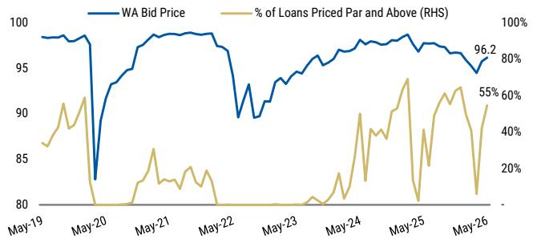

line chart

| Date   | WA Bid Price | % of Loans Priced Par and Above (RHS) |
|--------|--------------|----------------------------------------|
| May-19 | 98           | 40%                                    |
| May-20 | 83           | 80%                                    |
| May-21 | 98           | 40%                                    |
| May-22 | 96           | 80%                                    |
| May-23 | 94           | 40%                                    |
| May-24 | 97           | 60%                                    |
| May-25 | 98           | 40%                                    |
| May-26 | 96.2         | 55%                                    |

Source: MS, PitchBook | LCD

Exhibit 43: Median US CLO Port. Prices & LTM TR Volatilities  
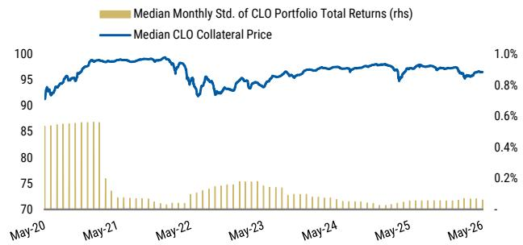

bar-line hybrid chart

| Date   | Median Monthly Std. of CLO Portfolio Total Returns (rhs) | Median CLO Collateral Price |
|--------|----------------------------------------------------------|-----------------------------|
| May-20 | 85                                                       | 95                          |
| May-21 | 85                                                       | 98                          |
| May-22 | 75                                                       | 95                          |
| May-23 | 75                                                       | 97                          |
| May-24 | 75                                                       | 98                          |
| May-25 | 75                                                       | 97                          |
| May-26 | 75                                                       | 96                          |

Source: MS, Intex, Markit

Exhibit 44: Median Eur. CLO Collat. Prices & LTM TR Volatilities  
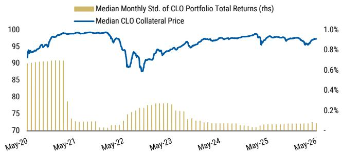

bar-line hybrid chart

| Date   | Median Monthly Std. of CLO Portfolio Total Returns (rhs) | Median CLO Collateral Price |
|--------|----------------------------------------------------------|-----------------------------|
| May-20 | 90                                                       | 0.8%                        |
| May-21 | 78                                                       | 0.9%                        |
| May-22 | 70                                                       | 0.6%                        |
| May-23 | 75                                                       | 0.8%                        |
| May-24 | 70                                                       | 0.9%                        |
| May-25 | 70                                                       | 0.9%                        |
| May-26 | 70                                                       | 0.9%                        |

Source: MS, Intex, Markit

## US and European Loan Repayments and Defaults

Exhibit 45: S&P LSTA Loan Index Upgrades vs. Downgrades  
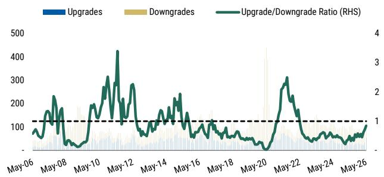

line chart

| Date   | Upgrades | Downgrades | Upgrade/Downgrade Ratio (RHS) |
|--------|----------|------------|-------------------------------|
| May-06 |          |            |                               |
| May-08 |          |            |                               |
| May-10 |          |            |                               |
| May-12 |          |            |                               |
| May-14 |          |            |                               |
| May-16 |          |            |                               |
| May-18 |          |            |                               |
| May-20 |          |            |                               |
| May-22 |          |            |                               |
| May-24 |          |            |                               |
| May-26 |          |            |                               |

Source: MS, Bloomberg, PitchBook | LCD. Note: Rolling 3 month

Exhibit 46: Leveraged Loan Default Rates LTM (Principal Amount)  
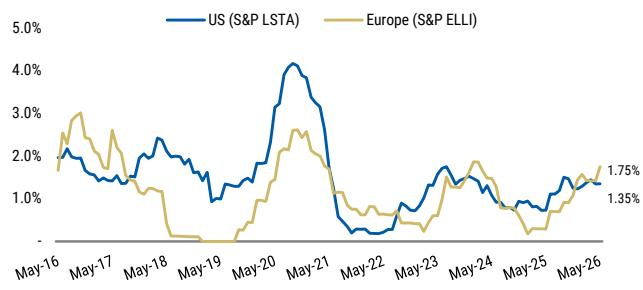

line chart

| Date   | US (S&P LSTA) | Europe (S&P ELLI) |
|--------|---------------|-------------------|
| May-26 | 1.75%         | 1.35%             |

Source: MS, PitchBook | LCD

Exhibit 47: Monthly Leveraged Loan Repayment Rates  
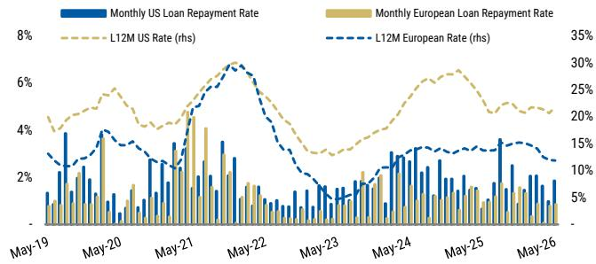

bar-line hybrid chart

| Date   | Monthly US Loan Repayment Rate | Monthly European Loan Repayment Rate |
|--------|----------------------------------|---------------------------------------|
| May-19 | 1.5%                             | 1.0%                                  |
| May-20 | 4.0%                             | 2.5%                                  |
| May-21 | 3.5%                             | 4.0%                                  |
| May-22 | 6.5%                             | 2.0%                                  |
| May-23 | 1.0%                             | 1.5%                                  |
| May-24 | 3.0%                             | 2.5%                                  |
| May-25 | 3.5%                             | 3.0%                                  |
| May-26 | 2.0%                             | 1.5%                                  |

Source: MS, PitchBook | LCD

Exhibit 48: Historical US Corporate Bond and Loan Recoveries  
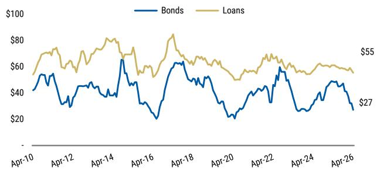

line chart

| Date   | Bonds | Loans |
|--------|-------|-------|
| Apr-10 | $50   | $60   |
| Apr-12 | $40   | $70   |
| Apr-14 | $65   | $80   |
| Apr-16 | $20   | $75   |
| Apr-18 | $60   | $85   |
| Apr-20 | $30   | $65   |
| Apr-22 | $55   | $70   |
| Apr-24 | $45   | $60   |
| Apr-26 | $27   | $55   |

Source: Moody's (measured by prices taken one month after default). Includes trailing 12m data. These data are lagged by one month.

# Market Movements and Technicals Affecting US Leveraged Loans

Exhibit 49: Par Amount of Outstanding Leveraged Loans  
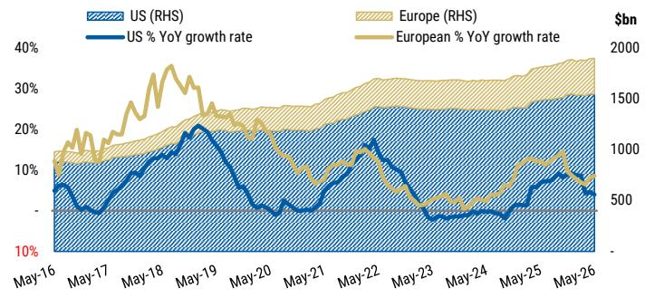

line chart

| Date   | US (RHS) | Europe (RHS) | US % YoY growth rate | European % YoY growth rate |
|--------|----------|--------------|----------------------|----------------------------|
| May-16 |          |              |                      |                            |
| May-17 |          |              |                      |                            |
| May-18 |          |              |                      |                            |
| May-19 |          |              |                      |                            |
| May-20 |          |              |                      |                            |
| May-21 |          |              |                      |                            |
| May-22 |          |              |                      |                            |
| May-23 |          |              |                      |                            |
| May-24 |          |              |                      |                            |
| May-25 |          |              |                      |                            |
| May-26 |          |              |                      |                            |

Source: MS, PitchBook | LCD

Exhibit 50: US Loan Funds Flows and Fed Funds Rate  
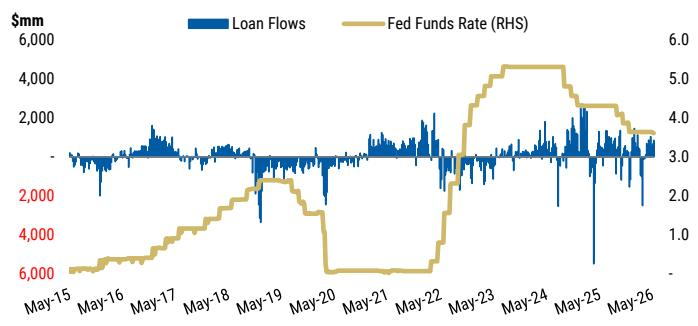

line chart

| Date   | Loan Flows ($mm) | Fed Funds Rate (RHS) |
|--------|-------------------|----------------------|
| May-15 | ~1,000            | ~0.5                 |
| May-16 | ~1,500            | ~1.0                 |
| May-17 | ~1,800            | ~1.5                 |
| May-18 | ~1,600            | ~2.0                 |
| May-19 | ~1,400            | ~2.5                 |
| May-20 | ~6,000            | ~0.5                 |
| May-21 | ~1,500            | ~1.0                 |
| May-22 | ~1,800            | ~3.0                 |
| May-23 | ~1,600            | ~5.0                 |
| May-24 | ~1,700            | ~5.5                 |
| May-25 | ~1,500            | ~4.5                 |
| May-26 | ~1,400            | ~3.5                 |

Source: MS, EPFR, Bloomberg. Note: The EPFR data and chart displayed here must not be extracted and republished (whether internally or externally). Such use will violate the terms of MS's contract with EPFR which only covers named users.

Exhibit 51: US Leveraged Loan Issuance and CLO Issuance  
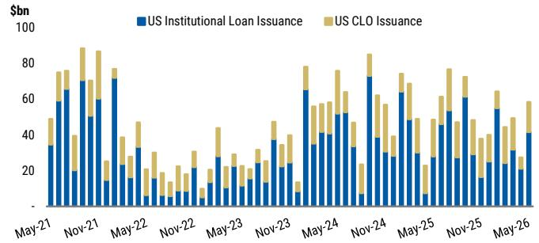

stacked bar chart

| Date | US Institutional Loan Issuance ($bn) | US CLO Issuance ($bn) |
| :--- | :--- | :--- |
| May-21 | 35 | 48 |
| Nov-21 | 65 | 30 |
| May-22 | 70 | 25 |
| Nov-22 | 15 | 10 |
| May-23 | 25 | 15 |
| Nov-23 | 20 | 10 |
| May-24 | 65 | 30 |
| Nov-24 | 70 | 25 |
| May-25 | 60 | 20 |
| Nov-25 | 60 | 25 |
| May-26 | 40 | 15 |

Source: MS, PitchBook | LCD

Exhibit 52: % New Issue First Lien US Leveraged Loans with  
Libor Floors and Level  
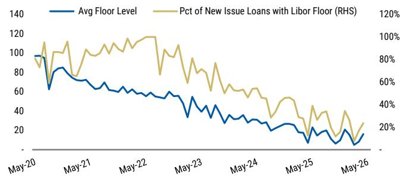

line chart

| Date   | Avg Floor Level | Pct of New Issue Loans with Libor Floor (RHS) |
|--------|-----------------|-----------------------------------------------|
| May-20 | 90              | 80%                                           |
| May-21 | 70              | 100%                                          |
| May-22 | 60              | 110%                                          |
| May-23 | 40              | 80%                                           |
| May-24 | 30              | 60%                                           |
| May-25 | 20              | 40%                                           |
| May-26 | 10              | 20%                                           |

Source: MS, PitchBook | LCD

## Disclosure Section

Mortgage Backed Securities (MBS) and Collateralized Mortgage Obligations (CMO)

Principal is returned on a monthly basis over the life of the security. Principal prepayment can significantly affect the monthly income stream and the maturity of any type of MBS, including standard MBS, CMOs and Lottery Bonds. Yields and average lives are estimated based on prepayment assumptions and are subject to change based on actual prepayment of the mortgages in the underlying pools. The level of predictability of an MBS/CMO's average life, and its market price, depends on the type of MBS/CMO class purchased and interest rate movements. In general, as interest rates fall, prepayment speeds are likely to increase, thus shortening the MBS/CMO's average life and likely causing its market price to rise. Conversely, as interest rates rise, prepayment speeds are likely to decrease, thus lengthening average life and likely causing the MBS/CMO's market price to fall. Some MBS/CMOs may have "original issue discount" (OID). OID occurs if the MBS/CMO's original issue price is below its stated redemption price at maturity, and results in "imputed interest" that must be reported annually for tax purposes, resulting in a tax liability even though interest was not received. Investors are urged to consult their tax advisors for more information. Government agency backing applies only to the face value of the CMO and not to any premium paid.

The information and opinions in MS were prepared or are disseminated by MS & Co. LLC and/or MS C.T.V.M. S.A. and/or MS México, Casa de Bolsa, S.A. de C.V. and/or MS Canada Limited and/or MS & Co. International plc and/or MS Europe S.E. and/or RMB MS Proprietary Limited and/or MS MUFG Securities Co., Ltd. and/or MS Capital Group Japan Co., Ltd. and/or MS Asia Limited and/or MS Asia (Singapore) Pte. (Registration number 199206298Z) and/or MS Asia (Singapore) Securities Pte Ltd (Registration number 200008434H), regulated by the Monetary Authority of Singapore (which accepts legal responsibility for its contents and should be contacted with respect to any matters arising from, or in connection with, MS) and/or MS Taiwan Limited and/or MS & Co International plc, Seoul Branch, and/or MS Australia Limited (A.B.N. 67 003 734 576, holder of Australian financial services license No. 233742, which accepts responsibility for its contents), and/or MS Wealth Management Australia Pty Ltd (A.B.N. 19 009 145 555, holder of Australian financial services license No. 24-0813, which accepts responsibility for its contents), and/or MS India Company Private Limited having Corporate Identification No (CIN) U22990MH1998PTC115305, regulated by the Securities and Exchange Board of India ("SEBI") and holder of licenses as a Research Analyst (SEBI Registration No. INH000001105), Stock Broker (SEBI Stock Broker Registration No. INZ000244438), Merchant Banker (SEBI Registration No. INM000011203), and depository participant with National Securities Depository Limited (SEBI Registration No. IN-DP-NSDL-567-2021) having registered office at Altimus, Level 39 & 40, Pandurang Budhkar Marg, Worli, Mumbai 400018, India; Telephone no. +91-22-61181000; Compliance Officer Details: Mr. Tejarshi Hardas, Tel. No.: +91-22-61181000 or Email: tejarshi.hardas@morganstanley.com; Grievance officer details: Mr. Tejarshi Hardas, Tel. No.: +91-22-61181000 or Email: msic-compliance@morganstanley.com which accepts the responsibility for its contents and should be contacted with respect to any matters arising from, or in connection with, MS, and their affiliates (collectively, "MS"). MS India Company Private Limited (MSICPL) may use AI tools in providing research services. All recommendations contained herein are made by the duly qualified research analysts.

For important disclosures, stock price charts and equity rating histories regarding companies that are the subject of this report, please see the MS Disclosure Website at www.morganstanley.com/eqr/disclosures/webapp/generalresearch, or contact your investment representative or MS at 1585 Broadway, (Attention: Research Management), New York, NY, 10036 USA.

For valuation methodology and risks associated with any recommendation, rating or price target referenced in this research report, please contact the Client Support Team as follows: US/Canada +1 800 303-2495; Hong Kong +852 2848-5999; Latin America +1 718 754-5444 (U.S.); London +44 (0)20-7425-8169; Singapore +65 6834-6860; Sydney +61 (0)2-9770-1505; Tokyo +81 (0)3-6836-9000. Alternatively you may contact your investment representative or MS at 1585 Broadway, (Attention: Research Management), New York, NY 10036 USA.

## Analyst Certification

The following analysts hereby certify that their views about the companies and their securities discussed in this report are accurately expressed and that they have not received and will not receive direct or indirect compensation in exchange for expressing specific recommendations or views in this report: James Egan; Gabriel Reyes Esclasans; Vasundhara Goel; Joyce Jiang.

## Global Research Conflict Management Policy

MS has been published in accordance with our conflict management policy, which is available at www.morganstanley.com/institutional/research/conflictpolicies. A Portuguese version of the policy can be found at www.morganstanley.com.br

## Important Regulatory Disclosures on Subject Companies

The equity research analysts or strategists principally responsible for the preparation of MS have received compensation based upon various factors, including quality of research, investor client feedback, stock picking, competitive factors, firm revenues and overall investment banking revenues. Equity Research analysts' or strategists' compensation is not linked to investment banking or capital markets transactions performed by MS or the profitability or revenues of particular trading desks.

MS and its affiliates do business that relates to companies/instruments covered in MS, including market making, providing liquidity, fund management, commercial banking, extension of credit, investment services and investment banking. MS sells to and buys from customers the securities/instruments of companies covered in MS on a principal basis. MS may have a position in the debt of the Company or instruments discussed in this report. MS trades or may trade as principal in the debt securities (or in related derivatives) that are the subject of the debt research report.

Certain disclosures listed above are also for compliance with applicable regulations in non-US jurisdictions.

## STOCK RATINGS

MS uses a relative rating system using terms such as Overweight, Equal-weight, Not-Rated or Underweight (see definitions below). MS does not assign ratings of Buy, Hold or Sell to the stocks we cover. Overweight, Equal-weight, Not-Rated and Underweight are not the equivalent of buy, hold and sell. Investors should carefully read the definitions of all ratings used in MS. In addition, since MS contains more complete information concerning the analyst's views, investors should carefully read MS, in its entirety, and not infer the contents from the rating alone. In any case, ratings (or research) should not be used or relied upon as investment advice. An investor's decision to buy or sell a stock should depend on individual circumstances (such as the investor's existing holdings) and other considerations.

## Global Stock Ratings Distribution

(as of May 31, 2026)

The Stock Ratings described below apply to MS's Fundamental Equity Research and do not apply to Debt Research produced by the Firm.

For disclosure purposes only (in accordance with FINRA requirements), we include the category headings of Buy, Hold, and Sell alongside our ratings of Overweight, Equal-weight, Not-Rated and Underweight. MS does not assign ratings of Buy, Hold or Sell to the stocks we cover. Overweight, Equal-weight, Not-Rated and Underweight are not the equivalent of buy, hold, and sell but represent recommended relative weightings (see definitions below). To satisfy regulatory requirements, we correspond Overweight, our most positive stock rating, with a buy recommendation; we correspond Equal-weight and Not-Rated to hold and Underweight to sell recommendations, respectively.

<table><tr><td></td><td colspan="2">Coverage Universe</td><td colspan="3">Investment Banking Clients (IBC)</td><td colspan="2">Other Material Investment ServicesClients (MISC)</td></tr><tr><td>Stock RatingCategory</td><td>Count</td><td>% of Total</td><td>Count</td><td>% of Total IBC</td><td>% of RatingCategory</td><td>Count</td><td>% of Total OtherMISC</td></tr><tr><td>Overweight/Buy</td><td>1542</td><td>42%</td><td>465</td><td>51%</td><td>30%</td><td>707</td><td>43%</td></tr><tr><td>Equal-weight/Hold</td><td>1571</td><td>43%</td><td>369</td><td>40%</td><td>23%</td><td>723</td><td>44%</td></tr><tr><td>Not-Rated/Hold</td><td>3</td><td>0%</td><td>0</td><td>0%</td><td>0%</td><td>1</td><td>0%</td></tr><tr><td>Underweight/Sell</td><td>551</td><td>15%</td><td>86</td><td>9%</td><td>16%</td><td>201</td><td>12%</td></tr><tr><td>Total</td><td>3,667</td><td></td><td>920</td><td></td><td></td><td>1632</td><td></td></tr></table>

Data include common stock and ADRs currently assigned ratings. Investment Banking Clients are companies from whom MS received investment banking compensation in the last 12 months. Due to rounding off of decimals, the percentages provided in the "% of total" column may not add up to exactly 100 percent.

## Analyst Stock Ratings

Overweight (O or Over) - The stock's total return is expected to exceed the total return of the relevant country MSCI Index or the average total return of the analyst's industry (or industry team's) coverage universe, on a risk-adjusted basis over the next 12-18 months.

Equal-weight (E or Equal) - The stock's total return is expected to be in line with the total return of the relevant country MSCI Index or the average total return of the analyst's industry (or industry team's) coverage universe, on a risk-adjusted basis over the next 12-18 months.

Not-Rated (NR) - Currently the analyst does not have adequate conviction about the stock's total return relative to the relevant country MSCI Index or the average total return of the analyst's industry (or industry team's) coverage universe, on a risk-adjusted basis, over the next 12-18 months.

Underweight (U or Under) - The stock's total return is expected to be below the total return of the relevant country MSCI Index or the average total return of the analyst's industry (or industry team's) coverage universe, on a risk-adjusted basis, over the next 12-18 months.

Unless otherwise specified, the time frame for price targets included in MS is 12 to 18 months.

## Analyst Industry Views

Attractive (A): The analyst expects the performance of his or her industry coverage universe over the next 12-18 months to be attractive vs. the relevant broad market benchmark, as indicated below.

In-Line (I): The analyst expects the performance of his or her industry coverage universe over the next 12-18 months to be in line with the relevant broad market benchmark, as indicated below. Cautious (C): The analyst views the performance of his or her industry coverage universe over the next 12-18 months with caution vs. the relevant broad market benchmark, as indicated below. Benchmarks for each region are as follows: North America - S&P 500; Latin America - relevant MSCI country index or MSCI Latin America Index; Europe - MSCI Europe; Japan - TOPIX; Asia - relevant MSCI country index or MSCI sub-regional index or MSCI AC Asia Pacific ex Japan Index.

## Important Disclosures for MS Smith Barney LLC Customers

Important disclosures regarding any material conflict of interest that can reasonably be expected to have influenced MS Smith Barney LLC's choice of a third-party research provider or the subject company of a third-party research report, are available on the MS Wealth Management disclosure website at www.morganstanley.com/online/researchdisclosures. For MS specific disclosures, you may refer to https://www.morganstanley.com/eqr/disclosures/webapp/generalresearch.

Each MS report is reviewed and approved on behalf of MS Smith Barney LLC. This review and approval is conducted by the same person who reviews the research report on behalf of MS. This could create a conflict of interest.

## Other Important Disclosures

MS policy is to update research reports as and when the Research Analyst and Research Management deem appropriate, based on developments with the issuer, the sector, or the market that may have a material impact on the research views or opinions stated therein. In addition, certain Research publications are intended to be updated on a regular periodic basis (weekly/monthly/quarterly/annual) and will ordinarily be updated with that frequency, unless the Research Analyst and Research Management determine that a different publication schedule is appropriate based on current conditions.

MS is not acting as a municipal advisor and the opinions or views contained herein are not intended to be, and do not constitute, advice within the meaning of Section 975 of the Dodd-Frank Wall Street Reform and Consumer Protection Act.

MS produces an equity research product called a "Tactical Idea." Views contained in a "Tactical Idea" on a particular stock may be contrary to the recommendations or views expressed in research on the same stock. This may be the result of differing time horizons, methodologies, market events, or other factors. For all research available on a particular stock, please contact your sales representative or go to Matrix at http://www.morganstanley.com/matrix.

MS is provided to our clients through our proprietary research portal on Matrix and also distributed electronically by MS to clients. Certain, but not all, MS products are also made available to clients through third-party vendors or redistributed to clients through alternate electronic means as a convenience. For access to all available MS, please contact your sales representative or go to Matrix at http://www.morganstanley.com/matrix.

Any access and/or use of MS is subject to MS's Terms of Use (http://www.morganstanley.com/terms.html). By accessing and/or using MS, you are indicating that you have read and agree to be bound by our Terms of Use (http://www.morganstanley.com/terms.html). In addition you consent to MS processing your personal data and using cookies in accordance with our Privacy Policy and our Global Cookies Policy (http://www.morganstanley.com/privacy\_pledge.html), including for the purposes of setting your preferences and to collect readership data so that we can deliver better and more personalized service and products to you. To find out more information about how MS processes personal data, how we use cookies and how to reject cookies see our Privacy Policy and our Global Cookies Policy (http://www.morganstanley.com/privacy\_pledge.html). Please use the provided link to review the Terms and Conditions and Most Important Terms and Conditions for MS India Company Private Limited (https://www.morganstanley.com/assets/pdfs/about-us-global-offices/india/Terms\_and\_conditions.pdf) and the following link to review the audit report (https://ny.matrix.ms.com/eqr/research/webapp/researchdocs/MSICPL\_Morgan\_Stanley\_Research\_Audit\_Report.pdf).

If you do not agree to our Terms of Use and/or if you do not wish to provide your consent to MS processing your personal data or using cookies please do not access our research. MS does not provide individually tailored investment advice. MS has been prepared without regard to the circumstances and objectives of those who receive it. MS recommends that investors independently evaluate particular investments and strategies, and encourages investors to seek the advice of a financial adviser. The appropriateness of an investment or strategy will depend on an investor's circumstances and objectives. The securities, instruments, or strategies discussed in MS may not be suitable for all investors, and certain investors may not be eligible to purchase or participate in some or all of them. MS is not an offer to buy or sell or the solicitation of an offer to buy or sell any security/instrument or to participate in any particular trading strategy. The value of and income from your investments may vary because of changes in interest rates, foreign exchange rates, default rates, prepayment rates, securities/instruments prices, market indexes, operational or financial conditions of companies or other factors. There may be time limitations on the exercise of options or other rights in securities/instruments transactions. Past performance is not necessarily a guide to future performance. Estimates of future performance are based on assumptions that may not be realized. If provided, and unless otherwise stated, the closing price on the cover page is that of the primary exchange for the subject company's securities/instruments.

The fixed income research analysts, strategists or economists principally responsible for the preparation of MS have received compensation based upon various factors, including quality, accuracy and value of research, firm profitability or revenues (which include fixed income trading and capital markets profitability or revenues), client feedback and competitive factors. Fixed Income Research analysts', strategists' or economists' compensation is not linked to investment banking or capital markets transactions performed by MS or the profitability or revenues of particular trading desks.

The "Important Regulatory Disclosures on Subject Companies" section in MS lists all companies mentioned where MS owns 1% or more of a class of common equity securities of the companies. For all other companies mentioned in MS, MS may have an investment of less than 1% in securities/instruments or derivatives of securities/instruments of companies and may trade them in ways different from those discussed in MS. Employees of MS not involved in the preparation of MS may have investments in securities/instruments or derivatives of securities/instruments of companies mentioned and may trade them in ways different from those discussed in MS. Derivatives may be issued by MS or associated persons.

With the exception of information regarding MS, MS is based on public information. MS makes every effort to use reliable, comprehensive information, but we make no representation that it is accurate or complete. We have no obligation to tell you when opinions or information in MS change apart from when we intend to discontinue equity research coverage of a subject company. Facts and views presented in MS have not been reviewed by, and may not reflect information known to, professionals in other MS business areas, including investment banking personnel.

MS personnel may participate in company events such as site visits and are generally prohibited from accepting payment by the company of associated expenses unless pre-approved by authorized members of Research management.

MS may make investment decisions that are inconsistent with the recommendations or views in this report.

To our readers based in Taiwan or trading in Taiwan securities/instruments: Information on securities/instruments that trade in Taiwan is distributed by MS Taiwan Limited ("MSTL"). Such information is for your reference only. The reader should independently evaluate the investment risks and is solely responsible for their investment decisions. MS may not be distributed to the public media or quoted or used by the public media without the express written consent of MS. Any non-customer reader within the scope of Article 7-1 of the Taiwan Stock Exchange Recommendation Regulations accessing and/or receiving MS is not permitted to provide MS to any third party (including but not limited to related parties, affiliated companies and any other third parties) or engage in any activities regarding MS which may create or give the appearance of creating a conflict of interest. Information on securities/instruments that do not trade in Taiwan is for informational purposes only and is not to be construed as a recommendation or a solicitation to trade in such securities/instruments. MSTL may not execute transactions for clients in these securities/instruments.

Certain information in MS was sourced by employees of the Shanghai Representative Office of MS Asia Limited for the use of MS Asia Limited. MS is not incorporated under PRC law and the research in relation to this report is conducted outside the PRC. MS does not constitute an offer to sell or the solicitation of an offer to buy any securities in the PRC. PRC investors shall have the relevant qualifications to invest in such securities and shall be responsible for obtaining all relevant approvals, licenses, verifications and/or registrations from the relevant governmental authorities themselves. Neither this report nor any part of it is intended as, or shall constitute, provision of any consultancy or advisory service of securities investment as defined under PRC law. Such information is provided for your reference only.

MS is disseminated in Brazil by MS C.T.V.M. S.A. located at Av. Brigadeiro Faria Lima, 3600, 6th floor, São Paulo - SP, Brazil; and is regulated by the Comissão de Valores Mobiliários; in Mexico by MS México, Casa de Bolsa, S.A. de C.V which is regulated by Comision Nacional Bancaria y de Valores. Paseo de los Tamarindos 90, Torre 1, Col. Bosques de las Lomas Floor 29, 05120 Mexico City; in Japan by MS MUFG Securities Co., Ltd. and, for Commodities related research reports only, MS Capital Group Japan Co., Ltd; in Hong Kong by MS Asia Limited (which accepts responsibility for its contents) and by MS Bank Asia Limited; in Singapore by MS Asia (Singapore) Pte. (Registration number 199206298Z) and/or MS Asia (Singapore) Securities Pte Ltd (Registration number 200008434H), regulated by the Monetary Authority of Singapore (which accepts legal responsibility for its contents and should be contacted with respect to any matters arising from, or in connection with, MS) and by MS Bank Asia Limited, Singapore Branch (Registration number T14FC0118J); in Australia to "wholesale clients" within the meaning of the Australian Corporations Act by MS Australia Limited A.B.N. 67 003 734 576, holder of Australian financial services license No. 233742, which accepts responsibility for its contents; in Australia to "wholesale clients" and "retail clients" within the meaning of the Australian Corporations Act by MS Wealth Management Australia Pty Ltd (A.B.N. 19 009 145 555, holder of Australian financial services license No. 240813, which accepts responsibility for its contents; in Korea by MS & Co International plc, Seoul Branch; in India by MS India Company Private Limited having Corporate Identification No (CIN) U22990MH1998PTC115305, regulated by the Securities and Exchange Board of India ("SEBI") and holder of licenses as a Research Analyst (SEBI Registration No. INH000001105); Stock Broker (SEBI Stock Broker Registration No. INZ000244438), Merchant Banker (SEBI Registration No. INM000011203), and depository participant with National Securities Depository Limited (SEBI Registration No. IN-DP-NSDL-567-2021) having registered office at Altimus, Level 39 & 40, Pandurang Budhkar Marg, Worli, Mumbai 400018, India; Telephone no. +91-22-61181000; Compliance Officer Details: Mr. Tejarshi Hardas, Tel. No.: +91-22-61181000 or Email: tejarshi.hardas@morganstanley.com; Grievance officer details: Mr. Tejarshi Hardas, Tel. No.: +91-22-61181000 or Email: msic-compliance@morganstanley.com. MS India Company Private Limited (MSICPL) may use AI tools in providing research services. All recommendations contained herein are made by the duly qualified research analysts; in Canada by MS Canada Limited; in Germany and the European Economic Area where required by MS Europe S.E., authorised and regulated by Bundesanstalt fuer Finanzdienstleistungsaufsicht (BaFin) under the reference number 149169; in the US by MS & Co. LLC, which accepts responsibility for its contents. MS & Co. International plc, authorized by the Prudential Regulation Authority and regulated by the Financial Conduct Authority and the Prudential Regulation Authority, disseminates in the UK research that it has prepared, and research which has been prepared by any of its affiliates, only to persons who (i) are investment professionals falling within Article 19(5) of the Financial Services and Markets Act 2000 (Financial Promotion) Order 2005 (as amended, the "Order"); (ii) are persons who are high net worth entities falling within Article 49(2)(a) to (d) of the Order; or (iii) are persons to whom an invitation or inducement to engage in investment activity (within the meaning of section 21 of the Financial Services and Markets Act 2000, as amended) may otherwise lawfully be communicated or caused to be communicated. RMB MS Proprietary Limited is a member of the JSE Limited and A2X (Pty) Ltd. RMB MS Proprietary Limited is a joint venture owned equally by MS International Holdings Inc. and RMB Investment Advisory (Proprietary) Limited, which is wholly owned by FirstRand Limited. The information in MS is being disseminated by MS Saudi Arabia, regulated by the Capital Market Authority in the Kingdom of Saudi Arabia, and is directed at Sophisticated investors only.

The information in MS is being communicated by MS & Co. International plc (DIFC Branch), regulated by the Dubai Financial Services Authority (the DFSA) or by MS & Co. International plc (ADGM Branch), regulated by the Financial Services Regulatory Authority Abu Dhabi (the FSRA), and is directed at Professional Clients only, as defined by the DFSA or the FSRA, respectively. The financial products or financial services to which this research relates will only be made available to a customer who we are satisfied meets the regulatory criteria of a Professional Client. A distribution of the different MS Research ratings or recommendations, in percentage terms for Investments in each sector covered, is available upon request from your sales representative.

The information in MS is being communicated by MS & Co. International plc (QFC Branch), regulated by the Qatar Financial Centre Regulatory Authority (the QFCRA), and is directed at business customers and market counterparties only and is not intended for Retail Customers as defined by the QFCRA.

As required by the Capital Markets Board of Turkey, investment information, comments and recommendations stated here, are not within the scope of investment advisory activity. Investment advisory service is provided exclusively to persons based on their risk and income preferences by the authorized firms. Comments and recommendations stated here are general in nature. These opinions may not fit to your financial status, risk and return preferences. For this reason, to make an investment decision by relying solely to this information stated here may not bring about outcomes that fit your expectations.

The trademarks and service marks contained in MS are the property of their respective owners. Third-party data providers make no warranties or representations relating to the accuracy, completeness, or timeliness of the data they provide and shall not have liability for any damages relating to such data. The Global Industry Classification Standard (GICS) was developed by and is the exclusive property of MSCI and S&P.

MS, or any portion thereof may not be reprinted, sold or redistributed without the written consent of MS.

Indicators and trackers referenced in MS may not be used as, or treated as, a benchmark under Regulation EU 2016/1011, or any other similar framework.

The issuers and/or fixed income products recommended or discussed in certain fixed income research reports may not be continuously followed. Accordingly, investors should regard those fixed income research reports as providing stand-alone analysis and should not expect continuing analysis or additional reports relating to such issuers and/or individual fixed income products. MS may hold, from time to time, material financial and commercial interests regarding the company subject to the Research report.

Registration granted by SEBI and certification from the National Institute of Securities Markets (NISM) in no way guarantee performance of the intermediary or provide any assurance of returns to investors. Investment in securities market are subject to market risks. Read all the related documents carefully before investing.

The following authors are Fixed Income Research Analysts/Strategists and are not opining on or expressing recommendations on equity securities: Vasundhara Goel; Gabriel Reyes Esclasans; James Egan; Joyce Jiang.

© 2026 MS