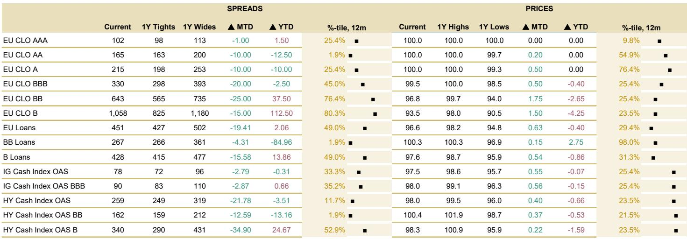
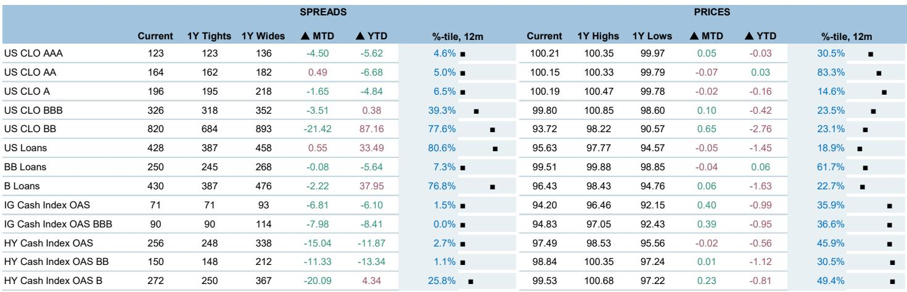
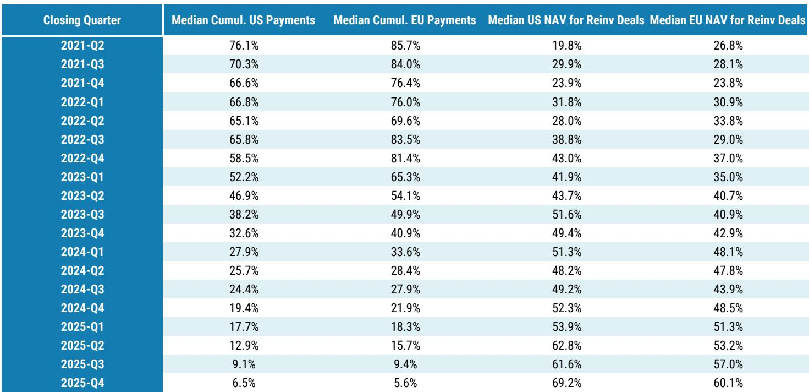

# Dispersion, Not Direction, Is the Defining Theme for CLO Investors in Mid-2026

The CLO market in mid-2026 is not telling a single story. It is telling many. After a turbulent April that saw new issuance collapse to roughly $6 billion, May rebounded with approximately $17 billion in new deals, while refinancing and reset activity surged to a year-to-date high of $39 billion. This is not merely a recovery. It is a market that has learned to operate in an environment where the central question is no longer "are spreads going to tighten or widen?" but rather "which managers, which structures, and which regions will deliver alpha when the aggregate tide is neither strongly rising nor falling?" The core thesis emerging from recent investor conversations is clear: the CLO market has entered a phase where dispersion across managers, deal types, and geographies is the dominant source of risk and return, and where a beta-driven approach to allocation is increasingly insufficient.

This shift matters now because it comes at a moment when the traditional safety valves for CLO investors are less reliable. The spread compression that defined much of the past cycle has largely played out. US CLO AAA spreads, for example, sit at 123 basis points, near the tight end of their 12-month range. European AAA spreads are even tighter at 102 basis points. At these levels, the margin for error is thin. The market is pricing in a benign credit environment, yet the underlying collateral pool is facing real headwinds from AI disruption, rising defaults, and a bifurcation between segments of the private credit market that were previously treated as a homogeneous asset class. The result is a market where the easy money has been made, and the next phase requires a surgical approach.

The report from a global investment bank that forms the basis of this analysis captures this inflection point through the lens of extensive client feedback across the Atlantic. It is a document that reads less like a forecast and more like a diagnostic of a market in transition. The key insight is not that one region or one tranche is obviously superior, but that the criteria for making those judgments have become more nuanced and more demanding. Investors who succeed in this environment will be those who treat manager selection, deal structure analysis, and relative value assessment not as periodic checkboxes but as continuous, dynamic processes.

## The Premium on Manager Selection Reflects a Market That Has Run Out of Easy Beta

The most consistent message from investors across nearly all conversations is that manager selection has become the single most important determinant of CLO investment outcomes. This is not a new insight in isolation, but its current prominence is striking. In a market where credit spreads across much of the capital stack are relatively tight, and where AI-disruption concerns are creating significant divergence in collateral performance, the ability to generate alpha through underwriting discipline, portfolio construction, and trading execution has become the primary differentiator.

The logic is straightforward. When spreads are wide and the market is in distress, a rising tide can lift most boats. A manager with mediocre selection skills can still generate acceptable returns simply by being long credit at the right time. But in a market where spreads are near the tight end of their historical range, the cushion for error is thin. A single default or a poorly timed trade can erase the spread pickup that looked attractive at the time of investment. In this environment, the value of a manager who has demonstrated the ability to navigate credit stress across multiple cycles becomes disproportionately high.

This preference for established managers is particularly pronounced in Europe, where investors see limited compensation for taking emerging-manager risk. The spread pickup for newer managers, where it exists at all, is often too thin to justify the uncertainty around their underwriting processes and their ability to handle stressed market conditions. In the US, the manager universe is broader and more diversified, which creates more opportunities for differentiation but also more risk of selecting a manager that will underperform in a downturn.

The report also highlights an emerging dimension of manager selection that is likely to become more important over time: the ability to leverage AI and data infrastructure in the investment process. Larger platforms with greater resources are better positioned to develop AI tools for credit selection and portfolio management. This is not yet a widely cited factor in manager selection, but it is one that could become a significant differentiator in the coming years as AI disruption becomes a more prominent investment consideration. The question that remains open is whether this will lead to a further concentration of assets among the largest managers, or whether nimble, specialized managers can develop their own AI capabilities that are tailored to specific segments of the market.

## Private Credit CLOs Are Not a Monolith, and the Market Is Beginning to Price That Differentiation

The narrative around private credit CLOs has shifted noticeably in recent months. A wave of negative headlines surrounding direct lending, business development companies, and software-related risk has made investors more cautious. The spread premium that private credit CLOs offer over broadly syndicated loan CLOs, which widened to 32 basis points for AAA tranches over the three months ending in May, is being scrutinized more carefully. Many investors view current spread premiums as inadequately compensated for the additional complexity, illiquidity, and valuation uncertainty inherent in private credit assets.

But the most important insight from the report is that private credit is too diverse to be painted with a broad brushstroke. Investors are increasingly differentiating across multiple dimensions: financing-driven deals versus arbitrage-driven deals, the size of the underlying borrowers, and the level of control that the manager has over the assets. This differentiation is not academic. It has direct implications for expected recovery rates and, therefore, for the appropriate spread premium.

Financing transactions, particularly those sponsored by managers with greater control over assets and workout processes, are viewed more favorably. The logic is intuitive: when a manager has the ability to influence restructuring outcomes and work closely with borrowers during periods of stress, recovery rates are likely to be higher. By contrast, arbitrage-driven deals where the manager has less control over the underlying assets are viewed as riskier, even if the headline spread premium looks attractive.

The size of the underlying borrower is another critical dimension. Upper middle market deals, which often compete directly with the broadly syndicated loan market, have seen a gradual erosion of covenant protections and documentation standards. This makes them more vulnerable in a downturn. Lower middle market deals, by contrast, benefit from stronger covenant protections, smaller lender groups, and greater influence over restructuring outcomes. The spread premium for these deals may look less attractive at first glance, but the expected recovery rates are higher, which makes the risk-adjusted return more compelling.

The report identifies a spread pickup of at least 40 basis points for private credit AAA tranches as necessary to justify incremental allocation. Some investors cite a more aggressive floor of approximately 150 basis points for meaningful participation. But these are averages. The actual required premium will vary significantly depending on the specific characteristics of the deal. The market is still in the early stages of pricing this differentiation, and there is likely to be a period of adjustment as investors become more sophisticated in their analysis of private credit CLOs.

## Regional Preferences Are Shifting: The US Wins on Fundamentals, but Europe Offers Better Relative Value

The regional preference debate in CLO investing has long been tilted toward the US, and that remains the case from a fundamental perspective. The US market benefits from greater depth, a broader manager universe, and a more diversified issuer base. While the US has higher exposure to the technology sector, which is the epicenter of AI disruption risk, investors appear more concerned about the weaker macroeconomic backdrop in Europe. The higher exposure of European economies to the energy shock, slower growth prospects, and longer-term structural challenges all argue for maintaining an overall preference for US over European CLOs.

But the report reveals an important nuance: the fundamental preference for the US does not translate into a blanket recommendation to avoid European CLOs. On the contrary, relative value considerations are increasingly drawing investors toward European senior tranches. European AAA spreads, at 102 basis points, are tighter than their US counterparts at 123 basis points, but they are also trading at a lower percentile of their historical range. More importantly, the technical backdrop for European senior tranches is favorable, with potential demand support from insurers under the new Solvency II rules.

This creates a classic relative value trade. The fundamental preference is for the US, but the valuation advantage is in Europe, at least at the top of the capital structure. Further down the stack, the enthusiasm for European CLOs diminishes, as the valuation advantages become less compelling relative to the underlying macro and credit risks. The report suggests that European AAA and AA tranches are the most attractive, while lower-rated tranches offer a less favorable risk-reward profile.

The open question is whether this relative value opportunity will persist or whether it will be arbitraged away as more investors act on it. The answer depends on the pace of capital flows into European CLOs and the evolution of the macroeconomic backdrop. If European growth disappoints further, the fundamental concerns could overwhelm the valuation advantage. If growth stabilizes and the technical support from insurers materializes, the relative value trade could generate significant returns.

## What the Report Leaves Unanswered: The Interaction Between Default Cycles and CLO Structure

The report provides a detailed analysis of current investor sentiment and market dynamics, but it leaves several important questions unanswered. The most significant of these concerns the interaction between the expected default cycle and CLO structure. The report notes that defaults are expected to ramp up to 5.5% in the broadly syndicated loan market and 8% in private credit through mid-2027, driven in part by AI-exposed names facing near-term maturity walls. But it does not fully explore how these defaults will flow through the CLO capital structure under different scenarios.

The critical variable is the correlation of defaults within CLO portfolios. If defaults are concentrated in a few sectors, such as software and technology, then CLOs with high exposure to those sectors will experience concentrated losses that could breach overcollateralization tests and trigger cash flow diversions. If defaults are more broadly dispersed across sectors, the impact on CLO structures will be more manageable. The report acknowledges the importance of manager selection in this context, but it does not provide a framework for assessing how different CLO structures would perform under different default correlation assumptions.

A second unanswered question concerns the behavior of CLO equity in a rising default environment. The report focuses primarily on senior tranches, which is consistent with the investor base it surveyed. But the equity tranche is where the most dramatic outcomes will occur. In a benign default environment, CLO equity can generate attractive returns. In a stressed environment, equity can be wiped out entirely. The report does not address how investors should think about equity exposure in the current environment, or whether the current spread premiums for equity are adequate compensation for the risks.

A third area that warrants further analysis is the impact of regulatory changes on CLO supply and demand. The report mentions the potential demand boost from European insurers under Solvency II, but it does not explore other regulatory developments that could affect the market. Changes to risk retention rules, capital requirements for banks that hold CLOs, or the treatment of CLOs under Basel III could all have significant implications for the market. These are not imminent risks, but they are worth monitoring.

## A Decision Framework for CLO Investors in a Dispersion-Driven Market

For investors navigating the current environment, the report suggests a framework that goes beyond the traditional asset allocation decision. The framework has four layers, each of which requires a distinct analytical approach.

The first layer is manager selection. This is the most important decision, and it should be based on a systematic assessment of a manager's track record through multiple credit cycles, their underwriting discipline, their portfolio construction methodology, and their ability to handle stressed market conditions. The report suggests that investors should also consider a manager's approach to AI and data infrastructure, as this is likely to become an increasingly important differentiator.

The second layer is deal structure analysis. Within a given manager's portfolio, not all deals are created equal. Investors should assess the diversity of the collateral pool, the exposure to sectors that are vulnerable to AI disruption, the strength of covenant protections, and the level of control that the manager has over the underlying assets. In private credit CLOs, this analysis should also consider whether the deal is financing-driven or arbitrage-driven, and the size of the underlying borrowers.

The third layer is regional allocation. The fundamental preference for the US is well-founded, but it should not lead investors to ignore European CLOs entirely. The report suggests a barbell approach: overweight US CLOs for the fundamental strength of the market, but selectively add European senior tranches when the relative value is compelling. This requires a dynamic assessment of spread levels, technical conditions, and macroeconomic risks.

The fourth layer is capital structure positioning. At current spread levels, the senior tranches offer limited compensation for risk, but they also offer limited downside. The mezzanine tranches offer more spread but also more risk. The equity tranche offers the highest potential return but also the highest risk of loss. The report suggests that investors should be selective in their capital structure positioning, favoring senior tranches in Europe and mezzanine tranches in the US where the spread premium is more attractive.

This framework is not static. It should be revisited as market conditions evolve, as new data on default rates and recovery rates becomes available, and as the regulatory landscape changes. The key is to treat CLO investing as a continuous process of analysis and adjustment, not as a set-and-forget allocation decision.

## The Next Phase of CLO Investing Requires a Deeper Analytical Toolkit

The CLO market has matured significantly over the past decade. It has survived the pandemic, navigated the energy crisis, and absorbed the shock of rising interest rates. But the next phase of the cycle will be different. The easy tailwinds from spread compression are largely behind us, and the headwinds from rising defaults and AI disruption are building. In this environment, the investors who succeed will be those who have the analytical toolkit to differentiate between managers, between deals, and between regions.

The report from a global investment bank provides a valuable snapshot of current investor sentiment and market dynamics. But it also raises questions that require further analysis. How will different CLO structures perform under different default correlation scenarios? What is the appropriate compensation for CLO equity in the current environment? How will regulatory changes affect supply and demand? These are not questions that can be answered in a single report. They require ongoing research and analysis.

Join the community to read the full report and review the original charts. The analysis presented here is a starting point, not a destination. The full report contains detailed data on spread levels, issuance volumes, and cross-asset comparisons that are essential for building a complete picture of the market. It also includes the original charts that illustrate the trends discussed in this article, including the widening basis between private credit and broadly syndicated loan CLOs, and the relative value comparisons between US and European tranches. For investors who are serious about navigating the next phase of the CLO cycle, the full report is an essential resource.

*This article is for learning and discussion only and does not constitute investment advice.*

Personal reading notes and learning share only. Not investment advice.

