## Australia Materials | Asia Pacific

# DataDig: Sovereign Supply to Counter Sovereign Demand?

Charts, analysis and comparables for the global mining sector.

With the establishment of CMRG as a central buying agency to provide China with increased buying power, a new sovereign demand/supply trend seems to be gathering pace. Indonesia is centralising commodity exports, starting with coal, palm oil, and ferroalloys, through a state-linked export agency, PT Danantara Sumberdaya Indonesia or DSI. The policy aims to improve export transparency, reduce under-invoicing/transfer pricing and keep more proceeds onshore. Indonesia accounts for \~55% of global palm oil exports, and 45% of traded thermal coal supply for 2026. Australia represents \~59% of seaborne iron ore exports, 38% and 20% for met and thermal coal, and 24% for lithium (by our estimates). Currently, Australian miners have limited scope to coordinate directly, and cannot agree on pricing, terms, allocation, production, or marketing strategy without creating competition law risk. Although a state-linked export desk for Australian IO and other commodities would create trade and sovereign risk concerns, it could also give Australian producers a way to tackle concentrated buying by governments in markets where Australia has sizable supply. For our IO coverage, BHP (OW) implies an IO price of \~US\$82/t, preferred over RIO.AX (EW; US\$89/t) (see our global insight). UW on FMG, implying US\$98/t. OW on DRR (FY27e yield 5.1%, US\$98/t).

Exhibit 1: Australia Exports a Significant Share of Key Commodities  
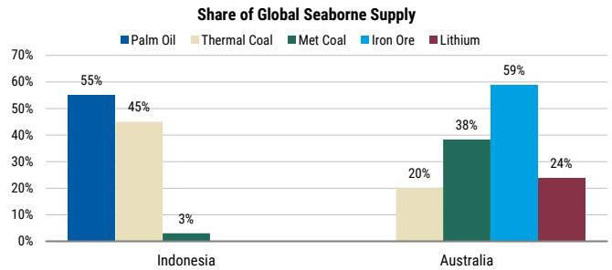

bar chart

Share of Global Seaborne Supply
| Country | Palm Oil (%) | Thermal Coal (%) | Met Coal (%) | Iron Ore (%) | Lithium (%) |
| :--- | :--- | :--- | :--- | :--- | :--- |
| Indonesia | 55 | 45 | 3 | | |
| Australia | | 20 | 38 | 59 | 24 |

Note: Lithium and Palm Oil shown as a percentage of total Global Supply. Source: MS estimates.

<table><tr><td>ASX Miners Relative Preference Table</td><td>P2</td><td>China – Macro Outlook</td><td>P16</td></tr><tr><td>ASX Coverage Valuation Tables</td><td>P3</td><td>Electric Vehicle-related Charts</td><td>P22</td></tr><tr><td>ASX Mining Equities</td><td>P5</td><td>Commodities: Aluminium</td><td>P27</td></tr><tr><td>ASX Miners Revenue Exposures</td><td>P6</td><td>Commodities: Coal</td><td>P30</td></tr><tr><td>ASX Mining Sector vs. Industrials Ex-Banks</td><td>P7</td><td>Commodities: Copper</td><td>P32</td></tr><tr><td>ASX Mining vs. Industrials – Relative</td><td>P8</td><td>Commodities: Gold and Precious Metals</td><td>P35</td></tr><tr><td>Australian Mining vs. Global Mining Sector</td><td>P9</td><td>Commodities: Iron Ore</td><td>P37</td></tr><tr><td>Global Mining Sector vs. Global Market</td><td>P10</td><td>Commodities: Lithium</td><td>P40</td></tr><tr><td>Global Miners – Valuation Tables</td><td>P11</td><td>Commodities: Nickel</td><td>P48</td></tr><tr><td>Commodities vs. Marginal Cost</td><td>P15</td><td>Commodities: Zinc</td><td>P50</td></tr></table>

MS AUSTRALIA LIMITED+

Rahul Anand, CFA

Equity Analyst

R.Anand@morganstanley.com +61 2 9770-1136

Michael A Stancliff

Research Associate

Michael.Stancliff@morganstanley.com +61 2 9770-9253

Asia Summer School 2026

## AUSTRALIA MATERIALS

Asia Pacific

Industry View

Attractive

Recent Research:

Sustainability & Metals & Mining: EU's Critical Raw Materials Security in a Multipolar World (5 Jun 2026)

Asia Energy Security and AI: Energy Meets

Compute: Supercycle Recharges (21 May 2026)

Mineral Resources Limited: TripNotes: Wodgina Site Visit (20 May 2026)

BHP Group Ltd: Rising data centre build favours BHP's commodity mix – but there's plenty of alpha too (13 May 2026)

Boss Energy Ltd: Updating Estimates and Price Target (1 May 2026)

Mineral Resources Limited: Updating Estimates (30 Apr 2026)

MS does and seeks to do business with companies covered in MS. As a result, investors should be aware that the firm may have a conflict of interest that could affect the objectivity of MS. Investors should consider MS as only a single factor in making their investment decision.

For analyst certification and other important disclosures, refer to the Disclosure Section, located at the end of this report.

+= Analysts employed by non-U.S. affiliates are not registered with FINRA, may not be associated persons of the member and may not be subject to FINRA restrictions on communications with a subject company, public appearances and trading securities held by a research analyst account.

## ASX Miners Relative Preference Table

Exhibit 2: ASX Miners – Investment thesis, upside/downside to share price, financial metrics and consensus ratings

<table><tr><td>Rank</td><td>Code</td><td>Rating</td><td>Index</td><td>Consensus(Buy, Hold, Sell)</td><td>Last Price</td><td>Target</td><td>Upside /Downside</td><td>EV/EBITDA1yr fwd</td><td>FCF Yield1yr fwd</td><td>Div. Yield1yr fwd</td><td>Gearing1yr fwd</td><td>12 Mth move</td><td>Investment Thesis</td></tr><tr><td>1</td><td>WHC</td><td>OW</td><td>100</td><td>64% 21% 14%</td><td>9.37</td><td>9.55</td><td>2%</td><td>4.3</td><td>13%</td><td>6%</td><td>12%</td><td></td><td>WHC has seen improving operational performance across assets, which we think could continue into FY26e. FID Winchester South would boost valuation further, while generating strong operating cash flow following cost-out initiatives at Queensland assets.</td></tr><tr><td>2</td><td>PDN</td><td>OW</td><td>200</td><td>53% 27% 20%</td><td>11.05</td><td>13.65</td><td>24%</td><td>15.5</td><td>4%</td><td>0%</td><td>-7%</td><td></td><td>We expect production issues faced during ramp up of Langer Heinrich to be rectified in FY26. PDN also has strong growth potential through Patterson Lake South, a 9.1 Mbpa project in Canada with first production expected in CY31e, which could make PDN a sizeable uranium player.</td></tr><tr><td>3</td><td>S32</td><td>OW</td><td>50</td><td>69% 25% 6%</td><td>4.63</td><td>4.85</td><td>5%</td><td>6.5</td><td>2%</td><td>3%</td><td>-2%</td><td></td><td>S32 has potential to continue generating significant cash flow, enabling strong shareholder returns along with potential to grow base metals production through its Hermosa project in the US.</td></tr><tr><td>4</td><td>BHP</td><td>OW</td><td>20</td><td>25% 75% 0%</td><td>61.24</td><td>67.50</td><td>10%</td><td>7.6</td><td>5%</td><td>4%</td><td>13%</td><td></td><td>BHP has an attractive commodity mix (iron ore, copper, met coal), resilient FCF and potential for shareholder returns, while maintaining a strong balance sheet for favourable growth and/or increasing cash shareholder returns.</td></tr><tr><td>5</td><td>ILU</td><td>OW</td><td>200</td><td>56% 44% 0%</td><td>7.75</td><td>7.95</td><td>3%</td><td>24.9</td><td>-11.4%</td><td>2%</td><td>41%</td><td></td><td>We see ILU&#x27;s rare earth downstream strategy well positioned to benefit from establishment of an ex-China rare earths supply chain. We also see any near-term weakness in the mineral sand market as being fairly priced in.</td></tr><tr><td>6</td><td>BOE</td><td>OW</td><td>N/A</td><td>33% 33% 33%</td><td>1.28</td><td>1.80</td><td>41%</td><td>2.4</td><td>8%</td><td>0%</td><td>-11%</td><td></td><td>We see potential for an improved production scenario from a revised Honeymoon Feasibility Study expected 3QCY26. Although uncertainty remains, we see risks and opportunities skewed to the upside, and we remain constructive on the outlook for Uranium.</td></tr><tr><td>7</td><td>DRR</td><td>OW</td><td>200</td><td>50% 50% 0%</td><td>4.40</td><td>4.45</td><td>1%</td><td>10.5</td><td>6%</td><td>5%</td><td>31%</td><td></td><td>We like DRR&#x27;s high-grade iron ore exposure, primarily from the MAC asset. Deterra&#x27;s yields are less sensitive to change in iron ore prices being a royalty company.</td></tr><tr><td>8</td><td>PLS</td><td>EW</td><td>50</td><td>47% 27% 27%</td><td>5.91</td><td>5.60</td><td>-5%</td><td>11.8</td><td>2%</td><td>1%</td><td>-30%</td><td></td><td>PLS has expansion optionality at Pilgangoora, and we also see potential for a near-term restart at Ngungaju to capitalise on the strong rebound in spodumene prices. P2000 FID could boost valuation, with study results expected CY26-end.</td></tr><tr><td>9</td><td>LYC</td><td>EW</td><td>50</td><td>62% 23% 15%</td><td>18.16</td><td>20.45</td><td>13%</td><td>16.4</td><td>3%</td><td>0%</td><td>-67%</td><td></td><td>LYC stands to benefit from rare earths supply chain diversification, and is also expanding its separated HRE product offerings through a new separation facility in Malaysia which we expect will drive earnings growth, however we see the stock as fairly valued currently.</td></tr><tr><td>10</td><td>RIO</td><td>EW</td><td>20</td><td>47% 47% 7%</td><td>184.58</td><td>171.50</td><td>-7%</td><td>8.6</td><td>4%</td><td>4%</td><td>13%</td><td></td><td>The company maintains a robust balance sheet, giving flexibility to pursue growth and/or increase cash shareholder returns. We see company offering volume growth prospects for iron ore and lithium in particular, however this comes with some execution risk.</td></tr><tr><td>11</td><td>FMG</td><td>UW</td><td>20</td><td>6% 50% 44%</td><td>20.53</td><td>18.85</td><td>-8%</td><td>6.4</td><td>4%</td><td>4%</td><td>5%</td><td></td><td>FMG continues to have strong cash generation through its Hematite operations, supporting attractive dividends yields, however we think this is more than fairly valued currently.</td></tr><tr><td>12</td><td>SFR</td><td>UW</td><td>100</td><td>69% 15% 15%</td><td>19.28</td><td>16.00</td><td>-17%</td><td>4.9</td><td>10%</td><td>4%</td><td>-34%</td><td></td><td>Despite opportunities to extend reserve lives at Motheo and MATSA, and development potential at Black Butte, we see the market more than pricing this in with downside to our base case valuation and probability-weighted price target.</td></tr><tr><td>13</td><td>IGO</td><td>UW</td><td>100</td><td>31% 62% 8%</td><td>8.98</td><td>6.85</td><td>-24%</td><td>26.9</td><td>1%</td><td>0%</td><td>-79%</td><td></td><td>IGO offers diversified exposure to clean energy metals, and despite seeing value in this theme, we think this is more than accounted for in the current stock price. We also remain cautious on acquisition risks, with the Nova Operation end of life fast approaching in CY26 and minority Greenbushes stake.</td></tr></table>

Source: MS, Thomson Reuters. Order of Preference considers relative upside/downside to TP, relative market capitalization, relative risk-reward balance and timing of potential performance drivers. Green shading on company metrics identifies equities with values more favourable than the weighted average. Consensus Rating cell highlighted in orange is a contrarian call for the respective equity. IGO EV/EBITDA multiple includes IGO's share of lithium EBITDA.  
Source: Refinitiv, MS. Note: Share prices as of June 5, 2026.

# ASX Coverage Valuation Tables

## Base Case

Exhibit 3: Base case valuation multiples and key metrics: ASX miners under MS coverage

<table><tr><td rowspan="2"></td><td rowspan="2">Rating</td><td rowspan="2">Year ending</td><td rowspan="2">FX</td><td rowspan="2">Base Case Valuation (A$)</td><td rowspan="2">Market Cap (mn)</td><td rowspan="2">EV (mn)</td><td colspan="2">P/E</td><td colspan="2"> $EV/EBITDA^*$ </td><td colspan="2">FCF Yield</td><td colspan="2">Dividend Yield</td><td colspan="2">Gearing</td></tr><tr><td>FY27/CY26</td><td>FY28/CY27</td><td>FY27/CY26</td><td>FY28/CY27</td><td>FY27/CY26</td><td>FY28/CY27</td><td>FY27/CY26</td><td>FY28/CY27</td><td>FY27/CY26</td><td>FY28/CY27</td></tr><tr><td colspan="17">Diversified</td></tr><tr><td>BHP</td><td>OW</td><td>June</td><td>USD</td><td>56.90</td><td>219,558</td><td>252,011 e</td><td>15.6</td><td>16.7</td><td>7.9</td><td>9.0</td><td>4.8%</td><td>4.0%</td><td>3.8%</td><td>3.6%</td><td>14%</td><td>15%</td></tr><tr><td>Rio Tinto Ltd.</td><td>EW</td><td>December</td><td>USD</td><td>147.50</td><td>211,375</td><td>255,705 e</td><td>14.7</td><td>15.2</td><td>8.7</td><td>8.6</td><td>3.8%</td><td>4.5%</td><td>4.1%</td><td>4.0%</td><td>16%</td><td>13%</td></tr><tr><td colspan="17">Bulks</td></tr><tr><td>Fortescue Metals Group</td><td>UW</td><td>June</td><td>USD</td><td>18.95</td><td>44,612</td><td>45,752 e</td><td>17.3</td><td>14.4</td><td>7.1</td><td>6.3</td><td>3.8%</td><td>4.6%</td><td>3.8%</td><td>4.6%</td><td>5%</td><td>4%</td></tr><tr><td>Deterra Royalties</td><td>OW</td><td>June</td><td>AUD</td><td>4.17</td><td>2,333</td><td>2,422 e</td><td>15.1</td><td>15.1</td><td>10.7</td><td>10.6</td><td>6.2%</td><td>7.2%</td><td>5.0%</td><td>5.0%</td><td>31%</td><td>14%</td></tr><tr><td>Whitehaven Coal</td><td>OW</td><td>June</td><td>AUD</td><td>9.35</td><td>7,800</td><td>8,664 e</td><td>8.3</td><td>9.4</td><td>4.2</td><td>4.7</td><td>9.8%</td><td>-1.4%</td><td>6.8%</td><td>5.3%</td><td>12%</td><td>16%</td></tr><tr><td colspan="17">Base Metals</td></tr><tr><td>South32</td><td>OW</td><td>June</td><td>USD</td><td>3.90</td><td>14,698</td><td>14,437 e</td><td>9.6</td><td>11.3</td><td>5.6</td><td>6.4</td><td>4.5%</td><td>1.5%</td><td>3.8%</td><td>3.3%</td><td>-2%</td><td>2%</td></tr><tr><td>Sandfire Resources</td><td>UW</td><td>June</td><td>USD</td><td>11.90</td><td>6,235</td><td>5,617 e</td><td>13.9</td><td>17.6</td><td>5.2</td><td>5.8</td><td>9.7%</td><td>9.8%</td><td>3.6%</td><td>2.8%</td><td>-34%</td><td>-65%</td></tr><tr><td>IGO Ltd</td><td>UW</td><td>June</td><td>AUD</td><td>5.80</td><td>6,800</td><td>5,638 e</td><td>13.3</td><td>15.8</td><td>6.8</td><td>8.9</td><td>24.4%</td><td>13.2%</td><td>3.0%</td><td>5.8%</td><td>-79%</td><td>-74%</td></tr><tr><td colspan="17">Other</td></tr><tr><td>Iluka Resources</td><td>OW</td><td>December</td><td>AUD</td><td>7.30</td><td>3,354</td><td>4,762 e</td><td>NM</td><td>NM</td><td>28.9</td><td>14.2</td><td>-10.8%</td><td>-19.6%</td><td>2.3%</td><td>0.7%</td><td>41%</td><td>49%</td></tr><tr><td>Pilbara Minerals</td><td>EW</td><td>June</td><td>AUD</td><td>4.30</td><td>19,204</td><td>18,108 e</td><td>25.0</td><td>36.3</td><td>13.4</td><td>18.1</td><td>2.0%</td><td>-0.9%</td><td>0.5%</td><td>0.0%</td><td>-40%</td><td>-22%</td></tr><tr><td>Lynas Rare Earths</td><td>EW</td><td>June</td><td>AUD</td><td>15.10</td><td>17,852</td><td>16,155 e</td><td>29.3</td><td>24.6</td><td>17.4</td><td>14.6</td><td>3.0%</td><td>4.0%</td><td>0.0%</td><td>0.0%</td><td>-67%</td><td>-95%</td></tr><tr><td>Boss Energy</td><td>OW</td><td>June</td><td>USD</td><td>1.00</td><td>374</td><td>316 e</td><td>7.4</td><td>7.8</td><td>3.8</td><td>3.8</td><td>5.4%</td><td>-0.4%</td><td>0.0%</td><td>0.0%</td><td>-10%</td><td>-8%</td></tr><tr><td>Paladin Energy</td><td>OW</td><td>June</td><td>USD</td><td>8.80</td><td>3,512</td><td>3,330 e</td><td>29.6</td><td>28.7</td><td>22.8</td><td>25.5</td><td>2.7%</td><td>-1.3%</td><td>0.0%</td><td>0.0%</td><td>-8%</td><td>-1%</td></tr></table>

Source: MS estimates. Note: \* IGO EBITDA includes IGO's share of lithium EBITDA for EV/EBITDA calculation and IGO FCF Yield includes dividends received from associates. Prices as of June 5, 2026.

## Spot Case

Exhibit 4: Spot case valuation multiples and key metrics: ASX miners under MS coverage

<table><tr><td rowspan="2"></td><td rowspan="2">Rating</td><td rowspan="2">Year Ending</td><td rowspan="2">Close Price (A$)</td><td rowspan="2">Price Target (A$)</td><td rowspan="2">FX</td><td rowspan="2">Valuation at Spot (A$)</td><td rowspan="2">Market Cap (mn)</td><td rowspan="2">EV (mn)</td><td colspan="2">P/E</td><td colspan="2">EV/EBITDA</td><td colspan="2">FCF Yield</td><td colspan="2">Dividend Yield</td><td colspan="2">Gearing</td></tr><tr><td>FY27/CY26</td><td>FY28/CY27</td><td>FY27/CY26</td><td>FY28/CY27</td><td>FY27/CY26</td><td>FY28/CY27</td><td>FY27/CY26</td><td>FY28/CY27</td><td>FY27/CY26</td><td>FY28/CY27</td></tr><tr><td colspan="19">Diversified</td></tr><tr><td>BHP</td><td>OW</td><td>June</td><td>61.24 AUD</td><td>67.50</td><td>USD</td><td>61.85</td><td>219,558</td><td>252,011</td><td>19.3</td><td>18.6</td><td>7.2</td><td>7.3</td><td>5.8%</td><td>5.6%</td><td>4.4%</td><td>4.5%</td><td>12%</td><td>12%</td></tr><tr><td>Rio Tinto Ltd.</td><td>EW</td><td>December</td><td>184.58 AUD</td><td>171.50 AUD</td><td>USD</td><td>151.50</td><td>211,375</td><td>255,705</td><td>14.3</td><td>13.3</td><td>8.3</td><td>7.6</td><td>4.2%</td><td>5.7%</td><td>4.3%</td><td>4.6%</td><td>15%</td><td>11%</td></tr><tr><td colspan="19">Bulks</td></tr><tr><td>Fortescue Metals Group</td><td>UW</td><td>June</td><td>20.53 AUD</td><td>18.85 AUD</td><td>USD</td><td>20.15</td><td>44,612</td><td>45,752</td><td>12.8</td><td>11.1</td><td>6.3</td><td>5.7</td><td>5.0%</td><td>5.8%</td><td>4.6%</td><td>5.3%</td><td>3%</td><td>2%</td></tr><tr><td>Deterra Royalties</td><td>OW</td><td>June</td><td>4.40</td><td>4.45</td><td>AUD</td><td>4.40</td><td>2,333</td><td>2,422</td><td>13.6</td><td>13.6</td><td>9.8</td><td>9.7</td><td>6.5%</td><td>7.8%</td><td>5.4%</td><td>5.4%</td><td>30%</td><td>11%</td></tr><tr><td>Whitehaven Coal</td><td>OW</td><td>June</td><td>9.37</td><td>9.55</td><td>AUD</td><td>11.00</td><td>7,800</td><td>8,664</td><td>7.3</td><td>5.5</td><td>4.3</td><td>3.7</td><td>8.7%</td><td>2.6%</td><td>6.5%</td><td>7.6%</td><td>13%</td><td>13%</td></tr><tr><td colspan="19">Base Metals</td></tr><tr><td>South32</td><td>OW</td><td>June</td><td>4.63 AUD</td><td>4.85 AUD</td><td>USD</td><td>5.00</td><td>14,698</td><td>14,437</td><td>7.8</td><td>7.6</td><td>4.5</td><td>4.5</td><td>8.0%</td><td>6.0%</td><td>5.0%</td><td>5.1%</td><td>-6%</td><td>-6%</td></tr><tr><td>Sandfire Resources</td><td>UW</td><td>June</td><td>19.28 AUD</td><td>16.00 AUD</td><td>USD</td><td>15.15</td><td>6,235</td><td>5,617</td><td>15.6</td><td>15.0</td><td>4.5</td><td>4.1</td><td>11.4%</td><td>12.7%</td><td>4.4%</td><td>4.6%</td><td>-40%</td><td>-77%</td></tr><tr><td>IGO Ltd</td><td>UW</td><td>June</td><td>8.98</td><td>6.85</td><td>AUD</td><td>8.25</td><td>6,800</td><td>5,638</td><td>8.7</td><td>7.4</td><td>5.0</td><td>4.7</td><td>30.3%</td><td>24.6%</td><td>6.2%</td><td>11.5%</td><td>-95%</td><td>-89%</td></tr><tr><td colspan="19">Other</td></tr><tr><td>Iluka Resources</td><td>OW</td><td>December</td><td>7.75</td><td>7.95</td><td>AUD</td><td>5.95</td><td>3,354</td><td>4,762</td><td>NM</td><td>NM</td><td>NM</td><td>27.7</td><td>-13.3%</td><td>-23.3%</td><td>1.5%</td><td>0.7%</td><td>43%</td><td>55%</td></tr><tr><td>Pilbara Minerals</td><td>EW</td><td>June</td><td>5.91</td><td>5.60</td><td>AUD</td><td>6.05</td><td>19,204</td><td>18,108</td><td>13.2</td><td>12.3</td><td>8.5</td><td>7.8</td><td>4.9%</td><td>3.7%</td><td>1.3%</td><td>0.9%</td><td>-63%</td><td>-59%</td></tr><tr><td>Lynas Rare Earths</td><td>EW</td><td>June</td><td>18.16</td><td>20.45</td><td>AUD</td><td>14.70</td><td>17,852</td><td>16,155</td><td>31.4</td><td>26.1</td><td>19.0</td><td>15.8</td><td>2.7%</td><td>3.6%</td><td>0.0%</td><td>0.0%</td><td>-65%</td><td>-91%</td></tr><tr><td>Boss Energy</td><td>OW</td><td>June</td><td>1.28 AUD</td><td>1.80 AUD</td><td>USD</td><td>1.80</td><td>374</td><td>316</td><td>7.8</td><td>6.0</td><td>4.4</td><td>3.1</td><td>3.3%</td><td>4.5%</td><td>0.0%</td><td>0.0%</td><td>-7%</td><td>-10%</td></tr><tr><td>Paladin Energy</td><td>OW</td><td>June</td><td>11.05 AUD</td><td>13.65 AUD</td><td>USD</td><td>10.55</td><td>3,512</td><td>3,330</td><td>36.4</td><td>25.9</td><td>27.4</td><td>23.6</td><td>2.0%</td><td>-1.2%</td><td>0.0%</td><td>0.0%</td><td>-5%</td><td>1%</td></tr></table>

Source: MS estimates. Note: \* IGO EBITDA includes IGO's share of lithium EBITDA for EV/EBITDA calculation and IGO FCF Yield includes dividends received from associates. Prices as of June 5, 2026.

## ASX Mining Equities

Exhibit 5: EBITDA margins of ASX miners in our coverage  
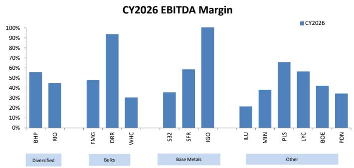

bar chart

CY2026 EBITDA Margin
| Company | CY2026 (%) |
| :--- | :--- |
| BHP | 56 |
| RIO | 45 |
| FMG | 48 |
| DRR | 93 |
| WHC | 30 |
| S32 | 35 |
| SFR | 58 |
| IGO | 100 |
| ILU | 21 |
| MIN | 38 |
| PLS | 66 |
| LYC | 56 |
| BOE | 42 |
| PDN | 34 |
Diversified
Bulks
Base Metals
Other

Source: Company data, MS estimates.

Exhibit 6: P/E ratios of ASX miners in our coverage  
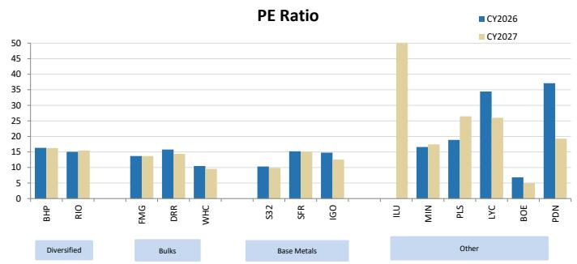

bar chart

PE Ratio
| Company | CY2026 | CY2027 |
| :--- | :--- | :--- |
| BHP | 16 | 16 |
| RIO | 14 | 15 |
| FMG | 13 | 13 |
| DRR | 16 | 14 |
| WHC | 10 | 9 |
| SS2 | 10 | 10 |
| SFR | 15 | 15 |
| IGO | 14 | 12 |
| ILU | 0 | 50 |
| MIN | 16 | 17 |
| PLS | 19 | 26 |
| LYC | 34 | 26 |
| BOE | 7 | 5 |
| PDN | 37 | 19 |
Diversified
Bulks
Base Metals
Other

Source: Company data, MS estimates. Note: Prices as of June 5, 2026.

Exhibit 7: FCF margin of ASX miners in our coverage  
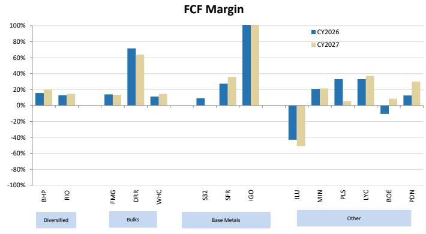

bar chart

FCF Margin
| Company | CY2026 (%) | CY2027 (%) |
| :--- | :--- | :--- |
| BHP | 15 | 20 |
| RIO | 13 | 14 |
| FMG | 14 | 13 |
| DRR | 70 | 63 |
| WHC | 12 | 14 |
| S32 | 8 | - |
| SFR | 26 | 35 |
| IGO | 100 | 100 |
| ILU | -40 | -55 |
| MIN | 20 | 21 |
| PLS | 32 | 3 |
| LYC | 33 | 36 |
| BOE | -8 | 8 |
| PDN | 12 | 29 |
Diversified; Bulks; Base Metals; Other

Source: Company data, MS estimates. Note: FCF defined as OCF - capital expenditures.

Exhibit 8: Net debt/EBITDA of ASX miners in our coverage  
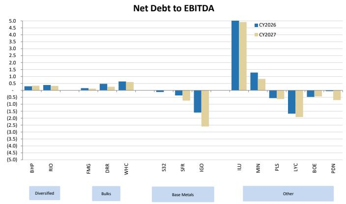

bar chart

| Company | CY2026 | CY2027 |
|---------|--------|--------|
| BHP     | 0.3    | 0.3    |
| RIO     | 0.4    | 0.4    |
| FMG     | 0.1    | 0.1    |
| DRR     | 0.5    | 0.4    |
| WHC     | 0.7    | 0.6    |
| S32     | -0.3   | -0.3   |
| SFR     | -0.4   | -0.5   |
| IGO     | -1.5   | -2.5   |
| IJU     | 4.8    | 4.7    |
| MIN     | 1.3    | 0.9    |
| PLS     | -0.5   | -0.5   |
| LVC     | -1.3   | -2.0   |
| BOE     | -0.3   | -0.3   |
| PDN     | -0.3   | -0.4   |

Source: Company data, MS estimates.

Exhibit 9: Dividend yield of ASX miners in our coverage  
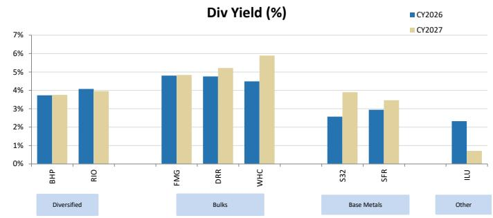

bar chart

Div Yield (%)
| Company | CY2026 (%) | CY2027 (%) |
| :--- | :--- | :--- |
| BHP | 3.8 | 3.8 |
| RIO | 4.1 | 4.0 |
| FMG | 4.9 | 4.9 |
| DRR | 4.8 | 5.2 |
| WHC | 4.5 | 5.9 |
| S32 | 2.6 | 3.9 |
| SFR | 2.9 | 3.4 |
| ILU | 2.3 | 0.7 |
Diversified
Bulks
Base Metals
Other

Source: Company data, MS estimates. Note: Prices as of June 5, 2026.

Exhibit 10: 2026e P/B vs. ROE of ASX miners in our coverage  
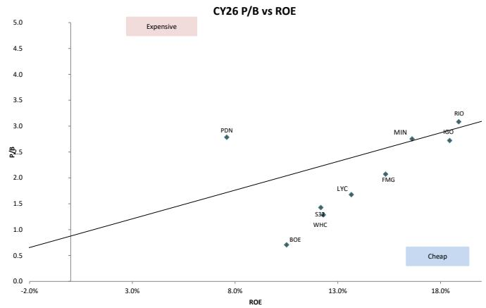

scatter plot

| Company | ROE   | P/B  |
|---------|-------|------|
| PDN     | 8.0%  | 2.8  |
| MIN     | 17.5% | 2.8  |
| LOO     | 18.0% | 2.7  |
| FMG     | 14.0% | 2.1  |
| LYC     | 13.0% | 1.7  |
| WHC     | 12.5% | 1.3  |
| S3H     | 12.0% | 1.4  |
| BOE     | 10.0% | 0.7  |
| RIO     | 18.5% | 3.1  |

Source: Company data, MS estimates. Note: Period-end book values. Prices as of June 5, 2026.

## ASX Miners Revenue Exposures

Exhibit 11: Commodity Revenue Exposure of Australian Coverage  

bar chart

| Category | Series 1 (%) | Series 2 (%) |
| :--- | :--- | :--- |
| Copper | SFR | 72 |
| Copper | BHP | 48 |
| Copper | RIO | 23 |
| Copper | S32 | 12 |
| Copper | IGO | 2 |
| Aluminium | S32 | 39 |
| Aluminium | RIO | 28 |
| Aluminium | S32 | 21 |
| Nickel | IGO | 5 |
| Nickel | S32 | 0 |
| Zinc | SFR | 12 |
| Zinc | S32 | 1 |
| Lead | S32 | 2 |
| Lead | SFR | 1 |
| Lithium/ Spod. | PLS | 100 |
| Lithium/ Spod. | IGO | 92 |
| Lithium/ Spod. | MIN | 16 |

Source: Company data, MS. Note: IGO exposure considers IGO share of Lithium Assets (accounted using equity method).

Exhibit 12: Commodity Revenue Exposure of Australian Coverage  
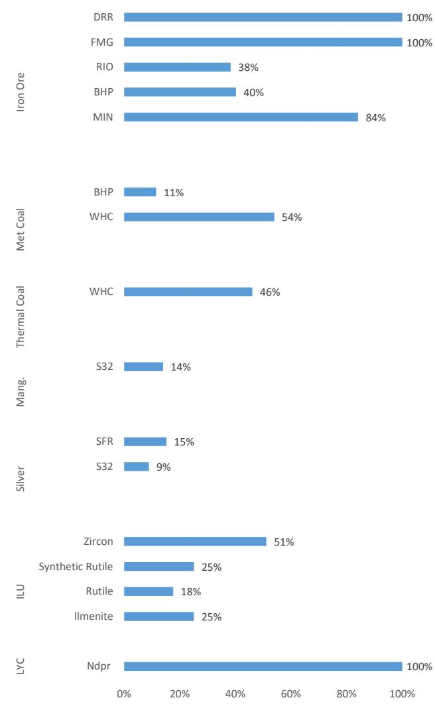

bar chart

| Category | Value (%) |
|---|---|
| DRR | 100 |
| FMG | 100 |
| RIO | 38 |
| BHP | 40 |
| MIN | 84 |
| BHP | 11 |
| WHC | 54 |
| WHC | 46 |
| S32 | 14 |
| SFR | 15 |
| S32 | 9 |
| Zircon | 51 |
| Synthetic Rutile | 25 |
| Rutile | 18 |
| Ilmenite | 25 |
| LYC | 100 |

Source: Company data, MS.

## ASX Mining Sector vs. Industrials Ex-Banks

Exhibit 13: Next 12 months EV/EBITDA: Bottom-up mining and industrials indices  
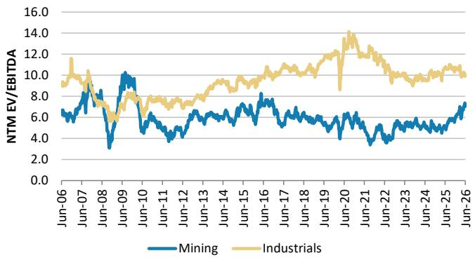

line chart

| Date   | Mining | Industrials |
|--------|--------|-------------|
| Jun-06 | 6.5    | 9.5         |
| Jun-07 | 8.0    | 11.0        |
| Jun-08 | 3.0    | 7.0         |
| Jun-09 | 10.0   | 8.0         |
| Jun-10 | 5.0    | 7.5         |
| Jun-11 | 4.5    | 7.0         |
| Jun-12 | 5.5    | 7.5         |
| Jun-13 | 6.0    | 8.0         |
| Jun-14 | 6.5    | 8.5         |
| Jun-15 | 7.0    | 9.0         |
| Jun-16 | 7.5    | 9.5         |
| Jun-17 | 7.0    | 10.0        |
| Jun-18 | 6.5    | 10.5        |
| Jun-19 | 6.0    | 11.0        |
| Jun-20 | 5.5    | 14.0        |
| Jun-21 | 4.0    | 13.0        |
| Jun-22 | 5.0    | 12.0        |
| Jun-23 | 5.5    | 11.0        |
| Jun-24 | 6.0    | 10.5        |
| Jun-25 | 6.5    | 10.0        |
| Jun-26 | 7.0    | 10.5        |

Source: Refinitiv, MS. Note: Market cap-weighted consensus EV and EBITDA totals used index construction.

Exhibit 15: Next 12 months P/B: Mining and industrials indices  
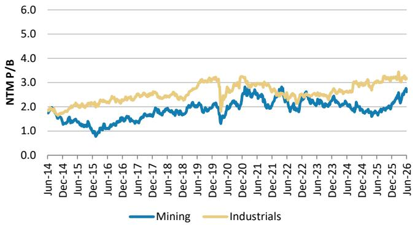

line chart

| Date    | Mining | Industrials |
|---------|--------|-------------|
| Jun-14  | 1.8    | 1.9         |
| Dec-14  | 1.5    | 2.0         |
| Jun-15  | 1.3    | 2.1         |
| Dec-15  | 0.9    | 2.2         |
| Jun-16  | 1.4    | 2.3         |
| Dec-16  | 1.6    | 2.4         |
| Jun-17  | 1.7    | 2.5         |
| Dec-17  | 1.8    | 2.6         |
| Jun-18  | 1.9    | 2.7         |
| Dec-18  | 2.0    | 2.8         |
| Jun-19  | 2.1    | 2.9         |
| Dec-19  | 2.2    | 3.0         |
| Jun-20  | 2.3    | 3.1         |
| Dec-20  | 2.4    | 3.2         |
| Jun-21  | 2.5    | 3.3         |
| Dec-21  | 2.6    | 3.4         |
| Jun-22  | 2.7    | 3.5         |
| Dec-22  | 2.8    | 3.6         |
| Jun-23  | 2.9    | 3.7         |
| Dec-23  | 3.0    | 3.8         |
| Jun-24  | 3.1    | 3.9         |
| Dec-24  | 3.2    | 4.0         |
| Jun-25  | 3.3    | 4.1         |
| Dec-25  | 3.4    | 4.2         |
| Jun-26  | 3.5    | 4.3         |

Source: Refinitiv, MS. Note: Market cap-weighted consensus market cap and FCF totals used for index construction.

Exhibit 17: Next 12 months dividend yield: Bottom-up mining and industrials indices  
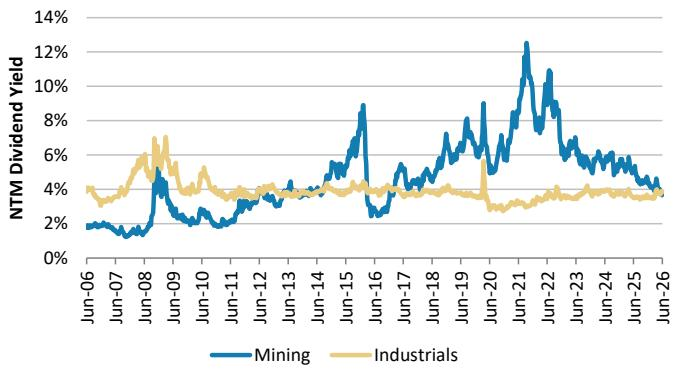

line chart

| Date   | Mining | Industrials |
|--------|--------|-------------|
| Jun-06 | 2%     | 4%          |
| Jun-07 | 2%     | 4%          |
| Jun-08 | 4%     | 6%          |
| Jun-09 | 2%     | 4%          |
| Jun-10 | 2%     | 4%          |
| Jun-11 | 3%     | 4%          |
| Jun-12 | 3%     | 4%          |
| Jun-13 | 4%     | 4%          |
| Jun-14 | 4%     | 4%          |
| Jun-15 | 9%     | 4%          |
| Jun-16 | 2%     | 4%          |
| Jun-17 | 5%     | 4%          |
| Jun-18 | 5%     | 4%          |
| Jun-19 | 7%     | 4%          |
| Jun-20 | 9%     | 3%          |
| Jun-21 | 13%    | 3%          |
| Jun-22 | 11%    | 3%          |
| Jun-23 | 6%     | 3%          |
| Jun-24 | 5%     | 3%          |
| Jun-25 | 4%     | 3%          |
| Jun-26 | 4%     | 3%          |

Source: Refinitiv, MS. Note: Market cap-weighted consensus market cap and dividend totals used for index construction.

Exhibit 14: Next 12 months P/E: Bottom-up mining and industrials indices  
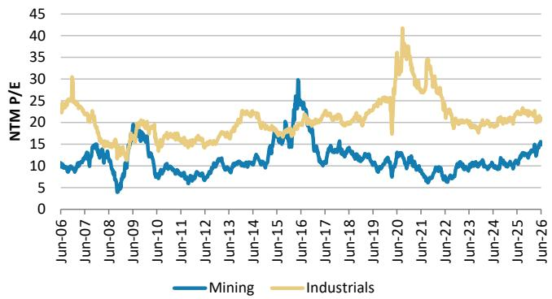

line chart

| Date   | Mining | Industrials |
|--------|--------|-------------|
| Jun-06 | 10     | 25          |
| Jun-07 | 12     | 30          |
| Jun-08 | 5      | 15          |
| Jun-09 | 18     | 18          |
| Jun-10 | 10     | 15          |
| Jun-11 | 8      | 16          |
| Jun-12 | 10     | 17          |
| Jun-13 | 12     | 18          |
| Jun-14 | 15     | 20          |
| Jun-15 | 18     | 22          |
| Jun-16 | 30     | 25          |
| Jun-17 | 15     | 22          |
| Jun-18 | 12     | 20          |
| Jun-19 | 10     | 25          |
| Jun-20 | 12     | 40          |
| Jun-21 | 8      | 35          |
| Jun-22 | 10     | 30          |
| Jun-23 | 12     | 25          |
| Jun-24 | 15     | 20          |
| Jun-25 | 18     | 22          |
| Jun-26 | 20     | 20          |

Source: Refinitiv, MS. Note: Market cap-weighted consensus market cap and net income totals used for index construction.

Exhibit 16: Next 12 months FCF yield: Bottom-up mining and industrials indices  
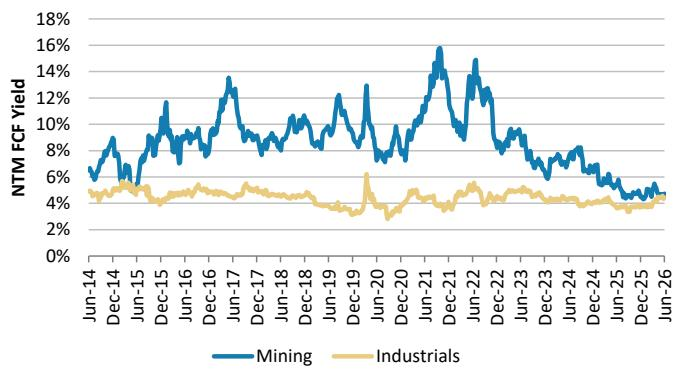

line chart

| Date    | Mining | Industrials |
|---------|--------|-------------|
| Jun-14  | 6%     | 5%          |
| Dec-14  | 8%     | 5%          |
| Jun-15  | 10%    | 5%          |
| Dec-15  | 12%    | 5%          |
| Jun-16  | 10%    | 5%          |
| Dec-16  | 13%    | 5%          |
| Jun-17  | 10%    | 5%          |
| Dec-17  | 12%    | 5%          |
| Jun-18  | 10%    | 5%          |
| Dec-18  | 12%    | 5%          |
| Jun-19  | 10%    | 5%          |
| Dec-19  | 13%    | 6%          |
| Jun-20  | 8%     | 3%          |
| Dec-20  | 10%    | 4%          |
| Jun-21  | 16%    | 4%          |
| Dec-21  | 14%    | 4%          |
| Jun-22  | 10%    | 5%          |
| Dec-22  | 8%     | 5%          |
| Jun-23  | 6%     | 4%          |
| Dec-23  | 8%     | 4%          |
| Jun-24  | 6%     | 4%          |
| Dec-24  | 6%     | 4%          |
| Jun-25  | 5%     | 4%          |
| Dec-25  | 5%     | 4%          |
| Jun-26  | 5%     | 4%          |

Source: Refinitiv, MS. Note: Market cap-weighted consensus market cap and FCF totals used for index construction.

Exhibit 18: Next 12 months ROE: Bottom-up mining and industrials indices  
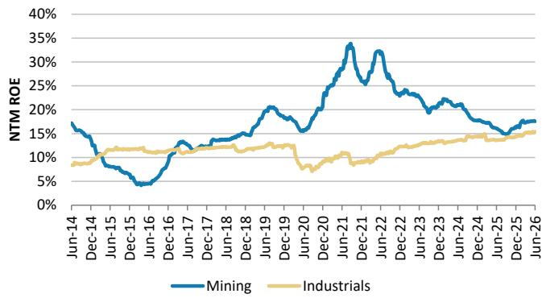

line chart

| Date    | Mining | Industrials |
|---------|--------|-------------|
| Jun-14  | 18%    | 9%          |
| Dec-14  | 10%    | 10%         |
| Jun-15  | 5%     | 11%         |
| Dec-15  | 4%     | 11%         |
| Jun-16  | 5%     | 11%         |
| Dec-16  | 10%    | 11%         |
| Jun-17  | 12%    | 11%         |
| Dec-17  | 13%    | 11%         |
| Jun-18  | 14%    | 12%         |
| Dec-18  | 15%    | 12%         |
| Jun-19  | 20%    | 13%         |
| Dec-19  | 18%    | 12%         |
| Jun-20  | 25%    | 8%          |
| Dec-20  | 30%    | 9%          |
| Jun-21  | 35%    | 10%         |
| Dec-21  | 30%    | 9%          |
| Jun-22  | 25%    | 10%         |
| Dec-22  | 20%    | 11%         |
| Jun-23  | 22%    | 12%         |
| Dec-23  | 20%    | 13%         |
| Jun-24  | 18%    | 14%         |
| Dec-24  | 16%    | 14%         |
| Jun-25  | 18%    | 15%         |
| Dec-25  | 17%    | 15%         |
| Jun-26  | 18%    | 15%         |

Source: Refinitiv, MS. Note: Market cap-weighted consensus net income and equity value totals used for index construction.

# ASX Mining Sector vs. Industrials Ex-Banks – Relative

Exhibit 19: Next 12 months relative EV/EBITDA: Bottom-up mining and industrials indices  
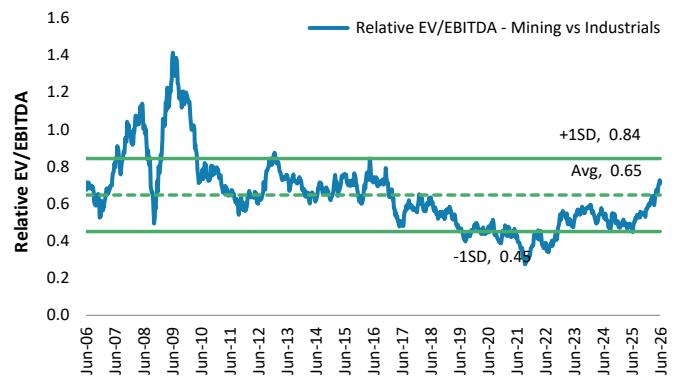

line chart

| Date   | Relative EV/EBITDA |
|--------|--------------------|
| Jun-06 | 0.7                |
| Jun-07 | 0.9                |
| Jun-08 | 1.1                |
| Jun-09 | 1.4                |
| Jun-10 | 0.8                |
| Jun-11 | 0.7                |
| Jun-12 | 0.8                |
| Jun-13 | 0.7                |
| Jun-14 | 0.7                |
| Jun-15 | 0.7                |
| Jun-16 | 0.8                |
| Jun-17 | 0.6                |
| Jun-18 | 0.6                |
| Jun-19 | 0.5                |
| Jun-20 | 0.4                |
| Jun-21 | 0.45               |
| Jun-22 | 0.3                |
| Jun-23 | 0.5                |
| Jun-24 | 0.6                |
| Jun-25 | 0.6                |
| Jun-26 | 0.7                |

Source: Refinitiv, MS. Note: Market cap-weighted consensus EV and EBITDA totals used index construction.

Exhibit 21: Next 12 months relative P/B: Mining and industrials indices  
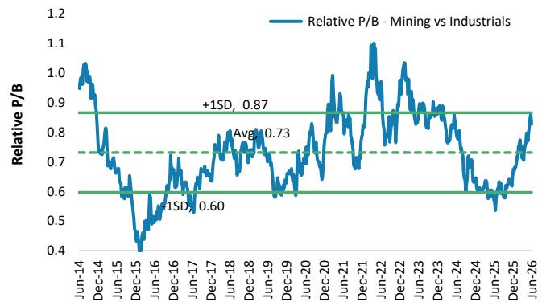

line chart

| Date    | Relative P/B |
|---------|--------------|
| Jun-14  | 1.0          |
| Dec-14  | 0.9          |
| Jun-15  | 0.6          |
| Dec-15  | 0.4          |
| Jun-16  | 0.5          |
| Dec-16  | 0.7          |
| Jun-17  | 0.6          |
| Dec-17  | 0.7          |
| Jun-18  | 0.8          |
| Dec-18  | 0.7          |
| Jun-19  | 0.6          |
| Dec-19  | 0.7          |
| Jun-20  | 0.8          |
| Dec-20  | 0.9          |
| Jun-21  | 0.7          |
| Dec-21  | 1.1          |
| Jun-22  | 0.8          |
| Dec-22  | 0.9          |
| Jun-23  | 0.8          |
| Dec-23  | 0.7          |
| Jun-24  | 0.6          |
| Dec-24  | 0.5          |
| Jun-25  | 0.6          |
| Dec-25  | 0.7          |
| Jun-26  | 0.8          |

Source: Refinitiv, MS. Note: Market cap-weighted consensus market cap and FCF totals used for index construction.

Exhibit 23: Next 12 months relative dividend yield: Bottom-up mining and industrials indices  
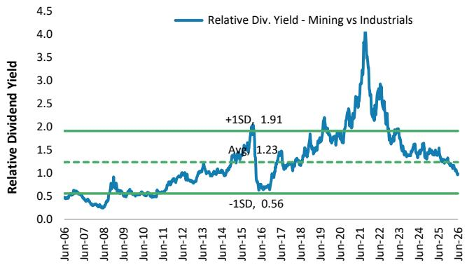

line chart

| Date   | Relative Dividend Yield |
|--------|--------------------------|
| Jun-15 | 1.91                     |
| Avg    | 1.23                     |
| Jun-26 | -1SD                     |

Source: Refinitiv, MS. Note: Market cap-weighted consensus market cap and dividend totals used for index construction.

Exhibit 20: Next 12 months relative P/E: Bottom-up mining and industrials indices  
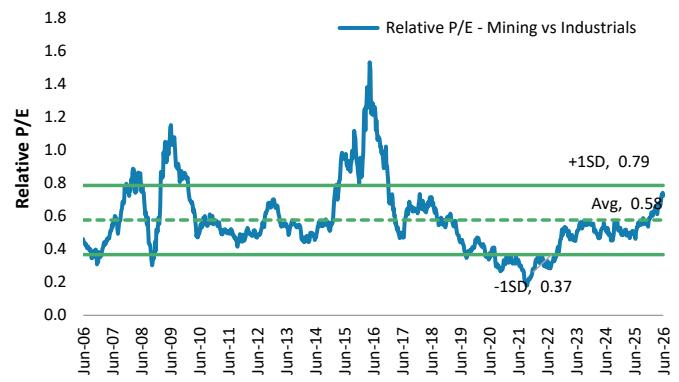

line chart

| Date   | Relative P/E - Mining vs Industrials |
|--------|--------------------------------------|
| Jun-06 | ~0.4                                 |
| Jun-07 | ~0.8                                 |
| Jun-08 | ~0.3                                 |
| Jun-09 | ~1.1                                 |
| Jun-10 | ~0.6                                 |
| Jun-11 | ~0.5                                 |
| Jun-12 | ~0.6                                 |
| Jun-13 | ~0.7                                 |
| Jun-14 | ~0.5                                 |
| Jun-15 | ~1.0                                 |
| Jun-16 | ~1.5                                 |
| Jun-17 | ~0.5                                 |
| Jun-18 | ~0.7                                 |
| Jun-19 | ~0.4                                 |
| Jun-20 | ~0.3                                 |
| Jun-21 | ~0.37                                |
| Jun-22 | ~0.4                                 |
| Jun-23 | ~0.5                                 |
| Jun-24 | ~0.6                                 |
| Jun-25 | ~0.6                                 |
| Jun-26 | ~0.7                                 |

Source: Refinitiv, MS. Note: Market cap-weighted consensus market cap and net income totals used for index construction.

Exhibit 22: Next 12 months relative FCF yield: Bottom-up mining and industrials indices  
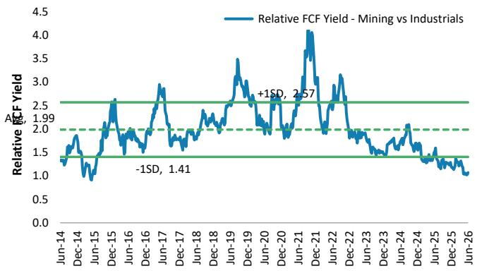

line chart

| Date    | Relative FCF Yield |
|---------|--------------------|
| Jun-14  | 1.41               |
| Dec-14  | 1.99               |
| Jun-15  | 2.57               |
| Dec-15  | 1.99               |
| Jun-16  | 2.57               |
| Dec-16  | 1.99               |
| Jun-17  | 2.57               |
| Dec-17  | 1.99               |
| Jun-18  | 2.57               |
| Dec-18  | 1.99               |
| Jun-19  | 2.57               |
| Dec-19  | 1.99               |
| Jun-20  | 2.57               |
| Dec-20  | 1.99               |
| Jun-21  | 2.57               |
| Dec-21  | 1.99               |
| Jun-22  | 2.57               |
| Dec-22  | 1.99               |
| Jun-23  | 2.57               |
| Dec-23  | 1.99               |
| Jun-24  | 2.57               |
| Dec-24  | 1.99               |
| Jun-25  | 2.57               |
| Dec-25  | 1.99               |
| Jun-26  | 1.99               |

Source: Refinitiv, MS. Note: Market cap-weighted consensus market cap and FCF totals used for index construction.

Exhibit 24: Next 12 months relative ROE: Bottom-up mining and industrials indices  
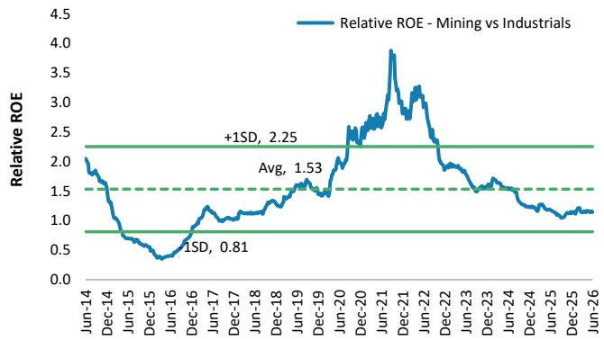

line chart

| Date    | Relative ROE |
|---------|--------------|
| Jun-14  | 2.0          |
| Dec-14  | 1.0          |
| Jun-15  | 0.5          |
| Dec-15  | 0.3          |
| Jun-16  | 0.4          |
| Dec-16  | 0.6          |
| Jun-17  | 0.8          |
| Dec-17  | 1.0          |
| Jun-18  | 1.2          |
| Dec-18  | 1.4          |
| Jun-19  | 1.6          |
| Dec-19  | 1.8          |
| Jun-20  | 2.0          |
| Dec-20  | 2.5          |
| Jun-21  | 3.8          |
| Dec-21  | 3.0          |
| Jun-22  | 2.5          |
| Dec-22  | 2.0          |
| Jun-23  | 1.8          |
| Dec-23  | 1.6          |
| Jun-24  | 1.4          |
| Dec-24  | 1.2          |
| Jun-25  | 1.0          |
| Dec-25  | 0.9          |
| Jun-26  | 0.8          |

Source: Refinitiv, MS. Note: Market cap-weighted consensus net income and equity value totals used for index construction.

# Australian Mining vs. Global Mining Sector

Exhibit 25: Relative EV/EBITDA: Australia vs. Global Mining  

line chart

| Date   | Relative EV/EBITDA |
|--------|---------------------|
| May-96 | 1.10                |
| May-97 | 1.15                |
| May-98 | 1.40                |
| May-99 | 1.55                |
| May-00 | 1.30                |
| May-01 | 1.10                |
| May-02 | 1.25                |
| May-03 | 1.15                |
| May-04 | 1.05                |
| May-05 | 1.10                |
| May-06 | 1.20                |
| May-07 | 1.25                |
| May-08 | 1.15                |
| May-09 | 1.05                |
| May-10 | 1.10                |
| May-11 | 1.05                |
| May-12 | 1.00                |
| May-13 | 0.95                |
| May-14 | 0.90                |
| May-15 | 0.85                |
| May-16 | 1.30                |
| May-17 | 1.25                |
| May-18 | 1.10                |
| May-19 | 1.05                |
| May-20 | 1.00                |
| May-21 | 1.05                |
| May-22 | 1.10                |
| May-23 | 1.05                |
| May-24 | 1.00                |
| May-25 | 0.85                |
| May-26 | 1.60                |

Source: Datastream, MS.

Exhibit 26: Relative P/E: Australia vs. Global Mining  
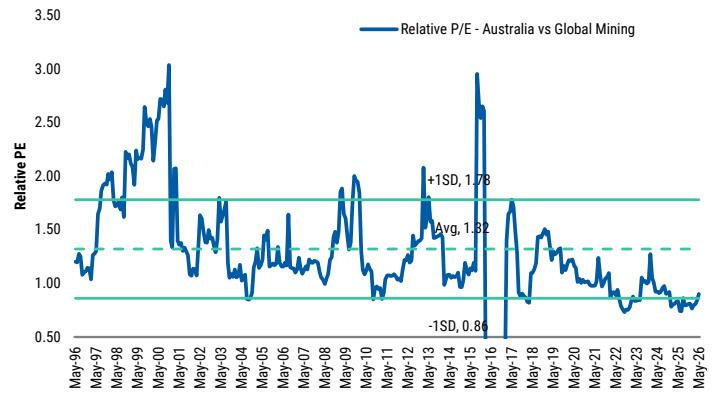

line chart

| Date    | Relative P/E - Australia vs Global Mining |
|---------|------------------------------------------|
| May-16  | -1SD, 0.86                              |
| May-14  | +1SD, 1.78                              |
| Avg     | 1.32                                     |

Source: Datastream, MS.

Exhibit 27: Relative P/B: Australia vs. Global Mining  
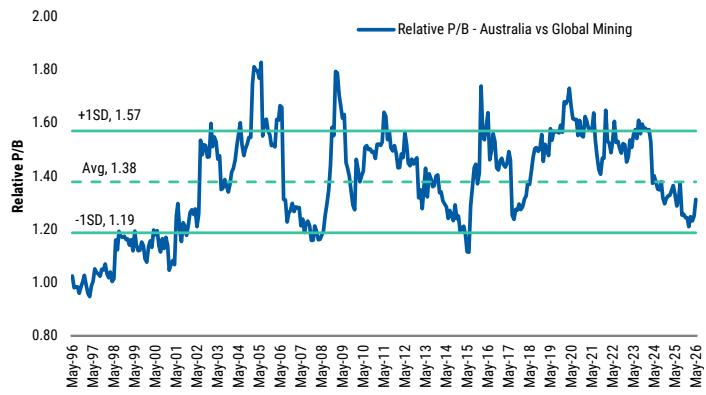

line chart

| Date   | Relative P/B |
|--------|--------------|
| May-96 | 1.00         |
| May-97 | 1.19         |
| May-98 | 1.20         |
| May-99 | 1.20         |
| May-00 | 1.20         |
| May-01 | 1.20         |
| May-02 | 1.20         |
| May-03 | 1.20         |
| May-04 | 1.20         |
| May-05 | 1.20         |
| May-06 | 1.20         |
| May-07 | 1.20         |
| May-08 | 1.20         |
| May-09 | 1.20         |
| May-10 | 1.20         |
| May-11 | 1.20         |
| May-12 | 1.20         |
| May-13 | 1.20         |
| May-14 | 1.20         |
| May-15 | 1.20         |
| May-16 | 1.20         |
| May-17 | 1.20         |
| May-18 | 1.20         |
| May-19 | 1.20         |
| May-20 | 1.20         |
| May-21 | 1.20         |
| May-22 | 1.20         |
| May-23 | 1.20         |
| May-24 | 1.20         |
| May-25 | 1.20         |
| May-26 | 1.20         |

Source: Datastream, MS.

Exhibit 28: Relative FCF Yield: Australia vs. Global Mining  

line chart

| Date    | Relative FCF Yield |
|---------|---------------------|
| May-98  | 1.50                |
| May-99  | 1.30                |
| May-00  | 1.50                |
| May-01  | 1.70                |
| May-02  | 1.50                |
| May-03  | 1.70                |
| May-04  | 2.00                |
| May-05  | 2.20                |
| May-06  | 2.30                |
| May-07  | 2.50                |
| May-08  | 2.80                |
| May-09  | 2.20                |
| May-10  | 2.50                |
| May-11  | 2.60                |
| May-12  | 2.50                |
| May-13  | 2.30                |
| May-14  | 2.10                |
| May-15  | 1.90                |
| May-16  | 1.70                |
| May-17  | 2.10                |
| May-18  | 1.80                |
| May-19  | 1.60                |
| May-20  | 1.50                |
| May-21  | 1.60                |
| May-22  | 1.30                |
| May-23  | 1.10                |
| May-24  | 1.20                |
| May-25  | 1.30                |
| May-26  | 1.40                |

Source: Datastream, MS.

Exhibit 29: Relative Dividend Yield: Australia vs. Global Mining  
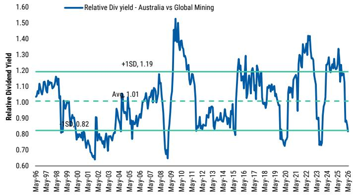

line chart

| Date   | Relative Dividend Yield |
|--------|--------------------------|
| May-96 | 1.10                     |
| May-97 | 1.15                     |
| May-98 | 1.05                     |
| May-99 | 0.82                     |
| May-00 | 0.90                     |
| May-01 | 0.75                     |
| May-02 | 0.85                     |
| May-03 | 0.95                     |
| May-04 | 1.05                     |
| May-05 | 1.10                     |
| May-06 | 1.15                     |
| May-07 | 1.20                     |
| May-08 | 1.55                     |
| May-09 | 1.45                     |
| May-10 | 1.30                     |
| May-11 | 1.20                     |
| May-12 | 1.15                     |
| May-13 | 1.10                     |
| May-14 | 1.05                     |
| May-15 | 1.25                     |
| May-16 | 1.30                     |
| May-17 | 1.25                     |
| May-18 | 1.20                     |
| May-19 | 1.15                     |
| May-20 | 0.75                     |
| May-21 | 1.20                     |
| May-22 | 1.40                     |
| May-23 | 1.35                     |
| May-24 | 1.25                     |
| May-25 | 1.30                     |
| May-26 | 0.85                     |

Source: Datastream, MS.

Exhibit 30: Relative ROE: Australia vs. Global Mining  
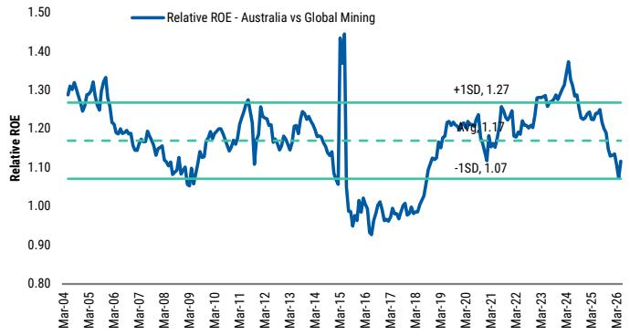

line chart

| Date   | Relative ROE - Australia vs Global Mining |
|--------|------------------------------------------|
| Mar-04 | 1.30                                     |
| Mar-05 | 1.35                                     |
| Mar-06 | 1.25                                     |
| Mar-07 | 1.20                                     |
| Mar-08 | 1.15                                     |
| Mar-09 | 1.10                                     |
| Mar-10 | 1.15                                     |
| Mar-11 | 1.25                                     |
| Mar-12 | 1.20                                     |
| Mar-13 | 1.25                                     |
| Mar-14 | 1.20                                     |
| Mar-15 | 1.45                                     |
| Mar-16 | 0.95                                     |
| Mar-17 | 0.90                                     |
| Mar-18 | 1.00                                     |
| Mar-19 | 1.15                                     |
| Mar-20 | 1.20                                     |
| Mar-21 | 1.17                                     |
| Mar-22 | 1.20                                     |
| Mar-23 | 1.25                                     |
| Mar-24 | 1.35                                     |
| Mar-25 | 1.25                                     |
| Mar-26 | 1.10                                     |

Source: Datastream, MS.

## Global Mining Sector vs. Global Market

Exhibit 31: World Datastream Mining index RoE relative to Datastream World Index  
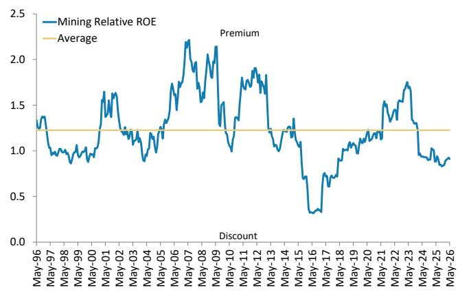

line chart

| Month    | Mining Relative ROE |
| -------- | ------------------- |
| May-96   | 1.3                 |
| May-97   | 1.0                 |
| May-98   | 0.9                 |
| May-99   | 0.9                 |
| May-00   | 1.0                 |
| May-01   | 1.6                 |
| May-02   | 1.2                 |
| May-03   | 1.1                 |
| May-04   | 1.2                 |
| May-05   | 1.3                 |
| May-06   | 1.7                 |
| May-07   | 2.2                 |
| May-08   | 2.1                 |
| May-09   | 1.5                 |
| May-10   | 1.3                 |
| May-11   | 1.8                 |
| May-12   | 1.9                 |
| May-13   | 1.7                 |
| May-14   | 1.3                 |
| May-15   | 1.2                 |
| May-16   | 0.3                 |
| May-17   | 0.7                 |
| May-18   | 0.9                 |
| May-19   | 1.0                 |
| May-20   | 1.1                 |
| May-21   | 1.2                 |
| May-22   | 1.5                 |
| May-23   | 1.7                 |
| May-24   | 1.3                 |
| May-25   | 0.9                 |
| May-26   | 0.8                 |

Source: Datastream, MS.

Exhibit 32: World Datastream Mining index P/B relative to Datastream World Index  

line chart

| Date   | Mining Relative PB |
|--------|--------------------|
| May-96 | 1.2                |
| May-97 | 1.1                |
| May-98 | 0.8                |
| May-99 | 0.7                |
| May-00 | 0.9                |
| May-01 | 1.0                |
| May-02 | 1.1                |
| May-03 | 1.2                |
| May-04 | 1.1                |
| May-05 | 1.2                |
| May-06 | 1.4                |
| May-07 | 1.6                |
| May-08 | 2.0                |
| May-09 | 1.2                |
| May-10 | 1.6                |
| May-11 | 1.4                |
| May-12 | 1.3                |
| May-13 | 1.2                |
| May-14 | 1.1                |
| May-15 | 0.4                |
| May-16 | 0.8                |
| May-17 | 0.9                |
| May-18 | 0.8                |
| May-19 | 0.9                |
| May-20 | 1.0                |
| May-21 | 1.1                |
| May-22 | 1.2                |
| May-23 | 1.0                |
| May-24 | 0.9                |
| May-25 | 0.7                |
| May-26 | 1.1                |

Source: Datastream, MS.

Exhibit 33: World Datastream Mining index 12m forward P/E relative to Datastream World Index  
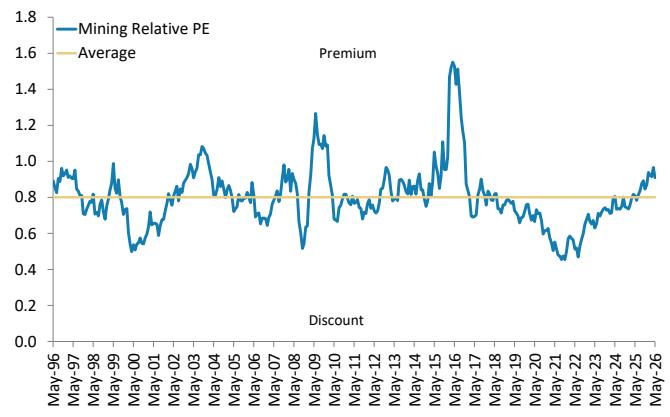

line chart

| Date   | Mining Relative PE |
|--------|--------------------|
| May-96 | 0.9                |
| May-97 | 0.8                |
| May-98 | 0.7                |
| May-99 | 0.9                |
| May-00 | 0.5                |
| May-01 | 0.7                |
| May-02 | 0.8                |
| May-03 | 1.0                |
| May-04 | 0.9                |
| May-05 | 0.8                |
| May-06 | 0.7                |
| May-07 | 0.8                |
| May-08 | 0.9                |
| May-09 | 1.3                |
| May-10 | 0.8                |
| May-11 | 0.7                |
| May-12 | 0.8                |
| May-13 | 0.9                |
| May-14 | 0.8                |
| May-15 | 1.0                |
| May-16 | 1.5                |
| May-17 | 0.7                |
| May-18 | 0.8                |
| May-19 | 0.7                |
| May-20 | 0.6                |
| May-21 | 0.5                |
| May-22 | 0.4                |
| May-23 | 0.6                |
| May-24 | 0.7                |
| May-25 | 0.8                |
| May-26 | 0.9                |

Source: Datastream, MS.

Exhibit 34: World Datastream Mining index 12m forward Div Yield relative to Datastream World Index  

line chart

| Date   | Mining Relative 12m forward Div. Yield |
|--------|----------------------------------------|
| May-99 | 10.0                                   |
| May-00 | 14.0                                   |
| May-01 | 12.0                                   |
| May-02 | 8.0                                    |
| May-03 | 6.0                                    |
| May-04 | 4.0                                    |
| May-05 | 3.0                                    |
| May-06 | 2.5                                    |
| May-07 | 2.0                                    |
| May-08 | 3.5                                    |
| May-09 | 2.5                                    |
| May-10 | 2.0                                    |
| May-11 | 1.5                                    |
| May-12 | 2.0                                    |
| May-13 | 2.5                                    |
| May-14 | 3.0                                    |
| May-15 | 4.0                                    |
| May-16 | 1.5                                    |
| May-17 | 3.0                                    |
| May-18 | 3.5                                    |
| May-19 | 4.0                                    |
| May-20 | 4.5                                    |
| May-21 | 6.0                                    |
| May-22 | 5.0                                    |
| May-23 | 3.5                                    |
| May-24 | 3.0                                    |
| May-25 | 2.5                                    |
| May-26 | 2.0                                    |

Source: Datastream, MS.

Exhibit 35: World Datastream Mining index share price relative to Datastream World Index  

line chart

| Date   | Mining Relative Indexed Share Price |
|--------|-------------------------------------|
| May-96 | ~100                                |
| May-97 | ~80                                 |
| May-98 | ~60                                 |
| May-99 | ~50                                 |
| May-00 | ~60                                 |
| May-01 | ~70                                 |
| May-02 | ~80                                 |
| May-03 | ~90                                 |
| May-04 | ~100                                |
| May-05 | ~120                                |
| May-06 | ~150                                |
| May-07 | ~200                                |
| May-08 | ~320                                |
| May-09 | ~180                                |
| May-10 | ~280                                |
| May-11 | ~300                                |
| May-12 | ~250                                |
| May-13 | ~200                                |
| May-14 | ~150                                |
| May-15 | ~100                                |
| May-16 | ~60                                 |
| May-17 | ~100                                |
| May-18 | ~120                                |
| May-19 | ~130                                |
| May-20 | ~140                                |
| May-21 | ~150                                |
| May-22 | ~160                                |
| May-23 | ~170                                |
| May-24 | ~150                                |
| May-25 | ~130                                |
| May-26 | ~120                                |

Source: Datastream, MS.

## Global Miners – Valuation Tables

Exhibit 36: Base case valuation multiples and key metrics: Diversified miners

<table><tr><td rowspan="2">Companies</td><td rowspan="2">Rating</td><td rowspan="2">FX</td><td rowspan="2">Price Target</td><td rowspan="2">Share Price</td><td rowspan="2">Market cap (US$mn)</td><td rowspan="2">EV** (USD) 2026CY</td><td colspan="3">P/E</td><td colspan="3">EV/EBITDA</td><td colspan="3">FCF Yield</td><td colspan="3">Dividend Yield</td><td colspan="3">P/B</td><td colspan="3">ROE</td><td colspan="3">ND/(ND+E+M)</td><td colspan="3">Net Debt/EBITDA</td></tr><tr><td>2026CY</td><td>2027CY</td><td>2028CY</td><td>2026CY</td><td>2027CY</td><td>2028CY</td><td>2026CY</td><td>2027CY</td><td>2028CY</td><td>2026CY</td><td>2027CY</td><td>2028CY</td><td>2026CY</td><td>2027CY</td><td>2028CY</td><td>2026e</td><td>2027e</td><td>2028e</td><td>2026e</td><td>2027e</td><td>2028e</td><td>2026e</td><td>2027e</td><td>2028e</td></tr><tr><td>African Rainbow Minerals^</td><td>EW</td><td>ZAC</td><td>25,000</td><td>20,953</td><td>2,848</td><td>2,649</td><td>9.6x</td><td>9.4x</td><td>NA</td><td>5.1x</td><td>5.0x</td><td>NA</td><td>3.4%</td><td>1.9%</td><td>NA</td><td>5.8%</td><td>5.9%</td><td>NA</td><td>0.8x</td><td>0.8x</td><td>NA</td><td>7.4%</td><td>7.3%</td><td>NA</td><td>Cash</td><td>Cash</td><td>NA</td><td>NA</td><td>NA</td><td>NA</td></tr><tr><td>Anglo American Plc</td><td>++</td><td>GBp</td><td>++</td><td>4,225</td><td>61,080</td><td>84,631</td><td>NM</td><td>29.9x</td><td>30.9x</td><td>10.9x</td><td>9.2x</td><td>9.2x</td><td>0.1%</td><td>2.3%</td><td>3.4%</td><td>1.0%</td><td>1.3%</td><td>1.3%</td><td>NM</td><td>NM</td><td>NM</td><td>8.1%</td><td>10.9%</td><td>10.0%</td><td>0.3x</td><td>0.3x</td><td>0.3x</td><td>1.3x</td><td>1.1x</td><td>1.1x</td></tr><tr><td>BHP Group Ltd**</td><td>OW</td><td>AUD</td><td>67.50</td><td>64.9</td><td>237,274</td><td>269,075</td><td>17.5x</td><td>17.2x</td><td>NA</td><td>8.3x</td><td>8.6x</td><td>NA</td><td>4.2%</td><td>2.6%</td><td>NA</td><td>3.4%</td><td>3.5%</td><td>NA</td><td>4.3x</td><td>3.9x</td><td>NA</td><td>26.9%</td><td>24.7%</td><td>NA</td><td>0.1x</td><td>0.1x</td><td>NA</td><td>0.3x</td><td>0.4x</td><td>NA</td></tr><tr><td>Exaro Resources Limited</td><td>OW</td><td>ZAC</td><td>26,000</td><td>22,558</td><td>4,787</td><td>5,566</td><td>5.4x</td><td>5.8x</td><td>5.1x</td><td>4.6x</td><td>4.5x</td><td>3.9x</td><td>6.8%</td><td>7.2%</td><td>8.8%</td><td>7.4%</td><td>5.9%</td><td>6.6%</td><td>1.3x</td><td>1.1x</td><td>1.0x</td><td>17.6%</td><td>14.7%</td><td>15.4%</td><td>0.0x</td><td>Cash</td><td>Cash</td><td>0.1x</td><td>Cash</td><td>Cash</td></tr><tr><td>Glencore</td><td>OW</td><td>GBp</td><td>610</td><td>615</td><td>95,045</td><td>146,290</td><td>14.2x</td><td>15.7x</td><td>17.3x</td><td>7.7x</td><td>8.1x</td><td>8.6x</td><td>6.6%</td><td>7.6%</td><td>7.2%</td><td>4.4%</td><td>5.6%</td><td>5.1%</td><td>5.4x</td><td>5.6x</td><td>6.8x</td><td>20.3%</td><td>16.0%</td><td>14.3%</td><td>0.5x</td><td>0.5x</td><td>0.5x</td><td>1.7x</td><td>1.8x</td><td>2.0x</td></tr><tr><td>MMG Ltd.</td><td>OW</td><td>HKD</td><td>11.20</td><td>9.78</td><td>15,292</td><td>22,158</td><td>11.2x</td><td>11.7x</td><td>12.1x</td><td>4.3x</td><td>4.2x</td><td>4.1x</td><td>3.2%</td><td>9.9%</td><td>9.5%</td><td>0.0%</td><td>0.0%</td><td>0.0%</td><td>2.9x</td><td>2.3x</td><td>1.9x</td><td>34.4%</td><td>24.5%</td><td>19.0%</td><td>0.3x</td><td>0.0x</td><td>Cash</td><td>0.5x</td><td>0.0x</td><td>Cash</td></tr><tr><td>Rio Tinto Limited**</td><td>EW</td><td>AUD</td><td>172</td><td>194</td><td>227,063</td><td>271,393</td><td>15.9x</td><td>16.4x</td><td>18.0x</td><td>9.1x</td><td>8.9x</td><td>9.0x</td><td>3.6%</td><td>4.2%</td><td>4.6%</td><td>3.6%</td><td>3.7%</td><td>3.4%</td><td>3.3x</td><td>3.1x</td><td>2.9x</td><td>23.1%</td><td>20.2%</td><td>17.2%</td><td>0.1x</td><td>0.1x</td><td>0.1x</td><td>0.4x</td><td>0.3x</td><td>0.2x</td></tr><tr><td>Rio Tinto Plc*</td><td>EW</td><td>GBp</td><td>6,920</td><td>8,308</td><td>181,758</td><td>226,089</td><td>12.8x</td><td>13.1x</td><td>14.4x</td><td>7.6x</td><td>7.4x</td><td>7.5x</td><td>4.5%</td><td>5.3%</td><td>5.8%</td><td>4.7%</td><td>4.6%</td><td>4.2%</td><td>2.7x</td><td>2.5x</td><td>2.3x</td><td>23.1%</td><td>20.2%</td><td>17.2%</td><td>0.1x</td><td>0.1x</td><td>0.1x</td><td>0.4x</td><td>0.3x</td><td>0.2x</td></tr><tr><td>South32*</td><td>OW</td><td>AUD</td><td>4.85</td><td>4.91</td><td>15,892</td><td>15,731</td><td>13.4x</td><td>12.0x</td><td>NA</td><td>8.4x</td><td>7.6x</td><td>NA</td><td>-2.7%</td><td>-4.6%</td><td>NA</td><td>2.5%</td><td>3.3%</td><td>NA</td><td>1.6x</td><td>1.4x</td><td>NA</td><td>12.6%</td><td>13.0%</td><td>NA</td><td>Cash</td><td>0.0x</td><td>NA</td><td>NA</td><td>NA</td><td>NA</td></tr><tr><td>Teck Resources Limited</td><td>++</td><td>USD</td><td>++</td><td>70.6</td><td>34,567</td><td>37,063</td><td>24.2x</td><td>22.5x</td><td>38.1x</td><td>9.3x</td><td>8.2x</td><td>11.0x</td><td>1.5%</td><td>4.6%</td><td>4.6%</td><td>0.5%</td><td>0.5%</td><td>0.5%</td><td>1.8x</td><td>1.7x</td><td>1.6x</td><td>7.9%</td><td>7.9%</td><td>4.4%</td><td>0.1x</td><td>0.1x</td><td>0.0x</td><td>0.7x</td><td>0.4x</td><td>0.3x</td></tr><tr><td>Vale S.A.</td><td>OW</td><td>USD</td><td>19.50</td><td>16.8</td><td>71,801</td><td>84,880</td><td>7.3x</td><td>7.1x</td><td>7.3x</td><td>5.3x</td><td>4.9x</td><td>4.4x</td><td>2.9%</td><td>8.7%</td><td>7.8%</td><td>6.9%</td><td>5.8%</td><td>6.5%</td><td>1.7x</td><td>1.5x</td><td>1.4x</td><td>28.3%</td><td>23.7%</td><td>20.8%</td><td>0.3x</td><td>0.2x</td><td>0.2x</td><td>0.8x</td><td>0.7x</td><td>0.7x</td></tr><tr><td>Vedanta Lg***</td><td>NC</td><td>INR</td><td>NA</td><td>334</td><td>13,673</td><td>20,627</td><td>4.6x</td><td>4.1x</td><td>5.3x</td><td>2.8x</td><td>2.5x</td><td>2.3x</td><td>29.0%</td><td>32.2%</td><td>30.6%</td><td>9.7%</td><td>8.6%</td><td>6.3%</td><td>2.3x</td><td>1.8x</td><td>2.4x</td><td>49.9%</td><td>47.9%</td><td>NA</td><td>NA</td><td>NA</td><td>NA</td><td>0.6x</td><td>0.3x</td><td>0.0x</td></tr><tr><td>Weighted Average</td><td></td><td></td><td></td><td></td><td>961,080</td><td>1,185,953</td><td>14.8x</td><td>15.9x</td><td>17.5x</td><td>8.1x</td><td>8.0x</td><td>8.0x</td><td>4.1%</td><td>4.6%</td><td>6.1%</td><td>4.0%</td><td>4.0%</td><td>3.9%</td><td>3.4x</td><td>3.2x</td><td>3.0x</td><td>22.9%</td><td>20.3%</td><td>18.2%</td><td>0.2x</td><td>0.2x</td><td>0.2x</td><td>0.6x</td><td>0.6x</td><td>0.6x</td></tr></table>

Source: MS estimates (e), Thomson Reuters for non-covered companies. (\* Not covered by MS, \*\* Market cap based on total no. of group shares, \*\*\* Provisions and pensions included in EV, ^ Fiscal year ending in June, ^^ Fiscal year ending in March, ^^^ Fiscal year ending in September, ^^^^ Fiscal year ending in August, ^^^^ Fiscal year ending in July). Weighted Average for P/E, FCF Yield, Dividend Yield, P/B, ROE based on Market Cap. Weighted Average for EV/EBITDA, Net Debt/EBITDA based on EV. ++ Stock Rating, Price Target, or Estimates for this company have been removed from consideration in this report because, under applicable law and/or MS policy, MS may be precluded from issuing such information with respect to this company at this time. Share prices as of 02 June 2026. NA = Not applicable, NM = Not meaningful, NC = Non covered.

Exhibit 37: Base case valuation multiples and key metrics: Iron ore producers

<table><tr><td rowspan="2">Companies</td><td rowspan="2">Rating</td><td rowspan="2">FX</td><td rowspan="2">Price Target</td><td rowspan="2">Share Price</td><td rowspan="2">Market cap (US$m)</td><td rowspan="2">EV** (USD) 2026CY</td><td colspan="3">P/E</td><td colspan="3">P/EV/EBITDA</td><td colspan="3">FCF Yield</td><td colspan="3">Dividend Yield</td><td colspan="3">P/B</td><td colspan="3">ROE</td><td colspan="3">ND/(ND+E+M)</td><td colspan="3">Net Debt/EBITDA</td></tr><tr><td>2026CY</td><td>2027CY</td><td>2028CY</td><td>2026CY</td><td>2027CY</td><td>2028CY</td><td>2026CY</td><td>2027CY</td><td>2028CY</td><td>2026CY</td><td>2027CY</td><td>2028CY</td><td>2026CY</td><td>2027CY</td><td>2028CY</td><td>2026e</td><td>2027e</td><td>2028e</td><td>2026e</td><td>2027e</td><td>2028e</td><td>2026e</td><td>2027e</td><td>2028e</td></tr><tr><td>Anglo American Plc</td><td>++</td><td>GBp</td><td>++</td><td>4,225</td><td>61,080</td><td>84,631</td><td>NM</td><td>29.9x</td><td>30.9x</td><td>10.9x</td><td>9.2x</td><td>9.2x</td><td>0.1%</td><td>2.3%</td><td>3.4%</td><td>1.0%</td><td>1.3%</td><td>1.3%</td><td>NM</td><td>NM</td><td>NM</td><td>8.1%</td><td>10.9%</td><td>10.0%</td><td>0.3x</td><td>0.3x</td><td>0.3x</td><td>1.3x</td><td>1.1x</td><td>1.1x</td></tr><tr><td>Rio Tinto Plc</td><td>EW</td><td>GBp</td><td>6,920</td><td>8,308</td><td>181,759</td><td>226,089</td><td>12.8x</td><td>13.1x</td><td>14.4x</td><td>7.6x</td><td>7.4x</td><td>7.5x</td><td>4.5%</td><td>5.3%</td><td>5.8%</td><td>4.7%</td><td>4.6%</td><td>4.2%</td><td>2.7x</td><td>2.5x</td><td>2.3x</td><td>23.1%</td><td>20.2%</td><td>17.2%</td><td>0.1x</td><td>0.1x</td><td>0.1x</td><td>0.4x</td><td>0.3x</td><td>0.2x</td></tr><tr><td>BHP Group Ltd^</td><td>OW</td><td>AUD</td><td>67.50</td><td>64.9</td><td>237,274</td><td>269,075</td><td>17.5x</td><td>17.2x</td><td>NA</td><td>8.3x</td><td>8.6x</td><td>NA</td><td>4.2%</td><td>2.6%</td><td>NA</td><td>3.4%</td><td>3.5%</td><td>NA</td><td>4.3x</td><td>3.9x</td><td>NA</td><td>26.9%</td><td>24.7%</td><td>NA</td><td>0.1x</td><td>0.1x</td><td>NA</td><td>0.3x</td><td>0.4x</td><td>NA</td></tr><tr><td>Vale</td><td>OW</td><td>USD</td><td>19.50</td><td>16.8</td><td>71,801</td><td>84,880</td><td>7.3x</td><td>7.1x</td><td>7.3x</td><td>5.3x</td><td>4.9x</td><td>4.4x</td><td>2.9%</td><td>6.7%</td><td>7.8%</td><td>6.9%</td><td>5.8%</td><td>6.5%</td><td>1.7x</td><td>1.5x</td><td>1.4x</td><td>28.3%</td><td>23.7%</td><td>20.3%</td><td>0.3x</td><td>0.2x</td><td>0.2x</td><td>0.8x</td><td>0.7x</td><td>0.7x</td></tr><tr><td>CAP</td><td>UW</td><td>CLP</td><td>6,870</td><td>6,490</td><td>1,093</td><td>3,376</td><td>13.0x</td><td>8.1x</td><td>5.4x</td><td>4.4x</td><td>3.9x</td><td>3.4x</td><td>24.9%</td><td>10.4%</td><td>15.6%</td><td>1.1%</td><td>4.2%</td><td>7.3%</td><td>0.6x</td><td>0.6x</td><td>0.5x</td><td>4.9%</td><td>7.5%</td><td>10.6%</td><td>0.3x</td><td>0.3x</td><td>0.2x</td><td>1.6x</td><td>1.4x</td><td>1.1x</td></tr><tr><td>CSN</td><td>++</td><td>BRL</td><td>++</td><td>4.40</td><td>1,889</td><td>11,699</td><td>NM</td><td>NM</td><td>8.0x</td><td>6.1x</td><td>6.1x</td><td>4.6x</td><td>-36.0%</td><td>-66.8%</td><td>-36.5%</td><td>0.0%</td><td>0.0%</td><td>0.4%</td><td>2.1x</td><td>3.1x</td><td>2.6x</td><td>NM</td><td>NM</td><td>38.9%</td><td>0.8x</td><td>0.9x</td><td>0.9x</td><td>3.7x</td><td>4.2x</td><td>3.4x</td></tr><tr><td>CSN Mineracao</td><td>UW</td><td>BRL</td><td>4.40</td><td>4.78</td><td>5,187</td><td>8,887</td><td>17.2x</td><td>30.1x</td><td>8.4x</td><td>7.7x</td><td>7.9x</td><td>5.4x</td><td>-6.2%</td><td>-17.1%</td><td>-9.6%</td><td>4.9%</td><td>2.1%</td><td>6.9%</td><td>NM</td><td>NM</td><td>NM</td><td>22.6%</td><td>NA</td><td>NA</td><td>1.0x</td><td>1.0x</td><td>0.9x</td><td>0.9x</td><td>1.8x</td><td>1.8x</td></tr><tr><td>Cleveland-Cliffs Inc</td><td>OW</td><td>USD</td><td>12.00</td><td>14.8</td><td>8,404</td><td>16,054</td><td>NM</td><td>NM</td><td>NM</td><td>13.7x</td><td>8.2x</td><td>9.0x</td><td>-5.2%</td><td>-2.7%</td><td>4.6%</td><td>0.0%</td><td>0.0%</td><td>0.0%</td><td>1.5x</td><td>1.5x</td><td>1.5x</td><td>NM</td><td>3.3%</td><td>1.2%</td><td>0.6x</td><td>0.6x</td><td>0.5x</td><td>6.6x</td><td>3.8x</td><td>4.0x</td></tr><tr><td>Ferrexpo Plc*</td><td>NC</td><td>GBp</td><td>NA</td><td>28.6</td><td>230</td><td>174</td><td>NM</td><td>3.8x</td><td>1.5x</td><td>4.1x</td><td>1.1x</td><td>0.4x</td><td>-8.9%</td><td>-12.4%</td><td>24.3%</td><td>0.0%</td><td>3.9%</td><td>68.3%</td><td>NM</td><td>NM</td><td>NM</td><td>NM</td><td>7.4%</td><td>24.0%</td><td>NA</td><td>NA</td><td>NA</td><td>Cash</td><td>0.1x</td><td>0.2x</td></tr><tr><td>Fortescue Metals Group*</td><td>UW</td><td>AUD</td><td>18.85</td><td>21.9</td><td>48,565</td><td>49,562</td><td>14.4x</td><td>15.4x</td><td>NA</td><td>6.2x</td><td>6.5x</td><td>NA</td><td>5.0%</td><td>4.2%</td><td>NA</td><td>4.7%</td><td>4.3%</td><td>NA</td><td>2.2x</td><td>2.1x</td><td>NA</td><td>16.4%</td><td>14.4%</td><td>NA</td><td>0.0x</td><td>0.0x</td><td>NA</td><td>0.1x</td><td>0.1x</td><td>NA</td></tr><tr><td>Kumba Iron Ore</td><td>EW</td><td>ZAc</td><td>29,000</td><td>31,931</td><td>6,354</td><td>6,804</td><td>11.0x</td><td>10.3x</td><td>7.7x</td><td>4.4x</td><td>4.1x</td><td>3.3x</td><td>1.9%</td><td>3.5%</td><td>6.2%</td><td>3.7%</td><td>5.0%</td><td>7.9%</td><td>1.8x</td><td>1.7x</td><td>1.5x</td><td>16.9%</td><td>17.8%</td><td>21.6%</td><td>Cash</td><td>Cash</td><td>Cash</td><td>Cash</td><td>Cash</td><td></td></tr><tr><td>NMDC Lien*</td><td>NC</td><td>INR</td><td>NA</td><td>95.3</td><td>8,821</td><td>7,598</td><td>10.5x</td><td>10.0x</td><td>10.1x</td><td>7.0x</td><td>6.6x</td><td>6.7x</td><td>2.1%</td><td>1.0%</td><td>NA</td><td>3.6%</td><td>3.8%</td><td>4.1%</td><td>NA</td><td>NA</td><td>NA</td><td>22.2%</td><td>NA</td><td>NA</td><td>NA</td><td>NA</td><td>NA</td><td>Cash</td><td>Cash</td><td></td></tr><tr><td>Weighted Average</td><td></td><td></td><td></td><td></td><td>632,458</td><td>768,830</td><td>14.2x</td><td>15.9x</td><td>15.8x</td><td>7.9x</td><td>7.7x</td><td>7.1x</td><td>3.4%</td><td>3.6%</td><td>5.3%</td><td>4.1%</td><td>3.9%</td><td>4.3%</td><td>3.1x</td><td>2.9x</td><td>2.0x</td><td>23.0%</td><td>20.7%</td><td>16.4%</td><td>0.2x</td><td>0.2x</td><td>0.2x</td><td>0.7x</td><td>0.6x</td><td>0.7x</td></tr></table>

Source: MS estimates (e), Thomson Reuters for non-covered companies (\*not covered by MS, \*\* Market cap based on total no. of group shares, \*\*\* provisions and pensions included in EV, ^ Fiscal year ending in June, ^^ Fiscal year ending in March, ^^^ Fiscal year ending in September, ^^^^ Fiscal year ending in August, ^^^^^ Fiscal year ending in July). Weighted Average for P/E, FCF Yield, Dividend Yield, P/B, ROE based on Market Cap. Weighted Average for EV/EBITDA, Net Debt/EBITDA based on EV. ++ Stock Rating, Price Target, or Estimates for this company have been removed from consideration in this report because, under applicable law and/or MS policy, MS may be precluded from issuing such information with respect to this company at this time. Share prices as of 02 June 2026. NA = Not applicable, NM = Not meaningful, NC = Non covered.

MS is acting as financial advisor to Corporacion Nacional del Cobre de Chile ("Codelco") in connection with its partnership agreement with Sociedad Quimica y Minera de Chile S.A ("SQM"), as announced on May 31, 2024, for the development of mining activities aimed at the production of lithium, potassium and other products in the Salar de Atacama. The agreement remains subject to a number of conditions precedent. This report and the information provided herein is not intended to (i) provide voting advice, (ii) serve as an endorsement of the proposed transaction, or (iii) result in the procurement, withholding or revocation of a proxy or any other action by a security holder. Codelco has agreed to pay fees to MS for its financial services. Please refer to the notes at the end of this report.

Exhibit 38: Base case valuation multiples and key metrics: Coal Producers

<table><tr><td rowspan="2">Companies</td><td rowspan="2">Rating</td><td rowspan="2">FX</td><td rowspan="2">Price Target</td><td rowspan="2">Share Price</td><td rowspan="2">Market cap (US$mn)</td><td rowspan="2">EV** (USD) 2026CY</td><td colspan="3">P/E</td><td colspan="3">EV/EBITDA</td><td colspan="3">FCF Yield</td><td colspan="3">Dividend Yield</td><td colspan="3">P/B</td><td colspan="3">ROE</td><td colspan="3">ND/(ND+E+M)</td><td colspan="3">Net Debt/EBITDA</td></tr><tr><td>2026CY</td><td>2027CY</td><td>2029CY</td><td>2026CY</td><td>2027CY</td><td>2028CY</td><td>2026CY</td><td>2027CY</td><td>2028CY</td><td>2026CY</td><td>2027CY</td><td>2028CY</td><td>2026CY</td><td>2027CY</td><td>2028CY</td><td>2026e</td><td>2027e</td><td>2028e</td><td>2026e</td><td>2027e</td><td>2028e</td><td>2026e</td><td>2027e</td><td>2028e</td></tr><tr><td colspan="31">THERMAL COAL</td></tr><tr><td>Alamti Resources Indonesia</td><td>UW</td><td>IDR</td><td>1,466</td><td>2,280</td><td>3,930</td><td>1,035</td><td>9.9x</td><td>11.8x</td><td>NA</td><td>1.5x</td><td>3.0x</td><td>NA</td><td>7.3%</td><td>-21.1%</td><td>NA</td><td>3.9%</td><td>3.3%</td><td>NA</td><td>0.7x</td><td>0.7x</td><td>NM</td><td>7.5%</td><td>6.0%</td><td>NA</td><td>Cash</td><td>Cash</td><td>NA</td><td>Cash</td><td>Cash</td><td>NA</td></tr><tr><td>Bukit Asam Tbk PT*</td><td>NC</td><td>IDR</td><td>NA</td><td>2,760</td><td>1,780</td><td>1,900</td><td>8.2x</td><td>6.9x</td><td>8.9x</td><td>5.0x</td><td>4.3x</td><td>6.6x</td><td>12.5%</td><td>15.2%</td><td>10.1%</td><td>8.8%</td><td>10.7%</td><td>8.2%</td><td>1.3x</td><td>1.2x</td><td>1.2x</td><td>18.9%</td><td>18.7%</td><td>13.3%</td><td>NA</td><td>NA</td><td>NA</td><td>0.1x</td><td>Cash</td><td>NA</td></tr><tr><td>China Coal Energy Co.</td><td>EW</td><td>CNY</td><td>20.90</td><td>17.1</td><td>30,071</td><td>30,567</td><td>11.4x</td><td>12.3x</td><td>12.7x</td><td>4.8x</td><td>4.8x</td><td>4.7x</td><td>5.9%</td><td>6.7%</td><td>5.1%</td><td>2.6%</td><td>2.4%</td><td>2.4%</td><td>1.3x</td><td>1.2x</td><td>1.1x</td><td>12.4%</td><td>10.6%</td><td>9.5%</td><td>Cash</td><td>Cash</td><td>Cash</td><td>Cash</td><td>Cash</td><td>Cash</td></tr><tr><td>China Shenhua Energy Company Limited</td><td>OW</td><td>HKD</td><td>53.60</td><td>46.8</td><td>139,305</td><td>122,095</td><td>13.6x</td><td>12.8x</td><td>12.0x</td><td>7.4x</td><td>7.0x</td><td>6.5x</td><td>5.5%</td><td>5.9%</td><td>6.4%</td><td>5.6%</td><td>6.0%</td><td>6.4%</td><td>1.8x</td><td>1.7x</td><td>1.7x</td><td>13.5%</td><td>13.8%</td><td>14.3%</td><td>Cash</td><td>Cash</td><td>Cash</td><td>Cash</td><td>Cash</td><td>Cash</td></tr><tr><td>Coal India Limited**</td><td>EW</td><td>INR</td><td>420</td><td>472</td><td>30,545</td><td>24,223</td><td>9.1x</td><td>8.7x</td><td>8.0x</td><td>5.2x</td><td>4.6x</td><td>3.8x</td><td>6.2%</td><td>7.7%</td><td>8.8%</td><td>5.7%</td><td>5.9%</td><td>6.2%</td><td>2.2x</td><td>2.0x</td><td>1.8x</td><td>27.7%</td><td>25.8%</td><td>24.8%</td><td>Cash</td><td>Cash</td><td>Cash</td><td>NA</td><td>NA</td><td>NA</td></tr><tr><td>Consol Energy Inc.*</td><td>NC</td><td>USD</td><td>NA</td><td>94.6</td><td>4,767</td><td>5,346</td><td>31.6x</td><td>13.2x</td><td>10.4x</td><td>6.5x</td><td>5.2x</td><td>4.7x</td><td>2.2%</td><td>5.4%</td><td>4.9%</td><td>0.4%</td><td>0.4%</td><td>0.4%</td><td>1.3x</td><td>1.2x</td><td>1.0x</td><td>6.3%</td><td>12.4%</td><td>13.3%</td><td>NA</td><td>NA</td><td>NA</td><td>NA</td><td>Cash</td><td>NA</td></tr><tr><td>Exaro Resources Limited</td><td>OW</td><td>ZAc</td><td>26,000</td><td>22,558</td><td>4,787</td><td>5,566</td><td>5.4x</td><td>5.8x</td><td>5.1x</td><td>4.6x</td><td>4.5x</td><td>3.9x</td><td>6.8%</td><td>7.2%</td><td>8.8%</td><td>7.4%</td><td>5.9%</td><td>6.6%</td><td>1.3x</td><td>1.1x</td><td>1.0x</td><td>17.6%</td><td>14.7%</td><td>15.4%</td><td>0.0x</td><td>Cash</td><td>Cash</td><td>0.1x</td><td>Cash</td><td>Cash</td></tr><tr><td>Harum Energy*</td><td>NC</td><td>IDR</td><td>NA</td><td>805</td><td>610</td><td>2,120</td><td>3.9x</td><td>3.5x</td><td>NA</td><td>3.4x</td><td>2.7x</td><td>NA</td><td>-22.4%</td><td>-7.8%</td><td>NA</td><td>0.0%</td><td>NA</td><td>NA</td><td>0.5x</td><td>0.5x</td><td>NM</td><td>11.9%</td><td>12.5%</td><td>NA</td><td>NA</td><td>NA</td><td>NA</td><td>0.3x</td><td>Cash</td><td>NA</td></tr><tr><td>Indo Tambangraya Megah*</td><td>NC</td><td>IDR</td><td>NA</td><td>22,000</td><td>1,394</td><td>544</td><td>5.2x</td><td>5.4x</td><td>5.3x</td><td>1.4x</td><td>1.5x</td><td>1.5x</td><td>-23.1%</td><td>17.9%</td><td>17.3%</td><td>9.4%</td><td>10.7%</td><td>12.5%</td><td>0.7x</td><td>0.7x</td><td>0.6x</td><td>13.8%</td><td>12.5%</td><td>12.3%</td><td>NA</td><td>NA</td><td>NA</td><td>Cash</td><td>Cash</td><td>NA</td></tr><tr><td>Peabody Energy Corporation*</td><td>NC</td><td>USD</td><td>NA</td><td>29.6</td><td>3,608</td><td>3,841</td><td>39.1x</td><td>8.5x</td><td>7.5x</td><td>6.4x</td><td>4.2x</td><td>4.2x</td><td>1.8%</td><td>7.6%</td><td>4.9%</td><td>1.5%</td><td>2.0%</td><td>2.5%</td><td>1.0x</td><td>1.0x</td><td>0.9x</td><td>3.8%</td><td>9.0%</td><td>12.6%</td><td>NA</td><td>NA</td><td>NA</td><td>Cash</td><td>Cash</td><td>NA</td></tr><tr><td>Shaanxi Coal Industry</td><td>OW</td><td>CNY</td><td>30.00</td><td>27.1</td><td>38,882</td><td>42,659</td><td>13.3x</td><td>13.0x</td><td>12.9x</td><td>5.5x</td><td>5.1x</td><td>4.7x</td><td>7.7%</td><td>10.6%</td><td>10.7%</td><td>4.3%</td><td>4.4%</td><td>4.4%</td><td>2.5x</td><td>2.3x</td><td>2.1x</td><td>20.4%</td><td>19.1%</td><td>17.9%</td><td>Cash</td><td>Cash</td><td>Cash</td><td>Cash</td><td>Cash</td><td>Cash</td></tr><tr><td>Whitehaven Coal Limited*</td><td>OW</td><td>AUD</td><td>9.55</td><td>9.25</td><td>5,531</td><td>6,313</td><td>13.7x</td><td>10.2x</td><td>NA</td><td>5.2x</td><td>4.6x</td><td>NA</td><td>8.7%</td><td>8.6%</td><td>NA</td><td>4.4%</td><td>5.3%</td><td>NA</td><td>1.3x</td><td>1.2x</td><td>NA</td><td>9.6%</td><td>12.3%</td><td>NA</td><td>0.1x</td><td>0.1x</td><td>NA</td><td>0.7x</td><td>0.6x</td><td>NA</td></tr><tr><td>Yancoal Australia Ltd</td><td>OW</td><td>HKD</td><td>52.80</td><td>39.0</td><td>6,571</td><td>4,299</td><td>8.4x</td><td>7.2x</td><td>9.3x</td><td>2.6x</td><td>2.1x</td><td>2.1x</td><td>-11.9%</td><td>14.4%</td><td>12.6%</td><td>6.6%</td><td>7.6%</td><td>5.9%</td><td>1.0x</td><td>0.9x</td><td>0.9x</td><td>12.1%</td><td>13.3%</td><td>9.8%</td><td>Cash</td><td>Cash</td><td>Cash</td><td>Cash</td><td>Cash</td><td>Cash</td></tr><tr><td>Yangyuan Coal Industry Group Co Ltd*</td><td>NC</td><td>CNY</td><td>NA</td><td>9.42</td><td>5,023</td><td>7,980</td><td>14.4x</td><td>13.0x</td><td>12.4x</td><td>NA</td><td>NA</td><td>NA</td><td>14.5%</td><td>15.9%</td><td>19.5%</td><td>NA</td><td>NA</td><td>NA</td><td>0.9x</td><td>0.9x</td><td>0.8x</td><td>5.6%</td><td>5.9%</td><td>6.0%</td><td>NA</td><td>NA</td><td>NA</td><td>NA</td><td>NA</td><td>NA</td></tr><tr><td>Thungela Resources Ltd</td><td>UW</td><td>ZAc</td><td>10,000</td><td>14,919</td><td>1,237</td><td>855</td><td>4.8x</td><td>12.8x</td><td>23.2x</td><td>1.7x</td><td>2.8x</td><td>3.4x</td><td>14.0%</td><td>9.1%</td><td>1.9%</td><td>9.5%</td><td>6.0%</td><td>0.7%</td><td>1.1x</td><td>1.1x</td><td>1.1x</td><td>25.3%</td><td>8.0%</td><td>4.4%</td><td>Cash</td><td>Cash</td><td>Cash</td><td>Cash</td><td>Cash</td><td>Cash</td></tr><tr><td>Yankuang Energy Group Co. Limited</td><td>OW</td><td>HKD</td><td>21.90</td><td>15.72</td><td>30,785</td><td>49,694</td><td>9.6x</td><td>9.6x</td><td>9.4x</td><td>6.9x</td><td>6.6x</td><td>6.3x</td><td>7.0%</td><td>7.3%</td><td>7.8%</td><td>5.2%</td><td>5.2%</td><td>5.3%</td><td>1.3x</td><td>1.2x</td><td>1.1x</td><td>14.0%</td><td>13.1%</td><td>12.6%</td><td>0.1x</td><td>0.1x</td><td>0.0x</td><td>0.6x</td><td>0.4x</td><td>0.1x</td></tr><tr><td>Weighted Average</td><td></td><td></td><td></td><td></td><td>308,827</td><td>309,038</td><td>12.7x</td><td>11.6x</td><td>11.3x</td><td>6.3x</td><td>5.9x</td><td>5.6x</td><td>9.4%</td><td>7.1%</td><td>7.6%</td><td>5.1%</td><td>5.2%</td><td>5.5%</td><td>1.7x</td><td>1.6x</td><td>1.6x</td><td>15.3%</td><td>15.0%</td><td>14.9%</td><td>0.1x</td><td>0.1x</td><td>0.0x</td><td>0.5x</td><td>0.4x</td><td>0.1x</td></tr><tr><td colspan="31">CKINGOAL</td></tr><tr><td>(Persero) Pt Aneka Tambang Tbk*</td><td>NC</td><td>IDR</td><td>NA</td><td>2,960</td><td>3,982</td><td>3,973</td><td>6.4x</td><td>5.8x</td><td>4.7x</td><td>4.5x</td><td>4.2x</td><td>3.5x</td><td>8.2%</td><td>12.8%</td><td>14.5%</td><td>7.5%</td><td>9.0%</td><td>17.4%</td><td>1.8x</td><td>1.7x</td><td>1.5x</td><td>26.2%</td><td>25.4%</td><td>33.2%</td><td>NA</td><td>NA</td><td>NA</td><td>Cash</td><td>Cash</td><td>NA</td></tr><tr><td>Banpu Public Company Limited*</td><td>NC</td><td>THB</td><td>NA</td><td>5.75</td><td>1,765</td><td>7,634</td><td>10.8x</td><td>8.7x</td><td>10.3x</td><td>6.3x</td><td>6.1x</td><td>6.1x</td><td>32.3%</td><td>28.5%</td><td>20.9%</td><td>6.3%</td><td>6.7%</td><td>7.1%</td><td>0.5x</td><td>0.5x</td><td>0.5x</td><td>4.6%</td><td>5.1%</td><td>4.6%</td><td>NA</td><td>NA</td><td>NA</td><td>2.8x</td><td>2.5x</td><td>NA</td></tr><tr><td>Suncoke Energy*</td><td>NC</td><td>USD</td><td>NA</td><td>9.60</td><td>815</td><td>1,657</td><td>NM</td><td>NM</td><td>NM</td><td>6.9x</td><td>7.7x</td><td>7.8x</td><td>NA</td><td>NA</td><td>NA</td><td>NA</td><td>NA</td><td>NM</td><td>NM</td><td>NM</td><td>NM</td><td>NA</td><td>NA</td><td>NA</td><td>NA</td><td>NA</td><td>NA</td><td>NA</td><td>NA</td><td>NA</td></tr><tr><td>Warrior Met Coal*</td><td>NC</td><td>USD</td><td>NA</td><td>110.3</td><td>5,823</td><td>5,880</td><td>17.8x</td><td>13.4x</td><td>11.8x</td><td>9.3x</td><td>7.7x</td><td>7.1x</td><td>7.9%</td><td>10.0%</td><td>NA</td><td>0.3%</td><td>0.3%</td><td>0.3%</td><td>2.4x</td><td>2.3x</td><td>2.3x</td><td>17.4%</td><td>15.6%</td><td>17.9%</td><td>NA</td><td>NA</td><td>NA</td><td>Cash</td><td>Cash</td><td>NA</td></tr><tr><td>Weighted Average</td><td></td><td></td><td></td><td></td><td>12,384</td><td>19,145</td><td>12.8x</td><td>10.1x</td><td>9.1x</td><td>6.9x</td><td>6.4x</td><td>6.0x</td><td>11.8%</td><td>13.5%</td><td>16.5%</td><td>3.7%</td><td>4.3%</td><td>7.2%</td><td>1.9x</td><td>1.8x</td><td>1.7x</td><td>18.5%</td><td>17.4%</td><td>21.1%</td><td>NA</td><td>NA</td><td>NA</td><td>2.8x</td><td>2.5x</td><td>NA</td></tr></table>

Source: MS estimates (e), Thomson Reuters for non-covered companies (\*not covered by MS, \*\* Market cap based on total no. of group shares, \*\*\* Provisions and pensions included in EV, ^ Fiscal year ending in June, ^^ Fiscal year ending in March, ^^^ Fiscal year ending in September, ^^^^ Fiscal year ending in August, ^^^^ Fiscal year ending in July). Weighted Average for P/E, FCF Yield, Dividend Yield, P/B, ROE based on Market Cap. Weighted Average for EV/EBITDA, Net Debt/EBITDA based on EV. Share prices as of 02 June 2026. NA = Not applicable, NM = Not meaningful, NC = Non covered.

## Global Miners – Valuation Tables (cont'd)

Exhibit 39: Base case valuation multiples and key metrics: Aluminium producers

<table><tr><td rowspan="2">Companies</td><td rowspan="2">Rating</td><td rowspan="2">FX</td><td rowspan="2">Price Target</td><td rowspan="2">Share Price</td><td rowspan="2">Market cap (US$mn)</td><td rowspan="2">EV** (USD) 2026CY</td><td colspan="3">P/E</td><td colspan="3">EV/EBITDA</td><td colspan="3">FCF Yield</td><td colspan="3">Dividend Yield</td><td colspan="3">P/B</td><td colspan="3">ROE</td><td colspan="3">ND/(ND+E+M)</td><td colspan="3">Net Debt/EBITDA</td></tr><tr><td>2026CY</td><td>2027CY</td><td>2028CY</td><td>2026CY</td><td>2027CY</td><td>2028CY</td><td>2026CY</td><td>2027CY</td><td>2028CY</td><td>2026CY</td><td>2027CY</td><td>2028CY</td><td>2026CY</td><td>2027CY</td><td>2028CY</td><td>2026e</td><td>2027e</td><td>2028e</td><td>2026e</td><td>2027e</td><td>2028e</td><td>2026e</td><td>2027e</td><td>2028e</td></tr><tr><td>Aloca Inc.</td><td>OW</td><td>USD</td><td>80.00</td><td>83.8</td><td>22,306</td><td>21,553</td><td>9.9x</td><td>9.7x</td><td>15.7x</td><td>5.8x</td><td>5.3x</td><td>7.0x</td><td>6.2%</td><td>8.5%</td><td>5.8%</td><td>0.5%</td><td>0.5%</td><td>0.5%</td><td>2.5x</td><td>2.0x</td><td>1.8x</td><td>36.2%</td><td>25.9%</td><td>12.8%</td><td>Cash</td><td>Cash</td><td>Cash</td><td>Cash</td><td>Cash</td><td>Cash</td></tr><tr><td>Aluminium Bahrain*</td><td>NC</td><td>BHD</td><td>NA</td><td>0.91</td><td>3,414</td><td>3,676</td><td>3.1x</td><td>2.5x</td><td>3.6x</td><td>2.3x</td><td>2.1x</td><td>2.4x</td><td>30.9%</td><td>22.2%</td><td>20.7%</td><td>11.4%</td><td>13.7%</td><td>9.8%</td><td>0.2x</td><td>0.2x</td><td>0.1x</td><td>17.3%</td><td>20.4%</td><td>12.2%</td><td>NA</td><td>NA</td><td>NA</td><td>Cash</td><td>Cash</td><td>NA</td></tr><tr><td>Aluminum Corporation Of China</td><td>OW</td><td>HKD</td><td>18.10</td><td>11.6</td><td>29,297</td><td>37,958</td><td>6.9x</td><td>8.0x</td><td>7.2x</td><td>3.8x</td><td>4.1x</td><td>3.6x</td><td>17.4%</td><td>17.8%</td><td>19.4%</td><td>5.3%</td><td>4.6%</td><td>5.1%</td><td>1.9x</td><td>1.6x</td><td>1.4x</td><td>33.2%</td><td>23.6%</td><td>22.7%</td><td>0.1x</td><td>Cash</td><td>Cash</td><td>0.1x</td><td>Cash</td><td>Cash</td></tr><tr><td>Century Aluminum Company*</td><td>NC</td><td>USD</td><td>NA</td><td>68.8</td><td>6,806</td><td>8,370</td><td>7.0x</td><td>6.6x</td><td>5.4x</td><td>6.6x</td><td>6.6x</td><td>6.9x</td><td>10.8%</td><td>9.2%</td><td>NA</td><td>NA</td><td>NA</td><td>NA</td><td>NM</td><td>NM</td><td>NM</td><td>30.6%</td><td>0.0%</td><td>NA</td><td>NA</td><td>NA</td><td>NA</td><td>Cash</td><td>Cash</td><td>NA</td></tr><tr><td>China Hongqiao Group*</td><td>OW</td><td>HKD</td><td>52.90</td><td>28.8</td><td>34,893</td><td>39,061</td><td>6.1x</td><td>5.7x</td><td>5.4x</td><td>4.0x</td><td>3.6x</td><td>3.3x</td><td>9.7%</td><td>17.6%</td><td>17.9%</td><td>10.5%</td><td>11.2%</td><td>11.8%</td><td>1.6x</td><td>1.5x</td><td>1.3x</td><td>29.3%</td><td>28.2%</td><td>26.9%</td><td>Cash</td><td>Cash</td><td>Cash</td><td>Cash</td><td>Cash</td><td>Cash</td></tr><tr><td>Constellium NV*</td><td>NC</td><td>USD</td><td>NA</td><td>36.1</td><td>4,911</td><td>7,360</td><td>10.6x</td><td>13.6x</td><td>12.0x</td><td>7.7x</td><td>7.9x</td><td>7.3x</td><td>5.9%</td><td>7.6%</td><td>NA</td><td>0.0%</td><td>0.0%</td><td>NA</td><td>4.0x</td><td>3.1x</td><td>NM</td><td>40.5%</td><td>24.8%</td><td>NA</td><td>NA</td><td>NA</td><td>NA</td><td>1.8x</td><td>1.5x</td><td>NA</td></tr><tr><td>Hindalco Industries Limited^</td><td>OW</td><td>INR</td><td>1,325</td><td>1,146</td><td>26,714</td><td>32,101</td><td>10.4x</td><td>9.0x</td><td>8.5x</td><td>7.5x</td><td>6.6x</td><td>5.5x</td><td>-4.0%</td><td>5.3%</td><td>8.8%</td><td>0.4%</td><td>0.4%</td><td>0.4%</td><td>1.5x</td><td>1.4x</td><td>1.2x</td><td>18.2%</td><td>18.3%</td><td>16.6%</td><td>0.4x</td><td>0.3x</td><td>0.2x</td><td>2.2x</td><td>1.7x</td><td>1.1x</td></tr><tr><td>Kaiser Aluminum Corp^</td><td>NC</td><td>USD</td><td>NA</td><td>190.3</td><td>3,110</td><td>4,335</td><td>18.5x</td><td>17.5x</td><td>14.3x</td><td>10.6x</td><td>10.4x</td><td>9.2x</td><td>6.3%</td><td>7.3%</td><td>NA</td><td>1.7%</td><td>1.6%</td><td>1.6%</td><td>3.4x</td><td>3.0x</td><td>2.3x</td><td>21.0%</td><td>19.4%</td><td>18.6%</td><td>NA</td><td>NA</td><td>NA</td><td>2.4x</td><td>2.2x</td><td>NA</td></tr><tr><td>Metlen Energy &amp; Metals SA</td><td>OW</td><td>EUR</td><td>55.00</td><td>41.6</td><td>6,931</td><td>10,948</td><td>10.8x</td><td>7.9x</td><td>6.3x</td><td>8.8x</td><td>6.9x</td><td>5.4x</td><td>1.2%</td><td>7.9%</td><td>12.1%</td><td>3.3%</td><td>4.4%</td><td>5.5%</td><td>1.7x</td><td>1.5x</td><td>1.3x</td><td>18.3%</td><td>21.9%</td><td>23.6%</td><td>0.5x</td><td>0.4x</td><td>0.4x</td><td>3.2x</td><td>2.3x</td><td>1.7x</td></tr><tr><td>National Aluminium Co Ltd*</td><td>NC</td><td>INR</td><td>NA</td><td>434</td><td>8,399</td><td>7,561</td><td>13.4x</td><td>12.1x</td><td>11.2x</td><td>8.4x</td><td>7.6x</td><td>7.2x</td><td>4.0%</td><td>4.5%</td><td>NA</td><td>2.7%</td><td>2.9%</td><td>3.0%</td><td>3.3x</td><td>2.9x</td><td>2.3x</td><td>26.1%</td><td>25.5%</td><td>22.3%</td><td>NA</td><td>NA</td><td>NA</td><td>Cash</td><td>Cash</td><td>Cash</td></tr><tr><td>Nippon Light Metals Holding Company^</td><td>EW</td><td>JPY</td><td>2,500</td><td>3,270</td><td>1,258</td><td>2,061</td><td>11.7x</td><td>NA</td><td>NA</td><td>6.8x</td><td>NA</td><td>NA</td><td>7.7%</td><td>NA</td><td>NA</td><td>3.0%</td><td>NA</td><td>NA</td><td>0.8x</td><td>NA</td><td>NA</td><td>6.9%</td><td>NA</td><td>NA</td><td>0.3x</td><td>NA</td><td>NA</td><td>2.1x</td><td>NA</td><td>NA</td></tr><tr><td>Norsk Hydro ASA</td><td>EW</td><td>NOK</td><td>101.00</td><td>119.5</td><td>25,278</td><td>26,161</td><td>12.0x</td><td>11.6x</td><td>12.9x</td><td>6.1x</td><td>5.9x</td><td>6.4x</td><td>5.0%</td><td>6.5%</td><td>6.4%</td><td>6.3%</td><td>6.7%</td><td>6.3%</td><td>1.8x</td><td>1.7x</td><td>1.7x</td><td>19.6%</td><td>18.1%</td><td>15.4%</td><td>0.0x</td><td>0.0x</td><td>0.0x</td><td>0.1x</td><td>0.0x</td><td>0.1x</td></tr><tr><td>Qatar Aluminum Manufacturing Company (QAMCO)*</td><td>NC</td><td>QAR</td><td>NA</td><td>1.75</td><td>2,685</td><td>2,269</td><td>17.5x</td><td>14.0x</td><td>14.7x</td><td>NM</td><td>NM</td><td>NA</td><td>0.6%</td><td>0.6%</td><td>0.6%</td><td>4.5%</td><td>5.2%</td><td>NA</td><td>NM</td><td>NM</td><td>NM</td><td>3.8%</td><td>8.4%</td><td>9.0%</td><td>NA</td><td>NA</td><td>NA</td><td>NM</td><td>NM</td><td>NA</td></tr><tr><td>Shandong Nanshan Aluminum Corp</td><td>OW</td><td>CNY</td><td>7.30</td><td>5.27</td><td>9,313</td><td>7,275</td><td>11.1x</td><td>10.0x</td><td>9.3x</td><td>5.1x</td><td>4.6x</td><td>4.2x</td><td>8.8%</td><td>11.8%</td><td>13.0%</td><td>8.5%</td><td>9.5%</td><td>10.2%</td><td>1.3x</td><td>1.3x</td><td>1.2x</td><td>11.5%</td><td>12.7%</td><td>13.5%</td><td>Cash</td><td>Cash</td><td>Cash</td><td>Cash</td><td>Cash</td><td>Cash</td></tr><tr><td>South32^</td><td>OW</td><td>AUD</td><td>4.85</td><td>4.91</td><td>15,892</td><td>15,731</td><td>13.4x</td><td>12.0x</td><td>NA</td><td>8.4x</td><td>7.6x</td><td>NA</td><td>-2.7%</td><td>-4.6%</td><td>NA</td><td>2.5%</td><td>3.3%</td><td>NA</td><td>1.6x</td><td>1.4x</td><td>NA</td><td>12.6%</td><td>13.0%</td><td>NA</td><td>Cash</td><td>0.0x</td><td>NA</td><td>NA</td><td>NA</td><td>NA</td></tr><tr><td>UACJ Corp^^^</td><td>EW</td><td>JPY</td><td>2,700</td><td>3,375</td><td>3,990</td><td>6,530</td><td>15.6x</td><td>NA</td><td>NA</td><td>8.9x</td><td>NA</td><td>NA</td><td>-0.1%</td><td>NA</td><td>NA</td><td>1.9%</td><td>NA</td><td>NA</td><td>1.7x</td><td>NA</td><td>NA</td><td>11.7%</td><td>NA</td><td>NA</td><td>0.4x</td><td>NA</td><td>NA</td><td>2.6x</td><td>NA</td><td>NA</td></tr><tr><td>Yunnan Aluminum Co^*</td><td>NC</td><td>CNY</td><td>NA</td><td>30.3</td><td>15,534</td><td>15,091</td><td>8.0x</td><td>7.5x</td><td>7.1x</td><td>6.1x</td><td>5.7x</td><td>5.6x</td><td>16.5%</td><td>16.7%</td><td>19.0%</td><td>4.0%</td><td>3.9%</td><td>4.8%</td><td>2.5x</td><td>2.0x</td><td>1.6x</td><td>29.0%</td><td>25.0%</td><td>22.7%</td><td>NA</td><td>NA</td><td>NA</td><td>Cash</td><td>Cash</td><td>NA</td></tr><tr><td>Weighted Average</td><td></td><td></td><td></td><td></td><td>220,732</td><td>240,761</td><td>9.7x</td><td>9.1x</td><td>9.2x</td><td>6.0x</td><td>6.6x</td><td>5.2x</td><td>7.2%</td><td>10.3%</td><td>13.0%</td><td>4.8%</td><td>5.1%</td><td>8.5%</td><td>1.9x</td><td>1.7x</td><td>1.5x</td><td>24.9%</td><td>21.8%</td><td>19.6%</td><td>0.2x</td><td>0.2x</td><td>0.2x</td><td>1.2x</td><td>1.3x</td><td>0.8x</td></tr></table>

Source: MS estimates (e), Thomson Reuters for non-covered companies (\*not covered by MS, \*\*Market cap based on total no. of group shares, \*\*\*Provisions and pensions included in EV, ^Fiscal year ending in June, ^^Fiscal year ending in March, ^^^Fiscal year ending in September, ^^^^Fiscal year ending in August, ^^^^^Fiscal year ending in July). Weighted Average for P/E, FCF Yield, Dividend Yield, P/B, ROE based on Market Cap. Weighted Average for EV/EBITDA, Net Debt/EBITDA based on EV. Share prices as of 02 June 2026. NA = Not applicable, NM = Not meaningful, NC = Non covered.

Exhibit 40: Base case valuation multiples and key metrics: Zinc producers

<table><tr><td rowspan="2">Companies</td><td rowspan="2">Rating</td><td rowspan="2">FX</td><td rowspan="2">Price Target</td><td rowspan="2">Share Price</td><td rowspan="2">Market cap (US$mn)</td><td rowspan="2">EV** (USD) 2026CY</td><td colspan="3">P/E</td><td colspan="3">EV/EBITDA</td><td colspan="3">FCF Yield</td><td colspan="3">Dividend Yield</td><td colspan="3">P/B</td><td colspan="3">ROE</td><td colspan="3">ND/(ND+E/M)</td><td colspan="3">Net Debt/EBITDA</td></tr><tr><td>2026CY</td><td>2027CY</td><td>2028CY</td><td>2026CY</td><td>2027CY</td><td>2028CY</td><td>2026CY</td><td>2027CY</td><td>2028CY</td><td>2026CY</td><td>2027CY</td><td>2028CY</td><td>2026CY</td><td>2027CY</td><td>2028CY</td><td>2026CY</td><td>2027CY</td><td>2028CY</td><td>2026CY</td><td>2037CY</td><td>2038CY</td><td>2026CY</td><td>2027CY</td><td>2028CY</td></tr><tr><td>Hindustan Zinc***</td><td>NC</td><td>INR</td><td>NA</td><td>625</td><td>27,806</td><td>27,511</td><td>16.0x</td><td>14.6x</td><td>13.8x</td><td>10.1x</td><td>9.3x</td><td>8.8x</td><td>4.5%</td><td>5.2%</td><td>6.1%</td><td>3.4%</td><td>3.4%</td><td>3.6%</td><td>9.7x</td><td>7.5x</td><td>5.9x</td><td>72.0%</td><td>59.5%</td><td>53.2%</td><td>NA</td><td>NA</td><td>NA</td><td>0.0x</td><td>Cash</td><td>-0.3x</td></tr><tr><td>Baldon ABX</td><td>EW</td><td>SEK</td><td>693</td><td>598</td><td>18,238</td><td>21,830</td><td>14.5x</td><td>12.9x</td><td>13.2x</td><td>7.6x</td><td>6.8x</td><td>6.5x</td><td>2.3%</td><td>4.7%</td><td>5.6%</td><td>2.2%</td><td>3.8%</td><td>3.7%</td><td>2.0x</td><td>1.8x</td><td>1.7x</td><td>15.3%</td><td>15.4%</td><td>13.6%</td><td>0.1x</td><td>0.1x</td><td>0.1x</td><td>0.5x</td><td>0.3x</td><td>0.2x</td></tr><tr><td>Korea Zinc Inc*</td><td>NC</td><td>KRW</td><td>NA</td><td>1,322,000</td><td>18,191</td><td>21,871</td><td>21.3x</td><td>21.4x</td><td>20.9x</td><td>14.5x</td><td>14.2x</td><td>13.4x</td><td>0.3%</td><td>-7.4%</td><td>-2.3%</td><td>1.7%</td><td>1.9%</td><td>1.9%</td><td>2.4x</td><td>2.3x</td><td>2.1x</td><td>12.2%</td><td>11.0%</td><td>10.5%</td><td>NA</td><td>NA</td><td>NA</td><td>1.4x</td><td>1.7x</td><td>1.5x</td></tr><tr><td>MMG Limited</td><td>OW</td><td>HKD</td><td>11.20</td><td>9.78</td><td>15,292</td><td>22,158</td><td>11.2x</td><td>11.7x</td><td>12.1x</td><td>4.3x</td><td>4.2x</td><td>4.1x</td><td>3.2%</td><td>9.9%</td><td>9.5%</td><td>0.0%</td><td>0.0%</td><td>0.0%</td><td>2.9x</td><td>2.8x</td><td>1.9x</td><td>34.4%</td><td>24.5%</td><td>19.0%</td><td>0.3x</td><td>0.0x</td><td>Cash</td><td>0.5x</td><td>0.0x</td><td>Cash</td></tr><tr><td>Wang Resources</td><td>EW</td><td>USD</td><td>11.50</td><td>15.66</td><td>2,074</td><td>3,191</td><td>4.7x</td><td>6.0x</td><td>10.1x</td><td>2.3x</td><td>2.6x</td><td>3.1x</td><td>4.5%</td><td>10.1%</td><td>9.7%</td><td>1.7%</td><td>4.5%</td><td>2.1x</td><td>1.4x</td><td>1.0x</td><td>1.5x</td><td>43.0%</td><td>20.3%</td><td>12.2%</td><td>0.3x</td><td>0.2x</td><td>0.1x</td><td>0.6x</td><td>0.5x</td><td>0.1x</td></tr><tr><td>Weighted Average</td><td></td><td></td><td></td><td></td><td>81,601</td><td>90,091</td><td>15.7x</td><td>15.0x</td><td>14.8x</td><td>8.9x</td><td>8.8x</td><td>8.2x</td><td>2.8%</td><td>3.3%</td><td>4.8%</td><td>2.5%</td><td>3.5%</td><td>3.1%</td><td>4.9x</td><td>3.9x</td><td>3.2x</td><td>38.2%</td><td>31.3%</td><td>27.4%</td><td>0.2x</td><td>0.1x</td><td>0.1x</td><td>0.8x</td><td>0.7x</td><td>0.6x</td></tr></table>

Source: MS estimates (e), Thomson Reuters for non-covered companies (\*not covered by MS, \*\*Market cap based on total no. of group shares, \*\*\*Provisions and pensions included in EV, ^Fiscal year ending in June, ^^Fiscal year ending in March, ^^^Fiscal year ending in September, ^^^^Fiscal year ending in August, ^^^^Fiscal year ending in July). Weighted Average for P/E, FCF Yield, Dividend Yield, P/B, ROE based on Market Cap. Weighted Average for EV/EBITDA, Net Debt/EBITDA based on EV. Share prices as of 02 June 2026. NA = Not applicable, NM = Not meaningful, NC = Non covered.

Exhibit 41: Base case valuation multiples and key metrics: Nickel producers

<table><tr><td rowspan="2">Companies</td><td rowspan="2">Rating</td><td rowspan="2">FX</td><td rowspan="2">Price Target</td><td rowspan="2">Share Price</td><td rowspan="2">Market cap (US$mn)</td><td rowspan="2">EV***(USD) 2026CY</td><td colspan="3">P/E</td><td colspan="3">EV/EBITDA</td><td colspan="3">FCF Yield</td><td colspan="3">Dividend Yield</td><td colspan="3">P/B</td><td colspan="3">ROE</td><td colspan="3">ND/(ND+E+M)</td><td colspan="3">Net Debt/EBITDA</td></tr><tr><td>2026CY</td><td>2027CY</td><td>2028CY</td><td>2026CY</td><td>2027CY</td><td>2028CY</td><td>2026CY</td><td>2027CY</td><td>2028CY</td><td>2026CY</td><td>2027CY</td><td>2028CY</td><td>2026CY</td><td>2027CY</td><td>2028CY</td><td>2026e</td><td>2027e</td><td>2028e</td><td>2026e</td><td>2027e</td><td>2028e</td><td>2024e</td><td>2027e</td><td>2028e</td></tr><tr><td>Eramet*</td><td>NC</td><td>EUR</td><td>NA</td><td>54.8</td><td>1,831</td><td>6,403</td><td>NM</td><td>NM</td><td>16.6x</td><td>12.9x</td><td>8.6x</td><td>8.3x</td><td>-1.9%</td><td>1.2%</td><td>6.0%</td><td>0.0%</td><td>0.0%</td><td>1.8%</td><td>2.0x</td><td>1.9x</td><td>1.7x</td><td>NM</td><td>19.4%</td><td>10.0%</td><td>NA</td><td>NA</td><td>NA</td><td>4.2x</td><td>2.7x</td><td>NA</td></tr><tr><td>EGO Ltd*</td><td>LW</td><td>AUD</td><td>6.85</td><td>9.57</td><td>5,206</td><td>4,684</td><td>21.0x</td><td>13.8x</td><td>NA</td><td>15.1x</td><td>12.2x</td><td>NA</td><td>6.8%</td><td>9.5%</td><td>NA</td><td>0.0%</td><td>0.8%</td><td>NA</td><td>2.9x</td><td>2.6x</td><td>NA</td><td>15.7%</td><td>21.5%</td><td>NA</td><td>Cash</td><td>Cash</td><td>NA</td><td>NA</td><td>NA</td><td>NA</td></tr><tr><td>Nickel Asia Corp*</td><td>NC</td><td>PHP</td><td>NA</td><td>5.10</td><td>1,151</td><td>1,259</td><td>10.8x</td><td>10.5x</td><td>9.4x</td><td>4.9x</td><td>4.7x</td><td>3.5x</td><td>NA</td><td>NA</td><td>NA</td><td>4.2%</td><td>4.3%</td><td>4.3%</td><td>1.5x</td><td>1.3x</td><td>1.1x</td><td>15.1%</td><td>13.7%</td><td>12.8%</td><td>NA</td><td>NA</td><td>NA</td><td>0.0x</td><td>Cash</td><td>NA</td></tr><tr><td>PI Aneka Tambang Tbk*</td><td>NC</td><td>IDR</td><td>NA</td><td>2,960</td><td>3,982</td><td>3,973</td><td>6.4x</td><td>5.8x</td><td>4.7x</td><td>4.5x</td><td>4.2x</td><td>3.5x</td><td>8.2%</td><td>12.8%</td><td>14.5%</td><td>7.5%</td><td>9.0%</td><td>17.4%</td><td>1.8x</td><td>1.7x</td><td>1.5x</td><td>26.2%</td><td>25.4%</td><td>33.2%</td><td>NA</td><td>NA</td><td>NA</td><td>Cash</td><td>Cash</td><td>NA</td></tr><tr><td>Phil Indonesia Y*</td><td>NC</td><td>IDR</td><td>NA</td><td>4,730</td><td>2,796</td><td>2,610</td><td>10.5x</td><td>6.9x</td><td>4.4x</td><td>5.0x</td><td>3.4x</td><td>2.8x</td><td>-7.3%</td><td>9.5%</td><td>5.3%</td><td>0.7%</td><td>1.1%</td><td>5.3%</td><td>1.0x</td><td>0.9x</td><td>0.7x</td><td>7.9%</td><td>12.5%</td><td>16.0%</td><td>NA</td><td>NA</td><td>NA</td><td>Cash</td><td>0.1x</td><td>NA</td></tr><tr><td>Weighted Average</td><td></td><td></td><td></td><td></td><td>14,965</td><td>18,931</td><td>13.4x</td><td>9.6x</td><td>7.4x</td><td>10.1x</td><td>7.8x</td><td>6.5x</td><td>3.2%</td><td>9.4%</td><td>9.7%</td><td>4.6%</td><td>3.7%</td><td>9.5%</td><td>2.0x</td><td>1.8x</td><td>1.2x</td><td>17.2%</td><td>20.0%</td><td>21.7%</td><td>NA</td><td>NA</td><td>NA</td><td>3.5x</td><td>1.9x</td><td>NA</td></tr></table>

Source: MS estimates, Thomson Reuters for non-covered companies (\*not covered by MS, \*\* Market cap based on total no. of group shares, \*\*\* Provisions and pensions included in EV, ^ Fiscal year ending in June, ^^ Fiscal year ending in March, ^^^ Fiscal year ending in September, ^^^^ Fiscal year ending in August, ^^^^ Fiscal year ending in July). Weighted Average for P/E, FCF Yield, Dividend Yield, P/B, ROE based on Market Cap. Weighted Average for EV/EBITDA, Net Debt/EBITDA based on EV. Share prices as of 02 June 2026. NA = Not applicable, NM = Not meaningful, NC = Non covered.

Exhibit 42: Base case valuation multiples and key metrics: Copper producers

<table><tr><td rowspan="2">Companies</td><td rowspan="2">Rating</td><td rowspan="2">FX</td><td rowspan="2">Price Target</td><td rowspan="2">Share Price</td><td rowspan="2">Market cap (US$mn)</td><td rowspan="2">EV** (USD) 2026CY</td><td colspan="3">P/E</td><td colspan="3">EV/EBITDA</td><td colspan="3">FCF Yield</td><td colspan="3">Dividend Yield</td><td colspan="3">P/B</td><td colspan="3">ROE</td><td colspan="3">ND/(ND+E/M)</td><td colspan="3">Net Debt/EBITDA</td></tr><tr><td>2026CY</td><td>2027CY</td><td>2028CY</td><td>2026CY</td><td>2027CY</td><td>2028CY</td><td>2026CY</td><td>2027CY</td><td>2028CY</td><td>2026CY</td><td>2027CY</td><td>2028CY</td><td>2026CY</td><td>2027CY</td><td>2028CY</td><td>2026YE</td><td>2027E</td><td>2028E</td><td>2026E</td><td>2027E</td><td>2028E</td><td>2026E</td><td>2027E</td><td>2028E</td></tr><tr><td>Antofagasta Plc</td><td>UW</td><td>GBp</td><td>3,150</td><td>4,408</td><td>58,488</td><td>81,294</td><td>35.1x</td><td>29.7x</td><td>28.0x</td><td>13.3x</td><td>11.9x</td><td>11.2x</td><td>0.5%</td><td>1.7%</td><td>3.9%</td><td>1.4%</td><td>1.7%</td><td>1.8%</td><td>5.2x</td><td>4.7x</td><td>4.3x</td><td>16.1%</td><td>17.4%</td><td>16.9%</td><td>0.2x</td><td>0.2x</td><td>0.1x</td><td>0.5x</td><td>0.5x</td><td>0.3x</td></tr><tr><td>Aurubis AG***</td><td>EW</td><td>EUR</td><td>181</td><td>218</td><td>11,117</td><td>12,505</td><td>23.2x</td><td>20.1x</td><td>19.8x</td><td>7.4x</td><td>11.3x</td><td>10.9x</td><td>1.5%</td><td>4.2%</td><td>5.9%</td><td>1.3%</td><td>1.5%</td><td>1.5%</td><td>1.6x</td><td>1.5x</td><td>1.4x</td><td>7.8%</td><td>7.8%</td><td>7.5%</td><td>0.0x</td><td>Cash</td><td>Cash</td><td>NA</td><td>NA</td><td>NA</td></tr><tr><td>Boliden AB</td><td>EW</td><td>SEK</td><td>493</td><td>598</td><td>18,238</td><td>21,360</td><td>14.5x</td><td>12.9x</td><td>13.2x</td><td>7.6x</td><td>6.6x</td><td>6.5x</td><td>2.3%</td><td>4.7%</td><td>5.6%</td><td>2.2%</td><td>3.8%</td><td>3.7%</td><td>2.0x</td><td>1.8x</td><td>1.7x</td><td>15.3%</td><td>15.4%</td><td>13.6%</td><td>0.1x</td><td>0.1x</td><td>0.1x</td><td>0.5x</td><td>0.3x</td><td>0.2x</td></tr><tr><td>First Quantum Minerals Ltd.</td><td>OW</td><td>CAD</td><td>42.20</td><td>46.1</td><td>27,807</td><td>38,902</td><td>NM</td><td>19.3x</td><td>14.3x</td><td>19.7x</td><td>9.1x</td><td>6.8x</td><td>-2.9%</td><td>5.6%</td><td>4.4%</td><td>0.2%</td><td>0.8%</td><td>0.7%</td><td>2.5x</td><td>2.8x</td><td>2.4x</td><td>NM</td><td>12.9%</td><td>15.6%</td><td>0.3x</td><td>0.3x</td><td>0.2x</td><td>3.1x</td><td>1.1x</td><td>0.7x</td></tr><tr><td>Freeport-Mcroman</td><td>EW</td><td>USD</td><td>66.00</td><td>71.7</td><td>103,564</td><td>121,730</td><td>24.1x</td><td>17.3x</td><td>16.2x</td><td>11.9x</td><td>8.1x</td><td>7.2x</td><td>4.0%</td><td>6.6%</td><td>7.6%</td><td>0.8%</td><td>0.8%</td><td>0.8%</td><td>4.6x</td><td>3.8x</td><td>3.1x</td><td>20.9%</td><td>26.9%</td><td>23.2%</td><td>0.1x</td><td>Cash</td><td>Cash</td><td>0.3x</td><td>Cash</td><td>Cash</td></tr><tr><td>Grupo Mexico</td><td>EW</td><td>MXN</td><td>200</td><td>221</td><td>99,432</td><td>99,902</td><td>14.7x</td><td>16.9x</td><td>17.9x</td><td>7.4x</td><td>8.1x</td><td>8.2x</td><td>5.3%</td><td>5.8%</td><td>6.5%</td><td>3.6%</td><td>3.4%</td><td>3.0%</td><td>4.2x</td><td>3.8x</td><td>3.4x</td><td>32.4%</td><td>24.7%</td><td>21.0%</td><td>Cash</td><td>Cash</td><td>Cash</td><td>Cash</td><td>Cash</td><td>Cash</td></tr><tr><td>Ivanhoe Mines Ltd.</td><td>EW</td><td>CAD</td><td>12.00</td><td>12.9</td><td>13,333</td><td>11,593</td><td>39.5x</td><td>22.5x</td><td>15.7x</td><td>NM</td><td>16.0x</td><td>10.2x</td><td>-2.8%</td><td>-2.2%</td><td>-0.7%</td><td>0.0%</td><td>0.0%</td><td>0.0%</td><td>2.1x</td><td>2.0x</td><td>1.7x</td><td>5.7%</td><td>9.5%</td><td>12.4%</td><td>0.1x</td><td>0.2x</td><td>0.1x</td><td>0.8x</td><td>0.8x</td><td>0.6x</td></tr><tr><td>Jiangsu Copper Company Limited</td><td>OW</td><td>CNY</td><td>72.00</td><td>48.0</td><td>21,529</td><td>31,154</td><td>15.8x</td><td>15.6x</td><td>13.4x</td><td>11.3x</td><td>10.6x</td><td>9.3x</td><td>-24.6%</td><td>-5.2%</td><td>-3.5%</td><td>2.1%</td><td>3.1%</td><td>3.1%</td><td>1.9x</td><td>1.8x</td><td>1.6x</td><td>13.0%</td><td>12.0%</td><td>13.2%</td><td>0.4x</td><td>0.5x</td><td>0.5x</td><td>3.5x</td><td>3.8x</td><td>3.7x</td></tr><tr><td>KGHM Polska</td><td>OW</td><td>PLN</td><td>416</td><td>377</td><td>20,699</td><td>23,898</td><td>9.2x</td><td>10.5x</td><td>12.2x</td><td>6.1x</td><td>6.5x</td><td>7.1x</td><td>5.4%</td><td>8.5%</td><td>4.8%</td><td>1.7%</td><td>1.4%</td><td>1.2%</td><td>1.8x</td><td>1.6x</td><td>1.4x</td><td>25.0%</td><td>17.4%</td><td>13.1%</td><td>0.0x</td><td>Cash</td><td>Cash</td><td>0.1x</td><td>Cash</td><td>Cash</td></tr><tr><td>Lundin Mining Corporation</td><td>EW</td><td>CAD</td><td>38.20</td><td>44.1</td><td>27,064</td><td>31,606</td><td>28.6x</td><td>24.5x</td><td>31.8x</td><td>13.1x</td><td>11.3x</td><td>14.3x</td><td>1.6%</td><td>1.9%</td><td>0.8%</td><td>0.2%</td><td>0.3%</td><td>0.3%</td><td>5.8x</td><td>4.5x</td><td>3.9x</td><td>14.5%</td><td>15.0%</td><td>10.3%</td><td>0.0x</td><td>Cash</td><td>Cash</td><td>0.1x</td><td>Cash</td><td>Cash</td></tr><tr><td>M&amp;G Ltd.</td><td>OW</td><td>HKD</td><td>11.20</td><td>9.78</td><td>15,292</td><td>22,158</td><td>11.2x</td><td>11.7x</td><td>12.1x</td><td>4.3x</td><td>4.2x</td><td>4.1x</td><td>3.2%</td><td>9.9%</td><td>9.5%</td><td>0.0%</td><td>0.0%</td><td>0.0%</td><td>2.9x</td><td>2.3x</td><td>1.9x</td><td>34.4%</td><td>24.5%</td><td>19.0%</td><td>0.3x</td><td>0.0x</td><td>Cash</td><td>0.5x</td><td>0.0x</td><td>Cash</td></tr><tr><td>Teck Resources Limited</td><td>**</td><td>USD</td><td>**</td><td>70.6</td><td>34,567</td><td>37,063</td><td>24.2x</td><td>22.5x</td><td>38.1x</td><td>9.3x</td><td>8.2x</td><td>11.0x</td><td>1.5%</td><td>4.6%</td><td>4.6%</td><td>0.5%</td><td>0.5%</td><td>0.5%</td><td>1.8x</td><td>1.7x</td><td>1.6x</td><td>7.9%</td><td>7.9%</td><td>4.4%</td><td>0.1x</td><td>0.1x</td><td>0.0x</td><td>0.7x</td><td>0.4x</td><td>0.3x</td></tr><tr><td>Sandfire Resources^</td><td>UW</td><td>AUD</td><td>16.00</td><td>20.3</td><td>6,684</td><td>6,273</td><td>17.7x</td><td>16.5x</td><td>NA</td><td>6.5x</td><td>5.7x</td><td>NA</td><td>6.9%</td><td>9.0%</td><td>NA</td><td>2.6%</td><td>3.1%</td><td>NA</td><td>3.0x</td><td>2.7x</td><td>NA</td><td>19.2%</td><td>18.1%</td><td>NA</td><td>Cash</td><td>Cash</td><td>NA</td><td>NA</td><td>NA</td><td>NA</td></tr><tr><td>Southern Copper Corporation</td><td>UW</td><td>USD</td><td>146</td><td>201</td><td>166,352</td><td>166,402</td><td>28.0x</td><td>34.1x</td><td>37.1x</td><td>15.7x</td><td>18.3x</td><td>19.3x</td><td>2.8%</td><td>2.3%</td><td>2.7%</td><td>2.2%</td><td>2.2%</td><td>1.9%</td><td>NM</td><td>NM</td><td>NM</td><td>54.1%</td><td>37.1%</td><td>31.1%</td><td>0.1x</td><td>0.0x</td><td>Cash</td><td>0.1x</td><td>0.1x</td><td>Cash</td></tr><tr><td>Terra Gold &amp; Metal Mining^*</td><td>EW</td><td>JPY</td><td>10,700</td><td>9,099</td><td>16,550</td><td>10,864</td><td>11.8x</td><td>NA</td><td>NA</td><td>6.7x</td><td>NA</td><td>NA</td><td>8.8%</td><td>NA</td><td>NA</td><td>2.4%</td><td>NA</td><td>NA</td><td>1.9x</td><td>NA</td><td>NA</td><td>10.8%</td><td>NA</td><td>NA</td><td>0.1x</td><td>NA</td><td>NA</td><td>1.1x</td><td>NA</td><td>NA</td></tr><tr><td>Weighted Average</td><td></td><td></td><td></td><td></td><td>640,716</td><td>717,495</td><td>23.4x</td><td>23.2x</td><td>24.7x</td><td>11.9x</td><td>11.3x</td><td>11.4x</td><td>2.0%</td><td>4.0%</td><td>4.4%</td><td>1.8%</td><td>1.9%</td><td>1.7%</td><td>3.6x</td><td>3.3x</td><td>2.9x</td><td>29.5%</td><td>24.1%</td><td>20.8%</td><td>0.1x</td><td>0.1x</td><td>0.2x</td><td>0.7x</td><td>0.6x</td><td>0.8x</td></tr></table>

Source: MS estimates (e), Thomson Reuters for non-covered companies (\*not covered by MS, \*\* Market cap based on total no. of group shares, \*\*\* Provisions and pensions included in EV, ^ Fiscal year ending in June, ^^ Fiscal year ending in March, ^^^ Fiscal year ending in September, ^^^^ Fiscal year ending in August, ^^^^^ Fiscal year ending in July). Weighted Average for P/E, FCF Yield, Dividend Yield, P/B, ROE based on Market Cap. Weighted Average for EV/EBITDA, Net Debt/EBITDA based on EV. ++ Stock Rating, Price Target, or Estimates for this company have been removed from consideration in this report because, under applicable law and/or MS policy, MS may be precluded from issuing such information with respect to this company at this time. Share prices as of 02 June 2026. NA = Not applicable, NM = Not meaningful, NC = Non covered.

# Global Miners – Valuation Tables (cont'd)

Exhibit 43: Base case valuation multiples and key metrics: Lithium miners

<table><tr><td rowspan="2">Companies</td><td rowspan="2">Rating</td><td rowspan="2">FX</td><td rowspan="2">Price Target</td><td rowspan="2">Share Price</td><td rowspan="2">Market cap (US$mn)</td><td rowspan="2">EV** (USD) 2026CY</td><td colspan="3">P/E</td><td colspan="3">EV/EBITDA</td><td colspan="3">FCF Yield</td><td colspan="3">Dividend Yield</td><td colspan="3">P/B</td><td colspan="3">ROE</td><td colspan="3">ND/(ND+E+M)</td><td colspan="3">Net Debt/EBITDA</td></tr><tr><td>2026CY</td><td>2027CY</td><td>2028CY</td><td>2026CY</td><td>2027CY</td><td>2028CY</td><td>2026CY</td><td>2027CY</td><td>2028CY</td><td>2026CY</td><td>2027CY</td><td>2028CY</td><td>2026CY</td><td>2027CY</td><td>2028CY</td><td>2026e</td><td>2027e</td><td>2028e</td><td>2026e</td><td>2027e</td><td>2028e</td><td>2026e</td><td>2027e</td><td>2028e</td></tr><tr><td>Albemarle Corporation</td><td>EW</td><td>USD</td><td>189</td><td>172</td><td>20,220</td><td>19,937</td><td>10.8x</td><td>19.6x</td><td>30.1x</td><td>6.8x</td><td>8.1x</td><td>9.5x</td><td>4.3%</td><td>3.7%</td><td>2.4%</td><td>0.9%</td><td>0.9%</td><td>0.9%</td><td>2.0x</td><td>2.0x</td><td>2.0x</td><td>18.4%</td><td>10.1%</td><td>6.7%</td><td>0.1x</td><td>0.0x</td><td>Cash</td><td>0.2x</td><td>0.0x</td><td>Cash</td></tr><tr><td>Metallurgical Resources*</td><td>++</td><td>AUD</td><td>**</td><td>72.8</td><td>9,774</td><td>12,253</td><td>19.4x</td><td>18.9x</td><td>NA</td><td>7.5x</td><td>7.2x</td><td>NA</td><td>7.6%</td><td>8.5%</td><td>NA</td><td>0.0%</td><td>0.0%</td><td>NA</td><td>3.0x</td><td>2.6x</td><td>NA</td><td>20.0%</td><td>15.6%</td><td>NA</td><td>0.4x</td><td>0.3x</td><td>NA</td><td>1.3x</td><td>0.9x</td><td>NA</td></tr><tr><td>Gartner</td><td>OW</td><td>CNY</td><td>110.40</td><td>69.0</td><td>19,485</td><td>22,412</td><td>22.0x</td><td>17.6x</td><td>18.3x</td><td>12.8x</td><td>10.7x</td><td>11.0x</td><td>5.6%</td><td>2.4%</td><td>4.5%</td><td>0.5%</td><td>0.6%</td><td>0.5%</td><td>2.8x</td><td>2.4x</td><td>2.2x</td><td>14.5%</td><td>15.6%</td><td>13.2%</td><td>0.3x</td><td>0.2x</td><td>0.2x</td><td>1.7x</td><td>1.3x</td><td>0.9x</td></tr><tr><td>Tianqi Lithium Industries Inc.</td><td>OW</td><td>CNY</td><td>83.00</td><td>61.0</td><td>14,315</td><td>12,003</td><td>17.7x</td><td>16.7x</td><td>15.6x</td><td>4.1x</td><td>4.4x</td><td>4.2x</td><td>6.3%</td><td>8.2%</td><td>7.6%</td><td>0.0%</td><td>0.0%</td><td>0.0%</td><td>2.1x</td><td>1.9x</td><td>1.7x</td><td>13.4%</td><td>12.5%</td><td>11.9%</td><td>0.1x</td><td>Cash</td><td>Cash</td><td>0.3x</td><td>Cash</td><td>Cash</td></tr><tr><td>United States</td><td>UW</td><td>AUD</td><td>6.85</td><td>9.57</td><td>5,206</td><td>4,684</td><td>21.0x</td><td>13.8x</td><td>NA</td><td>15.1x</td><td>12.2x</td><td>NA</td><td>6.8%</td><td>9.5%</td><td>NA</td><td>0.0%</td><td>0.8%</td><td>NA</td><td>2.2x</td><td>2.6x</td><td>NA</td><td>15.7%</td><td>21.5%</td><td>NA</td><td>Cash</td><td>Cash</td><td>NA</td><td>NA</td><td>NA</td><td>NA</td></tr><tr><td>Yongxing Special Materials Technology</td><td>EW</td><td>CNY</td><td>49.00</td><td>61.11</td><td>4,867</td><td>3,242</td><td>16.8x</td><td>16.2x</td><td>12.7x</td><td>8.7x</td><td>7.8x</td><td>5.6x</td><td>5.3%</td><td>5.6%</td><td>7.0%</td><td>NA</td><td>NA</td><td>NA</td><td>2.2x</td><td>2.0x</td><td>1.8x</td><td>15.3%</td><td>13.9%</td><td>15.9%</td><td>Cash</td><td>Cash</td><td>Cash</td><td>Cash</td><td>Cash</td><td>Cash</td></tr><tr><td>Sinomine Resource Group Co Ltd</td><td>OW</td><td>CNY</td><td>78.00</td><td>60.44</td><td>6,449</td><td>5,754</td><td>12.9x</td><td>10.7x</td><td>11.0x</td><td>7.8x</td><td>6.6x</td><td>6.2x</td><td>4.1%</td><td>4.2%</td><td>8.2%</td><td>1.4%</td><td>1.9%</td><td>2.2%</td><td>2.9x</td><td>2.3x</td><td>2.0x</td><td>27.8%</td><td>26.7%</td><td>21.3%</td><td>Cash</td><td>Cash</td><td>Cash</td><td>Cash</td><td>Cash</td><td>Cash</td></tr><tr><td>Oversource Lithium Group Co. Ltd.</td><td>EW</td><td>CNY</td><td>34.60</td><td>43.8</td><td>5,757</td><td>5,327</td><td>31.3x</td><td>32.7x</td><td>19.5x</td><td>13.6x</td><td>13.3x</td><td>8.8x</td><td>2.4%</td><td>2.4%</td><td>4.8%</td><td>0.9%</td><td>0.8%</td><td>0.6%</td><td>3.3x</td><td>2.6x</td><td>2.5x</td><td>12.6%</td><td>9.4%</td><td>14.4%</td><td>0.1x</td><td>0.1x</td><td>Cash</td><td>0.6x</td><td>0.4x</td><td>Cash</td></tr><tr><td>Multi-Weighted Average</td><td></td><td></td><td></td><td></td><td>86,073</td><td>85,591</td><td>17.9x</td><td>18.2x</td><td>20.2x</td><td>9.1x</td><td>8.8x</td><td>8.6x</td><td>5.4%</td><td>5.1%</td><td>5.1%</td><td>NA</td><td>NA</td><td>0.9%</td><td>2.5x</td><td>2.3x</td><td>2.0x</td><td>16.9%</td><td>14.5%</td><td>12.1%</td><td>0.2x</td><td>0.1x</td><td>0.2x</td><td>0.9x</td><td>0.7x</td><td></td></tr></table>

Source: MS estimates (e), Thomson Reuters for non-covered companies (\*not covered by MS, \*\* Market cap based on total no. of group shares, \*\*\* Provisions and pensions included in EV, ^ Fiscal year ending in June, ^^ Fiscal year ending in March, ^^^ Fiscal year ending in September, ^^^^ Fiscal year ending in August, ^^^^^ Fiscal year ending in July). Weighted Average for P/E, FCF Yield, Dividend Yield, P/B, ROE based on Market Cap. Weighted Average for EV/EBITDA, Net Debt/EBITDA based on EV. ++ Stock Rating, Price Target, or Estimates for this company have been removed from consideration in this report because, under applicable law and/or MS policy, MS may be precluded from issuing such information with respect to this company at this time. Share prices as of 02 June 2026. NA = Not applicable, NM = Not meaningful, NC = Non covered.

## Commodity Price Performance vs. Forecasts and Marginal Cost

Exhibit 44: Commodity Price Performance vs. Forecasts

<table><tr><td colspan="2">Commodities</td><td>Spot</td><td colspan="2">MS Forecasts</td><td colspan="3">Consensus</td></tr><tr><td colspan="2"></td><td></td><td>CY26</td><td>vs. Spot</td><td>CY26</td><td>MS vs. Cons</td><td>Cons. Vs Spot</td></tr><tr><td>Aluminium</td><td>US$/t</td><td>3,749</td><td>3,386</td><td>-10%</td><td>2,929</td><td>16%</td><td>-22%</td></tr><tr><td>Copper</td><td>US$/t</td><td>13,816</td><td>12,292</td><td>-11%</td><td>12,026</td><td>2%</td><td>-13%</td></tr><tr><td>Nickel</td><td>US$/t</td><td>18,684</td><td>16,706</td><td>-11%</td><td>16,404</td><td>2%</td><td>-12%</td></tr><tr><td>Zinc</td><td>US$/t</td><td>3,592</td><td>3,021</td><td>-16%</td><td>2,976</td><td>2%</td><td>-17%</td></tr><tr><td>Lead</td><td>US$/t</td><td>2,009</td><td>1,883</td><td>-6%</td><td>2,023</td><td>-7%</td><td>1%</td></tr><tr><td>Gold</td><td>US$/oz</td><td>4,476</td><td>4,916</td><td>10%</td><td>4,643</td><td>6%</td><td>4%</td></tr><tr><td>Silver</td><td>US$/oz</td><td>73.9</td><td>73.8</td><td>0%</td><td>73.0</td><td>1%</td><td>-1%</td></tr><tr><td>Platinum</td><td>US$/oz</td><td>1,895</td><td>1,994</td><td>5%</td><td>2,086</td><td>-4%</td><td>10%</td></tr><tr><td>Brent Crude Oil</td><td>US$/bbl</td><td>95</td><td>85</td><td>-10%</td><td>62</td><td>38%</td><td>-35%</td></tr><tr><td>Natural Gas</td><td>US$/oz</td><td>3.3</td><td>3.5</td><td>6%</td><td>4.0</td><td>-12%</td><td>20%</td></tr><tr><td>Thermal Coal</td><td>US$/t</td><td>148</td><td>151</td><td>2%</td><td>111</td><td>35%</td><td>-24%</td></tr><tr><td>Lithium Carbonate (ex. VAT) - China</td><td>US$/lb</td><td>21,753</td><td>22,840</td><td>5%</td><td>17,270</td><td>32%</td><td>-21%</td></tr><tr><td>Cobalt</td><td>US$/lb</td><td>25</td><td>27</td><td>5%</td><td>23</td><td>15%</td><td>-8%</td></tr><tr><td>Iron Ore</td><td>US$/t</td><td>102</td><td>100</td><td>-2%</td><td>97</td><td>3%</td><td>-5%</td></tr><tr><td>Coking Coal</td><td>US$/t</td><td>242</td><td>231</td><td>-4%</td><td>209</td><td>11%</td><td>-14%</td></tr><tr><td>Steel HRC China</td><td>US$/t</td><td>453</td><td>440</td><td>-3%</td><td>445</td><td>-1%</td><td>-2%</td></tr><tr><td>Alumina</td><td>US$/t</td><td>308</td><td>312</td><td>1%</td><td>339</td><td>-8%</td><td>10%</td></tr></table>

Source: Bloomberg, Consensus Economics, MS.

Exhibit 45: Spot commodity prices vs. marginal cost of production  
Spot Prices vs. 90th Percentile Marginal Cost  
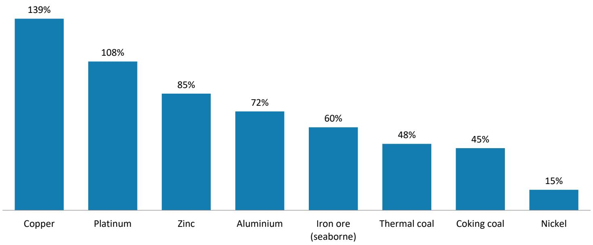

bar chart

| Category | Value (%) |
|---|---|
| Copper | 139 |
| Platinum | 108 |
| Zinc | 85 |
| Aluminium | 72 |
| Iron ore (seaborne) | 60 |
| Thermal coal | 48 |
| Coking coal | 45 |
| Nickel | 15 |

Source: Wood Mackenzie, Bloomberg, Platts, MS

## China – Macro Outlook

Exhibit 46: China: April 2026 trade data

<table><tr><td rowspan="2">Apr 2026Trade data</td><td rowspan="2">Apr 2025 - Apr 2026</td><td colspan="12">Jan+Feb</td><td rowspan="2">2026YTD</td></tr><tr><td>Apr-26</td><td>Mar-26</td><td>2026</td><td>Dec-25</td><td>Nov-25</td><td>Oct-25</td><td>Sep-25</td><td>Aug-25</td><td>Jul-25</td><td>Jun-25</td><td>May-25</td><td>Apr-25</td></tr><tr><td rowspan="3">Finished Steel Imports (kt)</td><td></td><td>465</td><td>512</td><td>827</td><td>517</td><td>496</td><td>503</td><td>548</td><td>500</td><td>452</td><td>470</td><td>481</td><td>522</td><td>1,804</td></tr><tr><td>Change %, YoY</td><td>-11%</td><td>2%</td><td>-21%</td><td>-17%</td><td>5%</td><td>-6%</td><td>-1%</td><td>-2%</td><td>-10%</td><td>-18%</td><td>-24%</td><td>-21%</td><td>-13%</td></tr><tr><td>Change %, MoM</td><td>-9%</td><td>39%</td><td>NA</td><td>4%</td><td>-1%</td><td>-8%</td><td>10%</td><td>11%</td><td>-4%</td><td>-2%</td><td>-8%</td><td>4%</td><td>NA</td></tr><tr><td rowspan="3">Finished Steel Exports (kt)</td><td></td><td>9,498</td><td>9,135</td><td>15,591</td><td>11,301</td><td>9,980</td><td>9,782</td><td>10,465</td><td>9,510</td><td>9,836</td><td>9,678</td><td>10,578</td><td>10,462</td><td>34,214</td></tr><tr><td>Change %, YoY</td><td>-9%</td><td>-13%</td><td>-8%</td><td>16%</td><td>8%</td><td>-13%</td><td>3%</td><td>0%</td><td>26%</td><td>11%</td><td>10%</td><td>13%</td><td>-10%</td></tr><tr><td>Change %, MoM</td><td>4%</td><td>17%</td><td>NA</td><td>13%</td><td>2%</td><td>-7%</td><td>10%</td><td>-3%</td><td>2%</td><td>-9%</td><td>1%</td><td>0%</td><td>NA</td></tr><tr><td rowspan="3">Iron Ore Imports (mnt)</td><td></td><td>104</td><td>105</td><td>210</td><td>120</td><td>111</td><td>111</td><td>116</td><td>105</td><td>105</td><td>106</td><td>98</td><td>103</td><td>419</td></tr><tr><td>Change %, YoY</td><td>1%</td><td>11%</td><td>10%</td><td>6%</td><td>9%</td><td>7%</td><td>12%</td><td>4%</td><td>2%</td><td>9%</td><td>-4%</td><td>1%</td><td>8%</td></tr><tr><td>Change %, MoM</td><td>-1%</td><td>7%</td><td>NA</td><td>8%</td><td>-1%</td><td>-4%</td><td>11%</td><td>1%</td><td>-1%</td><td>8%</td><td>-5%</td><td>10%</td><td>NA</td></tr><tr><td rowspan="3">Copper and Products Imports (kt)</td><td></td><td>452</td><td>416</td><td>700</td><td>437</td><td>427</td><td>438</td><td>485</td><td>425</td><td>480</td><td>464</td><td>427</td><td>438</td><td>1,567</td></tr><tr><td>Change %, YoY</td><td>3%</td><td>-11%</td><td>-16%</td><td>-22%</td><td>-19%</td><td>-13%</td><td>1%</td><td>2%</td><td>10%</td><td>6%</td><td>-17%</td><td>0%</td><td>-10%</td></tr><tr><td>Change %, MoM</td><td>9%</td><td>32%</td><td>NA</td><td>2%</td><td>-3%</td><td>-10%</td><td>14%</td><td>-11%</td><td>3%</td><td>9%</td><td>-3%</td><td>-6%</td><td>NA</td></tr><tr><td rowspan="3">Copper Ores &amp; Concentrates Imports (kt)</td><td></td><td>2,352</td><td>2,630</td><td>4,934</td><td>2,704</td><td>2,526</td><td>2,451</td><td>2,587</td><td>2,759</td><td>2,560</td><td>2,350</td><td>2,395</td><td>2,924</td><td>9,915</td></tr><tr><td>Change %, YoY</td><td>-20%</td><td>10%</td><td>5%</td><td>7%</td><td>13%</td><td>6%</td><td>6%</td><td>7%</td><td>18%</td><td>2%</td><td>6%</td><td>25%</td><td>-1%</td></tr><tr><td>Change %, MoM</td><td>-11%</td><td>14%</td><td>NA</td><td>7%</td><td>3%</td><td>-5%</td><td>-6%</td><td>8%</td><td>9%</td><td>-2%</td><td>-18%</td><td>22%</td><td>NA</td></tr><tr><td rowspan="3">Aluminum and Products Exports (kt)</td><td></td><td>598</td><td>485</td><td>971</td><td>545</td><td>570</td><td>503</td><td>521</td><td>534</td><td>542</td><td>489</td><td>547</td><td>518</td><td>2,053</td></tr><tr><td>Change %, YoY</td><td>15%</td><td>-4%</td><td>13%</td><td>8%</td><td>-15%</td><td>-13%</td><td>-7%</td><td>-10%</td><td>-8%</td><td>-20%</td><td>-3%</td><td>0%</td><td>9%</td></tr><tr><td>Change %, MoM</td><td>23%</td><td>13%</td><td>NA</td><td>-4%</td><td>13%</td><td>-3%</td><td>-2%</td><td>-1%</td><td>11%</td><td>-11%</td><td>6%</td><td>2%</td><td>NA</td></tr><tr><td rowspan="3">Coal Imports (mnt)</td><td></td><td>33</td><td>39</td><td>77</td><td>59</td><td>44</td><td>42</td><td>46</td><td>43</td><td>36</td><td>33</td><td>36</td><td>38</td><td>149</td></tr><tr><td>Change %, YoY</td><td>-13%</td><td>1%</td><td>1%</td><td>12%</td><td>-20%</td><td>-10%</td><td>-3%</td><td>-7%</td><td>-23%</td><td>-26%</td><td>-18%</td><td>-16%</td><td>-2%</td></tr><tr><td>Change %, MoM</td><td>-15%</td><td>26%</td><td>NA</td><td>33%</td><td>6%</td><td>-9%</td><td>8%</td><td>20%</td><td>8%</td><td>-8%</td><td>-5%</td><td>-2%</td><td>NA</td></tr></table>

Source: General Administration of Customs, MS.

Exhibit 47: Total local government special bond issuance  
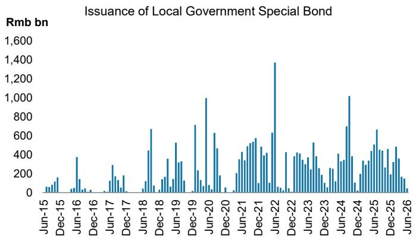

bar chart

| Date    | Issuance (Rmb bn) |
|---------|-------------------|
| Jun-15  | ~50               |
| Dec-15  | ~150              |
| Jun-16  | ~350              |
| Dec-16  | ~50               |
| Jun-17  | ~250              |
| Dec-17  | ~150              |
| Jun-18  | ~450              |
| Dec-18  | ~650              |
| Jun-19  | ~300              |
| Dec-19  | ~500              |
| Jun-20  | ~700              |
| Dec-20  | ~1000             |
| Jun-21  | ~600              |
| Dec-21  | ~550              |
| Jun-22  | ~1400             |
| Dec-22  | ~400              |
| Jun-23  | ~350              |
| Dec-23  | ~500              |
| Jun-24  | ~700              |
| Dec-24  | ~1000             |
| Jun-25  | ~650              |
| Dec-25  | ~450              |
| Jun-26  | ~150              |

Source: WIND, MS.

Exhibit 48: Value of NDRC-approved projects (by approval date)  
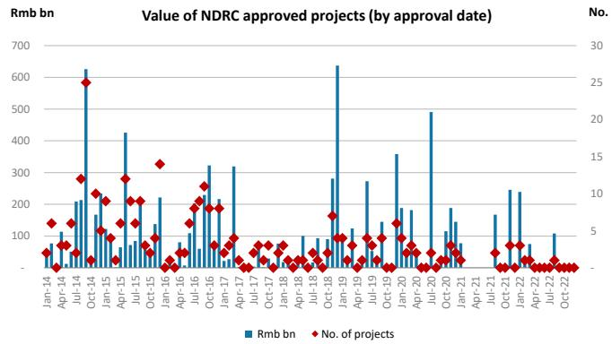

bar-line hybrid chart

Value of NDRC approved projects (by approval date)
| Approval Date | Rmb bn (Rmb bn) | No. of projects |
|---|---|---|
| Jan-14 | 50 | 3 |
| Apr-14 | 80 | 4 |
| Jul-14 | 120 | 6 |
| Oct-14 | 630 | 25 |
| Jan-15 | 100 | 10 |
| Apr-15 | 420 | 28 |
| Jul-15 | 70 | 12 |
| Oct-15 | 220 | 33 |
| Jan-16 | 90 | 2 |
| Apr-16 | 100 | 1 |
| Jul-16 | 60 | 10 |
| Oct-16 | 320 | 26 |
| Jan-17 | 320 | 8 |
| Apr-17 | 100 | 3 |
| Jul-17 | 50 | 5 |
| Oct-17 | 50 | 3 |
| Jan-18 | 50 | 3 |
| Apr-18 | 50 | 3 |
| Jul-18 | 50 | 3 |
| Oct-18 | 280 | 16 |
| Jan-19 | 640 | 7 |
| Apr-19 | 100 | 3 |
| Jul-19 | 270 | 4 |
| Oct-19 | 140 | 3 |
| Jan-20 | 360 | 4 |
| Apr-20 | 180 | 3 |
| Jul-20 | 490 | 3 |
| Oct-20 | 180 | 3 |
| Jan-21 | 70 | 3 |
| Apr-21 | 160 | 3 |
| Jul-21 | 240 | 4 |
| Oct-21 | 240 | 4 |
| Jan-22 | 60 | 3 |
| Apr-22 | 60 | 3 |
| Jul-22 | 100 | 3 |
| Oct-22 | 50 | 3 |

Source: NDRC, MS.

Exhibit 49: Chinese PMI and IP  
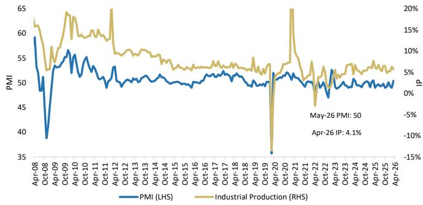

line chart

| Date    | PMI (LHS) | Industrial Production (RHS) |
|---------|-----------|-----------------------------|
| May-26  | 50        | 4.1%                        |

Source: Refinitiv, MS.

Exhibit 50: Chinese CPI and PPI  
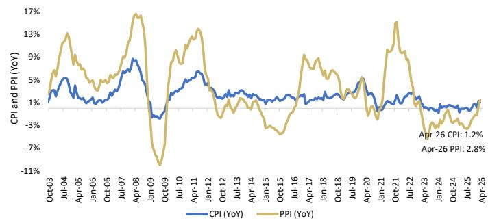

line chart

| Date    | CPI (YoY) | PPI (YoY) |
|---------|-----------|-----------|
| Apr-26  | 1.2%      | 2.8%      |

Source: Refinitiv, MS.

Exhibit 51: Chinese power generation  

line chart

| Date     | Power Generation (YoY) |
| -------- | ---------------------- |
| Apr-26   | 2.6%                   |

Source: Refinitiv, MS.

Exhibit 52: Chinese new loans and M2 supply  
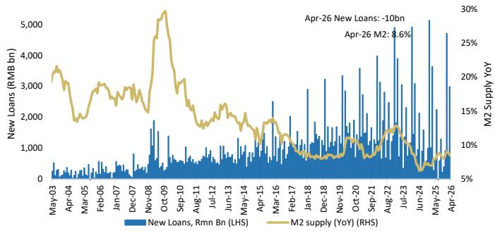

bar-line hybrid chart

| Date     | New Loans, Rmn Bn (RMB bn) | M2 supply (YoY) (%) |
|----------|-----------------------------|---------------------|
| Apr-26   | -10                         | 8.6%                |

Source: Refinitiv, MS.

Exhibit 53: China – Total Floor Space Started  

line chart

| Date    | Floor Space Started Monthly (mn sq. m) | 12 per. Moving Avg (mn sq. m) |
|---------|----------------------------------------|-------------------------------|
| Feb-15  | ~70                                    | ~145                          |
| Aug-15  | ~190                                   | ~135                          |
| Feb-16  | ~75                                    | ~130                          |
| Aug-16  | ~180                                   | ~135                          |
| Feb-17  | ~80                                    | ~140                          |
| Aug-17  | ~200                                   | ~145                          |
| Feb-18  | ~160                                   | ~150                          |
| Aug-18  | ~230                                   | ~160                          |
| Feb-19  | ~200                                   | ~170                          |
| Aug-19  | ~250                                   | ~180                          |
| Feb-20  | ~280                                   | ~185                          |
| Aug-20  | ~230                                   | ~190                          |
| Feb-21  | ~270                                   | ~195                          |
| Aug-21  | ~240                                   | ~190                          |
| Feb-22  | ~140                                   | ~160                          |
| Aug-22  | ~80                                    | ~120                          |
| Feb-23  | ~60                                    | ~90                           |
| Aug-23  | ~50                                    | ~70                           |
| Feb-24  | ~40                                    | ~60                           |
| Aug-24  | ~30                                    | ~50                           |
| Feb-25  | ~20                                    | ~40                           |
| Aug-25  | ~10                                    | ~30                           |
| Feb-26  | ~5                                     | ~20                           |

Source: CEIC, MS.

Exhibit 54: China – Total Floor Space Started (YoY)  
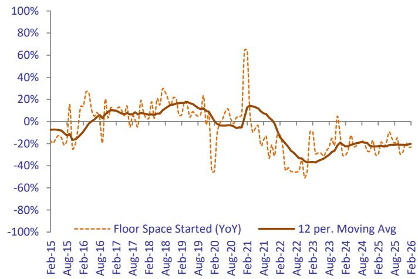

line chart

| Date    | Floor Space Started (YoY) | 12 per. Moving Avg |
|---------|---------------------------|--------------------|
| Feb-15  | -20%                      | -10%               |
| Aug-15  | -30%                      | -20%               |
| Feb-16  | 20%                       | 0%                 |
| Aug-16  | 10%                       | 10%                |
| Feb-17  | 15%                       | 15%                |
| Aug-17  | 5%                        | 5%                 |
| Feb-18  | 20%                       | 20%                |
| Aug-18  | 30%                       | 30%                |
| Feb-19  | 10%                       | 10%                |
| Aug-19  | -50%                      | -50%               |
| Feb-20  | -40%                      | -40%               |
| Aug-20  | 60%                       | 60%                |
| Feb-21  | -20%                      | -20%               |
| Aug-21  | -40%                      | -40%               |
| Feb-22  | -50%                      | -50%               |
| Aug-22  | -30%                      | -30%               |
| Feb-23  | -20%                      | -20%               |
| Aug-23  | -10%                      | -10%               |
| Feb-24  | -20%                      | -20%               |
| Aug-24  | -30%                      | -30%               |
| Feb-25  | -20%                      | -20%               |
| Aug-25  | -30%                      | -30%               |
| Feb-26  | -20%                      | -20%               |

Source: CEIC, MS.

Exhibit 55: China – Total Floor Space Completed  

line chart

| Date    | Floor Space Completed | 12 per. Moving Avg |
|---------|------------------------|---------------------|
| Feb-15  | ~60                    | ~85                 |
| Aug-15  | ~45                    | ~80                 |
| Feb-16  | ~70                    | ~85                 |
| Aug-16  | ~50                    | ~90                 |
| Feb-17  | ~60                    | ~90                 |
| Aug-17  | ~50                    | ~85                 |
| Feb-18  | ~45                    | ~80                 |
| Aug-18  | ~60                    | ~75                 |
| Feb-19  | ~45                    | ~70                 |
| Aug-19  | ~50                    | ~75                 |
| Feb-20  | ~40                    | ~70                 |
| Aug-20  | ~50                    | ~75                 |
| Feb-21  | ~40                    | ~70                 |
| Aug-21  | ~30                    | ~75                 |
| Feb-22  | ~40                    | ~70                 |
| Aug-22  | ~30                    | ~65                 |
| Feb-23  | ~40                    | ~70                 |
| Aug-23  | ~30                    | ~75                 |
| Feb-24  | ~30                    | ~80                 |
| Aug-24  | ~20                    | ~70                 |
| Feb-25  | ~30                    | ~60                 |
| Aug-25  | ~20                    | ~55                 |
| Feb-26  | ~30                    | ~50                 |

Source: CEIC, MS.

Exhibit 56: China – Total Floor Space Completed (YoY)  

line chart

| Date    | Floor Space Completed (YoY) | 12 per. Moving Avg |
|---------|-----------------------------|--------------------|
| Feb-15  | ~0%                         | ~0%                |
| Aug-15  | ~-20%                       | ~-10%              |
| Feb-16  | ~30%                        | ~-5%               |
| Aug-16  | ~15%                        | ~10%               |
| Feb-17  | ~10%                        | ~5%                |
| Aug-17  | ~-5%                        | ~0%                |
| Feb-18  | ~-10%                       | ~-5%               |
| Aug-18  | ~-15%                       | ~-10%              |
| Feb-19  | ~-5%                        | ~-5%               |
| Aug-19  | ~0%                         | ~0%                |
| Feb-20  | ~5%                         | ~0%                |
| Aug-20  | ~10%                        | ~5%                |
| Feb-21  | ~60%                        | ~15%               |
| Aug-21  | ~-20%                       | ~-20%              |
| Feb-22  | ~-40%                       | ~-20%              |
| Aug-22  | ~30%                        | ~-20%              |
| Feb-23  | ~35%                        | ~-20%              |
| Aug-23  | ~20%                        | ~-20%              |
| Feb-24  | ~15%                        | ~-20%              |
| Aug-24  | ~-30%                       | ~-30%              |
| Feb-25  | ~-20%                       | ~-30%              |
| Aug-25  | ~-25%                       | ~-30%              |
| Feb-26  | ~-30%                       | ~-30%              |

Source: CEIC, MS.

Exhibit 57: China – Total Floor Space Sold  

line chart

| Date    | Floor Space Sold | 12 per. Moving Avg |
|---------|------------------|--------------------|
| Feb-15  | ~50              | ~100               |
| Aug-15  | ~100             | ~105               |
| Feb-16  | ~150             | ~110               |
| Aug-16  | ~180             | ~120               |
| Feb-17  | ~200             | ~130               |
| Aug-17  | ~220             | ~140               |
| Feb-18  | ~230             | ~145               |
| Aug-18  | ~240             | ~145               |
| Feb-19  | ~230             | ~145               |
| Aug-19  | ~220             | ~145               |
| Feb-20  | ~200             | ~140               |
| Aug-20  | ~250             | ~150               |
| Feb-21  | ~220             | ~160               |
| Aug-21  | ~200             | ~150               |
| Feb-22  | ~180             | ~140               |
| Aug-22  | ~160             | ~130               |
| Feb-23  | ~140             | ~120               |
| Aug-23  | ~120             | ~110               |
| Feb-24  | ~100             | ~100               |
| Aug-24  | ~80              | ~90                |
| Feb-25  | ~60              | ~80                |
| Aug-25  | ~50              | ~75                |
| Feb-26  | ~40              | ~70                |

Source: CEIC, MS.

Exhibit 58: China – Total Floor Space Sold (YoY)  
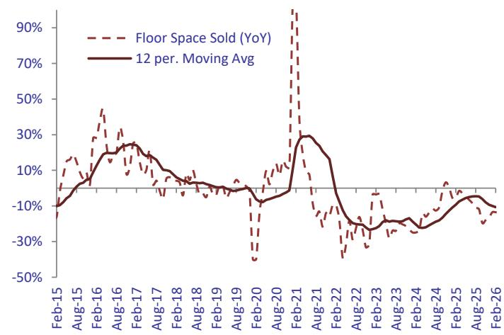

line chart

| Date    | Floor Space Sold (YoY) | 12 per. Moving Avg |
|---------|------------------------|--------------------|
| Feb-15  | -10%                   | -10%               |
| Aug-15  | 10%                    | 5%                 |
| Feb-16  | 40%                    | 20%                |
| Aug-16  | 30%                    | 25%                |
| Feb-17  | 20%                    | 25%                |
| Aug-17  | 10%                    | 20%                |
| Feb-18  | 5%                     | 10%                |
| Aug-18  | 0%                     | 5%                 |
| Feb-19  | -5%                    | 0%                 |
| Aug-19  | -10%                   | -5%                |
| Feb-20  | -40%                   | -10%               |
| Aug-20  | -20%                   | -5%                |
| Feb-21  | 90%                    | 30%                |
| Aug-21  | -20%                   | -10%               |
| Feb-22  | -30%                   | -25%               |
| Aug-22  | -25%                   | -30%               |
| Feb-23  | -30%                   | -25%               |
| Aug-23  | -25%                   | -20%               |
| Feb-24  | -20%                   | -25%               |
| Aug-24  | -10%                   | -20%               |
| Feb-25  | -5%                    | -15%               |
| Aug-25  | -10%                   | -15%               |
| Feb-26  | -15%                   | -20%               |

Source: CEIC, MS.

Exhibit 59: China – Total Land Area Sold  
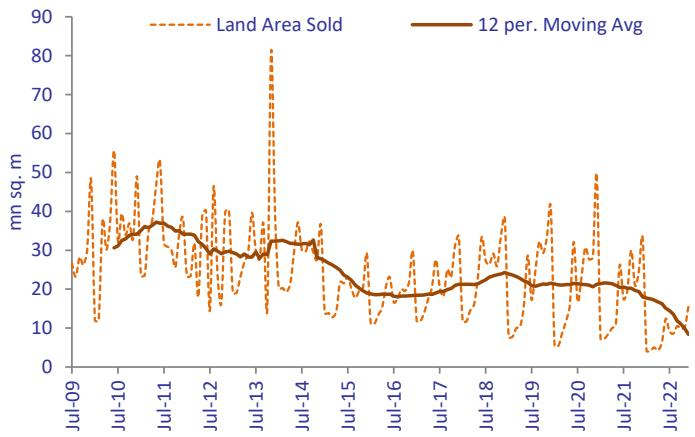

line chart

| Date   | Land Area Sold | 12 per. Moving Avg |
|--------|----------------|--------------------|
| Jul-09 | ~25            | ~30                |
| Jul-10 | ~55            | ~35                |
| Jul-11 | ~45            | ~38                |
| Jul-12 | ~40            | ~35                |
| Jul-13 | ~80            | ~30                |
| Jul-14 | ~35            | ~30                |
| Jul-15 | ~25            | ~25                |
| Jul-16 | ~20            | ~20                |
| Jul-17 | ~25            | ~20                |
| Jul-18 | ~30            | ~22                |
| Jul-19 | ~40            | ~22                |
| Jul-20 | ~50            | ~20                |
| Jul-21 | ~30            | ~20                |
| Jul-22 | ~15            | ~15                |

Source: CEIC, MS.

Exhibit 60: China – Total Land Sales (YoY)  
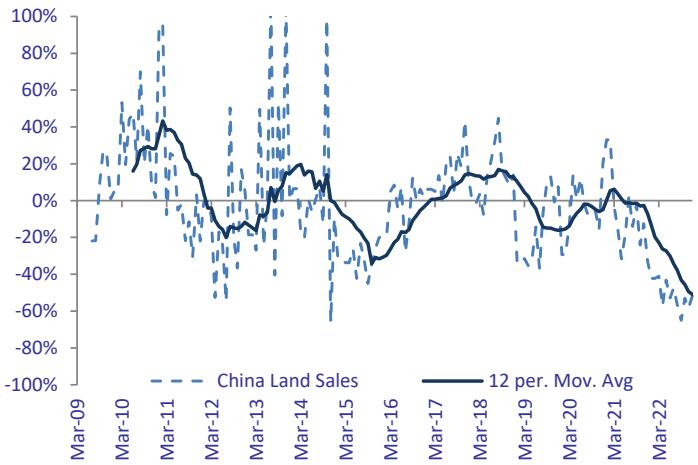

line chart

| Date   | China Land Sales | 12 per. Mov. Avg |
|--------|------------------|------------------|
| Mar-09 | -                | -                |
| Mar-10 | 20%              | 20%              |
| Mar-11 | 40%              | 40%              |
| Mar-12 | -20%             | -20%             |
| Mar-13 | 0%               | 0%               |
| Mar-14 | 20%              | 20%              |
| Mar-15 | -60%             | -60%             |
| Mar-16 | -40%             | -40%             |
| Mar-17 | 0%               | 0%               |
| Mar-18 | 20%              | 20%              |
| Mar-19 | -20%             | -20%             |
| Mar-20 | 0%               | 0%               |
| Mar-21 | 20%              | 20%              |
| Mar-22 | -60%             | -60%             |

Source: CEIC, MS.

Exhibit 61: China – Average Property Sales Price/sq. m (YoY)  

line chart

| Date    | China National Average Property Sales Price (YoY) | 12 per. Mov. Avg |
|---------|--------------------------------------------------|------------------|
| Feb-15  | ~0%                                              | ~0%              |
| Aug-15  | ~5%                                              | ~5%              |
| Feb-16  | ~15%                                             | ~10%             |
| Aug-16  | ~10%                                             | ~10%             |
| Feb-17  | ~5%                                              | ~5%              |
| Aug-17  | ~0%                                              | ~0%              |
| Feb-18  | ~5%                                              | ~5%              |
| Aug-18  | ~10%                                             | ~10%             |
| Feb-19  | ~5%                                              | ~5%              |
| Aug-19  | ~0%                                              | ~0%              |
| Feb-20  | ~5%                                              | ~5%              |
| Aug-20  | ~0%                                              | ~0%              |
| Feb-21  | ~5%                                              | ~5%              |
| Aug-21  | ~0%                                              | ~0%              |
| Feb-22  | ~-5%                                             | ~-5%             |
| Aug-22  | ~-10%                                            | ~-10%            |
| Feb-23  | ~25%                                             | ~5%              |
| Aug-23  | ~-5%                                             | ~0%              |
| Feb-24  | ~-10%                                            | ~-5%             |
| Aug-24  | ~-5%                                             | ~-5%             |
| Feb-25  | ~0%                                              | ~0%              |
| Aug-25  | ~-5%                                             | ~-5%             |
| Feb-26  | ~-10%                                            | ~-10%            |

Source: CEIC, MS.

Exhibit 62: Chinese Property – Total Inventory Months  
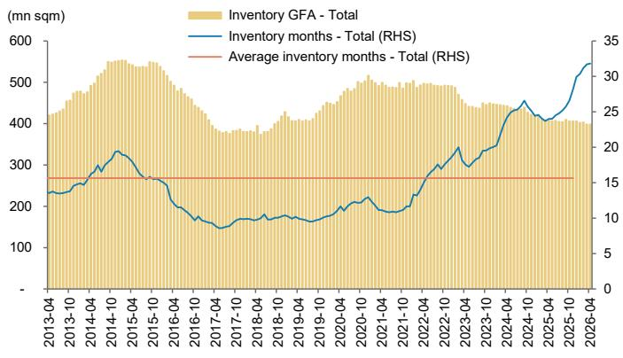

bar-line hybrid chart

| Date     | Inventory GFA - Total (mn sqm) | Inventory months - Total (RHS) | Average inventory months - Total (RHS) |
|----------|-------------------------------|--------------------------------|----------------------------------------|
| 2013-04  | ~420                          | ~23                            | 15                                     |
| 2014-10  | ~550                          | ~32                            | 15                                     |
| 2015-10  | ~540                          | ~28                            | 15                                     |
| 2016-10  | ~480                          | ~18                            | 15                                     |
| 2017-10  | ~380                          | ~16                            | 15                                     |
| 2018-10  | ~400                          | ~17                            | 15                                     |
| 2019-10  | ~420                          | ~18                            | 15                                     |
| 2020-10  | ~480                          | ~20                            | 15                                     |
| 2021-10  | ~500                          | ~22                            | 15                                     |
| 2022-10  | ~480                          | ~25                            | 15                                     |
| 2023-10  | ~460                          | ~28                            | 15                                     |
| 2024-10  | ~480                          | ~30                            | 15                                     |
| 2025-10  | ~460                          | ~32                            | 15                                     |
| 2026-10  | ~440                          | ~34                            | 15                                     |

Source: CREIS, MS.

Exhibit 63: China – Infrastructure spending  
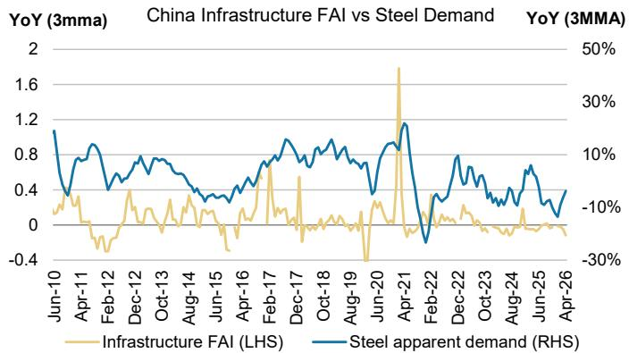

line chart

| Date    | Infrastructure FAI (LHS) | Steel apparent demand (RHS) |
|---------|--------------------------|-----------------------------|
| Jun-10  | ~0.2                     | ~1.2                        |
| Apr-11  | ~0.1                     | ~0.8                        |
| Feb-12  | ~0.3                     | ~0.9                        |
| Dec-12  | ~0.4                     | ~0.7                        |
| Oct-13  | ~0.3                     | ~0.6                        |
| Aug-14  | ~0.2                     | ~0.5                        |
| Jun-15  | ~0.1                     | ~0.4                        |
| Apr-16  | ~0.2                     | ~0.5                        |
| Feb-17  | ~0.3                     | ~0.6                        |
| Dec-17  | ~0.4                     | ~0.7                        |
| Oct-18  | ~0.3                     | ~0.8                        |
| Aug-19  | ~0.2                     | ~0.9                        |
| Jun-20  | ~0.1                     | ~1.0                        |
| Apr-21  | ~1.8                     | ~1.2                        |
| Feb-22  | ~0.1                     | ~0.3                        |
| Dec-22  | ~0.2                     | ~0.5                        |
| Oct-23  | ~0.1                     | ~0.4                        |
| Aug-24  | ~0.2                     | ~0.6                        |
| Jun-25  | ~0.1                     | ~0.4                        |
| Apr-26  | ~0.0                     | ~0.2                        |

Source: CEIC, MS.

Exhibit 64: White goods production and sales  
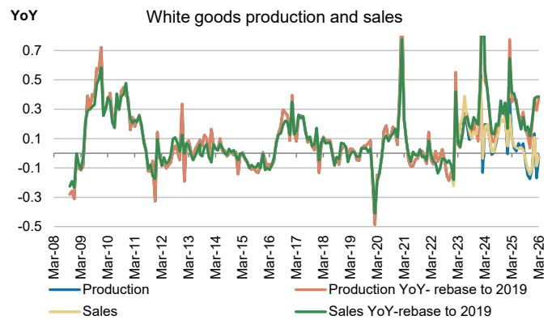

line chart

| Date   | Production | Production YoY- rebase to 2019 | Sales | Sales YoY-rebase to 2019 |
|--------|------------|-------------------------------|-------|--------------------------|
| Mar-08 | -          | -0.3                          | -     | -0.3                     |
| Mar-09 | -          | 0.5                           | -     | 0.5                      |
| Mar-10 | -          | 0.7                           | -     | 0.7                      |
| Mar-11 | -          | 0.5                           | -     | 0.5                      |
| Mar-12 | -          | -0.3                          | -     | -0.3                     |
| Mar-13 | -          | 0.3                           | -     | 0.3                      |
| Mar-14 | -          | 0.1                           | -     | 0.1                      |
| Mar-15 | -          | -0.1                          | -     | -0.1                     |
| Mar-16 | -          | 0.3                           | -     | 0.3                      |
| Mar-17 | -          | 0.5                           | -     | 0.5                      |
| Mar-18 | -          | 0.1                           | -     | 0.1                      |
| Mar-19 | -          | -0.1                          | -     | -0.1                     |
| Mar-20 | -          | -0.5                          | -     | -0.5                     |
| Mar-21 | -          | 0.7                           | -     | 0.7                      |
| Mar-22 | -          | 0.1                           | -     | 0.1                      |
| Mar-23 | -          | 0.5                           | -     | 0.5                      |
| Mar-24 | -          | 0.7                           | -     | 0.7                      |
| Mar-25 | -          | 0.7                           | -     | 0.7                      |
| Mar-26 | -          | 0.3                           | -     | 0.3                      |

Source: ChinaILO, MS.

Exhibit 65: China – Excavator sales  
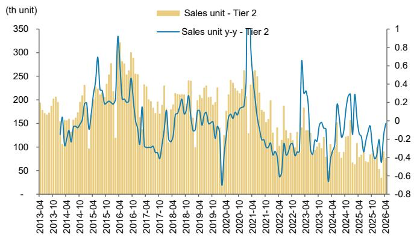

bar-line hybrid chart

| Date     | Sales unit - Tier 2 (th unit) | Sales unit y-y - Tier 2 |
|----------|-------------------------------|--------------------------|
| 2013-04  | ~180                          | ~0.1                     |
| 2013-10  | ~200                          | ~0.1                     |
| 2014-04  | ~160                          | ~0.1                     |
| 2014-10  | ~180                          | ~0.1                     |
| 2015-04  | ~280                          | ~0.3                     |
| 2015-10  | ~330                          | ~0.7                     |
| 2016-04  | ~300                          | ~0.5                     |
| 2016-10  | ~250                          | ~0.3                     |
| 2017-04  | ~230                          | ~0.1                     |
| 2017-10  | ~200                          | ~0.1                     |
| 2018-04  | ~220                          | ~0.1                     |
| 2018-10  | ~240                          | ~0.1                     |
| 2019-04  | ~230                          | ~0.1                     |
| 2019-10  | ~220                          | ~0.1                     |
| 2020-04  | ~240                          | ~0.1                     |
| 2020-10  | ~260                          | ~0.3                     |
| 2021-04  | ~350                          | ~0.9                     |
| 2021-10  | ~250                          | ~0.1                     |
| 2022-04  | ~180                          | ~-0.3                    |
| 2022-10  | ~160                          | ~-0.5                    |
| 2023-04  | ~180                          | ~-0.6                    |
| 2023-10  | ~140                          | ~-0.4                    |
| 2024-04  | ~90                           | ~-0.6                    |
| 2024-10  | ~80                           | ~-0.4                    |
| 2025-04  | ~70                           | ~-0.3                    |
| 2025-10  | ~60                           | ~-0.2                    |
| 2026-04  | ~50                           | ~-0.1                    |

Source: CEIC, MS.

Exhibit 66: China – Passenger vehicle sales  
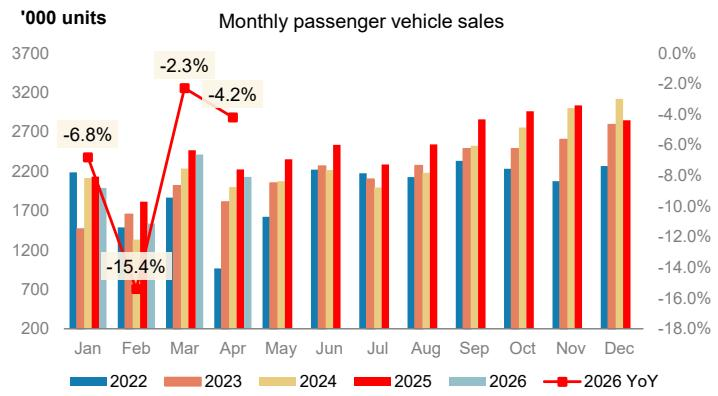

bar chart

| Month | 2022 | 2023 | 2024 | 2025 | 2026 | 2026 YoY |
|-------|------|------|------|------|------|----------|
| Jan   | 2200 | 1700 | 1900 | 2400 | 1800 | -6.8%    |
| Feb   | 1300 | 1700 | 700  | 1700 | 1300 | -15.4%   |
| Mar   | 1700 | 1900 | 2100 | 3200 | 2400 | -2.3%    |
| Apr   | 1300 | 1700 | 1900 | 2100 | 2200 | -4.2%    |
| May   | 1700 | 1900 | 2100 | 2300 | 2300 |          |
| Jun   | 2100 | 2100 | 2300 | 2600 | 2600 |          |
| Jul   | 2100 | 2100 | 1900 | 2300 | 2300 |          |
| Aug   | 2100 | 2100 | 2100 | 2600 | 2600 |          |
| Sep   | 2300 | 2600 | 2700 | 3100 | 3100 |          |
| Oct   | 2100 | 2600 | 2700 | 3100 | 3100 |          |
| Nov   | 1900 | 2700 | 3100 | 3100 | 3100 |          |
| Dec   | 2200 | 3100 | 3100 | 3100 | 3100 |          |

Source: CAAM, MS.

Exhibit 67: Transportation infrastructure new orders reported by large infrastructure construction groups  
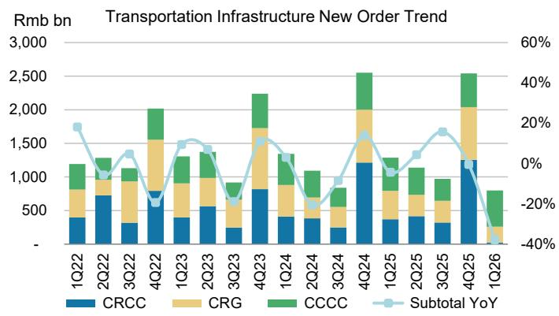

stacked bar chart with overlaid line

| Quarter | CRCC (Rmb bn) | CRG (Rmb bn) | CCCC (Rmb bn) | Subtotal YoY (%) |
|---------|---------------|--------------|---------------|------------------|
| 1Q22    | 400           | 300          | 300           | 18%              |
| 2Q22    | 700           | 400          | 200           | -10%             |
| 3Q22    | 300           | 500          | 200           | 12%              |
| 4Q22    | 800           | 600          | 400           | -15%             |
| 1Q23    | 400           | 400          | 300           | 15%              |
| 2Q23    | 500           | 400          | 300           | 15%              |
| 3Q23    | 200           | 300          | 200           | -15%             |
| 4Q23    | 800           | 600          | 400           | 15%              |
| 1Q24    | 400           | 400          | 300           | -15%             |
| 2Q24    | 300           | 300          | 300           | -15%             |
| 3Q24    | 200           | 300          | 200           | -15%             |
| 4Q24    | 1200          | 600          | 500           | 15%              |
| 1Q25    | 400           | 400          | 300           | -15%             |
| 2Q25    | 400           | 400          | 300           | -15%             |
| 3Q25    | 300           | 300          | 200           | -15%             |
| 4Q25    | 1200          | 600          | 400           | -15%             |
| 1Q26    | -             | -            | -             | -45%             |

Source: Company data, MS.

Exhibit 68: Building construction new order trend for CSCEC and MCC  
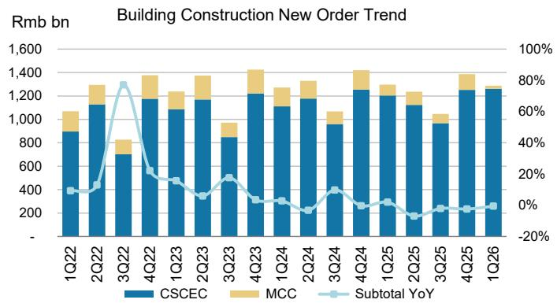

bar chart

| Quarter | CSCEC | MCC  | Subtotal YoY |
|---------|-------|------|--------------|
| 1Q22    | 850   | 150  | 10%          |
| 2Q22    | 1100  | 200  | 10%          |
| 3Q22    | 700   | 150  | 90%          |
| 4Q22    | 1200  | 200  | 10%          |
| 1Q23    | 1100  | 150  | 10%          |
| 2Q23    | 1150  | 150  | 10%          |
| 3Q23    | 850   | 150  | 10%          |
| 4Q23    | 1200  | 200  | 10%          |
| 1Q24    | 1100  | 150  | 10%          |
| 2Q24    | 1150  | 150  | 10%          |
| 3Q24    | 950   | 150  | 10%          |
| 4Q24    | 1250  | 200  | 10%          |
| 1Q25    | 1200  | 150  | 10%          |
| 2Q25    | 1150  | 150  | -10%         |
| 3Q25    | 950   | 150  | -10%         |
| 4Q25    | 1250  | 200  | -10%         |
| 1Q26    | 1250  | 200  | -10%         |

Source: Company data, MS.

Exhibit 69: Majority of PPP Projects Are in Transportation  
PPP projects total investment by industry  

pie chart

| Category | Value | Percentage (%) |
|---|---|---|
| Transportation | 2208 | 57 |
| Infrastructure | 585 | 15 |
| Others | 518 | 14 |
| Water Conservancy | 209 | 5 |
| Environmental | 174 | 5 |
| Public Service | 137 | 4 |
| Social Housing | 11 | 0 |

Source: NDRC, MS.

## Electric Vehicle-related Charts

Exhibit 70: EV Raw Material Demand as a Percentage of Total Global Demand  
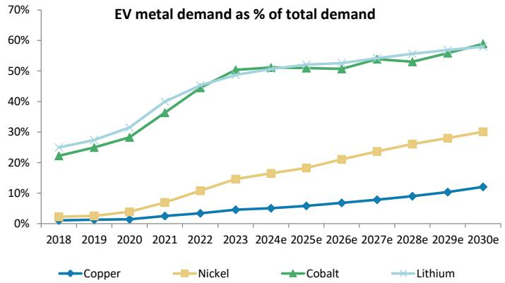

line chart

| Year   | Copper | Nickel | Cobalt | Lithium |
|--------|--------|--------|--------|---------|
| 2018   | 1%     | 3%     | 22%    | 25%     |
| 2019   | 1%     | 3%     | 25%    | 27%     |
| 2020   | 1%     | 4%     | 28%    | 30%     |
| 2021   | 2%     | 7%     | 35%    | 40%     |
| 2022   | 3%     | 11%    | 45%    | 45%     |
| 2023   | 4%     | 15%    | 50%    | 50%     |
| 2024e  | 5%     | 17%    | 51%    | 51%     |
| 2025e  | 6%     | 19%    | 51%    | 52%     |
| 2026e  | 7%     | 21%    | 50%    | 53%     |
| 2027e  | 8%     | 23%    | 54%    | 54%     |
| 2028e  | 9%     | 26%    | 53%    | 56%     |
| 2029e  | 10%    | 28%    | 56%    | 58%     |
| 2030e  | 11%    | 30%    | 60%    | 60%     |

Source: Company data, MS (E) estimates.

Exhibit 72: Metal Consumption Intensity for Battery Electric Vehicles (BEVs)  
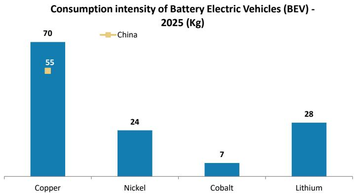

bar chart

Consumption intensity of Battery Electric Vehicles (BEV) - 2025 (Kg)
| Material | China (Kg) |
| :--- | :--- |
| Copper | 70 |
| Nickel | 24 |
| Cobalt | 7 |
| Lithium | 28 |

Source: MS estimates.

Exhibit 74: Global EV Battery Installation  

line chart

Global EV battery installation
| Month | 2021 (GWh) | 2022 (GWh) | 2023 (GWh) | 2024 (GWh) |
|---|---|---|---|---|
| Jan | 15 | 28 | 30 | 50 |
| Feb | 12 | 25 | 35 | 40 |
| Mar | 25 | 40 | 55 | 65 |
| Apr | 18 | 28 | 45 | 58 |
| May | 20 | 32 | 50 | 65 |
| Jun | 25 | 45 | 60 | 75 |
| Jul | 22 | 38 | 55 | 68 |
| Aug | 23 | 42 | 60 | 72 |
| Sep | 35 | 50 | 65 | 85 |
| Oct | 28 | 45 | 62 | 88 |
| Nov | 35 | 55 | 70 | 98 |
| Dec | 45 | 65 | 80 | 110 |

Source: China Customs, GGII, CPCA, SNE, MS.

Exhibit 71: Metal Demand Growth Rates Under Different Scenarios  
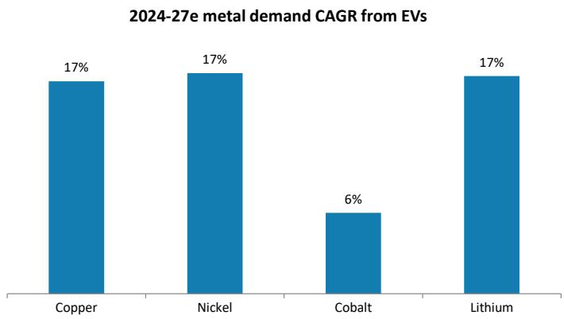

bar chart

2024-27e metal demand CAGR from EVs
| Metal | CAGR (%) |
| :--- | :--- |
| Copper | 17 |
| Nickel | 17 |
| Cobalt | 6 |
| Lithium | 17 |

Source: MS (E) estimates.

Exhibit 73: World BEV Sales Penetration Forecasts  
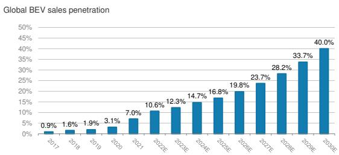

bar chart

Global BEV sales penetration
| Year | Global BEV sales penetration (%) |
|---|---|
| 2017 | 0.9 |
| 2018 | 1.6 |
| 2019 | 1.9 |
| 2020 | 3.1 |
| 2021 | 7.0 |
| 2022E | 10.6 |
| 2023E | 12.3 |
| 2024E | 14.7 |
| 2025E | 16.8 |
| 2026E | 19.8 |
| 2027E | 23.7 |
| 2028E | 28.2 |
| 2029E | 33.7 |
| 2030E | 40.0 |

Source: MS (E) estimates.

Exhibit 75: China EV Battery Installation  
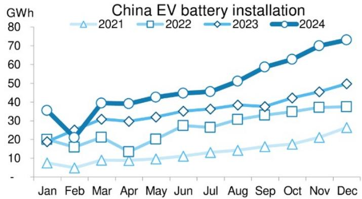

line chart

China EV battery installation
| Month | 2021 (GWh) | 2022 (GWh) | 2023 (GWh) | 2024 (GWh) |
|---|---|---|---|---|
| Jan | 8 | 20 | 19 | 36 |
| Feb | 5 | 17 | 25 | 21 |
| Mar | 9 | 21 | 30 | 40 |
| Apr | 8 | 14 | 29 | 39 |
| May | 9 | 20 | 32 | 43 |
| Jun | 10 | 27 | 35 | 45 |
| Jul | 12 | 27 | 36 | 46 |
| Aug | 14 | 31 | 38 | 51 |
| Sep | 16 | 33 | 38 | 59 |
| Oct | 17 | 35 | 43 | 63 |
| Nov | 20 | 37 | 46 | 70 |
| Dec | 26 | 37 | 50 | 74 |

Source: China Customs, GGII, CPCA, SNE, MS.

Exhibit 76: China – EV Sales and Production  
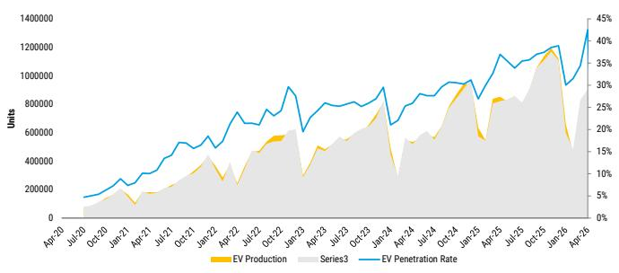

line chart

| Date   | EV Production | Series3 | EV Penetration Rate |
|--------|---------------|---------|---------------------|
| Apr-20 | 0             | 0       | 0%                  |
| Jul-20 | 0             | 0       | 0%                  |
| Oct-20 | 0             | 0       | 0%                  |
| Jan-21 | 0             | 0       | 0%                  |
| Apr-21 | 0             | 0       | 0%                  |
| Jul-21 | 0             | 0       | 0%                  |
| Oct-21 | 0             | 0       | 0%                  |
| Jan-22 | 0             | 0       | 0%                  |
| Apr-22 | 0             | 0       | 0%                  |
| Jul-22 | 0             | 0       | 0%                  |
| Oct-22 | 0             | 0       | 0%                  |
| Jan-23 | 0             | 0       | 0%                  |
| Apr-23 | 0             | 0       | 0%                  |
| Jul-23 | 0             | 0       | 0%                  |
| Oct-23 | 0             | 0       | 0%                  |
| Jan-24 | 0             | 0       | 0%                  |
| Apr-24 | 0             | 0       | 0%                  |
| Jul-24 | 0             | 0       | 0%                  |
| Oct-24 | 0             | 0       | 0%                  |
| Jan-25 | 0             | 0       | 0%                  |
| Apr-25 | 0             | 0       | 0%                  |
| Jul-25 | 0             | 0       | 0%                  |
| Oct-25 | 0             | 0       | 0%                  |
| Jan-26 | 0             | 0       | 0%                  |
| Apr-26 | 0             | 0       | 0%                  |

Source: Refinitiv, CAAM, MS estimates.

Exhibit 77: China – Monthly EV Sales (Passenger + Commercial)  
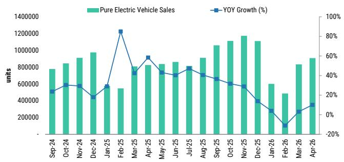

bar-line hybrid

| Month | Pure Electric Vehicle Sales (units) | YOY Growth (%) |
|---|---|---|
| Sep-24 | 750000 | 20 |
| Oct-24 | 830000 | 30 |
| Nov-24 | 910000 | 25 |
| Dec-24 | 980000 | 15 |
| Jan-25 | 550000 | 35 |
| Feb-25 | 1250000 | 95 |
| Mar-25 | 750000 | 45 |
| Apr-25 | 810000 | 65 |
| May-25 | 830000 | 40 |
| Jun-25 | 840000 | 35 |
| Jul-25 | 780000 | 45 |
| Aug-25 | 910000 | 35 |
| Sep-25 | 1060000 | 30 |
| Oct-25 | 1110000 | 25 |
| Nov-25 | 1170000 | 20 |
| Dec-25 | 1110000 | 15 |
| Jan-26 | 600000 | 5 |
| Feb-26 | 480000 | -15 |
| Mar-26 | 830000 | 5 |
| Apr-26 | 910000 | 15 |

Source: CABIA, MS.

Exhibit 78: Global BEV Sales - YTD April 2026 vs. YTD April 2025  
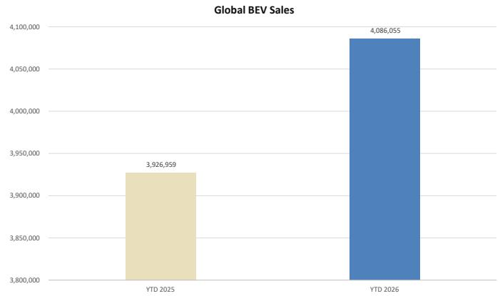

bar chart

Global BEV Sales
| Period | Value |
|---|---|
| YTD 2025 | 3,926,959 |
| YTD 2026 | 4,086,055 |

Source: EV-volumes.com, MS

Exhibit 79: BEV Penetration - April 2026 vs. April 2025  
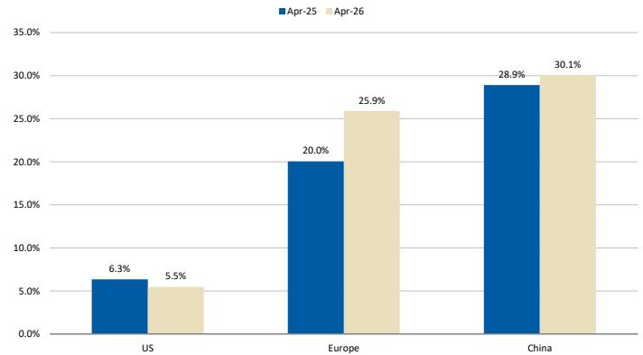

bar chart

| Region | Apr-25 (%) | Apr-26 (%) |
| :--- | :--- | :--- |
| US | 6.3 | 5.5 |
| Europe | 20.0 | 25.9 |
| China | 28.9 | 30.1 |

Source: EV-volumes.com, MS

Exhibit 80: April 2026: YTD Deployments by Region in MWh  
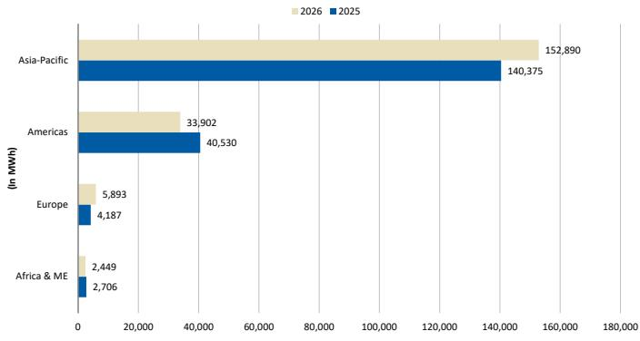

bar chart

| Region | 2026 (In MWh) | 2025 (In MWh) |
| :--- | :--- | :--- |
| Asia-Pacific | 152,890 | 140,375 |
| Americas | 33,902 | 40,530 |
| Europe | 5,893 | 4,187 |
| Africa & ME | 2,449 | 2,706 |

Source: EV-volumes.com, MS

Exhibit 81: April 2026 YTD: Top 5 Countries by Deployment in MWh

<table><tr><td>Rank</td><td>Countries</td><td>2026 YTD MWh</td><td>2025 YTD MWh</td><td>2026 Market Share</td></tr><tr><td>1</td><td>China</td><td>117,811</td><td>122,519</td><td>44%</td></tr><tr><td>2</td><td>USA</td><td>24,778</td><td>33,683</td><td>9%</td></tr><tr><td>3</td><td>Germany</td><td>16,665</td><td>11,942</td><td>6%</td></tr><tr><td>4</td><td>UK</td><td>12,930</td><td>11,036</td><td>5%</td></tr><tr><td>5</td><td>France</td><td>9,997</td><td>6,694</td><td>4%</td></tr><tr><td colspan="2">Total Top 5 Countries- YTD</td><td>182,181</td><td>185,874</td><td>68%</td></tr><tr><td colspan="2">Total MWh YTD</td><td>266,070</td><td>244,220</td><td>100%</td></tr></table>

Source: EV-volumes.com, MS

Exhibit 83: Specific Capacity Is the Amount of Electric Charge the Battery Can Deliver per g of Material  
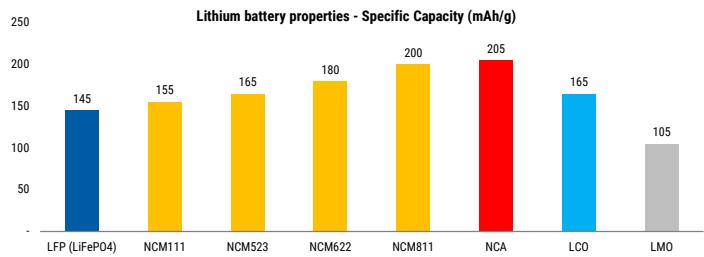

bar chart

Lithium battery properties - Specific Capacity (mAh/g)
| Battery Property | Specific Capacity (mAh/g) |
| :--- | :--- |
| LFP (LiFePO4) | 145 |
| NCM111 | 155 |
| NCM523 | 165 |
| NCM622 | 180 |
| NCM811 | 200 |
| NCA | 205 |
| LCO | 165 |
| LMO | 105 |

Source: Refinitiv, MS.

Exhibit 82: April 2026 vs April 2025: Top 5 Countries by MWh Deployed  
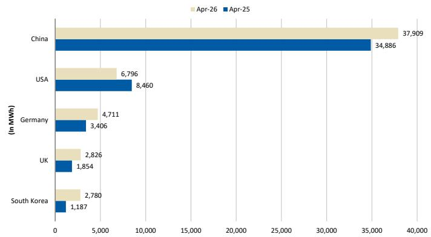

bar chart

| Country | Apr-26 (in MWh) | Apr-25 (in MWh) |
| :--- | :--- | :--- |
| China | 37,909 | 34,886 |
| USA | 6,796 | 8,460 |
| Germany | 4,711 | 3,406 |
| UK | 2,826 | 1,854 |
| South Korea | 2,780 | 1,187 |

Source: EV-volumes.com, MS

Exhibit 84: NCM Batteries Generally Have the Highest Lithium Content per KWh of Battery  
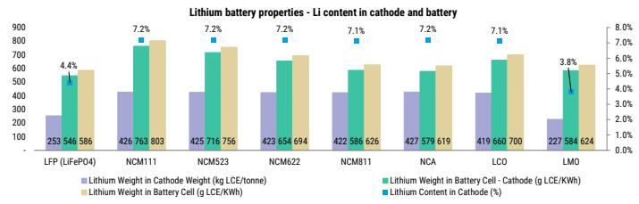

bar chart

| Battery Type | Lithium Weight in Cathode Weight (kg LCE/tonne) | Lithium Weight in Battery Cell - Cathode (g LCE/KWh) | Lithium Content in Cathode (%) |
|-------------|-----------------------------------------------|--------------------------------------------------|-------------------------------|
| LFP (LiFeP04) | 253 | 546 | 4.4% |
| NCM111 | 426 | 763 | 7.2% |
| NCM523 | 425 | 716 | 7.2% |
| NCM622 | 423 | 654 | 7.2% |
| NCM811 | 422 | 586 | 7.1% |
| NCA | 427 | 579 | 7.2% |
| LCO | 419 | 660 | 7.1% |
| LMO | 227 | 584 | 3.8% |

Source: Refinitiv, MS.

## MS EV Forecasts

Exhibit 85: MS Global EV Forecasts  
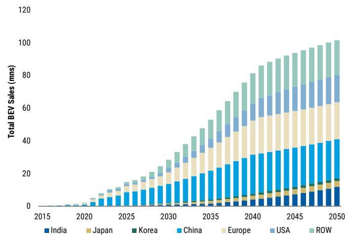

stacked bar chart

| Year | India (mms) | Japan (mms) | Korea (mms) | China (mms) | Europe (mms) | USA (mms) | ROW (mms) |
| --- | --- | --- | --- | --- | --- | --- | --- |
| 2015 | 0.1 | 0.05 | 0.03 | 0.02 | 0.01 | 0.01 | 0.01 |
| 2016 | 0.2 | 0.1 | 0.05 | 0.03 | 0.02 | 0.02 | 0.02 |
| 2017 | 0.3 | 0.15 | 0.08 | 0.04 | 0.03 | 0.03 | 0.03 |
| 2018 | 0.4 | 0.2 | 0.1 | 0.05 | 0.04 | 0.04 | 0.04 |
| 2019 | 0.5 | 0.25 | 0.12 | 0.06 | 0.05 | 0.05 | 0.05 |
| 2020 | 0.6 | 0.3 | 0.15 | 0.07 | 0.06 | 0.06 | 0.06 |
| 2021 | 0.7 | 0.35 | 0.18 | 0.08 | 0.07 | 0.07 | 0.07 |
| 2022 | 0.8 | 0.4 | 0.2 | 0.09 | 0.08 | 0.08 | 0.08 |
| 2023 | 0.9 | 0.45 | 0.22 | 0.1 | 0.09 | 0.09 | 0.09 |
| 2024 | 1.0 | 0.5 | 0.25 | 0.11 | 0.1 | 0.1 | 0.1 |
| 2025 | 1.1 | 0.55 | 0.28 | 0.12 | 0.11 | 0.11 | 0.11 |
| 2026 | 1.2 | 0.6 | 0.3 | 0.13 | 0.12 | 0.12 | 0.12 |
| 2027 | 1.3 | 0.65 | 0.32 | 0.14 | 0.13 | 0.13 | 0.13 |
| 2028 | 1.4 | 0.7 | 0.35 | 0.15 | 0.14 | 0.14 | 0.14 |
| 2029 | 1.5 | 0.75 | 0.38 | 0.16 | 0.15 | 0.15 | 0.15 |
| 2030 | 1.6 | 0.8 | 0.4 | 0.17 | 0.16 | 0.16 | 0.16 |
| 2031 | 1.7 | 0.85 | 0.42 | 0.18 | 0.17 | 0.17 | 0.17 |
| 2032 | 1.8 | 0.9 | 0.45 | 0.19 | 0.18 | 0.18 | 0.18 |
| 2033 | 1.9 | 1.35 | -45 | -46 | -47 | -48 | -49 |
| 2034 | -46 | -46 | -46 | -46 | -47 | -48 | -49 |
| 2035 | -47 | -47 | -47 | -46 | -47 | -48 | -49 |
| 2036 | -48 | -48 | -48 | -46 | -47 | -48 | -49 |
| 2037 | -49 | -49 | -49 | -46 | -47 | -48 | -49 |
| 2038 | -50 | -51 | -51 | -46 | -47 | -48 | -49 |
| 2039 | -51 | -53 | -53 | -46 | -47 | -48 | -49 |
| 2040 | -52 | -55 | -55 | -46 | -47 | -48 | -49 |
| 2041 | -53 | -57 | -57 | -46 | -47 | -48 | -49 |
| 2042 | -54 | -59 | -59 | -46 | -47 | -48 | -49 |
| 2043 | -55 | -61 | -61 | -46 | -47 | -48 | -49 |
| 2044 | -56 | -63 | -63 | -46 | -47 | -48 | -49 |
| 2045 | -57 | -65 | -65 | -46 | -47 | -48 | -49 |

Source: MS.

Exhibit 86: MS Global EV Penetration Forecasts  
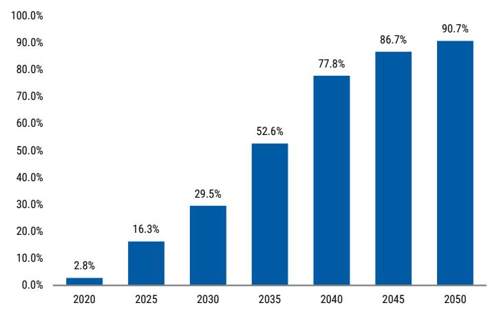

bar chart

| Year | Value (%) |
| :--- | :--- |
| 2020 | 2.8 |
| 2025 | 16.3 |
| 2030 | 29.5 |
| 2035 | 52.6 |
| 2040 | 77.8 |
| 2045 | 86.7 |
| 2050 | 90.7 |

Source: MS.

Exhibit 87: US BEV Sales (MS Forecasts)  

bar chart

| Year | Value |
|---|---|
| 2015 | 0.0 |
| 2016 | 0.1 |
| 2017 | 0.2 |
| 2018 | 0.3 |
| 2019 | 0.4 |
| 2020 | 0.5 |
| 2021 | 0.7 |
| 2022 | 0.9 |
| 2023 | 1.2 |
| 2024 | 1.3 |
| 2025 | 1.3 |
| 2026 | 1.1 |
| 2027 | 1.3 |
| 2028 | 1.6 |
| 2029 | 2.0 |
| 2030 | 2.4 |
| 2031 | 3.1 |
| 2032 | 3.7 |
| 2033 | 4.3 |
| 2034 | 4.8 |
| 2035 | 5.7 |
| 2036 | 6.9 |
| 2037 | 7.8 |
| 2038 | 8.7 |
| 2039 | 9.6 |
| 2040 | 10.6 |
| 2041 | 11.7 |
| 2042 | 12.5 |
| 2043 | 13.4 |
| 2044 | 14.3 |
| 2045 | 14.8 |
| 2046 | 15.3 |
| 2047 | 15.7 |
| 2048 | 16.1 |
| 2049 | 16.5 |
| 2050 | 16.8 |

Source: MS.

Exhibit 88: Europe BEV Sales (MS Forecasts)  

bar chart

| Year | Value |
|---|---|
| 2015 | 0.1 |
| 2016 | 0.2 |
| 2017 | 0.3 |
| 2018 | 0.4 |
| 2019 | 0.6 |
| 2020 | 0.8 |
| 2021 | 1.5 |
| 2022 | 1.8 |
| 2023 | 2.8 |
| 2024 | 2.9 |
| 2025 | 3.5 |
| 2026 | 4.1 |
| 2027 | 4.7 |
| 2028 | 5.3 |
| 2029 | 6.1 |
| 2030 | 7.2 |
| 2031 | 8.5 |
| 2032 | 9.8 |
| 2033 | 11.2 |
| 2034 | 12.6 |
| 2035 | 13.9 |
| 2036 | 15.3 |
| 2037 | 16.7 |
| 2038 | 18.1 |
| 2039 | 19.4 |
| 2040 | 20.8 |
| 2041 | 22.1 |
| 2042 | 22.3 |
| 2043 | 22.4 |
| 2044 | 22.5 |
| 2045 | 22.6 |
| 2046 | 22.7 |
| 2047 | 22.8 |
| 2048 | 22.9 |
| 2049 | 23.0 |
| 2050 | 23.1 |

Source: MS.

Exhibit 89: China BEV Sales (MS Forecasts)  

bar chart

| Year | Value |
|---|---|
| 2015 | 0.1 |
| 2016 | 0.3 |
| 2017 | 0.5 |
| 2018 | 0.7 |
| 2019 | 0.9 |
| 2020 | 2.5 |
| 2021 | 4.5 |
| 2022 | 5.3 |
| 2023 | 6.3 |
| 2024 | 7.8 |
| 2025 | 8.5 |
| 2026 | 9.3 |
| 2027 | 10.1 |
| 2028 | 10.9 |
| 2029 | 11.6 |
| 2030 | 12.5 |
| 2031 | 13.3 |
| 2032 | 14.2 |
| 2033 | 15.3 |
| 2034 | 16.5 |
| 2035 | 17.8 |
| 2036 | 19.1 |
| 2037 | 20.3 |
| 2038 | 21.5 |
| 2039 | 22.8 |
| 2040 | 24.0 |
| 2041 | 24.0 |
| 2042 | 24.0 |
| 2043 | 24.0 |
| 2044 | 24.0 |
| 2045 | 24.0 |
| 2046 | 24.0 |
| 2047 | 24.0 |
| 2048 | 24.0 |
| 2049 | 24.0 |
| 2050 | 24.0 |

Source: MS.

Exhibit 90: BEV vs. ICE Unit Sales (mm) Forecasts  
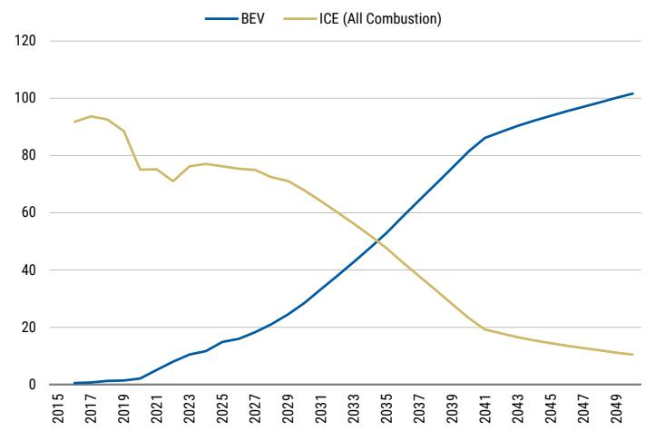

line chart

| Year | BEV  | ICE (All Combustion) |
|------|------|----------------------|
| 2015 | 0    | 92                   |
| 2017 | 1    | 94                   |
| 2019 | 2    | 88                   |
| 2021 | 5    | 76                   |
| 2023 | 10   | 78                   |
| 2025 | 15   | 77                   |
| 2027 | 20   | 76                   |
| 2029 | 25   | 73                   |
| 2031 | 35   | 68                   |
| 2033 | 45   | 60                   |
| 2035 | 55   | 50                   |
| 2037 | 65   | 40                   |
| 2039 | 75   | 30                   |
| 2041 | 85   | 20                   |
| 2043 | 90   | 15                   |
| 2045 | 95   | 12                   |
| 2047 | 98   | 10                   |
| 2049 | 102  | 8                    |

Source: Refinitiv, MS.

## Commodities: Aluminium

Exhibit 91: Consumption of Aluminum in China  
China aluminum demand breakdown by sectors  
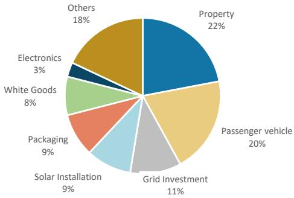

pie chart

| Category | Percentage (%) |
| :--- | :--- |
| Property | 22 |
| Passenger vehicle | 20 |
| Grid Investment | 11 |
| Solar Installation | 9 |
| Packaging | 9 |
| White Goods | 8 |
| Electronics | 3 |
| Others | 18 |

Source: Antaike, MS.

Exhibit92: Aluminium Exchange Inventories and Days of Consumption  
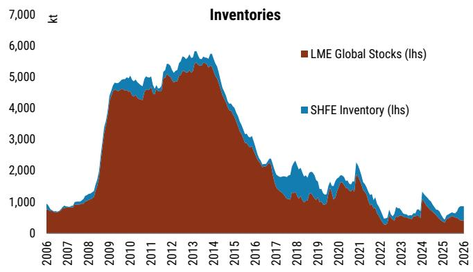

area chart

| Year | LME Global Stocks (lhs) | SHFE Inventory (lhs) |
|------|--------------------------|----------------------|
| 2006 | ~500                     | ~500                 |
| 2007 | ~700                     | ~600                 |
| 2008 | ~1,000                   | ~800                 |
| 2009 | ~4,500                   | ~4,000               |
| 2010 | ~4,800                   | ~4,500               |
| 2011 | ~4,700                   | ~4,300               |
| 2012 | ~5,000                   | ~4,800               |
| 2013 | ~5,500                   | ~5,200               |
| 2014 | ~5,800                   | ~5,500               |
| 2015 | ~5,500                   | ~5,300               |
| 2016 | ~4,500                   | ~4,800               |
| 2017 | ~3,500                   | ~3,800               |
| 2018 | ~2,500                   | ~2,800               |
| 2019 | ~1,500                   | ~1,800               |
| 2020 | ~1,800                   | ~1,900               |
| 2021 | ~2,200                   | ~2,100               |
| 2022 | ~500                     | ~600                 |
| 2023 | ~300                     | ~400                 |
| 2024 | ~1,500                   | ~1,600               |
| 2025 | ~500                     | ~600                 |
| 2026 | ~800                     | ~900                 |

Source: Bloomberg, WBMS, MS.

Exhibit93: Aluminum Inventory in China  
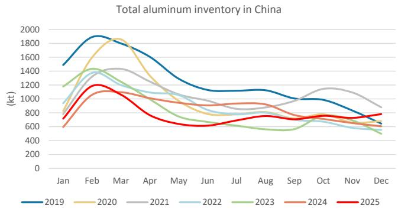

line chart

| Month | 2019  | 2020  | 2021  | 2022  | 2023  | 2024  | 2025  |
|-------|-------|-------|-------|-------|-------|-------|-------|
| Jan   | 1450  | 750   | 900   | 850   | 1150  | 600   | 700   |
| Feb   | 1900  | 1850  | 1450  | 1350  | 1450  | 1100  | 1200  |
| Mar   | 1850  | 1800  | 1400  | 1300  | 1350  | 1150  | 1150  |
| Apr   | 1700  | 1600  | 1350  | 1250  | 1200  | 1100  | 1050  |
| May   | 1500  | 1400  | 1250  | 1150  | 1100  | 1050  | 950   |
| Jun   | 1300  | 1200  | 1150  | 1050  | 1000  | 950   | 850   |
| Jul   | 1200  | 1100  | 1050  | 950   | 950   | 900   | 800   |
| Aug   | 1150  | 1050  | 950   | 900   | 900   | 850   | 750   |
| Sep   | 1100  | 1000  | 900   | 850   | 850   | 800   | 750   |
| Oct   | 1050  | 950   | 850   | 800   | 850   | 750   | 750   |
| Nov   | 950   | 900   | 800   | 750   | 850   | 750   | 750   |
| Dec   | 850   | 850   | 750   | 750   | 850   | 750   | 750   |

Source: NBS, BBG, SMM, China Customs, MS.

Exhibit94: China's apparent aluminium consumption vs. LME price  
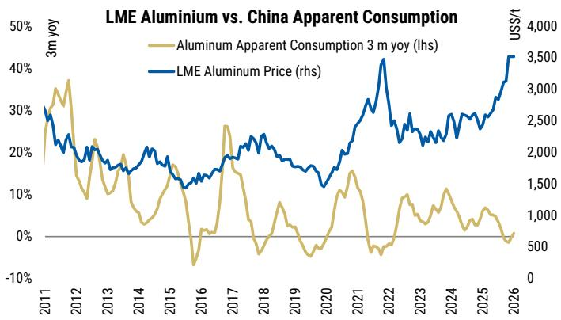

line chart

| Year | Aluminum Apparent Consumption 3 m yoy (lhs) | LME Aluminum Price (rhs) |
|------|---------------------------------------------|--------------------------|
| 2011 | ~35%                                        | ~3000                    |
| 2012 | ~20%                                        | ~2500                    |
| 2013 | ~15%                                        | ~2000                    |
| 2014 | ~10%                                        | ~1800                    |
| 2015 | ~5%                                         | ~1500                    |
| 2016 | ~-5%                                        | ~1200                    |
| 2017 | ~25%                                        | ~1800                    |
| 2018 | ~-5%                                        | ~2000                    |
| 2019 | ~5%                                         | ~1800                    |
| 2020 | ~-5%                                        | ~1500                    |
| 2021 | ~15%                                        | ~2500                    |
| 2022 | ~-5%                                        | ~4000                    |
| 2023 | ~10%                                        | ~3000                    |
| 2024 | ~5%                                         | ~3500                    |
| 2025 | ~-5%                                        | ~3800                    |
| 2026 | ~-5%                                        | ~4500                    |

Source: Bloomberg, MS.

Exhibit95: Raw Materials: China's Alumina Production  
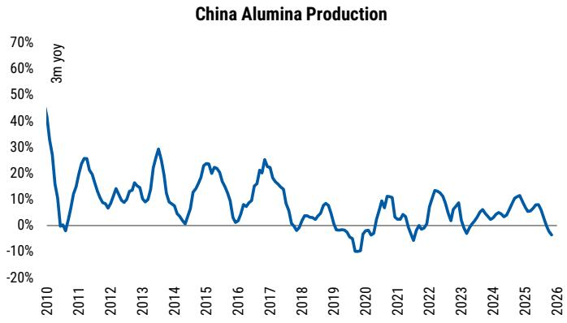

line chart

| Year | 3m yoy |
|------|--------|
| 2010 | ~45%   |
| 2011 | ~-5%   |
| 2012 | ~25%   |
| 2013 | ~15%   |
| 2014 | ~30%   |
| 2015 | ~-5%   |
| 2016 | ~25%   |
| 2017 | ~25%   |
| 2018 | ~-5%   |
| 2019 | ~5%    |
| 2020 | ~-15%  |
| 2021 | ~10%   |
| 2022 | ~-5%   |
| 2023 | ~15%   |
| 2024 | ~-5%   |
| 2025 | ~10%   |
| 2026 | ~-5%   |

Source: Bloomberg, MS.

Exhibit96: Raw Materials: Spot Alumina vs. China's Domestic Price  
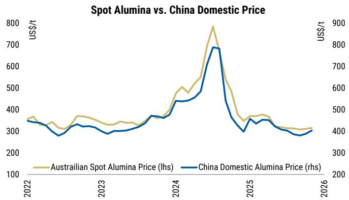

line chart

| Year | Australian Spot Alumina Price (lhs) | China Domestic Alumina Price (rhs) |
|------|--------------------------------------|-------------------------------------|
| 2022 | ~350                                 | ~350                                |
| 2023 | ~330                                 | ~300                                |
| 2024 | ~500                                 | ~450                                |
| 2025 | ~350                                 | ~300                                |
| 2026 | ~300                                 | ~300                                |

Source: Bloomberg, MS.

Exhibit 97: Monthly Alumina Balance in China  

bar chart

Monthly Alumina Balance in China (kt)
| Month | Alumina Balance (kt) |
|---|---|
| Jan-14 | -180 |
| Apr-04 | -200 |
| Jul-04 | -220 |
| Oct-14 | -360 |
| Jan-15 | -100 |
| Apr-15 | -100 |
| Jul-15 | -100 |
| Oct-15 | 600 |
| Jan-16 | 400 |
| Apr-16 | 100 |
| Jul-16 | 100 |
| Oct-16 | 300 |
| Jan-17 | 800 |
| Apr-17 | 1,501 |
| Jul-17 | 1,200 |
| Oct-17 | 1,300 |
| Jan-18 | 800 |
| Apr-18 | 500 |
| Jul-18 | 500 |
| Oct-18 | 300 |
| Jan-19 | 500 |
| Apr-19 | 700 |
| Jul-19 | 700 |
| Oct-19 | 600 |
| Jan-20 | 400 |
| Apr-20 | 500 |
| Jul-20 | 900 |
| Oct-20 | 800 |
| Jan-21 | 400 |
| Apr-21 | 400 |
| Jul-21 | 700 |
| Oct-21 | 950 |
| Jan-22 | 500 |
| Apr-22 | 700 |
| Jul-22 | 650 |
| Oct-22 | 400 |
| Jan-23 | 550 |
| Apr-23 | 450 |
| Jul-23 | 350 |
| Oct-23 | 250 |
| Jan-24 | 250 |
| Apr-24 | 150 |
| Jul-24 | 150 |
| Oct-24 | 350 |
| Jan-25 | 350 |
| Apr-25 | -150 |

Source: CEIC, MS. Note: The alumina balance = production - consumption + net import (export).

Exhibit99: Price Differentials: SHFE vs. LME  
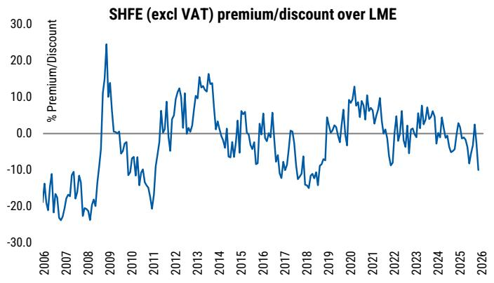

line chart

| Year | % Premium/Discount |
|------|---------------------|
| 2006 | -15.0               |
| 2007 | -25.0               |
| 2008 | -20.0               |
| 2009 | 25.0                |
| 2010 | -5.0                |
| 2011 | -20.0               |
| 2012 | 10.0                |
| 2013 | 15.0                |
| 2014 | 5.0                 |
| 2015 | -5.0                |
| 2016 | 5.0                 |
| 2017 | -10.0               |
| 2018 | -15.0               |
| 2019 | 5.0                 |
| 2020 | 15.0                |
| 2021 | 10.0                |
| 2022 | -5.0                |
| 2023 | 5.0                 |
| 2024 | 10.0                |
| 2025 | -5.0                |
| 2026 | -10.0               |

Source: Bloomberg, MS.

Exhibit101: Contango vs. Backwardation: Aluminium Futures Curve Movement  
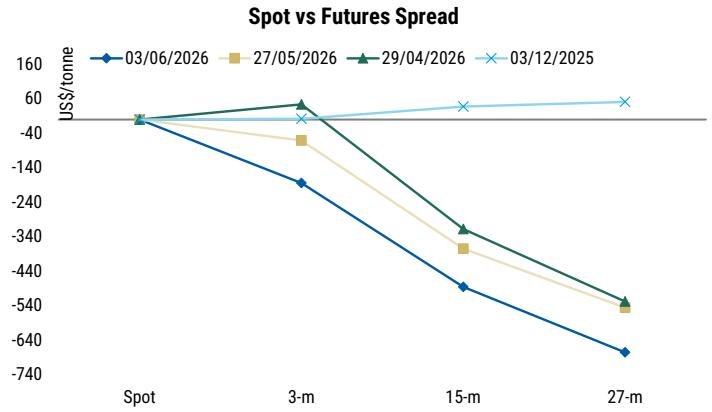

line chart

| Time Period | Spot     | 3-m      | 15-m     | 27-m     |
| ----------- | -------- | -------- | -------- | -------- |
| 03/06/2026  | -30      | -180     | -500     | -700     |
| 27/05/2026  | -30      | -40      | -400     | -550     |
| 29/04/2026  | -30      | 60       | -350     | -550     |
| 03/12/2025  | -30      | -30      | 60       | 60       |

Source: Bloomberg, MS.

Exhibit98: Aluminium World Production ex-China  
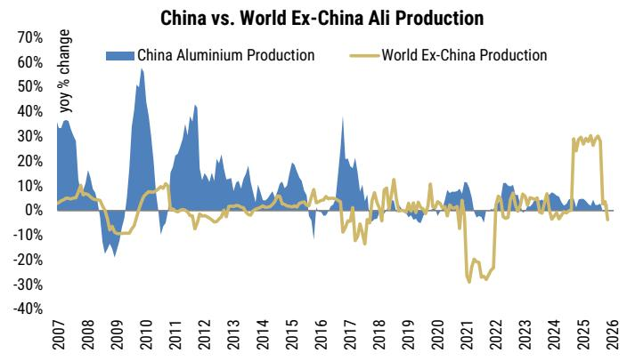

line chart

| Year | China Aluminium Production | World Ex-China Production |
|------|-----------------------------|----------------------------|
| 2007 | ~35%                        | ~5%                        |
| 2008 | ~15%                        | ~10%                       |
| 2009 | ~-20%                       | ~-10%                      |
| 2010 | ~60%                        | ~5%                        |
| 2011 | ~40%                        | ~0%                        |
| 2012 | ~20%                        | ~-5%                       |
| 2013 | ~15%                        | ~-5%                       |
| 2014 | ~10%                        | ~-5%                       |
| 2015 | ~15%                        | ~-5%                       |
| 2016 | ~-10%                       | ~-5%                       |
| 2017 | ~35%                        | ~-5%                       |
| 2018 | ~10%                        | ~-5%                       |
| 2019 | ~5%                         | ~-5%                       |
| 2020 | ~5%                         | ~-5%                       |
| 2021 | ~5%                         | ~-30%                      |
| 2022 | ~5%                         | ~-30%                      |
| 2023 | ~5%                         | ~-5%                       |
| 2024 | ~5%                         | ~-5%                       |
| 2025 | ~5%                         | ~30%                       |
| 2026 | ~5%                         | ~30%                       |

Source: Bloomberg, MS.

Exhibit100: Physical Demand: Aluminium Premia by Region  
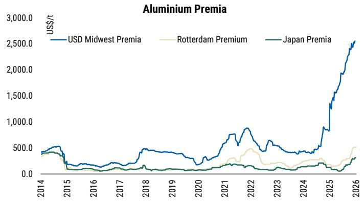

line chart

| Year | USD Midwest Premia | Rotterdam Premium | Japan Premia |
|------|---------------------|-------------------|--------------|
| 2014 | ~400.0              | ~300.0            | ~200.0       |
| 2015 | ~500.0              | ~100.0            | ~50.0        |
| 2016 | ~200.0              | ~50.0             | ~20.0        |
| 2017 | ~300.0              | ~100.0            | ~50.0        |
| 2018 | ~400.0              | ~150.0            | ~100.0       |
| 2019 | ~350.0              | ~150.0            | ~100.0       |
| 2020 | ~300.0              | ~150.0            | ~100.0       |
| 2021 | ~700.0              | ~300.0            | ~150.0       |
| 2022 | ~900.0              | ~400.0            | ~150.0       |
| 2023 | ~500.0              | ~300.0            | ~150.0       |
| 2024 | ~450.0              | ~250.0            | ~150.0       |
| 2025 | ~1,500.0            | ~350.0            | ~150.0       |
| 2026 | ~2,500.0            | ~500.0            | ~300.0       |

Source: Bloomberg, MS.

Exhibit 102: China Aluminium Exports: Breakdown, by Product Type  
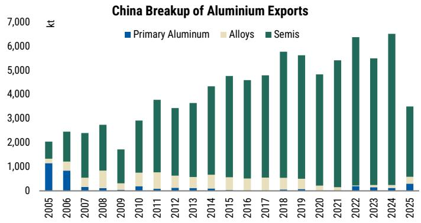

stacked bar chart

China Breakup of Aluminium Exports
| Year | Primary Aluminum (kt) | Alloys (kt) | Semis (kt) |
|---|---|---|---|
| 2005 | 1100 | 300 | 800 |
| 2006 | 900 | 400 | 1100 |
| 2007 | 150 | 400 | 1300 |
| 2008 | 150 | 600 | 1600 |
| 2009 | 150 | 300 | 1600 |
| 2010 | 200 | 500 | 1800 |
| 2011 | 150 | 600 | 2200 |
| 2012 | 150 | 500 | 2300 |
| 2013 | 150 | 500 | 2400 |
| 2014 | 150 | 500 | 2800 |
| 2015 | 150 | 500 | 3100 |
| 2016 | 150 | 500 | 3200 |
| 2017 | 150 | 500 | 3300 |
| 2018 | 150 | 500 | 3900 |
| 2019 | 150 | 500 | 4300 |
| 2020 | 150 | 300 | 4700 |
| 2021 | 150 | 300 | 5300 |
| 2022 | 250 | 300 | 6400 |
| 2023 | 150 | 300 | 5400 |
| 2024 | 150 | 300 | 6450 |
| 2025 | 350 | 350 | 3450 |

Source: Bloomberg, MS, 2021 \* YTD= Annualized figures.

Exhibit 103: China Aluminium Net Exports  

bar chart

China Net Exports (Semis-Aluminum Product)
| Year | Net Exports (kt) |
| :--- | :--- |
| 2020 | 345 |
| 2021 | -30 |
| 2022 | 470 |
| 2023 | 330 |
| 2024 | 360 |
| 2025 | 140 |
| Mar-26 | 490 |

Source: Bloomberg, MS.

Exhibit 104: Bauxite Price  

line chart

| Date    | Bauxite price (US$/t) |
|---------|------------------------|
| Mar-15  | 61.0                   |
| Jul-15  | 57.0                   |
| Nov-15  | 55.0                   |
| Mar-16  | 50.0                   |
| Jul-16  | 47.0                   |
| Nov-16  | 46.0                   |
| Mar-17  | 47.0                   |
| Jul-17  | 46.0                   |
| Nov-17  | 45.0                   |
| Mar-18  | 48.0                   |
| Jul-18  | 47.0                   |
| Nov-18  | 46.0                   |
| Mar-19  | 45.0                   |
| Jul-19  | 45.0                   |
| Nov-19  | 45.0                   |
| Mar-20  | 42.0                   |
| Jul-20  | 38.0                   |
| Nov-20  | 39.0                   |
| Mar-21  | 45.0                   |
| Jul-21  | 48.0                   |
| Nov-21  | 43.0                   |
| Mar-22  | 48.0                   |
| Jul-22  | 47.0                   |
| Nov-22  | 48.0                   |
| Mar-23  | 50.0                   |
| Jul-23  | 53.0                   |
| Nov-23  | 54.0                   |

Source: Asia Metal, MS.

Exhibit 105: China – Bauxite Imports, by Country  
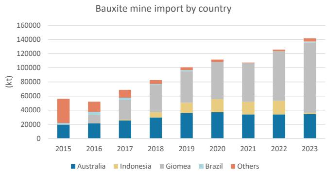

stacked bar chart

Bauxite mine import by country
| Year | Australia (kt) | Indonesia (kt) | Giomea (kt) | Brazil (kt) | Others (kt) |
| :--- | :--- | :--- | :--- | :--- | :--- |
| 2015 | 20000 | 0 | 0 | 0 | 40000 |
| 2016 | 22000 | 0 | 8000 | 1000 | 15000 |
| 2017 | 25000 | 5000 | 25000 | 0 | 15000 |
| 2018 | 28000 | 10000 | 35000 | 0 | 5000 |
| 2019 | 35000 | 15000 | 45000 | 0 | 5000 |
| 2020 | 37000 | 18000 | 55000 | 0 | 5000 |
| 2021 | 34000 | 16000 | 58000 | 0 | 5000 |
| 2022 | 34000 | 17000 | 65000 | 0 | 5000 |
| 2023 | 35000 | 15000 | 95000 | 150 | 5000 |

Source: Bloomberg, MS.

Exhibit 106: Aluminium Cost Curve  

line chart

| Cumulative Production (Mt) | c1 cost curve | spot price | 90th percentile | 50th percentile |
| -------------------------- | ------------- | ---------- | --------------- | --------------- |
| -                          | 1400          | 3500       | 2000            | 1800            |
| 75                         | 2800          | 3500       | 2000            | 1800            |

Source: Wood Mackenzie, MS

## Commodities: Coal

Exhibit107: China – Thermal-based power generation vs. coal apparent monthly consumption  
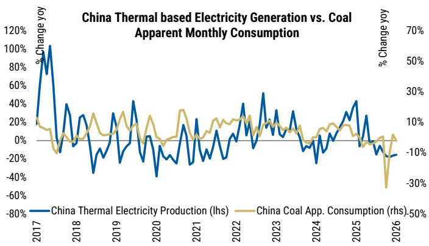

line chart

| Year | China Thermal Electricity Production (lhs) | China Coal App. Consumption (rhs) |
|------|---------------------------------------------|------------------------------------|
| 2017 | ~100%                                       | ~10%                               |
| 2018 | ~-40%                                       | ~-10%                              |
| 2019 | ~-20%                                       | ~-5%                               |
| 2020 | ~-40%                                       | ~-10%                              |
| 2021 | ~-20%                                       | ~-5%                               |
| 2022 | ~-10%                                       | ~-10%                              |
| 2023 | ~50%                                        | ~-5%                               |
| 2024 | ~-20%                                       | ~-10%                              |
| 2025 | ~40%                                        | ~-5%                               |
| 2026 | ~-20%                                       | ~-30%                              |

Source: NBS, Bloomberg, MS. Note: Apparent consumption is calculated as domestic raw coal output less net coal exports.

Exhibit108: Inventories: Qinhuangdao port coal stocks  
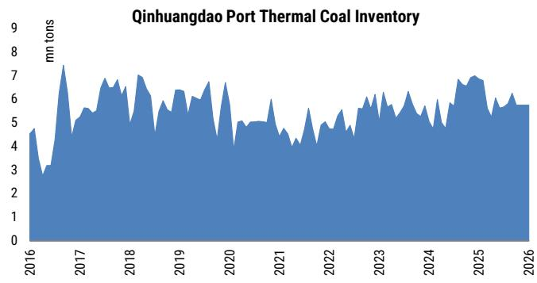

area chart

Qinhuangdao Port Thermal Coal Inventory
| Year | Thermal Coal Inventory (mn tons) |
| :--- | :--- |
| 2016 | 4.5 |
| 2017 | 7.5 |
| 2018 | 7.0 |
| 2019 | 6.5 |
| 2020 | 6.8 |
| 2021 | 5.0 |
| 2022 | 5.5 |
| 2023 | 6.0 |
| 2024 | 5.8 |
| 2025 | 7.0 |
| 2026 | 5.8 |

Source: Bloomberg, MS.

Exhibit109: China – Coal imports vs. prices  
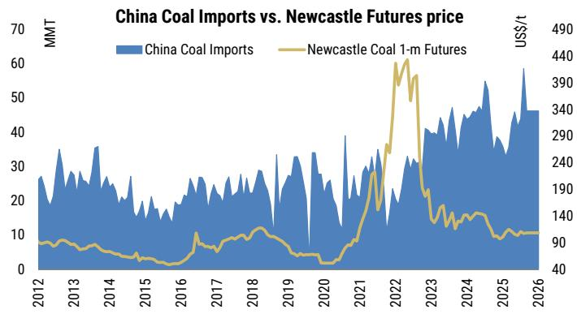

line chart

| Year | China Coal Imports (MMT) | Newcastle Coal 1-m Futures (US$/t) |
|------|--------------------------|------------------------------------|
| 2012 | ~25                      | ~80                                |
| 2013 | ~35                      | ~70                                |
| 2014 | ~30                      | ~60                                |
| 2015 | ~25                      | ~50                                |
| 2016 | ~20                      | ~40                                |
| 2017 | ~25                      | ~60                                |
| 2018 | ~30                      | ~80                                |
| 2019 | ~35                      | ~100                               |
| 2020 | ~30                      | ~80                                |
| 2021 | ~40                      | ~150                               |
| 2022 | ~55                      | ~440                               |
| 2023 | ~45                      | ~140                               |
| 2024 | ~50                      | ~130                               |
| 2025 | ~55                      | ~110                               |
| 2026 | ~45                      | ~100                               |

Source: Bloomberg, MS.

Exhibit110: Inventories: China's coking coal inventories at steel mills  
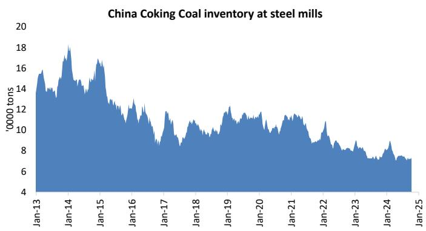

line chart

| Date   | Inventory (in '000 tons) |
|--------|--------------------------|
| Jan-13 | ~15                      |
| Jan-14 | ~18                      |
| Jan-15 | ~16                      |
| Jan-16 | ~13                      |
| Jan-17 | ~11                      |
| Jan-18 | ~10                      |
| Jan-19 | ~12                      |
| Jan-20 | ~11                      |
| Jan-21 | ~11                      |
| Jan-22 | ~9                       |
| Jan-23 | ~8                       |
| Jan-24 | ~7                       |
| Jan-25 | ~7                       |

Source: Mysteel, Bloomberg, MS.

Exhibit111: China's Coking Coal Prices – Mine-mouth vs. FOR  
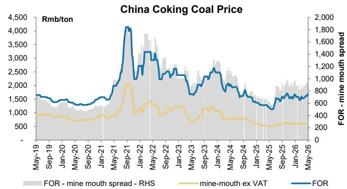

line chart

| Date    | FOR (Rmb/ton) | mine-mouth ex VAT (Rmb/ton) | FOR - mine mouth spread (Rmb/ton) |
|---------|---------------|-----------------------------|------------------------------------|
| May-19  | ~1,700        | ~1,000                      | ~800                               |
| Sep-19  | ~1,600        | ~950                        | ~750                               |
| Jan-20  | ~1,500        | ~900                        | ~700                               |
| May-20  | ~1,400        | ~850                        | ~650                               |
| Sep-20  | ~1,300        | ~800                        | ~600                               |
| Jan-21  | ~1,400        | ~850                        | ~650                               |
| May-21  | ~1,800        | ~1,000                      | ~750                               |
| Sep-21  | ~4,200        | ~2,000                      | ~1,800                             |
| Jan-22  | ~3,500        | ~1,500                      | ~1,400                             |
| May-22  | ~3,200        | ~1,400                      | ~1,300                             |
| Sep-22  | ~2,800        | ~1,300                      | ~1,200                             |
| Jan-23  | ~2,500        | ~1,200                      | ~1,100                             |
| May-23  | ~2,300        | ~1,100                      | ~1,000                             |
| Sep-23  | ~2,500        | ~1,200                      | ~950                               |
| Jan-24  | ~2,700        | ~1,300                      | ~900                               |
| May-24  | ~2,500        | ~1,200                      | ~850                               |
| Sep-24  | ~2,300        | ~1,100                      | ~800                               |
| Jan-25  | ~2,100        | ~1,000                      | ~750                               |
| May-25  | ~1,900        | ~950                        | ~700                               |
| Sep-25  | ~1,800        | ~900                        | ~650                               |
| Jan-26  | ~1,750        | ~850                        | ~650                               |
| May-26  | ~1,750        | ~850                        | ~650                               |

Source: CCTD, Bloomberg, MS.

Exhibit112: Coal Inventory at QHD Port  
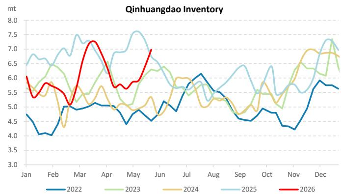

line chart

| Month | 2022 | 2023 | 2024 | 2025 | 2026 |
|-------|------|------|------|------|------|
| Jan   | 4.8  | 5.7  | 5.6  | 6.5  | 6.1  |
| Feb   | 4.1  | 5.9  | 5.8  | 6.8  | 5.7  |
| Mar   | 5.0  | 5.5  | 5.0  | 7.5  | 7.3  |
| Apr   | 5.1  | 5.8  | 5.7  | 7.0  | 5.8  |
| May   | 4.5  | 6.0  | 5.5  | 7.6  | 6.0  |
| Jun   | 5.2  | 6.3  | 5.8  | 6.8  | 7.0  |
| Jul   | 5.8  | 5.9  | 6.0  | 6.5  | -    |
| Aug   | 6.1  | 5.7  | 5.8  | 6.3  | -    |
| Sep   | 5.5  | 5.5  | 5.0  | 6.0  | -    |
| Oct   | 4.8  | 5.8  | 5.5  | 6.5  | -    |
| Nov   | 4.3  | 6.0  | 6.0  | 5.8  | -    |
| Dec   | 5.8  | 6.5  | 6.8  | 7.3  | -    |

Source: Sxcoal, MS.

Exhibit 113: Thermal coal cost curve  
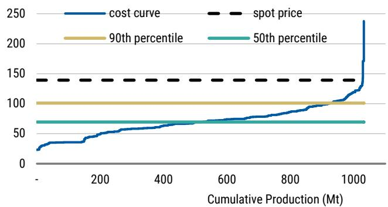

line chart

| Cumulative Production (Mt) | cost curve | spot price | 90th percentile | 50th percentile |
| -------------------------- | ---------- | ---------- | --------------- | --------------- |
| -                          | 25         | 140        | 100             | 70              |
| 1000                       | 240        | 140        | 100             | 70              |

Source: Wood Mackenzie, MS.

Exhibit 114: Met coal cost curve  
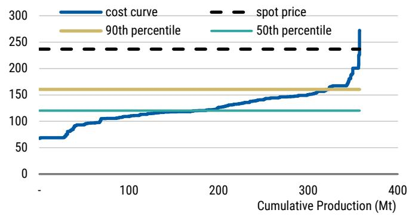

line chart

| Cumulative Production (Mt) | cost curve | spot price | 90th percentile | 50th percentile |
| -------------------------- | ---------- | ---------- | --------------- | --------------- |
| -                          | 70         | 240        | 160             | 120             |
| 100                        | 110        | 240        | 160             | 120             |
| 200                        | 130        | 240        | 160             | 120             |
| 300                        | 150        | 240        | 160             | 120             |
| 350                        | 270        | 240        | 160             | 120             |

Source: Wood Mackenzie, MS.

## Commodities: Copper

Exhibit 115: Consumption of Copper in China  
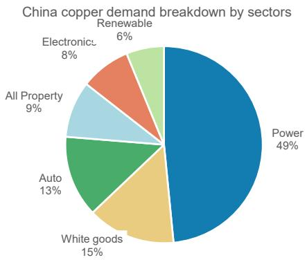

pie chart

China copper demand breakdown by sectors
| Sector | Percentage (%) |
| :--- | :--- |
| Power | 49 |
| White goods | 15 |
| Auto | 13 |
| All Property | 9 |
| Electronics | 8 |
| Renewable | 6 |

Source: Antaike, MS.

Exhibit117: Exchange and Bonded Warehouse Stocks vs. Days of Consumption  
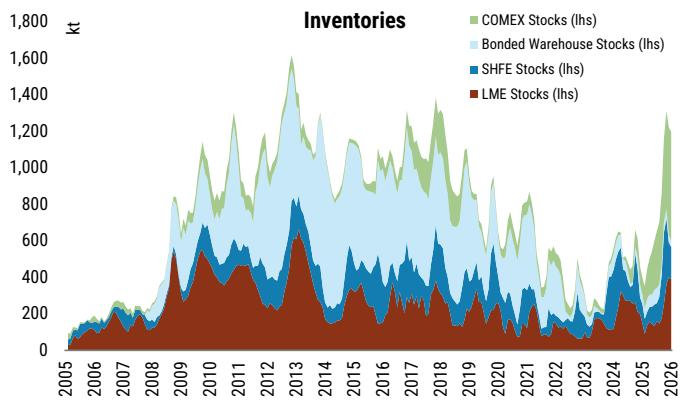

area chart

| Year | COMEX Stocks (lhs) | Bonded Warehouse Stocks (lhs) | SHFE Stocks (lhs) | LME Stocks (lhs) |
|------|--------------------|-------------------------------|-------------------|------------------|
| 2005 | ~50                | ~100                          | ~50               | ~50              |
| 2006 | ~70                | ~150                          | ~70               | ~70              |
| 2007 | ~100               | ~200                          | ~100              | ~100             |
| 2008 | ~150               | ~300                          | ~150              | ~150             |
| 2009 | ~200               | ~400                          | ~200              | ~200             |
| 2010 | ~300               | ~500                          | ~300              | ~300             |
| 2011 | ~400               | ~600                          | ~400              | ~400             |
| 2012 | ~500               | ~700                          | ~500              | ~500             |
| 2013 | ~600               | ~800                          | ~600              | ~600             |
| 2014 | ~700               | ~900                          | ~700              | ~700             |
| 2015 | ~800               | ~1,000                        | ~800              | ~800             |
| 2016 | ~900               | ~1,100                        | ~900              | ~900             |
| 2017 | ~1,000             | ~1,200                        | ~1,000            | ~1,000           |
| 2018 | ~1,100             | ~1,300                        | ~1,100            | ~1,100           |
| 2019 | ~1,200             | ~1,400                        | ~1,200            | ~1,200           |
| 2020 | ~1,300             | ~1,500                        | ~1,300            | ~1,300           |
| 2021 | ~1,400             | ~1,600                        | ~1,400            | ~1,400           |
| 2022 | ~1,500             | ~1,700                        | ~1,500            | ~1,500           |
| 2023 | ~1,600             | ~1,800                        | ~1,600            | ~1,600           |
| 2024 | ~1,700             | ~1,900                        | ~1,700            | ~1,700           |
| 2025 | ~1,800             | ~2,000                        | ~1,800            | ~1,800           |
| 2026 | ~2,375             | ~2,375                        | ~2,375            | ~2,375           |

Source: Bloomberg, ICSG, MS.

Exhibit119: CFTC speculative net length  
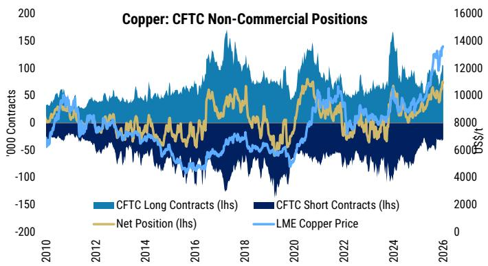

line chart

| Year | CFTC Long Contracts (lhs) | CFTC Short Contracts (lhs) | Net Position (lhs) | LME Copper Price |
|------|---------------------------|----------------------------|--------------------|------------------|
| 2010 | ~30                       | ~-50                       | ~0                 | ~-500            |
| 2012 | ~40                       | ~-100                      | ~100               | ~-1000           |
| 2014 | ~50                       | ~-150                      | ~200               | ~-1500           |
| 2016 | ~60                       | ~-200                      | ~300               | ~-2000           |
| 2018 | ~150                      | ~-150                      | ~500               | ~-1500           |
| 2020 | ~100                      | ~-100                      | ~700               | ~-1000           |
| 2022 | ~120                      | ~-50                       | ~900               | ~-500            |
| 2024 | ~140                      | ~-50                       | ~1100              | ~-500            |
| 2026 | ~160                      | ~-50                       | ~1300              | ~-500            |

Source: Bloomberg, CFTC, MS.

Exhibit116: Grid Investments, Car Sales and Air Conditioner Sales  
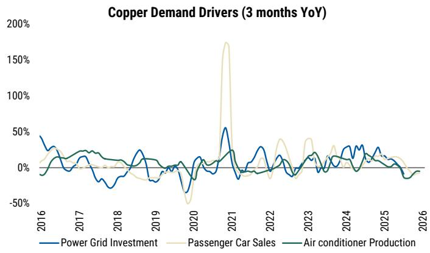

line chart

| Year | Power Grid Investment | Passenger Car Sales | Air conditioner Production |
|------|------------------------|---------------------|----------------------------|
| 2016 | ~40%                   | ~10%                | ~0%                        |
| 2017 | ~20%                   | ~15%                | ~10%                       |
| 2018 | ~-20%                  | ~-10%               | ~5%                        |
| 2019 | ~20%                   | ~-5%                | ~0%                        |
| 2020 | ~-50%                  | ~-30%               | ~-5%                       |
| 2021 | ~50%                   | ~180%               | ~20%                       |
| 2022 | ~30%                   | ~40%                | ~10%                       |
| 2023 | ~-10%                  | ~40%                | ~5%                        |
| 2024 | ~30%                   | ~20%                | ~10%                       |
| 2025 | ~20%                   | ~10%                | ~5%                        |
| 2026 | ~-10%                  | ~-5%                | ~-5%                       |

Source: Bloomberg, MS.

Exhibit118: China Copper Price vs. Apparent Consumption  
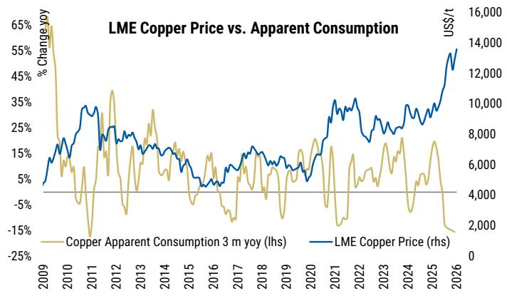

line chart

| Year | Copper Apparent Consumption 3 m yoy (lhs) | LME Copper Price (rhs) |
|------|-------------------------------------------|------------------------|
| 2009 | ~65%                                      | ~4,000                 |
| 2010 | ~15%                                      | ~6,000                 |
| 2011 | ~-15%                                     | ~8,000                 |
| 2012 | ~35%                                      | ~10,000                |
| 2013 | ~15%                                      | ~8,000                 |
| 2014 | ~25%                                      | ~6,000                 |
| 2015 | ~15%                                      | ~4,000                 |
| 2016 | ~5%                                       | ~2,000                 |
| 2017 | ~15%                                      | ~4,000                 |
| 2018 | ~15%                                      | ~6,000                 |
| 2019 | ~15%                                      | ~8,000                 |
| 2020 | ~15%                                      | ~10,000                |
| 2021 | ~15%                                      | ~12,000                |
| 2022 | ~15%                                      | ~14,000                |
| 2023 | ~15%                                      | ~16,000                |
| 2024 | ~15%                                      | ~18,000                |
| 2025 | ~15%                                      | ~20,000                |
| 2026 | ~-15%                                     | ~25,000                |

Source: Bloomberg, MS. \*Apparent Consumption is calculated as refined production less net exports and change in SHFE stocks.

Exhibit120: China – refined copper imports  
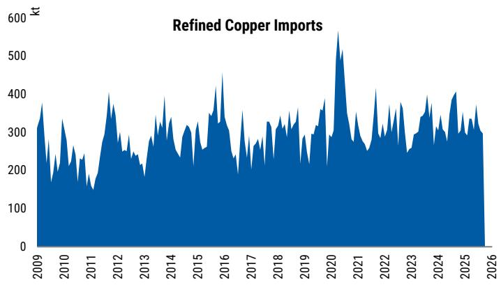

line chart

| Year | Refined Copper Imports (kt) |
| ---- | ---------------------------- |
| 2009 | ~350                         |
| 2010 | ~300                         |
| 2011 | ~250                         |
| 2012 | ~400                         |
| 2013 | ~250                         |
| 2014 | ~350                         |
| 2015 | ~300                         |
| 2016 | ~450                         |
| 2017 | ~250                         |
| 2018 | ~300                         |
| 2019 | ~350                         |
| 2020 | ~550                         |
| 2021 | ~300                         |
| 2022 | ~400                         |
| 2023 | ~350                         |
| 2024 | ~400                         |
| 2025 | ~350                         |
| 2026 | ~300                         |

Source: Bloomberg, MS.

Exhibit 121: LME Speculative Net Position  
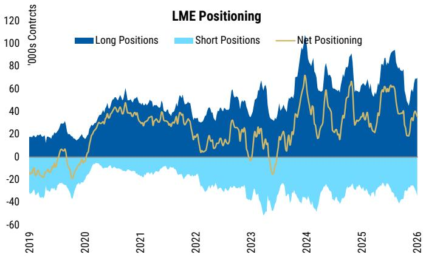

line chart

| Year | Long Positions | Short Positions | Net Positioning |
|------|-----------------|------------------|-----------------|
| 2019 | ~15             | ~-30             | ~-10            |
| 2020 | ~30             | ~-20             | ~-5             |
| 2021 | ~40             | ~-15             | ~5              |
| 2022 | ~50             | ~-25             | ~10             |
| 2023 | ~60             | ~-30             | ~15             |
| 2024 | ~100            | ~-40             | ~70             |
| 2025 | ~80             | ~-35             | ~60             |
| 2026 | ~70             | ~-30             | ~40             |

Source: LME, MS.

Exhibit122: Physical Demand: Copper Premia, by Region  
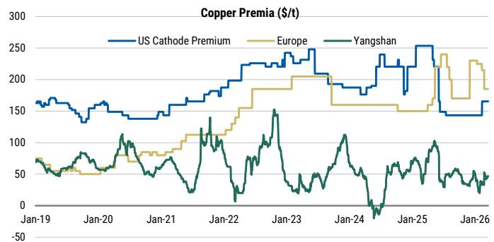

line chart

| Date   | US Cathode Premium | Europe | Yangshan |
|--------|--------------------|--------|----------|
| Jan-19 | ~160               | ~70    | ~60      |
| Jan-20 | ~140               | ~60    | ~80      |
| Jan-21 | ~150               | ~80    | ~100     |
| Jan-22 | ~180               | ~120   | ~150     |
| Jan-23 | ~220               | ~180   | ~150     |
| Jan-24 | ~190               | ~160   | ~100     |
| Jan-25 | ~250               | ~240   | ~100     |
| Jan-26 | ~160               | ~200   | ~50      |

Source: Argus, Bloomberg

Exhibit123: Copper Treatment Charges (TCs) vs. Price  
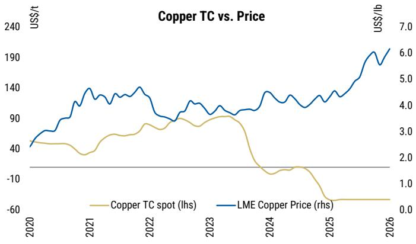

line chart

| Year | Copper TC spot (lhs) | LME Copper Price (rhs) |
|------|----------------------|-------------------------|
| 2020 | ~40                  | ~3.0                    |
| 2021 | ~35                  | ~4.5                    |
| 2022 | ~80                  | ~3.5                    |
| 2023 | ~90                  | ~4.0                    |
| 2024 | ~-10                 | ~4.5                    |
| 2025 | ~-60                 | ~5.5                    |
| 2026 | ~-60                 | ~6.0                    |

Source: Bloomberg, Wood Mackenzie, MS.

Exhibit 124: Chile: Copper Production  
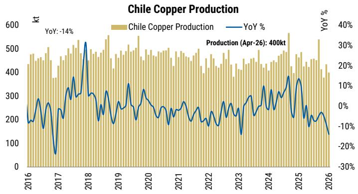

bar-line hybrid chart

| Year | Chile Copper Production (kt) | YoY (%) |
|------|-------------------------------|---------|
| 2016 | ~450                          | ~-14    |
| 2017 | ~350                          | ~-14    |
| 2018 | ~550                          | ~-14    |
| 2019 | ~500                          | ~-14    |
| 2020 | ~480                          | ~-14    |
| 2021 | ~470                          | ~-14    |
| 2022 | ~460                          | ~-14    |
| 2023 | ~450                          | ~-14    |
| 2024 | ~470                          | ~-14    |
| 2025 | ~480                          | ~-14    |
| 2026 | ~400                          | ~-14    |

Source: Cochilco, Bloomberg, MS.

Exhibit125: Contango vs. Backwardation: Copper Futures Curve Movement  
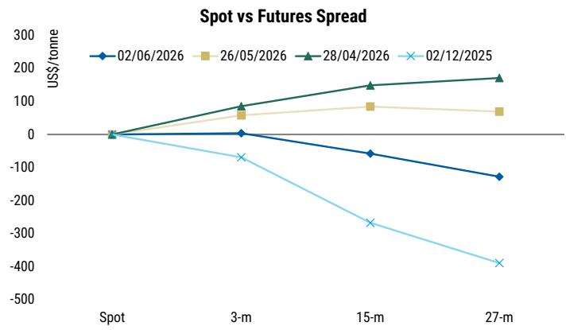

line chart

| Period     | 02/06/2026 | 26/05/2026 | 28/04/2026 | 02/12/2025 |
| ---------- | ---------- | ---------- | ---------- | ---------- |
| Spot       | 0          | 0          | 0          | 0          |
| 3-m        | 0          | 50         | 100        | -100       |
| 15-m       | -50        | 75         | 150        | -300       |
| 27-m       | -150       | 75         | 175        | -400       |

Source: Bloomberg, MS.

Exhibit 126: Copper Cost Curve  
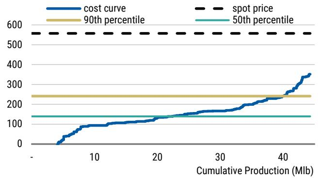

line chart

| Cumulative Production (Mlb) | cost curve | spot price | 90th percentile | 50th percentile |
| --------------------------- | ---------- | ---------- | --------------- | --------------- |
| -                           | 0          | 550        | 250             | 150             |
| 10                          | 100        | 550        | 250             | 150             |
| 20                          | 150        | 550        | 250             | 150             |
| 30                          | 200        | 550        | 250             | 150             |
| 40                          | 300        | 550        | 250             | 150             |
| 45                          | 350        | 550        | 250             | 150             |

Source: Wood Mackenzie, MS.

Exhibit 127: Copper Mine Production  
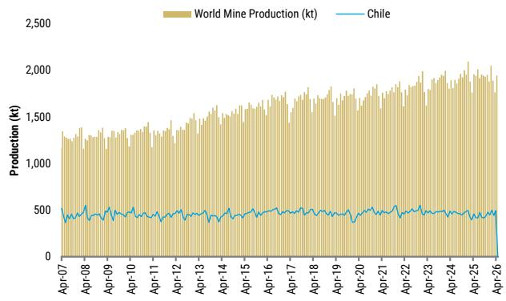

bar-line hybrid chart

| Date   | World Mine Production (kt) | Chile |
|--------|----------------------------|-------|
| Apr-07 | ~1300                      | ~500  |
| Apr-08 | ~1350                      | ~550  |
| Apr-09 | ~1300                      | ~500  |
| Apr-10 | ~1350                      | ~500  |
| Apr-11 | ~1400                      | ~500  |
| Apr-12 | ~1450                      | ~500  |
| Apr-13 | ~1500                      | ~500  |
| Apr-14 | ~1550                      | ~500  |
| Apr-15 | ~1600                      | ~500  |
| Apr-16 | ~1650                      | ~500  |
| Apr-17 | ~1700                      | ~500  |
| Apr-18 | ~1750                      | ~500  |
| Apr-19 | ~1800                      | ~500  |
| Apr-20 | ~1850                      | ~500  |
| Apr-21 | ~1900                      | ~500  |
| Apr-22 | ~1950                      | ~500  |
| Apr-23 | ~2000                      | ~500  |
| Apr-24 | ~2050                      | ~500  |
| Apr-25 | ~2100                      | ~500  |
| Apr-26 | ~2150                      | ~500  |

Source: Refinitiv, MS.

Exhibit 128: Global Copper Refined Production  

stacked bar chart

| Date    | Primary | Secondary |
|---------|---------|-----------|
| Apr-07  | ~350    | ~100      |
| Apr-08  | ~360    | ~110      |
| Apr-09  | ~370    | ~120      |
| Apr-10  | ~380    | ~130      |
| Apr-11  | ~390    | ~140      |
| Apr-12  | ~400    | ~150      |
| Apr-13  | ~410    | ~160      |
| Apr-14  | ~420    | ~170      |
| Apr-15  | ~430    | ~180      |
| Apr-16  | ~440    | ~190      |
| Apr-17  | ~450    | ~200      |
| Apr-18  | ~460    | ~210      |
| Apr-19  | ~470    | ~220      |
| Apr-20  | ~480    | ~230      |
| Apr-21  | ~490    | ~240      |
| Apr-22  | ~500    | ~250      |
| Apr-23  | ~510    | ~260      |
| Apr-24  | ~520    | ~270      |
| Apr-25  | ~530    | ~280      |
| Apr-26  | ~540    | ~290      |

Source: Refinitiv, MS.

Exhibit 129: Copper Mine Production (YoY)  

line chart

| Date   | World | Chile |
|--------|-------|-------|
| Apr-07 | ~5%   | ~5%   |
| Apr-08 | ~-10% | ~10%  |
| Apr-09 | ~-5%  | ~20%  |
| Apr-10 | ~-5%  | ~5%   |
| Apr-11 | ~-5%  | ~5%   |
| Apr-12 | ~-5%  | ~5%   |
| Apr-13 | ~-5%  | ~-20% |
| Apr-14 | ~-5%  | ~5%   |
| Apr-15 | ~-5%  | ~10%  |
| Apr-16 | ~-5%  | ~5%   |
| Apr-17 | ~-5%  | ~5%   |
| Apr-18 | ~-5%  | ~5%   |
| Apr-19 | ~-5%  | ~-20% |
| Apr-20 | ~-5%  | ~30%  |
| Apr-21 | ~-5%  | ~5%   |
| Apr-22 | ~-5%  | ~5%   |
| Apr-23 | ~-5%  | ~5%   |
| Apr-24 | ~-5%  | ~5%   |
| Apr-25 | ~-5%  | ~-10% |
| Apr-26 | ~-5%  | ~25%  |

Source: Refinitiv, MS.

Exhibit 130: Global Copper Refined Production (YoY)  

line chart

| Date   | Primary | Secondary |
|--------|---------|-----------|
| Apr-07 | ~0%     | ~20%      |
| Apr-08 | ~0%     | ~10%      |
| Apr-09 | ~0%     | ~-20%     |
| Apr-10 | ~0%     | ~45%      |
| Apr-11 | ~0%     | ~10%      |
| Apr-12 | ~0%     | ~25%      |
| Apr-13 | ~0%     | ~10%      |
| Apr-14 | ~0%     | ~20%      |
| Apr-15 | ~0%     | ~10%      |
| Apr-16 | ~0%     | ~0%       |
| Apr-17 | ~0%     | ~0%       |
| Apr-18 | ~0%     | ~0%       |
| Apr-19 | ~0%     | ~-20%     |
| Apr-20 | ~0%     | ~-10%     |
| Apr-21 | ~0%     | ~0%       |
| Apr-22 | ~0%     | ~0%       |
| Apr-23 | ~0%     | ~0%       |
| Apr-24 | ~0%     | ~0%       |
| Apr-25 | ~0%     | ~25%      |
| Apr-26 | ~0%     | ~30%      |

Source: Refinitiv, MS.

Exhibit 131: South China Copper Smelters Capacity Utilization  
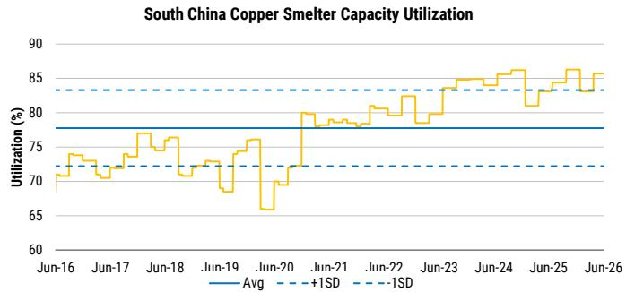

line chart

| Date   | Utilization (%) |
|--------|-----------------|
| Jun-16 | 70              |
| Jun-17 | 72              |
| Jun-18 | 75              |
| Jun-19 | 73              |
| Jun-20 | 65              |
| Jun-21 | 80              |
| Jun-22 | 82              |
| Jun-23 | 84              |
| Jun-24 | 85              |
| Jun-25 | 83              |
| Jun-26 | 86              |

Source: MS.

Exhibit 132: Global Refined Balance Surplus/Deficit  
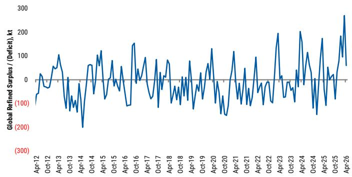

line chart

| Date    | Global Refined Surplus / (Deficit), kt |
|---------|----------------------------------------|
| Apr-12  | (100)                                  |
| Oct-12  | (0)                                    |
| Apr-13  | (100)                                  |
| Oct-13  | (0)                                    |
| Apr-14  | (200)                                  |
| Oct-14  | (0)                                    |
| Apr-15  | (100)                                  |
| Oct-15  | (0)                                    |
| Apr-16  | (100)                                  |
| Oct-16  | (0)                                    |
| Apr-17  | (100)                                  |
| Oct-17  | (0)                                    |
| Apr-18  | (100)                                  |
| Oct-18  | (0)                                    |
| Apr-19  | (100)                                  |
| Oct-19  | (0)                                    |
| Apr-20  | (100)                                  |
| Oct-20  | (0)                                    |
| Apr-21  | (100)                                  |
| Oct-21  | (0)                                    |
| Apr-22  | (100)                                  |
| Oct-22  | (0)                                    |
| Apr-23  | (200)                                  |
| Oct-23  | (0)                                    |
| Apr-24  | (100)                                  |
| Oct-24  | (0)                                    |
| Apr-25  | (100)                                  |
| Oct-25  | (0)                                    |
| Apr-26  | (250)                                  |

Source: MS.

## Commodities: Gold and Precious Metals

Exhibit133: ETF gold holdings vs. gold price  
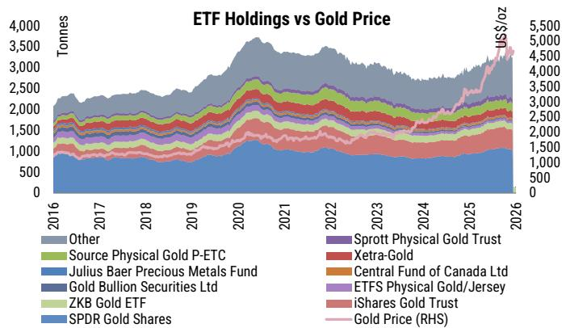

area chart

| Year | SPDR Gold Shares | ZKB Gold ETF | Julius Baer Precious Metals Fund | Source Physical Gold P-ETC | Sprott Physical Gold Trust | Xetra-Gold | Central Fund of Canada Ltd | ETFS Physical Gold/Jersey | iShares Gold Trust | Gold Price (RHS) |
|------|------------------|--------------|----------------------------------|----------------------------|---------------------------|------------|-----------------------------|---------------------------|--------------------|------------------|
| 2016 | ~1,000           | ~500         | ~300                             | ~200                       | ~100                      | ~80        | ~60                         | ~50                       | ~40                | ~300             |
| 2017 | ~1,200           | ~600         | ~400                             | ~250                       | ~120                      | ~90        | ~70                         | ~60                       | ~50                | ~350             |
| 2018 | ~1,300           | ~700         | ~500                             | ~300                       | ~140                      | ~100       | ~80                         | ~70                       | ~60                | ~400             |
| 2019 | ~1,400           | ~800         | ~600                             | ~350                       | ~160                      | ~110       | ~90                         | ~80                       | ~70                | ~450             |
| 2020 | ~1,500           | ~900         | ~700                             | ~400                       | ~180                      | ~120       | ~100                        | ~90                       | ~80                | ~500             |
| 2021 | ~1,600           | ~1,000       | ~800                             | ~450                       | ~2,00                     | ~130       | ~110                        | ~100                      | ~90                | ~550             |
| 2022 | ~1,550           | ~950         | ~750                             | ~425                       | ~1,95                     | ~125       | ~105                        | ~95                       | ~85                | ~525             |
| 2023 | ~1,500           | ~900         | ~700                             | ~400                       | ~1,90                     | ~120       | ~100                        | ~90                       | ~80                | ~500             |
| 2024 | ~1,450           | ~850         | ~650                             | ~375                       | ~1,85                     | ~115       | ~95                         | ~85                       | ~75                | ~475             |
| 2025 | ~1,400           | ~800         | ~600                             | ~350                       | ~1,80                     | ~110       | ~90                         | ~80                       | ~70                | ~450             |
| 2026 | ~1,350           | ~750         | ~550                             | ~325                       | ~1,75                     | ~105       | ~85                         | ~75                       | ~65                | ~425             |

Source: Bloomberg, MS (Other includes: ETFS Gold Trust, Central GoldTrust, Royal Canadian Mint - Canadian Gold Reserves, iShares Gold Bullion ETF, db Physical Gold ETC, UBS ETF CH-Gold CHF hedged CHF, db Physical Gold Euro Hedged ETC, Pictet CH Precious Metals Fund - Physical Gold, iShares Gold CH, iShares Gold CHF Hedged CH, db Physical Gold ETC EUR, ETFS Physical Swiss Gold, db Physical Gold SGD Hedged ETC, db Physical Gold CHF Hedged ETC, ETFS Physical Swiss Gold, EUWAX Gold, FinEx Gold ETF USD, iShares Physical Gold ETC, iShares Gold EUR Hedged CH, Raiffeisen ETF - Solid Gold Ounces - AC, Raiffeisen ETF - Solid Gold, RBS Physical Gold ETCi, RBS Physical Gold ETC, UBS ETF CH-Gold EUR hedged EUR A-dis, UBS ETF CH-Gold USD, Reliance ETF Gold BeES, SBI-ETF Gold, Japan Physical Gold ETF, ValueGold ETF, NewGold Issuer Ltd, ETFS Metal Securities Australia Ltd - ETFS Physical Gold, CS Institutional Fund II CH - Gold Fund, BMG Gold Bullion Fund, Sprott Gold Bullion Fund, Huaan Yifu Gold ETF, E Fund Gold Tradable Open-end Securities Investment Fund, HDFC Gold Exchange Traded Fund, Kotak Gold ETF, UTI-Gold Exchange Traded Fund). No investment recommendation is made with respect to any of the ETFs or mutual funds referenced herein. Investors should not rely on the information included in making investment decisions with respect to those funds.

Exhibit134: Gold price vs. US five-year TIPS  
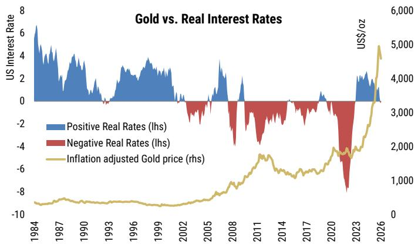

line chart

| Year | Positive Real Rates (lhs) | Negative Real Rates (lhs) | Inflation adjusted Gold price (rhs) |
|------|---------------------------|---------------------------|-------------------------------------|
| 1984 | ~7                        | -                         | ~0                                  |
| 1987 | ~5                        | -                         | ~0                                  |
| 1990 | ~4                        | -                         | ~0                                  |
| 1993 | ~3                        | -                         | ~0                                  |
| 1996 | ~4                        | -                         | ~0                                  |
| 1999 | ~3                        | -                         | ~0                                  |
| 2002 | ~2                        | -                         | ~0                                  |
| 2005 | ~1                        | -                         | ~0                                  |
| 2008 | ~3                        | -                         | ~0                                  |
| 2011 | ~2                        | -                         | ~0                                  |
| 2014 | ~1                        | -                         | ~0                                  |
| 2017 | ~1                        | -                         | ~0                                  |
| 2020 | ~2                        | -                         | ~0                                  |
| 2023 | ~3                        | -                         | ~0                                  |
| 2026 | ~5                        | -                         | ~500                                |

Source: Bloomberg, MS.

Exhibit135: Gold performance vs. volatility index vs. dollar index  
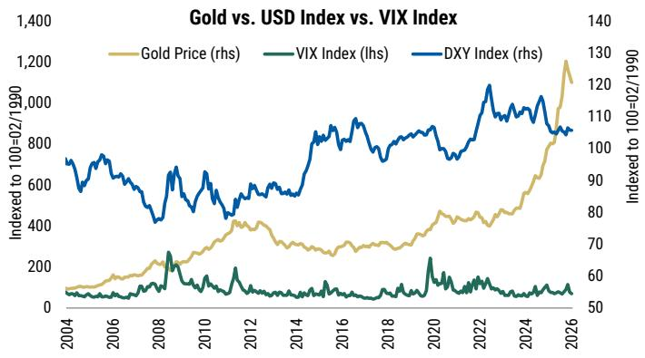

line chart

| Year | Gold Price (rhs) | VIX Index (lhs) | DXY Index (rhs) |
|------|------------------|-----------------|-----------------|
| 2004 | ~50              | ~50             | ~700            |
| 2006 | ~100             | ~50             | ~750            |
| 2008 | ~200             | ~60             | ~650            |
| 2010 | ~300             | ~50             | ~600            |
| 2012 | ~400             | ~50             | ~550            |
| 2014 | ~350             | ~50             | ~700            |
| 2016 | ~300             | ~50             | ~900            |
| 2018 | ~350             | ~50             | ~850            |
| 2020 | ~450             | ~50             | ~950            |
| 2022 | ~500             | ~50             | ~1100           |
| 2024 | ~600             | ~50             | ~1050           |
| 2026 | ~1300            | ~50             | ~1150           |

Source: Bloomberg, MS.

Exhibit136: Gold imports: China vs. India  
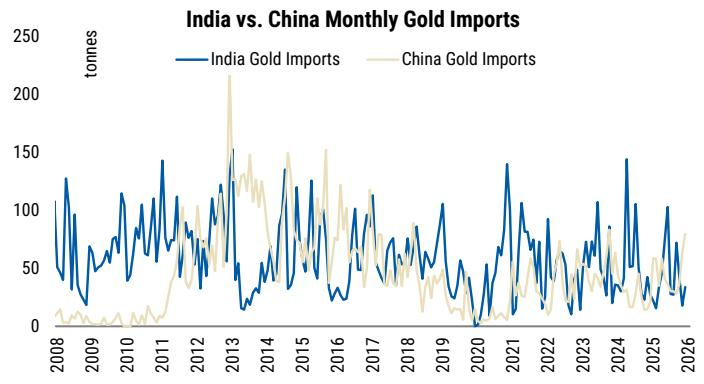

line chart

| Year | India Gold Imports (tonnes) | China Gold Imports (tonnes) |
|------|-----------------------------|-----------------------------|
| 2008 | ~100                        | ~5                          |
| 2009 | ~50                         | ~10                         |
| 2010 | ~70                         | ~15                         |
| 2011 | ~100                        | ~30                         |
| 2012 | ~80                         | ~40                         |
| 2013 | ~150                        | ~220                        |
| 2014 | ~60                         | ~130                        |
| 2015 | ~130                        | ~150                        |
| 2016 | ~30                         | ~120                        |
| 2017 | ~80                         | ~110                        |
| 2018 | ~60                         | ~70                         |
| 2019 | ~100                        | ~40                         |
| 2020 | ~5                          | ~10                         |
| 2021 | ~140                        | ~60                         |
| 2022 | ~80                         | ~50                         |
| 2023 | ~60                         | ~40                         |
| 2024 | ~140                        | ~60                         |
| 2025 | ~100                        | ~50                         |
| 2026 | ~30                         | ~70                         |

Source: Bloomberg, MS.

Exhibit137: Gold-to-silver ratio  
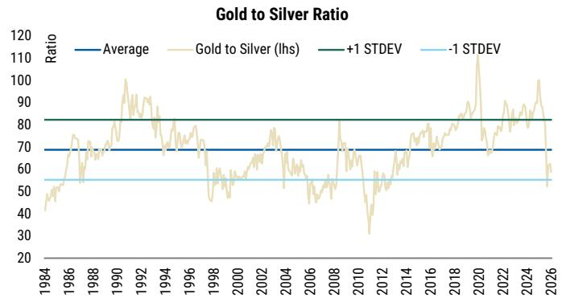

line chart

| Year | Average | Gold to Silver (lhs) | +1 STDEV | -1 STDEV |
|------|---------|----------------------|----------|----------|
| 1984 | 70      | 40                   | 80       | 55       |
| 1986 | 70      | 70                   | 80       | 55       |
| 1988 | 70      | 70                   | 80       | 55       |
| 1990 | 70      | 100                  | 80       | 55       |
| 1992 | 70      | 90                   | 80       | 55       |
| 1994 | 70      | 80                   | 80       | 55       |
| 1996 | 70      | 70                   | 80       | 55       |
| 1998 | 70      | 60                   | 80       | 55       |
| 2000 | 70      | 60                   | 80       | 55       |
| 2002 | 70      | 70                   | 80       | 55       |
| 2004 | 70      | 60                   | 80       | 55       |
| 2006 | 70      | 50                   | 80       | 55       |
| 2008 | 70      | 60                   | 80       | 55       |
| 2010 | 70      | 30                   | 80       | 55       |
| 2012 | 70      | 60                   | 80       | 55       |
| 2014 | 70      | 70                   | 80       | 55       |
| 2016 | 70      | 80                   | 80       | 55       |
| 2018 | 70      | 90                   | 80       | 55       |
| 2020 | 70      | 110                  | 80       | 55       |
| 2022 | 70      | 80                   | 80       | 55       |
| 2024 | 70      | 90                   | 80       | 55       |
| 2026 | 70      | 60                   | 80       | 55       |

Source: Bloomberg, MS.

Exhibit138: Nymex positioning per COTR  
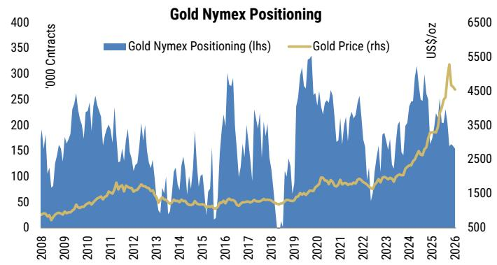

line chart

| Year | Gold Nymex Positioning (lhs) | Gold Price (rhs) |
|------|------------------------------|------------------|
| 2008 | ~180                         | ~500             |
| 2009 | ~250                         | ~750             |
| 2010 | ~220                         | ~1000            |
| 2011 | ~240                         | ~1250            |
| 2012 | ~200                         | ~1500            |
| 2013 | ~180                         | ~1750            |
| 2014 | ~150                         | ~1500            |
| 2015 | ~180                         | ~1250            |
| 2016 | ~300                         | ~1500            |
| 2017 | ~250                         | ~1750            |
| 2018 | ~150                         | ~1500            |
| 2019 | ~350                         | ~2000            |
| 2020 | ~320                         | ~2500            |
| 2021 | ~280                         | ~3000            |
| 2022 | ~250                         | ~3500            |
| 2023 | ~220                         | ~4000            |
| 2024 | ~300                         | ~4500            |
| 2025 | ~350                         | ~5000            |
| 2026 | ~150                         | ~4500            |

Source: COTR, MS.

Exhibit 139: Gold cost curve  
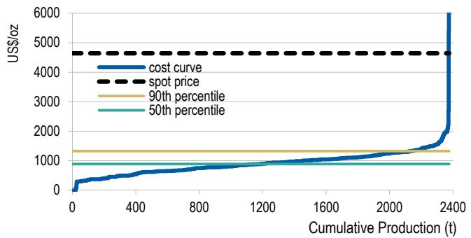

line chart

| Cumulative Production (t) | cost curve | spot price | 90th percentile | 50th percentile |
| ------------------------- | ---------- | ---------- | --------------- | --------------- |
| 0                         | 0          | 4700       | 1300            | 900             |
| 2400                      | 6000       | 4700       | 1300            | 900             |

Source: Wood Mackenzie, MS.

## Commodities: Iron Ore

Exhibit 140: Consumption of steel in China  
2025 MSe China Steel Demand Drivers  

pie chart

| Category | Percentage (%) |
| :--- | :--- |
| Residential property | 14 |
| Other property | 10 |
| Infrastructure | 17 |
| Machinery | 30 |
| Auto | 9 |
| Shipbuilding | 5 |
| White goods | 4 |
| Others | 11 |

Source: Antaike, MS estimates.

Exhibit 141: China – 10-day annualized crude steel output (member mills)  
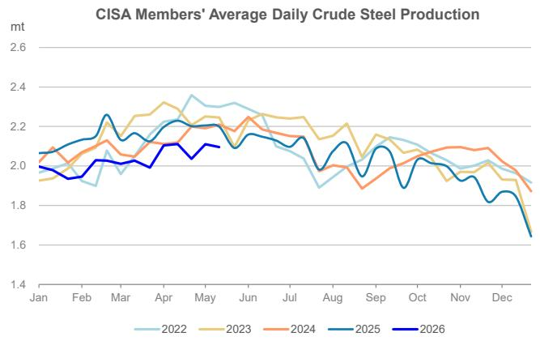

line chart

| Month | 2022 | 2023 | 2024 | 2025 | 2026 |
|-------|------|------|------|------|------|
| Jan   | 1.95 | 1.98 | 2.05 | 2.08 | 2.00 |
| Feb   | 1.90 | 1.95 | 2.08 | 2.15 | 1.95 |
| Mar   | 1.98 | 2.10 | 2.15 | 2.25 | 2.05 |
| Apr   | 2.15 | 2.30 | 2.18 | 2.20 | 2.10 |
| May   | 2.35 | 2.25 | 2.20 | 2.15 | 2.10 |
| Jun   | 2.30 | 2.20 | 2.15 | 2.10 | 2.05 |
| Jul   | 2.15 | 2.15 | 2.10 | 2.05 | 1.95 |
| Aug   | 1.90 | 2.10 | 2.05 | 1.95 | 1.90 |
| Sep   | 2.15 | 2.15 | 1.95 | 1.90 | 1.85 |
| Oct   | 2.10 | 2.10 | 1.95 | 1.95 | 1.85 |
| Nov   | 2.05 | 1.95 | 1.95 | 1.90 | 1.80 |
| Dec   | 1.95 | 1.85 | 1.85 | 1.75 | 1.65 |

Source: CISA, MS.

Exhibit 142: Total steel inventory in China (traders + mills)  
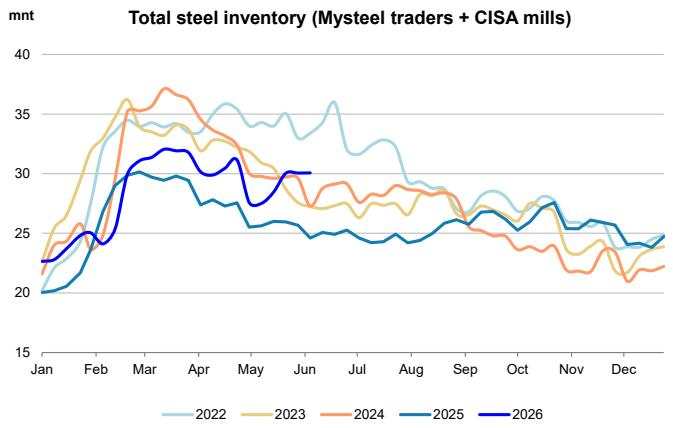

line chart

| Month | 2022 | 2023 | 2024 | 2025 | 2026 |
|-------|------|------|------|------|------|
| Jan   | 20   | 25   | 23   | 20   | 23   |
| Feb   | 30   | 35   | 35   | 25   | 25   |
| Mar   | 35   | 37   | 37   | 30   | 31   |
| Apr   | 34   | 34   | 34   | 29   | 30   |
| May   | 35   | 32   | 31   | 28   | 31   |
| Jun   | 34   | 30   | 30   | 27   | 30   |
| Jul   | 36   | 28   | 29   | 26   | 30   |
| Aug   | 33   | 27   | 28   | 25   | 30   |
| Sep   | 30   | 26   | 27   | 25   | 30   |
| Oct   | 28   | 25   | 26   | 25   | 30   |
| Nov   | 27   | 24   | 25   | 25   | 30   |
| Dec   | 25   | 23   | 24   | 24   | 30   |

Source: Mysteel, CISA, MS.

Exhibit 143: GP/t for mills at spot prices  
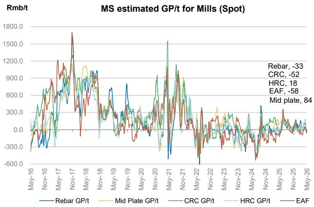  
Source: Bloomberg, MS.

Exhibit 144: Chinese exports vs. international HRC price spread  
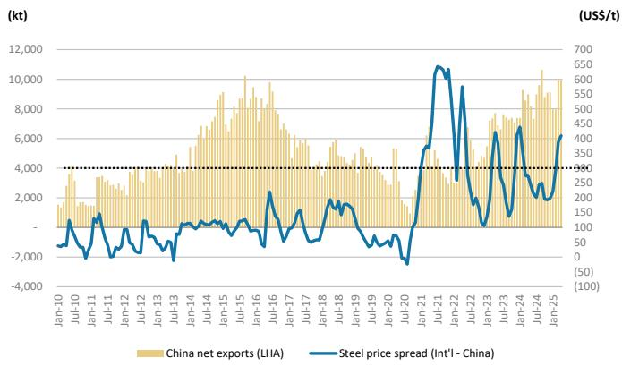

bar-line hybrid chart

| Date    | China net exports (LHA) (kt) | Steel price spread (Int'l - China) (US$/t) |
|---------|-------------------------------|---------------------------------------------|
| Jan-10  | ~3,000                        | ~0                                          |
| Jul-10  | ~4,000                        | ~50                                         |
| Jan-11  | ~3,500                        | ~-50                                        |
| Jul-11  | ~3,000                        | ~-100                                       |
| Jan-12  | ~3,500                        | ~-50                                        |
| Jul-12  | ~4,000                        | ~-100                                       |
| Jan-13  | ~4,500                        | ~-150                                       |
| Jul-13  | ~5,000                        | ~-200                                       |
| Jan-14  | ~6,000                        | ~-100                                       |
| Jul-14  | ~7,000                        | ~-50                                        |
| Jan-15  | ~8,000                        | ~-50                                        |
| Jul-15  | ~9,000                        | ~-50                                        |
| Jan-16  | ~10,000                       | ~-50                                        |
| Jul-16  | ~9,500                        | ~-50                                        |
| Jan-17  | ~8,500                        | ~-50                                        |
| Jul-17  | ~7,500                        | ~-50                                        |
| Jan-18  | ~6,500                        | ~-50                                        |
| Jul-18  | ~5,500                        | ~-50                                        |
| Jan-19  | ~4,500                        | ~-50                                        |
| Jul-19  | ~3,500                        | ~-50                                        |
| Jan-20  | ~2,500                        | ~-50                                        |
| Jul-20  | ~1,500                        | ~-1,50                                      |
| Jan-21  | ~3,500                        | ~350                                        |
| Jul-21  | ~4,500                        | ~650                                        |
| Jan-22  | ~5,500                        | ~650                                        |
| Jul-22  | ~4,500                        | ~350                                        |
| Jan-23  | ~3,500                        | ~150                                        |
| Jul-23  | ~4,500                        | ~450                                        |
| Jan-24  | ~5,500                        | ~650                                        |
| Jul-24  | ~6,500                        | ~450                                        |
| Jan-25  | ~7,500                        | ~650                                        |

Source: Bloomberg, MS.

Exhibit 145: China – Iron ore stock at port  
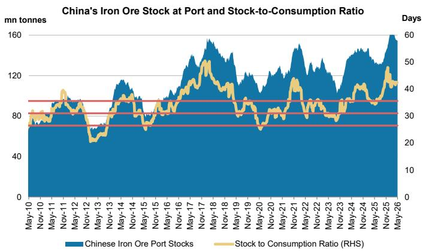

line chart

| Date    | Chinese Iron Ore Port Stocks (mn tonnes) | Stock to Consumption Ratio (Days) |
|---------|------------------------------------------|------------------------------------|
| May-10  | ~70                                      | ~30                                |
| Nov-10  | ~75                                      | ~30                                |
| May-11  | ~80                                      | ~30                                |
| Nov-11  | ~90                                      | ~40                                |
| May-12  | ~85                                      | ~35                                |
| Nov-12  | ~75                                      | ~25                                |
| May-13  | ~80                                      | ~30                                |
| Nov-13  | ~90                                      | ~35                                |
| May-14  | ~100                                     | ~40                                |
| Nov-14  | ~110                                     | ~45                                |
| May-15  | ~105                                     | ~40                                |
| Nov-15  | ~95                                      | ~35                                |
| May-16  | ~100                                     | ~30                                |
| Nov-16  | ~110                                     | ~35                                |
| May-17  | ~120                                     | ~40                                |
| Nov-17  | ~130                                     | ~45                                |
| May-18  | ~140                                     | ~50                                |
| Nov-18  | ~135                                     | ~45                                |
| May-19  | ~125                                     | ~40                                |
| Nov-19  | ~115                                     | ~35                                |
| May-20  | ~105                                     | ~30                                |
| Nov-20  | ~110                                     | ~35                                |
| May-21  | ~120                                     | ~40                                |
| Nov-21  | ~130                                     | ~45                                |
| May-22  | ~125                                     | ~40                                |
| Nov-22  | ~115                                     | ~35                                |
| May-23  | ~105                                     | ~30                                |
| Nov-23  | ~110                                     | ~35                                |
| May-24  | ~120                                     | ~40                                |
| Nov-24  | ~130                                     | ~45                                |
| May-25  | ~140                                     | ~50                                |
| Nov-25  | ~150                                     | ~55                                |
| May-26  | ~160                                     | ~60                                |

Source: CISA, Mysteel, MS.

Exhibit 146: Implied China iron ore production (62% Fe equivalent)  
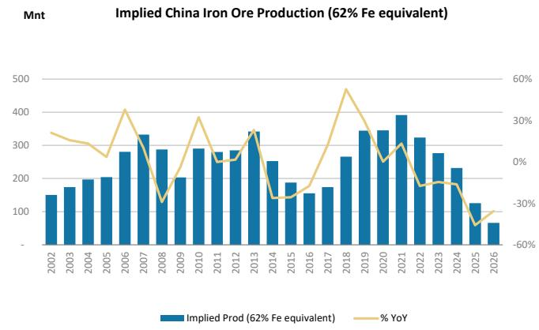

bar-line hybrid

Implied China Iron Ore Production (62% Fe equivalent)
| Year | Implied Prod (62% Fe equivalent) (Mnt) | % YoY (%) |
|---|---|---|
| 2002 | 150 | 30 |
| 2003 | 170 | 28 |
| 2004 | 195 | 25 |
| 2005 | 205 | 15 |
| 2006 | 280 | 40 |
| 2007 | 330 | 15 |
| 2008 | 290 | -25 |
| 2009 | 205 | -15 |
| 2010 | 290 | 35 |
| 2011 | 285 | 10 |
| 2012 | 295 | 15 |
| 2013 | 345 | 35 |
| 2014 | 255 | -15 |
| 2015 | 190 | -15 |
| 2016 | 160 | -10 |
| 2017 | 175 | 15 |
| 2018 | 265 | 45 |
| 2019 | 345 | 30 |
| 2020 | 345 | 5 |
| 2021 | 395 | 25 |
| 2022 | 325 | -15 |
| 2023 | 275 | -15 |
| 2024 | 230 | -15 |
| 2025 | 125 | -30 |
| 2026 | 75 | -35 |

Source: CEIC, MS.

Exhibit 148: Weekly steel demand  
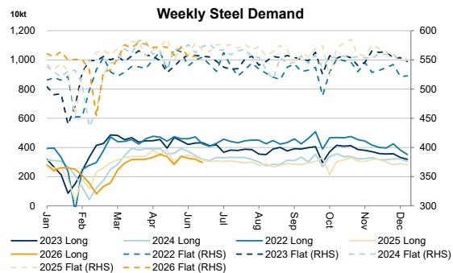

line chart

| Month | 2023 Long | 2024 Long | 2022 Long | 2025 Long | 2026 Long | 2022 Flat (RHS) | 2023 Flat (RHS) | 2024 Flat (RHS) | 2025 Flat (RHS) | 2026 Flat (RHS) |
|-------|-----------|-----------|-----------|-----------|-----------|-----------------|-----------------|-----------------|-----------------|-----------------|
| Jan   | ~300      | ~400      | ~800      | ~350      | ~300      | ~850            | ~900            | ~850            | ~800            | ~750            |
| Feb   | ~100      | ~100      | ~600      | ~350      | ~150      | ~600            | ~750            | ~700            | ~650            | ~600            |
| Mar   | ~450      | ~450      | ~1,000    | ~350      | ~350      | ~1,100          | ~1,150          | ~1,100          | ~1,150          | ~1,150          |
| Apr   | ~450      | ~450      | ~1,100    | ~350      | ~350      | ~1,150          | ~1,150          | ~1,150          | ~1,150          | ~1,150          |
| May   | ~450      | ~450      | ~1,150    | ~350      | ~350      | ~1,150          | ~1,150          | ~1,150          | ~1,150          | ~1,150          |
| Jun   | ~450      | ~450      | ~1,150    | ~350      | ~350      | ~1,150          | ~1,150          | ~1,150          | ~1,150          | ~1,150          |
| Jul   | ~450      | ~450      | ~1,150    | ~350      | ~350      | ~1,150          | ~1,150          | ~1,150          | ~1,150          | ~1,150          |
| Aug   | ~450      | ~450      | ~1,150    | ~350      | ~350      | ~1,150          | ~1,150          | ~1,150          | ~1,150          | ~1,150          |
| Sep   | ~450      | ~450      | ~1,150    | ~350      | ~350      | ~1,150          | ~1,150          | ~1,150          | ~1,150          | ~1,150          |
| Oct   | ~450      | ~450      | ~800      | ~350      | ~350      | ~850            | ~850            | ~850            | ~850            | ~850            |
| Nov   | ~450      | ~450      | ~850      | ~350      | ~350      | ~850            | ~850            | ~850            | ~850            | ~850            |
| Dec   | ~450      | ~450      | ~850      | ~350      | ~350      | ~850            | ~850            | ~850            | ~850            | ~850            |

Source: Mysteel, MS.

Exhibit 147: CISA member mill vs. NBS (restated) average daily steel output  
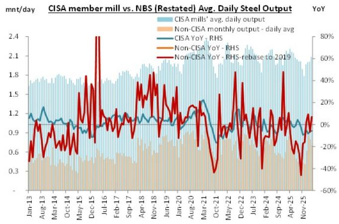

line chart

| Date    | CISA mills' avg. daily output | Non-CISA monthly output - daily avg | CISA YoY - RHS | Non-CISA YoY - RHS | Non-CISA YoY - RHS-rebase to 2019 |
|---------|-------------------------------|--------------------------------------|----------------|--------------------|-------------------------------------|
| Jan-13  | ~1.7                          | ~0.6                                 | ~1.2           | ~0%                | ~0%                                 |
| Aug-13  | ~1.7                          | ~0.6                                 | ~1.2           | ~0%                | ~0%                                 |
| Mar-14  | ~1.7                          | ~0.6                                 | ~1.2           | ~0%                | ~0%                                 |
| Oct-14  | ~1.7                          | ~0.6                                 | ~1.2           | ~0%                | ~0%                                 |
| May-15  | ~1.7                          | ~0.6                                 | ~1.2           | ~0%                | ~0%                                 |
| Dec-15  | ~1.7                          | ~0.6                                 | ~1.2           | ~0%                | ~0%                                 |
| Jul-16  | ~1.7                          | ~0.6                                 | ~1.2           | ~0%                | ~0%                                 |
| Feb-17  | ~1.7                          | ~0.6                                 | ~1.2           | ~0%                | ~0%                                 |
| Sep-17  | ~1.7                          | ~0.6                                 | ~1.2           | ~0%                | ~0%                                 |
| Apr-18  | ~1.7                          | ~0.6                                 | ~1.2           | ~0%                | ~0%                                 |
| Nov-18  | ~1.7                          | ~0.6                                 | ~1.2           | ~0%                | ~0%                                 |
| Jun-19  | ~1.7                          | ~0.6                                 | ~1.2           | ~0%                | ~0%                                 |
| Jan-20  | ~1.7                          | ~0.6                                 | ~1.2           | ~0%                | ~0%                                 |
| Aug-20  | ~1.7                          | ~0.6                                 | ~1.2           | ~0%                | ~0%                                 |
| Mar-21  | ~1.7                          | ~0.6                                 | ~1.2           | ~0%                | ~0%                                 |
| Oct-21  | ~1.7                          | ~0.6                                 | ~1.2           | ~0%                | ~0%                                 |
| May-22  | ~1.7                          | ~0.6                                 | ~1.2           | ~0%                | ~0%                                 |
| Dec-22  | ~1.7                          | ~0.6                                 | ~1.2           | ~0%                | ~0%                                 |
| Jul-23  | ~1.7                          | ~0.6                                 | ~1.2           | ~0%                | ~0%                                 |
| Feb-24  | ~1.7                          | ~0.6                                 | ~1.2           | ~0%                | ~0%                                 |
| Sep-24  | ~1.7                          | ~0.6                                 | ~1.2           | ~0%                | ~0%                                 |
| Apr-25  | ~1.7                          | ~0.6                                 | ~1.2           | ~0%                | ~0%                                 |
| Nov-25  | ~1.7                          | ~0.6                                 | ~1.2           | ~0%                | ~0%                                 |

Source: CISA, CEIC, MS.

Exhibit 149: Iron ore inventory at small/mid-sized Chinese steel mills  
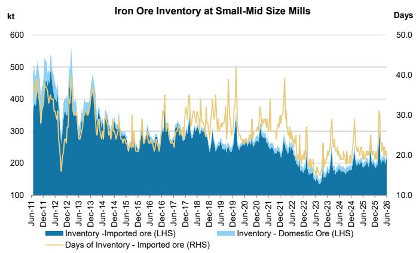

line chart

| Date    | Inventory - Imported ore (LHS) (kt) | Inventory - Domestic Ore (LHS) (kt) | Days of Inventory - Imported ore (RHS) |
|---------|--------------------------------------|-------------------------------------|----------------------------------------|
| Jun-11  | ~450                                 | ~480                                | ~40                                    |
| Dec-11  | ~400                                 | ~450                                | ~35                                    |
| Jun-12  | ~350                                 | ~400                                | ~30                                    |
| Dec-12  | ~300                                 | ~350                                | ~25                                    |
| Jun-13  | ~250                                 | ~300                                | ~20                                    |
| Dec-13  | ~200                                 | ~250                                | ~15                                    |
| Jun-14  | ~150                                 | ~200                                | ~10                                    |
| Dec-14  | ~100                                 | ~150                                | ~5                                     |
| Jun-15  | ~50                                  | ~100                                | ~0                                     |
| Dec-15  | ~0                                   | ~50                                 | ~5                                     |
| Jun-16  | ~50                                  | ~100                                | ~10                                    |
| Dec-16  | ~100                                 | ~150                                | ~15                                    |
| Jun-17  | ~150                                 | ~200                                | ~20                                    |
| Dec-17  | ~200                                 | ~250                                | ~25                                    |
| Jun-18  | ~250                                 | ~300                                | ~30                                    |
| Dec-18  | ~300                                 | ~350                                | ~35                                    |
| Jun-19  | ~350                                 | ~400                                | ~40                                    |
| Dec-19  | ~400                                 | ~450                                | ~45                                    |
| Jun-20  | ~350                                 | ~400                                | ~40                                    |
| Dec-20  | ~300                                 | ~350                                | ~35                                    |
| Jun-21  | ~250                                 | ~300                                | ~30                                    |
| Dec-21  | ~200                                 | ~250                                | ~25                                    |
| Jun-22  | ~150                                 | ~200                                | ~20                                    |
| Dec-22  | ~100                                 | ~150                                | ~15                                    |
| Jun-23  | ~50                                  | ~100                                | ~10                                    |
| Dec-23  | ~0                                   | ~50                                 | ~5                                     |
| Jun-24  | ~50                                  | ~100                                | ~10                                    |
| Dec-24  | ~100                                 | ~150                                | ~15                                    |
| Jun-25  | ~150                                 | ~200                                | ~20                                    |
| Dec-25  | ~200                                 | ~250                                | ~25                                    |
| Jun-26  | ~250                                 | ~300                                | ~30                                    |

Source: Mysteel, MS.

Exhibit150: Iron ore inventories at Chinese sea ports and inventory days of consumption  
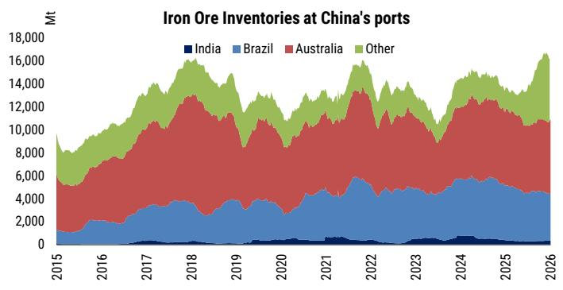

stacked area chart

| Year | India | Brazil | Australia | Other |
|------|-------|--------|-----------|-------|
| 2015 | 0     | 1000   | 3000      | 2000  |
| 2016 | 0     | 1500   | 3500      | 2500  |
| 2017 | 0     | 2000   | 4000      | 3000  |
| 2018 | 0     | 2500   | 4500      | 3500  |
| 2019 | 0     | 2000   | 4000      | 3000  |
| 2020 | 0     | 1500   | 3500      | 2500  |
| 2021 | 0     | 2000   | 4000      | 3000  |
| 2022 | 0     | 2500   | 4500      | 3500  |
| 2023 | 0     | 2000   | 4000      | 3000  |
| 2024 | 0     | 2500   | 4500      | 3500  |
| 2025 | 0     | 2000   | 4000      | 3000  |
| 2026 | 0     | 1500   | 3500      | 2500  |

Source: Mysteel, MS

Exhibit 152: MS Estimated Scrap Steel Mix in Long Process Steelmaking  
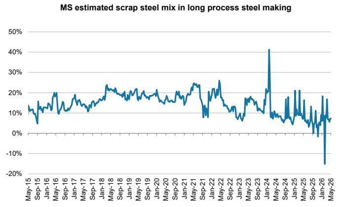

line chart

| Date     | Value |
| -------- | ----- |
| May-15   | ~12%  |
| Sep-15   | ~8%   |
| Jan-16   | ~18%  |
| May-16   | ~15%  |
| Sep-16   | ~17%  |
| Jan-17   | ~13%  |
| May-17   | ~16%  |
| Sep-17   | ~18%  |
| Jan-18   | ~22%  |
| May-18   | ~20%  |
| Sep-18   | ~19%  |
| Jan-19   | ~20%  |
| May-19   | ~18%  |
| Sep-19   | ~19%  |
| Jan-20   | ~20%  |
| May-20   | ~18%  |
| Sep-20   | ~19%  |
| Jan-21   | ~22%  |
| May-21   | ~25%  |
| Sep-21   | ~10%  |
| Jan-22   | ~25%  |
| May-22   | ~15%  |
| Sep-22   | ~10%  |
| Jan-23   | ~15%  |
| May-23   | ~18%  |
| Sep-23   | ~15%  |
| Jan-24   | ~40%  |
| May-24   | ~10%  |
| Sep-24   | ~15%  |
| Jan-25   | ~20%  |
| May-25   | ~10%  |
| Sep-25   | ~5%   |
| Jan-26   | ~-15% |
| May-26   | ~5%   |

Source: Mysteel, MS.

Exhibit 154: Iron ore cost curve  

line chart

| Cumulative Production (Mt) | cost curve | spot price | 90th percentile | 50th percentile |
| -------------------------- | ---------- | ---------- | --------------- | --------------- |
| 0                          | 10         | 100        | 75              | 30              |
| 500                        | 20         | 100        | 75              | 30              |
| 1000                       | 30         | 100        | 75              | 30              |
| 1500                       | 40         | 100        | 75              | 30              |
| 2000                       | 80         | 100        | 75              | 30              |
| 2200                       | 220        | 100        | 75              | 30              |

Source: Wood Mackenzie, MS.

Exhibit 151: EAF capacity utilization rate  
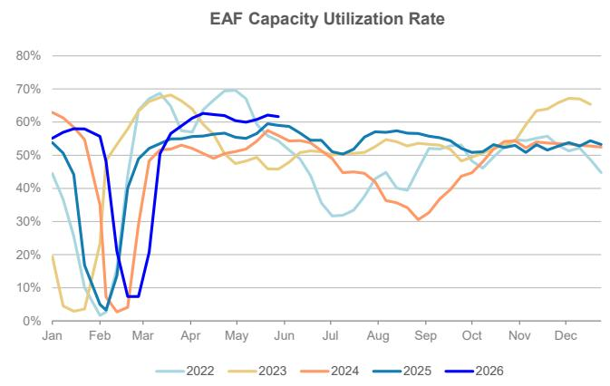

line chart

| Month | 2022 | 2023 | 2024 | 2025 | 2026 |
|-------|------|------|------|------|------|
| Jan   | 45%  | 18%  | 62%  | 55%  | 57%  |
| Feb   | 10%  | 5%   | 5%   | 5%   | 5%   |
| Mar   | 68%  | 68%  | 50%  | 50%  | 50%  |
| Apr   | 70%  | 65%  | 55%  | 55%  | 60%  |
| May   | 70%  | 50%  | 55%  | 55%  | 60%  |
| Jun   | 50%  | 45%  | 50%  | 55%  | 60%  |
| Jul   | 30%  | 45%  | 45%  | 50%  | 50%  |
| Aug   | 40%  | 50%  | 40%  | 55%  | 55%  |
| Sep   | 30%  | 45%  | 30%  | 50%  | 50%  |
| Oct   | 40%  | 50%  | 40%  | 50%  | 50%  |
| Nov   | 50%  | 60%  | 50%  | 50%  | 50%  |
| Dec   | 45%  | 65%  | 50%  | 50%  | 50%  |

Source: Mysteel, MS.

Exhibit 153: Iron ore prices: -Discount/+premium vs. 62% Fe (%)  

line chart

| Date   | 65% Fe | 58% Fe (low Al) | 58% Fe |
|--------|--------|-----------------|--------|
| May-12 | ~5%    | ~0%             | ~-10%  |
| May-14 | ~10%   | ~-10%           | ~-15%  |
| May-16 | ~15%   | ~-15%           | ~-20%  |
| May-18 | ~45%   | ~-20%           | ~-50%  |
| May-20 | ~20%   | ~-10%           | ~-15%  |
| May-22 | ~30%   | ~-15%           | ~-40%  |
| May-24 | ~15%   | ~-10%           | ~-10%  |
| May-26 | ~15%   | ~-10%           | ~-5%   |

Source: Tex Report, Platts, MS.

## Commodities: Lithium

Exhibit 155: China – Domestic lithium compound prices  

line chart

| Date   | LC 99.0% | LC 99.5% | LiOH.H2O 56.5% | LiOH.H2O 96% |
|--------|----------|----------|----------------|--------------|
| Jan-15 | ~20      | ~20      | ~20            | ~20          |
| May-15 | ~20      | ~20      | ~20            | ~20          |
| Sep-15 | ~20      | ~20      | ~20            | ~20          |
| Jan-16 | ~40      | ~40      | ~40            | ~40          |
| May-16 | ~40      | ~40      | ~40            | ~40          |
| Sep-16 | ~40      | ~40      | ~40            | ~40          |
| Jan-17 | ~40      | ~40      | ~40            | ~40          |
| May-17 | ~40      | ~40      | ~40            | ~40          |
| Sep-17 | ~40      | ~40      | ~40            | ~40          |
| Jan-18 | ~40      | ~40      | ~40            | ~40          |
| May-18 | ~40      | ~40      | ~40            | ~40          |
| Sep-18 | ~40      | ~40      | ~40            | ~40          |
| Jan-19 | ~40      | ~40      | ~40            | ~40          |
| May-19 | ~40      | ~40      | ~40            | ~40          |
| Sep-19 | ~40      | ~40      | ~40            | ~40          |
| Jan-20 | ~40      | ~40      | ~40            | ~40          |
| May-20 | ~40      | ~40      | ~40            | ~40          |
| Sep-20 | ~40      | ~40      | ~40            | ~40          |
| Jan-21 | ~40      | ~40      | ~40            | ~40          |
| May-21 | ~40      | ~40      | ~40            | ~40          |
| Sep-21 | ~40      | ~40      | ~40            | ~40          |
| Jan-22 | ~60      | ~60      | ~60            | ~60          |
| May-22 | ~80      | ~80      | ~80            | ~80          |
| Sep-22 | ~100     | ~100     | ~100           | ~100         |
| Jan-23 | ~120     | ~120     | ~120           | ~120         |
| May-23 | ~80      | ~80      | ~80            | ~80          |
| Sep-23 | ~60      | ~60      | ~60            | ~60          |
| Jan-24e| ~50      | ~50      | ~50            | ~50          |
| May-24e| ~30      | ~30      | ~30            | ~30          |
| Sep-24e| ~20      | ~20      | ~20            | ~20          |
| Jan-25e| ~15      | ~15      | ~15            | ~15          |
| May-25e| ~15      | ~15      | ~15            | ~15          |
| Sep-25e| ~15      | ~15      | ~15            | ~15          |
| Jan-26e| ~15      | ~15      | ~15            | ~15          |
| May-26e| ~15      | ~15      | ~15            | ~15          |
| Sep-26e| ~15      | ~15      | ~15            | ~15          |
| Jan-27e| ~15      | ~15      | ~15            | ~15          |
| May-27e| ~15      | ~15      | ~15            | ~15          |
| Sep-27e| ~15      | ~15      | ~15            | ~15          |
| Jan-28e| ~15      | ~15      | ~15            | ~15          |
| May-28e| ~15      | ~15      | ~15            | ~15          |
| Sep-28e| ~15      | ~15      | ~15            | ~15          |
| Jan-29e| ~15      | ~15      | ~15            | ~15          |
| May-29e| ~15      | ~15      | ~15            | ~15          |
| Sep-29e| ~15      | ~15      | ~15            | ~15          |
| Jan-30e| ~15      | ~15      | ~15            | ~15          |
| May-30e| ~15      | ~15      | ~15            | ~15          |
| Sep-30e| ~15      | ~15      | ~15            | ~15          |
| Jan-31e| ~15      | ~15      | ~15            | ~15          |
| May-31e| ~15      | ~15      | ~15            | ~15          |
| Sep-31e| (~8)     | (~8)     | (~8)           | (~8)          |
| Jan-32e| (~8)     | (~8)     | (~8)           | (~8)          |
| May-32e| (~8)     | (~8)     | (~8)           | (~8)          |
| Sep-32e| (~8)     | (~8)     | (~8)           | (~8)          |
| Jan-33e| (~8)     | (~8)     | (~8)           | (~8)          |
| May-33e| (~8)     | (~8)     | (~8)           | (~8)          |
| Sep-33e| (~8)     | (~8)     | (~8)           | (~8)          |
| Jan-34e| (~8)     | (~8)     | (~8)           | (~8)          |
| May-34e| (~8)     | (~8)     | (~8)           | (~8)          |
| Sep-34e| (~8)     | (~8)     | (~8)           | (~8)          |
| Jan-35e| (~8)     | (~8)     | (~8)           | (~8)          |
| May-35e| (~8)     | (~8)     | (~8)           | (~8)          |
| Sep-35e| (~8)     | (~8)     | (~8)           | (~8)          |
| Jan-36e| (~8)     | (~8)     | (~8)           | (~8)          |
| May-36e| (~8)     | (~8)     | (~8)           | (~8)          |
| Sep-36e| (~8)     | (~8)     | (~8)           | (~8)          |
| Jan-37e| (~8)     | (~8)     | (~8)           | (~8)          |
| May-37e| (~8)     | (~8)     | (~8)           | (~8)          |
| Sep-37e| (~8)     | (~8)     | (~8)           | (~8)          |
| Jan-38e| (~8)     | (~8)     | (~8)           | (~8)          |
| May-38e| (~8)     | (~8)     | (~8)           | (~8)          |
| Sep-38e| (~8)     | (~8)     | (~8)           | (~8)          |
| Jan-39e| (~8)     | (~8)     | (~8)           | (~8)          |
| May-39e| (~8)     | (~8)     | (~8)           | (~8)          |
| Sep-39e| (~8)     | (~8)     | (~8)           | (~8)          |
| Jan-40e| (~8)     | (~8)     | (~8)           | (~8)          |
| May-40e| (~8)     | (~8)     | (~8)           | (~8)          |
| Sep-40e| (~8)     | (~8)     | (~8)           | (~8)          |
| Jan-41e| (~8)     | (~8)     | (~8)           | (~8)          |
| May-41e| (~8)     | (~8)     | (~8)           | (~8)          |
| Sep-41e| (~8)     | (~8)     | (~8)           | (~8)          |
| Jan-42e| (~8)     | (~8)     | (~8)           | (~8)          |
| May-42e| (~8)     | (~8)     | (~8)           | (~8)          |
| Sep-42e| (~8)     | (~8)     | (~8)           | (~8)          |
| Jan-43e| (not labeled)| (not labeled)| (not labeled)| (not labeled)|

Source: Baichuan, MS.

Exhibit 157: Spodumene price vs. China's lithium hydroxide spot price  
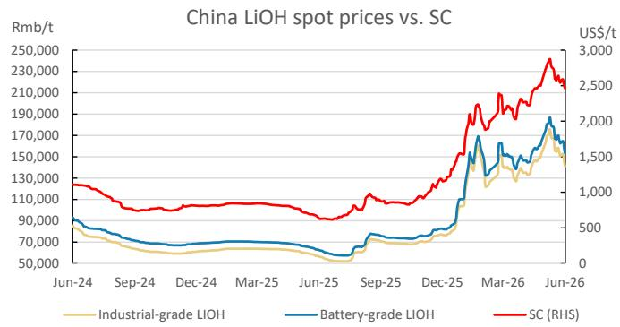

line chart

| Date   | Industrial-grade LiOH (Rmb/t) | Battery-grade LiOH (Rmb/t) | SC (RHS) (Rmb/t) |
|--------|-------------------------------|-----------------------------|------------------|
| Jun-24 | ~80,000                       | ~90,000                     | ~1,10,000        |
| Sep-24 | ~70,000                       | ~75,000                     | ~1,05,000        |
| Dec-24 | ~65,000                       | ~70,000                     | ~1,05,000        |
| Mar-25 | ~65,000                       | ~65,000                     | ~1,05,000        |
| Jun-25 | ~60,000                       | ~60,000                     | ~1,05,000        |
| Sep-25 | ~75,000                       | ~85,000                     | ~1,15,000        |
| Dec-25 | ~85,000                       | ~1,15,000                   | ~1,35,000        |
| Mar-26 | ~1,35,000                     | ~1,85,000                   | ~2,25,000        |
| Jun-26 | ~1,55,000                     | ~1,95,000                   | ~2,85,000        |

Source: Baiinfo, MS.

Exhibit 159: Weekly lithium hydroxide output in China  

line chart

| Week | 2019 | 2020 | 2021 | 2022 | 2023 | 2024 |
|------|------|------|------|------|------|------|
| W1   | ~1,500 | ~1,300 | ~2,000 | ~3,500 | ~5,000 | ~4,000 |
| W3   | ~1,600 | ~1,400 | ~2,100 | ~3,600 | ~5,100 | ~4,500 |
| W5   | ~1,700 | ~1,500 | ~2,200 | ~3,700 | ~5,200 | ~4,800 |
| W7   | ~1,800 | ~1,600 | ~2,300 | ~3,800 | ~5,300 | ~3,500 |
| W9   | ~1,900 | ~1,700 | ~2,400 | ~3,900 | ~5,400 | ~4,500 |
| W11  | ~2,000 | ~1,800 | ~2,500 | ~4,000 | ~5,500 | ~5,500 |
| W13  | ~2,100 | ~1,900 | ~2,600 | ~4,100 | ~5,600 | ~5,800 |
| W15  | ~2,200 | ~2,000 | ~2,700 | ~4,200 | ~5,700 | ~6,500 |
| W17  | ~2,300 | ~2,100 | ~2,800 | ~4,300 | ~5,800 | ~6,800 |
| W19  | ~2,400 | ~2,200 | ~2,900 | ~4,400 | ~5,900 | ~7,500 |
| W21  | ~2,500 | ~2,300 | ~3,000 | ~4,500 | ~6,000 | ~7,800 |
| W23  | ~2,600 | ~2,400 | ~3,100 | ~4,600 | ~6,100 | ~7,600 |
| W25  | ~2,700 | ~2,500 | ~3,200 | ~4,700 | ~6,200 | ~7,800 |
| W27  | ~2,800 | ~2,600 | ~3,300 | ~4,800 | ~6,300 | ~8,500 |
| W29  | ~2,900 | ~2,700 | ~3,400 | ~4.900 | ~6,400 | ~8,300 |
| W31  | ~3,000 | ~2,800 | ~3,500 | ~5.000 | ~6,500 | ~8.500 |
| W33  | ~3,100 | ~2,900 | ~3,600 | ~5.100 | ~6.600 | ~8.800 |
| W35  | ~3,200 | ~3,000 | ~3.700 | ~5.200 | ~6.700 | ~8.600 |
| W37  | ~3,300 | ~3,100 | ~3.800 | ~5.300 | ~6.800 | ~8.400 |
| W39  | ~3,400 | ~3,2      | ~3.9      | ~5.4      | ~6.9      | ~8.2   |
| W41  | ~3,5      | ~3,3      | ~4.0      | ~5.5      | ~7.0      | ~8.5   |
| W43  | ~3,6      | ~3,4      | ~4.1      | ~5.6      | ~7.1      | ~8.8   |
| W45  | ~3,7      | ~3,5      | ~4.2      | ~5.7      | ~7.2      | ~9.5   |
| W47  | ~3,8      | ~3,6      | ~4.3      | ~5.8      | ~7.3      | ~9.8   |
| W49  | ~3.9      | ~3.7      | ~4.4      | ~5.9      | ~7.4      | ~9.6   |
| W51  | ~4.0      | ~3.8      | ~4.5      | ~6.0      | ~7.5      | ~9.4   |
| W53  | ~4.1      | ~3.9      | ~4.6      | ~6.1      | ~7.6      | ~9.2   |
| W55  | ~4.2      | ~4.0      | ~4.7      | ~6.2      | ~7.7      | ~9.5   |
| W57  | ~4.3      | ~4.1      | ~4.8      | ~6.3      | ~7.8      | ~9.8   |
| W59  | ~4.4      | ~4.2      | ~4.9      | ~6.4      | ~7.9      | >1.5   |
| W61  |

Source: Baiinfo, MS.

Exhibit 156: Spodumene price vs. China's lithium carbonate spot price  
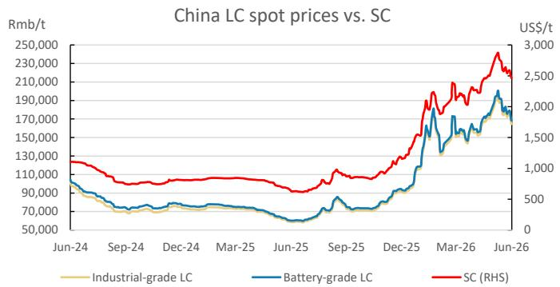

line chart

| Date   | Industrial-grade LC | Battery-grade LC | SC (RHS) |
|--------|---------------------|------------------|----------|
| Jun-24 | ~90,000             | ~110,000         | ~1,100   |
| Sep-24 | ~75,000             | ~85,000          | ~1,050   |
| Dec-24 | ~70,000             | ~80,000          | ~1,050   |
| Mar-25 | ~65,000             | ~75,000          | ~1,050   |
| Jun-25 | ~60,000             | ~70,000          | ~950     |
| Sep-25 | ~75,000             | ~85,000          | ~1,100   |
| Dec-25 | ~90,000             | ~1,100           | ~1,300   |
| Mar-26 | ~1,500              | ~1,800           | ~2,500   |
| Jun-26 | ~1,750              | ~2,250           | ~3,000   |

Source: Baiinfo, MS.

Exhibit 158: Weekly lithium carbonate output in China  

line chart

| Week | 2019 | 2020 | 2021 | 2022 | 2023 | 2024 |
| --- | --- | --- | --- | --- | --- | --- |
| W1 |  |  |  |  |  |  |
| W3 |  |  |  |  |  |  |
| W5 |  |  |  |  |  |  |
| W7 |  |  |  |  |  |  |
| W9 |  |  |  |  |  |  |
| W11 |  |  |  |  |  |  |
| W13 |  |  |  |  |  |  |
| W15 |  |  |  |  |  |  |
| W17 |  |  |  |  |  |  |
| W19 |  |  |  |  |  |  |
| W21 |  |  |  |  |  |  |
| W23 |  |  |  |  |  |  |
| W25 |  |  |  |  |  |  |
| W27 |  |  |  |  |  |  |
| W29 |  |  |  |  |  |  |
| W31 |  |  |  |  |  |  |
| W33 |  |  |  |  |  |  |
| W35 |  |  |  |  |  |  |
| W37 |  |  |  |  |  |  |
| W39 |  |  |  |  |  |  |
| W41 |  |  |  |  |  |  |
| W43 |  |  |  |  |  |  |
| W45 |  |  |  |  |  |  |
| W47 |  |  |  |  |  |  |
| W49 |  |  |  |  |  |  |
| W51 |  |  |  |  |  |  |
|  | 40000 | 30000 | 35000 | 40000 | 70000 | 95000 |
|  | 35000 | 35000 | 35000 | 45000 | 75000 | 85000 |
|  | 35000 | 35000 | 35000 | 45000 | 75000 | 85000 |
|  | 35000 | 35000 | 35000 | 45000 | 75000 | 85000 |
|  | 40000 | 35000 | 35000 | 45000 | 75000 | 85000 |
|  | 45000 | 35000 | 35000 | 45000 | 75000 | 85000 |
|  | 45000 | 35000 | 35000 | 45000 | 75000 | 85000 |

Source: Baiinfo, MS.

Exhibit 160: China – Monthly lithium import prices (US\$/ton)  
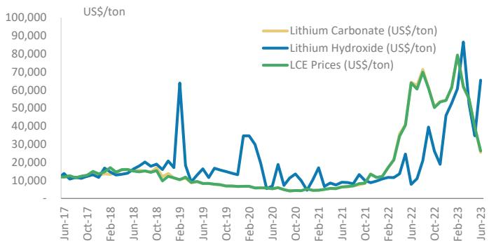

line chart

| Date   | Lithium Carbonate (US$/ton) | Lithium Hydroxide (US$/ton) | LCE Prices (US$/ton) |
|--------|-----------------------------|-----------------------------|----------------------|
| Jun-17 | ~10,000                     | ~10,000                     | ~10,000              |
| Oct-17 | ~10,000                     | ~10,000                     | ~10,000              |
| Feb-18 | ~10,000                     | ~15,000                     | ~15,000              |
| Jun-18 | ~10,000                     | ~20,000                     | ~15,000              |
| Oct-18 | ~10,000                     | ~25,000                     | ~15,000              |
| Feb-19 | ~65,000                     | ~65,000                     | ~15,000              |
| Jun-19 | ~15,000                     | ~15,000                     | ~15,000              |
| Oct-19 | ~15,000                     | ~35,000                     | ~15,000              |
| Feb-20 | ~35,000                     | ~35,000                     | ~15,000              |
| Jun-20 | ~15,000                     | ~15,000                     | ~15,000              |
| Oct-20 | ~15,000                     | ~15,000                     | ~15,000              |
| Feb-21 | ~15,000                     | ~15,000                     | ~15,000              |
| Jun-21 | ~15,000                     | ~15,000                     | ~15,000              |
| Oct-21 | ~15,000                     | ~15,000                     | ~15,000              |
| Feb-22 | ~25,000                     | ~25,000                     | ~45,000              |
| Jun-22 | ~35,000                     | ~35,000                     | ~75,000              |
| Oct-22 | ~45,000                     | ~45,000                     | ~75,000              |
| Feb-23 | ~85,000                     | ~85,000                     | ~85,000              |
| Jun-23 | ~65,000                     | ~65,000                     | ~25,000              |

Source: Chinese Customs, MS.

Exhibit 161: China – Lithium carbonate imports and implied ASP  
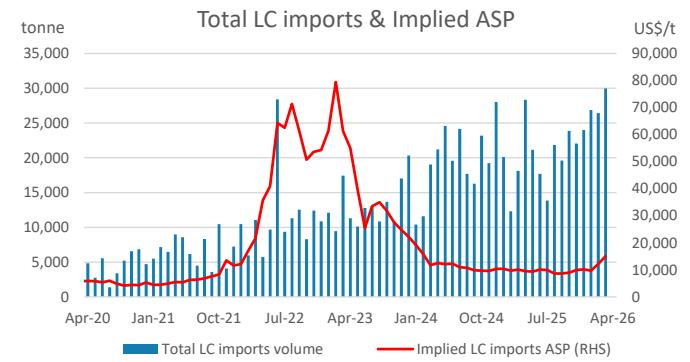

bar-line hybrid chart

Total LC imports & Implied ASP
| Date | Total LC imports volume (tonne) | Implied LC imports ASP (RHS, US$/t) |
|---|---|---|
| Apr-20 | 3,500 | 1000 |
| Jan-21 | 6,000 | 1200 |
| Oct-21 | 10,000 | 1800 |
| Jul-22 | 28,000 | 70,000 |
| Apr-23 | 18,000 | 35,000 |
| Jan-24 | 20,000 | 15,000 |
| Oct-24 | 25,000 | 12,000 |
| Jul-25 | 28,000 | 11,000 |
| Apr-26 | 30,000 | 15,000 |

Source: China Customs, MS.

Exhibit 162: China – Lithium hydroxide exports and implied ASP  
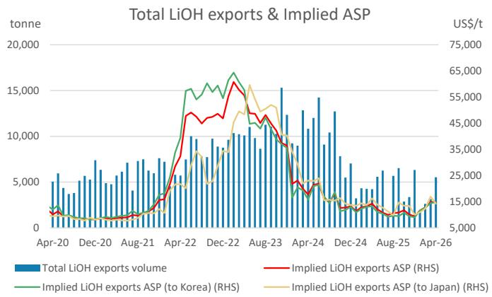

bar-line hybrid chart

Total LiOH exports & Implied ASP
| Date | Total LiOH exports volume (tonne) | Implied LiOH exports ASP (RHS) (US$/t) | Implied LiOH exports ASP (to Korea) (RHS) (US$/t) | Implied LiOH exports ASP (to Japan) (RHS) (US$/t) |
|---|---|---|---|---|
| Apr-20 | 5000 | 10000 | 1500 | 1000 |
| Dec-20 | 5500 | 12000 | 1800 | 1200 |
| Aug-21 | 7000 | 15000 | 2500 | 1500 |
| Apr-22 | 10000 | 35000 | 45000 | 35000 |
| Dec-22 | 12000 | 55000 | 65000 | 55000 |
| Aug-23 | 15000 | 45000 | 55000 | 45000 |
| Apr-24 | 13000 | 35000 | 45000 | 35000 |
| Dec-24 | 12000 | 35000 | 45000 | 35000 |
| Aug-25 | 6500 | 15000 | 1500 | 1500 |
| Apr-26 | 5500 | 15000 | 1500 | 1500 |

Source: China Customs, MS.

Exhibit 163: China – Monthly lithium carbonate imports breakdown  
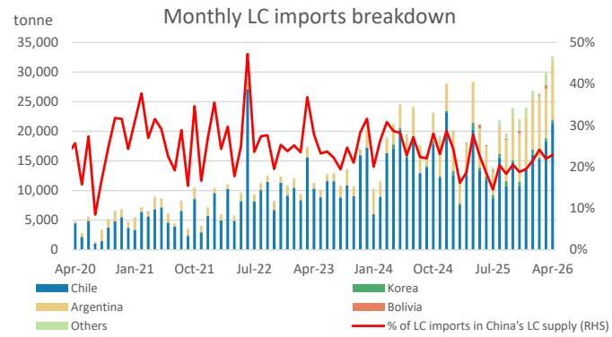

line and bar chart

| Month    | Chile | Argentina | Korea | Bolivia | Others | % of LC imports in China's LC supply (RHS) |
|----------|-------|-----------|-------|---------|--------|---------------------------------------------|
| Apr-20   | 5,000 | 5,000     | 5,000 | 5,000   | 5,000  | 18%                                         |
| Jan-21   | 5,000 | 5,000     | 5,000 | 5,000   | 5,000  | 22%                                         |
| Oct-21   | 5,000 | 5,000     | 5,000 | 5,000   | 5,000  | 24%                                         |
| Jul-22   | 5,000 | 5,000     | 5,000 | 5,000   | 5,000  | 33%                                         |
| Apr-23   | 5,000 | 5,000     | 5,000 | 5,000   | 5,000  | 26%                                         |
| Jan-24   | 5,000 | 5,000     | 5,000 | 5,000   | 5,000  | 22%                                         |
| Oct-24   | 5,000 | 5,000     | 5,000 | 5,000   | 5,000  | 24%                                         |
| Jul-25   | 5,000 | 5,000     | 5,000 | 5,000   | 5,000  | 18%                                         |
| Apr-26   | 5,000 | 5,000     | 5,000 | 5,000   | 5,000  | 16%                                         |

Source: China Customs, MS.

Exhibit 164: China – Monthly lithium hydroxide exports breakdown  
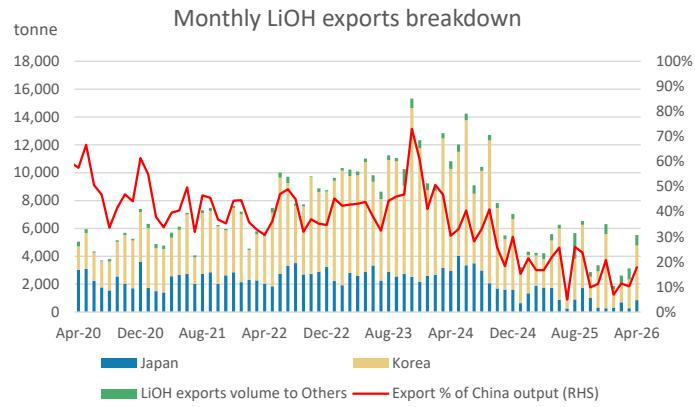

bar-line hybrid

| Month | Japan (tonne) | Korea (tonne) | Export % of China output (RHS) (%) |
| --- | --- | --- | --- |
| Apr-20 | 3000 | 4500 | 100 |
| May-20 | 2800 | 4700 | 95 |
| Jun-20 | 2600 | 4900 | 90 |
| Jul-20 | 2400 | 5100 | 85 |
| Aug-20 | 2200 | 5300 | 80 |
| Sep-20 | 2000 | 5500 | 75 |
| Oct-20 | 1800 | 5700 | 70 |
| Nov-20 | 1600 | 5900 | 65 |
| Dec-20 | 1400 | 6100 | 60 |
| Jan-21 | 1200 | 6300 | 55 |
| Feb-21 | 1000 | 6500 | 50 |
| Mar-21 | 800 | 6700 | 45 |
| Apr-21 | 600 | 6900 | 40 |
| May-21 | 400 | 7100 | 35 |
| Jun-21 | 200 | 7300 | 30 |
| Jul-21 | 100 | 7500 | 25 |
| Aug-21 | 300 | 7700 | 20 |
| Sep-21 | 500 | 7900 | 15 |
| Oct-21 | 800 | 8100 | 10 |
| Nov-21 | 1100 | 8300 | 5 |
| Dec-21 | 1400 | 8500 | 0 |
| Jan-22 | 1700 | 8700 | -5 |
| Feb-22 | 2000 | 8900 | -10 |
| Mar-22 | 2300 | 9100 | -15 |
| Apr-22 | 2600 | 9300 | -20 |
| May-22 | 2900 | 9500 | -25 |
| Jun-22 | 3200 | 9700 | -30 |
| Jul-22 | 3500 | 9900 | -35 |
| Aug-22 | 3800 | 10100 | -40 |
| Sep-22 | 4100 | 10300 | -45 |
| Oct-22 | 4400 | 10500 | -50 |
| Nov-22 | 4700 | 10700 | -55 |
| Dec-22 | 5000 | 10900 | -60 |
| Jan-23 | 5300 | 11100 | -65 |
| Feb-23 | 5600 | 11300 | -70 |
| Mar-23 | 5900 | 11500 | -75 |
| Apr-23 | 6200 | 11700 | -80 |
| May-23 | 6500 | 11900 | -85 |
| Jun-23 | 6800 | 12100 | -90 |
| Jul-23 | 7100 | 12300 | -95 |
| Aug-23 | 7400 | 12500 | -100 |
| Sep-23 | 7700 | 12700 | -105 |
| Oct-23 | 8000 | 12900 | -110 |
| Nov-23 | 8300 | 13100 | -115 |
| Dec-23 | 8600 | 13300 | -120 |
| Jan-24 | 8900 | 13500 | -125 |
| Feb-24 | 9200 | 13700 | -130 |
| Mar-24 | 9500 | 13900 | -135 |
| Apr-24 | 9800 | 14100 | -140 |

Source: China Customs, MS.

Exhibit 165: Monthly cathode production in China by type  
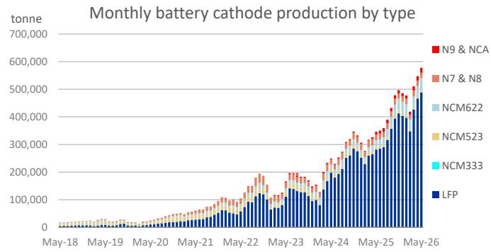

bar chart

| Month    | LFP     | NCM333  | NCM523  | NCM622  | N7 & N8 | N9 & NCA |
| -------- | ------- | ------- | ------- | ------- | ------- | -------- |
| May-18   | 0       | 0       | 0       | 0       | 0       | 0        |
| May-19   | 0       | 0       | 0       | 0       | 0       | 0        |
| May-20   | 0       | 0       | 0       | 0       | 0       | 0        |
| May-21   | 0       | 0       | 0       | 0       | 0       | 0        |
| May-22   | 0       | 0       | 0       | 0       | 0       | 0        |
| May-23   | 0       | 0       | 0       | 0       | 0       | 0        |
| May-24   | 0       | 0       | 0       | 0       | 0       | 0        |
| May-25   | 0       | 0       | 0       | 0       | 0       | 0        |
| May-26   | 0       | 0       | 0       | 0       | 0       | 0        |

Source: SMM, Baiinfo, MS.

Exhibit 166: Monthly cathode production in China by type (%)  
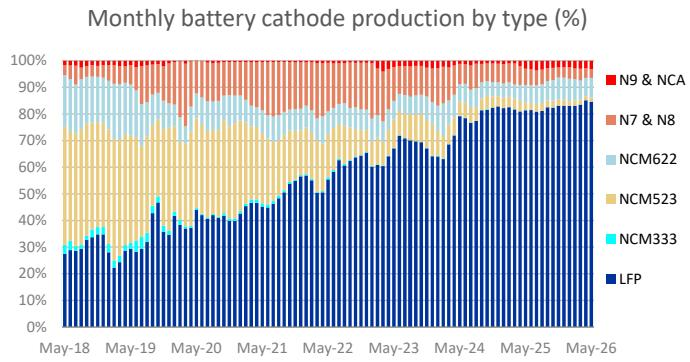

stacked bar chart

Monthly battery cathode production by type (%)
| Month | LFP (%) | NCM333 (%) | NCM523 (%) | NCM622 (%) | N7 & N8 (%) | N9 & NCA (%) |
|---|---|---|---|---|---|---|
| May-18 | 28 | 1 | 0 | 0 | 0 | 0 |
| May-19 | 45 | 1 | 0 | 0 | 0 | 0 |
| May-20 | 40 | 1 | 0 | 0 | 0 | 0 |
| May-21 | 55 | 1 | 0 | 0 | 0 | 0 |
| May-22 | 65 | 1 | 0 | 0 | 0 | 0 |
| May-23 | 70 | 1 | 0 | 0 | 0 | 0 |
| May-24 | 80 | 1 | 0 | 0 | 0 | 0 |
| May-25 | 82 | 1 | 0 | 0 | 0 | 0 |
| May-26 | 85 | 1 | 0 | 0 | 0 | 0 |

Source: SMM, Baiinfo, MS.

Exhibit 167: Japan – Monthly imports (tons)  
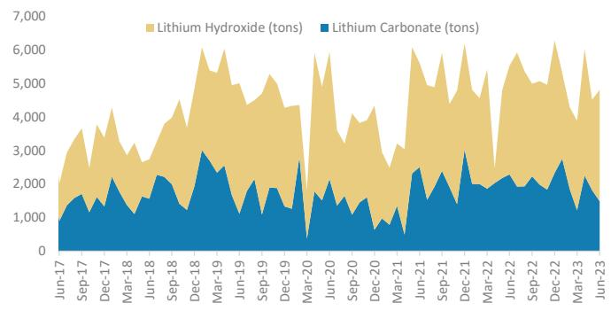

stacked bar chart

| Month    | Lithium Hydroxide (tons) | Lithium Carbonate (tons) |
|----------|--------------------------|--------------------------|
| Jun-17   | ~1,500                   | ~1,000                   |
| Sep-17   | ~2,000                   | ~1,500                   |
| Dec-17   | ~2,500                   | ~1,200                   |
| Mar-18   | ~3,000                   | ~1,800                   |
| Jun-18   | ~2,800                   | ~1,400                   |
| Sep-18   | ~3,500                   | ~1,600                   |
| Dec-18   | ~4,500                   | ~2,500                   |
| Mar-19   | ~5,500                   | ~2,800                   |
| Jun-19   | ~5,000                   | ~2,200                   |
| Sep-19   | ~4,800                   | ~2,000                   |
| Dec-19   | ~4,500                   | ~1,800                   |
| Mar-20   | ~6,000                   | ~1,500                   |
| Jun-20   | ~4,500                   | ~1,200                   |
| Sep-20   | ~4,800                   | ~1,400                   |
| Dec-20   | ~4,200                   | ~1,600                   |
| Mar-21   | ~3,500                   | ~1,800                   |
| Jun-21   | ~6,500                   | ~2,500                   |
| Sep-21   | ~5,500                   | ~2,800                   |
| Dec-21   | ~6,500                   | ~3,500                   |
| Mar-22   | ~5,500                   | ~2,500                   |
| Jun-22   | ~6,500                   | ~2,800                   |
| Sep-22   | ~5,500                   | ~2,500                   |
| Dec-22   | ~6,500                   | ~3,500                   |
| Mar-23   | ~4,500                   | ~2,500                   |
| Jun-23   | ~4,800                   | ~2,800                   |

Source: Japanese Government Statistics, MS.

Exhibit 168: South Korea – Monthly imports (tons)  

stacked bar chart

| Date | Lithium Carbonate (tons) | Lithium Hydroxide (tons) |
|---|---|---|
| Jul-17 | 1500 | 800 |
| Nov-17 | 1600 | 900 |
| Mar-18 | 1700 | 1000 |
| Jul-18 | 1800 | 1100 |
| Nov-18 | 2000 | 1200 |
| Mar-19 | 3500 | 2500 |
| Jul-19 | 2500 | 1500 |
| Nov-19 | 2800 | 1600 |
| Mar-20 | 2200 | 1400 |
| Jul-20 | 2400 | 1700 |
| Nov-20 | 3800 | 3500 |
| Mar-21 | 3500 | 4500 |
| Jul-21 | 4500 | 5500 |
| Nov-21 | 4800 | 6500 |
| Mar-22 | 5500 | 7500 |
| Jul-22 | 4500 | 8500 |
| Nov-22 | 4200 | 9500 |
| Mar-23 | 6500 | 13500 |
| Jul-23 | 4500 | 14500 |

Source: Korea Customs Service, MS.

Exhibit 169: US – Monthly imports (tons)  

stacked bar chart

| Month    | Lithium Carbonate (tons) | Lithium Hydroxide (tons) |
|----------|--------------------------|--------------------------|
| Apr-18   | ~2,000                   | ~100                     |
| Jun-18   | ~1,900                   | ~100                     |
| Aug-18   | ~1,500                   | ~100                     |
| Oct-18   | ~1,400                   | ~100                     |
| Dec-18   | ~1,500                   | ~100                     |
| Feb-19   | ~1,400                   | ~100                     |
| Apr-19   | ~1,500                   | ~100                     |
| Jun-19   | ~1,400                   | ~100                     |
| Aug-19   | ~1,300                   | ~100                     |
| Oct-19   | ~1,400                   | ~100                     |
| Dec-19   | ~1,500                   | ~100                     |
| Feb-20   | ~1,400                   | ~100                     |
| Apr-20   | ~1,300                   | ~100                     |
| Jun-20   | ~1,400                   | ~100                     |
| Aug-20   | ~1,300                   | ~100                     |
| Oct-20   | ~1,200                   | ~100                     |
| Dec-20   | ~800                     | ~50                      |
| Feb-21   | ~1,500                   | ~100                     |
| Apr-21   | ~1,600                   | ~100                     |
| Jun-21   | ~1,700                   | ~100                     |
| Aug-21   | ~1,600                   | ~100                     |
| Oct-21   | ~1,500                   | ~100                     |
| Dec-21   | ~1,600                   | ~150                     |
| Feb-22   | ~2,300                   | ~200                     |
| Apr-22   | ~2,200                   | ~250                     |
| Jun-22   | ~2,300                   | ~250                     |
| Aug-22   | ~2,400                   | ~250                     |
| Oct-22   | ~2,300                   | ~250                     |
| Dec-22   | ~2,400                   | ~250                     |
| Feb-23   | ~2,300                   | ~250                     |
| Apr-23   | ~2,400                   | ~250                     |
| Jun-23   | ~2,300                   | ~250                     |

Source: United States International Trade Commission, MS.

Exhibit 170: US – Monthly exports (tons)  

stacked bar chart

| Month | Lithium Hydroxide (tons) | Lithium Carbonate (tons) |
|---|---|---|
| Jun-18 | 750 | 600 |
| Aug-18 | 900 | 700 |
| Oct-18 | 800 | 650 |
| Dec-18 | 600 | 550 |
| Feb-19 | 1000 | 800 |
| Apr-19 | 950 | 750 |
| Jun-19 | 1050 | 850 |
| Aug-19 | 600 | 450 |
| Oct-19 | 700 | 500 |
| Dec-19 | 1100 | 600 |
| Feb-20 | 750 | 550 |
| Apr-20 | 900 | 650 |
| Jun-20 | 350 | 250 |
| Aug-20 | 650 | 450 |
| Oct-20 | 450 | 350 |
| Dec-20 | 250 | 200 |
| Feb-21 | 750 | 650 |
| Apr-21 | 950 | 850 |
| Jun-21 | 1250 | 950 |
| Aug-21 | 650 | 450 |
| Oct-21 | 850 | 650 |
| Dec-21 | 1150 | 750 |
| Feb-22 | 750 | 450 |
| Apr-22 | 1350 | 1150 |
| Jun-22 | 2150 | 1350 |
| Aug-22 | 950 | 850 |
| Oct-22 | 1700 | 950 |
| Dec-22 | 650 | 450 |
| Feb-23 | 1400 | 750 |
| Apr-23 | 650 | 450 |
| Jun-23 | 1350 | 850 |

Source: United States International Trade Commission, MS.

## Exhibit 171:

Summary of China's lepidolite projects  

stacked bar chart

| Year | Barkam (spodumene) | Yelonggou / Aoyinuo (Jinchuan) | 414 mine (incl. tailings retreatment) | Huashan expansion (Stage II) | Geshili & Baishuidong | Xiangyuan | Jiajika 134 | Yajiang Cuola | Shiziling & Xinfang | Shilong & Xinfang (Phase I & 2) | Jingdu Heyuan | Dahongliutan | Xikeng | Dangang | Mengjin | Tong'an; E'jing; Diyi; Dangtian |
| --- | --- | --- | --- | --- | --- | --- | --- | --- | --- | --- | --- | --- | --- | --- | --- | --- |
| 2023 | 50000 | 10000 | 10000 | 10000 | 10000 | 10000 | 10000 | 10000 | 10000 | 10000 | 10000 | 10000 | 10000 | 10000 | 10000 | 10 |
| 2024 | 75000 | 15000 | 15000 | 15000 | 15000 | 15000 | 15000 | 15000 | 15000 | 15000 | 15000 | 15000 | 15000 | 15000 | 15000 | 15 |
| 2025 | 95000 | 25000 | 25000 | 25000 | 25000 | 25000 | 25000 | 25000 | 25000 | 25000 | 25000 | 25000 | 25000 | 25000 | 25000 | 25 |
| 2026 | 135000 | 45000 | 45000 | 45000 | 45000 | 45000 | 45000 | 45000 | 45000 | 45000 | 45000 | 45000 | 45000 | 45000 | 45000 | 45 |

Source: MS estimates.

## Lithium – Australia

Exhibit 172: Australian spodumene concentrate production on the rise...  
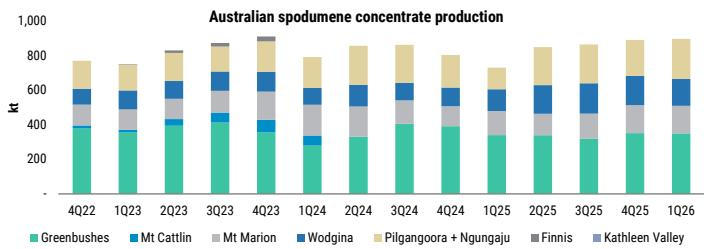

stacked bar chart

| Quarter | Greenbushes | Mt Cattlin | Mt Marion | Wodgina | Pilgangoora + Ngungaju | Finnis | Kathleen Valley |
|---------|-------------|------------|-----------|---------|------------------------|--------|----------------|
| 4Q22    | 380         | 0          | 0         | 150     | 100                    | 0      | 0              |
| 1Q23    | 370         | 0          | 0         | 160     | 100                    | 0      | 0              |
| 2Q23    | 390         | 0          | 0         | 150     | 100                    | 0      | 0              |
| 3Q23    | 400         | 50         | 0         | 160     | 100                    | 0      | 0              |
| 4Q23    | 380         | 50         | 0         | 170     | 100                    | 0      | 0              |
| 1Q24    | 350         | 50         | 0         | 180     | 100                    | 0      | 0              |
| 2Q24    | 360         | 50         | 0         | 190     | 100                    | 0      | 0              |
| 3Q24    | 370         | 50         | 0         | 200     | 100                    | 0      | 0              |
| 4Q24    | 380         | 50         | 0         | 210     | 100                    | 0      | 0              |
| 1Q25    | 360         | 50         | 0         | 220     | 100                    | 0      | 0              |
| 2Q25    | 370         | 50         | 0         | 230     | 100                    | 0      | 0              |
| 3Q25    | 380         | 50         | 0         | 240     | 100                    | 0      | 0              |
| 4Q25    | 390         | 50         | 0         | 250     | 100                    | 0      | 0              |
| 1Q26    | 370         | 50         | 0         | 260     | 100                    | 0      | 0              |

Source: Company reports, MS.

Exhibit 173: ...along with shipments  
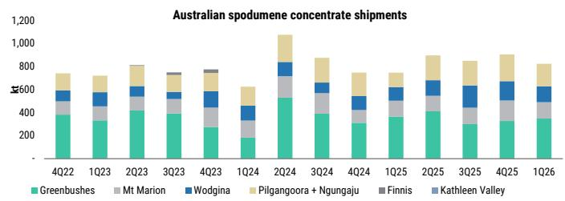

stacked bar chart

| Quarter | Greenbushes | Mt Marion | Wodgina | Pilgangoora + Ngungaju | Finnis | Kathleen Valley |
|---------|-------------|-----------|---------|------------------------|--------|-----------------|
| 4Q22    | 380         | 100       | 100     | 100                    | 100    | 0               |
| 1Q23    | 320         | 100       | 100     | 100                    | 100    | 0               |
| 2Q23    | 420         | 100       | 100     | 150                    | 100    | 0               |
| 3Q23    | 380         | 100       | 100     | 150                    | 100    | 0               |
| 4Q23    | 250         | 150       | 150     | 150                    | 100    | 0               |
| 1Q24    | 180         | 150       | 150     | 150                    | 100    | 0               |
| 2Q24    | 520         | 150       | 150     | 200                    | 100    | 0               |
| 3Q24    | 380         | 150       | 150     | 200                    | 100    | 0               |
| 4Q24    | 320         | 150       | 150     | 200                    | 100    | 0               |
| 1Q25    | 380         | 150       | 150     | 150                    | 100    | 0               |
| 2Q25    | 420         | 150       | 150     | 200                    | 100    | 0               |
| 3Q25    | 320         | 150       | 150     | 200                    | 100    | 0               |
| 4Q25    | 380         | 150       | 150     | 200                    | 100    | 0               |
| 1Q26    | 380         | 150       | 150     | 200                    | 100    | 0               |

Source: Company reports, MS.

Exhibit 174: Inventory build currently limited at Australian mines  
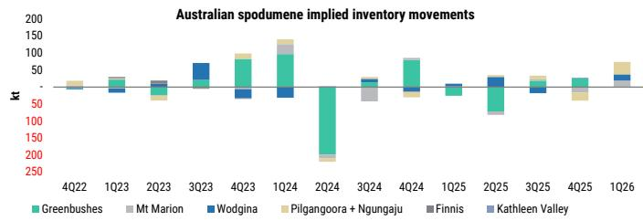

bar chart

| Quarter | Greenbushes | Mt Marion | Wodgina | Pilgangoora + Ngungaju | Finnis | Kathleen Valley |
|---------|-------------|-----------|---------|------------------------|--------|-----------------|
| 4Q22    | -           | -         | -       | -                      | -      | -               |
| 1Q23    | -           | -         | -       | -                      | -      | -               |
| 2Q23    | -           | -         | -       | -                      | -      | -               |
| 3Q23    | -           | -         | -       | -                      | -      | -               |
| 4Q23    | -           | -         | -       | -                      | -      | -               |
| 1Q24    | -           | -         | -       | -                      | -      | -               |
| 2Q24    | -           | -         | -       | -                      | -      | -               |
| 3Q24    | -           | -         | -       | -                      | -      | -               |
| 4Q24    | -           | -         | -       | -                      | -      | -               |
| 1Q25    | -           | -         | -       | -                      | -      | -               |
| 2Q25    | -           | -         | -       | -                      | -      | -               |
| 3Q25    | -           | -         | -       | -                      | -      | -               |
| 4Q25    | -           | -         | -       | -                      | -      | -               |
| 1Q26    | -           | -         | -       | -                      | -      | -               |

Source: Company reports, MS.

## Lithium – Africa

Exhibit 175: MS African supply from 2023-30e with increases mainly from Zimbabwe

<table><tr><td>Project</td><td>Status</td><td>Country</td><td>2023</td><td>2024</td><td>2025</td><td>2026</td><td>2027</td><td>2028</td><td>2029</td><td>2030</td></tr><tr><td>Bikita</td><td>Operating</td><td>Zimbabwe</td><td>9500</td><td>18000</td><td>18000</td><td>20000</td><td>20000</td><td>20000</td><td>20000</td><td>20000</td></tr><tr><td>Bikita expansion</td><td>Operating</td><td>Zimbabwe</td><td>18000</td><td>30000</td><td>35000</td><td>50000</td><td>50000</td><td>50000</td><td>50000</td><td>50000</td></tr><tr><td>Arcadia</td><td>Operating</td><td>Zimbabwe</td><td>10000</td><td>25000</td><td>45000</td><td>70000</td><td>100000</td><td>100000</td><td>100000</td><td>100000</td></tr><tr><td>Kamatavi</td><td>Operating</td><td>Zimbabwe</td><td>0</td><td>10000</td><td>25000</td><td>43800</td><td>43800</td><td>43800</td><td>43800</td><td>43800</td></tr><tr><td>Sabi</td><td>Operating</td><td>Zimbabwe</td><td>3000</td><td>22500</td><td>24500</td><td>24500</td><td>24500</td><td>24500</td><td>24500</td><td>24500</td></tr><tr><td>Zulu</td><td>Operating</td><td>Zimbabwe</td><td>2000</td><td>3500</td><td>4500</td><td>6300</td><td>6300</td><td>6300</td><td>6300</td><td>6300</td></tr><tr><td>Step Aside</td><td>Project</td><td>Zimbabwe</td><td>0</td><td>0</td><td>0</td><td>0</td><td>0</td><td>0</td><td>0</td><td>0</td></tr><tr><td>Karibib</td><td>Project</td><td>Namibia</td><td>0</td><td>0</td><td>0</td><td>0</td><td>0</td><td>0</td><td>0</td><td>0</td></tr><tr><td>Kenticha</td><td>Operating</td><td>Ethiopia</td><td>8000</td><td>10000</td><td>15000</td><td>25000</td><td>30000</td><td>30000</td><td>30000</td><td>30000</td></tr><tr><td>Manono</td><td>Project</td><td>DRC</td><td>0</td><td>0</td><td>0</td><td>5000</td><td>20000</td><td>40000</td><td>60000</td><td>75000</td></tr><tr><td>Goulamina</td><td>Operating</td><td>Mali</td><td>0</td><td>1000</td><td>35000</td><td>63000</td><td>75000</td><td>98000</td><td>98000</td><td>98000</td></tr><tr><td>Bougouni Phase 1</td><td>Operating</td><td>Mali</td><td>0</td><td>0</td><td>8000</td><td>10000</td><td>15000</td><td>15000</td><td>15000</td><td>15000</td></tr><tr><td>Bougouni Phase 2</td><td>Project</td><td>Mali</td><td>0</td><td>0</td><td>0</td><td>0</td><td>0</td><td>10000</td><td>20000</td><td>28000</td></tr><tr><td>Nasarawa</td><td>Operating</td><td>Nigeria</td><td>125.97</td><td>5000</td><td>12500</td><td>20000</td><td>20000</td><td>20000</td><td>20000</td><td>20000</td></tr><tr><td>Ewoyaa</td><td>Project</td><td>Ghana</td><td>0</td><td>0</td><td>0</td><td>0</td><td>5000</td><td>7500</td><td>12000</td><td>15000</td></tr><tr><td>Total Africa Supply</td><td></td><td>Total Africa Supply</td><td>50625.97</td><td>125000</td><td>222500</td><td>337600</td><td>409600</td><td>465100</td><td>499600</td><td>525600</td></tr></table>

Source: MS estimates.

## Lithium – Downstream Margins

Exhibit 176: Lithium carbonate refining cost curve  

bar chart

Lithium carbonate chemicals refining costs (US$/t, kt carbonate)
| Category | Refining Cost (US$/t) |
|---|---|
| Direct brine | 15.0 |
| Integrated spodumene | 8.0 |
| Lepidolite | 17.0 |
| Non-integrated carbonate upgrading | 24.0 |
| Non-integrated spodumene | 31.0 |
cif North Asia delivered spot (horizontal dashed line at ~38.0) and China ex-works/ex-VAT spot (horizontal dashed line at ~28.0) (horizontal dashed line at ~38.0)

Source: Wood Mackenzie, MS.

Exhibit 177: Lithium hydroxide refining cost curve  

bar chart

Lithium hydroxide chemicals refining costs (US$/t, kt hydroxide)
| Method | Refining Cost (US$/t) |
|---|---|
| Integrated spodumene | 7.5 |
| Integrated carbonate upgrading | 8.0 |
| Direct brine | 12.0 |
| Non-integrated carbonate upgrading | 22.0 |
| Non-integrated spodumene | 29.0 |
cif North Asia delivered spot | 38.0 |
China ex-works/ex-VAT spot | 30.0 |

Source: Wood Mackenzie, MS.

Exhibit 178: Feedstock costs make up \~85% of non-integrated converters' total cost  
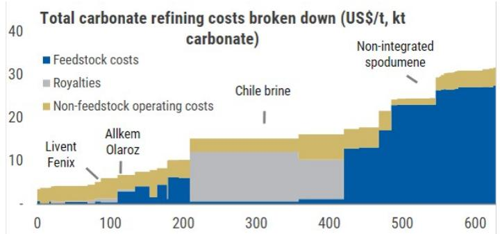

stacked bar chart

Total carbonate refining costs broken down (US$/t, kt carbonate)
| Category | Feedstock costs (US$/t) | Royalties (US$/t) | Non-feedstock operating costs (US$/t) |
|---|---|---|---|
| Livent Fenix | 0.5 | 0.2 | 3.0 |
| Allkem Olaroz | 1.0 | 0.5 | 4.0 |
| Chile brine | 0.8 | 1.0 | 6.0 |
| Non-integrated spodumene | 2.5 | 0.5 | 4.0 |
| Total | 3.0 | 0.5 | 7.0 |

Source: Wood Mackenzie, MS.

Exhibit 179: Margins of non-integrated spodumene carbonate refiners have declined sharply this year  
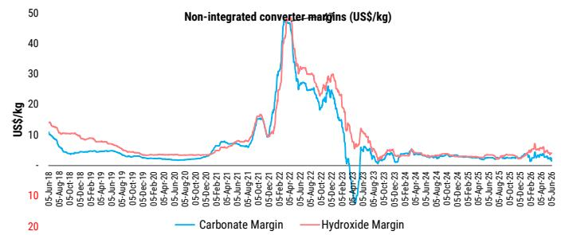

line chart

| Date       | Carbonate Margin | Hydroxide Margin |
| ---------- | ---------------- | ---------------- |
| 05-Jun-18  | ~10              | ~15              |
| 05-Aug-18  | ~8               | ~14              |
| 05-Oct-18  | ~7               | ~13              |
| 05-Dec-18  | ~6               | ~12              |
| 05-Feb-19  | ~5               | ~11              |
| 05-Apr-19  | ~4               | ~10              |
| 05-Jun-19  | ~3               | ~9               |
| 05-Aug-19  | ~2               | ~8               |
| 05-Oct-19  | ~1               | ~7               |
| 05-Feb-20  | ~0.5             | ~6               |
| 05-Apr-20  | ~0.3             | ~5               |
| 05-Jun-20  | ~0.2             | ~4               |
| 05-Aug-20  | ~0.1             | ~3               |
| 05-Oct-20  | ~0.05            | ~2               |
| 05-Feb-21  | ~0.03            | ~1               |
| 05-Apr-21  | ~0.02            | ~0.5             |
| 05-Jun-21  | ~0.01            | ~0.3             |
| 05-Aug-21  | ~0.005           | ~0.2             |
| 05-Oct-21  | ~0.003           | ~0.1             |
| 05-Feb-22  | ~0.002           | ~0.05            |
| 05-Apr-22  | ~0.001           | ~0.03            |
| 05-Jun-22  | ~0.0005          | ~0.02            |
| 05-Aug-22  | ~0.0003          | ~0.01            |
| 05-Oct-22  | ~0.0002          | ~0.005           |
| 05-Feb-23  | ~0.0001          | ~0.003           |
| 05-Apr-23  | ~0.00005         | ~0.002           |
| 05-Jun-23  | ~0.00003         | ~0.001           |
| 05-Aug-23  | ~0.00002         | ~0.0005          |
| 05-Oct-23  | ~0.00001         | ~0.0003          |
| 05-Feb-24  | ~0.000005        | ~0.0002          |
| 05-Apr-24  | ~0.000003        | ~0.0001          |
| 05-Jun-24  | ~0.000002        | ~0.0001          |
| 05-Aug-24  | ~0.000001        | ~0.0001          |
| 05-Oct-24  | ~0.000001        | ~0.0001          |
| 05-Feb-25  | ~0.000001        | ~0.0001          |
| 05-Apr-25  | ~0.000001        | ~0.0001          |
| 05-Jun-25  | ~0.000001        | ~0.0001          |
| 05-Aug-25  | ~0.000001        | ~0.0001          |
| 05-Oct-25  | ~0.000001        | ~0.0001          |
| 05-Feb-26  | ~0.000001        | ~0.0001          |
| 05-Apr-26  | ~0.000001        | ~0.0001          |
| 05-Jun-26  | ~0.000001        | ~0.0001          |

Source: Thomson Reuters Eikon, MS.

## Commodities: Graphite

Exhibit 180: China – artificial graphite import volumes  
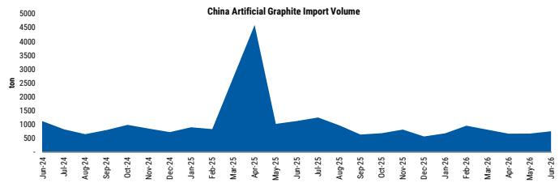

line chart

| Month    | Volume (ton) |
| -------- | ------------ |
| Jun-24   | 1000         |
| Jul-24   | 800          |
| Aug-24   | 700          |
| Sep-24   | 900          |
| Oct-24   | 1000         |
| Nov-24   | 800          |
| Dec-24   | 700          |
| Jan-25   | 900          |
| Feb-25   | 1000         |
| Mar-25   | 3500         |
| Apr-25   | 4500         |
| May-25   | 1000         |
| Jun-25   | 1100         |
| Jul-25   | 1200         |
| Aug-25   | 1100         |
| Sep-25   | 800          |
| Oct-25   | 700          |
| Nov-25   | 900          |
| Dec-25   | 600          |
| Jan-26   | 800          |
| Feb-26   | 1000         |
| Mar-26   | 900          |
| Apr-26   | 700          |
| May-26   | 800          |
| Jun-26   | 900          |

Source: Refinitiv, MS.

Exhibit 181: China – artificial graphite export volumes  
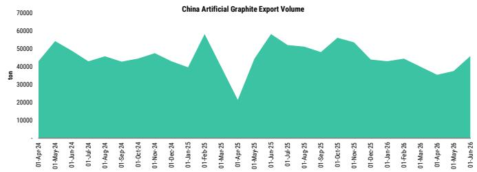

area chart

China Artificial Graphite Export Volume
| Date | Export Volume (ton) |
|---|---|
| 01-Apr-24 | 45000 |
| 01-May-24 | 55000 |
| 01-Jun-24 | 50000 |
| 01-Jul-24 | 40000 |
| 01-Aug-24 | 45000 |
| 01-Sep-24 | 40000 |
| 01-Oct-24 | 45000 |
| 01-Nov-24 | 48000 |
| 01-Dec-24 | 42000 |
| 01-Jan-25 | 38000 |
| 01-Feb-25 | 60000 |
| 01-Mar-25 | 20000 |
| 01-Apr-25 | 45000 |
| 01-May-25 | 58000 |
| 01-Jun-25 | 55000 |
| 01-Jul-25 | 52000 |
| 01-Aug-25 | 50000 |
| 01-Sep-25 | 48000 |
| 01-Oct-25 | 57000 |
| 01-Nov-25 | 53000 |
| 01-Dec-25 | 42000 |
| 01-Jan-26 | 41000 |
| 01-Feb-26 | 43000 |
| 01-Mar-26 | 38000 |
| 01-Apr-26 | 35000 |
| 01-May-26 | 38000 |
| 01-Jun-26 | 45000 |

Source: Refinitiv, MS.

Exhibit 182: China – natural spherical graphite import volumes  
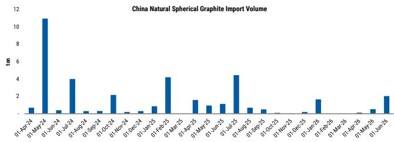

bar chart

China Natural Spherical Graphite Import Volume
| Date | Import Volume (ton) |
|---|---|
| 01-Apr-24 | 0.8 |
| 01-May-24 | 11.0 |
| 01-Jun-24 | 0.5 |
| 01-Jul-24 | 4.0 |
| 01-Aug-24 | 0.3 |
| 01-Sep-24 | 0.3 |
| 01-Oct-24 | 0.3 |
| 01-Nov-24 | 2.0 |
| 01-Dec-24 | 0.3 |
| 01-Jan-25 | 0.3 |
| 01-Feb-25 | 1.0 |
| 01-Mar-25 | 4.0 |
| 01-Apr-25 | 0.0 |
| 01-May-25 | 1.7 |
| 01-Jun-25 | 1.0 |
| 01-Jul-25 | 1.3 |
| 01-Aug-25 | 4.3 |
| 01-Sep-25 | 0.7 |
| 01-Oct-25 | 0.5 |
| 01-Nov-25 | 0.1 |
| 01-Dec-25 | 0.3 |
| 01-Jan-26 | 1.8 |
| 01-Feb-26 | 0.0 |
| 01-Mar-26 | 0.3 |
| 01-Apr-26 | 0.5 |
| 01-May-26 | 0.8 |
| 01-Jun-26 | 2.0 |

Source: Refinitiv, MS.

Exhibit 183: China – natural spherical graphite export volumes  
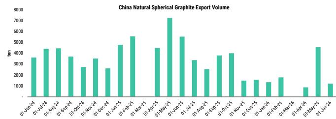

bar chart

China Natural Spherical Graphite Export Volume
| Date | Export Volume (M) |
|---|---|
| 01-Jun-24 | 3500 |
| 01-Jul-24 | 4800 |
| 01-Aug-24 | 4700 |
| 01-Sep-24 | 3600 |
| 01-Oct-24 | 2700 |
| 01-Nov-24 | 3400 |
| 01-Dec-24 | 2600 |
| 01-Jan-25 | 4900 |
| 01-Feb-25 | 5500 |
| 01-Mar-25 | 4500 |
| 01-Apr-25 | 7200 |
| 01-May-25 | 5500 |
| 01-Jun-25 | 3200 |
| 01-Jul-25 | 2500 |
| 01-Aug-25 | 3700 |
| 01-Sep-25 | 3900 |
| 01-Oct-25 | 3900 |
| 01-Nov-25 | 1500 |
| 01-Dec-25 | 1600 |
| 01-Jan-26 | 1400 |
| 01-Feb-26 | 1800 |
| 01-Mar-26 | 800 |
| 01-Apr-26 | 4800 |
| 01-May-26 | 1100 |
| 01-Jun-26 | 1100 |

Source: Refinitiv, MS. Note: Data for Mar-May 23 not available from data source.

Exhibit 184: Graphite prices (US\$/t)  
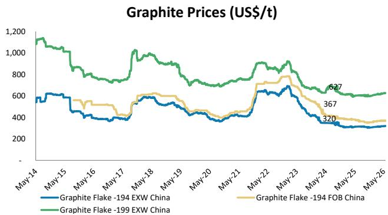

line chart

| Date   | Graphite Flake -194 EXW China | Graphite Flake -194 FOB China | Graphite Flake -199 EXW China |
|--------|-------------------------------|-------------------------------|-------------------------------|
| May-26 | 320                           | 367                           | 627                           |

Source: Refinitiv, Asian Metal, MS.

## Commodities: Rare Earths

Exhibit 185: China – Rare Earths Exports  
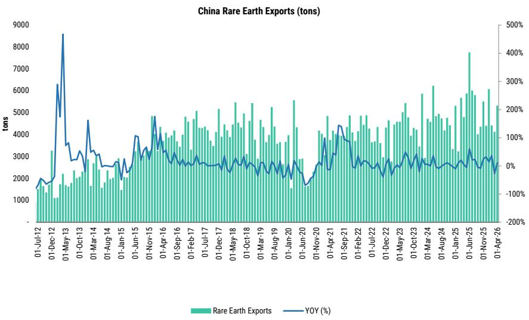

line and bar chart

| Date       | Rare Earth Exports (tons) | YOY (%) |
|------------|----------------------------|---------|
| 01-Jul-12  | ~1,500                     | ~-10%   |
| 01-Dec-12  | ~3,500                     | ~-5%    |
| 01-May-13  | ~8,500                     | ~450%   |
| 01-Oct-13  | ~2,500                     | ~-5%    |
| 01-Mar-14  | ~4,500                     | ~-10%   |
| 01-Aug-14  | ~2,500                     | ~-5%    |
| 01-Jan-15  | ~3,000                     | ~-5%    |
| 01-Jun-15  | ~4,500                     | ~-10%   |
| 01-Nov-15  | ~4,800                     | ~-5%    |
| 01-Apr-16  | ~3,500                     | ~-5%    |
| 01-Sep-16  | ~4,500                     | ~-5%    |
| 01-Feb-17  | ~4,800                     | ~-5%    |
| 01-Jul-17  | ~4,200                     | ~-5%    |
| 01-Dec-17  | ~4,500                     | ~-5%    |
| 01-May-18  | ~5,500                     | ~-5%    |
| 01-Oct-18  | ~4,800                     | ~-5%    |
| 01-Mar-19  | ~4,500                     | ~-5%    |
| 01-Aug-19  | ~3,800                     | ~-5%    |
| 01-Jan-20  | ~5,500                     | ~-5%    |
| 01-Jun-20  | ~4,200                     | ~-5%    |
| 01-Nov-20  | ~4,800                     | ~-5%    |
| 01-Apr-21  | ~4,500                     | ~-5%    |
| 01-Sep-21  | ~4,800                     | ~-5%    |
| 01-Feb-22  | ~4,500                     | ~-5%    |
| 01-Jul-22  | ~4,800                     | ~-5%    |
| 01-Dec-22  | ~4,500                     | ~-5%    |
| 01-May-23  | ~5,500                     | ~-5%    |
| 01-Oct-23  | ~4,800                     | ~-5%    |
| 01-Mar-24  | ~6,200                     | ~-5%    |
| 01-Aug-24  | ~4,800                     | ~-5%    |
| 01-Jan-25  | ~5,800                     | ~-5%    |
| 01-Jun-25  | ~7,800                     | ~-5%    |
| 01-Nov-25  | ~6,200                     | ~-5%    |
| 01-Apr-26  | ~4,800                     | ~-5%    |

Source: Refinitiv, MS.

Exhibit 186: China – Industrial Ex-factory PPI, rare earths metal ore mining  
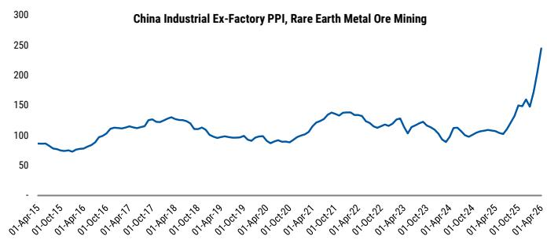

line chart

| Date       | Value |
| ---------- | ----- |
| 01-Apr-15  | 80    |
| 01-Oct-15  | 75    |
| 01-Apr-16  | 85    |
| 01-Oct-16  | 90    |
| 01-Apr-17  | 100   |
| 01-Oct-17  | 110   |
| 01-Apr-18  | 120   |
| 01-Oct-18  | 115   |
| 01-Apr-19  | 105   |
| 01-Oct-19  | 95    |
| 01-Apr-20  | 90    |
| 01-Oct-20  | 95    |
| 01-Apr-21  | 105   |
| 01-Oct-21  | 130   |
| 01-Apr-22  | 140   |
| 01-Oct-22  | 135   |
| 01-Apr-23  | 125   |
| 01-Oct-23  | 115   |
| 01-Apr-24  | 95    |
| 01-Oct-24  | 105   |
| 01-Apr-25  | 110   |
| 01-Oct-25  | 130   |
| 01-Apr-26  | 250   |

Source: NBS of China, Refinitiv, MS.

Exhibit 187: China – Industrial Ex-factory PPI, rare earths metal smelting  
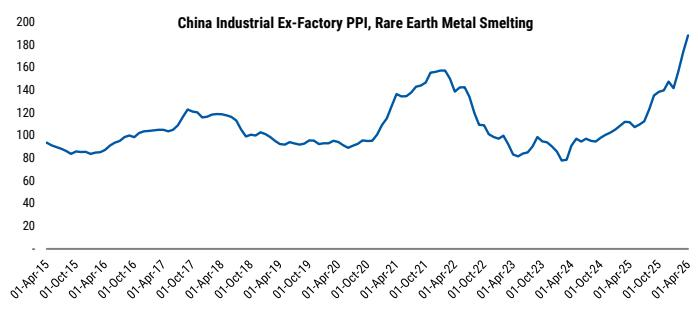

line chart

| Date       | Value |
| ---------- | ----- |
| 01-Apr-15  | 90    |
| 01-Oct-15  | 85    |
| 01-Apr-16  | 95    |
| 01-Oct-16  | 100   |
| 01-Apr-17  | 105   |
| 01-Oct-17  | 110   |
| 01-Apr-18  | 120   |
| 01-Oct-18  | 115   |
| 01-Apr-19  | 105   |
| 01-Oct-19  | 95    |
| 01-Apr-20  | 90    |
| 01-Oct-20  | 95    |
| 01-Apr-21  | 130   |
| 01-Oct-21  | 150   |
| 01-Apr-22  | 140   |
| 01-Oct-22  | 100   |
| 01-Apr-23  | 80    |
| 01-Oct-23  | 90    |
| 01-Apr-24  | 75    |
| 01-Oct-24  | 95    |
| 01-Apr-25  | 105   |
| 01-Oct-25  | 130   |
| 01-Apr-26  | 190   |

Source: Refinitiv, MS.

Exhibit 188: China – NdPr FOB prices  
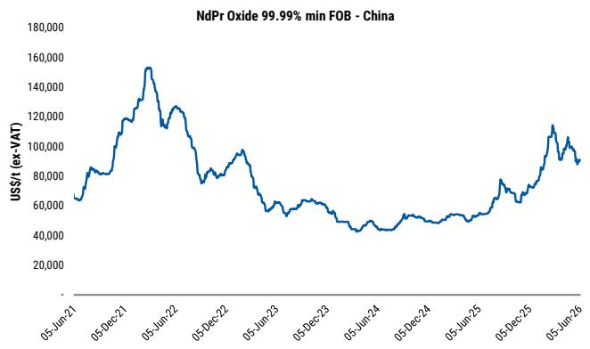

line chart

| Date       | US$/t (ex-VAT) |
| ---------- | -------------- |
| 05-Jun-21  | ~60,000        |
| 05-Dec-21  | ~120,000       |
| 05-Jun-22  | ~150,000       |
| 05-Dec-22  | ~80,000        |
| 05-Jun-23  | ~60,000        |
| 05-Dec-23  | ~50,000        |
| 05-Jun-24  | ~45,000        |
| 05-Dec-24  | ~50,000        |
| 05-Jun-25  | ~70,000        |
| 05-Dec-25  | ~110,000       |
| 05-Jun-26  | ~99.99%        |

Source: Refinitiv, MS.

Exhibit 189: China – neodymium oxide FOB prices  
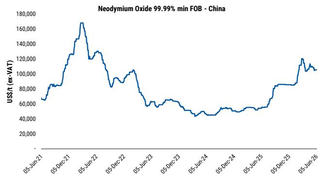

line chart

| Date       | US$/t (ex-VAT) |
| ---------- | -------------- |
| 05-Jun-21  | ~65,000        |
| 05-Dec-21  | ~170,000       |
| 05-Jun-22  | ~130,000       |
| 05-Dec-22  | ~100,000       |
| 05-Jun-23  | ~60,000        |
| 05-Dec-23  | ~55,000        |
| 05-Jun-24  | ~45,000        |
| 05-Dec-24  | ~55,000        |
| 05-Jun-25  | ~85,000        |
| 05-Dec-25  | ~115,000       |
| 05-Jun-26  | ~110,000       |

Source: Refinitiv, MS.

Exhibit 190: China – praseodymium oxide FOB prices  
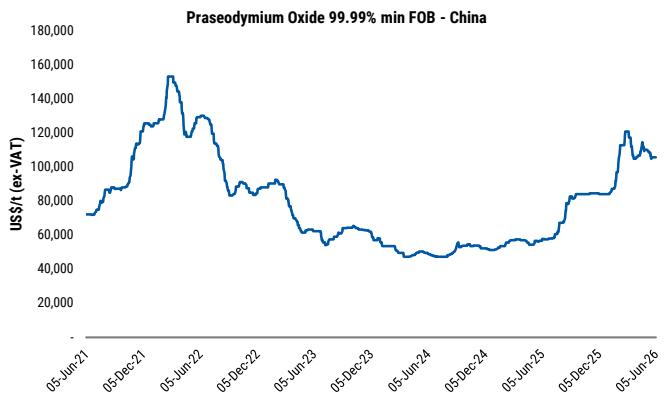

line chart

| Date       | US$/t (ex-VAT) |
| ---------- | -------------- |
| 05-Jun-21  | ~70,000        |
| 05-Dec-21  | ~150,000       |
| 05-Jun-22  | ~130,000       |
| 05-Dec-22  | ~85,000        |
| 05-Jun-23  | ~60,000        |
| 05-Dec-23  | ~55,000        |
| 05-Jun-24  | ~50,000        |
| 05-Dec-24  | ~55,000        |
| 05-Jun-25  | ~65,000        |
| 05-Dec-25  | ~85,000        |
| 05-Jun-26  | ~110,000       |

Source: Refinitiv, MS.

Exhibit 191: China – terbium oxide FOB prices  
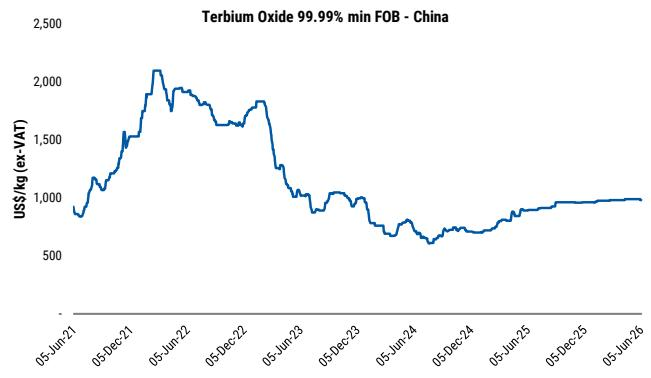

line chart

| Date       | US$/kg (ex-VAT) |
| ---------- | --------------- |
| 05-Jun-21  | ~850            |
| 05-Dec-21  | ~1,500          |
| 05-Jun-22  | ~2,100          |
| 05-Dec-22  | ~1,800          |
| 05-Jun-23  | ~1,000          |
| 05-Dec-23  | ~900            |
| 05-Jun-24  | ~700            |
| 05-Dec-24  | ~650            |
| 05-Jun-25  | ~800            |
| 05-Dec-25  | ~950            |
| 05-Jun-26  | ~1,000          |

Source: Refinitiv, MS.

Exhibit 192: China – lanthanum oxide FOB prices  
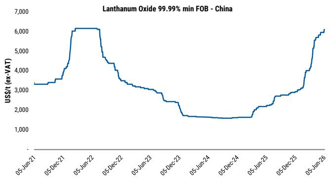

line chart

| Date       | US$/t (ex-VAT) |
| ---------- | -------------- |
| 05-Jun-21  | 3,000          |
| 05-Dec-21  | 4,000          |
| 05-Jun-22  | 6,000          |
| 05-Dec-22  | 4,500          |
| 05-Jun-23  | 3,500          |
| 05-Dec-23  | 2,500          |
| 05-Jun-24  | 1,800          |
| 05-Dec-24  | 1,700          |
| 05-Jun-25  | 2,000          |
| 05-Dec-25  | 3,000          |
| 05-Jun-26  | 6,000          |

Source: Refinitiv, MS.

Exhibit 193: China – cerium oxide FOB prices  
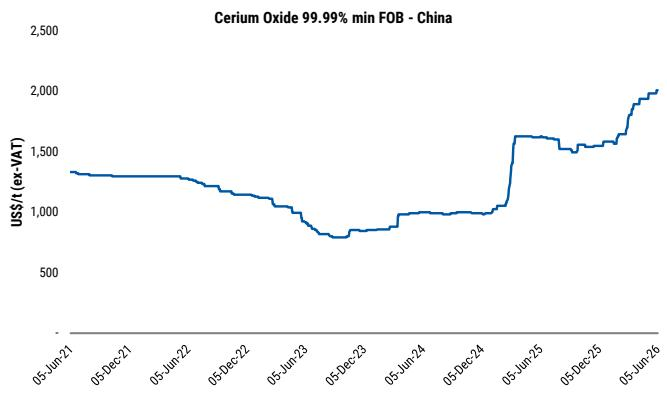

line chart

| Date       | US$/t (ex-VAT) |
| ---------- | -------------- |
| 05-Jun-21  | 1300           |
| 05-Dec-21  | 1300           |
| 05-Jun-22  | 1250           |
| 05-Dec-22  | 1150           |
| 05-Jun-23  | 800            |
| 05-Dec-23  | 850            |
| 05-Jun-24  | 1000           |
| 05-Dec-24  | 1000           |
| 05-Jun-25  | 1600           |
| 05-Dec-25  | 1550           |
| 05-Jun-26  | 2000           |

Source: Refinitiv, MS.

## Commodities: Nickel

Exhibit194: Nickel exchange inventories and days of consumption  
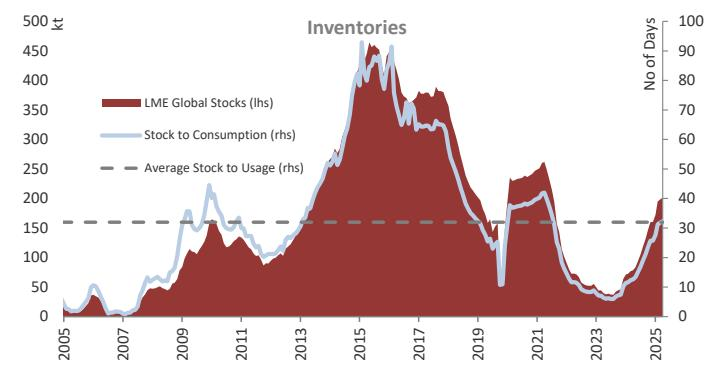

line chart

| Year | LME Global Stocks (lhs) | Stock to Consumption (rhs) | Average Stock to Usage (rhs) |
|------|--------------------------|----------------------------|------------------------------|
| 2005 | ~20                      | ~10                        | 30                           |
| 2006 | ~30                      | ~15                        | 30                           |
| 2007 | ~50                      | ~20                        | 30                           |
| 2008 | ~100                     | ~50                        | 30                           |
| 2009 | ~150                     | ~100                       | 30                           |
| 2010 | ~200                     | ~150                       | 30                           |
| 2011 | ~150                     | ~100                       | 30                           |
| 2012 | ~100                     | ~75                        | 30                           |
| 2013 | ~150                     | ~100                       | 30                           |
| 2014 | ~250                     | ~200                       | 30                           |
| 2015 | ~450                     | ~400                       | 30                           |
| 2016 | ~450                     | ~450                       | 30                           |
| 2017 | ~350                     | ~350                       | 30                           |
| 2018 | ~300                     | ~300                       | 30                           |
| 2019 | ~250                     | ~250                       | 30                           |
| 2020 | ~150                     | ~150                       | 30                           |
| 2021 | ~250                     | ~250                       | 30                           |
| 2022 | ~150                     | ~150                       | 30                           |
| 2023 | ~50                      | ~50                        | 30                           |
| 2024 | ~150                     | ~150                       | 30                           |
| 2025 | ~250                     | ~250                       | 30                           |

Source: Bloomberg, INSG, MS.

Exhibit195: Nickel LME price  
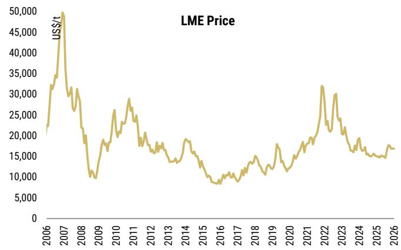

line chart

| Year | LME Price (US$/t) |
|------|-------------------|
| 2006 | ~20,000           |
| 2007 | ~50,000           |
| 2008 | ~30,000           |
| 2009 | ~10,000           |
| 2010 | ~25,000           |
| 2011 | ~28,000           |
| 2012 | ~18,000           |
| 2013 | ~15,000           |
| 2014 | ~18,000           |
| 2015 | ~15,000           |
| 2016 | ~10,000           |
| 2017 | ~12,000           |
| 2018 | ~15,000           |
| 2019 | ~18,000           |
| 2020 | ~15,000           |
| 2021 | ~20,000           |
| 2022 | ~32,000           |
| 2023 | ~30,000           |
| 2024 | ~18,000           |
| 2025 | ~15,000           |
| 2026 | ~17,000           |

Source: Bloomberg, INSG, MS.

Exhibit196: Raw materials: Nickel laterite ore inventories  
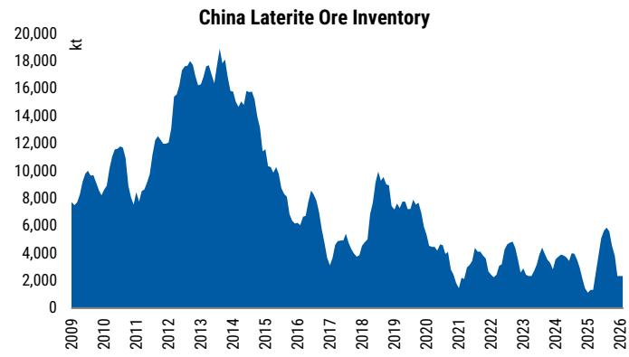

area chart

| Year | Inventory (kt) |
| ---- | -------------- |
| 2009 | ~7,500         |
| 2010 | ~10,000        |
| 2011 | ~11,500        |
| 2012 | ~13,000        |
| 2013 | ~17,500        |
| 2014 | ~18,500        |
| 2015 | ~15,500        |
| 2016 | ~8,500         |
| 2017 | ~4,500         |
| 2018 | ~9,500         |
| 2019 | ~7,500         |
| 2020 | ~4,500         |
| 2021 | ~3,500         |
| 2022 | ~4,500         |
| 2023 | ~3,500         |
| 2024 | ~4,500         |
| 2025 | ~3,500         |
| 2026 | ~6,500         |

Source: Bloomberg, MS.

Exhibit197: Raw materials: China's ore imports, by source  
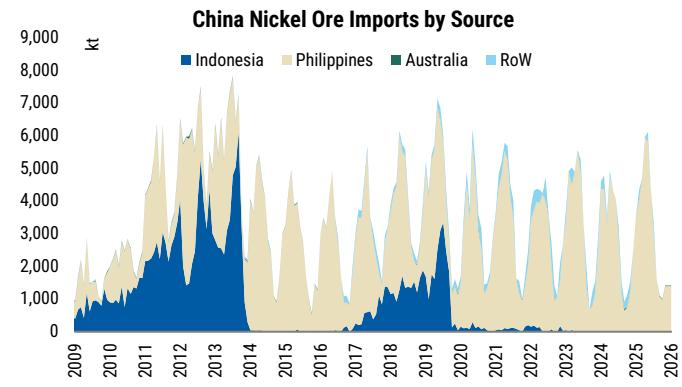

area chart

| Year | Indonesia | Philippines | Australia | RoW |
|------|-----------|-------------|-----------|-----|
| 2009 | 500       | 1000        | 0         | 0   |
| 2010 | 1000      | 1500        | 0         | 0   |
| 2011 | 1500      | 2000        | 0         | 0   |
| 2012 | 2000      | 2500        | 0         | 0   |
| 2013 | 3000      | 3000        | 0         | 0   |
| 2014 | 4000      | 3500        | 0         | 0   |
| 2015 | 500       | 2500        | 0         | 0   |
| 2016 | 600       | 3000        | 0         | 0   |
| 2017 | 700       | 3500        | 0         | 0   |
| 2018 | 800       | 4000        | 0         | 0   |
| 2019 | 900       | 4500        | 0         | 0   |
| 2020 | 100       | 500         | 0         | 0   |
| 2021 | 110       | 550         | 0         | 0   |
| 2022 | 120       | 600         | 0         | 0   |
| 2023 | 130       | 650         | 0         | 0   |
| 2024 | 140       | 700         | 0         | 0   |
| 2025 | 150       | 750         | 0         | 0   |
| 2026 | 160       | 800         | 0         | 0   |

Source: Bloomberg, MS.

Exhibit198: China's nickel ore imports vs. stainless steel production  

line chart

| Year | China Stainless Steel Production (Nii-based) (lhs) | China Nickel Ore Imports (rhs) |
|------|--------------------------------------------------|-------------------------------|
| 2009 | ~15%                                             | ~-20%                         |
| 2010 | ~70%                                             | ~30%                          |
| 2011 | ~95%                                             | ~40%                          |
| 2012 | ~20%                                             | ~20%                          |
| 2013 | ~40%                                             | ~10%                          |
| 2014 | ~20%                                             | ~-5%                          |
| 2015 | ~10%                                             | ~-30%                         |
| 2016 | ~15%                                             | ~-10%                         |
| 2017 | ~20%                                             | ~-5%                          |
| 2018 | ~30%                                             | ~40%                          |
| 2019 | ~25%                                             | ~10%                          |
| 2020 | ~10%                                             | ~-30%                         |
| 2021 | ~30%                                             | ~30%                          |
| 2022 | ~15%                                             | ~-5%                          |
| 2023 | ~25%                                             | ~-10%                         |
| 2024 | ~35%                                             | ~-5%                          |
| 2025 | ~20%                                             | ~-10%                         |
| 2026 | ~10%                                             | ~-5%                          |

Source: Bloomberg, MS.

Exhibit199: Contango vs. backwardation: Nickel futures curve movement  
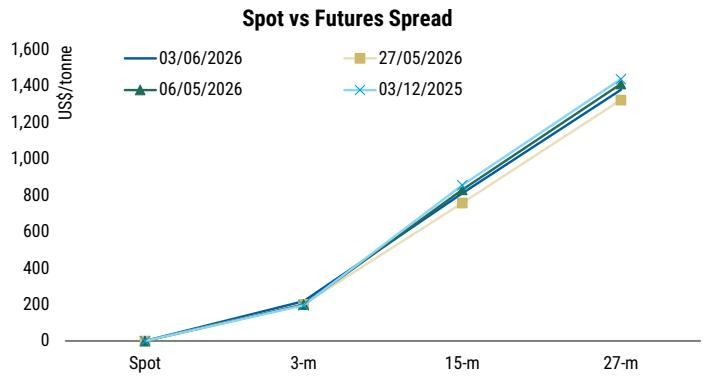

line chart

| Maturity | 03/06/2026 | 06/05/2026 | 03/12/2025 | 27/05/2026 |
| -------- | ---------- | ---------- | ---------- | ---------- |
| Spot     | 0          | 0          | 0          | 0          |
| 3-m      | 200        | 200        | 200        | 200        |
| 15-m     | 800        | 800        | 800        | 800        |
| 27-m     | 1400       | 1400       | 1400       | 1300       |

Source: Bloomberg, MS.

Exhibit 200: Nickel cost curve  
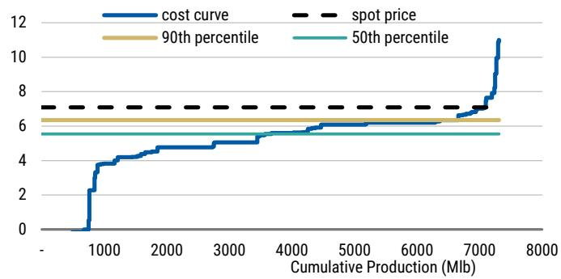

line chart

| Cumulative Production (Mlb) | cost curve | spot price | 90th percentile | 50th percentile |
| --------------------------- | ---------- | ---------- | --------------- | --------------- |
| 0                           | 0          | 7          | 6               | 5               |
| 1000                        | 4          | 7          | 6               | 5               |
| 2000                        | 4.5        | 7          | 6               | 5               |
| 3000                        | 5          | 7          | 6               | 5               |
| 4000                        | 5.5        | 7          | 6               | 5               |
| 5000                        | 6          | 7          | 6               | 5               |
| 6000                        | 6.5        | 7          | 6               | 5               |
| 7000                        | 7          | 7          | 6               | 5               |
| 8000                        | 11         | 7          | 6               | 5               |

Source: Wood Mackenzie, MS.

## Commodities: Zinc

Exhibit201: Zinc exchange inventories and days of consumption  
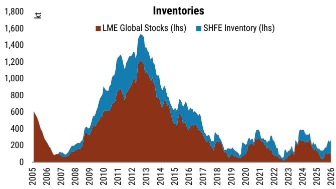

area chart

| Year | LME Global Stocks (lhs) | SHFE Inventory (lhs) |
|------|--------------------------|----------------------|
| 2005 | ~600                     | ~0                   |
| 2006 | ~200                     | ~0                   |
| 2007 | ~100                     | ~0                   |
| 2008 | ~150                     | ~0                   |
| 2009 | ~300                     | ~100                 |
| 2010 | ~500                     | ~200                 |
| 2011 | ~700                     | ~300                 |
| 2012 | ~900                     | ~400                 |
| 2013 | ~1,200                   | ~500                 |
| 2014 | ~800                     | ~300                 |
| 2015 | ~600                     | ~200                 |
| 2016 | ~400                     | ~150                 |
| 2017 | ~300                     | ~100                 |
| 2018 | ~200                     | ~50                  |
| 2019 | ~150                     | ~50                  |
| 2020 | ~100                     | ~50                  |
| 2021 | ~150                     | ~50                  |
| 2022 | ~100                     | ~50                  |
| 2023 | ~50                      | ~50                  |
| 2024 | ~150                     | ~50                  |
| 2025 | ~150                     | ~50                  |
| 2026 | ~150                     | ~50                  |

Source: Bloomberg, ILZSG, MS.

Exhibit202: China's apparent zinc consumption vs. LME price  
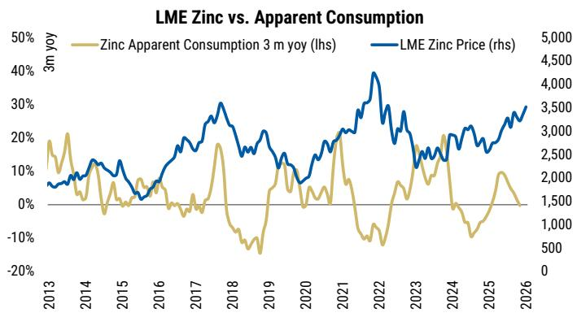

line chart

| Year | Zinc Apparent Consumption (lhs) | LME Zinc Price (rhs) |
|------|----------------------------------|----------------------|
| 2013 | ~15%                             | ~1,500               |
| 2014 | ~10%                             | ~2,000               |
| 2015 | ~5%                              | ~1,500               |
| 2016 | ~0%                              | ~2,000               |
| 2017 | ~15%                             | ~3,000               |
| 2018 | ~-15%                            | ~4,000               |
| 2019 | ~-10%                            | ~2,500               |
| 2020 | ~5%                              | ~2,000               |
| 2021 | ~15%                             | ~3,000               |
| 2022 | ~-10%                            | ~4,500               |
| 2023 | ~5%                              | ~3,000               |
| 2024 | ~-10%                            | ~2,500               |
| 2025 | ~10%                             | ~3,000               |
| 2026 | ~-5%                             | ~3,500               |

Source: Bloomberg, MS.

Exhibit203: Raw materials: China's zinc concentrate imports  
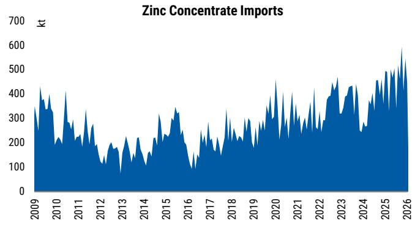

line chart

| Year | Zinc Concentrate Imports (kt) |
| ---- | ----------------------------- |
| 2009 | ~350                          |
| 2010 | ~400                          |
| 2011 | ~250                          |
| 2012 | ~150                          |
| 2013 | ~200                          |
| 2014 | ~250                          |
| 2015 | ~300                          |
| 2016 | ~150                          |
| 2017 | ~250                          |
| 2018 | ~300                          |
| 2019 | ~350                          |
| 2020 | ~450                          |
| 2021 | ~350                          |
| 2022 | ~400                          |
| 2023 | ~450                          |
| 2024 | ~400                          |
| 2025 | ~500                          |
| 2026 | ~600                          |

Source: Bloomberg, MS

Exhibit204: Zinc price differentials: SHFE vs. LME  
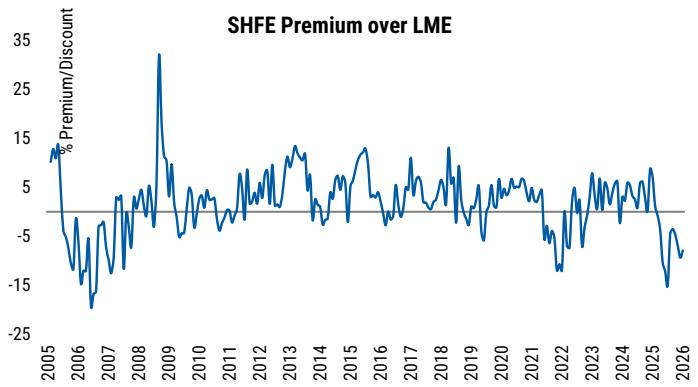

line chart

| Year | % Premium/Discount |
|------|---------------------|
| 2005 | 15                  |
| 2006 | -15                 |
| 2007 | -10                 |
| 2008 | 35                  |
| 2009 | -5                  |
| 2010 | 5                   |
| 2011 | 10                  |
| 2012 | 15                  |
| 2013 | 10                  |
| 2014 | 5                   |
| 2015 | 15                  |
| 2016 | 5                   |
| 2017 | 10                  |
| 2018 | 5                   |
| 2019 | 10                  |
| 2020 | 5                   |
| 2021 | 0                   |
| 2022 | -15                 |
| 2023 | 5                   |
| 2024 | 10                  |
| 2025 | -15                 |
| 2026 | -10                 |

Source: Bloomberg, MS.

Exhibit 205: Zinc TCs vs. spot  
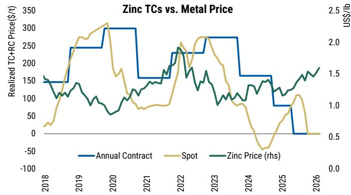

line chart

| Year | Annual Contract (US$/lb) | Spot (US$/lb) | Zinc Price (hrs) |
|------|--------------------------|---------------|------------------|
| 2018 | ~150                     | ~20           | ~1.5             |
| 2019 | ~250                     | ~2.5          | ~1.0             |
| 2020 | ~300                     | ~3.0          | ~0.5             |
| 2021 | ~150                     | ~1.0          | ~1.0             |
| 2022 | ~250                     | ~2.0          | ~1.5             |
| 2023 | ~275                     | ~1.5          | ~1.0             |
| 2024 | ~150                     | ~0.5          | ~1.5             |
| 2025 | ~75                      | ~-50          | ~1.0             |
| 2026 | ~0                       | ~100          | ~1.5             |

Source: Bloomberg, MS.

Exhibit 206: Contango vs. backwardation: Zinc futures curve movement  
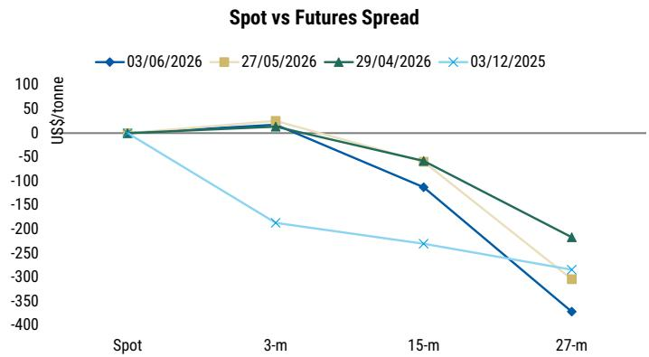

line chart

| Maturity | 03/06/2026 | 27/05/2026 | 29/04/2026 | 03/12/2025 |
| -------- | ---------- | ---------- | ---------- | ---------- |
| Spot     | 0          | 0          | 0          | 0          |
| 3-m      | 0          | 0          | 0          | -200       |
| 15-m     | -100       | -50        | -50        | -250       |
| 27-m     | -350       | -300       | -250       | -300       |

Source: Bloomberg, MS.

Exhibit 207: Zinc cost curve  
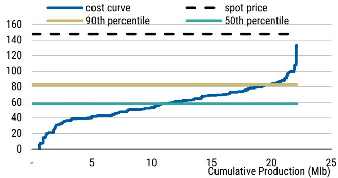

line chart

| Cumulative Production (Mlb) | cost curve | spot price | 90th percentile | 50th percentile |
| --------------------------- | ---------- | ---------- | --------------- | --------------- |
| -                           | 0          | 145        | 80              | 60              |
| 25                          | 135        | 145        | 80              | 60              |

Source: Wood Mackenzie, MS.

This report references jurisdictions or persons which may be the subject of economic sanctions. Readers are solely responsible for ensuring that their investment activities are carried out in compliance with applicable laws.

## Disclosure Section

The information and opinions in MS were prepared or are disseminated by MS Asia Limited (which accepts the responsibility for its contents) and/or MS Asia (Singapore) Pte. (Registration number 199206298Z) and/or MS Asia (Singapore) Securities Pte Ltd (Registration number 200008434H), regulated by the Monetary Authority of Singapore (which accepts legal responsibility for its contents and should be contacted with respect to any matters arising from, or in connection with, MS), and/or MS Taiwan Limited and/or MS & Co International plc, Seoul Branch, and/or MS Australia Limited (A.B.N. 67 003 734 576, holder of Australian financial services license No. 233742, which accepts responsibility for its contents), and/or MS Wealth Management Australia Pty Ltd (A.B.N. 19 009 145 555, holder of Australian financial services license No. 240813, which accepts responsibility for its contents), and/or MS India Company Private Limited having Corporate Identification No (CIN) U22990MH1998PTC115305, regulated by the Securities and Exchange Board of India ("SEBI") and holder of licenses as a Research Analyst (SEBI Registration No. INH000001105); Stock Broker (SEBI Stock Broker Registration No. INZ000244438), Merchant Banker (SEBI Registration No. INM000011203), and depository participant with National Securities Depository Limited (SEBI Registration No. IN-DP-NSDL-567-2021) having registered office at Altimus, Level 39 & 40, Pandurang Budhkar Marg, Worli, Mumbai 400018, India; Telephone no. +91-22-61181000; Compliance Officer Details: Mr. Tejarshi Hardas, Tel. No.: +91-22-61181000 or Email: tejarshi.hardas@morganstanley.com; Grievance officer details: Mr. Tejarshi Hardas, Tel. No.: +91-22-61181000 or Email: msic-compliance@morganstanley.com which accepts the responsibility for its contents and should be contacted with respect to any matters arising from, or in connection with, MS, and their affiliates (collectively, "MS"). MS India Company Private Limited (MSICPL) may use AI tools in providing research services. All recommendations contained herein are made by the duly qualified research analysts.

For important disclosures, stock price charts and equity rating histories regarding companies that are the subject of this report, please see the MS Disclosure Website at www.morganstanley.com/eqr/disclosures/webapp/generalresearch, or contact your investment representative or MS at 1585 Broadway, (Attention: Research Management), New York, NY, 10036 USA.

For valuation methodology and risks associated with any recommendation, rating or price target referenced in this research report, please contact the Client Support Team as follows: US/Canada +1 800 303-2495; Hong Kong +852 2848-5999; Latin America +1 718 754-5444 (U.S.); London +44 (0)20-7425-8169; Singapore +65 6834-6860; Sydney +61 (0)2-9770-1505; Tokyo +81 (0)3-6836-9000. Alternatively you may contact your investment representative or MS at 1585 Broadway, (Attention: Research Management), New York, NY 10036 USA.

## Analyst Certification

The following analysts hereby certify that their views about the companies and their securities discussed in this report are accurately expressed and that they have not received and will not receive direct or indirect compensation in exchange for expressing specific recommendations or views in this report: Rahul Anand, CFA.

## Global Research Conflict Management Policy

MS has been published in accordance with our conflict management policy, which is available at www.morganstanley.com/institutional/research/conflictpolicies. A Portuguese version of the policy can be found at www.morganstanley.com.br

## Important Regulatory Disclosures on Subject Companies

As of April 30, 2026, MS beneficially owned 1% or more of a class of common equity securities of the following companies covered in MS: Albemarle Corporation, Alcoa Corp, Aluminum Corp. of China Ltd., Anglo American Plc, BHP Group Ltd, Boliden, Boss Energy Ltd, China Shenhua Energy, Cleveland-Cliffs Inc, CSN, Fortescue Metals Group Ltd., Freeport-McMoRan Inc, Ganfeng Lithium Co. Ltd., Glencore PLC, Iluka Resources Ltd, Jiangxi Copper, Lynas Rare Earths, Metlen Energy & Metals PLC, Mitsubishi Materials, MP Materials Corp, Nippon Light Metal Holdings, Paladin Energy Ltd, PLS Group Ltd, Rio Tinto Limited, Rio Tinto Plc, Sandfire Resources Ltd, Sinomine Resource Group Co Ltd, Sociedad Quimica y Minera de Chile S.A., South32 Ltd, Tianqi Lithium Industries Inc., UACJ, Vale, Yankuang Energy Group Co Ltd.

Within the last 12 months, MS managed or co-managed a public offering (or 144A offering) of securities of Glencore PLC, Metlen Energy & Metals PLC, Mitsubishi Materials, MP Materials Corp, Nickel Industries, Vale, Whitehaven Coal Ltd.

Within the last 12 months, MS has received compensation for investment banking services from Alcoa Corp, Anglo American Plc, CSN, Glencore PLC, Lundin Mining Corp., Mitsubishi Materials, MP Materials Corp, Nickel Industries, Vale, Whitehaven Coal Ltd.

In the next 3 months, MS expects to receive or intends to seek compensation for investment banking services from African Rainbow Minerals, Albemarle Corporation, Alcoa Corp, Aluminum Corp. of China Ltd., Anglo American Plc, Antofagasta, Aurubis AG, BHP Group Ltd, Boliden, CAP S.A., CSN, Exxaro Resources Limited, First Quantum Minerals Ltd, Fortescue Metals Group Ltd., Freeport-McMoRan Inc, Ganfeng Lithium Co. Ltd., Glencore PLC, Grupo Mexico S.A.B. de C.V., IGO Ltd, Iluka Resources Ltd, Jiangxi Copper, KGHM Polska Miedz SA, Lundin Mining Corp., Lynas Rare Earths, Metlen Energy & Metals PLC, Mineral Resources Limited, Mitsubishi Materials, MMG Ltd, MP Materials Corp, Nexa Resources SA, Nickel Industries, Nippon Light Metal Holdings, Norsk Hydro ASA, Paladin Energy Ltd, PLS Group Ltd, Rio Tinto Limited, Rio Tinto Plc, Sandfire Resources Ltd, Sociedad Quimica y Minera de Chile S.A., South32 Ltd, Southern Copper Corp., Sumitomo Metal Mining, Teck Resources Limited, Tianqi Lithium Industries Inc., UACJ, Vale, Whitehaven Coal Ltd, Yancoal Australia Ltd, Yankuang Energy Group Co Ltd.

Within the last 12 months, MS has received compensation for products and services other than investment banking services from Albemarle Corporation, Alcoa Corp, Anglo American Plc, Aurubis AG, Cleveland-Cliffs Inc, CSN, CSN Mineracao, Freeport-McMoRan Inc, Glencore PLC, Grupo Mexico S.A.B. de C.V., Hindalco Industries Ltd, KGHM Polska Miedz SA, Lundin Mining Corp., Metlen Energy & Metals PLC, Nickel Industries, Norsk Hydro ASA, Rio Tinto Limited, Rio Tinto Plc, Sociedad Quimica y Minera de Chile S.A., South32 Ltd, Southern Copper Corp., Tianqi Lithium Industries Inc., Vale.

Within the last 12 months, MS has provided or is providing investment banking services to, or has an investment banking client relationship with, the following company: African Rainbow Minerals, Albemarle Corporation, Alcoa Corp, Aluminum Corp. of China Ltd., Anglo American Plc, Antofagasta, Aurubis AG, BHP Group Ltd, Boliden, CAP S.A., CSN, Exxaro Resources Limited, First Quantum Minerals Ltd, Fortescue Metals Group Ltd., Freeport-McMoRan Inc, Ganfeng Lithium Co. Ltd., Glencore PLC, Grupo Mexico S.A.B. de C.V., IGO Ltd, Iluka Resources Ltd, Jiangxi Copper, KGHM Polska Miedz SA, Lundin Mining Corp., Lynas Rare Earths, Metlen Energy & Metals PLC, Mineral Resources Limited, Mitsubishi Materials, MMG Ltd, MP Materials Corp, Nexa Resources SA, Nickel Industries, Norsk Hydro ASA, Paladin Energy Ltd, PLS Group Ltd, Rio Tinto Limited, Rio Tinto Plc, Sandfire Resources Ltd, Sociedad Quimica y Minera de Chile S.A., South32 Ltd, Southern Copper Corp., Sumitomo Metal Mining, Teck Resources Limited, Tianqi Lithium Industries Inc., UACJ, Vale, Whitehaven Coal Ltd, Yancoal Australia Ltd, Yankuang Energy Group Co Ltd.

Within the last 12 months, MS has either provided or is providing non-investment banking, securities-related services to and/or in the past has entered into an agreement to provide services or has a client relationship with the following company: Albemarle Corporation, Alcoa Corp, Anglo American Plc, Aurubis AG, Cleveland-Cliffs Inc, CSN, CSN Mineracao, Freeport-McMoRan Inc, Ganfeng Lithium Co. Ltd., Glencore PLC, Grupo Mexico S.A.B. de C.V., Hindalco Industries Ltd, KGHM Polska Miedz SA, Lundin Mining Corp., Metlen Energy & Metals PLC, Mitsubishi Materials, MP Materials Corp, Nexa Resources SA, Nickel Industries, Norsk Hydro ASA, Rio Tinto Limited, Rio Tinto Plc, Sociedad Quimica y Minera de Chile S.A., South32 Ltd, Southern Copper Corp., Teck Resources Limited, Tianqi Lithium Industries Inc., Vale, Yankuang Energy Group Co Ltd.

MS & Co. LLC makes a market in the securities of Southern Copper Corp..

MS & Co. International plc is a corporate broker to Anglo American Plc, Metlen Energy & Metals PLC.

The equity research analysts or strategists principally responsible for the preparation of MS have received compensation based upon various factors, including quality of research, investor client feedback, stock picking, competitive factors, firm revenues and overall investment banking revenues. Equity Research analysts' or strategists' compensation is not linked to investment banking or capital markets transactions performed by MS or the profitability or revenues of particular trading desks.

MS and its affiliates do business that relates to companies/instruments covered in MS, including market making, providing liquidity, fund management, commercial banking, extension of credit, investment services and investment banking. MS sells to and buys from customers the securities/instruments of companies covered in MS on a principal basis. MS may have a position in the debt of the Company or instruments discussed in this report. MS trades or may trade as principal in the debt securities (or in related derivatives) that are the subject of the debt research report.

Certain disclosures listed above are also for compliance with applicable regulations in non-US jurisdictions.

## STOCK RATINGS

MS uses a relative rating system using terms such as Overweight, Equal-weight, Not-Rated or Underweight (see definitions below). MS does not assign ratings of Buy, Hold or Sell to the stocks we cover. Overweight, Equal-weight, Not-Rated and Underweight are not the equivalent of buy, hold and sell. Investors should carefully read the definitions of all ratings used in MS. In addition, since MS contains more complete information concerning the analyst's views, investors should carefully read MS, in its entirety, and not infer the contents from the rating alone. In any case, ratings (or research) should not be used or relied upon as investment advice. An investor's decision to buy or sell a stock should depend on individual circumstances (such as the investor's existing holdings) and other considerations.

## Global Stock Ratings Distribution

(as of May 31, 2026)

The Stock Ratings described below apply to MS's Fundamental Equity Research and do not apply to Debt Research produced by the Firm.

For disclosure purposes only (in accordance with FINRA requirements), we include the category headings of Buy, Hold, and Sell alongside our ratings of Overweight, Equal-weight, Not-Rated and Underweight. MS does not assign ratings of Buy, Hold or Sell to the stocks we cover. Overweight, Equal-weight, Not-Rated and Underweight are not the equivalent of buy, hold, and sell but represent recommended relative weightings (see definitions below). To satisfy regulatory requirements, we correspond Overweight, our most positive stock rating, with a buy recommendation; we correspond Equal-weight and Not-Rated to hold and Underweight to sell recommendations, respectively.

<table><tr><td></td><td colspan="2">Coverage Universe</td><td colspan="3">Investment Banking Clients (IBC)</td><td colspan="2">Other Material Investment ServicesClients (MISC)</td></tr><tr><td>Stock RatingCategory</td><td>Count</td><td>% of Total</td><td>Count</td><td>% of Total IBC</td><td>% of RatingCategory</td><td>Count</td><td>% of Total OtherMISC</td></tr><tr><td>Overweight/Buy</td><td>1542</td><td>42%</td><td>465</td><td>51%</td><td>30%</td><td>707</td><td>43%</td></tr><tr><td>Equal-weight/Hold</td><td>1571</td><td>43%</td><td>369</td><td>40%</td><td>23%</td><td>723</td><td>44%</td></tr><tr><td>Not-Rated/Hold</td><td>3</td><td>0%</td><td>0</td><td>0%</td><td>0%</td><td>1</td><td>0%</td></tr><tr><td>Underweight/Sell</td><td>551</td><td>15%</td><td>86</td><td>9%</td><td>16%</td><td>201</td><td>12%</td></tr><tr><td>Total</td><td>3,667</td><td></td><td>920</td><td></td><td></td><td>1632</td><td></td></tr></table>

Data include common stock and ADRs currently assigned ratings. Investment Banking Clients are companies from whom MS received investment banking compensation in the last 12 months. Due to rounding off of decimals, the percentages provided in the "% of total" column may not add up to exactly 100 percent.

## Analyst Stock Ratings

Overweight (O). The stock's total return is expected to exceed the average total return of the analyst's industry (or industry team's) coverage universe, on a risk-adjusted basis, over the next 12-18 months.

Equal-weight (E). The stock's total return is expected to be in line with the average total return of the analyst's industry (or industry team's) coverage universe, on a risk-adjusted basis, over the next 12-18 months.

Not-Rated (NR). Currently the analyst does not have adequate conviction about the stock's total return relative to the average total return of the analyst's industry (or industry team's) coverage universe, on a risk-adjusted basis, over the next 12-18 months.

Underweight (U). The stock's total return is expected to be below the average total return of the analyst's industry (or industry team's) coverage universe, on a risk-adjusted basis, over the next 12-18 months.

Unless otherwise specified, the time frame for price targets included in MS is 12 to 18 months.

## Analyst Industry Views

Attractive (A): The analyst expects the performance of his or her industry coverage universe over the next 12-18 months to be attractive vs. the relevant broad market benchmark, as indicated below.

In-Line (I): The analyst expects the performance of his or her industry coverage universe over the next 12-18 months to be in line with the relevant broad market benchmark, as indicated below. Cautious (C): The analyst views the performance of his or her industry coverage universe over the next 12-18 months with caution vs. the relevant broad market benchmark, as indicated below. Benchmarks for each region are as follows: North America - S&P 500; Latin America - relevant MSCI country index or MSCI Latin America Index; Europe - MSCI Europe; Japan - TOPIX; Asia - relevant MSCI country index or MSCI sub-regional index or MSCI AC Asia Pacific ex Japan Index.

## Important Disclosures for MS Smith Barney LLC Customers

Important disclosures regarding any material conflict of interest that can reasonably be expected to have influenced MS Smith Barney LLC's choice of a third-party research provider or the subject company of a third-party research report, are available on the MS Wealth Management disclosure website at www.morganstanley.com/online/researchdisclosures.

For MS specific disclosures, you may refer to https://www.morganstanley.com/eqr/disclosures/webapp/generalresearch.

Each MS report is reviewed and approved on behalf of MS Smith Barney LLC. This review and approval is conducted by the same person who reviews the research report on behalf of MS. This could create a conflict of interest.

## Other Important Disclosures

MS policy is to update research reports as and when the Research Analyst and Research Management deem appropriate, based on developments with the issuer, the sector, or the market that may have a material impact on the research views or opinions stated therein. In addition, certain Research publications are intended to be updated on a regular periodic basis (weekly/monthly/quarterly/annual) and will ordinarily be updated with that frequency, unless the Research Analyst and Research Management determine that a different publication schedule is appropriate based on current conditions.

MS is not acting as a municipal advisor and the opinions or views contained herein are not intended to be, and do not constitute, advice within the meaning of Section 975 of the Dodd-Frank Wall Street Reform and Consumer Protection Act.

MS produces an equity research product called a "Tactical Idea." Views contained in a "Tactical Idea" on a particular stock may be contrary to the recommendations or views expressed in research on the same stock. This may be the result of differing time horizons, methodologies, market events, or other factors. For all research available on a particular stock, please contact your sales representative or go to Matrix at http://www.morganstanley.com/matrix.

MS is provided to our clients through our proprietary research portal on Matrix and also distributed electronically by MS to clients. Certain, but not all, MS products are also made available to clients through third-party vendors or redistributed to clients through alternate electronic means as a convenience. For access to all available MS, please contact your sales representative or go to Matrix at http://www.morganstanley.com/matrix.

Any access and/or use of MS is subject to MS's Terms of Use (http://www.morganstanley.com/terms.html). By accessing and/or using MS, you are indicating that you have read and agree to be bound by our Terms of Use (http://www.morganstanley.com/terms.html). In addition you consent to MS processing your personal data and using cookies in accordance with our Privacy Policy and our Global Cookies Policy (http://www.morganstanley.com/privacy\_pledge.html), including for the purposes of setting your preferences and to collect readership data so that we can deliver better and more personalized service and products to you. To find out more information about how MS processes personal data, how we use cookies and how to reject cookies see our Privacy Policy and our Global Cookies Policy (http://www.morganstanley.com/privacy\_pledge.html). Please use the provided link to review the Terms and Conditions and Most Important Terms and Conditions for MS India Company Private Limited (https://www.morganstanley.com/assets/pdfs/about-us-global-offices/india/Terms\_and\_conditions.pdf) and the following link to review the audit report (https://ny.matrix.ms.com/eqr/research/webapp/researchdocs/MSICPL\_Morgan\_Stanley\_Research\_Audit\_Report.pdf).

If you do not agree to our Terms of Use and/or if you do not wish to provide your consent to MS processing your personal data or using cookies please do not access our research. MS does not provide individually tailored investment advice. MS has been prepared without regard to the circumstances and objectives of those who receive it. MS recommends that investors independently evaluate particular investments and strategies, and encourages investors to seek the advice of a financial adviser. The appropriateness of an investment or strategy will depend on an investor's circumstances and objectives. The securities, instruments, or strategies discussed in MS may not be suitable for all investors, and certain investors may not be eligible to purchase or participate in some or all of them. MS is not an offer to buy or sell or the solicitation of an offer to buy or sell any security/instrument or to participate in any particular trading strategy. The value of and income from your investments may vary because of changes in interest rates, foreign exchange rates, default rates, prepayment rates, securities/instruments prices, market indexes, operational or financial conditions of companies or other factors. There may be time limitations on the exercise of options or other rights in securities/instruments transactions. Past performance is not necessarily a guide to future performance. Estimates of future performance are based on assumptions that may not be realized. If provided, and unless otherwise stated, the closing price on the cover page is that of the primary exchange for the subject company's securities/instruments.

The fixed income research analysts, strategists or economists principally responsible for the preparation of MS have received compensation based upon various factors, including quality, accuracy and value of research, firm profitability or revenues (which include fixed income trading and capital markets profitability or revenues), client feedback and competitive factors. Fixed Income Research analysts', strategists' or economists' compensation is not linked to investment banking or capital markets transactions performed by MS or the profitability or revenues of particular trading desks.

The "Important Regulatory Disclosures on Subject Companies" section in MS lists all companies mentioned where MS owns 1% or more of a class of common equity securities of the companies. For all other companies mentioned in MS, MS may have an investment of less than 1% in securities/instruments or derivatives of securities/instruments of companies and may trade them in ways different from those discussed in MS. Employees of MS not involved in the preparation of MS may have investments in securities/instruments or derivatives of securities/instruments of companies mentioned and may trade them in ways different from those discussed in MS. Derivatives may be issued by MS or associated persons.

With the exception of information regarding MS, MS is based on public information. MS makes every effort to use reliable, comprehensive information, but we make no representation that it is accurate or complete. We have no obligation to tell you when opinions or information in MS change apart from when we intend to discontinue equity research coverage of a subject company. Facts and views presented in MS have not been reviewed by, and may not reflect information known to, professionals in other MS business areas, including investment banking personnel.

MS personnel may participate in company events such as site visits and are generally prohibited from accepting payment by the company of associated expenses unless pre-approved by authorized members of Research management.

MS may make investment decisions that are inconsistent with the recommendations or views in this report.

To our readers based in Taiwan or trading in Taiwan securities/instruments: Information on securities/instruments that trade in Taiwan is distributed by MS Taiwan Limited ("MSTL"). Such information is for your reference only. The reader should independently evaluate the investment risks and is solely responsible for their investment decisions. MS may not be distributed to the public media or quoted or used by the public media without the express written consent of MS. Any non-customer reader within the scope of Article 7-1 of the Taiwan Stock Exchange Recommendation Regulations accessing and/or receiving MS is not permitted to provide MS to any third party (including but not limited to related parties, affiliated companies and any other third parties) or engage in any activities regarding MS which may create or give the appearance of creating a conflict of interest. Information on securities/instruments that do not trade in Taiwan is for informational purposes only and is not to be construed as a recommendation or a solicitation to trade in such securities/instruments. MSTL may not execute transactions for clients in these securities/instruments.

Certain information in MS was sourced by employees of the Shanghai Representative Office of MS Asia Limited for the use of MS Asia Limited. MS is not incorporated under PRC law and the research in relation to this report is conducted outside the PRC. MS does not constitute an offer to sell or the solicitation of an offer to buy any securities in the PRC. PRC investors shall have the relevant qualifications to invest in such securities and shall be responsible for obtaining all relevant approvals, licenses, verifications and/or registrations from the relevant governmental authorities themselves. Neither this report nor any part of it is intended as, or shall constitute, provision of any consultancy or advisory service of securities investment as defined under PRC law. Such information is provided for your reference only.

MS is disseminated in Brazil by MS C.T.V.M. S.A. located at Av. Brigadeiro Faria Lima, 3600, 6th floor, São Paulo - SP, Brazil; and is regulated by the Comissão de Valores Mobiliários; in Mexico by MS México, Casa de Bolsa, S.A. de C.V which is regulated by Comision Nacional Bancaria y de Valores. Paseo de los Tamarindos 90, Torre 1, Col. Bosques de las Lomas Floor 29, 05120 Mexico City; in Japan by MS MUFG Securities Co., Ltd. and, for Commodities related research reports only, MS Capital Group Japan Co., Ltd; in Hong Kong by MS Asia Limited (which accepts responsibility for its contents) and by MS Bank Asia Limited; in Singapore by MS Asia (Singapore) Pte. (Registration number 199206298Z) and/or MS Asia (Singapore) Securities Pte Ltd (Registration number 200008434H), regulated by the Monetary Authority of Singapore (which accepts legal responsibility for its contents and should be contacted with respect to any matters arising from, or in connection with, MS) and by MS Bank Asia Limited, Singapore Branch (Registration number T14FC0118); in Australia to "wholesale clients" within the meaning of the Australian Corporations Act by MS Australia Limited A.B.N. 67 003 734 576, holder of Australian financial services license No. 233742, which accepts responsibility for its contents; in Australia to "wholesale clients" and "retail clients" within the meaning of the Australian Corporations Act by MS Wealth Management Australia Pty Ltd (A.B.N. 19 009 145 555, holder of Australian financial services license No. 240813, which accepts responsibility for its contents; in Korea by MS & Co International plc, Seoul Branch; in India by MS India Company Private Limited having Corporate Identification No (CIN) U22990MH1998PTC115305, regulated by the Securities and Exchange Board of India ("SEBI") and holder of licenses as a Research Analyst (SEBI Registration No. INH000001105); Stock Broker (SEBI Stock Broker Registration No. INZ000244438), Merchant Banker (SEBI Registration No. INM000011203), and depository participant with National Securities Depository Limited (SEBI Registration No. IN-DP-NSDL-567-2021) having registered office at Altimus, Level 39 & 40, Pandurang Budhkar Marg, Worli, Mumbai 400018, India; Telephone no. +91-22-61181000; Compliance Officer Details: Mr. Tejarshi Hardas, Tel. No.: +91-22-61181000 or Email: tejarshi.hardas@morganstanley.com; Grievance officer details: Mr. Tejarshi Hardas, Tel. No.: +91-22-61181000 or Email: msic-compliance@morganstanley.com. MS India Company Private Limited (MSICPL) may use AI tools in providing research services. All recommendations contained herein are made by the duly qualified research analysts; in Canada by MS Canada Limited; in Germany and the European Economic Area where required by MS Europe S.E., authorised and regulated by Bundesanstalt fuer Finanzdienstleistungsaufsicht (BaFin) under the reference number 149169; in the US by MS & Co. LLC, which accepts responsibility for its contents. MS & Co. International plc, authorized by the Prudential Regulation Authority and regulated by the Financial Conduct Authority and the Prudential Regulation Authority, disseminates in the UK research that it has prepared, and research which has been prepared by any of its affiliates, only to persons who (i) are investment professionals falling within Article 19(5) of the Financial Services and Markets Act 2000 (Financial Promotion) Order 2005 (as amended, the "Order"); (ii) are persons who are high net worth entities falling within Article 49(2)(a) to (d) of the Order; or (iii) are persons to whom an invitation or inducement to engage in investment activity (within the meaning of section 21 of the Financial Services and Markets Act 2000, as amended) may otherwise lawfully be communicated or caused to be communicated. RMB MS Proprietary Limited is a member of the JSE Limited and A2X (Pty) Ltd. RMB MS Proprietary Limited is a joint venture owned equally by MS International Holdings Inc. and RMB Investment Advisory (Proprietary) Limited, which is wholly owned by FirstRand Limited. The information in MS is being disseminated by MS Saudi Arabia, regulated by the Capital Market Authority in the Kingdom of Saudi Arabia, and is directed at Sophisticated investors only.

MS Hong Kong Securities Limited is the liquidity provider/market maker for securities of Aluminum Corp. of China Ltd., China Hongqiao Group, China Shenhua Energy, Ganfeng Lithium Co. Ltd., Jiangxi Copper, MMG Ltd, Yankuang Energy Group Co Ltd listed on the Stock Exchange of Hong Kong Limited. An updated list can be found on HKEx website: http://www.hkex.com.hk.

The information in MS is being communicated by MS & Co. International plc (DIFC Branch), regulated by the Dubai Financial Services Authority (the DFSA) or by MS & Co. International plc (ADGM Branch), regulated by the Financial Services Regulatory Authority Abu Dhabi (the FSRA), and is directed at Professional Clients only, as defined by the DFSA or the FSRA, respectively. The financial products or financial services to which this research relates will only be made available to a customer who we are satisfied meets the regulatory criteria of a Professional Client. A distribution of the different MS Research ratings or recommendations, in percentage terms for Investments in each sector covered, is available upon request from your sales representative.

The information in MS is being communicated by MS & Co. International plc (QFC Branch), regulated by the Qatar Financial Centre Regulatory Authority (the QFCRA), and is directed at business customers and market counterparties only and is not intended for Retail Customers as defined by the QFCRA.

As required by the Capital Markets Board of Turkey, investment information, comments and recommendations stated here, are not within the scope of investment advisory activity. Investment advisory service is provided exclusively to persons based on their risk and income preferences by the authorized firms. Comments and recommendations stated here are general in nature. These opinions may not fit to your financial status, risk and return preferences. For this reason, to make an investment decision by relying solely to this information stated here may not bring about outcomes that fit your expectations.

The trademarks and service marks contained in MS are the property of their respective owners. Third-party data providers make no warranties or representations relating to the accuracy, completeness, or timeliness of the data they provide and shall not have liability for any damages relating to such data. The Global Industry Classification Standard (GICS) was developed by and is the exclusive property of MSCI and S&P.

MS, or any portion thereof may not be reprinted, sold or redistributed without the written consent of MS.

Indicators and trackers referenced in MS may not be used as, or treated as, a benchmark under Regulation EU 2016/1011, or any other similar framework.

The issuers and/or fixed income products recommended or discussed in certain fixed income research reports may not be continuously followed. Accordingly, investors should regard those fixed income research reports as providing stand-alone analysis and should not expect continuing analysis or additional reports relating to such issuers and/or individual fixed income products. MS may hold, from time to time, material financial and commercial interests regarding the company subject to the Research report.

Registration granted by SEBI and certification from the National Institute of Securities Markets (NISM) in no way guarantee performance of the intermediary or provide any assurance of returns to investors. Investment in securities market are subject to market risks. Read all the related documents carefully before investing.

INDUSTRY COVERAGE: Australia Materials

<table><tr><td>COMPANY (TICKER)</td><td>RATING (AS OF)</td><td>PRICE* (06/05/2026)</td></tr><tr><td colspan="3">Rahul Anand, CFA</td></tr><tr><td>BHP Group Ltd (BHPB.L)</td><td>O (09/19/2024)</td><td>3,127p</td></tr><tr><td>BHP Group Ltd (BHGJ.J)</td><td>O (09/19/2024)</td><td>ZAc 69,531</td></tr><tr><td>BHP Group Ltd (BHP.AX)</td><td>O (09/19/2024)</td><td>A$61.24</td></tr><tr><td>Boss Energy Ltd (BOE.AX)</td><td>O (01/16/2026)</td><td>A$1.28</td></tr><tr><td>Deterra Royalties Ltd (DRR.AX)</td><td>O (01/16/2026)</td><td>A$4.40</td></tr><tr><td>Fortescue Metals Group Ltd. (FMG.AX)</td><td>U (01/16/2026)</td><td>A$20.53</td></tr><tr><td>IGO Ltd (IGO.AX)</td><td>U (07/15/2025)</td><td>A$8.98</td></tr><tr><td>Iluka Resources Ltd (ILU.AX)</td><td>O (05/22/2025)</td><td>A$7.75</td></tr><tr><td>Lynas Rare Earths (LYC.AX)</td><td>E (04/14/2026)</td><td>A$18.16</td></tr><tr><td>Mineral Resources Limited (MIN.AX)</td><td>++</td><td>A$67.57</td></tr><tr><td>Paladin Energy Ltd (PDN.AX)</td><td>O (10/08/2025)</td><td>A$11.05</td></tr><tr><td>PLS Group Ltd (PLS.AX)</td><td>E (04/14/2026)</td><td>A$5.91</td></tr><tr><td>Rio Tinto Limited (RIO.AX)</td><td>E (04/09/2025)</td><td>A$184.58</td></tr><tr><td>Sandfire Resources Ltd (SFR.AX)</td><td>U (12/16/2024)</td><td>A$19.28</td></tr><tr><td>South32 Ltd (S32.AX)</td><td>O (12/16/2024)</td><td>A$4.63</td></tr><tr><td>South32 Ltd (S32J.J)</td><td>O (12/16/2024)</td><td>ZAc 5,364</td></tr><tr><td>Whitehaven Coal Ltd (WHC.AX)</td><td>O (04/14/2026)</td><td>A$9.37</td></tr><tr><td colspan="3">Shannon J Sinha</td></tr><tr><td>Nickel Industries (NIC.AX)</td><td>E (04/09/2025)</td><td>A$1.02</td></tr></table>

Stock Ratings are subject to change. Please see latest research for each company.  
\* Historical prices are not split adjusted.

© 2026 MS