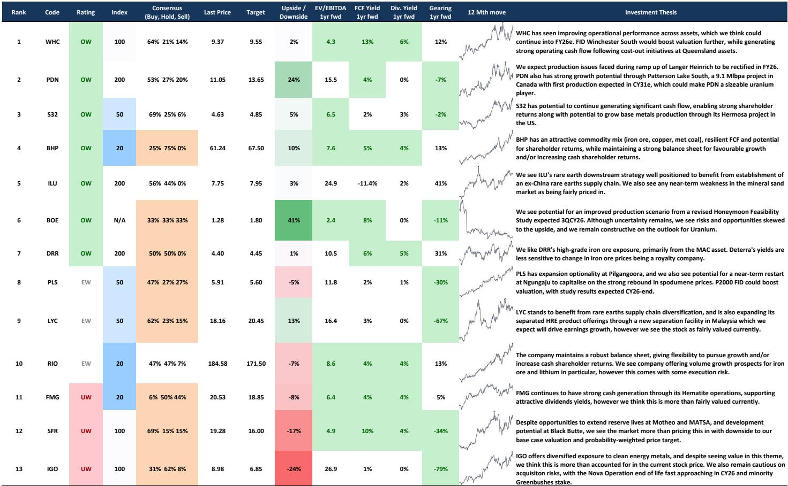
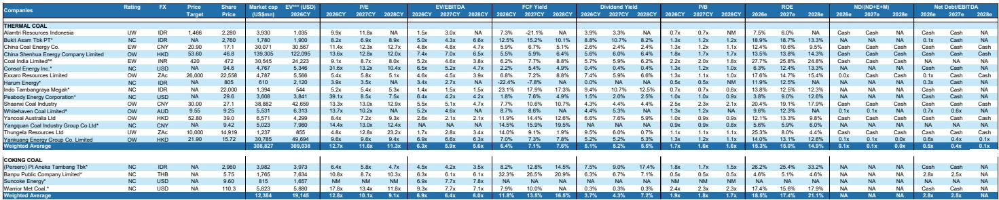

# Sovereign Supply Is the Real Counterweight to Sovereign Demand—and Australia Must Decide Whether to Build One

The global resource trade is undergoing a structural shift that most investors have not yet fully priced. For years, the narrative has been about sovereign demand—China's state-led buying agencies, its centralised procurement of critical minerals, and the pricing power that concentration confers. But a new and potentially more consequential trend is now emerging on the supply side. Sovereign nations are beginning to centralise their commodity exports, creating state-linked channels that could fundamentally alter the bargaining dynamics of global resource markets. The question is no longer whether sovereign supply will emerge as a counterforce to sovereign demand. The question is which producing nations will act first, and whether their efforts will stabilise or destabilise the pricing architecture that has governed these markets for decades.

Indonesia has already moved. Through PT Danantara Sumberdaya Indonesia, or DSI, it is centralising exports of coal, palm oil, and ferroalloys under a state-linked agency. The stated goals are improved transparency, reduced under-invoicing, and greater retention of proceeds onshore. But the strategic effect is unmistakable: Indonesia is creating a sovereign supply channel for commodities where it holds dominant market share. With roughly 55 percent of global palm oil exports and an estimated 45 percent of seaborne thermal coal supply for 2026, Jakarta now has a mechanism to influence pricing, terms, and allocation in ways that individual producers operating independently cannot.

Australia, by contrast, remains a collection of independent producers constrained by competition law. Australian miners cannot coordinate on pricing, production volumes, or marketing strategy without creating legal risk. This is not a minor regulatory detail—it is a structural disadvantage in a world where the largest buyer is a single sovereign entity and the largest competitor is moving toward sovereign coordination. Australia accounts for approximately 59 percent of seaborne iron ore, 38 percent of metallurgical coal, 20 percent of thermal coal, and 24 percent of global lithium supply. Yet it has no mechanism to translate this market share into strategic bargaining power. The asymmetry is not sustainable.

The argument for a state-linked Australian export desk is not about protectionism or market manipulation. It is about creating the institutional capacity to match the structural buying power that already exists on the demand side. Without such a mechanism, Australian producers will continue to face concentrated sovereign buyers who can play individual miners against one another, extract pricing concessions, and shape terms in ways that would be impossible if producers faced a unified counterparty. The report underlying this analysis raises the question explicitly: could a sovereign supply channel give Australian producers a way to counter concentrated buying by governments in markets where Australia holds sizable supply? The answer, from a strategic perspective, is almost certainly yes. But the path to implementation is fraught with trade, diplomatic, and legal complexities that the report does not fully resolve.

## The Case for Sovereign Coordination Is Strongest Where Market Share Is Highest and Buyer Concentration Is Greatest

The logic for a sovereign supply mechanism is not uniform across commodities. It is strongest where Australia holds a dominant share of seaborne trade and where the buyer side is already concentrated in the hands of a few state actors. Iron ore is the clearest example. Australia controls nearly 60 percent of seaborne iron ore supply, and China is the dominant buyer. The current structure—dozens of independent Australian producers negotiating individually with a single state-backed buying agency—creates a structural pricing disadvantage that has persisted for years. A coordinated export channel would not eliminate price discovery, but it would rebalance the negotiating dynamic.

The same logic applies, though with different intensity, to metallurgical coal and lithium. Australia holds 38 percent of seaborne met coal, and while the buyer base is more diversified than for iron ore, the trend toward state-backed procurement in key end-markets is accelerating. Lithium presents a different challenge. Australia has 24 percent of global supply, but the downstream processing chain is heavily concentrated in China, giving Beijing significant leverage over pricing. A sovereign supply channel for lithium would need to be paired with downstream processing capacity to be fully effective—a point the report touches on but does not develop in depth.

For commodities where Australia's market share is smaller or where the buyer base is already fragmented, the case for coordination is weaker. Thermal coal, where Australia holds 20 percent of seaborne trade, sits in a middle ground. The Indonesian move through DSI creates a precedent, but it also creates a competitor with a larger market share. Coordination in this market would require careful calibration to avoid triggering trade disputes or antitrust scrutiny from key importers.

The strategic implication is clear: Australia should not pursue a one-size-fits-all sovereign supply mechanism. It should prioritise the commodities where its market share is largest and where buyer concentration is highest. Iron ore is the obvious starting point. Metallurgical coal and lithium are strong candidates for phased implementation. Thermal coal and other bulk commodities require further analysis before a decision framework can be applied.

## The Report Raises a Critical Question It Does Not Fully Answer: How Would Sovereign Supply Affect Pricing Dynamics Across the Commodity Complex?

The report provides a rich set of valuation tables, preference rankings, and commodity price assumptions. It implies iron ore prices of roughly $82 per tonne for BHP, $89 for Rio Tinto, and $98 for Fortescue and Deterra. These assumptions embed a view on supply-demand balances, cost curves, and marginal pricing. But they do not explicitly model the impact of a sovereign supply channel on the pricing mechanism itself.

This is not a criticism of the report. The effect of sovereign supply on pricing is inherently difficult to model because there are no direct historical precedents for a large, diversified producer like Australia adopting a coordinated export mechanism. The closest analogues are OPEC in oil and the DSI in Indonesia, but neither maps cleanly onto Australia's situation. OPEC coordinates production volumes among sovereign states with different fiscal needs and geopolitical alignments. DSI operates in markets where Indonesia holds a dominant share but where the commodity characteristics—bulk, homogeneous, and relatively low-value per tonne—differ from the higher-value, more differentiated products Australia exports.

The unanswered question is whether a sovereign supply channel would primarily affect the level of prices, the volatility of prices, or the distribution of margins along the value chain. A strong argument can be made that the primary effect would be on margin distribution rather than on the absolute price level. Sovereign buyers currently capture a disproportionate share of the economic rent in many commodity chains because they can play producers against one another. A coordinated supply channel would shift some of that rent back to producers and, by extension, to the Australian fiscal base. But the magnitude of this shift depends on the elasticity of demand, the availability of alternative supply, and the willingness of buyers to accept higher prices rather than seek alternative sources.

The report's valuation framework implies that current prices already embed a discount for the structural bargaining disadvantage Australian producers face. If that discount were removed through sovereign coordination, the implied prices for BHP, Rio, and Fortescue would need to be revised upward. But by how much? The report does not provide a quantitative estimate, and it would be unreasonable to expect one. The question is left open, and it is the most important analytical gap in the current research.

## A Decision Framework for Evaluating Sovereign Supply Must Consider Three Dimensions: Strategic Necessity, Legal Feasibility, and Diplomatic Cost

For investors and policymakers trying to assess the likelihood and impact of an Australian sovereign supply mechanism, a structured decision framework is essential. Three dimensions matter most.

First, strategic necessity. The case for coordination is strongest where market share is high, buyer concentration is high, and the commodity is critical to Australia's fiscal position. Iron ore scores highest on all three dimensions. Met coal and lithium are close behind. Thermal coal scores lower because market share is smaller and alternative suppliers are more plentiful. Commodities like gold, copper, and nickel, where Australia has meaningful but not dominant supply, fall into a different category where coordination may not be worth the diplomatic cost.

Second, legal feasibility. Australian competition law currently prohibits the kind of coordination that a sovereign supply desk would require. Changing this framework would require legislation, and the political dynamics are complex. The mining industry is not uniformly in favour of coordination; some producers benefit from the current structure and would resist change. The legal path forward would likely require a phased approach, starting with a voluntary export coordination mechanism that falls within existing legal boundaries, then moving toward a more formal structure as the benefits become clear.

Third, diplomatic cost. A sovereign supply channel would be perceived by major importers—particularly China—as a challenge to their procurement strategies. The risk of retaliatory measures, including tariffs, investment restrictions, or shifts in procurement toward alternative suppliers, is real and must be weighed against the benefits. The report notes that a state-linked export desk would create trade and sovereign risk concerns. It does not attempt to quantify those risks, but they are central to any investment decision.

The framework suggests that the optimal path is not a binary choice between coordination and non-coordination. It is a spectrum of options, from enhanced information sharing and voluntary benchmarking at one end, to a formal state-linked export agency at the other. The report's analysis implies that the current position—no coordination at all—is suboptimal, but the optimal point on the spectrum remains uncertain.

## The Report's Stock Preferences Imply a View on Commodity Prices That May Not Fully Reflect the Sovereign Supply Risk

The report's relative preference table shows a clear hierarchy. BHP is rated overweight with an implied iron ore price of roughly $82 per tonne. Rio Tinto is equal-weight at $89. Fortescue is underweight at $98. Deterra Royalties is overweight with a yield-based thesis. These preferences reflect a view on cost position, balance sheet strength, and commodity exposure. But they also embed an implicit assumption about the pricing environment, and that assumption may need to be revisited if sovereign supply dynamics shift.

BHP's overweight rating at the lowest implied iron ore price suggests that the report sees it as the most resilient producer in a low-price environment. That makes sense given BHP's diversified commodity mix, strong balance sheet, and low-cost position in iron ore. But if a sovereign supply channel were to raise the effective floor for iron ore prices, the relative advantage of low-cost producers would diminish, and higher-cost producers with more leverage to the price upside would become more attractive. Fortescue, with its higher cost position and pure-play iron ore exposure, would be a direct beneficiary of a price floor lift. The report's underweight rating on Fortescue may be correct under current assumptions, but it is the most exposed to a sovereign supply catalyst.

Rio Tinto sits in an intermediate position. Its equal-weight rating and $89 implied price reflect a view that it offers volume growth optionality but also carries execution risk. A sovereign supply channel that stabilises prices would reduce the downside risk for Rio without fully capturing the upside that a pure-play producer would enjoy. The report's positioning seems to acknowledge this nuance without fully resolving it.

For investors, the key takeaway is that the report's stock preferences are conditional on a specific view of the pricing environment. If sovereign supply dynamics shift that environment, the relative rankings would need to be recalibrated. The report does not provide guidance on how to adjust for this scenario, leaving an important analytical gap that investors must fill themselves.

## The Unresolved Analytical Questions Are the Most Valuable Part of This Report for Serious Investors

Every good research report answers some questions and leaves others open. The most valuable reports are those where the unanswered questions are more important than the answered ones. This report falls into that category. It provides a clear and data-rich analysis of the current state of Australian mining, a thoughtful assessment of the sovereign supply trend, and a set of stock preferences that are internally consistent. But it leaves several critical questions on the table.

How would a sovereign supply channel interact with the existing cost curve dynamics in iron ore? Would it raise the floor, compress the spread between high-cost and low-cost producers, or alter the shape of the cost curve entirely? The report does not say.

What is the diplomatic cost of a sovereign supply channel, and how would it be distributed across commodities and trading partners? The report raises the risk but does not attempt to quantify it.

Would the creation of a sovereign supply channel in Australia trigger similar moves by other producers, leading to a broader reorganisation of global commodity trade? The report hints at this possibility but does not explore its implications.

These are not gaps in the analysis. They are the natural boundaries of what a single report can cover. For investors who want to go deeper, these questions are the starting point for their own research. The report has done the essential work of framing the problem and providing the data. The next step is to build the analytical tools to answer the questions it leaves open.

Join the community to read the full report and review the original charts.

*This article is for learning and discussion only and does not constitute investment advice.*

Personal reading notes and learning share only. Not investment advice.

