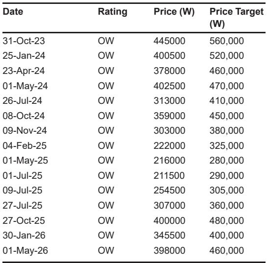
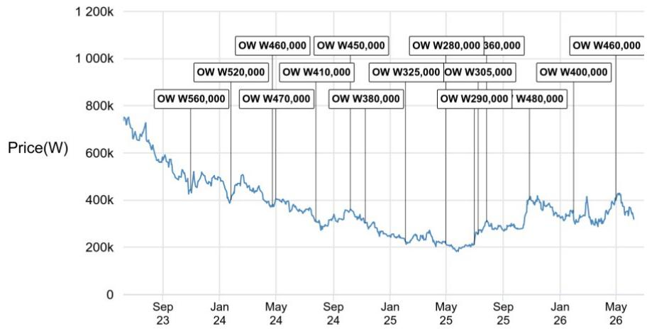
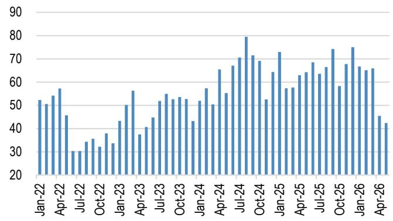

# The Korean Rubber Bottleneck Is Not a Blip: Why NBL Margins Are Signaling a Structural Shift in Asian Chemicals

The synthetic rubber market is sending a signal that most investors are misreading. In May, Korean nitrile butadiene latex (NBL) margins surged to their highest level since 2021, exceeding styrene butadiene rubber (SBR) margins for the first time in four years. This is not a routine cyclical uptick. It is the convergence of a feedstock crisis, a demand discontinuity, and a supply-side rigidity that will reshape the profitability landscape for Asian chemical producers through at least 2028.

The conventional narrative holds that chemical margins follow oil. That framework is breaking down. While Asian butadiene prices collapsed by 27% in May on lower oil and weaker downstream demand, NBL prices continued to rise. The divergence reveals something deeper: the rubber market is now supply-constrained in a way that feedstock costs alone cannot explain. For investors in Korean and Taiwanese chemical names, the question is not whether this margin spike will fade, but which producers are positioned to capture the multi-year earnings tail that follows.

This article translates a detailed sector report from a global investment bank into a strategic framework. The core argument is that the NBL market has entered a period of structurally elevated margins driven by a naphtha feedstock bottleneck, a medical glove demand recovery, and a multi-year absence of new capacity. The implications extend beyond rubber into the broader chemical value chain, and they raise uncomfortable questions about how to value companies whose downstream earnings are about to decouple from upstream commodity cycles.

## The Naphtha Crunch Is Creating a Two-Tier Rubber Market That Favors Korean Producers

The proximate cause of the NBL margin surge is a supply-side shock in the naphtha market. Following the escalation of the Middle East conflict, naphtha availability in Asia has tightened dramatically. This has forced Korean producers to reduce operating rates at their crackers, directly constraining the output of butadiene and, by extension, NBL. The data is stark: Korean NBL export volumes in April and May averaged only 44 kilotons per month, a 33% decline compared to the average monthly volume in the first quarter of 2026.

This is not a temporary maintenance event. The naphtha shortage is structural in the sense that it reflects a geopolitical disruption that has not yet been resolved and a refining system that cannot quickly adjust. Korean producers like Kumho Petrochemical are expected to see a greater than 20% quarter-on-quarter decline in NBL volumes in the second quarter. Yet despite this volume compression, margins are expanding. The reason is that the price elasticity of NBL demand, particularly from the medical glove sector, is far lower than the market assumed.

The result is a two-tier rubber market. On one side, SBR margins are compressing as butadiene feedstock costs fall and downstream tire demand softens. On the other side, NBL margins are setting five-year highs because the product is physically scarce and the buyers—Malaysian glove makers—have no immediate substitute. This divergence is the most important relative-value signal in Asian chemicals today. It tells you that the market is not pricing a uniform commodity cycle. It is pricing a specific bottleneck that benefits a specific set of producers.

## Malaysian Glove Makers Are the Transmission Mechanism, Not the Source of the Problem

The demand side of the NBL story is often mischaracterized as a simple restocking cycle. The reality is more nuanced and more concerning for buyers. Malaysian glove manufacturers import 64% of their NBL requirements, the vast majority of which comes from Korea. When Korean exports dropped by a third, these manufacturers faced an immediate feedstock shortage that no amount of price bidding could fully resolve.

The consequences are already visible. According to Bloomberg, WRP Asia Pacific announced a winddown of its operations effective April 15, citing a liquidity crunch caused by raw material shortages. This is not an isolated incident. It is a leading indicator of a broader capacity rationalization in the Malaysian glove sector that will, paradoxically, reinforce the pricing power of Korean NBL producers.

Consider the logic. When glove makers shut down capacity due to feedstock unavailability, the remaining producers must bid higher for the limited NBL supply to keep their own lines running. This creates a price floor that is independent of oil or butadiene costs. The US restocking cycle for medical gloves adds further upward pressure, but the fundamental driver is the physical constraint on NBL availability. The Malaysian glove sector is not the cause of the problem; it is the transmission mechanism through which the naphtha bottleneck converts into Korean producer margins.

For investors, this means that the NBL margin story is not a sell-on-the-news event when oil eventually recovers. It is a structural re-rating of the value of NBL capacity in a world where feedstock security has become a competitive advantage.

## The Supply Outlook Through 2028 Locks In Above-Trend Margins Even as Oil Falls

The most provocative part of the analysis is the price forecast. The report projects a gradual decline in Korean NBL prices from the May 2026 peak of approximately $1,633 per ton to $1,281 in the third quarter and $1,083 in the fourth quarter, assuming oil prices around $90 per barrel in the second half of 2026. But the truly striking numbers are the longer-term forecasts: $940 per ton in 2027 and $890 per ton in 2028.

To understand why these numbers matter, compare them to the 2023-2025 average of $786 per ton. The forecast implies that NBL prices will remain 15-20% above the recent historical average even as oil prices normalize. This is not a forecast of permanent elevation, but it is a forecast of structurally higher margins. The reason is supply discipline. The report notes that negligible capacity addition is expected globally through 2028, which means that even a modest demand recovery will tighten the market.

This is the critical insight that most commodity investors miss. In a normal cyclical recovery, high margins attract new capacity, which then compresses margins. In this case, the capacity is not coming. The combination of environmental permitting hurdles in Korea, capital allocation discipline in Taiwan, and the long lead times for new crackers means that the supply response is delayed by years. The NBL market is effectively operating with a fixed supply ceiling for the foreseeable future.

For Kumho Petrochemical and LG Chem, this translates into an earnings trajectory that is far more resilient than the market is pricing. The report forecasts that both companies will see second-quarter chemical operating profit increase quarter-on-quarter despite lower volumes. That is the signature of a margin expansion that more than offsets volume compression. It is also the signature of a structural, not cyclical, earnings improvement.

## What the Report Does Not Fully Answer: The Downstream Demand Elasticity and the Taiwan Wild Card

No analysis is complete without identifying the open questions. This report provides a robust supply-side framework, but it leaves several demand-side uncertainties unresolved. The most important is the price elasticity of NBL demand from the medical glove sector. If glove makers can pass through higher NBL costs to hospitals and distributors, then the demand destruction at higher prices will be minimal. But if end-user resistance builds, the volume decline could accelerate faster than the model assumes.

The second open question is the role of Taiwan. The report identifies Nan Ya Plastics as the top pick in the APAC chemicals universe, but it does not fully explore how the Taiwanese supply chain interacts with the Korean bottleneck. Taiwan has its own naphtha cracking capacity and a significant downstream chemical complex. If Korean NBL exports remain constrained, Taiwanese producers could capture market share in Malaysia, potentially capping the upside for Korean margins. The report's preference for Nan Ya Plastics suggests that the analyst sees value in diversification beyond the Korean names, but the mechanism for that relative outperformance is not fully articulated.

The third unresolved issue is the trajectory of butadiene itself. The 27% decline in May was sharp, and if it continues, the spread between NBL and butadiene will widen further, creating an even more attractive margin environment for NBL producers. But a sustained butadiene collapse would also signal deeper weakness in the broader petrochemical complex, which could eventually drag down NBL demand through an economic slowdown channel. The report assumes a benign macro backdrop, but it does not stress-test the scenario of a synchronized global downturn.

These are not flaws in the analysis. They are the natural boundaries of any forward-looking framework. They are also the questions that separate a surface-level reading from a strategic investment decision.

## A Decision Framework for Investors: Three Questions to Determine Your Exposure

For readers who manage portfolios with exposure to Asian chemicals, the report suggests a simple but powerful decision framework. The first question is whether you believe the naphtha bottleneck is structural or cyclical. If you believe it is cyclical, then the current NBL margins are a peak to be sold. If you believe it is structural, then the margins are a platform for sustained earnings growth.

The second question is about your view on Malaysian glove demand. The report assumes a US restocking cycle that supports demand through the second half of 2026. If you are more pessimistic about the pace of restocking or the potential for substitution away from nitrile gloves, then the volume risk is higher than the report prices in. If you are more optimistic, then the margin upside is understated.

The third question is about relative positioning. The report favors Nan Ya Plastics as the top pick, but it also highlights Kumho Petrochemical and LG Chem as beneficiaries. The key distinction is that Nan Ya offers diversification across the chemical value chain, while Kumho and LG Chem offer concentrated exposure to the NBL margin expansion. Your choice should depend on your conviction in the NBL thesis. If you are highly confident, the concentrated names offer more upside. If you are hedged, the diversified name offers better risk-adjusted returns.

This framework is not a recommendation. It is a way to organize your thinking around a market that is undergoing a genuine structural change. The rubber bottleneck is real, the margins are sustainable, and the earnings implications are significant. But the path is not without uncertainty, and the right positioning depends on assumptions that are inherently unprovable in advance.

## The Full Report Contains the Charts and Data That Make the Case Incontestable

The analysis presented here is based on a detailed sector report that includes price forecasts, export volume data, margin comparisons, and company-specific valuation analysis. The charts showing the trajectory of Korean NBL prices, the collapse in export volumes, and the divergence between NBL and SBR spreads are essential for understanding the magnitude of the shift.

For serious investors, the difference between reading this summary and reading the full report is the difference between knowing the direction and knowing the magnitude. The full report provides the specific data points that allow you to build your own model, test your own assumptions, and arrive at your own conviction. It also includes the detailed disclosures and price targets that are necessary for any institutional investment process.

Join the community to read the full report and review the original charts.

*This article is for learning and discussion only and does not constitute investment advice.*

Personal reading notes and learning share only. Not investment advice.

