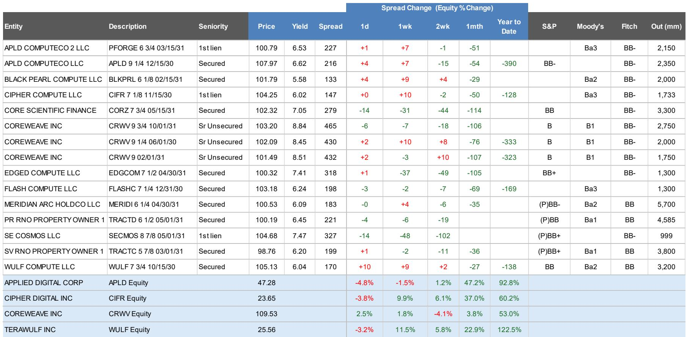
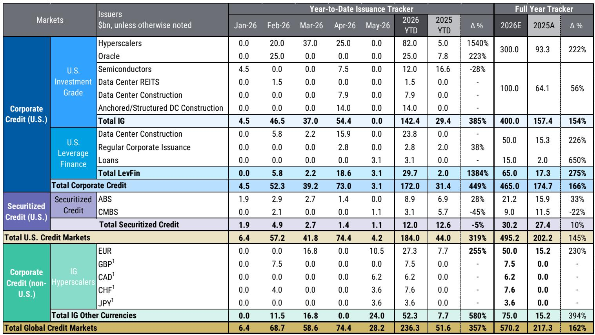
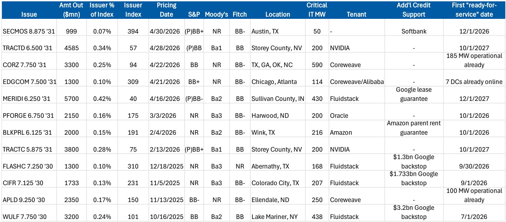

# 摩根斯坦利：AI融资的“夏季攻势”已提前到来，市场定价权正从基本面转向供给节奏

市场参与者正在经历一个罕见的时刻：基本面依然强劲，但价格行为的主导力量已经悄然切换。摩根斯坦利在最新发布的《AI债务融资追踪》报告中给出了一个清晰的信号——截至5月31日，2026年全球AI相关债务发行量已达2360亿美元，是2025年同期的4倍以上。但真正值得关注的不是这个数字本身，而是它背后的结构性变化：四月的发行热潮之后，五月美国市场迅速降温，但超大规模云服务商（hyperscalers）并未停止融资脚步，而是通过欧元、加元、瑞士法郎和日元等非美元市场发行了约240亿美元债券。

这意味着什么？AI基础设施的资本密集型属性，正在催生一个前所未有的、跨币种、跨资产类别的融资周期。摩根斯坦利预测，2026年全年全球AI相关债务供应将达到约5700亿美元，较2025年增长162%。但这份报告最核心的判断并不在于供应量的增长，而在于一个被市场低估的变量：**融资节奏的波动本身，正在成为比需求基本面更重要的定价因子。**

报告明确指出，当前市场定价更多由供应预期驱动，而非基本面。这听起来像是一个短期技术面现象，但如果我们深入拆解，会发现这背后隐藏着一个更深层的叙事转换——AI基础设施建设正在从“概念验证”阶段进入“资本运作”阶段，而资本市场对此的定价逻辑，也正在经历一次范式转移。

## 1. 四月发行高峰揭示了AI融资的结构性特征，而非季节性波动

四月单月发行量超过740亿美元，创下年内新高。这个数字本身令人印象深刻，但摩根斯坦利的数据揭示了更关键的细节：在AI相关的高收益债发行中，85%用于数据中心外壳建设；在投资级债券中，这一比例也达到了40%。

这意味着，当前AI融资的核心用途并非购买GPU或研发投入，而是最“重”的物理资产——数据中心。这些项目融资结构（project finance）的兴起，标志着AI基础设施投资正在从科技公司的资产负债表内支出，转向独立的、有明确资产抵押的融资工具。这种转变的意义在于：它打开了更广泛的投资者基础，同时也将AI投资的信用风险与科技公司的运营风险进行了部分隔离。

对于信用投资者而言，这既是机会也是挑战。机会在于，数据中心作为实物资产，其现金流可预测性可能高于科技公司的整体业务；挑战在于，这些项目融资结构的信用评估框架尚未成熟，市场仍在学习如何定价这类资产的风险。

## 2. 五月“喘息”并非需求放缓，而是融资策略的主动调整

摩根斯坦利用了一个巧妙的措辞“May Be Catching Its Breath”来描述五月美国市场的发行放缓。从数据看，五月美国市场AI相关发行量骤降至约42亿美元，与四月的744亿美元形成鲜明对比。

但仔细观察会发现，同期超大规模云服务商在非美元市场发行了约240亿美元债务。这不是市场降温，而是融资渠道的主动多元化。这些发行主体在欧元、英镑基准中的代表性远低于美元市场，这意味着非美元市场仍有充足的容纳空间。换句话说，五月美国市场的“安静”更像是一次战术性转移，而非需求不足。

对全球信用投资者而言，这意味着AI融资正在成为一个真正的全球性资产类别。欧元、英镑、加元、瑞士法郎和日元市场的AI债发行，不仅拓宽了投资者的选择范围，也为不同货币的资产管理人提供了参与AI基础设施投资的机会。这是一个值得持续跟踪的趋势，因为币种多样化本身也会影响定价效率和流动性分布。

## 3. 供给预期正在取代基本面，成为短期定价的锚

这是摩根斯坦利报告中最具洞察力的判断之一。报告指出，尽管基本面背景依然强劲，但当前价格行为主要由供应预期驱动。一个反直觉的现象是：尽管供应量大幅攀升，自一季度末以来，各资产类别的利差反而普遍收窄。

这听起来像是市场对供应的消化能力超预期，但摩根斯坦利的分析暗示，真正的原因可能更微妙——市场已经将“供应将持续增加”这一预期充分定价，而实际发行节奏的波动，反而成为短期交易的核心变量。四月的集中发行没有压垮市场，五月的间歇性放缓也没有引发恐慌，这意味着投资者正在形成一种新的定价共识：AI融资的长期结构性需求，足以吸收短期供应的波动。

但这个判断有一个关键前提：这种“技术面主导基本面”的状态能否持续，取决于最终需求方——即AI应用的实际落地速度。如果AI的商业化进展不及预期，那么当前的融资热潮就可能从“前置投资”变成“过度建设”。摩根斯坦利在报告中没有深入讨论这个风险，但这是每个投资者都必须自己思考的问题。

## 4. 2026年5700亿美元的供应预测背后，是一个尚未被充分定价的“二阶效应”

摩根斯坦利预测2026年全球AI相关债务供应将达到约5700亿美元，而截至5月底已发行2360亿美元。这意味着下半年还有约3340亿美元的供应等待释放。

这个数字本身已经足够庞大，但真正值得关注的是它背后的“二阶效应”。报告提到，摩根斯坦利的股权研究团队预计，到2027年超大规模云服务商的现金资本支出将超过1万亿美元。这意味着债务融资只是冰山一角，更大的股权融资需求可能正在酝酿。如果股权市场出现大规模融资，将对资本结构产生深远影响——可能改变现有债务的信用质量，也可能稀释现有股东的权益。

此外，芯片融资（chip financing）正在成为新的热点。报告指出，芯片融资交易期限更短、采用完全摊销结构，这与数据中心建设的长期项目融资形成鲜明对比。这种差异化的融资结构，意味着AI产业链的不同环节正在形成各自的信用定价体系。投资者需要区分的是：你是在为物理资产（数据中心）提供融资，还是在为技术迭代（芯片）提供融资？两者的风险特征和定价逻辑截然不同。

## 5. 报告尚未完全回答的关键问题：当“技术面”变为“基本面”时会发生什么？

摩根斯坦利的分析框架将当前市场定位为“技术面驱动”，但这个判断本身隐含了一个需要验证的假设：技术面驱动是不可持续的，最终定价权将回归基本面。

但有没有另一种可能——AI融资的供给节奏本身，正在成为基本面的一部分？当一个产业的资本支出规模达到数万亿美元时，融资节奏、利率环境、投资者情绪这些“技术面”因素，反过来会影响企业的投资决策和盈利能力。如果下半年发行加速导致利差走阔，超大规模云服务商是否会调整资本支出计划？如果芯片融资结构中的短期限、高摊销特征导致再融资风险上升，是否会影响芯片厂商的研发投入节奏？

这些问题在报告中只是被提及，但没有被充分展开。它们构成了一个值得持续追踪的分析框架：AI基础设施投资的金融化程度越高，资本市场自身的动态就越可能成为产业周期的内生变量。

## 6. 投资者的观察框架：从“买什么”转向“怎么买”

基于摩根斯坦利的分析，我们认为投资者需要建立一个新的观察框架。传统上，AI投资的核心问题是“买哪家公司”或“买哪个行业”。但当前阶段，更关键的问题可能是“通过什么工具参与”和“在哪个市场参与”。

数据中心项目融资、芯片融资、超大规模云服务商的公司债、资产证券化产品——这些工具的风险收益特征各不相同，且在不同币种市场中的定价效率也有差异。摩根斯坦利的报告提供了一个很好的起点，但它没有深入讨论的是：不同融资结构之间的相对价值如何？在美元市场与非美元市场之间，是否存在显著的定价错误？资产证券化产品中的数据中心相关ABS，其信用增级结构是否足以应对技术迭代风险？

这些问题的答案，将决定投资者能否在AI融资浪潮中获得超额收益，而不仅仅是被动吸收供应。

---

五月美国市场的“喘息”已经过去，六月的数据将是检验报告判断的第一个关键节点。如果下半年发行如预期加速，市场将面临真正的压力测试——不是对需求的测试，而是对定价机制的测试。

摩根斯坦利这份报告的价值，不在于给出了一个精确的供应预测数字，而在于它揭示了AI融资正在从“产业叙事”演变为“金融市场叙事”。这个叙事转换的完成度，将决定未来几年信用市场的核心主题。

欢迎来星球微信群里继续讨论。我们将在群内分享这份报告的原始图表和更多未在文章中展开的数据细节，包括各资产类别发行利差的逐笔追踪、芯片融资交易的结构对比，以及下半年发行节奏的关键时间节点。如果你对AI融资的结构性变化有自己的观察，也欢迎在群里与我们交流。

Personal reading notes and learning share only. Not investment advice.

