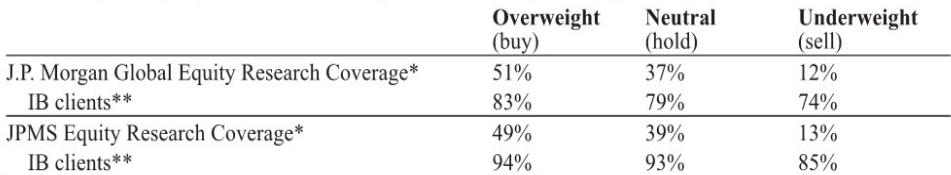

# The AI Infrastructure Build-Out Is Entering Its Component-Level Phase, and Panasonic's Investor Day Reveals Where the Real Bottlenecks Will Emerge

The first wave of the AI infrastructure build-out was about chips and data centers. The second wave is about what goes inside them. Panasonic Holdings' June 8 Investor Day made this pivot explicit: the company is no longer just a battery supplier for consumer electronics but is positioning itself as a critical enabler of the AI data center power and materials stack. The strategic logic is straightforward—AI workloads are power-hungry, and the physical infrastructure supporting them is now the binding constraint on scaling—but the implications are far less obvious. Panasonic's new targets through FY2028 and FY2030 reveal a company betting that the next competitive frontier in AI will not be in model architecture but in the reliability, density, and thermal management of the components that keep those models running.

The report's central insight is that Panasonic is targeting a near-doubling of its energy segment sales to ¥2 trillion by FY2028, with roughly half of that coming from data center energy storage systems alone. This is not incremental growth. It implies that the company expects the data center power equipment market to accelerate at a pace that outstrips even the most optimistic current demand forecasts. The more interesting story, however, lies in the details of what Panasonic is building to get there: capacitor backup units (CBUs), next-generation power rack battery backup units (BBUs), and advanced substrate materials for AI semiconductors. These are not headline-grabbing products. They are the unglamorous, high-precision components that determine whether a data center stays online when grid power flickers or whether a chip can handle the thermal stress of continuous AI inference.

Why now matters is simple. The AI industry is transitioning from training to inference, and inference workloads are distributed, unpredictable, and latency-sensitive. That changes the power architecture requirements inside data centers. Traditional uninterruptible power supplies (UPS) and lead-acid backup batteries are too slow, too large, and too inefficient for the new generation of high-density racks. The market for compact, fast-response, high-cycle-life energy storage—which is exactly what CBUs and supercapacitors provide—is about to expand dramatically. Panasonic's Investor Day was, in effect, a signal that the company sees this inflection point and is committing capital to capture it.

## Panasonic's ¥1 Trillion Data Center Energy Storage Target Implies That the Market Is Underestimating the Pace of Power Architecture Change

The headline number from the Investor Day is that Panasonic expects data center energy storage system sales to reach around ¥1 trillion by FY2028, up from ¥550 billion in its FY2026 guidance. That is a compound annual growth rate of roughly 35 percent over two years. To put that in perspective, the entire global data center power market was estimated at around $20 billion in 2025. Panasonic is essentially betting that its share of a rapidly expanding segment will grow faster than the market itself.

The logic behind this bet is not just about volume; it is about product mix. Panasonic explicitly stated that next-generation products—CBUs and power rack BBUs—will drive growth beyond the conventional BBU business. This is a critical distinction. Conventional BBUs are essentially large battery packs that provide backup power for minutes. CBUs, by contrast, use supercapacitors to deliver bursts of power in milliseconds, which is exactly what is needed to bridge the gap between a grid disturbance and the activation of diesel generators or longer-duration battery systems. In high-density AI racks where a single server can draw 10 kilowatts or more, even a few milliseconds of power loss can corrupt data or crash workloads. The CBU is the insurance policy against that risk.

The report notes that Panasonic believes the CBU market could reach close to ¥10 billion in FY2028 and ¥100 billion in FY2030. That is a tenfold increase in two years and another tenfold increase in the following two years. Such a trajectory is not typical for industrial components. It suggests that Panasonic expects CBUs to transition from a niche product used in a few hyperscaler data centers to a standard feature in most new AI-oriented facilities. The implication for competitors is clear: any company that does not have a CBU or equivalent fast-response power solution by 2028 may find itself locked out of the fastest-growing segment of the data center power market.

## The Industry Segment's ¥500 Billion AI Sales Target Reveals a Bet on Materials Science, Not Just Components

Panasonic's industry segment targets AI-related sales of ¥430 billion in FY2028 and ¥500 billion in FY2030, up from ¥270 billion in FY2026. The operating margin for this business is estimated at around 20 percent, which is high for a components and materials business and suggests that Panasonic is targeting premium, high-differentiation products rather than commoditized supply.

The two main product lines are advanced substrate materials and conductive polymer capacitors. Advanced substrate materials are the layers that connect a semiconductor die to its package and ultimately to the circuit board. As AI chips become larger, more powerful, and hotter, the substrate must handle higher signal speeds, greater power density, and more thermal stress. Panasonic noted that products through M6 (a substrate material grade) account for 60 percent of current sales, while M7 and M8 account for about 40 percent. More importantly, the company is already receiving inquiries for M9 and M10. This indicates that the roadmap is being pulled by customer demand, not pushed by Panasonic's own R&D timeline.

The strategic significance here is that advanced substrates are a known bottleneck in the AI semiconductor supply chain. The leading substrate manufacturers have been capacity-constrained for years, and the shift to higher-layer counts and finer line widths is pushing the limits of existing manufacturing processes. Panasonic's plan to double production capacity for both substrate materials and capacitors by FY2030 is a direct response to this constraint. But the report also hints at a potential limitation: discussions about advanced substrate material market share and advantages versus competitors seemed somewhat limited. This is a meaningful omission. If Panasonic cannot articulate why its substrate materials are superior to those of competitors like Ajinomoto or Mitsubishi Gas Chemical, then the capacity expansion may simply lead to price compression rather than margin expansion.

## The CBU and Supercapacitor Roadmap Suggests That the Power Supply Chain Is About to Be Redefined

The most forward-looking part of the Investor Day was the discussion of supercapacitors for CBUs. Panasonic plans to launch mass production of supercapacitors for CBUs in cooperation with the energy segment from FY2026, and it also plans to launch mass production of new products for high-voltage applications such as HVDC from FY2028. The company aims to increase sales for these innovative devices to ¥50 billion in FY2030.

This is not just a product launch. It is a redefinition of where the boundary between the energy segment and the industry segment lies. Traditionally, Panasonic's energy business made batteries, and its industry business made electronic components. The CBU blurs that line: it is a power storage device that uses supercapacitors (an industry product) to serve a data center energy storage function (an energy segment market). The fact that Panasonic is coordinating the two segments internally suggests that it sees the CBU as a platform that can integrate its materials science expertise with its systems integration capabilities.

The report also notes that Panasonic expects demand for supercapacitors for applications other than racks to increase in the future, but it did not mention the possibility of outside sales. This is a fascinating omission. If Panasonic is developing supercapacitor technology that is superior to what is available from specialized capacitor manufacturers, it could choose to sell those supercapacitors to other power system integrators. The fact that it is not discussing outside sales yet may indicate that it wants to keep the technology proprietary for as long as possible, or it may indicate that the technology is not yet mature enough for third-party sales. Either way, this is a topic that deserves close monitoring. If Panasonic does eventually open its supercapacitor supply to the broader market, it could disrupt the existing capacitor supply chain.

## What the Report Does Not Fully Answer: How Panasonic Will Defend Its Substrate Material Position Against Specialized Competitors

For all the detail in the Investor Day, one question remains unresolved: how does Panasonic intend to maintain or grow its market share in advanced substrate materials when the competitive landscape is dominated by companies that focus exclusively on that product category? The report acknowledges that discussions about market share and competitive advantages were somewhat limited. This is a red flag.

Advanced substrate materials are a high-stakes business. The leading players invest heavily in R&D for each new generation, and the switching costs for customers are high because changing a substrate material requires requalification of the entire chip packaging process. Once a customer chooses a supplier for a given chip generation, it is very difficult to switch. Panasonic's current position—with 60 percent of sales from M6 and below—suggests that it is strong in the older generations but may be less dominant in the bleeding-edge M7, M8, and beyond. The fact that it is receiving inquiries for M9 and M10 is encouraging, but inquiries are not orders.

The real test will be whether Panasonic can convert its R&D pipeline into commercial wins at the largest AI chip designers. If it can, the ¥60 billion investment in substrate materials capacity will generate strong returns. If it cannot, that capacity may become underutilized, and the 20 percent operating margin target for the AI-related business may prove optimistic. Investors should watch for announcements of specific design wins at major semiconductor companies, as those will be the leading indicator of whether Panasonic's substrate material strategy is working.

## A Decision Framework for Readers: How to Evaluate Panasonic's AI Infrastructure Thesis

For readers trying to assess whether Panasonic's AI infrastructure strategy is credible, the following framework may be useful. It is not a checklist but a set of questions that separate signal from noise.

First, evaluate the demand pull. Is the growth in data center energy storage driven by genuine architectural change, or is it just a cyclical upswing in data center construction? The evidence from hyperscalers suggests that power density per rack is increasing faster than floor space, which supports the thesis that new power architectures are needed. But this thesis depends on AI inference workloads continuing to grow at current rates. If AI adoption slows, the demand for CBUs and high-density power systems will slow with it.

Second, assess the competitive moat. Panasonic's CBU combines supercapacitors with battery management systems. How defensible is that combination? Supercapacitors are a relatively mature technology, and many companies can manufacture them. The differentiation may come from the system-level integration and the reliability testing that Panasonic can perform. But if a competitor like Tesla or Schneider Electric develops a comparable product with better cost structure, Panasonic's advantage could erode quickly.

Third, consider the capital allocation signal. Panasonic plans total capex of ¥350 billion through FY2028 for the energy segment and ¥150 billion for AI-related investments in the industry segment. That is a total of ¥500 billion, or roughly $3.3 billion at current exchange rates. For a company with a market capitalization of around ¥4 trillion, that is a meaningful commitment. The question is whether the returns on that capital will exceed the cost of capital. The 20 percent operating margin target for AI-related business suggests that Panasonic expects attractive returns, but that margin depends on utilization rates and pricing power.

Fourth, watch the substrate material market share trajectory. If Panasonic's share of M7 and M8 substrate materials increases over the next two years, that is a strong signal that its technology is competitive. If it stagnates or declines, the entire AI infrastructure thesis weakens because substrate materials are the highest-margin product in the portfolio.

## Join the community to read the full report and review the original charts

The Panasonic Investor Day revealed a company that is making a deliberate, capital-intensive bet on the physical layer of AI infrastructure. The thesis is coherent, the targets are ambitious, and the product roadmap is plausible. But the unanswered questions about competitive positioning in substrate materials and the lack of clarity on supercapacitor outside sales leave room for doubt. The full report contains detailed charts on capacity expansion timelines, margin breakdowns by product line, and a comparison of Panasonic's CBU specifications against competing solutions. For readers who want to form their own judgment, those charts are essential. The community discussion around this report has already surfaced several alternative interpretations of the data, and the full context will help you decide which interpretation is most likely.

*This article is for learning and discussion only and does not constitute investment advice.*

Personal reading notes and learning share only. Not investment advice.

