## AD TECH PRIMER

## US Internet

## Intro to Mobile Ad Tech: Who Are the Players, What Do They Do, and What's Changing?

MS
North America

MS & Co. LLC

## Matthew Cost

Matthew.Cost@morganstanley.com

+1 212 761 7252

## Brian Nowak, CFA

Brian.Nowak@morganstanley.com

+1 212 761 3365

## Cela VanLieshout

Cela.VanLieshout1@morganstanley.com

+1 212 761 2679

## Intro to Mobile Ad Tech

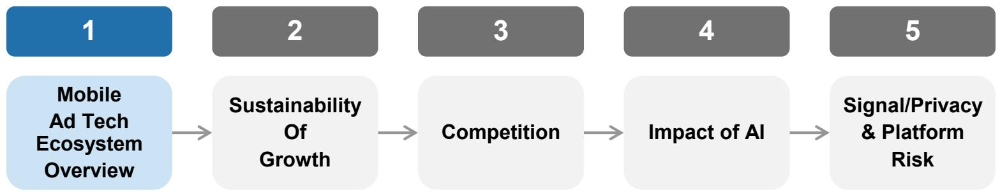

flowchart

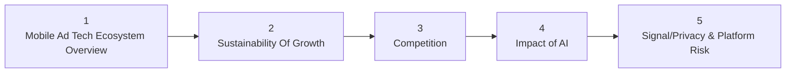
```mermaid
graph LR
  A["1\nMobile Ad Tech Ecosystem Overview"] --> B["2\nSustainability Of Growth"]
  B --> C["3\nCompetition"]
  C --> D["4\nImpact of AI"]
  D --> E["5\nSignal/Privacy & Platform Risk"]
```

## In-App Ads Typically Send Consumers to the App Stores to Download New Products – Today, Most of Those Ads Are Promoting Games...

text_image

4:29
5G
WORDS with friends™
ATGO

User Opens & Plays a Publisher's App

text_image

Kingshot
Play Now
4
0
10
Swipe to move

An Interactive or Video Ad Will Appear for User

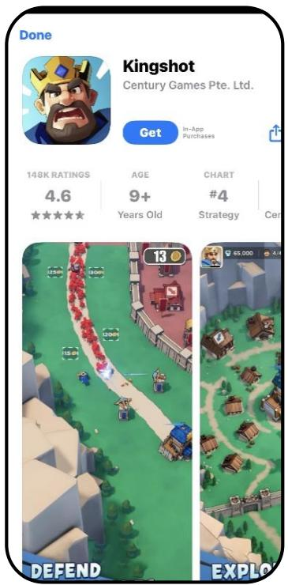

text_image

Done
Kingshot
Century Games Pte. Ltd.
Get In-App Purchases
148K RATINGS AGE CHART
4.6 9+ #4
Years Old Strategy Cen
DEFEND EXPLO

User is Prompted to Download the Game

## ...But Other Categories like Retail and Entertainment Are Important Drivers of the \$79bn Opportunity for Independent In-App Ad Tech Platforms Like APP and U

Global Ad Spend on Independent In-App Ad Tech Platforms is Projected to Reach \$136bn in 2030\*  
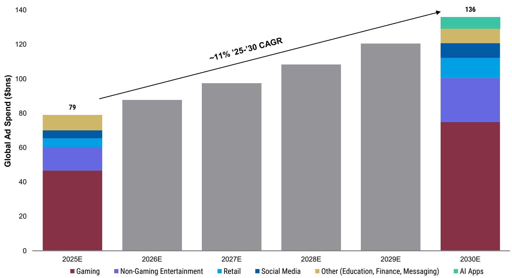

stacked bar chart

| Year | Gaming ($bns) | Non-Gaming Entertainment ($bns) | Retail ($bns) | Social Media ($bns) | Other (Education, Finance, Messaging) ($bns) | AI Apps ($bns) |
| :--- | :--- | :--- | :--- | :--- | :--- | :--- |
| 2025E | 46 | 12 | 5 | 5 | 8 | 0 |
| 2026E | 47 | 12 | 5 | 5 | 8 | 0 |
| 2027E | 49 | 13 | 5 | 5 | 8 | 0 |
| 2028E | 51 | 14 | 5 | 5 | 8 | 0 |
| 2029E | 53 | 15 | 5 | 5 | 8 | 0 |
| 2030E | 55 | 16 | 5 | 5 | 8 | 136 |
~11% '25-'30 CAGR; total ad spend is projected at $136 billion. The chart displays a single stacked bar for each year from 2025E to 2030E.

## The Estimated Near-Term Market Opportunity is \$79bn, Though Total In-App and Mobile Advertising Are Larger, When Including Walled Garden Platforms like GOOGL and META

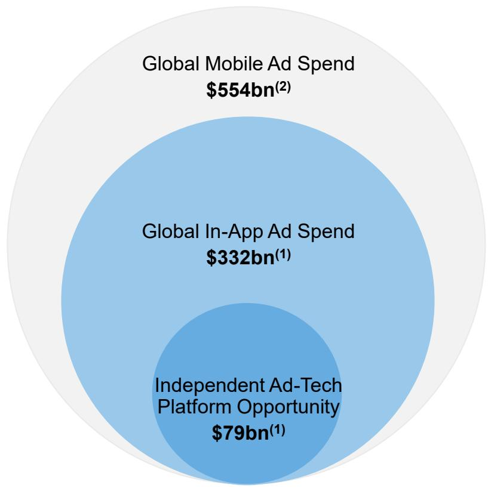

venn diagram chart

| Category | Value |
| -------- | ----- |
| Global Mobile Ad Spend | $554bn^(2) |
| Global In-App Ad Spend | $332bn^(1) |
| Independent Ad-Tech Platform Opportunity | $79bn^(1) |

(1) According to Altman Solon  
(2) According to eMarketer  
(3) According to SensorTower

## 5bn

Smartphone Users Globally $^{(2)}$

## \~3 hours

Spent on Apps per Day $^{(3)}$

## \$554bn

Global Mobile Ad Spend per Year $^{(2)}$

## 90%

Mobile Time Spent In-App $^{(2)}$

## We Also Expect Meaningful Growth Across Broader Markets Like In-App Advertising (incl. Walled Gardens) as well as Total Mobile Advertising

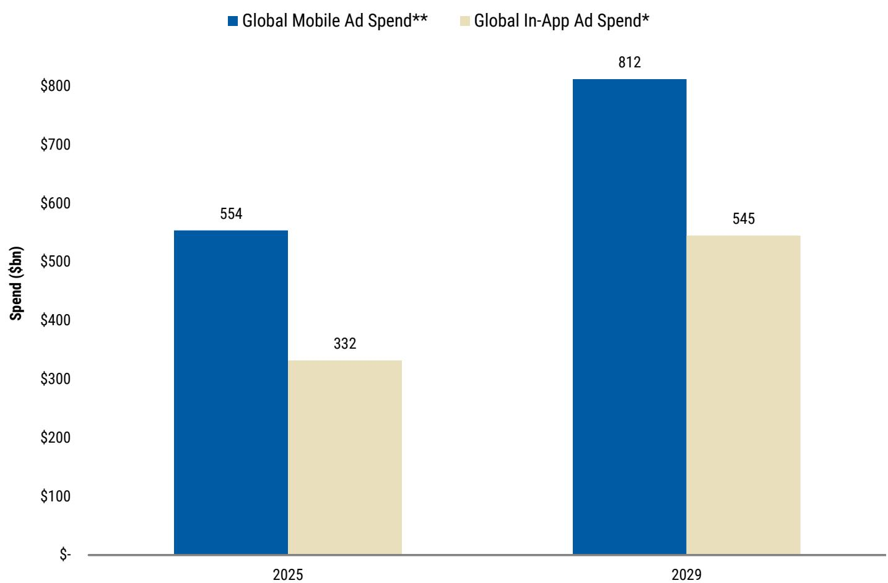

bar chart

| Year | Global Mobile Ad Spend** ($bn) | Global In-App Ad Spend* ($bn) |
| ---- | ------------------------------ | ----------------------------- |
| 2025 | 554                            | 332                           |
| 2029 | 812                            | 545                           |

\*According to Altman Solon  
\*\*According to eMarketer  
Source: Company Data, MS, Altman Solon, eMarketer  
Note: 2029 Number for Global In-App Ad Spend Found by Using 2025-2030 CAGR

## We Expect In-App Advertising to Grow at an 11% CAGR through '30, Materially Faster than Growth on In-Game Purchases at a 5% CAGR...

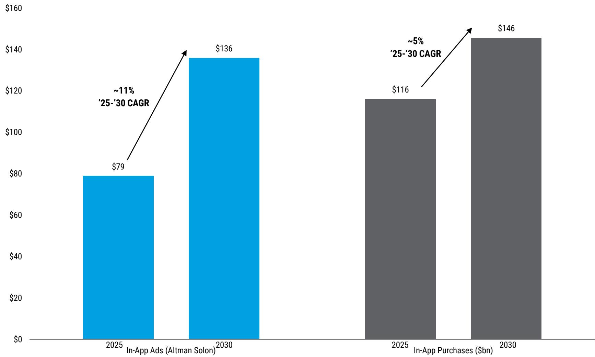

bar chart

| Category                  | 2025   | 2030   |
| ------------------------- | ------ | ------ |
| In-App Ads (Altman Solon) | $79    | $136   |
| In-App Purchases ($bn)   | $116   | $146   |

## ...But This Has Strong Precedent, as User Acquisition Costs for Mobile Games Materially Outgrew Spend per User Pre-COVID...

## 24%

Cost Per Install

2012-2019 CAGR

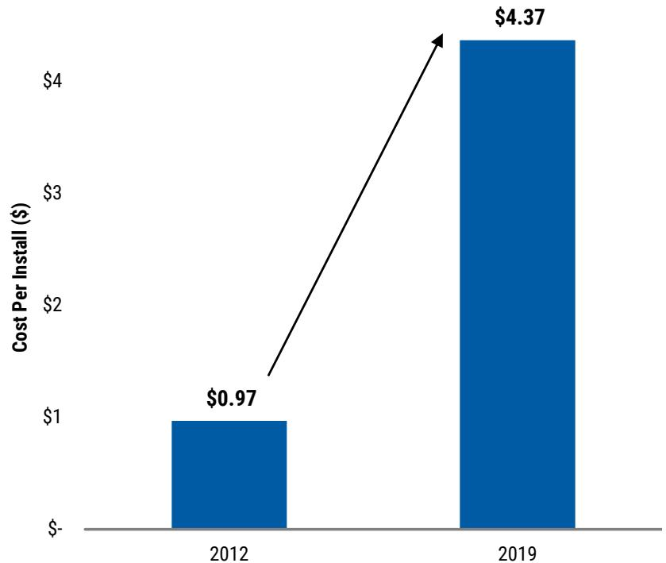

bar chart

| Year | Cost Per Install ($) |
| :--- | :--- |
| 2012 | 0.97 |
| 2019 | 4.37 |

## 17%

Average Revenue Per Mobile Gamer

2012-2019 CAGR

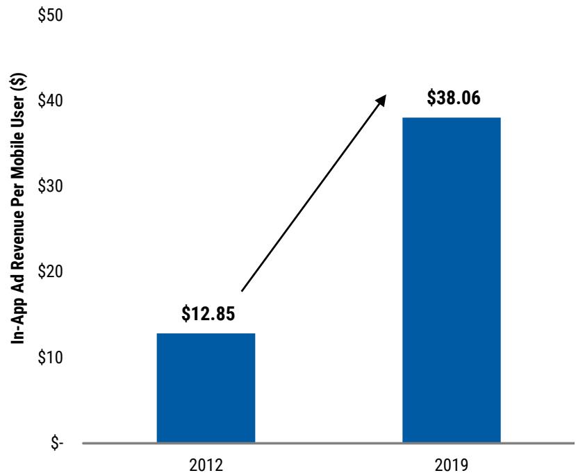

bar chart

| Year | In-App Ad Revenue Per Mobile User ($) |
| :--- | :--- |
| 2012 | 12.85 |
| 2019 | 38.06 |

## ...and the Trend Has Continued in Recent Years, With Mobile Gaming UA Spend Growing at a 15% '20-'25 CAGR vs. IAP Growing Just 3% Over the Same Period

## 15%

Mobile Gaming UA Ad Spend

2020-2025 CAGR

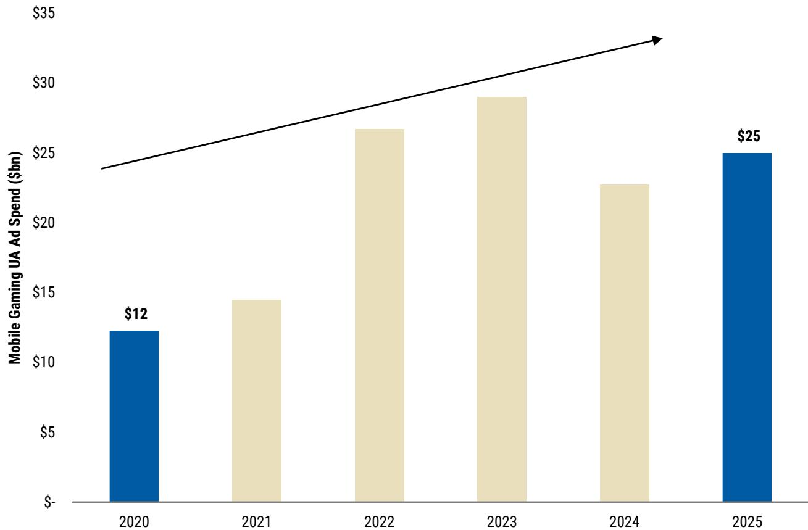

bar chart

| Year | Mobile Gaming UA Ad Spend ($bn) |
| :--- | :--- |
| 2020 | 12 |
| 2021 | 14.5 |
| 2022 | 26.8 |
| 2023 | 29.0 |
| 2024 | 22.8 |
| 2025 | 25.0 |

In-App Ad Spend Arguably Remains Under-Monetized Relative to Other Ad Channels  
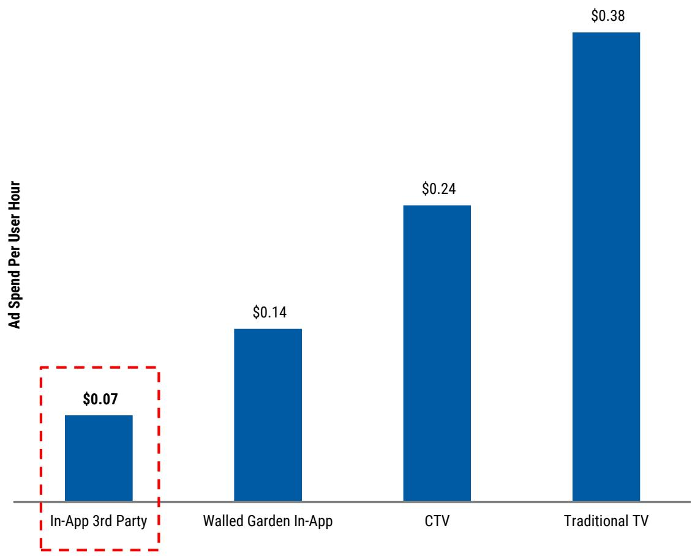

bar chart

| Category | Ad Spend Per User Hour ($) |
| :--- | :--- |
| In-App 3rd Party | 0.07 |
| Walled Garden In-App | 0.14 |
| CTV | 0.24 |
| Traditional TV | 0.38 |

3 $^{rd}$ Party In-App Represents One of the Highest Growth Opportunities in Digital Advertising

Who Are Some of the Players in Mobile Ad Tech and What Roles Do They Play?  

table

| Company | DSP | SSP | Mediation |
| :--- | :--- | :--- | :--- |
| APPLOVIN | ✓ | | ✓ |
| Unity® | ✓ | ✓ | ✓ |
| Meta | ✓ | | |
| Google | ✓ | ✓ | ✓ |
| Mintegral | ✓ | ✓ | |
| InmOBI™ | ✓ | ✓ | |
| Moloco | ✓ | ✓ | |
| CloudX | | ✓ | ✓ |

## What Do Those Roles Mean?

<table><tr><td>Advertisers</td><td>Companies aiming to acquire new usersIn this market, typically app-based businesses or those with an app</td></tr><tr><td>DSP</td><td>Software that helps advertisers buy digital ads programmatically (i.e. in an automated way)Aids advertisers in targeting the right users and selecting creative to achieve their objective by analyzing all available and relevant data, as well as learning from past ad campaigns</td></tr><tr><td>SSP</td><td>Software that publishers use to make their ad inventory available to many potential buyers (generally DSPs) as possible in an auction formatTypically applies rules and works towards the goal of maximizing revenue for each impression</td></tr><tr><td>Mediation</td><td>Software that publishers use to connect to multiple SSPs, compare their bids or expected value, and serves the best-paying adGenerally compare bids in real time auction format rather than in series (i.e. waterfall) as in the past</td></tr><tr><td>Publishers</td><td>Companies aiming to show ads inside their app, site, or service for profitIn this market, typically app-based businesses or those with an app</td></tr></table>

## There Are Many Players Across Public/Private Markets, With Many Filling Multiple Roles

## Advertisers

SCOPELY

Quince

zynga®

dream

Booking.com

## Publishers

WSJ

NATIONAL GEOGRAPHIC

NETFLIX

TRAVEL+ LEISURE

The New York Times

## Mediation

APPLOVIN

Unity®

Google

PubMatic

InmOBI™

CloudX

## DSP

theTradeDesk

Unity®

dataxu

CRITEO

APPLOVIN

xandr

Meta

AMOBEE

Google

Oath:

InmOBI

Adobe

MOLOCO adform

amazonadvertising

## SSP

SPOTX

APPLOVIN

Magnite

xandr

Unity

AppNexus

OpenX

CloudX

Mintegral

Google

InmOBI

MOLOCO

## In a Classical Example, Advertisers Execute Campaigns via DSPs, Which Bid into Auctions Run by SSPs on Behalf of Publishers

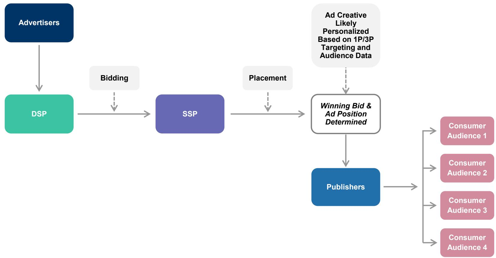

flowchart

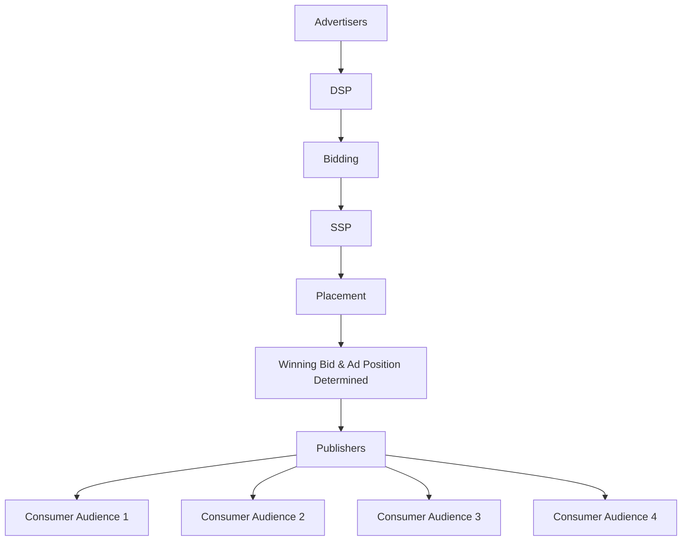
```mermaid
graph TD
  A["Advertisers"] --> B["DSP"]
  B --> C["Bidding"]
  C --> D["SSP"]
  D --> E["Placement"]
  E --> F["Winning Bid & Ad Position Determined"]
  F --> G["Publishers"]
  G --> H["Consumer Audience 1"]
  G --> I["Consumer Audience 2"]
  G --> J["Consumer Audience 3"]
  G --> K["Consumer Audience 4"]
```

## Mediation Tools Allow Publishers to Work with Multiple SSPs or Ad Networks at Once, With the Goal of Maximizing the Value of Publishers' Ad Inventory

SSP/Ad Network #1  
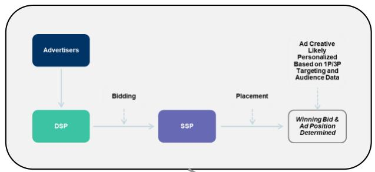

flowchart

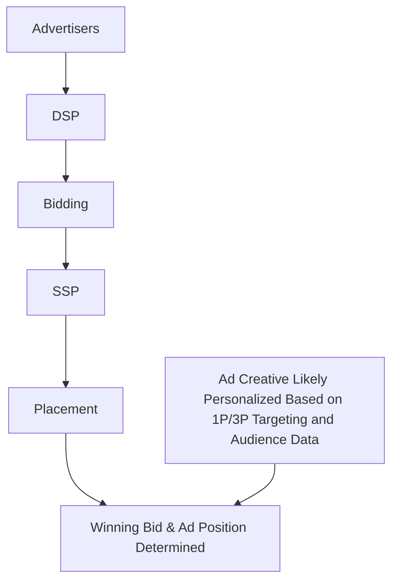
```mermaid
graph TD
  A["Advertisers"] --> B["DSP"]
  B --> C["Bidding"]
  C --> D["SSP"]
  D --> E["Placement"]
  E --> F["Winning Bid & Ad Position Determined"]
  G["Ad Creative Likely Personalized Based on 1P/3P Targeting and Audience Data"] --> F
```

SSP/Ad Network #2  
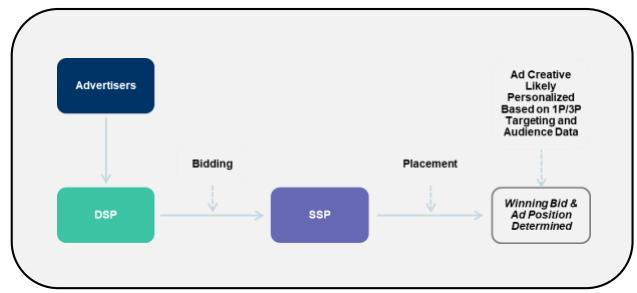

flowchart

```mermaid
graph TD
  A["Advertisers"] --> B["DSP"]
  B --> C["Bidding"]
  C --> D["SSP"]
  D --> E["Placement"]
  E --> F["Winning Bid & Ad Position Determined"]
  G["Ad Creative Likely Personalized Based on 1P/3P Targeting and Audience Data"] --> F
```

SSP/Ad Network #3  
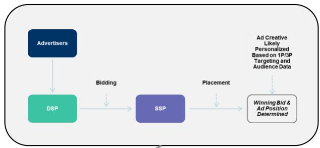

flowchart

```mermaid
graph TD
  A["Advertisers"] --> B["DSP"]
  B --> C["Bidding"]
  C --> D["SSP"]
  D --> E["Placement"]
  E --> F["Winning Bid & Ad Position Determined"]
  G["Ad Creative Likely Personalized Based on 1P/3P Targeting and Audience Data"] --> F
```

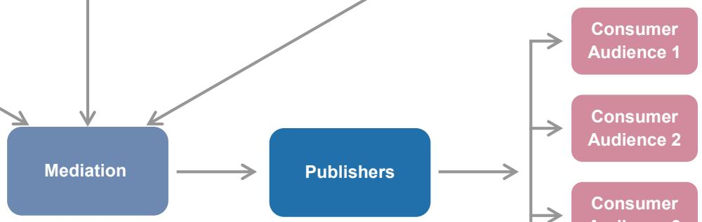

flowchart

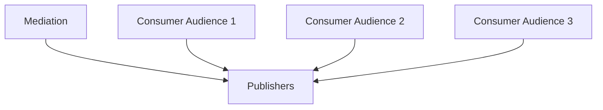
```mermaid
graph TD
  A["Mediation"] --> B["Publishers"]
  C["Consumer Audience 1"] --> B
  D["Consumer Audience 2"] --> B
  E["Consumer Audience 3"] --> B
```

## The Majority of the Unit Economics Accrue to Publishers, with DSPs and SSPs Capturing Most of the Remainder

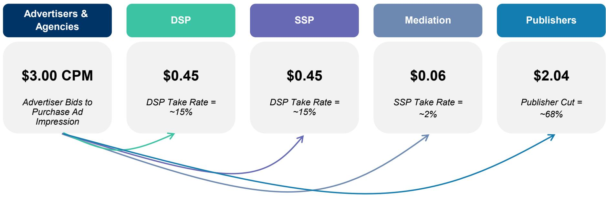

flow diagram

| Category               | Value   |
| ---------------------- | ------- |
| Advertisers & Agencies  | $3.00 CPM |
| DSP                    | $0.45   |
| SSP                    | $0.45   |
| Mediation              | $0.06   |
| Publishers             | $2.04   |

## Any Other Potential Fees?

- Ad servers  
• Data management platforms (estimated 1-2% but can be included within the DSP take rate)  
• Digital media analytics fees are paid separately by the advertiser (i.e. not a percentage of CPM)

## Intro to Mobile Ad Tech

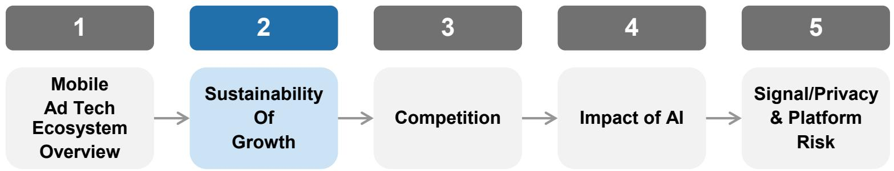

flowchart

```mermaid
graph LR
  A["1\nMobile Ad Tech Ecosystem Overview"] --> B["2\nSustainability Of Growth"]
  B --> C["3\nCompetition"]
  C --> D["4\nImpact of AI"]
  D --> E["5\nSignal/Privacy & Platform Risk"]
```

## Introduction: Sustainability of Growth

## What Is The Debate?

- Broadly speaking, there is debate around how much room there is for further growth in mobile advertising, including improvement in existing unit economics or performance, expansion into new verticals, and exposure to macroeconomic pressure.  
- Specifically, this includes discussion of how high advertisers can raise take rates and conversion rates, which directly impacts potential growth in revenue for ad tech players.  
- Debate has also centered on how scalable ecommerce and other verticals outside of in-game advertising are.

## What's Changing?

- Recent initiatives from ad platforms to expand beyond core in-game advertising and into web and e-commerce have driven debate around the durability and scale of these new verticals  
- Potential entry of larger platforms into in-game advertising has raised questions regarding the sustainability of conversion rates and take-rate expansion for incumbent players. Separately, there is investor focus on exposure to broader macroeconomic headwinds and potential cyclicality.

## Why Does It Matter?

- Take rates and conversion rates are key drivers of monetization efficiency for platforms and directly impact revenue. Improvement in these metrics signals stronger advertiser ROI and platform pricing power, while any degradation may indicate rising competition or weakening demand quality.  
- Expansion beyond in-game advertising could meaningfully increase TAM, supporting higher long-term revenue and margin growth

## Who Is Primarily Impacted?

- Potential Beneficiaries: APP, U, and other players that can meaningfully scale into new verticals while improving conversion rates.  
- Potentially At Risk: Existing ad platforms in new verticals that fail to outperform other players on conversion rates or advertiser-specific performance metrics (ROAS, etc.).

## Higher Conversion Rates Allow Ad Tech Companies to Increase Their Take Rates and Net Revenue...

## What Are Conversion Rates and Take Rates? Why Do They Matter?

- Click Through Rates: the portion of users that click on an ad after viewing it  
- Conversion Rates: the portion of ad impressions (clicks) that result in a desired outcome (app install, purchase, etc.)  
- “Take Rates”: The share of advertiser spend captured by the ad platform, contributing to net revenue for the platform  
• Media Spend: Spend by the ad platform to win placements and impressions to result in one conversion

## Total Impressions:

Users who view the ad

x Click Through Rate

## Total Engagement:

Users who interact with the ad

x Conversion Rate

## Conversions

Users Who Complete

The Desired

Outcome

- Higher conversion rates result in better campaign efficiency, increasing the value of each impression. If conversion rates improve, the ad platform needs fewer impressions to deliver the same number of installs.  
- Improved conversion lowers effective CPI for the ad platform by lowering the number of impressions needed to result in one conversion. If advertiser spend remains stable, the platform keeps a larger spread between spend and inventory cost.

## ...Presenting a Growth Opportunity that Is Separate from Growth in Total Ad Dollars Spend by Advertisers

Improved Conversion Rates Can Improve The Effective “Take Rate” Of An Ad Platform, Increasing Net Revenue Without Relying on Change in Advertiser Spend. With higher conversion rates, Ad platforms need to buy less impressions to results in one conversion.

If It Takes 20 Ad Impressions To Generate One App Install Today......  
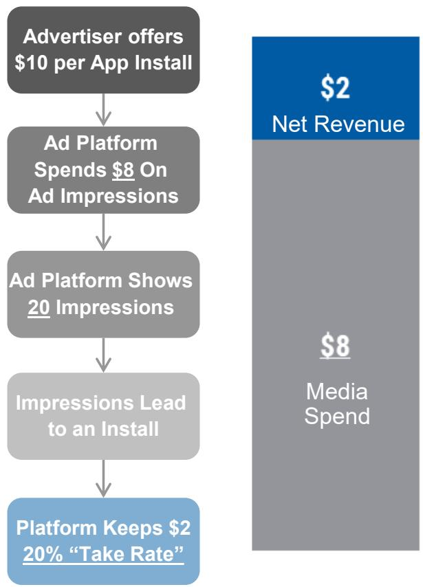

flowchart

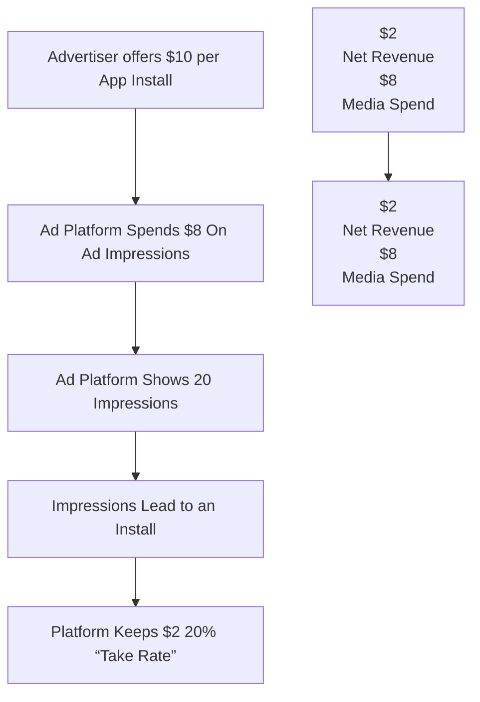
```mermaid
graph TD
  A["Advertiser offers $10 per App Install"] --> B["Ad Platform Spends $8 On Ad Impressions"]
  B --> C["Ad Platform Shows 20 Impressions"]
  C --> D["Impressions Lead to an Install"]
  D --> E["Platform Keeps $2 20% “Take Rate”"]
  F["$2\nNet Revenue\n$8\nMedia Spend"] --> G["$2\nNet Revenue\n$8\nMedia Spend"]
```

...An Improvement To 15 Impressions Per Install Would Lead "Take Rate" To Double  
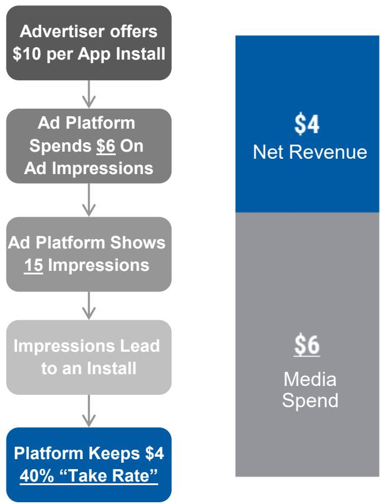

flowchart

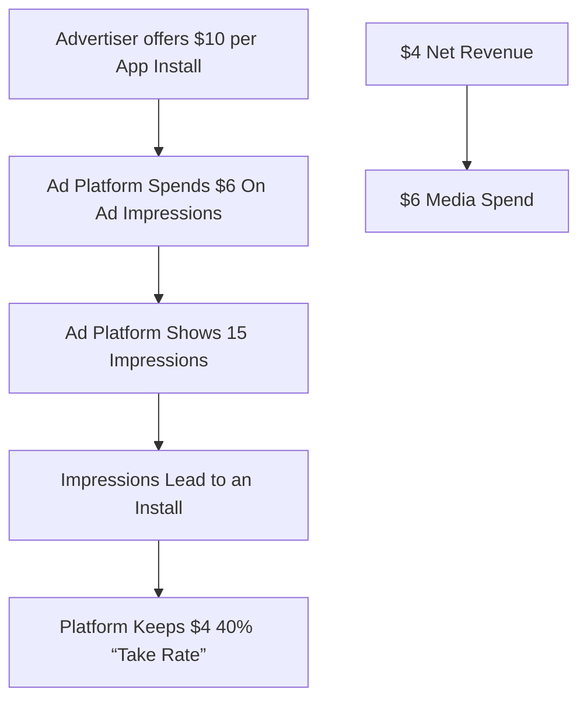
```mermaid
graph TD
  A["Advertiser offers $10 per App Install"] --> B["Ad Platform Spends $6 On Ad Impressions"]
  B --> C["Ad Platform Shows 15 Impressions"]
  C --> D["Impressions Lead to an Install"]
  D --> E["Platform Keeps $4 40% “Take Rate”"]
  F["$4 Net Revenue"] --> G["$6 Media Spend"]
```

## We Estimate Leading Platforms Like META Enjoy “True” Conversion Rates \~10x Above APP’s, Suggesting Significant Headroom Even If APP’s Rates Never Reach META’s

## META Conversion Rates are \~10x Those of APPs, Representing Significant Potential Upside to APP Revenue If Conversion Rates and Platform Performance Continue to Improve

APP

<table><tr><td>% of Ads that Generate an App Install</td><td>1.3%</td></tr><tr><td>x In-Game Paying Ratio</td><td>2.0%</td></tr><tr><td>= &quot;True&quot; Conversion Rate</td><td>0.026%</td></tr></table>

META

<table><tr><td>Click-Through Rate</td><td>2.5%</td></tr><tr><td>x Conversion Rate</td><td>10.0%</td></tr><tr><td>= &quot;True&quot; Conversion Rate</td><td>0.25%</td></tr><tr><td>META &quot;True&quot; Conversion Rate</td><td>0.25%</td></tr><tr><td>/ APP &quot;True&quot; Conversion Rate</td><td>0.026%</td></tr><tr><td>= Headroom For Expansion</td><td>10x</td></tr></table>

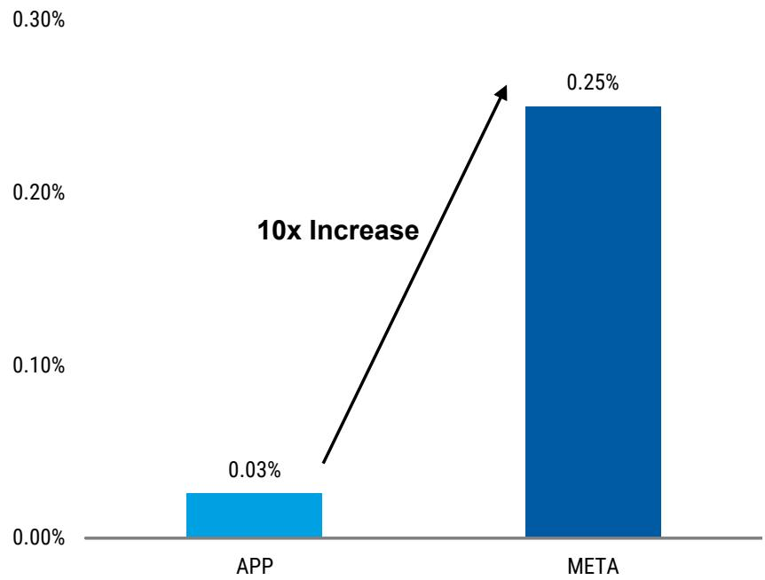

bar chart

| Category | Value (%) |
|---|---|
| APP | 0.03 |
| META | 0.25 |
10x Increase (indicated by arrow) from APP to META

## The Serviceable Market for Ad Networks Like APP and U Is Ultimately a Subset of the Estimated \$332bn TAM for In-App Advertising, Which Includes the Walled Gardens

Global In-App Ad Spend (\$bn)  
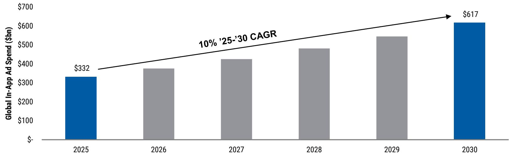

bar chart

| Year | Global In-App Ad Spend ($bn) |
| :--- | :--- |
| 2025 | 332 |
| 2026 | 378 |
| 2027 | 428 |
| 2028 | 480 |
| 2029 | 545 |
| 2030 | 617 |
10% '25-'30 CAGR

Most Ad Platforms Either Currently Operate or are Building Offerings in Web/E-commerce Within Their Existing Mobile Performance Marketing Businesses

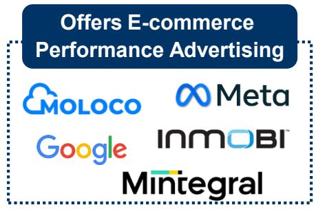

text_image

Offers E-commerce
Performance Advertising
MOLOCO
Meta
Google
InnoBI™
Mintegral

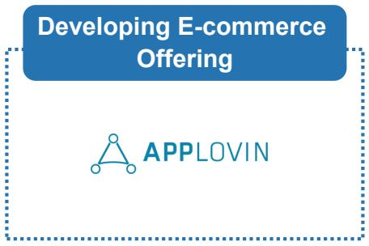

text_image

Developing E-commerce
Offering
APPLOVIN

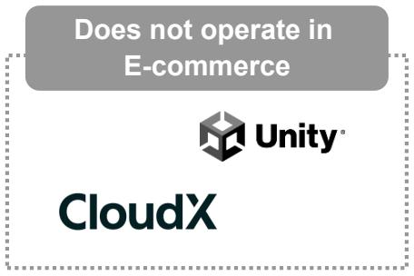

text_image

Does not operate in
E-commerce
Unity®
CloudX

## In Periods of Macro/Consumer Weakness, We Have Seen Game Companies Lean Into Monetizing via Ads, Which We See As an Important Cushion for the Ads Ecosystem...

bar-line hybrid

| Quarter | In-App Purchase Revenue | In-App Ad Revenue | In-App Ads Revenue % of Total Net Bookings |
|---------|--------------------------|-------------------|-------------------------------------------|
| 1Q:FY20 | 376                      | -                 | 17%                                       |
| 2Q:FY20 | 393                      | -                 | 16%                                       |
| 3Q:FY20 | 433                      | -                 | 18%                                       |
| 4Q:FY20 | 425                      | -                 | 14%                                       |
| 1Q:FY21 | 518                      | -                 | 12%                                       |
| 2Q:FY21 | 628                      | -                 | 11%                                       |
| 3Q:FY21 | 699                      | -                 | 17%                                       |
| 4Q:FY21 | 720                      | -                 | 17%                                       |
| 1Q:FY22 | 712                      | -                 | 19%                                       |
| 2Q:FY22 | 668                      | -                 | 20%                                       |
| 3Q:FY22 | 727                      | -                 | 22%                                       |
| 4Q:FY22 | 695                      | -                 | 22%                                       |
| 1Q:FY23 | 739                      | -                 | 23%                                       |
| 2Q:FY23 | 713                      | -                 | 25%                                       |
| 3Q:FY23 | 713                      | -                 | 25%                                       |
| 4Q:FY23 | 706                      | -                 | 25%                                       |
| 1Q:FY24 | 690                      | -                 | 27%                                       |
| 2Q:FY24 | 662                      | -                 | 26%                                       |
| 3Q:FY24 | 698                      | -                 | 23%                                       |
| 4Q:FY24 | 708                      | -                 | 20%                                       |
| 1Q:FY25 | 709                      | -                 | 17%                                       |
| 2Q:FY25 | 723                      | -                 | 16%                                       |
| 3Q:FY25 | 710                      | -                 | 16%                                       |
| 4Q:FY25 | 730                      | -                 | 15%                                       |
| 1Q:FY26 | 793                      | -                 | 15%                                       |
| 2Q:FY26 | 818                      | -                 | 16%                                       |
| 3Q:FY26 | 861                      | -                 | 15%                                       |

## ... While Spend on Interactive Entertainment Has Also Generally Performed Well Through Periods of Consumer Weakness

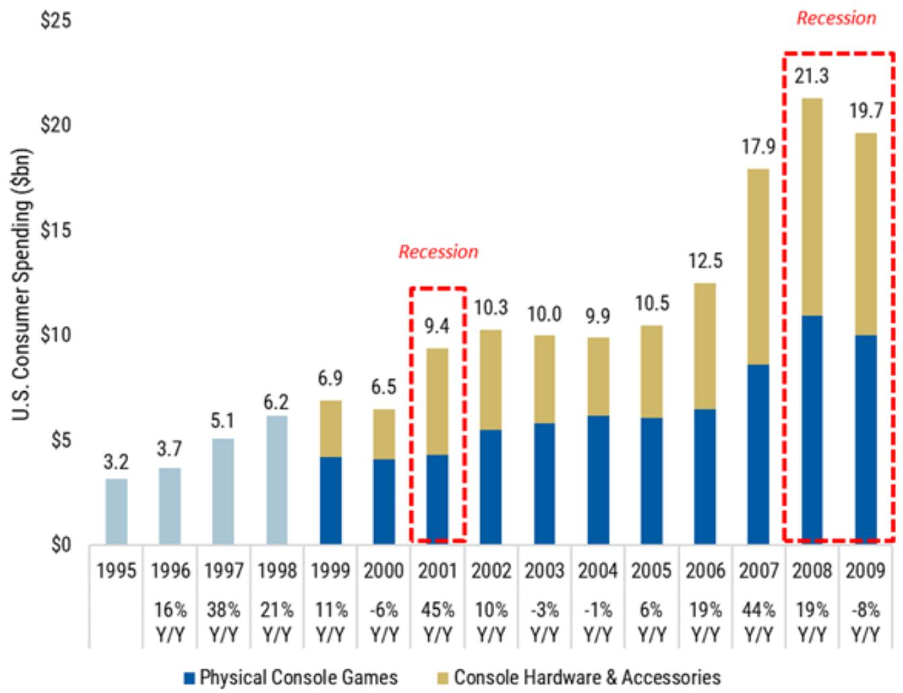

stacked bar chart

| Year | Physical Console Games ($bn) | Console Hardware & Accessories ($bn) | Total ($bn) |
| :--- | :--- | :--- | :--- |
| 1995 | 3.2 | | 3.2 |
| 1996 | 3.7 | | 3.7 |
| 1997 | 5.1 | | 5.1 |
| 1998 | 6.2 | | 6.2 |
| 1999 | 4.0 | 2.8 | 6.9 |
| 2000 | 4.0 | 2.4 | 6.5 |
| 2001 | 4.2 | 5.4 | 9.4 |
| 2002 | 5.4 | 5.0 | 10.3 |
| 2003 | 5.7 | 4.4 | 10.0 |
| 2004 | 6.0 | 3.8 | 9.9 |
| 2005 | 6.0 | 4.8 | 10.5 |
| 2006 | 6.3 | 6.8 | 12.5 |
| 2007 | 8.4 | 11.8 | 17.9 |
| 2008 | 10.9 | 11.8 | 21.3 |
| 2009 | 9.9 | 10.8 | 19.7 |
Recession (1995–2009) is marked as “Recession” (red dashed box). The Y/Y growth rates are annotated below each bar.

## Intro to Mobile Ad Tech

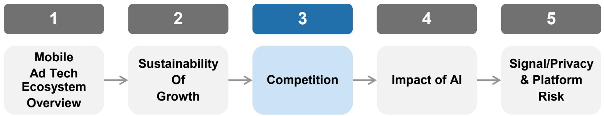

flowchart

```mermaid
graph LR
  A["1\nMobile Ad Tech Ecosystem Overview"] --> B["2\nSustainability Of Growth"]
  B --> C["3\nCompetition"]
  C --> D["4\nImpact of AI"]
  D --> E["5\nSignal/Privacy & Platform Risk"]
```

## Introduction: Competition

## What Is The Debate?

- Large players like GOOGL and META compete in similar ecosystems as smaller, more specialized incumbents like APP, U, Moloco, and others. Historically APP and U primarily operate in in-game advertising, which is separate from the verticals that GOOGL and META operate in.  
- Debate has centered on the impact to APP/U if larger companies like META make a larger push in the in-game performance advertising space.  
- We believe incumbent platforms already have amassed data and platform models that can effectively place and monetize ads, making their positions more defensible to new competition in their specific mobile advertising verticals.

## What's Changing?

- Industry watchers have suggested META is testing its advertising offerings for performance advertising, which would directly compete with in-game mobile advertisers, particularly APP and U.  
- New entrants, including mediation platform CloudX, have sparked investor concern around the competitive positioning of incumbent performance advertising platforms.

## Why Does It Matter?

- For incumbents, new entrants that can outperform through scale or performance could potentially disrupt their market share and competitive positioning in mobile performance advertising.  
- For new entrants, gaining share in this market unlocks incremental revenue and EBITDA if they can effectively outperform and replace incumbent platforms.

## Who Is Primarily Impacted?

- Potential Beneficiaries: Platforms and ad tech providers that can deliver the highest return and most efficient ad placement will benefit from increased ad dollars.  
- Potentially At Risk: Platforms that are unable to stay competitive with industry leaders in terms of ROAS or other ROI metrics for advertising risk losing customers and ad spend on their platforms.

## While CloudX Could Theoretically Compete with APP's Mediation Platform, META and APP Operate In Distinct Parts Of The Ecosystem, Limiting Direct Competition

## IDFA:

• A Unique, Device-Level Identifier on iOS

\- Allows Advertisers to Track User Activity Across Apps For Targeting & Attribution

\- Opt-in: User Explicitly Accepts Tracking Via ATT, Allowing Advertisers To Access IDFA For Targeting

\- Opt-out: User Denies Tracking, Advertisers Must Rely On Probabilistic Targeting

## Meta

## DSP

- Bids primarily on IDFA opt-in traffic  
- Recent reports suggest that META was testing new products for in-game advertising  
- But evidence appears limited that META is focused heavily on in-game ads, and new products appear focused on IDFA opt-in traffic

## APPLOVIN

## DSP

## Mediation

- Bids primarily on IDFA opt-out traffic  
- Scaled DSP and mediation platform in in-game advertising  
- Considerable competitive moats from MAX mediation platform.

## CloudX

## SSP

## Mediation

- New Entrant, reported to have launched a new tool with demand from META  
- Operates as an independent platform, can solicit demand from any source  
- Faces significant scale and demand deficits when compared to APP's MAX

## Industry Growth Can Support Multiple Platforms as Ad Spend Can Increase Simultaneously Across the Ecosystem

Annual Revenue (\$mn)  
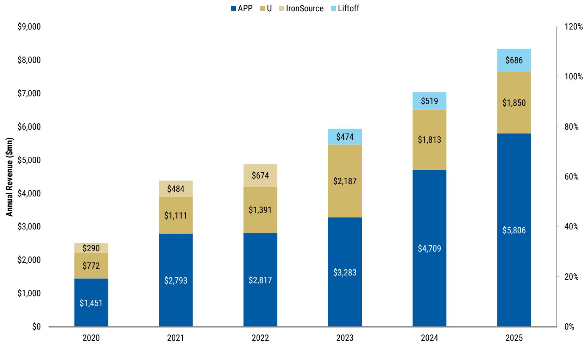

stacked bar chart

| Year | APP    | U      | IronSource | Liftoff |
|------|--------|--------|------------|---------|
| 2020 | $1,451 | $772   | $290       | -       |
| 2021 | $2,793 | $1,111 | $484       | -       |
| 2022 | $2,817 | $1,391 | $674       | -       |
| 2023 | $3,283 | $2,187 | -          | $474    |
| 2024 | $4,709 | $1,813 | -          | $519    |
| 2025 | $5,806 | $1,850 | -          | $686    |

## Intro to Mobile Ad Tech

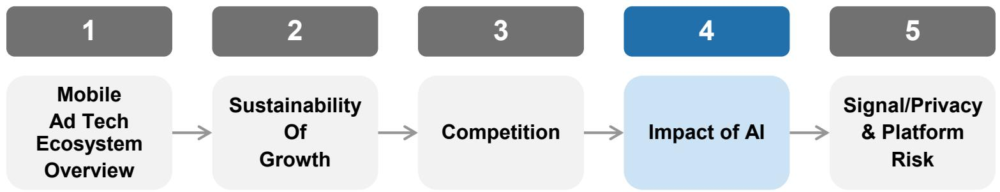

flowchart

```mermaid
graph LR
  A["Mobile Ad Tech Ecosystem Overview"] --> B["Sustainability Of Growth"]
  B --> C["Competition"]
  C --> D["Impact of AI"]
  D --> E["Signal/Privacy & Platform Risk"]
```

## Introduction: Impact of AI

## What Is The Debate?

- Recent developments in AI could automate the game development process. While this continues the broader trend of lower barriers to entry for game development, it also creates potential risk that new tools could eventually replace existing platforms used to build games and acquire users.  
- This has sparked debate around the impact that new technology will have on discovery and ad tech platforms, with expectations ranging from significant disruption to demand tailwinds.

## What's Changing?

- As AI tools are increasingly integrated into game development processes, there is debate about how consumers will interact with mobile games in the future, and if AI models will disrupt current existing user acquisition and monetization platforms.  
- In our view, AI tools will lead to the proliferation of content and lower barriers to entry for game development, meaning that there will be significantly more games and content for consumers to interact with. This would increase the value and demand efficient user acquisition and monetization platforms, not disrupt them.

## Why Does It Matter?

- In a scenario where AI lowers the barriers to entry of game development, incumbent ad tech/discovery platforms will likely have higher demand and value for customers trying to acquire and monetize new users.  
- In a scenario where video games are distributed on entirely new platforms, incumbent discovery players may struggle to integrate their models into these new game platforms, which poses a potential deplatforming risk.

## Who Is Primarily Impacted?

- Potential Beneficiaries: In our view, ad tech is positioned to benefit incrementally from the lower barriers to entry for game development with AI. A proliferation of content would increase the value of efficient advertising platforms.  
- Potentially At Risk: Ad providers that are not integrated into new game distribution platforms which are dominated by internal advertising offerings.

## Disruption to the Game Industry Is Possible, But Is Likely to Boost Demand For Discovery and Monetization Tools

Content Proliferation
Increases the Apps &
Games Available
to Consumers

User Attention Is Fragmented

Demand Increases
For User Acquisition
and Monetization Tools

Growth in Ad Spend on Discovery Platforms

## Even As New Platforms Redefine UGC Creation and Interaction, 3 $^{rd}$ Party Advertising Will Likely Remain Important, Insulating Ad Platforms from Disruption

## 77%

Of Creators Use Social Media As A Top Audience Channel

## 60%

Of Creators Rely On Social Platforms to Showcase Work

Content Native to UGC Platforms Is Commonly Promoted or Shared Using Other Sites. Roblox Experience ‘Dress to Impress’ Has been promoted on platforms YouTube and Instagram, showcasing how UGC content is promoted outside of the site it was created on.

UGC-Native Platform  
ROBLOX  
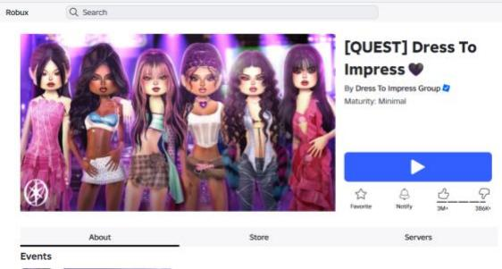

text_image

[QUEST] Dress To Impress ♥
By Dress To Impress Group ▼
Maturity: Minimal
About Store Servers
Events

$3^{rd}$ – Party Platform Promotion  

  
Dress To Impress

@Play\_DressToImpress · 1.09M subscribers · 80 videos

Available on Roblox. Conquer the runway and show off your unique style.

playdresstoimpress.com and 3 more links

Community

Home

Video

: Sho

ts Pi

ylists

P

sts

Q

Popular videos  

KATSEYE x Dress To Impress

| 2026 Cinematic Gameplay ...

1.6M views - 12 days ago

Style Showdown | First Look

1.2M views - 1 year ago

Dress To Impress Rewind

2024

im

res

Rev

wind

-

1.2M vie

电·

yes

ago

## Intro to Mobile Ad Tech

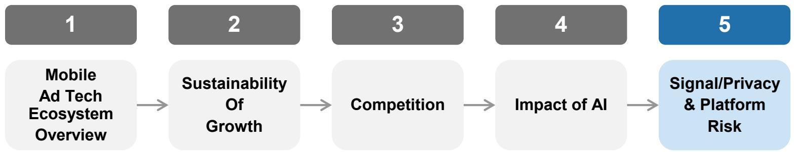

flowchart

```mermaid
graph LR
  A["1\nMobile Ad Tech Ecosystem Overview"] --> B["2\nSustainability Of Growth"]
  B --> C["3\nCompetition"]
  C --> D["4\nImpact of AI"]
  D --> E["5\nSignal/Privacy & Platform Risk"]
```

## Introduction: Signal, Platform, & Privacy Risk

## What Is The Debate?

- $3^{\text{rd}}$ party ad tech providers rely on data signals from platforms like GOOGL and AAPL, who control the operating systems and grant access to user/app data.  
- Ongoing privacy changes have reduced the quality of user data available to ad platforms, which can potentially weaken the targeting and performance for ad providers.  
- At the same time, total deplatforming from GOOGL or AAPL could completely remove access to this data, affecting an advertising platform's ability to function.  
- There is also ongoing legal and regulatory scrutiny around data privacy and user tracking practices for advertising platforms.

## What's Changing?

- Privacy changes from the Apple App Store and Google Play Store have reduced the granularity of user data available to ad platforms, which could potentially weaken their performance.  
- Ongoing regulatory scrutiny and rumored investigations into data collection practices have sparked debate on the potential for further restriction or rules.

## Why Does It Matter?

- Weaker signal or data provided by platforms could lower the performance of existing advertising technology, while complete deplatforming could revoke access to the data vital for ad tech businesses to operate.  
- Increased regulation around data collection practices could negatively impact the performance of existing platforms, resulting in lower advertising spend and revenue for the platforms.

## Who Is Primarily Impacted?

• Potential Beneficiaries: Limited, but includes platform-native ad solutions from AAPL or GOOGL  
- Potentially At Risk: Incumbent mobile ad tech players that use consumer data to target and measure ads, but also includes any ad business that does not control a mobile OS (i.e. other than AAPL/GOOGL)

## Mobile Ad Platforms Rely on Access to Users, SDK Integration, and Measurement Signals That are Controlled by Distribution Platforms Including Apple and Google

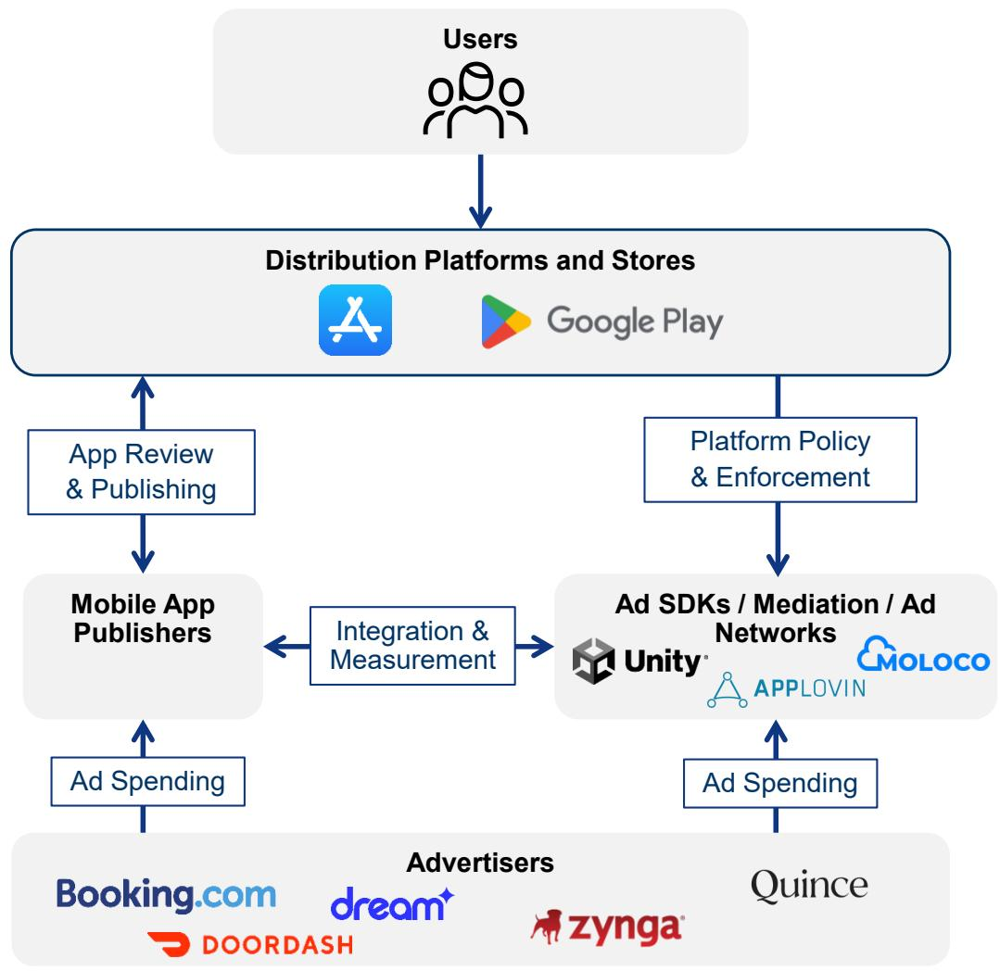

flowchart

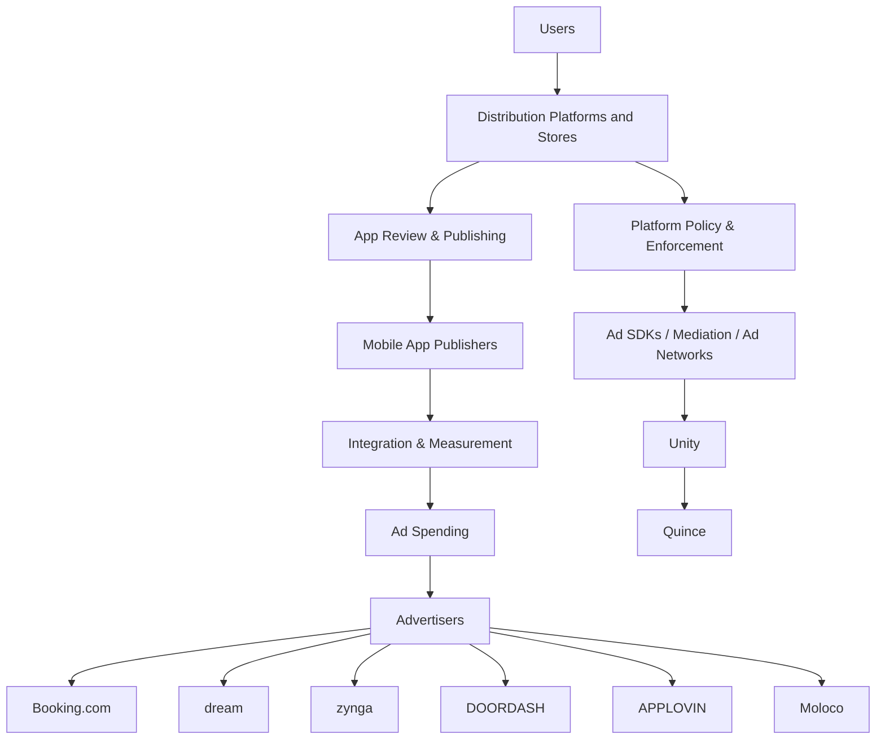
```mermaid
graph TD
  A["Users"] --> B["Distribution Platforms and Stores"]
  B --> C["App Review & Publishing"]
  B --> D["Platform Policy & Enforcement"]
  C --> E["Mobile App Publishers"]
  D --> F["Ad SDKs / Mediation / Ad Networks"]
  E --> G["Integration & Measurement"]
  F --> H["Unity"]
  G --> I["Ad Spending"]
  H --> J["Quince"]
  I --> K["Advertisers"]
  K --> L["Booking.com"]
  K --> M["dream"]
  K --> N["zynga"]
  K --> O["DOORDASH"]
  K --> P["APPLOVIN"]
  K --> Q["Moloco"]
```

Platforms control the mobile distribution layer. Ad networks depend on approved SDK access, measurement signals, and publisher app inventory to monetize advertiser demand.

Since the platforms have control over setting and enforcing rules or privacy policies, they could potentially revoke access or restrict data that ad platforms currently rely on to operate.

Policy changes or deplatforming can impair targeting, attribution, and monetization performance of the platforms.

## Previous Data Access Removal on Platforms has Materially Impacted Advertiser Spending and Ad Platform Revenue

## What is IDFA?

IDFA (Identifiers For Advertisers): A unique, device-level identifier on iOS that allows advertisers to track user activity across apps.

## How Did ATT Removal Impact Ad Platform Performance?

While ATT removed user-level tracking, Advertisers rebuilt targeting and attribution with machine learning.

## Pre-ATT

• IDFA Available By Default For Most Users  
- Users Had To Intentionally Opt-out of Tracking  
- Advertisers Had Deterministic Tracking Across Apps within iOS

Strong Tracking, Attribution And Measurement

## April 2021

• Apple Launches App Tracking Transparency (ATT)  
- Apps Must Now Ask Users To Opt-in To Tracking  
- Most Users Opted-Out of Tracking, Removing Attribution/Measurement for Ad Platforms

Majority Of Users Opt-out → Sharp Signal Loss

## Post-ATT

• AAPL Limits Access to IDFA Through ATT  
• GOOGL Prohibits Fingerprinting Devices for Tracking  
- Reduced Targeting Precision Caused a Shift to Probabilistic Attribution & Contextual Targeting

Move to Reliance on 1 $^{st}$ Party Data & ML Optimization

## Disclosure Section

The information and opinions in MS were prepared by MS & Co. LLC, and/or MS C.T.V.M. S.A., and/or MS Mexico, Casa de Bolsa, S.A. de C.V., and/or MS Canada Limited. As used in this disclosure section, "MS" includes MS & Co. LLC, MS C.T.V.M. S.A., MS Mexico, Casa de Bolsa, S.A. de C.V., MS Canada Limited and their affiliates as necessary.

For important disclosures, stock price charts and equity rating histories regarding companies that are the subject of this report, please see the MS Disclosure Website at www.morganstanley.com/eqr/disclosures/webapp/generalresearch, or contact your investment representative or MS at 1585 Broadway, (Attention: Research Management), New York, NY, 10036 USA.

For valuation methodology and risks associated with any recommendation, rating or price target referenced in this research report, please contact the Client Support Team as follows: US/Canada +1 800 303-2495; Hong Kong +852 2848-5999; Latin America +1 718 754-5444 (U.S.); London +44 (0)20-7425-8169; Singapore +65 6834-6860; Sydney +61 (0)2-9770-1505; Tokyo +81 (0)3-6836-9000. Alternatively you may contact your investment representative or MS at 1585 Broadway, (Attention: Research Management), New York, NY 10036 USA.

## Analyst Certification

The following analysts hereby certify that their views about the companies and their securities discussed in this report are accurately expressed and that they have not received and will not receive direct or indirect compensation in exchange for expressing specific recommendations or views in this report: Matthew Cost; Brian Nowak, CFA.

## Global Research Conflict Management Policy

MS has been published in accordance with our conflict management policy, which is available at www.morganstanley.com/institutional/research/conflictpolicies. A Portuguese version of the policy can be found at www.morganstanley.com.br

## Important Regulatory Disclosures on Subject Companies

The equity research analysts or strategists principally responsible for the preparation of MS have received compensation based upon various factors, including quality of research, investor client feedback, stock picking, competitive factors, firm revenues and overall investment banking revenues. Equity Research analysts' or strategists' compensation is not linked to investment banking or capital markets transactions performed by MS or the profitability or revenues of particular trading desks.

MS and its affiliates do business that relates to companies/instruments covered in MS, including market making, providing liquidity, fund management, commercial banking, extension of credit, investment services and investment banking. MS sells to and buys from customers the securities/instruments of companies covered in MS on a principal basis. MS may have a position in the debt of the Company or instruments discussed in this report. MS trades or may trade as principal in the debt securities (or in related derivatives) that are the subject of the debt research report.

Certain disclosures listed above are also for compliance with applicable regulations in non-US jurisdictions.

## STOCK RATINGS

MS uses a relative rating system using terms such as Overweight, Equal-weight, Not-Rated or Underweight (see definitions below). MS does not assign ratings of Buy, Hold or Sell to the stocks we cover. Overweight, Equal-weight, Not-Rated and Underweight are not the equivalent of buy, hold and sell. Investors should carefully read the definitions of all ratings used in MS. In addition, since MS contains more complete information concerning the analyst's views, investors should carefully read MS, in its entirety, and not infer the contents from the rating alone. In any case, ratings (or research) should not be used or relied upon as investment advice. An investor's decision to buy or sell a stock should depend on individual circumstances (such as the investor's existing holdings) and other considerations.

## Global Stock Ratings Distribution

(as of May 31, 2026)

The Stock Ratings described below apply to MS's Fundamental Equity Research and do not apply to Debt Research produced by the Firm.

For disclosure purposes only (in accordance with FINRA requirements), we include the category headings of Buy, Hold, and Sell alongside our ratings of Overweight, Equal-weight, Not-Rated and Underweight. MS does not assign ratings of Buy, Hold or Sell to the stocks we cover. Overweight, Equal-weight, Not-Rated and Underweight are not the equivalent of buy, hold, and sell but represent recommended relative weightings (see definitions below). To satisfy regulatory requirements, we correspond Overweight, our most positive stock rating, with a buy recommendation; we correspond Equal-weight and Not-Rated to hold and Underweight to sell recommendations, respectively.

Disclosure Section (cont.)

<table><tr><td rowspan="2">Stock Rating Category</td><td colspan="2">Coverage Universe</td><td colspan="3">Investment Banking Clients (IBC)</td><td colspan="2">Other Material Investment Services Clients (MISC)</td></tr><tr><td>Count</td><td>% of Total</td><td>Count</td><td>% of Total IBC</td><td>% of Rating Category</td><td>Count</td><td>% of Total Other MISC</td></tr><tr><td>Overweight/Buy</td><td>1542</td><td>42%</td><td>465</td><td>51%</td><td>30%</td><td>707</td><td>43%</td></tr><tr><td>Equal-weight/Hold</td><td>1571</td><td>43%</td><td>369</td><td>40%</td><td>23%</td><td>723</td><td>44%</td></tr><tr><td>Not-Rated/Hold</td><td>3</td><td>0%</td><td>0</td><td>0%</td><td>0%</td><td>1</td><td>0%</td></tr><tr><td>Underweight/Sell</td><td>551</td><td>15%</td><td>86</td><td>9%</td><td>16%</td><td>201</td><td>12%</td></tr><tr><td>Total</td><td>3,667</td><td></td><td>920</td><td></td><td></td><td>1632</td><td></td></tr></table>

Data include common stock and ADRs currently assigned ratings. Investment Banking Clients are companies from whom MS received investment banking compensation in the last 12 months. Due to rounding off of decimals, the percentages provided in the "% of total" column may not add up to exactly 100 percent.

## Analyst Stock Ratings

Overweight (O). The stock's total return is expected to exceed the average total return of the analyst's industry (or industry team's) coverage universe, on a risk-adjusted basis, over the next 12-18 months.

Equal-weight (E). The stock's total return is expected to be in line with the average total return of the analyst's industry (or industry team's) coverage universe, on a risk-adjusted basis, over the next 12-18 months.

Not-Rated (NR). Currently the analyst does not have adequate conviction about the stock's total return relative to the average total return of the analyst's industry (or industry team's) coverage universe, on a risk-adjusted basis, over the next 12-18 months.

Underweight (U). The stock's total return is expected to be below the average total return of the analyst's industry (or industry team's) coverage universe, on a risk-adjusted basis, over the next 12-18 months.

Unless otherwise specified, the time frame for price targets included in MS is 12 to 18 months.

## Analyst Industry Views

Attractive (A): The analyst expects the performance of his or her industry coverage universe over the next 12-18 months to be attractive vs. the relevant broad market benchmark, as indicated below.

In-Line (I): The analyst expects the performance of his or her industry coverage universe over the next 12-18 months to be in line with the relevant broad market benchmark, as indicated below.

Cautious (C): The analyst views the performance of his or her industry coverage universe over the next 12-18 months with caution vs. the relevant broad market benchmark, as indicated below.

Benchmarks for each region are as follows: North America - S&P 500; Latin America - relevant MSCI country index or MSCI Latin America Index; Europe - MSCI Europe; Japan - TOPIX; Asia - relevant MSCI country index or MSCI sub-regional index or MSCI AC Asia Pacific ex Japan Index.

## Important Disclosures for MS Smith Barney LLC Customers

Important disclosures regarding any material conflict of interest that can reasonably be expected to have influenced MS Smith Barney LLC's choice of a third-party research provider or the subject company of a third-party research report, are available on the MS Wealth Management disclosure website at

www.morganstanley.com/online/researchdisclosures. For MS specific disclosures, you may refer to https://www.morganstanley.com/eqr/disclosures/webapp/generalresearch.

Each MS report is reviewed and approved on behalf of MS Smith Barney LLC. This review and approval is conducted by the same person who reviews the research report on behalf of MS. This could create a conflict of interest.

## Disclosure Section (cont.)

## Other Important Disclosures

MS policy is to update research reports as and when the Research Analyst and Research Management deem appropriate, based on developments with the issuer, the sector, or the market that may have a material impact on the research views or opinions stated therein. In addition, certain Research publications are intended to be updated on a regular periodic basis (weekly/monthly/quarterly/annual) and will ordinarily be updated with that frequency, unless the Research Analyst and Research Management determine that a different publication schedule is appropriate based on current conditions.

MS is not acting as a municipal advisor and the opinions or views contained herein are not intended to be, and do not constitute, advice within the meaning of Section 975 of the Dodd-Frank Wall Street Reform and Consumer Protection Act.

MS produces an equity research product called a "Tactical Idea." Views contained in a "Tactical Idea" on a particular stock may be contrary to the recommendations or views expressed in research on the same stock. This may be the result of differing time horizons, methodologies, market events, or other factors. For all research available on a particular stock, please contact your sales representative or go to Matrix at http://www.morganstanley.com/matrix.

MS is provided to our clients through our proprietary research portal on Matrix and also distributed electronically by MS to clients. Certain, but not all, MS products are also made available to clients through third-party vendors or redistributed to clients through alternate electronic means as a convenience. For access to all available MS, please contact your sales representative or go to Matrix at http://www.morganstanley.com/matrix.

Any access and/or use of MS is subject to MS's Terms of Use (http://www.morganstanley.com/terms.html). By accessing and/or using MS, you are indicating that you have read and agree to be bound by our Terms of Use (http://www.morganstanley.com/terms.html). In addition you consent to MS processing your personal data and using cookies in accordance with our Privacy Policy and our Global Cookies Policy (http://www.morganstanley.com/privacy\_pledge.html), including for the purposes of setting your preferences and to collect readership data so that we can deliver better and more personalized service and products to you. To find out more information about how MS processes personal data, how we use cookies and how to reject cookies see our Privacy Policy and our Global Cookies Policy

(http://www.morganstanley.com/privacy\_pledge.html). Please use the provided link to review the Terms and Conditions and Most Important Terms and Conditions for MS India Company Private Limited (https://www.morganstanley.com/assets/pdfs/about-us-global-offices/india/Terms\_and\_conditions.pdf) and the following link to review the audit report (https://ny.matrix.ms.com/eqr/research/webapp/researchdocs/MSICPL\_Morgan\_Stanley\_Research\_Audit\_Report.pdf).

If you do not agree to our Terms of Use and/or if you do not wish to provide your consent to MS processing your personal data or using cookies please do not access our research.

MS does not provide individually tailored investment advice. MS has been prepared without regard to the circumstances and objectives of those who receive it. MS recommends that investors independently evaluate particular investments and strategies, and encourages investors to seek the advice of a financial adviser. The appropriateness of an investment or strategy will depend on an investor's circumstances and objectives. The securities, instruments, or strategies discussed in MS may not be suitable for all investors, and certain investors may not be eligible to purchase or participate in some or all of them. MS is not an offer to buy or sell or the solicitation of an offer to buy or sell any security/instrument or to participate in any particular trading strategy. The value of and income from your investments may vary because of changes in interest rates, foreign exchange rates, default rates, prepayment rates, securities/instruments prices, market indexes, operational or financial conditions of companies or other factors. There may be time limitations on the exercise of options or other rights in securities/instruments transactions. Past performance is not necessarily a guide to future performance. Estimates of future performance are based on assumptions that may not be realized. If provided, and unless otherwise stated, the closing price on the cover page is that of the primary exchange for the subject company's securities/instruments.

The fixed income research analysts, strategists or economists principally responsible for the preparation of MS have received compensation based upon various factors, including quality, accuracy and value of research, firm profitability or revenues (which include fixed income trading and capital markets profitability or revenues), client feedback and competitive factors. Fixed Income Research analysts', strategists' or economists' compensation is not linked to investment banking or capital markets transactions performed by MS or the profitability or revenues of particular trading desks.

The "Important Regulatory Disclosures on Subject Companies" section in MS lists all companies mentioned where MS owns 1% or more of a class of common equity securities of the companies. For all other companies mentioned in MS, MS may have an investment of less than 1% in securities/instruments or derivatives of securities/instruments of companies and may trade them in ways different from those discussed in MS. Employees of MS not involved in the preparation of MS may have investments in securities/instruments or derivatives of securities/instruments of companies mentioned and may trade them in ways different from those discussed in MS. Derivatives may be issued by MS or associated persons.

With the exception of information regarding MS, MS is based on public information. MS makes every effort to use reliable, comprehensive information, but we make no representation that it is accurate or complete. We have no obligation to tell you when opinions or information in MS change apart from when we intend to discontinue equity research coverage of a subject company. Facts and views presented in MS have not been reviewed by, and may not reflect information known to, professionals in other MS business areas, including investment banking personnel.

## Disclosure Section (cont.)

MS personnel may participate in company events such as site visits and are generally prohibited from accepting payment by the company of associated expenses unless pre-approved by authorized members of Research management.

MS may make investment decisions that are inconsistent with the recommendations or views in this report.

To our readers based in Taiwan or trading in Taiwan securities/instruments: Information on securities/instruments that trade in Taiwan is distributed by MS Taiwan Limited ("MSTL"). Such information is for your reference only. The reader should independently evaluate the investment risks and is solely responsible for their investment decisions. MS may not be distributed to the public media or quoted or used by the public media without the express written consent of MS. Any non-customer reader within the scope of Article 7-1 of the Taiwan Stock Exchange Recommendation Regulations accessing and/or receiving MS is not permitted to provide MS to any third party (including but not limited to related parties, affiliated companies and any other third parties) or engage in any activities regarding MS which may create or give the appearance of creating a conflict of interest. Information on securities/instruments that do not trade in Taiwan is for informational purposes only and is not to be construed as a recommendation or a solicitation to trade in such securities/instruments. MSTL may not execute transactions for clients in these securities/instruments.

MS is not incorporated under PRC law and the research in relation to this report is conducted outside the PRC. MS does not constitute an offer to sell or the solicitation of an offer to buy any securities in the PRC. PRC investors shall have the relevant qualifications to invest in such securities and shall be responsible for obtaining all relevant approvals, licenses, verifications and/or registrations from the relevant governmental authorities themselves. Neither this report nor any part of it is intended as, or shall constitute, provision of any consultancy or advisory service of securities investment as defined under PRC law. Such information is provided for your reference only.

MS is disseminated in Brazil by MS C.T.V.M. S.A. located at Av. Brigadeiro Faria Lima, 3600, 6th floor, São Paulo - SP, Brazil; and is regulated by the Comissão de Valores Mobiliários; in Mexico by MS México, Casa de Bolsa, S.A. de C.V which is regulated by Comision Nacional Bancaria y de Valores. Paseo de los Tamarindos 90, Torre 1, Col. Bosques de las Lomas Floor 29, 05120 Mexico City; in Japan by MS MUFG Securities Co., Ltd. and, for Commodities related research reports only, MS Capital Group Japan Co., Ltd; in Hong Kong by MS Asia Limited (which accepts responsibility for its contents) and by MS Bank Asia Limited; in Singapore by MS Asia (Singapore) Pte. (Registration number 199206298Z) and/or MS Asia (Singapore) Securities Pte Ltd (Registration number 200008434H), regulated by the Monetary Authority of Singapore (which accepts legal responsibility for its contents and should be contacted with respect to any matters arising from, or in connection with, MS) and by MS Bank Asia Limited, Singapore Branch (Registration number T14FC0118J); in Australia to "wholesale clients" within the meaning of the Australian Corporations Act by MS Australia Limited A.B.N. 67 003 734 576, holder of Australian financial services license No. 233742, which accepts responsibility for its contents; in Australia to "wholesale clients" and "retail clients" within the meaning of the Australian Corporations Act by MS Wealth Management Australia Pty Ltd (A.B.N. 19 009 145 555, holder of Australian financial services license No. 240813, which accepts responsibility for its contents; in Korea by MS & Co International plc, Seoul Branch; in India by MS India Company Private Limited having Corporate Identification No (CIN) U22990MH1998PTC115305, regulated by the Securities and Exchange Board of India ("SEBI") and holder of licenses as a Research Analyst (SEBI Registration No. INH000001105); Stock Broker (SEBI Stock Broker Registration No. INZ000244438), Merchant Banker (SEBI Registration No. INM000011203), and depository participant with National Securities Depository Limited (SEBI Registration No. IN-DP-NSDL-567-2021) having registered office at Altimus, Level 39 & 40, Pandurang Budhkar Marg, Worli, Mumbai 400018, India; Telephone no. +91-22-61181000; Compliance Officer Details: Mr. Tejarshi Hardas, Tel. No.: +91-22-61181000 or Email: tejarshi.hardas@morganstanley.com; Grievance officer details: Mr. Tejarshi Hardas, Tel. No.: +91-22-61181000 or Email: msic-compliance@morganstanley.com. MS India Company Private Limited (MSICPL) may use AI tools in providing research services. All recommendations contained herein are made by the duly qualified research analysts; in Canada by MS Canada Limited; in Germany and the European Economic Area where required by MS Europe S.E., authorised and regulated by Bundesanstalt fuer Finanzdienstleistungsaufsicht (BaFin) under the reference number 149169; in the US by MS & Co. LLC, which accepts responsibility for its contents. MS & Co. International plc, authorized by the Prudential Regulation Authority and regulated by the Financial Conduct Authority and the Prudential Regulation Authority, disseminates in the UK research that it has prepared, and research which has been prepared by any of its affiliates, only to persons who (i) are investment professionals falling within Article 19(5) of the Financial Services and Markets Act 2000 (Financial Promotion) Order 2005 (as amended, the "Order"); (ii) are persons who are high net worth entities falling within Article 49(2)(a) to (d) of the Order; or (iii) are persons to whom an invitation or inducement to engage in investment activity (within the meaning of section 21 of the Financial Services and Markets Act 2000, as amended) may otherwise lawfully be communicated or caused to be communicated. RMB MS Proprietary Limited is a member of the JSE Limited and A2X (Pty) Ltd. RMB MS Proprietary Limited is a joint venture owned equally by MS International Holdings Inc. and RMB Investment Advisory (Proprietary) Limited, which is wholly owned by FirstRand Limited. The information in MS is being disseminated by MS Saudi Arabia, regulated by the Capital Market Authority in the Kingdom of Saudi Arabia, and is directed at Sophisticated investors only.

The information in MS is being communicated by MS & Co. International plc (DIFC Branch), regulated by the Dubai Financial Services Authority (the DFSA) or by MS & Co. International plc (ADGM Branch), regulated by the Financial Services Regulatory Authority Abu Dhabi (the FSRA), and is directed at Professional Clients only, as defined by the DFSA or the FSRA, respectively. The financial products or financial services to which this research relates will only be made available to a customer who we are satisfied meets the regulatory criteria of a Professional Client. A distribution of the different MS Research ratings or recommendations, in percentage terms for Investments in each sector covered, is available upon request from your sales representative.

## Disclosure Section (cont.)

The information in MS is being communicated by MS & Co. International plc (QFC Branch), regulated by the Qatar Financial Centre Regulatory Authority (the QFCRA), and is directed at business customers and market counterparties only and is not intended for Retail Customers as defined by the QFCRA.

As required by the Capital Markets Board of Turkey, investment information, comments and recommendations stated here, are not within the scope of investment advisory activity. Investment advisory service is provided exclusively to persons based on their risk and income preferences by the authorized firms. Comments and recommendations stated here are general in nature. These opinions may not fit to your financial status, risk and return preferences. For this reason, to make an investment decision by relying solely to this information stated here may not bring about outcomes that fit your expectations.

The trademarks and service marks contained in MS are the property of their respective owners. Third-party data providers make no warranties or representations relating to the accuracy, completeness, or timeliness of the data they provide and shall not have liability for any damages relating to such data. The Global Industry Classification Standard (GICS) was developed by and is the exclusive property of MSCI and S&P.

MS, or any portion thereof may not be reprinted, sold or redistributed without the written consent of MS.

Indicators and trackers referenced in MS may not be used as, or treated as, a benchmark under Regulation EU 2016/1011, or any other similar framework.

The issuers and/or fixed income products recommended or discussed in certain fixed income research reports may not be continuously followed. Accordingly, investors should regard those fixed income research reports as providing stand-alone analysis and should not expect continuing analysis or additional reports relating to such issuers and/or individual fixed income products.

MS may hold, from time to time, material financial and commercial interests regarding the company subject to the Research report.

Registration granted by SEBI and certification from the National Institute of Securities Markets (NISM) in no way guarantee performance of the intermediary or provide any assurance of returns to investors. Investment in securities market are subject to market risks. Read all the related documents carefully before investing.

## Disclosure Section (cont.)

INDUSTRY COVERAGE: Internet

<table><tr><td>COMPANY (TICKER)</td><td>RATING (AS OF)</td><td>PRICE* (06/04/2026)</td></tr><tr><td colspan="3">Brian Nowak, CFA</td></tr><tr><td>Airbnb Inc (ABNB.O)</td><td>U (12/06/2022)</td><td>$133.72</td></tr><tr><td>Alphabet Inc. (GOOGL.O)</td><td>O (08/11/2015)</td><td>$372.19</td></tr><tr><td>Amazon.com Inc (AMZN.O)</td><td>O (04/24/2015)</td><td>$253.79</td></tr><tr><td>Booking Holdings Inc (BKNG.O)</td><td>O (02/23/2026)</td><td>$167.49</td></tr><tr><td>DoorDash Inc (DASH.O)</td><td>O (02/21/2024)</td><td>$160.07</td></tr><tr><td>Expedia Inc. (EXPE.O)</td><td>E (01/09/2019)</td><td>$227.18</td></tr><tr><td>Instacart (CART.O)</td><td>E (01/29/2024)</td><td>$41.48</td></tr><tr><td>Lyft Inc (LYFT.O)</td><td>E (10/24/2019)</td><td>$14.12</td></tr><tr><td>Meta Platforms Inc (META.O)</td><td>O (03/20/2023)</td><td>$627.57</td></tr><tr><td>Pinterest Inc (PINS.N)</td><td>O (07/20/2025)</td><td>$21.59</td></tr><tr><td>Reddit Inc (RDDT.N)</td><td>O (12/08/2024)</td><td>$183.91</td></tr><tr><td>Snap Inc. (SNAP.N)</td><td>E (07/22/2024)</td><td>$6.07</td></tr><tr><td>Uber Technologies Inc (UBER.N)</td><td>O (06/04/2019)</td><td>$72.21</td></tr><tr><td colspan="3">Matthew Cost</td></tr><tr><td>AppLovin Corp (APP.O)</td><td>O (04/10/2025)</td><td>$558.87</td></tr><tr><td>Compass, Inc. (COMP.N)</td><td>E (01/12/2026)</td><td>$7.88</td></tr><tr><td>Criteo SA (CRTO.O)</td><td>E (01/26/2016)</td><td>$17.29</td></tr><tr><td>DoubleVerify Holdings Inc (DV.N)</td><td>E (06/25/2024)</td><td>$10.57</td></tr><tr><td>Electronic Arts Inc (EA.O)</td><td>E (08/04/2021)</td><td>$203.40</td></tr><tr><td>MNTN Inc (MNTN.N)</td><td>E (06/16/2025)</td><td>$9.69</td></tr><tr><td>Opendoor Technologies Inc (OPEN.O)</td><td>E (07/24/2023)</td><td>$4.95</td></tr><tr><td>Playtika Holding Corp (PLTK.O)</td><td>E (11/27/2022)</td><td>$3.15</td></tr><tr><td>Roblox Corporation (RBLX.N)</td><td>O (11/04/2024)</td><td>$43.35</td></tr><tr><td>Shutterstock Inc (SSTK.N)</td><td>E (07/28/2022)</td><td>$13.19</td></tr><tr><td>Take-Two Interactive Software (TTWO.O)</td><td>O (02/01/2018)</td><td>$216.65</td></tr><tr><td>Trade Desk Inc (TTD.O)</td><td>E (09/10/2025)</td><td>$21.03</td></tr><tr><td>Unity Software Inc (U.N)</td><td>O (09/02/2024)</td><td>$30.03</td></tr><tr><td>Webtoon Entertainment Inc (WBTN.O)</td><td>E (07/22/2024)</td><td>$11.66</td></tr><tr><td>Yelp Inc (YELP.N)</td><td>U (01/10/2019)</td><td>$23.63</td></tr><tr><td>Zillow Group Inc (Z.O)</td><td>E (04/18/2018)</td><td>$35.92</td></tr><tr><td colspan="3">Nathan Feather</td></tr><tr><td>Bumble Inc. (BMBL.O)</td><td>E (03/08/2021)</td><td>$2.99</td></tr><tr><td>Chewy Inc (CHWY.N)</td><td>O (10/31/2023)</td><td>$20.82</td></tr><tr><td>Duolingo Inc (DUOL.O)</td><td>E (02/27/2026)</td><td>$109.15</td></tr><tr><td>eBay Inc (EBAY.O)</td><td>O (04/18/2024)</td><td>$109.15</td></tr><tr><td>Etsy Inc (ETSY.N)</td><td>E (07/20/2025)</td><td>$67.05</td></tr><tr><td>FIGS, Inc. (FIGS.N)</td><td>E (02/29/2024)</td><td>$11.70</td></tr><tr><td>Grindr Inc. (GRND.N)</td><td>E (02/24/2026)</td><td>$10.70</td></tr><tr><td>Match Group Inc (MTCH.O)</td><td>E (04/18/2024)</td><td>$34.76</td></tr><tr><td>Peloton Interactive, Inc. (PTON.O)</td><td>E (03/14/2022)</td><td>$6.17</td></tr><tr><td>Revolve Group Inc (RVLV.N)</td><td>E (10/20/2024)</td><td>$19.33</td></tr><tr><td>WW International Inc (WW.O)</td><td>E (08/01/2025)</td><td>$17.27</td></tr></table>

Stock Ratings are subject to change. Please see latest research for each company.  
\* Historical prices are not split adjusted.

## The Americas

1585 Broadway

New York, NY 10036-8293

United States

+1 212 761 4000

## Europe

20 Bank Street, Canary Wharf

London E14 4AD

United Kingdom

+44 (0)20 7425 8000

## Japan

1-9-7 Otemachi, Chiyoda-ku

Tokyo 100-8104

Japan

+81 (0) 3 6836 5000

## Asia/Pacific

1 Austin Road West

Kowloon

Hong Kong

+852 2848 5200