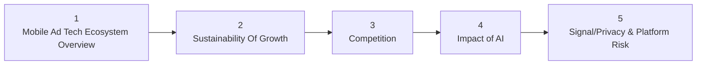
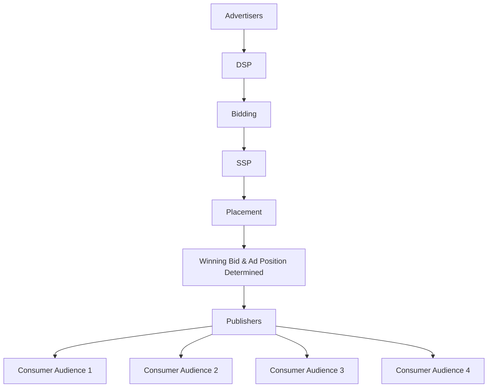
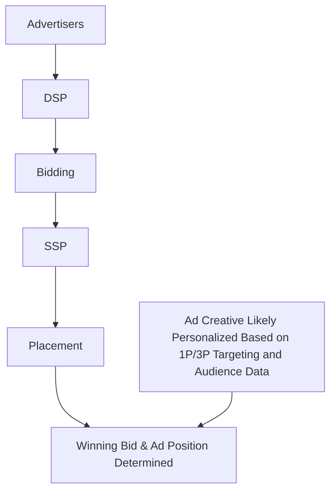
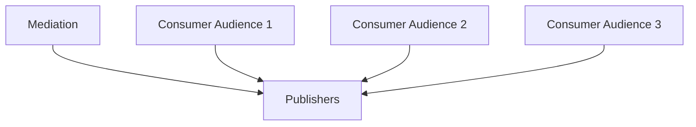
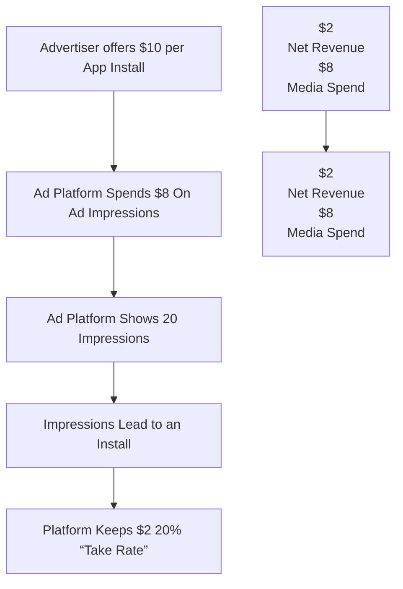
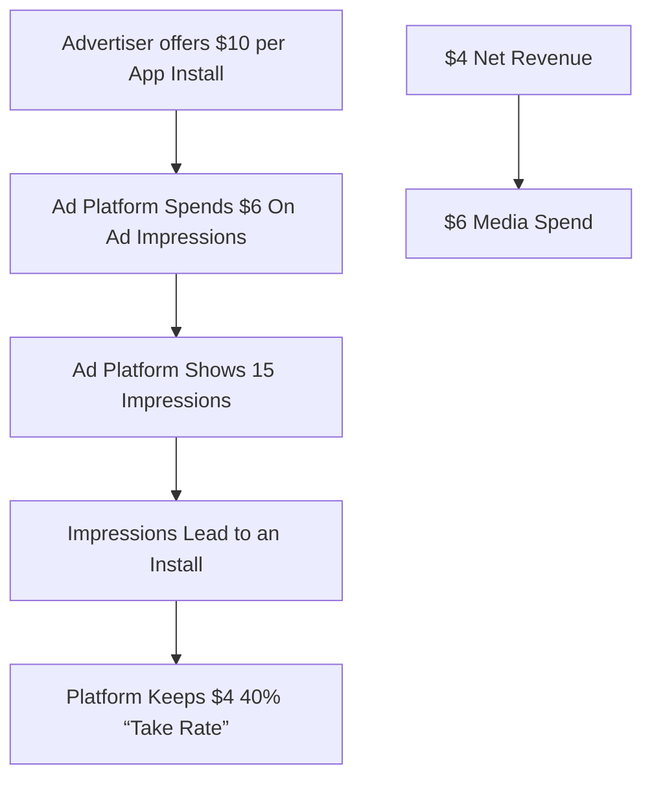

你是知乎商业/行业研究作者，擅长把英文/中文研报改写成适合知乎发布的长文。

【目标】
- 基于下面研报解析内容，生成一篇中文知乎文章。
- 风格接近微信公众号文章，但更适合知乎：论证更完整、语气更克制、有问题意识、有推理链条。
- 文章不需要把研报所有内容讲完，要留下继续阅读完整报告或加入社群讨论的空间。
- 目标长度：约 2200 字，允许上下浮动 20%。

【结构要求】
1. 第一行：知乎标题，直接讲观点，不要标题党，不要夸张极限词。
2. 开头 2-3 段：用一个真实问题或市场分歧切入，说明为什么这份报告值得看。
3. 正文按金字塔原则组织：先给核心判断，再展开 3-5 个支撑逻辑。
4. 每个小标题都要像观点句，不要写“核心判断”“支撑逻辑一”“对读者的启发”这种模板名。
5. 内容要比小红书更理性，比微信更像问答式分析，可以适度提出反问。
6. 结尾自然留下讨论空间，可使用这类表达：`完整报告里还有不少细节，适合放在社群里继续拆。`

【平台发布合规要求】
- 不要出现“投资建议”“买入”“卖出”“强烈推荐”“稳赚”“保本”“必涨”“抄底”“上车”“内幕”“翻倍”等金融操作或收益承诺表达。
- 不要写“非投资建议”“仅做学习交流”这种免责声明，也不要出现包含“投资”的免责声明。
- “投资”相关词尽量改成“投研”“研究”“观察”“学习参考”。
- 不要写“关注”“点赞”“求关注”“评论区留言”等直接互动诱导。
- 不要使用“爆款”“震惊”“必看”“必读”“最强”“最全”“唯一”“全网首发”等极限词。

【内容要求】
- 只能基于研报原文和解析内容推导，不要编造数据、页数、作者、结论或引用。
- 可以基于报告内容做适度发散，但必须明确哪些是报告内容，哪些是你的延展观察。
- 默认避免具体投行品牌名，比如“GS”“GS”，统一写作“投行研报”或使用 GS/JPM/MS 等缩写。
- 不要输出解释说明，只输出知乎文章正文。

【研报解析内容】
"""
## AD TECH PRIMER

## US Internet

## Intro to Mobile Ad Tech: Who Are the Players, What Do They Do, and What's Changing?

MS
North America

MS & Co. LLC

## Matthew Cost

Matthew.Cost@morganstanley.com

+1 212 761 7252

## Brian Nowak, CFA

Brian.Nowak@morganstanley.com

+1 212 761 3365

## Cela VanLieshout

Cela.VanLieshout1@morganstanley.com

+1 212 761 2679

## Intro to Mobile Ad Tech

flowchart

## In-App Ads Typically Send Consumers to the App Stores to Download New Products – Today, Most of Those Ads Are Promoting Games...

text_image

4:29
5G
WORDS with friends™
ATGO

User Opens & Plays a Publisher's App

text_image

Kingshot
Play Now
4
0
10
Swipe to move

An Interactive or Video Ad Will Appear for User

text_image

Done
Kingshot
Century Games Pte. Ltd.
Get In-App Purchases
148K RATINGS AGE CHART
4.6 9+ #4
Years Old Strategy Cen
DEFEND EXPLO

User is Prompted to Download the Game

## ...But Other Categories like Retail and Entertainment Are Important Drivers of the \$79bn Opportunity for Independent In-App Ad Tech Platforms Like APP and U

Global Ad Spend on Independent In-App Ad Tech Platforms is Projected to Reach \$136bn in 2030\*  

stacked bar chart

| Year | Gaming ($bns) | Non-Gaming Entertainment ($bns) | Retail ($bns) | Social Media ($bns) | Other (Education, Finance, Messaging) ($bns) | AI Apps ($bns) |
| :--- | :--- | :--- | :--- | :--- | :--- | :--- |
| 2025E | 46 | 12 | 5 | 5 | 8 | 0 |
| 2026E | 47 | 12 | 5 | 5 | 8 | 0 |
| 2027E | 49 | 13 | 5 | 5 | 8 | 0 |
| 2028E | 51 | 14 | 5 | 5 | 8 | 0 |
| 2029E | 53 | 15 | 5 | 5 | 8 | 0 |
| 2030E | 55 | 16 | 5 | 5 | 8 | 136 |
~11% '25-'30 CAGR; total ad spend is projected at $136 billion. The chart displays a single stacked bar for each year from 2025E to 2030E.

## The Estimated Near-Term Market Opportunity is \$79bn, Though Total In-App and Mobile Advertising Are Larger, When Including Walled Garden Platforms like GOOGL and META

venn diagram chart

| Category | Value |
| -------- | ----- |
| Global Mobile Ad Spend | $554bn^(2) |
| Global In-App Ad Spend | $332bn^(1) |
| Independent Ad-Tech Platform Opportunity | $79bn^(1) |

(1) According to Altman Solon  
(2) According to eMarketer  
(3) According to SensorTower

## 5bn

Smartphone Users Globally $^{(2)}$

## \~3 hours

Spent on Apps per Day $^{(3)}$

## \$554bn

Global Mobile Ad Spend per Year $^{(2)}$

## 90%

Mobile Time Spent In-App $^{(2)}$

## We Also Expect Meaningful Growth Across Broader Markets Like In-App Advertising (incl. Walled Gardens) as well as Total Mobile Advertising

bar chart

| Year | Global Mobile Ad Spend** ($bn) | Global In-App Ad Spend* ($bn) |
| ---- | ------------------------------ | ----------------------------- |
| 2025 | 554                            | 332                           |
| 2029 | 812                            | 545                           |

\*According to Altman Solon  
\*\*According to eMarketer  
Source: Company Data, MS, Altman Solon, eMarketer  
Note: 2029 Number for Global In-App Ad Spend Found by Using 2025-2030 CAGR

## We Expect In-App Advertising to Grow at an 11% CAGR through '30, Materially Faster than Growth on In-Game Purchases at a 5% CAGR...

bar chart

| Category                  | 2025   | 2030   |
| ------------------------- | ------ | ------ |
| In-App Ads (Altman Solon) | $79    | $136   |
| In-App Purchases ($bn)   | $116   | $146   |

## ...But This Has Strong Precedent, as User Acquisition Costs for Mobile Games Materially Outgrew Spend per User Pre-COVID...

## 24%

Cost Per Install

2012-2019 CAGR

bar chart

| Year | Cost Per Install ($) |
| :--- | :--- |
| 2012 | 0.97 |
| 2019 | 4.37 |

## 17%

Average Revenue Per Mobile Gamer

2012-2019 CAGR

bar chart

| Year | In-App Ad Revenue Per Mobile User ($) |
| :--- | :--- |
| 2012 | 12.85 |
| 2019 | 38.06 |

## ...and the Trend Has Continued in Recent Years, With Mobile Gaming UA Spend Growing at a 15% '20-'25 CAGR vs. IAP Growing Just 3% Over the Same Period

## 15%

Mobile Gaming UA Ad Spend

2020-2025 CAGR

bar chart

| Year | Mobile Gaming UA Ad Spend ($bn) |
| :--- | :--- |
| 2020 | 12 |
| 2021 | 14.5 |
| 2022 | 26.8 |
| 2023 | 29.0 |
| 2024 | 22.8 |
| 2025 | 25.0 |

In-App Ad Spend Arguably Remains Under-Monetized Relative to Other Ad Channels  

bar chart

| Category | Ad Spend Per User Hour ($) |
| :--- | :--- |
| In-App 3rd Party | 0.07 |
| Walled Garden In-App | 0.14 |
| CTV | 0.24 |
| Traditional TV | 0.38 |

3 $^{rd}$ Party In-App Represents One of the Highest Growth Opportunities in Digital Advertising

Who Are Some of the Players in Mobile Ad Tech and What Roles Do They Play?  

table

| Company | DSP | SSP | Mediation |
| :--- | :--- | :--- | :--- |
| APPLOVIN | ✓ | | ✓ |
| Unity® | ✓ | ✓ | ✓ |
| Meta | ✓ | | |
| Google | ✓ | ✓ | ✓ |
| Mintegral | ✓ | ✓ | |
| InmOBI™ | ✓ | ✓ | |
| Moloco | ✓ | ✓ | |
| CloudX | | ✓ | ✓ |

## What Do Those Roles Mean?

<table><tr><td>Advertisers</td><td>Companies aiming to acquire new usersIn this market, typically app-based businesses or those with an app</td></tr><tr><td>DSP</td><td>Software that helps advertisers buy digital ads programmatically (i.e. in an automated way)Aids advertisers in targeting the right users and selecting creative to achieve their objective by analyzing all available and relevant data, as well as learning from past ad campaigns</td></tr><tr><td>SSP</td><td>Software that publishers use to make their ad inventory available to many potential buyers (generally DSPs) as possible in an auction formatTypically applies rules and works towards the goal of maximizing revenue for each impression</td></tr><tr><td>Mediation</td><td>Software that publishers use to connect to multiple SSPs, compare their bids or expected value, and serves the best-paying adGenerally compare bids in real time auction format rather than in series (i.e. waterfall) as in the past</td></tr><tr><td>Publishers</td><td>Companies aiming to show ads inside their app, site, or service for profitIn this market, typically app-based businesses or those with an app</td></tr></table>

## There Are Many Players Across Public/Private Markets, With Many Filling Multiple Roles

## Advertisers

SCOPELY

Quince

zynga®

dream

Booking.com

## Publishers

WSJ

NATIONAL GEOGRAPHIC

NETFLIX

TRAVEL+ LEISURE

The New York Times

## Mediation

APPLOVIN

Unity®

Google

PubMatic

InmOBI™

CloudX

## DSP

theTradeDesk

Unity®

dataxu

CRITEO

APPLOVIN

xandr

Meta

AMOBEE

Google

Oath:

InmOBI

Adobe

MOLOCO adform

amazonadvertising

## SSP

SPOTX

APPLOVIN

Magnite

xandr

Unity

AppNexus

OpenX

CloudX

Mintegral

Google

InmOBI

MOLOCO

## In a Classical Example, Advertisers Execute Campaigns via DSPs, Which Bid into Auctions Run by SSPs on Behalf of Publishers

flowchart

## Mediation Tools Allow Publishers to Work with Multiple SSPs or Ad Networks at Once, With the Goal of Maximizing the Value of Publishers' Ad Inventory

SSP/Ad Network #1  

flowchart

SSP/Ad Network #2  

flowchart

SSP/Ad Network #3  

flowchart

flowchart

## The Majority of the Unit Economics Accrue to Publishers, with DSPs and SSPs Capturing Most of the Remainder

flow diagram

| Category               | Value   |
| ---------------------- | ------- |
| Advertisers & Agencies  | $3.00 CPM |
| DSP                    | $0.45   |
| SSP                    | $0.45   |
| Mediation              | $0.06   |
| Publishers             | $2.04   |

## Any Other Potential Fees?

- Ad servers  
• Data management platforms (estimated 1-2% but can be included within the DSP take rate)  
• Digital media analytics fees are paid separately by the advertiser (i.e. not a percentage of CPM)

## Intro to Mobile Ad Tech

flowchart

## Introduction: Sustainability of Growth

## What Is The Debate?

- Broadly speaking, there is debate around how much room there is for further growth in mobile advertising, including improvement in existing unit economics or performance, expansion into new verticals, and exposure to macroeconomic pressure.  
- Specifically, this includes discussion of how high advertisers can raise take rates and conversion rates, which directly impacts potential growth in revenue for ad tech players.  
- Debate has also centered on how scalable ecommerce and other verticals outside of in-game advertising are.

## What's Changing?

- Recent initiatives from ad platforms to expand beyond core in-game advertising and into web and e-commerce have driven debate around the durability and scale of these new verticals  
- Potential entry of larger platforms into in-game advertising has raised questions regarding the sustainability of conversion rates and take-rate expansion for incumbent players. Separately, there is investor focus on exposure to broader macroeconomic headwinds and potential cyclicality.

## Why Does It Matter?

- Take rates and conversion rates are key drivers of monetization efficiency for platforms and directly impact revenue. Improvement in these metrics signals stronger advertiser ROI and platform pricing power, while any degradation may indicate rising competition or weakening demand quality.  
- Expansion beyond in-game advertising could meaningfully increase TAM, supporting higher long-term revenue and margin growth

## Who Is Primarily Impacted?

- Potential Beneficiaries: APP, U, and other players that can meaningfully scale into new verticals while improving conversion rates.  
- Potentially At Risk: Existing ad platforms in new verticals that fail to outperform other players on conversion rates or advertiser-specific performance metrics (ROAS, etc.).

## Higher Conversion Rates Allow Ad Tech Companies to Increase Their Take Rates and Net Revenue...

## What Are Conversion Rates and Take Rates? Why Do They Matter?

- Click Through Rates: the portion of users that click on an ad after viewing it  
- Conversion Rates: the portion of ad impressions (clicks) that result in a desired outcome (app install, purchase, etc.)  
- “Take Rates”: The share of advertiser spend captured by the ad platform, contributing to net revenue for the platform  
• Media Spend: Spend by the ad platform to win placements and impressions to result in one conversion

## Total Impressions:

Users who view the ad

x Click Through Rate

## Total Engagement:

Users who interact with the ad

x Conversion Rate

## Conversions

Users Who Complete

The Desired

Outcome

- Higher conversion rates result in better campaign efficiency, increasing the value of each impression. If conversion rates improve, the ad platform needs fewer impressions to deliver the same number of installs.  
- Improved conversion lowers effective CPI for the ad platform by lowering the number of impressions needed to result in one conversion. If advertiser spend remains stable, the platform keeps a larger spread between spend and inventory cost.

## ...Presenting a Growth Opportunity that Is Separate from Growth in Total Ad Dollars Spend by Advertisers

Improved Conversion Rates Can Improve The Effective “Take Rate” Of An Ad Platform, Increasing Net Revenue Without Relying on Change in Advertiser Spend. With higher conversion rates, Ad platforms need to buy less impressions to results in one conversion.

If It Takes 20 Ad Impressions To Generate One App Install Today......  

flowchart

...An Improvement To 15 Impressions Per Install Would Lead "Take Rate" To Double  

flowchart

## We Estimate Leading Platforms Like META Enjoy “True” Conversion Rates \~10x Above APP’s, Suggesting Significant Headroom Even If APP’s Rates Never Reach META’s

## META Conversion Rates are \~10x Those of APPs, Representing Significant Potential Upside to APP Revenue If Conversion Rates and Platform Performance Continue to Improve

APP

<table><tr><td>% of Ads that Generate an App Install</td><td>1.3%</td></tr><tr><td>x In-Game Paying Ratio</td><td>2.0%</td></tr><tr><td>= &quot;True&quot; Conversion Rate</td><td>0.026%</td></tr></table>

META

<table><tr><td>Click-Through Rate</td><td>2.5%</td></tr><tr><td>x Conversion Rate</td><

[中间内容因长度限制已省略]

general in nature. These opinions may not fit to your financial status, risk and return preferences. For this reason, to make an investment decision by relying solely to this information stated here may not bring about outcomes that fit your expectations.

The trademarks and service marks contained in MS are the property of their respective owners. Third-party data providers make no warranties or representations relating to the accuracy, completeness, or timeliness of the data they provide and shall not have liability for any damages relating to such data. The Global Industry Classification Standard (GICS) was developed by and is the exclusive property of MSCI and S&P.

MS, or any portion thereof may not be reprinted, sold or redistributed without the written consent of MS.

Indicators and trackers referenced in MS may not be used as, or treated as, a benchmark under Regulation EU 2016/1011, or any other similar framework.

The issuers and/or fixed income products recommended or discussed in certain fixed income research reports may not be continuously followed. Accordingly, investors should regard those fixed income research reports as providing stand-alone analysis and should not expect continuing analysis or additional reports relating to such issuers and/or individual fixed income products.

MS may hold, from time to time, material financial and commercial interests regarding the company subject to the Research report.

Registration granted by SEBI and certification from the National Institute of Securities Markets (NISM) in no way guarantee performance of the intermediary or provide any assurance of returns to investors. Investment in securities market are subject to market risks. Read all the related documents carefully before investing.

## Disclosure Section (cont.)

INDUSTRY COVERAGE: Internet

<table><tr><td>COMPANY (TICKER)</td><td>RATING (AS OF)</td><td>PRICE* (06/04/2026)</td></tr><tr><td colspan="3">Brian Nowak, CFA</td></tr><tr><td>Airbnb Inc (ABNB.O)</td><td>U (12/06/2022)</td><td>$133.72</td></tr><tr><td>Alphabet Inc. (GOOGL.O)</td><td>O (08/11/2015)</td><td>$372.19</td></tr><tr><td>Amazon.com Inc (AMZN.O)</td><td>O (04/24/2015)</td><td>$253.79</td></tr><tr><td>Booking Holdings Inc (BKNG.O)</td><td>O (02/23/2026)</td><td>$167.49</td></tr><tr><td>DoorDash Inc (DASH.O)</td><td>O (02/21/2024)</td><td>$160.07</td></tr><tr><td>Expedia Inc. (EXPE.O)</td><td>E (01/09/2019)</td><td>$227.18</td></tr><tr><td>Instacart (CART.O)</td><td>E (01/29/2024)</td><td>$41.48</td></tr><tr><td>Lyft Inc (LYFT.O)</td><td>E (10/24/2019)</td><td>$14.12</td></tr><tr><td>Meta Platforms Inc (META.O)</td><td>O (03/20/2023)</td><td>$627.57</td></tr><tr><td>Pinterest Inc (PINS.N)</td><td>O (07/20/2025)</td><td>$21.59</td></tr><tr><td>Reddit Inc (RDDT.N)</td><td>O (12/08/2024)</td><td>$183.91</td></tr><tr><td>Snap Inc. (SNAP.N)</td><td>E (07/22/2024)</td><td>$6.07</td></tr><tr><td>Uber Technologies Inc (UBER.N)</td><td>O (06/04/2019)</td><td>$72.21</td></tr><tr><td colspan="3">Matthew Cost</td></tr><tr><td>AppLovin Corp (APP.O)</td><td>O (04/10/2025)</td><td>$558.87</td></tr><tr><td>Compass, Inc. (COMP.N)</td><td>E (01/12/2026)</td><td>$7.88</td></tr><tr><td>Criteo SA (CRTO.O)</td><td>E (01/26/2016)</td><td>$17.29</td></tr><tr><td>DoubleVerify Holdings Inc (DV.N)</td><td>E (06/25/2024)</td><td>$10.57</td></tr><tr><td>Electronic Arts Inc (EA.O)</td><td>E (08/04/2021)</td><td>$203.40</td></tr><tr><td>MNTN Inc (MNTN.N)</td><td>E (06/16/2025)</td><td>$9.69</td></tr><tr><td>Opendoor Technologies Inc (OPEN.O)</td><td>E (07/24/2023)</td><td>$4.95</td></tr><tr><td>Playtika Holding Corp (PLTK.O)</td><td>E (11/27/2022)</td><td>$3.15</td></tr><tr><td>Roblox Corporation (RBLX.N)</td><td>O (11/04/2024)</td><td>$43.35</td></tr><tr><td>Shutterstock Inc (SSTK.N)</td><td>E (07/28/2022)</td><td>$13.19</td></tr><tr><td>Take-Two Interactive Software (TTWO.O)</td><td>O (02/01/2018)</td><td>$216.65</td></tr><tr><td>Trade Desk Inc (TTD.O)</td><td>E (09/10/2025)</td><td>$21.03</td></tr><tr><td>Unity Software Inc (U.N)</td><td>O (09/02/2024)</td><td>$30.03</td></tr><tr><td>Webtoon Entertainment Inc (WBTN.O)</td><td>E (07/22/2024)</td><td>$11.66</td></tr><tr><td>Yelp Inc (YELP.N)</td><td>U (01/10/2019)</td><td>$23.63</td></tr><tr><td>Zillow Group Inc (Z.O)</td><td>E (04/18/2018)</td><td>$35.92</td></tr><tr><td colspan="3">Nathan Feather</td></tr><tr><td>Bumble Inc. (BMBL.O)</td><td>E (03/08/2021)</td><td>$2.99</td></tr><tr><td>Chewy Inc (CHWY.N)</td><td>O (10/31/2023)</td><td>$20.82</td></tr><tr><td>Duolingo Inc (DUOL.O)</td><td>E (02/27/2026)</td><td>$109.15</td></tr><tr><td>eBay Inc (EBAY.O)</td><td>O (04/18/2024)</td><td>$109.15</td></tr><tr><td>Etsy Inc (ETSY.N)</td><td>E (07/20/2025)</td><td>$67.05</td></tr><tr><td>FIGS, Inc. (FIGS.N)</td><td>E (02/29/2024)</td><td>$11.70</td></tr><tr><td>Grindr Inc. (GRND.N)</td><td>E (02/24/2026)</td><td>$10.70</td></tr><tr><td>Match Group Inc (MTCH.O)</td><td>E (04/18/2024)</td><td>$34.76</td></tr><tr><td>Peloton Interactive, Inc. (PTON.O)</td><td>E (03/14/2022)</td><td>$6.17</td></tr><tr><td>Revolve Group Inc (RVLV.N)</td><td>E (10/20/2024)</td><td>$19.33</td></tr><tr><td>WW International Inc (WW.O)</td><td>E (08/01/2025)</td><td>$17.27</td></tr></table>

Stock Ratings are subject to change. Please see latest research for each company.  
\* Historical prices are not split adjusted.

## The Americas

1585 Broadway

New York, NY 10036-8293

United States

+1 212 761 4000

## Europe

20 Bank Street, Canary Wharf

London E14 4AD

United Kingdom

+44 (0)20 7425 8000

## Japan

1-9-7 Otemachi, Chiyoda-ku

Tokyo 100-8104

Japan

+81 (0) 3 6836 5000

## Asia/Pacific

1 Austin Road West

Kowloon

Hong Kong

+852 2848 5200
"""
