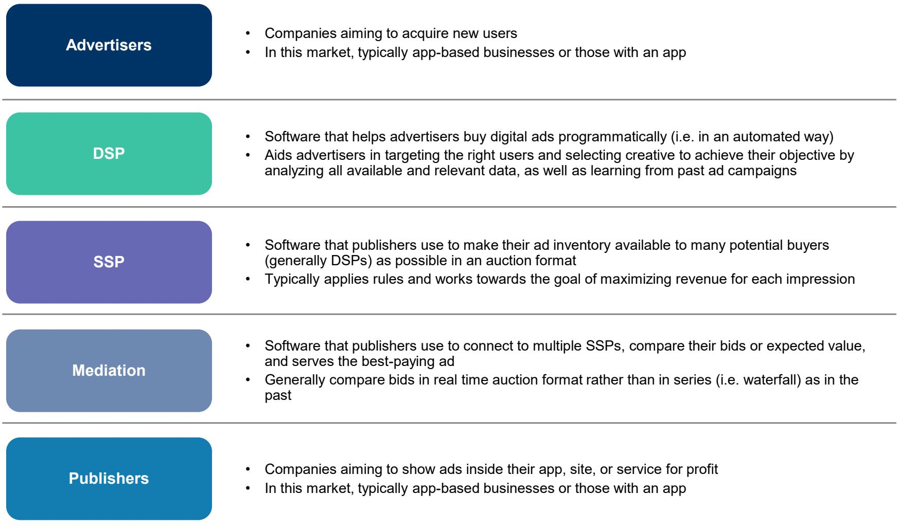
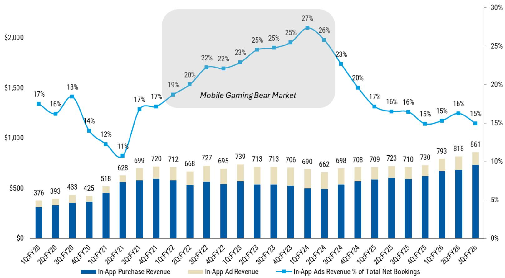
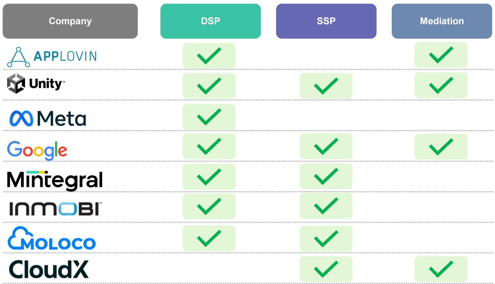

# The Mobile Ad Tech Market Is Not Just Growing—It Is Structurally Under-Monetized, and the Real Opportunity Lies in Closing the Conversion Rate Gap

The global mobile advertising ecosystem is enormous, with over $550 billion in annual spend and 5 billion smartphone users spending roughly three hours per day inside apps. Yet the independent, third-party in-app ad tech platforms—the companies that sit between advertisers and publishers outside the walled gardens of Google and Meta—are only capturing a fraction of that value. A global investment bank report estimates that the addressable opportunity for these independent platforms is roughly $79 billion today, growing to $136 billion by 2030. That is an 11% compound annual growth rate, significantly faster than the overall mobile advertising market.

But the headline numbers understate the real strategic opportunity. The most important insight from this analysis is not the top-line growth projection. It is the structural under-monetization of in-app advertising relative to other channels. Third-party in-app ads generate only $0.07 of ad spend per user hour. Compare that to $0.14 for walled garden in-app ads, $0.24 for connected TV, and $0.38 for traditional television. The gap is not marginal; it is a factor of five to six times versus traditional TV. This suggests that the growth story is not simply about more dollars flowing into mobile—it is about a fundamental repricing of in-app inventory as the technology, targeting, and measurement improve.

The question for investors and strategists is not whether this market will grow. It is which companies will capture the disproportionate share of that growth, and what structural changes will determine the winners. The answer lies in a single metric: conversion rates.

## Conversion Rate Improvement Is the Most Powerful and Underappreciated Lever for Revenue Growth

Most market observers focus on total advertiser spend as the primary driver of ad tech revenue. If brands spend more, the platforms take their cut, and revenue grows. That framing is incomplete. The report makes a critical distinction: improved conversion rates allow ad tech platforms to increase their effective "take rate" without relying on any increase in advertiser budgets. This is a form of operating leverage that compounds over time and is largely independent of macroeconomic cycles.

The mechanics are straightforward. An advertiser offers $10 per app install. The ad platform spends $8 on ad impressions to generate that install, keeping $2 as net revenue—a 20% take rate. If the platform improves its conversion rate so that it only needs 15 impressions instead of 20 to generate the same install, the media spend drops to $6, and the platform keeps $4. The take rate doubles to 40%, even though the advertiser paid the same $10. The platform's net revenue per install has doubled without any change in advertiser demand.

This is not a theoretical exercise. The report's data shows that leading platforms like Meta enjoy "true" conversion rates roughly ten times higher than those of independent platforms such as AppLovin. Meta's click-through rates and in-app conversion rates compound into a conversion funnel that is dramatically more efficient. If independent platforms can close even a fraction of that gap, the revenue implications are enormous. Every percentage point improvement in conversion rate flows almost entirely to the bottom line, because the platform needs to buy fewer impressions to deliver the same outcome.

The strategic implication is clear: the most valuable companies in this space will not be those that simply scale their media buying. They will be those that invest in the data, machine learning, and targeting infrastructure that drives conversion rate improvement. This is a technology race, not a sales race.

## The Expansion Beyond Gaming into Retail, Entertainment, and AI Apps Is the Key to Unlocking the Full $136 Billion Opportunity

The independent in-app ad tech market has historically been dominated by gaming. Today, roughly 60% of the $79 billion opportunity comes from gaming advertisers. That concentration creates both risk and opportunity. The risk is that gaming ad spend is cyclical, tied to game release schedules, and sensitive to changes in user acquisition costs. The opportunity is that non-gaming verticals—retail, entertainment, social media, education, finance, and messaging—are still deeply under-penetrated.

The report projects that by 2030, non-gaming categories will account for a growing share of the $136 billion total addressable market. Retail alone is expected to grow from $5 billion to a meaningful portion of the mix. Entertainment and social media are also projected to expand. And notably, the report includes a placeholder for AI apps, which could represent a entirely new category of demand as AI-native applications proliferate and need to acquire users.

This expansion is not automatic. It requires ad tech platforms to build vertical-specific capabilities. Retail advertisers have different optimization goals than game developers. They care about return on ad spend measured in purchases, not installs. They need product-level targeting, dynamic creative optimization, and integration with e-commerce measurement systems. Entertainment and streaming apps have their own requirements around subscription acquisition and content discovery.

The platforms that succeed in non-gaming verticals will be those that build purpose-built solutions rather than trying to repurpose gaming ad technology. This is a significant investment hurdle, but the payoff is access to a much larger and more stable revenue base. The report's data on ad spend per user hour across channels suggests that non-gaming verticals have historically been willing to pay higher effective CPMs for better targeting. If independent platforms can deliver comparable performance to walled gardens, they can capture share in verticals that have traditionally been dominated by Google and Meta.

## The Competitive Landscape Is More Complex Than a Simple Battle Between Independent Platforms and Walled Gardens

The report maps the mobile ad tech ecosystem into distinct functional layers: demand-side platforms (DSPs), supply-side platforms (SSPs), and mediation layers. Many companies operate across multiple layers, creating vertical integration strategies that are both a strength and a source of tension.

On one side, the walled gardens—Google, Meta, Amazon—control their own inventory, their own demand, and their own measurement. They offer advertisers a closed loop: target users within their ecosystem, measure results within their ecosystem, and optimize within their ecosystem. The conversion rate data in the report shows why this model is so effective. Meta's click-through rates and conversion rates are an order of magnitude higher than independent platforms, because Meta has access to its own first-party data, user identity, and behavioral signals across Facebook, Instagram, and WhatsApp.

On the other side, independent platforms like AppLovin, Unity, and others offer scale, reach, and independence. They aggregate inventory across thousands of apps, giving advertisers access to audiences that may not be reachable within walled gardens. They also offer mediation tools that allow publishers to compare bids from multiple SSPs in real time, maximizing revenue for each impression. The report's unit economics breakdown shows that publishers capture roughly 68% of the $3.00 CPM, with DSPs and SSPs each taking about 15%. Mediation takes a small sliver.

The competitive dynamic is shifting. Walled gardens are increasingly interested in in-game advertising, which could bring their superior conversion technology into the independent ecosystem. If Meta or Google can serve ads inside third-party games with the same targeting precision they have within their own apps, the conversion rate gap could narrow, but the revenue could flow to the walled gardens rather than to independent platforms. This is the central competitive risk for companies like AppLovin and Unity.

At the same time, independent platforms have their own advantages. They are not limited to a single ecosystem. They can aggregate data across multiple sources. They can offer advertisers a unified view of campaign performance across apps, web, and connected TV. And they are not subject to the same privacy and regulatory scrutiny that walled gardens face, which could become an increasingly important differentiator as signal loss and privacy regulation reshape the industry.

## Privacy, Signal Loss, and Platform Risk Are the Structural Wild Cards That Could Reshape the Entire Market

The report identifies signal and privacy risk as one of the five key areas of analysis, and it is perhaps the most difficult to model. The digital advertising industry is undergoing a fundamental shift away from third-party cookies and device-level identifiers. Apple's App Tracking Transparency framework, Google's Privacy Sandbox, and evolving regulatory regimes in Europe and the United States are all reducing the amount of user-level data available for targeting and measurement.

For independent ad tech platforms, this creates both a threat and an opportunity. The threat is that their conversion rates—already significantly lower than walled gardens—could deteriorate further if they lose access to the signals that power their targeting algorithms. Without device-level identifiers, platforms must rely on contextual targeting, aggregated data, and probabilistic models, which are inherently less precise. This could widen the conversion rate gap and make it harder for independent platforms to compete.

The opportunity is that signal loss affects everyone, including walled gardens. Apple's privacy changes have already impacted Meta's advertising business, costing the company billions in revenue. If the playing field is leveled—if walled gardens lose some of their first-party data advantage—independent platforms could gain relative share. The key question is which platforms have the technology and data infrastructure to adapt most quickly.

Platform risk is the other structural wild card. The major app stores—Apple's App Store and Google Play—control the distribution of apps and, by extension, the distribution of in-app advertising inventory. If these platforms change their policies, their fee structures, or their ad serving capabilities, it could fundamentally alter the economics of the independent ad tech ecosystem. The report does not fully resolve this question, and it is one of the most important open issues for long-term investors.

## A Decision Framework for Evaluating Mobile Ad Tech Opportunities

For investors and strategists evaluating companies in this space, the report's analysis suggests a structured framework with four dimensions.

First, assess conversion rate trajectory. The single most important metric is not revenue growth or market share, but the trend in conversion rates over time. Are the platform's click-through rates and post-click conversion rates improving? Is the gap to walled gardens narrowing or widening? Platforms that demonstrate sustained conversion rate improvement have pricing power and operating leverage that their peers lack.

Second, evaluate vertical diversification. How dependent is the platform on gaming? What is the revenue contribution from retail, entertainment, and other non-gaming verticals? Platforms that have successfully expanded beyond gaming have a larger addressable market and are less exposed to gaming-specific cyclicality. The report's data on ad spend per user hour suggests that non-gaming verticals are willing to pay significantly more for effective advertising, making this a high-value expansion opportunity.

Third, analyze signal resilience. How reliant is the platform's targeting technology on third-party data and device-level identifiers? Platforms that have invested in first-party data partnerships, contextual targeting, and machine learning models that work with limited signals are better positioned for a privacy-first future. Platforms that depend on IDFA or similar identifiers face structural headwinds.

Fourth, consider platform dependency. How much of the platform's revenue comes from a single app store, operating system, or distribution channel? Platforms with diversified distribution—across iOS, Android, web, and connected TV—are less vulnerable to policy changes by any single platform gatekeeper.

This framework does not produce a single answer, but it highlights the key variables that will determine which platforms outperform over the next five years. The report's data suggests that the market is still early in its growth cycle, and the winners have not yet been determined.

## The Full Report Contains the Data, Charts, and Detailed Analysis That Support These Conclusions

The analysis presented here draws on a comprehensive research report that includes detailed market sizing, competitive mapping, conversion rate comparisons, and unit economics breakdowns. The report's charts on ad spend per user hour, conversion rate gaps between platforms, and the projected growth of non-gaming verticals are essential reading for anyone making investment or strategic decisions in this space.

Several important questions remain open and are worth exploring in the full report. How quickly can independent platforms close the conversion rate gap with walled gardens? Which non-gaming verticals will scale first, and what are the unit economics of those verticals? How will the entry of larger platforms into in-game advertising change the competitive dynamics? And what is the impact of AI on targeting, creative optimization, and measurement?

These are not academic questions. They will determine which companies generate outsized returns and which are disrupted. The full report provides the data, the frameworks, and the analytical depth to answer them.

Join the community to read the full report and review the original charts.

*This article is for learning and discussion only and does not constitute investment advice.*

Personal reading notes and learning share only. Not investment advice.

