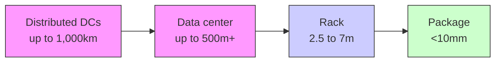

你是资深小红书内容策划 + 投研翻译官，擅长把英文/中文研报改写成高互动、可收藏、可转发的中文小红书笔记。

【目标】
- 把下面的研报解析内容，改写成一篇中文小红书笔记。
- 风格：投研博主风：信息密度高，但像给朋友讲逻辑
- 长度：不超过 1000 字，信息密度高但不要写长文。
- emoji 密度：中

【必须输出的结构】
1. 第一行：标题，20 字以内，不要像论文标题，也不要用夸张极限词。
2. 第二行：封面短标题，10 字以内，适合放在图中间。
3. 第三行：封面副标题，10-18 字，短句。
4. 正文分段清晰，每段不超过 3 行，可以用编号、小标题或加粗。
5. 正文要自然呈现观点，但不要暴露写作框架或思考过程。
6. 末尾可以保留 2-4 个相关标签，只允许从这些标签里选择：`#学习笔记`、`#研究笔记`、`#学习研究`、`#研报解读`。

【严禁输出】
- 不要出现这些栏目名或类似栏目名：`一句话结论`、`我最想提醒的一点`、`配图建议`、`免责声明`、`非投资建议`、`仅做学习交流`、`仅作学习交流`。
- 不要在正文最后追加配图建议，不要告诉我第 2/3/4 张图怎么配文。
- 不要输出任何包含“投资”的免责声明，也不要输出“非投资建议”这种表述。
- 不要输出财经敏感标签：`#投资学习`、`#财经`、`#金融`、`#股票`、`#基金`、`#理财`。
- 不要输出无关标签：`#小红书笔记`、`#笔记分享`、`#干货分享`。
- 不要写“关注”“点赞”“求关注”“评论区见”“评论区留言”等直接互动诱导；可以写“欢迎一起讨论”“可以继续交流”。

【平台发布合规要求】
- 不要写“爆款”“震惊”“必看”“必读”“最强”“最全”“唯一”“全网首发”等极限词或夸张词。
- 不要写“投资建议”“买入”“卖出”“强烈推荐”“稳赚”“保本”“必涨”“抄底”“上车”“内幕”“翻倍”等金融操作或收益承诺表达。
- “投资”相关词尽量改成“投研”“研究”“观察”“学习参考”；如果必须保留，也要放在中性语境里。
- 不要承诺收益，不要引导交易，不要暗示确定性结果。

【内容要求】
- 只能基于研报原文和解析结果推导，不要编造数据、公司动作、引用。
- 可以把专业表达翻成人话，但不能扭曲意思。
- 遇到不确定或缺失信息：用“研报未给出”或“这里是推测”明确标注。
- 默认避免出现具体投行品牌名，比如“GS”“GS”，统一写作“投行研报”。
- 不要解释你的思考过程，不要输出多余说明。

【推荐写法】
- 开头直接给一个自然判断，不要加“结论：”标签。
- 中间用 1/2/3 拆逻辑，但小标题要像正常内容标题，不要像写作模板。
- 结尾可以留下一个自然讨论问题，但不要引导关注、点赞或评论。
- 最后一行输出 2-4 个标签，优先：`#学习笔记 #研究笔记 #学习研究 #研报解读`。

【研报解析内容】
"""
June 8, 2026 06:15 AM GMT

# Semiconductor Production Equipment | Japan Taiwan Visit Takeaways

We attended the Al Summit in Taipei on May 28–29 and Computex on Jun 2–5. Key takeaways were as follows.

## Key Takeaways

Interest in SPE appears more subdued compared with the strong momentum seen in late 2025 to early 2026.  
That said, compared with three months ago when concerns around memory cycle sustainability rose on the back of spot price declines, we heard limited pessimism on the memory cycle through 2027.  
Investor meetings showed strong interest in Kokusai, Lasertec, and Advantest; we recently made Advantest our Top Pick.  
Through Computex, etc., we reconfirmed memory demand expansion driven by agentic AI, as well as growing focus on co-packaged optics (CPO) as the next technical bottleneck.

Investor stance on SPE appears more balanced versus late 2025 to early 2026. With spot prices turning upward again, our impression is that investor conviction in the sustainability of the memory cycle has increased. Memory shortages could persist for the next 2-3 years, and with advanced logic investment remaining strong, front-end wafer process names should continue to see major benefits. In back-end processes, we believe CPO would become one of the major topics from 2027–2028 onward and focus on potential upside for Advantest in testing.

MS MUFG SECURITIES CO., LTD.+

## Suzune Tamura, CFA

Equity Analyst

Suzune.Tamura@morganstanleymufg.com

+81 3 6836-8891

## Kazuo Yoshikawa, CFA

Equity Analyst

Kazuo.Yoshikawa@morganstanleymufg.com

+81 3 6836-8408

text_image

Japan Summer School 2026

## SEMICONDUCTOR PRODUCTION EQUIPMENT

Japan

Industry View

Attractive

MS does and seeks to do business with companies covered in MS. As a result, investors should be aware that the firm may have a conflict of interest that could affect the objectivity of MS. Investors should consider MS as only a single factor in making their investment decision.

## For analyst certification and other important disclosures, refer to the Disclosure Section, located at the end of this report.

+= Analysts employed by non-U.S. affiliates are not registered with FINRA, may not be associated persons of the member and may not be subject to FINRA restrictions on communications with a subject company, public appearances and trading securities held by a research analyst account.

## Computex/GTC

## Agentic AI

Reaffirming expansion in DRAM demand: Our Taiwan semiconductor analyst Charlie Chan confirmed from supply chain checks that the company can produce 2.5-4.0mn Vera CPUs (link). Since a Vera CPU can accommodate 1.5TB of LPDDR5X, triple that of the Grace CPU, the required LPDDR5X bit capacity at that level of production would be approximately 4-6mn GB. That means that Vera alone will need more than $10\%$ of last year's total DRAM bit demand. Based on production at 1cnm, a rough estimate suggests demand equivalent to 100-200kwpm.

Exhibit 1: Vera CPU alone could account for more than $10\%$ of total global DRAM bit demand for 2025  

bar chart

LPDDR5X bit demand for Vera CPU relative to 2025 total DRAM bit demand (=38TB)
| VR/VR Type | Bit Demand (bnGb equiv.) (%) |
| :--- | :--- |
| Vera CPU 2.5mn | 10 |
| Vera CPU 4mn | 16 |

Source: MS estimates

## CPO

Marvell Technology (analyst: Joseph Moore) offered an explanation of the copper (Cu) wall in its keynote address at Computex. Optical signal transmission via fiber optics has traditionally been used among and within data centers. However, electrical signal transmission via copper is used for distances when feasible (e.g., racks, semiconductor packages) due to copper's high reliability and cost advantages. That boundary is the Cu wall.

In inter-rack copper electrical signal transmission, transmission speed and distance are inversely proportional. While a 100G/lane data rate allows transmission up to 5m, that falls to 2.5m at the 200G level increasingly in use at present, and will shrink further to 1.25m at the 400G targeted for adoption around 2028. Since the height of the racks is 2m, it is difficult to fully connect racks with copper for 400G transmission. It was explained that the Cu wall is currently moving from the left to right side of Exhibit 2.

Exhibit 2: The shift toward 400G-per-lane signaling targeted from around 2028 would push electrical copper transmission to $1.25\mathrm{m}$ , below typical rack sizes ( $\sim 2\mathrm{m}$ ), reinforcing the need for optical interconnects  

flowchart

bar chart

Distance that signals can travel over Cu cable
| Signal bandwidth (/lane) | Distance (m) |
|---|---|
| 100G 2021~ | 5 |
| 200G 2025~ | 2.5 |
| 400G early-2030s | 1.25 |
| 800G early-2030s | 0.6 |
| 1.6T ...future | 0.3 |
TODAY

Source: Marvell Technology, MS

In the CPO sector, we look for Advantest to see increased testing demand. Its competitor Teradyne (analyst: Shane Brett) has said that demand for CPO tester TAMs should reach \$100mn in 2026, \$300-700mn in 2028, and over \$1bn thereafter as CPO is adopted in scaled-up applications, indicating significant potential for market growth. Also, we believe Disco will benefit from hybrid bonding technology for COUPE. The placement of switch ASICs and optimal engines onto substrate boards will lead to increased board size, bolstering demand for substrate boards and board equipment. That should in turn spur greater demand for Ushio's stepper exposure equipment.

## Investor feedback

Kokusai Electric: There was much discussion regarding the firm's guidance.

Exhibit 3: Kokusai Electric's sales breakdown by equipment application  

stacked bar chart

Kokusai Electric
| Year | NAND (%) | DRAM (%) | Logic/ Foundry (%) | Others (%) |
|---|---|---|---|---|
| 23/3 | 40 | 18 | 25 | 12 |
| 24/3 | 14 | 47 | 31 | 19 |
| 25/3 | 12 | 54 | 27 | 14 |
| 26/3 | 23 | 44 | 26 | 11 |

Source: Company data, MS

The company commented on its conservative guidance for 2H F3/27 at our Japan Summit on May 20-22, noting an upside risk to its current sales guidance (-17% HoH) to flat growth HoH. It presently targets sales of ¥280bn for the whole of F3/27, but flat 2H growth would lift that to ¥300bn. Further upside potential lies in demand from emerging Chinese companies, which are only cautiously incorporated in current guidance, and additional demand from Chinese DRAM manufacturers. Given that lead times have extended to eight months, we believe 2H shipments should be finalized by the time that 1Q (Apr-Jun) results are announced and stand by our view that an upward revision is likely at that time.

While Kokusai is generally seen as a NAND stock, it has been more exposed in recent years to DRAM (Exhibit 3). NAND accounted for some $40\%$ of device sales at its peak in F3/23, but slid to around half

that level in F3/26 with the contraction in the NAND WFE market. However, we are seeing greater greenfield investment activity from companies other than local Chinese firms that was not included in the initial plans. A recovery in NAND, with its considerable sales

contribution from high-value-added mini-batch ALD, should be a boost for profitability.

Advantest: Discussion seemed concentrated on timing. We upgraded the company to our Top Pick on May 27, but many investors in subsequent meetings asked about stock catalysts. As in F3/26, we expect upward revisions from 2Q F3/27 (Apr-Jun) through the end of the fiscal year as visibility improves and believe that one driver will be an increase in the consensus EPS. There were many questions as well about CPO, but we do not expect this to be a major catalyst in the near term. In CPO, there is strong demand for wafer insertion 1 and 2 testing due to the emphasis on ensuring KGD reliability. The competitive landscape is still not settled, but at the very least we do not anticipate a 100-0 situation as with GPUs. Many inquired as well about the competitive environment for GPUs. Our understanding is that Advantest advantage in AI GPUs remains intact.

Lasertec: The majority of inquiries revolved around A200HiT. We feel that the bullish projections of investors for A200HiT are unduly high and maintain our cautious stance. Questions also arose over the competitive landscape, but we sensed that worries over the possible emergence of new ACTIS rivals have diminished given the absence of any announcement regarding Actinic testing equipment, which had been raised as a concern during IR Days at some competitors. We believe as well that Lasertec will retain its dominant position in Actinic testing equipment. Despite evident hopes for North American customers, we do not think the situation at present necessitates additional investment in mask shops.

Tokyo Electron: The latest buoyant earnings results seem to have completely dispelled the negative impression held last fiscal year. While its price hikes have been received positively, this does not seem to be fully discounted in the share price. Asked about prices at the Japan Summit, the company did not rule out the possibility of a $5 - 9\%$ increase. We have not aggressively factored this likelihood into our forecast, but such a move could bring about a further improvement in profitability. We project an OP margin of around $33\%$ (+4pt YoY) in F3/28, led primarily by top-line growth. However, if price hikes help raise this toward the $35\%$ target in the firm's medium-term business plan, we imagine this would be viewed positively.

## Valuation Methodology and Risks

## Advantest (6857.T)

Our target P/E of just over 20x (F3/28e EPS) references the average one-year forward weekly P/E from 2023, when demand for AI semiconductors began to accelerate, to the present.

## Risks to Upside

■ Expansion in demand for generative AI SoC testers beyond expectations  
■ Expansion in the business opportunity for CPO testing

## Risks to Downside

■ Stagnation in AI semiconductor investment  
■ Loss of share in generative AI SoC testers and HBM testers

## Disclosure Section

The information and opinions in MS were prepared by MS MUFG Securities Co., Ltd. and its affiliates (collectively, "MS").

For important disclosures, stock price charts and equity rating histories regarding companies that are the subject of this report, please see the MS Disclosure Website at www.morganstanley.com/eqr/disclosures/webapp/generalresearch, or contact your investment representative or MS at 1585 Broadway, (Attention: Research Management), New York, NY, 10036 USA.

For valuation methodology and risks associated with any recommendation, rating or price target referenced in this research report, please contact the Client Support Team as follows: US/Canada +1 800 303-2495; Hong Kong +852 2848-5999; Latin America +1 718 754-5444 (U.S.); London +44 (0)20-7425-8169; Singapore +65 6834-6860; Sydney +61 (0)2-9770-1505; Tokyo +81 (0)3-6836-9000. Alternatively you may contact your investment representative or MS at 1585 Broadway, (Attention: Research Management), New York, NY 10036 USA.

## Analyst Certification

The following analysts hereby certify that their views about the companies and their securities discussed in this report are accurately expressed and that they have not received and will not receive direct or indirect compensation in exchange for expressing specific recommendations or views in this report: Suzune Tamura, CFA.

## Global Research Conflict Management Policy

MS has been published in accordance with our conflict management policy, which is available at www.morganstanley.com/institutional/research/conflictpolicies. A Portuguese version of the policy can be found at www.morganstanley.com.br

## Important Regulatory Disclosures on Subject Companies

As of April 30, 2026, MS beneficially owned 1% or more of a class of common equity securities of the following companies covered in MS: Advantest, Ebara, KOKUSAI ELECTRIC, Lasertec, SCREEN Holdings, Tokyo Electron, Ulvac, Ushio.

Within the last 12 months, MS managed or co-managed a public offering (or 144A offering) of securities of KOKUSAI ELECTRIC, Tekscend Photomask.

Within the last 12 months, MS has received compensation for investment banking services from JEOL, Tekscend Photomask, Tokyo Electron.

In the next 3 months, MS expects to receive or intends to seek compensation for investment banking services from Advantest, DISCO, Ebara, JEOL, KOKUSAI ELECTRIC, Lasertec, Nikon, SCREEN Holdings, Tekscend Photomask, Tokyo Electron, Ulvac, Ushio.

Within the last 12 months, MS has received compensation for products and services other than investment banking services from Tokyo Electron.

Within the last 12 months, MS has provided or is providing investment banking services to, or has an investment banking client relationship with, the following company: Advantest, Ebara, JEOL, KOKUSAI ELECTRIC, Lasertec, Nikon, SCREEN Holdings, Tekscend Photomask, Tokyo Electron, Ulvac, Ushio.

Within the last 12 months, MS has either provided or is providing non-investment banking, securities-related services to and/or in the past has entered into an agreement to provide services or has a client relationship with the following company: Tokyo Electron.

The equity research analysts or strategists principally responsible for the preparation of MS have received compensation based upon various factors, including quality of research, investor client feedback, stock picking, competitive factors, firm revenues and overall investment banking revenues. Equity Research analysts' or strategists' compensation is not linked to investment banking or capital markets transactions performed by MS or the profitability or revenues of particular trading desks.

MS and its affiliates do business that relates to companies/instruments covered in MS, including market making, providing liquidity, fund management, commercial banking, extension of credit, investment services and investment banking. MS sells to and buys from customers the securities/instruments of companies covered in MS on a principal basis. MS may have a position in the debt of the Company or instruments discussed in this report. MS trades or may trade as principal in the debt securities (or in related derivatives) that are the subject of the debt research report.

Certain disclosures listed above are also for compliance with applicable regulations in non-US jurisdictions.

## STOCK RATINGS

MS uses a relative rating system using terms such as Overweight, Equal-weight, Not-Rated or Underweight (see definitions below). MS does not assign ratings of Buy, Hold or Sell to the stocks we cover. Overweight, Equal-weight, Not-Rated and Underweight are not the equivalent of buy, hold and sell. Investors should carefully read the definitions of all ratings used in MS. In addition, since MS contains more complete information concerning the analyst's views, investors should carefully read MS, in its entirety, and not infer the contents from the rating alone. In any case, ratings (or research) should not be used or relied upon as investment advice. An investor's decision to buy or sell a stock should depend on individual circumstances (such as the investor's existing holdings) and other considerations.

## Global Stock Ratings Distribution

(as of May 31, 2026)

The Stock Ratings described below apply to MS's Fundamental Equity Research and do not apply to Debt Research produced by the Firm.

For disclosure purposes only (in accordance with FINRA requirements), we include the category headings of Buy, Hold, and Sell alongside our ratings of Overweight, Equal-weight, Not-Rated and Underweight. MS does not assign ratings of Buy, Hold or Sell to the stocks we cover. Overweight, Equal-weight, Not-Rated and Underweight are not the equivalent of buy, hold, and sell but represent rec

[中间内容因长度限制已省略]

ng of section 21 of the Financial Services and Markets Act 2000, as amended) may otherwise lawfully be communicated or caused to be communicated. RMB MS Proprietary Limited is a member of the JSE Limited and A2X (Pty) Ltd. RMB MS Proprietary Limited is a joint venture owned equally by MS International Holdings Inc. and RMB Investment Advisory (Proprietary) Limited, which is wholly owned by FirstRand Limited. The information in MS is being disseminated by MS Saudi Arabia, regulated by the Capital Market Authority in the Kingdom of Saudi Arabia, and is directed at Sophisticated investors only.

The information in MS is being communicated by MS & Co. International plc (DIFC Branch), regulated by the Dubai Financial Services Authority (the DFSA) or by MS & Co. International plc (ADGM Branch), regulated by the Financial Services Regulatory Authority Abu Dhabi (the FSRA), and is directed at Professional Clients only, as defined by the DFSA or the FSRA, respectively. The financial products or financial services to which this research relates will only be made available to a customer who we are satisfied meets the regulatory criteria of a Professional Client. A distribution of the different MS Research ratings or recommendations, in percentage terms for Investments in each sector covered, is available upon request from your sales representative.

The information in MS is being communicated by MS & Co. International plc (QFC Branch), regulated by the Qatar Financial Centre Regulatory Authority (the QFCRA), and is directed at business customers and market counterparties only and is not intended for Retail Customers as defined by the QFCRA.

As required by the Capital Markets Board of Turkey, investment information, comments and recommendations stated here, are not within the scope of investment advisory activity. Investment advisory service is provided exclusively to persons based on their risk and income preferences by the authorized firms. Comments and recommendations stated here are general in nature. These opinions may not fit to your financial status, risk and return preferences. For this reason, to make an investment decision by relying solely to this information stated here may not bring about outcomes that fit your expectations.

The trademarks and service marks contained in MS are the property of their respective owners. Third-party data providers make no warranties or representations relating to the accuracy, completeness, or timeliness of the data they provide and shall not have liability for any damages relating to such data. The Global Industry Classification Standard (GICS) was developed by and is the exclusive property of MSCI and S&P.

MS, or any portion thereof may not be reprinted, sold or redistributed without the written consent of MS.

Indicators and trackers referenced in MS may not be used as, or treated as, a benchmark under Regulation EU 2016/1011, or any other similar framework.

The issuers and/or fixed income products recommended or discussed in certain fixed income research reports may not be continuously followed. Accordingly, investors should regard those fixed income research reports as providing stand-alone analysis and should not expect continuing analysis or additional reports relating to such issuers and/or individual fixed income products. MS may hold, from time to time, material financial and commercial interests regarding the company subject to the Research report.

Registration granted by SEBI and certification from the National Institute of Securities Markets (NISM) in no way guarantee performance of the intermediary or provide any assurance of returns to investors. Investment in securities market are subject to market risks. Read all the related documents carefully before investing.

INDUSTRY COVERAGE: Semiconductor Production Equipment

<table><tr><td>COMPANY (TICKER)</td><td>RATING (AS OF)</td><td>PRICE* (06/05/2026)</td></tr><tr><td>Suzune Tamura, CFA</td><td></td><td></td></tr><tr><td>Advantest (6857.T)</td><td>O (01/17/2024)</td><td>¥26,765</td></tr><tr><td>DISCO (6146.T)</td><td>O (07/07/2023)</td><td>¥72,580</td></tr><tr><td>Ebara (6361.T)</td><td>O (12/04/2024)</td><td>¥5,535</td></tr><tr><td>JEOL (6951.T)</td><td>E (07/08/2025)</td><td>¥7,084</td></tr><tr><td>KOKUSAI ELECTRIC (6525.T)</td><td>O (12/19/2025)</td><td>¥8,022</td></tr><tr><td>Lasertec (6920.T)</td><td>U (07/28/2025)</td><td>¥42,180</td></tr><tr><td>Nikon (7731.T)</td><td>U (08/08/2023)</td><td>¥1,946</td></tr><tr><td>SCREEN Holdings (7735.T)</td><td>O (11/13/2025)</td><td>¥12,630</td></tr><tr><td>Tekscend Photomask (429A.T)</td><td>E (11/18/2025)</td><td>¥4,085</td></tr><tr><td>Tokyo Electron (8035.T)</td><td>O (12/19/2025)</td><td>¥59,450</td></tr><tr><td>Ulvac (6728.T)</td><td>E (01/17/2024)</td><td>¥8,829</td></tr><tr><td>Ushio (6925.T)</td><td>O (01/05/2026)</td><td>¥4,260</td></tr></table>

Stock Ratings are subject to change. Please see latest research for each company.  
\* Historical prices are not split adjusted.

© 2026 MS MUFG
"""
