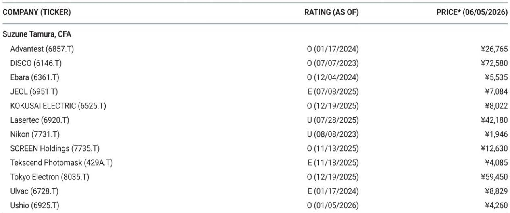
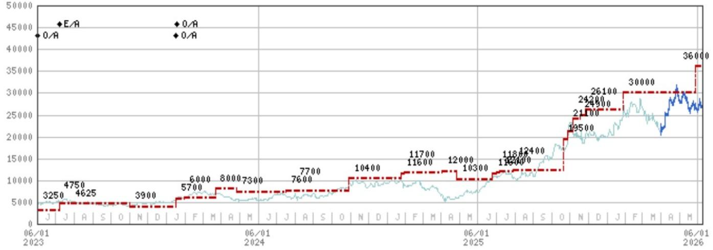
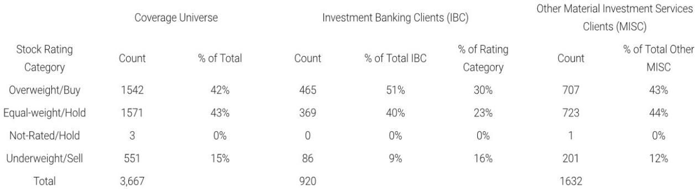

# 摩根斯坦利：市场低估的不是半导体设备周期性，而是结构性瓶颈的再定价

当台北的Computex和AI Summit刚刚落幕，许多参会者带回的共识是：半导体设备板块的热度似乎从2025年底至2026年初的亢奋中冷却下来。投资者态度变得“更加平衡”。但这份来自摩根斯坦利日本团队的调研笔记，真正想传递的信号恰好相反——市场正在犯一个典型的“半杯水”错误。

会议期间，投资者对存储周期的担忧在现货价格回升后明显消退，对2027年前的存储景气度几乎没有悲观声音。但真正值得关注的，不是周期是否延续，而是三个正在重塑半导体设备行业定价权的结构性变量：Agentic AI对DRAM需求的量级跳跃、铜墙(Cu Wall)迫使光互连提前成为技术瓶颈，以及日本设备商在定价能力上的沉默但剧烈变化。

这份报告最核心的判断是：半导体设备行业正在从“周期成长”切换为“结构成长”，而市场对这一切换的定价仍不充分。

## 1. 一颗Vera CPU的需求量级，正在改写DRAM的供需方程

摩根斯坦利台湾半导体分析师Charlie Chan从供应链确认的数据，值得每一个关注AI资本开支的人重新审视。NVIDIA的Vera CPU单颗可搭载1.5TB的LPDDR5X，是上一代Grace CPU的三倍。以200-400万颗产量估算，仅Vera一个产品线，就需要消耗2025年全球DRAM bit总需求的10%-16%。

这不是一个边际增量。这是在一个原本被认为供需趋于平衡的市场中，突然出现的、由单一产品驱动的结构性缺口。换算成产能，这相当于10-20万片/月的1cnm晶圆产能需求。考虑到先进DRAM产能的扩产周期和良率爬坡速度，这个数字意味着未来2-3年内，存储设备订单的可预见性远高于市场共识。

摩根斯坦利的调研显示，投资者对存储周期持续性的信心已因现货价格回升而增强，但真正支撑信心的应该是这类终端需求的量级变化，而非价格信号本身。后者只是结果，前者才是原因。

## 2. 铜墙逼近，光互连从可选项变为必选项

Marvell在Computex的主题演讲中详细阐释了“铜墙”概念，这是理解未来2-3年后端设备需求的关键框架。铜线传输在100G/lane速率下可以覆盖5米，足以连接机架内部设备；但当速率提升至200G时，传输距离缩短至2.5米；到了400G——预计2028年左右开始规模部署——这一距离将进一步压缩至1.25米。

标准机架高度约为2米。这意味着，当数据传输速率进入400G时代，铜线将无法完整覆盖机架内部的互联需求。光互连不再是性能升级的选项，而是物理约束下的唯一解。

这个转变的直接含义是：CPO（共封装光学）将从2027-2028年起成为后端设备市场的主要主题。摩根斯坦利引用了Teradyne的测算，CPO测试设备TAM将从2026年的1亿美元，跃升至2028年的3-7亿美元，此后随着规模部署将突破10亿美元。

报告特别强调了Advantest在CPO测试中的潜在受益，以及Disco在混合键合技术中的角色。但更重要的是，这一趋势意味着后端设备市场的增长逻辑正在从“跟随先进封装”转向“驱动下一代互联架构”。设备商的议价能力和估值框架需要重新评估。

## 3. Kokusai的保守指引背后，藏着中国需求的上行风险

在摩根斯坦利日本峰会上，Kokusai Electric给出了一个看似保守的指引：下半财年营收环比下降17%。但公司同时承认，这一指引存在上行空间——如果下半年环比持平，全年营收将从2800亿日元升至3000亿日元。

报告没有展开但值得深思的是，Kokusai的DRAM占比已从F3/23的18%升至F3/26的44%，而NAND占比从40%降至12%。这家公司正在从“NAND设备股”转型为“DRAM设备股”。而DRAM正是Agentic AI需求最直接受益的领域。

更重要的是，Kokusai在指引中对中国新兴公司和DRAM制造商的需求“仅谨慎纳入”。考虑到中国半导体自主化的加速，以及设备交期已延长至8个月，这一部分需求的上行风险很可能在1Q业绩公布时被证实。如果Kokusai在7-9月期间上调指引，将不仅是公司层面的利好，更可能是整个前道设备板块情绪修复的催化剂。

## 4. 定价权正在回归，但市场尚未充分反映

东京电子在峰会上并未排除涨价5-9%的可能性。这看似是一个技术性细节，但背后是设备行业竞争格局的深刻变化。

过去两年，市场对设备商的关注焦点一直是技术迭代和订单能见度，而利润率改善主要依赖规模效应。但摩根斯坦利指出，东京电子的价格上调尚未被充分计入股价。如果涨价帮助公司实现35%的营业利润率目标——当前摩根斯坦利预测为33%——这将是一个新的估值锚点。

报告没有回答的一个关键问题是：这种定价权是东京电子独有的，还是整个日本设备行业的趋势？从Kokusai、Disco到Advantest，日本设备商在各自细分领域的技术壁垒正在加深。如果行业整体定价能力回归，那么当前基于周期估值框架的定价模型可能全面低估了这些公司的结构性盈利能力。

## 5. 报告尚未完全回答的关键问题：竞争格局的终局

报告提到了一个值得关注的细节：在GPU测试领域，Advantest的优势“依然稳固”，且摩根斯坦利“预计不会出现100-0的局面”。这意味着市场此前对竞争格局的担忧可能过度了。

但报告也承认，在CPO测试领域，“竞争格局尚未确定”。这是整份报告中最需要后续跟踪的变量。如果CPO测试市场在2028年达到3-7亿美元，谁将主导这一市场？Advantest的技术领先能否转化为可持续的份额优势？Teradyne的1亿美元TAM预测是否过于保守？这些问题在报告中只是点到为止，但恰恰是决定2027年后设备板块估值分化程度的核心变量。

同样悬而未决的，还有Lasertec的A200HiT。报告认为投资者对这款产品的预期“过高”，并维持谨慎立场。但考虑到Lasertec在Actinic检测设备中的主导地位，以及北美客户对光掩膜投资的潜在需求，这一判断是否过于保守？市场需要更多信息来评估Lasertec的增长路径。

## 6. 一个更清晰的观察框架

对于关注半导体设备的投资者，这份报告提供了一个三层观察框架：

第一层，短期信号看指引修正。Kokusai的2H指引是否在1Q业绩时上调，将直接验证中国需求和存储周期的强度。这是未来2-3个月最明确的催化剂。

第二层，中期结构看CPO。2027-2028年的技术拐点正在提前被市场定价。Advantest在CPO测试中的受益程度，以及Disco在混合键合中的角色，将是后端设备投资的核心叙事。

第三层，长期定价看利润率。如果东京电子的涨价趋势扩散至全行业，设备股将从“订单驱动”转向“利润率驱动”，估值中枢可能系统性上移。这是市场目前讨论最少、但潜在影响最大的变量。

这三个层次相互独立，但共同指向一个结论：当前市场的“平衡”姿态，很可能低估了结构性变量正在累积的定价力。

这篇报告的完整版本还包含了对Advantest、Lasertec、东京电子等公司的详细估值方法和风险分析，以及对CPO产业链各环节的定量测算。这些内容在本文中只能触及冰山一角。如果你想进一步讨论Vera CPU对DRAM供需的具体影响、CPO测试设备TAM的拆分逻辑，或者日本设备商的竞争壁垒如何量化，欢迎来星球微信群里继续讨论。我们会在群内分享完整的研报解读和原始图表，并围绕这些未解问题持续跟踪。

Personal reading notes and learning share only. Not investment advice.

