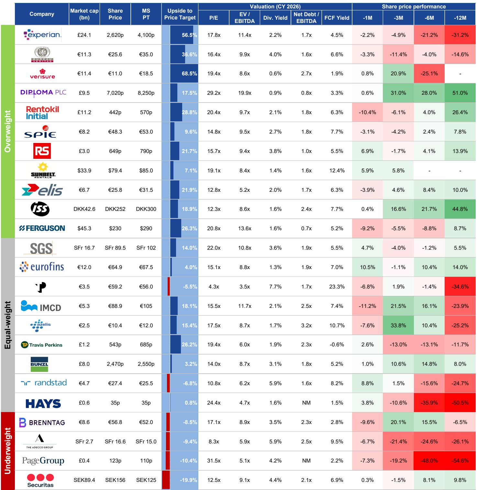
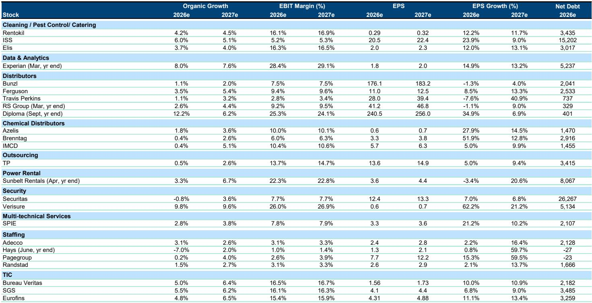
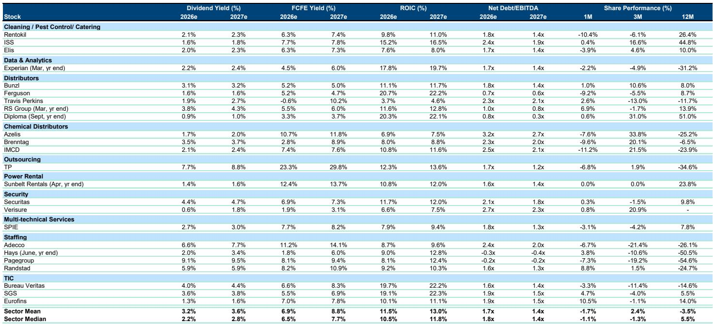

# 摩根斯坦利：欧洲猎头行业的真正风险不在需求，而在永久招聘的结构性萎缩

市场正在为欧洲人力资源服务公司的有机增长改善而松一口气，但这份摩根斯坦利的最新研报提出了一个更值得警惕的判断：临时招聘的回暖并不能掩盖永久招聘（perm recruitment）正在发生的结构性恶化，后者才是决定这些公司毛利率、经营杠杆和估值能否修复的真正变量。

这份报告发布于2026年6月，正值欧洲宏观环境因地缘政治不确定性再度升温之际。摩根斯坦利的分析师团队对欧洲人力资源板块进行了评级调整，其核心逻辑不是基于对经济周期的简单判断，而是基于对招聘业务结构本身的风险重估。

报告明确指出，尽管行业有机增长在过去几个季度有所改善，但改善主要来自临时招聘，而永久招聘的持续恶化正在侵蚀毛利率和经营利润。更关键的是，市场共识尚未充分反映这一风险。

这意味着什么？如果永久招聘的萎缩不是周期性的，而是结构性的——比如企业用人模式正在从“雇佣”转向“灵活用工”——那么当前估值所隐含的复苏预期可能过于乐观。

## 1. 临时招聘回暖是假象，永久招聘的恶化才是决定毛利率的关键

过去几个季度，欧洲人力资源公司的有机增长数据确实出现了改善迹象。但摩根斯坦利指出，股价对这些改善几乎没有反应。原因在于，投资者真正在等待的是毛利率的恢复和经营杠杆的改善，而这两者恰恰与永久招聘的占比高度相关。

永久招聘的毛利率远高于临时招聘。当一家公司从永久招聘中获得的收入占比下降时，整体毛利率就会承压。报告中的数据显示，Adecco的永久招聘占毛利润比例约为15-17%，Randstad约为16%，而Hays高达38%，Page Group更是达到72%。

这意味着，Page Group和Hays对永久招聘的依赖度远高于Adecco和Randstad。一旦永久招聘市场继续恶化，前者的毛利率和利润将受到更严重的冲击。

这就是为什么摩根斯坦利将Page Group的评级维持为Underweight，并将其目标价从195便士大幅下调至110便士。这不是一个简单的周期判断，而是对业务结构脆弱性的识别。

## 2. 杠杆与稀释风险正在放大不同公司之间的分化

在宏观环境不确定的背景下，财务杠杆和股本稀释风险成为区分公司质量的关键维度。

报告特别指出了Adecco的风险。其净债务/EBITDA比率在2024年达到2.8倍，而Randstad同期仅为1.5倍。更值得关注的是，Adecco通过股票股息（scrip dividend）来维持分红，这实际上是在稀释现有股东的权益。在盈利下行周期中，这种操作虽然能暂时缓解现金流压力，但长期会损害每股收益。

相比之下，Randstad的杠杆水平更低，且没有显著的稀释风险。这就是为什么摩根斯坦利将Randstad的评级从Underweight上调至Equal-weight，同时将Adecco从Equal-weight下调至Underweight。

这一调整的逻辑非常清晰：在不确定的环境中，低杠杆、低稀释风险的公司拥有更大的安全边际和战略灵活性。当行业整体面临压力时，资产负债表的质量将成为决定谁能在下一轮周期中率先反弹的关键。

## 3. 报告尚未完全回答的关键问题：AI对招聘行业的长期影响到底有多大

摩根斯坦利在报告中提到了AI风险，但并未深入展开。报告指出，对AI威胁的担忧与短期宏观逆风一起，继续压制估值。

这里有一个尚未被充分讨论的问题：AI对人力资源服务行业的影响，可能不是简单的“替代”，而是重塑整个招聘价值链。

一方面，AI可以自动化简历筛选、初步面试和候选人匹配，这直接威胁到传统猎头公司的核心价值主张。另一方面，AI也可能创造新的需求——比如帮助企业评估员工的技能缺口、设计灵活用工方案等。

但问题在于，这些新需求能否弥补传统业务被侵蚀的损失？目前看来，答案并不明确。Page Group和Hays这类以永久招聘为核心的公司，面临的AI冲击可能比想象中更大。而Randstad和Adecco这类以临时招聘为主的公司，虽然短期受影响较小，但长期也需要重新定义自己的角色。

这份报告没有给出明确的答案，但提出了一个值得持续跟踪的框架：AI风险不是统一的，它对不同业务结构的公司影响差异巨大。

## 4. 投资者的观察框架：不要只看增长，要看增长的结构

基于这份报告，我们可以提炼出一个更实用的观察框架，用于评估欧洲人力资源公司乃至更广泛的商业服务公司。

第一，拆解增长来源。有机增长是否改善并不重要，重要的是改善来自临时招聘还是永久招聘。如果改善主要来自临时招聘，毛利率和经营杠杆的修复将非常有限。

第二，评估业务结构脆弱性。永久招聘占比越高的公司，在宏观不确定性下的下行风险越大。这不是一个周期判断，而是一个结构判断。

第三，关注资产负债表质量。在盈利下行周期中，高杠杆和股权稀释风险会放大下行空间。低杠杆、低稀释风险的公司拥有更强的抗压能力和战略灵活性。

第四，不要忽视AI的长期影响。AI对招聘行业的影响可能比市场预期的更深远。它不会均匀地影响所有公司，而是会加速行业内部的分化。

## 5. 一个尚未被市场定价的风险：永久招聘的复苏可能比预期更慢

报告中最值得关注的未解问题，是永久招聘的复苏路径。

当前市场共识可能隐含了一个假设：随着宏观经济改善，企业会重新增加永久招聘。但摩根斯坦利的数据和分析暗示，情况可能并非如此简单。

Indeed的职位发布数据在多个欧洲关键市场持续恶化，法国、德国、英国和美国的职位空缺指数都在下降。同时，欧洲的宏观和地缘政治不确定性仍在上升。这意味着，企业可能更倾向于保持灵活用工模式，而非大规模增加正式雇员。

如果这种“灵活化”趋势是结构性的，那么永久招聘的复苏将比市场预期的更慢、更弱。这将直接影响到Page Group和Hays等公司的估值逻辑——它们目前的估值是否已经充分反映了这种结构性变化？

报告没有给出明确答案，但提出了一个值得深入探讨的问题。这正是研报阅读的价值所在：它不提供确定性的答案，而是提供更精确的问题框架。

---

**欢迎来知识星球微信群里继续讨论**：我们将在社群中分享这份摩根斯坦利报告的完整原始图表、更详细的估值数据，以及我们对欧洲人力资源行业未来6-12个月的跟踪框架。如果你对AI如何重塑招聘行业、或者如何评估不同公司之间的相对价值感兴趣，欢迎加入讨论。

Personal reading notes and learning share only. Not investment advice.

