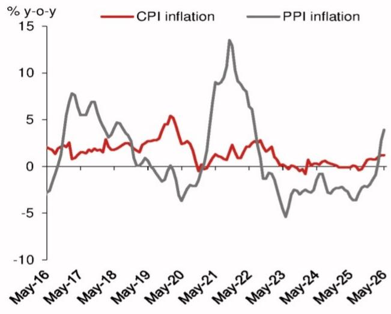
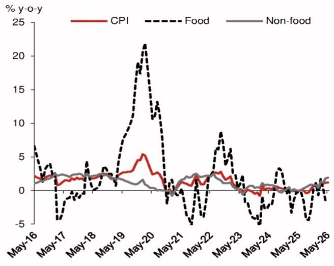
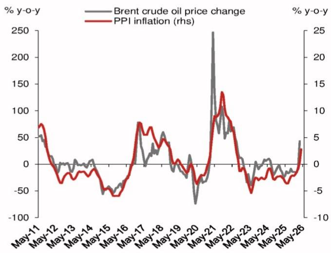
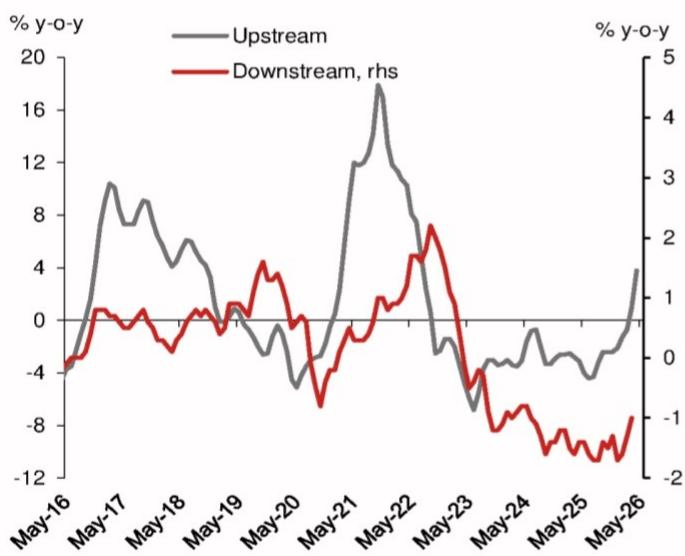
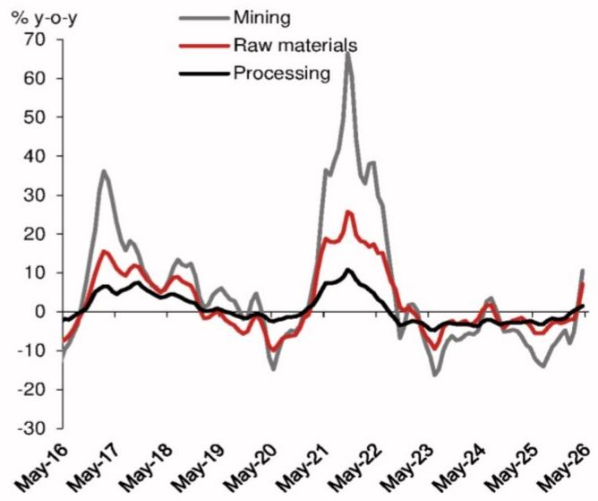

# China: CPI inflation stabilized in May while PPI inflation rose further

CPI inflation stabilized at 1.2% y-o-y in May, unchanged from April and slightly missing expectations (Consensus: 1.3%; NOM: 1.4%). PPI inflation rose further to 3.9% y-o-y in May from 2.8% in April, in line with expectations (Consensus: 3.9%; NOM: 4.0%).

Despite the boost from the energy component, CPI inflation remained flat, weighed on by food and core prices. According to the NBS, energy prices contributed more than half of headline CPI inflation in May. Core prices were dragged lower by services prices, despite some emerging support from consumer electronic products due to rising chip prices. Meanwhile, food prices remained a serious drag, as pork prices failed to rebound after hitting a 16-year low.

We estimate price inflation in energy and AI-related materials together boosted headline PPI inflation in May (3.9% y-o-y) by 3.96pp, excluding which PPI inflation would have been negative. We estimate oil-related industries, which account for around 14% of the PPI basket, boosted May PPI inflation by 1.90pp. Amid global demand for AI-related products and electrification demand, non-ferrous mining and processing industries contributed 1.80pp to headline PPI inflation, and tech manufacturing industries contributed 0.26pp to headline PPI inflation.

## Raising PPI and CPI inflation forecasts

Since our latest upward revision to inflation forecasts in early March, oil prices have surged to new highs. Despite the recent easing of inflation in sequential terms, prices remain elevated and supply disruptions remain intact, boosting headline inflation by raising manufacturing costs in oil-related industries and domestic retail fuel prices. At the same time, the ongoing AI supercycle is also exerting upward pressure on the prices of technology products.

In light of these latest developments, we raise our quarterly PPI inflation forecasts to 3.8% y-o-y, 4.5% and 2.2% for Q2-Q4, respectively, up from 2.4%, 1.5% and 1.0%. Our 2026 full-year forecast for PPI inflation is thus lifted to 2.5% from 1.0%. We also raise our quarterly forecasts for CPI inflation to 1.2% y-o-y, 0.5% and 0.5% for Q2-Q4, respectively, from 0.9%, 0.5% and 0.3%, with our full-year CPI forecast lifted to 0.9% from 0.6%.

## Beijing will not become complacent following the end of deflation

Although Beijing might have breathed a sigh of relief when deflation finally ended, it may not take much comfort, as China is a net importer of chips and the world's biggest net importer of energy. The worsening terms of trade could shrink its balance of payments at a macro level and squeeze most domestic producers and consumers. The broad-based disappointment from April activity data underscores that externally led reflation cannot extricate China from its economic woes. Household consumption, already sapped by payback effects from the trade-in program and the perennial property bust, could be further curtailed by supply-driven reflation, while industrial production could be impaired by supply disruptions from energy and chemical raw materials. We expect Beijing to maintain accommodative monetary policy and ramp up fiscal spending to boost domestic demand in coming months. That said, given flush market liquidity and falling CGB yields, we have pushed out our forecast for RRR and rate cuts to next year.

## Our forecast for June inflation data

We expect CPI inflation to remain flat at 1.2% y-o-y in June, as a smaller drag from food prices largely offset the smaller boost from energy prices. High-frequency data show that MARA agricultural food prices rebounded to 0.3% y-o-y in month-to-date June from -0.7% in May, primarily driven by egg and chicken prices, while pork prices remained subdued. On the energy front, the NDRC cut retail petrol prices by RMB525 per tonne in month-to-date June in response to a sequential easing of global oil prices, in contrast to the RMB325 per tonne hike in June last year. This could lessen the boost to the CPI basket

## Research Analysts

Asia Economics

Hannah Liu - NIHK

hannah.liu@NOM.com

+852 2252 1082

Jing Wang - NIHK

jing.wang@NOM.com

+852 2252 1011

Harrington Zhang - NIHK

harrington.zhang@NOM.com

+852 2252 2057

Ting Lu - NIHK

ting.lu@NOM.com

+852 2252 1306

from the energy category.

We expect PPI inflation to rise further to $4.7\%$ y-o-y in June, in view of the continued pass-through from elevated global oil and chip prices, as well as a low base from last year. Brent oil prices eased to $37.7\%$ y-o-y in month-to-date June from $68.3\%$ in May and $77.9\%$ in April, partly driven by a high base from last year due to geopolitical tensions. Despite some easing in oil prices, supply disruptions to raw material industries remain intact, which continue to exert upward pressure to headline PPI inflation.

In addition to global oil prices, rising chip prices have become an emerging force exerting upward pressure on PPI inflation. The surge in chip prices passes through to headline PPI through two channels: 1) directly raising domestic producer prices of semiconductor products, including memory chips and SoCs; and 2) raising producer prices of electronic products that use chips as inputs, including laptops, smartphones and AI appliances. Both channels are reflected in the PPI inflation of the "computers, communication equipment and other electronic equipment manufacturing sector".

## CPI inflation stabilized in May

CPI inflation was unchanged at 1.2% y-o-y in May, slightly below market expectations (Consensus: 1.3%; NOM: 1.4%). In sequential terms, CPI inflation fell to -0.1% m-o-m in May from 0.3% in April (May 2025: -0.2%). Amid elevated global oil prices and a low base, gasoline prices increased by 23.5% y-o-y in May, accounting for about half of headline CPI inflation. Food remains a clear drag, with its inflation at -1.7% y-o-y in May, down from -1.6% in April, while nonfood inflation edged up to 1.9% y-o-y in May from 1.8% y-o-y in April. Excluding food and energy, core CPI inflation inched down to 1.1% y-o-y in May from 1.2% in April. Services CPI inflation also moderated to 0.8% y-o-y in May from 0.9% in April.

## Oil price inflation rose further on a low base, despite reduced sequential momentum

Amid a slight easing of inflationary pressures from global oil prices, domestic gasoline prices fell by $0.3\%$ m-o-m in May, following the $12.6\%$ increase in April, with its contribution to headline CPI inflation declining to $-0.01\mathrm{pp}$ in May from 0.39pp in April. Due to a low base, gasoline price inflation increased further to $23.5\%$ y-o-y in May from $19.3\%$ in April, contributing 0.66pp to headline inflation, up from 0.56pp in April and 0.11pp in March.

## Gold's contribution is moderating

Prices of gold-related products increased by $39.0\%$ y-o-y in May, down further from increases of $46.9\%$ in April, $65.8\%$ in March, $76.6\%$ in February and $77.4\%$ in January. As the weighting of gold in the core CPI basket is about $0.6\%$ (see China: A more realistic picture of core CPI inflation after excluding gold, 26 December 2025), we estimate gold contributed 0.23pp y-o-y to core CPI inflation. Thus, excluding gold, core CPI inflation is still around $0.9\%$ y-o-y in May, unchanged from April.

## Pork remains a substantial drag

Among food, pork remains the largest drag. Pork inflation fell further to $-16.1\%$ y-o-y in May from $-15.2\%$ in April and $-11.5\%$ in March, contributing a -0.31pp to headline CPI inflation. Given the abundant pork supply and weak domestic demand, pork prices should remain under pressure in the near term. According to the MARA, the latest data show that growth in the number of hogs slaughtered rebounded to $26.7\%$ y-o-y in April from $14.7\%$ in March.

## Other key items

Due to the seasonal decline in travels after the Labour Day holiday, prices of vehicle rentals and flight tickets shifted from increases of 8.6% m-o-m and 29.2%, respectively, in April to decreases of 6.8% and 6.3% in May, contributing a combined -0.04pp to headline CPI inflation. Owing to reduced production capacity and a supply shortage, egg prices rose by 6.1% m-o-m, with their contribution to headline CPI inflation at 0.03pp. With strong demand for AI-related products, prices of mobile phones and tablet computers increased modestly by 1.6% m-o-m and 1.1%, respectively, in May.

## PPI inflation rose strongly in May

PPI inflation surged to 3.9% y-o-y in May from 2.8% in April, in line with market expectations (Consensus: 3.9%; NOM: 4.0%). This marks three consecutive months of positive PPI readings and the highest monthly reading since July 2022, driven by the

ongoing global energy shock caused by the double blockade of the Strait of Hormuz. Sequential PPI inflation slowed to $0.5\%$ m-o-m in May from $1.7\%$ in April, suggesting some inflationary pressures are moderating.

The rise in PPI inflation was concentrated entirely in upstream sectors, while prices in downstream sectors remained subdued, which shows inflationary pressures are not yet broadening across the economy. Markets should interpret the strong reading with a certain degree of caution.

PPI inflation in upstream sectors improved to 5.2% y-o-y in May from 3.8% in April, contributing 4.08pp to the headline PPI inflation reading. Within upstream sectors, PPI inflation across mining and raw materials sectors increased strongly to 15.8% y-o-y and 9.2% y-o-y, respectively, in May from 10.6% and 7.1% in April. However, PPI inflation in the manufacturing sector rose only moderately to 2.3% y-o-y in May from 1.5% in April, notably lagging the increase in headline PPI inflation. For downstream sectors (consumer goods), PPI inflation remained negative at -0.8% y-o-y in May, albeit up slightly from -1.0% in April, signalling still-muted price pressures on the consumer side.

In specific sectors, PPI inflation in the petroleum and natural gas extraction industry surged further to $35.7\%$ y-o-y in May from $28.6\%$ in April. PPI inflation in petroleum, coal and other fuel processing increased to $18.4\%$ y-o-y in May from $14.2\%$ in April. PPI inflation in the ferrous and non-ferrous metals smelting and pressing sectors improved slightly to $1.0\%$ y-o-y and $24.0\%$ y-o-y, respectively, in May from $-1.1\%$ and $22.5\%$ in April.

According to the NBS, non-ferrous metal mining (36.5% y-o-y), non-ferrous metal smelting and pressing (24.0%), coal mining and washing (10.0%), electrical machinery and equipment manufacturing (4.5%), computer, communications and other electronic equipment manufacturing (2.1%), and ferrous metal smelting and rolling (1.0%) together contributed 2.56pp to headline PPI in May, 0.51pp more than in April. On external factors, rising global crude oil prices have pushed up prices in domestic petroleum-related industries. Oil and natural gas extraction (35.7% y-o-y), petroleum/coal and other fuel processing increased (18.4%), and chemical raw materials and chemical products manufacturing (12.7%) contributed around 1.96pp to the year-on-year PPI increase in May, 0.46pp more than in April.

Fig. 1: Selected sector breakdown and contribution of PPI inflation

<table><tr><td>Categories</td><td>Weight %</td><td>Contribution (May) pp</td><td>May-26</td><td>Apr-26</td><td>Mar-26</td><td>Feb-26</td><td>Jan-26</td></tr><tr><td colspan="8">PPI</td></tr><tr><td colspan="8">Oil-related</td></tr><tr><td>Petroleum &amp; Natural Gas Mining</td><td>0.8</td><td>0.29</td><td>35.7</td><td>28.6</td><td>5.2</td><td>-12.9</td><td>-16.7</td></tr><tr><td>Petroleum, Coal and Other Fuel Processing</td><td>3.8</td><td>0.71</td><td>18.4</td><td>14.2</td><td>-4.5</td><td>-12.0</td><td>-11.5</td></tr><tr><td>Chemical Material &amp; Product Manufacturing</td><td>6.5</td><td>0.83</td><td>12.7</td><td>8.9</td><td>-0.3</td><td>-3.7</td><td>-5.0</td></tr><tr><td>Chemical Fiber Manufacturing</td><td>0.7</td><td>0.06</td><td>8.5</td><td>5.4</td><td>-2.3</td><td>-6.0</td><td>-6.4</td></tr><tr><td>Rubber &amp; Plastic Product Manufacturing</td><td>2.2</td><td>0.01</td><td>0.5</td><td>-1.3</td><td>-3.4</td><td>-4.2</td><td>-4.1</td></tr><tr><td colspan="8">Non-ferrous-related</td></tr><tr><td>Non Ferrous Metal Mining</td><td>0.3</td><td>0.11</td><td>36.5</td><td>38.9</td><td>36.4</td><td>30.2</td><td>22.7</td></tr><tr><td>Non Ferrous Metal Smelting &amp; Pressing</td><td>7.0</td><td>1.69</td><td>24.0</td><td>22.5</td><td>22.4</td><td>22.1</td><td>17.1</td></tr><tr><td colspan="8">Ferrous-related</td></tr><tr><td>Ferrous Metal Mining</td><td>0.3</td><td>0.01</td><td>3.3</td><td>1.3</td><td>0.1</td><td>1.0</td><td>3.0</td></tr><tr><td>Ferrous Metal Smelting &amp; Pressing</td><td>5.6</td><td>0.06</td><td>1.0</td><td>-1.1</td><td>-2.5</td><td>-3.4</td><td>-3.7</td></tr><tr><td colspan="8">Coal-related</td></tr><tr><td>Coal Mining</td><td>1.9</td><td>0.19</td><td>10.0</td><td>3.1</td><td>-2.2</td><td>-7.0</td><td>-9.8</td></tr><tr><td>Non-metal Mineral Smelting &amp; Pressing</td><td>0.3</td><td>-0.01</td><td>-3.4</td><td>-4.1</td><td>-4.2</td><td>-5.0</td><td>-4.6</td></tr><tr><td>Non-metal Mineral Product Manufacturing</td><td>3.3</td><td>-0.17</td><td>-5.1</td><td>-5.5</td><td>-4.9</td><td>-4.9</td><td>-5.4</td></tr><tr><td colspan="8">Selected manufacturing products</td></tr><tr><td>Computer, Communication &amp; Other Electronic Equipment Manufacturing</td><td>12.5</td><td>0.26</td><td>2.1</td><td>1.5</td><td>0.4</td><td>-0.9</td><td>-1.6</td></tr><tr><td>Electrical Machinery &amp; Equipment Manufacturing</td><td>8.4</td><td>0.00</td><td>0.0</td><td>3.6</td><td>3.2</td><td>2.0</td><td>0.8</td></tr><tr><td>Automobile Manufacturing</td><td>8.0</td><td>-0.16</td><td>-2.0</td><td>-2.0</td><td>-2.5</td><td>-2.4</td><td>-2.5</td></tr><tr><td>Fabricated Metal Product Manufacturing</td><td>3.4</td><td>0.03</td><td>0.8</td><td>0.5</td><td>0.2</td><td>-0.2</td><td>-0.7</td></tr><tr><td>General Equipment Manufacturing</td><td>3.7</td><td>-0.03</td><td>-0.9</td><td>-1.0</td><td>-1.2</td><td>-1.1</td><td>-1.3</td></tr><tr><td>Special Equipment Manufacturing</td><td>2.8</td><td>0.00</td><td>0.0</td><td>-0.9</td><td>-1.0</td><td>-1.0</td><td>-0.9</td></tr><tr><td>Rail, Ship, Aircraft &amp; Other Transport Equipment Manufacturing</td><td>1.3</td><td>0.00</td><td>-0.3</td><td>-0.3</td><td>-0.1</td><td>-0.3</td><td>-0.3</td></tr></table>

Note: Sector weight is calculated by their 2025 industrial revenue.  
Source: Wind, NOM Global Economics.

Fig. 2: A breakdown of inflation by major component

<table><tr><td rowspan="2">Categories</td><td colspan="7">% y-o-y</td></tr><tr><td>May 26</td><td>Apr 26</td><td>Mar 26</td><td>Q1 26</td><td>Q4 25</td><td>2025</td><td>2024</td></tr><tr><td>CPI</td><td>1.2</td><td>1.2</td><td>1.0</td><td>0.9</td><td>0.6</td><td>0.0</td><td>0.2</td></tr><tr><td>Food</td><td>-1.7</td><td>-1.6</td><td>0.3</td><td>0.4</td><td>-0.5</td><td>-1.5</td><td>-0.6</td></tr><tr><td>Grain</td><td>-0.3</td><td>-0.3</td><td>-0.3</td><td>-0.3</td><td>-0.5</td><td>-1.0</td><td>-0.1</td></tr><tr><td>Vegetable</td><td>1.6</td><td>-0.5</td><td>4.9</td><td>7.6</td><td>8.5</td><td>-3.9</td><td>5.0</td></tr><tr><td>Pork</td><td>-16.1</td><td>-15.2</td><td>-11.5</td><td>-11.3</td><td>-15.2</td><td>-6.1</td><td>7.7</td></tr><tr><td>Aquatic</td><td>0.6</td><td>1.3</td><td>3.7</td><td>3.5</td><td>1.7</td><td>1.4</td><td>1.0</td></tr><tr><td>Egg</td><td>6.6</td><td>0.5</td><td>-3.1</td><td>-5.2</td><td>-12.3</td><td>-7.4</td><td>-4.4</td></tr><tr><td>Milk</td><td>-1.2</td><td>-1.2</td><td>-0.7</td><td>-0.9</td><td>-1.7</td><td>-1.5</td><td>-1.6</td></tr><tr><td>Fruit</td><td>-2.2</td><td>-1.0</td><td>4.0</td><td>4.3</td><td>1.0</td><td>1.2</td><td>-3.5</td></tr><tr><td>Non-Food</td><td>1.9</td><td>1.8</td><td>1.2</td><td>0.9</td><td>0.8</td><td>0.4</td><td>0.4</td></tr><tr><td>Apparel</td><td>1.4</td><td>1.5</td><td>1.6</td><td>1.8</td><td>1.8</td><td>1.5</td><td>1.4</td></tr><tr><td>Residence</td><td>-0.2</td><td>-0.2</td><td>-0.2</td><td>-0.2</td><td>0.0</td><td>0.1</td><td>0.1</td></tr><tr><td>Household articles &amp; services</td><td>1.8</td><td>1.4</td><td>1.5</td><td>2.3</td><td>2.1</td><td>0.9</td><td>0.5</td></tr><tr><td>Transportation and communication</td><td>5.4</td><td>4.6</td><td>0.9</td><td>-1.1</td><td>-2.1</td><td>-2.6</td><td>-1.9</td></tr><tr><td>Education, culture and recreation</td><td>1.3</td><td>1.3</td><td>1.1</td><td>1.0</td><td>0.9</td><td>0.8</td><td>1.5</td></tr><tr><td>Medicine and healthcare services</td><td>2.1</td><td>2.2</td><td>1.9</td><td>1.8</td><td>1.6</td><td>0.8</td><td>1.3</td></tr><tr><td>Other goods and services</td><td>9.9</td><td>11.0</td><td>13.5</td><td>14.1</td><td>14.8</td><td>9.3</td><td>3.8</td></tr><tr><td>Goods</td><td>1.6</td><td>1.4</td><td>1.3</td><td>0.9</td><td>0.5</td><td>-0.3</td><td>-0.1</td></tr><tr><td>Services</td><td>0.8</td><td>0.9</td><td>0.8</td><td>0.8</td><td>0.7</td><td>0.5</td><td>0.7</td></tr><tr><td>Core CPI (excluding food and energy)</td><td>1.1</td><td>1.2</td><td>1.1</td><td>1.2</td><td>1.2</td><td>0.7</td><td>0.5</td></tr><tr><td>PPI</td><td>3.9</td><td>2.8</td><td>0.5</td><td>-0.6</td><td>-2.1</td><td>-2.6</td><td>-2.2</td></tr><tr><td>Upstream</td><td>5.2</td><td>3.8</td><td>1.0</td><td>-0.3</td><td>-2.3</td><td>-3.0</td><td>-2.5</td></tr><tr><td>Mining</td><td>15.8</td><td>10.6</td><td>2.0</td><td>-3.8</td><td>-6.2</td><td>-9.0</td><td>-2.9</td></tr><tr><td>Raw materials</td><td>9.2</td><td>7.1</td><td>1.1</td><td>-0.9</td><td>-2.7</td><td>-3.4</td><td>-1.7</td></tr><tr><td>Manufacturing</td><td>2.3</td><td>1.5</td><td>0.9</td><td>0.3</td><td>-1.8</td><td>-2.4</td><td>-2.9</td></tr><tr><td>Downdstream</td><td>-0.8</td><td>-1.0</td><td>-1.3</td><td>-1.5</td><td>-1.4</td><td>-1.5</td><td>-1.1</td></tr><tr><td>Food</td><td>-1.8</td><td>-1.9</td><td>-1.7</td><td>-1.8</td><td>-1.5</td><td>-1.6</td><td>-1.1</td></tr><tr><td>Apparel</td><td>-1.0</td><td>-1.1</td><td>-1.1</td><td>-0.9</td><td>-0.2</td><td>-0.1</td><td>-0.1</td></tr><tr><td>Daily articles</td><td>-1.0</td><td>-1.1</td><td>-1.4</td><td>-1.7</td><td>1.2</td><td>0.8</td><td>0.0</td></tr><tr><td>Durable goods</td><td>0.0</td><td>-0.3</td><td>-1.0</td><td>-1.5</td><td>-3.4</td><td>-3.3</td><td>-2.2</td></tr></table>

Source: NBS, Wind, NOM Global Economics

Fig. 3: CPI and PPI inflation  

line chart

| Date   | CPI inflation | PPI inflation |
|--------|---------------|---------------|
| May-16 | 2.0           | -3.0          |
| May-17 | 1.5           | 8.0           |
| May-18 | 2.0           | 4.0           |
| May-19 | 1.0           | 0.0           |
| May-20 | 5.0           | -4.0          |
| May-21 | 0.0           | 14.0          |
| May-22 | 3.0           | 0.0           |
| May-23 | 1.0           | -5.0          |
| May-24 | 0.0           | -3.0          |
| May-25 | 0.5           | -4.0          |
| May-26 | 1.0           | 4.0           |

Source: Wind and NOM Global Economics.

Fig. 4: CPI inflation: Food vs non-food  

line chart

| Date   | CPI  | Food | Non-food |
|--------|------|------|----------|
| May-16 | 2.0  | 6.0  | 1.0      |
| May-17 | 1.5  | -4.0 | 2.0      |
| May-18 | 2.5  | 3.0  | 2.0      |
| May-19 | 3.0  | 8.0  | 1.5      |
| May-20 | 5.0  | 22.0 | 1.0      |
| May-21 | 1.0  | -3.0 | 2.0      |
| May-22 | 2.0  | -5.0 | 1.5      |
| May-23 | 3.0  | 8.0  | 1.0      |
| May-24 | -1.0 | -4.0 | 0.5      |
| May-25 | 0.5  | 3.0  | 0.5      |
| May-26 | 1.0  | -3.0 | 1.0      |

Source: Wind, NOM Global Economics.

Fig. 5: Price inflation of major food categories  

line chart

| Date   | Fruit | Pork | Egg  | Vegetable |
|--------|-------|------|------|-----------|
| May-15 | -10   | 15   | -15  | 5         |
| May-16 | -5    | 30   | -5   | 10        |
| May-17 | 5     | -10  | 10   | -20       |
| May-18 | 10    | -5   | 20   | 5         |
| May-19 | 40    | 100  | 5    | 10        |
| May-20 | -30   | 140  | -5   | 15        |
| May-21 | 5     | -40  | 15   | 5         |
| May-22 | 10    | 50   | 10   | 20        |
| May-23 | 5     | -30  | -5   | 5         |
| May-24 | 0     | 20   | -10  | 10        |
| May-25 | 5     | -10  | -5   | 5         |
| May-26 | 0     | -20  | -10  | 10        |

Source: Wind, NOM Global Economics.

Fig. 6: Brent oil price and PPI inflation  

line chart

| Date   | Brent crude oil price change | PPI inflation (rhs) |
|--------|------------------------------|---------------------|
| May-11 | ~50                          | ~7                  |
| May-12 | ~0                           | ~-3                 |
| May-13 | ~-20                         | ~-4                 |
| May-14 | ~-10                         | ~-5                 |
| May-15 | ~-30                         | ~-6                 |
| May-16 | ~-50                         | ~-7                 |
| May-17 | ~-20                         | ~8                  |
| May-18 | ~50                          | ~6                  |
| May-19 | ~30                          | ~4                  |
| May-20 | ~-50                         | ~-6                 |
| May-21 | ~250                         | ~13                 |
| May-22 | ~100                         | ~14                 |
| May-23 | ~-50                         | ~-6                 |
| May-24 | ~0                           | ~-4                 |
| May-25 | ~20                          | ~-3                 |
| May-26 | ~40                          | ~3                  |

Source: Wind, NOM Global Economics

Fig. 7: PPI inflation: upstream and downstream  

line chart

| Date   | Upstream | Downstream, rhs |
|--------|----------|-----------------|
| May-16 | -4       | -4              |
| May-17 | 10       | 0               |
| May-18 | 8        | 0               |
| May-19 | 6        | 0               |
| May-20 | -4       | -4              |
| May-21 | 12       | 0               |
| May-22 | 18       | 5               |
| May-23 | -6       | -6              |
| May-24 | -4       | -8              |
| May-25 | -2       | -10             |
| May-26 | 4        | -8              |

Source: NBS, Wind, NOM Global Economics

Fig. 8: PPI inflation by upstream sector  

line chart

| Date   | Mining | Raw materials | Processing |
|--------|--------|---------------|----------|
| May-16 | -10    | -5            | 0        |
| May-17 | 35     | 15            | 5        |
| May-18 | 10     | 5             | 0        |
| May-19 | 5      | 0             | -5       |
| May-20 | -15    | -10           | -5       |
| May-21 | 35     | 20            | 0        |
| May-22 | 65     | 25            | 10       |
| May-23 | -15    | -5            | -5       |
| May-24 | 0      | 0             | 0        |
| May-25 | -10    | -5            | -5       |
| May-26 | 10     | 5             | 0        |

Source: NBS, Wind, NOM Global Economics

## Appendix A-1

This report has been produced by NOM International (Hong Kong) Ltd. (NIHK), Hong Kong.

See Disclaimers for NOM Group entity details.

## Analyst Certification

We, Hannah Liu, Jing Wang, Harrington Zhang and Ting Lu, hereby certify (1) that the views expressed in this Research report accurately reflect our personal views about any or all of the subject securities or issuers referred to in this Research report, (2) no part of our compensation was, is or will be directly or indirectly related to the specific recommendations or views expressed in this Research report and (3) no part of our compensation is tied to any specific investment banking transactions performed by NOM Securities International, Inc., NOM International plc or any other NOM Group company.

## Important Disclosures

## Online availability of research and conflict-of-interest disclosures

NOM Group research is available on www.NOMnow.com/research, Bloomberg, Capital IQ, Factset, LSEG.

Important disclosures may be read at http://go.NOMnow.com/research/m/Disclosures or requested from NOM Securities International, Inc. If you have any difficulties with the website, please email grpsupport@NOM.com for help.

The analysts responsible for preparing this report have received compensation based upon various factors including the firm's total revenues, a portion of which is generated by Investment Banking activities. Unless otherwise noted, the non-US analysts listed at the front of this report are not registered/qualified as research analysts under FINRA rules, may not be associated persons of NSI, and may not be subject to FINRA Rule 2241 restrictions on communications with covered companies, public appearances, and trading securities held by a research analyst account.

NOM Global Financial Products Inc. (NGFP) NOM Derivative Products Inc. (NDP) and NOM International plc. (NIplc) are registered with the Commodities Futures Trading Commission and the National Futures Association (NFA) as swap dealers. NGFP, NDPI, and NIplc are generally engaged in the trading of swaps and other derivative products, any of which may be the subject of this report.

## Disclaimers

This publication contains material that has been prepared by the NOM Group entity identified on page 1 and, if applicable, with the contributions of one or more NOM Group entities whose employees and their respective affiliations are specified on page 1 or identified elsewhere in this publication. The term "NOM Group" used herein refers to NOM Holdings, Inc. and its affiliates and subsidiaries including: (a) NOM Securities Co., Ltd. ('NSC') Tokyo, Japan, (b) NOM Financial Products Europe GmbH ('NFPE'), Germany, (c) NOM International plc ('NIplc'), UK, (d) NOM Securities International, Inc. ('NSI'), New York, US, (e) NOM International (Hong Kong) Ltd. ('NIHK'), Hong Kong, (f) NOM Financial Investment (Korea) Co., Ltd. ('NFIK'), Korea (Information on NOM analysts registered with the Korea Financial Investment Association ('KOFIA') can be found on the KOFIA Intranet at http://dis.kofia.or.kr, (g) NOM Singapore Ltd. ('NSL'), Singapore (Registration number 197201440E, regulated by the Monetary Authority of Singapore) (h) NOM Australia Ltd. ('NAL'), Australia (ABN 48 003 032 513), regulated by the Australian Securities and Investment Commission ('ASIC') and holder of an Australian financial services licence number 246412, (i) NOM Securities Malaysia Sdn. Bhd. ('NSM'), Malaysia, (j) NIHK, Taipei Branch ('NITB'), Taiwan, (k) NOM Financial Advisory and Securities (India) Private Limited ('NFASL'), Mumbai, India (Registered Address: Ceejay House, Level 11, Plot F, Shivsagar Estate, Dr. Annie Besant Road, Worli, Mumbai- 400 018, India; Tel: 91 22 4037 4037, Fax: 91 22 4037 4111; CIN No: U74140MH2007PTC169116, SEBI Registration No. for Stock Broking activities : INZ000255633; SEBI Registration No. for Merchant Banking : INM000011419; SEBI Registration No. for Research: INH000001014 - Compliance Officer: Ms. Pratiksha Tondwalkar, 91 22 40374904, grievance email: investorgrievancesra@NOM.com Webpage: LINK

For reports with respect to Indian public companies or authored by India-based NFASL research analysts: (i) Investment in securities markets is subject to market risks. Read all the related documents carefully before investing. (ii) Registration granted by SEBI, and certification from NISM in no way guarantee performance of the intermediary or provide any assurance of returns to investors. (iii) NFASL terms and conditions for availing research services is disclosed on NFASL webpage.

(I) NOM Fiduciary Research & Consulting Co., Ltd. ('NFRC') Tokyo, Japan. (m) NOM Orient International Securities Co., Ltd ("NOI"), is a majority owned joint venture amongst NOM Group, Orient International (Holding) Co., Ltd, and Shanghai Huangpu Investment Holding (Group) Co., Ltd. In accordance with the laws of the People's Republic of China ("PRC", excluding Hong Kong, Macau and Taiwan, for the purpose of this document), NOI is licensed in the PRC to provide securities research and investment recommendations and it operates independently from the other members of the NOM Group; in particular, NOI's interests in PRC securities are not disclosed to, or aggregated with the holdings of, any other NOM Group entities and the interests in PRC securities of other NOM Group entities are not disclosed to, or aggregated with the holdings of, NOI. An individual name printed next to NOI on the front page of a research report indicates that individual is employed by NOI to provide research assistance to NIHK under a research partnership agreement. 'NSFSPL' next to an employee's name on the front page of a research report indicates that the individual is employed by NOM Structured Finance Services Private Limited to provide assistance to certain NOM entities under inter-company agreements. 'Verdhana' next to an individual's name on the front page of a research report indicates that the individual is employed by PT Verdhana Sekuritas Indonesia ('Verdhana') to provide research assistance to NIHK under a research partnership agreement and neither Verdhana nor such individual is licensed outside of Indonesia.

THIS MATERIAL IS: (I) FOR YOUR PRIVATE INFORMATION, AND WE ARE NOT SOLICITING ANY ACTION BASED UPON IT; (II) NOT TO BE CONSTRUED AS AN OFFER TO SELL OR A SOLICITATION OF AN OFFER TO BUY ANY SECURITIES IN ANY JURISDICTION WHERE SUCH OFFER OR SOLICITATION WOULD BE ILLEGAL; AND (III) OTHER THAN DISCLOSURES RELATING TO THE NOM GROUP, BASED UPON INFORMATION FROM SOURCES THAT WE CONSIDER RELIABLE, BUT HAS NOT BEEN INDEPENDENTLY VERIFIED BY NOM GROUP.

Other than disclosures relating to the NOM Group, the NOM Group does not warrant, represent or undertake, express or implied, that the document is fair, accurate, complete, correct, reliable or fit for any particular purpose or merchantable, and to the maximum extent permissible by law and/or regulation, does not accept liability (in negligence or otherwise, and in whole or in part) for any act (or decision not to act) resulting from use of this document and related data. To the maximum extent permissible by law and/or regulation, all warranties and other assurances by the NOM Group are hereby excluded and the NOM Group shall have no liability (in negligence or otherwise, and in whole or in part) for any loss howsoever arising from the use, misuse, or distribution of this material or the information contained in this material or otherwise arising in connection therewith.

Opinions or estimates expressed are current opinions as of the original publication date appearing on this material and the information, including the opinions and estimates contained herein, are subject to change without notice. The NOM Group, however, expressly disclaims any obligation, and therefore is under no duty, to update or revise this document. Any comments or statements made herein are those of the author(s) and may differ from views held by other parties within NOM Group. Clients should consider whether any advice or recommendation in this report is suitable for their particular circumstances and, if appropriate, seek professional advice, including tax advice. The NOM Group does not provide tax advice.

The NOM Group, and/or its officers, directors, employees and affiliates, may, to the extent permitted by applicable law and/or regulation, deal as principal, agent, or otherwise, or have long or short positions in, or buy or sell, the securities, commodities or instruments, or options or other derivative instruments based thereon, of issuers or securities mentioned herein. The NOM Group companies may also act as market maker or liquidity provider (within the meaning of applicable regulations in the UK) in the financial instruments of the issuer. Where the activity of market maker is carried out in accordance with the definition given to it by specific laws and regulations of the US or other jurisdictions, this will be separately disclosed within the specific issuer disclosures.

This document may contain information obtained from third parties, including, but not limited to, ratings from credit ratings agencies such as Standard & Poor's. The NOM Group hereby expressly disclaims all representations, warranties or undertakings of originality, fairness, accuracy, completeness, correctness, merchantability or fitness for a particular purpose with respect to any of the information obtained from third parties contained in this material or otherwise arising in connection therewith, and shall not be liable (in negligence or otherwise, and in whole or in part) for any direct, indirect, incidental, exemplary, compensatory, punitive, special or consequential damages, costs, expenses, legal fees, or losses (including lost income or profits and opportunity costs) in connection with any use or misuse of any of the information obtained from third parties contained in this material or otherwise arising in connection therewith. Reproduction and distribution of third-party content in any form is prohibited except with the prior written permission of the related third-party. Third-party content providers do not, express or implied, guarantee the fairness, accuracy, completeness, correctness, timeliness or availability of any information, including ratings, and are not in any way responsible for any errors or omissions (negligent or otherwise), regardless of the cause, or for the results obtained from the use or misuse of such content. Third-party content providers give no express or implied warranties, including, but not limited to, any warranties of merchantability or fitness for a particular purpose or use. Third-party content providers shall not be liable (in negligence or otherwise, and in whole or in part) for any direct, indirect, incidental, exemplary, compensatory, punitive, special or consequential damages, costs, expenses, legal fees, or losses (including lost income or profits and opportunity costs) in connection with any use or misuse of their content, including ratings. Credit ratings are statements of opinions and are not statements of fact or recommendations to purchase hold or sell securities. They do not address the suitability of securities or the suitability of securities for investment purposes, and should not be relied on as investment advice. Any MSCI sourced information in this document is the exclusive property of MSCI Inc. ('MSCI'). Without prior written permission of MSCI, this information and any other MSCI intellectual property may not be duplicated, reproduced, re-disseminated, redistributed or used, in whole or in part, for any purpose whatsoever, including creating any financial products and any indices. This information is provided on an "as is" basis. The user assumes the entire risk of any use made of this information. MSCI, its affiliates and any third party involved in, or related to, computing or compiling the information hereby expressly disclaim all representations, warranties or undertakings of originality, fairness, accuracy,

completeness, correctness, merchantability or fitness for a particular purpose with respect to any of this material or the information contained in this material or otherwise arising in connection therewith. Without limiting any of the foregoing, in no event shall MSCI, any of its affiliates or any third party involved in, or related to, computing or compiling the information have any liability (in negligence or otherwise, and in whole or in part) for any damages of any kind. MSCI and the MSCI indexes are services marks of MSCI and its affiliates.

The intellectual property rights and any other rights, in Russell/NOM Japan Equity Index belong to NOM Fiduciary Research & Consulting Co., Ltd. ("NFRC") and FTSE Russell ("Russell"). NFRC and Russell do not guarantee fairness, accuracy, completeness, correctness, reliability, usefulness, marketability, merchantability or fitness of the Index, and do not account for business activities or services that any index user and/or its affiliates undertakes with the use of the Index.

Investors should consider this document as only a single factor in making their investment decision and, as such, the report should not be viewed as identifying or suggesting all risks, direct or indirect, that may be associated with any investment decision. NOM Group produces a number of different types of research product including, among others, fundamental analysis and quantitative analysis; recommendations contained in one type of research product may differ from recommendations contained in other types of research product, whether as a result of differing time horizons, methodologies or otherwise. The NOM Group publishes research product in a number of different ways including the posting of product on the NOM Group portals and/or distribution directly to clients. Different groups of clients may receive different products and services from the research department depending on their individual requirements.

Figures presented herein may refer to past performance or simulations based on past performance which are not reliable indicators of future or likely performance. Where the information contains an expectation, projection or indication of future performance and business prospects, such forecasts may not be a reliable indicator of future or likely performance. Moreover, simulations are based on models and simplifying assumptions which may oversimplify and not reflect the future distribution of returns. Any figure, strategy or index created and published for illustrative purposes within this document is not intended for “use” as a “benchmark” as defined by the European Benchmark Regulation.

Certain securities are subject to fluctuations in exchange rates that could have an adverse effect on the value or price of, or income derived from, the investment.

With respect to Fixed Income Research: Recommendations fall into two categories: tactical, which typically last up to three months; or strategic, which typically last from 6-12 months. However, trade recommendations may be reviewed at any time as circumstances change. 'Stop loss' levels for trades are also provided; which, if hit, closes the trade recommendation automatically. Prices and yields shown in recommendations are taken at the time of submission for publication and are based on either indicative Bloomberg, LSEG or NOM prices and yields at that time. The prices and yields shown are not necessarily those at which the trade recommendation can be implemented.

The securities described herein may not have been registered under the US Securities Act of 1933 (the '1933 Act'), and, in such case, may not be offered or sold in the US or to US persons unless they have been registered under the 1933 Act, or except in compliance with an exemption from the registration requirements of the 1933 Act. Unless governing law permits otherwise, any transaction should be executed via a NOM entity in your home jurisdiction.

This document has been approved for distribution in the UK as investment research by NIplc. NIplc is authorised by the Prudential Regulation Authority and regulated by the Financial Conduct Authority and the Prudential Regulation Authority. NIplc is a member of the London Stock Exchange. This document does not constitute a personal recommendation within the meaning of applicable regulations in the UK, or take into account the particular investment objectives, financial situations, or needs of individual investors. This document is intended only for investors who are 'eligible counterparties' or 'professional clients' for the purposes of applicable regulations in the UK, and may not, therefore, be redistributed to persons who are 'retail clients' for such purposes.

This document has been approved for distribution in the European Economic Area as investment research by NOM Financial Products Europe GmbH ("NFPE"). NFPE is a company organized as a limited liability company under German law registered in the Commercial Register of the Court of Frankfurt/Main under HRB 110223. NFPE is authorized and regulated by the German Federal Financial Supervisory Authority (BaFin).

This document has been approved by NIHK, which is regulated by the Hong Kong Securities and Futures Commission, for distribution in Hong Kong by NIHK. This document is intended only for investors who are 'professional investors' for the purposes of applicable regulations in Hong Kong and may not, therefore, be redistributed to persons who are not 'professional investors' for such purposes.

This document has been approved for distribution in Australia by NAL, which is authorized and regulated in Australia by the ASIC. This document has also been approved for distribution in Malaysia by NSM.

In Singapore, this document has been distributed by NSL, an exempt financial adviser as defined under the Financial Advisers Act (Chapter 110), among other things, and regulated by the Monetary Authority of Singapore. NSL may distribute this document produced by its foreign affiliates pursuant to an arrangement under Regulation 32C of the Financial Advisers Regulations. This document is intended for accredited, expert or institutional investors as defined by the Securities and Futures Act (Chapter 289). Where the recipient of this document is not an accredited, expert or institutional investor, NSL accepts legal responsibility for the contents of this document in respect of such recipient only to the extent required by law. Recipients of this document in Singapore should contact NSL in respect of matters arising from, or in connection with, this document. THIS DOCUMENT IS INTENDED FOR GENERAL CIRCULATION. IT DOES NOT TAKE INTO ACCOUNT THE SPECIFIC INVESTMENT OBJECTIVES, FINANCIAL SITUATION OR PARTICULAR NEEDS OF ANY PARTICULAR PERSON. RECIPIENTS SHOULD TAKE INTO ACCOUNT THEIR SPECIFIC INVESTMENT OBJECTIVES, FINANCIAL SITUATION OR PARTICULAR NEEDS BEFORE MAKING A COMMITMENT TO PURCHASE ANY SECURITIES, INCLUDING SEEKING ADVICE FROM AN INDEPENDENT FINANCIAL ADVISER REGARDING THE SUITABILITY OF THE INVESTMENT, UNDER A SEPARATE ENGAGEMENT, AS THE RECIPIENT DEEMS FIT. Unless prohibited by the provisions of Regulation S of the 1933 Act, this material is distributed in the US, by NSI, a US-registered broker-dealer, which accepts responsibility for its contents in accordance with the provisions of Rule 15a-6, under the US Securities Exchange Act of 1934. The entity that prepared this document permits its separately operated affiliates within the NOM Group to make copies of such documents available to their clients.

This document has not been approved for distribution to persons other than ‘Authorised Persons’, ‘Exempt Persons’ or ‘Institutions’ (as defined by the Capital Markets Authority) in the Kingdom of Saudi Arabia (‘Saudi Arabia’) or a ‘Market Counterparty’ or a ‘Professional Client’ (as defined by the Dubai Financial Services Authority) in the United Arab Emirates (‘UAE’) or a ‘Market Counterparty’ or a ‘Business Customer’ (as defined by the Qatar Financial Centre Regulatory Authority) in the State of Qatar (‘Qatar’) by NOM Saudi Arabia, NIplc or any other member of the NOM Group, as the case may be. Neither this document nor any copy thereof may be taken or transmitted or distributed, directly or indirectly, by any person other than those authorised to do so into Saudi Arabia or in the UAE or in Qatar or to any person other than ‘Authorised Persons’, ‘Exempt Persons’ or ‘Institutions’ located in Saudi Arabia or a ‘Market Counterparty’ or a ‘Professional Client’ in the UAE or a ‘Market Counterparty’ or a ‘Business Customer’ in Qatar. Any failure to comply with these restrictions may constitute a violation of the laws of the UAE or Saudi Arabia or Qatar.

For report with reference of TAIWAN public companies or authored by Taiwan based research analyst:

THIS DOCUMENT IS SOLELY FOR REFERENCE ONLY. You should independently evaluate the investment risks and are solely responsible for your investment decisions. NO PORTION OF THE REPORT MAY BE REPRODUCED OR QUOTED BY THE PRESS OR ANY OTHER PERSON WITHOUT WRITTEN AUTHORIZATION FROM NOM GROUP. Pursuant to Operational Regulations Governing Securities Firms Recommending Trades in Securities to Customers and/or other applicable laws or regulations in Taiwan, you are prohibited to provide the reports to others (including but not limited to related parties, affiliated companies and any other third parties) or engage in any activities in connection with the reports which may involve conflicts of interests. INFORMATION ON SECURITIES / INSTRUMENTS NOT EXECUTABLE BY NOM INTERNATIONAL (HONG KONG) LTD., TAIPEI BRANCH IS FOR INFORMATIONAL PURPOSES ONLY AND IS NOT BE CONSTRUED AS A RECOMMENDATION OR A SOLICITATION TO TRADE IN SUCH SECURITIES / INSTRUMENTS.

This material may not be distributed in Indonesia or passed on within the territory of the Republic of Indonesia or to persons who are Indonesian citizens (wherever they are domiciled or located) or entities of or residents in Indonesia in a manner which constitutes a public offering under the laws of the Republic of Indonesia. The securities mentioned in this document may not be offered or sold in Indonesia or to persons who are citizens of Indonesia (wherever they are domiciled or located) or entities of or residents in Indonesia in a manner which constitutes a public offering under the laws of the Republic of Indonesia.

An individual name printed next to NOI on the front page of a research report indicates that this document is a translation of a research report issued by NOI in the PRC. In all other cases, this document is prepared by NOM Group or its subsidiary or affiliate (collectively, “Offshore Issuers”) that is not licensed in the PRC to provide securities research. This research report is not approved or intended to be circulated in the PRC. The A-share related analysis (if any) is not produced for any persons located or incorporated in the PRC. The recipients should not rely on any information contained in this research report in making investment decisions and Offshore Issuers take no responsibility in this regard. NO PART OF THIS MATERIAL MAY BE (I) COPIED, PHOTOCOPIED, REPRODUCED OR DUPLICATED IN ANY FORM, BY ANY MEANS; OR (II) REDISSEMINATED, REPUBLISHED OR REDISTRIBUTED WITHOUT THE PRIOR WRITTEN CONSENT OF A MEMBER OF THE NOM GROUP. If this document has been distributed by electronic transmission, such as e-mail, then such transmission cannot be guaranteed to be secure or error-free as information could be intercepted, corrupted, lost, destroyed, arrive late or incomplete, or contain viruses. The sender therefore does not accept liability (in negligence or otherwise, and in whole or in part) for any errors or omissions in the contents of this document, which may arise as a result of electronic transmission. If verification is required, please request a hard-copy version.

## NOM Securities Co., Ltd.

Financial instruments firm registered with the Kanto Local Finance Bureau (registration No. 142)

Member associations: Japan Securities Dealers Association; Investment Management Association of Japan; The Financial Futures Association of Japan; Type II Financial Instruments Firms Association; and Japan Security Token Offering Association.

The NOM Group manages conflicts with respect to the production of research through its compliance policies and procedures (including, but not limited to, Conflicts of Interest, Chinese Wall and Confidentiality policies) as well as through the maintenance of Chinese Walls and employee training.

Additional information regarding the methodologies or models used in the production of any investment recommendations contained within this document is available upon request by contacting the Research Analysts of NOM listed on the front page. Disclosures information is available upon request and disclosure information is available at the NOM Disclosure web page:

http://go.NOMnow.com/research/m/Disclosures

Copyright © 2026 NOM International (Hong Kong) Ltd., Hong Kong. All rights reserved.