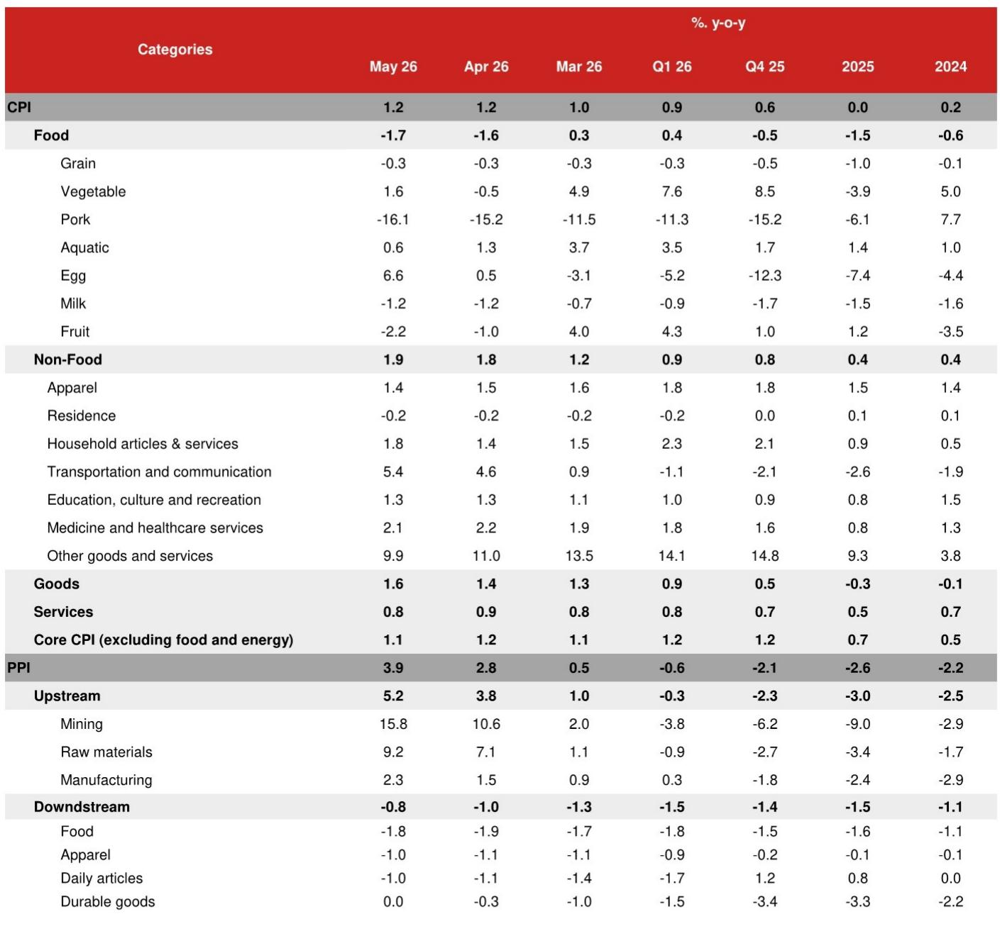
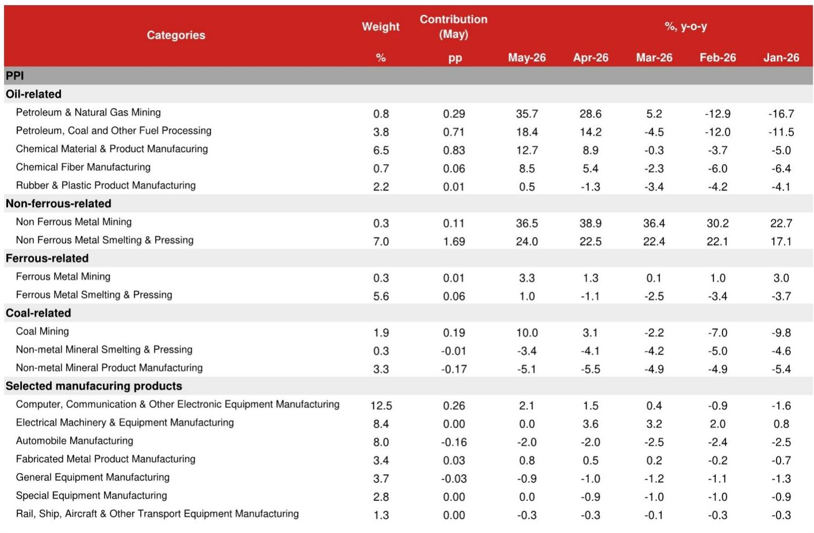
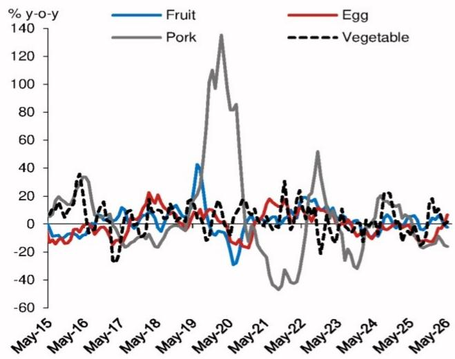

# The Real Story Behind China’s Inflation Data: A Narrow, Externally-Driven Reflation That Policies Cannot Fix

China’s May inflation data presents a deceptive surface. Headline CPI stabilized at 1.2% year-on-year, and PPI surged to 3.9%—the highest reading since mid-2022. At first glance, this looks like a recovery narrative: deflation is over, pricing power is returning, and the economy is normalizing. But this interpretation is dangerous for investors. The reflation underway is almost entirely imported, concentrated in energy and AI-related materials, and is actively squeezing the domestic economy rather than healing it. The data tells a story not of demand recovery but of supply-driven cost-push inflation that is worsening the terms of trade for the world’s largest net importer of energy and chips.

This matters now because the composition of inflation determines which assets benefit and which get crushed. A domestically-driven reflation would support consumer stocks, real estate, and small-cap industrials. The current externally-driven reflation does the opposite: it boosts upstream commodity producers and energy exporters while compressing margins for manufacturers, depressing consumer spending, and complicating Beijing’s policy calculus. Investors who treat the headline numbers as a signal of economic health risk misallocating capital into sectors that are about to face margin compression and demand destruction.

The report from which this analysis draws makes a critical distinction that most market commentary misses. It separates the contribution of oil-related industries and non-ferrous mining from the rest of the PPI basket. Without these two categories, PPI inflation would have been negative in May. This is not a broad-based recovery in industrial pricing. It is a narrow pipeline of global commodity prices—oil, copper, and rare earths—being forced through China’s industrial system. The question every investor should be asking is not whether inflation is rising, but whether it is sustainable and whether its composition is bullish or bearish for their portfolio.

## The PPI Surge Is a Narrow, Upstream Phenomenon That Conceals Broader Weakness in Manufacturing and Consumer Goods

The headline PPI reading of 3.9% year-on-year in May masks a deeply bifurcated industrial economy. Upstream sectors—mining and raw materials—saw inflation accelerate to 15.8% and 9.2% respectively. But downstream consumer goods PPI remained negative at -0.8%. This is not a recovery; it is a cost shock that is being absorbed by manufacturers and consumers.

The energy channel is the primary driver. Oil and natural gas extraction PPI surged to 35.7% year-on-year, and petroleum processing hit 18.4%. These sectors, combined with chemical raw materials, contributed approximately 1.96 percentage points to headline PPI. The non-ferrous metals channel, driven by global demand for AI-related products and electrification, added another 1.80 percentage points. Together, energy and non-ferrous metals accounted for nearly all of the 3.9% reading.

The implication is stark. Chinese manufacturers are facing rising input costs that they cannot pass through to consumers because domestic demand remains weak. The automobile manufacturing sector, a bellwether for consumer spending, saw PPI decline by 2.0% year-on-year. Computer and electronic equipment manufacturing, despite the chip price tailwind, registered only 2.1% inflation—barely above the level that would indicate pricing power. This is a classic profit squeeze: upstream commodity producers capture the gains from global price increases, while downstream industries absorb the cost without being able to raise their own prices.

For investors, this means that the PPI data is not a buy signal for Chinese industrials broadly. It is a signal to differentiate fiercely between companies that are commodity producers with pricing power and those that are manufacturers with pricing constraints. The former benefit; the latter suffer margin compression. The report’s sector breakdown provides a framework for this differentiation, and any investor without access to that level of granularity is flying blind.

## CPI Inflation Is Flat Because Domestic Demand Cannot Absorb Cost Pass-Through, and the Composition Reveals Structural Weakness

CPI inflation stabilized at 1.2% year-on-year in May, but the composition is deeply concerning. Food prices remain a serious drag, with pork inflation falling to -16.1% year-on-year, driven by abundant supply and weak demand. Core CPI, excluding food and energy, actually edged down to 1.1% from 1.2%. Services inflation moderated to 0.8%.

The energy component contributed more than half of headline CPI, with gasoline prices up 23.5% year-on-year. But even this contribution is moderating. In sequential terms, gasoline prices fell by 0.3% month-on-month in May, compared to a 12.6% increase in April. The drag from gold prices, which had been a significant contributor to core CPI earlier in the year, is also fading: gold-related product inflation decelerated to 39.0% in May from 46.9% in April.

The critical insight here is that supply-driven reflation cannot generate self-sustaining consumer price increases. When inflation is driven by energy costs, it acts as a tax on household disposable income. Chinese consumers, already burdened by the property bust and the payback effects from the trade-in program, respond to higher gasoline prices by cutting spending elsewhere. This is why services inflation is moderating and why core CPI is not accelerating despite the headline reading.

The pork data is particularly telling. Pork prices are at a 16-year low, and slaughter growth rebounded to 26.7% year-on-year in April. This is not a supply-side story alone; it reflects weak demand for protein, which is a classic indicator of consumer stress. When households reduce meat consumption, it signals that they are trading down or cutting overall food expenditure. This is inconsistent with a narrative of economic recovery and reflation.

The report raises an important question that it does not fully answer: if energy prices ease in the second half of the year, what will sustain CPI? The sequential moderation in gasoline prices suggests that the energy tailwind is fading. Without a recovery in pork prices or a broad-based increase in services inflation, CPI could decelerate sharply in the third quarter. This would put the People’s Bank of China in a difficult position: it would be facing declining headline inflation while PPI remains elevated due to supply disruptions, making the monetary policy stance ambiguous.

## The AI Supercycle Is Creating a Structural Inflation Channel That Is Different from the Energy Shock

One of the most interesting findings in the report is the growing role of the AI supercycle in driving PPI inflation. Non-ferrous metal mining and processing contributed 1.80 percentage points to headline PPI in May, and technology manufacturing industries contributed another 0.26 percentage points. The chip price channel operates through two mechanisms: directly raising producer prices for semiconductors, and indirectly raising prices for electronic products that use chips as inputs, such as laptops, smartphones, and AI appliances.

This is structurally different from the energy shock. Oil price inflation is cyclical and tied to geopolitical events, supply disruptions, and OPEC+ decisions. The AI-driven demand for non-ferrous metals and chips is likely to be more persistent, driven by long-term investment cycles in data centers, electrification, and automation. If this channel continues to strengthen, it could sustain PPI inflation even after energy prices moderate.

However, the report also shows that this channel is narrow. The computer, communications, and other electronic equipment manufacturing sector has a weight of 12.5% in the PPI basket but contributed only 0.26 percentage points to headline inflation in May. This suggests that the pass-through from chip prices to broader electronics pricing is still limited. The AI supercycle is boosting upstream commodity producers—particularly non-ferrous metal miners—but it has not yet created broad-based inflation in the technology manufacturing sector.

For investors, this creates a clear thematic trade. Companies exposed to non-ferrous metal mining and processing are the direct beneficiaries of the AI supercycle. But companies in downstream electronics manufacturing face a more complex dynamic: they benefit from higher demand for AI-related products but are also squeezed by rising input costs. The report’s data suggests that, so far, the cost pressure is winning. The electrical machinery and equipment manufacturing sector actually saw PPI inflation fall to 0.0% in May from 3.6% in April, indicating that pricing power in this sector is fragile.

## What the Report Does Not Fully Answer: The Policy Transmission Puzzle and the Risk of Stagflationary Dynamics

The report raises its PPI and CPI forecasts but leaves several critical questions unresolved. First, it does not fully explain how the divergence between upstream and downstream PPI will resolve. If upstream inflation remains elevated while downstream inflation stays negative, manufacturing margins will continue to compress. This could lead to production cuts, layoffs, and a further weakening of domestic demand, creating a negative feedback loop.

Second, the report notes that Beijing will maintain accommodative monetary policy and ramp up fiscal spending, but it pushes out the forecast for RRR and rate cuts to next year. This is a significant judgment call. If inflation remains above target—even if it is supply-driven—the PBOC may be constrained in its ability to cut rates. The risk is that China enters a stagflationary phase: growth slows due to weak domestic demand and supply disruptions, while inflation remains elevated due to imported energy and commodity costs. In this scenario, traditional policy tools become less effective. Fiscal spending could boost demand but would also add to inflationary pressure. Monetary easing could stimulate growth but would risk weakening the renminbi and increasing the cost of imported inputs.

Third, the report does not fully address the second-order effects of the worsening terms of trade. China is the world’s largest net importer of energy and a major net importer of chips. The combination of high oil prices and high chip prices is a direct drain on China’s balance of payments. This could put downward pressure on the renminbi, which would further increase the cost of imports and feed into domestic inflation. The report mentions this dynamic but does not model its full implications.

These unresolved questions create a natural hook for investors who need the full report to make portfolio decisions. The data provided is necessary but not sufficient. Understanding the policy transmission mechanism and the potential for stagflation requires access to the original charts and the analysts’ full modeling assumptions.

## A Decision Framework for Investors: How to Navigate the Narrow Reflation

Based on the report’s data and logic, investors should adopt a three-part framework for positioning in Chinese assets.

First, differentiate between inflation that is domestically-driven and inflation that is imported. Domestically-driven inflation supports consumer discretionary, real estate, and small-cap industrials. Imported inflation supports commodity producers and energy companies but squeezes manufacturers and consumers. The current regime is clearly the latter. Investors should overweight upstream commodity producers—particularly non-ferrous metal miners—and underweight downstream manufacturers that lack pricing power.

Second, monitor the sequential data for signs of moderation. The report shows that sequential PPI inflation slowed to 0.5% month-on-month in May from 1.7% in April. If this trend continues, the PPI peak may be near. The inflection point in PPI is a critical signal for asset allocation. A peak in PPI would reduce the margin squeeze on manufacturers and could allow the PBOC to ease policy sooner than expected. Investors should track the month-on-month PPI data, not just the year-on-year headline, to identify this turning point.

Third, watch the pork price cycle as a leading indicator of consumer demand. Pork prices are at a 16-year low, and the supply-demand imbalance is severe. A recovery in pork prices would signal that domestic demand is finally improving and that the pass-through from upstream costs to consumer prices is becoming more effective. Until that happens, the consumer sector remains under pressure.

The report’s data also implies a specific trade for fixed income investors. If PPI remains elevated while CPI is flat or declining, real interest rates are rising. This supports short-duration bonds and makes long-duration bonds risky. The report’s forecast that RRR and rate cuts are pushed out to next year reinforces this view: the PBOC is unlikely to ease into a PPI shock, even if the shock is supply-driven.

Join the community to read the full report and review the original charts. The analysts provide a detailed sector breakdown of PPI contributions, a decomposition of core CPI excluding gold, and a forecast trajectory that is essential for calibration. The data presented in this article is a synthesis; the full report contains the granularity needed for precise positioning.

*This article is for learning and discussion only and does not constitute investment advice.*

Personal reading notes and learning share only. Not investment advice.

