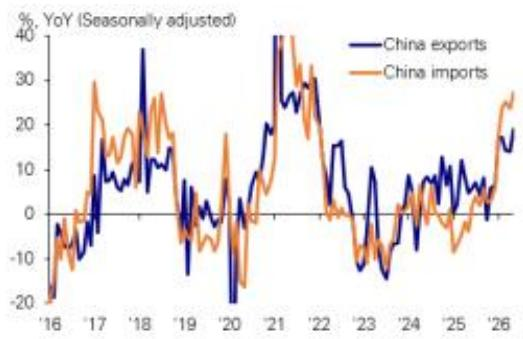

# China’s Trade Surge Is Not Just Cyclical—It Reveals a Structural Shift in Global Export Power

The narrative that China’s trade performance is merely a function of base effects and temporary tariff disruptions misses the deeper story unfolding in the May data. Exports accelerated to 19.4% year-on-year, reaching a new seasonally adjusted historical high, while imports surged to 27.4%. These are not modest beats. They represent a material reacceleration that demands a more fundamental explanation than calendar quirks or one-off policy moves.

What makes this moment strategically significant is not the headline growth rate itself, but the composition beneath it. The drivers of China’s export machine are shifting in ways that will reshape competitive dynamics for years. AI-related exports doubled their growth rate to 81% year-on-year, contributing 10 percentage points to overall export growth—double their contribution just a month earlier. Energy and petrochemical exports, long seen as laggards, have snapped back sharply, with refined oil exports rebounding from negative territory to 27% growth. Meanwhile, exports to advanced economies, which had been tepid, surged to 30% combined growth, led by a stunning 35% jump to the United States.

The conventional framing of China as a low-cost assembly hub is becoming obsolete. The data points to a country that is simultaneously climbing the technology ladder and leveraging structural cost advantages in energy-intensive manufacturing. The implications for global supply chains, currency markets, and investment strategy are profound. This article unpacks what the May trade data really means, where the risks and opportunities lie, and why the most important questions may not be answerable from the numbers alone.

## The “AHEAD” Framework Is Still Dominant, But Its Center of Gravity Is Shifting

The report identifies “AHEAD” factors—AI-related exports, autos, and other machinery—as the primary drivers of China’s export strength. In May, these categories contributed 16 percentage points to headline growth, up from an already impressive contribution earlier in the year. Within this, the standout is AI-related goods: integrated circuits, mobile phones, computers, and data processing equipment. Their growth rate nearly doubled from 42% in the first four months to 81% in May alone.

This acceleration is not a blip. It reflects the maturation of China’s semiconductor and electronics ecosystem. While much of the global conversation about AI has focused on US-designed chips and Taiwan-based fabrication, China has been quietly building a parallel supply chain for AI-enabled hardware. The May data suggests that this ecosystem is now hitting an inflection point in export volumes.

The strategic implication is clear: China is no longer just the world’s factory for low-value assembly. It is becoming a significant exporter of the physical infrastructure that powers the AI revolution. For companies dependent on AI hardware—from data center operators to automotive firms integrating smart systems—the diversification of supply away from traditional hubs is accelerating. The question for investors is whether this trend is sustainable or whether geopolitical friction will eventually constrain it. The data does not yet answer that question, but it does make clear that the trend is real and substantial.

## Energy and Petrochemical Exports Reveal China’s Hidden Pricing Power

One of the most underappreciated developments in the May data is the resurgence of energy and petrochemical exports. Refined oil exports rebounded from -1% to +27% year-on-year. Plastics accelerated from 7% to 12%. These are not headline-grabbing categories like semiconductors, but they may be more structurally telling.

China has long been a net importer of energy, but its refining capacity has expanded dramatically over the past decade. The country now has surplus capacity to process crude oil into refined products for export. The May data suggests that this capacity is being utilized aggressively. The report attributes this to China’s “pricing advantage in energy-intensive sectors,” which is a careful way of saying that China can produce these goods more cheaply than many competitors.

This pricing advantage stems from a combination of factors: scale, government support, and access to energy inputs at preferential rates. For global competitors in petrochemicals and refining, this represents a structural threat. China is not just competing on labor costs anymore; it is competing on the cost of energy itself. The implication is that sectors long considered safe from Chinese competition—because they are capital-intensive rather than labor-intensive—are now in the crosshairs.

The full-year export forecast of 12% growth, with upside risks, suggests that the report’s authors see this trend continuing. But the open question is whether China’s trading partners will respond with tariffs or other measures aimed at energy-intensive goods. The May data may itself invite policy responses that could alter the trajectory.

## The Rebound in Exports to Advanced Economies Is Real, But Fragile

Perhaps the most striking data point in the report is the surge in exports to major developed markets. Combined exports to the US, Japan, South Korea, and Taiwan jumped from 2% growth in the first four months to 30% in May. Exports to the US alone went from -13% to +35%.

The report offers two explanations: strong AI-related demand and a low base from May of the previous year. Both are valid, but they tell only part of the story. The low base effect is real—last May was a trough for US-bound shipments—but a swing of 48 percentage points cannot be explained by arithmetic alone. Something fundamental changed in the bilateral trade relationship.

The report hints at “tariff easing and recent bilateral engagement” supporting a normalization of trade flows. This is the most politically sensitive part of the analysis, and it is deliberately understated. What the data cannot tell us is whether this normalization is durable. If it reflects a genuine de-escalation in trade tensions, then the current trajectory could continue. If it reflects a temporary truce or front-loading of shipments ahead of potential new tariffs, then the May data may represent a peak rather than a trend.

For investors with exposure to US-China trade dynamics, this is the critical uncertainty. The report’s full-year forecasts assume a continuation of current conditions, but the authors are careful to note that risks are “tilted to the upside” only for energy and petrochemical trade, not for the broader export picture. The implication is that the advanced-economy rebound is the most fragile leg of the growth story.

## Imports Tell a Complementary Story About China’s Domestic Demand and Energy Strategy

Import growth accelerated to 27.4% year-on-year, and the composition reinforces the export narrative. Machinery imports, particularly AI-related goods, continued to gain momentum. Copper imports remained on a rising trend. But the most notable development was the sharp acceleration in energy imports: crude oil from 0% to 15%, coal from -7% to 10%, and natural gas from -16% to 10%.

The report explains this as a lag effect: energy exports from major suppliers to China in March and April had not yet been reflected in the import data, and the May release captures that catch-up. This is technically correct, but it also points to a deeper dynamic. China is importing more energy not just to fuel its domestic economy, but to process and re-export as higher-value refined products and petrochemicals. The import data is the other side of the export coin.

For commodity investors, this has direct implications. China’s energy import demand is becoming less correlated with domestic GDP growth and more correlated with its export competitiveness in energy-intensive sectors. Traditional models that link Chinese commodity demand to construction and infrastructure spending may be losing explanatory power. The new driver is industrial processing for re-export.

The report’s RMB forecast—appreciation to 6.55 by end-2026 and 6.30 by 2027—is consistent with this view. Strong trade surpluses typically support currency appreciation, and the structural shift toward higher-value exports reinforces the case. But the forecast assumes no major disruption to trade flows. If the advanced-economy rebound proves temporary, the RMB outlook would need to be reassessed.

## What the Report Does Not Fully Answer: The Sustainability of the AI Export Boom and the Geopolitical Feedback Loop

For all its analytical rigor, the report leaves two critical questions unresolved. First, how sustainable is the AI-related export boom? The 81% growth rate in May is staggering, but it comes from a base that was already growing rapidly. At some point, capacity constraints, technological bottlenecks, or regulatory pushback from importing countries will emerge. The report does not model a deceleration scenario, and the full-year forecast of 12% export growth implicitly assumes that AI exports will continue to outperform but at a more moderate pace. That is a plausible assumption, but it is not tested against potential headwinds.

Second, the geopolitical feedback loop is absent from the analysis. The report treats trade policy as an exogenous factor, but it is endogenous to the data itself. Stronger Chinese exports in sensitive categories like AI hardware and energy-intensive goods are likely to provoke policy responses from the US, the EU, and other trading partners. The May data may accelerate the very protectionist measures that could undermine its own trajectory. The report’s authors are too disciplined to speculate on policy, but for a strategic reader, this is the most important gap to fill.

## A Decision Framework for Readers: How to Position for Three Scenarios

Given the uncertainties, readers should assess their exposure along three axes: technology supply chains, commodity markets, and currency positioning. The May data supports a base case in which China’s trade momentum continues, driven by AI exports and energy-intensive goods. In this scenario, investors with long positions in Chinese technology hardware exporters and RMB-denominated assets are well positioned. Commodity producers with exposure to Chinese energy demand should also benefit, though the relationship is becoming more complex.

The first alternative scenario is a geopolitical disruption that curtails the advanced-economy rebound. In this case, the AI export story may hold up—since demand from emerging markets remains strong—but the overall growth rate would moderate. Currency appreciation would slow or reverse. Investors should hedge RMB exposure and favor companies with diversified export destinations.

The second alternative scenario is a sharper-than-expected deceleration in AI demand globally. This would hit the highest-growth segment of China’s export machine and could expose vulnerabilities in the semiconductor supply chain. In this scenario, the energy and petrochemical story becomes the primary buffer, and commodity-linked investments may outperform technology-linked ones.

The report’s data does not tell us which scenario will materialize. What it does is give us the raw material to build our own probability-weighted assessments. The May numbers are impressive, but they are a snapshot, not a forecast. The strategic question is not whether China’s trade momentum is real—it clearly is—but how durable it will prove in the face of the forces it is itself generating.

Join the community to read the full report and review the original charts.

*This article is for learning and discussion only and does not constitute investment advice.*

Personal reading notes and learning share only. Not investment advice.

