## Asia Economics | Asia Pacific

# The Viewpoint: Why boosting India's manufacturing is more important than ever

The policy measures that have been taken to address India's near-term funding challenges will be effective, in our view. But from a medium-term perspective, India needs to boost competitiveness in manufacturing to attract capital flows and lift goods exports market share.

## Key Takeaways

We believe the recent policy measures will be successful in augmenting capital flows in the near term.  
But India still faces a medium-term funding challenge as it will need to lift savings sustainably to meet the rising need for investment.  
- India should focus on lifting goods exports competitiveness and boosting manufacturing capabilities across the value chain.  
Manufacturing can help narrow the current account deficit and attract capital inflows – effectively providing a double boost to BoP dynamics.  
Policy must target high growth sectors, ensure an integrated supply chain, have the financial system aligned, supercharge R&D spend, and skill the workforce.

In this report, we highlight why manufacturing will have to play a critical role in enhancing India's relative growth prospects and how it will help solve India's balance of payments problem over the medium term. We explain the key policy steps that are needed.

MS ASIA LIMITED

## Chetan Ahya

Chief Asia Economist

Chetan.Ahya@morganstanley.com +852 2239-7812

MS ASIA (SINGAPORE) PTE.

## Derrick Y Kam

Asia Economist

Derrick.Kam@morganstanley.com +65 6834-8272

MS ASIA LIMITED

## Jonathan Cheung

Economist

Jonathan.Cheung@morganstanley.com +852 2848-5652

## Kelly Wang

Economist

Kelly.Wang@morganstanley.com +852 3963-0891

MS INDIA COMPANY PRIVATE LIMITED

## Sudhanshu Agarwal

Economist

Sudhanshu.Agarwal@morganstanley.com +91 22 6995-4568

## Asia Summer School 2026

## How to solve India's medium-term funding challenge

India faces a funding challenge both in the near and medium term: For the near term, policy makers have taken steps to augment capital flows, but for the medium term the need of the hour is to boost savings. For savings to rise sustainably, the approach must be to lift employment and, as we have highlighted before, this has to be achieved via boosting the role of manufacturing in the economy. We explain the policy steps that are needed to boost manufacturing and exports in India.

## Why is the balance of payments under pressure?

Capital outflows and rising oil prices have put BoP under pressure: In the past, India enjoyed strong capital inflows that more than offset the current account deficits. However, the capital account has come under increasing pressure over the past two years. Since 4Q24, net foreign investor flows have recorded outflows in five of six quarters, and the most recent data suggests that outflows have likely continued into June. Foreign portfolio investors (FPIs) have also been able to exit their investments at relatively high valuations given the domestic bid for equities remains strong. Foreign direct investment inflows have also been weighed down by outward FDI, given repatriation amid private equity and venture capital exits.

At the same, the trade deficit has widened due to higher oil prices and a contraction in exports to the Middle East. Cumulatively, India's balance of payments registered a deficit of US\$52bn between Dec-24 and Mar-26. This compares with the cumulative deficit of US \$25bn registered between Dec-11 and Sep-13. The overall balance of payments deficit has been reflected in the FX trend, which on a REER basis is now 3.7 standard deviations below the trailing 10-year mean.

Exhibit 1: INR on a REER basis has now fallen to more than 3.7 standard deviations away from the 10-year mean trend  
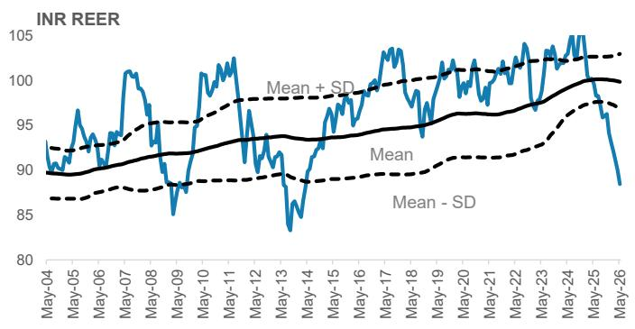

line chart

| Date   | Mean | Mean - SD | Mean + SD |
|--------|------|-----------|-----------|
| May-04 | 90   | 87        | 92        |
| May-05 | 91   | 88        | 93        |
| May-06 | 92   | 89        | 94        |
| May-07 | 93   | 90        | 95        |
| May-08 | 94   | 91        | 96        |
| May-09 | 95   | 92        | 97        |
| May-10 | 96   | 93        | 98        |
| May-11 | 97   | 94        | 99        |
| May-12 | 98   | 95        | 100       |
| May-13 | 99   | 96        | 101       |
| May-14 | 100  | 97        | 102       |
| May-15 | 101  | 98        | 103       |
| May-16 | 102  | 99        | 104       |
| May-17 | 103  | 100       | 105       |
| May-18 | 104  | 101       | 106       |
| May-19 | 105  | 102       | 107       |
| May-20 | 106  | 103       | 108       |
| May-21 | 107  | 104       | 109       |
| May-22 | 108  | 105       | 110       |
| May-23 | 109  | 106       | 111       |
| May-24 | 110  | 107       | 112       |
| May-25 | 111  | 108       | 113       |
| May-26 | 112  | 109       | 114       |

Source: BIS, Haver, MS

Exhibit 2: The key driver has been weaker BOP dynamics  
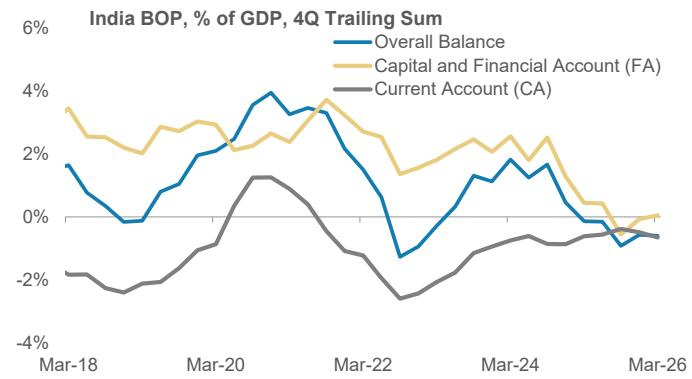

line chart

| Date   | Overall Balance | Capital and Financial Account (FA) | Current Account (CA) |
|--------|-----------------|------------------------------------|----------------------|
| Mar-18 | 1.5%            | 3.5%                               | -2.0%                |
| Mar-20 | 2.0%            | 2.5%                               | -1.0%                |
| Mar-22 | 3.5%            | 3.0%                               | -3.0%                |
| Mar-24 | 1.5%            | 2.0%                               | -1.0%                |
| Mar-26 | -1.0%           | 0.0%                               | -1.0%                |

Source: Haver, MS

Exhibit 3: FII has recorded persistent outflows  
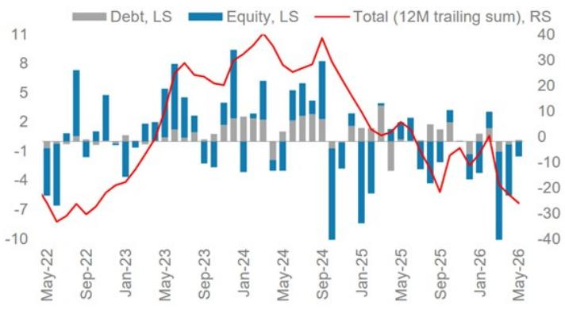

bar-line hybrid chart

| Month    | Debt, LS | Equity, LS | Total (12M trailing sum), RS |
|----------|----------|------------|------------------------------|
| May-22   | -1       | -7         | -30                          |
| Sep-22   | -1       | 8          | -25                          |
| Jan-23   | -1       | 5          | -15                          |
| May-23   | -1       | 8          | 0                            |
| Sep-23   | -1       | 5          | 25                           |
| Jan-24   | 2        | 9          | 35                           |
| May-24   | 2        | 6          | 20                           |
| Sep-24   | 2        | 8          | 40                           |
| Jan-25   | -1       | -8         | 0                            |
| May-25   | -1       | 4          | -10                          |
| Sep-25   | -1       | 3          | -20                          |
| Jan-26   | -1       | 3          | -10                          |
| May-26   | -1       | -10        | -30                          |

Source: RBI, CEIC, Bloomberg, MS

Exhibit 4: Net FDI has been depressed amid outward FDI and repatriations  
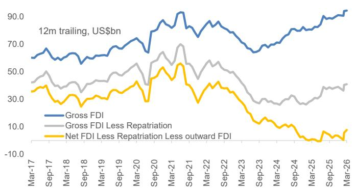

line chart

| Date   | Gross FDI | Gross FDI Less Repatriation | Net FDI Less Repatriation Less outward FDI |
|--------|-----------|-----------------------------|---------------------------------------------|
| Mar-17 | ~60       | ~45                         | ~35                                         |
| Sep-17 | ~65       | ~50                         | ~30                                         |
| Mar-18 | ~60       | ~45                         | ~25                                         |
| Sep-18 | ~65       | ~50                         | ~30                                         |
| Mar-19 | ~70       | ~55                         | ~35                                         |
| Sep-19 | ~75       | ~60                         | ~40                                         |
| Mar-20 | ~80       | ~65                         | ~45                                         |
| Sep-20 | ~85       | ~70                         | ~50                                         |
| Mar-21 | ~90       | ~75                         | ~55                                         |
| Sep-21 | ~85       | ~70                         | ~50                                         |
| Mar-22 | ~80       | ~65                         | ~45                                         |
| Sep-22 | ~75       | ~60                         | ~40                                         |
| Mar-23 | ~70       | ~55                         | ~35                                         |
| Sep-23 | ~65       | ~50                         | ~30                                         |
| Mar-24 | ~70       | ~45                         | ~25                                         |
| Sep-24 | ~75       | ~40                         | ~20                                         |
| Mar-25 | ~80       | ~35                         | ~15                                         |
| Sep-25 | ~85       | ~30                         | ~10                                         |
| Mar-26 | ~90       | ~25                         | ~5                                          |

Source: RBI, CEIC, Bloomberg, MS

Exhibit 5: Reflecting the BoP pressures on FX, RBI has ramped up interventions  
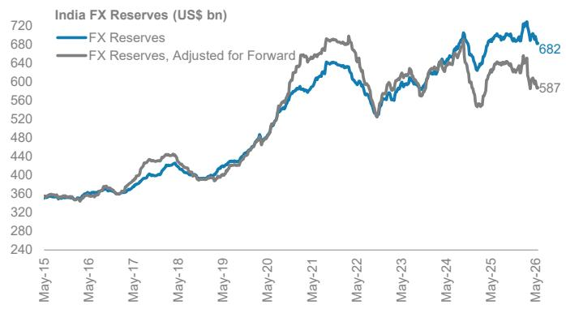

line chart

| Date   | FX Reserves | FX Reserves, Adjusted for Forward |
|--------|-------------|-----------------------------------|
| May-26 | 682         | 587                               |

Source: RBI, MS; Note: RBI's forward dollar book is estimated at US\$95.3bn in April and we have rolled it over to May.

Exhibit 6: Import cover ratio has decreased  
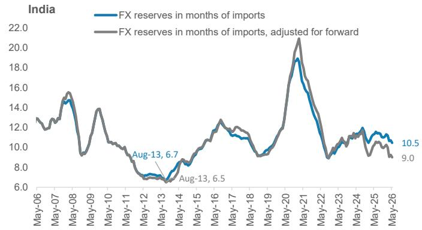

line chart

| Date   | FX reserves in months of imports | FX reserves in months of imports, adjusted for forward |
|--------|----------------------------------|----------------------------------------------------------|
| Aug-13 | 6.7                              | 6.5                                                      |
| May-26 | 10.5                             | 9.0                                                      |

Source: RBI, MS; Note: RBI's forward dollar book is estimated at US\$95.3bn in April and we have rolled it over to May.

## What explains the capital outflows?

Earnings growth had slowed until the Sep-25 quarter but has since improved: In our view, part of the initial weakness can be explained by the slowdown in India's corporate earnings growth. Broad market corporate revenue, excluding energy and financials, had slowed to a 19-quarter low of $8.2\%$ Y growth for Sep-25. Since then, the cumulative effects of concerted policy easing efforts – including GST and income tax cuts as well as the easing of regulatory measures and policy rate cuts by the RBI – have driven a broader domestic demand recovery. Reflecting this, broad market revenue ex energy and finance growth has also recovered to $16\%$ Y in the Mar-26 quarter.

But the relative story has turned less compelling due to AI and the energy shock: For foreign investors, India's relative growth story has become less compelling at the margin. Markets more directly levered to AI and industrial supply chains – notably North Asian economies – have a far more powerful earnings impulse. India's first-quarter earnings in 2026 grew at $13\%$ Y (BSE500). That looks less compelling next to Korea at $171\%$ , Taiwan at $49\%$ , Japan at $33\%$ , and the US at $29\%$ . Within the region, India's relatively wider oil and gas trade deficit at the starting point has also posed headwinds as investors contemplate the drag to the trade balance and growth from the negative terms of trade shock.

Exhibit 7: India among the more exposed to the energy shock within the region  
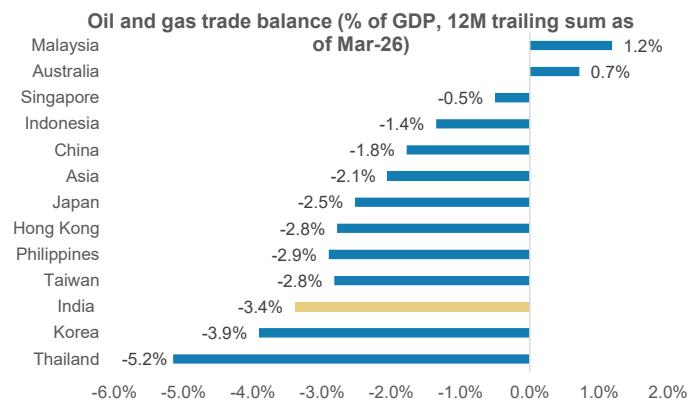

bar chart

Oil and gas trade balance (% of GDP, 12M trailing sum as of Mar-26)
| Country | Oil and gas trade balance (% of GDP) |
| :--- | :--- |
| Malaysia | 1.2 |
| Australia | 0.7 |
| Singapore | -0.5 |
| Indonesia | -1.4 |
| China | -1.8 |
| Asia | -2.1 |
| Japan | -2.5 |
| Hong Kong | -2.8 |
| Philippines | -2.9 |
| Taiwan | -2.8 |
| India | -3.4 |
| Korea | -3.9 |
| Thailand | -5.2 |

Source: Haver, MS

Exhibit 8: India's 1Q26 earnings growth lagged other major indices more levered to the AI thematic  
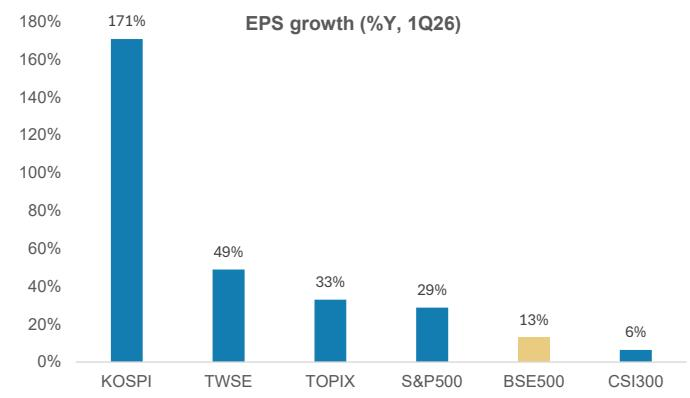

bar chart

EPS growth (%Y, 1Q26)
| Company | EPS growth (%) |
| :--- | :--- |
| KOSPI | 171 |
| TWSE | 49 |
| TOPIX | 33 |
| S&P500 | 29 |
| BSE500 | 13 |
| CSI300 | 6 |

Source: Bloomberg, Factset, MS; Note: Actual 1Q data used for S&P500, BSE500 and KOSPI, and consensus estimates used for the rest.

# How to solve India's balance of payments deficit problem?

## The near-term solution: Now in place

Policy measures to augment capital flows will be effective: In our recent note, we highlighted that policymakers could consider measures such as 1) encouraging banks and public-sector entities to raise external commercial borrowings, with RBI providing some form of foreign-exchange hedge support, and 2) removing the withholding tax on debt investments and capital gains tax on the equity investments. Since then, the government and RBI have taken up relevant measures including:

- Removing capital gains and dividend taxes on government securities for foreign institutional investors,  
- Broadening the investible universe of FAR-eligible government securities, removing FPI restrictions under the General Route,  
- Increasing investment limits for overseas individuals,  
- And providing temporary incentives for ECBs and FCNR(B) deposits.

Our Chief India Economist, Upasana Chachra, believes these measures should support financial conditions by reducing pressure on the rupee and mitigating currency volatility at the margin (see India Economics: RBI Policy Review: Steady Rates; Boosting Capital Inflows, Jun 5, 2026)

Exhibit 9: Measures announced by RBI to attract capital flows

<table><tr><td>Capital Flow Augmentation Measures</td></tr><tr><td>Government securities under the Fully Accessible Route (FAR), we are expanding the universe of ‘specified securities’ by including all new issuances of 15-, 30- and 40-year tenor G-secs. In addition, limits pertaining to short-term investment, concentration and individual securities on FPI investment under the General Route are being removed. These measures along with the tax benefits provided by the government this morning should help attract foreign capital for government borrowing</td></tr><tr><td>The limits for investment by NRIs and OCIs in equity instruments traded on the stock market without SEBI registration are being increased. Further, the same facility is being extended to all individual Persons Resident Outside India (PROIs) at par with NRIs and OCIs.</td></tr><tr><td>A facility of concessional forex swap will be provided till 30th September 2026 to incentivize ECBs by PSUs.</td></tr><tr><td>A similar facility for bearing the full hedging cost shall be provided till 30th September 2026 to AD banks for raising fresh 3–5-year FCNR (B) deposits</td></tr><tr><td>It is proposed to restore the time for realisation of export proceeds to nine months from fifteen months earlier.</td></tr></table>

Source: RBI, MS

If oil prices continue to decline, pressures on the current account will ease – but not enough to allay BoP concerns: Upasana expects the current account deficit to widen from a deficit of 0.6% in F26 to 1.8% of GDP in F27. As energy prices moderate, pressures on the current account should ease with the deficit expected to narrow to 1.2% of GDP in F28. But that on its own will not be sufficient to close the funding gap. To durably relieve pressure on the current account, we believe that India will need to redouble efforts to boost manufacturing and exports.

Exhibit 10: Current account deficit expected to widen to 1.8% of GDP by F27  
Current account balance (% of GDP, 4Q trailing sum)  
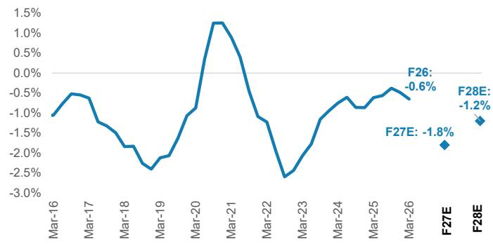

line chart

| Date   | Value  |
|--------|--------|
| Mar-16 | -1.0%  |
| Mar-17 | -0.5%  |
| Mar-18 | -1.5%  |
| Mar-19 | -2.5%  |
| Mar-20 | -1.0%  |
| Mar-21 | 1.3%   |
| Mar-22 | -1.0%  |
| Mar-23 | -2.5%  |
| Mar-24 | -0.5%  |
| Mar-25 | -0.8%  |
| Mar-26 | -0.6%  |
| F27E   | -1.8%  |
| F28E   | -1.2%  |

Source: Haver, MS forecasts

Exhibit 11: Nascent recovery in non-tech exports so far  
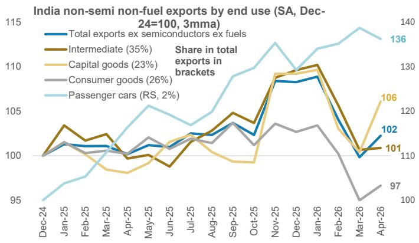

line chart

| Month    | Total exports ex semiconductors ex fuels | Intermediate (35%) | Capital goods (23%) | Consumer goods (26%) | Passenger cars (RS, 2%) |
|----------|-------------------------------------------|--------------------|---------------------|----------------------|-------------------------|
| Dec-24   | 100                                       | 100                | 100                 | 100                  | 95                      |
| Jan-25   | 101                                       | 103                | 101                 | 101                  | 97                      |
| Feb-25   | 101                                       | 102                | 101                 | 101                  | 98                      |
| Mar-25   | 101                                       | 102                | 101                 | 101                  | 99                      |
| Apr-25   | 101                                       | 101                | 101                 | 101                  | 100                     |
| May-25   | 102                                       | 101                | 102                 | 102                  | 105                     |
| Jun-25   | 102                                       | 100                | 102                 | 102                  | 104                     |
| Jul-25   | 103                                       | 101                | 103                 | 103                  | 105                     |
| Aug-25   | 104                                       | 102                | 104                 | 104                  | 106                     |
| Sep-25   | 105                                       | 103                | 105                 | 105                  | 108                     |
| Oct-25   | 106                                       | 104                | 106                 | 106                  | 110                     |
| Nov-25   | 108                                       | 106                | 108                 | 108                  | 113                     |
| Dec-25   | 109                                       | 107                | 109                 | 109                  | 136                     |
| Jan-26   | 109                                       | 108                | 109                 | 109                  | 137                     |
| Feb-26   | 108                                       | 107                | 108                 | 108                  | 138                     |
| Mar-26   | 107                                       | 106                | 107                 | 97                   | 139                     |
| Apr-26   | 102                                       | 101                | 106                 | 97                   | 136                     |

Source: Haver, MS

## The medium-term solution: Boosting manufacturing and exports

Boosting manufacturing and goods exports is the medium-term solution to India's balance of payments problem, in our view. Manufacturing can address the current account and capital account in one move – by narrowing the current account and attracting capital flows.

## We see three key reasons for this:

1) Funding the capex super-cycle  
2) AI is challenging the services export sector approach  
3) Solving the growing jobs challenge

## 1) Funding the capex super-cycle

Asia including India's capex cycle will benefit from the four structural drivers: Asia is in the midst of an industrial and capex super-cycle. There are four structural drivers – AI and AI related infrastructure, energy security and transition, defense, and onshoring of industrial supply chains – which will lead to a sustained rise in Asia's capex over the medium term. For India, these drivers will also present opportunities as they can help catalyse a capex cycle. In particular, our India economist sees India's investment being led by key sectors such as railway, electronics and semiconductor manufacturing, and data centers. The broader strategy is to leverage public capex, incentive schemes and domestic market scale to attract global FDI (India Economics: Additional Levers to Support Capex Upcycle, May 13, 2026).

Exhibit 12: Asia headed towards a multi-year capex super-cycle  
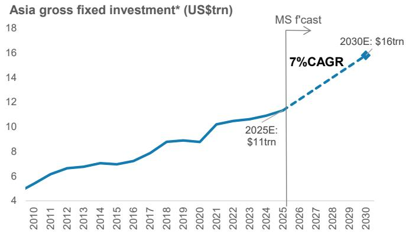

line chart

| Year | Investment (US$trn) |
| ---- | ------------------- |
| 2025E | 11 |
| 2030E | 16 |

Source: CEIC, Haver, IEA, Lowy Institute, MS estimates; Note: \*We exclude China real estate capex given the structural decline in property demand.

Exhibit 13: Asia's industrial and capex cycle is backed by multiple new structural demand drivers  
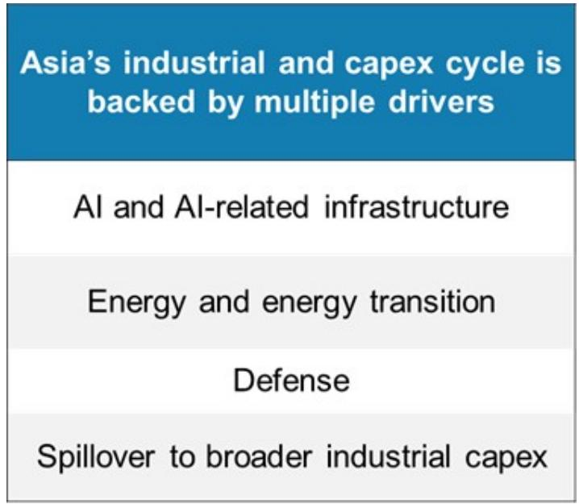

text_image

Asia's industrial and capex cycle is backed by multiple drivers
AI and AI-related infrastructure
Energy and energy transition
Defense
Spillover to broader industrial capex

Source: MS

Exhibit 14: Our equipment capex proxy – capital goods imports – is accelerating to beyond 2017-18 highs (excluding the pickup in 2021-22 driven by Covid base effects)  
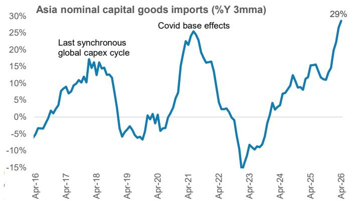

line chart

| Date   | Value |
|--------|-------|
| Apr-26 | 29%   |

Source: Haver, MS

Exhibit 15: In India, we also expect investment to GDP to rise  
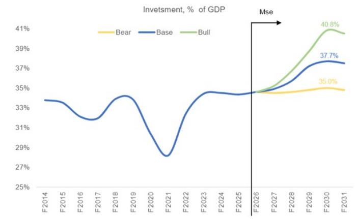

line chart

| Year   | Bear  | Base  | Bull  |
|--------|-------|-------|-------|
| F2014  |       | 33.5% |       |
| F2015  |       | 33.2% |       |
| F2016  |       | 32.8% |       |
| F2017  |       | 33.0% |       |
| F2018  |       | 33.5% |       |
| F2019  |       | 33.8% |       |
| F2020  |       | 31.5% |       |
| F2021  |       | 28.5% |       |
| F2022  |       | 34.5% |       |
| F2023  |       | 34.8% |       |
| F2024  |       | 34.7% |       |
| F2025  |       | 34.8% |       |
| F2026  |       | 34.9% |       |
| F2027  |       | 35.0% |       |
| F2028  |       | 35.5% |       |
| F2029  |       | 36.5% |       |
| F2030  | 35.0% | 37.7% | 40.8% |
| F2031  |       | 37.5% |       |

Source: CEIC, MS, MS estimates

But India faces a funding challenge: India faces a critical constraint in that it will need to secure the funding to capitalise on this opportunity. For an extended period of time, India's domestic savings trend has not been enough to cover its investments, resulting in a persistent current account deficit. While savings to GDP has risen from 29% in F21 to an estimated 34% in F26, the rise in investment to GDP has been sharper at 28% to 35% over the same period. Typically, this funding is sourced from two channels: (1) a rise in domestic savings supported by export income, and/or (2) a rise in external financing or capital inflows. But on both fronts, India has to contend with existing and future challenges.

Exhibit 16: We see a capex super-cycle playing out  
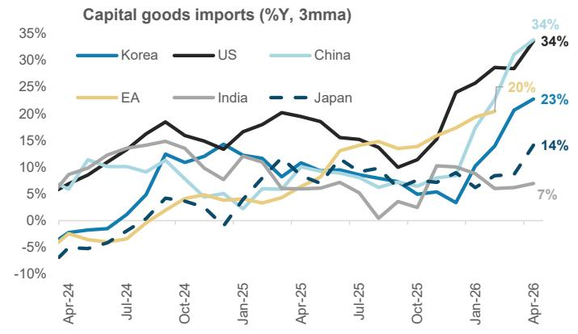

line chart

| Date   | Korea | US  | China | EA  | India | Japan |
|--------|-------|-----|-------|-----|-------|-------|
| Apr-24 | -     | 5%  | 10%   | -5% | 5%    | -5%   |
| Jul-24 | -     | 10% | 10%   | -5% | 10%   | -5%   |
| Oct-24 | 10%   | 15% | 5%    | 5%  | 10%   | 5%    |
| Jan-25 | 10%   | 15% | 5%    | 5%  | 10%   | 5%    |
| Apr-25 | 10%   | 20% | 5%    | 10% | 10%   | 10%   |
| Jul-25 | 10%   | 15% | 5%    | 15% | 5%    | 10%   |
| Oct-25 | 5%    | 10% | 5%    | 10% | 5%    | 5%    |
| Jan-26 | 10%   | 25% | 20%   | 15% | 5%    | 5%    |
| Apr-26 | 23%   | 34% | 34%   | 20% | 7%    | 14%   |

Source: CEIC, Haver, MS

Exhibit 17: India's capex cycle will benefit from the four structural drivers  
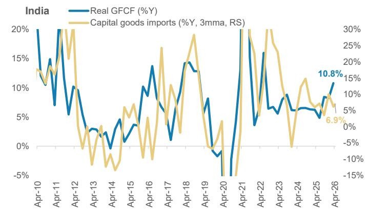

line chart

| Date   | Real GFCF (%) | Capital goods imports (%Y, 3mma, RS) |
|--------|---------------|--------------------------------------|
| Apr-26 | 10.8          | 6.9                                  |

Source: CEIC, Haver, MS

## 2) AI is challenging the services export sector approach

AI posing headwinds to India's services exports: India has been utilizing the approach of deploying a large, skilled workforce into its services exports sector for some time now. The IT sector (including Global Capability Centres) now employs $8.3\%$ of people in the formal, organised sector. More importantly, IT and GCC services exports are an important source of India's export dollar revenues, representing US\$321bn or $7.9\%$ of GDP. India's global share in services exports has now risen to $4.7\%$ , vs. $3.7\%$ in Dec-19. However, this approach is now coming under pressure from the rise of AI. Our India technology analyst, Gaurav

Rateria, expects AI disruption to lead to a period of slower growth in IT services exports (4.4% vs. the preceding five years' average of 9.8%) and a flat trend in the labour force (see India – Micro Meets Macro: Future of Work: AI and India's IT Sector: Structural Shift with Macro Consequences, 10 May 2026).

Exhibit 18: India has significantly increased services exports share over the last decade  
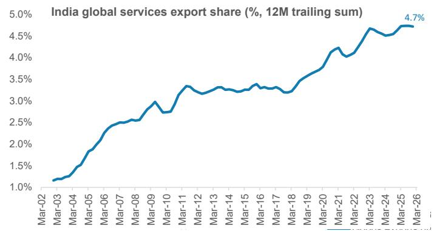

line chart

| Year   | India global services export share (%) |
| ------ | --------------------------------------- |
| Mar-26 | 4.7%                                    |

Source: CEIC, Haver, MS

Exhibit 19: India has not gained global goods export market share  
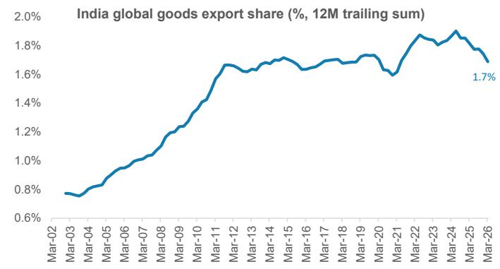

line chart

| Date   | India global goods export share (%) |
|--------|-------------------------------------|
| Mar-26 | 1.7                                 |

Source: CEIC, Haver, MS

Exhibit 20: Investors are concerned over AI weighing on India's services exports and current account: Our India IT team expects a period of adjustment for India's IT services sector...

<table><tr><td>IT services export revenue</td><td>%CAGR</td></tr><tr><td>Past 10Y CAGR</td><td>8.5%</td></tr><tr><td>Base case 5YCAGR</td><td>4.4%</td></tr><tr><td>Bull case 5YCAGR</td><td>7.4%</td></tr><tr><td>Bear case 5YCAGR</td><td>1.4%</td></tr></table>

Exhibit 21: ...but for IT services exports to continue to grow

<table><tr><td>IT services export revenue</td><td>US$bn</td></tr><tr><td>F2026</td><td>242</td></tr><tr><td>Base case</td><td>299</td></tr><tr><td>Bull case</td><td>345</td></tr><tr><td>Bear case</td><td>259</td></tr></table>

Source: Haver, MS estimates  
Source: Haver, MS estimates

## 3) Solving the growing jobs challenge

India's jobs challenge is growing: In an earlier report, we highlighted that one of India's key medium-term issues is whether its current growth rate can fully absorb its growing labour force (see The Viewpoint: How to Solve India's Jobs Problem, 12 Jan 2025). Over the next decade, the UN estimates that 85mn people are expected to join the workforce even if participation rates are assumed to be unchanged. Additionally, the high share of primary sector employment and still relatively high poverty rate (share of population living below the World Bank's lower middle income poverty line) suggests there is already significant underemployment at the starting point. As such, we estimate that India will at least require sustaining real GDP growth of 7.4% over the next decade just to generate enough jobs to fully absorb the new additions to the workforce (assuming participation rates remain unchanged). To also address the underemployment issue, India would need an even higher real GDP growth rate of 12-14% over the medium term. That in turn will require a higher investment to GDP ratio. This is especially the case given headwinds to services exports.

Exhibit 22: India's working age population addition over the next decade is large, implying the need for faster job creation  
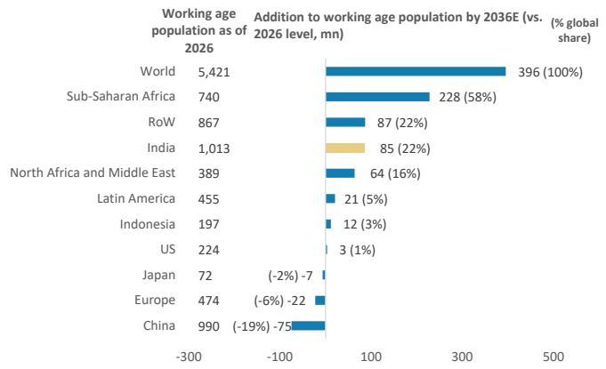

bar chart

| Region | Working age population as of 2026 (million) | Addition to working age population by 2036E (vs. 2026 level, mn) (%) |
| :--- | :--- | :--- |
| World | 5,421 | 396 (100%) |
| Sub-Saharan Africa | 740 | 228 (58%) |
| RoW | 867 | 87 (22%) |
| India | 1,013 | 85 (22%) |
| North Africa and Middle East | 389 | 64 (16%) |
| Latin America | 455 | 21 (5%) |
| Indonesia | 197 | 12 (3%) |
| US | 224 | 3 (1%) |
| Japan | 72 | (-2%) -7 |
| Europe | 474 | (-6%) -22 |
| China | 990 | (-19%) -75 |

Source: Haver, MS

Exhibit 23: India has not gained global goods export market share  
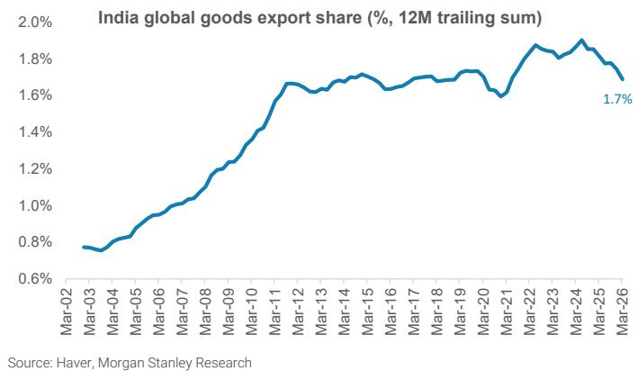

line chart

| Date   | India global goods export share (%) |
|--------|-------------------------------------|
| Mar-26 | 1.7                                 |

Exhibit 24: For India to maximise its benefit from this multi-year super-cycle, there is a need to boost its competitiveness in manufacturing...  
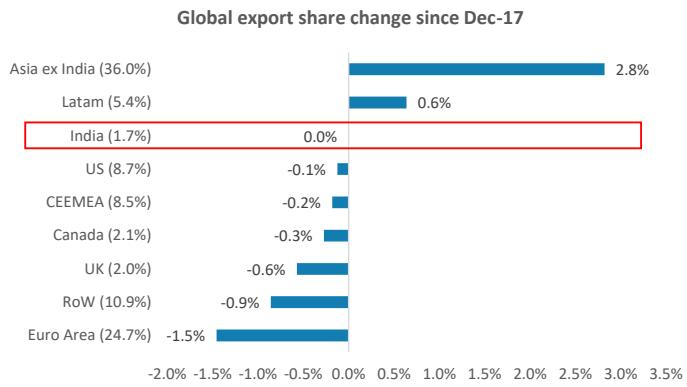

bar chart

Global export share change since Dec-17
| Region | Value (%) |
| :--- | :--- |
| Asia ex India | 2.8 |
| Latam | 0.6 |
| India | 0.0 |
| US | -0.1 |
| CEEMEA | -0.2 |
| Canada | -0.3 |
| UK | -0.6 |
| RoW | -0.9 |
| Euro Area | -1.5 |

Source: CEIC, Haver, MS

Exhibit 25: ...and lift its market share in global exports  
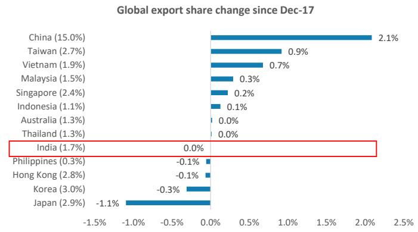

bar chart

Global export share change since Dec-17
| Country/Region | Change (%) |
| :--- | :--- |
| China | 2.1 |
| Taiwan | 0.9 |
| Vietnam | 0.7 |
| Malaysia | 0.3 |
| Singapore | 0.2 |
| Indonesia | 0.1 |
| Australia | 0.0 |
| Thailand | 0.0 |
| India | 0.0 |
| Philippines | -0.1 |
| Hong Kong | -0.1 |
| Korea | -0.3 |
| Japan | -1.1 |

Source: CEIC, Haver, MS

Boosting manufacturing exports is the key to solving the jobs challenge: In our view, this makes the task of boosting manufacturing even more urgent than before. Indeed, considering the starting point of per capita incomes, India's industry to GDP ratio should have been rising rather than declining as it did over the past 17 years. Other Asian economies were able to target and achieve higher growth rates to reap the demographics dividend, by focusing on the manufacturing sector and goods exports to get higher employment, incomes and saving.

## The manufacturing sector also generates significant positive spillovers.

1. The secondary sector tends to have comparable or even higher employment elasticity vs. the services sector. Second, World Bank analysis covering 51 OECD and non-OECD countries from 1995-2018 show that employment growth linked to exports has tended to exceed employment growth linked to domestic demand. Within exporting sectors, it is the case that manufacturing goods exports has the highest employment elasticity.

2. More importantly, there is also significant indirect job creation that emerges from a rise in manufacturing exports. Every job created in the manufacturing exports sector will create two other jobs in related business services sectors such as transport and logistics, marketing and design services, R&D.

Exhibit 26: World Bank analysis shows global employment elasticities tend to be higher for the manufacturing exports sector...  
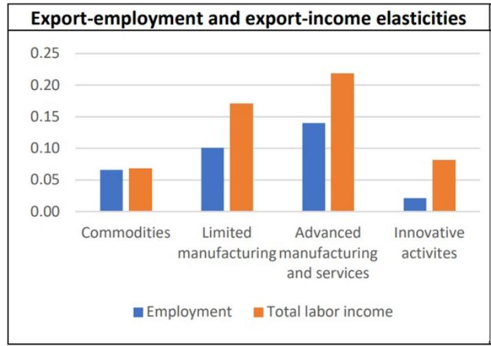

bar chart

Export-employment and export-income elasticities
| Category | Employment | Total labor income |
|---|---|---|
| Commodities | 0.065 | 0.068 |
| Limited manufacturing | 0.102 | 0.171 |
| Advanced manufacturing and services | 0.142 | 0.219 |
| Innovative activites | 0.023 | 0.081 |

Source: World Bank

Exhibit 27: ...especially in high-to-medium technology intensity exports  
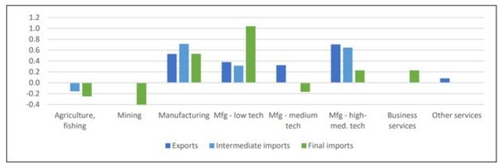

bar chart

| Category | Exports | Intermediate imports | Final imports |
|---|---|---|---|
| Agriculture, fishing | -0.1 | -0.1 | -0.2 |
| Mining | -0.3 | -0.4 | -0.1 |
| Manufacturing | 0.5 | 0.7 | 0.5 |
| Mfg - low tech | 0.35 | 0.3 | 1.05 |
| Mfg - medium tech | 0.3 | -0.1 | -0.1 |
| Mfg - high-med. tech | 0.65 | 0.6 | 0.2 |
| Business services | -0.1 | -0.1 | 0.2 |
| Other services | 0.1 | -0.1 | -0.1 |

Source: World Bank

## What India needs – A systematic policy approach

Drawing on the key success factors from China's experience: India will have to find ways to replicate the model which China has successfully employed over the years. We believe that policy makers will have to come up with a systematic approach that involves targeting high growth sectors, taking steps to deliver an integrated supply chain, align the financial system so that lending can be directed towards high growth sectors, supercharge R&D spend, and skill the workforce. We discuss these factors in detail below:

## 1. Taking steps to target high growth sectors

China has been able to foresee shifting trends in global demand and build capacity ahead of time: Over 2019–2024, China captured an estimated 19% of the increase in global exports across the world's top 15 fastest-growing export segments including EVs, batteries and solar panels. More recently, China is following the same playbook with the robotics sector, with the State Council flagging intelligent robots as a focus area in its national development plans as early as 2021.

India has had some initial success with this approach too: For instance, the PLI scheme has yielded initial success with the smartphone sector. We think the challenge now is to scale this up meaningfully and target high growth sectors across low, medium and high value-added sectors in an aggressive manner. For instance, India could target sectors which are sizeable from a domestic demand perspective and where India has significant import dependence. Another way is to identify sectors which are sizable globally but also where India does not have a significant export market share currently. Finally, India could also target the growth sectors which will become globally important over the next 5 to 10 years. Our industrial research team notes that there has been a recent rollout of government incentive schemes in key energy / infra sectors like nuclear, coal gasification and carbon capture.

## 2. Executing with an integrated supply chain and ecosystem

China has a comprehensive and integrated supply chain: Chinese industries tend to localize production of components, materials, and equipment, which reduces reliance on imports, lowers costs through economies of scale and allows for flexibility and customisation. Production also tends to be clustered geographically, enabling synergies through proximity.

India needs to replicate the success with the electronics sector: Using the electronics sector as the example again, while it initially started with assembly, there has been a move towards indigenous production of more components over time. Where India's approach will differ from China is that while China has relied on its domestic entrepreneurs to form part of the ecosystem, India will have to partner with the corporate sector from outside India to get them to produce domestically.

## 3. Having a financial system that is aligned to strategic goals

In China, local governments, banks and SOEs together form a risk capital pool that allows Chinese startups to scale up, experiment, and pursue long-term market leadership, often with the implicit assumption of short-term losses.

In India's context, we think that there will be a need to scale up priority sector lending. Policy-makers will have to identify the most important sectors which need funding support, particularly if they are emerging as strong growth engines.

## 4. Focusing on R&D and innovation

China's R&D spending to GDP has risen from $2.2\%$ in 2019 to $2.8\%$ in 2025, above the OECD average of $2.7\%$ .

India's R&D spending to GDP has been stagnant at $0.6 - 0.7\%$ of GDP. Policy-makers will likely have to roll out major tax incentives to supercharge R&D spending so that it can be uplifted significantly in a short span of time.

## 5. Ensuring that its workforce is adequately skilled

In China, the number of university graduates has increased $42\%$ , from 8.2mn in 2019 to 11.7mn in 2024. Around $42\%$ of China's annual college graduates have STEM degrees, with this talent pipeline feeding directly into research labs, tech companies, and factories.

Expanding the skilled labour pool in India remains key: At 34%, India already has a relatively high share of tertiary graduates with STEM degrees. That said, the gross tertiary education enrollment ratio remains relatively low at 34%, vs. 77% in China and the global average of 44%, while literacy rates and vocational training in the current labour force also remain relatively low compared to EM peers. Existing skilling programmes such as the Skill India Mission have yielded results and recent budgets have included additional funding for new schemes – such as central government funding for the training of 2 million workers over a five-year period and for upgrading 1,000 Industrial Training Institutes in the F2025 budget. That said, there were limited additional measures in the F2027 budget, and so there is scope to do more and to accelerate the pace on this front.

## The participation of states is of paramount importance

One key area in which India is different from China currently is the level of state government participation. While the central government has already been taking steps, we have emphasized before that there needs to be a systematic improvement in the ease of doing business across all levels of government. The central government will have to take the lead in coordinating these efforts to ensure active participation across states.

One such area where coordination is needed is in infrastructure investment to ensure efficient last-mile linkages. Major infrastructure plans have already been drawn up, and while the size of the infrastructure spending has picked up in recent years, there remains scope to bring these projects to fruition in a speedier manner. There is also scope for better coordination amongst government agencies, central and state governments in order to bring about a seamless execution – especially in the areas of improving the last-mile connectivity of major infrastructure projects. For instance, the feeder routes to connect flagship infrastructure projects like sea bridges and airports are still taking time to be constructed, which limits the reaping of the full benefits of these flagship projects.

To this end, the Gati Shakti program will be an important initiative and steps have been taken to bring together the plans of the state, division and district levels, but implementation will be key to watch.

In terms of actual implementation, one way is to have a 500-member taskforce to plan and a 10,000-member taskforce to guide, coordinate and execute in partnership with the state governments. At the same time, India should unleash competitive forces, lower barriers to entry, and create conditions conductive to the flourishing of small and medium-sized enterprises.

Exhibit 28: China's global export market share gains have been propelled by gains in fast-growing segments  
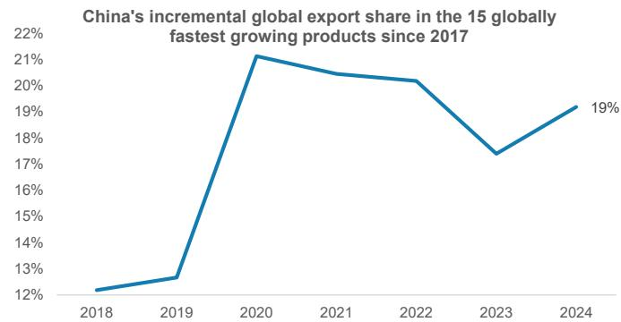

line chart

| Year | Value |
| ---- | ----- |
| 2018 | 12%   |
| 2019 | 13%   |
| 2020 | 21%   |
| 2021 | 20.5% |
| 2022 | 20.3% |
| 2023 | 17.5% |
| 2024 | 19%   |

Source: WITS, MS; Note: 2024 estimated by MS. We identified the top 15 fastest-growing export segments at the HS four-digit level, which recorded the largest increases in global export market between 2019 and 2024. These segments include semiconductors, motor vehicles & parts, computers, mobile phones, vaccines, packaged medicines, batteries, trucks, electrical transformers & power converters, electrical wires & cables, semiconductor manufacturing equipment, medical equipment, tractors, semiconductor components, and industrial robots.

Exhibit 29: This is helped by China's ability to anticipate shifting global demand trends in high-growth emerging sectors like EVs, batteries, and robotics and build capacity to meet demand, even if ahead of time  
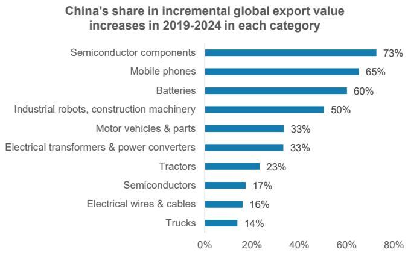

bar chart

China's share in incremental global export value increases in 2019-2024 in each category
| Category | Value (%) |
|---|---|
| Semiconductor components | 73 |
| Mobile phones | 65 |
| Batteries | 60 |
| Industrial robots, construction machinery | 50 |
| Motor vehicles & parts | 33 |
| Electrical transformers & power converters | 33 |
| Tractors | 23 |
| Semiconductors | 17 |
| Electrical wires & cables | 16 |
| Trucks | 14 |

Source: WITS, MS; Note: Only top 10 products are shown.

## Disclosure Section

Information and opinions in MS were prepared or are disseminated by one or more of the following, which accept responsibility for its contents: MS Asia Limited, and/or MS Asia (Singapore) Pte. (Registration number 199206298Z) and/or MS Asia (Singapore) Securities Pte Ltd (Registration number 200008434H), regulated by the Monetary Authority of Singapore (which accepts legal responsibility for its contents and should be contacted with respect to any matters arising from, or in connection with, MS), and/or MS Taiwan Limited and/or MS & Co International plc, Seoul Branch, and/or MS Australia Limited (A.B.N. 67 003 734 576, holder of Australian financial services license No. 233742), and/or MS Wealth Management Australia Pty Ltd (A.B.N. 19 009 145 555, holder of Australian financial services license No. 240813, and/or MS India Company Private Limited having Corporate Identification No (CIN) U22990MH1998PTC115305, regulated by the Securities and Exchange Board of India ("SEBI") and holder of licenses as a Research Analyst (SEBI Registration No. INH000001105), Stock Broker (SEBI Stock Broker Registration No. INZ000244438), Merchant Banker (SEBI Registration No. INM000011203), and depository participant with National Securities Depository Limited (SEBI Registration No. IN-DP-NSDL-567-2021) having registered office at Altimus, Level 39 & 40, Pandurang Budhkar Marg, Worli, Mumbai 400018, India; Telephone no. +91-22-61181000; Compliance Officer Details: Mr. Tejarshi Hardas, Tel. No.: +91-22-61181000 or Email: tejarshi.hardas@morganstanley.com; Grievance officer details: Mr. Tejarshi Hardas, Tel. No.: +91-22-61181000 or Email: msic-compliance@morganstanley.com which accepts the responsibility for its contents and should be contacted with respect to any matters arising from, or in connection with, MS and their affiliates (collectively, "MS"). MS India Company Private Limited (MSICPL) may use AI tools in providing research services. All recommendations contained herein are made by the duly qualified research analysts; For important disclosures, stock price charts and equity rating histories regarding companies that are the subject of this report, please see the MS Disclosure Website at www.morganstanley.com/eqr/disclosures/webapp/generalresearch, or contact your investment representative or MS at 1585 Broadway, (Attention: Research Management), New York, NY, 10036 USA.

For valuation methodology and risks associated with any recommendation, rating or price target referenced in this research report, please contact the Client Support Team as follows: US/Canada +1 800 303-2495; Hong Kong +852 2848-5999; Latin America +1 718 754-5444 (U.S.); London +44 (0)20-7425-8169; Singapore +65 6834-6860; Sydney +61 (0)2-9770-1505; Tokyo +81 (0)3-6836-9000. Alternatively you may contact your investment representative or MS at 1585 Broadway, (Attention: Research Management), New York, NY 10036 USA.

## Global Research Conflict Management Policy

MS has been published in accordance with our conflict management policy, which is available at www.morganstanley.com/institutional/research/conflictpolicies. A Portuguese version of the policy can be found at www.morganstanley.com.br

## Important Disclosures

MS is not acting as a municipal advisor and the opinions or views contained herein are not intended to be, and do not constitute, advice within the meaning of Section 975 of the Dodd-Frank Wall Street Reform and Consumer Protection Act.

MS does not provide individually tailored investment advice. MS has been prepared without regard to the circumstances and objectives of those who receive it. MS recommends that investors independently evaluate particular investments and strategies, and encourages investors to seek the advice of a financial adviser. The appropriateness of an investment or strategy will depend on an investor's circumstances and objectives. The securities, instruments, or strategies discussed in MS may not be suitable for all investors, and certain investors may not be eligible to purchase or participate in some or all of them. MS is not an offer to buy or sell or the solicitation of an offer to buy or sell any security/instrument or to participate in any particular trading strategy. The value of and income from your investments may vary because of changes in interest rates, foreign exchange rates, default rates, prepayment rates, securities/instruments prices, market indexes, operational or financial conditions of companies or other factors. There may be time limitations on the exercise of options or other rights in securities/instruments transactions. Past performance is not necessarily a guide to future performance. Estimates of future performance are based on assumptions that may not be realized. If provided, and unless otherwise stated, the closing price on the cover page is that of the primary exchange for the subject company's securities/instruments.

The fixed income research analysts, strategists or economists principally responsible for the preparation of MS have received compensation based upon various factors, including quality, accuracy and value of research, firm profitability or revenues (which include fixed income trading and capital markets profitability or revenues), client feedback and competitive factors. Fixed Income Research analysts', strategists' or economists' compensation is not linked to investment banking or capital markets transactions performed by MS or the profitability or revenues of particular trading desks.

With the exception of information regarding MS, MS is based on public information. MS makes every effort to use reliable, comprehensive information, but we make no representation that it is accurate or complete. We have no obligation to tell you when opinions or information in MS change apart from when we intend to discontinue equity research coverage of a subject company. Facts and views presented in MS have not been reviewed by, and may not reflect information known to, professionals in other MS business areas, including investment banking personnel.

MS may make investment decisions that are inconsistent with the recommendations or views in this report.

To our readers based in Taiwan or trading in Taiwan securities/instruments: Information on securities/instruments that trade in Taiwan is distributed by MS Taiwan Limited ("MSTL"). Such information is for your reference only. The reader should independently evaluate the investment risks and is solely responsible for their investment decisions. MS may not be distributed to the public media or quoted or used by the public media without the express written consent of MS. Any non-customer reader within the scope of Article 7-1 of the Taiwan Stock Exchange Recommendation Regulations accessing and/or receiving MS is not permitted to provide MS to any third party (including but not limited to related parties, affiliated companies and any other third parties) or engage in any activities regarding MS which may create or give the appearance of creating a conflict of interest. Information on securities/instruments that do not trade in Taiwan is for informational purposes only and is not to be construed as a recommendation or a solicitation to trade in such securities/instruments. MSTL may not execute transactions for clients in these securities/instruments.

MS is not incorporated under PRC law and the research in relation to this report is conducted outside the PRC. MS does not constitute an offer to sell or the solicitation of an offer to buy any securities in the PRC. PRC investors shall have the relevant qualifications to invest in such securities and shall be responsible for obtaining all relevant approvals, licenses, verifications and/or registrations from the relevant governmental authorities themselves. Neither this report nor any part of it is intended as, or shall constitute, provision of any consultancy or advisory service of securities investment as defined under PRC law. Such information is provided for your reference only.

MS is disseminated in Brazil by MS C.T.V.M. S.A. located at Av. Brigadeiro Faria Lima, 3600, 6th floor, São Paulo - SP, Brazil; and is regulated by the Comissão de Valores Mobiliários; in Mexico by MS México, Casa de Bolsa, S.A. de C.V which is regulated by Comision Nacional Bancaria y de Valores. Paseo de los Tamarindos 90, Torre 1, Col. Bosques de las Lomas Floor 29, 05120 Mexico City; in Japan by MS MUFG Securities Co., Ltd. and, for Commodities related research reports only, MS Capital Group Japan Co., Ltd; in Hong Kong by MS Asia Limited (which accepts responsibility for its contents) and by MS Bank Asia Limited; in Singapore by MS Asia (Singapore) Pte. (Registration number 199206298Z) and/or MS Asia (Singapore) Securities Pte Ltd (Registration number 200008434H), regulated by the Monetary Authority of

Singapore (which accepts legal responsibility for its contents and should be contacted with respect to any matters arising from, or in connection with, MS) and by MS Bank Asia Limited, Singapore Branch (Registration number T14FC0118); in Australia to "wholesale clients" within the meaning of the Australian Corporations Act by MS Australia Limited A.B.N. 67 003 734 576, holder of Australian financial services license No. 233742, which accepts responsibility for its contents; in Australia to "wholesale clients" and "retail clients" within the meaning of the Australian Corporations Act by MS Wealth Management Australia Pty Ltd (A.B.N. 19 009 145 555, holder of Australian financial services license No. 240813, which accepts responsibility for its contents; in Korea by MS & Co International plc, Seoul Branch; in India by MS India Company Private Limited having Corporate Identification No (CIN) U22990MH1998PTC115305, regulated by the Securities and Exchange Board of India ("SEBI") and holder of licenses as a Research Analyst (SEBI Registration No. INH000001105); Stock Broker (SEBI Stock Broker Registration No. INZ000244438), Merchant Banker (SEBI Registration No. INM000011203), and depository participant with National Securities Depository Limited (SEBI Registration No. IN-DP-NSDL-567-2021) having registered office at Altimus, Level 39 & 40, Pandurang Budhkar Marg, Worli, Mumbai 400018, India; Telephone no. +91-22-61181000; Compliance Officer Details: Mr. Tejarshi Hardas, Tel. No.: +91-22-61181000 or Email: tejarshi.hardas@morganstanley.com; Grievance officer details: Mr. Tejarshi Hardas, Tel. No.: +91-22-61181000 or Email: msic-compliance@morganstanley.com. MS India Company Private Limited (MSICPL) may use AI tools in providing research services. All recommendations contained herein are made by the duly qualified research analysts; in Canada by MS Canada Limited; in Germany and the European Economic Area where required by MS Europe S.E., regulated by Bundesanstalt fuer Finanzdienstleistungsaufsicht (BaFin) under the reference number 149169; in the United States by MS & Co. LLC, which accepts responsibility for its contents. MS & Co. International plc, authorized by the Prudential Regulation Authority and regulated by the Financial Conduct Authority and the Prudential Regulation Authority, disseminates in the UK research that it has prepared, and research which has been prepared by any of its affiliates, only to persons who (i) are investment professionals falling within Article 19(5) of the Financial Services and Markets Act 2000 (Financial Promotion) Order 2005 (as amended, the "Order"); (ii) are persons who are high net worth entities falling within Article 49(2)(a) to (d) of the Order; or (iii) are persons to whom an invitation or inducement to engage in investment activity (within the meaning of section 21 of the Financial Services and Markets Act 2000, as amended) may otherwise lawfully be communicated or caused to be communicated. RMB MS Proprietary Limited is a member of the JSE Limited and A2X (Pty) Ltd. RMB MS Proprietary Limited is a joint venture owned equally by MS International Holdings Inc. and RMB Investment Advisory (Proprietary) Limited, which is wholly owned by FirstRand Limited. The information in MS is being disseminated by MS Saudi Arabia, regulated by the Capital Market Authority in the Kingdom of Saudi Arabia, and is directed at Sophisticated investors only.

The trademarks and service marks contained in MS are the property of their respective owners. Third-party data providers make no warranties or representations relating to the accuracy, completeness, or timeliness of the data they provide and shall not have liability for any damages relating to such data. The Global Industry Classification Standard (GICS) was developed by and is the exclusive property of MSCI and S&P.

MS, or any portion thereof may not be reprinted, sold or redistributed without the written consent of MS.

Indicators and trackers referenced in MS may not be used as, or treated as, a benchmark under Regulation EU 2016/1011, or any other similar framework.

The information in MS is being communicated by MS & Co. International plc (DIFC Branch), regulated by the Dubai Financial Services Authority (the DFSA) or by MS & Co. International plc (ADGM Branch), regulated by the Financial Services Regulatory Authority Abu Dhabi (the FSRA), and is directed at Professional Clients only, as defined by the DFSA or the FSRA, respectively. The financial products or financial services to which this research relates will only be made available to a customer who we are satisfied meets the regulatory criteria of a Professional Client. A distribution of the different MS Research ratings or recommendations, in percentage terms for Investments in each sector covered, is available upon request from your sales representative.

The information in MS is being communicated by MS & Co. International plc (QFC Branch), regulated by the Qatar Financial Centre Regulatory Authority (the QFCRA), and is directed at business customers and market counterparties only and is not intended for Retail Customers as defined by the QFCRA.

As required by the Capital Markets Board of Turkey, investment information, comments and recommendations stated here, are not within the scope of investment advisory activity. Investment advisory service is provided exclusively to persons based on their risk and income preferences by the authorized firms. Comments and recommendations stated here are general in nature. These opinions may not fit to your financial status, risk and return preferences. For this reason, to make an investment decision by relying solely to this information stated here may not bring about outcomes that fit your expectations.

Registration granted by SEBI and certification from the National Institute of Securities Markets (NISM) in no way guarantee performance of the intermediary or provide any assurance of returns to investors. Investment in securities market are subject to market risks. Read all the related documents carefully before investing.

© 2026 MS