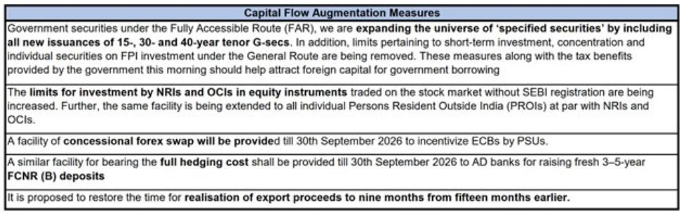

# 摩根斯坦利：印度真正需要解决的，不是短期资本流入，而是制造业竞争力的结构性缺口

市场对印度近期的政策反应普遍积极——取消资本利得税、扩大政府债券投资范围、提高海外个人投资限额，一系列措施密集出台。但摩根斯坦利最新发布的亚洲宏观报告提出了一个冷静的判断：这些措施能缓解短期压力，但无法解决根本问题。

这份由首席亚洲经济学家Chetan Ahya领衔的报告，核心论点是：印度面临的不是流动性问题，而是国际收支的结构性承压。而解决这一压力的唯一路径，是制造业竞争力的系统性提升。资本账户管理只是治标，制造业出口能力的建设才是治本。

报告的数据框架清晰地展示了问题的严重性：2024年12月至2026年3月，印度国际收支累计录得520亿美元的赤字。这个数字是2011-2013年期间250亿美元赤字的两倍以上。更值得关注的是，卢比的实际有效汇率已经跌至低于10年均值3.7个标准差的位置——这不是短期波动，而是系统性的失衡信号。

本文将从五个层次拆解这份报告的核心洞察，并在最后提出一个报告尚未完全回答的关键问题，供读者进一步思考。

## 1. 资本外流的根源不是市场情绪，而是相对盈利增速的结构性分化

许多市场观察者将印度的资本外流归因于地缘政治风险或全球利率环境。但摩根斯坦利的分析揭示了更深层的原因：印度企业的相对盈利增速正在失去吸引力。

报告提供了一组关键对比数据：2026年第一季度，印度BSE500指数成分股盈利同比增长13%。这个数字本身并不差，但放在区域比较中就显得苍白——韩国KOSPI指数盈利增长171%，台湾加权指数增长49%，日本TOPIX增长33%，美国标普500增长29%。印度是主要经济体中盈利增速最低的几个之一。

这意味着什么？全球资本正在重新定价“增长溢价”。AI和工业供应链重构带来的盈利脉冲，正在将资金从传统的“人口红利”故事抽离，转向更直接受益于技术周期的市场。印度在这一轮资本再配置中，处于相对不利的位置。

报告进一步指出，印度的油气贸易逆差占GDP比例达到3.4%，是亚洲主要经济体中最高之一。能源价格冲击通过贸易条件恶化，进一步削弱了印度对外资的吸引力。这不是一个临时性问题——只要能源结构没有根本性改变，这一结构性拖累就会持续存在。

## 2. 短期政策工具能争取时间，但无法改变国际收支的底层逻辑

面对国际收支压力，印度政府和央行已经打出了一套组合拳：取消政府证券投资的资本利得税和股息税、扩大“完全可进入路径”下的债券范围、提高海外个人投资限额、为国有企业外部商业借款提供汇率对冲支持。报告明确认为，这些措施在短期内是有效的。

但关键问题在于：这些措施解决的是“流量”问题，而不是“存量”问题。它们可以缓解卢比贬值压力、降低汇率波动，但无法提升印度经济自身的储蓄和创汇能力。

报告给出了一个清晰的预测路径：在能源价格温和回落的假设下，印度经常账户赤字将从2026财年的0.6%扩大到2027财年的1.8%，之后在2028财年收窄至1.2%。但即使按照这个相对乐观的假设，经常账户赤字仍将持续存在。如果没有制造业出口的增长来弥补这一缺口，国际收支压力将反复出现。

这引出了一个核心判断：印度需要的是储蓄率的可持续提升，而储蓄率的提升必须依赖于就业增长，就业增长又必须依赖于制造业的扩张。这是一个环环相扣的逻辑链条。

## 3. 制造业的双重红利：同时改善经常账户和资本账户

报告提出了一个容易被忽视的洞察：制造业的扩张能够同时从两个方向改善国际收支。一方面，制造业出口增长可以直接缩小贸易逆差，改善经常账户；另一方面，制造业吸引的外国直接投资能够增强资本账户的稳定性。

这与印度过去依赖服务业出口的模式有本质区别。服务业出口虽然利润率较高，但创造就业的能力有限，且对资本账户的直接拉动作用较弱。制造业则不同——它既能够大规模吸纳就业（从而提升储蓄率），又能够通过供应链本地化吸引长期资本流入。

报告特别强调，印度制造业的目标不应只是低端组装，而是要在价值链上实现系统性提升。这意味着需要针对高增长行业制定政策、确保供应链的整合、让金融体系与之对齐、加大研发投入、以及劳动力技能的系统性培训。这五个政策方向构成了一个完整的框架。

值得注意的是，报告指出印度的非科技类出口正在出现复苏迹象，但程度仍然有限。这意味着制造业转型的起点并不高，政策的紧迫性反而更大。

## 4. 印度面临的关键约束：如何在“AI叙事”和“人口红利”之间找到自己的位置

报告虽然没有直接使用这个表述，但它的数据框架揭示了一个更深层的战略问题：全球资本正在按照“技术周期”而非“人口周期”重新配置。韩国和台湾的盈利增长主要受益于AI相关产业链的需求爆发，而印度在这一轮技术浪潮中的参与度相对有限。

这意味着，印度不能简单地复制中国的制造业崛起路径。中国制造业的腾飞恰逢全球贸易自由化的黄金时期和WTO的红利期。而当前的全球贸易环境更加碎片化，技术竞争更加激烈，供应链重构更多是出于安全考虑而非效率考虑。

印度需要找到自己的差异化定位。报告的观点是，制造业竞争力的提升可以帮助印度在“中国+1”的供应链多元化趋势中占据有利位置。但这要求印度在基础设施、营商环境、劳动力技能等方面做出实质性的改进，而不仅仅是政策层面的表态。

这里有一个报告没有完全展开的问题：印度制造业的竞争优势究竟在哪里？是劳动力成本、市场规模、还是政策激励？如果只是依赖关税壁垒和补贴，而不解决生产效率的根本问题，那么制造业的增长可能难以持续。

## 5. 报告尚未完全回答的关键问题：制造业转型的“第一推动力”从何而来

这是本文希望读者重点关注的部分。摩根斯坦利的报告清晰地指出了制造业转型的必要性和政策方向，但有一个关键问题没有被充分讨论：在资本外流、盈利增速放缓、能源价格冲击的背景下，印度如何获得制造业转型所需的“第一推动力”？

制造业转型需要大量的前期投资——基础设施、技术研发、工人培训、供应链建设。这些投资需要资金支持，而印度目前面临的恰恰是资本流出的压力。这是一个典型的“先有鸡还是先有蛋”的困境：没有制造业增长，就无法吸引长期资本；没有长期资本，制造业增长就缺乏资金支持。

报告提到的短期政策工具可以争取时间，但时间窗口是有限的。如果资本流入的改善只是暂时的，而制造业转型的成效需要数年才能显现，那么印度可能面临一个“青黄不接”的风险期。

这个问题对于投资者来说具有实际的含义：如何评估印度制造业转型的“可信度”？是关注政策出台的频率，还是关注实际的外商直接投资数据？是关注出口市场份额的变化，还是关注制造业采购经理人指数的趋势？不同的观察框架会得出不同的判断。

---

上述关于“第一推动力”的问题，正是我们希望在社群中深入讨论的。完整报告中包含了更多关于印度制造业价值链细分领域的分析、各行业出口竞争力的量化评估、以及政策效果的敏感性测试。这些内容在本文中无法一一展开，但它们对于形成完整的投资判断至关重要。

欢迎来到我们的知识星球和微信群，与关注全球宏观与产业趋势的读者一起，继续探讨这些问题。我们会在社群中分享完整报告的解读、原始图表，以及更多关于亚洲制造业格局的深度分析。

Personal reading notes and learning share only. Not investment advice.

