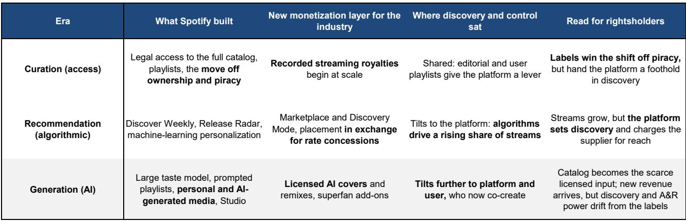
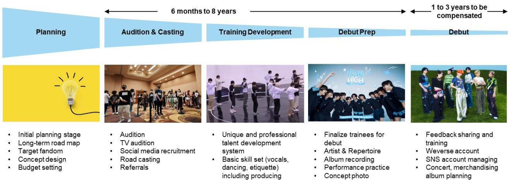
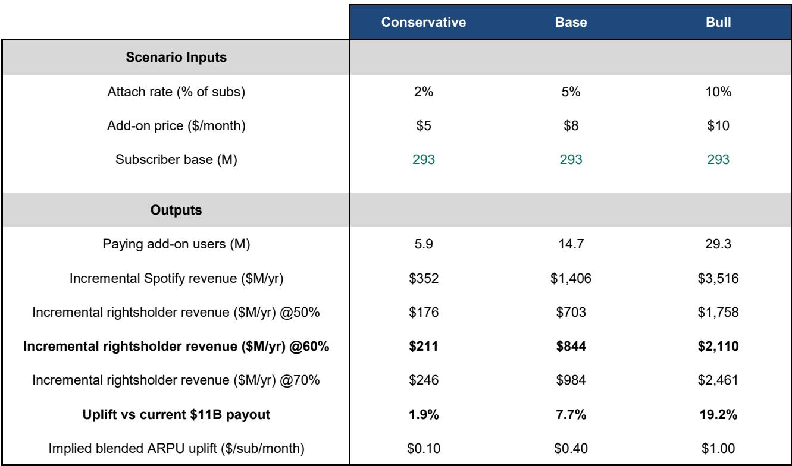

# Bernstein：AI不是音乐的威胁，而是超级粉丝变现的桥梁

音乐产业正在经历一场被市场低估的结构性转变。当大多数讨论聚焦于AI是否将取代人类创作时，一份来自Bernstein的最新研报提出了相反的判断：AI恰恰是唱片公司实现“超级粉丝”变现的关键工具，而非生存威胁。

这份报告的触发点来自Spotify最近的投资者日活动。当天最重磅的公告不是用户增长或定价策略，而是一份史无前例的授权协议——Spotify与环球音乐集团达成合作，允许Premium用户基于授权曲库付费创作AI翻唱和混音版本。这是全球主流流媒体平台与主要唱片公司之间首次建立基于“同意、署名和补偿”原则的AI音乐框架。

Bernstein团队长期认为，AI是唱片公司实现超级粉丝变现的桥梁，而非行业颠覆者。这份协议就是最清晰的证据。从Suno和Udio最初闯入AI音乐领域至今不过短短数年，整个品类已经可以通过全球最大音乐平台的框架，演变为唱片公司明确的增长引擎。

## 1. 超级粉丝附加服务正在创造一块完全增量的版税池

理解这一变化的关键在于：这不是对现有流媒体收入的重新分配，而是在其之上叠加的全新收入层。

Spotify管理层在投资者日上明确了一个核心洞察——用户的付费意愿遵循幂律分布。头部一小部分高度活跃的用户愿意支付远超标准订阅费用的金额。公司不再试图仅通过提价和增加订阅人数来扩大音乐收入池，而是通过付费附加服务来捕获这部分“超级粉丝”的价值。

与环球音乐达成的翻唱和混音协议，正是这一策略在版权方层面的首次落地。它的结构是付费Premium附加服务，录音版权所有者和词曲作者共同分享粉丝创作带来的收益。对行业而言，最关键的信号是：这笔收入是增量。它叠加在流媒体收入之上，而非重新分配现有池子。而且，由于曲库本身就是输入素材，Spotify不需要增加用户的收听时长就能扩大对版权方的支付。

Bernstein用Spotify唯一公开披露过的附加服务“有声书+”作为锚点来估算规模。该服务年化收入约1亿美元，付费用户超过100万，意味着每位付费用户每月贡献约8美元，在总订阅用户中的渗透率约为0.3%。这一成果在不到一年内、仅覆盖22个市场的情况下达成，为附加服务的定价区间（5至10美元）提供了可信的参照，也表明渗透率还有多年的增长空间。

基于当前约2.93亿订阅用户，Bernstein给出了三档情景测算。保守情景下，2%的渗透率、5美元月费，Spotify每年可增加约3.5亿美元收入，其中约2.1亿美元流向版权方。基准情景下，5%渗透率、8美元月费，Spotify年增量收入约14亿美元，版权方分得约8.45亿美元，相当于当前行业从Spotify获得的110亿美元年收入的7.7%。乐观情景下，10%渗透率、10美元月费，Spotify年增量达35亿美元，版权方分得约21亿美元，接近当前池子的19%。

这些数字背后还有两个结构性优势。第一，翻唱和混音产品以词曲版权为核心，出版商和词曲作者获得的份额可能高于普通流媒体播放（后者以录音版权为主）。第二，购买附加服务的用户是整个用户群中最忠诚的部分，流失率更低、生命周期价值更高，意味着这笔增量收入比等额的普通订阅收入更具持久性。

## 2. 华纳音乐预计将很快签署自己的AI翻唱和混音协议

Bernstein预期，华纳音乐将很快跟进签署自己的AI翻唱和混音授权协议。这一判断基于两个并行的增长引擎。

第一个引擎是Spotify。华纳音乐每年已从Spotify获得约12亿美元收入，付费创作附加服务可以干净地叠加在这一基础之上。第二个引擎是AI原生平台。华纳音乐是首家与Suno达成授权协议的主要唱片公司，也已与Udio达成和解，从这些快速扩张的池子中分得一杯羹。单是Suno一家，年化收入已达约2至3亿美元，且仍在快速扩张。

Bernstein预计，到2027年，授权AI将为唱片公司贡献低个位数的收入增长动力。这一判断相对保守，因为报告并未假设环球音乐能够保持“独家”地位——消费者并不会在意他们喜欢的艺人属于哪家唱片公司。

## 3. 索尼音乐受益但更复杂，平台控制权的转移是长期隐忧

对于索尼音乐而言，Spotify的投资者日传达的信息同样是结构性利好，但比纯音乐业务的同行更为复杂。作为全球三大唱片公司之一，索尼直接受益于AI翻唱和混音授权带来的增量收入，稀缺曲库是关键投入要素。

然而，Bernstein的评级更为谨慎。报告指出，更广泛的转变——从平台控制的发现机制、AI驱动的创作到非音乐收入池——意味着索尼参与的是一个不断增长的大饼，但可能逐步让渡增量控制权和收入份额。这解释了为什么Bernstein给予索尼“市场表现”评级，而非“跑赢大盘”。

这一判断的底层逻辑是Bernstein对Spotify战略演进的框架性分析。报告将Spotify的演进划分为三个阶段：策展时代（接入）、推荐时代（算法）和生成时代（AI）。在每个阶段，Spotify都为行业提供了新的变现方式——先是流媒体版税，然后是市场推广工具，现在是授权AI——但同时也在逐步掌握对发现机制和用户关系的控制权。唱片公司的角色从守门人逐步收窄为稀缺授权的供应商。

## 4. HYBE已经将超级粉丝变现工业化，Spotify正在向K-pop模式收敛

Bernstein报告中一个极具洞察力的判断是：HYBE已经将Spotify正在追求的方向工业化了。

HYBE的商业模式建立在“爱”而非“听”的基础上。通过Weverse这一封闭生态系统，HYBE控制着知识产权和粉丝接触渠道，在偶像的全生命周期内实现高频变现——内容、周边、互动，每一个触点都在叠加每用户平均收入。

报告认为，Spotify在K-pop领域的投入并非简单的类型押注，而是对“参与深度而非规模”这一战略方向的确认。随着AI使个性化和互动规模化，Spotify实际上正在向K-pop的商业模式收敛——超级粉丝为接触和接近付费，而拥有整合平台和超级知识产权的公司（如HYBE）捕获增量收入。

这一判断将HYBE从“韩国娱乐公司”的标签中解放出来，将其重新定义为“超级粉丝变现的基础设施提供商”。Bernstein对HYBE给予“跑赢大盘”评级，目标价高达40万韩元，而当前股价仅为19.6万韩元，隐含超过一倍的上行空间。

## 5. 报告尚未完全回答的关键问题：稀释效应与平台权力的平衡

尽管Bernstein的报告提供了清晰的框架，但仍有几个关键问题值得进一步探讨。

第一，稀释效应的实际速度。报告承认，随着AI生成内容大量涌入，现有曲库在按比例分配的收入池中的份额将逐步被侵蚀。但这一过程的速度取决于多个变量：用户实际消费AI生成内容的时间占比、平台推荐算法的偏向性、以及版权方能否通过授权协议限制AI内容的数量。报告没有给出量化的侵蚀曲线。

第二，平台与版权方之间的权力平衡将如何演变。报告清晰地指出，Spotify在每个阶段都在增强对发现机制的控制。如果生成时代持续深化，平台对用户关系的掌控可能使版权方进一步沦为“原材料供应商”。版权方的议价能力是否会在下一个谈判周期中受到实质性削弱？这取决于AI附加服务的渗透速度是否足够快，以至于版权方愿意接受更低的单位收入来换取规模。

第三，超级粉丝变现的终极天花板。报告基于有声书+的渗透率数据进行了推算，但音乐附加服务与有声书附加服务的用户行为可能存在本质差异。翻唱和混音功能是否真的能触及10%甚至20%的付费用户？这需要实际数据验证。

## 6. 投资者的观察框架：从“流媒体增长”转向“每用户价值结构”

Bernstein的报告为投资者提供了一个新的分析框架。传统的音乐行业投资逻辑围绕流媒体订阅用户增长和定价能力展开。未来的逻辑需要增加三个维度。

第一，附加服务的渗透曲线。哪家公司在超级粉丝变现上布局最快、执行最有效？HYBE的Weverse已经验证了模式，但西方市场能否复制同样的闭环生态系统？Spotify的附加服务渗透率将是最直接的先行指标。

第二，版权方的议价结构。授权AI协议中的收入分成比例、独家条款的持续时间、以及对AI生成内容的数量限制，将决定版权方在这一轮增量中能捕获多少价值。Bernstein假设50%至70%的分成比例，但实际谈判结果可能因版权方的议价能力而出现分化。

第三，平台控制权的再平衡。如果超级粉丝变现成功，平台和版权方之间的权力天平可能重新摆动——因为版权方的稀缺曲库是AI附加服务的核心输入。这可能是版权方在流媒体时代获得的最强议价筹码。但前提是版权方能够保持团结，避免被平台逐个击破。

Bernstein的报告最终指向一个判断：音乐行业正在从“听歌”转向“参与”。这一转变对版权方有利有弊，但整体上，拥有稀缺曲库的主要唱片公司和拥有超级粉丝生态系统的平台型公司，将是这一轮结构变迁的最大受益者。

---

这些判断背后还有更多细节——Bernstein对Spotify定价策略的深入拆解、对AI原生平台收入规模的测算、以及对各家公司财务模型的逐项调整——这些内容在完整报告中都有更详尽的展开。如果你对某一维度特别感兴趣，或者想深入讨论这些判断背后的假设是否成立，欢迎来星球微信群里继续探讨。我们会在群内分享完整的报告原文和Bernstein的原始图表，也会定期组织对这些关键假设的跟踪讨论。

Personal reading notes and learning share only. Not investment advice.

