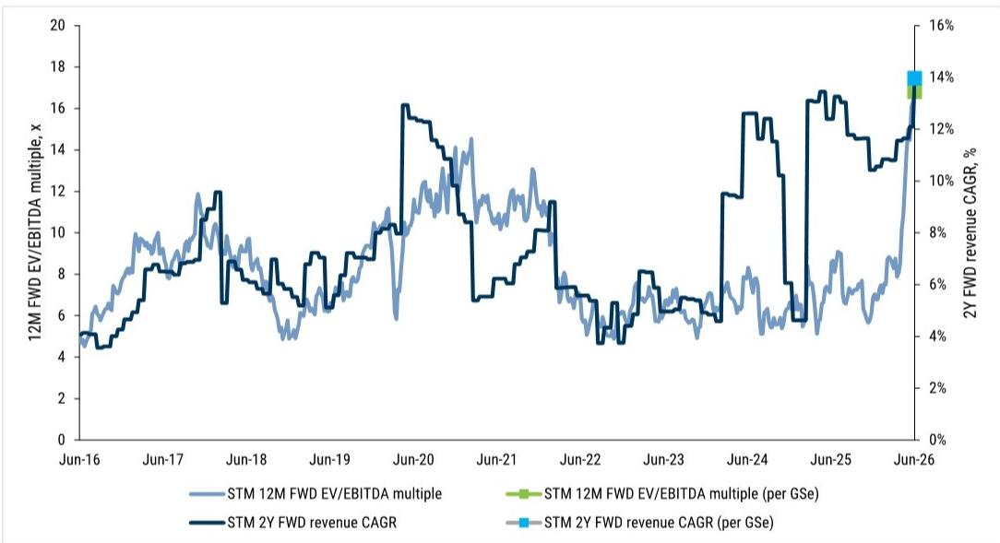
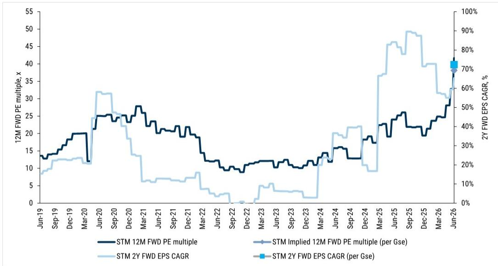

# Europe's Semiconductor Opportunity Is Not Just About AI Chips—It Is About the Infrastructure That Powers Them

The dominant narrative in semiconductor investing has focused on the companies that design the most advanced AI processors. But a global investment bank report recently updated its estimates for two major European semiconductor players, Infineon and STMicroelectronics, and the revisions tell a different story. The real value creation in the coming years may not come from the GPU designers themselves, but from the enabling technologies that make AI computation physically possible: power management, optical networking, and the manufacturing capacity to produce them at scale.

This is not a marginal adjustment. For Infineon, the report raises revenue estimates by 1-2% for FY27-30, but more importantly, it lifts earnings per share by 3-4% across the same period. For STMicroelectronics, the revisions are even starker: revenue estimates rise by 4-9% in dollar terms, while EPS jumps by 11-22%. These are not incremental tweaks. They represent a structural reassessment of how deeply these companies are embedded in the AI supply chain.

The timing matters. The market has been fixated on the near-term inventory correction in consumer semiconductors and the cyclical downturn in automotive chips. But beneath that noise, a secular wave is building. AI data centers require fundamentally different power architectures. Optical networking needs to scale exponentially. And the companies that provide these components are seeing demand signals that are not yet fully priced into consensus expectations.

The key insight from this report is that European semiconductor companies are not peripheral to the AI theme. They are becoming central to it. But the investment case is not uniform, and the valuation expansion that has already occurred raises difficult questions about how much of this future is already discounted.

## Infineon's Power Semiconductor Business Is Becoming an AI Play, and the Valuation Multiple Expansion Is Justified by a Doubling of Revenue Growth Trajectory

The report upgrades Infineon's price target from €75 to €88, and the mechanism for that upgrade is revealing. The valuation multiple has been expanded from 16x to 18x forward EV/EBITDA. At first glance, this might seem like a simple re-rating based on sentiment. But the report provides a rigorous framework for why this multiple expansion is warranted.

The historical median two-year forward revenue CAGR for Infineon has been approximately 9%. The current two-year forward revenue CAGR, based on the report's estimates, is 17%. That is nearly a doubling of the growth trajectory. The report argues that this 2x increase in revenue growth is broadly aligned with the expansion of the valuation multiple from a historical 10x to the implied 21x at the new price target.

This is not a speculative valuation argument. It is based on a structural shift in Infineon's end-market exposure. The company's power semiconductors are essential for the voltage regulation and power delivery systems in AI servers. Every GPU cluster requires sophisticated power management modules to handle the immense electrical loads. As AI training and inference scale, the demand for these components scales with it.

The report also highlights Infineon's capacity expansion plans, specifically the upcoming Dresden module that can support a revenue run-rate of €5 billion in the medium term. This is not a hypothetical. It is a concrete investment in manufacturing capacity that signals management's conviction in the demand trajectory.

The risk factors are real. The report cites weaker EV adoption rates, a worsening semiconductor cycle, and negative macro dynamics as key risks. But the direction of the revision is clear: AI-related demand from both GPU and CPU architectures is creating a new growth vector that did not exist at this scale in previous cycles.

## STMicroelectronics Is Benefiting from AI Infrastructure Demand Beyond Power, Particularly in Optical Networking, Where Revenue Estimates Have Been Raised by Up to 9%

The revisions for STMicroelectronics are more dramatic than for Infineon, and the reasons are different. While Infineon's AI exposure is primarily through power management, STMicroelectronics is seeing strength in optical networking—a critical component of AI infrastructure that is often overlooked.

AI data centers require massive amounts of data to move between servers, racks, and clusters. Optical interconnects are the only technology that can provide the bandwidth and latency required. STMicroelectronics provides key components for these optical networking systems. The report explicitly notes "continued demand for its offering in AI Infrastructure (especially in Optical networking)" as a driver for the upward revision.

The numbers are striking. Revenue estimates for FY26-30 are raised by 4-9% in dollar terms. Gross margin estimates are raised by 1-2 percentage points. But the operating income impact is where the leverage becomes apparent: EBIT estimates rise by 13-23% over the forecast period. This is not a linear relationship. The combination of higher revenue, better margins, and operating leverage creates a powerful compounding effect.

The report's valuation framework for STMicroelectronics mirrors the logic applied to Infineon. The historical two-year forward revenue CAGR was 7%. The current estimate is 14%. That is another doubling of the growth trajectory. The historical EV/EBITDA multiple has been approximately 8x. The implied multiple at the new price target is 17x. Again, the multiple expansion is roughly in line with the growth acceleration.

STMicroelectronics is rated Neutral, not Buy. This is an important distinction. The report sees the growth opportunity but also identifies significant risks: the pace of inventory correction in consumer semiconductors, competitive dynamics in Silicon Carbide, and the sustainability of current pricing. The upward revision does not change the rating, which suggests that while the opportunity is real, the risk-reward balance is less compelling than for Infineon.

## The Valuation Framework Used in This Report Raises an Unanswered Question: How Sustainable Is the Growth Acceleration, and What Happens When It Decelerates?

The report's valuation methodology is transparent and rigorous. It compares historical growth rates to current estimates and shows that the multiple expansion is consistent with the acceleration in revenue and earnings growth. But this framework contains an implicit assumption that deserves scrutiny.

The logic works in both directions. If the two-year forward revenue CAGR is 17% for Infineon versus a historical 9%, and the multiple expands from 10x to 21x, then what happens when the growth rate inevitably decelerates? AI infrastructure buildout is not a linear, perpetual process. At some point, the deployment of GPU clusters will reach a steady state. The growth rate will normalize. And if the multiple is priced for 17% growth, a reversion to 9% growth would imply a significant de-rating.

The report does not address this question directly, and it is not required to do so within the scope of a 12-month price target. But for investors with a longer horizon, this is the central analytical challenge. The current valuation embeds an assumption that the growth acceleration is structural and durable. If it proves to be cyclical—driven by a one-time buildout of AI infrastructure—then the downside risk is substantial.

The report also does not address the competitive dynamics within power semiconductors and optical networking. Infineon and STMicroelectronics are not the only players in these markets. Asian competitors, particularly in China and Korea, are investing heavily in similar technologies. The sustainability of pricing and market share is an open question that the report acknowledges as a risk but does not resolve.

## The Decision Framework for Investors Should Focus on Three Variables: AI Infrastructure Exposure, Valuation Relative to Growth, and Cyclical Risk Tolerance

The report provides the raw material for a structured investment decision. The key is to synthesize the information into a framework that can be applied consistently.

First, assess AI infrastructure exposure. Not all semiconductor companies benefit equally from AI. Infineon's exposure is through power management for GPU clusters. STMicroelectronics' exposure is through optical networking components. Both are real, but they are different in terms of growth trajectory and competitive dynamics. Investors should map each company's revenue exposure to specific AI infrastructure categories and evaluate whether the growth assumptions embedded in the report are conservative or aggressive.

Second, evaluate valuation relative to growth. The report provides a clear framework: compare the current two-year forward revenue CAGR to historical levels, and then assess whether the valuation multiple is consistent with that growth acceleration. For both Infineon and STMicroelectronics, the report argues that the multiple expansion is justified by the growth acceleration. But investors should stress-test this assumption. What if the growth rate is 12% instead of 17%? What if it is 8%? The sensitivity analysis is straightforward and revealing.

Third, consider cyclical risk tolerance. Both companies are exposed to semiconductor cycles that have historically been volatile. The report identifies weaker end markets, inventory corrections, and macro dynamics as key risks. Investors need to decide whether they are comfortable owning these names through a potential cyclical downturn while waiting for the secular AI trend to materialize. This is not a trivial consideration. The timing of the AI infrastructure buildout may not align with the semiconductor cycle.

## The Report Leaves Several Meaningful Questions Open, and That Is Precisely Why the Full Analysis Is Worth Reading

No single report can answer every question. The value of this analysis is that it provides a clear, testable framework for evaluating European semiconductor companies in the context of AI infrastructure demand. But it also leaves several important issues unresolved.

What is the competitive moat for Infineon and STMicroelectronics in their respective AI-adjacent markets? The report does not provide a detailed competitive analysis. How durable are the pricing trends in optical networking? The report notes favorable pricing as a risk factor but does not model a scenario where pricing normalizes. What is the impact of geopolitical risk on European semiconductor companies? The report does not address the potential for export controls or supply chain disruptions.

These are not criticisms of the report. They are the natural boundaries of any analytical exercise. The report provides a foundation. The investor's job is to build on it.

For those who want to examine the original charts, the revenue and EPS revision tables, and the valuation exhibits that underpin this analysis, the full report is the source. The charts alone tell a powerful story about how the market is re-rating European semiconductor companies in response to AI infrastructure demand.

Join the community to read the full report and review the original charts.

*This article is for learning and discussion only and does not constitute investment advice.*

Personal reading notes and learning share only. Not investment advice.

