## Asia Quantitative Strategy

# Asia Quant Strategy: Trim TW/KR momentum exposure - Risk of unwind high

Rupal Agarwal

+65 6326 7641

rupal.agarwal@bernsteinsg.com

Cheng Zhang, CFA, CQF

+852 2123 2636

cheng.zhang@bernsteinsg.com

Momentum has dominated all styles in the region YTD, delivering 29%/18% alpha in Asia ex Japan and Japan. The rally has been even stronger in TW, KR where momentum has delivered north of 50% alpha YTD. Since April, we have been positive on momentum stocks across Asia and Japan, as a risk-on proxy to play the de-escalation of the war (see here, here, here). However, over the last few weeks, we had turned cautious towards TW and KR equities due to overheating and increased concentration risk (see - here and here). In today's report, we re-iterate the increased risk of momentum unwind in Asia ex Japan ex China, led by TW and KR.

Where is the valuation bubble in the momentum trade? Asia ex Japan ex China momentum portfolio is in a valuation bubble, trading at record high valuations on both 12m fwd. PE and PB. This is driven by all-time high valuations for both TW and KR momentum baskets, which are already seeing de-rating since the beginning of this month. Valuation for Asia tech momentum portfolio has also peaked since June after reaching 2024 high valuation levels. Asia earnings momentum stocks also remain in bubble zone, even though they have been de-rating for some time. However, China and India momentum stocks are no where close to bubble valuations.

More than valuations, record high earnings expectations are worrying: Earnings has been a bigger driver for momentum stocks this year. Once in a generation AI technology resulted in earnings expectations for Asia tech stocks cross all previous levels. The record high upward revisions are now visible across Asia momentum, Asia ex China momentum and even Japan momentum baskets. Within Asia, China and Taiwan momentum portfolios are seeing all-time high earnings expectations while KR momentum is just shy of 2009 expectations. Nonetheless, given already stretched valuations, these extreme bullish expectations set a vulnerable backdrop for momentum in Korea, Taiwan and Asia tech sector.

## Momentum effect has created extreme intra-market dispersion in TW, KR and

CN: Correlation of Asia momentum factor with growth is now at historical high, while momentum in value, quality and low vol stocks has been decreasing, with low vol dropping to record low momentum levels seen in last 25yrs. In Asia ex China, the drop in low vol has been much more extreme, to some extent reflecting the mind-numbing rallies in Korea and Taiwan led by high vol (high beta) stocks. In Taiwan and China, momentum effect has not just created extreme dispersion between high vol and low vol stocks but also between growth and value. While it is difficult to time the true inflection, such extreme on low vol style highlights potential move from risk on to risk off when momentum unwind escalates.

Given the rising vulnerability, whether looking at concentration and correlation risk or looking at extremes in momentum, we believe trimming momentum exposure is most prudent. The re-escalation on the war front could further accelerate this unwind. We believe diversifying into the anti-momentum basket (ie. high yield or low vol) could help. For stock lists, see - Asia Quant Strategy Deck.

## DETAILS

## YTD ASIA MARKETS HAVE BEEN LED BY A STRONG MOMENTUM RALLY

Momentum has been leading across global markets YTD. In Asia ex Japan, price momentum has been outperforming all other styles, generating 36%-38% alpha. Growth (16%-20% alpha) has been the second-best style, while earnings momentum (9%-18% alpha) has lagged behind price momentum. Looking at Asia ex Japan ex China universe, price momentum rally has been much stronger with 53%-60% alpha, and even earnings momentum up 25%-40% vs market. Japan has also seen a strong momentum run with price momentum up 17%-18% relative to market. Do note, momentum rally has been extreme since April in Asia, generating 25% alpha, vs. 8% alpha till Mar (Exhibit 1-Exhibit 3)

EXHIBIT 1: Asia ex Japan factor performance: YTD price momentum has led, up 36%-38% relative to market while low vol/high yield/value has underperformed the market the most  
Asia ex Japan 2026 YTD Factor Performance (rel. to Market)  
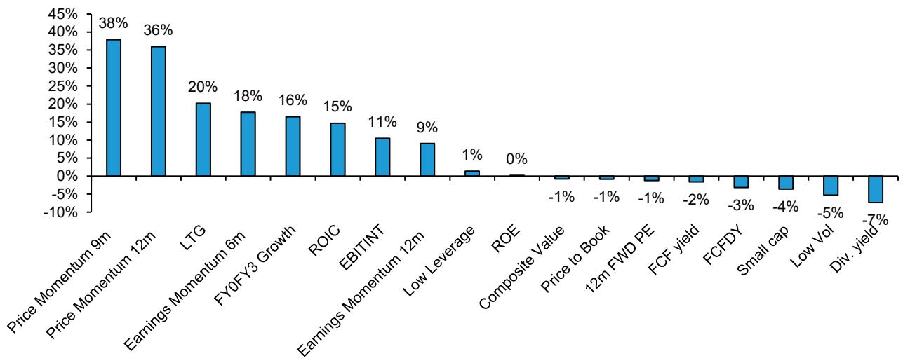

bar chart

| Category | Value (%) |
|---|---|
| Price Momentum 9m | 38 |
| Price Momentum 12m | 36 |
| LTG | 20 |
| Earnings Momentum 6m | 18 |
| FY0FY3 Growth | 16 |
| ROIC | 15 |
| EBITINT | 11 |
| Earnings Momentum 12m | 9 |
| Low Leverage | 1 |
| ROE | 0 |
| Composite Value | -1 |
| Price to Book | -1 |
| 12m FWD PE | -1 |
| FCF yield | -2 |
| FCFDY | -3 |
| Small cap | -4 |
| Low Vol | -5 |
| Div. yield | -7 |

Data till Jun 5 $^{th}$ 2026  
Source: MSCI, FactSet, Bernstein Analysis

EXHIBIT 2: Asia ex Japan/China Factor Performance: Momentum rally has been even stronger in Asia ex China, up 60% vs. market. Growth and earnings momentum have also done well, up 40% vs. market  
Asia ex Japan/China 2026 YTD Factor Performance (rel. to Market)  
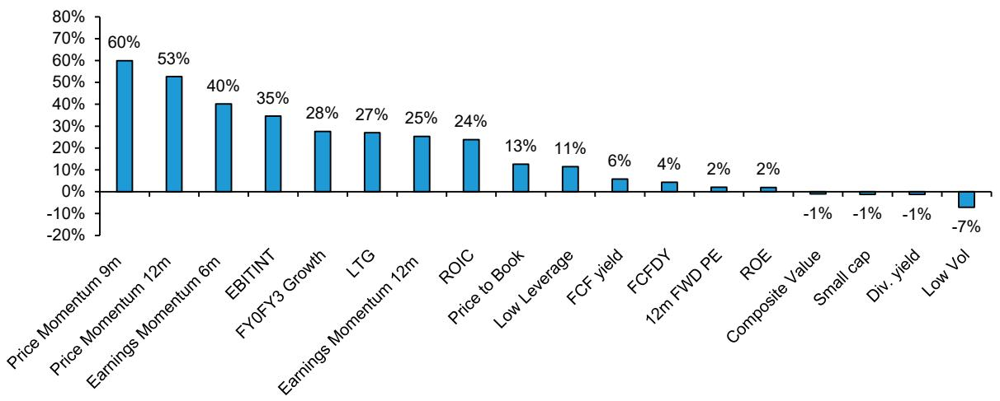

bar chart

| Category | Value (%) |
| :--- | :--- |
| Price Momentum 9m | 60 |
| Price Momentum 12m | 53 |
| Earnings Momentum 6m | 40 |
| EBITINT | 35 |
| FY0FY3 Growth | 28 |
| LTG | 27 |
| Earnings Momentum 12m | 25 |
| ROIC | 24 |
| Price to Book | 13 |
| Low Leverage | 11 |
| FCF yield | 6 |
| FCFDY | 4 |
| 12m FWD PE | 2 |
| ROE | 2 |
| Composite Value | -1 |
| Small cap | -1 |
| Div. yield | -1 |
| Low Vol | -7 |

Data till Jun 5 $^{th}$ 2026  
Source: MSCI, FactSet, Bernstein Analysis

EXHIBIT 3: YTD, momentum rally has been strong in Japan too, up 18% relative to market, however, growth cohort has been the best, generating 25% alpha  
Japan YTD Factor Performance (rel. to Market)  
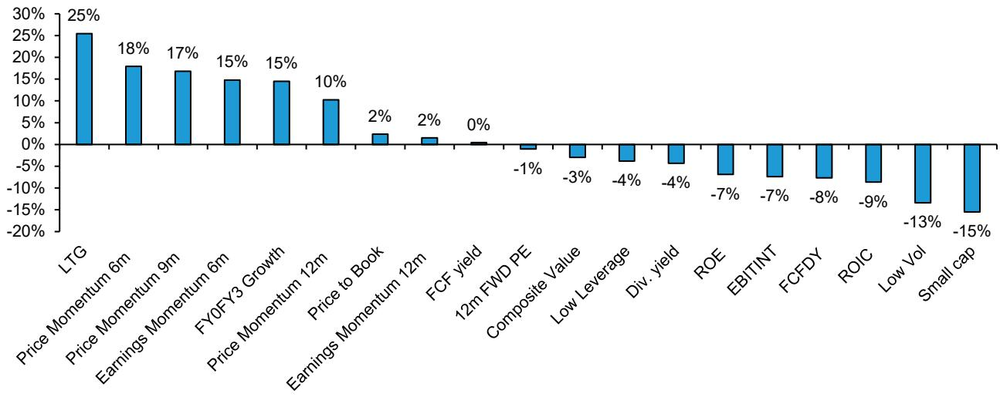

bar chart

| Category | Value (%) |
|---|---|
| LTG | 25 |
| Price Momentum 6m | 18 |
| Price Momentum 9m | 17 |
| Earnings Momentum 6m | 15 |
| FY0FY3 Growth | 15 |
| Price Momentum 12m | 10 |
| Price to Book | 2 |
| Earnings Momentum 12m | 2 |
| FCF yield | 0 |
| 12m FWD PE | -1 |
| Composite Value | -3 |
| Low Leverage | -4 |
| Div. yield | -4 |
| ROE | -7 |
| EBITINT | -7 |
| FCFDY | -8 |
| ROIC | -9 |
| Low Vol | -13 |
| Small cap | -15 |

Data till Jun 5 $^{th}$ 2026  
Source: MSCI, FactSet, Bernstein Analysis

## PARTS OF ASIA MOMENTUM TRADE IN A VALUATION BUBBLE

The strong rally of momentum YTD have led to stretched valuations across Asia - while earnings momentum has been trading at record high valuations for a while, price momentum has become more expensive. Earnings momentum stocks in both Asia ex Japan and Asia ex China have already hit peak valuations and have been seeing de-rating; but still look quite expensive, trading at +2.7SD/+1.9SD above average valuations in Asia ex Japan/Asia ex China respectively.

High price momentum cohort in both Asia ex Japan and Asia ex China region has re-rated, though still nowhere close to the 2021 peak in Asia. However, Asia ex China momentum basket is now trading very close to the 2021/2024 peaks. Japan momentum, however, continues to be cheap, trading below long-term average valuations. Looking at P/B, high earnings momentum portfolio in both Asia ex Japan and Asia ex Japan ex China are again stretched, trading near record high level. However, Asia price momentum portfolio is still not too stretched trading at +1.7SD levels but Asia ex Japan ex China momentum has never been this expensive (now trading at +4.2SD above historical PB average level). Japan earnings and price momentum are both reasonably valued, trading at +0.5SD/+0.5SD above average PB. (Exhibit 4-Exhibit 5) Hence, within Asia, there is no valuation concern yet for Japan price or earnings momentum. For Asia ex Japan, ex-China, both price momentum and earnings momentum has either already seen peak valuations or near record high. Similar, Asia earnings momentum basket remains in valuation bubble zone but Asia price momentum basket, is less stretched.

EXHIBIT 4: Asia Momentum 12m fwd. PE: Asia earnings momentum basket has been trading at record high valuations for a while. Price momentum in Asia is still not trading at record high valuations (at 1.3SD level), however in Asia ex China, price momentum is already at 2021/2024 peak valuations. Japan momentum still trade slightly below average valuations  
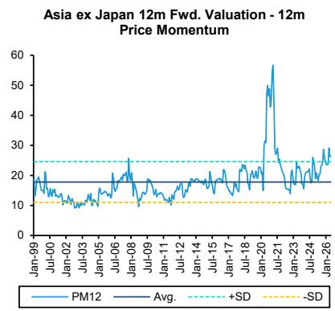

line chart

| Date | PM12 | Avg. | +SD | -SD |
| --- | --- | --- | --- | --- |
| Jan-99 | 18 | 18 | 24 | 10 |
| Jul-00 | 17 | 17 | 24 | 10 |
| Jan-01 | 16 | 16 | 24 | 10 |
| Jul-02 | 15 | 15 | 24 | 10 |
| Jan-03 | 14 | 14 | 24 | 10 |
| Jul-04 | 13 | 13 | 24 | 10 |
| Jan-05 | 12 | 12 | 24 | 10 |
| Jul-06 | 11 | 11 | 24 | 10 |
| Jan-07 | 10 | 10 | 24 | 10 |
| Jul-08 | 19 | 19 | 24 | 10 |
| Jan-09 | 20 | 20 | 24 | 10 |
| Jul-10 | 21 | 21 | 24 | 10 |
| Jan-11 | 22 | 22 | 24 | 10 |
| Jul-12 | 23 | 23 | 24 | 10 |
| Jan-13 | 24 | 24 | 24 | 10 |
| Jul-14 | 25 | 25 | 24 | 10 |
| Jan-15 | 26 | 26 | 24 | 10 |
| Jul-16 | 27 | 27 | 24 | 10 |
| Jan-17 | 28 | 28 | 24 | 10 |
| Jul-18 | 29 | 29 | 24 | 10 |
| Jan-19 | 30 | 30 | 24 | 10 |
| Jul-20 | 31 | 31 | 24 | 10 |
| Jan-21 | 32 | 32 | 24 | 10 |
| Jul-22 | 33 | 33 | 24 | 10 |
| Jan-23 | 34 | 34 | 24 | 10 |
| Jul-24 | 35 | 35 | 24 | 10 |
| Jan-25 | 36 | 36 | 24 | 10 |
| Jul-26 | 37 | 37 | 24 | 10 |
| Jan-27 | 38 | 38 | 24 | 10 |
| Jul-28 | 39 | 39 | 24 | 10 |
| Jan-29 | 40 | 40 | 24 | 10 |
| Jul-30 | 41 | 41 | 24 | 10 |
| Jan-31 | 42 | 42 | 24 | 10 |
| Jul-32 | 43 | 43 | 24 | 10 |
| Jan-33 | 44 | 44 | 24 | 10 |
| Jul-34 | 45 | 45 | 24 | 10 |
| Jan-35 | 46 | 46 | 24 | 10 |
| Jul-36 | 47 | 47 | 24 | 10 |
| Jan-37 | 48 | 48 | 24 | 10 |
| Jul-38 | 49 | 49 | 24 | 10 |

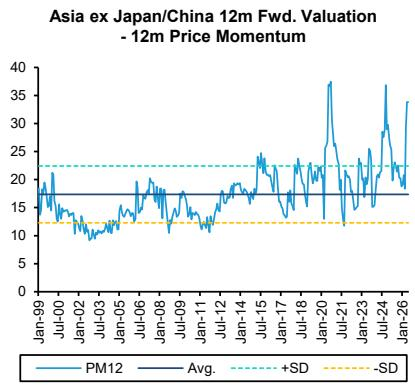

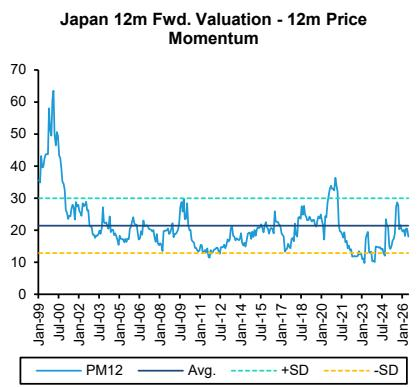

line chart

| Date   | PM12 | Avg. | +SD  | -SD  |
|--------|------|------|------|------|
| Jan-99 | 40   | 20   | 30   | 10   |
| Jul-00 | 65   | 20   | 30   | 10   |
| Jan-01 | 30   | 20   | 30   | 10   |
| Jul-02 | 25   | 20   | 30   | 10   |
| Jan-03 | 20   | 20   | 30   | 10   |
| Jul-04 | 25   | 20   | 30   | 10   |
| Jan-05 | 20   | 20   | 30   | 10   |
| Jul-06 | 25   | 20   | 30   | 10   |
| Jan-07 | 20   | 20   | 30   | 10   |
| Jul-08 | 25   | 20   | 30   | 10   |
| Jan-09 | 30   | 20   | 30   | 10   |
| Jul-10 | 25   | 20   | 30   | 10   |
| Jan-11 | 20   | 20   | 30   | 10   |
| Jul-11 | 25   | 20   | 30   | 10   |
| Jan-12 | 20   | 20   | 30   | 10   |
| Jul-13 | 25   | 20   | 30   | 10   |
| Jan-14 | 20   | 20   | 30   | 10   |
| Jul-15 | 25   | 20   | 30   | 10   |
| Jan-16 | 20   | 20   | 30   | 10   |
| Jul-17 | 25   | 20   | 30   | 10   |
| Jan-18 | 30   | 20   | 30   | 10   |
| Jul-19 | 25   | 20   | 30   | 10   |
| Jan-20 | 35   | 20   | 30   | 10   |
| Jul-21 | 30   | 20   | 30   | 10   |
| Jan-22 | 25   | 20   | 30   | 10   |
| Jul-23 | 20   | 20   | 30   | 10   |
| Jan-24 | 25   | 20   | 30   | 10   |
| Jul-25 | 30   | 20   | 30   | 10   |
| Jan-26 | 25   | 20   | 30   | 10   |

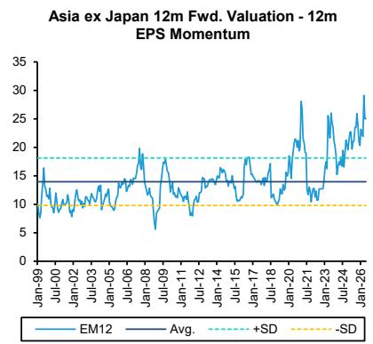

line chart

| Date | EM12 | Avg. | +SD | -SD |
| --- | --- | --- | --- | --- |
| Jan-99 | 15 | 15 | 18 | 10 |
| Jul-00 | 10 | 15 | 18 | 10 |
| Jan-01 | 10 | 15 | 18 | 10 |
| Jul-02 | 10 | 15 | 18 | 10 |
| Jan-03 | 10 | 15 | 18 | 10 |
| Jul-04 | 10 | 15 | 18 | 10 |
| Jan-05 | 10 | 15 | 18 | 10 |
| Jul-06 | 10 | 15 | 18 | 10 |
| Jan-07 | 10 | 15 | 18 | 10 |
| Jul-08 | 10 | 15 | 18 | 10 |
| Jan-09 | 10 | 15 | 18 | 10 |
| Jul-10 | 10 | 15 | 18 | 10 |
| Jan-11 | 10 | 15 | 18 | 10 |
| Jul-12 | 10 | 15 | 18 | 10 |
| Jan-13 | 10 | 15 | 18 | 10 |
| Jul-14 | 10 | 15 | 18 | 10 |
| Jan-15 | 10 | 15 | 18 | 10 |
| Jul-16 | 10 | 15 | 18 | 10 |
| Jan-17 | 10 | 15 | 18 | 10 |
| Jul-18 | 10 | 15 | 18 | 10 |
| Jan-19 | 10 | 15 | 18 | 10 |
| Jul-20 | 10 | 15 | 18 | 10 |
| Jan-21 | 10 | 15 | 18 | 10 |
| Jul-22 | 10 | 15 | 18 | 10 |
| Jan-23 | 10 | 15 | 18 | 10 |
| Jul-24 | 10 | 15 | 18 | 10 |
| Jan-25 | 10 | 15 | 18 | 10 |
| Jul-26 | 10 | 15 | 18 | 10 |
| Jan-27e | 30 | 30 | 30 | 30 |
| Jul-28e | 30 | 30 | 30 | 30 |
| Jan-29e | 30 | 30 | 30 | 30 |
| Jul-30e | 30 | 30 | 30 | 30 |
| Jan-31e | 30 | 30 | 30 | 30 |
| Jul-32e | 30 | 30 | 30 | 30 |
| Jan-33e | 30 | 30 | 30 | 30 |
| Jul-34e | 30 | 30 | 30 | 30 |
| Jan-35e | 30 | 30 | 30 | 30 |
| Jul-36e | 30 | 30 | 30 | 30 |
| Jan-37e | 30 | 30 | 30 | 30 |
| Jul-38e | 30 | 30 | 30 | 30 |
| Jan-39e | 30 | 30 | 30 | 30 |
| Jul-40e | 30 | 30 | 30 | 30 |
| Jan-41e | 30 | 30 | 30 | 30 |
| Jul-42e | 30 | 30 | 30 | 30 |
| Jan-43e | 30 | 30 | 30 | 30 |
| Jul-44e | 30 | 30 | 30 | 30 |
| Jan-45e | 30 | 30 | 30 | 30 |
| Jul-46e | 30 | 30 | 30 | 30 |
| Jan-47e | 30 | 30 | 30 | 30 |
| Jul-48e | 30 | 30 | 30 | 30 |
| Jan-49e | 30 | 30 | 30 | 30 |
| Jul-50e | 30 | 30 | 30 | 30 |
| Jan-51e | 30 | 30 | 30 | 30 |
| Jul-52e | 30 | 30 | 30 | 30 |
| Jan-53e | 30 | 30 | 30 | 30 |
| Jul-54e | 30 | 30 | 30 | 30 |
| Jan-55e | 30 | 30 | 30 | 30 |
| Jul-56e | 30 | 30 | 30 | 30 |
| Jan-57e | 30 | 30 | 30 | 30 |
| Jul-58e | 30 | 30 | 30 | 30 |
| Jan-59e | 30 | 30 | 30 | 30 |
| Jul-60e | 30 | 30 | 30 | 30 |

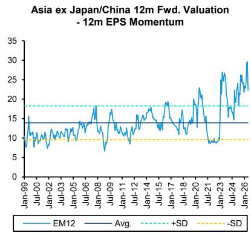

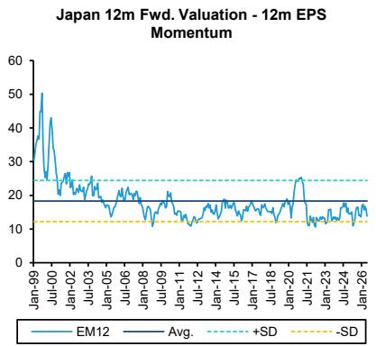

line chart

| Date   | EM12 | Avg. | +SD  | -SD  |
|--------|------|------|------|------|
| Jan-99 | 30   | 20   | 25   | 10   |
| Jul-00 | 50   | 20   | 25   | 10   |
| Jan-01 | 40   | 20   | 25   | 10   |
| Jul-02 | 25   | 20   | 25   | 10   |
| Jan-03 | 20   | 20   | 25   | 10   |
| Jul-04 | 25   | 20   | 25   | 10   |
| Jan-05 | 20   | 20   | 25   | 10   |
| Jul-06 | 25   | 20   | 25   | 10   |
| Jan-07 | 20   | 20   | 25   | 10   |
| Jul-08 | 25   | 20   | 25   | 10   |
| Jan-09 | 20   | 20   | 25   | 10   |
| Jul-10 | 25   | 20   | 25   | 10   |
| Jan-11 | 20   | 20   | 25   | 10   |
| Jul-11 | 25   | 20   | 25   | 10   |
| Jan-12 | 20   | 20   | 25   | 10   |
| Jul-13 | 25   | 20   | 25   | 10   |
| Jan-14 | 20   | 20   | 25   | 10   |
| Jul-15 | 25   | 20   | 25   | 10   |
| Jan-16 | 20   | 20   | 25   | 10   |
| Jul-17 | 25   | 20   | 25   | 10   |
| Jan-18 | 20   | 20   | 25   | 10   |
| Jul-19 | 25   | 20   | 25   | 10   |
| Jan-20 | 30   | 20   | 25   | 10   |
| Jul-21 | 25   | 20   | 25   | 10   |
| Jan-22 | 30   | 20   | 25   | 10   |
| Jul-23 | 25   | 20   | 25   | 10   |
| Jan-24 | 30   | 20   | 25   | 10   |
| Jul-25 | 35   | 20   | 25   | 10   |
| Jan-26 | 30   | 20   | 25   | 10   |

Data as of Jun 5 $^{th}$ 2026. All values are equal weighted Source: MSCI, FactSet, Bernstein Analysis

EXHIBIT 5: Asia Momentum PB: On PB, earnings momentum in Asia and Asia ex China reached record high in this cycle and always showing peak. Price momentum, however is at record high PB only in Asia ex China. Japan momentum trade still looks fine on book value  
Asia ex Japan PB Valuation - 12m Price Momentum  
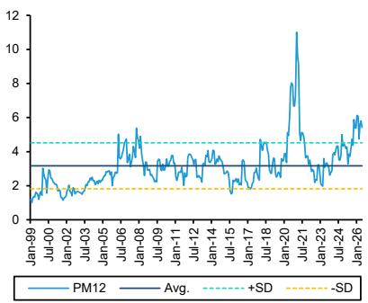

line chart

| Date   | PM12 | Avg. | +SD  | -SD  |
|--------|------|------|------|------|
| Jan-99 | 1.5  | 3.0  | 4.0  | 2.0  |
| Jul-00 | 2.0  | 3.0  | 4.0  | 2.0  |
| Jan-01 | 1.8  | 3.0  | 4.0  | 2.0  |
| Jul-02 | 2.5  | 3.0  | 4.0  | 2.0  |
| Jan-03 | 2.8  | 3.0  | 4.0  | 2.0  |
| Jul-04 | 3.0  | 3.0  | 4.0  | 2.0  |
| Jan-05 | 3.5  | 3.0  | 4.0  | 2.0  |
| Jul-06 | 4.5  | 3.0  | 4.0  | 2.0  |
| Jan-07 | 3.8  | 3.0  | 4.0  | 2.0  |
| Jul-08 | 4.0  | 3.0  | 4.0  | 2.0  |
| Jan-09 | 3.5  | 3.0  | 4.0  | 2.0  |
| Jul-10 | 3.8  | 3.0  | 4.0  | 2.0  |
| Jan-11 | 3.5  | 3.0  | 4.0  | 2.0  |
| Jul-11 | 3.8  | 3.0  | 4.0  | 2.0  |
| Jan-12 | 3.5  | 3.0  | 4.0  | 2.0  |
| Jul-13 | 3.8  | 3.0  | 4.0  | 2.0  |
| Jan-14 | 3.5  | 3.0  | 4.0  | 2.0  |
| Jul-15 | 3.8  | 3.0  | 4.0  | 2.0  |
| Jan-16 | 3.5  | 3.0  | 4.0  | 2.0  |
| Jul-17 | 3.8  | 3.0  | 4.0  | 2.0  |
| Jan-18 | 4.5  | 3.0  | 4.0  | 2.0  |
| Jul-19 | 5.5  | 3.0  | 4.0  | 2.0  |
| Jan-20 | 8.5  | 3.0  | 4.0  | 2.0  |
| Jul-21 | 11.5 | 3.0  | 4.0  | 2.0  |
| Jan-22 | 4.5  | 3.0  | 4.0  | 2.0  |
| Jul-23 | 4.8  | 3.0  | 4.0  | 2.0  |
| Jan-24 | 5.5  | 3.0  | 4.0  | 2.0  |
| Jul-25 | 6.5  | 3.0  | 4.0  | 2.0  |
| Jan-26 | -    | -    | -    | -    |

Asia ex Japan/China PB Valuation - 12m Price Momentum  
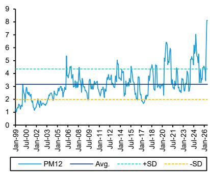

line chart

| Date   | PM12 | Avg. | +SD  | -SD  |
|--------|------|------|------|------|
| Jan-99 | 1.5  | 3.0  | 4.0  | 2.0  |
| Jul-00 | 2.0  | 3.0  | 4.0  | 2.0  |
| Jan-01 | 1.5  | 3.0  | 4.0  | 2.0  |
| Jul-02 | 2.0  | 3.0  | 4.0  | 2.0  |
| Jan-03 | 2.5  | 3.0  | 4.0  | 2.0  |
| Jul-04 | 3.0  | 3.0  | 4.0  | 2.0  |
| Jan-05 | 3.5  | 3.0  | 4.0  | 2.0  |
| Jul-06 | 4.0  | 3.0  | 4.0  | 2.0  |
| Jan-07 | 3.5  | 3.0  | 4.0  | 2.0  |
| Jul-08 | 4.0  | 3.0  | 4.0  | 2.0  |
| Jan-09 | 3.5  | 3.0  | 4.0  | 2.0  |
| Jul-10 | 3.0  | 3.0  | 4.0  | 2.0  |
| Jan-11 | 3.5  | 3.0  | 4.0  | 2.0  |
| Jul-11 | 4.0  | 3.0  | 4.0  | 2.0  |
| Jan-12 | 3.5  | 3.0  | 4.0  | 2.0  |
| Jul-13 | 4.0  | 3.0  | 4.0  | 2.0  |
| Jan-14 | 3.5  | 3.0  | 4.0  | 2.0  |
| Jul-15 | 4.0  | 3.0  | 4.0  | 2.0  |
| Jan-16 | 3.5  | 3.0  | 4.0  | 2.0  |
| Jul-17 | 4.0  | 3.0  | 4.0  | 2.0  |
| Jan-18 | 3.5  | 3.0  | 4.0  | 2.0  |
| Jul-19 | 4.0  | 3.0  | 4.0  | 2.0  |
| Jan-20 | 3.5  | 3.0  | 4.0  | 2.0  |
| Jul-21 | 4.0  | 3.0  | 4.0  | 2.0  |
| Jan-22 | 3.5  | 3.0  | 4.0  | 2.0  |
| Jul-23 | 4.0  | 3.0  | 4.0  | 2.0  |
| Jan-24 | 4.5  | 3.0  | 4.0  | 2.0  |
| Jul-25 | 5.0  | 3.0  | 4.0  | 2.0  |
| Jan-26 | 8.5  | -    | -    | -    |

Japan PB Valuation - 12m Price Momentum  
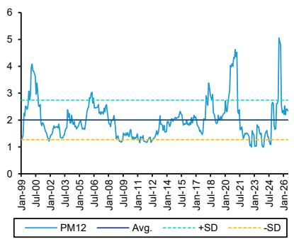

line chart

| Date   | PM12 | Avg. | +SD  | -SD  |
|--------|------|------|------|------|
| Jan-99 | 2.0  | 2.0  | 2.0  | 1.0  |
| Jul-00 | 4.0  | 2.0  | 2.0  | 1.0  |
| Jan-01 | 1.5  | 2.0  | 2.0  | 1.0  |
| Jul-02 | 2.0  | 2.0  | 2.0  | 1.0  |
| Jan-03 | 2.5  | 2.0  | 2.0  | 1.0  |
| Jul-04 | 3.0  | 2.0  | 2.0  | 1.0  |
| Jan-05 | 2.5  | 2.0  | 2.0  | 1.0  |
| Jul-06 | 3.0  | 2.0  | 2.0  | 1.0  |
| Jan-07 | 2.5  | 2.0  | 2.0  | 1.0  |
| Jul-08 | 2.0  | 2.0  | 2.0  | 1.0  |
| Jan-09 | 1.5  | 2.0  | 2.0  | 1.0  |
| Jul-10 | 1.5  | 2.0  | 2.0  | 1.0  |
| Jan-11 | 1.5  | 2.0  | 2.0  | 1.0  |
| Jul-11 | 1.5  | 2.0  | 2.0  | 1.0  |
| Jan-12 | 1.5  | 2.0  | 2.0  | 1.0  |
| Jul-13 | 1.5  | 2.0  | 2.0  | 1.0  |
| Jan-14 | 1.5  | 2.0  | 2.0  | 1.0  |
| Jul-15 | 1.5  | 2.0  | 2.0  | 1.0  |
| Jan-16 | 1.5  | 2.0  | 2.0  | 1.0  |
| Jul-17 | 3.5  | 2.0  | 2.0  | 1.0  |
| Jan-18 | 3.5  | 2.0  | 2.0  | 1.0  |
| Jul-19 | 4.5  | 2.0  | 2.0  | 1.0  |
| Jan-20 | 4.5  | 2.0  | 2.0  | 1.0  |
| Jul-21 | 4.5  | 2.0  | 2.0  | 1.0  |
| Jan-22 | 4.5  | 2.0  | 2.0  | 1.0  |
| Jul-23 | 4.5  | 2.0  | 2.0  | 1.0  |
| Jan-24 | 4.5  | 2.0  | 2.0  | 1.0  |
| Jul-25 | 5.0  | 2.0  | 2.0  | -    |
| Jan-26 | -    | -    | -    | -    |

Asia ex Japan PB Valuation - 12m EPS Momentum  
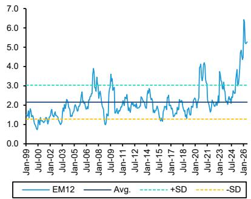

Asia ex Japan/China PB Valuation - 12m EPS Momentum  
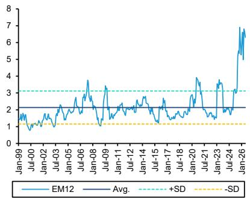

Japan PB Valuation - 12m EPS Momentum  
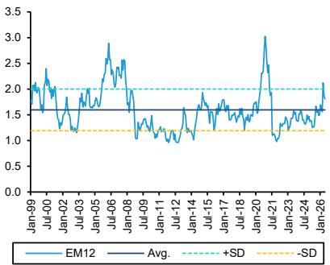  
Data as of Jun 5th 2026. All values are equal weighted  
Source: MSCI, FactSet, Bernstein Analysis

## EARNINGS EXPECTATIONS NOW AT RECORD HIGH FOR MOMENTUM STOCKS

The strong earnings upgrade cycle had been a key support for momentum stocks across the region. The earnings revisions for price momentum have reached at record high in Asia ex Japan, Asia ex Japan/China and Japan. For earnings momentum in Asia ex Japan upward revision has already peaked from record high while in Asia ex Japan/China, upward revisions for earnings momentum is now at record high. The ongoing upward revisions have been a key reason for us to chase momentum stocks since April (see here), however now with extreme earnings expectation, the risk of peak upgrades has increased. Stretched valuations with potential peak in upward revisions, could results in momentum unwind, especially in Asia ex Japan ex China. However, interestingly, the crowding risk in momentum trade is still not very elevated(Exhibit 6- Exhibit 7)

EXHIBIT 6: Asia Momentum Earnings Revision: Momentum rally has been more driven by rising earnings expectations across Asia, Asia ex China and Japan and now earnings upgrade cycle is at record high levels. This raises risk of peak upgrades and reduced pace of upward revisions for momentum  
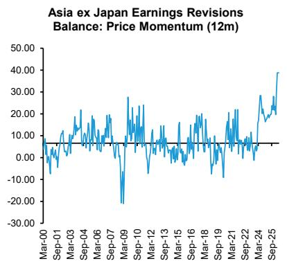

line chart

| Date    | Value |
|---------|-------|
| Mar-00  | 0.00  |
| Sep-01  | 10.00 |
| Mar-03  | 20.00 |
| Sep-04  | 15.00 |
| Mar-06  | 25.00 |
| Sep-07  | -20.00|
| Mar-09  | -25.00|
| Sep-10  | 25.00 |
| Mar-12  | 15.00 |
| Sep-13  | 10.00 |
| Mar-15  | 15.00 |
| Sep-16  | 20.00 |
| Mar-18  | 15.00 |
| Sep-19  | -10.00|
| Mar-21  | 20.00 |
| Sep-22  | 25.00 |
| Mar-24  | 30.00 |
| Sep-25  | 40.00 |

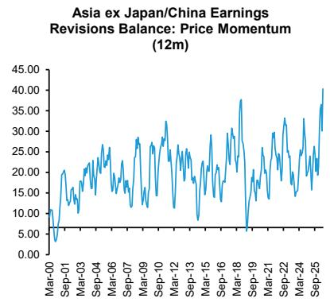

line chart

| Date   | Value |
|--------|-------|
| Mar-00 | 10.00 |
| Sep-01 | 20.00 |
| Mar-03 | 25.00 |
| Sep-04 | 28.00 |
| Mar-06 | 26.00 |
| Sep-07 | 29.00 |
| Mar-09 | 32.00 |
| Sep-10 | 35.00 |
| Mar-12 | 33.00 |
| Sep-13 | 31.00 |
| Mar-15 | 28.00 |
| Sep-16 | 34.00 |
| Mar-18 | 37.00 |
| Sep-19 | 36.00 |
| Mar-21 | 33.00 |
| Sep-22 | 35.00 |
| Mar-24 | 38.00 |
| Sep-25 | 40.00 |

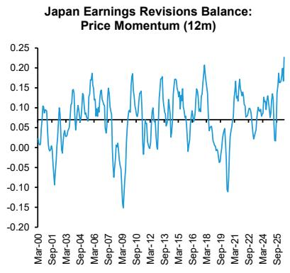

line chart

| Date   | Value |
|--------|-------|
| Mar-00 | 0.10  |
| Sep-01 | -0.10 |
| Mar-03 | 0.15  |
| Sep-04 | 0.18  |
| Mar-06 | 0.12  |
| Sep-07 | -0.15 |
| Mar-09 | 0.18  |
| Sep-10 | 0.15  |
| Mar-12 | 0.17  |
| Sep-13 | 0.16  |
| Mar-15 | 0.14  |
| Sep-16 | 0.20  |
| Mar-18 | 0.18  |
| Sep-19 | -0.12 |
| Mar-21 | 0.16  |
| Sep-22 | 0.14  |
| Mar-24 | 0.13  |
| Sep-25 | 0.22  |

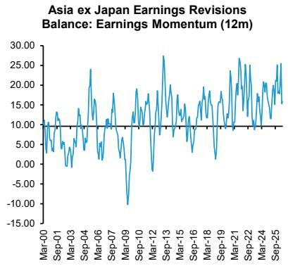

line chart

| Date   | Value |
|--------|-------|
| Mar-00 | 10.00 |
| Sep-01 | 12.00 |
| Mar-03 | 5.00  |
| Sep-04 | 25.00 |
| Mar-06 | 10.00 |
| Sep-07 | 18.00 |
| Mar-09 | -10.00|
| Sep-10 | 15.00 |
| Mar-12 | 28.00 |
| Sep-13 | 18.00 |
| Mar-15 | 15.00 |
| Sep-16 | 18.00 |
| Mar-19 | 25.00 |
| Sep-21 | 28.00 |
| Mar-22 | 25.00 |
| Sep-24 | 22.00 |
| Mar-25 | 25.00 |

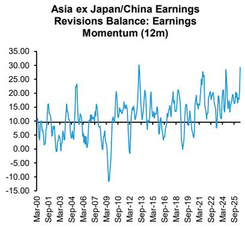

line chart

| Date   | Earnings |
|--------|----------|
| Mar-00 | 10.00    |
| Sep-01 | 15.00    |
| Mar-03 | 5.00     |
| Sep-04 | 25.00    |
| Mar-06 | 10.00    |
| Sep-07 | 15.00    |
| Mar-09 | -15.00   |
| Sep-10 | 10.00    |
| Mar-12 | 30.00    |
| Sep-13 | 25.00    |
| Mar-15 | 15.00    |
| Sep-16 | 20.00    |
| Mar-19 | 15.00    |
| Sep-21 | 25.00    |
| Mar-22 | 28.00    |
| Sep-24 | 30.00    |
| Mar-25 | 35.00    |

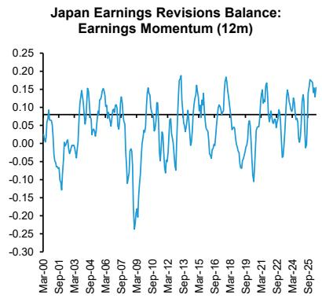

line chart

| Date   | Value |
|--------|-------|
| Mar-00 | 0.08  |
| Sep-01 | -0.15 |
| Mar-03 | 0.12  |
| Sep-04 | 0.15  |
| Mar-06 | 0.10  |
| Sep-07 | -0.25 |
| Mar-09 | -0.20 |
| Sep-10 | 0.15  |
| Mar-12 | 0.18  |
| Sep-13 | 0.16  |
| Mar-15 | 0.14  |
| Sep-16 | 0.18  |
| Mar-18 | 0.12  |
| Sep-19 | -0.10 |
| Mar-21 | 0.16  |
| Sep-22 | 0.14  |
| Mar-24 | 0.17  |
| Sep-25 | 0.15  |

Data as of Jun 5 $^{th}$ 2026. All values are equal weighted Source: MSCI, FactSet, Bernstein Analysis

EXHIBIT 7: Asia Momentum Crowding: Interestingly the crowding risk in momentum basket in the region is not elevated  
Asia ex Japan 12m Price Momentum - Crowding  
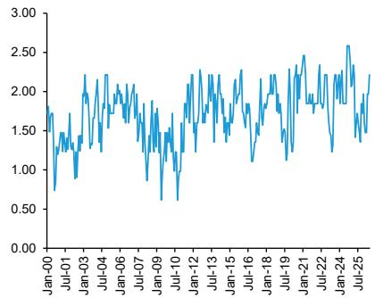

line chart

| Date   | Value |
|--------|-------|
| Jan-00 | 1.80  |
| Jul-01 | 1.40  |
| Jan-03 | 2.20  |
| Jul-04 | 2.10  |
| Jan-06 | 1.90  |
| Jul-07 | 1.80  |
| Jan-09 | 1.50  |
| Jul-10 | 0.60  |
| Jan-12 | 2.20  |
| Jul-13 | 2.30  |
| Jan-15 | 2.20  |
| Jul-16 | 1.90  |
| Jan-18 | 2.10  |
| Jul-19 | 2.30  |
| Jan-21 | 2.40  |
| Jul-22 | 2.50  |
| Jan-24 | 2.60  |
| Jul-25 | 2.20  |

Asia ex Japan/China 12m Price Momentum - Crowding  
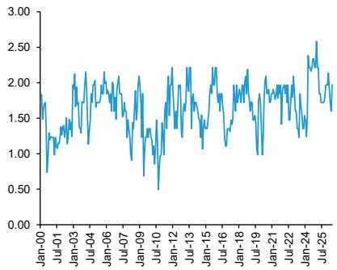

line chart

| Date   | Value |
|--------|-------|
| Jan-00 | 1.80  |
| Jul-01 | 1.20  |
| Jan-03 | 2.10  |
| Jul-04 | 1.90  |
| Jan-06 | 2.00  |
| Jul-07 | 1.80  |
| Jan-09 | 1.50  |
| Jul-10 | 0.60  |
| Jan-12 | 2.20  |
| Jul-13 | 2.30  |
| Jan-15 | 1.70  |
| Jul-16 | 2.20  |
| Jan-18 | 1.90  |
| Jul-19 | 2.10  |
| Jan-21 | 1.80  |
| Jul-22 | 2.00  |
| Jan-24 | 2.50  |
| Jul-25 | 1.70  |

Japan 12m Price Momentum - Crowding  
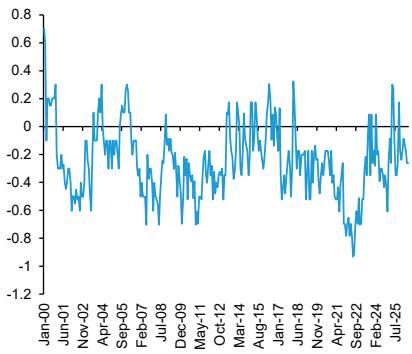

line chart

| Date    | Value |
|---------|-------|
| Jan-00  | 0.6   |
| Jun-01  | -0.4  |
| Nov-02  | -0.6  |
| Apr-04  | 0.3   |
| Sep-05  | 0.2   |
| Feb-07  | -0.7  |
| Jul-08  | -0.3  |
| Dec-09  | -0.5  |
| May-11  | -0.4  |
| Oct-12  | -0.2  |
| Mar-14  | 0.1   |
| Aug-15  | 0.3   |
| Jan-17  | -0.6  |
| Jun-18  | -0.4  |
| Nov-19  | -0.3  |
| Apr-21  | -0.8  |
| Sep-22  | -0.9  |
| Feb-24  | -0.2  |
| Jul-25  | 0.3   |

Asia ex Japan/China 12m Earnings Momentum - Crowding  
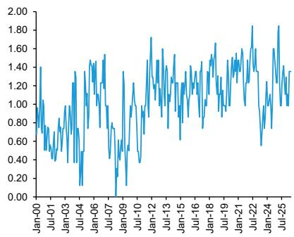

line chart

| Date   | Value |
|--------|-------|
| Jan-00 | 1.40  |
| Jul-01 | 0.60  |
| Jan-03 | 1.20  |
| Jul-04 | 1.40  |
| Jan-06 | 1.50  |
| Jul-07 | 1.30  |
| Jan-09 | 0.20  |
| Jul-10 | 1.70  |
| Jan-12 | 1.60  |
| Jul-13 | 1.50  |
| Jan-15 | 1.40  |
| Jul-16 | 1.60  |
| Jan-18 | 1.50  |
| Jul-19 | 1.60  |
| Jan-21 | 1.80  |
| Jul-22 | 1.60  |
| Jan-24 | 1.80  |
| Jul-25 | 1.40  |

Asia ex Japan/China 12m Earnings Momentum - Crowding  
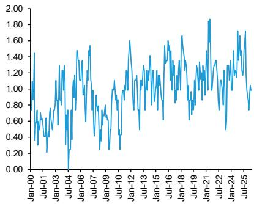

line chart

| Date   | Value |
|--------|-------|
| Jan-00 | 1.00  |
| Jul-01 | 0.60  |
| Jan-03 | 0.40  |
| Jul-04 | 0.20  |
| Jan-06 | 1.40  |
| Jul-07 | 1.20  |
| Jan-09 | 0.80  |
| Jul-10 | 1.00  |
| Jan-12 | 1.60  |
| Jul-13 | 1.20  |
| Jan-15 | 1.40  |
| Jul-16 | 1.60  |
| Jan-18 | 1.40  |
| Jul-19 | 1.60  |
| Jan-21 | 1.80  |
| Jul-22 | 1.40  |
| Jan-24 | 1.60  |
| Jul-25 | 1.20  |

Japan 12m Earnings Momentum - Crowding  
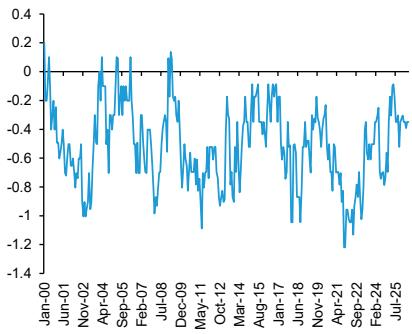

line chart

| Date    | Value |
|---------|-------|
| Jan-00  | 0.0   |
| Jun-01  | -0.6  |
| Nov-02  | -0.8  |
| Apr-04  | -0.4  |
| Sep-05  | 0.1   |
| Feb-07  | -0.6  |
| Jul-08  | -0.2  |
| Dec-09  | 0.2   |
| May-11  | -0.6  |
| Oct-12  | -0.8  |
| Mar-14  | -0.4  |
| Aug-15  | -0.2  |
| Jan-17  | -0.6  |
| Jun-18  | -0.8  |
| Nov-19  | -1.0  |
| Apr-21  | -1.2  |
| Sep-22  | -0.8  |
| Feb-24  | -0.4  |
| Jul-25  | -0.2  |

Data as of Jun 5 $^{th}$ 2026. All values are equal weighted  
Source: MSCI, FactSet, Bernstein Analysis

## ASIA TECH MOMENTUM

Within Asia tech sector, price momentum had even stronger performance YTD. Price momentum has led with alpha of 63%-80%, followed by growth (50% relative to market) and earnings momentum (13%-21% alpha). The recent rally has also made momentum expensive, though after hitting peak in May, it has now dropped to 31x fwd. PE, which is +1SD above the 10yr average. Tactical earnings support for the tech momentum looks robust, however, it is now reaching record high, a potential risk of inflection. With valuations already under pressure, as room for upward revisions to continue looks limited. We believe Asia tech momentum could see unwind(Exhibit 8-Exhibit 9)

As we highlighted in our previous report, tech sector has always been the dominant sector in Taiwan and Korea, now accounting for 85% of the market-cap in Taiwan and 56% in Korea, i.e. the highest ever (see -Asia Quant Strategy: Taiwan/Korea strong momentum meets record high concentration and correlation risk). Given the high exposure of tech sector to market momentums, the impact on the regional markets are not isolated. Risk is elevating.

EXHIBIT 8: Momentum has been extremely strong within Asia tech sector - stocks with high price momentum have generated 63%-80% alpha  
Asia Tech 2026 YTD Factor Performance (rel. to Market)  
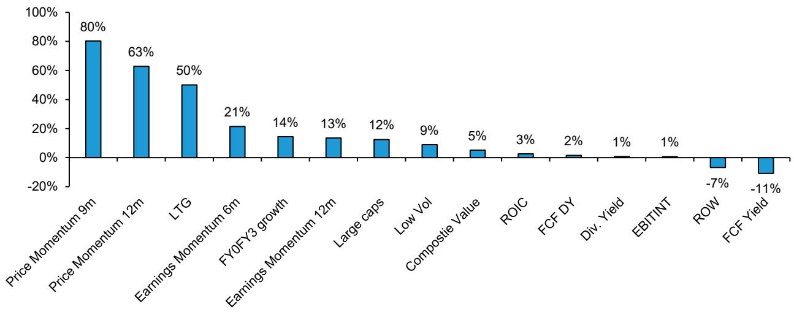

bar chart

| Metric | Value (%) |
| :--- | :--- |
| Price Momentum 9m | 80 |
| Price Momentum 12m | 63 |
| LTG | 50 |
| Earnings Momentum 6m | 21 |
| FY0FY3 growth | 14 |
| Earnings Momentum 12m | 13 |
| Large caps | 12 |
| Low Vol | 9 |
| Compostie Value | 5 |
| ROIC | 3 |
| FCF DY | 2 |
| Div. Yield | 1 |
| EBITINT | 1 |
| ROW | -7 |
| FCF Yield | -11 |

Data till Jun 5 $^{th}$ 2026  
Source: MSCI, FactSet, Bernstein Analysis

EXHIBIT 9: Tech Momentum is at record high valuations, all-time high upgrades and record high crowding, however relative valuations still look fine, though earnings expectations look extreme even on relative basis  
Asia Tech Price Momentum 12m - 12m
Fwd PE  
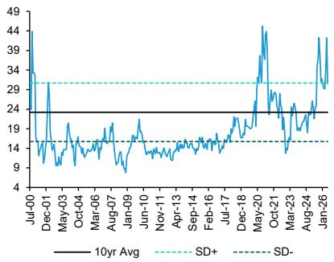

line chart

| Date    | 10yr Avg | SD+  | SD-  |
|---------|----------|------|------|
| Jul-00  | 24       | 29   | 14   |
| Dec-01  | 24       | 29   | 14   |
| May-03  | 24       | 29   | 14   |
| Oct-04  | 24       | 29   | 14   |
| Mar-06  | 24       | 29   | 14   |
| Aug-07  | 24       | 29   | 14   |
| Jan-09  | 24       | 29   | 14   |
| Jun-10  | 24       | 29   | 14   |
| Nov-11  | 24       | 29   | 14   |
| Apr-13  | 24       | 29   | 14   |
| Sep-14  | 24       | 29   | 14   |
| Feb-16  | 24       | 29   | 14   |
| Jul-17  | 24       | 29   | 14   |
| Dec-18  | 24       | 29   | 14   |
| May-20  | 24       | 29   | 14   |
| Oct-21  | 24       | 29   | 14   |
| Mar-23  | 24       | 29   | 14   |
| Aug-24  | 24       | 29   | 14   |
| Jan-26  | 24       | 29   | 14   |

Asia Tech Price Momentum 12m - 12m Fwd PE rel. to Benchmark  
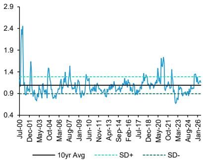

line chart

| Date     | 10yr Avg | SD+  | SD-  |
|----------|----------|------|------|
| Jul-00   | 0.9      | 1.4  | 0.9  |
| Dec-01   | 0.9      | 1.4  | 0.9  |
| May-03   | 0.9      | 1.4  | 0.9  |
| Oct-04   | 0.9      | 1.4  | 0.9  |
| Mar-06   | 0.9      | 1.4  | 0.9  |
| Aug-07   | 0.9      | 1.4  | 0.9  |
| Jan-09   | 0.9      | 1.4  | 0.9  |
| Jun-10   | 0.9      | 1.4  | 0.9  |
| Nov-11   | 0.9      | 1.4  | 0.9  |
| Apr-13   | 0.9      | 1.4  | 0.9  |
| Sep-14   | 0.9      | 1.4  | 0.9  |
| Feb-16   | 0.9      | 1.4  | 0.9  |
| Jul-17   | 0.9      | 1.4  | 0.9  |
| Dec-18   | 0.9      | 1.4  | 0.9  |
| May-20   | 0.9      | 1.4  | 0.9  |
| Oct-21   | 0.9      | 1.4  | 0.9  |
| Mar-23   | 0.9      | 1.4  | 0.9  |
| Aug-24   | 0.9      | 1.4  | 0.9  |
| Jan-26   | 0.9      | 1.4  | 0.9  |

Asia Tech High vs Low Price Momentum
12m - 12m Fwd PE  
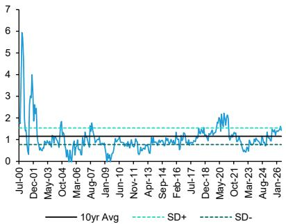

line chart

| Date    | 10yr Avg | SD+  | SD-  |
|---------|----------|------|------|
| Jul-00  | 6.0      | 1.5  | 1.0  |
| Dec-01  | 4.0      | 1.5  | 1.0  |
| May-03  | 1.5      | 1.5  | 1.0  |
| Oct-04  | 1.0      | 1.5  | 1.0  |
| Mar-06  | 1.5      | 1.5  | 1.0  |
| Aug-07  | 1.0      | 1.5  | 1.0  |
| Jan-09  | 0.5      | 1.5  | 1.0  |
| Jun-10  | 1.0      | 1.5  | 1.0  |
| Nov-11  | 1.0      | 1.5  | 1.0  |
| Apr-13  | 1.0      | 1.5  | 1.0  |
| Sep-14  | 1.0      | 1.5  | 1.0  |
| Feb-16  | 1.0      | 1.5  | 1.0  |
| Jul-17  | 1.0      | 1.5  | 1.0  |
| Dec-18  | 1.5      | 1.5  | 1.0  |
| May-20  | 2.0      | 1.5  | 1.0  |
| Oct-21  | 1.5      | 1.5  | 1.0  |
| Mar-23  | 1.0      | 1.5  | 1.0  |
| Aug-24  | 1.5      | 1.5  | 1.0  |
| Jan-26  | 2.0      | 1.5  | 1.0  |

Asia Tech Price Momentum 12m - Earnings Revision  
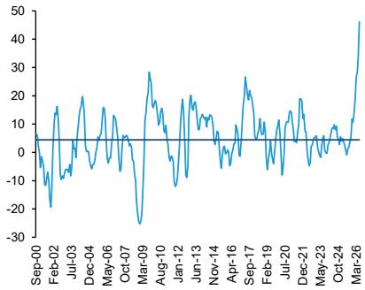

line chart

| Date   | Value |
|--------|-------|
| Sep-00 | 0     |
| Feb-02 | -15   |
| Jul-03 | 15    |
| Dec-04 | 20    |
| May-06 | 10    |
| Oct-07 | 5     |
| Mar-09 | -25   |
| Aug-10 | 30    |
| Jan-12 | 10    |
| Jun-13 | 20    |
| Nov-14 | 15    |
| Apr-16 | 25    |
| Sep-17 | 10    |
| Feb-19 | 15    |
| Jul-20 | 20    |
| Dec-21 | 10    |
| May-23 | 5     |
| Oct-24 | 10    |
| Mar-26 | 45    |

Asia Tech Price Momentum 12m - Earnings Revision rel. to Benchmark  
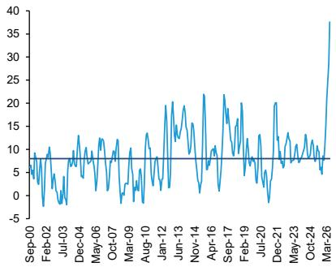

line chart

| Date    | Value |
|---------|-------|
| Sep-00  | 8     |
| Feb-02  | 10    |
| Jul-03  | 5     |
| Dec-04  | 12    |
| May-06  | 10    |
| Oct-07  | 12    |
| Mar-09  | 8     |
| Aug-10  | 12    |
| Jan-12  | 18    |
| Jun-13  | 20    |
| Nov-14  | 15    |
| Apr-16  | 22    |
| Sep-17  | 10    |
| Feb-19  | 18    |
| Jul-20  | 12    |
| Dec-21  | 20    |
| May-23  | 12    |
| Oct-24  | 10    |
| Mar-26  | 38    |

Asia Tech High vs Low Price Momentum
12m - Earnings Revision  
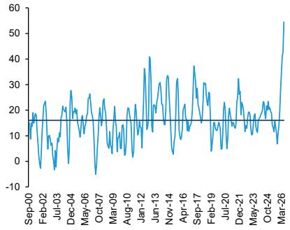

line chart

| Date   | Value |
|--------|-------|
| Sep-00 | 15    |
| Feb-02 | 25    |
| Jul-03 | 10    |
| Dec-04 | 20    |
| May-06 | 25    |
| Oct-07 | 15    |
| Mar-09 | 20    |
| Aug-10 | 15    |
| Jan-12 | 35    |
| Jun-13 | 40    |
| Nov-14 | 30    |
| Apr-16 | 35    |
| Sep-17 | 25    |
| Feb-19 | 30    |
| Jul-20 | 20    |
| Dec-21 | 30    |
| May-23 | 20    |
| Oct-24 | 25    |
| Mar-26 | 55    |

Asia Tech Price Momentum 12m - Crowding  
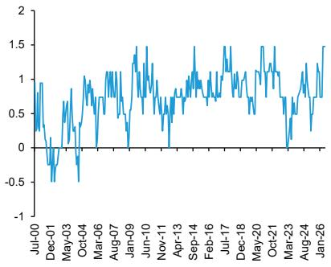

line chart

| Date    | Value |
|---------|-------|
| Jul-00  | 0.8   |
| Dec-01  | -0.5  |
| May-03  | 0.7   |
| Oct-04  | -0.3  |
| Mar-06  | 1.0   |
| Aug-07  | 0.9   |
| Jan-09  | 1.5   |
| Jun-10  | 1.2   |
| Nov-11  | 0.8   |
| Apr-13  | 1.1   |
| Sep-14  | 1.4   |
| Feb-16  | 1.3   |
| Jul-17  | 1.5   |
| Dec-18  | 1.2   |
| May-20  | 1.4   |
| Oct-21  | 1.1   |
| Mar-23  | 0.9   |
| Aug-24  | 1.3   |
| Jan-26  | 1.5   |

Asia Tech Price Momentum 12m - Crowding rel. to Benchmark  
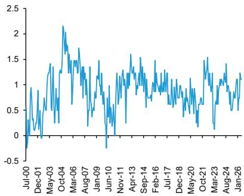

line chart

| Date    | Value |
|---------|-------|
| Jul-00  | -0.5  |
| Dec-01  | 0.8   |
| May-03  | 1.4   |
| Oct-04  | 2.2   |
| Mar-06  | 1.7   |
| Aug-07  | 1.5   |
| Jan-09  | 1.4   |
| Jun-10  | -0.3  |
| Nov-11  | 1.2   |
| Apr-13  | 1.6   |
| Sep-14  | 1.5   |
| Feb-16  | 1.3   |
| Jul-17  | 1.2   |
| Dec-18  | 1.0   |
| May-20  | 0.8   |
| Oct-21  | 1.5   |
| Mar-23  | 1.3   |
| Aug-24  | 1.4   |
| Jan-26  | 1.2   |

Asia Tech High vs Low Price Momentum
12m - Crowding  
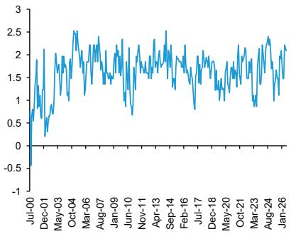

line chart

| Date    | Value |
|---------|-------|
| Jul-00  | -0.5  |
| Dec-01  | 2.0   |
| May-03  | 1.8   |
| Oct-04  | 2.5   |
| Mar-06  | 2.2   |
| Aug-07  | 2.4   |
| Jan-09  | 2.1   |
| Jun-10  | 1.9   |
| Nov-11  | 2.3   |
| Apr-13  | 2.6   |
| Sep-14  | 2.4   |
| Feb-16  | 2.0   |
| Jul-17  | 1.8   |
| Dec-18  | 1.5   |
| May-20  | 2.2   |
| Oct-21  | 2.0   |
| Mar-23  | 2.4   |
| Aug-24  | 2.3   |
| Jan-26  | 2.1   |

Data as of Jun 5 $^{th}$ 2026  
Source: MSCI, FactSet, Bernstein Analysis

## MOMENTUM RALLY HAS CREATED 25YR HIGH INTRA-MARKET DISPERSION

The other important signal to track is correlation of momentum strategies with other factors - typically extreme correlations tend to highlight inflection points. Correlation of Asia price momentum factor with growth is now at historical high, while momentum in value, quality and low vol stocks in Asia have been decreasing, with low vol dropping to record low momentum levels seen in last 25yrs. We see similar trends for earnings momentum and its correlation with other styles. In Asia ex China, the drop in low vol has been much more extreme, to some extent reflecting the mind-numbing rallies in Korea and Taiwan led by high vol (high beta) stocks. For Japan, however, momentum trends have not created any extreme intra-market or intra-style dispersion. Key point is that in Asia, momentum trends have now created extreme intra-market dispersion, positioning low vol for a comeback - this typically indicates a shift from risk on to risk-off. While this signal is good to understand extremes which eventually mean-revert, the timing of it is quite difficult to determine. (Exhibit 10-Exhibit 12)

EXHIBIT 10: Asia ex Japan momentum correlation with other factors: In Asia, momentum rally has been strongly correlated to growth stocks while low vol now sits at record low momentum. We find this extreme intra-market dispersion unsustainable ie. momentum unwind would mean a comeback of low vol stocks and reversal of high vol names  
Correlation: Asia Price Momentum vs. other factors  
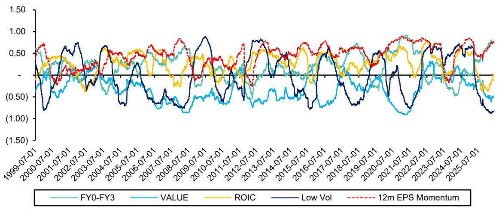

line chart

| Date       | FY0-FY3 | VALUE  | ROIC   | Low Vol | 12m EPS Momentum |
|------------|---------|--------|--------|---------|------------------|
| 1999-07-01 |         |        |        |         |                  |
| 2000-07-01 |         |        |        |         |                  |
| 2001-07-01 |         |        |        |         |                  |
| 2002-07-01 |         |        |        |         |                  |
| 2003-07-01 |         |        |        |         |                  |
| 2004-07-01 |         |        |        |         |                  |
| 2005-07-01 |         |        |        |         |                  |
| 2006-07-01 |         |        |        |         |                  |
| 2007-07-01 |         |        |        |         |                  |
| 2008-07-01 |         |        |        |         |                  |
| 2009-07-01 |         |        |        |         |                  |
| 2010-07-01 |         |        |        |         |                  |
| 2011-07-01 |         |        |        |         |                  |
| 2012-07-01 |         |        |        |         |                  |
| 2013-07-01 |         |        |        |         |                  |
| 2014-07-01 |         |        |        |         |                  |
| 2015-07-01 |         |        |        |         |                  |
| 2016-07-01 |         |        |        |         |                  |
| 2017-07-01 |         |        |        |         |                  |
| 2018-07-01 |         |        |        |         |                  |
| 2019-07-01 |         |        |        |         |                  |
| 2020-07-01 |         |        |        |         |                  |
| 2021-07-01 |         |        |        |         |                  |
| 2022-07-01 |         |        |        |         |                  |
| 2023-07-01 |         |        |        |         |                  |
| 2024-07-01 |         |        |        |         |                  |
| 2025-07-01 |         |        |        |         |                  |

Correlation - Asia Earnings Momentum vs. other factors  
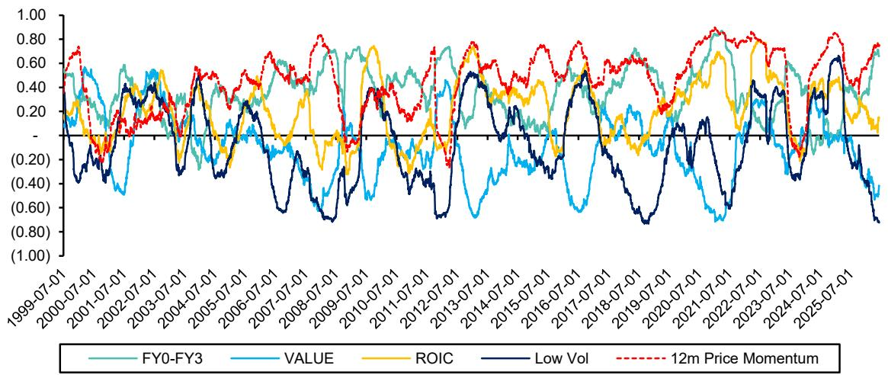

line chart

| Date       | FY0-FY3 | VALUE | ROIC | Low Vol | 12m Price Momentum |
|------------|---------|-------|------|---------|---------------------|
| 1999-07-01 | 0.4     | 0.3   | 0.2  | -0.2    | 0.6                 |
| 2000-07-01 | 0.5     | 0.4   | 0.3  | -0.3    | 0.7                 |
| 2001-07-01 | 0.6     | 0.5   | 0.4  | -0.4    | 0.8                 |
| 2002-07-01 | 0.7     | 0.6   | 0.5  | -0.5    | 0.9                 |
| 2003-07-01 | 0.8     | 0.7   | 0.6  | -0.6    | 1.0                 |
| 2004-07-01 | 0.9     | 0.8   | 0.7  | -0.7    | 1.1                 |
| 2005-07-01 | 1.0     | 0.9   | 0.8  | -0.8    | 1.2                 |
| 2006-07-01 | 1.1     | 1.0   | 0.9  | -0.9    | 1.3                 |
| 2007-07-01 | 1.2     | 1.1   | 1.0  | -1.0    | 1.4                 |
| 2008-07-01 | 1.3     | 1.2   | 1.1  | -1.1    | 1.5                 |
| 2009-07-01 | 1.4     | 1.3   | 1.2  | -1.2    | 1.6                 |
| 2010-07-01 | 1.5     | 1.4   | 1.3  | -1.3    | 1.7                 |
| 2011-07-01 | 1.6     | 1.5   | 1.4  | -1.4    | 1.8                 |
| 2012-07-01 | 1.7     | 1.6   | 1.5  | -1.5    | 1.9                 |
| 2013-07-01 | 1.8     | 1.7   | 1.6  | -1.6    | 2.0                 |
| 2014-07-01 | 1.9     | 1.8   | 1.7  | -1.7    | 2.1                 |
| 2015-07-01 | 2.0     | 1.9   | 1.8  | -1.8    | 2.2                 |
| 2016-07-01 | 2.1     | 2.0   | 1.9  | -1.9    | 2.3                 |
| 2017-07-01 | 2.2     | 2.1   | 2.0  | -2.0    | 2.4                 |
| 2018-07-01 | 2.3     | 2.2   | 2.1  | -2.1    | 2.5                 |
| 2019-07-01 | 2.4     | 2.3   | 2.2  | -2.2    | 2.6                 |
| 2020-07-01 | 2.5     | 2.4   | 2.3  | -2.3    | 2.7                 |
| 2021-07-01 | 2.6     | 2.5   | 2.4  | -2.4    | 2.8                 |
| 2022-07-01 | 2.7     | 2.6   | 2.5  | -2.5    | 2.9                 |
| 2023-07-01 | 2.8     | 2.7   | 2.6  | -2.6    | 3.0                 |
| 2024-07-01 | 2.9     | 2.8   | 2.7  | -2.7    | 3.1                 |
| 2025-07-01 | 3.0     | 2.9   | 2.8  | -2.8    | 3.2                 |

Data till Jun 5 $^{th}$ 2026. The charts show rolling 6m correlations using daily returns
Source: MSCI, FactSet, Bernstein Analysis

EXHIBIT 11: In Asia ex Japan ex China, momentum has been all about high vol and growth with low vol stocks now dropping to worst momentum seen last in 1999. This further highlights a potential comeback of low vol stocks from extremes, typically a sign of risk-off  

line chart

| Date | FY0-FY3 | VALUE | ROIC | Low Vol | 12m EPS Momentum |
| --- | --- | --- | --- | --- | --- |
| 1999-07-01 |  |  |  |  |  |
| 2000-07-01 |  |  |  |  |  |
| 2001-07-01 |  |  |  |  |  |
| 2002-07-01 |  |  |  |  |  |
| 2003-07-01 |  |  |  |  |  |
| 2004-07-01 |  |  |  |  |  |
| 2005-07-01 |  |  |  |  |  |
| 2006-07-01 |  |  |  |  |  |
| 2007-07-01 |  |  |  |  |  |
| 2008-07-01 |  |  |  |  |  |
| 2009-07-01 |  |  |  |  |  |
| 2010-07-01 |  |  |  |  |  |
| 2011-07-01 |  |  |  |  |  |
| 2012-07-01 |  |  |  |  |  |
| 2013-07-01 |  |  |  |  |  |
| 2014-07-01 |  |  |  |  |  |
| 2015-07-01 |  |  |  |  |  |
| 2016-07-01 |  |  |  |  |  |
| 2017-07-01 |  |  |  |  |  |
| 2018-07-01 |  |  |  |  |  |
| 2019-07-01 |  |  |  |  |  |
| 2020-07-01 |  |  |  |  |  |
| 2021-07-01 |  |  |  |  |  |
| 2022-07-01 |  |  |  |  |  |
| 2023-07-01 |  |  |  |  |  |
| 2024-07-01 |  |  |  |  |  |
| 2025-07-01 |  |  |  |  |  |
|  |  |  |  |  |  |
|  |  |  |  |  |  |
|  |  |  |  |  |  |
|  |  |  |  |  |  |
|  |  |  |  |  |  |
|  |  |  |  |  |  |
|  |  |  |  |  |  |

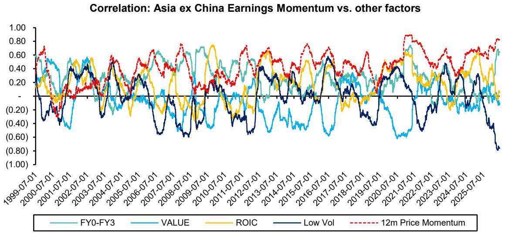

line chart

| Date       | FY0-FY3 | VALUE | ROIC | Low Vol | 12m Price Momentum |
|------------|---------|-------|------|---------|---------------------|
| 1999-07-01 | 0.60    | 0.40  | 0.30 | -0.20   | 0.70                |
| 2000-07-01 | 0.50    | 0.30  | 0.20 | -0.30   | 0.60                |
| 2001-07-01 | 0.40    | 0.20  | 0.10 | -0.40   | 0.50                |
| 2002-07-01 | 0.30    | 0.10  | 0.00 | -0.50   | 0.40                |
| 2003-07-01 | 0.20    | 0.00  | -0.10| -0.60   | 0.30                |
| 2004-07-01 | 0.10    | -0.10 | -0.20| -0.70   | 0.20                |
| 2005-07-01 | 0.00    | -0.20 | -0.30| -0.80   | 0.10                |
| 2006-07-01 | -0.10   | -0.30 | -0.40| -0.90   | 0.00                |
| 2007-07-01 | -0.20   | -0.40 | -0.50| -1.00   | -0.1                 |
| 2008-07-01 | -0.30   | -0.50 | -0.60| -1.10   | -0.2                 |
| 2009-07-01 | -0.40   | -0.60 | -0.70| -1.20   | -0.3                 |
| 2010-07-01 | -0.50   | -0.70 | -0.80| -1.30   | -0.4                 |
| 2011-07-01 | -0.60   | -0.80 | -0.90| -1.40   | -0.5                 |
| 2012-07-01 | -0.70   | -0.90 | -1.00| -1.50   | -0.6                 |
| 2013-07-01 | -0.80   | -1.00 | -1.10| -1.60   | -0.7                 |
| 2014-07-01 | -0.90   | -1.10 | -1.20| -1.70   | -0.8                 |
| 2015-07-01 | -1.00   | -1.20 | -1.30| -1.80   | -0.9                 |
| 2016-07-01 | -1.10   | -1.30 | -1.40| -1.90   | -1.0                 |
| 2017-07-01 | -1.20   | -1.40 | -1.50| -2.00   | -1.1                 |
| 2018-07-01 | -1.30   | -1.50 | -1.60| -2.10   | -1.2                 |
| 2019-07-01 | -1.40   | -1.60 | -1.70| -2.20   | -1.3                 |
| 2020-07-01 | -1.50   | -1.70 | -1.80| -2.30   | -1.4                 |
| 2021-07-01 | -1.60   | -1.80 | -1.90| -2.40   | -1.5                 |
| 2022-07-01 | -1.70   | -1.90 | -2.00| -2.50   | -1.6                 |
| 2023-07-01 | -1.80   | -2.00 | -2.10| -2.60   | -1.7                 |
| 2024-07-01 | -1.90   | -2.10 | -2.20| -2.70   | -1.8                 |
| 2025-07-01 | -2.00   | -2.20 | -2.30| -2.80   | -1.9                 |
| 24/25/25/25 (approx.) | ~-35     | ~-45  | ~-55  | ~-65    | ~-85                |

Data till Jun 5 $^{th}$ 2026. The charts show rolling 6m correlations using daily returns
Source: MSCI, FactSet, Bernstein Analysis

EXHIBIT 12: The intra-market dispersion caused by momentum rally has not been extreme in Japan  
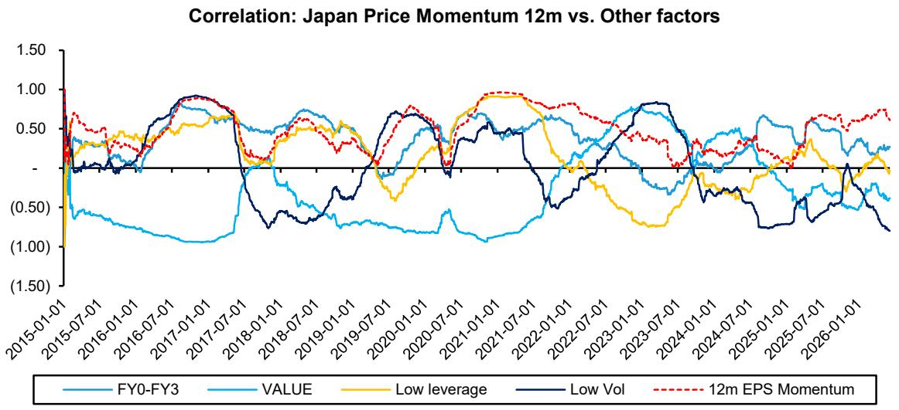

line chart

| Date       | FY0-FY3 | VALUE | Low leverage | Low Vol | 12m EPS Momentum |
|------------|---------|-------|--------------|---------|------------------|
| 2015-01-01 |         |       |              |         |                  |
| 2015-07-01 |         |       |              |         |                  |
| 2016-01-01 |         |       |              |         |                  |
| 2016-07-01 |         |       |              |         |                  |
| 2017-01-01 |         |       |              |         |                  |
| 2017-07-01 |         |       |              |         |                  |
| 2018-01-01 |         |       |              |         |                  |
| 2018-07-01 |         |       |              |         |                  |
| 2019-01-01 |         |       |              |         |                  |
| 2019-07-01 |         |       |              |         |                  |
| 2020-01-01 |         |       |              |         |                  |
| 2020-07-01 |         |       |              |         |                  |
| 2021-01-01 |         |       |              |         |                  |
| 2021-07-01 |         |       |              |         |                  |
| 2022-01-01 |         |       |              |         |                  |
| 2022-07-01 |         |       |              |         |                  |
| 2023-01-01 |         |       |              |         |                  |
| 2023-07-01 |         |       |              |         |                  |
| 2024-01-01 |         |       |              |         |                  |
| 2024-07-01 |         |       |              |         |                  |
| 2025-01-01 |         |       |              |         |                  |
| 2025-07-01 |         |       |              |         |                  |
| 2026-01-01 |         |       |              |         |                  |

Correlation: Japan Earnings Momentum 12m vs. Other factors  
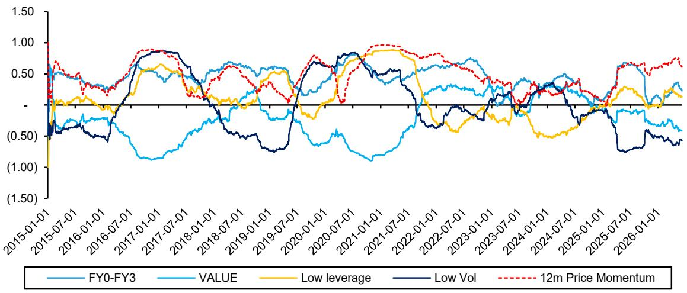

line chart

| Date       | FY0-FY3 | VALUE | Low leverage | Low Vol | 12m Price Momentum |
|------------|---------|-------|--------------|---------|---------------------|
| 2015-01-01 |         |       |              |         |                     |
| 2015-07-01 |         |       |              |         |                     |
| 2016-01-01 |         |       |              |         |                     |
| 2016-07-01 |         |       |              |         |                     |
| 2017-01-01 |         |       |              |         |                     |
| 2017-07-01 |         |       |              |         |                     |
| 2018-01-01 |         |       |              |         |                     |
| 2018-07-01 |         |       |              |         |                     |
| 2019-01-01 |         |       |              |         |                     |
| 2019-07-01 |         |       |              |         |                     |
| 2020-01-01 |         |       |              |         |                     |
| 2020-07-01 |         |       |              |         |                     |
| 2021-01-01 |         |       |              |         |                     |
| 2021-07-01 |         |       |              |         |                     |
| 2022-01-01 |         |       |              |         |                     |
| 2022-07-01 |         |       |              |         |                     |
| 2023-01-01 |         |       |              |         |                     |
| 2023-07-01 |         |       |              |         |                     |
| 2024-01-01 |         |       |              |         |                     |
| 2024-07-01 |         |       |              |         |                     |
| 2025-01-01 |         |       |              |         |                     |
| 2025-07-01 |         |       |              |         |                     |
| 2026-01-01 |         |       |              |         |                     |

Data till Jun 5 $^{th}$ 2026. The charts show rolling 6m correlations using daily returns
Source: MSCI, FactSet, Bernstein Analysis

## MOMENTUM STOCKS LEAD PERFORMANCE ACROSS ASIAN MARKETS

As Asia momentum was strongly driven by tech sector, we select Taiwan and Korea markets, which have apparent dominance of tech sector, to do comparison with China and India, to examine the dynamics across markets for momentum. In Korea market YTD, momentum has far exceeded all other styles, delivering 53%-54% alpha. As Taiwan market is more concentrated, Taiwan's momentum rally has been even more sharp, delivering 63% alpha YTD. Similarly, momentum stocks' performance led in China market. While China overall has lagged KR/TW markets, but momentum stocks have generated 22% alpha in China. Interestingly, even in India (market that has generated negative returns), momentum has outperformed the market by 19%. (Exhibit 13-Exhibit 16)

EXHIBIT 13: YTD factor performance in Korea: Momentum has far exceeded all other styles, delivering 53%-54% alpha  
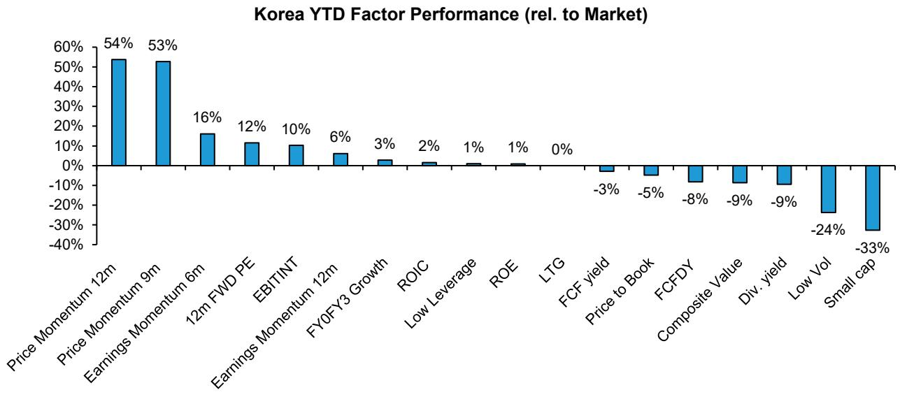

bar chart

Korea YTD Factor Performance (rel. to Market)
| Factor | Performance (%) |
| :--- | :--- |
| Price Momentum 12m | 54 |
| Price Momentum 9m | 53 |
| Earnings Momentum 6m | 16 |
| 12m FWD PE | 12 |
| EBITINT | 10 |
| Earnings Momentum 12m | 6 |
| FY0FY3 Growth | 3 |
| ROIC | 2 |
| Low Leverage | 1 |
| ROE | 1 |
| LTG | 0 |
| FCF yield | -3 |
| Price to Book | -5 |
| FCFDY | -8 |
| Composite Value | -9 |
| Div. yield | -9 |
| Low Vol | -24 |
| Small cap | -33 |

Data till Jun 5 $^{th}$ 2026  
Source: MSCI, FactSet, Bernstein Analysis

EXHIBIT 14: Taiwan's momentum rally has been even more sharp, delivering $63\%$ alpha YTD  
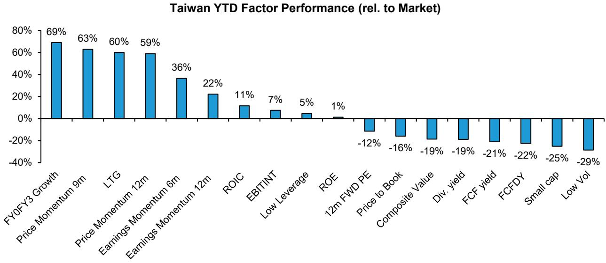

bar chart

Taiwan YTD Factor Performance (rel. to Market)
| Factor | Performance (%) |
| :--- | :--- |
| FY0FY3 Growth | 69 |
| Price Momentum 9m | 63 |
| LTG | 60 |
| Price Momentum 12m | 59 |
| Earnings Momentum 6m | 36 |
| Earnings Momentum 12m | 22 |
| ROIC | 11 |
| EBITINT | 7 |
| Low Leverage | 5 |
| ROE | 1 |
| 12m FWD PE | -12 |
| Price to Book | -16 |
| Composite Value | -19 |
| Div. yield | -19 |
| FCF yield | -21 |
| FCFDY | -22 |
| Small cap | -25 |
| Low Vol | -29 |

Data till Jun 5 $^{th}$ 2026  
Source: MSCI, FactSet, Bernstein Analysis

EXHIBIT 15: While China overall has lagged KR/TW markets but momentum stocks have generated 22% alpha even in China YTD  
China YTD Factor Performance (rel. to Market)  
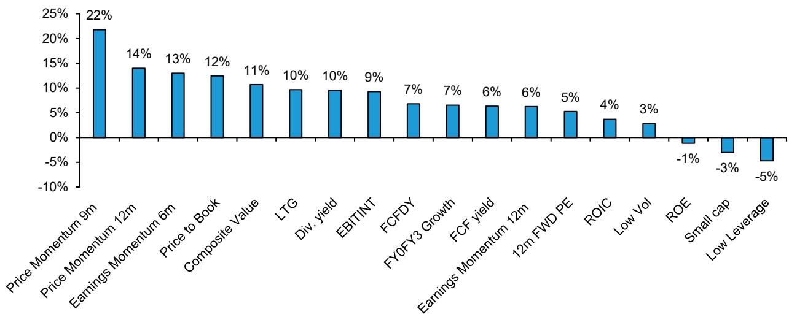

bar chart

| Metric | Value (%) |
|---|---|
| Price Momentum 9m | 22 |
| Price Momentum 12m | 14 |
| Earnings Momentum 6m | 13 |
| Price to Book | 12 |
| Composite Value | 11 |
| LTG | 10 |
| Div. yield | 10 |
| EBITINT | 9 |
| FCFDY | 7 |
| FY0FY3 Growth | 7 |
| FCF yield | 6 |
| Earnings Momentum 12m | 6 |
| 12m FWD PE | 5 |
| ROIC | 4 |
| Low Vol | 3 |
| ROE | -1 |
| Small cap | -3 |
| Low Leverage | -5 |

Data till Jun 5 $^{th}$ 2026  
Source: MSCI, FactSet, Bernstein Analysis

EXHIBIT 16: Interestingly, even in India (market that has generated negative returns), momentum has outperformed the market by 19%  
India YTD Factor Performance (rel. to Market)  
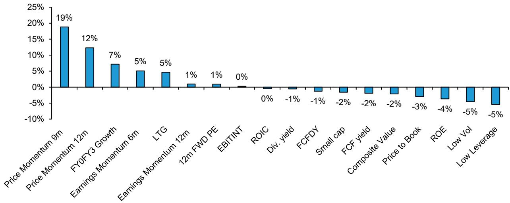

bar chart

| Metric | Value (%) |
| :--- | :--- |
| Price Momentum 9m | 19 |
| Price Momentum 12m | 12 |
| FY0FY3 Growth | 7 |
| Earnings Momentum 6m | 5 |
| LTG | 5 |
| Earnings Momentum 12m | 1 |
| 12m FWD PE | 1 |
| EBITINT | 0 |
| ROIC | 0 |
| Div. yield | -1 |
| FCFDY | -1 |
| Small cap | -2 |
| FCF yield | -2 |
| Composite Value | -2 |
| Price to Book | -3 |
| ROE | -4 |
| Low Vol | -5 |
| Low Leverage | -5 |

Data till Jun 5 $^{th}$ 2026  
Source: MSCI, FactSet, Bernstein Analysis

## VALUATION, EARNINGS REVISION IN ASIAN MARKETS' MOMENTUM

Driven by the strong rally, momentum bubble is visible in both TW and KR where momentum stocks reached record high valuations in this cycle and already showing de-rating since the beginning of this month. Momentum in Taiwan is significantly stretched, at +2.9SD above the long-term PE average. Momentum in Korea also experienced a sudden jump, now coming to +1.9SD above the long-term PE average. However, momentum stocks are still valued attractively in India and China markets. Earnings expectations for momentum stocks is at record high levels in China and TW. In KR, 2009 cycle had higher earnings revisions for momentum. In India, earnings revisions have just turned positive for momentum stocks. Crowding risk is highest in Korea momentum while crowding in TW momentum is also elevated. In China and India market, there is no crowding risk. (Exhibit 17-Exhibit 18)

EXHIBIT 17: Momentum bubble is visible in both TW and KR where momentum stocks reached record high valuations in this cycle and already showing de-rating since the beginning of this month  
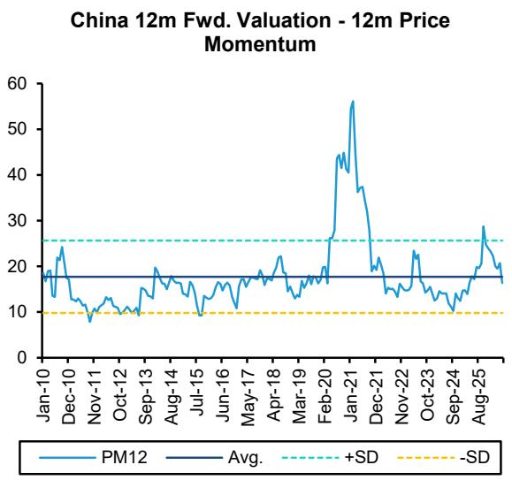

line chart

| Date    | PM12 | Avg. | +SD  | -SD  |
|---------|------|------|------|------|
| Jan-10  | ~18  | ~18  | ~25  | ~10  |
| Dec-10  | ~24  | ~18  | ~25  | ~10  |
| Nov-11  | ~10  | ~18  | ~25  | ~10  |
| Oct-12  | ~12  | ~18  | ~25  | ~10  |
| Sep-13  | ~16  | ~18  | ~25  | ~10  |
| Aug-14  | ~18  | ~18  | ~25  | ~10  |
| Jul-15  | ~10  | ~18  | ~25  | ~10  |
| Jun-16  | ~16  | ~18  | ~25  | ~10  |
| May-17  | ~18  | ~18  | ~25  | ~10  |
| Apr-18  | ~20  | ~18  | ~25  | ~10  |
| Mar-19  | ~18  | ~18  | ~25  | ~10  |
| Feb-20  | ~26  | ~18  | ~25  | ~10  |
| Jan-21  | ~56  | ~18  | ~25  | ~10  |
| Dec-21  | ~36  | ~18  | ~25  | ~10  |
| Nov-22  | ~20  | ~18  | ~25  | ~10  |
| Oct-23  | ~24  | ~18  | ~25  | ~10  |
| Sep-24  | ~12  | ~18  | ~25  | ~10  |
| Aug-25  | ~30  | ~18  | ~25  | ~10  |

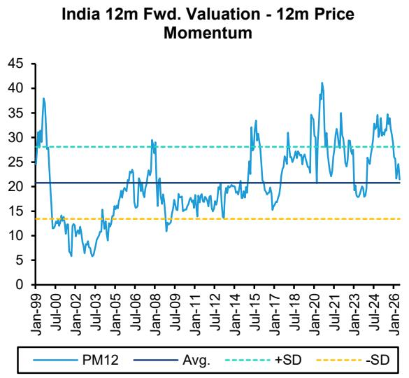

line chart

| Date   | PM12 | Avg. | +SD  | -SD  |
|--------|------|------|------|------|
| Jan-99 | 38   | 20   | 28   | 14   |
| Jul-00 | 13   | 20   | 28   | 14   |
| Jan-02 | 6    | 20   | 28   | 14   |
| Jul-03 | 15   | 20   | 28   | 14   |
| Jan-05 | 18   | 20   | 28   | 14   |
| Jul-06 | 23   | 20   | 28   | 14   |
| Jan-08 | 29   | 20   | 28   | 14   |
| Jul-09 | 17   | 20   | 28   | 14   |
| Jan-11 | 18   | 20   | 28   | 14   |
| Jul-12 | 19   | 20   | 28   | 14   |
| Jan-14 | 20   | 20   | 28   | 14   |
| Jul-15 | 33   | 20   | 28   | 14   |
| Jan-17 | 16   | 20   | 28   | 14   |
| Jul-18 | 30   | 20   | 28   | 14   |
| Jan-20 | 41   | 20   | 28   | 14   |
| Jul-21 | 35   | 20   | 28   | 14   |
| Jan-23 | 34   | 20   | 28   | 14   |
| Jul-24 | 35   | 20   | 28   | 14   |
| Jan-26 | 23   | 20   | 28   | 14   |

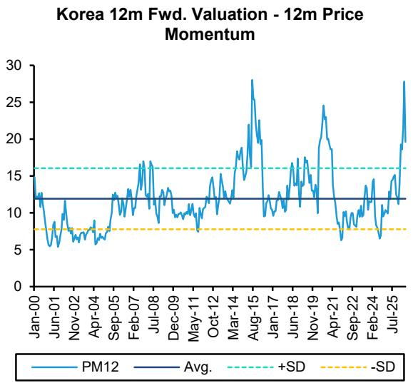

line chart

| Date    | PM12 | Avg. | +SD  | -SD  |
|---------|------|------|------|------|
| Jan-00  | 13   | 12   | 16   | 8    |
| Jun-01  | 7    | 12   | 16   | 8    |
| Nov-02  | 8    | 12   | 16   | 8    |
| Apr-04  | 7    | 12   | 16   | 8    |
| Sep-05  | 10   | 12   | 16   | 8    |
| Feb-07  | 13   | 12   | 16   | 8    |
| Jul-08  | 17   | 12   | 16   | 8    |
| Dec-09  | 10   | 12   | 16   | 8    |
| May-11  | 10   | 12   | 16   | 8    |
| Oct-12  | 14   | 12   | 16   | 8    |
| Mar-14  | 18   | 12   | 16   | 8    |
| Aug-15  | 28   | 12   | 16   | 8    |
| Jan-17  | 10   | 12   | 16   | 8    |
| Jun-18  | 17   | 12   | 16   | 8    |
| Nov-19  | 24   | 12   | 16   | 8    |
| Apr-21  | 7    | 12   | 16   | 8    |
| Sep-22  | 10   | 12   | 16   | 8    |
| Feb-24  | 14   | 12   | 16   | 8    |
| Jul-25  | 28   | 12   | 16   | 8    |

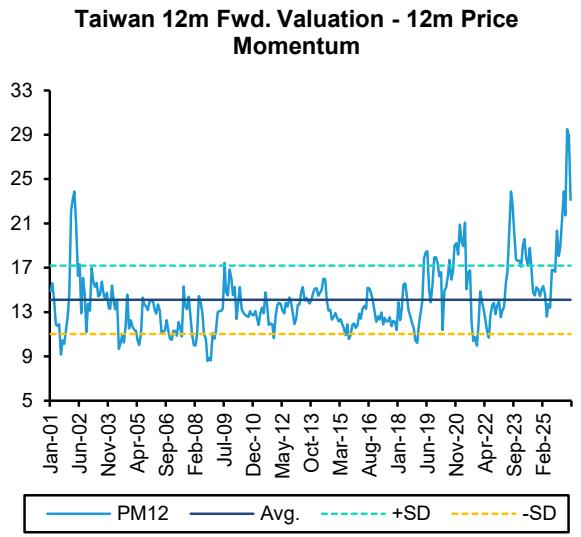

line chart

| Date   | PM12 | Avg. | +SD | -SD |
|--------|------|------|-----|-----|
| Jan-01 | 13   | 13   | 17  | 9   |
| Jun-02 | 24   | 13   | 17  | 9   |
| Nov-03 | 13   | 13   | 17  | 9   |
| Apr-05 | 13   | 13   | 17  | 9   |
| Sep-06 | 13   | 13   | 17  | 9   |
| Feb-08 | 9    | 13   | 17  | 9   |
| Jul-09 | 17   | 13   | 17  | 9   |
| Dec-10 | 13   | 13   | 17  | 9   |
| May-12 | 13   | 13   | 17  | 9   |
| Oct-13 | 13   | 13   | 17  | 9   |
| Mar-15 | 13   | 13   | 17  | 9   |
| Aug-16 | 13   | 13   | 17  | 9   |
| Jan-18 | 13   | 13   | 17  | 9   |
| Jun-19 | 17   | 13   | 17  | 9   |
| Nov-20 | 21   | 13   | 17  | 9   |
| Apr-22 | 13   | 13   | 17  | 9   |
| Sep-23 | 24   | 13   | 17  | 9   |
| Feb-25 | 29   | 13   | 17  | 9   |

Data as of Jun 5 $^{th}$ 2026  
Source: MSCI, FactSet, Bernstein Analysis

EXHIBIT 18: Earnings expectations for momentum stocks is at record high levels in China and TW. In KR, 2009 cycle had higher earnings revisions for momentum. In India, earnings revisions have just turned positive for momentum stocks  
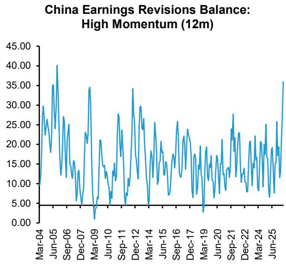

line chart

| Date   | Value |
|--------|-------|
| Mar-04 | 10.00 |
| Jun-05 | 35.00 |
| Sep-06 | 25.00 |
| Dec-07 | 15.00 |
| Mar-09 | 35.00 |
| Jun-10 | 10.00 |
| Sep-11 | 25.00 |
| Dec-12 | 35.00 |
| Mar-14 | 25.00 |
| Jun-15 | 20.00 |
| Sep-16 | 25.00 |
| Dec-17 | 20.00 |
| Mar-19 | 15.00 |
| Jun-20 | 25.00 |
| Sep-21 | 20.00 |
| Dec-22 | 25.00 |
| Mar-24 | 20.00 |
| Jun-25 | 35.00 |

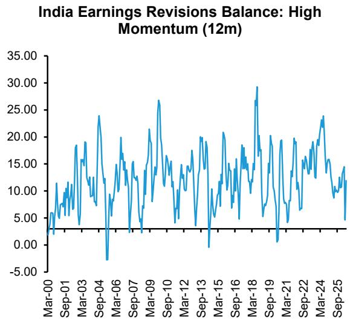

line chart

| Date   | Value |
|--------|-------|
| Mar-00 | 3.00  |
| Sep-01 | 10.00 |
| Mar-03 | 18.00 |
| Sep-04 | 24.00 |
| Mar-06 | -3.00 |
| Sep-07 | 15.00 |
| Mar-09 | 27.00 |
| Sep-10 | 16.00 |
| Mar-12 | 14.00 |
| Sep-13 | 20.00 |
| Mar-15 | 12.00 |
| Sep-16 | 21.00 |
| Mar-18 | 29.00 |
| Sep-19 | 19.00 |
| Mar-21 | 18.00 |
| Sep-22 | 24.00 |
| Mar-24 | 23.00 |
| Sep-25 | 14.00 |

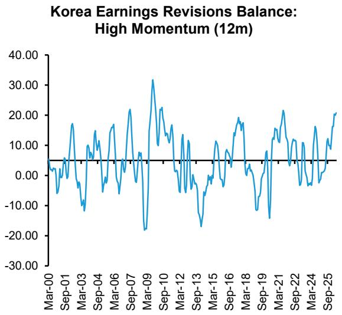

line chart

| Date   | Value |
|--------|-------|
| Mar-00 | 0.00  |
| Sep-01 | 5.00  |
| Mar-03 | -10.00|
| Sep-04 | 10.00 |
| Mar-06 | 15.00 |
| Sep-07 | 20.00 |
| Mar-09 | -20.00|
| Sep-10 | 30.00 |
| Mar-12 | 10.00 |
| Sep-13 | -15.00|
| Mar-15 | 5.00  |
| Sep-16 | 15.00 |
| Mar-18 | 20.00 |
| Sep-19 | -15.00|
| Mar-21 | 15.00 |
| Sep-22 | 20.00 |
| Mar-24 | 10.00 |
| Sep-25 | 20.00 |

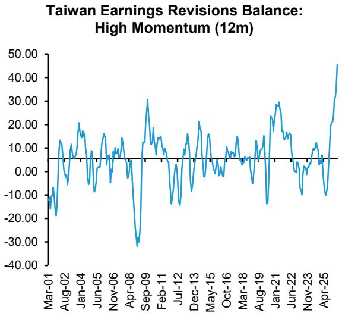

line chart

| Date    | Value  |
|---------|--------|
| Mar-01  | -15.00 |
| Aug-02  | 15.00  |
| Jan-04  | 20.00  |
| Jun-05  | 10.00  |
| Nov-06  | 15.00  |
| Apr-08  | -30.00 |
| Sep-09  | 30.00  |
| Feb-11  | 15.00  |
| Jul-12  | -15.00 |
| Dec-13  | 20.00  |
| May-15  | 15.00  |
| Oct-16  | 10.00  |
| Mar-18  | 5.00   |
| Aug-19  | -15.00 |
| Jan-21  | 30.00  |
| Jun-22  | -10.00 |
| Nov-23  | 15.00  |
| Apr-25  | 45.00  |

Data as of Jun 5 $^{th}$ 2026  
Source: MSCI, FactSet, Bernstein Analysis

EXHIBIT 19: Crowding risk is highest in Korea momentum while crowding in TW momentum is also elevated  
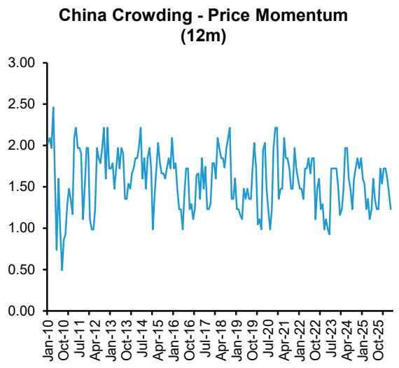

line chart

| Date   | Value |
|--------|-------|
| Jan-10 | 2.50  |
| Oct-10 | 0.50  |
| Jul-11 | 2.00  |
| Apr-12 | 1.80  |
| Jan-13 | 2.20  |
| Oct-13 | 1.90  |
| Jul-14 | 2.10  |
| Apr-15 | 1.70  |
| Jan-16 | 2.00  |
| Oct-16 | 1.60  |
| Jul-17 | 1.80  |
| Apr-18 | 2.20  |
| Jan-19 | 1.50  |
| Oct-19 | 2.00  |
| Jul-20 | 2.30  |
| Apr-21 | 1.80  |
| Jan-22 | 1.70  |
| Oct-22 | 1.50  |
| Jul-23 | 1.70  |
| Apr-24 | 2.00  |
| Jan-25 | 1.80  |
| Oct-25 | 1.70  |

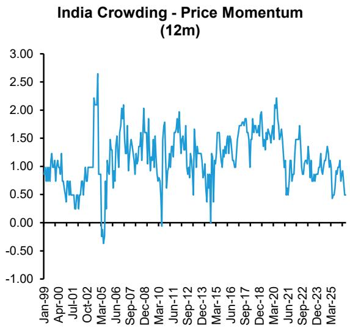

line chart

| Date    | Value |
|---------|-------|
| Jan-99  | 1.00  |
| Apr-00  | 1.20  |
| Jul-01  | 0.80  |
| Oct-02  | 2.70  |
| Mar-05  | -0.40 |
| Jun-06  | 1.50  |
| Sep-07  | 2.10  |
| Dec-08  | 1.80  |
| Mar-10  | 1.70  |
| Jun-11  | 1.90  |
| Sep-12  | 1.60  |
| Dec-13  | 1.40  |
| Mar-15  | 1.50  |
| Jun-16  | 1.70  |
| Sep-17  | 1.80  |
| Dec-18  | 2.20  |
| Mar-20  | 1.60  |
| Jun-21  | 1.40  |
| Sep-22  | 1.30  |
| Dec-23  | 1.20  |
| Mar-25  | 0.80  |

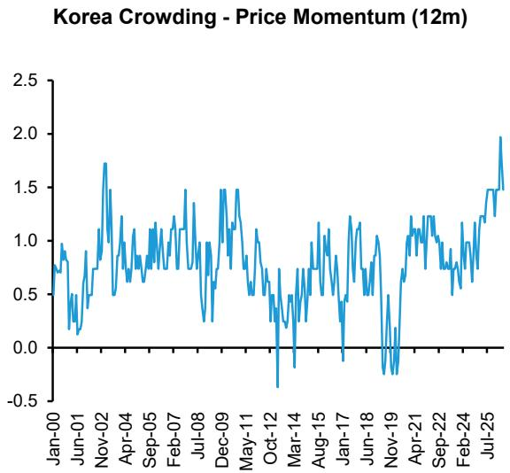

line chart

| Date    | Value |
|---------|-------|
| Jan-00  | 0.6   |
| Jun-01  | 0.3   |
| Nov-02  | 1.7   |
| Apr-04  | 0.8   |
| Sep-05  | 1.1   |
| Feb-07  | 1.4   |
| Jul-08  | 0.9   |
| Dec-09  | 1.5   |
| May-11  | 0.6   |
| Oct-12  | -0.4  |
| Mar-14  | 0.7   |
| Aug-15  | 1.2   |
| Jan-17  | 0.3   |
| Jun-18  | 1.3   |
| Nov-19  | -0.2  |
| Apr-21  | 1.2   |
| Sep-22  | 0.8   |
| Feb-24  | 1.3   |
| Jul-25  | 2.0   |

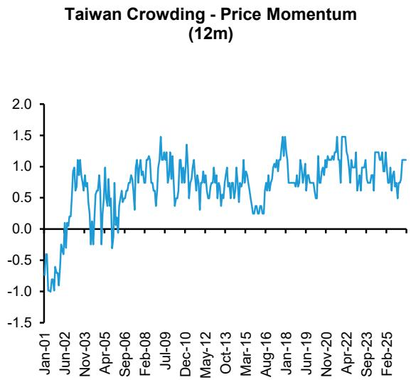

line chart

| Date    | Value |
|---------|-------|
| Jan-01  | -0.5  |
| Jun-02  | -1.0  |
| Nov-03  | 1.0   |
| Apr-05  | 0.5   |
| Sep-06  | 1.0   |
| Feb-08  | 1.5   |
| Jul-09  | 1.0   |
| Dec-10  | 1.5   |
| May-12  | 1.0   |
| Oct-13  | 1.0   |
| Mar-15  | 0.5   |
| Aug-16  | 1.5   |
| Jan-18  | 1.0   |
| Jun-19  | 1.5   |
| Nov-20  | 1.0   |
| Apr-22  | 1.5   |
| Sep-23  | 1.0   |
| Feb-25  | 1.0   |

Data till Jun 5 $^{th}$ 2026  
Source: MSCI, FactSet, Bernstein Analysis

## MOMENTUM DISPERSION EXTREME IN CHINA, TAIWAN AND KOREA

The momentum extremes are now visible in Taiwan, Korea and China where low vol has now fallen to decade low momentum trends. On the other hand, high momentum and high growth stocks have been strongly correlated now sitting near record high in both China and Taiwan while value is now sitting at the other extreme. Hence, momentum rally in China and TW has created extreme dispersion not just in high vol vs. low vol but also growth vs. value. In Korea, the dispersion is more visible on the volatility front. India momentum has no impact yet on intra-market extreme dispersion (Exhibit 20-Exhibit 22)

EXHIBIT 20: Momentum in growth stocks has reached record high in China market while momentum in value, high yield and low vol has fallen to record low  
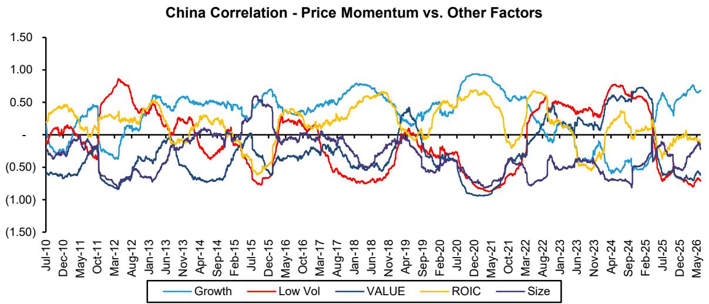

line chart

| Date | Growth | Low Vol | VALUE | ROIC | Size |
| --- | --- | --- | --- | --- | --- |
| Jul-10 | -0.2 | -0.3 | -0.4 | -0.1 | -0.2 |
| Dec-10 | 0.1 | 0.0 | -0.3 | 0.2 | -0.1 |
| May-11 | 0.3 | 0.2 | -0.2 | 0.3 | -0.1 |
| Oct-11 | 0.4 | 0.3 | -0.1 | 0.4 | -0.2 |
| Mar-12 | 0.5 | 0.4 | 0.0 | 0.5 | -0.3 |
| Aug-12 | 0.6 | 0.5 | 0.1 | 0.6 | -0.4 |
| Jan-13 | 0.7 | 0.6 | 0.2 | 0.7 | -0.5 |
| Jun-13 | 0.8 | 0.7 | 0.3 | 0.8 | -0.6 |
| Nov-13 | 0.9 | 0.8 | 0.4 | 0.9 | -0.7 |
| Apr-14 | 1.0 | 0.9 | 0.5 | 1.0 | -0.8 |
| Sep-14 | 1.1 | 1.0 | 0.6 | 1.1 | -0.9 |
| Feb-15 | 1.2 | 1.1 | 0.7 | 1.2 | -1.0 |
| Jul-15 | 1.3 | 1.2 | 0.8 | 1.3 | -1.1 |
| Dec-15 | 1.4 | 1.3 | 0.9 | 1.4 | -1.2 |
| May-16 | 1.5 | 1.4 | 1.0 | 1.5 | -1.3 |
| Oct-16 | 1.6 | 1.5 | 1.1 | 1.6 | -1.4 |
| Mar-17 | 1.7 | 1.6 | 1.2 | 1.7 | -1.5 |
| Aug-17 | 1.8 | 1.7 | 1.3 | 1.8 | -1.6 |
| Jan-18 | 1.9 | 1.8 | 1.4 | 1.9 | -1.7 |
| Jun-18 | 2.0 | 1.9 | 1.5 | 2.0 | -1.8 |
| Nov-18 | 2.1 | 2.0 | 1.6 | 2.1 | -1.9 |
| Apr-19 | 2.2 | 2.1 | 1.7 | 2.2 | -2.0 |
| Sep-19 | 2.3 | 2.2 | 1.8 | 2.3 | -2.1 |
| Feb-20 | 2.4 | 2.3 | 1.9 | 2.4 | -2.2 |
| Jul-20 | 2.5 | 2.4 | 2.0 | 2.5 | -2.3 |
| Dec-20 | 2.6 | 2.5 | 2.1 | 2.6 | -2.4 |
| May-21 | 2.7 | 2.6 | 2.2 | 2.7 | -2.5 |
| Oct-21 | 2.8 | 2.7 | 2.3 | 2.8 | -2.6 |
| Mar-22 | 2.9 | 2.8 | 2.4 | 2.9 | -2.7 |
| Aug-22 | 3.0 | 2.9 | 2.5 | 3.0 | -2.8 |
| Jan-23 | 3.1 | 3.0 | 2.6 | 3.1 | -2.9 |
| Jun-23 | 3.2 | 3.1 | 2.7 | 3.2 | -3.0 |
| Nov-23 | 3.3 | 3.2 | 2.8 | 3.3 | -3.1 |
| Apr-24 | 3.4 | 3.3 | 2.9 | 3.4 | -3.2 |
| Sep-24 | 3.5 | 3.4 | 3.0 | 3.5 | -3.3 |
| Feb-25 | 3.6 | 3.5 | 3.1 | 3.6 | -3.4 |
| Jul-25 | 3.7 | 3.6 | 3.2 | 3.7 | -3.5 |
| Dec-25 | 3.8 | 3.7 | 3.3 | 3.8 | -3.6 |
| May-26 | 3.9 | 3.8 | 3.4 | 3.9 | -3.7 |

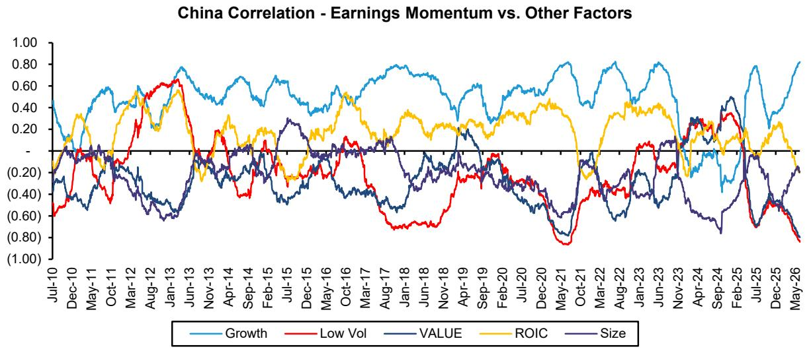

line chart

| Date   | Growth | Low Vol | VALUE | ROIC | Size |
|--------|--------|---------|-------|------|------|
| Jul-10 | 0.40   | -0.60   | -0.20 | -0.10| -0.10|
| Dec-10 | 0.30   | -0.50   | -0.30 | 0.10 | -0.15|
| May-11 | 0.50   | -0.40   | -0.25 | 0.30 | -0.20|
| Oct-11 | 0.60   | -0.30   | -0.20 | 0.40 | -0.25|
| Mar-12 | 0.55   | -0.25   | -0.15 | 0.45 | -0.30|
| Aug-12 | 0.70   | -0.10   | -0.10 | 0.50 | -0.35|
| Jan-13 | 0.80   | 0.10    | 0.05  | 0.60 | -0.40|
| Jun-13 | 0.75   | 0.20    | 0.10  | 0.55 | -0.45|
| Nov-13 | 0.65   | 0.15    | 0.15  | 0.45 | -0.50|
| Apr-14 | 0.70   | 0.25    | 0.20  | 0.50 | -0.55|
| Sep-14 | 0.65   | 0.30    | 0.25  | 0.45 | -0.60|
| Feb-15 | 0.75   | 0.35    | 0.30  | 0.55 | -0.65|
| Jul-15 | 0.80   | 0.40    | 0.35  | 0.60 | -0.70|
| Dec-15 | 0.75   | 0.35    | 0.30  | 0.55 | -0.75|
| May-16 | 0.70   | 0.30    | 0.25  | 0.50 | -0.80|
| Oct-16 | 0.65   | 0.25    | 0.20  | 0.45 | -0.85|
| Mar-17 | 0.75   | 0.35    | 0.30  | 0.55 | -0.90|
| Aug-17 | 0.85   | 0.45    | 0.40  | 0.65 | -0.95|
| Jan-18 | 0.80   | 0.40    | 0.35  | 0.60 | -1.00|
| Jun-18 | 0.75   | 0.35    | 0.30  | 0.55 | -1.05|
| Nov-18 | 0.70   | 0.30    | 0.25  | 0.50 | -1.10|
| Apr-19 | 0.65   | 0.25    | 0.20  | 0.45 | -1.15|
| Sep-19 | 0.75   | 0.35    | 0.30  | 0.55 | -1.20|
| Feb-20 | 0.85   | 0.45    | 0.35  | 0.65 | -1.25|
| Jul-20 | 0.80   | 0.40    | 0.30  | 0.60 | -1.30|
| Dec-20 | 0.75   | 0.35    | 0.25  | 0.55 | -1.35|
| May-21 | 0.85   | 0.45    | 0.35  | 0.65 | -1.40|
| Oct-21 | 0.80   | 0.40    | 0.30  | 0.60 | -1.45|
| Mar-22 | 0.75   | 0.35    | 0.25  | 0.55 | -1.50|
| Aug-22 | 0.85   | 0.45    | 0.35  | 0.65 | -1.45|
| Jan-23 | 0.95   | 0.55    | 0.45  | 0.75 | -1.40|
| Jun-23 | 1.15   | 1.65    | 1.25  | 1.25 | -1.35|
| Nov-23 | 1.25   | 1.75    | 1.35  | 1.35 | -1.38|
| Apr-24 | 1.35   | 1.85    | 1.45  | 1.48 | -1.42|
| Sep-24 | 1.48   | 2.25    | 1.68  | 1.68 | -1.48|
| Feb-25 | 1.68   | 2.68    | 2.38  | 2.38 | -1.62|
| Jul-25 | 1.88   | 3.28    | 3.18  | 3.18 | -1.72|
| Dec-25 | 2.18   | 3.98    | 3.98  | 3.98 | -1.82|
| May-26 | 2.48   | -1.98   | -1.98 | -1.98| -1.98|

Data till Jun 5 $^{th}$ 2026  
Source: MSCI, FactSet, Bernstein Analysis

EXHIBIT 21: In Taiwan, momentum has been strongly correlated to growth stocks and has been anti-value and anti-low vol. The dispersion is near 10yr high now  
Correlation: Taiwan Price Momentum 12m vs. Other factors  
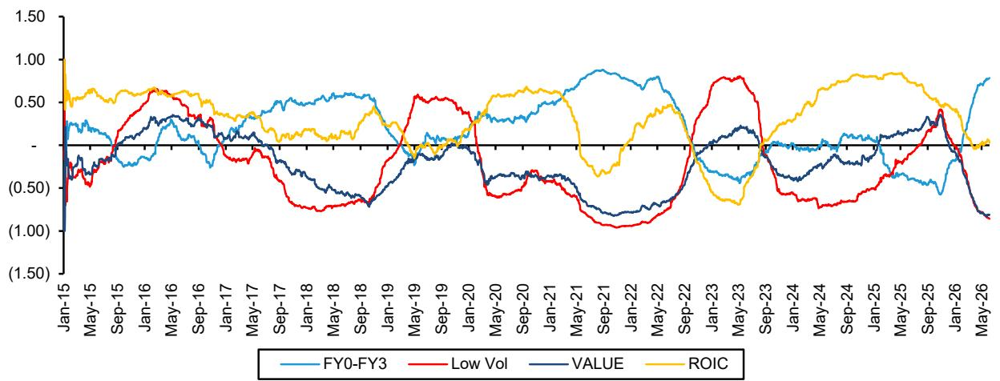

line chart

| Date   | FY0-FY3 | Low Vol | VALUE | ROIC |
|--------|---------|---------|-------|------|
| Jan-15 | -0.2    | -0.4    | -0.3  | 0.8  |
| May-15 | -0.1    | -0.3    | -0.2  | 0.7  |
| Sep-15 | 0.1     | 0.2     | 0.1   | 0.6  |
| Jan-16 | 0.3     | 0.5     | 0.4   | 0.7  |
| May-16 | 0.2     | 0.4     | 0.3   | 0.6  |
| Sep-16 | 0.1     | 0.3     | 0.2   | 0.5  |
| Jan-17 | -0.1    | -0.2    | -0.1  | 0.4  |
| May-17 | 0.2     | 0.1     | 0.0   | 0.3  |
| Sep-17 | 0.3     | -0.1    | -0.2  | 0.2  |
| Jan-18 | 0.4     | -0.3    | -0.4  | 0.1  |
| May-18 | 0.5     | -0.4    | -0.5  | 0.0  |
| Sep-18 | 0.6     | -0.5    | -0.6  | -0.1 |
| Jan-19 | 0.7     | -0.6    | -0.7  | -0.2 |
| May-19 | 0.8     | -0.7    | -0.8  | -0.3 |
| Sep-19 | 0.9     | -0.8    | -0.9  | -0.4 |
| Jan-20 | 1.0     | -0.9    | -1.0  | -0.5 |
| May-20 | 0.9     | -0.8    | -0.9  | -0.4 |
| Sep-20 | 0.8     | -0.7    | -0.8  | -0.3 |
| Jan-21 | 0.7     | -0.6    | -0.7  | -0.2 |
| May-21 | 0.6     | -0.5    | -0.6  | -0.1 |
| Sep-21 | 0.5     | -0.4    | -0.5  | 0.0  |
| Jan-22 | 0.4     | -0.3    | -0.4  | 0.1  |
| May-22 | 0.3     | -0.2    | -0.3  | 0.2  |
| Sep-22 | 0.2     | -0.1    | -0.2  | 0.3  |
| Jan-23 | 0.1     | 0.0     | -0.1  | 0.4  |
| May-23 | 0.0     | 0.1     | 0.0   | 0.5  |
| Sep-23 | -0.1    | 0.2     | 0.1   | 0.6  |
| Jan-24 | -0.2    | 0.3     | 0.2   | 0.7  |
| May-24 | -0.3    | 0.4     | 0.3   | 0.8  |
| Sep-24 | -0.4    | 0.5     | 0.4   | 0.9  |
| Jan-25 | -0.5    | 0.6     | 0.5   | 1.0  |
| May-25 | -0.6    | 0.7     | 0.6   | 1.1  |
| Sep-25 | -0.7    | 0.8     | 0.7   | 1.2  |
| Jan-26 | -0.8    | 0.9     | 0.8   | 1.3  |
| May-26 | -0.9    | 1.0     | 0.9   | 1.4  |

Correlation: Taiwan Earnings Momentum 12m vs. Other factors  
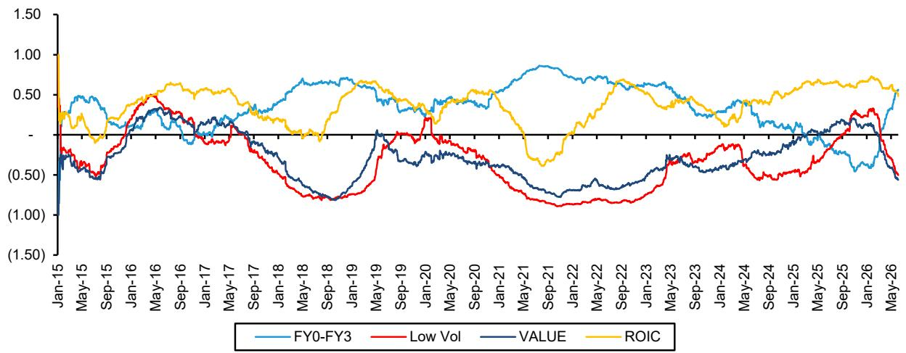  
Data till Jun 5 $^{th}$ 2026  
Source: MSCI, FactSet, Bernstein Analysis

EXHIBIT 22: Momentum in Korea has also created extreme dispersion for low vol stocks which are now sitting at decade low momentum  
Correlation: Korea Price Momentum 12m vs. Other factors  
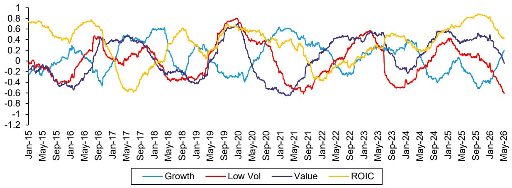

Correlation: Korea Earnings Momentum 12m vs. Other factors  
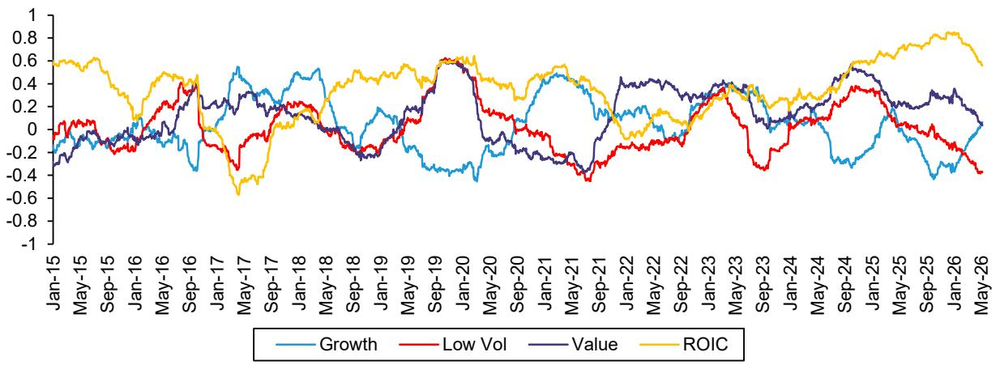

line chart

| Date | Growth | Low Vol | Value | ROIC |
| --- | --- | --- | --- | --- |
| Jan-15 | -0.2 | 0.0 | -0.3 | 0.6 |
| May-15 | -0.1 | 0.1 | -0.2 | 0.5 |
| Sep-15 | 0.0 | 0.2 | -0.1 | 0.4 |
| Jan-16 | 0.1 | 0.3 | 0.0 | 0.3 |
| May-16 | 0.2 | 0.4 | 0.1 | 0.2 |
| Sep-16 | 0.3 | 0.5 | 0.2 | 0.1 |
| Jan-17 | 0.4 | 0.6 | 0.3 | 0.0 |
| May-17 | 0.5 | 0.7 | 0.4 | -0.1 |
| Sep-17 | 0.6 | 0.8 | 0.5 | -0.2 |
| Jan-18 | 0.7 | 0.9 | 0.6 | -0.3 |
| May-18 | 0.8 | 1.0 | 0.7 | -0.4 |
| Sep-18 | 0.9 | 1.1 | 0.8 | -0.5 |
| Jan-19 | 1.0 | 1.2 | 0.9 | -0.6 |
| May-19 | 1.1 | 1.3 | 1.0 | -0.7 |
| Sep-19 | 1.2 | 1.4 | 1.1 | -0.8 |
| Jan-20 | 1.3 | 1.5 | 1.2 | -0.9 |
| May-20 | 1.4 | 1.6 | 1.3 | -1.0 |
| Sep-20 | 1.5 | 1.7 | 1.4 | -1.1 |
| Jan-21 | 1.6 | 1.8 | 1.5 | -1.2 |
| May-21 | 1.7 | 1.9 | 1.6 | -1.3 |
| Sep-21 | 1.8 | 2.0 | 1.7 | -1.4 |
| Jan-22 | 1.9 | 2.1 | 1.8 | -1.5 |
| May-22 | 2.0 | 2.2 | 1.9 | -1.6 |
| Sep-22 | 2.1 | 2.3 | 2.0 | -1.7 |
| Jan-23 | 2.2 | 2.4 | 2.1 | -1.8 |
| May-23 | 2.3 | 2.5 | 2.2 | -1.9 |
| Sep-23 | 2.4 | 2.6 | 2.3 | -2.0 |
| Jan-24 | 2.5 | 2.7 | 2.4 | -2.1 |
| May-24 | 2.6 | 2.8 | 2.5 | -2.2 |
| Sep-24 | 2.7 | 2.9 | 2.6 | -2.3 |
| Jan-25 | 2.8 | 3.0 | 2.7 | -2.4 |
| May-25 | 2.9 | 3.1 | 2.8 | -2.5 |
| Sep-25 | 3.0 | 3.2 | 2.9 | -2.6 |
| Jan-26 | 3.1 | 3.3 | 3.0 | -2.7 |
| May-26 | 3.2 | 3.4 | 3.1 | -2.8 |
| Jan-27E | -0.3 | -0.4 | -0.5 | -0.6 |
| May-27E | -0.4 | -0.5 | -0.6 | -0.7 |
| Jan-28E | -0.5 | -0.6 | -0.7 | -0.8 |
| May-28E | -0.6 | -0.7 | -0.8 | -0.9 |
| Jan-29E | -0.7 | -0.8 | -0.9 | -1.0 |
| May-29E | -0.8 | -0.9 | -1.0 | -1.1 |
| Jan-30E | -0.9 | -1.0 | -1.1 | -1.2 |
| May-30E | -1.0 | -1.1 | -1.2 | -1.3 |
| Jan-31E | -1.1 | -1.2 | -1.3 | -1.4 |
| May-31E | -1.2 | -1.3 | -1.4 | -1.5 |
| Jan-32E | -1.3 | -1.4 | -1.5 | -1.6 |
| May-32E | -1.4 | -1.5 | -1.6 | -1.7 |
| Jan-33E | -1.5 | -1.6 | -1.7 | -1.8 |
| May-33E | -1.6 | -1.7 | -1.8 | -1.9 |
| Jan-34E | -1.7 | -1.8 | -1.9 | -2.0 |
| May-34E | -1.8 | -1.9 | -2.0 | -2.1 |
| Jan-35E | -1.9 | -2.0 | -2.1 | -2.2 |
| May-35E | -2.0 | -2.1 | -2.2 | -2.3 |
| Jan-36E | -2.1 | -2.2 | -2.3 | -2.4 |
| May-36E | -2.2 | -2.3 | -2.4 | -2.5 |
| Jan-37E | -2.3 | -2.4 | -2.5 | -2.6 |
| May-37E | -2.4 | -2.5 | -2.6 | -2.7 |
| Jan-38E | -2.5 | -2.6 | -2.7 | -2.8 |
| May-38E | -2.6 | -2.7 | -2.8 | -2.9 |
| Jan-39E | -2.7 | -2.8 | -2.9 | -3.0 |
| May-39E | -2.8 | -2.9 | -3.0 | -3.1 |
| Jan-40E | -2.9 | -3.0 | -3.1 | -3.2 |
| May-40E | -3.0 | -3.1 | -3.2 | -3.3 |
| Jan-41E | -3.1 | -3.2 | -3.3 | -3.4 |
| May-41E | -3.2 | -3.3 | -3.4 | -3.5 |
| Jan-42E | -3.3 | -3.4 | -3.5 | -3.6 |
| May-42E | -3.4 | -3.5 | -3.6 | -3.7 |
| Jan-43E | -3.5 | -3.6 | -3.7 | -3.8 |
| May-43E | -3.6 | -3.7 | -3.8 | -3.9 |
| Jan-44E | -3.7 | -3.8 | -3.9 | -4.0 |
| May-44E | -3.8 | -3.9 | -4.0 | -4.1 |
| Jan-45E | -3.9 | -4.0 | -4.1 | -4.2 |
| May-45E | -4.0 | -4.1 | -4.2 | -4.3 |
| Jan-46E | -4.1 | -4.2 | -4.3 | -4.4 |
| May-46E | -4.2 | -4.3 | -4.4 | -4.5 |
| Jan-47E | -4.3 | -4.4 | -4.5 | -4.6 |
| May-47E | -4.4 | -4.5 | -4.6 | -4.7 |
| Jan-48E | -4.5 | -4.6 | -4.7 | -4.8 |
| May-48E | -4.6 | -4.7 | -4.8 | -4.9 |
| Jan-49E | -4.7 | -4.8 | -4.9 | -5.0 |
| May-49E | -4.8 | -4.9 | -5.0 | -5.1 |

Data till Jun 5 $^{th}$ 2026  
Source: MSCI, FactSet, Bernstein Analysis

EXHIBIT 23: There is no extreme caused by momentum trends in India  
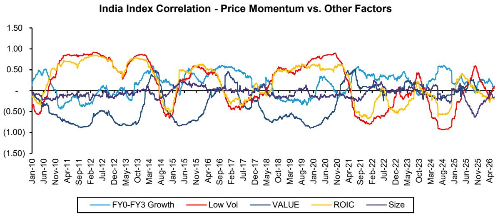

line chart

| Date    | FY0-FY3 Growth | Low Vol | VALUE | ROIC | Size |
|---------|----------------|---------|-------|------|------|
| Jan-10  | ~0.3           | ~-0.5   | ~-0.2 | ~-0.1| ~-0.3|
| Jun-10  | ~0.4           | ~0.8    | ~-0.3 | ~0.2 | ~-0.2|
| Nov-10  | ~0.5           | ~0.9    | ~-0.4 | ~0.3 | ~-0.1|
| Apr-11  | ~0.6           | ~0.9    | ~-0.5 | ~0.4 | ~0.0 |
| Sep-11  | ~0.7           | ~0.9    | ~-0.6 | ~0.5 | ~0.1 |
| Feb-12  | ~0.8           | ~0.9    | ~-0.7 | ~0.6 | ~0.2 |
| Jul-12  | ~0.9           | ~0.8    | ~-0.8 | ~0.7 | ~0.3 |
| Dec-12  | ~0.8           | ~0.7    | ~-0.9 | ~0.6 | ~0.4 |
| May-13  | ~0.7           | ~0.6    | ~-1.0 | ~0.5 | ~0.5 |
| Oct-13  | ~0.6           | ~0.5    | ~-1.1 | ~0.4 | ~0.6 |
| Mar-14  | ~0.5           | ~0.4    | ~-1.2 | ~0.3 | ~0.7 |
| Aug-14  | ~0.4           | ~0.3    | ~-1.3 | ~0.2 | ~0.8 |
| Jan-15  | ~0.3           | ~0.2    | ~-1.4 | ~0.1 | ~0.9 |
| Jun-15  | ~0.2           | ~0.1    | ~-1.5 | ~0.0 | ~1.0 |
| Nov-15  | ~0.1           | ~0.0    | ~-1.6 | ~-0.1| ~1.1 |
| Apr-16  | ~0.0           | ~-0.1   | ~-1.7 | ~-0.2| ~1.2 |
| Sep-16  | ~-0.1          | ~-0.2   | ~-1.8 | ~-0.3| ~1.3 |
| Feb-17  | ~-0.2          | ~-0.3   | ~-1.9 | ~-0.4| ~1.4 |
| Jul-17  | ~-0.3          | ~-0.4   | ~-2.0 | ~-0.5| ~1.5 |
| Dec-17  | ~-0.4          | ~-0.5   | ~-2.1 | ~-0.6| ~1.6 |
| May-18  | ~-0.5          | ~-0.6   | ~-2.2 | ~-0.7| ~1.7 |
| Oct-18  | ~-0.6          | ~-0.7   | ~-2.3 | ~-0.8| ~1.8 |
| Mar-19  | ~-0.7          | ~-0.8   | ~-2.4 | ~-0.9| ~1.9 |
| Aug-19  | ~-0.8          | ~-0.9   | ~-2.5 | ~-1.0| ~2.0 |
| Jan-20  | ~-0.9          | ~-1.0   | ~-2.6 | ~-1.1| ~2.1 |
| Jun-20  | ~-1.0          | ~-1.1   | ~-2.7 | ~-1.2| ~2.2 |
| Nov-20  | ~-1.1          | ~-1.2   | ~-2.8 | ~-1.3| ~2.3 |
| Apr-21  | ~-1.2          | ~-1.3   | ~-2.9 | ~-1.4| ~2.4 |
| Sep-21  | ~-1.3          | ~-1.4   | ~-3.0 | ~-1.5| ~2.5 |
| Feb-22  | ~-1.4          | ~-1.5   | ~-3.1 | ~-1.6| ~2.6 |
| Jul-22  | ~-1.5          | ~-1.6   | ~-3.2 | ~-1.7| ~2.7 |
| Dec-22  | ~-1.6          | ~-1.7   | ~-3.3 | ~-1.8| ~2.8 |
| May-23  | ~-1.7          | ~-1.8   | ~-3.4 | ~-1.9| ~2.9 |
| Oct-23  | ~-1.8          | ~-1.9   | ~-3.5 | ~-2.0| ~3.0 |
| Mar-24  | ~-1.9          | ~-2.0   | ~-3.6 | ~-2.1| ~3.1 |
| Aug-24  | ~-2.0          | ~-2.1   | ~-3.7 | ~-2.2| ~3.2 |
| Jan-25  | ~-2.1          | ~-2.2   | ~-3.8 | ~-2.3| ~3.3 |
| Jun-25  | ~-2.2          | ~-2.3   | ~-3.9 | ~-2.4| ~3.4 |
| Nov-25  | ~-2.3          | ~-2.4   | ~-4.0 | ~-2.5| ~3.5 |
| Apr-26  | ~-2.4          | ~-2.5   | ~-4.1 | ~-2.6|~3.

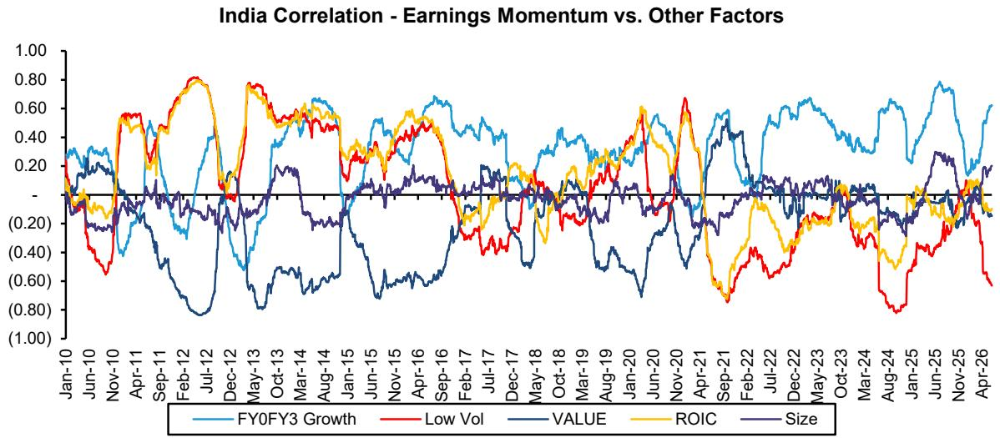

line chart

| Date    | FY0FY3 Growth | Low Vol | VALUE | ROIC | Size |
|---------|---------------|---------|-------|------|------|
| Jan-10  | ~0.30         | ~0.25   | ~0.15 | ~0.10 | ~0.05 |
| Jun-10  | ~0.40         | ~0.35   | ~0.20 | ~0.15 | ~0.10 |
| Nov-10  | ~0.50         | ~0.45   | ~0.25 | ~0.20 | ~0.15 |
| Apr-11  | ~0.60         | ~0.55   | ~0.30 | ~0.25 | ~0.20 |
| Sep-11  | ~0.70         | ~0.65   | ~0.35 | ~0.30 | ~0.25 |
| Feb-12  | ~0.80         | ~0.75   | ~0.40 | ~0.35 | ~0.30 |
| Jul-12  | ~0.90         | ~0.85   | ~0.45 | ~0.40 | ~0.35 |
| Dec-12  | ~0.75         | ~0.70   | ~0.40 | ~0.35 | ~0.30 |
| May-13  | ~0.65         | ~0.60   | ~0.35 | ~0.30 | ~0.25 |
| Oct-13  | ~0.55         | ~0.50   | ~0.30 | ~0.25 | ~0.20 |
| Mar-14  | ~0.45         | ~0.40   | ~0.25 | ~0.20 | ~0.15 |
| Aug-14  | ~0.35         | ~0.30   | ~0.20 | ~0.15 | ~0.10 |
| Jan-15  | ~0.25         | ~0.20   | ~0.15 | ~0.10 | ~0.05 |
| Jun-15  | ~0.15         | ~0.10   | ~0.10 | ~0.05 | ~0.05 |
| Nov-15  | ~0.25         | ~0.20   | ~0.15 | ~0.10 | ~0.10 |
| Apr-16  | ~0.35         | ~0.30   | ~0.25 | ~0.20 | ~0.15 |
| Sep-16  | ~0.45         | ~0.40   | ~0.35 | ~0.30 | ~0.25 |
| Feb-17  | ~0.55         | ~0.50   | ~0.45 | ~0.40 | ~0.35 |
| Jul-17  | ~0.65         | ~0.60   | ~0.55 | ~0.50 | ~0.45 |
| Dec-17  | ~0.75         | ~0.70   | ~0.65 | ~0.60 | ~0.55 |
| May-18  | ~0.85         | ~0.80   | ~0.75 | ~0.70 | ~0.65 |
| Oct-18  | ~0.95         | ~0.90   | ~0.85 | ~0.80 | ~0.75 |
| Mar-19  | ~1.05         | ~1.00   | ~1.00 | ~1.05 | ~1.15 |
| Aug-19  | ~1.15         | ~1.10   | ~1.15 | ~1.25 | ~1.35 |
| Jan-20  | ~1.25         | ~1.25   | ~1.35 | ~1.45 | ~1.55 |
| Jun-20  | ~1.35         | ~1.35   | ~1.45 | ~1.65 | ~1.75 |
| Nov-20  | ~1.45         | ~1.45   | ~1.65 | ~1.85 | ~2.25 |
| Apr-21  | ~1.55         | ~1.65   | ~1.85 | ~2.25 | ~2.85 |
| Sep-21  | ~1.65         | ~1.75   | ~2.25 | ~2.85 | ~3.65 |
| Feb-22  | ~1.75         | ~1.85   | ~2.65 | ~3.65 | ~4.45 |
| Jul-22  | ~1.85         | ~1.95   | ~3.25 | ~4.45 | ~6.25 |
| Dec-22  | ~1.95         | ~2.15   | ~3.85 | ~6.25 | ~8.25 |
| May-23  | ~2.15         | ~2.35   | ~4.65 | ~8.25 | ~12.25|
| Oct-23  | ~2.35         | ~2.65   | ~6.45 | ~12.25|~$788 |
| Mar-24  | ~2.45         | ~2.85   | ~8.45 |~$788  | $788  |
| Aug-24  | ~2.65         | ~3.25   |~$98  |~$788  | $788  |
| Jan-25  | ~2.85         | ~3.65   |~$98  |~$788  | $788  |
| Jun-25  | ~3.15         | ~4.25   |~$98  |~$788  | $788  |
| Nov-25  | ~3.45         | ~4.85   |~$98  |~$788  | $788  |
| Apr-26  | (~3)           | (~3)     | (~3)  | (~3)   | (~3)   |
| Aug-26  | (~4)           | (~4)     | (~4)  | (~4)   | (~4)   |
| Dec-26  | (~6)           | (~6)     | (~6)  | (~6)   | (~6)   |
| Mar-27  | (~8)           | (~8)     | (~8)  | (~8)   | (~8)   |
| Jul-27  | (~9)           | (~9)     | (~9)  | (~9)   | (~9)   |
| Dec-27  | (~11)          | (~11)    | (~11) | (~11)  | (~11)  |
| Mar-28  | (~13)          | (~13)    | (~13) | (~13)  | (~13)  |
| Jul-28  | (~16)          | (~16)    | (~16) | (~16)  | (~16)  |
| Dec-28  | (~2)           | (~2)     | (~2)  | (~2)   | (~2)   |
| Mar-29  | (~3)           | (~3)     | (~3)  | (~3)   | (~3)   |
| Jul-29  | (~4)           | (~4)     | (~4)  | (~4)   | (~4)   |
| Dec-29  | (~6)           | (~6)     | (~6)  | (~6)   | (~6)   |
| Mar-30  | (~8)           | (~8)     | (~8)  | (~8)   | (~8)   |
| Jul-30  | (~9)           | (~9)     | (~9)  | (~9)   | (~9)   |
| Dec-30  | (~11)| (~9)     | (~9)  | (~9)   | (~9)   |
| Mar-31  | (~13)| (~13)    | (~13) | (~13)  | (~13)  |
| Jul-31  | (~16)| (~16)    | (~16) | (~16)  | (~16)  |
| Dec-31  | (~2)           | (~2)     | (~2)  | (~2)   | (~2)   |
| Mar-32  | (~3)| (~3)     | (~3)  | (~3)   | (~3)   |
| Jul-32  | (~4)| (~4)     | (~4)  | (~4)   | (~4)   |
| Dec-32  | (~6)| (~6)     | (~6)  | (~6)   | (~6)   |
| Mar-33  | (~8)| (~8)     | (~8)  | (~8)   | (~8)   |
| Jul-33  | (~9)| (~9)     | (~9)  | (~9)   | (~9)   |
| Dec-33  | (1)| (9)| (9)| (9)| (9)|

Data till Jun 5 $^{th}$ 2026  
Source: MSCI, FactSet, Bernstein Analysis

EXHIBIT 24: Asia ex Japan/China - Stocks to avoid (screened for price momentum which are also high earnings momentum)

<table><tr><td>SEDOL</td><td>Sector</td><td>Company</td><td>CC</td><td>12m Fwd. PE</td><td>10yr PE zscore</td><td>6m EPS Momentum</td><td>12m EPS Momentum</td><td>Crowding Decile (1=Most Crowded, 10=Least Crowded)</td><td>Bernstein Rating</td></tr><tr><td>B235ZT</td><td>INDUSTRIALS</td><td>ECOPRO CO</td><td>KR</td><td>64x</td><td></td><td></td><td></td><td>3</td><td>U</td></tr><tr><td>626073</td><td>TECHNOLOGY</td><td>DELTA ELECTRONICS</td><td>TW</td><td>37x</td><td>2.5</td><td>71%</td><td>114%</td><td>2</td><td>O</td></tr><tr><td>677172</td><td>TECHNOLOGY</td><td>SAMSUNG ELECTRONICS CO</td><td>KR</td><td>6x</td><td>-1.0</td><td>574%</td><td>666%</td><td>3</td><td>O</td></tr><tr><td>677381</td><td>TECHNOLOGY</td><td>SAMSUNG ELECTRONICS PREF</td><td>KR</td><td>6x</td><td>-1.0</td><td>590%</td><td>696%</td><td></td><td>O</td></tr><tr><td>645026</td><td>TECHNOLOGY</td><td>SK HYNIX</td><td>KR</td><td>5x</td><td></td><td>401%</td><td>499%</td><td>3</td><td>O</td></tr><tr><td>688910</td><td>TECHNOLOGY</td><td>TAIWAN SEMICONDUCTOR MFG</td><td>TW</td><td>20x</td><td>0.3</td><td>51%</td><td>52%</td><td>3</td><td>O</td></tr><tr><td>620841</td><td>COMMUNICATIONS</td><td>HFCL</td><td>IN</td><td>37x</td><td>1.6</td><td></td><td></td><td>3</td><td></td></tr><tr><td>652096</td><td>CONSUMER DISCRETIONARY</td><td>LG ELECTRONICS PREF</td><td>KR</td><td>20x</td><td>5.3</td><td></td><td></td><td></td><td></td></tr><tr><td>690529</td><td>ENERGY</td><td>IRPC PUBLIC COMPANY</td><td>TH</td><td>20x</td><td></td><td>220%</td><td>243%</td><td>4</td><td></td></tr><tr><td>615816</td><td>FINANCIALS</td><td>HSBC HOLDINGS (HK)</td><td>HK</td><td>10x</td><td>-0.2</td><td>17%</td><td>26%</td><td></td><td></td></tr><tr><td>667159</td><td>FINANCIALS</td><td>KOREA INV HLDG PREF 1</td><td>KR</td><td>6x</td><td></td><td></td><td></td><td></td><td></td></tr><tr><td>665458</td><td>FINANCIALS</td><td>KOREA INVESTMENT HLDG</td><td>KR</td><td>6x</td><td></td><td>26%</td><td>79%</td><td>1</td><td></td></tr><tr><td>BF0Q26</td><td>FINANCIALS</td><td>MIRAE ASSET SEC PREF 2</td><td>KR</td><td>16x</td><td>3.4</td><td></td><td></td><td></td><td></td></tr><tr><td>624965</td><td>FINANCIALS</td><td>MIRAE ASSET SECURITIES</td><td>KR</td><td>16x</td><td>2.2</td><td>112%</td><td>178%</td><td>1</td><td></td></tr><tr><td>BRC1TM</td><td>FINANCIALS</td><td>PIRAMAL FINANCE</td><td>IN</td><td>15x</td><td>-0.3</td><td>57%</td><td>71%</td><td>2</td><td></td></tr><tr><td>666111</td><td>INDUSTRIALS</td><td>DOOSAN CORP</td><td>KR</td><td>48x</td><td></td><td>51%</td><td>93%</td><td>1</td><td></td></tr><tr><td>666293</td><td>INDUSTRIALS</td><td>DOOSAN CORP PREF</td><td>KR</td><td>48x</td><td>0.6</td><td></td><td></td><td></td><td></td></tr><tr><td>BJ321P</td><td>INDUSTRIALS</td><td>ECOPROBM</td><td>KR</td><td>214x</td><td>-0.1</td><td>62%</td><td>520%</td><td>3</td><td></td></tr><tr><td>689683</td><td>INDUSTRIALS</td><td>HYOSUNG CORP</td><td>KR</td><td>12x</td><td></td><td>20%</td><td>67%</td><td>1</td><td></td></tr><tr><td>657860</td><td>INDUSTRIALS</td><td>L&amp;F CO</td><td>KR</td><td>66x</td><td></td><td>100%</td><td>100%</td><td>5</td><td></td></tr><tr><td>677221</td><td>INDUSTRIALS</td><td>SAMSUNG HEAVY INDUSTRIES</td><td>KR</td><td>17x</td><td></td><td>61%</td><td>87%</td><td>1</td><td></td></tr><tr><td>B39Z8L</td><td>INDUSTRIALS</td><td>SK</td><td>KR</td><td>6x</td><td>-1.1</td><td>157%</td><td>258%</td><td>1</td><td></td></tr><tr><td>BMG3GS</td><td>INDUSTRIALS</td><td>SK SQUARE CO</td><td>KR</td><td>4x</td><td></td><td>309%</td><td>420%</td><td>3</td><td></td></tr><tr><td>634871</td><td>MATERIALS</td><td>FORMOSA CHEMICALS FIBRE</td><td>TW</td><td>28x</td><td></td><td>314%</td><td>447%</td><td>6</td><td></td></tr><tr><td>B67QFW</td><td>MATERIALS</td><td>PTT GLOBAL CHEMICAL</td><td>TH</td><td>16x</td><td></td><td>198%</td><td>493%</td><td>3</td><td></td></tr><tr><td>600521</td><td>TECHNOLOGY</td><td>ACCTON TECHNOLOGY CORP</td><td>TW</td><td>26x</td><td>1.0</td><td>60%</td><td>92%</td><td>3</td><td></td></tr><tr><td>BMD3GQ</td><td>TECHNOLOGY</td><td>DAEDUCK ELECTRONICS(NEW)</td><td>KR</td><td>29x</td><td>2.4</td><td>287%</td><td>492%</td><td>1</td><td></td></tr><tr><td>BRJS8F</td><td>TECHNOLOGY</td><td>DELTA ELECTRONICS THAI</td><td>TH</td><td>89x</td><td>1.5</td><td>47%</td><td>74%</td><td>1</td><td></td></tr><tr><td>B0CCOM</td><td>TECHNOLOGY</td><td>INNOLUX CORP</td><td>TW</td><td>84x</td><td></td><td>332%</td><td>601%</td><td>1</td><td></td></tr><tr><td>B01VZN</td><td>TECHNOLOGY</td><td>LG DISPLAY CO</td><td>KR</td><td>10x</td><td></td><td>-45%</td><td>603%</td><td>2</td><td></td></tr><tr><td>657410</td><td>TECHNOLOGY</td><td>MACRONIX INTERNATIONAL</td><td>TW</td><td>5x</td><td></td><td>757%</td><td>1496%</td><td>1</td><td></td></tr><tr><td>BJBXT3</td><td>TECHNOLOGY</td><td>POWERCHIP SEMICONDUCTOR</td><td>TW</td><td>18x</td><td></td><td>388%</td><td>549%</td><td>1</td><td></td></tr><tr><td>630572</td><td>TECHNOLOGY</td><td>TRIPOD TECHNOLOGY CORP</td><td>TW</td><td>14x</td><td>1.3</td><td>37%</td><td>38%</td><td>4</td><td></td></tr><tr><td>B56LHP</td><td>TECHNOLOGY</td><td>WIN SEMICONDUCTORS</td><td>TW</td><td>50x</td><td>0.4</td><td>142%</td><td>150%</td><td>1</td><td></td></tr><tr><td>696651</td><td>TECHNOLOGY</td><td>WINBOND ELECTRONICS CORP</td><td>TW</td><td>6x</td><td>-0.3</td><td>2125%</td><td>6837%</td><td>1</td><td></td></tr><tr><td>BF4QXG</td><td>TECHNOLOGY</td><td>WIWYNN CORPORATION</td><td>TW</td><td>13x</td><td>-0.5</td><td>30%</td><td>87%</td><td>3</td><td></td></tr></table>

Data as of Jun 5 $^{th}$ 2026. Analyst Ratings: O= Outperform, M= Market-Perform (Bernstein Brand)/N= Neutral (Autonomous Brand), U = Underperform rating. Further details of the research and important disclosures of the above covered securities are available on the Bernstein website: https://bernsteinautonomous.bluematrix.com/sellside/Disclosures.action.  
Source: MSCI, FactSet, Bernstein Analysis

APPENDIX

EXHIBIT 25: Bernstein Factor Definitions

<table><tr><td colspan="2">Factor Groups</td><td>Sub-Groups</td><td>Factors</td><td>Definition</td></tr><tr><td rowspan="3" colspan="2">Value</td><td></td><td>Composite Value (CV)12m FWD PE (P/E)</td><td>Combination of 12 month forward Price to Earnings, Trailing Price to Book and Trailing Dividend Yield12 month forward Price to Earnings</td></tr><tr><td>Deep Value</td><td>Price to Book (P/B)</td><td>Trailing Price to Book</td></tr><tr><td>Income</td><td>Free Cash Flow Yield (FCF)Dividend Yield (DY)</td><td>(Operating Cashflow - Capex)/Market CapTrailing Dividend Yield</td></tr><tr><td rowspan="2" colspan="2">Momentum</td><td></td><td>Price Momentum 12m/ 9m/ 6m</td><td>Price return for past 12 months / 9 months / 6 months</td></tr><tr><td></td><td>Earnings Momentum 12m/6m</td><td>Change in expected 12m forward earnings for past 12 months / 6 months</td></tr><tr><td colspan="2"></td><td></td><td>Low Volatility (Low Vol.)</td><td>Volatility as measured by past 12month standard deviation of returns</td></tr><tr><td></td><td></td><td></td><td>Size (Small Caps)</td><td>Market Cap</td></tr><tr><td colspan="2">Quality</td><td></td><td>ROEComposite Quality (CQ)Low Leverage</td><td>Return on EquityLatest ROE, ROE volatility, 1-Year sales growth, Latest Net Margins, Sequential Trend Stability of ROE, Net Cash Ratio VolatilityDebt / Equity ratio</td></tr><tr><td rowspan="3" colspan="2">Growth</td><td>Expected Growth</td><td>Long Term Growth (LTG)FY0FY3 Growth</td><td>3-5 Year Consensus Earnings Growth Forecast(FY3 - FY0) expected growth</td></tr><tr><td rowspan="2">Sustainable Growth</td><td>Internal Growth (INTG)</td><td>3y average ROE*(1- dividend payout ratio)</td></tr><tr><td>Composite Growth (CG)</td><td>Combination of Long term Growth, FY0FY3 Growth and Internal growth</td></tr><tr><td colspan="2">Earnings Revision</td><td></td><td>Earnings Revision Balance (ERB)</td><td>(Number of earnings upgrades - Number of earnings downgrade)/Total number of estimates using FY1 and FY2 average</td></tr></table>

Source: Bernstein analysis

We acknowledge the contribution of Rui Shi

## I. REQUIRED DISCLOSURES

References to "Bernstein" or the "Firm" in these disclosures relate to the following entities: Bernstein Institutional Services LLC (April 1, 2024 onwards), Bernstein & Co., LLC (pre April 1, 2024), Bernstein Autonomous LLP, BSG France S.A. (April 1, 2024 onwards), Bernstein (Hong Kong) Limited 盛博香港有限公司, Bernstein (Canada) Limited, Bernstein (India) Private Limited (SEBI registration no. INH000006378), Bernstein (Singapore) Private Limited, Bernstein Japan KK (サンフォード・C・バーンスタイン株式会社) and analysts employed by SG Africa Technologies & Services to produce Bernstein under a Global Services Agreement in place between Bernstein and SG.

Bernstein is part of a joint venture between SG (SG) and AllianceBernstein, L.P. (AB). Unless specifically noted otherwise, for purposes of these disclosures, references to Bernstein's “affiliates” relate to both SG and AB and their respective affiliates.

## RATINGS DEFINITIONS, BENCHMARKS AND DISTRIBUTION

## EQUITY RATINGS DEFINITIONS

## Bernstein brand

The Bernstein brand rates stocks based on forecasts of relative performance for the next 12 months versus the S&P 500 for stocks listed on the U.S. and Canadian exchanges, versus the Bloomberg Europe Developed Markets Large and Mid Cap Price Return Index EUR (EDME) for stocks listed on the European exchanges and emerging markets exchanges outside of the Asia Pacific region, versus the Bloomberg Japan Large and Mid Cap Price Return Index USD (JPL) for stocks listed on the Japanese exchanges, and versus the Bloomberg Asia ex-Japan Large and Mid Cap Price Return Index (ASIAX) for stocks listed on the Asian (ex-Japan) exchanges -unless otherwise specified.

The Bernstein brand has three categories of ratings:

- Outperform: Stock will outpace the market index by more than 15 pp  
• Market-Perform: Stock will perform in line with the market index to within +/-15 pp  
• Underperform: Stock will trail the performance of the market index by more than 15 pp

Coverage Suspended: Coverage of a company under the Bernstein brand has been suspended. Ratings and price targets are suspended temporarily, are no longer current, and should therefore not be relied upon.

Not Rated: A rating assigned when the stock cannot be accurately valued, or the performance of the company accurately predicted, at the present time. The covering analyst may continue to publish research reports on the company to update investors on events and developments.

Not Covered (NC) denotes companies that are not under coverage.

Bernstein brand stock ratings are based on a 12-month time horizon.

## Autonomous brand – common stocks

The Autonomous brand rates common stocks as indicated below. As our benchmarks we use the Bloomberg Europe 500 Banks And Financial Services Index (BEBANKS) and Bloomberg Europe Dev Mkt Financials Large and Mid Cap Price Ret Index EUR (EDMFI) index for developed European banks and Payments, the Bloomberg Europe 500 Insurance Index (BEINSUR) for European insurers, the S&P 500 and S&P Financials for US banks and Payments coverage, S5LIFE for US Insurance, the S&P Insurance Select Industry (SPSIINS) for US Non-Life Insurers coverage, and the Bloomberg Emerging Markets Financials Large, Mid and Small Cap Price Return Index (EMLSF) for emerging market banks and insurers and Payments. Ratings are stated relative to the sector (not the market).

The Autonomous brand has three categories of common stock ratings:

\- Outperform (OP): Stock will outpace the relevant index by more than 10 pp

- Neutral (N): Stock will perform in line with the market index to within +/-10 pp  
• Underperform (UP): Stock will trail the performance of the relevant index by more than 10 pp

Coverage Suspended: Coverage of a company under the Autonomous research brand has been suspended. Ratings and price targets are suspended temporarily, are no longer current, and should therefore not be relied upon.

Not Rated: A rating assigned when the stock cannot be accurately valued, or the performance of the company accurately predicted, at the present time. The covering analyst may continue to publish research reports on the company to update investors on events and developments.

Those denoted as ‘Feature’ (e.g., Feature Outperform FOP, Feature Under Outperform FUP) are our core ideas.

Not Covered (NC) denotes companies that are not under coverage.

Autonomous brand common stock ratings are based on a 12-month time horizon.

## Autonomous brand – preferred stocks

The Autonomous brand has three categories of preferred stock ratings:

- Outperform (OP): The total return of the preferred instrument is expected to outperform preferred securities of other issuers operating in similar sectors or rating categories over the next six months.  
- Neutral (N): The total return of the preferred instrument is expected to perform in line with preferred securities of other issuers operating in similar sectors or rating categories over the next six months.  
- Underperform (UP): The total return of the preferred instrument is expected to underperform preferred securities of other issuers operating in similar sectors or rating categories over the next six months.

Autonomous preferred stock ratings are based on a 6-month time horizon.

## AUTONOMOUS CREDIT RESEARCH

Where this report contains investment recommendations for credit instruments, as defined in article 3(1)(35) of the Market Abuse Regulation, the information below is presented to comply with its disclosure requirements.

The report may also include reference(s) to published opinions by other Autonomous or Bernstein analysts covering the equity securities of the issuer(s) referenced herein. Please note an investment recommendation for credit instruments published by the author(s) of this report may differ from the published view of the analyst covering equity securities for the issuer(s) contained in this report and vice versa.

## CREDIT RATINGS DEFINITIONS

The Autonomous brand has three categories of credit ratings:

- Credit Outperform (C-OP): The total return of the Reference Credit Instrument is expected to outperform the credit spread of bonds of other issuers operating in similar sectors or rating categories over the next six months.  
- Credit Neutral (C-N): The total return of the Reference Credit Instrument is expected to perform in line with the credit spread of bonds of other issuers operating in similar sectors or rating categories over the next six months.  
- Credit Underperform (C-UP): The total return of the Reference Credit Instrument is expected to underperform the credit spread of bonds of other issuers operating in similar sectors or rating categories over the next six months.

Autonomous credit ratings are based on a 6-month time horizon.

A list of all investment recommendations produced by the author(s) of this report alongside credit ratings history are available upon request.

It is at the sole discretion of the Firm as to when to initiate, update and cease research coverage. The Firm has established, maintains and relies on information barriers to control the flow of information contained in one or more areas (i.e. the private side)

within the Firm, and into other areas, units, groups or affiliates (i.e. public side) of the Firm

DISTRIBUTION OF EQUITY RATINGS/INVESTMENT BANKING SERVICES

<table><tr><td>Equity Rating</td><td>Market Abuse Regulation (MAR) and FINRA Rating Category</td><td>Global Rating Distribution</td><td>Investment Banking Relationships*</td></tr><tr><td>Outperform</td><td>BUY</td><td>51.1%</td><td>16.5%</td></tr><tr><td>Market-Perform (Bernstein Brand) Neutral (Autonomous Brand)</td><td>HOLD</td><td>36.3%</td><td>17.8%</td></tr><tr><td>Underperform</td><td>SELL</td><td>12.6%</td><td>14.9%</td></tr></table>

\* These figures represent the percentage of companies within each equity rating category for which affiliates of Bernstein have provided investment banking services within the previous 12 months.  
As of March 31, 2026. All figures are updated quarterly.

## OTHER MATTERS

The legal entity(ies) employing the analyst(s) listed in this report, and their location, can be determined by the country code of their phone number, as follows:

+1 Bernstein Institutional Services LLC; New York, New York, USA  
+44 Bernstein Autonomous LLP; London UK  
+212 SG Africa Technologies & Services; Casablanca, Morocco  
+33 BSG France S.A.; Paris, France  
+34 BSG France S.A.; Madrid, Spain  
+41 Bernstein Autonomous LLP; Geneva, Switzerland  
+49 BSG France S.A.; Frankfurt, Germany  
+91 Bernstein (India) Private Limited; Mumbai, India  
+852 Bernstein (Hong Kong) Limited 盛博香港有限公司; Hong Kong, China  
+65 Bernstein (Singapore) Private Limited; Singapore  
+81 Bernstein Japan KK; Tokyo, Japan

Where this report has been prepared by research analyst(s) employed by a non-US affiliate, such analyst(s), is/are (unless otherwise expressly noted below) not registered as associated persons of Bernstein Institutional Services LLC or any other SEC-registered broker-dealer and are not licensed or qualified as research analysts with FINRA. Accordingly, such analyst(s) may not be subject to FINRA's restrictions regarding (among other things) communications by research analysts with a subject company, interactions between research analysts and investment banking personnel, participation by research analysts in solicitation and marketing activities relating to investment banking transactions, public appearances by research analysts, and trading securities held by a research analyst account.

Where this report has been prepared by research analyst(s) employed by SG Africa Technologies & Services (part of the SG group of companies), it has been prepared on behalf of a Bernstein company under a Global Services Agreement in place between Bernstein and SG.

## CERTIFICATION

Each research analyst listed in this report, who is primarily responsible for the preparation of the content of this report, certifies that all of the views expressed in this publication accurately reflect that analyst's personal views about any and all of the subject securities or issuers and that no part of that analyst's compensation was, is, or will be, directly or indirectly, related to the specific recommendations or views in this publication.

## II. ADDITIONAL GLOBAL CONFLICT DISCLOSURES

It is at the sole discretion of the Firm as to when to initiate, update and cease research coverage. The Firm has established, maintains and relies on information barriers to control the flow of information contained in one or more areas (i.e., the private side) within the Firm, and into other areas, units, groups or affiliates (i.e., public side) of the Firm.

## III. OTHER IMPORTANT INFORMATION AND DISCLOSURES

Separate branding is maintained for “Bernstein” and “Autonomous” research products.

- Bernstein produces a number of different types of research products including, among others, fundamental analysis and quantitative analysis under both the “Autonomous” and “Bernstein” brands. Recommendations contained within one type of research product may differ from recommendations contained within other types of research products, whether as a result of differing time horizons, methodologies or otherwise. Furthermore, views or recommendations within a research product issued under one brand may differ from views or recommendations under the same type of research product issued under the other brand. The Research Ratings System for the two brands and other information related to those Rating Systems are included in the previous section.  
- Autonomous operates as a separate business unit within the following entities: Bernstein Institutional Services LLC, Bernstein Autonomous LLP, Bernstein (Hong Kong) Limited 盛博香港有限公司 and Bernstein (India) Private Limited. For information relating to “Autonomous” branded products (including certain Sales materials) please visit: www.autonomous.com. For information relating to Bernstein branded products please visit: www.bernsteinresearch.com.

Analysts are compensated based on aggregate contributions to the research franchise as measured by account penetration, productivity and proactivity of investment ideas. No analysts are compensated based on performance in, or contributions to, generating investment banking revenues.

This report has been produced by an independent analyst as defined in Article 3 (1)(34)(i) of EU 596/2014 Market Abuse Regulation (“MAR”) and the same article of MAR as it forms part of United Kingdom domestic law by virtue of the European Union (Withdrawal) Act 2018.

To our readers in the United States: Bernstein Institutional Services LLC, a broker-dealer registered with the U.S. Securities and Exchange Commission (“SEC”) and a member of the U.S. Financial Industry Regulatory Authority, Inc. (“FINRA”) is distributing this publication in the United States and accepts responsibility for its contents. Where this material contains an analysis of debt product(s), such material is intended only for institutional investors and is not subject to the US independence and disclosure standards applicable to debt research prepared for retail investors.

Bernstein Institutional Services LLC may act as principal for its own account or as agent for another person (including an affiliate) in sales or purchases of any security which is a subject of this report. This report does not purport to meet the objectives or needs of any specific individuals, entities or accounts.

To our readers in Canada: If this publication pertains to a Canadian domiciled company, it is being distributed in Canada by Bernstein (Canada) Limited, which is licensed and regulated by the Canadian Investment Regulatory Organization. If the publication pertains to a non-Canadian domiciled company, it is being distributed by Bernstein Institutional Services LLC, which is licensed and regulated by both the SEC and FINRA, into Canada under the International Dealers Exemption.

This document may not be passed onto any person in Canada unless that person qualifies as "permitted client" as defined in Section 1.1 of NI 31-103.

To our readers in Brazil: This report has been prepared by Bernstein Institutional Services LLC, and Banco BTG Pactual S.A. ("BTG") is responsible for the distribution of this report in Brazil.

To readers in the United Kingdom: This publication has been issued or approved for issue in the United Kingdom by Bernstein Autonomous LLP, authorised and regulated by the Financial Conduct Authority and located at 60 London Wall, London EC2M 5SH, +44 (0)20-7170-5000. Registered in England & Wales No OC343985.

This document is for distribution only to persons who (i) have professional experience in matters relating to investments falling within Article 19(5) of the Financial Services and Markets Act 2000 (Financial Promotion) Order 2005 (as amended, the “Financial Promotion Order”), (ii) are persons falling within Article 49(2)(a) to (d) (“high net worth companies, unincorporated associations, etc.") of the Financial Promotion Order, (iii) are outside the United Kingdom, or (iv) are persons to whom an invitation or inducement to engage in investment activity (within the meaning of section 21 of the FSMA) in connection with the issue or sale of any securities may otherwise lawfully be communicated or caused to be communicated (all such persons together being referred to as “relevant persons”). This document is directed only at relevant persons and must not be acted on or relied on by persons who are not relevant persons. Any investment or investment activity to which this document relates is available only to relevant persons and will be engaged in only with relevant persons.

To our readers in the member states of the EEA: This publication is being distributed by BSG France SA, which is authorised and regulated by the Autorité de Contrôle Prudentiel et de Résolution (ACPR) and Autorité des Marchés Financiers (AMF).

To our readers in Hong Kong: This publication is being distributed in Hong Kong by Bernstein (Hong Kong) Limited 盛博香港有限公司, which is licensed and regulated by the Hong Kong Securities and Futures Commission (Central Entity No. AXC846) to carry out Type 4 (Advising on Securities) regulated activities and subject to the licensing conditions mentioned in the SFC Public Register (https://www.sfc.hk/publicregWeb/corp/AXC846/details)). This publication is solely for professional investors, as defined in the Securities and Futures Ordinance (Cap. 571). The purpose of this report is solely to provide an analysis of the issuers referred to in this report and is not intended for any purpose contrary to the laws of Hong Kong.

To our readers in Singapore: This publication is being distributed in Singapore by Bernstein (Singapore) Private Limited, only to accredited investors or institutional investors, as defined in the Securities and Futures Act 2001 of Singapore ("SFA"). Recipients in Singapore should contact Bernstein (Singapore) Private Limited in respect of matters arising from, or in connection with, this publication. Bernstein (Singapore) Private Limited is regulated by the Monetary Authority of Singapore and licensed under the SFA as a capital markets services licence holder for dealing in capital markets products that are securities and collective investment schemes and an exempt financial adviser for advising on, issuing and promulgating analyses and reports on securities. Bernstein (Singapore) Private Limited is registered in Singapore with Company Registration No. 20213710W and located at One Raffles Quay, #27-11 South Tower, Singapore 048583, +65-6230-4612.

To our readers in the People's Republic of China: The securities referred to in this document are not being offered or sold and may not be offered or sold, directly or indirectly, in the People's Republic of China (for such purposes, not including the Hong Kong and Macau Special Administrative Regions or Taiwan, the "PRC") in contravention of any applicable laws of the PRC.

This document does not constitute an offer to sell or the solicitation of an offer to buy any securities in the PRC to any person to whom it is unlawful to make the offer or solicitation in the PRC.

We do not represent that this document may be lawfully distributed, or that any securities may be lawfully offered, in compliance with any applicable registration or other requirements in the PRC, or pursuant to an exemption available thereunder, or assume any responsibility for facilitating any such distribution or offering. In particular, no action has been taken by us which would permit a public offering of any securities or distribution of this document in the PRC. Accordingly, the securities are not being offered or sold within the PRC by means of this document or any other document. Neither this document nor any advertisement or other offering material may be distributed or published in the PRC, except under circumstances that will result in compliance with any applicable laws and regulations.

To our readers in Japan: This publication is being distributed in Japan by Bernstein Japan KK (サンフォード・C・バーンスタイン株式会社), which is registered in Japan as a Financial Instruments Business Operator with the Kanto Local Finance Bureau (registration number: The Director-General of Kanto Local Finance Bureau (FIBO) No.3387) and regulated by the Financial Services Agency. It is also a member of Japan Investment Advisers Association. This publication is solely for qualified institutional investors in Japan only, as defined in Article 2, paragraph (3), items (i) of the Financial Instruments and Exchange Act.

For the institutional client readers in Japan who have been granted access to the Bernstein website by Daiwa Group Inc. ("Daiwa"), your access to this document should not be construed as meaning that Bernstein is providing you with investment advice for any purposes. Whilst Bernstein has prepared this document, your relationship is, and will remain with, Daiwa, and Bernstein has neither any contractual relationship with you nor any obligations towards you.

To our readers in Australia: Bernstein (Hong Kong) Limited 盛博香港有限公司 is responsible for distributing research in Australia. It is regulated by the Securities and Exchange Commission under U.S. laws, by the Financial Conduct Authority under U.K. laws, which differs from Australian laws. Bernstein (Hong Kong) Limited 盛博香港有限公司 is exempt from the requirement to hold an Australian financial services license under the Corporations Act 2001 in respect of the provision of the following financial services to wholesale clients:

• providing financial product advice;  
• dealing in a financial product;

• making a market for a financial product; and  
• providing a custodial or depository service.

To our readers in India: This publication is being distributed in India by Bernstein (India) Private Limited (SCB India) which is licensed and regulated by Securities and Exchange Board of India ("SEBI") as a research analyst entity under the SEBI (Research Analyst) Regulations, 2014, having registration no. INH000006378 and as a stock broker having registration no. INZ000213537. SCB India is currently engaged in the business of providing research and stock broking services. Please refer to www.bernsteinresearch.in for more information.

- SCB India is a Private limited company incorporated under the Companies Act, 2013, on April 12, 2017 bearing corporate identification number U65999MH2017FTC293762, and registered office at Level 3A, 4th Floor, First International Financial Centre, Plot Nos C-54 and C-55, G Block, Near CBI Office, Bandra Kurla Complex, Bandra (East), Mumbai 400098, Maharashtra, India (Phone No: +91-22-68421401).  
- For details of Associates (i.e., affiliates/group companies) of SCB India, kindly email MUM-BERNSTEIN-InCompliance@bernsteinsg.com.  
• SCB India does not have any disciplinary history as on the date of this report.  
- Except as noted above, SCB India and/or its Associates (i.e., affiliates/group companies), the Research Analysts authoring this report, and their relatives

• do not have any financial interest in the subject company  
• do not have actual/beneficial ownership of one percent or more in securities of the subject company;  
• is not engaged in any investment banking activities for Indian companies, as such;  
• have not managed or co-managed a public offering in the past twelve months for any Indian companies;

\- have not received any compensation for investment banking services or merchant banking services from the subject company in the past 12 months;

• have not received compensation for brokerage services from the subject company in the past twelve months;

\- have not received any compensation or other benefits from the subject company or third party related to the specific recommendations or views in this report; and

\- do not currently, but may in the future, act as a market maker in the financial instruments of the companies covered in the report.

\- do not have any conflict of interest in the subject company as of the date of this report.

\- Except as noted above, the subject company has not been a client of SCB India during twelve months preceding the date of distribution of this research report. Neither SCB India nor its Associates (i.e., affiliates/group companies) have received compensation for products or services other than investment banking, merchant banking or brokerage services from the subject company in the past twelve months.

\- The principal research analyst(s) who prepared this report, members of the analysts' team, and members of their households are not an officer, director, employee or advisory board member of the companies covered in the report.

\- Our Compliance officer / Grievance officer is Ms. Rupal Talati, who can be reached at +91-22-68421451, or MUM-BERNSTEIN-InCompliance@bernsteinsg.com / Scbin-investorgrievance@bernsteinsg.com

\- The Research investor charter and Terms & Conditions of SCB India are available on its website and may be accessed at Bernstein (India) Private Limited (https://bernsteinresearch.in/) for your reference.

\- Disclaimer: Registration granted by SEBI, and certification from NISM, is in no way a guarantee of performance of the intermediary or provide any assurance of returns to investors. Investments in securities market are subject to market risks. Read

all the related documents carefully before investing.

To our readers in Switzerland: This document is provided in Switzerland by or through Bernstein Autonomous LLP, and is provided only to qualified investors as defined in article 10 of the Swiss Collective Investment Scheme Act (“CISA”) and related provisions of the Collective Investment Scheme Ordinance and in strict compliance with applicable Swiss law and regulations. The products mentioned in this document may not be suitable for all types of investors. This document is based on the Directives on the Independence of Financial Research issued by the Swiss Bankers Association (SBA) in January 2008.

To our readers in the Middle East: Bernstein Autonomous LLP, DIFC branch has its principal office at Gate Village 06, DIFC, Dubai, UAE. Bernstein Autonomous LLP, DIFC branch is regulated by the Dubai Financial Services Authority (DFSA) with the registration number CL10040 and is provisioned for Arranging Deals in Investments and Advising on Financial Products. All communications and services are directed at Professional Clients and Market Counterparties only (as defined in the DFSA rulebook). Persons other than Professional Clients and Market Counterparties, such as Retail Clients, are not the intended recipients of our communications or services.

## LEGAL

All research publications are disseminated to our clients through posting on the firm's password protected websites, bernsteinresearch.com and autonomous.com. Certain, but not all, research publications are also made available to clients through third-party vendors or redistributed to clients through alternate electronic means as a convenience.

This publication has been published and distributed in accordance with the Firm's policy for management of conflicts of interest in investment research, a copy of which is available from Bernstein Institutional Services LLC, Director of Compliance, 245 Park Avenue, New York, NY 10167. Additional disclosures and information regarding Bernstein's business are available on our website www.bernsteinresearch.com.

The securities described herein may not be eligible for sale in all jurisdictions or to certain categories of investors where that permission profile is not consistent with the licenses held by the entities noted herein. This document is for distribution only as may be permitted by law. This publication is not directed to, or intended for distribution to or use by, any person or entity who is a citizen or resident of, or located in any locality, state, country or other jurisdiction where such distribution, publication, availability or use would be contrary to law or regulation or which would subject any of the entities referenced herein or any of their subsidiaries or affiliates to any registration or licensing requirement within such jurisdiction. This publication is based upon public sources we believe to be reliable, but no representation is made by us that the publication is accurate or complete. We do not undertake to advise you of any change in the reported information or in the opinions herein. This publication was prepared and issued by entity referred to herein for distribution to eligible counterparties or professional clients. This publication is not an offer to buy or sell any security, and it does not constitute investment, legal or tax advice. The investments referred to herein may not be suitable for you. Investors must make their own investment decisions in consultation with their professional advisors in light of their specific circumstances. The value of investments may fluctuate, and investments that are denominated in foreign currencies may fluctuate in value as a result of exposure to exchange rate movements. Information about past performance of an investment is not necessarily a guide to, indicator of, or assurance of, future performance.

This report is directed to and intended only for our clients who are “eligible counterparties”, “professional clients”, “institutional investors” and/or “professional investors” as defined by the aforementioned regulators, and must not be redistributed to retail clients as defined by the aforementioned regulators. Retail clients who receive this report should note that the services of the entities noted herein are not available to them and should not rely on the material herein to make an investment decision. The result of such act will not hold the entities noted herein liable for any loss thus incurred as the entities noted herein are not registered/authorised/licensed to deal with retail clients and will not enter into any contractual agreement/arrangement with retail clients. This report is provided subject to the terms and conditions of any agreement that the clients may have entered into with the entities noted herein. All research reports are disseminated on a simultaneous basis to eligible clients through electronic publication to our client portal.

The information in this report was prepared by Bernstein solely for the internal business use of our clients. Clients may store, display, analyze, reformat and print the information in this report for this limited use only. Clients may not copy, alter, create derivative works, resell, reverse engineer, commercially exploit, share or distribute any part of the information contained herein for any purpose without Bernstein's express written consent. These restrictions include extracting data or using the content to develop indices or other products. Further, you may not use this report, or any portion of this report, to train or finetune any third-party machine learning or artificial intelligence system, or as a prompt or input into any such system. You also may not, without Bernstein's express written consent, do any of the foregoing in connection with your own internal machine learning or artificial intelligence system.

Bernstein may use artificial intelligence tools in the preparation of its materials. Any such materials are reviewed by Bernstein's research analysts prior to publication.

This report has been prepared for information purposes only and is based on current public information that we consider reliable, but the entities noted herein do not warrant or represent (express or implied) as to the sources of information or data contained herein are accurate, complete, not misleading or as to its fitness for the purpose intended even though the entities noted herein rely on reputable or trustworthy data providers, it should not be relied upon as such. Opinions expressed are the author(s)' current opinions as of the date appearing on the material only and we do not undertake to advise you of any change in the reported information or in the opinions herein.

Any references to SG herein are purely factual, based upon publicly available information, and included for comparative purposes only. They do not constitute an opinion or recommendation with respect to the securities of SG.

This publication was prepared and issued by the entity referred to herein for distribution to eligible counterparties or professional clients. The information in this report is intended for general circulation and does not constitute an offer to buy or sell any security, investment, legal or tax advice nor a personal recommendation, as defined by any of the aforementioned regulators. It does not take into account the particular investment objectives, financial situations, or needs of individual investors. The report has not been reviewed by any of the aforementioned regulators and does not represent any official recommendation from the aforementioned regulators. The investments referred to herein may not be suitable for you. Investors must make their own investment decisions in consultation with advice sought from a financial adviser regarding the suitability of the investment product, taking into account the specific investment objectives, financial situation or particular needs of any recipient of the recommendation, before the recipient makes a commitment to purchase the investment product.

The analysis contained herein is based on numerous assumptions. Different assumptions could result in materially different results. The information in this report does not constitute, or form part of, any offer to sell or issue, or any offer to purchase or subscribe for shares, or to induce engagement in any other investment activity. The value of any securities or financial instruments mentioned in this report may fluctuate subject to market conditions. Information about past performance of an investment is not necessarily a guide to, indicative of, or assurance of future performance. Estimates of future performance mentioned by the research analyst in this report are based on assumptions that may not be realized due to unforeseen factors like market volatility/fluctuation. In relation to securities or financial instruments denominated in a foreign currency other than the clients' home currency, movements in exchange rates will have an effect on the value, either favorable or unfavorable. Before acting on any recommendations in this report, recipients should consider the appropriateness of investing in the subject securities or financial instruments mentioned in this report and, if necessary, seek independent professional advice.

The securities described herein may not be eligible for sale in all jurisdictions or to certain categories of investors where that permission profile is not consistent with the licenses held by the entities noted herein. This document is for distribution only as may be permitted by law. It is not directed to, or intended for distribution to or use by, any person or entity who is a citizen or resident of or located in any locality, state, country or other jurisdiction where such distribution, publication, availability or use would be contrary to law or regulation or would subject the entities noted herein to any regulation or licensing requirement within such jurisdiction.

Source: Bloomberg Index Services Limited. BLOOMBERG® is a trademark and service mark of Bloomberg Finance L.P. and its affiliates (collectively “Bloomberg”). Bloomberg or Bloomberg’s licensors own all proprietary rights in the Bloomberg Indices. Neither Bloomberg nor Bloomberg’s licensors approves or endorses this material, or guarantees the accuracy or completeness of any information herein, or makes any warranty, express or implied, as to the results to be obtained therefrom and, to the maximum extent allowed by law, neither shall have any liability or responsibility for injury or damages arising in connection therewith.

No part of this material may be reproduced, distributed or transmitted or otherwise made available without prior consent of the entities noted herein. Copyright Bernstein Institutional Services LLC Bernstein Autonomous LLP, BSG France S.A., Bernstein (Hong Kong) Limited 盛博香港有限公司, Bernstein (Canada) Limited, Bernstein (India) Private Limited (SEBI registration no. INH000006378), Bernstein (Singapore) Private Limited and Bernstein Japan KK (サンフォード・C・バーンスタイン株式会社). All rights reserved. The trademarks and service marks contained herein are the property of their respective owners. Any unauthorized use or disclosure is strictly prohibited. The entities noted herein may pursue legal action if the unauthorized use results in any defamation and/or reputational risk to the entities noted herein and research published under the Bernstein and Autonomous brands.