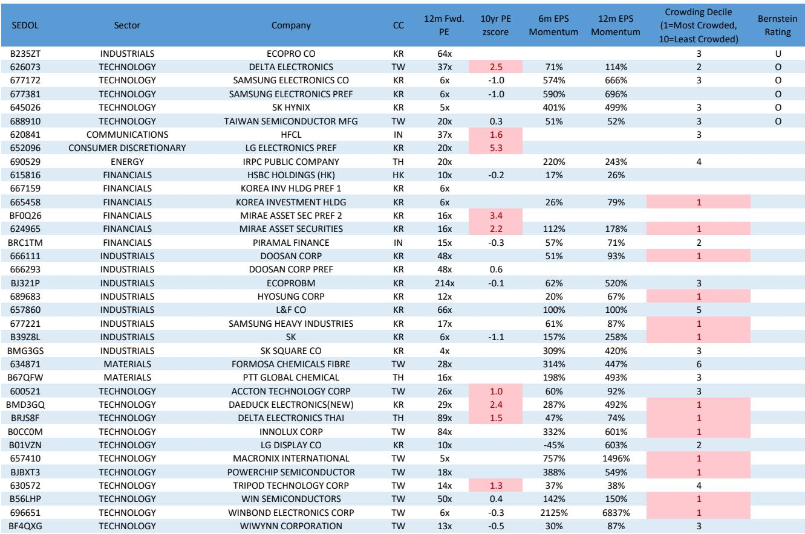
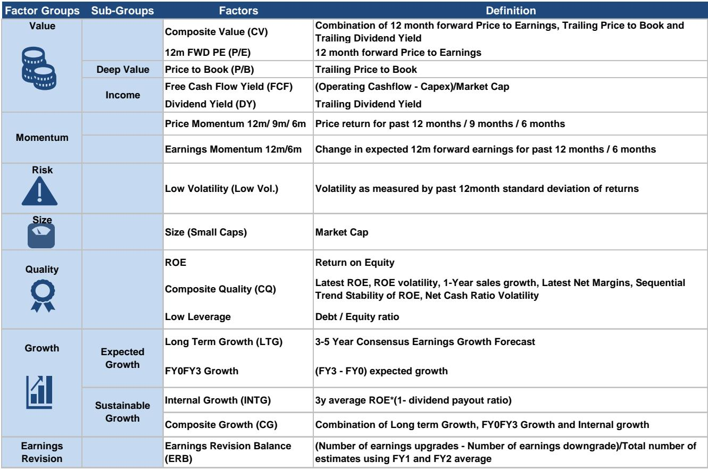
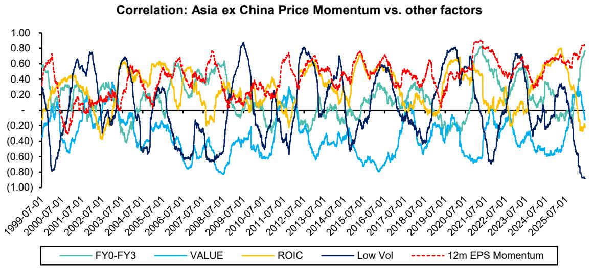

# The Momentum Trade in Asia Is Approaching a Dangerous Inflection Point

The most dominant factor driving Asian equity markets this year is showing clear signs of exhaustion, and investors who have ridden the wave should prepare for a potential reversal. Year-to-date, momentum has delivered 36 to 38 percent alpha in Asia ex Japan and an extraordinary 53 to 60 percent alpha in Asia ex Japan ex China. In Taiwan and Korea, momentum has generated north of 50 percent alpha. These are not normal returns. They reflect a market environment where a single factor has become the overwhelming source of outperformance, creating the kind of extreme concentration that historically precedes sharp reversals. The question is not whether this unwind will happen, but what will trigger it and how severe the damage will be.

Since April, the strategic case for momentum was clear: it served as a risk-on proxy to play the de-escalation of geopolitical tensions. That logic has now run its course. The trade has become overcrowded, valuations are at or near record highs in key markets, and earnings expectations have been revised up to levels that leave no room for disappointment. The report from which this analysis draws makes a compelling case that the risk of a momentum unwind in Asia ex Japan ex China, led by Taiwan and Korea, has risen materially. For serious investors, this is not a time for conviction. It is a time for rebalancing.

## The Valuation Bubble in the Momentum Trade Is Concentrated in Taiwan and Korea, Not in China or Japan

The first and most important distinction to make is that the valuation problem is not uniform across Asia. The Asia ex Japan ex China momentum portfolio is trading at record high valuations on both 12-month forward price-to-earnings and price-to-book ratios. This is driven almost entirely by Taiwan and Korea, where momentum baskets have reached all-time high valuation levels and have already begun to de-rate since the beginning of June. The Asia technology momentum portfolio, which is heavily weighted toward these two markets, peaked in June after reaching 2024 high valuation levels. The earnings momentum basket in Asia also remains in bubble territory, even though it has been de-rating for some time.

China and India tell a different story. Momentum stocks in these markets are nowhere close to bubble valuations. Japan, too, remains reasonably valued, with both price and earnings momentum trading below long-term average valuations on price-to-earnings and only slightly above average on price-to-book. This divergence is critical. It means that a broad sell-off in momentum is unlikely to be indiscriminate. The pressure will be concentrated in the markets where the trade is most extended. Investors who hold momentum exposure in Taiwan and Korea are carrying the highest risk, while those with positions in China, India, or Japan face a much lower probability of sharp reversal.

The implication for portfolio construction is straightforward. If you are overweight momentum in Taiwan and Korea, you are holding a position that is priced for perfection. The margin for error is zero. Any negative surprise, whether from earnings, geopolitics, or macro data, could trigger a rapid unwind. The report's data shows that Taiwan and Korea momentum baskets have already started to de-rate. This is the early signal. Waiting for confirmation of a full reversal means accepting losses that could have been avoided.

## Record High Earnings Expectations Have Created a Vulnerable Setup Where Disappointment Is the Only Path

Valuations alone are concerning, but the more worrying signal comes from earnings expectations. The report highlights that earnings have been the primary driver of momentum performance this year, more so than valuation expansion. The once-in-a-generation AI technology cycle has pushed earnings expectations for Asia tech stocks across all previous levels. Record high upward revisions are now visible across Asia momentum, Asia ex China momentum, and even Japan momentum baskets. Within Asia, China and Taiwan momentum portfolios are seeing all-time high earnings expectations, while Korea momentum is just shy of the levels seen in 2009.

This is the classic setup for a correction. When expectations are at historical extremes, the only direction for surprises is down. The market has already priced in the best-case scenario for earnings growth. Any company that misses, even by a small margin, will be punished disproportionately because there is no valuation cushion to absorb the disappointment. The report notes that given already stretched valuations, these extreme bullish expectations set a vulnerable backdrop for momentum in Korea, Taiwan, and the Asia tech sector.

The strategic question for investors is whether the earnings momentum can sustain itself. The AI-driven demand cycle is real, but it is not linear. Supply chain constraints, regulatory shifts, and competitive dynamics can all cause earnings to decelerate faster than consensus expects. The report does not predict a specific trigger, but it makes clear that the risk-reward for momentum in these markets has shifted decisively to the downside. Investors should ask themselves whether the potential upside from holding these positions still justifies the asymmetric risk of a sharp reversal.

## The Momentum Effect Has Created Extreme Intra-Market Dispersion That Signals a Potential Regime Shift

One of the most telling indicators in the report is the behavior of the low volatility factor. The correlation of the Asia momentum factor with growth is now at a historical high, while momentum in value, quality, and low volatility stocks has been decreasing. Low volatility has dropped to record low momentum levels, the weakest in 25 years. In Asia ex China, this drop has been even more extreme, reflecting what the report describes as the mind-numbing rallies in Korea and Taiwan led by high beta stocks.

In Taiwan and China, the momentum effect has not just created extreme dispersion between high volatility and low volatility stocks, but also between growth and value. This kind of dispersion is unsustainable. It reflects a market that has become binary: either you are in the momentum trade, or you are underperforming. When the unwind comes, the rotation out of high beta and into low volatility will be violent. The report notes that while it is difficult to time the true inflection, such extremes in the low volatility style highlight the potential move from risk-on to risk-off when the momentum unwind escalates.

For portfolio managers, this is a signal to start reducing exposure to the most extended parts of the momentum trade and to increase allocation to anti-momentum baskets, specifically high yield and low volatility. The report explicitly recommends diversifying into these areas as a hedge. The logic is simple: if the momentum unwind accelerates, the stocks that have been left behind will benefit from the rotation. Low volatility and high yield have been the worst-performing factors this year. They are cheap, unloved, and positioned for a recovery when the risk appetite shifts.

## The Report Leaves Key Questions Unanswered About Timing, Triggers, and the Role of Geopolitics

While the report provides a robust framework for identifying the risks in the momentum trade, it does not fully resolve several critical questions that investors will need to answer for themselves. The first is timing. The report acknowledges that it is difficult to time the true inflection point. The momentum trade could continue to grind higher for weeks or even months before the unwind begins. The data on valuations and earnings expectations suggests that the risk is elevated, but it does not provide a precise signal for when the reversal will occur.

The second open question is the trigger. The report mentions that a re-escalation on the war front could accelerate the unwind, but this is only one of many potential catalysts. A hawkish surprise from the Federal Reserve, a slowdown in AI-related capital expenditure, or a regulatory crackdown in a key market could all serve as the spark. The report does not assign probabilities to these scenarios, leaving it to the reader to assess which trigger is most likely.

The third question is the magnitude of the unwind. The report shows that momentum has delivered extraordinary alpha this year, but it does not model how much of that alpha could be given back in a reversal. Historical precedents suggest that momentum crashes can be severe, with losses of 20 percent or more relative to the market. But the report does not provide a specific estimate for this cycle.

These unanswered questions are not weaknesses in the analysis. They are honest acknowledgments of the limits of quantitative models. The report gives investors a clear framework for understanding the risks, but it cannot predict the future. The decision to trim momentum exposure or to hold and wait for the trigger is a judgment call that each investor must make based on their own risk tolerance and time horizon.

## A Decision Framework for Navigating the Momentum Unwind Risk

Given the analysis, investors need a structured approach to decide how to position their portfolios. The following framework synthesizes the report's insights into actionable steps.

First, assess your exposure to Taiwan and Korea momentum stocks. If your portfolio has a significant overweight in these markets relative to your benchmark, you are carrying the highest risk. The report's data shows that these are the markets where valuations are most extended and earnings expectations are most vulnerable. Reducing this exposure should be the top priority.

Second, evaluate your exposure to the Asia technology sector. The report shows that the Asia tech momentum portfolio has peaked since June. If you hold concentrated positions in AI-related stocks or semiconductor supply chain companies, the risk of disappointment is high. Consider trimming into strength rather than waiting for the unwind to begin.

Third, increase allocation to anti-momentum factors. The report explicitly recommends diversifying into high yield and low volatility. These factors have been the worst performers this year, which means they are cheap and positioned for a recovery. They also provide a natural hedge against a momentum unwind because they will benefit from the rotation out of high beta stocks.

Fourth, monitor the low volatility factor as a leading indicator. The report shows that low volatility has dropped to record low momentum levels. If this factor begins to recover, it could be an early signal that the momentum unwind is underway. Investors should watch this indicator closely and be prepared to act quickly.

Fifth, do not try to time the exact inflection point. The report makes clear that timing is difficult. Instead, focus on reducing risk gradually and systematically. The goal is not to capture the last dollar of momentum returns, but to avoid the sharp drawdown that historically follows extreme factor concentration.

## The Full Report Contains the Specific Stock Lists and Charts That Make This Analysis Actionable

The analysis presented here is based on a detailed quantitative report that includes factor performance data, valuation charts, and earnings revision trends that are essential for implementing the framework described above. The report provides specific stock lists for the anti-momentum basket, including high yield and low volatility names, as well as the momentum basket in Taiwan and Korea that investors should consider trimming.

The charts on momentum factor performance, valuation levels, and earnings expectations are not just academic exhibits. They are practical tools for monitoring the risk in real time. The report also includes historical comparisons that show how current conditions compare to previous momentum peaks, giving investors a sense of what a reversal might look like.

Join the community to read the full report and review the original charts.

*This article is for learning and discussion only and does not constitute investment advice.*

Personal reading notes and learning share only. Not investment advice.

