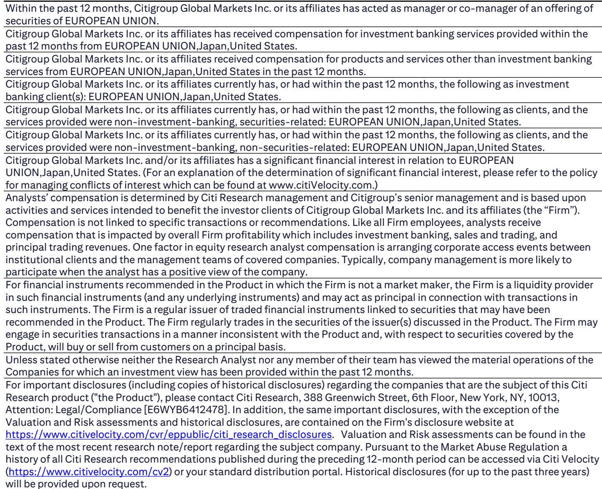
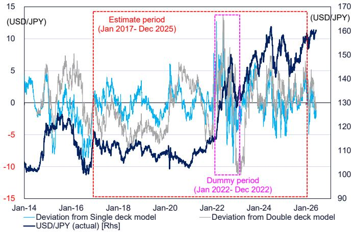
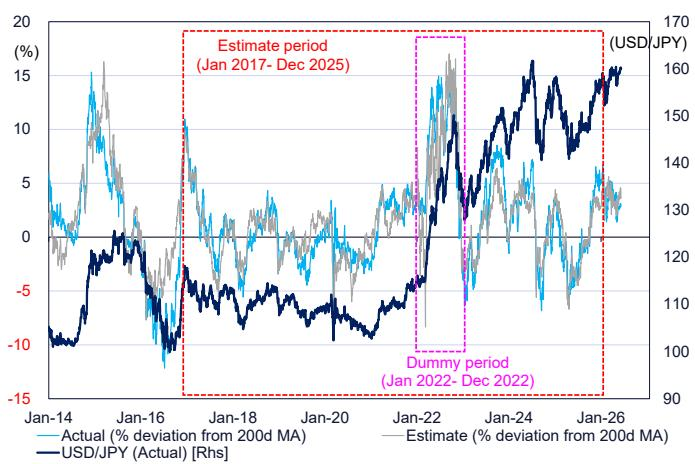

# The Yen Is Being Held Captive by Japanese Equities, Not Interest Rates

The conventional narrative that USD/JPY is primarily driven by the US-Japan interest rate differential is no longer sufficient to explain where the pair trades today. A systematic decomposition of price formation reveals that Japanese equities and the broad USD index now dominate the exchange rate's short-term and medium-term movements, while the long-term rate spread has become a secondary factor. This is not a temporary anomaly. It reflects a structural shift in the composition of demand for yen—one in which hedging flows from record-high Japanese stock markets have become the dominant force sustaining yen weakness. For investors who continue to frame their yen views around monetary policy divergence, the risk is not just being wrong on direction, but being wrong on the mechanics of how this market now works.

The timing of this reassessment matters because the window for a yen correction is narrowing. The US-Japan long-term interest rate spread has already compressed to levels that historically would have triggered significant yen appreciation. Yet USD/JPY remains stubbornly elevated near ¥160. The market is not mispricing the yen. Rather, it is pricing in a new equilibrium where equity-driven hedging demand offsets what would otherwise be a compelling case for yen strength. The implication is stark: unless Japanese equities correct substantially, or the Bank of Japan moves more aggressively on normalization than currently priced, the path of least resistance for USD/JPY remains higher in the short term, even as the medium-term bias points lower.

## The Double-Decker Model Reveals That Equities, Not Rates, Drive the Short-Term Cycle

The analytical framework that best captures this new reality is a two-tiered, or "double-decker," model that separates the USD/JPY price formation into a cyclical component and a trend component. The upper tier examines the percentage deviation of USD/JPY from its 200-day moving average—essentially, the short-to-medium-term cycle. The lower tier models the 200-day moving average itself, capturing the underlying trend. This decomposition is not merely an academic exercise. It tells us which forces are responsible for the yen's current level and which are likely to drive the next move.

The upper tier regression, estimated from January 2017 through December 2025, produces an R-squared of 0.85, meaning the model explains 85 percent of the cyclical variation in USD/JPY. But the composition of that explanatory power is what matters. The standardized coefficients show that the DXY and TOPIX dominate, with coefficients of 2.95 and 2.06 respectively. The nominal 10-year yield spread, by contrast, has a standardized coefficient of only 0.13. In plain language, a one-standard-deviation move in the USD index or Japanese equities has roughly 15 to 20 times the impact on the yen's cyclical position as a comparable move in the long-term rate spread.

This is not to say that interest rates are irrelevant. The interaction term for the yield spread in 2022 is large and statistically significant, indicating that during periods of extreme monetary policy turbulence—such as the Fed's aggressive tightening cycle—the rate channel can become temporarily dominant. But under normal conditions, the equity and dollar channels are the primary transmission mechanisms. For investors who have spent years thinking about yen through the lens of carry trades and rate differentials, this requires a fundamental repositioning of how they monitor the pair.

## The Trend Component Is Driven by the Same Forces, But Raises a Spurious Correlation Warning

The lower tier of the model, which explains the 200-day moving average of USD/JPY, produces an even higher R-squared of 0.994. Here, the independent variables are the 200-day moving averages of the real 10-year yield spread, the log of TOPIX, the log of the Bloomberg Commodity Index, and the DXY. Again, TOPIX and DXY dominate, with standardized coefficients of 9.90 and 6.64 respectively. The real yield spread, while statistically significant, has a standardized coefficient of just 2.44.

But this near-perfect fit should give investors pause. An R-squared of 0.994 is suspiciously high for a financial time series model. It suggests that the independent variables and the dependent variable may be driven by a common underlying factor—what econometricians call a spurious correlation or a confounding variable problem. During the 2017-2025 period, the global macroeconomic environment simultaneously boosted Japanese equities, strengthened the USD, raised commodity prices, and widened real yield differentials. The model may be capturing this common trend rather than identifying true causal relationships.

The practical implication is that the lower tier of the model is useful for describing where USD/JPY has been, but it is dangerous for forecasting where it will go. If the common macro factors that drove all these variables together begin to diverge—for example, if Japanese equities continue to rally while the USD weakens—the model's predictive power will deteriorate rapidly. Investors relying on trend-based models need to be aware that the apparent stability of these relationships may be an artifact of a particular macro regime that is now ending.

## The Current Estimate of ¥161 Suggests the Yen Is Slightly Undervalued, But the Distortion Is Small

The double-decker model currently estimates fair value for USD/JPY at approximately ¥161. With the actual pair trading around ¥160, the deviation is minimal—roughly 0.6 percent undervalued on the yen side. This is well within the normal range of model error and likely reflects the impact of sporadic yen-buying intervention by Japanese authorities. The key takeaway is that there is no large, exploitable mispricing in the market. The yen is not obviously cheap or expensive relative to the model's fundamental inputs.

This is a critical insight for positioning. It means that any trade in USD/JPY is essentially a bet on a change in the driving variables, not a bet on a mean reversion of the exchange rate itself. If an investor believes the yen will strengthen, they must also believe that either Japanese equities will fall, the USD will weaken, or the interest rate spread will compress further. Simply arguing that the yen is "too weak" is not supported by the evidence. The model says the yen is where it should be, given where equities, the dollar, and rates are.

For medium-term bears on USD/JPY, this creates a specific condition for their thesis to play out. The yen will not correct simply because the rate spread has narrowed. It will correct when the equity-driven hedging demand that is currently propping up USD/JPY begins to reverse. That could happen through a correction in Japanese equities, a change in hedging behavior by Japanese institutional investors, or a policy shift that alters the incentive structure for yen selling. Until one of those conditions materializes, the pair is likely to remain range-bound near current levels.

## What the Report Does Not Fully Answer: The Short-Term Rate Channel and the Role of Hedging Dynamics

The report's model is sophisticated, but it leaves several critical questions unresolved. First, the analysis explicitly excludes the short-term interest rate spread from the upper tier model, noting that it can on occasion have a greater impact than the long-term spread via hedging activity and carry trades. This is a significant omission. The short-term rate differential between the US and Japan is what drives the most liquid carry trades and the hedging decisions of Japanese financial institutions. If the Bank of Japan raises rates while the Fed cuts, the short-term spread could narrow much faster than the long-term spread, creating a powerful channel for yen appreciation that the model does not capture.

Second, the report acknowledges that the relationship between USD/JPY and Japanese equities is characterized by strong coinstantaneity—they move together, but causality runs in both directions. A rising Nikkei encourages yen selling by Japanese retail investors and pension funds, but a weaker yen also boosts export earnings and drives equity prices higher. The model cannot disentangle these effects. This means that the apparent explanatory power of equities may be partly endogenous, reflecting the yen's own movement rather than an independent driver.

Third, the report does not model the specific hedging behavior of Japanese institutional investors. The phrase "JPY-sell hedging demand that results from the historically high levels for Japanese equities" is the central claim of the analysis, but it is not directly tested. There is no variable for foreign equity exposure, hedging ratios, or portfolio rebalancing flows. The equity variable in the model is simply the TOPIX index level, not a measure of hedging demand. This is a reasonable approximation, but it leaves room for alternative interpretations.

For investors who want to build a more complete view, these gaps represent the frontier of analysis. Understanding the short-term rate channel, the causal structure of the equity-yen relationship, and the actual hedging behavior of Japanese institutions would provide a material edge over the current consensus.

## A Decision Framework for Yen Positioning Based on the Model's Logic

Given the model's findings, investors should structure their yen exposure around three distinct scenarios, each with a clear trigger and a defined risk management framework.

Scenario one: the yen strengthens through equity correction. If TOPIX falls by 10 percent or more from current levels, the model suggests USD/JPY would decline by roughly 3 to 4 percent, or approximately ¥5 to ¥6. This is the most plausible near-term trigger for yen strength, as Japanese equities are at historically high levels and vulnerable to a correction. Investors who are bearish on the yen should monitor the TOPIX 200-day moving average as their primary signal. A break below that level would be the clearest indication that the equity-driven support for USD/JPY is fading.

Scenario two: the yen strengthens through USD weakness. If the DXY declines by 5 percent, the model implies a USD/JPY move of roughly 4 percent, or about ¥6 to ¥7. This scenario depends on the Fed cutting rates more aggressively than the market expects, or on a broader decline in US exceptionalism. Investors should watch the US 2-year yield and the DXY 200-day moving average as leading indicators. A sustained break below 100 on the DXY would be a strong signal that the dollar-driven support for USD/JPY is reversing.

Scenario three: the yen weakens further despite rate compression. If Japanese equities continue to rally while the rate spread remains stable, the model suggests USD/JPY could grind higher toward ¥165 or beyond. This is the scenario that most investors are not positioned for. It requires accepting that the conventional rate-based framework is broken and that equity momentum can override monetary policy signals. The risk management implication is clear: do not short USD/JPY simply because the rate spread has narrowed. Wait for confirmation from either equities or the dollar.

## The Unresolved Analytical Questions That Make This Report Worth Reading

The report's value lies not in its predictions, but in the questions it forces investors to confront. The most important of these is whether the equity-yen relationship is stable over time or whether it will break down as the macro environment changes. The model is estimated over a period that includes the COVID shock, the Ukraine war, and the most aggressive Fed tightening cycle in decades. These were extraordinary times. If the global economy enters a more stable regime, the relationships that held during this turbulent period may not persist.

A second unresolved question is the role of Japanese authorities. The report notes that the small undervaluation of the yen relative to the model estimate may reflect intervention, but it does not model intervention as a variable. If the Ministry of Finance becomes more aggressive in its yen-buying operations, the model's estimates could become systematically biased on the low side. Investors need to incorporate intervention risk into their positioning, particularly if USD/JPY approaches ¥165 or higher.

Finally, the report does not address the implications of a potential shift in Japanese portfolio preferences. Japanese households and institutions hold trillions of dollars in foreign assets, much of it unhedged. If the Bank of Japan's normalization changes the incentive structure for holding these positions—for example, if domestic yields become attractive enough to reduce the appeal of foreign bonds—the resulting repatriation flows could overwhelm the equity-driven hedging demand that is currently supporting the dollar. This is a second-order effect that the model cannot capture, but it may be the most important variable to watch over the next 12 to 18 months.

These are the questions that separate surface-level analysis from genuine strategic insight. The full report contains the detailed regression outputs, the time series charts, and the precise variable definitions that allow investors to test these relationships for themselves.

Join the community to read the full report and review the original charts.

*This article is for learning and discussion only and does not constitute investment advice.*

Personal reading notes and learning share only. Not investment advice.

