Asia

Economics

# Asia Macro Insight

Date

9 June 2026

# Further rate hikes ahead

Asia's April data points to weakening but still above-trend growth, as policy measures helped limit the acceleration in inflation and demand destruction. Export growth remains resilient, supported by stronger investment and restocking. Still-firm electronics manufacturing conditions and a surge in chip prices point to improving terms of trade for economies such as South Korea and Taiwan, while China's reflation has gained stronger traction than expected, with data hinting at a bottoming out in its property market. With the growth soft patch largely anticipated in Q2, most central banks are likely to prioritize price and market stability, reinforcing the case for further and/or more aggressive tightening, with their FX stabilization efforts reinforced by administrative and/or regulatory measures, to attract more foreign capital and/or to deter speculative flows.

Juliana Lee

Chief Economist

+65-6423-5203

Kaushik Das

Chief Economist

+91-22-7180 4909

Yi Xiong, Ph.D.

Chief Economist

+852-2203 6139

Junjie Huang

Economist

+65-6423-6699

Deyun Ou

Economist

+852-2203 6166

Figure 1: Slowing but above-trend growth and sharp rebound in inflation  
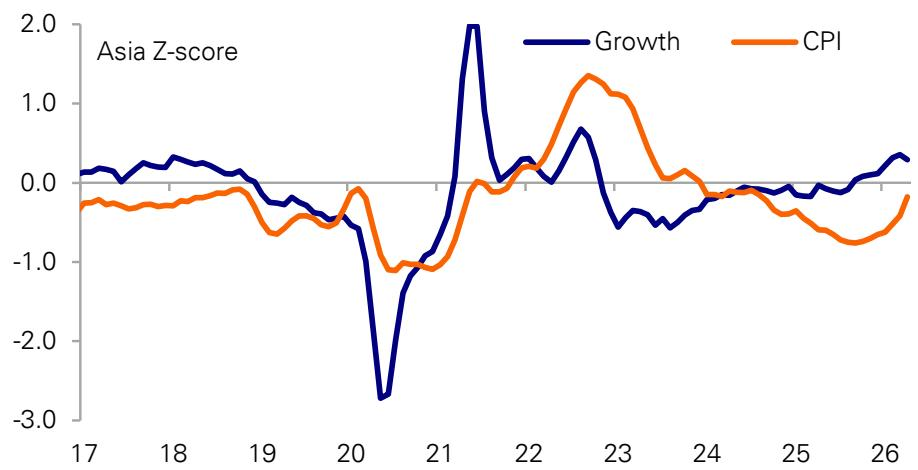

line chart

| Year | Growth | CPI    |
|------|--------|--------|
| 17   | 0.1    | -0.2   |
| 18   | 0.2    | -0.1   |
| 19   | 0.0    | -0.3   |
| 20   | -0.5   | -0.4   |
| 21   | -2.8   | -1.0   |
| 22   | 0.3    | 0.2    |
| 23   | 0.7    | 1.3    |
| 24   | -0.2   | -0.1   |
| 25   | -0.1   | -0.5   |
| 26   | 0.3    | -0.2   |

Source : CEIC, DB

Overview 2

China....5

Hong Kong....9

India....11

Indonesia 15

Malaysia....18

Philippines 20

Singapore....22

South Korea 24

Sri Lanka....26

Taiwan 28

Thailand 30

Vietnam 32

DB Macro Forecasts....34

Growth & Inflation Heatmap....36

EM Asia Macro Charts....37

EM Asia Monetary Policy Monitor......39

## Overview

As expected, growth slowed in April while inflation momentum accelerated, although neither move was as pronounced as feared, as policy measures helped limit the acceleration in inflation and demand destruction.

Juliana Lee

Figure 2: Weaker growth momentum in April  
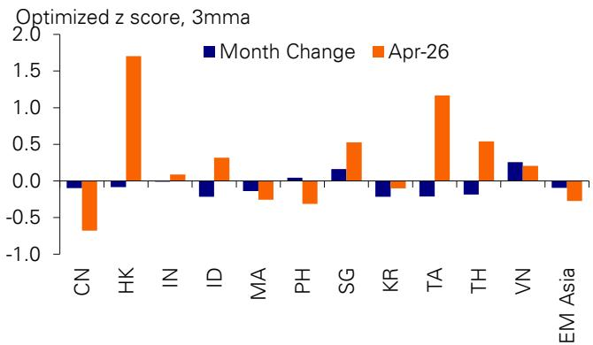

bar chart

| Region | Month Change | Apr-26 |
|--------|--------------|--------|
| CN     | -0.1         | -0.7   |
| HK     | -0.1         | 1.7    |
| IN     | -0.1         | 0.1    |
| ID     | -0.2         | 0.3    |
| MA     | -0.1         | -0.2   |
| PH     | 0.0          | -0.3   |
| SG     | 0.1          | 0.5    |
| KR     | -0.2         | -0.1   |
| TA     | -0.2         | 1.2    |
| TH     | -0.1         | 0.5    |
| VN     | 0.2          | 0.2    |
| EM Asia| -0.1         | -0.3   |

Source : CEIC, DB

Figure 3: Growth slows, inflation rebounds  
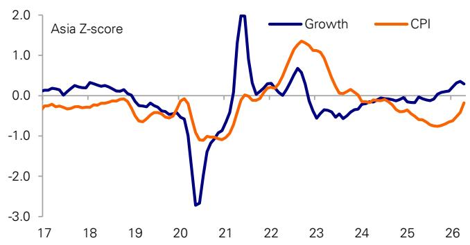

line chart

| Year | Growth | CPI    |
|------|--------|--------|
| 17   | 0.0    | -0.1   |
| 18   | 0.2    | -0.2   |
| 19   | 0.1    | -0.3   |
| 20   | -0.5   | -0.4   |
| 21   | -2.8   | -1.0   |
| 22   | 2.0    | 0.5    |
| 23   | 0.7    | 1.3    |
| 24   | -0.3   | 0.0    |
| 25   | -0.1   | -0.5   |
| 26   | 0.3    | -0.2   |

Source : CEIC, DB

Data do not yet suggest that Q2 growth will undershoot our baseline slowdown, although worsening delivery times remain a concern for the region's manufacturing supply chain. In fact, Asia's PMI held up relatively well, even as the divergence between North and South Asia persisted.

Figure 4: North Asia's strong rebound  
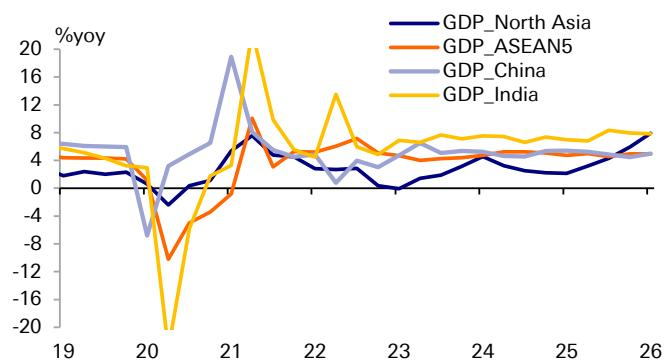

line chart

| Year | GDP_North Asia | GDP_ASEAN5 | GDP_China | GDP_India |
|------|----------------|------------|-----------|-----------|
| 19   | 3              | 4          | 6         | 5         |
| 20   | -2             | -10        | -8        | -20       |
| 21   | 8              | 10         | 18        | 20        |
| 22   | 4              | 6          | 4         | 12        |
| 23   | 2              | 5          | 4         | 7         |
| 24   | 4              | 5          | 5         | 8         |
| 25   | 4              | 5          | 5         | 8         |
| 26   | 8              | 8          | 5         | 8         |

Source : CEIC, DB

Figure 5: Surging exports, led by semis  
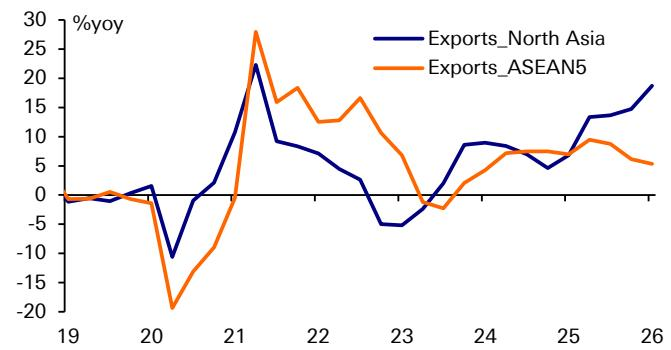

line chart

| Year | Exports_North Asia | Exports_ASEAN5 |
|------|---------------------|----------------|
| 19   | 0                   | 0              |
| 20   | -10                 | -20            |
| 21   | 22                  | 28             |
| 22   | 8                   | 16             |
| 23   | -5                  | 0              |
| 24   | 8                   | 6              |
| 25   | 4                   | 8              |
| 26   | 18                  | 5              |

Source : CEIC, DB

The main downside risk to this export view remains a genuine supply-chain disruption, not merely longer delivery delays. Even so, global manufacturing PMI data—especially in electronic equipment—support our constructive baseline for Asian exports. We expect Asia’s export growth to remain robust, moving sideways at 8.6% in 2026, versus 8.9% in 2025, although the Iran war and US trade policy actions, including USTR Section 301 investigations, pose downside risks. Better still, this should be accompanied by sustained investment growth of close to 4.9% in 2026, up from 3.8% in 2025, while restocking poses as an upside risk to growth. Private consumption is likely to slow, albeit modestly, to 5.1% in 2026 from 5.3% in 2025, leaving Asia's GDP growth at 5.2% in 2026 vs. 5.5% in 2025.

Figure 6: GDP growth  
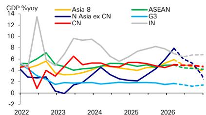

line chart

| Year | Asia-8 | ASEAN | N Asia ex CN | CN | G3 | IN |
|------|--------|-------|--------------|----|----|----|
| 2022 | 5.0    | 5.0   | 5.0          | 5.0 | 5.0 | 14.0 |
| 2023 | 4.0    | 7.0   | 0.0          | 6.0 | 3.0 | 9.0 |
| 2024 | 5.0    | 5.0   | 5.0          | 5.0 | 3.0 | 9.0 |
| 2025 | 5.0    | 5.0   | 5.0          | 5.0 | 3.0 | 6.0 |
| 2026 | 5.0    | 5.0   | 8.0          | 5.0 | 3.0 | 6.0 |
| 2027 | 5.0    | 5.0   | 5.0          | 5.0 | 3.0 | 6.0 |

Source : CEIC, DB

Figure 7: North Asia's investment recovery  
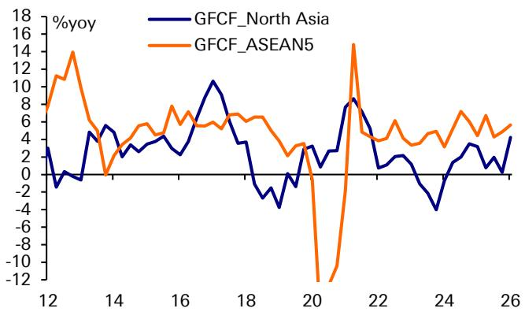

line chart

| Year | GFCF_North Asia | GFCF_ASEAN5 |
|------|-----------------|-------------|
| 12   | 3.0             | 8.0         |
| 13   | -1.0            | 14.0        |
| 14   | 5.0             | 0.0         |
| 15   | 4.0             | 6.0         |
| 16   | 3.0             | 7.0         |
| 17   | 10.0            | 6.0         |
| 18   | 4.0             | 6.0         |
| 19   | -3.0            | 3.0         |
| 20   | 2.0             | -12.0       |
| 21   | 8.0             | 15.0        |
| 22   | 2.0             | 4.0         |
| 23   | -4.0            | 5.0         |
| 24   | 2.0             | 7.0         |
| 25   | 3.0             | 6.0         |
| 26   | 4.0             | 5.0         |

Source : CEIC, DB

Figure 8: Equipment investment mirrors exports  
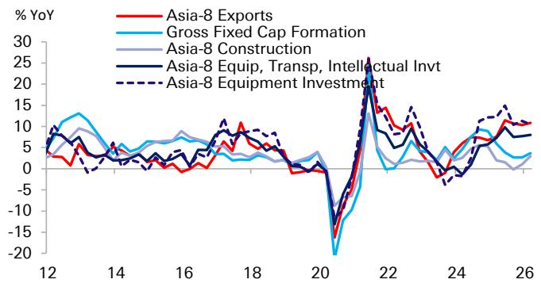

line chart

| Year | Asia-8 Exports | Gross Fixed Cap Formation | Asia-8 Construction | Asia-8 Equip. Transp. Intellectual Invt | Asia-8 Equipment Investment |
|------|----------------|----------------------------|---------------------|----------------------------------------|------------------------------|
| 12   | ~5%            | ~10%                       | ~5%                 | ~5%                                    | ~5%                          |
| 14   | ~5%            | ~10%                       | ~5%                 | ~5%                                    | ~5%                          |
| 16   | ~5%            | ~5%                        | ~5%                 | ~5%                                    | ~5%                          |
| 18   | ~10%           | ~5%                        | ~5%                 | ~5%                                    | ~5%                          |
| 20   | ~-15%          | ~-20%                      | ~-10%               | ~-10%                                  | ~-10%                        |
| 22   | ~25%           | ~20%                       | ~10%                | ~10%                                   | ~10%                         |
| 24   | ~5%            | ~5%                        | ~5%                 | ~5%                                    | ~5%                          |
| 26   | ~10%           | ~5%                        | ~5%                 | ~5%                                    | ~5%                          |

Source : CEIC, DB

Manufacturing input costs continue to outpace output prices, even though both eased slightly, pointing to some deterioration in corporate margins—though this does not apply to the semiconductor sector. In fact, stronger semiconductor pricing is likely to more than offset higher import prices, improving the terms of trade for economies such as South Korea and Taiwan and contributing positively to nominal growth. South Korea is set to record its strongest nominal growth since 1996, although this will likely be surpassed by Taiwan, where nominal growth may reach its highest level since 1987. South Korea is also seeing broader labour-union pressure for higher compensation, pointing to more persistent and higher inflation than in Taiwan.

Figure 9: Output price vs. input cost  
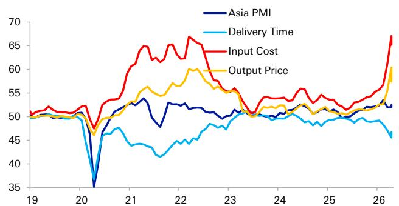

line chart

| Year | Asia PMI | Delivery Time | Input Cost | Output Price |
|------|----------|---------------|------------|--------------|
| 19   | 50       | 50            | 50         | 50           |
| 20   | 35       | 45            | 48         | 48           |
| 21   | 52       | 48            | 60         | 55           |
| 22   | 53       | 50            | 67         | 60           |
| 23   | 51       | 49            | 55         | 52           |
| 24   | 50       | 48            | 53         | 51           |
| 25   | 51       | 49            | 54         | 52           |
| 26   | 53       | 46            | 67         | 60           |

Source : CEIC, DB

Figure 10: North Asia's consumption recovery  
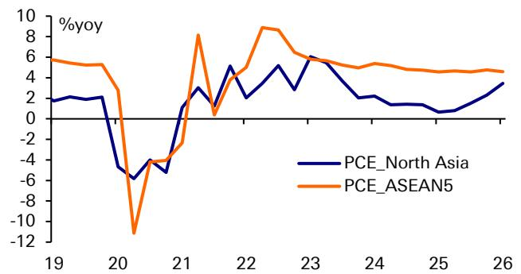

line chart

| Year | PCE_North Asia | PCE_ASEAN5 |
|------|----------------|------------|
| 19   | 2              | 6          |
| 20   | -6             | -10        |
| 21   | 3              | 8          |
| 22   | 5              | 9          |
| 23   | 6              | 7          |
| 24   | 2              | 5          |
| 25   | 1              | 4          |
| 26   | 3              | 4          |

Source : CEIC, DB

The impact of the Iran war has steepened China's reflation path. Moreover, data hint at a durable bottoming-out in its housing market, driven less by broad macro stimulus than by improving underlying market dynamics, a more positive turn would improve household confidence, local-government finances, and demand in the more traditional parts of the economy.

Figure 11: Fuel price adjustment  
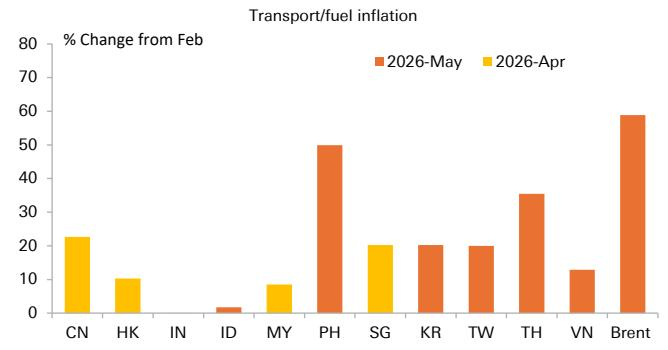

bar chart

Transport/fuel inflation
| Country | 2026-May (%) Change from Feb (%) | 2026-Apr (%) Change from Feb (%) |
| :--- | :--- | :--- |
| CN | 0 | 23 |
| HK | 0 | 10 |
| IN | 0 | 0 |
| ID | 1 | 0 |
| MY | 0 | 8 |
| PH | 50 | 0 |
| SG | 0 | 20 |
| KR | 20 | 0 |
| TW | 20 | 0 |
| TH | 35 | 0 |
| VN | 13 | 0 |
| Brent | 59 | 0 |

Source : CEIC, DB

Figure 12: Rising Fuel & Turn in Food Inflation  
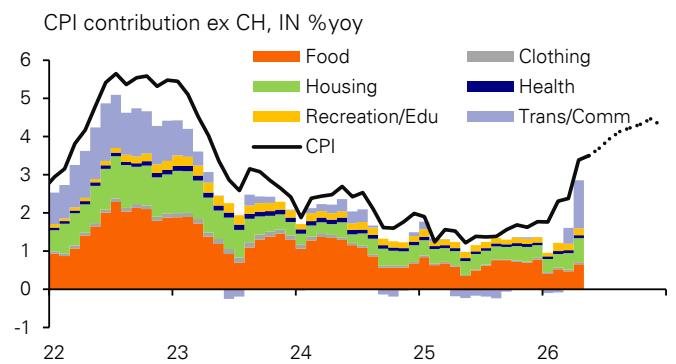

stacked bar chart

CPI contribution ex CH, IN %yoy
| Year | Food (%) | Housing (%) | Recreation/Edu (%) | Clothing (%) | Health (%) | Trans/Comm (%) | CPI (%) |
|---|---|---|---|---|---|---|---|
| 22 | 1.0 | 0.8 | 0.3 | 0.5 | 0.4 | 0.7 | 2.8 |
| 23 | 1.5 | 1.2 | 0.4 | 0.6 | 0.5 | 1.0 | 5.5 |
| 24 | 1.2 | 0.9 | 0.3 | 0.4 | 0.3 | 0.6 | 2.5 |
| 25 | 0.8 | 0.6 | 0.2 | 0.3 | 0.2 | 0.4 | 1.5 |
| 26 | 0.5 | 0.4 | 0.1 | 0.2 | 0.1 | 0.3 | 3.5 |
The dashed line likely represents a trend or average for CPI over time. The data is already in English. The chart displays the annual percentage contribution of each category to CPI from 2022 to 2026.

Source : CEIC, DB

With a US-Iran deal still elusive, both inflation and FX dynamics point to higher rates across Asia. CPI inflation is likely to be three times higher than last year, at 2.7% in 2026. Our baseline view is that both BI and BSP will hike by another 75bps, bringing total tightening to 125bps for BI and 100bps for BSP. We also expect both the BoK and RBI to deliver 100bps of rate hikes, with the BoK moving first. MAS is likely to tighten again, while BNM's 25bp rate hike may be brought forward to this year, instead of next year as per our prevailing forecast. The SBV remains on our watch list, although its continued reliance on liquidity management to balance risks to growth and inflation/FX may become harder to sustain amid rising US rates. Asian authorities have also reinforced their FX stabilization efforts by administrative and/or regulatory measures, to attract more foreign capital and/or to deter speculative flows.

## China

- Our estimate of China's GDP growth in 2026 has been revised to $4.7\%$ due to softer domestic activity and policy shifts. Strong trade and anticipated reflation we expect will counteract weaker domestic demand, which is currently affected by fuel costs.  
■ Reflation is progressing faster than projected, driven by PPI inflation, oil prices, and AI-related supply issues. The property market shows initial stabilization in some major cities, but a widespread recovery is not yet certain.  
We expect the PBOC to keep policy rate unchanged in response to mixed signals from the economy and still-ample liquidity. While fiscal spending has become less supportive since Q2, a reversal is expected, possibly including new measures to stimulate consumption and investment.  
We expect the renminbi to continue its steady appreciation to 6.6/USD by end-2026. The renminbi's internationalization is also accelerating.

Yi Xiong

Deyun Ou

## Trade Strength Offsets Domestic Softness

We forecast China's GDP growth at $4.7\%$ in 2026. This represents a small (0.2ppt) downward revision from our most recent forecast, owing to softer domestic activities since the beginning of Q2 and policy tone fine-tuning at the April Politburo meeting. It remains higher than our $4.5\%$ forecast in our last World Outlook, as we expect China's trade outperformance will continue, and reflation will stay on track.

China's strong trade activities will likely more than offset weaker domestic demand. Both exports and imports are growing much faster than expected. We revised up our export growth forecast to 12% from 6% previously. The strong export demand can be attributed to multiple factors, including global AI investment, green transition, and market share expansion in EMs. Meanwhile, the 25% YoY surge in imports in the first 4 months, mostly raw materials and upstream inputs, suggest either stronger exports or domestic demand may strengthen further.

Domestic demand remains the softer link. Consumption-wise, Higher fuel costs started to negatively affect consumer spending in a few categories, especially travel. Goods consumption has also slowed owing to the fading impact of previous subsidies. As a result, retail sales slowed in April to just $0.2\%$ YoY, and are expected to stay soft if energy prices remain elevated. The government's efforts to boost services sector spending had some initial success, but momentum has slowed lately, with services output growth slowing to $4.3\%$ YoY in April from $5\%$ in Q1.

On the investment side, fixed-asset investment slipped unexpectedly in April, with both infrastructure and manufacturing investment falling by 8% and 4% YoY, respectively. This deceleration reflects seasonality following fiscal dynamics, after the Politburo meeting viewed Q1 growth as unexpectedly strong. Additionally, rising energy prices and recent investment approval regulations may also have contributed. Looking ahead, investment will likely rebound, assuming the oil shock is transitory, external demand remains strong, and priority projects from the 15th FYP plan pick up.

Figure 13: Exports and imports are growing much faster than expected  
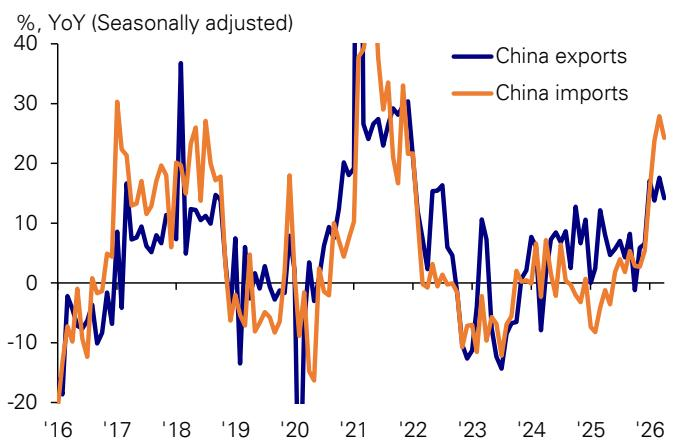

line chart

| Year | China exports | China imports |
|------|---------------|---------------|
| '16  | -20           | -20           |
| '17  | 15            | 30            |
| '18  | 35            | 25            |
| '19  | 5             | 10            |
| '20  | -20           | -15           |
| '21  | 40            | 40            |
| '22  | 30            | 35            |
| '23  | -10           | -5            |
| '24  | 5             | 5             |
| '25  | 10            | 5             |
| '26  | 15            | 25            |

Source : DB, Haver Analytics

Figure 14: Investment slipped unexpectedly in April  
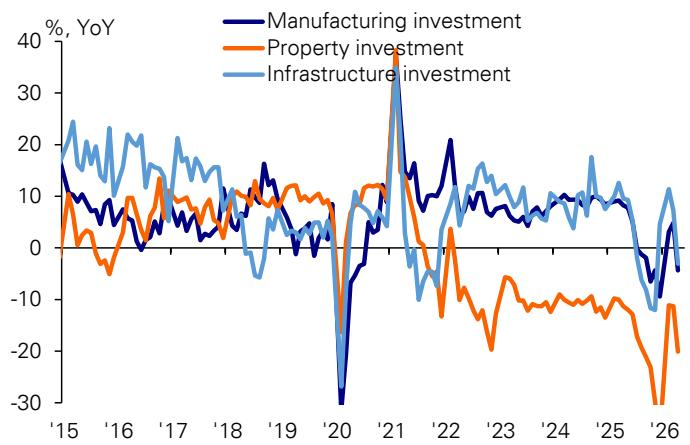

line chart

| Year | Manufacturing investment | Property investment | Infrastructure investment |
|------|--------------------------|---------------------|----------------------------|
| '15  | ~15%                     | ~10%                | ~25%                       |
| '16  | ~10%                     | ~5%                 | ~20%                       |
| '17  | ~5%                      | ~10%                | ~15%                       |
| '18  | ~10%                     | ~10%                | ~10%                       |
| '19  | ~15%                     | ~10%                | ~5%                        |
| '20  | ~-30%                    | ~-10%               | ~-20%                      |
| '21  | ~40%                     | ~40%                | ~35%                       |
| '22  | ~20%                     | ~-10%               | ~-5%                       |
| '23  | ~10%                     | ~-15%               | ~-10%                      |
| '24  | ~10%                     | ~-10%               | ~-5%                       |
| '25  | ~5%                      | ~-15%               | ~-10%                      |
| '26  | ~0%                      | ~-30%               | ~-5%                       |

Source : DB, Wind

Reflation is happening faster than expected. This is mainly owing to accelerated PPI inflation from -1.9% in December to +2.8% in March, while CPI also edged up to 1.2% YoY despite a 1.6% YoY fall in food prices. Crude oil prices are the main catalyst for China's reflation, as we have started to see partial pass-through from oil prices to wider midstream and downstream products such as fuels and chemicals. Other drivers include ongoing “anti-involution” policy efforts to curb price competition and excess supply in some industries, and strong demand for AI-related products. We forecast PPI inflation will rise further to average 3.5%, while CPI inflation will average 1.6%, in 2026.

Industrial profits improved significantly, albeit concentrated in a few industries. Industries such as semiconductors, metals and chemicals saw large increases of profits as prices rise. However, profit change was muted in other industries. As PPI trends higher and prices continue to pass through, we expect a modest broadening of profits to other industries.

Figure 15: PPI recovery accelerated  
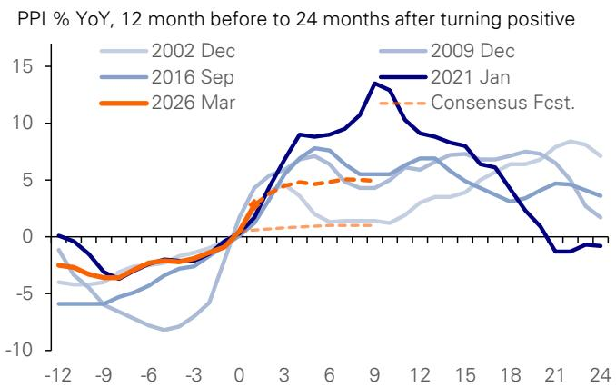

line chart

| Date       | 2002 Dec | 2009 Dec | 2016 Sep | 2021 Jan | 2026 Mar | Consensus Fcst. |
|------------|----------|----------|----------|----------|----------|-----------------|
| -12        | -5.0     | -5.0     | -5.0     | 0.0      | -3.0     | 0.0             |
| -9         | -7.0     | -5.0     | -5.0     | -1.0     | -4.0     | 0.0             |
| -6         | -8.0     | -5.0     | -5.0     | -2.0     | -3.0     | 0.0             |
| -3         | -6.0     | -5.0     | -5.0     | -3.0     | -2.0     | 0.0             |
| 0          | -4.0     | -5.0     | -5.0     | -4.0     | -1.0     | 0.0             |
| 3          | 5.0      | 5.0      | 5.0      | 10.0     | 3.0      | 1.0             |
| 6          | 6.0      | 6.0      | 6.0      | 12.0     | 4.0      | 1.0             |
| 9          | 7.0      | 7.0      | 7.0      | 14.0     | 5.0      | 1.0             |
| 12         | 6.0      | 6.0      | 6.0      | 12.0     | 4.0      | 1.0             |
| 15         | 5.0      | 5.0      | 5.0      | 10.0     | 3.0      | 1.0             |
| 18         | 4.0      | 4.0      | 4.0      | 8.0      | 2.0      | 1.0             |
| 21         | 3.0      | 3.0      | 3.0      | 6.0      | 1.0      | 1.0             |
| 24         | 2.0      | 2.0      | 2.0      | 4.0      | 0.0      | 1.0             |

Source : DB, Wind

Figure 16: Industrial profits improved significantly, albeit concentrated in a few industries  
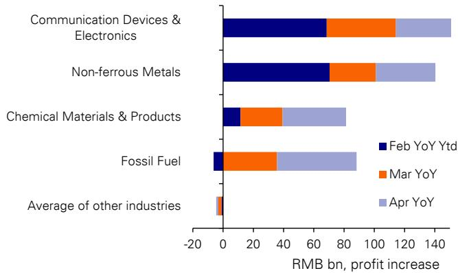

stacked bar chart

| Category | Feb YoY Ytd (RMB bn) | Mar YoY (RMB bn) | Apr YoY (RMB bn) |
|---|---|---|---|
| Communication Devices & Electronics | 68 | 35 | 27 |
| Non-ferrous Metals | 69 | 24 | 31 |
| Chemical Materials & Products | 8 | 19 | 29 |
| Fossil Fuel | 5 | 27 | 35 |
| Average of other industries | 0.5 | 2 | 0.5 |

Source : DB, Wind

## Property market: Bottom is in sight

China's property downturn appears to be entering the late stage, with several indicators suggesting that a durable bottom may be approaching rather than another brief policy-driven rebound. The correction has now lasted about as long, and become about as deep, as typical housing downturns in other economies. In a handful of large cities, secondary home transactions increased rapidly, prices stopped falling, and sentiment has improved notably.

What makes the current rebound different, in our view, is that it is not being driven primarily by broad macro stimulus. Instead, it reflects improving underlying market dynamics: in key cities, transaction volumes are rising while secondary listings are falling. What we have yet to observe is steady improvement in rents, which could happen this year in large cities.

Looking ahead, the property sector will likely remain a drag on growth in the near term, owing to continued contraction in construction activity and land sales nationwide. We expect any recovery in China's property sector to be gradual, led by top-tier and economically competitive cities rather than being broad-based nationwide. If the property sector does stabilize over the next one to two years, it could help China move from the current narrow, K-shaped recovery toward a broader macro expansion by improving household confidence, local government finances, and demand in more traditional parts of the economy.

Figure 17: The correction has lasted about as long, and become about as deep, as typical housing downturns  
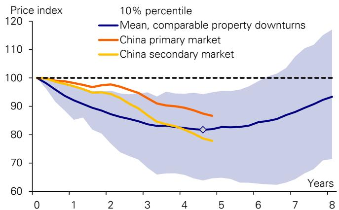

line chart

| Years | Mean, comparable property downturns | China primary market | China secondary market |
|-------|-------------------------------------|----------------------|------------------------|
| 0     | 100                                 | 100                  | 100                    |
| 1     | ~95                                 | ~98                  | ~97                    |
| 2     | ~90                                 | ~97                  | ~95                    |
| 3     | ~85                                 | ~95                  | ~90                    |
| 4     | ~82                                 | ~90                  | ~85                    |
| 5     | ~80                                 | ~85                  | ~80                    |
| 6     | ~82                                 | ~88                  | ~82                    |
| 7     | ~85                                 | ~90                  | ~85                    |
| 8     | ~90                                 | ~92                  | ~88                    |

Source : DB, BIS, NBS, CEIC

Figure 18: Secondary home transactions increased rapidly in large cities  
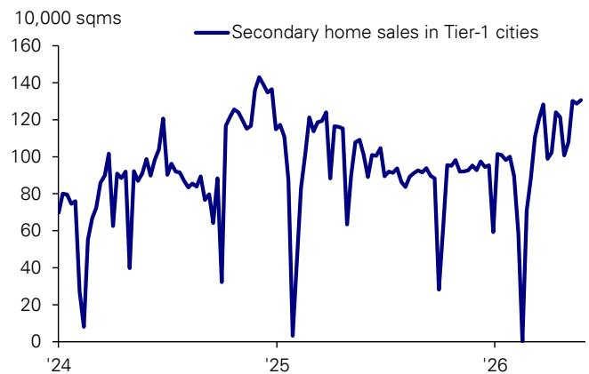

line chart

| Year | Secondary home sales in Tier-1 cities (sqms) |
| ---- | ------------------------------------------ |
| '24  | ~80                                        |
| '25  | ~140                                       |
| '26  | ~130                                       |

Source : DB, CREIS

## Policy: A temporary break

Fiscal and monetary policy has turned less supportive since the April Politburo meeting, but expect some reversal ahead.

PBOC is unlikely to ease further, given a strong Q1 GDP outcome (at the upper bound of the government's $4.5 - 5.0\%$ range) and sharper rebound in (PPI) inflation. Large trade surplus and exporter FX conversion have also led to ample liquidity in the banking system, to which the PBOC has started to withdraw through outright reverse repos.

The softer fiscal impulse is likely to be temporary and reverse in H2. with overall spending growth slowing from 6% YoY in Jan-Feb to -3% in March and -7% in April.

A notable drop in infrastructure investment was also observed in April. A rebound in fiscal spending is likely, however, if the government follows through on its fiscal spending plans. Beyond stronger fiscal spending, the government may introduce new measures to boost domestic consumption and investment, especially if further negative impact from high oil prices is observed.

## Renminbi: Strong and steady

Renminbi will likely remain a strong currency. RMB's strength in the first half is underpinned by multiple factors: strong exports driven by industrial competitiveness and global investment cycles, increased inflows from Chinese corporates who see foreign currencies as less attractive, as well as a confidence boost from China's resilience in light of geopolitical and energy shocks. A mitigating factor that prevented even faster appreciation was the surge in imports growth (25%) which outpaced exports and reduced China's trade surplus slightly.

Looking forward, history and our analysis suggest that a surge in China's imports of upstream products will likely be followed by a further pick-up in export orders, or a recovery of domestic demand, or both. In any case, this will likely lead to a stronger RMB down the road. Our new baseline forecast is that RMB will appreciate to 6.55/USD by end-2026 and 6.3/USD by end-2027.

Renminbi internationalization is gaining pace. Stability of the RMB during recent market volatility accelerated its use in cross-border payments and financing. RMB cross-border payments surged since March, now accounting for more than 50% of all Chinese bank cross-border payments. Issuances of Panda bonds (onshore RMB bonds by foreign entities) and offshore Dim Sum bonds also increased rapidly. We expect the international use of RMB in payments, financing and investment will continue to grow steadily in the coming months and years. The offshore RMB market will likely play a more important role going forward as its size and liquidity continues to improve.

Figure 19: Renminbi will likely remain a strong currency  
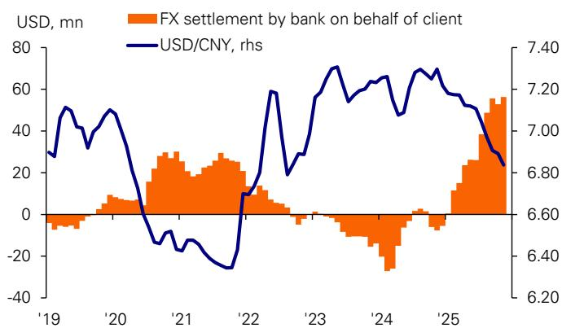

bar-line hybrid chart

| Year | FX settlement by bank on behalf of client (USD, mn) | USD/CNY, rhs |
|------|-----------------------------------------------------|--------------|
| '19  | -                                                   | 6.80         |
| '20  | 10                                                  | 7.00         |
| '21  | 30                                                  | 6.40         |
| '22  | 10                                                  | 6.80         |
| '23  | -                                                   | 7.40         |
| '24  | -                                                   | 6.80         |
| '25  | 50                                                  | 6.20         |

Source : DB, Wind

Figure 20: Panda and Dim Sum bond issuance increased by 30% YoY in the first 5 months  
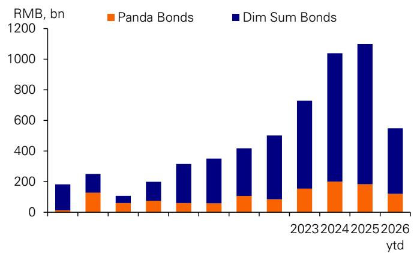

stacked bar chart

| Year | Panda Bonds (RMB bn) | Dim Sum Bonds (RMB bn) |
| :--- | :--- | :--- |
| 2017 | 10 | 180 |
| 2018 | 130 | 140 |
| 2019 | 70 | 80 |
| 2020 | 80 | 150 |
| 2021 | 60 | 250 |
| 2022 | 100 | 300 |
| 2023 | 90 | 450 |
| 2024 | 160 | 750 |
| 2025 | 190 | 950 |
| 2026 | 120 | 550 |

Source : DB, Wind

## Hong Kong

We maintain our forecast of Hong Kong 2026 GDP growth at 4.0%, as trade, financial market, property sector will likely maintain momentum in the second half of the year. Additionally, consumption will likely benefit from rising tourism.  
Our inflation forecast also remains unchanged at 2.0%, but we recognize upside risks from property sector and inbound tourism.  
We anticipate a stronger HKD in the second half, as demand for HKD will likely be boosted by accelerating mortgage loans and IPOs.  
Fiscal spending is likely to remain expansionary. Meanwhile, HKMA is likely to continue supporting RMB internationalization and exploring the development of digital currencies.

Yi Xiong

Deyun Ou

## Stronger HKD ahead

We maintain our 2026 Hong Kong GDP growth forecast at 4.0%, as most sectors are likely to sustain momentum in the second half of the year:

■ Financial activity to strengthen further. IPO momentum remains robust, with the number of IPO applications reaching a record high of 144 in Q1, while applications in April and May were also significantly above the levels seen in the same period last year. Meanwhile, Dim Sum bond issuance is likely to remain strong, with issuance in the first half of the year running ahead of the same period last year.  
■ Property market to be on a firmer footing. Housing prices have rebounded by 10%, and high-frequency indicators have yet to show loss of momentum. Meanwhile, participation by mainland buyers appears to be increasing. Office property may also see a further recovery amid buoyant economy. Transaction volumes in the office market have turned more active, while prices have rebounded from trough of -20% YoY to single-digit declines.  
Trade to remain resilient. It will likely be supported by strong Chinese exports and the rising demand for communication and electronics in the region.  
Consumption to benefit from tourism. Rising international oil prices have pushed up air travel costs in mainland China, which may encourage more outbound tourists to choose Hong Kong as a destination, thereby providing further support to local consumption.

Our inflation forecast also remains unchanged at 2.0%, but we recognize upside risks. Hong Kong's CPI has remained stable at 1.75% for three consecutive months, broadly in line with our projected path under the oil price shock scenario. The Hong Kong SAR government has also pledged to closely monitor price trends and take action to stabilize prices when necessary. However, with property prices continuing to rebound and consumption being driven by inbound tourism, there may be upward pressure on inflation.

We anticipate higher HKD interest rates and a stronger exchange rate. Since Q4 last year, lower interest rates and a weaker exchange rate have contrasted with a strong economy, mainly due to relatively weak demand for the HKD. This situation may be reversed by two factors: First, mortgage loans are expected to accelerate their rebound. Historically, mortgage loans and property prices rebounded synchronously, but the pace of the former is currently significantly slower. Second, accelerating IPOs will attract more overseas funds to flow in and convert to HKD. Therefore, we anticipate that, by year-end, the exchange rate will appreciate to 7.80 from the current 7.83, and interest rates (Hibor 1 month) will increase to above 3% from current 2.6%.

On the policy front, fiscal spending is likely to remain expansionary. In particular, infrastructure investment related to the Northern Metropolis is likely to accelerate meaningfully this year. In May, the Hong Kong government announced plans to invest around HKD 10bn in the first government facilities complex in the Northern Metropolis, with construction targeted to begin in Q3 2026. Meanwhile, the HKMA is likely to continue supporting RMB internationalization and exploring the development of digital currencies, both of which should reinforce Hong Kong's longer-term role as a financial hub.

Figure 21: IPOs may accelerate further in the second half  
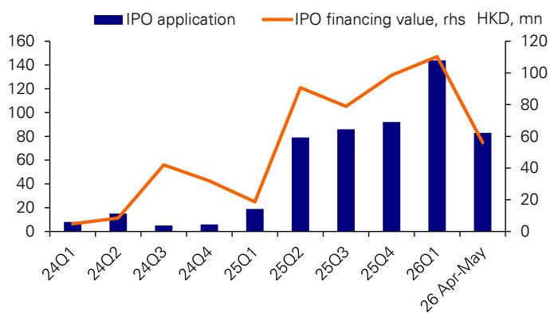

bar-line hybrid chart

| Quarter     | IPO application | IPO financing value, rhs, HKD, mn |
| ----------- | --------------- | --------------------------------- |
| 24Q1        | 5               | 5                                 |
| 24Q2        | 15              | 10                                |
| 24Q3        | 5               | 60                                |
| 24Q4        | 5               | 40                                |
| 25Q1        | 20              | 20                                |
| 25Q2        | 80              | 120                               |
| 25Q3        | 85              | 90                                |
| 25Q4        | 90              | 100                               |
| 26Q1        | 140             | 110                               |
| 26 Apr-May   | 80              | 60                                |

Source : DB, Wind

Figure 22: Housing prices reached double-digit growth, while mortgages rebounded at a slower pace  
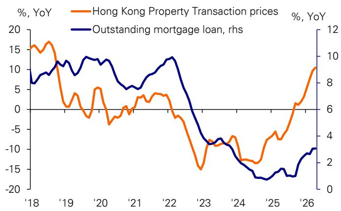

line chart

| Year | Hong Kong Property Transaction prices (% YoY) | Outstanding mortgage loan, rhs (% YoY) |
|------|-----------------------------------------------|----------------------------------------|
| '18  | ~16                                           | ~9                                     |
| '19  | ~10                                           | ~11                                    |
| '20  | ~5                                            | ~13                                    |
| '21  | ~3                                            | ~8                                     |
| '22  | ~4                                            | ~13                                    |
| '23  | ~-15                                          | ~4                                     |
| '24  | ~-5                                           | ~2                                     |
| '25  | ~-10                                          | ~1                                     |
| '26  | ~10                                           | ~3                                     |

Source : DB, CEIC

Figure 23: Consumption will likely benefit from rising inbound tourism  
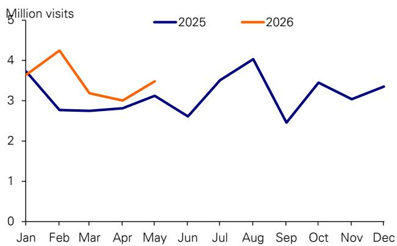

line chart

| Month | 2025 (Million visits) | 2026 (Million visits) |
|---|---|---|
| Jan | 3.7 | 3.7 |
| Feb | 2.8 | 4.3 |
| Mar | 2.8 | 3.2 |
| Apr | 2.9 | 3.0 |
| May | 3.1 | 3.5 |
| Jun | 2.6 | - |
| Jul | 3.5 | - |
| Aug | 4.0 | - |
| Sep | 2.4 | - |
| Oct | 3.5 | - |
| Nov | 3.0 | - |
| Dec | 3.4 | - |

Source : DB, CEIC

Figure 24: We expect a stronger HKD in the second half  
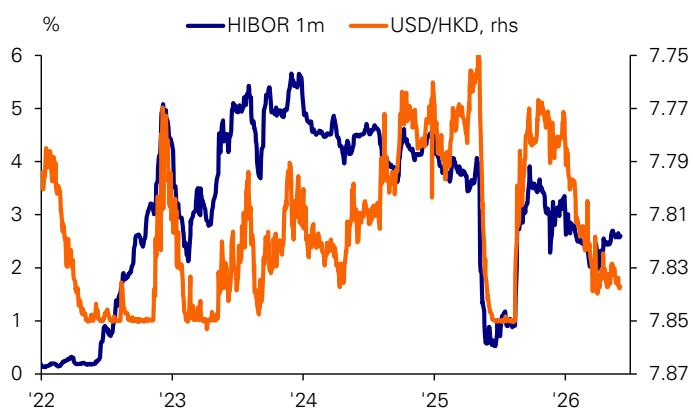

line chart

| Year | HIBOR 1m (%) | USD/HKD, rhs |
|------|--------------|--------------|
| '22  | ~0.5         | ~7.87        |
| '23  | ~5.0         | ~7.79        |
| '24  | ~5.5         | ~7.81        |
| '25  | ~4.0         | ~7.77        |
| '26  | ~2.5         | ~7.83        |

Source : DB, Wind

## India

We have revised our FY27 growth forecast lower to 6.7%yoy, from 7.5%yoy before the war. If the monsoon disappoints, real GDP growth could moderate further to 6.3%yoy. Given higher oil prices and risk of a sub-normal monsoon, we see CPI inflation rising to 4.9%yoy in FY27 (from 4.3% before the war), though core CPI inflation is likely to be lower at 4.6%.  
We have brought forward the timing of the likely first rate hike to Oct-Dec'26, from April 2027, with two 25bps rate hikes during the quarter, followed by another 50bps cumulative rate hikes by mid-2027. We believe the rupee remains undervalued in REER terms. The RBI and GOI announced various measures on 5 June to stabilize the rupee.

Kaushik Das

## Rate hikes likely to commence from Oct'26

Growth: Oil prices averaged close to USD 70 / bbl before the war, and the recent spike is likely to lead to a growth shock, in our view. Domestic pump prices for petrol and diesel have increased by nearly INR 8/ litre in May. Typically, a 10% increase in oil prices would be expected to lower growth by 10-20bps. But, if INR depreciates by 5%, GDP growth could also benefit by around 25bps through the trade channel. However, higher oil prices, on balance, will likely have a bigger negative impact on growth, compared to the positive impact on trade (as global growth is also likely to take a hit in a higher-for-longer oil-price scenario), in our view, as private consumption constitutes close to 60% of GDP.

Furthermore, the war could lead to prolonged supply-chain disruptions and austerity measures, which may cause demand destruction. Based on this, we have revised our FY27 growth forecast to 6.7%yoy, from 7.5%yoy before the war. Our current forecast factors in 100bps lower private consumption expenditure growth (6.6%yoy currently vs. 7.6%yoy earlier) for FY27 due to the oil price shock. Then there are additional risks arising from a potential sub-normal monsoon in 2026. If agri sector growth falls to 2.0%yoy, real GDP growth could moderate to 6.3%yoy from our current baseline forecast of 6.7%yoy, ceteris paribus.

Figure 25: Urban Consumer Confidence  
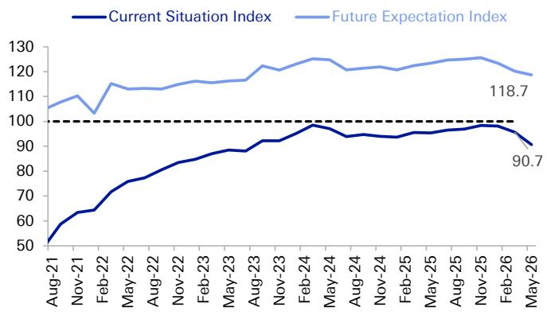

line chart

| Date    | Current Situation Index | Future Expectation Index |
|---------|--------------------------|--------------------------|
| Aug-21  | 50.0                     | 105.0                    |
| Nov-21  | 65.0                     | 110.0                    |
| Feb-22  | 75.0                     | 105.0                    |
| May-22  | 80.0                     | 115.0                    |
| Aug-22  | 85.0                     | 112.0                    |
| Nov-22  | 90.0                     | 115.0                    |
| Feb-23  | 92.0                     | 118.0                    |
| May-23  | 95.0                     | 120.0                    |
| Aug-23  | 98.0                     | 122.0                    |
| Nov-23  | 100.0                    | 125.0                    |
| Feb-24  | 102.0                    | 128.0                    |
| May-24  | 100.0                    | 125.0                    |
| Aug-24  | 98.0                     | 122.0                    |
| Nov-24  | 96.0                     | 120.0                    |
| Feb-25  | 95.0                     | 122.0                    |
| May-25  | 96.0                     | 125.0                    |
| Aug-25  | 97.0                     | 128.0                    |
| Nov-25  | 98.0                     | 130.0                    |
| Feb-26  | 97.0                     | 128.0                    |
| May-26  | 90.7                     | 118.7                    |

Source : RBI and DB

Figure 26: Rural Consumer Confidence  
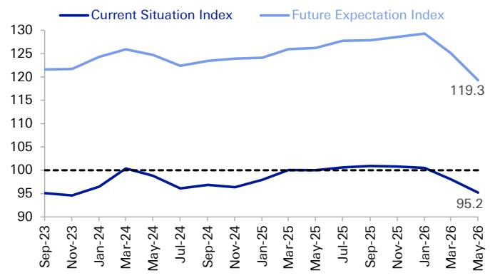

line chart

| Date    | Current Situation Index | Future Expectation Index |
|---------|--------------------------|--------------------------|
| May-26  | 95.2                     | 119.3                    |

Source : RBI and DB

Inflation: In the 5 June policy, the RBI shifted its average oil price assumption for FY27 to USD95/barrel, from the earlier USD85/barrel, resulting in an upward revision of CPI inflation to 5.1%, from 4.6% earlier (DB forecast: 4.9%) and downward revision of GDP growth to 6.6%, from 6.9% earlier (DB forecast: 6.7%yoy). RBI also increased its core inflation forecast to 4.7%, from 4.4% earlier. We see the WPI inflation average rising to 14.5%yoy in FY27 vs. 0.7%yoy in FY26. Higher WPI inflation would feed into CPI inflation with a lag of 3-4 months, which along with risks of food inflation, due to a potential sub-normal monsoon, could push up CPI inflation closer to 5.0% average in FY27, as per our forecasts.

Figure 27: CPI and core CPI inflation forecast

<table><tr><td>Key items</td><td>Weights</td><td>FY16</td><td>FY17</td><td>FY18</td><td>FY19</td><td>FY20</td><td>FY21</td><td>FY22</td><td>FY23</td><td>FY24</td><td>FY25</td><td>FY26</td><td>FY27F</td><td>FY28F</td></tr><tr><td>CPI inflation</td><td>100.0</td><td>4.9</td><td>4.5</td><td>3.6</td><td>3.4</td><td>4.8</td><td>6.2</td><td>5.5</td><td>6.6</td><td>5.4</td><td>4.6</td><td>2.1</td><td>4.9</td><td>4.5</td></tr><tr><td>Food and beverages</td><td>36.8</td><td>5.1</td><td>4.4</td><td>2.2</td><td>0.7</td><td>6.0</td><td>7.4</td><td>4.3</td><td>6.7</td><td>7.0</td><td>6.8</td><td>1.3</td><td>6.0</td><td>5.1</td></tr><tr><td>Paan, tobacco and intoxicants</td><td>3.0</td><td>9.3</td><td>6.8</td><td>6.9</td><td>6.2</td><td>4.2</td><td>9.9</td><td>4.6</td><td>2.2</td><td>3.6</td><td>2.8</td><td>2.7</td><td>6.5</td><td>5.4</td></tr><tr><td>Clothing and footwear</td><td>6.4</td><td>5.8</td><td>5.0</td><td>4.7</td><td>4.1</td><td>1.6</td><td>3.4</td><td>7.2</td><td>9.5</td><td>4.7</td><td>3.1</td><td>3.2</td><td>3.6</td><td>4.5</td></tr><tr><td>Housing, water, electricity, gas and other fuels</td><td>17.7</td><td>4.9</td><td>5.2</td><td>6.5</td><td>6.8</td><td>4.5</td><td>3.3</td><td>3.7</td><td>4.3</td><td>3.9</td><td>2.5</td><td>2.4</td><td>2.6</td><td>3.2</td></tr><tr><td>Furnishings, household equip.and routine HH maintenance</td><td>4.5</td><td>5.3</td><td>4.4</td><td>4.1</td><td>5.5</td><td>3.1</td><td>3.0</td><td>5.8</td><td>7.4</td><td>4.3</td><td>2.6</td><td>2.2</td><td>2.9</td><td>5.6</td></tr><tr><td>Health</td><td>6.1</td><td>5.4</td><td>4.6</td><td>4.4</td><td>7.1</td><td>6.3</td><td>5.1</td><td>7.5</td><td>6.0</td><td>5.6</td><td>3.9</td><td>3.0</td><td>2.9</td><td>4.9</td></tr><tr><td>Transport &amp; Communication</td><td>12.4</td><td>0.4</td><td>3.1</td><td>2.7</td><td>5.2</td><td>2.4</td><td>9.8</td><td>10.1</td><td>6.0</td><td>1.9</td><td>2.4</td><td>1.6</td><td>4.4</td><td>3.4</td></tr><tr><td>Recreation, sport and culture</td><td>1.5</td><td>4.7</td><td>4.0</td><td>3.9</td><td>5.3</td><td>4.9</td><td>5.1</td><td>6.5</td><td>6.0</td><td>3.3</td><td>2.6</td><td>2.5</td><td>2.1</td><td>3.9</td></tr><tr><td>Education Services</td><td>3.3</td><td>6.3</td><td>5.3</td><td>4.5</td><td>6.6</td><td>5.5</td><td>2.8</td><td>2.9</td><td>5.3</td><td>5.2</td><td>3.9</td><td>3.7</td><td>3.0</td><td>3.9</td></tr><tr><td>Restaurants and accommodation services</td><td>3.4</td><td>-</td><td>-</td><td>-</td><td>-</td><td>-</td><td>-</td><td>-</td><td>-</td><td>-</td><td>-</td><td>-</td><td>5.5</td><td>2.3</td></tr><tr><td>Personal care, social protection &amp; misc. goods and serv.</td><td>5.0</td><td>3.7</td><td>6.5</td><td>3.6</td><td>4.8</td><td>5.6</td><td>11.3</td><td>4.3</td><td>7.6</td><td>7.8</td><td>11.1</td><td>17.6</td><td>13.0</td><td>6.6</td></tr><tr><td colspan="15">Memo item</td></tr><tr><td>Core CPI inflation (RBI definition: ex food and fuel)</td><td>53.1</td><td>5.2</td><td>4.9</td><td>4.6</td><td>5.7</td><td>4.7</td><td>5.6</td><td>4.8</td><td>6.2</td><td>4.6</td><td>3.8</td><td>4.3</td><td>4.6</td><td>4.4</td></tr><tr><td>Core CPI inflation (ex food, fuel &amp; precious metals)</td><td>52.1</td><td>5.4</td><td>4.7</td><td>4.7</td><td>5.7</td><td>4.6</td><td>5.3</td><td>4.5</td><td>6.2</td><td>4.3</td><td>3.2</td><td>2.8</td><td>3.6</td><td>4.1</td></tr><tr><td>Non-farm GVA growth</td><td></td><td>9.6</td><td>8.0</td><td>6.7</td><td>6.0</td><td>3.5</td><td>-5.6</td><td>10.4</td><td>7.4</td><td>8.4</td><td>8.0</td><td>8.7</td><td>7.3</td><td>8.1</td></tr><tr><td>Real GDP growth</td><td></td><td>8.1</td><td>8.0</td><td>7.1</td><td>6.3</td><td>3.7</td><td>-5.7</td><td>9.8</td><td>7.6</td><td>7.2</td><td>7.1</td><td>7.5</td><td>6.7</td><td>7.2</td></tr><tr><td>Nominal GDP growth</td><td></td><td>10.5</td><td>11.8</td><td>11.1</td><td>10.5</td><td>6.3</td><td>-1.2</td><td>19.0</td><td>14.0</td><td>11.0</td><td>9.7</td><td>9.0</td><td>11.3</td><td>11.8</td></tr><tr><td>Brent annual avg. (USD/bbl)</td><td></td><td>49.4</td><td>50.5</td><td>59.1</td><td>70.9</td><td>61.0</td><td>45.9</td><td>79.9</td><td>95.1</td><td>82.1</td><td>78.2</td><td>71.0</td><td>90.0</td><td>80.0</td></tr><tr><td>%yoy</td><td></td><td>-41.7</td><td>2.2</td><td>17.0</td><td>19.9</td><td>-14.0</td><td>-24.7</td><td>74.2</td><td>19.0</td><td>-13.7</td><td>-4.7</td><td>-9.3</td><td>26.8</td><td>-11.1</td></tr></table>

Source : RBI and DB. Note 1: \*Core CPI refers to CPI ex food and fuel (RBI definition), \*\* Core core CPI refers to CPI ex food, fuel, & precious metals. Note 2: Core CPI measures till Dec'25 are based on the old CPI (2012=100) series.

The starting point of CPI inflation is much better than 2022, when the RBI started hiking policy rates in April-June'22, with headline CPI and core CPI inflation averaging 6.7%yoy and 6.1% respectively. In 2018 and 2022, core CPI averaged 5.8% and 6.1% respectively, while it is likely to average 4.4% in 2026. In FY27, the starting point of CPI inflation is much lower and more so for core inflation excluding precious metals (was 2.2%yoy in April). So, there is space to absorb some fuel price hikes and delay hiking rates till the second half of the fiscal year, in our view.

Figure 28: Key Macro Variables

<table><tr><td>Key Macro Variables</td><td>2018</td><td>2022</td><td>2026 F</td></tr><tr><td>CPI, % avg.</td><td>4.0</td><td>6.7</td><td>4.6</td></tr><tr><td>Core CPI, % avg.</td><td>5.8</td><td>6.1</td><td>4.4</td></tr><tr><td>WPI, % avg.</td><td>4.3</td><td>12.2</td><td>14.5</td></tr><tr><td>Core WPI, % avg.</td><td>4.5</td><td>8.1</td><td>7.7</td></tr><tr><td>Real GDP, %yoy</td><td>6.5</td><td>6.9</td><td>6.7</td></tr><tr><td>Repo rate, %</td><td>6.50</td><td>6.25</td><td>5.25</td></tr><tr><td>Real rates, %</td><td>2.5</td><td>-0.5</td><td>0.7</td></tr><tr><td>Fiscal deficit, centre, % of GDP</td><td>-3.4</td><td>-6.4</td><td>-4.3</td></tr><tr><td>Current Account Deficit, USD bn</td><td>-65.6</td><td>-79.1</td><td>-97.1</td></tr><tr><td>Current Account Deficit, % of GDP</td><td>-2.4</td><td>-2.4</td><td>-2.4</td></tr><tr><td>Balance of Payments, USD bn</td><td>-4.3</td><td>-30.7</td><td>-67.1</td></tr></table>

Source : CEIC, DB estimates

Is a food price spike inevitable if the monsoon disappoints? Over the past decades, poor monsoons have not necessarily caused high food price inflation. In 2002 and 2004, cumulative rainfall was 19% and 14% below LPA respectively, but thanks to an effective undertaking by GOI that saw large-scale disbursement from the government's food stocks, inflation remained under control. However, agricultural sector growth was affected severely in FY03 (-4.9%yoy) and FY05 (1.1%yoy). There is no easy way to tell whether the authorities will be successful in keeping a lid on food prices (as it requires successful coordination between the central and various state governments), if we end up getting a drought in 2026 (cumulative rainfall being 10% below LPA), but the experience of 2014 and 2015, when the government proactively used supply-side measures to control food inflation, gives us hope that the authorities will try their level best to keep CPI inflation below the 6% upper threshold in FY27 as well. Our forecasts of CPI inflation and food inflation indicate that inflation expectations of households will likely rise to 10.5% average in FY27 from 8.8% in FY26.

Figure 29: Household Inflation expectation (1-Yr ahead)  
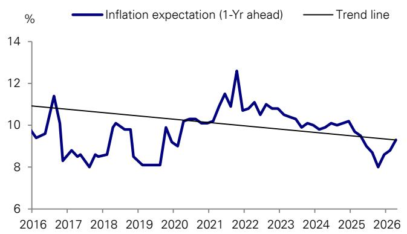

line chart

| Year | Inflation expectation (1-Yr ahead) | Trend line |
|------|------------------------------------|------------|
| 2016 | ~9.5                               | ~11.0      |
| 2017 | ~8.5                               | ~10.8      |
| 2018 | ~8.0                               | ~10.6      |
| 2019 | ~8.0                               | ~10.4      |
| 2020 | ~9.5                               | ~10.2      |
| 2021 | ~10.5                              | ~10.0      |
| 2022 | ~12.5                              | ~9.8       |
| 2023 | ~10.5                              | ~9.6       |
| 2024 | ~10.0                              | ~9.4       |
| 2025 | ~9.5                               | ~9.2       |
| 2026 | ~9.0                               | ~9.0       |

Source : RBI and DB

Figure 30: Inflation expectation and real rates  
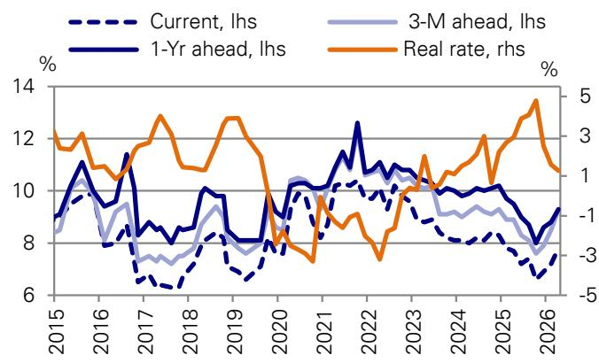

line chart

| Year | Current, lhs | 1-Yr ahead, lhs | 3-M ahead, lhs | Real rate, rhs |
|------|--------------|-----------------|----------------|----------------|
| 2015 | ~9.5         | ~10.5           | ~8.5           | ~12.0          |
| 2016 | ~8.0         | ~11.0           | ~9.0           | ~11.5          |
| 2017 | ~6.5         | ~8.5            | ~7.5           | ~13.0          |
| 2018 | ~7.0         | ~9.0            | ~8.0           | ~10.5          |
| 2019 | ~8.0         | ~8.5            | ~9.5           | ~12.5          |
| 2020 | ~7.5         | ~8.0            | ~8.5           | ~8.0           |
| 2021 | ~9.0         | ~10.0           | ~10.0          | ~9.5           |
| 2022 | ~10.0        | ~12.5           | ~10.5          | ~7.5           |
| 2023 | ~9.5         | ~10.5           | ~9.5           | ~11.0          |
| 2024 | ~8.5         | ~9.5            | ~8.5           | ~10.0          |
| 2025 | ~7.5         | ~8.5            | ~7.5           | ~12.0          |
| 2026 | ~6.5         | ~9.0            | ~7.0           | ~13.5          |

Source : RBI and DB

Figure 31: Household Inflation expectation (1-Yr ahead) – annual average  
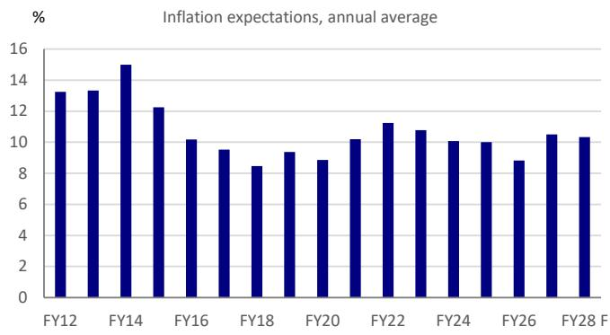

bar chart

Inflation expectations, annual average
| Fiscal Year | Inflation expectations (%) |
| :--- | :--- |
| FY12 | 13.3 |
| FY13 | 13.4 |
| FY14 | 15.0 |
| FY15 | 12.2 |
| FY16 | 10.2 |
| FY17 | 9.5 |
| FY18 | 8.5 |
| FY19 | 9.4 |
| FY20 | 8.9 |
| FY21 | 10.2 |
| FY22 | 11.2 |
| FY23 | 10.8 |
| FY24 | 10.1 |
| FY25 | 10.0 |
| FY26 | 8.9 |
| FY27E | 10.5 |
| FY28E | 10.3 |

Source :RBI and DB estimates

Figure 32: Household Inflation expectation (1-Yr ahead) & CPI Food–annual average  
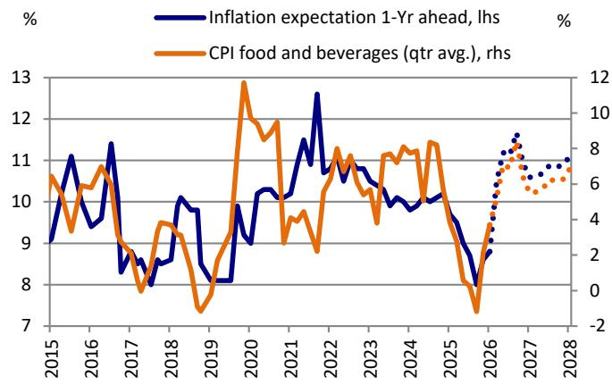

line chart

| Year | Inflation expectation 1-Yr ahead, lhs (%) | CPI food and beverages (qtr avg.), rhs (%) |
|------|------------------------------------------|---------------------------------------------|
| 2015 | ~9.5                                     | ~10.5                                       |
| 2016 | ~11.0                                    | ~10.0                                       |
| 2017 | ~8.5                                     | ~8.0                                        |
| 2018 | ~9.0                                     | ~9.5                                        |
| 2019 | ~8.0                                     | ~7.0                                        |
| 2020 | ~10.5                                    | ~13.0                                       |
| 2021 | ~11.5                                    | ~11.0                                       |
| 2022 | ~12.5                                    | ~10.5                                       |
| 2023 | ~10.5                                    | ~11.0                                       |
| 2024 | ~10.0                                    | ~11.5                                       |
| 2025 | ~9.5                                     | ~11.0                                       |
| 2026 | ~8.5                                     | ~7.0                                        |
| 2027 | ~11.5                                    | ~9.0                                        |
| 2028 | ~11.0                                    | ~8.5                                        |

Source : RBI and DB estimates

Monetary policy: In a unanimous vote, the 6-member MPC decided to keep the repo rate (5.25%) and “neutral” monetary policy stance unchanged in the 5 June policy. Stating that the RBI remains “fully prepared to do whatever it takes to preserve orderly market conditions”, the central bank also announced a slew of measures to incentivize capital inflows to stabilize the rupee, in line with our expectations (see, “June MPC Outlook - Pause likely for now; rate hikes expected from 2HFY27”, 26 May). Our long-standing view has been that the terminal repo rate in this cycle is likely to be 6.25%, which we maintain. Assuming CPI inflation averages 5.0% in FY27, the repo rate, in our view, needs to be at least 100bps higher at 6.25%, to have a positive real interest rate of 125bps. Given the sharp rise in WPI inflation (touched 8.30% in April) and pass-through risks to CPI inflation with a lag, along with risks of a sub-normal monsoon, we bring forward our rate hike call to commence from October-Dec’26 vs. our earlier call for the rate-hike cycle starting from April 2027. At this stage, we factor in two 25bps hikes in Oct-Dec’26 and another 50bps cumulative hike by mid-2027, taking the terminal repo rate to 6.25%. Given the latest developments, we see the Oct-Dec’26 quarter as the optimal time period to start the rate-hike cycle, which would have given sufficient time to the economy to adjust since the last rate cut was delivered in Dec’25, while also not risking falling behind the curve by delaying the rate hikes for too long beyond Oct-Dec’26.

Fiscal: Expectedly, the oil price burden is being shared by different stakeholders. Oil marketing companies (OMCs) are bearing most of the burden of higher oil prices, while the government of India also has cut excise duties on petroleum products by INR10/ litre in March, which will result in some revenue loss, even though export duties of petroleum products have been raised to offset the downside risks. Finally, domestic pump prices for petrol and diesel have been raised by INR 8 /litre thus far in May, with consumers bearing some part of the burden of higher oil prices.

On the spending front, higher oil prices will increase fertilizer subsidies, potentially doubling from INR 1.7 trn allocation (0.45% of GDP) in the FY27 budget to INR 3.4 trn, or 0.9% of GDP, with some buffers. The Economic Stabilization Fund, which has a corpus of INR 1 trn (0.26% of GDP), will come in handy to deal with the fiscal slippage risks. Some compression of non-essential revenue expenditure and capital-expenditure (INR 800 bn; 0.2% of GDP) may come as useful buffers to offset the slippages, thereby helping to meet the FY27 fiscal deficit target of 4.3% of GDP. If crude oil prices average between USD 95-100 / bbl, the FY27 fiscal deficit target of 4.3% of GDP can be met, in our view. Given the government's commitment to fiscal consolidation, even under the current stress scenario, the RBI can afford to delay rate hikes, giving time to the economy to adjust to the new macro environment.

Rupee stabilization measures: The RBI refrained from hiking rates in the 5 June policy, despite expectations of a segment of market participants, but announced several measures to incentivize foreign capital flows and reduce the pressure on the rupee. We are forecasting FY27 current account deficit to rise to 2.0% of GDP, or USD 83 bn, assuming oil averages USD 95/barrel. The government has already raised the import duty on gold from 6% to 15%, which can potentially reduce gold imports by USD 10bn. So, the current account deficit could end up being closer to USD 73 bn for FY27. Without the capital flow-incentivizing measures announced by the RBI on 5 June, India would have still got about USD 30 bn capital flows, resulting in a BOP deficit of USD 43 bn. Given the measures that were announced in the June policy, if India ends up attracting additional foreign capital flows of USD 40-50bn, then the BOP gap will be closed for FY27, which will help stabilize the rupee. We maintain our end-2026 forecast of rupee at 93.

## Indonesia

- Amid a deteriorating external balance, we think BI is likely to mount a stronger defense of the rupiah, with the policy rate forecast to rise to 6% by end-2026.  
We also discuss: the scale and pace of the rollout of the new state-owned export agency adds a fair amount of uncertainty to its outlook; fuel subsidies could grow larger than expected amid sustained domestic energy demand; although MBG has been cut back, more savings may need to be sourced from other areas to maintain fuel subsidies.

Junjie Huang

## BI likely to hike again to mount stronger defense of the rupiah

Given the latest economic and policy developments, we expect sustained downward pressure on the trade balance (Figure 33) and by extension, the rupiah. We revise our current account forecast to -1.3% of GDP (prev: -0.9%) and expect USD/IDR to range 18,000-19,000 this year and recover to \~17,800 by end-2027 as the global energy supply normalizes.

Raw material imports, particularly of O&G, are likely to stay elevated, amid still-high global oil prices and sustained domestic energy demand. Data from the Ministry of Finance show that electricity consumption rose in April by 19% YoY, despite the global oil shock. Fuel consumption rose by 8.2% YoY in April, and further by 8.6% in May.  
- Exports could take longer to complete their trade as the new state-owned export agency DSI irons out the creases in the economy's new export processes. Coal buyers have reportedly paused shipments until the uncertainty clears, while a front-loading of discounted palm oil may not lead to higher earnings and risks payback at a later period.

We now expect Bank Indonesia to mount a stronger defense of the rupiah and forecast 75bp in rate hikes by the end of this year, to bring the policy rate to 6%. This would help reduce the pressure on imported inflation while also increasing the rate differential vis-à-vis the Fed to further attract capital inflows. Global rates are already repricing higher on the back of strong US economic data.

We think BI is likely to front-load these rate hikes amid the sustained pressure on the rupiah. We forecast a 50bp policy rate increase again in June after its surprise 50bp hike in May, and a further 25bp policy rate increase in July.  
Headline inflation could breach BI's 1.5-3.5% target, in our view, with our forecast of H2'26 inflation at 3.7% YoY. Jan-May inflation is already averaging 3.5%, albeit with low base effects in Q1'26.  
That said, to support “real sector growth”, we think BI may partially reverse its hikes over 2027, cutting by a total of 50bp to 5.50%, to maintain a sufficient rate differential.

## Keeping track of...

Meanwhile, the MBG programme has been cut back, with our estimates of fiscal savings in the range of IDR 90-110 trillion which can be reallocated to fuel subsidies. However, at the current fuel subsidy run rate, there would need to be a total reallocation of 210-250 tn towards fuel subsidies for the year, assuming an unchanged deficit target of 2.68% of GDP. This implies other avenues of reallocation need to be sourced, in the range of IDR 100-160tn. We think this could come from a reduction in capital expenditures, which has a budget of IDR 274tn for the year, assuming that the government would prioritize social assistance and protecting households against the ongoing global energy shock. Trade data already suggests some cutback in capital goods imports since the war broke in March. (Figure 34)

Figure 33: Trade balance under pressure  
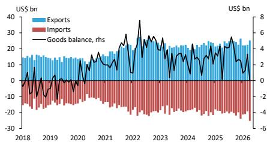

bar-line hybrid chart

| Year | Exports (US$ bn) | Imports (US$ bn) | Goods balance, rhs (US$ bn) |
|------|------------------|------------------|----------------------------|
| 2018 | ~15              | ~-10             | ~0                         |
| 2019 | ~18              | ~-12             | ~1                         |
| 2020 | ~16              | ~-14             | ~2                         |
| 2021 | ~17              | ~-13             | ~3                         |
| 2022 | ~20              | ~-15             | ~4                         |
| 2023 | ~18              | ~-16             | ~5                         |
| 2024 | ~19              | ~-17             | ~6                         |
| 2025 | ~21              | ~-18             | ~7                         |
| 2026 | ~23              | ~-19             | ~8                         |

Source : DB, Haver Analytics

We detail below our thoughts on DSI, fuel subsidies, and MBG.

## ...DSI: A centralized export system for natural resources

Danantara Sumberdaya Indonesia (DSI), Indonesia's new state-owned export agency, began operations on 1 June. Its main objective is to prevent revenue leakage from exports of its natural resources. DSI will initially centralize the exports of three commodities that Indonesia sees as strategic: palm oil, coal, and ferroalloys. The scale and pace of the policy rollout add a fair amount of uncertainty to its outlook, in our view.

The list of commodities may still be subject to change. For instance, nickel pig iron, a ferroalloy with low-purity nickel, and some refined palm oil products have been exempt from the centralization.  
In the rollout timeline announced in mid-May, DSI initially stated a Phase I transition period from June to August, during which exporters must report their export transactions to DSI, and a Phase II full implementation from 1 September 2026 when DSI will manage all transactions between domestic sellers and foreign buyers. However, the government said at end-May that full operation (i.e., Phase II) is now targeted by 1 January 2027.  
How DSI would work with SIMBARA, a multi-ministry tracking system coordinated by the Ministry of Finance, is not yet known. SIMBARA was first implemented in 2022 to track the production and movement of coal. In 2024, it expanded to cover nickel and tin, and the government had plans to further widen coverage of other resources such as gold and copper.

Spotlight on coal. We earlier estimated that “under-invoicing” of Indonesia’s coal exports averaged \~USD 1.3 billion per month in Jan-Feb 2026, widening from 430 million per month in H2 2025. At the onset of the Iran War in March, we estimate that this figure could have surged to 2.7 billion. (Figure 35) On an annualized basis, this could lead to tax revenue (income, royalties, and export taxes) loss of \~0.4% of GDP, by our estimates. This underscores the need for oversight on Indonesia’s natural resource and export sectors, especially in times of stress in global commodity markets.

## ...Fuel subsidies

We estimate the additional spend on fuel subsidies in March-May to be IDR 68.7 trillion, or 0.1% of GDP per month on average since the start of the conflict. (Figure 36) Fuel subsidies allocated in the approved 2026 budget was 0.8% of GDP. The 0.1% of GDP per month run rate of additional fuel subsidy could continue for the rest of the year, given our latest oil price forecast of USD 109/bbl for Q2, 99 for Q3, and 86 in Q4, bringing the potential total spend on fuel subsidies in 2026 to 1.6-1.8% of GDP (0.8ppts baseline + 0.8-1ppts additional). This implies a total reallocation of \~IDR 210-250 trillion towards fuel subsidies, assuming an unchanged deficit target of 2.68% of GDP (see Indonesia: Oil price vs budget reallocations).

Figure 34: Cutback in capital goods imports since March  
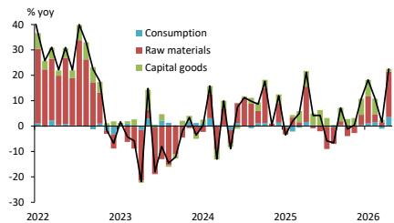

bar chart

| Year | Consumption | Raw materials | Capital goods |
|------|-------------|---------------|---------------|
| 2022 | 0           | 30            | 40            |
| 2023 | 0           | -10           | 5             |
| 2024 | 0           | 10            | 15            |
| 2025 | 0           | 15            | 20            |
| 2026 | 0           | 20            | 25            |

Source : DB, Haver Analytics

Figure 35: Potential under-invoicing in coal exports  
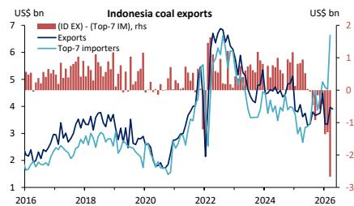

line chart

| Year | ID EX - (Top-7 IM), rhs (US$ bn) | Exports (US$ bn) | Top-7 importers (US$ bn) |
|------|----------------------------------|------------------|--------------------------|
| 2016 | ~5.5                             | ~2.5             | ~1.5                     |
| 2018 | ~5.5                             | ~3.0             | ~2.0                     |
| 2020 | ~5.5                             | ~3.5             | ~2.5                     |
| 2022 | ~6.0                             | ~7.0             | ~4.0                     |
| 2024 | ~5.5                             | ~4.0             | ~3.0                     |
| 2026 | ~4.5                             | ~3.0             | ~2.0                     |

Source : DB, Haver Analytics, CEIC

## ...MBG: Free nutritious meals

We estimate from the bottom up the likely MBG expense for 2026 with three scenarios and conclude that MBG spending is most likely to undershoot even the downwardly revised IDR 268tn budget. The year-to-date expense as at 30 April stands at IDR 75 tn. (Figure 37)

1. Cost per meal fixed at IDR 10,000 for the year per government's allocations, with beneficiaries capping out at 63 million for the year (April beneficiaries: 62 mn);  
2. Cost per meal reaches IDR \~10,350 following our food inflation forecast, with beneficiaries reaching 70 million by end-2026;  
3. Cost per meal spikes to IDR 12,000 from May alongside adverse conditions such as higher import costs or tighter supplies, and beneficiaries reaching the full target of 82.9 million by end-2026.

Unspent amounts (vis-à-vis the original) from scenarios 1 or 2 could range IDR 90-110 tn, which could then be reallocated to fuel subsidies. Even in the unlikely scenario 3 where beneficiaries reach the full target of 83 million this year, spending is still likely to be IDR 50-60tn below. The new head of the BGN, which oversees MBG, has said that “it is no longer prioritizing its target of reaching 82.9 million beneficiaries this year”.

Figure 36: Additional fuel subsidies averaging 0.1% of GDP per month  
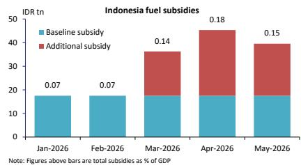

stacked bar chart

Indonesia fuel subsidies
| Month | Baseline subsidy (IDR tn) | Additional subsidy (IDR tn) |
| :--- | :--- | :--- |
| Jan-2026 | 0.07 | 0.0 |
| Feb-2026 | 0.07 | 0.0 |
| Mar-2026 | 18.0 | 14.0 |
| Apr-2026 | 18.0 | 25.0 |
| May-2026 | 18.0 | 23.0 |
Note: Figures above bars are total subsidies as % of GDP

Source : DB, CEIC, Bloomberg Finance LP

Figure 37: Savings from various MBG scenarios

<table><tr><td>Scenario</td><td>Beneficiaries (million)</td><td>MBG cost (IDR tn)</td><td>MBG cost (% of GDP)</td><td>Savings vs budgeted (IDR tn)</td><td>Savings vs revised (IDR tn)</td></tr><tr><td>Budgeted</td><td>-</td><td>335.0</td><td>1.30</td><td>-</td><td>-</td></tr><tr><td>Revised</td><td>-</td><td>268.0</td><td>1.04</td><td>67.0</td><td>-</td></tr><tr><td>1</td><td>63.0</td><td>228.0</td><td>0.89</td><td>107.0</td><td>40.0</td></tr><tr><td>2</td><td>70.0</td><td>237.7</td><td>0.92</td><td>97.3</td><td>30.3</td></tr><tr><td>3</td><td>82.9</td><td>278.7</td><td>1.08</td><td>56.3</td><td>-10.7</td></tr></table>

Source : DB, Ministry of Finance

## Malaysia

Malaysia's economy exceeded expectations for a second consecutive quarter, growing $5.4\%$ yoy in Q1 2026.  
Even factoring in some slowdown in the remaining quarters, on account of the lagged impact of the West Asia crisis, we believe Malaysia remains well poised to record around 4.5%yoy growth in 2026, as per our forecasts.  
CPI inflation touched 1.9%yoy in April. While further subsidy rationalization is likely, CPI is still likely to average around 2.0-2.1% in 2026.  
We do not anticipate any emergency on the part of the Malaysian authorities to hike policy rates in the near future.  
The government is trying hard to stick to the fiscal deficit target, but some slippage is likely, as per our estimates.  
We remain broadly constructive on MYR's prospects, though it is possible that the BNM may intervene and shore up more reserves, in case MYR were to appreciate rapidly post a de-escalation of the war.

Kaushik Das

## Strong 1Q'26 growth; slowdown ahead

\* Growth: Malaysia's economy exceeded expectations for a second consecutive quarter, growing 5.4%yoy in Q1 2026 (though lower than 6.2%yoy recorded in the fourth quarter of 2025), despite heightened global uncertainty arising from the conflict in West Asia. Domestic demand expanded by 5.2%yoy, supported by steady household spending amid a buoyant labour market and higher disposable income. Private consumption grew 4.7%yoy in 1Q 2026, while private investment grew 7.8%yoy. Net exports surged 13.5%yoy, amid steady export growth and a faster moderation in imports.

On the supply side, the services sector grew 5.6%yoy (Q4 2025: 6.2%yoy), supported by business-related and government services, while the manufacturing sector expanded 5.9%yoy (Q4 2025: 6%yoy) on stronger E&E production driven by continued demand for AI-related components. The agriculture sector recorded slower growth of 2.6%yoy (Q4 2026: 5.7%yoy) as palm oil production normalised following strong yields previously, while the mining and quarrying sector contracted 2.1%yoy (Q4 2025: 1.4%yoy) due to weaker domestic oil and gas production. Construction growth moderated to 7.7%yoy, from 10.9%yoy previously amid slower residential and civil engineering activities, although special trade and non-residential activities continued to provide support.

Malaysia recorded a wider current account surplus of RM15.2 bn in 1Q 2026, vs. RM2.7 bn in 4Q'25, driven by a larger goods surplus and higher services surplus supported by travel and ICT receipts. Even factoring in some slowdown in rest of this year, on account of the lagged impact of the West Asia crisis, Malaysia remains well poised to record around 4.5% yoy growth in 2026, as per our forecasts.

\* Inflation: Meanwhile, Malaysia's CPI inflation touched $1.9\%$ yoy in April, mainly driven by the increase in the transport group (+4.1% in April vs. 1.6% in March). Housing, water, electricity, gas and other fuels group increased to 1.1% in April vs. 1.2% in March. Other items which added to inflationary pressure included alcoholic beverages & tobacco (2.8% in April vs. 2.7% in March); information and communication (2.0% vs. 1.4%); food & beverages (1.2% vs. 1.1%) and furnishings, household equipment and routine household maintenance (0.4% vs. 0.1%).

Average price of unleaded RON97 increased to RM5.06 / litre in April, from RM4.03 / litre in March. The average price for diesel in Peninsular Malaysia jumped to RM5.92/ litre in April vs. RM4.12/litre in March. Meanwhile, the average market price of unleaded RON95 increased to RM4.00 / litre in April, from RM3.16 / litre in March. Malaysia's CPI inflation of 1.9%yoy in April 2026 was lower compared to that of Philippines (7.2%), Vietnam (5.5%), Thailand (2.9%), South Korea (2.6%) and Indonesia (2.4%). CPI inflation will likely average around 2.0-2.1% in 2026 and not significantly higher than that, with limited spillover to core inflation. In 2025, CPI inflation averaged 1.4% and for 2026. BNM projects inflation to average 1.5%-2.5% in 2026.

\* Monetary policy: We do not anticipate any emergency on the part of the Malaysian authorities to hike policy rates in the near future, based on the near-term assessment of growth-inflation. The 7th May monetary policy statement called "the monetary policy stance to be appropriate the current OPR level and consistent with the outlook of continued price stability and sustainable economic growth." We expect the BNM to stay on an extended pause and monitor the growth momentum in 1H'26, before considering any rate hikes. We expect the BNM to hike rates by 25bps in 2027, taking the OPR back to $3.0\%$ , but in case growth and inflation both turn out to be stronger than expected in 1H'26, then a rate hike may be justified by the end of this year.

\* Fiscal: The government is trying hard to stick to the fiscal deficit target, by cutting non-essential expenditure to help offset rising fuel subsidies. As per media reports, Malaysia's treasury has ordered all federal ministries, departments and agencies to cut their operating budgets for 2026 because of the impact of the Middle East conflict. The government's public subsidy cost is expected to reach RM58.4 bn, far surpassing the RM15 bn originally approved for 2026. The directive proposed several cost-saving measures including restrictions on salaries and allowances for unfilled vacancies, a $10\%$ reduction on services, supplies and assets, and a $20\%$ cut on budgets for statutory bodies and companies limited by guarantees.

Assuming a USD 90 / barrel average oil price, Malaysia will generate additional oil-related revenue, but this would be more than offset by subsidy expenditure, leading to a potential slippage of about $0.7\%$ of GDP vs. the 2026 budget estimate of $3.5\%$ of GDP. By end-April, fuel subsidy spending had surged further to RM 7 bn vs. RM 700 mn in January. Extra dividend from Petronas and compression of some development and non-essential revenue expenditure can help keep the fiscal deficit from breaching the $4\%$ of GDP mark in such a scenario. We have revised up our 2026 fiscal deficit estimate to $3.7\%$ of GDP vs. BE of $3.5\%$ . Every USD10 increase in global oil prices can raise Malaysia's fuel subsidy bill by more than RM10bn per year.

\* FX: MYR had appreciated to 3.89 levels vs. USD before the escalation of geopolitical tensions; currently, it is trading around 4.0 levels, due to the Middle East conflict. Assuming the West Asia conflict stabilizes over the next few months, the MYR will likely continue its appreciation once again vs. USD. Our year-end target for MYR remains at 3.90. The international reserves of BNM amounted to USD 129.7 bn on 30 April vs. USD127.9 bn as of 13 February 2026. We remain broadly constructive on the ringgit's prospects, though it is possible that the BNM may intervene and shore up more reserves, if MYR were to appreciate rapidly post a de-escalation of the war.

## Philippines

We maintain our view that BSP could hike its policy rate by 50bp in the coming June MB meeting, as we believe that the lower inflation print in May is only temporary. Underlying price pressures are still increasing, and inflation is still expected to be above BSP's 2-4% target in both 2026 and 2027.

Junjie Huang

## Lower headline inflation in May does not change our BSP call

Philippines headline inflation eased to 6.8% YoY in May, from 7.2% in April, lower than our 8.2% forecast. (Figure 38) Our view of BSP hiking by 50bp in the June MB meeting is unchanged as we think the lower print may only be temporary—and it is still materially above BSP's 2-4% target—as (1) broad price pressures are still building up in the economy, and (2) our outlook for global inflation dynamics is still elevated. Lower retail fuel pump prices eased the pressure on overall transport prices, and the fall in food price inflation belied the continued rise in rice prices. Overall, our revised inflation forecasts for 2026 and 2027 are still above BSP's target at 6.2% (prev: 6.5%) and 4.1% (prev: 4.2%), respectively.

The sticker shock from fuel pump prices eased in May, with diesel prices on average at \~PHP 80/liter vs 115/liter in April. That said, transport inflation of 16% in May 2026 (Apr: 21%) is near the 2022 oil shock peak of 18%, and is likely to stay in this range given DB's forecast of oil prices only falling marginally to USD 86/bbl by Q4'26, vs 90-100 in the past weeks.  
Electricity prices are unlikely to materially decline as long as global energy prices remain at current levels, in our view. Moreover, the Department of Energy said that there would likely be a spike in electricity tariffs in June, amid intermittent supply issues. We note that Meralco's electricity tariffs have increased by $8.8\%$ cumulatively from February to May, but the electricity CPI index rose by a smaller $5.5\%$ , which—like rice below—could imply that upside pressure could still feed through.  
The fall in food price inflation belied the continued rise in rice prices, the latter which further rose to 15.6% YoY in May, from 13.7% in April. Retail rice prices are about 17% YoY higher (PHP51/kg) in Philippine Statistics Authority's May survey, suggesting that further inflation could feed through if retailers keep their margins unchanged. The Department of Agriculture said in mid-May that a PHP50/kg price cap for imported rice was "reasonable for fair market margins".  
- More generally, we believe that basic goods prices will begin to increase, as price freezes were committed only until 10 May and manufacturers were already seeking government approval to raise prices. May’s inflation report may not have captured these increases due to the approval timelines involved.  
Underlying measures of inflation do not suggest cooling momentum. The 30% trimmed mean inflation for May is unchanged at 4.3% YoY (Figure 39), while on a 3m/3m saar basis it rose to 2.1% from 1.4% (Figure 40). Core inflation at 4.1% YoY is above BSP's target for the first time since Dec'23.

We construct an Essentials Price Index (EPI) for the Philippines, which comprise of various CPI items that would be used in everyday living, such as cereals (including rice), meat, fish, milk, fruit, vegetables, medicine, and beverages such as coffee and water. While the EPI generally tracks headline inflation, historical patterns suggest that price changes in either direction are magnified. (Figure 41) In the current context, if/once price caps are released, essential goods inflation could further spike. There are two economic implications:

1. Middle- to lower-income households could see higher inflation rates than the aggregate suggests, as essential goods form a larger share of their consumption basket. This is corroborated by the inflation report for the bottom 30% of income households, where May'26 inflation was 8.4% (Apr: 8.5%), compared to 6.8% nationally.  
2. (Real) Household consumption in aggregate could fall, ceteris paribus, if disposable income growth lags such price increases, and drag on GDP growth. Household consumption comprises \~73% of GDP.

Figure 38: Inflation slowed, but still meaningfully above target  
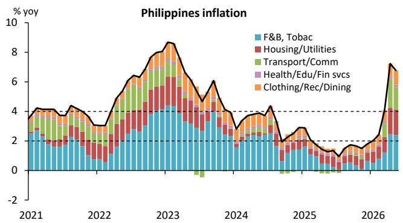

stacked bar chart

| Year | F&B, Tobac | Housing/Utilities | Transport/Comm | Health/Edu/Fin svcs | Clothing/Rec/Dining |
|------|------------|-------------------|----------------|---------------------|---------------------|
| 2021 | ~3%        | ~1%               | ~1%            | ~1%                 | ~1%                 |
| 2022 | ~3%        | ~1%               | ~1%            | ~1%                 | ~1%                 |
| 2023 | ~4%        | ~2%               | ~1%            | ~1%                 | ~1%                 |
| 2024 | ~3%        | ~1%               | ~1%            | ~1%                 | ~1%                 |
| 2025 | ~2%        | ~1%               | ~1%            | ~1%                 | ~1%                 |
| 2026 | ~7%        | ~3%               | ~1%            | ~1%                 | ~1%                 |

Source : DB, Haver Analytics

Figure 39: Underlying inflation still shows broad price pressures on year-ago...  
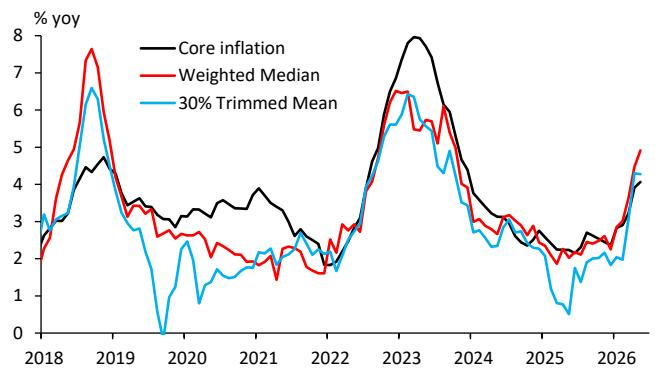

line chart

| Year | Core inflation | Weighted Median | 30% Trimmed Mean |
|------|----------------|-----------------|------------------|
| 2018 | ~2.5           | ~2.0            | ~3.0             |
| 2019 | ~4.5           | ~7.5            | ~6.5             |
| 2020 | ~3.0           | ~2.5            | ~0.0             |
| 2021 | ~3.5           | ~2.0            | ~1.5             |
| 2022 | ~2.0           | ~1.5            | ~1.0             |
| 2023 | ~8.0           | ~6.5            | ~6.0             |
| 2024 | ~4.0           | ~3.0            | ~2.5             |
| 2025 | ~2.5           | ~2.0            | ~0.5             |
| 2026 | ~4.0           | ~5.0            | ~4.0             |

Source : DB, Haver Analytics

Figure 40: ...and sequential momentum basis.  
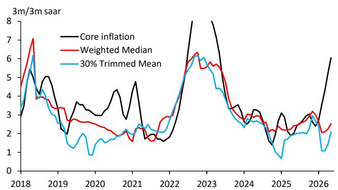

line chart

| Year | Core inflation | Weighted Median | 30% Trimmed Mean |
|------|----------------|-----------------|------------------|
| 2018 | ~4.5           | ~7.0            | ~6.0             |
| 2019 | ~3.0           | ~3.5            | ~4.0             |
| 2020 | ~2.5           | ~2.5            | ~1.5             |
| 2021 | ~4.5           | ~1.5            | ~2.0             |
| 2022 | ~1.5           | ~3.0            | ~3.0             |
| 2023 | ~8.0           | ~6.0            | ~6.0             |
| 2024 | ~3.0           | ~3.0            | ~2.5             |
| 2025 | ~1.5           | ~2.5            | ~1.0             |
| 2026 | ~6.0           | ~3.0            | ~2.0             |

Source : DB, Haver Analytics

Figure 41: Essential goods price inflation could accelerate if/once price caps are released  
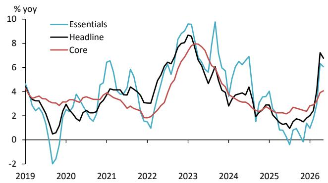

line chart

| Year | Essentials | Headline | Core |
|------|------------|----------|------|
| 2019 | 4.5        | 4.0      | 4.0  |
| 2020 | -2.0       | 0.5      | 3.0  |
| 2021 | 6.5        | 4.0      | 3.5  |
| 2022 | 1.0        | 3.0      | 2.0  |
| 2023 | 9.5        | 8.5      | 8.0  |
| 2024 | 7.0        | 4.0      | 3.0  |
| 2025 | 4.0        | 2.0      | 2.5  |
| 2026 | 6.5        | 7.0      | 4.0  |

Source : DB, Haver Analytics

## Singapore

We forecast the MAS further increasing the S\$NEER slope to 1.5% in July, after its earlier increase to 1.0% in April. Concerns on the growth outlook, which weighed heavy in April, have likely faded after a strong Q1 growth print and early signs that AI-related momentum could be sustained this year. With inflation expected to accelerate from Q3, we think MAS would pre-emptively act to manage the delayed impact of the energy shock on the domestic economy.

Junjie Huang

## MAS to tighten again in July

We bring forward our forecast of MAS' S\$NEER slope increase to the July MPS meeting, to 1.5% p.a. from 1.0%.

Our previous forecast was for a slope increase in October as the growth outlook back in April—when our call was made—was tilted to the downside. It was highly uncertain then whether supply chains and growth drivers could be sustained after the onset of the war. These concerns have likely faded, in our view, amid strong Q1 growth, which has led us to revise our 2026 forecast to 3.9% (previous: 2.8%), the top end of the official 2-4% range.  
While April inflation surprised to the downside, there is pent up pressure beneath the surface which would materialize from July/Q3. We think the MAS would act in July to pre-emptively respond to the anticipated acceleration in inflation, rather than waiting for confirmation of broad-based price pressures in October, which could lead to a more disruptive tightening cycle. With growth concerns alleviated in our view, policymakers are now likely to focus on managing the emerging cost-of-living issues and spillovers to households from higher global energy and commodity prices.  
There is a risk of an upward re-centering of the policy band, if a stronger pass-through of the energy shock to domestic prices, coupled with demand-pull pressures, materialise. This could manifest in the Price Pressure Index rising above 60. That said, we think MAS is likely to first increase the S\$NEER slope in July before considering a re-centering in a subsequent meeting, in line with its preference for gradual policy shifts.

Core inflation was 1.4% YoY in April, lower than our 1.6% and consensus' 1.8% forecasts respectively.

Price freezes on food and essential items in Singapore's largest supermarket chain, and a long-running price war in the telecommunications sector kept core inflation lower than our forecast.  
Non-tradable core inflation fell to 1.7% YoY in April vs 2.2% in March, primarily driven by high base effects in health insurance (-0.3 ppts) and water supply (-0.2 ppts) as we expected. Tradable core inflation was relatively stable at 1.0% in April from 0.9% in March. (Figure 43)  
The Price Pressure Index, a diffusion index which measures the weighted proportion of core CPI with inflation above their historical average, fell to 33 in April vs 44 in March. (Figure 44)

Nonetheless, we expect inflation to accelerate in the months ahead. Core inflation is forecast to breach 2% from June and average 2.8% in H2 2026. Consequently, we see the Price Pressure Index rising above 50 from the July print.

- Domestic energy prices will begin to reflect the impact of higher global energy prices from July/Q3. Regulated electricity tariffs for the quarter are set using energy prices from the preceding quarter.  
Tradable core inflation is also expected to pick up alongside the sharp rise in prices in earlier parts of the supply chain. Import prices saw a sustained surge to 17-18% YoY in March and April. Prior to March, it had been in deflation since January 2024. Both the overall and non-oil domestic supply price index (DSPI), which measures the prices of goods manufactured locally or imported which are retained for use in the domestic economy, saw its inflation rise to the highs recorded in 2022. (Figure 45)

Figure 42: MAS to pre-emptively tighten in July...  
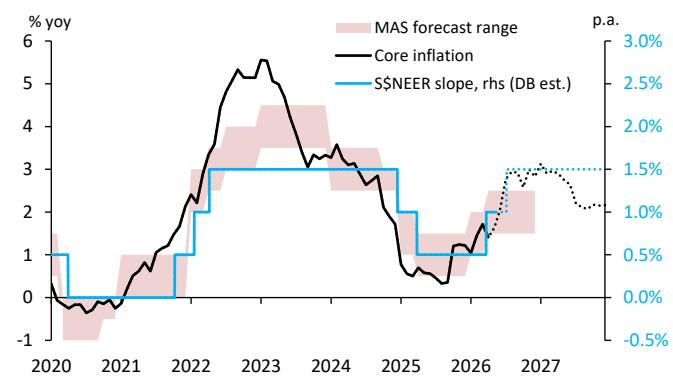

line chart

| Year | MAS forecast range (min) | MAS forecast range (max) | Core inflation | Core inflation (P.A.) | S$NEER slope, rhs (DB est.) |
|------|--------------------------|--------------------------|----------------|------------------------|-----------------------------|
| 2020 | -1.0                     | 1.0                      | 0.0            | 0.0                    | 1.0                         |
| 2021 | -0.5                     | 1.5                      | 0.5            | 0.5                    | 1.5                         |
| 2022 | 0.0                      | 3.0                      | 2.0            | 1.5                    | 2.0                         |
| 2023 | 0.5                      | 4.5                      | 5.5            | 2.5                    | 3.0                         |
| 2024 | 1.0                      | 4.0                      | 3.5            | 2.0                    | 3.0                         |
| 2025 | 0.5                      | 3.5                      | 1.0            | 1.5                    | 3.0                         |
| 2026 | 1.0                      | 3.0                      | 1.5            | 1.5                    | 3.0                         |
| 2027 | 1.5                      | 3.5                      | 1.5            | 1.5                    | 3.0                         |

Source : DB, Haver Analytics

Figure 43: ...despite the downside surprise in April inflation...  
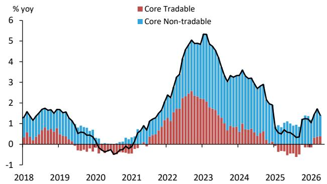

stacked bar chart

| Year | Core Tradable | Core Non-tradable |
|------|---------------|-------------------|
| 2018 | 0.5           | 1.5               |
| 2019 | 0.3           | 1.7               |
| 2020 | -0.2          | 0.8               |
| 2021 | -0.1          | 0.5               |
| 2022 | 1.0           | 2.5               |
| 2023 | 2.5           | 5.5               |
| 2024 | 0.8           | 3.5               |
| 2025 | -0.5          | 1.0               |
| 2026 | 0.3           | 1.5               |

Source : DB, Department of Statistics

Figure 44: ...as price pressures are expected to build in the months ahead...  
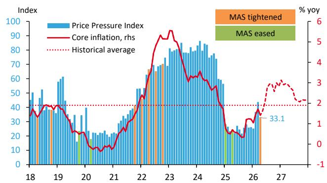

bar-line hybrid chart

| Year | Price Pressure Index | Core inflation, rhs | Historical average |
|------|----------------------|---------------------|--------------------|
| 2018 | ~40                  | ~35                 | ~2.0               |
| 2019 | ~60                  | ~40                 | ~2.0               |
| 2020 | ~20                  | ~10                 | ~2.0               |
| 2021 | ~30                  | ~15                 | ~2.0               |
| 2022 | ~50                  | ~40                 | ~2.0               |
| 2023 | ~80                  | ~90                 | ~2.0               |
| 2024 | ~85                  | ~70                 | ~2.0               |
| 2025 | ~60                  | ~30                 | ~2.0               |
| 2026 | ~40                  | ~15                 | ~2.0               |
| 2027 | 33.1                 | ~3.5                | ~2.0               |

Source : DB, Department of Statistics

Figure 45: ...following price surges along earlier parts of the supply chain.  
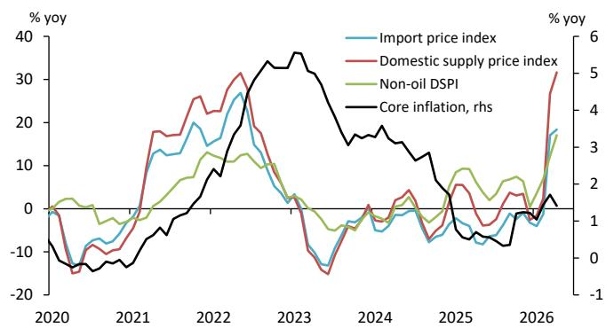

line chart

| Year | Import price index | Domestic supply price index | Non-oil DSPI | Core inflation, rhs |
|------|---------------------|------------------------------|--------------|---------------------|
| 2020 | -5                  | -15                          | 0            | -10                 |
| 2021 | 10                  | 15                           | 5            | -5                  |
| 2022 | 25                  | 30                           | 10           | 5                   |
| 2023 | 10                  | 5                            | 5            | 35                  |
| 2024 | -5                  | -5                           | 0            | 15                  |
| 2025 | -10                 | -5                           | 5            | 5                   |
| 2026 | 15                  | 30                           | 10           | 0                   |

Source : DB, Haver Analytics

## South Korea

■ Stronger nominal growth, higher inflation, and a weaker won all point to more aggressive policy tightening, although market volatility calls for caution.

Juliana Lee

## Calling for more aggressive rate hike

As we warned, alongside an upward revision to its forecasts, the BoK adopted a hawkish stance, assessing that “the domestic economy has grown significantly... to continue its improvement trend, supported by a strong semiconductor sector and the supplementary budget...inflationary pressure has increased...and financial stability risks have still remained.” Its May decision supports our prevailing forecast of a 25bp rate hike in July. We see further rate hikes in October, January, and April, with the policy rate rising to 3.5% by Q2 2027. While the BoK’s dot plot points to at least one, if not two, MPB members supporting rate hikes to as high as 3.25% by year-end, it points to 3.0% as the most likely outcome. That said, with CPI inflation rising to 3.1% in May and likely to move into the high-3% range over the summer months, more aggressive rate hikes may be warranted to keep inflation expectations anchored. South Korea’s breakeven inflation rate has now risen to 2.97% and is likely to move higher still, with a weaker won adding further inflationary pressure. Moreover, risks to rates have tilted to the upside amid upward pressure on US rates. Consistent with the Taylor Rule model, unexpected Fed rate hikes would prompt more aggressive tightening by the BoK, although market dislocation could lead the BoK to move more cautiously. In short, the range of possible outcomes for the central bank has widened in terms of both the degree and pace of rate hikes, while the Korean won’s weakness has also promoted the authorities to tighten regulatory oversight, with a focus on improving the NDF transparency.

Figure 46:BoK Dot plot  
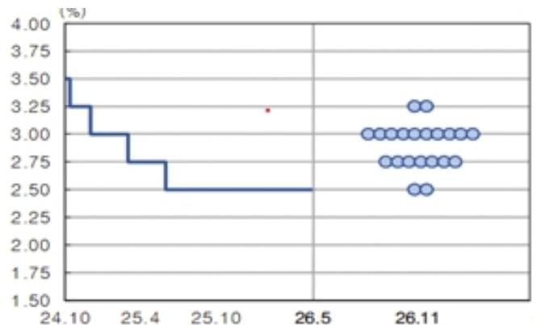

line chart

| X-Axis | Y-Axis (%) |
| --- | --- |
| 24.10 | 3.50 |
| 25.4 | 3.00 |
| 25.10 | 2.75 |
| 26.5 | 2.50 |
| 26.11 | 3.00 |
| 26.11 | 3.25 |
| 26.11 | 3.50 |
| 26.11 | 3.75 |
| 26.11 | 4.00 |

Source : BoK, DB

Figure 47: Our Taylor Rule says  
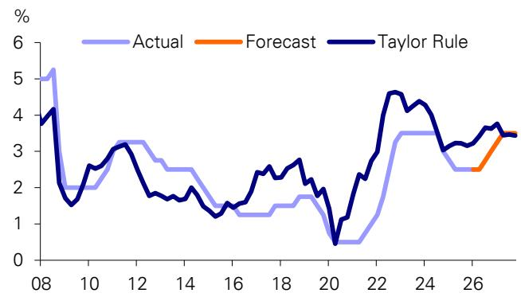

line chart

| Year | Actual | Forecast | Taylor Rule |
|------|--------|----------|-------------|
| 08   | 5.0    | -        | 4.0         |
| 10   | 2.0    | -        | 1.5         |
| 12   | 3.0    | -        | 3.0         |
| 14   | 2.5    | -        | 2.0         |
| 16   | 1.5    | -        | 1.5         |
| 18   | 1.5    | -        | 2.5         |
| 20   | 0.5    | -        | 0.5         |
| 22   | 3.5    | -        | 4.5         |
| 24   | 3.5    | -        | 4.0         |
| 26   | 2.5    | 2.5      | 3.5         |
| 28   | 3.5    | 3.5      | 3.5         |

Source : CEIC, DB

South Korea's nominal GDP growth may accelerate to $11\%$ this year, from $4.1\%$ in 2025, reflecting a rebound in real GDP growth to $2.9\%$ from $1.0\%$ , alongside higher inflation, a weaker won, and improved terms of trade, with higher semiconductor prices more than offsetting higher oil prices. If our forecast is correct, this would mark Korea's fastest nominal growth since 1996.

CPI inflation is likely to rise to 2.9% in 2026, from 2.1% in 2025, and to remain elevated at 2.7% in 2027, as growth stays above trend at 2.9% in 2026 and 2.3% in 2027. This would be higher and more persistent than the Bank of Korea's outlook of 2.7% and 2.3% for inflation in 2026 and 2027, respectively, and 2.6% and 2.1% for growth over the same period. Near-term risks are tilted to the upside, given the potential for severe weather associated with El Niño this year, alongside additional inflationary pressure from a weaker-than-expected Korean won.

After showing earlier signs of easing, Gangnam housing inflation has recently turned higher again, while the KOSPI (in the 7600s at the time of writing) remains well above the 5000 target referenced earlier by the president. Higher asset inflation points to continued improvement in household financial balance sheets at the aggregate level, although distribution remains an issue. This has, in turn, spurred stronger demand at department stores (up $21.7\%$ in April), led by luxury goods (up $38.1\%$ ), which are likely to see a further lift from income growth. As we noted earlier, large performance bonuses by the world's top memory chipmakers have also spurred workers in other sectors, including IT and autos, suggesting a broader rise in income growth ahead. This would support stronger domestic demand and more persistent inflation.

As noted in our earlier report, payouts (excluding deferred compensation and tax payments) from the two semiconductor companies could amount to as much as 0.7% of GDP. While smaller than the supplementary budget, they would still exceed the government's cash (and equivalent) handout to households in the lower 70% income bracket, which we estimate at around 0.4% of GDP. A sustained rise in payroll growth, together with the government's direct fiscal support, is likely to cushion the impact of higher oil prices and sustain the recovery in private consumption growth, which we expect to nearly double to around the mid-2% range this year and remain above 2% in 2027, resulting in stronger demand-pull inflationary pressure.

Beyond elevated oil prices and the recovery in domestic demand, stronger tourism will also add to inflationary pressure. The number of tourists rose by more than 18.2% through April, well above departure growth of 6.7%, with the gap narrowing to its lowest level since the Covid-19 period as the Korean won reached 1500 against the US dollar. That said, imported car sales surged by 41.3% in the first four months of the year, with Tesla accounting for more than three-quarters of the increase and German cars contributing around one-tenth. Despite higher inflation, consumer sentiment rebounded to 106.1 in May, from 99.2 in April.

Exports rose by 50.6% in April/May, up from 37.8% in April, while import growth accelerated to 18.7% from 10.7% over the same period, resulting in a wider monthly goods trade surplus of USD28.4bn, up from USD17.1bn. Amid stronger exports, machinery investment grew at a faster pace of 10.2% in April, versus 4.9% in Q1, while transportation investment slowed to 3.2% from 18.4% over the same period. A combination of stronger domestic demand and exports points to sustained above-trend growth through next year, resulting in a wider positive output gap after it turns positive this year.

Figure 48: Falling Gangnam Housing  
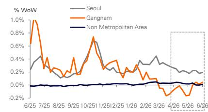

line chart

| Date   | Seoul | Gangnam | Non Metropolitan Area |
|--------|-------|---------|----------------------|
| 6/25   | 0.3%  | 1.0%    | 0.0%                 |
| 7/25   | 0.2%  | 0.8%    | 0.0%                 |
| 8/25   | 0.1%  | 0.4%    | 0.0%                 |
| 9/25   | 0.2%  | 0.6%    | 0.0%                 |
| 10/25  | 0.3%  | 0.8%    | 0.0%                 |
| 11/25  | 0.4%  | 0.6%    | 0.0%                 |
| 12/25  | 0.3%  | 0.4%    | 0.0%                 |
| 1/26   | 0.4%  | 0.3%    | 0.0%                 |
| 2/26   | 0.5%  | 0.2%    | 0.0%                 |
| 3/26   | 0.4%  | 0.1%    | 0.0%                 |
| 4/26   | 0.3%  | -0.1%   | 0.0%                 |
| 5/26   | 0.2%  | -0.2%   | 0.0%                 |
| 6/26   | 0.1%  | -0.1%   | 0.0%                 |

Source : CEIC, DB

Figure 49: Tourism surge  
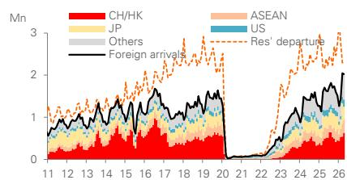

line chart

| Year | CH/HK | JP | Others | Foreign arrivals | ASEAN | US | Res' departure |
|------|-------|----|--------|------------------|-------|----|----------------|
| 11   | 0.5   | 0.3| 0.2    | 0.4              | 0.6   | 0.7| 0.8            |
| 12   | 0.6   | 0.4| 0.3    | 0.5              | 0.7   | 0.8| 0.9            |
| 13   | 0.7   | 0.5| 0.4    | 0.6              | 0.8   | 0.9| 1.0            |
| 14   | 0.8   | 0.6| 0.5    | 0.7              | 0.9   | 1.0| 1.1            |
| 15   | 0.9   | 0.7| 0.6    | 0.8              | 1.0   | 1.1| 1.2            |
| 16   | 1.0   | 0.8| 0.7    | 0.9              | 1.1   | 1.2| 1.3            |
| 17   | 1.1   | 0.9| 0.8    | 1.0              | 1.2   | 1.3| 1.4            |
| 18   | 1.2   | 1.0| 0.9    | 1.1              | 1.3   | 1.4| 1.5            |
| 19   | 1.3   | 1.1| 1.0    | 1.2              | 1.4   | 1.5| 1.6            |
| 20   | 0.0   | 0.0| 0.0    | 0.0              | 0.0   | 0.0| 0.0            |
| 21   | 0.1   | 0.1| 0.1    | 0.2              | 0.3   | 0.4| 0.5            |
| 22   | 0.2   | 0.2| 0.2    | 0.3              | 0.4   | 0.5| 0.6            |
| 23   | 0.3   | 0.3| 0.3    | 0.4              | 0.5   | 0.6| 0.7            |
| 24   | 0.4   | 0.4| 0.4    | 0.5              | 0.6   | 0.7| 0.8            |
| 25   | 0.5   | 0.5| 0.5    | 0.6              | 0.7   | 0.8| 0.9            |
| 26   | 0.6   | 0.6| 0.6    | 0.7              | 0.8   | 0.9| 1.0            |

Source : CEIC, DB

Figure 50: Exports  
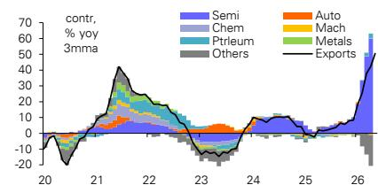

line chart

| Year | Semi | Chem | Ptroleum | Others | Auto | Mach | Metals | Exports |
|------|------|------|----------|--------|------|------|--------|---------|
| 20   | -10  | -5   | -8       | -12    | -3   | -4   | -6     | -15     |
| 21   | 10   | 5    | 8        | 12     | 3    | 4    | 6      | 40      |
| 22   | 5    | 3    | 6        | 8      | 2    | 3    | 5      | 20      |
| 23   | 0    | -2   | -5       | -8     | -1   | -2   | -3     | -10     |
| 24   | 5    | 0    | 3        | 6      | 1    | 2    | 4      | 10      |
| 25   | 10   | 5    | 8        | 12     | 3    | 4    | 6      | 20      |
| 26   | 60   | 50   | 55       | 50     | 40   | 35   | 45     | 60      |

Source : CEIC, DB

## Sri Lanka

CBSL delivered a 100bps rate hike in May, against market expectations; another 50bps rate hike possible in 2026, in response to higher inflation and pressure on its currency, which we expect to reach 335 against the US dollar at end-26 and 346 at end-27.  
Data remained mixed in April. Momentum in workers' remittances continued, while tourist arrivals and earnings fell for the second consecutive month in April. The terms of trade deteriorated by 6.4%yoy in April, while PMI for Construction Industry, contracted on a month-on-month basis.  
On 27 May, the IMF Executive Board completed the Fifth and Sixth Reviews of the EFF, providing Sri Lanka with immediate access to USD 695 mn.

Kaushik Das

## Preemptive rate hikes for price and external sector stability

Noting that “headline inflation is likely to remain above the target of 5% in the period ahead”, CBSL hiked its policy rate by 100bps to 8.75% at the 25 May meeting, versus our more back-loaded forecast of 100bps cumulative rate hike. Given the downside risks to growth and the fragile state of the economy, we didn’t expect the Sri Lankan authorities to hike interest rates aggressively on a front-loaded basis, but in our view, this decision was driven not just based on inflation considerations, but also with the objective of stabilizing the rupee which had depreciated sharply from 319.50 in end-April to 341.50 by 21 May. Indeed, our last report published on 14th May (see, “Sri Lanka: More rupee depreciation in store”) built in expectations of further weakening of the rupee, but the pace of depreciation turned out to be sharper than expected, possibly leading to the 100bps rate hike decision on 25th May. Currently LKR is trading around 335 vs. the USD.

The CBSL provided the following rationale for rate hikes: "In view of the elevated inflation forecast, the potential second-round effects on headline inflation from energy price adjustments, continued expansion in private sector credit fueling import demand, pressures on the external sector, as well as the risk of de-anchoring inflation expectations, the Board was of the view that a tightening of the monetary policy stance is appropriate at this juncture." Both core and headline inflation rose from April, by 0.1 percentage points to $3.9\%$ YoY and $5.5\%$ in May, respectively. The latter averaged $5.4\%$ in Jan-May, well on its way to reach $5.7\%$ in 2026, as per our forecast.

We expect another 50bps rate hike in Oct-Dec'26 quarter, leaving the policy rate at 9.25%, to maintain a positive real rate of 350bps, assuming an average inflation of 5.7% in 2026, then reverse its course and ease by 50bps by mid-2027, leaving guiding the policy rate down to 8.75%. Although an alternative scenario could see the CBSL keeping its policy rates steady for a prolonged period, upside risks to inflation from higher energy prices and El Nino impact on food prices suggest further rate hikes are likely in Oct-Dec'26.

CBSL struck an optimistic tone on growth: "While the recent increase in inflation is largely supply-driven, demand conditions in the economy have also strengthened, as shown by the continued credit expansion, credit-driven imports, and leading indicators of economic activity." Economic data remained mixed in April. Latest data show Sri Lanka's remittances rose $18.9\%$ yoy to USD 767.9 mn in April 2026, while on a cumulative basis, workers' remittances during the first four months of the year recorded a 24.5%yoy growth to USD 3.063 bn. However, tourist arrivals declined for the second consecutive month in April 2026 to 135,643, recording a contraction of -22.3%yoy, owing to the impact of Middle East conflict. Tourist earnings were estimated at USD 157 mn in April 2026, reflecting a decline of 38.8%yoy, with the cumulative earnings during first four months of 2026 declined by 19.4% amounting to USD 1.11 bn compared to the corresponding period of the previous year. The terms of trade deteriorated by 6.4%yoy to 73.8 index points in April 2026, as the increase in import prices exceeded the increase in the export prices. In April 2026, PMI for Construction Industry contracted on a month-on-month basis.

Faced with external sector pressure and sharp rupee depreciation, Sri Lankan authorities implemented a temporary surcharge of 50% on customs import duty for new personal vehicles, effective from May 16 for a duration of three months. As we have mentioned before, we expect Sri Lanka's 2026 real GDP growth to moderate to 3.5%yoy, from 5.0%yoy in 2025, due to higher oil prices and the impact of Cyclone Ditwah. The combined impact will slow private consumption (despite planned fiscal relief measures and various other financial assistance) and investments.

Official reserve assets stood at USD 6.76 bn in April (down from USD 7.02 bn in March), including gold holdings worth USD 219 mn and Special Drawing Rights amounting to USD 32 mn. Sri Lanka's foreign currency reserves fell by USD 295 mn in April, due to higher oil import costs and slowing inflows from exports and tourism as the Iran war disrupted global trade and energy markets. CBSL data showed foreign currency reserves declined to USD 6.50 bn at end-April from USD 6.80 bn in March. Sri Lankan rupee has depreciated about $7.5\%$ vs. the USD from the end of 2025. Given that the war is lingering on and the heightened external risks, we already revised our end-2026 target for LKR to 335 vs. the USD and expect it to weaken further to 345 by end-2027.

On 27 May, the IMF Executive Board completed the Fifth and Sixth Reviews of the EFF for Sri Lanka, providing the country with immediate access to USD 695 mn to support economic policies and reforms. The IMF forecasted Sri Lanka's 2026 real GDP growth and CPI inflation at 3.0% and 5.0% respectively (DB forecast: 3.5%yoy and 5.7%yoy), stating: "Monetary policy should continue prioritizing price stability. Greater exchange rate flexibility and gradually phasing out the balance-of-payments measures remain critical to rebuild external buffers and resilience." The IMF also noted that "Fiscal easing in 2026 is appropriate in response to the shocks, and the government is implementing a temporary relief package, while also allocating additional spending to support recovery and reconstruction following Cyclone Ditwah. From 2027 onward, the authorities are appropriately committed to reverting to the primary balance target of 2.3 percent of GDP, as well as complying with the primary expenditure ceiling."

The combined impact of the rise in expenditure and fall in revenue collection will likely push the fiscal deficit to around 7.0% of GDP vs. initial budget estimate of 5.1% of GDP for 2026. Even in 2027, we would expect capital expenditure to remain on the higher side, which will result in a higher fiscal deficit of 6.0% of GDP.

## Taiwan

We revise up Taiwan 2026 GDP forecast to 10.0% from 9.0%. Exports and investment are expected to further benefit from advancements in AI hardware and potential easing of high-end chip restrictions between the US and China. Meanwhile, household income growth and a possible cash handout policy we expect will bolster consumption.  
Our CPI forecast has also been raised by 0.2 percentage points to 2.2%, primarily due to three factors: elevated oil prices, a more optimistic consumption outlook, and the potential impact of El Niño.  
We expect the CBC to keep policy rate unchanged at 2.0%, while recognizing risk of hiking if inflation turned out higher. We maintain our forecast of NTD's appreciation to 30.5 against the US dollar by year-end, further strengthening to 29.5 next year.

Yi Xiong

Deyun Ou

## Stronger growth and higher inflation outlook

Taiwan's export outlook further improves. Although April's export growth slowed from Q1's 50% YoY to 40%, we believe the momentum will remain strong throughout the year. On the one hand, AI applications may extend from software to hardware. The latest financial reports from international PC giants significantly exceeded market expectations, and Jensen Huang recently announced the unveiling of Windows computers powered by NVIDIA chips, indicating an accelerated development of AIPC in the future. On the other hand, following the meeting between the US and China, substantive results are expected in the future, with the potential for easing high-end chips trade being one of them, which will also benefit Taiwan's exports. Therefore, we are raising our full-year export forecast from 26% to 35%, and correspondingly, adjusting investment from 4.5% to 6.0%.

Although crude oil and natural gas inventories decreased in April and May, they are not yet significantly lower than the lows of previous years. Coupled with the government's efforts to obtain energy from other regions, we currently expect the impact of energy on export production to be limited.

Consumption also has the potential for further growth. Residents' income accelerated to 2.6% YoY in April from 2.4% YoY due to strong economy and a thriving stock market. Meanwhile, several legislators proposed in early May to distribute NT\$10,000 to all citizens due to inflation caused by the Middle East conflict. This proposal successfully passed its first reading on May 8, 2026, and is currently in the committee review and questioning stage. If this policy is implemented, it will have a positive impact on Taiwan's consumption. Therefore, we are also raising our consumption growth rate from 2.5% to 4.0%.

We raise Taiwan's GDP 2026 growth forecast from 9.0% to 10.0%. Taiwan's Directorate General of Budget, Accounting and Statistics (DGBAS) also raised its full-year economic growth rate forecast to 9.64% at the end of May, a 16-year high, an increase of 1.93ppts compared to its previous estimate. Our export forecast is lower than DGBAS (35% vs 39%), while our investment and consumption forecasts are higher (6.0% vs 5.8% and 4.0% vs 3.8%).

For inflation, we raised our CPI forecast by 0.2ppt to 2.2%. Three factors have driven this upward revision: Firstly, international oil prices remain high, and the conflict in the Middle East is still unclear. Although domestic diesel prices in Taiwan have not been raised for two consecutive months, oil prices are still being passed on to other consumption. Secondly, there is a better consumption outlook. Thirdly, El Niño will likely impact Taiwan's food and electricity prices, as shown in the 2015-16 case.

We expect the CBC to keep policy rate unchanged at 2.0%, given strong economic performance and broadly moderate inflation. However, we recognize risks: should inflation move above 2% more rapidly and exhibit persistent upward momentum, the CBC may consider a rate hike at either its September or December meeting. On the FX side, we are maintaining our exchange rate forecast unchanged, with the currency appreciating to 30.5 against the US dollar by year-end, and further appreciating to 29.5 next year. The depreciation of the NTD in March was partly due to lifers unwinding hedges because of new accounting standards. We expect this impact to gradually diminish; coupled with strong exports ahead, we anticipate a steady appreciation of the NTD throughout the second half.

Figure 51: Taiwan's export outlook further improves  
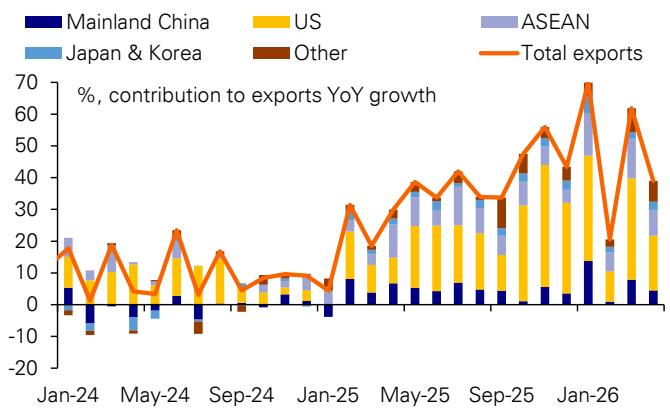

stacked bar chart

| Month | Mainland China (%) | US (%) | ASEAN (%) | Japan & Korea (%) | Other (%) | Total exports (%) |
| --- | --- | --- | --- | --- | --- | --- |
| Jan-24 | 5 | 10 | 20 | 10 | -5 | 15 |
| Feb-24 | -5 | 5 | 10 | 5 | -10 | 10 |
| Mar-24 | -5 | 10 | 5 | 0 | -5 | 5 |
| Apr-24 | 0 | 10 | 5 | 0 | -5 | 10 |
| May-24 | 0 | 10 | 5 | 0 | -5 | 10 |
| Jun-24 | -5 | 5 | 5 | 0 | -10 | 10 |
| Jul-24 | -5 | 10 | 5 | 0 | -5 | 10 |
| Aug-24 | 0 | 10 | 5 | 0 | -5 | 10 |
| Sep-24 | 0 | 5 | 5 | 0 | -5 | 10 |
| Oct-24 | 0 | 5 | 5 | 0 | -5 | 10 |
| Nov-24 | 0 | 5 | 5 | 0 | -5 | 10 |
| Dec-24 | 0 | 5 | 5 | 0 | -5 | 10 |
| Jan-25 | -5 | 5 | 5 | 0 | -5 | 10 |
| Feb-25 | 0 | 10 | 10 | 5 | -5 | 30 |
| Mar-25 | 0 | 10 | 10 | 5 | -5 | 30 |
| Apr-25 | 0 | 10 | 10 | 5 | -5 | 30 |
| May-25 | 0 | 10 | 10 | 5 | -5 | 30 |
| Jun-25 | 0 | 10 | 10 | 5 | -5 | 30 |
| Jul-25 | 0 | 10 | 10 | 5 | -5 | 30 |
| Aug-25 | 0 | 10 | 10 | 5 | -5 | 30 |
| Sep-25 | 0 | 10 | 10 | 5 | -5 | 30 |
| Oct-25 | 0 | 10 | 10 | 5 | -5 | 30 |
| Nov-25 | 0 | 10 | 10 | 5 | -5 | 30 |
| Dec-25 | 0 | 10 | 10 | 5 | -5 | 30 |
| Jan-26 | -5 | 10 | 10 | 5 | -5 | 70 |

Source : DB, Haver Analytics

Figure 52: Crude oil and natural gas inventories decreased, while they are not yet significantly lower than the lows of previous years  
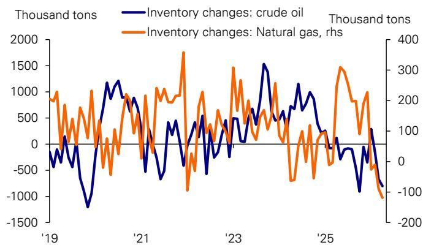

line chart

| Year | Inventory changes: crude oil (thousand tons) | Inventory changes: Natural gas, rhs (thousand tons) |
|------|-----------------------------------------------|--------------------------------------------------|
| '19  | ~-500                                         | ~100                                             |
| '21  | ~100                                          | ~300                                             |
| '23  | ~-500                                         | ~150                                             |
| '25  | ~-1000                                        | ~-100                                            |

Source : DB, Haver Analytics

Figure 53: Food and electricity prices are likely to be affected by the El Niño  
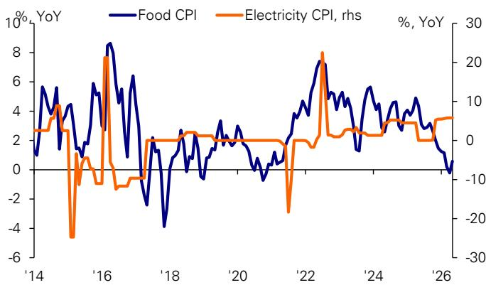

line chart

| Year | Food CPI | Electricity CPI, rhs |
|------|----------|----------------------|
| '14  | ~5       | ~3                   |
| '15  | ~8       | ~-4                  |
| '16  | ~9       | ~7                   |
| '17  | ~6       | ~-1                  |
| '18  | ~2       | ~2                   |
| '19  | ~3       | ~2                   |
| '20  | ~2       | ~2                   |
| '21  | ~1       | ~2                   |
| '22  | ~8       | ~8                   |
| '23  | ~5       | ~2                   |
| '24  | ~4       | ~3                   |
| '25  | ~3       | ~3                   |
| '26  | ~0       | ~3                   |

Source : DB, Haver Analytics

Figure 54: We expect NTD to steadily appreciate in the second half  
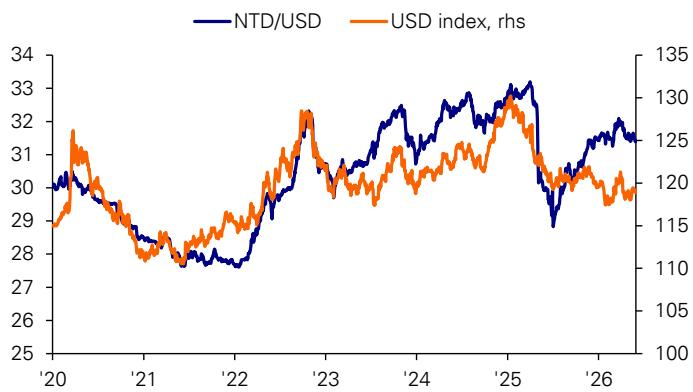

line chart

| Year | NTD/USD | USD index, rhs |
|------|---------|----------------|
| '20  | 30.0    | 29.0           |
| '21  | 28.5    | 28.0           |
| '22  | 27.5    | 28.5           |
| '23  | 32.0    | 31.5           |
| '24  | 32.5    | 31.0           |
| '25  | 33.0    | 32.5           |
| '26  | 31.5    | 30.0           |

Source : DB, Haver Analytics

## Thailand

Thailand's growth weakened sharply in April, but a rebound is likely as public spending, fiscal support, and trade dynamics improve. With inflation still driven mainly by fuel and food rather than broad-based demand pressure, the BoT is likely to stay on hold, with modest tightening likely in 2H 2027.

Juliana Lee

## No rate hikes in 2026 but in 2H 2027 possible

Earlier, Thailand reported a stronger than expected GDP growth of 2.8% YoY (0.7% QoQ SA) in Q1, from 2.5% in Q4 in Q4. While restocking contributed significantly to this upside surprise, adding 3.8% percentage points to the headline growth, the positive outturn was also driven by stronger export and investment growth, consistent with our view set out in Asia Macro Insight: Trade and Investment Resilience.

Figure 55: GDP by demand  
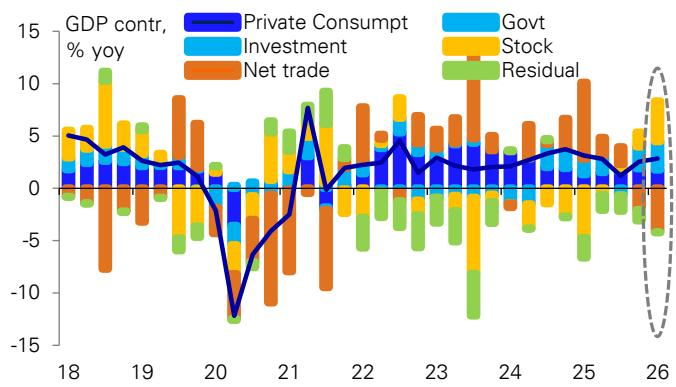

bar-line hybrid chart

GDP contr, % yoy
| Year | Private Consumpt (%) | Investment (%) | Net trade (%) | Govt (%) | Stock (%) | Residual (%) |
|---|---|---|---|---|---|---|
| 18 | 4.5 | 1.5 | 3.0 | 1.0 | 4.0 | -1.0 |
| 19 | 3.5 | 1.0 | 3.5 | 1.5 | 4.5 | -1.5 |
| 20 | -12.0 | -1.0 | -1.5 | -0.5 | -1.0 | -2.0 |
| 21 | 7.5 | 0.5 | 2.0 | 1.0 | 3.0 | 6.0 |
| 22 | 1.0 | 0.5 | 3.0 | 1.5 | 3.5 | -1.0 |
| 23 | 3.0 | 1.0 | 2.5 | 1.0 | 3.0 | -1.5 |
| 24 | 2.5 | 1.5 | 2.0 | 1.5 | 3.5 | -1.0 |
| 25 | 3.0 | 1.0 | 3.5 | 1.0 | 4.0 | -1.5 |
| 26 | 2.5 | 1.5 | 3.0 | 1.5 | 4.5 | -2.0 |

Source : CEIC, DB

Figure 56: GDP fell sharply in April  
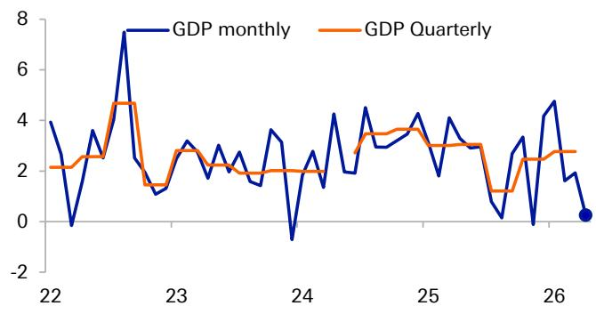

line chart

| Year | GDP monthly | GDP Quarterly |
|------|-------------|---------------|
| 22   | 4           | 2             |
| 23   | 7           | 4             |
| 24   | -1          | 2             |
| 25   | 4           | 3             |
| 26   | 0           | 2             |

Source : CEIC, DB

Investment growth accelerated to 9.9% YoY in Q1, contributing 2.3 percentage points to headline GDP growth, while export growth more than doubled to 12.6%, adding 9.3 percentage points. However, stronger import growth of 21.1% resulted in a weaker net trade contribution of -4.2 percentage points in Q1. Although surging imports resulted in a goods trade deficit, this reflected not only export strength, led by electronics, but also robust domestic investment. Reflecting the latter, capital goods imports surged 36% in Q1, accounting for more than a quarter of nominal goods import growth, while electronics accounted for about half of goods export growth in the first quarter. FDI interest, led by the digital sector, remained very strong, with applications up 273% YoY in Q1, although the approved amount was down about 40% in Q1, which may be attributed to a backlog of projects to be implemented after approvals surged by an annual average of 60% over the last three years. Consumption growth eased to 3.2%, with its contribution narrowing only slightly to 1.8 percentage points.

After the strong growth in Q1, high frequency data point to a sharp fall in GDP growth to 0.3% in April. Private consumption growth fell to 0.8% in April, from 5.1% in Q1, with the BoT attributing consumption weakness to front-loaded purchases and adjustments in working and travel patterns, amid oil shock, while it attributed a slowdown in private investment growth from 14.6% in Q1 to 8.7% in April, to previous strength. On the other hand, data pointed to stronger public demand, with current and capital expenditure rising by 12.6% in April, vs. 3.1% growth in Q1.

Figure 57: Growth drivers  
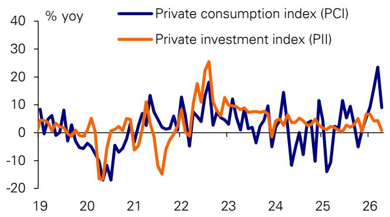

line chart

| Year | Private consumption index (PCI) | Private investment index (PII) |
|------|----------------------------------|---------------------------------|
| 19   | ~5                               | ~5                              |
| 20   | ~-10                             | ~-15                            |
| 21   | ~10                              | ~5                              |
| 22   | ~15                              | ~10                             |
| 23   | ~5                               | ~25                             |
| 24   | ~10                              | ~5                              |
| 25   | ~-10                             | ~0                              |
| 26   | ~25                              | ~5                              |

Source : CEIC, DB

Figure 58: Tourism  
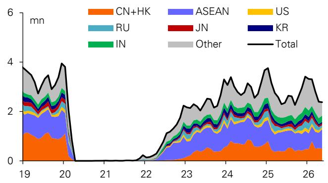

stacked bar chart

| Year | CN+HK | ASEAN | US | RU | JN | KR | IN | Other | Total |
|------|-------|-------|----|----|----|----|----|-------|-------|
| 19   | 1.0   | 1.0   | 0.1| 0.1| 0.1| 0.1| 0.1| 1.0   | 4.0   |
| 20   | 1.0   | 1.0   | 0.1| 0.1| 0.1| 0.1| 0.1| 1.0   | 4.0   |
| 21   | 0.0   | 0.0   | 0.0| 0.0| 0.0| 0.0| 0.0| 0.0   | 0.0   |
| 22   | 0.0   | 0.0   | 0.0| 0.0| 0.0| 0.0| 0.0| 0.0   | 0.0   |
| 23   | 0.5   | 0.5   | 0.1| 0.1| 0.1| 0.1| 0.1| 1.0   | 2.5   |
| 24   | 1.0   | 1.0   | 0.1| 0.1| 0.1| 0.1| 0.1| 1.5   | 3.5   |
| 25   | 1.5   | 1.5   | 0.1| 0.1| 0.1| 0.1| 0.1| 2.0   | 4.5   |
| 26   | 1.5   | 1.5   | 0.1| 0.1| 0.1| 0.1| 0.1| 2.5   | 3.5   |

Source : CEIC, DB

While goods exports surged 23.1% in April vs. 17.7% in Q1, it was outpaced by an acceleration in import growth to 45% from 32.3%, leaving a sharply higher net trade deficit of USD10bn in April vs. a monthly deficit of USD3.2bn in Q1, pointing to a net trade drag on growth in April. While fuel imports added 16.5 percentage points to the headline import growth surge in April, raw materials and intermediate goods imports also added 17.1 percentage points while capital goods added 8.9 percentage points, pointing to a positive turn in net trade and investment in Q3 onwards. On the other hand, foreign visitor arrivals contracted by 1.7% in April/May, despite low base effects of Q2 2025, when arrivals contracted 12.3%, with those from Europe leading the way in this decline, dragging growth by 2.1 percentage points, more than countering Asia's positive 0.9 percentage points contribution. The number of monthly arrivals fell 24% (nsa) during the two months of Q2 from that in Q1, as the number of European visitors fell 55%. To this point, the BoT attributed the tourism weakness to "reduced flight services by several airlines amid higher fuel costs." That said, data also suggest that tourism may be troughing. Hence, despite the likely slowdown in GDP growth in Q2, we see stronger public spending, fiscal support (Thais Help Thais Plus) and a positive turn in trade balance to see Thailand's annual GDP growth at 2% in 2026.

Headline inflation rose to 2.8% in April/May, from -0.5% in Q1, led by higher fuel prices, with raw food prices also adding to this pressure, while core inflation rose to 0.9% from 0.6% in the same period, due to “the pass-through of higher energy costs to prepared food prices and public transport fare.” That said, the BoT struck a relatively neutral tone, noting that it has not observed a broad-based rise in inflation, partly due to intense price competition and subdued purchasing power.

This in turn reinforce our view that the Bank of Thailand is likely to keep its policy rate stable at 1% in the foreseeable future. Beyond this year, however, we see the BoT resorting to a modest rate hikes in 2H 2027, with a faster rate hikes possible if the Fed opts to hike, although that is not our baseline at the moment, or if the baht unexpectedly weakens sharply, as the government's efforts to de-link the gold trading with baht demand.

Figure 59: Fuel price hikes  
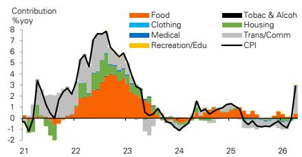

line chart

| Year | Food | Clothing | Housing | Medical | Trans/Comm | Recreation/Edu | CPI |
|------|------|----------|---------|---------|------------|----------------|-----|
| 21   | -0.5 | -0.3     | -0.8    | -0.2    | -0.1       | -0.4           | -0.6 |
| 22   | 0.8  | 0.6      | 0.9     | 0.7     | 0.5        | 0.3            | 0.4 |
| 23   | 3.2  | 2.8      | 3.5     | 3.0     | 2.5        | 2.0            | 2.2 |
| 24   | -0.2 | -0.1     | -0.5    | -0.3    | -0.2       | -0.1           | -0.3 |
| 25   | 0.5  | 0.3      | 0.7     | 0.4     | 0.2        | 0.1            | 0.2 |
| 26   | 0.3  | 0.2      | 0.4     | 0.2     | 0.1        | 0.0            | 0.1 |
| 27   | 0.1  | 0.0      | 0.2     | 0.0     | -0.1       | -0.2           | -0.1 |
| 28   | -0.1 | -0.2     | -0.1    | -0.3    | -0.4       | -0.5           | -0.3 |
| 29   | -0.3 | -0.4     | -0.3    | -0.5    | -0.6       | -0.7           | -0.5 |
| 30   | -0.5 | -0.6     | -0.5    | -0.7    | -0.8       | -0.9           | -0.7 |
| 31   | -0.7 | -0.8     | -0.7    | -0.9    | -1.0       | -1.1           | -0.9 |
| 32   | -0.9 | -1.0     | -0.9    | -1.1    | -1.2       | -1.3           | -1.1 |
| 33   | -1.1 | -1.2     | -1.1    | -1.3    | -1.4       | -1.5           | -1.3 |
| 34   | -1.3 | -1.4     | -1.3    | -1.5    | -1.6       | -1.7           | -1.5 |
| 35   | -1.5 | -1.6     | -1.5    | -1.7    | -1.8       | -1.9           | -1.7 |
| 36   | -1.7 | -1.8     | -1.7    | -1.9    | -2.0       | -2.1           | -1.9 |
| 37   | -1.9 | -2.0     | -1.9    | -2.1    | -2.2       | -2.3           | -2.1 |
| 38   | -2.1 | -2.2     | -2.1    | -2.3    | -2.4       | -2.5           | -2.3 |
| 39   | -2.3 | -2.4     | -2.3    | -2.5    | -2.6       | -2.7           | -2.5 |
| 40   | -2.5 | -2.6     | -2.5    | -2.7    | -2.8       | -2.9           | -2.7 |
| 41   | -2.7 | -2.8     | -2.7    | -2.9    | -3.0       | -3.1           | -2.9 |
| 42   | -2.9 | -3.0     | -2.9    | -3.1    | -3.2       | -3.3           | -3.1 |
| 43   | -3.1 | -3.2     | -3.1    | -3.3    | -3.4       | -3.5           | -3.3 |
| 44   | -3.3 | -3.4     | -3.3    | -3.5    | -3.6       | -3.7           | -3.5 |
| 45   | -3.5 | -3.6     | -3.5    | -3.7    | -3.8       | -3.9           | -3.7 |
| 46   | -3.7 | -3.8     | -3.7    | -3.9    | -4.0       | -4.1           | -3.9 |
| 47   | -3.9 | -4.0     | -3.9    | -4.1    | -4.2       | -4.3           | -4.1 |
| 48   | -4.1 | -4.2     | -4.1    | -4.3    | -4.4       | -4.5           | -4.3 |
| 49   | -4.3 | -4.4     | -4.3    | -4.5    | -4.6       | -4.7           | -4.5 |
| 50   | -4.5 | -4.6     | -4.5    | -4.7    | -4.8       | -4.9           | -4.7 |
| 51   | -4.7 | -4.8     | -4.7    | -4.9    | -5.0       | -5.1           | -4.9 |
| 52   | -4.9 | -5.0     | -4.9    | -5.1    | -5.2       | -5.3           | -5.1 |
| 53   | -5.1 | -5.2     | -5.1    | -5.3    | -5.4       | -5.5           | -5.3 |
| 54   | -5.3 | -5.4     | -5.3    | -5.5    | -5.6       | -5.7           | -5.5 |
| 55   | -5.5 | -5.6     | -5.5    | -5.7    | -5.8       | -5.9           | -5.7 |
| 56   | -5.7 | -5.8     | -5.7    | -5.9    | -6.0       | -6.1           | -5.9 |
| 57   | -5.9 | -6.0     | -5.9    | -6.1    | -6.2       | -6.3           | -6.1 |
| 58   | -6.1 | -6.2     | -6.1    | -6.3    | -6.4       | -6.5           | -6.3 |
| 59   | -6.3 | -6.4     | -6.3    | -6.5    | -6.6       | -6.7           | -6.5 |
| 60   | -6.5 | -6.6     | -6.5    | -6.7    | -6.8       | -6.9           | -6.7 |
| 61   | -6.7 | -6.8     | -6.7    | -6.9    | -7.0       | -7.1           | -6.9 |
| 62   | -6.9 | -7.0     | -6.9    | -7.1    | -7.2       | -7.3           | -7.1 |
| 63   | -7.1 | -7.2     | -7.1    | -7.3    | -7.4       | -7.5           | -7.3 |
| 64   | -7.3 | -7.4     | -7.3    | -7.5    | -7.6       | -7.7           | -7.5 |
| 65   | -7.5 | -7.6     | -7.5    | -7.7    | -7.8       | -7.9           | -7.7 |
| 66   | -7.7                 | -7.8     | -7.7    | -7.9    | -8.0       | -8.1           | -7.9 |
| 67   | -7.9                 | -8.0     | -7.9    | -8.1    | -8.2       | -8.3           |-8.

Source : CEIC, DB

## Vietnam

Vietnam continues to attract strong foreign interest in manufacturing, but achieving its lofty growth ambitions will require easing infrastructure bottlenecks to attract and sustain capital inflows.

Juliana Lee

## Resilient but changes required to achieve its lofty goals

FDI investment (implemented) growth accelerated to 10.3% in April/May, from 9% in Q1, while registered FDI capital rose 28.6% in April/May vs. 39.7% in Q1. FDI registered capital stood at USD24.8billion ytd in May, vs. FDI implemented of USD9.8billion, reflected Vietnam's continued integration into the global supply chain, with exports remaining as a critical driver of growth.

Figure 60: FDI remains strong  
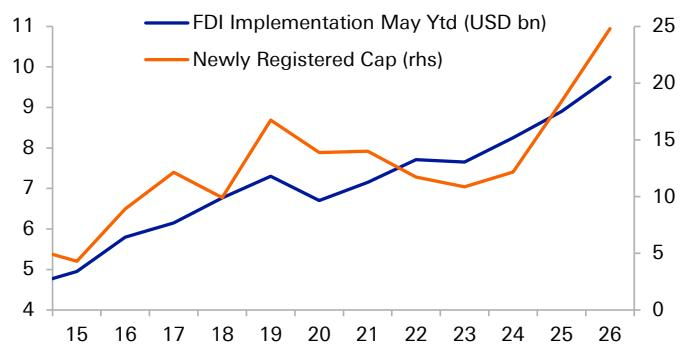

line chart

| Year | FDI Implementation May Ytd (USD bn) | Newly Registered Cap (rhs) |
|------|------------------------------------|-----------------------------|
| 15   | 4.8                                | 5                           |
| 16   | 5.8                                | 7                           |
| 17   | 6.2                                | 8                           |
| 18   | 6.8                                | 9                           |
| 19   | 7.3                                | 17                          |
| 20   | 6.7                                | 14                          |
| 21   | 7.2                                | 14                          |
| 22   | 7.7                                | 13                          |
| 23   | 7.6                                | 12                          |
| 24   | 8.0                                | 13                          |
| 25   | 8.5                                | 18                          |
| 26   | 9.8                                | 25                          |

Source : CEIC, DB

Figure 61: Strong imports drag on trade balance  
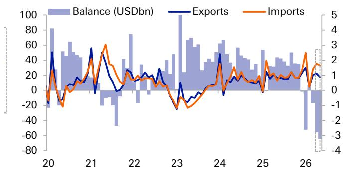

bar-line hybrid chart

| Year | Balance (USDbn) | Exports | Imports |
|------|-----------------|---------|---------|
| 20   | 80              | 50      | 3       |
| 21   | 60              | 60      | 4       |
| 22   | 70              | 20      | 1       |
| 23   | 100             | -20     | -1      |
| 24   | 60              | 40      | 2       |
| 25   | 50              | 20      | 1       |
| 26   | -60             | 20      | 3       |

Source : CEIC, DB

Exports remained robust, 20.1% YoY in April/May, vs. 18.6% in Q1, while industrial production growth stood robust at 9% in April/May unchanged from that in Q1. With imports growth outpacing – rising to 34.8% from 27.2% in the same period, left the trade deficit wider at -USD4.6bn in April/May vs. -USD1.2bn in Q1.

Figure 62: Exports by goods  
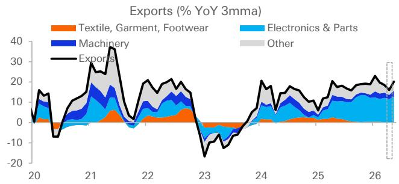

line chart

| Year | Textile, Garment, Footwear | Machinery | Electronics & Parts | Other | Exports |
|------|-----------------------------|-----------|---------------------|-------|---------|
| 20   | ~0                          | ~0        | ~0                  | ~0    | ~15     |
| 21   | ~5                          | ~5        | ~5                  | ~10   | ~30     |
| 22   | ~5                          | ~5        | ~5                  | ~10   | ~20     |
| 23   | ~0                          | ~0        | ~0                  | ~0    | ~-15    |
| 24   | ~0                          | ~0        | ~0                  | ~0    | ~20     |
| 25   | ~0                          | ~0        | ~0                  | ~0    | ~15     |
| 26   | ~0                          | ~0        | ~0                  | ~0    | ~20     |

Source : CEIC, DB

Figure 63: Imports by goods  
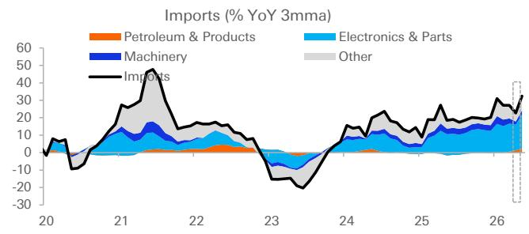

line chart

| Year | Imports | Petroleum & Products | Machinery | Electronics & Parts | Other |
|------|---------|----------------------|-----------|----------------------|-------|
| 20   | 0       | 0                    | 0         | 0                    | 0     |
| 21   | 45      | 5                    | 5         | 5                    | 5     |
| 22   | 15      | 5                    | 5         | 5                    | 5     |
| 23   | -20     | 0                    | 0         | 0                    | 0     |
| 24   | 15      | 5                    | 5         | 5                    | 5     |
| 25   | 25      | 5                    | 5         | 5                    | 5     |
| 26   | 30      | 5                    | 5         | 5                    | 5     |

Source : CEIC, DB

We attribute much of this to restocking, as this surge in import growth was led by electronics and components, which added 20.6 percentage points to the import growth, while coal/oil imports added 1.5 percentage points, lower than the 2.7 percentage points added by machinery and equipment imports. Surging imports of electronic and components reflect restocking and point to a reversal of goods balance (which we estimate be at -USD3.2bn through May) ahead, although the Iran War and the US trade policies (USTR Section 301 investigations) pose downside risks. Barring further negative shocks, we expect a reversal of CA deterioration ahead, as import surges fade. FX reserves may have fallen by about USD4 billion since December, to USD82.9 billion in May, excluding errors and omissions. With the latter at around 5% of GDP last year, the actual and estimated level of FX reserves may differ by a significant margin.

Despite a sharp rise in CPI inflation – to 5.5% in April/May from 3.5% in Q1 - retail sales growth remained largely stable, at 12.8% (7.3% discounted by inflation) in April/May, vs. 10.3% (7.6%) in Q1. This points to limited consumption impact, although divergence exists in services. While other services growth rose 14% in April/May, vs. 11.7% in Q1, tourism sales growth slowed to 4.9% from 9.3% in the same period, although the number of tourists rose at a faster pace of 19.6% in April/May vs. 12.5% in Q1. Real retail sales is still stronger than last year's despite surging inflation.

Meanwhile, public investment growth slowed to 8.2% in April/May, vs. 13.7% in Q1, against growth in investment capital from the state budget stood at 9.2% vs. 10.2% in the same period, reaching less than 22% of its annual plan. This reflects Vietnam's usual back-loading of public investment and rebound in months ahead, although financing remains a long-term issue. To address this challenge, the government continued its efforts to boost its infrastructure investment and FDI through reform and removal of administrative bottlenecks. The Housing Law and Real Estate Business Law will be revised to promote long-term rental housing through preferential land access, financing incentives, dedicated planning frameworks, and development targets. Vietnam's infrastructure investment requires up to USD40bn annually through 2040 and its proposed reforms aim to render its projects more attractive: provision of greater certainty in payment-land valuation; earlier recognition of land-related financial obligations; and, improved ability to monetize land payment.

The SBV continue to seek macro stability but with limited means. While the SBV has set a slower credit growth target of 15% for 2026, vs. 19.1% growth in 2025, with a tighter controls on sectors like real estate, although supportive of affordable housing. Other priority government growth areas include infrastructure, affordable housing and high tech manufacturing. Meanwhile, the SBV policy guidance to lower lending rate faced headwinds amid volatile funding conditions (reliance on volatile short-term funding) and higher risk aversion amid elevated global uncertainties. Credit growth has slowed to 19.3% YoY 3mma in March from 9.9% in Q4. The SBV continued to actively manage market liquidity, although interbank rate volatility hinting at sustained risks around the Dong.

Figure 64: Retail sales remained resilient...  
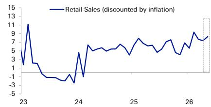

line chart

| Year | Retail Sales (discounted by inflation) |
| ---- | -------------------------------------- |
| 23   | 11                                     |
| 24   | -3                                     |
| 25   | 7                                      |
| 26   | 9                                      |

Source : CEIC, DB

Figure 65: Higher inflation led by fuel  
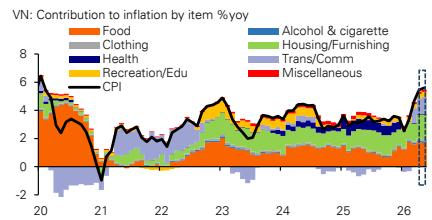

line chart

| Year | Food | Clothing | Health | Recreation/Edu | CPI | Alcohol & cigarette | Housing/Furnishing | Trans/Comm | Miscellaneous |
|------|------|----------|--------|-----------------|-----|---------------------|-------------------|------------|---------------|
| 20   | 6    | 5        | 4      | 3               | 7   | 6                   | 5                 | 4          | 3             |
| 21   | 2    | 1        | 1      | 1               | -2  | 1                   | 1                 | 1          | 1             |
| 22   | 3    | 2        | 2      | 2               | 3   | 3                   | 2                 | 2          | 2             |
| 23   | 4    | 3        | 3      | 3               | 4   | 4                   | 3                 | 3          | 3             |
| 24   | 3    | 2        | 2      | 2               | 3   | 3                   | 2                 | 2          | 2             |
| 25   | 4    | 3        | 3      | 3               | 4   | 4                   | 3                 | 3          | 3             |
| 26   | 5    | 4        | 4      | 4               | 5   | 5                   | 4                 | 4          | 4             |

Source : CEIC, DB

Figure 66: Public investment growth  
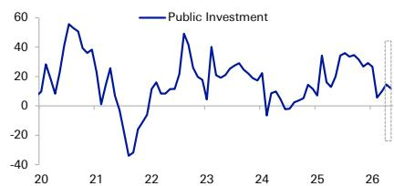

line chart

| Year | Public Investment |
| ---- | ----------------- |
| 20   | 10                |
| 21   | 50                |
| 22   | -30               |
| 23   | 50                |
| 24   | -10               |
| 25   | 30                |
| 26   | 10                |

Source : CEIC, DB

Figure 67: FX, inflation and rates  
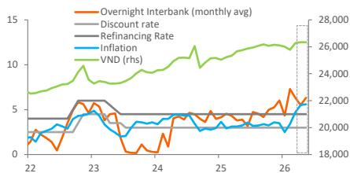

line chart

| Year | Overnight Interbank (monthly avg) | Discount rate | Refinancing Rate | Inflation | VND (rhs) |
|------|-----------------------------------|---------------|------------------|-----------|-----------|
| 22   | 18,000                            | 20,000        | 20,000           | 20,000    | 7,000     |
| 23   | 5,000                             | 20,000        | 20,000           | 4,000     | 10,000    |
| 24   | 3,000                             | 20,000        | 20,000           | 3,000     | 12,000    |
| 25   | 4,000                             | 20,000        | 20,000           | 3,500     | 13,000    |
| 26   | 7,000                             | 20,000        | 20,000           | 3,500     | 14,000    |

Source : CEIC, DB

## DB Macro Forecasts

Figure 68: Macroeconomic Indicators

<table><tr><td rowspan="2"></td><td colspan="4">Real GDP Growth(YoY%)</td><td colspan="4">Inflation(YoY%)</td><td colspan="4">Current Account(% of GDP)</td><td colspan="4">Fiscal Balance(% of GDP)</td></tr><tr><td>2024</td><td>2025</td><td>2026F</td><td>2027F</td><td>2024</td><td>2025</td><td>2026F</td><td>2027F</td><td>2024</td><td>2025</td><td>2026F</td><td>2027F</td><td>2024</td><td>2025</td><td>2026F</td><td>2027F</td></tr><tr><td>China</td><td>5.0</td><td>5.0</td><td>4.7</td><td>4.5</td><td>0.2</td><td>0.1</td><td>1.6</td><td>2.0</td><td>2.5</td><td>3.8</td><td>4.0</td><td>3.8</td><td>-4.8</td><td>-5.1</td><td>-5.3</td><td>-5.0</td></tr><tr><td>Hong Kong</td><td>2.6</td><td>3.6</td><td>4.0</td><td>2.6</td><td>1.7</td><td>1.4</td><td>2.0</td><td>2.1</td><td>13.1</td><td>12.3</td><td>9.6</td><td>9.5</td><td>-5.9</td><td>-3.0</td><td>-2.2</td><td>-1.9</td></tr><tr><td>India</td><td>7.2</td><td>7.5</td><td>6.7</td><td>7.2</td><td>4.9</td><td>2.2</td><td>4.6</td><td>4.2</td><td>-0.9</td><td>-0.4</td><td>-2.4</td><td>-1.0</td><td>-7.7</td><td>-7.3</td><td>-7.1</td><td>-7.0</td></tr><tr><td>Indonesia</td><td>5.0</td><td>5.1</td><td>5.0</td><td>5.2</td><td>2.3</td><td>1.9</td><td>3.5</td><td>3.3</td><td>-0.6</td><td>-0.1</td><td>-1.3</td><td>-0.5</td><td>-2.3</td><td>-2.9</td><td>-2.9</td><td>-2.9</td></tr><tr><td>Malaysia</td><td>5.2</td><td>5.2</td><td>4.5</td><td>4.7</td><td>1.8</td><td>1.4</td><td>2.0</td><td>1.7</td><td>1.4</td><td>1.6</td><td>1.8</td><td>1.9</td><td>-4.1</td><td>-3.8</td><td>-3.7</td><td>-3.4</td></tr><tr><td>Philippines</td><td>5.7</td><td>4.4</td><td>3.7</td><td>5.8</td><td>3.2</td><td>1.7</td><td>6.2</td><td>4.1</td><td>-4.0</td><td>-3.4</td><td>-3.6</td><td>-2.9</td><td>-5.7</td><td>-5.6</td><td>-5.4</td><td>-5.0</td></tr><tr><td>Singapore</td><td>5.3</td><td>5.0</td><td>3.9</td><td>2.0</td><td>2.4</td><td>0.9</td><td>2.1</td><td>2.1</td><td>17.2</td><td>16.7</td><td>16.9</td><td>16.5</td><td>0.8</td><td>1.9</td><td>0.8</td><td>0.4</td></tr><tr><td>South Korea</td><td>2.0</td><td>1.0</td><td>2.9</td><td>2.3</td><td>2.3</td><td>2.1</td><td>2.9</td><td>2.7</td><td>5.3</td><td>6.6</td><td>15.3</td><td>11.6</td><td>-1.7</td><td>-2.3</td><td>-1.3</td><td>-1.4</td></tr><tr><td>Sri Lanka</td><td>5.0</td><td>5.0</td><td>3.5</td><td>4.0</td><td>1.3</td><td>-0.5</td><td>5.7</td><td>5.0</td><td>1.2</td><td>1.6</td><td>-0.6</td><td>-1.3</td><td>-6.8</td><td>-4.5</td><td>-7.0</td><td>-6.0</td></tr><tr><td>Taiwan</td><td>5.3</td><td>8.8</td><td>10.0</td><td>3.8</td><td>2.2</td><td>1.7</td><td>2.2</td><td>1.8</td><td>14.1</td><td>19.5</td><td>23.2</td><td>24.7</td><td>0.4</td><td>0.3</td><td>0.2</td><td>0.2</td></tr><tr><td>Thailand</td><td>2.9</td><td>2.4</td><td>2.0</td><td>2.0</td><td>0.4</td><td>-0.1</td><td>2.6</td><td>2.2</td><td>2.2</td><td>2.8</td><td>-1.3</td><td>1.9</td><td>-4.6</td><td>-4.6</td><td>-4.4</td><td>-3.8</td></tr><tr><td>Vietnam</td><td>7.1</td><td>7.9</td><td>7.5</td><td>8.5</td><td>3.6</td><td>3.2</td><td>5.2</td><td>4.2</td><td>6.7</td><td>6.7</td><td>4.6</td><td>4.1</td><td>-3.4</td><td>-3.0</td><td>-3.5</td><td>-4.0</td></tr><tr><td>Emerging Asia*</td><td>5.4</td><td>5.5</td><td>5.2</td><td>5.0</td><td>1.8</td><td>0.9</td><td>2.7</td><td>2.7</td><td>2.2</td><td>3.2</td><td>3.1</td><td>3.3</td><td>-4.9</td><td>-5.0</td><td>-5.0</td><td>-4.8</td></tr><tr><td>EM Asia ex CN&amp;IN*</td><td>4.5</td><td>4.7</td><td>4.9</td><td>4.3</td><td>2.2</td><td>1.7</td><td>3.4</td><td>2.9</td><td>4.3</td><td>5.3</td><td>6.3</td><td>6.3</td><td>-2.7</td><td>-2.7</td><td>-2.6</td><td>-2.5</td></tr><tr><td>Asia-8*</td><td>4.6</td><td>4.7</td><td>4.9</td><td>4.3</td><td>2.3</td><td>1.7</td><td>3.3</td><td>2.9</td><td>4.1</td><td>5.2</td><td>6.3</td><td>6.3</td><td>-2.5</td><td>-2.6</td><td>-2.5</td><td>-2.5</td></tr><tr><td>ASEAN*</td><td>5.1</td><td>5.0</td><td>4.6</td><td>5.0</td><td>2.3</td><td>1.6</td><td>3.7</td><td>3.1</td><td>2.1</td><td>2.5</td><td>1.1</td><td>1.9</td><td>-3.2</td><td>-3.2</td><td>-3.3</td><td>-3.2</td></tr><tr><td>US</td><td>2.8</td><td>2.1</td><td>2.2</td><td>2.2</td><td>3.0</td><td>2.7</td><td>3.6</td><td>2.7</td><td>-4.0</td><td>-3.6</td><td>-3.4</td><td>-3.6</td><td>-7.4</td><td>-5.4</td><td>-6.6</td><td>-6.4</td></tr><tr><td>Euroland</td><td>0.9</td><td>1.5</td><td>0.5</td><td>1.1</td><td>2.4</td><td>2.1</td><td>3.1</td><td>2.5</td><td>2.7</td><td>1.7</td><td>0.0</td><td>1.0</td><td>-3.0</td><td>-2.9</td><td>-3.7</td><td>-3.8</td></tr><tr><td>Japan</td><td>-0.2</td><td>1.1</td><td>0.7</td><td>0.7</td><td>2.7</td><td>3.2</td><td>2.1</td><td>2.6</td><td>4.6</td><td>4.8</td><td>5.2</td><td>5.6</td><td>-1.8</td><td>-0.8</td><td>-1.5</td><td>-1.3</td></tr><tr><td>Australia</td><td>1.0</td><td>2.0</td><td>2.2</td><td>1.4</td><td>3.7</td><td>2.9</td><td>4.2</td><td>2.9</td><td>-0.5</td><td>-2.3</td><td>-2.3</td><td>-2.0</td><td>0.6</td><td>-0.4</td><td>-1.0</td><td>-1.0</td></tr></table>

Source : Bloomberg Finance LP, Haver Analytics, DB. \*PPP weighted Asia-8: Indonesia, Malaysia, Philippines, Singapore, South Korea, Taiwan, Thailand, Vietnam ASEAN: Indonesia, Malaysia, Philippines, Singapore, Thailand, Vietnam

Figure 69: Policy Rates (%) and Exchange Rates (vs. USD)

<table><tr><td rowspan="2"></td><td colspan="5">Policy Rate</td><td colspan="6">FX</td></tr><tr><td>Current*</td><td>Q2-26F</td><td>Q3-26F</td><td>Q4-26F</td><td>Q4-27F</td><td></td><td>Spot*</td><td>Q2-26F</td><td>Q3-26F</td><td>Q4-26F</td><td>Q4-27F</td></tr><tr><td>China</td><td>1.40</td><td>1.40</td><td>1.40</td><td>1.40</td><td>1.40</td><td>CNY</td><td>6.78</td><td>6.80</td><td>6.70</td><td>6.55</td><td>6.30</td></tr><tr><td>Hong Kong</td><td>4.00</td><td>4.00</td><td>4.00</td><td>4.00</td><td>4.00</td><td>HKD</td><td>7.84</td><td>7.80</td><td>7.80</td><td>7.80</td><td>7.80</td></tr><tr><td>India</td><td>5.25</td><td>5.25</td><td>5.25</td><td>5.75</td><td>6.25</td><td>INR</td><td>95.7</td><td>94.0</td><td>93.0</td><td>93.0</td><td>97.0</td></tr><tr><td>Indonesia</td><td>5.25</td><td>5.75</td><td>6.00</td><td>6.00</td><td>5.50</td><td>IDR</td><td>18,180</td><td>18,200</td><td>18,200</td><td>18,100</td><td>17,800</td></tr><tr><td>Malaysia</td><td>2.75</td><td>2.75</td><td>2.75</td><td>2.75</td><td>3.00</td><td>MYR</td><td>4.07</td><td>3.85</td><td>3.90</td><td>3.90</td><td>4.00</td></tr><tr><td>Philippines</td><td>4.50</td><td>5.00</td><td>5.25</td><td>5.25</td><td>5.25</td><td>PHP</td><td>61.7</td><td>61.5</td><td>61.5</td><td>61.0</td><td>60.0</td></tr><tr><td></td><td></td><td></td><td></td><td></td><td></td><td>SGD</td><td>1.29</td><td>1.27</td><td>1.26</td><td>1.25</td><td>1.22</td></tr><tr><td>South Korea</td><td>2.50</td><td>2.50</td><td>2.75</td><td>3.00</td><td>3.50</td><td>KRW</td><td>1,535</td><td>1,500</td><td>1,460</td><td>1,430</td><td>1,420</td></tr><tr><td>Sri Lanka</td><td>8.75</td><td>8.75</td><td>8.75</td><td>9.25</td><td>8.75</td><td>LKR</td><td>336</td><td>325</td><td>330</td><td>335</td><td>345</td></tr><tr><td>Taiwan</td><td>2.00</td><td>2.00</td><td>2.00</td><td>2.00</td><td>2.00</td><td>TWD</td><td>31.6</td><td>31.5</td><td>31.0</td><td>30.5</td><td>29.5</td></tr><tr><td>Thailand</td><td>1.00</td><td>1.00</td><td>1.00</td><td>1.00</td><td>1.50</td><td>THB</td><td>32.9</td><td>33.0</td><td>33.3</td><td>33.5</td><td>33.5</td></tr><tr><td>Vietnam</td><td>4.50</td><td>4.50</td><td>4.50</td><td>4.50</td><td>4.50</td><td>VND</td><td>26,343</td><td>26,500</td><td>26,700</td><td>26,900</td><td>27,500</td></tr><tr><td>US</td><td>3.63</td><td>3.63</td><td>3.63</td><td>3.63</td><td>3.63</td><td></td><td></td><td></td><td></td><td></td><td></td></tr><tr><td>Euroland</td><td>2.00</td><td>2.25</td><td>2.50</td><td>2.50</td><td>2.50</td><td>EUR</td><td>1.15</td><td></td><td></td><td>1.20</td><td>1.25</td></tr><tr><td>Japan</td><td>0.75</td><td>1.00</td><td>1.00</td><td>1.25</td><td>1.75</td><td>JPY</td><td>160.2</td><td></td><td></td><td>150</td><td>140</td></tr><tr><td>Australia</td><td>4.35</td><td>4.35</td><td>4.35</td><td>4.35</td><td>4.35</td><td>AUD</td><td>0.70</td><td></td><td></td><td>0.74</td><td>0.73</td></tr></table>

Source : Bloomberg Finance LP, Haver Analytics, DB. Note: China, 7d OMO; Hong Kong, discount base rate; India, repo rate; Indonesia, reverse repo rate; Malaysia, o/n call rate; Philippines, reverse repo rate; South Korea, base rate; Taiwan, discount rate; Thailand, o/n repo rate; US, effective Fed fund rate; Euroland, ECB deposit rate; Japan, policy balance rate. Note: \*Current and spot rates are as at 8 June.

Figure 70: China

<table><tr><td colspan="2"></td><td>2023</td><td>2024</td><td>2025</td><td>2026F</td><td>2027F</td></tr><tr><td>Nominal GDP</td><td>USD bn</td><td>17,787</td><td>18,735</td><td>19,658</td><td>22,214</td><td>24,837</td></tr><tr><td>Real GDP</td><td>%</td><td>5.2</td><td>5.0</td><td>5.0</td><td>4.7</td><td>4.5</td></tr><tr><td>Private cons.</td><td></td><td>8.9</td><td>4.4</td><td>5.0</td><td>4.9</td><td>4.5</td></tr><tr><td>Gov. cons.</td><td></td><td>6.3</td><td>3.0</td><td>5.5</td><td>5.2</td><td>5.0</td></tr><tr><td>Investment</td><td></td><td>3.5</td><td>3.0</td><td>2.8</td><td>3.5</td><td>3.0</td></tr><tr><td>Exports</td><td></td><td>6.3</td><td>3.0</td><td>5.5</td><td>5.2</td><td>5.0</td></tr><tr><td>Imports</td><td></td><td>4.4</td><td>13.6</td><td>9.2</td><td>10.9</td><td>2.9</td></tr><tr><td>CPI inflation</td><td>%</td><td>0.2</td><td>-0.1</td><td>0.0</td><td>1.6</td><td>2.0</td></tr><tr><td>Trade balance</td><td>% of GDP</td><td>3.3</td><td>4.1</td><td>5.4</td><td>5.0</td><td>4.7</td></tr><tr><td>CA balance</td><td>% of GDP</td><td>1.4</td><td>2.3</td><td>3.7</td><td>4.0</td><td>3.8</td></tr><tr><td>Fiscal balance</td><td>% of GDP</td><td>-8.6</td><td>-8.0</td><td>-9.5</td><td>-9.0</td><td>-8.5</td></tr><tr><td>Gov. debt</td><td>% of GDP</td><td>56.1</td><td>60.9</td><td>67.4</td><td>72.2</td><td>76.3</td></tr></table>

Source: DB

Figure 71: Hong Kong

<table><tr><td colspan="2"></td><td>2023</td><td>2024</td><td>2025</td><td>2026F</td><td>2027F</td></tr><tr><td>Nominal GDP</td><td>USD bn</td><td>381</td><td>408</td><td>427</td><td>452</td><td>476</td></tr><tr><td>Real GDP</td><td>%</td><td>3.2</td><td>2.6</td><td>3.6</td><td>4.0</td><td>2.6</td></tr><tr><td>Private cons.</td><td></td><td>6.8</td><td>-0.2</td><td>1.7</td><td>3.5</td><td>1.0</td></tr><tr><td>Gov. cons.</td><td></td><td>-3.9</td><td>0.7</td><td>1.5</td><td>2.0</td><td>2.0</td></tr><tr><td>Investment</td><td></td><td>12.1</td><td>3.0</td><td>15.8</td><td>3.9</td><td>5.0</td></tr><tr><td>Exports</td><td></td><td>-6.5</td><td>5.1</td><td>11.2</td><td>17.7</td><td>2.8</td></tr><tr><td>Imports</td><td></td><td>-5.4</td><td>3.9</td><td>11.5</td><td>17.6</td><td>2.5</td></tr><tr><td>CPI inflation</td><td>%</td><td>2.1</td><td>1.7</td><td>1.4</td><td>2.0</td><td>2.1</td></tr><tr><td>Trade balance</td><td>% of GDP</td><td>-4.2</td><td>-0.5</td><td>0.9</td><td>1.1</td><td>1.1</td></tr><tr><td>CA balance</td><td>% of GDP</td><td>8.4</td><td>13.1</td><td>12.3</td><td>9.6</td><td>9.5</td></tr><tr><td>Fiscal balance</td><td>% of GDP</td><td>-5.7</td><td>-5.9</td><td>-3.0</td><td>-2.2</td><td>-1.9</td></tr><tr><td>Gov. debt</td><td>% of GDP</td><td>14.9</td><td>15.2</td><td>17.4</td><td>19.5</td><td>21.5</td></tr></table>

Source: DB

Figure 72: India

<table><tr><td colspan="2"></td><td>2023</td><td>2024</td><td>2025</td><td>2026F</td><td>2027F</td></tr><tr><td>Nominal GDP</td><td>USD bn</td><td>3,410</td><td>3,706</td><td>3,867</td><td>4,040</td><td>4,389</td></tr><tr><td>Real GDP</td><td>%</td><td>6.8</td><td>7.2</td><td>7.5</td><td>6.7</td><td>7.2</td></tr><tr><td>Private cons.</td><td></td><td>4.5</td><td>5.9</td><td>7.9</td><td>7.0</td><td>6.8</td></tr><tr><td>Gov. cons.</td><td></td><td>8.9</td><td>6.2</td><td>5.2</td><td>6.4</td><td>8.3</td></tr><tr><td>Investment</td><td></td><td>8.7</td><td>6.4</td><td>6.8</td><td>7.8</td><td>8.4</td></tr><tr><td>Exports</td><td></td><td>2.5</td><td>6.8</td><td>6.9</td><td>3.5</td><td>5.0</td></tr><tr><td>Imports</td><td></td><td>10.4</td><td>1.5</td><td>6.8</td><td>5.3</td><td>5.8</td></tr><tr><td>CPI inflation</td><td>%</td><td>5.7</td><td>4.9</td><td>2.2</td><td>4.6</td><td>4.2</td></tr><tr><td>Trade balance</td><td>% of GDP</td><td>-6.9</td><td>-7.5</td><td>-8.0</td><td>-10.0</td><td>-8.3</td></tr><tr><td>CA balance</td><td>% of GDP</td><td>-0.9</td><td>-0.9</td><td>-0.4</td><td>-2.4</td><td>-1.0</td></tr><tr><td>Fiscal balance</td><td>% of GDP</td><td>-8.5</td><td>-7.7</td><td>-7.3</td><td>-7.1</td><td>-7.0</td></tr><tr><td>Gov. debt</td><td>% of GDP</td><td>81.1</td><td>80.3</td><td>80.8</td><td>79.8</td><td>79.5</td></tr></table>

Source: DB

Figure 73: Indonesia

<table><tr><td colspan="2"></td><td>2023</td><td>2024</td><td>2025</td><td>2026F</td><td>2027F</td></tr><tr><td>Nominal GDP</td><td>USD bn</td><td>1,371</td><td>1,396</td><td>1,446</td><td>1,448</td><td>1,552</td></tr><tr><td>Real GDP</td><td>%</td><td>5.0</td><td>5.0</td><td>5.1</td><td>5.0</td><td>5.2</td></tr><tr><td>Private cons.</td><td></td><td>4.9</td><td>5.1</td><td>5.0</td><td>5.1</td><td>5.1</td></tr><tr><td>Gov. cons.</td><td></td><td>3.0</td><td>6.8</td><td>2.5</td><td>9.2</td><td>2.8</td></tr><tr><td>Investment</td><td></td><td>5.2</td><td>7.5</td><td>4.0</td><td>5.8</td><td>5.0</td></tr><tr><td>Exports</td><td></td><td>1.7</td><td>6.9</td><td>7.0</td><td>0.9</td><td>2.8</td></tr><tr><td>Imports</td><td></td><td>-1.2</td><td>8.1</td><td>4.8</td><td>2.8</td><td>2.8</td></tr><tr><td>CPI inflation</td><td>%</td><td>3.7</td><td>2.3</td><td>1.9</td><td>3.5</td><td>3.3</td></tr><tr><td>Trade balance</td><td>% of GDP</td><td>3.4</td><td>2.9</td><td>3.4</td><td>3.2</td><td>2.9</td></tr><tr><td>CA balance</td><td>% of GDP</td><td>-0.2</td><td>-0.6</td><td>-0.1</td><td>-1.3</td><td>-0.5</td></tr><tr><td>Fiscal balance</td><td>% of GDP</td><td>-1.6</td><td>-2.3</td><td>-2.9</td><td>-2.9</td><td>-2.9</td></tr><tr><td>Gov. debt</td><td>% of GDP</td><td>39.3</td><td>39.9</td><td>40.3</td><td>39.9</td><td>39.6</td></tr></table>

Source: DB

Figure 74: Malaysia

<table><tr><td colspan="2"></td><td>2023</td><td>2024</td><td>2025</td><td>2026F</td><td>2027F</td></tr><tr><td>Nominal GDP</td><td>USD bn</td><td>400</td><td>422</td><td>482</td><td>545</td><td>581</td></tr><tr><td>Real GDP</td><td>%</td><td>3.6</td><td>5.2</td><td>5.2</td><td>4.5</td><td>4.7</td></tr><tr><td>Private cons.</td><td></td><td>4.6</td><td>5.1</td><td>5.2</td><td>4.6</td><td>4.6</td></tr><tr><td>Gov. cons.</td><td></td><td>3.4</td><td>4.7</td><td>6.6</td><td>5.0</td><td>4.6</td></tr><tr><td>Investment</td><td></td><td>7.1</td><td>4.6</td><td>9.1</td><td>6.9</td><td>6.2</td></tr><tr><td>Exports</td><td></td><td>-7.9</td><td>8.3</td><td>3.1</td><td>3.2</td><td>3.9</td></tr><tr><td>Imports</td><td></td><td>-6.8</td><td>8.7</td><td>6.3</td><td>4.2</td><td>4.3</td></tr><tr><td>CPI inflation</td><td>%</td><td>2.5</td><td>1.8</td><td>1.4</td><td>2.0</td><td>1.7</td></tr><tr><td>Trade balance</td><td>% of GDP</td><td>4.8</td><td>5.3</td><td>5.6</td><td>5.7</td><td>5.8</td></tr><tr><td>CA balance</td><td>% of GDP</td><td>1.1</td><td>1.4</td><td>1.6</td><td>1.8</td><td>1.9</td></tr><tr><td>Fiscal balance</td><td>% of GDP</td><td>-5.0</td><td>-4.1</td><td>-3.8</td><td>-3.7</td><td>-3.4</td></tr><tr><td>Gov. debt</td><td>% of GDP</td><td>64.3</td><td>64.6</td><td>65.5</td><td>64.0</td><td>63.8</td></tr></table>

Source: DB

Figure 75: Philippines

<table><tr><td colspan="2"></td><td>2023</td><td>2024</td><td>2025</td><td>2026F</td><td>2027F</td></tr><tr><td>Nominal GDP</td><td>USD bn</td><td>438</td><td>456</td><td>476</td><td>488</td><td>538</td></tr><tr><td>Real GDP</td><td>%</td><td>5.5</td><td>5.7</td><td>4.4</td><td>3.7</td><td>5.8</td></tr><tr><td>Private cons.</td><td></td><td>5.5</td><td>4.9</td><td>4.5</td><td>3.1</td><td>4.6</td></tr><tr><td>Gov. cons.</td><td></td><td>0.3</td><td>7.7</td><td>8.4</td><td>6.2</td><td>6.6</td></tr><tr><td>Investment</td><td></td><td>6.3</td><td>7.7</td><td>-1.7</td><td>3.1</td><td>7.1</td></tr><tr><td>Exports</td><td></td><td>1.3</td><td>3.2</td><td>8.2</td><td>5.2</td><td>3.3</td></tr><tr><td>Imports</td><td></td><td>1.0</td><td>4.3</td><td>5.0</td><td>4.2</td><td>2.8</td></tr><tr><td>CPI inflation</td><td>%</td><td>6.0</td><td>3.2</td><td>1.7</td><td>6.2</td><td>4.1</td></tr><tr><td>Trade balance</td><td>% of GDP</td><td>-15.1</td><td>-15.1</td><td>-14.0</td><td>-14.7</td><td>-14.3</td></tr><tr><td>CA balance</td><td>% of GDP</td><td>-2.8</td><td>-4.0</td><td>-3.4</td><td>-3.6</td><td>-2.9</td></tr><tr><td>Fiscal balance</td><td>% of GDP</td><td>-6.2</td><td>-5.7</td><td>-5.6</td><td>-5.4</td><td>-5.0</td></tr><tr><td>Gov. debt</td><td>% of GDP</td><td>61.6</td><td>62.0</td><td>64.4</td><td>62.4</td><td>60.3</td></tr></table>

Source: DB

Figure 76: Singapore

<table><tr><td colspan="2"></td><td>2023</td><td>2024</td><td>2025</td><td>2026F</td><td>2027F</td></tr><tr><td>Nominal GDP</td><td>USD bn</td><td>511</td><td>573</td><td>604</td><td>659</td><td>706</td></tr><tr><td>Real GDP</td><td>%</td><td>1.5</td><td>5.3</td><td>5.0</td><td>3.9</td><td>2.0</td></tr><tr><td>Private cons.</td><td></td><td>3.7</td><td>5.8</td><td>3.9</td><td>2.9</td><td>3.0</td></tr><tr><td>Gov. cons.</td><td></td><td>1.1</td><td>7.9</td><td>1.7</td><td>0.9</td><td>3.4</td></tr><tr><td>Investment</td><td></td><td>-9.9</td><td>14.1</td><td>4.1</td><td>6.0</td><td>3.2</td></tr><tr><td>Exports</td><td></td><td>4.4</td><td>5.7</td><td>10.8</td><td>7.9</td><td>2.8</td></tr><tr><td>Imports</td><td></td><td>4.1</td><td>6.7</td><td>11.9</td><td>7.9</td><td>3.0</td></tr><tr><td>CPI inflation</td><td>%</td><td>4.8</td><td>2.4</td><td>0.9</td><td>2.1</td><td>2.1</td></tr><tr><td>CPI core</td><td></td><td>4.2</td><td>2.8</td><td>0.7</td><td>2.2</td><td>2.5</td></tr><tr><td>Trade balance</td><td>% of GDP</td><td>31.5</td><td>30.0</td><td>29.2</td><td>28.1</td><td>27.0</td></tr><tr><td>CA balance</td><td>% of GDP</td><td>16.4</td><td>17.2</td><td>16.7</td><td>16.9</td><td>16.5</td></tr><tr><td>Fiscal balance</td><td>% of GDP</td><td>-0.4</td><td>0.8</td><td>1.9</td><td>0.8</td><td>0.4</td></tr><tr><td>Gov. debt</td><td>% of GDP</td><td>167.6</td><td>165.4</td><td>166.1</td><td>180.0</td><td>185.0</td></tr></table>

Source : DB

Figure 77: South Korea

<table><tr><td colspan="2"></td><td>2023</td><td>2024</td><td>2025</td><td>2026F</td><td>2027F</td></tr><tr><td>Nominal GDP</td><td>USD bn</td><td>1,844</td><td>1,875</td><td>1,873</td><td>2,013</td><td>2,195</td></tr><tr><td>Real GDP</td><td>%</td><td>1.6</td><td>2.0</td><td>1.0</td><td>2.9</td><td>2.3</td></tr><tr><td>Private cons.</td><td></td><td>2.0</td><td>1.1</td><td>1.3</td><td>2.4</td><td>2.3</td></tr><tr><td>Gov. cons.</td><td></td><td>1.9</td><td>2.1</td><td>2.8</td><td>2.7</td><td>1.7</td></tr><tr><td>Investment</td><td></td><td>-0.2</td><td>-0.8</td><td>-3.3</td><td>2.5</td><td>2.9</td></tr><tr><td>Exports</td><td></td><td>3.4</td><td>6.8</td><td>4.1</td><td>7.0</td><td>2.6</td></tr><tr><td>Imports</td><td></td><td>3.0</td><td>2.5</td><td>3.8</td><td>5.3</td><td>3.3</td></tr><tr><td>CPI inflation</td><td>%</td><td>3.6</td><td>2.3</td><td>2.1</td><td>2.9</td><td>2.7</td></tr><tr><td>Trade balance</td><td>% of GDP</td><td>2.2</td><td>6.0</td><td>7.4</td><td>17.1</td><td>13.3</td></tr><tr><td>CA balance</td><td>% of GDP</td><td>1.8</td><td>5.3</td><td>6.6</td><td>15.3</td><td>11.6</td></tr><tr><td>Fiscal balance</td><td>% of GDP</td><td>-1.5</td><td>-1.7</td><td>-2.3</td><td>-1.3</td><td>-1.4</td></tr><tr><td>Gov. debt</td><td>% of GDP</td><td>43.9</td><td>43.6</td><td>45.4</td><td>47.3</td><td>48.1</td></tr></table>

Source: DB

Figure 78: Sri Lanka

<table><tr><td colspan="2"></td><td>2023</td><td>2024</td><td>2025</td><td>2026F</td><td>2027F</td></tr><tr><td>Nominal GDP</td><td>USD bn</td><td>84</td><td>100</td><td>109</td><td>115</td><td>123</td></tr><tr><td>Real GDP</td><td>%</td><td>-2.0</td><td>5.0</td><td>5.0</td><td>3.5</td><td>4.0</td></tr><tr><td>Private cons.</td><td></td><td>-1.0</td><td>4.8</td><td>6.3</td><td>4.1</td><td>4.6</td></tr><tr><td>Gov. cons.</td><td></td><td>-5.4</td><td>-1.1</td><td>-0.8</td><td>-0.5</td><td>-0.5</td></tr><tr><td>Investment</td><td></td><td>-6.6</td><td>17.7</td><td>9.8</td><td>4.5</td><td>5.0</td></tr><tr><td>Exports</td><td></td><td>12.7</td><td>12.4</td><td>5.1</td><td>4.0</td><td>4.5</td></tr><tr><td>Imports</td><td></td><td>8.9</td><td>21.6</td><td>10.8</td><td>5.0</td><td>5.5</td></tr><tr><td>CPI inflation</td><td>%</td><td>20.5</td><td>1.3</td><td>-0.5</td><td>5.7</td><td>5.0</td></tr><tr><td>Trade balance</td><td>% of GDP</td><td>-5.8</td><td>-6.1</td><td>-7.0</td><td>-8.0</td><td>-8.6</td></tr><tr><td>CA balance</td><td>% of GDP</td><td>1.7</td><td>1.2</td><td>1.6</td><td>-0.6</td><td>-1.3</td></tr><tr><td>Fiscal balance</td><td>% of GDP</td><td>-8.5</td><td>-6.8</td><td>-4.5</td><td>-7.0</td><td>-6.0</td></tr><tr><td>Gov. debt</td><td>% of GDP</td><td>112.4</td><td>109.6</td><td>104.7</td><td>103.8</td><td>102.8</td></tr></table>

Source: DB

Figure 79: Taiwan

<table><tr><td colspan="2"></td><td>2023</td><td>2024</td><td>2025</td><td>2026F</td><td>2027F</td></tr><tr><td>Nominal GDP</td><td>USD bn</td><td>757</td><td>802</td><td>920</td><td>1,045</td><td>1,148</td></tr><tr><td>Real GDP</td><td>%</td><td>1.1</td><td>5.3</td><td>8.8</td><td>10.0</td><td>3.8</td></tr><tr><td>Private cons.</td><td></td><td>7.9</td><td>3.2</td><td>1.4</td><td>3.7</td><td>2.0</td></tr><tr><td>Gov. cons.</td><td></td><td>0.2</td><td>3.0</td><td>1.2</td><td>3.0</td><td>2.0</td></tr><tr><td>Investment</td><td></td><td>-10.3</td><td>14.9</td><td>4.0</td><td>7.4</td><td>1.3</td></tr><tr><td>Exports</td><td></td><td>-4.1</td><td>8.7</td><td>32.1</td><td>29.8</td><td>6.3</td></tr><tr><td>Imports</td><td></td><td>-5.5</td><td>11.6</td><td>27.1</td><td>28.0</td><td>4.6</td></tr><tr><td>CPI inflation</td><td>%</td><td>2.5</td><td>2.2</td><td>1.7</td><td>2.2</td><td>1.8</td></tr><tr><td>Trade balance</td><td>% of GDP</td><td>12.6</td><td>12.4</td><td>19.0</td><td>23.0</td><td>24.0</td></tr><tr><td>CA balance</td><td>% of GDP</td><td>14.0</td><td>14.1</td><td>19.5</td><td>23.2</td><td>24.7</td></tr><tr><td>Fiscal balance</td><td>% of GDP</td><td>-0.6</td><td>0.4</td><td>0.3</td><td>0.2</td><td>0.2</td></tr><tr><td>Gov. debt</td><td>% of GDP</td><td>32.9</td><td>30.9</td><td>27.9</td><td>24.9</td><td>23.5</td></tr></table>

Source: DB

Figure 80: Thailand

<table><tr><td colspan="2"></td><td>2023</td><td>2024</td><td>2025</td><td>2026F</td><td>2027F</td></tr><tr><td>Nominal GDP</td><td>USD bn</td><td>516</td><td>530</td><td>557</td><td>596</td><td>608</td></tr><tr><td>Real GDP</td><td>%</td><td>2.2</td><td>2.9</td><td>2.4</td><td>2.0</td><td>2.1</td></tr><tr><td>Private cons.</td><td></td><td>6.9</td><td>4.4</td><td>2.7</td><td>2.4</td><td>2.1</td></tr><tr><td>Gov. cons.</td><td></td><td>-4.7</td><td>2.6</td><td>0.6</td><td>2.8</td><td>0.0</td></tr><tr><td>Investment</td><td></td><td>1.2</td><td>-0.3</td><td>4.9</td><td>6.1</td><td>0.6</td></tr><tr><td>Exports</td><td></td><td>2.7</td><td>7.5</td><td>9.3</td><td>7.7</td><td>3.7</td></tr><tr><td>Imports</td><td></td><td>-2.5</td><td>5.7</td><td>6.7</td><td>9.0</td><td>3.5</td></tr><tr><td>CPI inflation</td><td>%</td><td>1.3</td><td>0.4</td><td>-0.1</td><td>2.6</td><td>2.2</td></tr><tr><td>Trade balance</td><td>% of GDP</td><td>3.8</td><td>4.0</td><td>4.2</td><td>-0.7</td><td>3.2</td></tr><tr><td>CA balance</td><td>% of GDP</td><td>1.7</td><td>2.2</td><td>2.8</td><td>-1.3</td><td>1.9</td></tr><tr><td>Fiscal balance</td><td>% of GDP</td><td>-3.9</td><td>-4.6</td><td>-4.6</td><td>-4.4</td><td>-3.8</td></tr><tr><td>Gov. debt</td><td>% of GDP</td><td>58.6</td><td>61.3</td><td>61.5</td><td>66.6</td><td>68.1</td></tr></table>

Source: DB

Figure 81: Vietnam

<table><tr><td colspan="2"></td><td>2023</td><td>2024</td><td>2025</td><td>2026F</td><td>2027F</td></tr><tr><td>Nominal GDP</td><td>USD bn</td><td>434</td><td>476</td><td>495</td><td>549</td><td>611</td></tr><tr><td>Real GDP</td><td>%</td><td>4.9</td><td>7.1</td><td>7.9</td><td>7.5</td><td>8.5</td></tr><tr><td>Private cons.</td><td></td><td>3.4</td><td>6.7</td><td>7.3</td><td>6.8</td><td>7.5</td></tr><tr><td>Gov. cons.</td><td></td><td>4.6</td><td>5.8</td><td>11.9</td><td>8.5</td><td>8.0</td></tr><tr><td>Investment</td><td></td><td>4.6</td><td>7.1</td><td>8.6</td><td>8.2</td><td>9.0</td></tr><tr><td>Exports</td><td></td><td>-2.5</td><td>15.5</td><td>16.3</td><td>14.0</td><td>7.0</td></tr><tr><td>Imports</td><td></td><td>-4.3</td><td>16.1</td><td>17.1</td><td>14.2</td><td>7.0</td></tr><tr><td>CPI inflation</td><td>%</td><td>3.3</td><td>3.6</td><td>3.2</td><td>5.2</td><td>4.2</td></tr><tr><td>Trade balance</td><td>% of GDP</td><td>9.8</td><td>9.5</td><td>8.5</td><td>6.4</td><td>5.7</td></tr><tr><td>CA balance</td><td>% of GDP</td><td>6.0</td><td>6.7</td><td>6.7</td><td>4.6</td><td>4.1</td></tr><tr><td>Fiscal balance</td><td>% of GDP</td><td>-2.4</td><td>-3.4</td><td>-3.0</td><td>-3.5</td><td>-4.0</td></tr><tr><td>Gov. debt</td><td>% of GDP</td><td>33.2</td><td>33.5</td><td>32.5</td><td>33.5</td><td>34.0</td></tr></table>

Source : DB

## Growth & Inflation Heatmap

Figure 82: Heatmap of headline inflationary momentum  
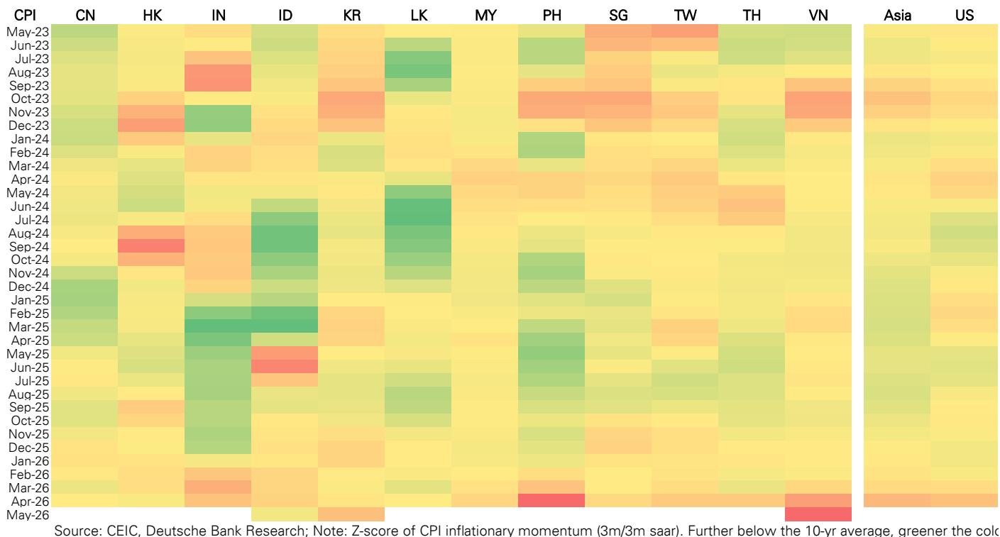

heatmap

| Date | Country | CPI | CN | HK | IN | ID | KR | LK | MY | PH | SG | TW | TH | VN | Asia | US |
| --- | --- | --- | --- | --- | --- | --- | --- | --- | --- | --- | --- | --- | --- | --- | --- | --- |
| May-23 | China | High | High | High | High | High | High | High | High | High | High | High | High | High | High | High |
| Jun-23 | China | High | High | High | High | High | High | High | High | High | High | High | High | High | High | High |
| Jul-23 | China | High | High | High | High | High | High | High | High | High | High | High | High | High | High | High |
| Aug-23 | USA | High | High | High | Medium | Low | Low | Medium | Low | Low | Low | Low | Low | Low | Low | Low |
| Sep-23 | USA | High | High | High | High | Low | Low | Medium | Low | Low | Low | Low | Low | Low | Low | Low |
| Oct-23 | USA | High | High | High | High | Low | Low | Medium | Low | Low | Low | Low | Low | Low | Low | Low |
| Nov-23 | USA | High | High | Medium | Low | Low | Low | Low | Low | Low | Low | Low | Low | Low | Low | Low |
| Dec-23 | USA | High | High | Medium | Low | Low | Low | Low | Low | Low | Low | Low | Low | Low | Low | Low |
| Jan-24 | Japan | High | High | High | High | Low | Low | Low | Low | Medium | Low | Low | Low | Low | Low | Low |
| Feb-24 | Japan | High | High | High | High | Low | Low | Low | Low | Medium | Low | Low | Low | Low | Low | Low |
| Mar-24 | Japan | High | High | High | High | Low | Low | Low | Low | Medium | Low | Low | Low | Low | Low | Low |

Source : DB, Haver Analytics; Note: Z-score of CPI inflationary momentum (3m/3m saar). The further below the 10-yr average, the greener the color gets, while red reflects inflationary pressure well above the historical average.

Figure 83: Heatmap of Monthly Growth Indicators (MGIs)  
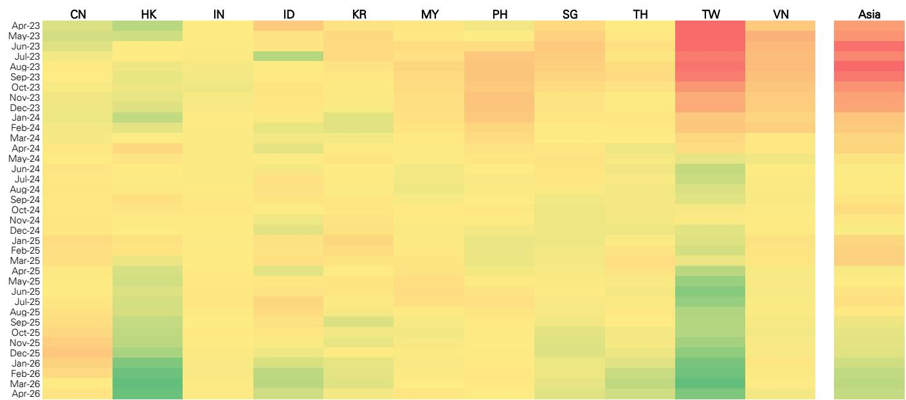

heatmap

| Month | CN | HK | IN | ID | KR | MY | PH | SG | TH | TW | VN | Asia |
| --- | --- | --- | --- | --- | --- | --- | --- | --- | --- | --- | --- | --- |
| Apr-23 |  |  |  |  |  |  |  |  |  |  |  |  |
| May-23 |  |  |  |  |  |  |  |  |  |  |  |  |
| Jun-23 |  |  |  |  |  |  |  |  |  |  |  |  |
| Jul-23 |  |  |  |  |  |  |  |  |  |  |  |  |
| Aug-23 |  |  |  |  |  |  |  |  |  |  |  |  |
| Sep-23 |  |  |  |  |  |  |  |  |  |  |  |  |
| Oct-23 |  |  |  |  |  |  |  |  |  |  |  |  |
| Nov-23 |  |  |  |  |  |  |  |  |  |  |  |  |
| Dec-23 |  |  |  |  |  |  |  |  |  |  |  |  |
| Jan-24 |  |  |  |  |  |  |  |  |  |  |  |  |
| Feb-24 |  |  |  |  |  |  |  |  |  |  |  |  |
| Mar-24 |  |  |  |  |  |  |  |  |  |  |  |  |
| Apr-24 |  |  |  |  |  |  |  |  |  |  |  |  |
| May-24 |  |  |  |  |  |  |  |  |  |  |  |  |
| Jun-24 |  |  |  |  |  |  |  |  |  |  |  |  |
| Jul-24 |  |  |  |  |  |  |  |  |  |  |  |  |
| Aug-24 |  |  |  |  |  |  |  |  |  |  |  |  |
| Sep-24 |  |  |  |  |  |  |  |  |  |  |  |  |
| Oct-24 |  |  |  |  |  |  |  |  |  | 100 0 | 100 0 | 100 0 |
| Nov-24 |  |  |  |  | 100 0 | 100 0 | 100 0 | 100 0 | 100 0 | 100 0 | 100 0 | 100 0 |
| Dec-24 | 100 0 | 100 0 | 100 0 | 100 0 | 100 0 | 100 0 | 100 0 | 100 0 | 100 0 | 100 0 | 100 0 | 100 0 |
| Jan-25 | 100 0 | 100 0 | 100 0 | 100 0 | 100 0 | 100 0 | 100 0 | 100 0 | 100 0 | 100 0 | 100 0 | 100 0 |
| Feb-25 | 100 0 | 100 0 | 100 0 | 100 0 | 100 0 | 100 0 | 100 0 | 100 0 | 100 0 | 100 0 | 100 0 | 100 0 |
| Mar-25 | 100 0 | 100 0 | 100 0 | 100 0 | 100 0 | 100 0 | 100 0 | 100 0 | 100 0 | 100 0 | 100 0 | 100 0 |
| Apr-25 | 100 0 | 100 0 | 100 0 | 100 0 | 100 0 | 100 0 | 100 0 | 100 0 | 100 0 | 100 0 | 100 0 | 100 0 |

Source : CEIC, DB; Note: The MMI is a weighted average of the 3mma of the z-scores of annual growth rates of high-frequency indicators, such as non-oil imports, IP, retail sales, credit and auto sales, among others. In order to arrive at an "optimized" composite score, each variable is weighted by its coefficient estimate obtained in a regression, where GDP is the dependent variable. Analysis is done over the period from 2010 to the present. The further above the 12-yr avg, the greener the color gets, while red reflects growth momentum well below the historical average.

## EM Asia Macro Charts

Figure 84: GDP growth – EM Asia-8 vs. CH vs. IN  
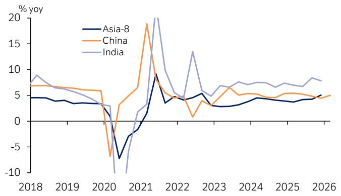

line chart

| Year | Asia-8 | China | India |
|------|--------|-------|-------|
| 2018 | 4.5    | 7.0   | 9.0   |
| 2019 | 4.0    | 6.5   | 7.5   |
| 2020 | -7.0   | -8.0  | -9.0  |
| 2021 | 9.0    | 19.0  | 20.0  |
| 2022 | 4.0    | 5.0   | 5.0   |
| 2023 | 3.0    | 4.0   | 7.0   |
| 2024 | 4.0    | 5.0   | 7.5   |
| 2025 | 4.5    | 5.5   | 7.0   |
| 2026 | 5.0    | 5.0   | 8.0   |

Source : DB, Haver Analytics

Figure 85: GDP growth – EM Asia vs. other EMs  
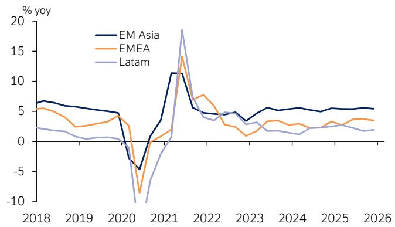

line chart

| Year | EM Asia | EMEA | Latam |
|------|---------|------|-------|
| 2018 | 6.0     | 5.0  | 2.0   |
| 2019 | 5.5     | 3.0  | 1.0   |
| 2020 | 4.0     | -5.0 | -10.0 |
| 2021 | 11.0    | 14.0 | 18.0  |
| 2022 | 5.0     | 7.0  | 4.0   |
| 2023 | 4.0     | 2.0  | 3.0   |
| 2024 | 5.0     | 3.0  | 2.0   |
| 2025 | 5.5     | 3.5  | 2.5   |
| 2026 | 5.5     | 3.5  | 2.0   |

Source : DB, Haver Analytics

Figure 86: Real exports growth – EM Asia-8 vs. CH vs. IN  
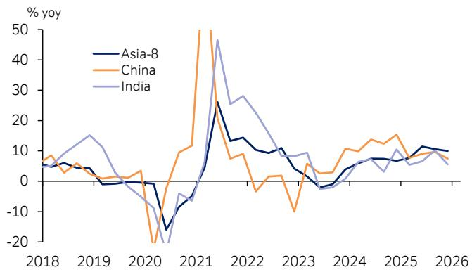

line chart

| Year | Asia-8 | China | India |
|------|--------|-------|-------|
| 2018 | 5      | 7     | 6     |
| 2019 | 3      | 4     | 15    |
| 2020 | -5     | -15   | -10   |
| 2021 | 25     | 50    | 45    |
| 2022 | 10     | 5     | 25    |
| 2023 | 5      | -10   | 10    |
| 2024 | 8      | 10    | 5     |
| 2025 | 10     | 15    | 8     |
| 2026 | 10     | 5     | 5     |

Source : DB, Haver Analytics

Figure 87: Real exports growth – EM Asia vs. other EMs  
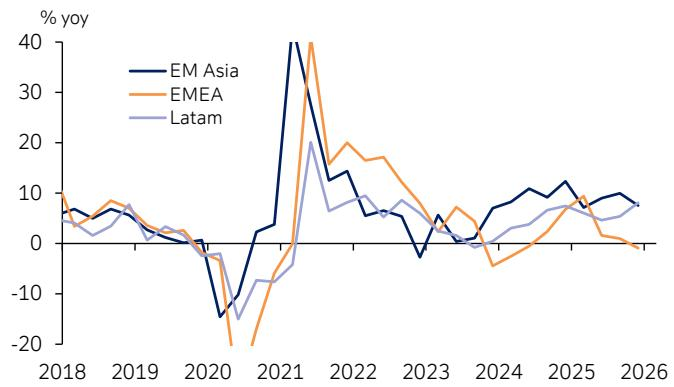

line chart

| Year | EM Asia | EMEA | Latam |
|------|---------|------|-------|
| 2018 | 5       | 8    | 3     |
| 2019 | 3       | 7    | 5     |
| 2020 | -15     | -18  | -10   |
| 2021 | 40      | 40   | 20    |
| 2022 | 10      | 15   | 5     |
| 2023 | -5      | 5    | 0     |
| 2024 | 5       | -5   | 5     |
| 2025 | 10      | 5    | 5     |
| 2026 | 5       | -5   | 5     |

Sources: DB, Haver Analytics

Figure 88: EM Asia CPI contribution  
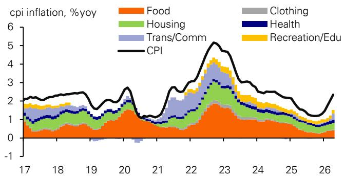

stacked bar chart

| Year | Food | Housing | Trans/Comm | Clothing | Health | Recreation/Edu |
|------|------|---------|------------|----------|--------|----------------|
| 17   | 0.5  | 0.3     | 0.2        | 0.1      | 0.1    | 0.1            |
| 18   | 0.6  | 0.4     | 0.3        | 0.1      | 0.1    | 0.1            |
| 19   | 0.7  | 0.5     | 0.4        | 0.1      | 0.1    | 0.1            |
| 20   | 0.8  | 0.6     | 0.5        | 0.1      | 0.1    | 0.1            |
| 21   | 0.9  | 0.7     | 0.6        | 0.1      | 0.1    | 0.1            |
| 22   | 1.0  | 0.8     | 0.7        | 0.1      | 0.1    | 0.1            |
| 23   | 1.2  | 1.0     | 0.8        | 0.1      | 0.1    | 0.1            |
| 24   | 1.1  | 0.9     | 0.7        | 0.1      | 0.1    | 0.1            |
| 25   | 1.0  | 0.8     | 0.6        | 0.1      | 0.1    | 0.1            |
| 26   | 1.1  | 0.9     | 0.7        | 0.1      | 0.1    | 0.1            |

Source : DB, CEIC

Figure 89: EM Asia CPI inflation  
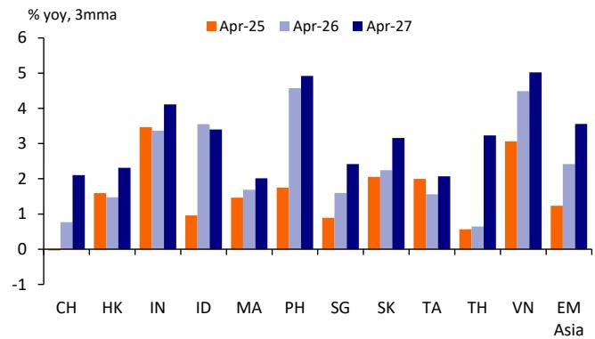

bar chart

| Country | Apr-25 | Apr-26 | Apr-27 |
|---------|--------|--------|--------|
| CH      | 0.0    | 0.8    | 2.1    |
| HK      | 1.6    | 1.5    | 2.3    |
| IN      | 3.5    | 3.4    | 4.1    |
| ID      | 1.0    | 3.6    | 3.4    |
| MA      | 1.5    | 1.7    | 2.0    |
| PH      | 1.8    | 4.6    | 5.0    |
| SG      | 0.9    | 1.6    | 2.5    |
| SK      | 2.1    | 2.3    | 3.2    |
| TA      | 2.0    | 1.6    | 2.1    |
| TH      | 0.6    | 0.7    | 3.3    |
| VN      | 3.1    | 4.5    | 5.1    |
| EM Asia| 1.3    | 2.5    | 3.6    |

Source : DB

Figure 90: Export growth – EM Asia-8 vs. CH vs. IN  
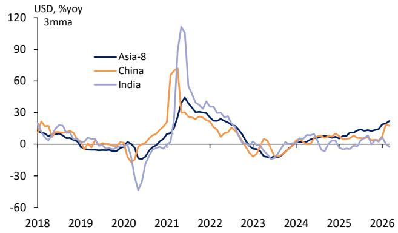

line chart

| Year | Asia-8 | China | India |
|------|--------|-------|-------|
| 2018 | ~10    | ~25   | ~15   |
| 2019 | ~5     | ~10   | ~5    |
| 2020 | ~-5    | ~-10  | ~-30  |
| 2021 | ~30    | ~70   | ~110  |
| 2022 | ~20    | ~30   | ~40   |
| 2023 | ~-10   | ~-5   | ~-5   |
| 2024 | ~5     | ~5    | ~5    |
| 2025 | ~10    | ~10   | ~10   |
| 2026 | ~20    | ~25   | ~15   |

Sources: DB, Haver Analytics

Figure 91: Export growth – EM Asia vs. other EMs  
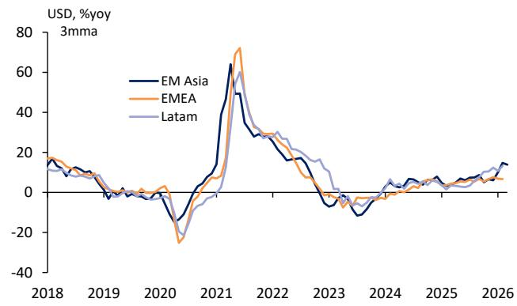

line chart

| Year | EM Asia | EMEA | Latam |
|------|---------|------|-------|
| 2018 | 15      | 18   | 12    |
| 2019 | 5       | 8    | 3     |
| 2020 | -10     | -15  | -5    |
| 2021 | 65      | 70   | 60    |
| 2022 | 30      | 35   | 25    |
| 2023 | -5      | -8   | -3    |
| 2024 | 5       | 3    | 2     |
| 2025 | 10      | 8    | 5     |
| 2026 | 15      | 10   | 8     |

Sources: DB, Haver Analytics

Figure 92: Composite PMI – China, India, Hong Kong  
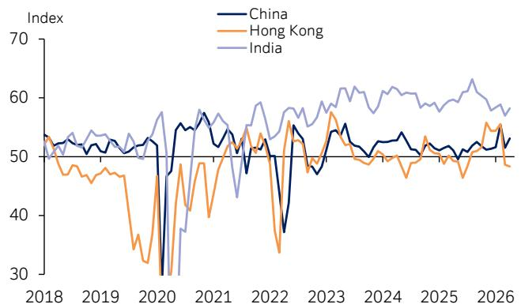

line chart

| Year | China | Hong Kong | India |
|------|-------|-----------|-------|
| 2018 | 52    | 53        | 51    |
| 2019 | 51    | 48        | 53    |
| 2020 | 50    | 30        | 57    |
| 2021 | 55    | 48        | 58    |
| 2022 | 50    | 35        | 59    |
| 2023 | 53    | 57        | 61    |
| 2024 | 51    | 50        | 60    |
| 2025 | 52    | 53        | 63    |
| 2026 | 53    | 49        | 58    |

Sources: DB, Haver Analytics

Figure 93: Mfg PMI – Indonesia, Malaysia, Philippines  
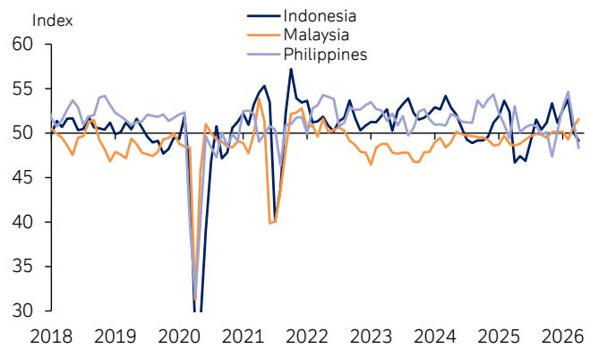

line chart

| Year | Indonesia | Malaysia | Philippines |
|------|-----------|----------|-------------|
| 2018 | 51        | 50       | 53          |
| 2019 | 50        | 49       | 54          |
| 2020 | 30        | 48       | 52          |
| 2021 | 55        | 50       | 53          |
| 2022 | 57        | 52       | 54          |
| 2023 | 53        | 49       | 52          |
| 2024 | 54        | 48       | 53          |
| 2025 | 51        | 49       | 54          |
| 2026 | 53        | 50       | 55          |

Sources: DB, Haver Analytics

Figure 94: Mfg PMI – China, Thailand, Vietnam  
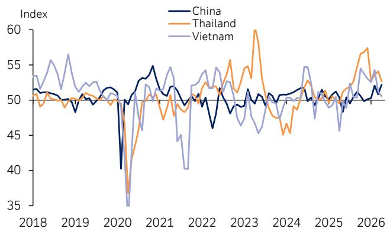

line chart

| Year | China | Thailand | Vietnam |
|------|-------|----------|---------|
| 2018 | 51.0  | 50.5     | 53.0    |
| 2019 | 50.5  | 50.0     | 56.0    |
| 2020 | 40.0  | 35.0     | 35.0    |
| 2021 | 54.0  | 48.0     | 54.0    |
| 2022 | 50.0  | 52.0     | 54.0    |
| 2023 | 51.0  | 60.0     | 45.0    |
| 2024 | 50.0  | 47.0     | 54.0    |
| 2025 | 51.0  | 52.0     | 46.0    |
| 2026 | 52.0  | 57.0     | 54.0    |

Sources: DB, Haver Analytics

Figure 95: Mfg PMI – Singapore, S Korea, Taiwan  
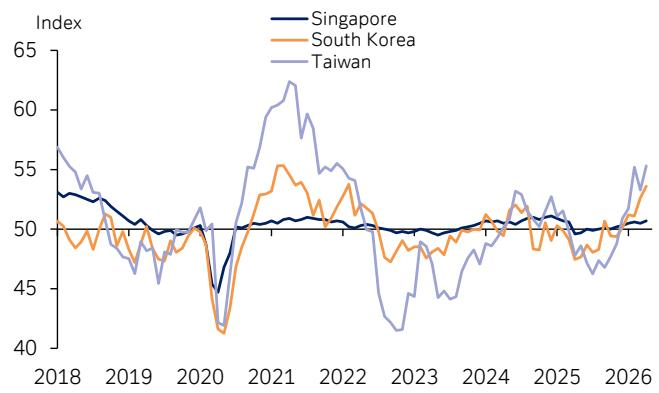

line chart

| Year | Singapore | South Korea | Taiwan |
|------|-----------|-------------|--------|
| 2018 | 53        | 50          | 57     |
| 2019 | 51        | 49          | 47     |
| 2020 | 45        | 42          | 51     |
| 2021 | 50        | 55          | 62     |
| 2022 | 50        | 53          | 55     |
| 2023 | 50        | 48          | 42     |
| 2024 | 50        | 51          | 53     |
| 2025 | 50        | 49          | 50     |
| 2026 | 50        | 53          | 55     |

Sources: DB, Haver Analytics

## EM Asia Monetary Policy Monitor

Figure 96: China – Inflation (CPI)  
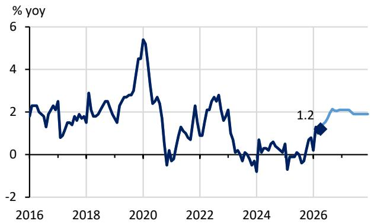

line chart

| Year | % yoy |
| ---- | ----- |
| 2026 | 1.2   |

Note – Next CPI release: 10 June

Figure 97: China – 7d OMO Rate  
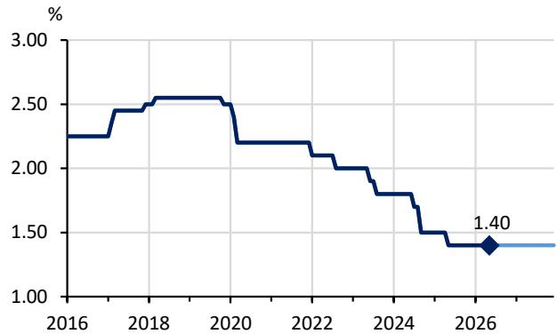

line chart

| Year | Value (%) |
| :--- | :--- |
| 2016 | 2.25 |
| 2017 | 2.45 |
| 2018 | 2.55 |
| 2019 | 2.55 |
| 2020 | 2.25 |
| 2021 | 2.25 |
| 2022 | 2.15 |
| 2023 | 2.05 |
| 2024 | 1.85 |
| 2025 | 1.50 |
| 2026 | 1.40 |
| Next Year (Next Year) | 1.40 |

Note – Next policy meeting: N/A. DB Rate Call: No change in rates

Figure 98: Hong Kong – Inflation (CPI)  
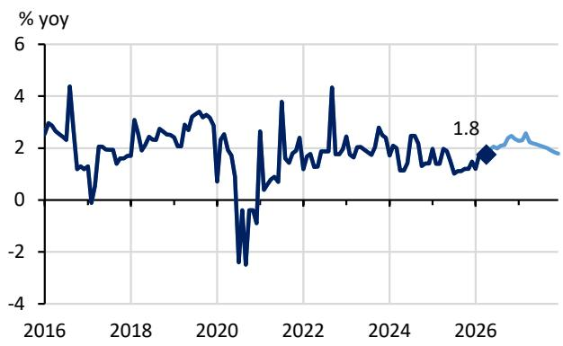

line chart

| Year | % yoy |
|------|-------|
| 2026 | 1.8   |

Note – Next CPI release: 23 June

Figure 99: Hong Kong – Base Rate  
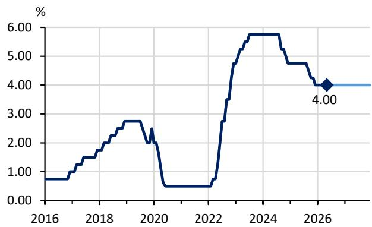

line chart

| Year | Value |
| ---- | ----- |
| 2026 | 4.00  |

Note – Next policy meeting: NA. DB Rate Call: No change in rates

Figure 100: India – Inflation (CPI)  
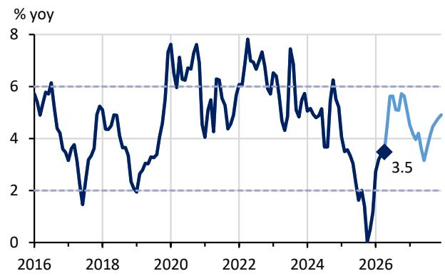

line chart

| Year | % yoy |
|------|-------|
| 2026 | 3.5   |

Note – Next CPI release: 12 June

Figure 101: India – Repo Rate  
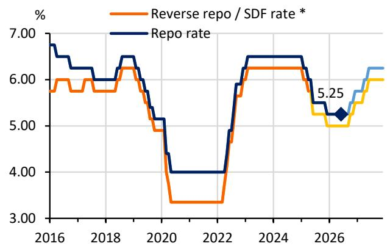

line chart

| Year | Reverse repo / SDF rate * | Repo rate |
|------|---------------------------|---------|
| 2026 | 5.25                      | 5.25    |

Note – Next policy meeting: 5 August. DB Rate Call: No change in rates

Sources: DB, Haver Analytics, Bloomberg Finance LP

Figure 102: Indonesia – Inflation (CPI)  
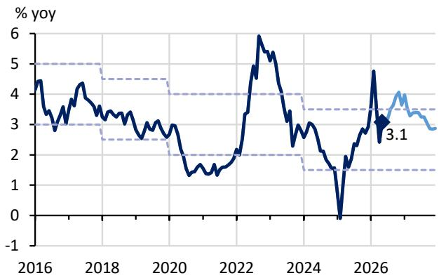

line chart

| Year | % yoy |
|------|-------|
| 2026 | 3.1   |

Note – Next CPI release: 1 July

Figure 103: Indonesia – Reverse Repo Rate  
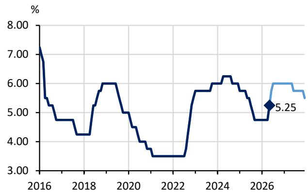

line chart

| Year | Value |
|------|-------|
| 2026 | 5.25  |

Note – Next policy meeting: 18 June. DB Rate Call: 50bps rate hike

Figure 104: Malaysia – Inflation (CPI)  
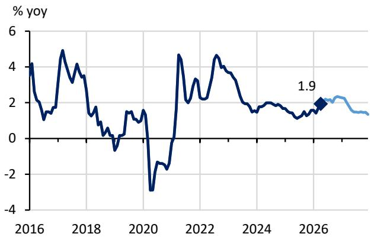

line chart

| Year | % yoy |
| ---- | ----- |
| 2026 | 1.9   |

Note – Next CPI release: 19 June

Figure 105: Malaysia – Overnight Policy Rate  
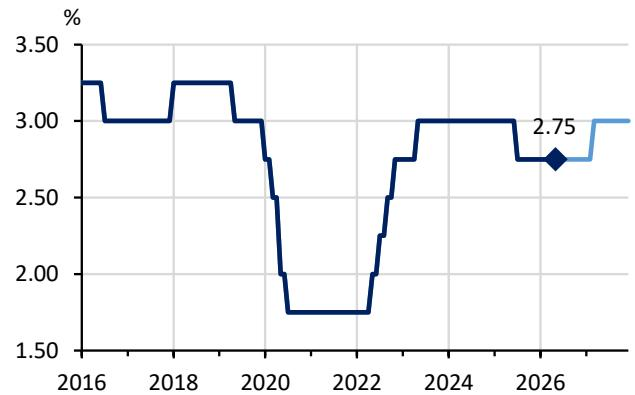

line chart

| Year | Value |
| ---- | ----- |
| 2026 | 2.75  |

Note – Next policy meeting: 9 July. DB Rate Call: No change in rates

Figure 106: Philippines – Inflation (CPI)  
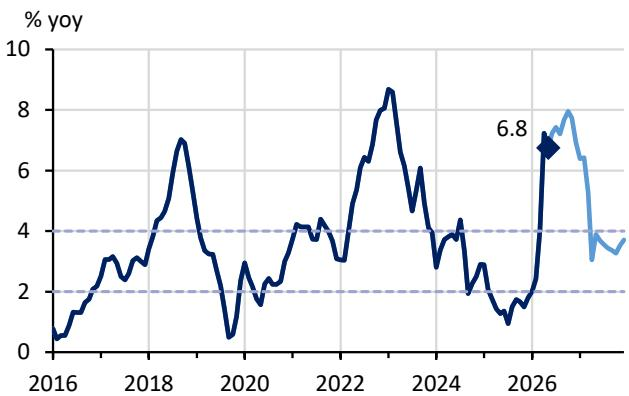

line chart

| Year | % yoy |
|------|-------|
| 2026 | 6.8   |

Note – Next CPI release: 7 July

Figure 107: Philippines – O/N Reverse Repo Rates  
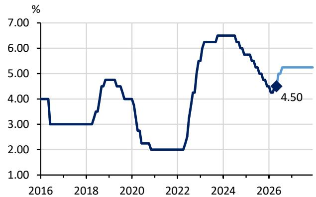

line chart

| Year | Value |
| ---- | ----- |
| 2026 | 4.50  |

Note – Next policy meeting: 18 June. DB Rate Call: 50bps rate hike

Sources: DB, Haver Analytics, Bloomberg Finance LP

Figure 108: Singapore – Inflation (CPI)  
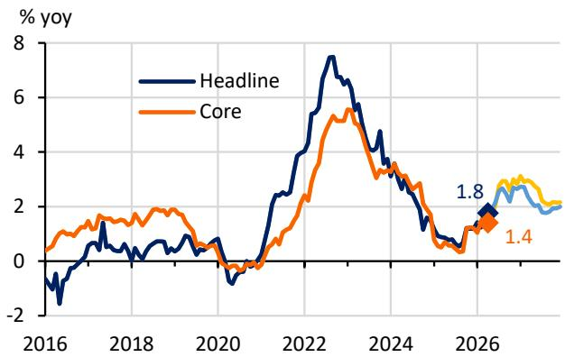

line chart

| Year | Headline | Core |
|------|----------|------|
| 2026 | 1.8      | 1.4  |

Note – Next CPI release: 23 June

Figure 109: Singapore – S\$NEER (estimated)  
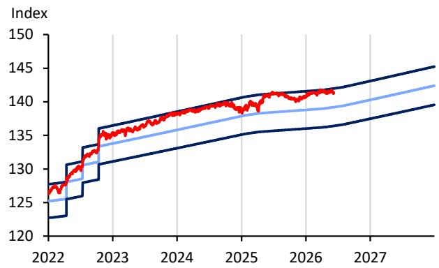

line chart

| Year | Index (Red Line) | Index (Blue Line) |
|------|------------------|-------------------|
| 2022 | 128              | 125               |
| 2023 | 136              | 134               |
| 2024 | 139              | 136               |
| 2025 | 140              | 138               |
| 2026 | 141              | 139               |
| 2027 | 142              | 140               |

Note – Next policy meeting: July 2026. DB forecast: Slope increase to 1.5% from 1.0%.

Figure 110: South Korea – Inflation (CPI)  
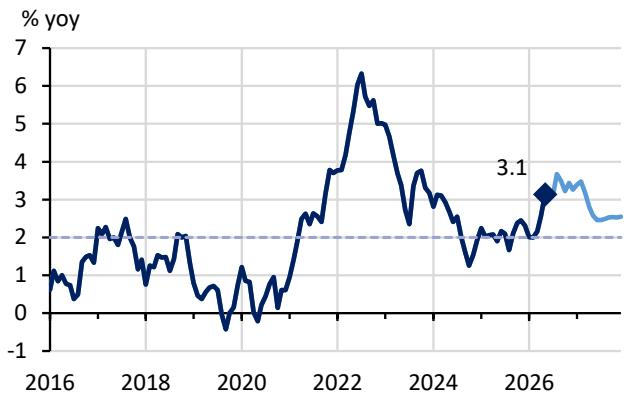

line chart

| Year | % yoy |
| ---- | ----- |
| 2026 | 3.1   |

Note – Next CPI release: 2 July

Figure 111: South Korea – Base Rate  
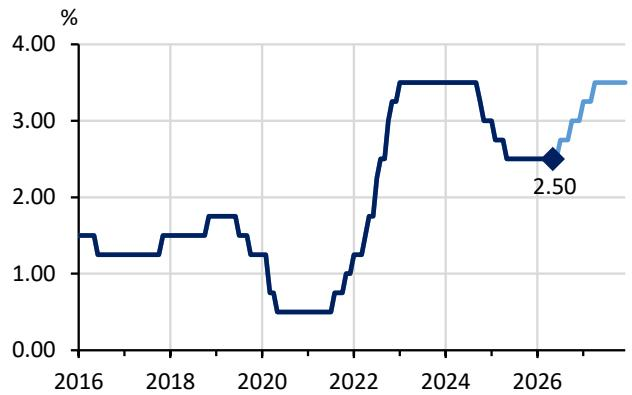

line chart

| Year | Value |
|------|-------|
| 2026 | 2.50  |

Note – Next policy meeting: 16 July. DB Rate Call: 25bps rate hike

Figure 112: Sri Lanka – Inflation (CPI)  
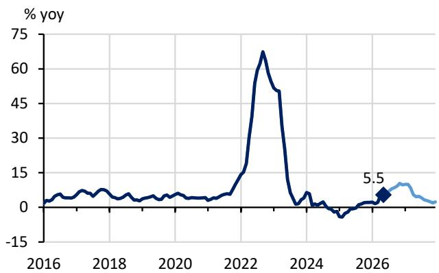

line chart

| Year | % yoy |
| ---- | ----- |
| 2026 | 5.5   |

Note – Next CPI release: 30 June

Figure 113: Sri Lanka – Overnight Policy Rate  
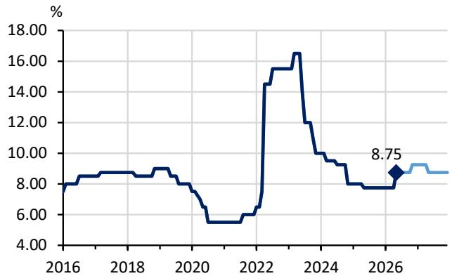

line chart

| Year | Value |
|------|-------|
| 2026 | 8.75  |

Note – Next policy meeting: 22 July. DB Rate Call: No change in rates

Sources: DB, Haver Analytics, Bloomberg Finance LP

Figure 114: Taiwan – Inflation (CPI)  
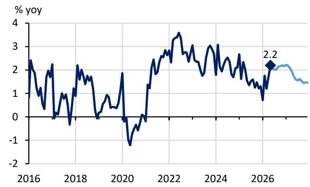

line chart

| Year | % yoy |
| ---- | ----- |
| 2026 | 2.2   |

Note – Next CPI release: 7 July

Figure 115: Taiwan – Discount Rate  
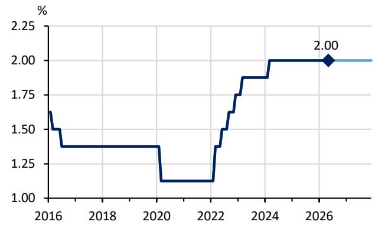

line chart

| Year | Value |
| ---- | ----- |
| 2026 | 2.00  |

Note – Next policy meeting: 18 June. DB Rate Call: No change in rates

Figure 116: Thailand – Inflation (CPI)  
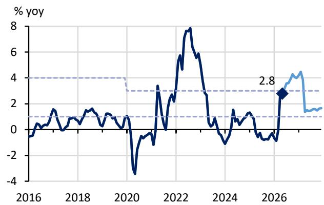

line chart

| Year | % yoy |
| ---- | ----- |
| 2026 | 2.8   |

Note – Next CPI release: 6 July

Figure 117: Thailand – 1-day Repurchase Rate  
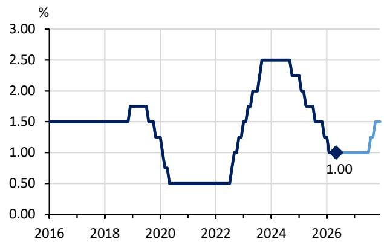

line chart

| Year | Value |
| ---- | ----- |
| 2026 | 1.00  |

Note – Next policy meeting: 24 June. DB Rate Call: No change in rates

Figure 118: Vietnam – Inflation (CPI)  
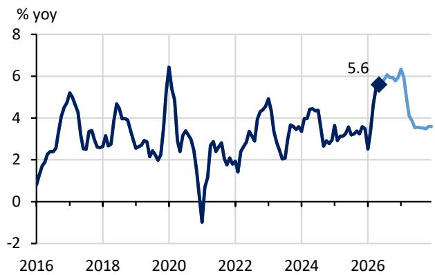

line chart

| Year | % yoy |
| ---- | ----- |
| 2026 | 5.6   |

Note – Next CPI release: 3 July

Figure 119: Vietnam – Refinancing Rate  
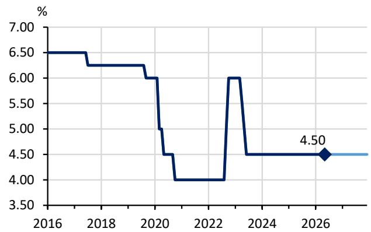

line chart

| Year | Value (%) |
| :--- | :--- |
| 2016 | 6.50 |
| 2017 | 6.30 |
| 2018 | 6.25 |
| 2019 | 6.20 |
| 2020 | 6.00 |
| 2021 | 4.50 |
| 2022 | 4.00 |
| 2023 | 6.00 |
| 2024 | 4.50 |
| 2026 | 4.50 |
The chart displays a single line representing a percentage over time. The x-axis is labeled as 'Year' and the y-axis is labeled as '%'. The value for '2026' is explicitly labeled as '4.50'.

Note – Next policy meeting: N/A. DB Rate Call in Q1: No change in rates

Sources: DB, Haver Analytics, Bloomberg Finance LP

Figure 120: Asia Economic Indicators

<table><tr><td>% YoY unless stated</td><td>Apr-25</td><td>May-25</td><td>Jun-25</td><td>Jul-25</td><td>Aug-25</td><td>Sept-25</td><td>Oct-25</td><td>Nov-25</td><td>Dec-25</td><td>Jan-26</td><td>Feb-26</td><td>Mar-26</td><td>Apr-26</td></tr><tr><td colspan="14">Policy rates (%)</td></tr><tr><td>China (7d OMO)</td><td>1.50</td><td>1.40</td><td>1.40</td><td>1.40</td><td>1.40</td><td>1.40</td><td>1.40</td><td>1.40</td><td>1.40</td><td>1.40</td><td>1.40</td><td>1.40</td><td>1.40</td></tr><tr><td>HKMA (base rate)</td><td>4.75</td><td>4.75</td><td>4.75</td><td>4.75</td><td>4.75</td><td>4.50</td><td>4.25</td><td>4.25</td><td>4.00</td><td>4.00</td><td>4.00</td><td>4.00</td><td>4.00</td></tr><tr><td>India (repo)</td><td>6.00</td><td>6.00</td><td>5.50</td><td>5.50</td><td>5.50</td><td>5.50</td><td>5.50</td><td>5.50</td><td>5.25</td><td>5.25</td><td>5.25</td><td>5.25</td><td>5.25</td></tr><tr><td>Indonesia (7d rev repo)</td><td>5.75</td><td>5.50</td><td>5.50</td><td>5.25</td><td>5.00</td><td>4.75</td><td>4.75</td><td>4.75</td><td>4.75</td><td>4.75</td><td>4.75</td><td>4.75</td><td>4.75</td></tr><tr><td>Malaysia (overnight)</td><td>3.00</td><td>3.00</td><td>3.00</td><td>2.75</td><td>2.75</td><td>2.75</td><td>2.75</td><td>2.75</td><td>2.75</td><td>2.75</td><td>2.75</td><td>2.75</td><td>2.75</td></tr><tr><td>Philippines (rev repo)</td><td>5.50</td><td>5.50</td><td>5.25</td><td>5.25</td><td>5.00</td><td>5.00</td><td>4.75</td><td>4.75</td><td>4.50</td><td>4.50</td><td>4.25</td><td>4.25</td><td>4.50</td></tr><tr><td>Singapore</td><td></td><td></td><td></td><td></td><td></td><td></td><td></td><td></td><td></td><td></td><td></td><td></td><td></td></tr><tr><td>South Korea (o/n call)</td><td>2.75</td><td>2.50</td><td>2.50</td><td>2.50</td><td>2.50</td><td>2.50</td><td>2.50</td><td>2.50</td><td>2.50</td><td>2.50</td><td>2.50</td><td>2.50</td><td>2.50</td></tr><tr><td>Sri Lanka (rev repo)</td><td>8.00</td><td>7.75</td><td>7.75</td><td>7.75</td><td>7.75</td><td>7.75</td><td>7.75</td><td>7.75</td><td>7.75</td><td>7.75</td><td>7.75</td><td>7.75</td><td>7.75</td></tr><tr><td>Taiwan (rediscount)</td><td>2.00</td><td>2.00</td><td>2.00</td><td>2.00</td><td>2.00</td><td>2.00</td><td>2.00</td><td>2.00</td><td>2.00</td><td>2.00</td><td>2.00</td><td>2.00</td><td>2.00</td></tr><tr><td>Thailand (o/n repo)</td><td>1.75</td><td>1.75</td><td>1.75</td><td>1.75</td><td>1.50</td><td>1.50</td><td>1.50</td><td>1.50</td><td>1.25</td><td>1.25</td><td>1.00</td><td>1.00</td><td>1.00</td></tr><tr><td>Vietnam (refinancing)</td><td>4.50</td><td>4.50</td><td>4.50</td><td>4.50</td><td>4.50</td><td>4.50</td><td>4.50</td><td>4.50</td><td>4.50</td><td>4.50</td><td>4.50</td><td>4.50</td><td>4.50</td></tr><tr><td colspan="14">Consumer prices</td></tr><tr><td>China</td><td>-0.1</td><td>-0.1</td><td>0.1</td><td>0.0</td><td>-0.4</td><td>-0.3</td><td>0.2</td><td>0.7</td><td>0.8</td><td>0.2</td><td>1.3</td><td>1.0</td><td>1.2</td></tr><tr><td>Hong Kong</td><td>2.0</td><td>1.9</td><td>1.5</td><td>1.0</td><td>1.1</td><td>1.1</td><td>1.2</td><td>1.2</td><td>1.5</td><td>1.2</td><td>1.7</td><td>1.7</td><td>1.8</td></tr><tr><td>India</td><td>3.3</td><td>3.0</td><td>2.3</td><td>1.6</td><td>2.0</td><td>1.4</td><td>0.0</td><td>0.5</td><td>1.2</td><td>2.7</td><td>3.2</td><td>3.4</td><td>3.5</td></tr><tr><td>Indonesia</td><td>1.9</td><td>1.6</td><td>1.9</td><td>2.4</td><td>2.3</td><td>2.7</td><td>2.9</td><td>2.7</td><td>2.9</td><td>3.5</td><td>4.8</td><td>3.5</td><td>2.4</td></tr><tr><td>Malaysia</td><td>1.4</td><td>1.2</td><td>1.1</td><td>1.2</td><td>1.3</td><td>1.5</td><td>1.3</td><td>1.4</td><td>1.6</td><td>1.6</td><td>1.4</td><td>1.7</td><td>1.9</td></tr><tr><td>Philippines</td><td>1.4</td><td>1.3</td><td>1.4</td><td>0.9</td><td>1.5</td><td>1.7</td><td>1.7</td><td>1.5</td><td>1.8</td><td>2.0</td><td>2.4</td><td>4.1</td><td>7.2</td></tr><tr><td>Singapore</td><td>0.9</td><td>0.8</td><td>0.8</td><td>0.6</td><td>0.5</td><td>0.7</td><td>1.2</td><td>1.2</td><td>1.2</td><td>1.4</td><td>1.2</td><td>1.8</td><td>1.8</td></tr><tr><td>South Korea</td><td>2.1</td><td>1.9</td><td>2.2</td><td>2.1</td><td>1.7</td><td>2.1</td><td>2.4</td><td>2.4</td><td>2.3</td><td>2.0</td><td>2.0</td><td>2.2</td><td>2.6</td></tr><tr><td>Sri Lanka</td><td>-2.0</td><td>-0.7</td><td>-0.6</td><td>-0.3</td><td>1.2</td><td>1.5</td><td>2.1</td><td>2.1</td><td>2.1</td><td>2.3</td><td>1.6</td><td>2.2</td><td>5.4</td></tr><tr><td>Taiwan</td><td>2.0</td><td>1.5</td><td>1.4</td><td>1.5</td><td>1.6</td><td>1.3</td><td>1.5</td><td>1.2</td><td>1.3</td><td>0.7</td><td>1.8</td><td>1.2</td><td>1.7</td></tr><tr><td>Thailand</td><td>-0.2</td><td>-0.6</td><td>-0.2</td><td>-0.7</td><td>-0.8</td><td>-0.7</td><td>-0.8</td><td>-0.5</td><td>-0.3</td><td>-0.7</td><td>-0.9</td><td>-0.1</td><td>2.9</td></tr><tr><td>Vietnam</td><td>3.1</td><td>3.2</td><td>3.6</td><td>3.2</td><td>3.2</td><td>3.4</td><td>3.2</td><td>3.6</td><td>3.5</td><td>2.5</td><td>3.3</td><td>4.7</td><td>5.5</td></tr><tr><td colspan="14">Credit</td></tr><tr><td>China (loans)</td><td>7.2</td><td>7.1</td><td>7.1</td><td>6.9</td><td>6.8</td><td>6.6</td><td>6.5</td><td>6.4</td><td>6.3</td><td>6.1</td><td>6.0</td><td>5.7</td><td>5.6</td></tr><tr><td>Hong Kong</td><td>-0.3</td><td>1.0</td><td>1.6</td><td>1.5</td><td>0.8</td><td>0.9</td><td>1.3</td><td>1.2</td><td>2.3</td><td>3.7</td><td>4.5</td><td>4.7</td><td>5.4</td></tr><tr><td>India</td><td>11.1</td><td>9.7</td><td>10.1</td><td>13.0</td><td>12.9</td><td>13.2</td><td></td><td></td><td></td><td></td><td></td><td></td><td></td></tr><tr><td>Indonesia</td><td>8.5</td><td>8.1</td><td>7.6</td><td>6.7</td><td>7.0</td><td>7.2</td><td>7.0</td><td>7.9</td><td>9.3</td><td>10.2</td><td>8.9</td><td>8.9</td><td></td></tr><tr><td>Malaysia</td><td>5.1</td><td>5.3</td><td>5.1</td><td>5.4</td><td>5.4</td><td>5.5</td><td>5.4</td><td>5.2</td><td>4.8</td><td>4.7</td><td>4.9</td><td>5.4</td><td>5.6</td></tr><tr><td>Philippines</td><td>10.0</td><td>12.4</td><td>10.9</td><td>11.0</td><td>9.9</td><td>9.2</td><td>10.7</td><td>11.5</td><td>11.7</td><td>9.6</td><td>9.4</td><td>10.4</td><td>12.1</td></tr><tr><td>Singapore</td><td>4.5</td><td>5.8</td><td>6.0</td><td>6.4</td><td>6.3</td><td>6.8</td><td>6.5</td><td>6.6</td><td>6.1</td><td>6.1</td><td>6.3</td><td>6.6</td><td>7.9</td></tr><tr><td>South Korea</td><td>5.2</td><td>4.8</td><td>4.2</td><td>4.5</td><td>4.8</td><td>4.9</td><td>4.8</td><td>5.1</td><td>4.7</td><td>4.8</td><td>4.8</td><td>5.4</td><td>4.3</td></tr><tr><td>Sri Lanka</td><td>15.2</td><td>16.1</td><td>17.9</td><td>19.6</td><td>20.5</td><td>22.1</td><td>24.1</td><td>26.0</td><td>25.2</td><td>26.3</td><td>26.4</td><td>27.1</td><td>27.0</td></tr><tr><td>Taiwan</td><td>8.6</td><td>7.3</td><td>7.9</td><td>7.3</td><td>6.8</td><td>6.2</td><td>6.0</td><td>5.9</td><td>6.0</td><td>6.1</td><td>7.1</td><td>7.6</td><td>8.0</td></tr><tr><td>Thailand Vietnam</td><td>1.1</td><td>0.5</td><td>0.2</td><td>1.2</td><td>0.4</td><td>-0.3</td><td>-2.0</td><td>-0.9</td><td>-0.9</td><td>-1.7</td><td>-2.0</td><td>-0.3</td><td>-0.3</td></tr><tr><td colspan="14">Exports</td></tr><tr><td>China</td><td>9.1</td><td>6.1</td><td>7.0</td><td>7.8</td><td>4.6</td><td>8.3</td><td>-0.9</td><td>5.6</td><td>5.1</td><td>8.0</td><td>36.1</td><td>-0.7</td><td>9.8</td></tr><tr><td>Hong Kong</td><td>14.7</td><td>15.5</td><td>11.9</td><td>14.3</td><td>14.5</td><td>16.1</td><td>17.5</td><td>18.8</td><td>26.1</td><td>33.8</td><td>24.7</td><td>35.8</td><td>42.9</td></tr><tr><td>India</td><td>-1.3</td><td>0.9</td><td>1.6</td><td>16.7</td><td>10.3</td><td>11.7</td><td>-7.9</td><td>24.9</td><td>7.2</td><td>5.6</td><td>3.4</td><td>-0.9</td><td>24.4</td></tr><tr><td>Indonesia</td><td>5.3</td><td>9.7</td><td>11.3</td><td>9.9</td><td>5.8</td><td>11.4</td><td>-2.3</td><td>-6.6</td><td>11.6</td><td>3.4</td><td>1.0</td><td>-3.1</td><td>22.0</td></tr><tr><td>Malaysia (USD)</td><td>15.9</td><td>-1.2</td><td>-3.6</td><td>6.5</td><td>1.7</td><td>12.5</td><td>15.7</td><td>7.0</td><td>10.2</td><td>19.6</td><td>10.7</td><td>8.4</td><td>36.9</td></tr><tr><td>Philippines</td><td>7.6</td><td>15.5</td><td>26.9</td><td>17.7</td><td>5.5</td><td>16.3</td><td>20.3</td><td>21.6</td><td>23.9</td><td>8.7</td><td>8.9</td><td>20.8</td><td>6.3</td></tr><tr><td>Singapore (USD)</td><td>22.0</td><td>2.4</td><td>10.3</td><td>8.4</td><td>1.8</td><td>14.5</td><td>24.9</td><td>9.9</td><td>10.6</td><td>30.3</td><td>11.0</td><td>41.0</td><td>31.8</td></tr><tr><td>South Korea</td><td>9.1</td><td>0.8</td><td>3.3</td><td>5.1</td><td>3.7</td><td>17.4</td><td>8.2</td><td>12.9</td><td>15.9</td><td>34.0</td><td>29.5</td><td>53.3</td><td>52.4</td></tr><tr><td>Sri Lanka</td><td>10.0</td><td>2.2</td><td>4.7</td><td>14.2</td><td>4.4</td><td>12.9</td><td>2.5</td><td>11.7</td><td>11.4</td><td>14.1</td><td>4.7</td><td>6.5</td><td>17.6</td></tr><tr><td>Taiwan</td><td>32.2</td><td>31.4</td><td>23.2</td><td>28.3</td><td>22.8</td><td>28.3</td><td>42.4</td><td>48.6</td><td>38.5</td><td>59.2</td><td>14.4</td><td>55.3</td><td>32.9</td></tr><tr><td rowspan="2">Thailand Vietnam</td><td>3.0</td><td>6.7</td><td>5.1</td><td>-1.1</td><td>-5.5</td><td>12.4</td><td>1.3</td><td>4.7</td><td>9.1</td><td>13.3</td><td>0.3</td><td>9.7</td><td>19.1</td></tr><tr><td>20.2</td><td>17.4</td><td>16.8</td><td>16.0</td><td>14.5</td><td>24.7</td><td>17.5</td><td>15.3</td><td>23.9</td><td>29.7</td><td>5.8</td><td>20.1</td><td>22.4</td></tr></table>

Sources: Haver Analytics, DB

Figure 121: Asia Economic Indicators (cont'd)

<table><tr><td>% YoY unless stated</td><td>Apr-25</td><td>May-25</td><td>Jun-25</td><td>Jul-25</td><td>Aug-25</td><td>Sept-25</td><td>Oct-25</td><td>Nov-25</td><td>Dec-25</td><td>Jan-26</td><td>Feb-26</td><td>Mar-26</td><td>Apr-26</td></tr><tr><td colspan="14">Retail sales</td></tr><tr><td>China</td><td>5.1</td><td>6.4</td><td>4.8</td><td>3.7</td><td>3.4</td><td>3.0</td><td>2.9</td><td>1.3</td><td>0.9</td><td></td><td></td><td>1.7</td><td>0.2</td></tr><tr><td>Hong Kong</td><td>-2.4</td><td>2.4</td><td>0.7</td><td>1.7</td><td>3.9</td><td>5.9</td><td>7.0</td><td>6.5</td><td>6.6</td><td>5.5</td><td>19.3</td><td>12.8</td><td>8.6</td></tr><tr><td>India (veh. sales)</td><td>4.0</td><td>5.1</td><td>4.8</td><td>-4.3</td><td>2.8</td><td>5.2</td><td>40.5</td><td>2.1</td><td>14.6</td><td>17.6</td><td>25.6</td><td>25.3</td><td>12.9</td></tr><tr><td>Indonesia</td><td>-0.3</td><td>1.9</td><td>1.3</td><td>4.7</td><td>3.6</td><td>3.7</td><td>4.3</td><td>6.3</td><td>3.5</td><td>5.7</td><td>6.5</td><td>3.4</td><td>-1.9</td></tr><tr><td>Malaysia</td><td>4.7</td><td>4.9</td><td>5.4</td><td>5.6</td><td>5.0</td><td>7.0</td><td>6.8</td><td>6.4</td><td>6.9</td><td>6.1</td><td>7.7</td><td>7.5</td><td></td></tr><tr><td>Philippines (veh. sales)</td><td>-10.0</td><td>-1.2</td><td>3.6</td><td>-2.6</td><td>-7.6</td><td>-3.8</td><td>0.0</td><td>-8.7</td><td>2.0</td><td>-10.4</td><td>-8.5</td><td>-10.4</td><td>-18.9</td></tr><tr><td>Singapore (ex. veh)</td><td>1.2</td><td>-0.4</td><td>0.5</td><td>4.3</td><td>4.9</td><td>1.3</td><td>3.1</td><td>4.3</td><td>1.8</td><td>-2.6</td><td>11.4</td><td>3.0</td><td>4.5</td></tr><tr><td>South Korea</td><td>7.3</td><td>6.7</td><td>7.5</td><td>9.1</td><td>3.6</td><td>9.1</td><td>5.3</td><td>4.2</td><td>4.4</td><td>4.5</td><td>8.3</td><td>5.6</td><td>7.2</td></tr><tr><td>Taiwan</td><td>-2.6</td><td>-2.3</td><td>-3.6</td><td>-4.3</td><td>-0.6</td><td>-2.0</td><td>1.4</td><td>1.4</td><td>0.6</td><td>-3.8</td><td>7.8</td><td>3.2</td><td>4.0</td></tr><tr><td>Thailand</td><td>42.0</td><td>26.1</td><td>31.0</td><td>7.3</td><td>-5.8</td><td>49.1</td><td>66.0</td><td>15.5</td><td>47.0</td><td>90.5</td><td>30.2</td><td>21.1</td><td></td></tr><tr><td>Vietnam</td><td>10.0</td><td>10.5</td><td>9.4</td><td>9.3</td><td>10.9</td><td>12.1</td><td>7.8</td><td>7.9</td><td>10.4</td><td>8.2</td><td>12.7</td><td>12.4</td><td>12.5</td></tr><tr><td colspan="14">Industrial production</td></tr><tr><td>China</td><td>6.1</td><td>5.8</td><td>6.8</td><td>5.7</td><td>5.2</td><td>6.5</td><td>4.9</td><td>4.8</td><td>5.2</td><td></td><td></td><td>5.7</td><td>4.1</td></tr><tr><td>Hong Kong</td><td></td><td></td><td>0.9</td><td></td><td></td><td>5.4</td><td></td><td></td><td>5.8</td><td></td><td></td><td></td><td></td></tr><tr><td>India</td><td>5.8</td><td>4.7</td><td>3.0</td><td>5.0</td><td>3.6</td><td>5.5</td><td></td><td>6.5</td><td>5.8</td><td>4.4</td><td>5.2</td><td>3.2</td><td>4.9</td></tr><tr><td>Indonesia</td><td>4.1</td><td>-3.2</td><td>1.1</td><td>2.2</td><td>0.9</td><td>5.1</td><td>3.3</td><td>2.3</td><td>6.1</td><td>13.2</td><td>5.9</td><td>-1.7</td><td></td></tr><tr><td>Malaysia</td><td>2.8</td><td>0.1</td><td>2.7</td><td>3.8</td><td>4.9</td><td>5.3</td><td>5.8</td><td>4.1</td><td>4.8</td><td>5.9</td><td>3.2</td><td>3.1</td><td></td></tr><tr><td>Philippines</td><td>-2.2</td><td>0.6</td><td>2.8</td><td>0.4</td><td>2.5</td><td>0.3</td><td>2.3</td><td>-0.5</td><td>1.0</td><td>2.6</td><td>5.0</td><td>13.0</td><td>14.8</td></tr><tr><td>Singapore</td><td>9.2</td><td>8.1</td><td>14.1</td><td>12.8</td><td>-4.9</td><td>6.0</td><td>15.0</td><td>8.2</td><td>10.9</td><td>9.9</td><td>3.6</td><td>9.2</td><td>17.6</td></tr><tr><td>South Korea</td><td>5.0</td><td>0.7</td><td>3.7</td><td>6.9</td><td>2.2</td><td>14.4</td><td>-7.6</td><td></td><td>1.6</td><td>6.8</td><td>-2.3</td><td>3.9</td><td>1.5</td></tr><tr><td>Sri Lanka</td><td>1.7</td><td>4.9</td><td>6.1</td><td>6.3</td><td>7.9</td><td>4.7</td><td>4.9</td><td>5.7</td><td>4.5</td><td>4.4</td><td>4.2</td><td>3.0</td><td></td></tr><tr><td>Taiwan</td><td>25.4</td><td>24.6</td><td>20.5</td><td>20.1</td><td>15.2</td><td>18.2</td><td>15.9</td><td>18.4</td><td>23.1</td><td>27.9</td><td>16.6</td><td>26.1</td><td>14.2</td></tr><tr><td>Thailand</td><td>2.0</td><td>2.0</td><td>0.3</td><td>-3.6</td><td>-3.7</td><td>1.6</td><td>0.5</td><td>-3.7</td><td>2.6</td><td>1.6</td><td>-0.2</td><td>1.3</td><td>-0.4</td></tr><tr><td>Vietnam</td><td>11.0</td><td>11.8</td><td>10.8</td><td>9.3</td><td>10.5</td><td>13.9</td><td>11.5</td><td>10.7</td><td>12.3</td><td>25.2</td><td>3.6</td><td>8.5</td><td>8.9</td></tr><tr><td colspan="14">FX reserves (US$ bn)</td></tr><tr><td>China</td><td>3,591</td><td>3,593</td><td>3,627</td><td>3,602</td><td>3,643</td><td>3,689</td><td>3,707</td><td>3,724</td><td>3,744</td><td>3,836</td><td>3,883</td><td>3,751</td><td>3,822</td></tr><tr><td>Hong Kong</td><td>410</td><td>431</td><td>432</td><td>425</td><td>422</td><td>419</td><td>426</td><td>429</td><td>428</td><td>436</td><td>439</td><td>431</td><td>442</td></tr><tr><td>India</td><td>688</td><td>691</td><td>698</td><td>690</td><td>695</td><td>700</td><td>690</td><td>688</td><td>688</td><td>712</td><td>728</td><td>688</td><td>698</td></tr><tr><td>Indonesia</td><td>152</td><td>152</td><td>153</td><td>152</td><td>151</td><td>149</td><td>150</td><td>150</td><td>156</td><td>155</td><td>152</td><td>148</td><td>146</td></tr><tr><td>Malaysia</td><td>119</td><td>120</td><td>121</td><td>121</td><td>123</td><td>124</td><td>124</td><td>124</td><td>126</td><td>127</td><td>128</td><td>127</td><td>130</td></tr><tr><td>Philippines</td><td>105</td><td>105</td><td>106</td><td>105</td><td>107</td><td>109</td><td>110</td><td>111</td><td>111</td><td>113</td><td>113</td><td>107</td><td>104</td></tr><tr><td>Singapore</td><td>389</td><td>402</td><td>405</td><td>397</td><td>391</td><td>393</td><td>392</td><td>400</td><td>409</td><td>417</td><td>416</td><td>420</td><td>427</td></tr><tr><td>South Korea</td><td>405</td><td>405</td><td>410</td><td>411</td><td>416</td><td>422</td><td>429</td><td>431</td><td>428</td><td>426</td><td>428</td><td>424</td><td>428</td></tr><tr><td>Sri Lanka</td><td>6.33</td><td>6.29</td><td>6.08</td><td>6.15</td><td>6.18</td><td>6.24</td><td>6.22</td><td>6.03</td><td>6.84</td><td>6.83</td><td>7.27</td><td>7.03</td><td>6.77</td></tr><tr><td>Taiwan</td><td>583</td><td>593</td><td>598</td><td>598</td><td>597</td><td>603</td><td>600</td><td>600</td><td>603</td><td>604</td><td>605</td><td>597</td><td>602</td></tr><tr><td>Thailand</td><td>257</td><td>258</td><td>262</td><td>262</td><td>267</td><td>273</td><td>272</td><td>275</td><td>282</td><td>290</td><td>294</td><td>280</td><td>287</td></tr><tr><td>Vietnam</td><td>82</td><td>82</td><td>83</td><td>82</td><td>83</td><td>84</td><td>82</td><td>83</td><td>86</td><td></td><td></td><td></td><td></td></tr><tr><td colspan="14">Real GDP</td></tr><tr><td>China</td><td></td><td></td><td>5.2</td><td></td><td></td><td>4.8</td><td></td><td></td><td>4.5</td><td></td><td></td><td>5.0</td><td></td></tr><tr><td>Hong Kong</td><td></td><td></td><td>3.3</td><td></td><td></td><td>3.8</td><td></td><td></td><td>4.0</td><td></td><td></td><td>5.9</td><td></td></tr><tr><td>India</td><td></td><td></td><td>6.8</td><td></td><td></td><td>8.3</td><td></td><td></td><td>8.0</td><td></td><td></td><td>7.8</td><td></td></tr><tr><td>Indonesia</td><td></td><td></td><td>5.1</td><td></td><td></td><td>5.0</td><td></td><td></td><td>5.4</td><td></td><td></td><td>5.6</td><td></td></tr><tr><td>Malaysia</td><td></td><td></td><td>4.6</td><td></td><td></td><td>5.3</td><td></td><td></td><td>6.2</td><td></td><td></td><td>5.4</td><td></td></tr><tr><td>Philippines</td><td></td><td></td><td>5.4</td><td></td><td></td><td>4.0</td><td></td><td></td><td>3.0</td><td></td><td></td><td>2.8</td><td></td></tr><tr><td>Singapore</td><td></td><td></td><td>5.4</td><td></td><td></td><td>4.5</td><td></td><td></td><td>5.7</td><td></td><td></td><td>6.0</td><td></td></tr><tr><td>South Korea</td><td></td><td></td><td>0.6</td><td></td><td></td><td>1.8</td><td></td><td></td><td>1.6</td><td></td><td></td><td>3.6</td><td></td></tr><tr><td>Sri Lanka</td><td></td><td></td><td>5.0</td><td></td><td></td><td>5.3</td><td></td><td></td><td>4.8</td><td></td><td></td><td></td><td></td></tr><tr><td>Taiwan</td><td></td><td></td><td>7.7</td><td></td><td></td><td>8.4</td><td></td><td></td><td>13.0</td><td></td><td></td><td>14.5</td><td></td></tr><tr><td>Thailand</td><td></td><td></td><td>2.8</td><td></td><td></td><td>1.2</td><td></td><td></td><td>2.5</td><td></td><td></td><td>2.8</td><td></td></tr><tr><td>Vietnam</td><td></td><td></td><td>8.2</td><td></td><td></td><td>8.3</td><td></td><td></td><td>8.5</td><td></td><td></td><td>7.8</td><td></td></tr></table>

Sources: Haver Analytics, DB

## Appendix 1

## Important Disclosures

\*Other information available upon request

\*Prices are current as of the end of the previous trading session unless otherwise indicated and are sourced from local exchanges via Reuters, Bloomberg and other vendors. Other information is sourced from DB, subject companies, and other sources. For further information regarding disclosures relevant to DB, please visit our global disclosure look-up page on our website at https://research.db.com/Research/Disclosures/FICCDisclosures. Aside from within this report, important risk and conflict disclosures can also be found at https://research.db.com/Research/Disclosures/Disclaimer. Investors are strongly encouraged to review this information before investing.

## Analyst Certification

The views expressed in this report accurately reflect the personal views of the undersigned lead analyst(s). In addition, the undersigned lead analyst(s) has not and will not receive any compensation for providing a specific recommendation or view in this report. Juliana Lee, Kaushik Das, Yi Xiong, Junjie Huang, Deyun Ou.

## Additional Information

The information and opinions in this report were prepared by DB AG or one of its affiliates (collectively 'DB'). Though the information herein is believed to be reliable and has been obtained from public sources believed to be reliable, DB makes no representation as to its accuracy or completeness. Hyperlinks to third-party websites in this report are provided for reader convenience only. DB neither endorses the content nor is responsible for the accuracy or security controls of those websites.

If you use the services of DB in connection with a purchase or sale of a security that is discussed in this report, or is included or discussed in another communication (oral or written) from a DB analyst, DB may act as principal for its own account or as agent for another person.

DB may consider this report in deciding to trade as principal. It may also engage in transactions, for its own account or with customers, in a manner inconsistent with the views taken in this research report. Others within DB, including strategists, sales staff and other analysts, may take views that are inconsistent with those taken in this research report. DB issues a variety of research products, including fundamental analysis, equity-linked analysis, quantitative analysis and trade ideas. Recommendations contained in one type of communication may differ from recommendations contained in others, whether as a result of differing time horizons, methodologies, perspectives or otherwise. DB and/or its affiliates may also be holding debt or equity securities of the issuers it writes on. Analysts are paid in part based on the profitability of DB AG and its affiliates, which includes investment banking, trading and principal trading revenues.

Opinions, estimates and projections constitute the current judgment of the author as of the date of this report. They do not necessarily reflect the opinions of DB and are subject to change without notice. DB provides liquidity for buyers and sellers of securities issued by the companies it covers. DB analysts sometimes have shorter-term trade ideas that may be inconsistent with DB's existing longer-term ratings. Some trade ideas for equities are listed as Catalyst Calls on the Research Website (https://research.db.com/Research/), and can be found on the general coverage list and also on the covered company's page. A Catalyst Call represents a high-conviction belief by an analyst that a stock will outperform or underperform the market and/or a specified sector over a time frame of no less than two weeks and no more than three months. In addition to Catalyst Calls, analysts may occasionally discuss with our clients, and with DB salespersons and traders, trading strategies or ideas that reference catalysts or events that may have a near-term or medium-term impact on the market price of the securities discussed in this report, which impact may be directionally counter to the analysts' current 12-month view of total return or investment return as described herein. DB has no obligation to update, modify or amend this report or to otherwise notify a recipient thereof if an opinion, forecast or estimate changes or becomes inaccurate. Coverage and the frequency of changes in market conditions and in both general and company-specific economic prospects make it difficult to update research at defined intervals. Updates are at the sole discretion of the coverage analyst or of the Research Department Management, and the majority of reports are published at irregular intervals. This report is provided for informational purposes only and does not take into account the particular investment objectives, financial situations, or needs of individual clients. It is not an offer or a solicitation of an offer to buy or sell any financial instruments or to participate in any particular trading strategy. Target prices are inherently imprecise and a product of the analyst's judgment. The financial instruments discussed in this report may not be suitable for all investors, and investors must make their own informed investment decisions. Prices and availability of financial instruments are subject to change without notice, and investment transactions can lead to losses as a result of price fluctuations and other factors. If a financial instrument is denominated in a currency other than an investor's currency, a change in exchange rates may adversely affect the investment. Past performance is not necessarily indicative of future results. Performance calculations exclude transaction costs, unless otherwise indicated. Unless otherwise indicated, prices are current as of the end of the previous trading session and are sourced from local exchanges via Reuters, Bloomberg and other vendors. Data is also sourced from DB, subject companies, and other parties. Artificial intelligence tools may be used in the preparation of this material, including but not limited to assist in fact-finding, data analysis, pattern recognition, content drafting and editorial corrections pertaining to research material.

The DB Department is independent of other business divisions of the Bank. Details regarding our organizational arrangements and information barriers we have to prevent and avoid conflicts of interest with respect to our research are available on our website (https://research.db.com/Research/) under Disclaimer.

Macroeconomic fluctuations often account for most of the risks associated with exposures to instruments that promise to pay fixed or variable interest rates. For an investor who is long fixed-rate instruments (thus receiving these cash flows), increases in interest rates naturally lift the discount factors applied to the expected cash flows and thus cause a loss. The longer the maturity of a certain cash flow and the higher the move in the discount factor, the higher will be the loss. Upside surprises in inflation, fiscal funding needs, and FX depreciation rates are among the most common adverse macroeconomic shocks to receivers. But counterparty exposure, issuer creditworthiness, client segmentation, regulation (including changes in assets holding limits for different types of investors), changes in tax policies, currency convertibility (which may constrain currency conversion, repatriation of profits and/or liquidation of positions), and settlement issues related to local clearing houses are also important risk factors. The sensitivity of fixed-income instruments to macroeconomic shocks may be mitigated by indexing the contracted cash flows to inflation, to FX depreciation, or to specified interest rates - these are common in emerging markets. The index fixings may - by construction - lag or mis-measure the actual move in the underlying variables they are intended to track. The choice of the proper fixing (or metric) is particularly important in swaps markets, where floating coupon rates (i.e., coupons indexed to a typically short-dated interest rate reference index) are exchanged for fixed coupons. Funding in a currency that differs from the currency in which coupons are denominated carries FX risk. Options on swaps (swaptions) the risks typical to options in addition to the risks related to rates movements.

Derivative transactions involve numerous risks including market, counterparty default and illiquidity risk. The appropriateness of these products for use by investors depends on the investors' own circumstances, including their tax position, their regulatory environment and the nature of their other assets and liabilities; as such, investors should take expert legal and financial advice before entering into any transaction similar to or inspired by the contents of this publication. The risk of loss in futures trading and options, foreign or domestic, can be substantial. As a result of the high degree of leverage obtainable in futures and options trading, losses may be incurred that are greater than the amount of funds initially deposited - up to theoretically unlimited losses. Trading in options involves risk and is not suitable for all investors. Prior to buying or selling an option, investors must review the 'Characteristics and Risks of Standardized Options", at https://www.theocc.com/company-information/documents-and-archives/options-disclosure-document. If you are unable to access the website, please contact your DB representative for a copy of this important document.

Participants in foreign exchange transactions may incur risks arising from several factors, including the following: (i) exchange rates can be volatile and are subject to large fluctuations; (ii) the value of currencies may be affected by numerous market factors, including world and national economic, political and regulatory events, events in equity and debt markets and changes in interest rates; and (iii) currencies may be subject to devaluation or government-imposed exchange controls, which could affect the value of the currency. Investors in securities such as ADRs, whose values are affected by the currency of an underlying security, effectively assume currency risk.

Unless governing law provides otherwise, all transactions should be executed through the DB entity in the investor's home jurisdiction. Aside from within this report, important conflict disclosures can also be found at https://research.db.com/Research/ on each company's research page or under the 'Disclosures' tab. Investors are strongly encouraged to review this information before investing.

DB (which includes DB AG, its branches and affiliated companies) is not acting as a financial adviser, consultant or fiduciary to you or any of your agents (collectively, "You" or "Your") with respect to any information provided in this report. DB does not provide investment, legal, tax or accounting advice, DB is not acting as your impartial adviser, and does not express any opinion or recommendation whatsoever as to any strategies, products or any other information presented in the materials. Information contained herein is being provided solely on the basis that the recipient will make an independent assessment of the merits of any investment decision, and it does not constitute a recommendation of, or express an opinion on, any product or service or any trading strategy.

The information presented is general in nature and is not directed to retirement accounts or any specific person or account type, and is therefore provided to You on the express basis that it is not advice, and You may not rely upon it in making Your decision. The information we provide is being directed only to persons we believe to be financially sophisticated, who are capable of evaluating investment risks independently, both in general and with regard to particular transactions and investment strategies, and who understand that DB has financial interests in the offering of its products and services. If this is not the case, or if You are an IRA or other retail investor receiving this directly from us, we ask that you inform us immediately.

In July 2018, DB revised its rating system for short term ideas whereby the branding has been changed to Catalyst Calls ("CC") from SOLAR ideas; the rating categories for Catalyst Calls originated in the Americas region have been made consistent with the categories used by Analysts globally; and the effective time period for CCs has been reduced from a maximum of 180 days to 90 days.

United States: Approved and/or distributed by DB Securities Incorporated, a member of FINRA and SIPC. Analysts located outside of the United States are employed by non-US affiliates and are not registered/qualified as research analysts with FINRA.

European Economic Area (exc. United Kingdom): Approved and/or distributed by DB AG, a joint stock corporation with limited liability incorporated in the Federal Republic of Germany with its principal office in Frankfurt am Main. DB AG is authorized under German Banking Law and is subject to supervision by the European Central Bank and by BaFin, Germany's Federal Financial Supervisory Authority.

United Kingdom: Approved and/or distributed by DB AG acting through its London Branch at 21 Moorfields, London EC2Y 9DB. DB AG in the United Kingdom is authorised by the Prudential Regulation Authority and is subject to limited regulation by the Prudential Regulation Authority and Financial Conduct Authority. Details about the extent of our authorisation and regulation are available on request.

Hong Kong SAR: Distributed by DB AG, Hong Kong Branch, except for any research content relating to futures contracts within the meaning of the Hong Kong Securities and Futures Ordinance Cap. 571. Research reports on such futures contracts are not intended for access by persons who are located, incorporated, constituted or resident in Hong Kong. The author(s) of a research report, and the entities for which they act and/or are affiliated with, may not be licensed to carry on regulated activities in Hong Kong and, if not licensed, do not hold themselves out as being able to do so. The provisions set out above in the 'Additional Information' section shall apply to the fullest extent permissible by local laws and regulations, including without limitation the Code of Conduct for Persons Licensed or Registered with the Securities and Futures Commission. This report is intended for distribution only to 'professional investors' as defined in Part 1 of Schedule of the SFO. This document must not be acted or relied on by persons who are not professional investors. Any investment or investment activity to which this document relates is only available to professional investors and will be engaged only with professional investors.

India: Prepared by Deutsche Equities India Private Limited (DEIPL) having CIN: U65990MH2002PTC137431 and registered office at 14th Floor, The Capital, C-70, G Block, Bandra Kurla Complex, Mumbai (India) 400051. Tel: +91 22 7180 4444. It is registered by the Securities and Exchange Board of India (SEBI) as a Stock broker bearing registration no.: INZ000252437; Merchant Banker bearing SEBI Registration no.: INM000010833 and Research Analyst bearing SEBI Registration no.: INH000001741. DEIPL's Compliance / Grievance officer is Ms. Rashmi Poddar (Tel: +91 22 7180 4929 email ID: complaints.deipl@db.com). Registration granted by SEBI and certification from NISM in no way guarantee performance of DEIPL or provide any assurance of returns to investors. Investment in securities market are subject to market risks. Read all the related documents carefully before investing. DEIPL may have received administrative warnings from the SEBI for breaches of Indian regulations. DB and/or its affiliate(s) may have debt holdings or positions in the subject company. With regard to information on associates, please refer to the "Shareholdings" section in the Annual Report at: https://www.db.com/ir/en/annual-reports.htm. For latest India research audit report, refer https://country.db.com/india/deutsche-equities-india/index?language\_id=1.

Japan: Approved and/or distributed by Deutsche Securities Inc.(DSI). Registration number - Registered as a financial instruments dealer by the Head of the Kanto Local Finance Bureau (Kinsho) No. 117. Member of associations: JSDA, Type II Financial Instruments Firms Association and The Financial Futures Association of Japan. Commissions and risks involved in stock transactions - for stock transactions, we charge stock commissions and consumption tax by multiplying the transaction amount by the commission rate agreed with each customer. Stock transactions can lead to losses as a result of share price fluctuations and other factors. Transactions in foreign stocks can lead to additional losses stemming from foreign exchange fluctuations. We may also charge commissions and fees for certain categories of investment advice, products and services. Recommended investment strategies, products and services carry the risk of losses to principal and other losses as a result of changes in market and/or economic trends, and/or fluctuations in market value. Before deciding on the purchase of financial products and/or services, customers should carefully read the relevant disclosures, prospectuses and other documentation. 'Moody's', 'Standard Poor's', and 'Fitch' mentioned in this report are not registered credit rating agencies in Japan unless Japan or 'Nippon' is specifically designated in the name of the entity. Reports on Japanese listed companies not written by analysts of DSI are written by DB Group's analysts with the coverage companies specified by DSI. Some of the foreign securities stated on this report are not disclosed according to the Financial Instruments and Exchange Law of Japan. Target prices set by DB's equity analysts are based on a 12-month forecast period..

Korea: Distributed by Deutsche Securities Korea Co.

South Africa: DB AG Johannesburg is incorporated in the Federal Republic of Germany (Branch Register Number in South Africa: 1998/003298/10).

Singapore: This report is issued by DB AG, Singapore Branch (One Raffles Quay #18-00 South Tower Singapore 048583, 65 6423 8001), which may be contacted in respect of any matters arising from, or in connection with, this report. Where this report is issued or promulgated by DB in Singapore to a person who is not an accredited investor, expert investor or institutional investor (as defined in the applicable Singapore laws and regulations), they accept legal responsibility to such person for its contents.

Taiwan: Information on securities/investments that trade in Taiwan is for your reference only. Readers should independently evaluate investment risks and are solely responsible for their investment decisions. DB may not be distributed to the Taiwan public media or quoted or used by the Taiwan public media without written consent. Information on securities/instruments that do not trade in Taiwan is for informational purposes only and is not to be construed as a recommendation to trade in such securities/instruments.

Qatar: DB AG in the Qatar Financial Centre (registered no. 00032) is regulated by the Qatar Financial Centre Regulatory Authority. DB AG - QFC Branch may undertake only the financial services activities that fall within the scope of its existing QFCRA license. Its principal place of business in the QFC: Qatar Financial Centre, Tower, West Bay, Level 5, PO Box 14928, Doha, Qatar. This information has been distributed by DB AG. Related financial products or services are only available only to Business Customers, as defined by the Qatar Financial Centre Regulatory Authority.

Russia: The information, interpretation and opinions submitted herein are not in the context of, and do not constitute, any appraisal or evaluation activity requiring a license in the Russian Federation.

Kingdom of Saudi Arabia: Deutsche Securities Saudi Arabia (DSSA) is a closed joint stock company authorized by the Capital Market Authority of the Kingdom of Saudi Arabia with a license number (No. 37-07073) to conduct the following business activities: Dealing, Arranging, Advising, and Custody activities. DSSA registered office is Faisaliah Tower, 17th Floor, King Fahad Road - Al Olaya District Riyadh, Kingdom of Saudi Arabia P.O. Box 301806.

United Arab Emirates: DB AG in the Dubai International Financial Centre (registered no. 00045) is regulated by the Dubai Financial Services Authority. DB AG - DIFC Branch may only undertake the financial services activities that fall within the scope of its existing DFSA license. Principal place of business in the DIFC: Dubai International Financial Centre, The Gate Village, Building 5, PO Box 504902, Dubai, U.A.E. This information has been distributed by DB AG. Related financial products or services are available only to Professional Clients, as defined by the Dubai Financial Services Authority.

Australia and New Zealand: This research is intended only for 'wholesale clients' within the meaning of the Australian Corporations Act and New Zealand Financial Advisors Act, respectively. Please refer to Australia-specific research disclosures and related information at https://www.dbresearch.com/PROD/RPS\_EN-PROD/PROD0000000000521304.xhtml. Where research refers to any particular financial product recipients of the research should consider any product disclosure statement, prospectus or other applicable disclosure document before making any decision about whether to acquire the product. In preparing this report, the primary analyst or an individual who assisted in the preparation of this report has likely been in contact with the company that is the subject of this research for confirmation/clarification of data, facts, statements, permission to use company-sourced material in the report, and/or site-visit attendance. Without prior approval from Research Management, analysts may not accept from current or potential Banking clients the costs of travel, accommodations, or other expenses incurred by analysts attending site visits, conferences, social events, and the like. Similarly, without prior approval from Research Management and Anti-Bribery and Corruption ("ABC") team, analysts may not accept perks or other items of value for their personal use from issuers they cover.

Additional information relative to securities, other financial products or issuers discussed in this report is available upon request. This report may not be reproduced, distributed or published without DB's prior written consent.

Backtested, hypothetical or simulated performance results have inherent limitations. Unlike an actual performance record based on trading actual client portfolios, simulated results are achieved by means of the retroactive application of a backtested model itself designed with the benefit of hindsight. Taking into account historical events the backtesting of performance also differs from actual account performance because an actual investment strategy may be adjusted any time, for any reason, including a response to material, economic or market factors. The backtested performance includes hypothetical results that do not reflect the reinvestment of dividends and other earnings or the deduction of advisory fees, brokerage or other commissions, and any other expenses that a client would have paid or actually paid. No representation is made that any trading strategy or account will or is likely to achieve profits or losses similar to those shown. Alternative modeling techniques or assumptions might produce significantly different results and prove to be more appropriate. Past hypothetical backtest results are neither an indicator nor guarantee of future returns. Actual results will vary, perhaps materially, from the analysis.

The method for computing individual E,S,G and composite ESG scores set forth herein is a novel method developed by the Research department within DB AG, computed using a systematic approach without human intervention. Different data providers, market sectors and geographies approach ESG analysis and incorporate the findings in a variety of ways. As such, the ESG scores referred to herein may differ from equivalent ratings developed and implemented by other ESG data providers in the market and may also differ from equivalent ratings developed and implemented by other divisions within the DB Group. Such ESG scores also differ from other ratings and rankings that have historically been applied in research reports published by DB AG. Further, such ESG scores do not represent a formal or official view of DB AG.

It should be noted that the decision to incorporate ESG factors into any investment strategy may inhibit the ability to participate in certain investment opportunities that otherwise would be consistent with your investment objective and other principal investment strategies. The returns on a portfolio consisting primarily of sustainable investments may be lower or higher than portfolios where ESG factors, exclusions, or other sustainability issues are not considered, and the investment opportunities available to such portfolios may differ. Companies may not necessarily meet high performance standards on all aspects of ESG or sustainable investing issues; there is also no guarantee that any company will meet expectations in connection with corporate responsibility, sustainability, and/or impact performance.

Copyright © 2026 DB AG

## David Folkerts-Landau

Group Chief Economist and Global Head of Research

Pam Finelli
COO and Head of Fixed
Income Research

Matthew Barnard
Head of Americas
Company Research

Francis Yared
Global Head of Rates
Research

Steve Pollard
Global Head of Company
Research and Sales

Debbie Jones
Global Head of
Sustainability and Data
Innovation, Research

George Saravelos
Global Head of FX
Research

Jim Reid
Global Head of Macro and
Thematic Research

Robin Winkler
Head of German Macro
Research

Peter Hooper
Vice-Chair of Research

Tim Rokossa
Head of European
Company Research

Sameer Goel
Global Head of EM &
APAC Research

Nilendra de-Mel
Head of APAC & Middle
East Product
Development

International Production Locations

<table><tr><td>DB AG</td><td>DB AG</td><td>DB AG</td><td>Deutsche Securities Inc.</td></tr><tr><td>DB Place</td><td>Equity Research</td><td>Filiale Hongkong</td><td>1-3-1 Azabudai</td></tr><tr><td>Level 16</td><td>Mainzer Landstrasse 11-17</td><td>International Commerce</td><td>Azabudai Hills Mori JP Tower</td></tr><tr><td>Corner of Hunter &amp; Phillip</td><td>60329 Frankfurt am Main</td><td>Centre,</td><td>Minato-ku, Tokyo 106-0041</td></tr><tr><td>Streets</td><td>Germany</td><td>1 Austin Road West,Kowloon,</td><td>Japan</td></tr><tr><td>Sydney, NSW 2000</td><td>Tel: (49) 69 910 00</td><td>Hong Kong</td><td>Tel: (81) 3 6730 1000</td></tr><tr><td>Australia</td><td></td><td>Tel: (852) 2203 8888</td><td></td></tr><tr><td>Tel: (61) 2 8258 1234</td><td></td><td></td><td></td></tr><tr><td>DB AG</td><td>DB Securities Inc.</td><td>DB AG</td><td></td></tr><tr><td>21 Moorfields</td><td>The DB Center</td><td>Filiale Singapur</td><td></td></tr><tr><td>London EC2Y 9DB</td><td>1 Columbus Circle</td><td>One Raffles Quay, South</td><td></td></tr><tr><td>United Kingdom</td><td>New York, NY 10019</td><td>Tower,</td><td></td></tr><tr><td>Tel: (44) 20 7545 8000</td><td>Tel: (1) 212 250 2500</td><td>Singapore 048583</td><td></td></tr><tr><td></td><td></td><td>Tel: +65 6423 8001</td><td></td></tr></table>