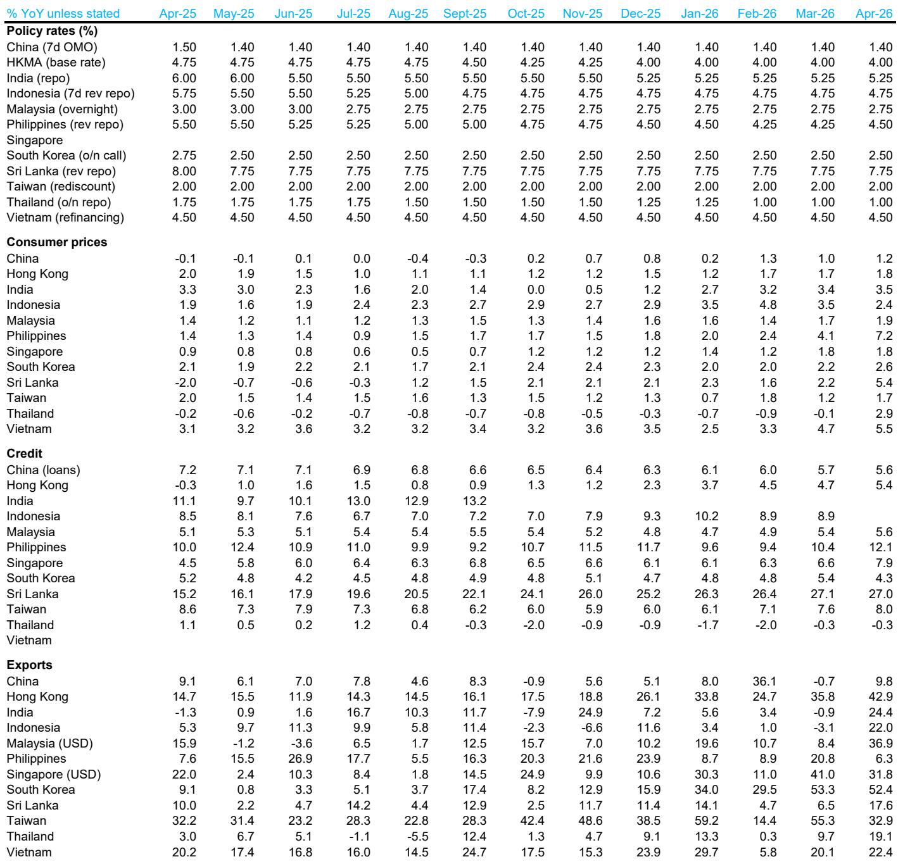
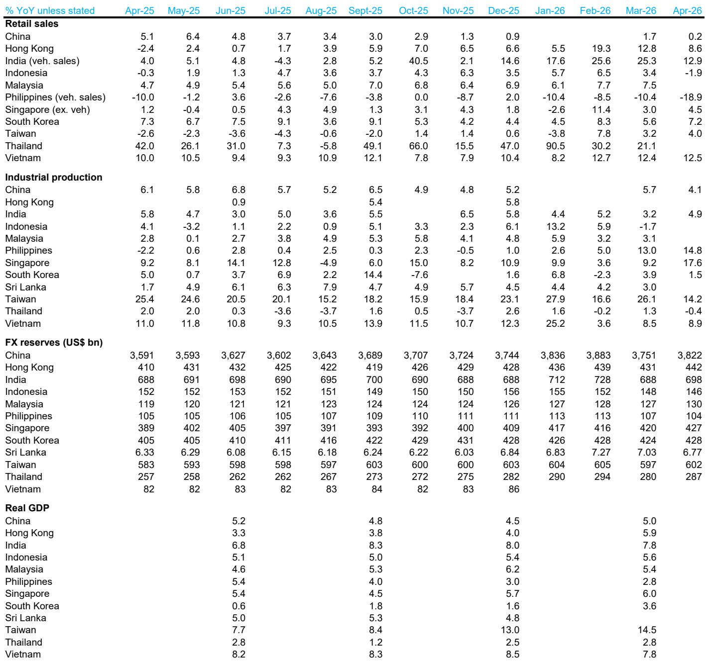
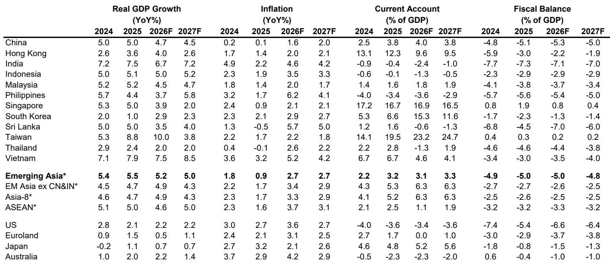

# Asia’s Central Banks Are Not Done Tightening: The Case for More Rate Hikes in a Slowing Economy

The conventional narrative holds that when growth slows, central banks ease. Asia is about to disprove that rule. Across the region, April data reveals a peculiar macroeconomic configuration: growth is decelerating from above-trend levels, inflation is accelerating sharply, and policy makers are responding not with patience but with conviction that further tightening is required. This is not a transitory blip. It is a structural shift in the policy regime that investors must understand to position correctly.

The core argument of the latest Asia Macro Insight from a leading global investment bank is straightforward yet counterintuitive: even as Asia’s GDP growth softens from 5.5% in 2025 to a projected 5.2% in 2026, most central banks will prioritize price and market stability over growth support. The report expects the Bank of Korea and Reserve Bank of India to deliver 100 basis points of rate hikes each, Bank Indonesia and Bangko Sentral ng Pilipinas to hike by 75 basis points each, and Bank Negara Malaysia to bring forward its tightening cycle. The Monetary Authority of Singapore is also expected to tighten again. This is not a dovish pause. It is a coordinated tightening campaign.

Why now matters is the convergence of forces that make this cycle different. Export growth remains resilient at 8.6% for 2026, supported by semiconductor pricing that is improving terms of trade for economies like South Korea and Taiwan. Investment is accelerating, not declining, with gross fixed capital formation rising to 4.9% from 3.8% in 2025. Meanwhile, fuel prices from the Iran conflict are feeding through to transport costs, and food inflation is turning up. The result is that CPI inflation in 2026 is expected to reach 2.7%—roughly three times last year’s level. Central banks face a dilemma that has no easy escape: growth is still above trend, inflation is rising, and the currency channel demands credibility. In this environment, hiking is the only credible option.

## The Growth Slowdown Is Real But Not a Reason to Pause

April data confirms what many had anticipated: growth momentum has weakened. The region’s composite growth indicator turned negative in April for the first time in several months, with China, South Korea, Taiwan, and Indonesia all posting monthly declines. Yet the magnitude of the slowdown is mild—nothing approaching a contraction. The Purchasing Managers’ Index for Asia held up relatively well, and the divergence between North Asia and ASEAN persists, with North Asia showing a stronger rebound.

The key insight here is that the slowdown is happening from above-trend levels, not from recessionary territory. Asia’s GDP growth of 5.2% in 2026 remains robust by historical standards. The deceleration is largely anticipated and concentrated in Q2, which policy makers had already flagged as a soft patch. What matters for central banks is not the level of growth but the trajectory of inflation relative to targets. And on that front, the data is unambiguous: inflation is accelerating, not moderating.

The report notes that manufacturing input costs continue to outpace output prices, which typically squeezes corporate margins. But the semiconductor sector is a critical exception. Stronger semiconductor pricing is likely to more than offset higher import costs, improving terms of trade for South Korea and Taiwan. South Korea is on track for its strongest nominal growth since 1996; Taiwan may reach its highest since 1987. For these economies, the inflation impulse is not purely cost-push—it is accompanied by genuine income gains. That makes the case for rate hikes stronger, not weaker, because the risk of second-round effects through wage demands is real. South Korea is already seeing broader labor union pressure for higher compensation.

## China’s Reflation Is Accelerating Faster Than Expected, and That Changes the Regional Calculus

China’s reflation trajectory has steepened, driven partly by the Iran conflict and partly by improving domestic dynamics. The report revises China’s 2026 GDP growth forecast to 4.7%, a modest 0.2 percentage point downward revision from the previous forecast, but still above the 4.5% projected in the prior World Outlook. The revision reflects softer domestic activity in Q2 and a policy tone fine-tuning at the April Politburo meeting. But the reflation story is progressing faster than anticipated.

PPI inflation is rising, oil prices are feeding through, and AI-related supply constraints are adding upward pressure. Perhaps most significantly, data hint at a durable bottoming-out in China’s housing market. This is not being driven by broad macro stimulus. Instead, improving underlying market dynamics appear to be at work. If sustained, a housing recovery would improve household confidence, local government finances, and demand in traditional parts of the economy. That would add to inflationary pressure and reduce the need for policy support.

The report expects the People’s Bank of China to keep its policy rate unchanged, reflecting mixed signals from the economy and still-ample liquidity. But the direction of travel is clear: China’s reflation reduces the deflation risk that had been a major concern for global markets. For the rest of Asia, a reflating China means stronger import demand, higher commodity prices, and less downward pressure on regional inflation. It also means that Asian central banks cannot rely on Chinese disinflation to offset their own inflationary pressures. The regional inflation floor is rising.

## The Currency Channel Is the Unseen Driver of Tightening

Central banks rarely admit that they are hiking to defend their currencies, but the evidence suggests that FX stabilization is a major motivation. The report explicitly notes that Asian authorities have reinforced their FX stabilization efforts through administrative and regulatory measures to attract foreign capital and deter speculative flows. Rate hikes are part of this toolkit.

The logic is straightforward. With the US Federal Reserve maintaining elevated rates and the Iran conflict adding uncertainty to global energy markets, Asian currencies face depreciation pressure. A weaker currency amplifies imported inflation, especially for fuel and food, which are already rising. Central banks that fail to respond risk a vicious cycle: currency weakness drives inflation higher, which erodes real yields, which weakens the currency further. The only way to break this cycle is to raise rates sufficiently to restore real yield differentials.

The report expects the renminbi to continue its steady appreciation to 6.6 per US dollar by end-2026, supported by accelerating internationalization. But for other Asian currencies, the outlook is less benign. The Bank of Korea is expected to move first with 100 basis points of hikes. Bank Indonesia and the Bangko Sentral ng Pilipinas are projected to hike by 75 basis points each. Bank Negara Malaysia may bring forward its 25 basis point hike from next year to this year. The State Bank of Vietnam remains on the watch list, but its reliance on liquidity management to balance growth and inflation may become harder to sustain as US rates rise.

For investors, the implication is that Asian fixed income remains vulnerable to further repricing. The rate hiking cycle is not nearing its end; it is accelerating. Duration risk is real, and currency hedging costs will remain elevated.

## What the Report Does Not Fully Answer: The Threshold for a Policy Reversal

The report makes a compelling case for further tightening, but it leaves several open questions that are critical for investors. The first is the threshold at which central banks would abandon their tightening bias. If growth slows more sharply than anticipated—say, a genuine supply chain disruption materializes rather than just longer delivery delays—would policy makers pivot? The report notes that worsening delivery times remain a concern for the region’s manufacturing supply chain, but it does not specify at what point this concern would override inflation considerations.

The second open question is the interaction between fiscal and monetary policy. The report notes that China’s fiscal spending has become less supportive since Q2, but a reversal is expected, possibly including new measures to stimulate consumption and investment. If fiscal policy turns expansionary across the region, it would add to demand-side inflationary pressure and reinforce the case for tighter monetary policy. But if fiscal policy tightens simultaneously, the growth slowdown could become more severe than anticipated. The report does not model this scenario in detail.

The third question is the sustainability of export demand. The report’s constructive baseline assumes that Asia’s export growth will remain robust at 8.6% in 2026, supported by global AI investment, green transition, and market share expansion in emerging markets. But the downside risks are significant: the Iran war and US trade policy actions, including Section 301 investigations, pose real threats. If export growth decelerates more sharply than expected, the entire macro configuration changes. Central banks would face a genuine trade-off between inflation and growth, and the current consensus for further tightening could fracture.

## A Decision Framework for Investors

How should investors process this analysis? The report provides the building blocks for a structured decision framework. The first step is to distinguish between economies where the inflation impulse is driven by income gains versus cost-push pressures. South Korea and Taiwan, with their semiconductor-driven terms of trade improvements, are in the former category. Their central banks have a stronger case for hiking because inflation is accompanied by rising nominal incomes. The risk of second-round effects through wage demands is higher, and the cost of delaying action is greater.

The second distinction is between economies with credible inflation targeting frameworks and those without. The Bank of Korea and Reserve Bank of India have established track records of inflation fighting. Their policy actions are more predictable and their communication more transparent. For these central banks, the market should take their hawkish signals at face value. For others, the gap between rhetoric and action may be wider.

The third distinction is between economies with flexible exchange rates and those that manage their currencies more actively. Economies with managed exchange rates face a tighter constraint: they cannot simultaneously stabilize their currencies and maintain independent monetary policy. If the dollar remains strong, these central banks will be forced to hike more than their fundamentals would otherwise warrant. The report’s emphasis on administrative and regulatory measures to support currencies suggests that policy makers are acutely aware of this constraint.

For portfolio construction, the framework suggests the following: overweight economies with income-driven inflation and credible central banks; underweight those with cost-push inflation and managed exchange rates; and maintain a defensive position on duration across the region. The hiking cycle has further to run, and the risk of a policy mistake—either too tight or too loose—is elevated.

## The Unresolved Questions That Make the Full Report Essential Reading

The analysis presented here captures the main argument, but the full report contains depth that this summary cannot replicate. The report includes detailed country-by-country analysis for eleven Asian economies, each with specific forecasts for growth, inflation, and policy rates. It includes heat maps of growth and inflation dynamics, monetary policy monitors, and macro charts that show the evolution of key variables over time. The original charts—which this article references but cannot reproduce—provide the visual evidence that underpins the report’s conclusions.

Several questions remain unanswered even after reading the full report. How will the US-Iran situation evolve, and what is the report’s contingency plan for a sustained oil price spike? What is the precise mechanism by which China’s housing market bottoming would transmit to the rest of Asia? How would a sharper-than-expected slowdown in global tech demand alter the outlook for South Korea and Taiwan? These are the questions that serious investors need to explore, and the full report provides the data and analytical framework to do so.

Join the community to read the full report and review the original charts.

*This article is for learning and discussion only and does not constitute investment advice.*

Personal reading notes and learning share only. Not investment advice.

