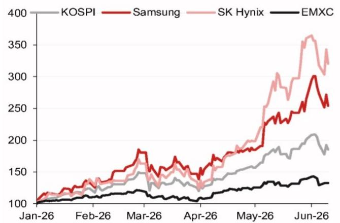

## Asia Insights

Foreign Exchange - Asia ex-Japan

## KRW: Rising Korean equities could create a "paradoxical phenomenon" of FX demand

There are still reasons to remain cautious on KRW, despite some positive shifts in external and local factors.

- Our negative stance on KRW is gradually shifting, due to recent external and local developments, but here are still reasons to be cautious.  
- Overall, we believe that, without an alignment of several factors – including de-escalation in US-Iran that drives a softer USD, an increase in Korean exporters' remittance and relatively less exuberance (but without risk negativity) on the global AI cycle – Korea's BoP dynamics will remain unfavorable.  
- We conducted a scenario analysis on Korea's BOP dynamics, taking into account three scenarios of FX demand.  
- One key driver of Korea BOP dynamics is National Pension Service's (NPS) revision of its 2026 asset allocation targets, which implies reduced local portfolio outflows.  
- However, in our assessment, rising domestic equity values are a bane to KRW, as the NPS may still need to rebalance some of its domestic equities allocation.  
- Furthermore, a further rally in Samsung Electronics and SK Hynix could trigger significant forced selling by funds that have a $10\%$ single-stock cap rule.  
- If Samsung Electronics and SK Hynix rally by 60%, and the broader market rallies by 10%, foreign outflows from these stocks could reach as much as USD48bn.  
- Interestingly, Korea Chief Presidential Secretary for Policy Mr Kim commented (Yonhap Infomax, 25 May) that recent KRW weakness is “a paradoxical phenomenon created by success, rather than a vulnerability of the Korean economy”.

Korea's surging current account surplus (as high as USD37.3bn in March 2026; \~23% of GDP annualised), driven by its strong tech exports, and the strong outperformance in KOSPI index (YTD: +87%; top performing major global index) should have resulted in KRW outperformance. However, KRW has instead weakened by \~5.5% year-to-date against both USD and its NEER basket, as one of the worst performers in AeJ.

## Our negative stance on KRW...

We have maintained a negative stance on KRW so far this year; we first initiated a short KRW versus CNH position on 8 January 2026, which reached our $6\%$ target on 31

March, and we have since remained cautious because of negative BoP pressures (i.e., higher energy prices, retail portfolio outflows, NPS overseas investments, FX hoarding, the K-shaped economy and limited impactful measures taken by Korean authorities, as discussed in our 14 April publication).

## ... is gradually turning due to recent external and local developments...

From here, we are turning less negative on KRW, owing to improvements in both external and local conditions, as any signing of a US-Iran agreement would likely represent a partial relief from the terms-of-trade shock across many local FX (i.e., broad USD should weaken). Locally in Korea, there have also been a few significant changes in capital flow dynamics, including the NPS announcing meaningful changes to its end-2026 portfolio allocation targets (i.e., increasing allocation to domestic equities; see below), as well as Korean retailers shifting to net small sellers of US portfolio assets in recent months (April and May 2026 also marked the first two consecutive months of net selling since June 2023).

## ... but there are still reasons to remain cautious

However, there are reasons to remain cautious on KRW until we see significant global

## Research Analysts

## Asia FX Strategy

Craig Chan - NSL

craig.chan@NOM.com

+65 6433 6106

Wee Choon Teo - NSL

weechoon.teo@NOM.com

+65 6433 6107

Vicky Chen - NSL

vicky.chen1@NOM.com

+65 6433 6540

Manthan Shingala - NSL

manthan.shingala1@NOM.com

+65 6433 6427

tailwind from a weaker broad USD. These include: 1) a lack of clarity over whether the recent near-zero Korean retail allocation into US equities is a temporary pause. The US remains the anchor of the global AI theme, and upcoming IPOs – including SpaceX (likely on 12 June), Anthropic and OpenAI (likely in H2 2026) – could attract significant Korean retail interest; 2) the change in NPS's asset allocation targets, which may not be sufficient to completely stop its overseas allocations, especially if NPS's AUM continues to grow, even if led only by gains in its domestic equities allocation (see below); 3) our analysis showing a risk of large foreign equity outflows, if Samsung Electronics and SK Hynix continue to outperform strongly, owing to the 10% single-stock cap rule on global funds (see below); and 4) statements by Korean authorities (Bloomberg, 8 June) and local media reports (Chosun, 26 May) suggesting Korean corporates are hoarding USD, which means a notable reduction in actual net trade settlement inflows.

Overall, we believe an alignment of several factors is necessary for KRW to outperform ahead. The first being a de-escalation in US-Iran (softer USD) and RMB appreciation, which could lead to an increase in Korean exporter remittances. Another factor is a reduction in the exuberance (but no risk negativity) over the global AI cycle, which could sustain the slowdown in Korean retail portfolio outflows into the US, lower the risk of foreign equity selling because of the $10\%$ single-stock cap rule and slow the NPS's AUM growth (thereby lowering the need to diversify overseas). However, we are likely not there yet: Korea's BoP dynamics could remain unfavorable without an alignment of these aforementioned factors.

## A scenario analysis on Korea's BoP dynamics

We conducted a scenario analysis on Korea's BOP dynamics, taking into account three scenarios of FX demand over a 12-month period from: i) Korean corporates' USD hoarding; ii) Korea government's commitment for a USD200bn cash investment into the US, capped at USD20bn annually; iii) NPS's and Korean retailers' local portfolio outflows; and iv) foreign portfolio outflows (i.e., $10\%$ single-stock cap rule and WGBI inclusion).

1. In a negative BOP scenario (A), where Korean corporate repatriate $40.4\%$ (based on China's weak corporate repatriation ratio between January and November 2025) of the USD325bn current account surplus (i.e., NOM's forecast from Q3 2026 to Q2 2027), retail investors purchase foreign portfolio assets at a very strong pace (i.e., the pace observed in the 12 months to March 2026; USD47.2bn) and strong outperformances by Samsung and SK Hynix (100% gains) trigger foreign investors to aggressively limit their holdings (among other assumptions; see Figure 1), Korea's major BOP flows would be very negative, with net outflows of USD204.7bn.

2. In a moderate BOP scenario (B), where Korean corporate repatriate $60.1\%$ (based average of A and C) of the USD325bn current account surplus (i.e., NOM's forecast from Q3 2026 to Q2 2027), retail investors slow purchases of foreign portfolio assets to $50\%$ of scenario (A), and outperformances by Samsung and SK Hynix $(60\%)$ trigger a rather large unwinding of foreign investor positioning (among other assumptions; see Figure 1), Korea's major BOP flows would be slightly negative, with net outflows of USD16.7bn.

3. In a positive BOP scenario (C), where Korean corporate repatriate $79.8\%$ (based on China's strong corporate repatriation ratio over the past five months to April 2026) of the USD325bn current account surplus (i.e., NOM's forecast from Q3 2026 to Q2 2027), retail investors slow their purchases of foreign portfolio assets to zero, and modest outperformances by Samsung and SK Hynix $(30\%)$ trigger a limited unwinding of foreign investor positioning (among other assumptions; see Figure 1), Korea's major BOP flows would be very positive, with net inflows of USD149.6bn.

Fig. 1: Simulation of Korea's major BOP components

<table><tr><td colspan="12">Korea major BOP components</td></tr><tr><td>USD bn</td><td>2020</td><td>2021</td><td>2022</td><td>2023</td><td>2024</td><td>2025</td><td>Avg fr 2020</td><td>Past 12M</td><td>Scenario A (12M)</td><td>Scenario B (12M)</td><td>Scenario C (12M)</td></tr><tr><td>Current Account</td><td>76</td><td>84</td><td>23</td><td>33</td><td>100</td><td>123</td><td>75</td><td>202</td><td>131</td><td>195</td><td>259</td></tr><tr><td>Financial Account</td><td>-59</td><td>-64</td><td>-48</td><td>-35</td><td>-90</td><td>-117</td><td>-71</td><td>-174</td><td>-336</td><td>-212</td><td>-109</td></tr><tr><td>FDI Asset</td><td>-35</td><td>-66</td><td>-66</td><td>-32</td><td>-50</td><td>-41</td><td>-43</td><td>-57</td><td>-115</td><td>-96</td><td>-77</td></tr><tr><td>FDI Liability</td><td>9</td><td>22</td><td>25</td><td>19</td><td>13</td><td>16</td><td>16</td><td>22</td><td>22</td><td>22</td><td>22</td></tr><tr><td>PI Asset (Eqt+Dbt)</td><td>-59</td><td>-78</td><td>-46</td><td>-45</td><td>-67</td><td>-140</td><td>-70</td><td>-128</td><td>-114</td><td>-66</td><td>-22</td></tr><tr><td>PI Liability (Eqt+Dbt)</td><td>17</td><td>59</td><td>20</td><td>37</td><td>21</td><td>53</td><td>26</td><td>13</td><td>-92</td><td>-41</td><td>-8</td></tr><tr><td>Net OI</td><td>9</td><td>0</td><td>19</td><td>-14</td><td>-7</td><td>-4</td><td>1</td><td>-24</td><td>-37</td><td>-31</td><td>-24</td></tr><tr><td>Net of major BOP components</td><td>17.1</td><td>20.2</td><td>-24.3</td><td>-2.9</td><td>10.2</td><td>5.6</td><td>4.0</td><td>27.6</td><td>-204.7</td><td>-16.7</td><td>149.6</td></tr></table>

Note: 1) CA is NOM forecasts – Q3 2026 to Q2 2027 (USD325bn surplus). Scenario (A): assume 40.4% of CA are converted back to KRW, based on China's weak corporate repatriation ratio between Jan to Nov 2025; (B): average ratio of (A) and (C); and (C): 79.8% of CA, based on China's strong corporate repatriation ratio in the past 5M to April 2026.  
2) FDI Asset: (A): 1.5x of past 12M realised net FDI plus pledged US investment of USD20bn per annum cap; (B): average of (A) and (C); (C): past 12M realised net FDI plus pledged US investment of USD20bn per annum cap.  
3) PI Asset: i) on Korean retail portfolio outflows: (A): assume strong retail outflows portfolio of USD47.2bn observed in the 12 months to Mar 2026; (B): assume half of (A); (C): assume zero outflows. ii) on NPS outflows: (A): assume rebalancing outflows of USD67.1bn (away from domestic equities) if Samsung/SK Hynix up $100\%$ , others up $10\%$ ; (B): outflows of USD42.9bn if Samsung/SK Hynix up $60\%$ , others up $10\%$ ; (C) outflows of USD22.0bn if Samsung/SK Hynix up $30\%$ , others up $5\%$ .  
4) PI Liability: i) on foreign equity outflows: Scenario (A): assume outflows of USD95.3bn if Samsung/SK Hynix up 100%, others up 10%; (B): outflows of USD47.9bn if Samsung/SK Hynix up 60%, others up 10%; (C) outflows of USD18.9bn if Samsung/SK Hynix up 30%, others up 5%. ii) on foreign bond inflows from FTSE WGBI inclusion wt at 2.05% (AUM USD2.75trn) from April 2026 over 8 months of equal allocation: (A) 90% FX hedged; (B) 80% FX hedged; and (C) 70% FX hedged.  
5) Net OI: (A): assume OI outflows picked up to 1.5 times of (C) over the past 12 months; (B): average of (A) and (C); (C): past 12M Net OI. Source: Bloomberg, CEIC, Korea NPS, NOM.

## NPS's revised 2026 asset allocation targets implies reduced portfolio outflows...

Following its fifth fund management committee meeting, NPS announced adjustments to its target weightings for 2026, as well as approved the medium-term asset allocation for 2027-2031. Focusing on NPS's 2026 asset allocation target, the key changes are:

- Increase the end-2026 target weighting of domestic stocks to 20.8% (from 14.9%) in order to “enhance the fund's long-term profitability... mitigate the market impact of rebalancing... possibility of structural changes in the domestic stock market”.  
- NPS also temporarily expanded the allowable range for Strategic Asset Allocation (SAA) “to flexibly respond to the highly volatile domestic equity market” (MOHW press release, 28 May). Although NPS did not disclose the new SAA range, Yonhap Infomax (29 May) reported that the range has been temporarily expanded from 3% to 6%. Including NPS’s 2% Tactical Asset Allocation range, this implies NPS may temporarily hold up to 28.8% in domestic equities before mandatory rebalancing.  
- The new target will only be applicable “from end-June, when the rebalancing grace period ends” (MOHW press release, 28 May). Recall that, at its first fund management committee meeting, NPS had also temporarily refrained from rebalancing its portfolio when the SAA tolerance (i.e., +/-3%) was exceeded.  
- Overall, by our calculations, NPS's new target allocation into domestic assets (i.e., equities, bonds and alternatives) will rise to $45.3\%$ from $41.3\%$ , based on its previous 26 January 2026 revision. Based on latest asset allocation data from March 2026 and NPS's new targets, we estimate that NPS's outflows to overseas assets for the remaining of 2026 may be close to zero (i.e., USD1.2bn), from outflows of USD43.9bn based on previous targets set in January 2026 (Figure 2).

Fig. 2: Korea NPS's new 2026 asset allocation targets as announced on 28 May 2026

<table><tr><td>Financial Investments</td><td colspan="2">Actual as of Mar-2026</td><td colspan="2">NPS target as of End-2026 (Jan)</td><td colspan="2">NPS target as of End-2026 (May)</td><td colspan="2">Flow impact by end 2026 JAN (Mar-26 Act. to end-26 Tgt.)</td><td colspan="2">Flow impact by end 2026 MAY (Mar-26 Act. to end-26 Tgt.)</td></tr><tr><td></td><td>%</td><td>KRW trn</td><td>%</td><td>KRW trn</td><td>%</td><td>KRW trn</td><td>KRW trn</td><td>USD bn</td><td>KRW trn</td><td>USD bn</td></tr><tr><td>Domestic Equities</td><td>21.1%</td><td>321</td><td>14.9%</td><td>242</td><td>20.8%</td><td>337</td><td>-79.3</td><td>-52.1</td><td>16.4</td><td>10.8</td></tr><tr><td>Domestic Bonds</td><td>19.2%</td><td>293</td><td>24.9%</td><td>404</td><td>23.1%</td><td>375</td><td>111.2</td><td>73.1</td><td>82.0</td><td>53.9</td></tr><tr><td>Domestic Alternatives*</td><td>1.6%</td><td>24</td><td>1.5%</td><td>24</td><td>1.4%</td><td>22</td><td>-0.4</td><td>-0.3</td><td>-2.0</td><td>-1.3</td></tr><tr><td>Overseas Equities</td><td>36.6%</td><td>557</td><td>37.2%</td><td>603</td><td>34.7%</td><td>563</td><td>46.2</td><td>30.4</td><td>5.7</td><td>3.7</td></tr><tr><td>Overseas Bonds</td><td>6.9%</td><td>105</td><td>8.0%</td><td>130</td><td>7.4%</td><td>120</td><td>24.4</td><td>16.1</td><td>14.7</td><td>9.7</td></tr><tr><td>Overseas Alternatives*</td><td>14.7%</td><td>223</td><td>13.5%</td><td>220</td><td>12.6%</td><td>205</td><td>-3.9</td><td>-2.6</td><td>-18.6</td><td>-12.2</td></tr><tr><td>Total**</td><td></td><td>1523</td><td></td><td>1622</td><td></td><td>1622</td><td>98</td><td>65</td><td>98</td><td>65</td></tr><tr><td>Domestic</td><td>41.9%</td><td>638</td><td>41.3%</td><td>669</td><td>45.3%</td><td>734</td><td>31.5</td><td>20.7</td><td>96.4</td><td>63.3</td></tr><tr><td>Overseas</td><td>58.1%</td><td>886</td><td>58.7%</td><td>953</td><td>54.7%</td><td>888</td><td>66.7</td><td>43.9</td><td>1.8</td><td>1.2</td></tr></table>

Note: \*Assume breakdown of domestic (9.7%) versus overseas (90.3%) alternatives asset is similar to that of Mar-2026. \*\* 2026 AUM growth is based on NPS's projection of KRW131trn (scaled linearly) on top of the latest available AUM as of Mar-2026. Use USD/KRW rate at 1,522 as of 10-Jun-2026. May allocation is based on NPS' 28 May 2026 announcement that it will increase its 2026 allocation to domestic equities (+5.9pp).  
Source: Bloomberg, NPS, NOM.

... however, rising domestic equities value is a bane to KRW, as NPS may still need to rebalance some of its domestic equities allocation...

However, this may severely understate potential NPS portfolio outflows into overseas assets amid a surging domestic stock market. Indeed, our Korea equity strategy team raised our 2026 KOSPI target to 10000-11000 (from 7,500-8,000), implying up to $36\%$ upside from the current level of $\sim 8,097$ , owing to AI-driven earnings generating sustainable ROE.

- Since 31 March 2026 (latest available NPS asset allocation data), the KOSPI Index has rallied by \~60%. Assuming NPS's domestic equities allocation rose by that percentage and keeping everything else unchanged, we estimate NPS may need to reallocate into USD70.5bn worth of overseas assets to meet its new end-2026 allocation targets (Figure 3).  
- Interestingly, NPS noted that the new allocation targets will only be applicable “from end-June, when the rebalancing grace period ends” (MOHW press release, 28 May). With the hypothetical domestic allocation based on 60% KOSPI rally since March 2026 already at 29.9%, the risk is that NPS may need to continue reducing its domestic equities holdings until the end of June 2026. Local media (Yonhap Infomax, 29 May) reported that NPS’s current holdings of domestic stocks may be in the “low 27% range”.  
- We note that NPS's actual allocation into domestic equities dropped to 21.1% in March 2026 from 24.7% in February 2026, while actual allocation into overseas equities and bonds rose to 36.6% and 6.9%, respectively, in March 2026, from 35.8% and 6.3% in February 2026. Along with valuation effects (in March 2026, KOSPI: -19.1%, S&P500: -5.1%), NPS's rebalancing into overseas portfolio assets could also have contributed to onshore spot USD/KRW breaking new highs in March 2026 (1,536.95 on 31 March 2026), along with the impact of Iran war and foreign investor selling of local equities (-USD23.8bn).

Fig. 3: The $60\%$ rally in KOSPI index since 31 March 2026 implies that NPS may need to continue unwinding some of its domestic equities holdings

<table><tr><td>Financial Investments</td><td colspan="2">KOSPI up 70% since Mar-2026</td><td colspan="2">NPS target as of End-2026 (Jan)</td><td colspan="2">NPS target as of End-2026 (May)</td><td colspan="2">Flow impact by end 2026 JAN (Mar-26 Act. to end-26 Tgt.)</td><td colspan="2">Flow impact by end 2026 MAY (Mar-26 Act. to end-26 Tgt.)</td></tr><tr><td></td><td>%</td><td>KRW trn</td><td>%</td><td>KRW trn</td><td>%</td><td>KRW trn</td><td>KRW trn</td><td>USD bn</td><td>KRW trn</td><td>USD bn</td></tr><tr><td>Domestic Equities</td><td>29.9%</td><td>513</td><td>14.9%</td><td>270</td><td>20.8%</td><td>377</td><td>-243.1</td><td>-159.7</td><td>-136.1</td><td>-89.4</td></tr><tr><td>Domestic Bonds</td><td>17.1%</td><td>293</td><td>24.9%</td><td>452</td><td>23.1%</td><td>419</td><td>159.1</td><td>104.6</td><td>126.5</td><td>83.1</td></tr><tr><td>Domestic Alternatives*</td><td>1.4%</td><td>24</td><td>1.5%</td><td>27</td><td>1.4%</td><td>25</td><td>2.4</td><td>1.6</td><td>0.6</td><td>0.4</td></tr><tr><td>Overseas Equities</td><td>32.5%</td><td>557</td><td>37.2%</td><td>675</td><td>34.7%</td><td>630</td><td>117.9</td><td>77.4</td><td>72.5</td><td>47.6</td></tr><tr><td>Overseas Bonds</td><td>6.1%</td><td>105</td><td>8.0%</td><td>145</td><td>7.4%</td><td>134</td><td>39.8</td><td>26.2</td><td>28.9</td><td>19.0</td></tr><tr><td>Overseas Alternatives*</td><td>13.0%</td><td>223</td><td>13.5%</td><td>246</td><td>12.6%</td><td>229</td><td>22.1</td><td>14.5</td><td>5.8</td><td>3.8</td></tr><tr><td>Total**</td><td></td><td>1716</td><td></td><td>1814</td><td></td><td>1814</td><td>98</td><td>65</td><td>98</td><td>65</td></tr><tr><td>Domestic</td><td>48.4%</td><td>830</td><td>41.3%</td><td>749</td><td>45.3%</td><td>821</td><td>-81.6</td><td>-53.6</td><td>-9.0</td><td>-5.9</td></tr><tr><td>Overseas</td><td>51.6%</td><td>886</td><td>58.7%</td><td>1066</td><td>54.7%</td><td>993</td><td>179.8</td><td>118.2</td><td>107.2</td><td>70.5</td></tr></table>

Note: \*Assume breakdown of domestic (9.7%) versus overseas (90.3%) alternatives asset is similar to that of Mar-2026. \*\* 2026 AUM growth is based on NPS's projection of KRW131trn (scaled linearly) on top of the latest available AUM as of Mar-2026. Use USD/KRW rate at 1,522 as of 10-Jun-2026. May allocation is based on NPS' 28 May 2026 announcement that it will increase its 2026 allocation to domestic equities (+5.9pp).  
Source: Bloomberg, NPS, NOM.

... rising domestic equity values could also trigger significant forced selling by funds that have a $10\%$ single-stock cap rule...

Around mid-May 2026, our discussions with market participants suggested very large foreign outflows from Korea equity market were predominantly caused by portfolio management at equity funds, where money managers may be required to limit exposure to any single stock to below $10\%$ of total AUM.

For example, European Union's UCITS (Undertakings for Collective Investment in Transferable Securities) regulation stipulates that a UCITS fund cannot hold more than $10\%$ of its assets in a single issuer and the assets where holdings are greater than $5\%$ should not accumulate to more than $40\%$ of total. Major equity index benchmark providers also have indexes that have implemented similar rules (e.g., MSCI 10/40 Indexes).

We understand that some fund allocations into Samsung Electronics and SK Hynix may have breached the $10\%$ limit (Bloomberg, 29 May) following their very strong rally in May (43% and 83%, respectively; Figure 4).

... and we estimate that a further rally by Samsung Electronics and SK Hynix could trigger further large foreign equity outflows

With this in mind, we estimate the evolution of the index weightings of these two largest Korean semiconductor companies within the major equity indexes that have 10/40 allocation constraints since the start of May 2026. We are also able to conduct a scenario analysis on potential foreign outflows from these two stocks, if they continue to rally strongly, as forecasted by our Korea Tech equity team. From the closing price of 9 June 2026, our team forecasts (see Global Memory – Real AI boom is here, embrace the new regime, 15 May 2026) 80% and 79% of further potential upside in Samsung Electronics and SK Hynix, respectively.

## Our key takeaways are as such:

- Our estimates suggest fund allocations into Samsung Electronics and SK Hynix may have breached the 10% limit around 13 May 2026 and 6 May 2026, respectively, broadly in line with when market discussions on the topic began.  
- Based on broad assumptions that these “10% limit capped funds” rebalanced their portfolio to keep within limits in May, and that outflows from Samsung Electronics and SK Hynix were predominately driven by these funds, we can estimate the total AUM size of these “10% limit capped funds”. With these, we conducted a scenario analysis on the potential flow portfolio outflows based on the rally in Samsung and SK Hynix, and the broader market (i.e., MSCI EM ex-China).  
- In the scenario where Samsung Electronics and SK Hynix rally by 60% (close to NOM's forecast), and the broader market rallies by 10% (close to the rally in broader market – MSCI EM ex-China – in May 2026), foreign outflows from these stocks could reach USD48bn (Figure 5). We note that outflows from Samsung Electronics and SK Hynix totalled USD24.6bn in May 2026.

Fig. 4: Samsung and SK Hynix outperformed (Jan-2026 = 100)  

line chart

| Date   | KOSPI | Samsung | SK Hynix | EMXC |
|--------|-------|---------|----------|------|
| Jan-26 | 100   | 100     | 100      | 100  |
| Feb-26 | 120   | 130     | 125      | 105  |
| Mar-26 | 140   | 180     | 150      | 110  |
| Apr-26 | 130   | 150     | 140      | 105  |
| May-26 | 170   | 220     | 200      | 130  |
| Jun-26 | 210   | 300     | 360      | 140  |

Source: Bloomberg, NOM.

Fig. 5: Scenario analysis on potential foreign selling of Samsung and SK Hynix on rally

<table><tr><td rowspan="2" colspan="2">Est. Foreign outflows (USD bn)</td><td colspan="4">Broad mkt move</td></tr><tr><td>2%</td><td>5%</td><td>10%</td><td>20%</td></tr><tr><td rowspan="4">Samsung and Sk Hynix move</td><td>10%</td><td>3</td><td>0</td><td>0</td><td>0</td></tr><tr><td>30%</td><td>23</td><td>19</td><td>13</td><td>4</td></tr><tr><td>60%</td><td>58</td><td>54</td><td>48</td><td>35</td></tr><tr><td>100%</td><td>106</td><td>102</td><td>95</td><td>82</td></tr></table>

Source: Bloomberg, NOM.

## Appendix A-1

This report has been produced by NOM Singapore Ltd. (NSL), Singapore.

See Disclaimers for NOM Group entity details.

## Analyst Certification

We, Craig Chan, Wee Choon Teo, Vicky Chen and Manthan Shingala, hereby certify (1) that the views expressed in this Research report accurately reflect our personal views about any or all of the subject securities or issuers referred to in this Research report, (2) no part of our compensation was, is or will be directly or indirectly related to the specific recommendations or views expressed in this Research report and (3) no part of our compensation is tied to any specific investment banking transactions performed by NOM Securities International, Inc., NOM International plc or any other NOM Group company.

## Important Disclosures

## Online availability of research and conflict-of-interest disclosures

NOM Group research is available on www.NOMnow.com/research, Bloomberg, Capital IQ, Factset, LSEG.

Important disclosures may be read at http://go.NOMnow.com/research/m/Disclosures or requested from NOM Securities International, Inc. If you have any difficulties with the website, please email grpsupport@NOM.com for help.

The analysts responsible for preparing this report have received compensation based upon various factors including the firm's total revenues, a portion of which is generated by Investment Banking activities. Unless otherwise noted, the non-US analysts listed at the front of this report are not registered/qualified as research analysts under FINRA rules, may not be associated persons of NSI, and may not be subject to FINRA Rule 2241 restrictions on communications with covered companies, public appearances, and trading securities held by a research analyst account.

NOM Global Financial Products Inc. (NGFP) NOM Derivative Products Inc. (NDP) and NOM International plc. (NIplc) are registered with the Commodities Futures Trading Commission and the National Futures Association (NFA) as swap dealers. NGFP, NDPI, and NIplc are generally engaged in the trading of swaps and other derivative products, any of which may be the subject of this report.

## ADDITIONAL DISCLOSURES REQUIRED IN THE U.S.

Principal Trading: NOM Securities International, Inc and its affiliates will usually trade as principal in the fixed income securities (or in related derivatives) that are the subject of this research report. Analyst Interactions with other NOM Securities International, Inc. Personnel: The fixed income research analysts of NOM Securities International, Inc and its affiliates regularly interact with sales and trading desk personnel in connection with obtaining liquidity and pricing information for their respective coverage universe.

## Valuation methodology - Fixed Income

NOM's Fixed Income Strategists express views on the price of securities and financial markets by providing trade recommendations. These can be relative value recommendations, directional trade recommendations, asset allocation recommendations, or a mixture of all three.

The analysis which is embedded in a trade recommendation would include, but not be limited to:

- Fundamental analysis regarding whether a security's price deviates from its underlying macro- or micro-economic fundamentals.  
• Quantitative analysis of price variations.  
- Technical factors such as regulatory changes, changes to risk appetite in the market, unexpected rating actions, primary market activity and supply/ demand considerations.

The timeframe for a trade recommendation is variable. Tactical ideas have a short timeframe, typically less than three months. Strategic trade ideas have a longer timeframe of typically more than three months.

For the purposes of the EU Market Abuse Regulation, the distribution of ratings published by NOM Global Fixed Income Research is as follows:

52% have been assigned a Buy (or equivalent) rating; 50% of issuers with this rating were supplied material services\* by the NOM Group\*\*, 0% have been assigned a Neutral (or equivalent) rating.

48% have been assigned a Sell (or equivalent) rating; 50% of issuers with this rating were supplied material services by the NOM Group. As at 31 Mar 2026.

\*As defined by the EU Market Abuse Regulation

\*\*The NOM Group as defined in the Disclaimer section at the end of this report

## Disclaimers

This publication contains material that has been prepared by the NOM Group entity identified on page 1 and, if applicable, with the contributions of one or more NOM Group entities whose employees and their respective affiliations are specified on page 1 or identified elsewhere in this publication. The term "NOM Group" used herein refers to NOM Holdings, Inc. and its affiliates and subsidiaries including: (a) NOM Securities Co., Ltd. ('NSC') Tokyo, Japan, (b) NOM Financial Products Europe GmbH ('NFPE'), Germany, (c) NOM International plc ('NIplc'), UK, (d) NOM Securities International, Inc. ('NSI'), New York, US, (e) NOM International (Hong Kong) Ltd.

('NIHK'), Hong Kong, (f) NOM Financial Investment (Korea) Co., Ltd. ('NFIK'), Korea (Information on NOM analysts registered with the Korea Financial Investment Association ('KOFIA') can be found on the KOFIA Intranet at http://dis.kofia.or.kr, (g) NOM Singapore Ltd. ('NSL'), Singapore (Registration number 197201440E, regulated by the Monetary Authority of Singapore) (h) NOM Australia Ltd. ('NAL'), Australia (ABN 48 003 032 513), regulated by the Australian Securities and Investment Commission ('ASIC') and holder of an Australian financial services licence number 246412, (i) NOM Securities Malaysia Sdn. Bhd. ('NSM'), Malaysia, (j) NIHK, Taipei Branch ('NITB'), Taiwan, (k) NOM Financial Advisory and Securities (India) Private Limited ('NFASL'), Mumbai, India (Registered Address: Ceejay House, Level 11, Plot F, Shivsagar Estate, Dr. Annie Besant Road, Worli, Mumbai- 400 018, India; Tel: 91 22 4037 4037, Fax: 91 22 4037 4111; CIN No: U74140MH2007PTC169116, SEBI Registration No. for Stock Broking activities : INZ000255633; SEBI Registration No. for Merchant Banking : INM000011419; SEBI Registration No. for Research: INH000001014 - Compliance Officer: Ms. Pratiksha Tondwalkar, 91 22 40374904, grievance email: investorgrievancesra@NOM.com Webpage: LINK

For reports with respect to Indian public companies or authored by India-based NFASL research analysts: (i) Investment in securities markets is subject to market risks. Read all the related documents carefully before investing. (ii) Registration granted by SEBI, and certification from NISM in no way guarantee performance of the intermediary or provide any assurance of returns to investors. (iii) NFASL terms and conditions for availing research services is disclosed on NFASL webpage.

(I) NOM Fiduciary Research & Consulting Co., Ltd. ('NFRC') Tokyo, Japan. (m) NOM Orient International Securities Co., Ltd ("NOI"), is a majority owned joint venture amongst NOM Group, Orient International (Holding) Co., Ltd, and Shanghai Huangpu Investment Holding (Group) Co., Ltd. In accordance with the laws of the People's Republic of China ("PRC", excluding Hong Kong, Macau and Taiwan, for the purpose of this document), NOI is licensed in the PRC to provide securities research and investment recommendations and it operates independently from the other members of the NOM Group; in particular, NOI's interests in PRC securities are not disclosed to, or aggregated with the holdings of, any other NOM Group entities and the interests in PRC securities of other NOM Group entities are not disclosed to, or aggregated with the holdings of, NOI. An individual name printed next to NOI on the front page of a research report indicates that individual is employed by NOI to provide research assistance to NIHK under a research partnership agreement. 'NSFSPL' next to an employee's name on the front page of a research report indicates that the individual is employed by NOM Structured Finance Services Private Limited to provide assistance to certain NOM entities under inter-company agreements. 'Verdhana' next to an individual's name on the front page of a research report indicates that the individual is employed by PT Verdhana Sekuritas Indonesia ('Verdhana') to provide research assistance to NIHK under a research partnership agreement and neither Verdhana nor such individual is licensed outside of Indonesia.

THIS MATERIAL IS: (I) FOR YOUR PRIVATE INFORMATION, AND WE ARE NOT SOLICITING ANY ACTION BASED UPON IT; (II) NOT TO BE CONSTRUED AS AN OFFER TO SELL OR A SOLICITATION OF AN OFFER TO BUY ANY SECURITIES IN ANY JURISDICTION WHERE SUCH OFFER OR SOLICITATION WOULD BE ILLEGAL; AND (III) OTHER THAN DISCLOSURES RELATING TO THE NOM GROUP, BASED UPON INFORMATION FROM SOURCES THAT WE CONSIDER RELIABLE, BUT HAS NOT BEEN INDEPENDENTLY VERIFIED BY NOM GROUP.

Other than disclosures relating to the NOM Group, the NOM Group does not warrant, represent or undertake, express or implied, that the document is fair, accurate, complete, correct, reliable or fit for any particular purpose or merchantable, and to the maximum extent permissible by law and/or regulation, does not accept liability (in negligence or otherwise, and in whole or in part) for any act (or decision not to act) resulting from use of this document and related data. To the maximum extent permissible by law and/or regulation, all warranties and other assurances by the NOM Group are hereby excluded and the NOM Group shall have no liability (in negligence or otherwise, and in whole or in part) for any loss howsoever arising from the use, misuse, or distribution of this material or the information contained in this material or otherwise arising in connection therewith.

Opinions or estimates expressed are current opinions as of the original publication date appearing on this material and the information, including the opinions and estimates contained herein, are subject to change without notice. The NOM Group, however, expressly disclaims any obligation, and therefore is under no duty, to update or revise this document. Any comments or statements made herein are those of the author(s) and may differ from views held by other parties within NOM Group. Clients should consider whether any advice or recommendation in this report is suitable for their particular circumstances and, if appropriate, seek professional advice, including tax advice. The NOM Group does not provide tax advice.

The NOM Group, and/or its officers, directors, employees and affiliates, may, to the extent permitted by applicable law and/or regulation, deal as principal, agent, or otherwise, or have long or short positions in, or buy or sell, the securities, commodities or instruments, or options or other derivative instruments based thereon, of issuers or securities mentioned herein. The NOM Group companies may also act as market maker or liquidity provider (within the meaning of applicable regulations in the UK) in the financial instruments of the issuer. Where the activity of market maker is carried out in accordance with the definition given to it by specific laws and regulations of the US or other jurisdictions, this will be separately disclosed within the specific issuer disclosures.

This document may contain information obtained from third parties, including, but not limited to, ratings from credit ratings agencies such as Standard & Poor's. The NOM Group hereby expressly disclaims all representations, warranties or undertakings of originality, fairness, accuracy, completeness, correctness, merchantability or fitness for a particular purpose with respect to any of the information obtained from third parties contained in this material or otherwise arising in connection therewith, and shall not be liable (in negligence or otherwise, and in whole or in part) for any direct, indirect, incidental, exemplary, compensatory, punitive, special or consequential damages, costs, expenses, legal fees, or losses (including lost income or profits and opportunity costs) in connection with any use or misuse of any of the information obtained from third parties contained in this material or otherwise arising in connection therewith. Reproduction and distribution of third-party content in any form is prohibited except with the prior written permission of the related third-party. Third-party content providers do not, express or implied, guarantee the fairness, accuracy, completeness, correctness, timeliness or availability of any information, including ratings, and are not in any way responsible for any errors or omissions (negligent or otherwise), regardless of the cause, or for the results obtained from the use or misuse of such content. Third-party content providers give no express or implied warranties, including, but not limited to, any warranties of

merchantability or fitness for a particular purpose or use. Third-party content providers shall not be liable (in negligence or otherwise, and in whole or in part) for any direct, indirect, incidental, exemplary, compensatory, punitive, special or consequential damages, costs, expenses, legal fees, or losses (including lost income or profits and opportunity costs) in connection with any use or misuse of their content, including ratings. Credit ratings are statements of opinions and are not statements of fact or recommendations to purchase hold or sell securities. They do not address the suitability of securities or the suitability of securities for investment purposes, and should not be relied on as investment advice. Any MSCI sourced information in this document is the exclusive property of MSCI Inc. ('MSCI'). Without prior written permission of MSCI, this information and any other MSCI intellectual property may not be duplicated, reproduced, re-disseminated, redistributed or used, in whole or in part, for any purpose whatsoever, including creating any financial products and any indices. This information is provided on an "as is" basis. The user assumes the entire risk of any use made of this information. MSCI, its affiliates and any third party involved in, or related to, computing or compiling the information hereby expressly disclaim all representations, warranties or undertakings of originality, fairness, accuracy, completeness, correctness, merchantability or fitness for a particular purpose with respect to any of this material or the information contained in this material or otherwise arising in connection therewith. Without limiting any of the foregoing, in no event shall MSCI, any of its affiliates or any third party involved in, or related to, computing or compiling the information have any liability (in negligence or otherwise, and in whole or in part) for any damages of any kind. MSCI and the MSCI indexes are services marks of MSCI and its affiliates.

The intellectual property rights and any other rights, in Russell/NOM Japan Equity Index belong to NOM Fiduciary Research & Consulting Co., Ltd. ("NFRC") and FTSE Russell ("Russell"). NFRC and Russell do not guarantee fairness, accuracy, completeness, correctness, reliability, usefulness, marketability, merchantability or fitness of the Index, and do not account for business activities or services that any index user and/or its affiliates undertakes with the use of the Index.

Investors should consider this document as only a single factor in making their investment decision and, as such, the report should not be viewed as identifying or suggesting all risks, direct or indirect, that may be associated with any investment decision. NOM Group produces a number of different types of research product including, among others, fundamental analysis and quantitative analysis; recommendations contained in one type of research product may differ from recommendations contained in other types of research product, whether as a result of differing time horizons, methodologies or otherwise. The NOM Group publishes research product in a number of different ways including the posting of product on the NOM Group portals and/or distribution directly to clients. Different groups of clients may receive different products and services from the research department depending on their individual requirements.

Figures presented herein may refer to past performance or simulations based on past performance which are not reliable indicators of future or likely performance. Where the information contains an expectation, projection or indication of future performance and business prospects, such forecasts may not be a reliable indicator of future or likely performance. Moreover, simulations are based on models and simplifying assumptions which may oversimplify and not reflect the future distribution of returns. Any figure, strategy or index created and published for illustrative purposes within this document is not intended for “use” as a “benchmark” as defined by the European Benchmark Regulation.

Certain securities are subject to fluctuations in exchange rates that could have an adverse effect on the value or price of, or income derived from, the investment.

With respect to Fixed Income Research: Recommendations fall into two categories: tactical, which typically last up to three months; or strategic, which typically last from 6-12 months. However, trade recommendations may be reviewed at any time as circumstances change. 'Stop loss' levels for trades are also provided; which, if hit, closes the trade recommendation automatically. Prices and yields shown in recommendations are taken at the time of submission for publication and are based on either indicative Bloomberg, LSEG or NOM prices and yields at that time. The prices and yields shown are not necessarily those at which the trade recommendation can be implemented.

The securities described herein may not have been registered under the US Securities Act of 1933 (the '1933 Act'), and, in such case, may not be offered or sold in the US or to US persons unless they have been registered under the 1933 Act, or except in compliance with an exemption from the registration requirements of the 1933 Act. Unless governing law permits otherwise, any transaction should be executed via a NOM entity in your home jurisdiction.

This document has been approved for distribution in the UK as investment research by NIplc. NIplc is authorised by the Prudential Regulation Authority and regulated by the Financial Conduct Authority and the Prudential Regulation Authority. NIplc is a member of the London Stock Exchange. This document does not constitute a personal recommendation within the meaning of applicable regulations in the UK, or take into account the particular investment objectives, financial situations, or needs of individual investors. This document is intended only for investors who are 'eligible counterparties' or 'professional clients' for the purposes of applicable regulations in the UK, and may not, therefore, be redistributed to persons who are 'retail clients' for such purposes.

This document has been approved for distribution in the European Economic Area as investment research by NOM Financial Products Europe GmbH ("NFPE"). NFPE is a company organized as a limited liability company under German law registered in the Commercial Register of the Court of Frankfurt/Main under HRB 110223. NFPE is authorized and regulated by the German Federal Financial Supervisory Authority (BaFin).

This document has been approved by NIHK, which is regulated by the Hong Kong Securities and Futures Commission, for distribution in Hong Kong by NIHK. This document is intended only for investors who are 'professional investors' for the purposes of applicable regulations in Hong Kong and may not, therefore, be redistributed to persons who are not 'professional investors' for such purposes.

This document has been approved for distribution in Australia by NAL, which is authorized and regulated in Australia by the ASIC. This document has also been approved for distribution in Malaysia by NSM.

In Singapore, this document has been distributed by NSL, an exempt financial adviser as defined under the Financial Advisers Act (Chapter 110), among other things, and regulated by the Monetary Authority of Singapore. NSL may distribute this document produced by its foreign affiliates pursuant to an arrangement under Regulation 32C of the Financial Advisers Regulations. This document is intended for accredited, expert or institutional investors as defined by the Securities and Futures Act (Chapter 289). Where the recipient of this document is not an accredited, expert or institutional investor, NSL accepts legal responsibility for the contents of this document in respect of such recipient only to the extent required by law. Recipients of this document in Singapore should contact NSL in respect of matters arising from, or in connection with, this document. THIS DOCUMENT IS INTENDED FOR GENERAL CIRCULATION. IT DOES NOT TAKE INTO ACCOUNT THE SPECIFIC INVESTMENT OBJECTIVES, FINANCIAL SITUATION OR PARTICULAR NEEDS OF ANY PARTICULAR PERSON. RECIPIENTS SHOULD

TAKE INTO ACCOUNT THEIR SPECIFIC INVESTMENT OBJECTIVES, FINANCIAL SITUATION OR PARTICULAR NEEDS BEFORE MAKING A COMMITMENT TO PURCHASE ANY SECURITIES, INCLUDING SEEKING ADVICE FROM AN INDEPENDENT FINANCIAL ADVISER REGARDING THE SUITABILITY OF THE INVESTMENT, UNDER A SEPARATE ENGAGEMENT, AS THE RECIPIENT DEEMS FIT. Unless prohibited by the provisions of Regulation S of the 1933 Act, this material is distributed in the US, by NSI, a US-registered broker-dealer, which accepts responsibility for its contents in accordance with the provisions of Rule 15a-6, under the US Securities Exchange Act of 1934. The entity that prepared this document permits its separately operated affiliates within the NOM Group to make copies of such documents available to their clients.

This document has not been approved for distribution to persons other than ‘Authorised Persons’, ‘Exempt Persons’ or ‘Institutions’ (as defined by the Capital Markets Authority) in the Kingdom of Saudi Arabia (‘Saudi Arabia’) or a ‘Market Counterparty’ or a ‘Professional Client’ (as defined by the Dubai Financial Services Authority) in the United Arab Emirates (‘UAE’) or a ‘Market Counterparty’ or a ‘Business Customer’ (as defined by the Qatar Financial Centre Regulatory Authority) in the State of Qatar (‘Qatar’) by NOM Saudi Arabia, NIplc or any other member of the NOM Group, as the case may be. Neither this document nor any copy thereof may be taken or transmitted or distributed, directly or indirectly, by any person other than those authorised to do so into Saudi Arabia or in the UAE or in Qatar or to any person other than ‘Authorised Persons’, ‘Exempt Persons’ or ‘Institutions’ located in Saudi Arabia or a ‘Market Counterparty’ or a ‘Professional Client’ in the UAE or a ‘Market Counterparty’ or a ‘Business Customer’ in Qatar. Any failure to comply with these restrictions may constitute a violation of the laws of the UAE or Saudi Arabia or Qatar.

For report with reference of TAIWAN public companies or authored by Taiwan based research analyst:

THIS DOCUMENT IS SOLELY FOR REFERENCE ONLY. You should independently evaluate the investment risks and are solely responsible for your investment decisions. NO PORTION OF THE REPORT MAY BE REPRODUCED OR QUOTED BY THE PRESS OR ANY OTHER PERSON WITHOUT WRITTEN AUTHORIZATION FROM NOM GROUP. Pursuant to Operational Regulations Governing Securities Firms Recommending Trades in Securities to Customers and/or other applicable laws or regulations in Taiwan, you are prohibited to provide the reports to others (including but not limited to related parties, affiliated companies and any other third parties) or engage in any activities in connection with the reports which may involve conflicts of interests. INFORMATION ON SECURITIES / INSTRUMENTS NOT EXECUTABLE BY NOM INTERNATIONAL (HONG KONG) LTD., TAIPEI BRANCH IS FOR INFORMATIONAL PURPOSES ONLY AND IS NOT BE CONSTRUED AS A RECOMMENDATION OR A SOLICITATION TO TRADE IN SUCH SECURITIES / INSTRUMENTS.

This material may not be distributed in Indonesia or passed on within the territory of the Republic of Indonesia or to persons who are Indonesian citizens (wherever they are domiciled or located) or entities of or residents in Indonesia in a manner which constitutes a public offering under the laws of the Republic of Indonesia. The securities mentioned in this document may not be offered or sold in Indonesia or to persons who are citizens of Indonesia (wherever they are domiciled or located) or entities of or residents in Indonesia in a manner which constitutes a public offering under the laws of the Republic of Indonesia.

An individual name printed next to NOI on the front page of a research report indicates that this document is a translation of a research report issued by NOI in the PRC. In all other cases, this document is prepared by NOM Group or its subsidiary or affiliate (collectively, “Offshore Issuers”) that is not licensed in the PRC to provide securities research. This research report is not approved or intended to be circulated in the PRC. The A-share related analysis (if any) is not produced for any persons located or incorporated in the PRC. The recipients should not rely on any information contained in this research report in making investment decisions and Offshore Issuers take no responsibility in this regard. NO PART OF THIS MATERIAL MAY BE (I) COPIED, PHOTOCOPIED, REPRODUCED OR DUPLICATED IN ANY FORM, BY ANY MEANS; OR (II) REDISSEMINATED, REPUBLISHED OR REDISTRIBUTED WITHOUT THE PRIOR WRITTEN CONSENT OF A MEMBER OF THE NOM GROUP. If this document has been distributed by electronic transmission, such as e-mail, then such transmission cannot be guaranteed to be secure or error-free as information could be intercepted, corrupted, lost, destroyed, arrive late or incomplete, or contain viruses. The sender therefore does not accept liability (in negligence or otherwise, and in whole or in part) for any errors or omissions in the contents of this document, which may arise as a result of electronic transmission. If verification is required, please request a hard-copy version.

The NOM Group manages conflicts with respect to the production of research through its compliance policies and procedures (including, but not limited to, Conflicts of Interest, Chinese Wall and Confidentiality policies) as well as through the maintenance of Chinese Walls and employee training.

Additional information regarding the methodologies or models used in the production of any investment recommendations contained within this document is available upon request by contacting the Research Analysts of NOM listed on the front page. Disclosures information is available upon request and disclosure information is available at the NOM Disclosure web page:

http://go.NOMnow.com/research/m/Disclosures

Copyright © 2026 NOM Singapore Ltd., Singapore. All rights reserved.