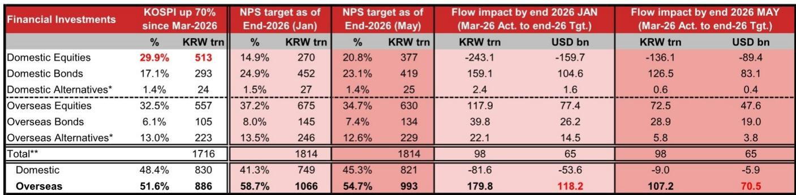
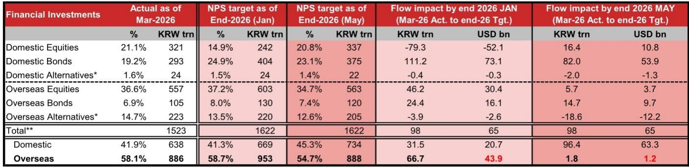
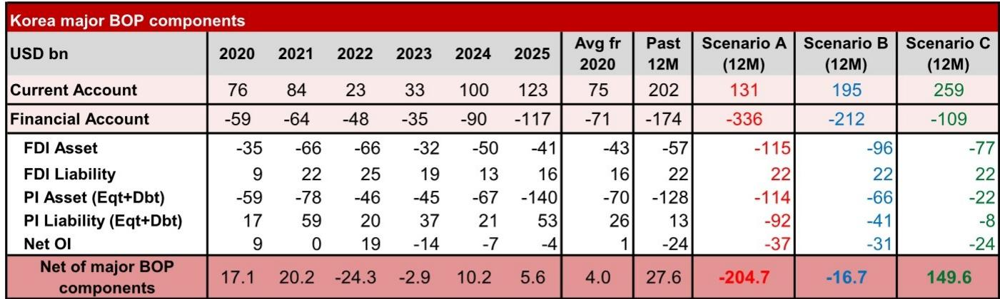

# NOM：韩元走弱的真正推手不是经济基本面，而是资本市场成功的“悖论”

韩国正在经历一个让许多宏观交易员感到困惑的时刻。经济账上，出口强劲推动经常账户盈余在2026年3月飙升至373亿美元，年化占GDP比例高达23%；KOSPI指数年内涨幅达87%，领跑全球主要股指。按照教科书逻辑，韩元应当成为亚洲表现最强的货币之一。然而现实是，韩元兑美元和名义有效汇率年内反而贬值约5.5%，沦为亚洲表现最差的货币之一。

这份NOM研报的核心判断是：韩元当前面临的不是基本面问题，而是一个由资本市场繁荣自身催生的、结构性的资本外流悖论。理解这一悖论的运行机制，比猜测韩国央行何时干预或美元何时走弱，更能帮助投资者把握韩元的中期走向。

报告的价值在于，它系统性地拆解了韩国国际收支中几个相互作用的资本流动引擎，并给出了三种情景下的量化压力测试。这不仅仅是一份汇率分析，更是一份关于“当国内资产价格暴涨时，资本账户会如何反向吞噬经常账户盈余”的机制说明书。

## 1. 经常账户盈余与货币贬值并存的悖论，根源在于资本账户的结构性失血

韩国经济目前呈现出一个典型的“K型”图景：科技出口部门极度繁荣，但这一繁荣并未有效转化为韩元的买入力量。NOM的分析揭示了背后三个关键的资金漏损渠道。

第一个渠道是企业层面的美元囤积。尽管出口强劲，韩国企业并未将大量美元收入结汇为韩元。报告引用韩国当局的表态和当地媒体报道，指出企业正在主动持有美元资产，这直接压低了实际贸易结算的净流入规模。企业这种行为背后是对全球贸易环境的不确定性和对韩元潜在贬值空间的防御性布局。

第二个渠道是零售投资者的海外资产配置。韩国散户对海外股票，尤其是美国科技股的配置热情在过去一年极为高涨。在2026年4月和5月，韩国零售投资者出现了自2023年6月以来首次连续两个月净卖出美国组合资产，但这究竟是趋势反转还是暂时停顿，报告提出了明确的质疑。即将到来的SpaceX、Anthropic和OpenAI等IPO，很可能再次点燃韩国散户的海外配置热情。

第三个渠道是机构层面，即韩国国民年金公团的海外投资。NPS作为全球最大的养老基金之一，其资产配置决策对韩元有直接且巨大的影响。2026年5月，NPS宣布将国内股票目标配置比例从14.9%大幅提升至20.8%，这看似是在减少海外投资。但NOM指出，这恰恰是悖论的核心：NPS的国内股票配置比例提升，是在一个已经暴涨的市场背景下做出的。如果KOSPI继续上涨，NPS为了达成新的目标比例，反而可能需要在高位减持国内股票、增持海外资产，从而形成新的资本外流压力。

这三个渠道叠加在一起，就解释了为何韩国经常账户盈余创历史新高，韩元却持续走弱。资本市场繁荣本身，正在通过企业和居民的资产负债表调整，制造出与基本面反向的资本流动。

## 2. NPS的资产配置调整看似利好韩元，但市场上涨正在抵消其正向效应

NPS在2026年5月修订的资产配置目标，是近期韩国市场最受关注的变量之一。按照新目标，NPS对国内资产的配置比例将从41.3%提升至45.3%，这意味着到2026年底，NPS对海外资产的净流出将从原先的439亿美元骤降至仅12亿美元。这看起来是对韩元的重大利好。

但NOM的测算揭示了一个隐藏的风险：这个测算假设NPS的资产规模仅按计划线性增长。然而，自2026年3月底以来，KOSPI指数已经上涨了约60%。如果NPS的国内股票持仓跟随市场上涨，其国内股票的实际占比已经远超新目标。报告估算，在60%的涨幅假设下，NPS可能需要重新卖出约705亿美元的国内股票，并将其配置到海外资产中，才能满足新目标。

这意味着，NPS的新目标实际上创造了一个“动态再平衡陷阱”。市场涨得越多，NPS需要卖出的国内股票就越多，从而产生的资本外流压力就越大。报告还指出，NPS的新目标要到2026年6月底再平衡宽限期结束后才正式适用，而韩国本地媒体报道NPS当前国内股票持仓可能已在27%左右的区间。这暗示在正式适用新目标之前，NPS可能已经需要开始减持国内股票。

这个机制的关键在于，它不是一个一次性的静态事件，而是一个与市场走势联动的动态反馈环。只要KOSPI继续上涨，NPS的再平衡需求就会持续存在，从而对韩元构成持续的压制。投资者不能因为NPS宣布了“提高国内股票配置”就简单理解为利好韩元，必须同时评估这一目标在实际市场走势下的执行效果。

## 3. 三星电子和SK海力士的暴涨，可能触发全球基金的结构性强制卖出

报告揭示了一个被市场普遍低估的资本外流风险：全球基金对单只股票10%的持仓上限规则。如果三星电子和SK海力士继续大幅上涨，那些受规则约束的全球基金将不得不强制卖出部分持仓，以将单只股票占比控制在10%以内。

NOM的情景分析显示，如果三星电子和SK海力士股价上涨60%，同时大盘上涨10%，由此引发的海外资金流出规模可能高达480亿美元。如果涨幅达到100%，流出规模将进一步扩大至953亿美元。这组数字远超市场此前的预期。

这一风险的特殊之处在于，它不是基于基本面恶化或风险偏好下降，而是基于规则驱动的被动卖出。这意味着，即使韩国科技股的基本面依然强劲，只要股价上涨过快，就会自动产生反向的资本流出压力。这种机制与NPS的再平衡类似，都是“成功带来的烦恼”。

对于持有韩国科技股的全球投资者而言，这一分析提供了一个重要的风险警示：当股价进入快速上涨阶段时，不能只关注基本面趋势，还需要评估持仓结构是否可能触发规则性的强制卖出。这种卖出可能不是一次性的，而是随着股价上涨而阶梯式发生的。

## 4. 三种情景下的国际收支压力测试，揭示了韩元走势的极端不确定性

NOM构建了一个12个月的国际收支情景分析，涵盖了企业结汇比例、零售海外配置、NPS再平衡和外资持仓限制四个核心变量。三种情景的结果差异巨大：在负面情景下，净流出高达2047亿美元；在温和情景下，净流出167亿美元；在正面情景下，净流入1496亿美元。

这个宽幅区间的意义不在于预测具体数字，而在于揭示韩元走势的驱动因素高度集中且相互关联。四个变量中任何一个发生变化，都会通过其他变量放大或抵消。例如，如果企业结汇比例从40.4%提升到79.8%，同时零售海外配置归零，三星和SK海力士的涨幅从100%收窄到30%，那么韩元就会从极度贬值压力转向大幅升值。

对于投资者而言，这意味着不能简单地用“韩国出口强所以韩元会升值”或“NPS减少海外投资所以韩元会升值”这样的单一逻辑来交易。韩元的走向取决于这四个变量的组合情况，而其中任何一个变量的变化都可能导致结果发生质变。

报告没有给出一个确定性的预测，而是提供了一个分析框架：投资者需要持续跟踪企业结汇意愿、零售海外配置节奏、NPS的实际再平衡操作以及三星和SK海力士的股价走势，才能对韩元中期方向形成判断。这种不确定性本身，就是对当前市场共识的一个有力挑战。

## 5. 报告尚未完全回答的关键问题：企业结汇行为何时会逆转

NOM的分析框架中，企业结汇比例是最具弹性的变量之一。在三种情景中，企业结汇比例从40.4%到79.8%的变化，直接影响了数百亿美元的资金流向。但报告没有深入分析的是：什么条件才能触发韩国企业从美元囤积转向大规模结汇？

报告提到，美元走弱和人民币升值可能促使韩国出口企业增加结汇。但这个判断的因果链条并不完整。企业结汇行为不仅取决于汇率预期，还取决于企业对供应链安全、地缘政治风险和长期投资计划的综合考量。韩国企业过去几年积累的美元资产，某种程度上是对全球贸易碎片化趋势的一种对冲。如果全球贸易秩序出现更明确的稳定信号，或者韩国政府推出更有力的结汇激励措施，企业行为才可能发生系统性转变。

此外，报告没有量化韩国政府承诺的2000亿美元对美投资计划的实际执行节奏。每年200亿美元的资本流出上限，虽然已被纳入情景分析，但实际执行中可能因项目进展、审批流程和双边关系变化而出现波动。这个变量的不确定性，同样可能对韩元产生超预期的影响。

这些未解问题意味着，当前市场对韩元的定价可能低估了企业结汇行为逆转带来的上行风险，也可能高估了NPS再平衡和外资强制卖出的下行压力。投资者需要更精细地跟踪这些微观行为指标，而不是依赖宏观叙事做判断。

## 6. 观察韩元的框架：从宏观叙事转向微观行为链

基于NOM的分析，投资者可以构建一个更实用的韩元观察框架。这个框架的核心不是预测美元指数或韩国GDP增速，而是追踪几条相互关联的行为链。

第一条行为链是NPS的再平衡节奏。需要关注的不只是NPS的官方目标比例，而是其实际持仓变化。如果看到NPS在国内股票上的实际配置比例持续下降，同时海外股票配置上升，就意味着再平衡压力正在释放。反之，如果国内股票配置比例维持稳定，则意味着市场上涨带来的增额被主动管理所抵消。

第二条行为链是韩国零售投资者的海外配置节奏。每月公布的海外组合资产净买入数据，比任何宏观指标都更能反映散户的资金流向。如果零售海外配置从目前的放缓趋势重新加速，尤其是在美国科技股IPO密集期，韩元将面临额外的下行压力。

第三条行为链是三星电子和SK海力士的股价走势与外资持仓的互动。当这两只股票进入快速上涨阶段时，需要密切关注外资持仓比例是否接近10%的规则上限。如果接近，则意味着强制卖出风险正在积累，这不仅是韩元的风险，也是这两只股票自身的风险。

第四条行为链是企业结汇比例的变化。这个指标相对不透明，但可以通过韩国央行的外汇存款数据和企业财务报告的现金持有结构来间接跟踪。如果看到企业美元存款开始下降，同时韩元远期升水收窄，可能预示着结汇行为正在启动。

这四条行为链的互动，决定了韩元在经常账户盈余背景下的实际走向。投资者需要放弃“基本面好所以货币强”的线性思维，转向“资本流动结构决定货币强弱”的机制思维。NOM这份报告的价值，正在于提供了从后者出发的系统分析工具。

韩元的悖论不会自动消失，它需要外部条件的配合——美元走弱、AI热潮降温、企业结汇意愿回升——才能被打破。而这些条件目前尚未完全具备。在条件成熟之前，韩元可能继续在“成功带来的烦恼”中震荡。那些能够穿透宏观叙事、跟踪微观行为链的投资者，将在这段复杂时期获得更清晰的判断力。

这份NOM研报中还有大量关于具体情景假设的图表和敏感性分析，以及对外资债券流入（WGBI纳入）影响的详细测算，这些内容因篇幅限制未能完全展开。欢迎来星球微信群里继续讨论这些未解问题的演进路径，以及如何将NOM的分析框架转化为可执行的交易思路。

Personal reading notes and learning share only. Not investment advice.

