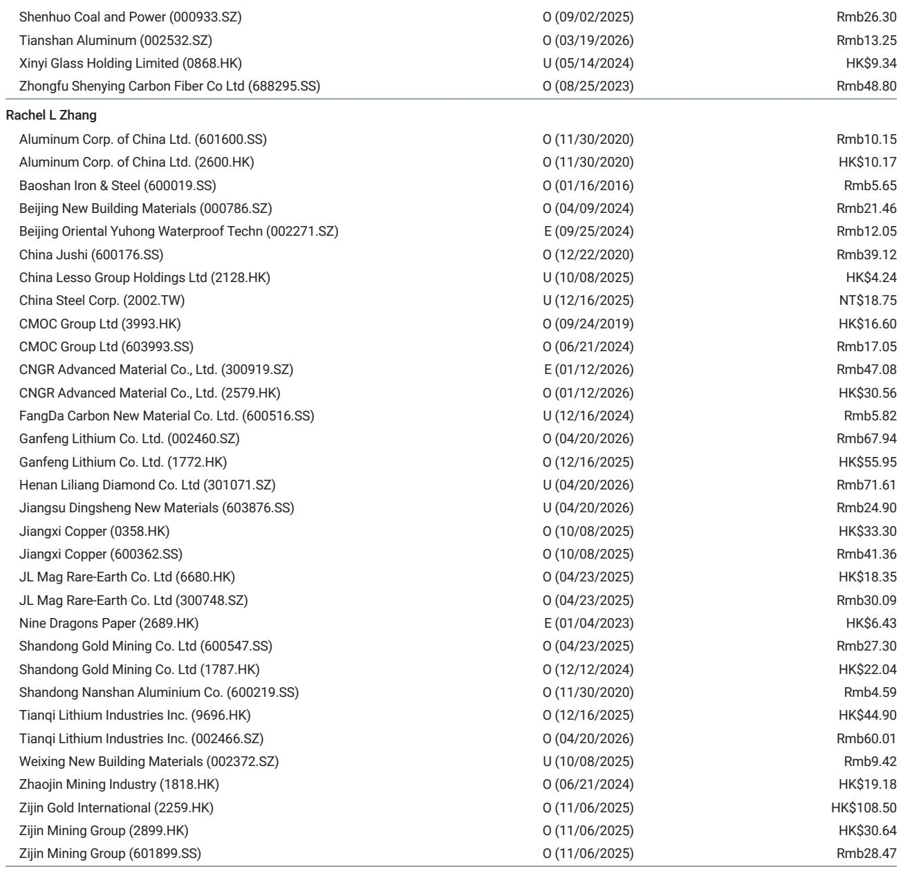
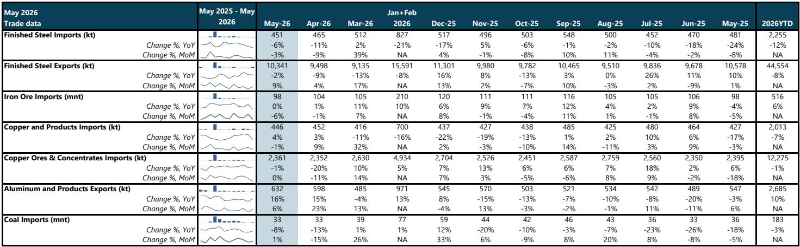
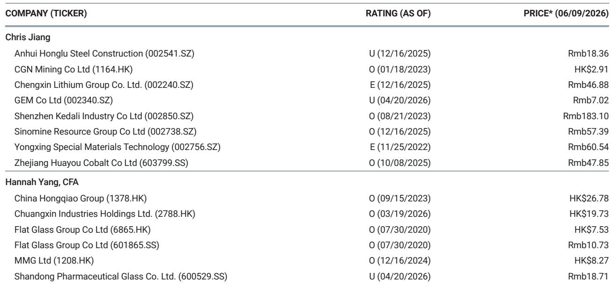

# China's Materials Trade Data Signals a Two-Speed Market: Export-Led Strength in Aluminium, Domestic Weakness in Steel

The latest Chinese trade data for May 2026 reveals a materials sector that is not moving in unison but rather splitting into two distinct trajectories. Aluminium exports surged to their highest level since November 2024, while steel exports contracted year-on-year for the second consecutive month. This divergence is not a statistical anomaly. It reflects a fundamental shift in how global supply chains are reconfiguring around China's industrial output. For investors, the question is no longer simply whether Chinese materials demand is recovering. The question is which commodities benefit from the new global trade architecture and which are being left behind by domestic overcapacity and shifting end-market demand.

The data, drawn from a detailed global investment bank report on China's May trade flows, presents a picture of a market where external arbitrage opportunities, supply disruptions abroad, and domestic inventory dynamics are creating winners and losers within the same sector. Aluminium producers are capitalizing on tight ex-China markets. Steel mills are struggling with sluggish domestic consumption and rising trade barriers. Copper sits in the middle, with physical demand holding firm but processing margins under pressure. Coal remains a laggard, caught between seasonal weakness and elevated import prices.

Understanding these cross-currents is essential for any investor with exposure to Chinese industrial commodities, whether through equities, futures, or physical supply chains. The May data does not provide a single directional signal. It provides a map of where the pressure points are forming.

## Aluminium Exports Are Surging Because Global Supply Disruptions Have Opened an Arbitrage Window That Chinese Producers Are Uniquely Positioned to Exploit

The standout number in the May trade data is aluminium and product exports of 632 kilotonnes, up 16% year-on-year and 6% month-on-month. This is the highest monthly export volume since November 2024. The driving force is not a sudden surge in global demand. It is a supply-driven dislocation in Middle Eastern production that has tightened ex-China markets and lifted London Metal Exchange prices relative to domestic Chinese prices.

When the export arbitrage widens, Chinese producers respond quickly. They have the capacity, the inventory, and the cost structure to fill gaps that emerge elsewhere. The report notes that Chinese inventories have begun to decline, particularly as semi-finished product exports increase. This is a critical detail. It means the export surge is not merely a re-routing of existing material flows. It is drawing down domestic stocks, which could eventually tighten the domestic market and support local prices.

The strategic implication is clear. China has become the swing supplier for global aluminium markets. When disruptions occur elsewhere, Chinese exports ramp up to fill the void. This gives Chinese producers pricing power in export markets and creates a buffer for domestic prices when global conditions tighten. Investors should watch the Yangshan premium and LME-China price spreads as leading indicators for further export acceleration.

## Steel Exports Are Declining Because Domestic Demand Is Weaker Than Headline Production Numbers Suggest, and Trade Barriers Are Beginning to Bite

Steel exports in May fell 2% year-on-year to 10.3 million tonnes, though they improved 9% month-on-month from a low April base. The year-to-date picture is starker. Exports for the first five months of 2026 totaled 44.6 million tonnes, down 8% year-on-year. This decline is happening even as global steel prices remain elevated in some regions.

The underlying issue is domestic demand. The report estimates that apparent steel consumption in May fell 10.4% year-on-year and 11.1% month-on-month, driven by destocking. Daily crude steel production at CISA member mills declined 4.4% year-on-year in May, an improvement from the 5.7% decline in April, but still negative. The gap between production and consumption is being closed by inventory reduction, not by export growth.

This matters because it suggests that the steel export decline is not primarily a demand-side problem in destination markets. It is a supply-side problem in China. Domestic demand is too weak to absorb current production levels, but trade barriers in key markets are limiting the ability to export the surplus. The report does not specify which trade actions are having the greatest impact, but the pattern is consistent with an industry facing growing protectionist pressure in Europe, Southeast Asia, and North America.

For investors, the steel data signals a market that is caught between overcapacity and constrained export channels. The only way to rebalance is through production cuts, which have been slow to materialize. Until mill utilization rates decline more sharply, steel margins will remain under pressure, and export volumes will struggle to regain momentum.

## Copper Imports Are Holding Up Because Physical Demand Remains Solid, But the Downstream Processing Chain Is Facing Margin Compression

Copper and copper product imports totaled 446 kilotonnes in May, down 1% month-on-month but up 4% year-on-year. The import arbitrage opened intermittently during April and May despite rising copper prices, and net refined imports in April reached the highest level since September 2025. The Yangshan premium, a key indicator of physical demand in China, ranged between $60 and $75 per tonne, which the report describes as indicating continued solid demand.

The bullish copper narrative has been challenged in recent months by high inventory levels and slowing Chinese property construction. But the trade data suggests that the physical market is tighter than many investors assume. The drawdown in inventory slowed in May, but it did not reverse. The Yangshan premium held steady even as LME prices rose, indicating that Chinese buyers were willing to pay up for material.

The cautionary note comes from the upstream side. Copper ore and concentrate imports were flat year-on-year at 2.35 million tonnes, and treatment charges continued to fall. Smelters are being squeezed between high raw material costs and strong sulphuric acid prices, which have supported margins but are volatile. The report notes that Chinese refined copper output growth slowed in April. If treatment charges continue to decline, smelters may cut production, which would tighten refined copper supply and push premiums higher.

The strategic question for copper investors is whether the physical demand strength is sustainable. The answer depends on China's power grid investment, electric vehicle production, and renewable energy installation. These sectors are all growing, but they are not immune to broader macroeconomic headwinds. The May data suggests that for now, demand is holding up better than the bears expected.

## Coal Imports Are Declining Because the Market Is in a Seasonal Lull, but the Arbitrage Is Reopening and Could Drive a June Rebound

Coal imports in May fell 8% year-on-year to 33 million tonnes, though they rose slightly month-on-month. Year-to-date imports are down 3% year-on-year. The decline reflects seasonal weakness in demand during a slower consumption period, combined with higher imported coal prices that made domestic coal more attractive.

The key development is that the import arbitrage has begun to reopen. As domestic coal prices increased in May, the price gap between domestic and imported coal narrowed to a level that makes imports economically viable again. The report explicitly expects a month-on-month rebound in coal imports in June as a result.

This is a classic pattern in Chinese coal markets. When domestic prices rise, the arbitrage opens, imports increase, and the additional supply eventually caps domestic price gains. The cycle then repeats. The May data shows the market at the inflection point, with imports at a seasonal low and the arbitrage just beginning to turn.

For investors, the coal data is a reminder that Chinese commodity markets are driven as much by relative price dynamics as by absolute demand levels. The year-on-year decline in imports is not a signal of structural weakness in coal demand. It is a reflection of timing and pricing. The June rebound, if it materializes, will confirm that the underlying import demand is intact.

## Iron Ore Imports Are Flat Because Port Inventories Remain Elevated, but the Gradual Drawdown Signals a Potential Inflection Point for Steel Raw Materials

Iron ore imports totaled 98 million tonnes in May, down 6% month-on-month but flat year-on-year. Port inventories in China began to draw down gradually during the month, but they remain elevated. The report notes that pig iron production at steel mills is down 2% year-to-date, compared with a 4% decline in crude steel output.

The flat year-on-year import figure masks a more interesting dynamic. Port inventories are finally declining after months of accumulation. If the drawdown continues, it could signal that steel mills are beginning to work through their raw material overhang, which would support iron ore prices. But the decline in pig iron production relative to crude steel output suggests that mills are favoring scrap over iron ore in their blast furnaces, which would limit the upside for ore demand.

The iron ore market is in a waiting pattern. Steel demand is weak, inventories are high, and mills are adjusting their input mix. The direction of iron ore prices will depend on whether the inventory drawdown accelerates or stalls. For now, the data is neutral to slightly bearish, but the trend bears watching.

## The Report Does Not Fully Answer How Trade Policy Changes in Key Importing Countries Will Reshape Chinese Export Competitiveness Over the Next 12 to 18 Months

The May trade data provides a detailed snapshot of current flows, but it does not fully address the forward-looking question of trade policy. Multiple countries have announced or implemented tariff increases, anti-dumping duties, and local content requirements targeting Chinese steel, aluminium, and downstream manufactured goods. The report mentions that steel exports are declining, but it does not quantify the impact of specific trade actions or model how they will evolve.

This is a meaningful analytical gap. The aluminium export surge in May was driven by Middle Eastern supply disruptions, which are likely temporary. If those disruptions are resolved, Chinese exports could normalize. But if trade barriers in Europe and North America continue to escalate, the structural export capacity that Chinese producers have built may need to find new destinations. Southeast Asia and Africa are natural candidates, but their absorption capacity is limited.

For investors, the unresolved question is whether Chinese materials exports are entering a period of permanent structural decline or a cyclical adjustment. The answer depends on policy decisions that are inherently unpredictable. The May data suggests that current flows are robust for aluminium and mixed for steel, but the trajectory over the next 12 to 18 months will be determined as much by trade negotiations as by market fundamentals.

## A Decision Framework for Investors: Use the Three-Lens Model of Arbitrage, Inventory, and Policy to Position Across Commodities

The May trade data lends itself to a structured decision framework that investors can apply across commodities. The framework has three lenses.

The first lens is arbitrage. When the gap between domestic and international prices widens, Chinese exports increase. This is currently happening in aluminium and beginning to happen in coal. Investors should monitor price spreads and adjust positions accordingly. When the arbitrage is wide, Chinese producers have pricing power. When it narrows, they lose it.

The second lens is inventory. When domestic inventories are declining, it indicates that supply is being absorbed by either domestic demand or exports. This is currently happening in aluminium and gradually in iron ore. When inventories are rising, it indicates oversupply and downward price pressure. This is the case in steel.

The third lens is policy. Trade actions, environmental regulations, and production caps can override market signals. The report does not provide a clear policy outlook, but investors should track developments in anti-dumping cases, carbon border adjustment mechanisms, and Chinese government production targets.

Applying this framework to the May data leads to a differentiated view. Aluminium looks attractive due to wide arbitrage and declining inventories. Copper looks neutral to positive due to solid physical demand but margin pressure in processing. Steel looks challenged due to weak domestic demand, high inventories, and trade barriers. Coal is a tactical play on the reopening arbitrage. Iron ore is a wait-and-see.

The full report contains detailed charts on import and export trends, inventory levels, and price spreads that provide the data needed to apply this framework. For investors who want to go beyond the headlines and build a position-level view of the Chinese materials trade, the original research is essential reading.

Join the community to read the full report and review the original charts.

*This article is for learning and discussion only and does not constitute investment advice.*

Personal reading notes and learning share only. Not investment advice.

