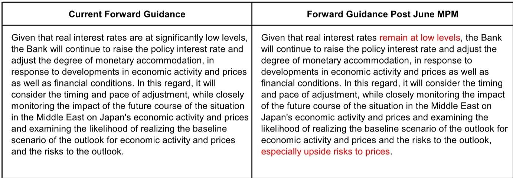
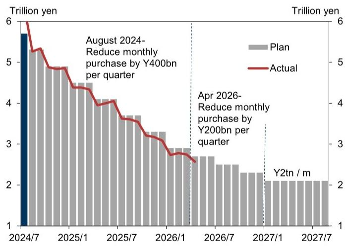
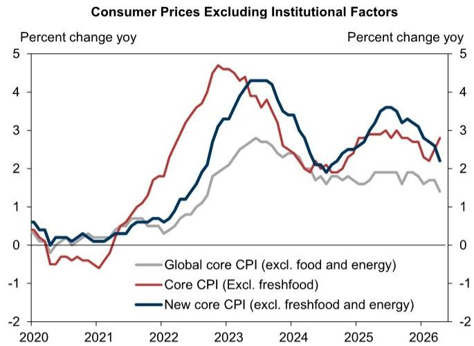

# Japan’s Rate Hike Cycle Is Entering Its Most Strategically Complex Phase

The Bank of Japan is preparing to raise its policy rate in June, not July, and this shift in timing reveals something far more important than a simple calendar adjustment. It signals that the BOJ now believes it has secured the political cover necessary to normalize policy while the economy remains resilient, even as soft data deteriorates and consumer price momentum shows signs of unevenness. For investors tracking Japanese assets, the implications extend well beyond the immediate rate decision. The real strategic question is whether the BOJ can sustain a semi-annual hiking cadence through 2027 without breaking the fragile alignment among economic conditions, market expectations, and government tolerance. The upcoming June meeting will be a critical test of whether the central bank can execute a rate hike while simultaneously recalibrating its forward guidance and beginning a multi-year reduction in its JGB purchase program. That is a lot of moving parts for any central bank, and the BOJ has not attempted this degree of operational complexity in decades.

The argument of this article is straightforward: the BOJ’s rate path through 2027 is not a mechanical forecast but a conditional sequence that depends on three interdependent variables—hard data resilience, political communication, and market stability. The report we are analyzing provides a clear base case, but the more valuable insight lies in the uncertainty around that base case. The BOJ is approaching the neutral rate, and as it gets closer, each subsequent hike becomes more politically sensitive and more dependent on the central bank’s ability to manage expectations without triggering disruptive market reactions. The next eighteen months will determine whether Japan’s normalization story remains credible or becomes a cautionary tale about the limits of gradual tightening.

## The June Hike Is a Political Signal as Much as an Economic One

The decision to move the expected rate hike from July to June is not driven by a sudden acceleration in inflation or a dramatic improvement in growth. On the price front, the report notes that the April price revision period lacked broad-based hikes, particularly for food items, and that core CPI growth has slowed across several measures. Consumer confidence has deteriorated, and while hard data remains solid, the economy is not overheating. So why the urgency?

The answer lies in the political groundwork that Governor Ueda appears to have laid during his meeting with Prime Minister Takaichi on May 22. The report observes that prior to the December meeting last year and the June meeting this year, a meeting between the Governor and the Prime Minister preceded a rate hike, and a subsequent speech by the Governor hinted at the possibility of action. This pattern suggests that the BOJ treats political alignment as a precondition for rate hikes, not merely a background consideration. The June 3 speech by Governor Ueda was more hawkish than expected, and the report interprets this as evidence that the Governor secured at least tacit government acceptance of a June hike during the May 22 meeting.

What matters here is the implication for future rate decisions. If political communication is as important as economic data in determining the timing of hikes, then investors need to track not just CPI releases and GDP prints but also the frequency and tone of interactions between the BOJ and the government. The report’s base case assumes the next hike after June will come in January 2027, but it explicitly acknowledges that the timing could be brought forward if the conditions for a rate hike are in place from a communication perspective. That is a significant qualifier. It means that the BOJ’s rate path is endogenous to the political cycle, and investors who ignore this dimension will consistently be surprised by the timing of moves.

## The Forward Guidance Revision Will Reveal the BOJ’s True Assessment of the Neutral Rate

Alongside the rate hike, the BOJ is expected to modify its forward guidance. The report provides a specific comparison between the current guidance and the expected post-June version. The key change is the addition of language about “upside risks to prices,” which shifts the tone from balanced to hawkish while also hinting that the policy rate is approaching the neutral rate. This is a subtle but important evolution in the BOJ’s communication strategy.

The current guidance emphasizes that real interest rates are at “significantly low levels” and that the BOJ will continue to raise rates. The revised version is expected to say that real interest rates “remain at low levels,” which is a less dramatic characterization. This downgrade in language signals that the BOJ recognizes it is getting closer to the point where further hikes need to be justified by explicit risks rather than by the general condition of low real rates. The addition of “upside risks to prices” provides that justification, but it also creates a higher bar for future action. If upside price risks do not materialize, the BOJ will have less rhetorical room to hike.

For investors, the forward guidance revision is a window into the BOJ’s internal thinking about the neutral rate. The report assumes a terminal rate of 1.5%, equal to the neutral rate, and expects the policy rate to reach that level by July 2027. But the neutral rate is an unobservable variable, and the BOJ’s own estimate may shift as new data comes in. The forward guidance language is designed to preserve flexibility, but it also creates a benchmark against which market participants will measure the BOJ’s commitment. If the BOJ signals that it is approaching the neutral rate, then any deviation from the expected path—whether faster or slower—will be interpreted as a reassessment of the neutral rate itself. That is a recipe for volatility.

## The JGB Purchase Reduction Is a Separate but Connected Policy Track

The June meeting will also include an interim assessment of the BOJ’s JGB purchase plan, which is currently scheduled to run through March 2027. The report expects the BOJ to maintain its current reduction schedule until March 2027 and then keep monthly purchases at approximately 2 trillion yen from April 2027 onward. This is a gradual approach, but it is not without risks.

The connection between the rate hike path and the JGB purchase reduction is often underappreciated. If the BOJ is raising rates while simultaneously reducing its presence in the JGB market, the combined effect on long-term yields could be larger than either policy would produce on its own. The report acknowledges that the timing of rate hikes is likely to be significantly influenced by market developments, and the JGB market is the most direct transmission channel. A sharp rise in long-term yields could force the BOJ to slow its rate hikes or adjust its purchase reduction schedule, creating a policy tradeoff that did not exist during the era of yield curve control.

The report’s assumption that the BOJ will maintain its current purchase plan until March 2027 is reasonable, but it leaves open the question of what happens if market conditions deteriorate. The BOJ has shown a willingness to adjust its operational framework in response to market stress, and investors should not assume that the current schedule is set in stone. The real test will come when the BOJ has to choose between its rate hike trajectory and its JGB reduction plan. That choice has not yet been forced, but it will be.

## What the Report Does Not Fully Answer: The Vulnerability of the Semi-Annual Hiking Cadence

The report’s base case assumes rate hikes in June 2026, January 2027, and July 2027, with the policy rate reaching 1.5% at the end of that sequence. This is a clean, predictable path, and it is consistent with the BOJ’s stated preference for gradual normalization. But the report also identifies several factors that could disrupt this cadence, and it does not fully explore the conditions under which the cadence would break down.

One unresolved question is the role of the yen. The report mentions that prior to the June meeting, yen depreciation and a rise in long-term interest rates created conditions that favored a rate hike. But what happens if the yen strengthens? A stronger yen would reduce import prices and dampen inflationary pressure, potentially giving the BOJ less reason to hike. Conversely, if the yen weakens further, the BOJ may feel compelled to accelerate its pace to defend the currency. The report does not model this feedback loop, and it is a critical gap.

Another open question is the behavior of corporate pricing. The report notes that B2B prices are accelerating and expects this to spill over to consumer prices with a lag. But the April price revision period lacked broad-based hikes, which suggests that businesses are still reluctant to pass on costs. If this reluctance persists, the BOJ’s inflation forecast may prove too optimistic, and the case for further hikes would weaken. The report acknowledges this risk but does not provide a framework for assessing how quickly the pass-through might occur.

Finally, the report does not address what happens if the government’s tolerance for rate hikes changes. The current government appears willing to accept gradual normalization, but that could shift if economic growth slows or if political pressures mount. The report treats political communication as a precondition for rate hikes, but it does not explore the scenarios under which the government would actively oppose further tightening. That is a meaningful omission, because the BOJ’s independence in practice is more constrained than its legal independence would suggest.

## A Decision Framework for Investors Navigating the BOJ’s Normalization

For investors trying to position portfolios around the BOJ’s rate path, the key is to distinguish between the base case and the scenarios that would cause the base case to fail. The report provides a clear base case, but the value of the analysis lies in the uncertainty it reveals. Here is a framework for thinking about the decision.

First, track the political calendar as closely as the economic calendar. The meetings between Governor Ueda and Prime Minister Takaichi have proven to be leading indicators of rate hikes. If these meetings become more frequent or if their tone shifts, that is a signal that the timing of the next hike may change. Conversely, if the meetings stop or become less substantive, that is a sign that political alignment is fraying.

Second, monitor corporate pricing behavior as a leading indicator of inflation. The B2B price data is accelerating, but the pass-through to consumer prices is the critical variable. If businesses begin to implement broad-based price hikes in the next revision period, that would support the BOJ’s hawkish stance. If they continue to hold back, the BOJ’s inflation narrative will lose credibility.

Third, watch the JGB market for signs of stress. The BOJ’s dual track of rate hikes and purchase reduction is unprecedented in Japan, and the market’s reaction will be a key determinant of whether the BOJ can sustain its planned pace. A sharp selloff in JGBs would force the BOJ to choose between its rate path and its purchase plan, and that choice will reveal the BOJ’s true priorities.

Finally, do not assume that the neutral rate is fixed at 1.5%. The BOJ’s estimate of the neutral rate is likely to evolve as new data comes in, and the terminal rate could end up higher or lower than current expectations. The forward guidance revision will provide clues about the BOJ’s thinking, but the ultimate test will be whether the BOJ stops hiking when it reaches 1.5% or continues beyond that level.

## The Next Phase of Japan’s Monetary Story Requires Granular Analysis

The BOJ’s June meeting will be a defining moment for Japan’s monetary policy normalization, but it is only one step in a longer journey. The report we have analyzed provides a detailed and well-reasoned base case, but the most valuable insights are the ones that highlight uncertainty rather than certainty. The semi-annual hiking cadence is plausible, but it is fragile. The political alignment is favorable, but it could shift. The neutral rate is assumed, but it is unknown.

For investors who want to stay ahead of these developments, the full report offers charts and data that are not reproduced here. The exhibits on consumer confidence, hard data, price indicators, and JGB purchase schedules provide the empirical foundation for the analysis. Reviewing those charts in their original context will give you a deeper understanding of the BOJ’s decision-making process and the risks that could derail the current path.

Join the community to read the full report and review the original charts.

*This article is for learning and discussion only and does not constitute investment advice.*

Personal reading notes and learning share only. Not investment advice.

