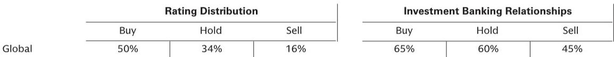

# CMS Is Reshaping the Rules of Healthcare Finance, and Investors Need to Rethink Their Assumptions About Drug Pricing, Medicaid, and Market Access

The Centers for Medicare and Medicaid Services is not simply adjusting reimbursement rates or issuing routine guidance. Based on discussions with CMS leadership at a major industry conference, the agency is executing a coherent strategy to fundamentally rewire the financial architecture of American healthcare. The implications for pharmaceutical companies, managed care organizations, and hospital systems extend far beyond the headlines about drug price negotiations.

The core thesis emerging from this policy direction is straightforward but profound. CMS is simultaneously tightening the screws on drug pricing through most-favored-nation mechanisms, shifting a larger share of Medicaid financial burden back to states, and aggressively policing enrollment integrity across exchanges and programs. These are not independent initiatives. They represent a coordinated effort to contain federal healthcare spending growth by targeting the three largest sources of fiscal exposure: prescription drug costs, Medicaid expansion populations, and improper payments.

For investors, the critical insight is that the margin of safety many healthcare companies have enjoyed from regulatory complexity and program fragmentation is narrowing. The agency is becoming more sophisticated in how it structures incentives, more aggressive in enforcement, and more willing to use trade policy as a lever for domestic drug pricing. This is not a cyclical shift. It reflects a structural change in how the federal government approaches its role as the largest payer in the US healthcare system.

The conference panel made clear that CMS views its current toolkit as only the beginning. The agency framed its agenda around four priorities: patient-first payer operations, prevention-focused strategy, fraud and abuse enforcement, and affordability. The most consequential of these for pharmaceutical investors is the affordability pillar, specifically the expansion of most-favored-nation drug pricing. But the Medicaid and exchange integrity efforts may prove equally disruptive for managed care and provider stocks.

Understanding the logic chain that connects these policy moves is essential for constructing a durable investment thesis in healthcare over the next two to three years. The report from the conference provides the raw signals. What follows is an interpretation of what those signals mean for strategic decision-making.

## Most-Favored-Nation Drug Pricing Is Not a Negotiation Tactic; It Is the New Baseline for Federal Pricing Power

The initial round of IRA drug price negotiations delivered approximately 20 percent average net savings to the government. The second round, under the current administration, is targeting discounts closer to 40 percent. This trajectory alone would be noteworthy. But the CMS panel went further by explicitly linking domestic drug pricing to global trade dynamics. Most-favored-nation mechanisms are not simply about extracting deeper discounts from manufacturers. They are designed to create a pricing floor that references the lowest prices available in other developed economies.

The strategic logic is clear. Pharmaceutical companies have historically managed country-specific pricing strategies, charging higher prices in the United States while accepting lower margins in Europe and Japan. CMS is now signaling that it will use its purchasing power to collapse that differential. If a drug is sold at a 60 percent discount in France relative to the US, the government wants that discount applied to Medicare and Medicaid populations as well.

What the panel did not address is how this framework will interact with the existing IRA structure. The agency has not commented on expanding MFN beyond the current 17 manufacturers. This leaves open a critical question for investors. If MFN is applied to a broader set of drugs and manufacturers, the revenue implications for companies with significant US exposure to Medicare Part B and Part D could be substantially larger than current consensus estimates reflect. The 20 percent to 40 percent discount range may prove optimistic if global reference pricing becomes the binding constraint.

The second-order implication is that pharmaceutical companies with diversified geographic revenue streams may face a strategic dilemma. Maintaining high US prices to protect domestic margins could accelerate political pressure for broader MFN application. Accepting lower US prices to align with global benchmarks could compress overall margins but provide regulatory predictability. The optimal strategy is not obvious, and the CMS panel offered no guidance on timing or scope.

## Medicaid Funding Rebalancing Will Reshape the Economics of Managed Care and Provider Networks

The CMS panel highlighted a shift in the federal share of Medicaid funding to approximately 70 percent of overall spending, up from roughly 60 percent at the program's inception. This is not a neutral observation. It is a statement of intent. The agency views this trend as unsustainable and is moving to rebalance cost-sharing with states.

The specific mechanisms include tightening program integrity around state-directed payments, introducing payment caps that align Medicaid reimbursement more closely with Medicare benchmarks, and scrutinizing provider tax arrangements that states have used to maximize federal matching funds. For managed care organizations that derive a significant portion of their premium revenue from Medicaid managed care contracts, this represents a material risk.

The logic is straightforward. If CMS reduces the federal matching rate or caps reimbursement growth, states will face pressure to lower capitation payments to managed care plans. Those plans will then need to either reduce medical cost ratios, renegotiate provider contracts, or exit certain markets. The providers most exposed are those with high Medicaid patient mix, particularly safety-net hospitals and community health centers.

What the report does not fully explore is the political economy of this shift. Red states and blue states have very different Medicaid expansion histories and fiscal capacities. A uniform reduction in federal matching rates would disproportionately affect states that expanded Medicaid under the ACA, as they have larger enrollment populations and higher baseline federal funding. This could create political pushback from governors and state legislatures, potentially moderating the pace of change. Investors should watch for state-level fiscal stress as a leading indicator of how aggressively CMS can pursue this agenda.

## Exchange Integrity Efforts Will Reduce the Addressable Market for Individual Coverage but Improve Risk Pool Quality

The CMS panel expressed clear concern about fraud and improper enrollment in the ACA exchanges. The agency is implementing new payment rules with integrity measures and removing ineligible participants. For health insurers that participate in the individual market, this is a double-edged sword.

On one hand, removing ineligible enrollees reduces total premium volume and may create short-term enrollment disruption. On the other hand, a cleaner risk pool with fewer fraudulent or improperly enrolled members should improve loss ratios and reduce the need for premium increases. The net effect depends on how many of the removed members are healthy versus sick, and whether they are replaced by similarly healthy individuals or simply drop out of the market entirely.

The panel did not provide specific estimates of improper enrollment, leaving investors to model scenarios. A conservative assumption is that 5 to 10 percent of exchange enrollment could be affected, based on historical audit findings. If the removed population is disproportionately healthy, the remaining risk pool could see average claims costs rise, offsetting some of the benefit from improved integrity.

The broader strategic implication is that the individual market is becoming less attractive for insurers that relied on enrollment growth to offset thin margins. Companies with strong underwriting capabilities and experience in managed Medicaid may be better positioned to navigate this environment than those focused purely on commercial individual products.

## The Report Leaves Unanswered Questions About the Interaction Between Drug Pricing and Innovation Incentives

One of the most analytically challenging gaps in the conference discussion is how MFN pricing and IRA negotiations will affect pharmaceutical research and development investment. The CMS panel focused on affordability and program integrity but did not address the supply-side consequences of aggressive pricing policy.

The standard industry argument is that lower US drug prices will reduce the expected return on R&D investment, leading to fewer new drug launches and longer development timelines. The standard policy counterargument is that many drugs are priced based on what the market will bear rather than the cost of innovation, and that excess profits in the US have not translated into proportionally higher innovation output.

The data needed to resolve this debate is not publicly available in granular form. Investors must therefore make judgment calls based on observable signals. Early-stage biotech companies with platforms targeting large addressable markets may be more resilient to pricing pressure because their expected returns are high enough to absorb some compression. Late-stage companies with approved drugs facing Medicare negotiation exposure are more vulnerable. Companies with significant pipeline assets in oncology and rare diseases, where pricing power has historically been strongest, face the most uncertainty.

The report from the conference does not resolve this tension. It simply confirms that the policy direction is clear and that the agency is not signaling any intention to moderate its approach based on innovation concerns. Investors should treat this as a structural headwind for pharmaceutical valuations until the data provides a clearer picture of how R&D decisions are actually changing.

## A Decision Framework for Investors Navigating the New CMS Policy Environment

The conference panel provides enough directional clarity to construct a decision framework, even if the exact parameters remain uncertain. The framework has three dimensions: exposure to federal pricing mechanisms, reliance on Medicaid managed care revenue, and sensitivity to exchange enrollment integrity.

For pharmaceutical companies, the key variable is the share of US revenue derived from drugs that are either already subject to IRA negotiation or likely to be included in MFN expansion. Companies with high exposure to single-source brand drugs in Medicare Part B and Part D face the most direct risk. Companies with diversified revenue across biologics, vaccines, and over-the-counter products have more insulation. The critical question is not whether pricing pressure will intensify, but whether current valuations already reflect that reality.

For managed care organizations, the key variable is the mix of Medicaid, Medicare Advantage, and commercial enrollment. Plans with heavy Medicaid exposure face margin compression from federal funding rebalancing. Plans with strong Medicare Advantage positions may benefit from the shift toward prevention-focused care and value-based payment models. The wildcard is how aggressively CMS pursues Medicare Advantage payment reforms, which were not a focus of the panel discussion.

For providers, the key variable is payer mix and geographic exposure. Hospitals and health systems in states that expanded Medicaid face the greatest risk from federal funding reductions. Providers with high commercial insurance mix and limited government payer exposure are relatively insulated. The panel's emphasis on rural health investments suggests that certain provider types may benefit from targeted funding, but the overall direction of federal policy is toward tighter reimbursement.

## The Full Report Contains the Specific Data Points and Charts That Support This Analysis

The conference panel discussion covers a range of topics that go beyond what can be addressed in a single analytical piece. The full report includes detailed notes on CMS priorities, specific commentary on state-directed payment changes, and the agency's views on MFN drug pricing mechanics. It also contains the original charts that illustrate the trajectory of federal Medicaid funding shares and the scope of IRA negotiation savings.

Join the community to read the full report and review the original charts.

*This article is for learning and discussion only and does not constitute investment advice.*

Personal reading notes and learning share only. Not investment advice.

