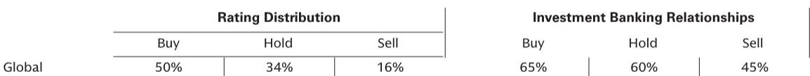

# The Healthcare M&A Cycle Has Shifted: Midcap Biotech Is Reshaping Deal Dynamics, and China Is the Unresolved Variable

The healthcare sector is not experiencing a uniform recovery. It is undergoing a structural realignment that rewards precision, not scale. At the 47th Annual Global Healthcare Conference, a panel of investment bankers from a global investment bank laid out a landscape that is simultaneously more active and more fragmented than most investors recognize. M&A volume has already reached approximately $100 billion year-to-date in 2026, roughly double the $50 billion recorded in the same period of 2025. But the headline number obscures a more important shift: the center of gravity in dealmaking is moving away from mega-mergers and toward a new class of midcap transactions, where large biotech acquirers are targeting smaller, niche assets with greater discipline and earlier engagement.

This is not a cyclical uptick. It is a change in how value is created and captured in healthcare. The implications for portfolio strategy, geographic allocation, and thematic exposure are profound. Investors who continue to think of healthcare as a defensive, slow-moving sector will miss the most important opportunities. Those who understand the new deal architecture, the role of Chinese innovation as both threat and opportunity, and the uneven impact of artificial intelligence across subsectors will be better positioned to navigate the next 12 to 24 months.

The panel discussion, which covered Biopharma, Medtech, Life Sciences Tools & Diagnostics, M&A, and European Healthcare, revealed several tensions that the market has not yet priced in. Volatility remains elevated due to economic, geographic, and regulatory uncertainty. Sentiment in Medtech is surprisingly weak despite solid fundamentals. AI adoption is real but structurally constrained. And China remains the most polarizing and least understood force in global healthcare investing. This article unpacks each of these themes and offers a decision framework for investors trying to separate signal from noise.

## The Emerging Midcap M&A Playbook Is Redefining How Value Is Captured in Biopharma

The most consequential insight from the panel concerns the changing nature of biopharma M&A. The traditional model of large pharma acquiring late-stage blockbusters is giving way to a more granular approach. Large biotech acquirers are now actively pursuing smaller deals, engaging targets earlier in their development lifecycle, incorporating contingent value rights (CVRs) into deal structures, and focusing on niche therapeutic areas that fall outside the typical large pharma scope.

This shift matters for three reasons. First, it changes the risk-reward profile for investors in small- and mid-cap biotech. If acquirers are willing to engage earlier, the timeline to liquidity for early-stage investors may compress. But the use of CVRs means that a portion of the purchase price is tied to future milestones, which introduces new uncertainty about realized returns. Second, the focus on niche areas suggests that broad therapeutic categories such as oncology are becoming crowded, and that acquirers are searching for differentiated assets in areas like rare disease, immunology, and neurology. Third, this midcap M&A trend implies that large pharma is not the only exit path. A new class of large biotech acquirers is emerging as a credible alternative, which could increase competition for assets and push valuations higher.

The panel also noted that the overall M&A environment is constructive, with increased equity issuance and receptivity to deals. But the volatility backdrop means that deal execution remains fragile. Investors should watch for signs that the midcap M&A trend is accelerating or stalling, as it will be a leading indicator of sector health.

## China's Biotech Engine Is Forcing a Reckoning That the Market Has Not Fully Processed

China's role in global biopharma is the most polarizing topic in the sector, and the panel did not shy away from it. Some view Chinese innovation as an existential threat to U.S. and European biotech. Others see it as an attractive opportunity offering high-quality science, low cost of capital, and faster clinical trial execution due to rapid patient recruitment and shorter time to approval.

The panel noted mutual interest on both sides. Chinese entities want access to U.S. markets, and U.S. strategics recognize value in acquiring affordable, high-quality assets. But the implications go beyond deal flow. The panel explicitly stated that China's booming biotech engine is forcing U.S. innovators to improve operational efficiencies. This is a second-order effect that many investors overlook. It is not just about competition for assets or markets. It is about the structural pressure that Chinese innovation places on the entire R&D ecosystem in the West.

The unresolved question is how this dynamic will evolve under different regulatory and geopolitical scenarios. If U.S. policy becomes more restrictive toward Chinese biotech partnerships, the flow of assets could slow, but the competitive pressure on U.S. companies to innovate faster and cheaper will not disappear. Conversely, if the environment remains open, Chinese biotech could become an even more significant source of early-stage innovation, potentially reshaping the global pipeline.

Investors need to develop a nuanced view on China. It is not a binary threat or opportunity. It is a structural force that is changing the economics of drug development. Portfolios that ignore this reality are exposed to a risk that is not yet fully reflected in valuations.

## Artificial Intelligence in Healthcare Is Real but Constrained by Deployment Costs and Liability Structures

The panel was measured in its assessment of AI's impact on healthcare. While AI is widely recognized as a key tailwind, the panel cautioned that it is likely too early to gauge how AI implementation is translating into higher revenues, reduced lab headcount, or accelerated clinical trials.

The most concrete benefits so far are in administrative efficiency. AI is being used to streamline legal and regulatory filings, which reduces time and cost. But the panel noted that these gains may be partially offset by the high cost of deploying AI systems. In biopharma specifically, AI adoption is structurally constrained by the speed of liability. Drug development is a high-stakes, heavily regulated process. The cost of being wrong is enormous, and liability concerns slow down the adoption of AI-driven decision-making in critical areas like trial design and patient selection.

In Medtech, the hurdles are different but equally significant. While AI could aid in patient identification and diagnosis, integrating AI into medical devices and establishing physician trust in these products will take time. The panel expects these adoption timelines to be longer than the market currently assumes.

In Life Sciences Tools & Diagnostics, the picture is more promising. AI is being used to optimize lab efficiency, workflow, and data-driven throughput. In diagnostics, AI is critical for capturing longitudinal data, building data moats, and accelerating product innovation. The panel highlighted strength in high-growth diagnostic segments such as oncology, which are successfully transitioning to profitability.

The takeaway is clear: AI is not a uniform tailwind across healthcare. Its impact varies dramatically by subsector, and the timeline to material financial impact is longer than many investors expect. The companies that will benefit most are those that can build proprietary data moats and integrate AI into workflows without taking on excessive liability risk.

## Medtech's Valuation Disconnect Reveals a Market That Is Misreading Fundamentals

One of the most striking observations from the panel was about Medtech. Despite solid underlying fundamentals, the sector remains largely out of favor relative to the broader market. Companies are not being rewarded for their performance. The panel expects momentum to return as large-cap players reset expectations and establish a beat-and-raise pattern, but the current disconnect is a warning sign.

The M&A dynamics in Medtech are also evolving. Dollar volume has remained elevated over the past three years, but there has been a notable shift toward commercial-stage assets where execution risk is lower. This suggests that acquirers are becoming more risk-averse, even as they remain active. Furthermore, with existential pricing overhangs, there is greater focus on getting comfortable with terminal value. This is a subtle but important point. In an environment where pricing uncertainty is persistent, acquirers are demanding more visibility into the long-term revenue potential of assets.

The panel also highlighted lengthening innovation and development timelines as a sector headwind. This is a structural issue that is not going away. Investors in Medtech need to adjust their expectations for time to market and be selective about which companies have the operational discipline to navigate these extended timelines.

The valuation disconnect in Medtech presents both a risk and an opportunity. If the panel is correct that momentum will return, then the current weakness may be a buying opportunity for investors who can identify companies with strong fundamentals and clear catalysts. But the risk is that the headwinds are more persistent than expected, and that the sector remains out of favor for longer.

## What the Report Does Not Fully Answer: The Interaction Between Geopolitical Risk and Capital Allocation

The panel provided rich detail on sector dynamics, but it left several important questions unresolved. The most critical gap is the interaction between geopolitical risk and capital allocation. The discussion of China highlighted the polarization of views, but it did not provide a framework for how investors should adjust their portfolios under different geopolitical scenarios.

For example, if U.S.-China tensions escalate and restrict cross-border deal flow, which subsectors would be most affected? Biopharma assets that rely on Chinese CROs or clinical trial infrastructure would face disruption. Conversely, if the environment remains open, the flow of Chinese innovation into U.S. markets could accelerate, compressing margins for U.S.-based early-stage companies.

Another unanswered question is how the midcap M&A trend interacts with the rising cost of capital. The panel noted increased equity issuance, but it did not explore what happens if capital markets tighten again. Would midcap acquirers pull back, or would they continue to pursue smaller deals as a lower-risk alternative to large-scale M&A?

These are not academic questions. They have direct implications for portfolio construction and risk management. Investors who want a deeper understanding of these dynamics will need to go beyond the panel discussion and examine the underlying data on deal structures, financing conditions, and regulatory developments.

## A Decision Framework for Healthcare Investors: Three Questions to Ask Before Allocating Capital

Based on the panel's insights, investors should evaluate healthcare opportunities through three lenses.

First, what is the deal architecture? The shift toward midcap M&A with CVRs and earlier engagement means that the traditional metrics for evaluating biotech investment opportunities may no longer apply. Investors should assess whether a company's asset profile and development timeline align with the new acquirer preferences. Companies with niche therapeutic focus and early-stage assets that have clear differentiation are more likely to attract interest. Companies that are pursuing broad, crowded indications with late-stage assets may face a more competitive and less favorable exit environment.

Second, what is the geographic exposure? China is no longer a fringe consideration. It is a central variable in the global biopharma equation. Investors need to assess their exposure to Chinese innovation, both as a source of competition and as a potential partnership or acquisition opportunity. A portfolio that is entirely U.S.-focused may miss out on the cost and speed advantages that Chinese biotech offers. But a portfolio that is heavily exposed to China without understanding the regulatory and geopolitical risks is vulnerable.

Third, what is the AI integration pathway? The panel made clear that AI is not a magic bullet. Its impact varies by subsector and is constrained by deployment costs and liability structures. Investors should look for companies that are not just talking about AI but are actually building proprietary data assets and integrating AI into their core workflows. Companies in diagnostics and life sciences tools that are capturing longitudinal data and building data moats are likely to see the most tangible benefits. In biopharma and Medtech, the timeline is longer, and the winners will be those that can navigate the liability and trust barriers.

## Join the Community to Read the Full Report and Review the Original Charts

The panel discussion at the 47th Annual Global Healthcare Conference offers a rare window into how investment bankers who see deal flow across the entire healthcare landscape are thinking about the next phase of the cycle. The insights on midcap M&A, China, AI, and Medtech are not widely understood by the market. The full report contains additional data on equity issuance trends, sector-by-sector valuation analysis, and the detailed breakdown of M&A activity by geography and therapeutic area. It also includes the original charts that illustrate the divergence between Medtech fundamentals and market sentiment, the acceleration of midcap deal activity, and the geographic dispersion of AI adoption across healthcare subsectors. Join the community to access the complete analysis and make your own assessment of the opportunities and risks ahead.

*This article is for learning and discussion only and does not constitute investment advice.*

Personal reading notes and learning share only. Not investment advice.

