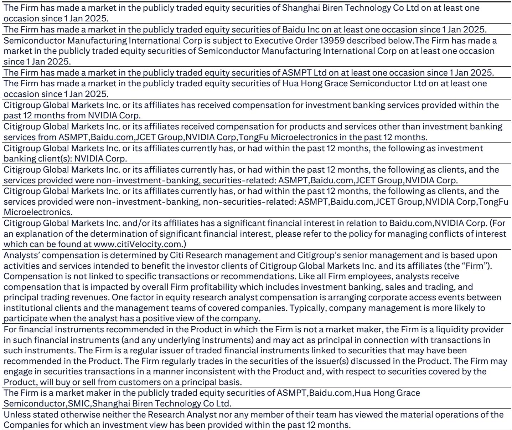
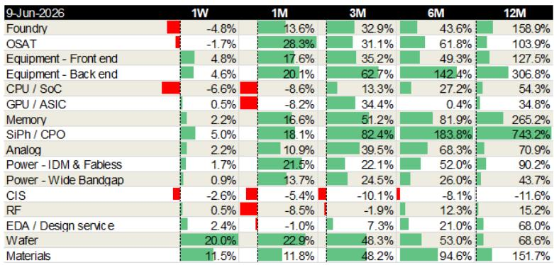
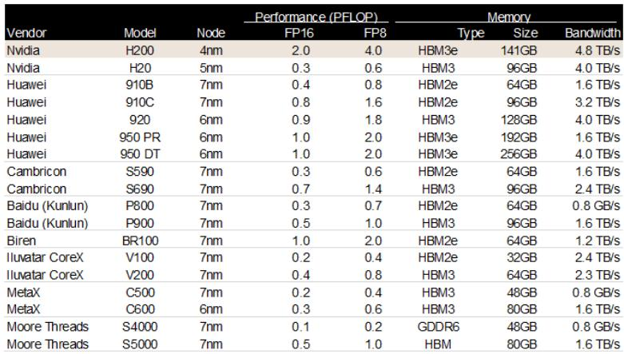

# China’s RMB 2 Trillion AI Investment Plan Is Not Just a Spending Program—It Is a Supply Chain Rewiring Strategy

On June 9, 2026, Bloomberg reported that China is preparing to invest RMB 2 trillion (approximately USD 295 billion) over the next five years in data centers and networks to support its domestic artificial intelligence sector. This is not a stimulus package. It is a structural intervention designed to accomplish something that market forces alone have not yet achieved: the creation of a fully self-sufficient AI hardware supply chain that operates with at least 80 percent locally produced AI accelerators.

The scale of this commitment deserves careful analysis. Two trillion renminbi over five years represents roughly 0.4 percent of China’s annual GDP directed specifically at AI infrastructure. But the financial magnitude, while striking, is not the most important variable. The binding constraint is the 80 percent localization requirement for AI chips in state-operated data centers. That requirement transforms this from a construction program into an industrial policy with specific, measurable technology adoption targets.

For investors, the implications are profound but unevenly distributed. The report from a global investment bank identifies four beneficiary segments: foundries, OSATs (outsourced semiconductor assembly and test providers), equipment suppliers, and AI accelerator vendors. This is a useful starting point. But a strategic reading suggests that the real winners will be determined by which companies can solve the most difficult technical bottlenecks, not just by which ones sit in the right industry category.

The timing matters. This announcement comes at a moment when domestic AI chip vendors have already captured the commanding majority of China’s AI accelerator market, largely because Nvidia H200 imports have stalled. The 80 percent target, which might have seemed ambitious two years ago, now appears achievable. That does not mean the plan is risk-free. It means the risks have shifted from questions of feasibility to questions of performance, yield, and scaling.

## The 80 Percent Localization Target Is Achievable, But the Performance Gap Remains the Central Strategic Challenge

The most striking feature of the accelerator comparison table in the report is not the number of domestic vendors. It is the performance dispersion. Nvidia’s H200 delivers 2.0 petaflops at FP16 and 4.0 at FP8, with 141 gigabytes of HBM3e memory and 4.8 terabytes per second of bandwidth. The best domestic chip currently available, Huawei’s 950 DT, delivers 1.0 petaflops at FP16 and 2.0 at FP8, with 256 gigabytes of memory and 4.0 terabytes per second of bandwidth.

On paper, the Huawei 950 DT matches the H200 in memory bandwidth and exceeds it in memory capacity. But the raw compute performance is half. This is not a marginal gap. For training large language models, where every incremental petaflop translates into faster convergence and lower total cost, a 50 percent performance deficit is material. For inference workloads, the gap may be less punishing, but it still means that achieving equivalent throughput requires roughly twice as many chips.

The report notes that the 80 percent target is achievable because domestic vendors have already captured most of the market. That is correct as a statement of current market share. But it conflates volume with capability. The market has shifted toward domestic chips primarily because of supply constraints on Nvidia products, not because domestic alternatives have reached parity. If the 80 percent target is enforced rigidly, Chinese AI operators will be running their most demanding workloads on hardware that is one generation behind the global frontier.

This creates a strategic tension. The investment plan is designed to accelerate domestic AI development, but it may simultaneously constrain the performance ceiling for Chinese AI models. The question that the report raises but does not fully answer is whether the localization requirement will be applied uniformly across all data center tiers or whether there will be carve-outs for frontier research applications that require maximum compute density.

## Foundries and OSATs Face a Volume Opportunity, But the Real Bottleneck Is Advanced Packaging and Interconnect

The report identifies SMIC and Hua Hong as beneficiaries on the foundry side, and JCET and Tongfu on the OSAT side. This logic is straightforward: more domestic chip production means more wafer starts and more packaging demand. But the analysis needs to go deeper.

The critical constraint in China’s semiconductor supply chain is not wafer fabrication capacity at mature nodes. It is advanced packaging capability, particularly for high-bandwidth memory integration and chiplet interconnect. The accelerator comparison table shows that every domestic chip above 0.5 petaflops uses HBM memory. Huawei’s 950 series uses HBM3e. Cambricon’s S690 uses HBM3. These memory types require advanced packaging technologies such as CoWoS (chip-on-wafer-on-substrate) or equivalent 2.5D and 3D stacking approaches.

China’s OSATs have made progress in traditional packaging, but the gap in advanced packaging for AI accelerators remains wide. JCET and Tongfu are investing in these capabilities, but the technology is difficult to replicate without access to the same equipment and process know-how that TSMC and its ecosystem have developed over years. The equipment suppliers identified in the report, such as ASMPT and Vital Deeptech, will benefit from increased capital spending on packaging lines. But the question is whether the domestic equipment ecosystem can deliver the precision and yield required for HBM integration at scale.

This is the segment where the report’s analysis is most useful but also most incomplete. The equipment suppliers are listed as beneficiaries, but the report does not quantify the technology gap in advanced packaging equipment. That gap will determine whether the 80 percent localization target can be met without a significant compromise in chip performance or yield.

## Smaller AI Chip Vendors May Benefit More Than the Market Expects

One of the more interesting observations in the report is that state-funded data centers may be more willing to purchase from a broader range of suppliers. This is a subtle but important point. In a market driven by commercial procurement, large cloud operators tend to standardize on a small number of chip vendors to simplify software stacks and operational management. But when the procurement decision is driven by policy objectives—specifically, the goal of demonstrating domestic supply chain viability—the incentive structure changes.

The accelerator comparison table lists 13 domestic vendors, including Cambricon, Baidu Kunlun, Biren, Iluvatar CoreX, MetaX, and Moore Threads. Their performance ranges from 0.1 to 1.0 petaflops at FP16. Many of these companies have struggled to gain commercial traction because their software ecosystems are immature and their performance lags behind Huawei’s offerings. But a state-funded data center that needs to meet localization requirements may be willing to accept lower performance in exchange for vendor diversity and supply chain resilience.

This creates an interesting dynamic. Huawei is the dominant domestic player, with the broadest product line and the most mature software stack. But if the policy objective is to build a resilient ecosystem, concentrating all demand on a single vendor would create a single point of failure. The report implicitly suggests that smaller vendors will get a share of the procurement pie, even if their chips are less competitive on a pure performance basis.

The strategic implication is that the investment plan may accelerate the maturation of second-tier domestic chip companies by providing them with revenue, deployment data, and real-world feedback loops that they would not otherwise obtain. This is a classic industrial policy pattern: government procurement acts as a demand-side catalyst that helps vendors climb the learning curve. The open question is whether the performance gap between these vendors and the global frontier will narrow fast enough to make them commercially viable when the policy support eventually tapers.

## The Report Leaves an Unresolved Question About the Memory Supply Chain

One topic that the report touches on only indirectly is memory. The accelerator comparison table shows that every domestic chip uses either HBM2e, HBM3, or HBM3e memory. Huawei’s 950 DT uses 256 gigabytes of HBM3e with 4.0 terabytes per second of bandwidth. That is a meaningful technical achievement. But the report does not address where this HBM memory is sourced.

China’s domestic memory industry has made progress in DRAM and NAND through companies like YMTC and CXMT, but high-bandwidth memory is a different challenge. HBM requires through-silicon vias, microbump technology, and precise stacking processes that are among the most difficult manufacturing tasks in the semiconductor industry. Samsung, SK Hynix, and Micron dominate this space. If China’s AI accelerator localization depends on imported HBM, then the supply chain is not truly domestic.

The report does not provide data on HBM sourcing. This is a meaningful gap. If the 80 percent localization requirement applies only to the AI accelerator chip itself and not to the memory stacked on top of it, then the policy is less transformative than it appears. If the requirement extends to memory, then China’s memory manufacturers face a technology challenge that is arguably harder than the AI accelerator challenge itself.

This is the kind of second-order question that serious investors need to explore. The investment plan is real. The RMB 2 trillion commitment is real. But the supply chain reality underneath the policy targets is complex, and the memory question is perhaps the most important unresolved variable.

## A Decision Framework for Investors Evaluating Exposure to China’s AI Infrastructure Buildout

For investors trying to translate this report into actionable analysis, a structured framework is more useful than a list of beneficiary companies. The following decision logic can help assess which positions are most likely to benefit and which carry hidden risks.

First, assess technology maturity. Companies that can demonstrate production-ready solutions at scale today are safer bets than companies that are still in the development or sampling phase. The accelerator comparison table provides a useful starting point: vendors with chips in production and deployed in real data centers have lower execution risk than those with chips that exist only in datasheets.

Second, evaluate localization depth. A company that relies on imported equipment, imported materials, or imported memory is more vulnerable to supply chain disruptions than one that has built a domestically sourced production chain. The investment plan creates demand, but it does not solve supply chain dependencies. Companies that have invested in domestic equipment qualification and alternative material sourcing will have a structural advantage.

Third, analyze the software ecosystem. AI accelerators are only as useful as the software stack that supports them. Nvidia’s dominance is not just about hardware performance; it is about CUDA, cuDNN, TensorRT, and the entire ecosystem of libraries and frameworks that make Nvidia GPUs the default choice for AI development. Domestic vendors that have invested in software compatibility and developer tools will capture more value than those that focus exclusively on hardware specifications.

Fourth, consider the policy duration risk. The five-year investment plan creates a visible demand horizon, but policy priorities can shift. Companies that use this period to build commercial viability outside of government procurement will be more resilient than those that become dependent on state-funded data center orders.

Fifth, watch the memory supply chain. This is the variable that most investors will overlook. If China can develop domestic HBM production at scale, the entire AI accelerator ecosystem becomes more self-sufficient. If not, the localization target may need to be reinterpreted in a way that excludes memory, which would leave a critical vulnerability in the supply chain.

## The Full Report Contains the Data That Makes These Questions Answerable

The analysis above draws on the report’s accelerator comparison table and sector performance data, but the full report contains additional detail on company-specific positioning, valuation context, and the competitive dynamics within each beneficiary segment. The original charts show share price movements across 16 semiconductor sub-sectors over multiple time horizons, revealing which segments have already priced in the investment plan and which still have room for adjustment.

The report also includes specific company coverage and ratings that provide a starting point for portfolio construction. But the most valuable part of the full report is the analytical framework that connects the policy announcement to specific supply chain bottlenecks and competitive dynamics.

Join the community to read the full report and review the original charts.

*This article is for learning and discussion only and does not constitute investment advice.*

Personal reading notes and learning share only. Not investment advice.

