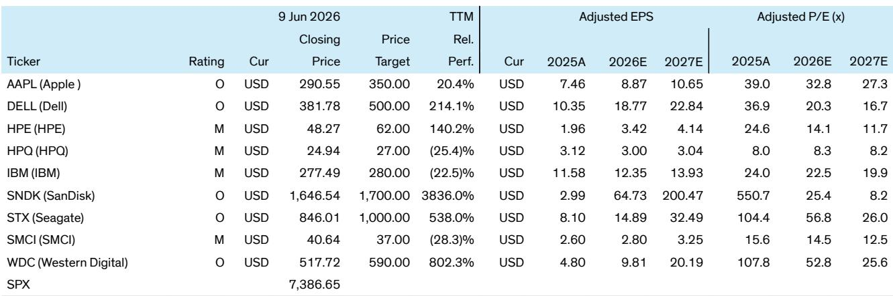
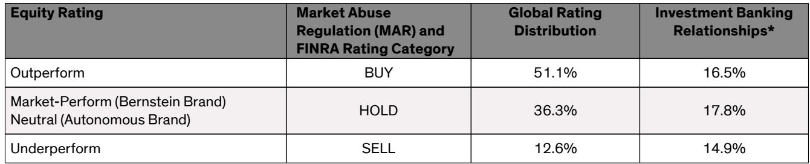

# The Quantum Computing Industry Will Not Converge on a Single Winner — and That Is the Strategic Insight Investors Need to Act On

The most important thing to understand about quantum computing today is that the industry is not heading toward a single dominant architecture. This is not a technology race that will end with one company, one modality, or one approach winning. The physics itself prevents it. The strategic implication for investors, corporate strategists, and technology leaders is profound: you cannot place a single bet and expect to capture the full opportunity. Instead, the quantum future will be a multi-modality ecosystem, where different hardware approaches coexist because they are fundamentally optimized for different classes of problems. This is not a transitional phase. This is the end state for at least the next decade, and probably longer.

Why now matters is simple. The industry is approaching a critical inflection point. IBM has stated it expects to demonstrate quantum advantage this year. Major technology companies have invested billions. Startups are emerging with new approaches that were barely viable two years ago. Yet the narrative in the market remains oversimplified. Many investors still think in terms of "quantum is coming" or "quantum is a race." Neither framing captures the structural reality. The real strategic question is not which modality will win. It is how to build a portfolio of positions that reflects the fact that multiple modalities will win in different domains.

This article is based on a detailed expert webinar hosted by a global investment bank, featuring a technology manager with 15 years of experience in leading quantum companies and large tech. The discussion cut through the marketing and laid out the technical trade-offs with unusual clarity. What follows is an analytical interpretation of that conversation, extended into strategic implications for decision-makers.

## The Fundamental Trade-Off Between Speed and Accuracy Creates a Permanent Segmentation in the Quantum Market

The single most important technical insight from the expert discussion is the distinction between manufactured qubits and natural qubits. This is not an academic classification. It is the axis around which the entire competitive landscape rotates.

Manufactured qubits — superconducting, silicon spin, and topological — are engineered systems. They are fast. They operate at kilohertz or even megahertz repetition rates. They can run many repetitions of a computation quickly. But they suffer from higher noise, shorter coherence times, and significant fabrication variability. When you manufacture two superconducting qubits, even if you try to make them identical, there is roughly a 10 percent spread in their properties. That forces control systems to operate across a much larger bandwidth, introducing complexity and error.

Natural qubits — trapped ions and neutral atoms — are inherently identical. Every atom of the same element is the same. They have naturally long coherence times. They are robust to environmental noise. But they are slow. A trapped ion system might repeat a computation at most once per second. That is a factor of a thousand slower than superconducting systems.

This trade-off is not going away. It is physical. It means that for applications requiring many repeated samplings to estimate a real-valued output — such as chemistry simulations, materials science, or optimization under uncertainty — fast systems like superconducting will have a structural advantage. For applications requiring a single correct answer — such as factoring, cryptography, or certain combinatorial optimization problems — the higher fidelity of natural qubits will dominate.

The market is not going to converge on one solution because the problems themselves are different. This is not a temporary fragmentation. It is a permanent segmentation.

## Superconducting Leads Today, but Its Long-Term Path Is More Uncertain Than the Market Assumes

Superconducting qubits are the current leader by almost every near-term metric. They have the largest scale, with systems of hundreds of qubits. They have the fastest operation rates. They have the most industrial maturity, backed by massive investment from large technology companies. IBM and Google have driven the field forward with sustained engineering.

But the expert discussion revealed a critical vulnerability that is not widely appreciated. Superconducting qubits are planar devices fabricated on a flat surface. This makes it very difficult to engineer interactions between qubits that are not physically adjacent. The industry consensus is that long-range interactions are necessary to implement the error correction codes that will ultimately enable fault-tolerant quantum computing. Without them, the number of physical qubits required to create a single logical qubit becomes prohibitively large.

Natural qubits, by contrast, can perform long-range interactions naturally. Trapped ions can be moved around. Neutral atoms can be rearranged. This gives them a structural advantage in the path toward fault tolerance that superconducting systems must overcome through engineering.

IBM and Google are working on this problem. A European startup recently released a roadmap for enabling long-range interactions in superconducting systems. But these are world-first demonstrations that have not yet been achieved at scale. The superconducting lead is real, but it is built on a foundation that becomes more uncertain the further out you look.

## Neutral Atoms Have Moved from the Bottom to the Top in Just Two Years — and That Speed of Change Is Itself a Strategic Signal

The expert noted that if this conversation had happened two years ago, neutral atoms would have been ranked at the bottom of the list. Today, they are in a three-way tie at the top alongside superconducting and trapped ions.

The catalyst was a collaboration between Harvard and MIT, and their spin-out company QuEra. They demonstrated performance that was previously thought impossible for neutral atom systems. This is not an incremental improvement. It is a step-change that reshaped the competitive landscape in under 36 months.

The strategic implication is that the quantum hardware landscape is far more dynamic than most investors appreciate. The technology is not maturing along a predictable S-curve. Breakthroughs can come from unexpected directions and rapidly elevate a previously marginal approach. This argues against concentration in any single modality, no matter how dominant it appears today.

It also argues for paying close attention to the research ecosystem. The most important advances in neutral atoms came from academia, not from large technology companies. The pipeline of innovation is broader than the public markets currently price in.

## The Capital Intensity of Quantum Computing Means the Dominant Business Model Will Be Cloud-Based, Not Hardware Ownership

The expert discussion made clear that quantum computing is extraordinarily capital intensive. Building and operating a quantum computer requires specialized fabrication facilities, cryogenic infrastructure, precision control electronics, and a deep talent pool. Very few organizations can afford to own and operate their own machines.

The natural consequence is that quantum computing will be delivered primarily through the cloud. This is not a speculative prediction. It is already happening. IBM, Google, Amazon, and Microsoft all offer quantum cloud services. The model mirrors the evolution of classical high-performance computing, where the economics of ownership shifted decisively toward cloud-based access.

For investors, this has several implications. First, the hardware vendors that succeed will be those that also build strong software ecosystems and cloud platforms. IBM's Qiskit framework is a significant competitive advantage here, because it creates switching costs and developer lock-in. Second, the cloud model favors large technology companies with existing infrastructure and customer relationships. Third, it creates opportunities for specialized middleware and software companies that can abstract away the hardware complexity for end users.

The early demand for quantum cloud services is coming from academia, government, and research institutions. But the expert noted growing interest from finance, logistics, and optimization industries. These are domains where the speed-accuracy trade-off maps directly to business value.

## What the Report Does Not Fully Answer: The Timing and Shape of the Transition from NISQ to Fault Tolerance

The expert discussion was unusually clear on the technical trade-offs. But it left several critical questions unresolved, and investors should be honest about the limits of current knowledge.

The first open question is timing. The expert stated that large-scale, fault-tolerant quantum computing is still many years away. But "many years" is not a precise forecast. The path depends on milestones — development of logical qubits, logical gates, and scalable error-corrected systems — that have not yet been achieved. The expert noted that natural qubit systems may demonstrate early fault-tolerant results in the next couple of years. But scaling those demonstrations to commercially relevant sizes is a separate challenge.

The second open question is whether the NISQ (Noisy Intermediate-Scale Quantum) era will produce commercially valuable applications before fault tolerance arrives. Some companies are betting that noisy quantum systems can still provide useful results for certain optimization problems. Others argue that without error correction, the noise will overwhelm any practical advantage. The expert did not take a definitive position, and the evidence remains mixed.

The third open question is the role of hybrid quantum-classical computing. The expert suggested this is the most practical path forward. But the architecture of hybrid systems — how classical and quantum processors communicate, what fraction of a problem can be offloaded to the quantum device, and how to manage the latency between the two — is still being defined.

These are not minor uncertainties. They are fundamental to any investment thesis. The report provides a framework for thinking about them, but it does not resolve them. That is not a weakness of the analysis. It is an honest reflection of where the technology stands.

## A Decision Framework for Investors: Map Modalities to Applications, Not to Companies

Given the multi-modality structure of the quantum market, the most useful framework for investors is to think in terms of application-modality pairs rather than trying to pick a single winning company or technology.

Start with the application. If the problem requires repeated sampling to estimate a real-valued output — chemistry simulation, materials design, financial risk modeling — the fast modalities have a structural advantage. Superconducting systems are the strongest candidate here, assuming the long-range interaction challenge can be solved. If it cannot, trapped ions may eventually compete by improving their speed through engineering.

If the problem requires a single correct answer — factoring, code-breaking, certain optimization problems — the high-fidelity natural qubits have the edge. Trapped ions and neutral atoms are the leading candidates. The speed disadvantage matters less because you only need one successful computation.

If the problem involves long-range correlations or complex multi-qubit interactions, natural qubits have a fundamental physics advantage that manufactured qubits must engineer around.

For each of these application clusters, investors should ask three questions. First, which companies or research groups have the strongest technical position in that modality? Second, do they have the capital and talent to sustain their lead through the long development cycle? Third, do they have a credible path to commercialization, either through cloud delivery or through partnership with a larger platform?

This framework does not produce a single answer. It produces a portfolio of hypotheses, each with different risk profiles and time horizons. That is appropriate for a technology that is still in its early stages and whose competitive dynamics are changing rapidly.

## Join the Community to Read the Full Report and Review the Original Charts

The expert discussion covered significantly more ground than what is summarized here, including detailed assessments of spin qubits, photonics, topological qubits, the competitive positioning of major technology companies, and the role of government funding. The original report also includes a ticker table with ratings and price targets for major IT hardware companies, along with the full transcript of the Q&A session.

For investors and strategists who want to dig deeper into the specific trade-offs, the company-level implications, and the timeline for key milestones, the full report is essential reading. Join the community to read the full report and review the original charts.

*This article is for learning and discussion only and does not constitute investment advice.*

Personal reading notes and learning share only. Not investment advice.

