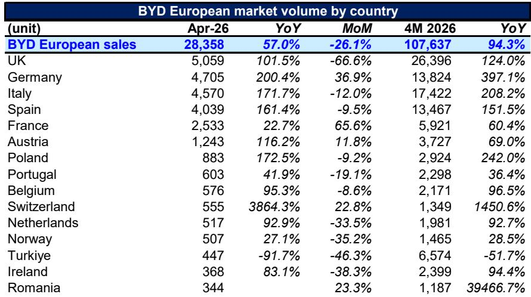
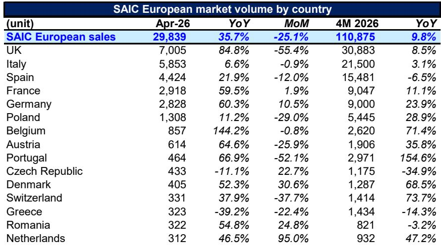
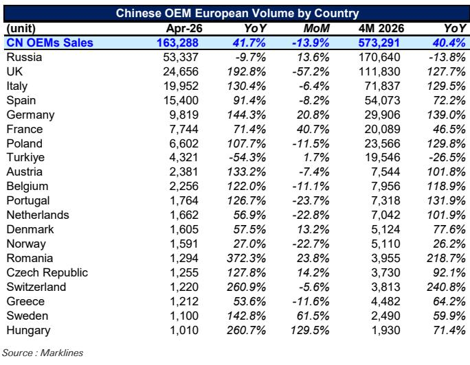

# Chinese Automakers Have Reached a Strategic Inflection Point in Europe: The Question Is No Longer Whether They Will Grow, but Which Markets and Players Will Define the Next Phase

The data from April 2026 makes one thing unmistakably clear: the narrative that Chinese automakers are struggling to gain traction in Europe is no longer defensible. With 163,288 vehicles sold across the continent in a single month, representing a 41.7% year-on-year increase, Chinese original equipment manufacturers (OEMs) have not only sustained their momentum but accelerated it. The cumulative four-month total of 573,291 units, up 40.4% from the same period in 2025, signals that this is not a seasonal spike or a one-off anomaly. It is a structural shift in the European automotive landscape.

This matters now because the window for strategic positioning is closing. European regulators are watching, legacy automakers are reacting, and the competitive dynamics within the Chinese camp itself are shifting rapidly. The aggregate market share of Chinese OEMs in Europe has reached 12%, up from roughly 9% a year ago, and in some key markets like the United Kingdom and Italy, that share is approaching or exceeding 15%. These are not fringe gains. They represent a meaningful reallocation of market power.

The most important insight from the April data is not the headline growth number, however impressive it may be. It is the divergence beneath the surface. Growth is not uniform across markets, brands, or vehicle segments. The winners are pulling away, and the laggards are falling behind. For investors, industry strategists, and policymakers alike, understanding the contours of this divergence is far more valuable than celebrating the aggregate trend.

## The European Market Is Not a Single Battlefield: Chinese OEMs Are Winning in Some Countries and Losing in Others, and the Variance Reveals the True Strategy

A superficial reading of the data would suggest that Chinese automakers are thriving everywhere in Europe. The reality is far more nuanced. In April 2026, Chinese OEMs sold 53,337 vehicles in Russia, a figure that dwarfs every other market but also represents a 9.7% year-on-year decline. Compare this to the United Kingdom, where sales surged 192.8% to 24,656 units, or Italy, where growth reached 130.4% on 19,952 vehicles. In Germany, sales of 9,819 units were up 144.3% year on year, while in France, 7,744 units represented a 71.4% increase.

The pattern is not random. Chinese automakers are prioritizing markets with favorable regulatory environments, established distribution partnerships, and consumer openness to new brands. The UK stands out as the most receptive major market, with Chinese brands capturing 17% of total sales in April, up from 7% just over a year ago. Italy, with a 13% share, and Spain, where Chinese OEMs have grown 91.4% year on year, are following similar trajectories. These are markets where the transition to electric vehicles is policy-supported and where consumers have shown less brand loyalty to legacy European manufacturers.

Conversely, the decline in Russia, which remains the largest absolute volume market for Chinese OEMs, tells a different story. The 13.8% drop in the first four months of 2026 suggests that the initial post-sanction surge may be plateauing. More importantly, it highlights the risk of over-reliance on a single geopolitical play. Markets like Turkiye, where sales fell 54.3% year on year, reinforce the point that not all emerging markets are created equal for Chinese automakers.

The strategic implication is clear: Chinese OEMs are not pursuing a blanket European strategy. They are making calculated bets on specific national markets, and the winners in this phase will be those that build deep distribution and service networks in the UK, Italy, and Spain, while using Germany and France as high-prestige beachheads rather than volume engines.

## The Hierarchy of Chinese Automakers Is Reshaping: Chery, SAIC, and BYD Lead, but a Second Tier of Fast Followers Is Emerging with Disproportionate Growth Rates

The aggregate data obscures a critical competitive dynamic: the Chinese automaker landscape in Europe is becoming increasingly stratified. In April 2026, Chery led with 40,841 units, followed by SAIC at 29,839 and BYD at 28,358. These three players alone accounted for nearly 60% of total Chinese OEM volume in Europe. Geely and Great Wall Motor each sold roughly 18,000 units, occupying a solid middle tier.

The real story, however, is in the growth rates. Leapmotor, a relatively lesser-known brand in global markets, posted a staggering 415.8% year-on-year increase in April, selling 8,758 units. Over the first four months of 2026, Leapmotor's cumulative sales of 32,747 units represent a 590% increase from the prior year. XPeng, with 3,344 units in April, grew 102.7% year on year. FAW, a state-owned enterprise, saw a 208.2% increase. Even Dongfeng Motor, with 2,793 units, grew 120.8%.

These numbers suggest that the Chinese automotive export ecosystem is far more diverse than many Western observers assume. It is not simply a story of BYD versus Tesla or SAIC versus Volkswagen. A wave of second-tier Chinese automakers is entering the European market with aggressive pricing, competitive technology, and increasingly sophisticated distribution strategies.

The question this raises for investors and competitors is whether the current leaders can maintain their positions as the market expands. Chery's 29% growth, while solid, trails the overall Chinese OEM average. SAIC's 35.7% growth is respectable but not exceptional. BYD's 57% growth, by contrast, signals that the company is still in an acceleration phase. The risk for the incumbents is that the fast followers, particularly Leapmotor and XPeng, may capture disproportionate share in the next wave of market expansion, especially if they target price points and segments that the leaders have not fully addressed.

## The UK and Italy Are Becoming the Decisive Theaters: Market Share Above 13% in Both Countries Signals That Chinese Brands Have Crossed the Threshold from Niche to Mainstream

Market share is the most telling metric in this analysis, and the data from the UK and Italy demands attention. In April 2026, Chinese OEMs captured 17% of the UK market and 13% of the Italian market. These are no longer experimental footholds. They are substantial positions that force existing competitors to respond.

The UK case is particularly instructive. Chinese OEM sales in the UK reached 24,656 units in April, a 192.8% year-on-year increase that is all the more remarkable given that the overall UK market grew only 25% in the same period. Chinese brands are not simply riding a rising tide; they are taking share from established players. Chery alone now holds 6% of the UK market, while SAIC holds 4% and BYD 3.5%. Combined, these three brands have a larger market share in the UK than many European legacy brands.

Italy tells a similar story, with a different cast of characters. SAIC leads at 3.4% market share, followed by BYD at 2.7% and Leapmotor at 2.5%. The Italian market, which has been historically dominated by domestic brands like Fiat, is showing a remarkable openness to Chinese entrants. The 13% aggregate share in April represents nearly a tripling from the 4.5% level seen in January 2025.

The strategic significance of these two markets cannot be overstated. The UK and Italy together represent roughly 25% of the European automotive market. Achieving double-digit market share in both creates a platform for further expansion into adjacent markets and builds the brand recognition and service infrastructure necessary for long-term success. It also puts pressure on European regulators, who must now weigh the competitive benefits of Chinese investment against the political costs of protecting domestic industry.

## Germany and France Reveal the Remaining Barriers: Low Single-Digit Market Share in the Two Largest European Economies Suggests That the Next Phase of Growth Will Require a Different Playbook

For all the success in the UK and Italy, Chinese automakers have yet to crack the two largest European markets. In Germany, Chinese OEMs held just 4% market share in April 2026. In France, the figure was 5.7%. While both represent significant increases from a year ago, they remain well below the levels achieved in the UK and Italy.

The German case is particularly revealing. Despite selling 9,819 units in April, a 144.3% year-on-year increase, Chinese brands account for only 4% of a market that sold 249,000 vehicles in the same month. BYD leads among Chinese brands in Germany with 1.5% share, followed by SAIC at 0.9%. The remaining Chinese OEMs collectively hold just 0.7%. In the home market of Volkswagen, Mercedes-Benz, and BMW, consumer loyalty to domestic brands remains formidable.

France presents a similar pattern, though with slightly better penetration. SAIC leads at 1.7% market share, followed by BYD at 1.1%. The combined Chinese share of 5.7% in April represents meaningful progress from the 2% level in January 2025, but it is still far from the threshold that would signal a structural shift.

The implication is that Chinese automakers face a two-speed Europe. In markets with weaker domestic auto industries and more open consumer attitudes, they can achieve rapid penetration. In the industrial heartlands of Germany and the protectionist environment of France, progress is slower and requires different strategies. Local production, joint ventures with European partners, and investments in brand-building are likely necessary to move beyond single-digit share in these markets. The question is whether Chinese OEMs have the patience and capital to play the long game in Germany and France, or whether they will focus their resources on the markets where they can win more quickly.

## What the Report Does Not Fully Answer: The Sustainability of Growth Rates, the Impact of Tariff Policy, and the Profitability of European Operations Remain Critical Unknowns

The data in this report is invaluable for tracking volume and market share, but it leaves several critical strategic questions unanswered. First, the growth rates, while impressive, are being measured against a relatively low base. Leapmotor's 590% year-to-date growth, for example, is a function of starting from near-zero volume. As the base expands, maintaining such rates becomes mathematically impossible. The question is not whether growth will slow, but at what level it will stabilize.

Second, the report does not address the impact of tariff policy. The European Commission's anti-subsidy investigation into Chinese electric vehicles, which has already resulted in provisional tariffs, could materially alter the competitive landscape. The data in this report reflects sales through April 2026, before the full impact of any tariff changes may have been felt. If tariffs rise significantly, the economics of exporting from China to Europe could shift, potentially accelerating the trend toward local production that some Chinese automakers have already begun.

Third, and perhaps most importantly, the report does not disclose profitability. Volume growth is one thing; profitable volume growth is another. Chinese automakers have historically been willing to accept thin margins or even losses in new markets to gain share. The extent to which European operations are profitable, or on what timeline they are expected to become profitable, is a critical input for any investment decision. Without this data, it is impossible to assess whether the current growth trajectory is sustainable or whether it represents a capital-intensive land grab that will eventually require a reckoning.

## A Decision Framework for Investors and Strategists: Three Questions to Determine Which Chinese Automakers Will Win in Europe

For readers who need to translate this data into actionable decisions, three questions can serve as a framework for evaluating individual Chinese automakers' prospects in Europe.

First, **what is the automaker's market concentration risk?** Companies that are overly dependent on a single market, such as those with heavy exposure to Russia, face greater geopolitical and regulatory risk. Automakers with balanced portfolios across the UK, Italy, Spain, and Germany are better positioned to weather shocks in any one market.

Second, **what is the automaker's local production strategy?** The era of pure export from China to Europe is likely finite. Tariff risk, supply chain complexity, and consumer preferences for locally produced vehicles will increasingly favor automakers that invest in European assembly or manufacturing. Companies that have announced or begun local production plans have a strategic advantage over those that remain pure exporters.

Third, **what is the automaker's brand positioning in Europe?** The data shows that not all Chinese brands are perceived equally. BYD has built a relatively strong brand around battery technology and sustainability. Chery has leveraged partnerships and aggressive pricing. Leapmotor is positioning as a value player. The brands that can establish a clear and differentiated identity in the European market will be better able to command pricing power and build customer loyalty.

Applying this framework to the April data suggests that BYD, with its balanced geographic exposure, announced European production plans, and strong technology brand, is best positioned for sustained success. Leapmotor, despite its explosive growth, carries higher risk due to its narrow model lineup and lack of local production. Chery and SAIC occupy a middle ground, with strong volumes but questions about brand perception and profitability.

## The Full Picture Demands a Deeper Dive: Join the Community to Access the Original Charts and Proprietary Analysis That Reveal the Complete Competitive Landscape

The data presented here represents only a fraction of what the full report contains. The monthly volume monitor includes country-by-country breakdowns, brand-level market share trends, and comparative analysis across 20 European markets. It tracks not only the leaders but also the emerging players whose trajectories may signal the next wave of disruption. The original charts reveal patterns that are difficult to capture in text: the seasonality of sales, the month-on-month volatility, and the relationship between Chinese OEM growth and overall market conditions.

For investors, corporate strategists, and policymakers who need to make decisions based on the most current and comprehensive data, the full report is an essential resource. It provides the granularity that aggregate numbers cannot, and it enables the kind of comparative analysis that separates informed strategy from guesswork.

Join the community to read the full report and review the original charts.

*This article is for learning and discussion only and does not constitute investment advice.*

Personal reading notes and learning share only. Not investment advice.

