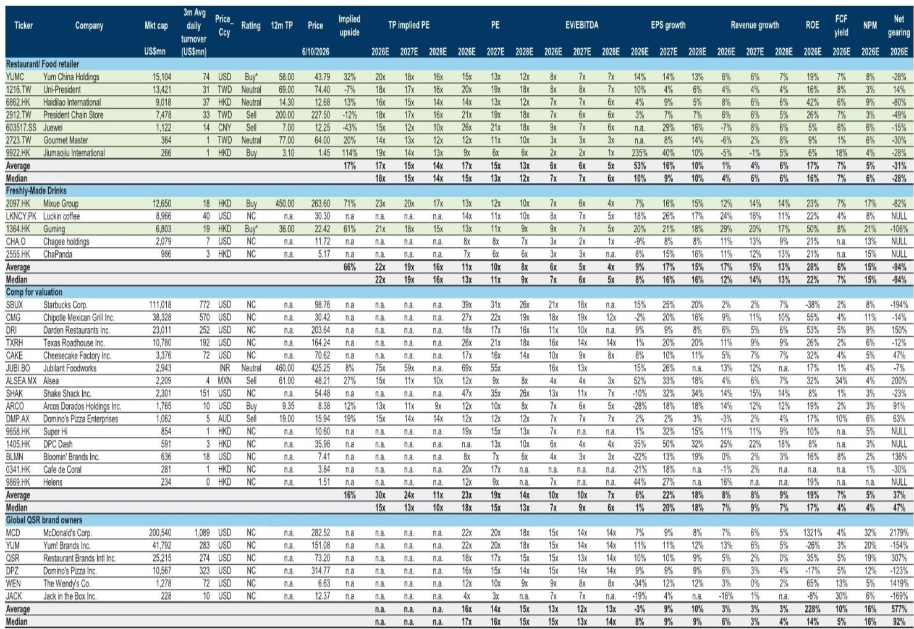
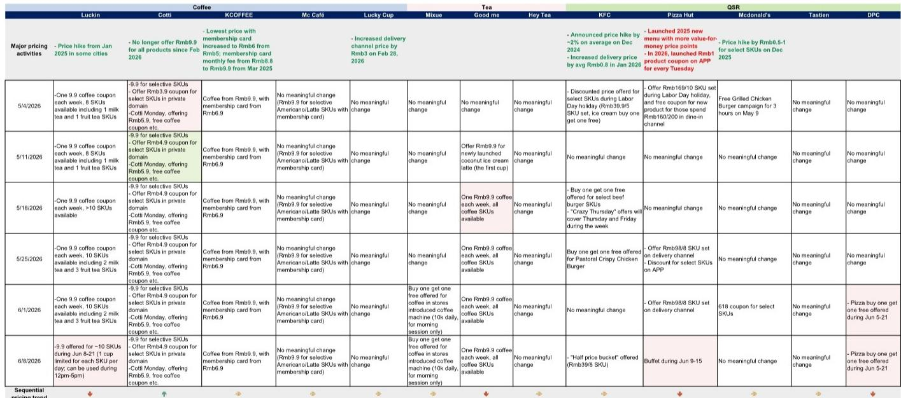
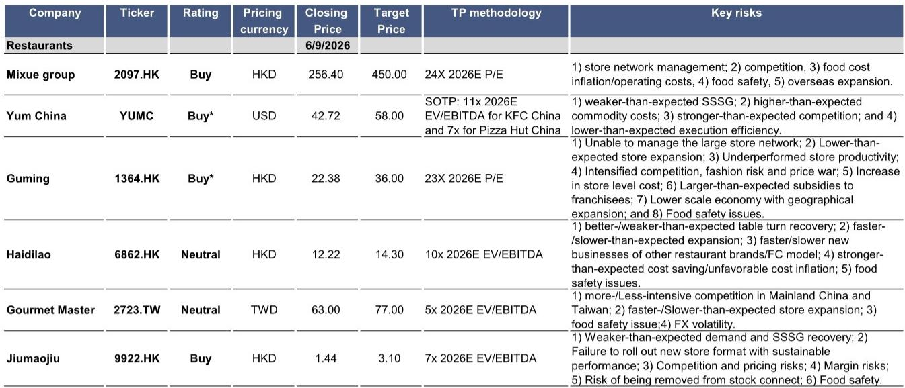

# GS：中国餐饮的五月数据揭示的不是需求疲软，而是品牌分化的加速

五月的数据，看起来有点“冷”。

GS最新发布的餐饮月度追踪报告显示，五月同店销售增长（SSSG）较四月进一步走弱。五一假期需求温和，消费情绪未见明显提振，部分地区还受到天气扰动。如果你只看这个开头，很容易得出一个笼统的判断：消费复苏又踩了一脚刹车。

但这份报告的真正价值，不在于确认“五月数据变差”这个已知事实，而在于它揭示了一个更为关键的结构性变化：品牌之间的分化正在加速，且这种分化并非简单的“大品牌抗跌、小品牌承压”，而是由商业模式、品类属性和成本结构共同决定的。那些仅仅用“消费降级”或“需求疲软”来解释一切的人，正在错过真正的投资信号。

报告中最值得关注的判断是：**五月数据确认了高基数效应开始显现，但真正决定企业未来走势的，不是需求总量的波动，而是品牌能否在分化中构建起新的定价权和成本优势。** 这一点，在现制茶饮（FMD）和火锅两个赛道上表现得尤为突出。

## 1. 现制茶饮的高基数压力只是表象，真正的变量是品牌能否用新品和品类扩张对冲下滑

五月，现制茶饮品牌普遍面临同店销售增长的压力，这在GS的预期之内。去年同期的强劲表现形成了一个较高的比较基数，高基数效应开始显现。但如果我们把目光从“同比”移开，观察环比和绝对量，会发现更值得关注的信号。

奈雪的茶五月单店销售额同比下滑幅度从四月的-11%扩大至-24%。这个数据本身令人担忧，但更关键的是，它与其他头部品牌形成了鲜明对比。报告指出，头部品牌展现出更强的韧性，支撑力来自品类扩张和新产品。这意味着，在同样的宏观环境下，能否持续推出有吸引力的新品、能否在品类上找到新的增长点，正在成为区分品牌强弱的核心能力。

这里需要警惕一个常见的误读：把高基数压力等同于“行业不行了”。实际上，高基数压力是周期性的、可预期的，而品牌的产品创新能力和品类扩张能力是结构性的、可积累的。后者才是决定企业在下一个周期中位置的关键。对于投资者而言，五月的压力测试恰恰提供了一个窗口，去观察哪些品牌真正具备穿越周期的产品力。

## 2. 火锅赛道的复苏并非整体性的，海底捞的“低基数红利”正在消退

海底捞五月平均翻台率同比转为小幅负增长，而四月还是中单位数增长。GS估算，这对应的翻台率约为3.8倍，恢复至2019年水平的80%-85%，略高于四月，但仍低于一季度水平。管理层将部分原因归咎于端午节日历效应（2025年端午节在五月，而2024年不在），但即使剔除这一因素，节后翻台率也出现了小幅减速。

GS的判断很克制：“市场预期也已经有所下调。”这句话背后的含义是：市场此前对海底捞的期待，部分建立在对“低基数红利”的线性外推之上。但现实是，低基数的红利正在消退，而真正的需求恢复并没有跟上。海底捞一季度至今的翻台率同比增幅仅为低单位数，略低于GS全年4%单店销售增长的假设。

这引出一个更本质的问题：当低基数效应完全消失后，海底捞靠什么驱动增长？是继续下沉开店，还是通过产品创新和场景拓展提升客单价？报告没有给出明确的答案，但数据本身已经提出了这个问题。对于投资者来说，五月的翻台率数据可能不是终点，而是一个需要重新审视增长假设的起点。

## 3. 太二的韧性值得关注，但它的成功模式能否复制到其他品牌仍存疑

在多数品牌承压的五月，太二的表现是一个亮点。太二在中国大陆市场录得低双位数同店销售增长，虽然略低于四月，但仍高于一季度10.9%的水平。更值得注意的是，节后增速出现了环比改善，五一期间受南方阴雨天气影响仅为中单位数至高单位数增长。

GS将太二的韧性归因于新模型门店的持续驱动和老模型门店的正增长。这里的“新模型”是指太二近年推出的面积更小、模型更轻的新店型，在成本结构和运营效率上都有优化。这实际上指向了一个重要的战略判断：在消费环境偏弱时，品牌扩张的核心竞争力正在从“品牌势能”转向“单店模型的经济性”。

但报告也坦诚地指出了隐忧：同属九毛九集团的“九毛九”和“怂”品牌，五月的同店销售趋势与一季度类似，分别下滑约11%和20%，并未出现改善。这意味着太二的成功模式并非可以简单复制到其他品牌。对于九毛九集团而言，如何将太二的运营经验转化为集团层面的组织能力，是一个尚未解决的问题。

## 4. 促销活动的频率在增加，但力度仍显“克制”——这恰恰是行业健康度的关键信号

报告中的一个细节值得单独讨论：GS的定价追踪显示，五月出现了更多促销活动。古茗推出了每周9.9元优惠券，蜜雪冰城推出了咖啡机门店的买一送一活动，瑞幸也推出了每日9.9元精选单品。乍看之下，这似乎是价格战升级的信号。

但GS的判断是：“促销力度和规模仍然是有纪律的。”这是一个非常重要的定性判断。如果促销是无序的、恶性的，那么行业利润将被迅速侵蚀，所有参与者都会受损。而“有纪律”的促销，意味着品牌在通过促销教育消费者、拉动堂食的同时，仍然在控制成本底线和品牌定位。

这里的洞察是：真正需要警惕的不是促销本身，而是促销是否导致了定价体系的崩塌。从现有数据看，九毛九和海底捞的定价趋势仍然稳定。如果后续数据出现定价松动，那将是一个比同店销售下滑更危险的信号。目前，这个风险尚未兑现，但需要持续跟踪。

## 5. 报告尚未完全回答的关键问题：当高基数效应和促销常态化叠加，行业利润率的底部在哪里？

GS的这份报告提供了丰富的高频数据，但有一个问题它没有完全展开：在可预见的未来，当高基数效应持续、促销活动常态化、而消费者价格敏感度仍在上升时，餐饮行业的利润率底部在哪里？

对于现制茶饮企业而言，新品研发和品类扩张需要投入，促销活动压缩毛利空间，而门店租金和人力成本是刚性的。三者叠加，利润率的下行风险有多大？报告提到了“配送占比环比或同比下降”这一正面信号，但这能否完全对冲其他压力，目前尚无定论。

对于火锅和中餐品牌而言，翻台率和客单价的组合正在发生变化。过去是“高翻台、中客单”的黄金组合，现在可能转向“中翻台、低客单”或“低翻台、高客单”的不同组合。哪种组合更可持续？报告提供了数据，但没有给出结论。

这些问题，恰恰是完整报告中最值得深入挖掘的部分。GS的分析师在报告中附带了详细的数据表格和季度趋势图，这些图表背后隐藏着更多二阶影响和交叉验证的线索。比如，不同城市的恢复差异、不同时段的客流分布、外卖与堂食的结构变化，这些细节在月度追踪的正文中无法完全展开，但对于形成投资判断至关重要。

如果你对这些问题感兴趣，欢迎来星球微信群里继续讨论。我们会围绕这份报告的数据，进一步拆解不同品牌在成本结构、定价策略和扩张节奏上的差异，并尝试构建一个更完整的利润率预测框架。这可能是比单纯跟踪月度同店销售更有价值的思考方向。

---

Personal reading notes and learning share only. Not investment advice.

