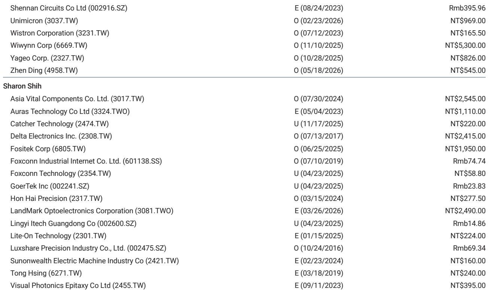
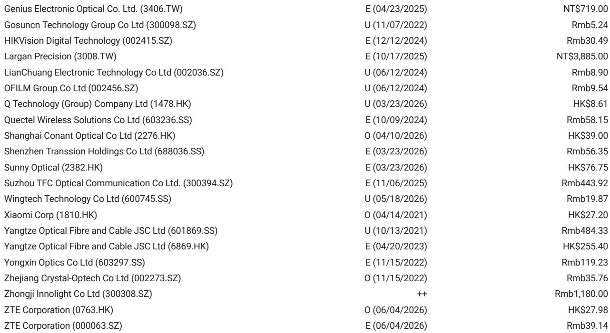
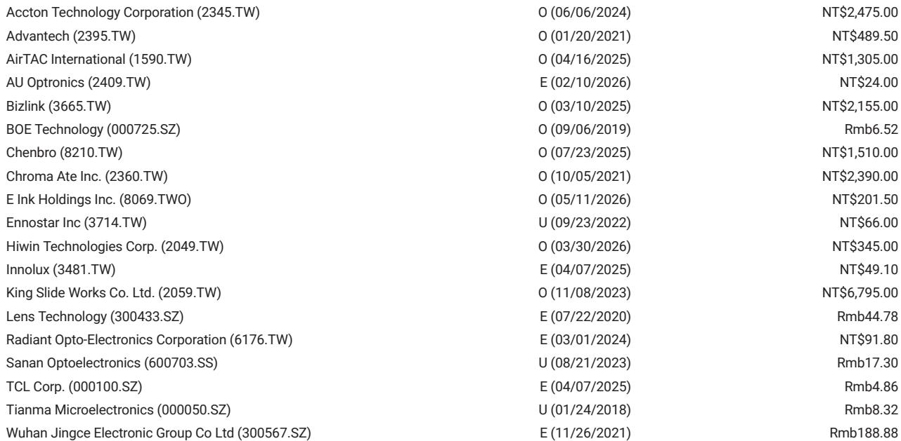

# 摩根斯坦利：市场对800V DC延迟的担忧被夸大了，真正的信号是供应链加速而非推迟

2026年6月9日，一则来自SemiAnalysis的报道在市场引发震动：NVIDIA原生800V DC电源架构的大规模出货被推迟至2028年，远低于市场预期。消息传出后，相关电源与散热供应链个股出现波动。但摩根斯坦利在Computex期间的供应链核查给出了截然不同的结论。

这份6月10日发布的研报，虽然篇幅不长，却直接回应了市场中最大的一个争议点——AI基础设施的电源架构升级节奏是否已经放缓。我们的判断是：市场对这条消息的解读出现了方向性错误。真正的信号不是延迟，而是加速。800V DC的产业化路径不仅没有中断，反而在多个维度上比预期走得更快。

以下是我们从这份摩根斯坦利研报中提炼出的五个核心洞察。

## 1. 800V DC的延迟消息与摩根斯坦利在Computex的一手供应链信息完全相悖

SemiAnalysis的报道声称NVIDIA已将原生800V DC电源架构的大规模出货推迟至2028年。但摩根斯坦利分析师Sharon Shih在Computex期间的直接沟通中获取的信息截然不同：NVIDIA在GTC Taipei明确表示，800V DC电源机架（Power Rack）将在2026年第三季度准备就绪并进入量产。这一时间表与“推迟至2028年”的说法存在两年的差距。

更关键的是，摩根斯坦利的供应链核查还发现了一个被市场忽视的趋势：原本计划走+-400V DC路线的多家超大规模云服务商，已经在将研发方向转向800V DC。这意味着，800V DC不仅没有延迟，反而正在成为行业共识的下一代标准。+-400V DC原本被视为过渡方案，如今其资源正在被重新分配至800V DC。

这里需要指出一个市场认知的盲区。许多人将“800V DC”等同于“NVIDIA的800V DC”，但电源架构的产业生态远比单一芯片厂商复杂。即使NVIDIA内部某个项目的时间表有所调整，也不代表整个800V DC产业链的节奏放缓。摩根斯坦利核查的是整个供应链——从电源机架制造商到保护器件供应商，再到标准认证机构——而不仅仅是NVIDIA一家。

## 2. 台达电将在2026年第四季度成为首家量产800V DC独立电源机架的厂商，客户是美国超大规模云商

这份研报中最具冲击力的信息点在于：台达电（Delta Electronics）将在2026年第四季度向一家美国超大规模云商批量交付800V DC独立电源机架。这意味着，在NVIDIA的800V DC方案大规模出货之前，产业链中已经有一家核心供应商率先实现了从研发到量产的跨越。

摩根斯坦利明确指出，台达电将是“first vendor to mass produce 800 VDC standalone power racks”。这一判断的意义在于：电源架构的升级并非完全绑定于GPU芯片的迭代周期。超大规模云商在建设AI集群时，可以独立于NVIDIA的芯片路线图，先行部署800V DC的电源基础设施。这类似于数据中心在GPU到位之前先完成液冷系统的部署——基础设施的前置投资是可行的，也是正在发生的。

当然，摩根斯坦利也坦承，初期的出货量不会很大。800V DC的保护器件开发和工业安全标准仍需要时间，UL等主要监管机构尚未完成相关标准的最终定义。但“量产”这个动作本身，已经打破了市场关于“800V DC遥遥无期”的叙事。

## 3. 800V DC的产业化路径已有清晰的路线图，从660kW到4.8MW+分三个阶段推进

摩根斯坦利在研报中附了一张极为关键的表格，展示了800V DC设备就绪度的完整路线图。这份路线图分为三个阶段：

第一阶段（2026年第三季度）：Option 1A——Power Rack（660kW），部署就绪。这是最基础的电源机架形态，也是台达电将在2026年第四季度率先量产的形态。

第二阶段（2027年第二季度）：Option 1B——DC Power Center（1.6MW），部署就绪。这是更高集成度的直流电源中心，功率密度大幅提升。

第三阶段（2028年第一季度）：Option 1C——Power Block（4.8MW+），部署就绪。这是最高级别的电源模块，单模块功率超过4.8MW。

这张路线图传递的核心信息是：800V DC的产业化不是一蹴而就的，而是分阶段、分功率等级逐步推进的。所谓“延迟至2028年”，很可能是指Option 1C这种最高功率等级的方案，而非整个800V DC的产业进程。市场将“最高规格方案的成熟时间”误读为“整个技术路线的推出时间”，这是典型的认知偏差。

此外，表格中还列出了几个关键支撑领域的进展：接地与保护架构正在与UL和OEM厂商协同收敛；设备认证路径已经建立并正在推进；集电设备方面，MCCB已经可用，SSCB生态系统正在成熟；高压母线、连接器和线缆方面，标准化125A架构正在开发中。这些细节表明，800V DC的产业生态正在全方位推进，而非某个单一环节的突破。

## 4. 报告尚未完全回答的关键问题：800V DC的保护器件和工业安全标准何时完成定义？

尽管摩根斯坦利的供应链核查给出了积极的信号，但研报本身也坦承了当前的不确定性。最核心的未解问题集中在两个领域：

第一，保护器件的成熟度。800V DC系统需要全新的故障隔离和保护机制。传统的交流保护器件无法直接复用，而固态断路器（SSCB）虽然生态系统正在成熟，但距离大规模商用仍有距离。摩根斯坦利提到“MCCB available; SSCB ecosystem maturing”，这意味着目前可用的保护器件仍以传统断路器为主，下一代固态断路器尚未完全就绪。

第二，工业安全标准的定义。800V DC涉及更高电压等级的直流电操作，安全标准与传统的48V或400V系统完全不同。UL等主要监管机构尚未完成相关标准的最终定义。摩根斯坦利的表述是“it will take some time for 800 VDC protection device development and industrial safety standards to be defined by UL and major regulations”。这既是风险，也是观察产业链成熟度的关键指标。

这两个问题将直接影响800V DC的部署节奏。如果保护器件和标准认证的进度慢于预期，即使电源机架本身已经量产，实际的数据中心部署也可能受到制约。反之，如果这两个领域出现加速突破，800V DC的普及速度可能进一步超出市场预期。

## 5. 投资者应关注的三个观测指标：台达电的出货节奏、UL标准进展、以及+-400V向800V的迁移速度

基于这份摩根斯坦利研报的逻辑框架，我们建议读者建立一个三因素的观测框架，持续追踪800V DC产业链的真实进展。

第一个指标：台达电在2026年第四季度的实际出货量。这是最直接的“硬数据”。如果台达电如期出货且客户反馈积极，将极大强化市场对800V DC产业链的信心。反之，如果出货量远低于预期或出现技术问题，则可能意味着产业化进程确实比预期更慢。

第二个指标：UL等监管机构关于800V DC安全标准的发布节奏。标准的定义是产业化的“准生证”。摩根斯坦利指出标准制定需要时间，但并未给出具体的时间表。投资者需要密切关注UL是否会在2026年下半年或2027年上半年发布初步的800V DC安全标准指引。标准每提前一个月，产业链的确定性就增加一分。

第三个指标：+-400V DC向800V DC的迁移速度。摩根斯坦利提到多个超大规模云商已将研发方向从+-400V DC转向800V DC。这一迁移的实质是：云商是否愿意放弃相对成熟的+-400V方案，去等待更高效率但尚未完全成熟的800V方案。如果迁移速度加快，说明云商对800V DC的信心在增强；如果迁移停滞或出现回流，则说明产业界对800V DC的时间表仍有疑虑。

这三个指标组合在一起，比任何单一的“延迟”或“加速”消息都更能反映产业链的真实状态。

---

这篇摩根斯坦利研报的价值，不仅在于它反驳了一条市场传言，更在于它提供了一套完整的分析框架——从供应链核查到设备路线图，从标准进展到厂商动作——来帮助投资者判断800V DC的真实产业化节奏。但正如我们指出的，保护器件和标准认证的进展仍是当前最大的不确定性。这些细节在研报中仅以一句话带过，但其对产业链节奏的影响可能远超市场目前的预期。

如果你想进一步了解摩根斯坦利在这份研报中引用的供应链核查具体数据、台达电的产能规划细节、以及800V DC保护器件生态系统的完整图谱，欢迎来我们的知识星球和微信群里继续讨论。我们会基于这份报告，结合其他交叉验证信息，持续追踪800V DC产业链的每一个关键节点。

Personal reading notes and learning share only. Not investment advice.

