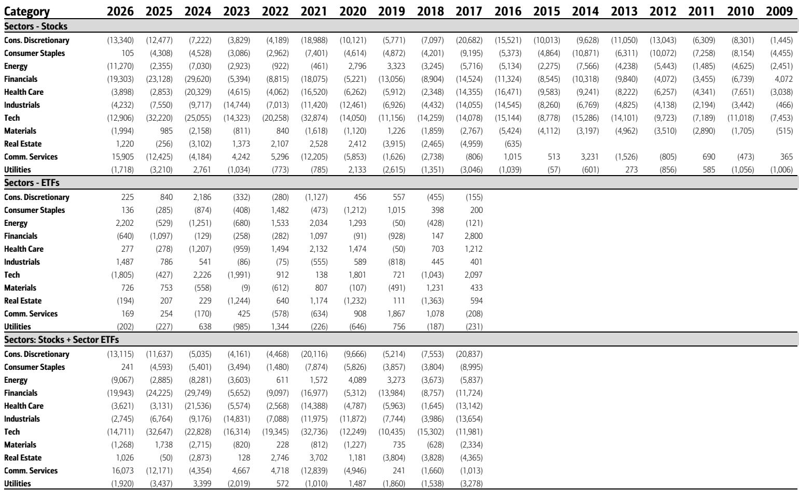
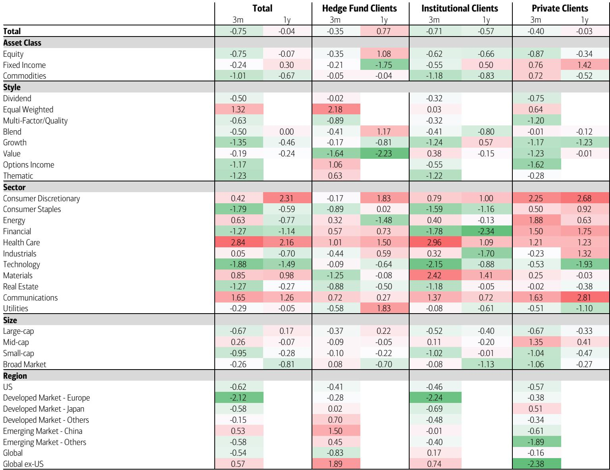
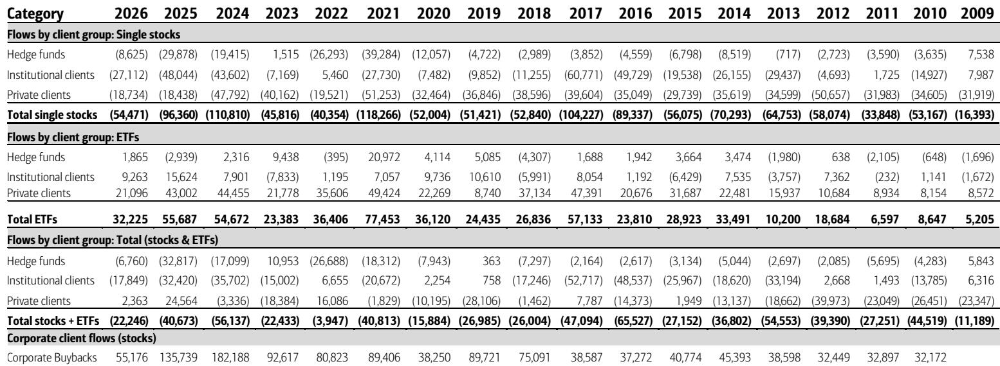

# Institutional Investors Are Abandoning Tech at a Record Pace, Signaling a Regime Shift That Passive Buyers Cannot Ignore

The most significant signal in the latest equity flow data is not the magnitude of the selloff itself, but the composition of the selling. Last week, as the S&P 500 posted its steepest weekly decline since April 2025, clients of a major custodian bank became record net sellers of US equities. The headline number is striking, but the critical detail is that this was driven by a historic $14.2 billion exodus from single stocks, not from exchange-traded funds. When institutional clients lead a selling wave of this scale, it is rarely a tactical pause. It is a strategic repositioning.

This matters because the market has been debating whether the recent volatility is a buying opportunity or the beginning of a deeper correction. The flow data provides a clear answer from the most informed participants: institutions are reducing risk, not adding to it. The selling was concentrated in large-cap equities, while small and mid-cap stocks actually saw inflows. This is not a broad panic. It is a targeted rotation away from the names that have dominated the bull market.

The timing is critical. This selloff follows five consecutive weeks of institutional buying, meaning the reversal is sharp and deliberate. Hedge funds and private clients joined the selling for the second and third consecutive weeks, respectively, with private client net sales reaching their highest level since November 2024. The consensus for a "buy the dip" recovery is being challenged by the very flows that typically precede such moves.

The implications extend beyond one week of data. This pattern suggests that the marginal buyer of large-cap US equities is stepping back, and the burden is shifting to corporate buybacks and ETF flows to absorb supply. As we will explore, the buyback engine is also showing signs of fatigue, and the ETF buying is highly selective. The regime that sustained the market in 2024 and early 2025 is showing cracks, and investors who rely on momentum may be caught offside.

## Record Technology Outflows Signal the End of the Sector's Unquestioned Leadership

The most dramatic data point in the report is the scale of selling in the Technology sector. Clients sold Tech stocks at a rate that represents the largest outflow in the bank's data history since 2008, and the most extreme relative to market capitalization since early 2014. This is not a gentle trimming of positions. It is a coordinated exit across all client types, led by institutions but joined by hedge funds and private clients alike.

The significance of this cannot be overstated. Technology has been the engine of US equity returns for over a decade. When the most sophisticated investors begin to reduce exposure at a record pace, it suggests a fundamental reassessment of the sector's risk-reward profile. The selling is not isolated to a few high-profile names or a temporary rotation out of AI-related stocks. It is broad-based and driven by the client group that typically sets the medium-term direction of the market.

The context makes this even more concerning. Communication Services stocks also saw outflows for the fifth consecutive week, though the magnitude was far more muted. This tells us that the selling is not a general "growth stock" purge. It is specifically targeting Technology, which has the highest valuations, the most concentrated ownership, and the greatest sensitivity to rising interest rates and regulatory scrutiny. The market is sending a signal that the premium assigned to Tech is no longer justified by the current macro environment.

For investors who have been overweight Technology as a default positioning, this flow data is a warning. The marginal seller is not a panicked retail trader. It is the institutional investor who has access to the best research, the longest time horizon, and the most sophisticated risk management. When they sell Tech at a record pace, it is worth asking what they know that the broader market has not yet priced in.

## The Rotation Into Value, Small Caps, and Health Care ETFs Reveals a Defensive Posture Disguised as Opportunity

While the single-stock selling was brutal, the ETF flows tell a more nuanced story that reinforces the defensive narrative. Clients bought equity ETFs for the eleventh consecutive week, but the composition of those purchases reveals a clear shift in preferences. They bought Value and Blend ETFs while selling Growth ETFs. They bought large-cap, mid-cap, and broad market ETFs but sold small-cap ETFs. And at the sector level, Health Care ETFs saw their largest inflows since October 2021, while Tech ETFs suffered the biggest outflows.

This is not a simple "risk-on" rotation. Buying Value while selling Growth is a classic defensive trade that reflects a preference for lower valuations, higher dividends, and less duration sensitivity. The enthusiasm for Health Care is particularly telling. Health Care is traditionally a defensive sector that performs well when economic uncertainty rises and when investors seek exposure to secular growth without the volatility of Technology. The fact that Health Care ETF inflows hit a multi-year high during a week of record Tech outflows suggests that capital is rotating into sectors with more predictable earnings and less regulatory overhang.

The small-cap dynamic adds another layer. Clients bought small and mid-cap equities in single stocks while selling small-cap ETFs. This divergence suggests that investors are being highly selective within the small-cap universe, favoring individual names over basket exposure. It is consistent with a market that is becoming more discriminating, where the rising tide that lifted all boats is giving way to a stock-picker's environment.

The broader implication is that the rotation is not a temporary tactical shift. It is a structural change in how capital is being allocated. The sectors that led the market higher are now being sold, and the sectors that were left behind are being bought. This is the anatomy of a regime change, and it has profound implications for portfolio construction over the next six to twelve months.

## Corporate Buybacks Are Slowing, Removing a Critical Support Pillar at the Worst Possible Time

One of the most underappreciated risks in the current market is the trajectory of corporate buybacks. The report shows that buybacks slowed for a second consecutive week, even as the rolling four-week average rose to its highest level since late March. This apparent contradiction is explained by the fact that the four-week average is backward-looking and is being inflated by a burst of activity in April and early May. The more recent weekly data points to a deceleration.

The year-to-date picture is even more concerning. Cumulative buybacks are tracking slightly below the full-year 2025 level when annualized, and they are well below the record levels of 2024. As a percentage of market capitalization, trailing 52-week buybacks are at their lowest level since late 2023. This is not a cyclical dip. It is a structural slowdown that reflects tighter corporate budgets, higher borrowing costs, and perhaps a growing preference for capital expenditure over share repurchases.

The sector breakdown is instructive. Buybacks have slowed most notably in Technology, which is precisely the sector experiencing the heaviest institutional selling. This creates a dangerous feedback loop. Institutions are selling Tech stocks, and the companies themselves are buying back fewer shares. The result is a vacuum of demand that can accelerate the downward move. Meanwhile, buybacks have picked up in Consumer Discretionary, Financials, and Energy, with Financials being the biggest contributor in recent weeks. This is consistent with the rotation narrative, but it also raises questions about whether these sectors can generate enough buyback activity to offset the Tech selling.

For investors, the buyback slowdown is a critical risk factor. Corporate repurchases have been a dominant source of equity demand for years, and their retreat removes a significant support for valuations. If buybacks continue to decelerate, the market will need to rely on organic demand from institutional and retail investors, which is currently heading in the opposite direction. The combination of institutional selling and reduced corporate buying creates a fragile environment where any negative catalyst could trigger outsized moves.

## What the Report Does Not Fully Answer: The Duration and Catalyst for This Regime Shift

The flow data is extraordinarily rich, but it leaves several critical questions unanswered. The most important is the duration of this selling wave. Is this a one-week event driven by a specific catalyst, such as a disappointing economic data point or a shift in Fed expectations? Or is it the beginning of a multi-week or multi-month trend that will reshape the market's structure? The report provides the data but does not offer a definitive answer on the persistence of the flows.

A second unanswered question is the catalyst. The report notes the S&P 500's 2.6% decline, but it does not attribute the selling to any single event. Was it driven by concerns about tariffs, by a spike in long-term interest rates, by disappointing earnings guidance from a key Tech bellwether, or by a broader reassessment of the AI investment cycle? Without understanding the catalyst, it is difficult to assess whether the selling is rational and likely to continue, or whether it is an overreaction that will reverse.

A third question concerns the behavior of retail investors. The report shows that private clients were net sellers of single stocks at the highest level since November 2024, but it does not provide granular data on whether this selling was concentrated in specific names or sectors. Retail investors have been a powerful force in the market, particularly in meme stocks and high-beta Tech names. If they are capitulating, it could signal the end of a speculative cycle. If they are merely rebalancing, the impact may be more limited.

Finally, the report does not address the international dimension. Are US equities being sold in favor of international markets, or is this a general risk-off move that is affecting all equity markets? The answer has significant implications for currency markets and for the relative performance of developed versus emerging markets. Investors who are considering a geographic rotation need to know whether the selling is a US-specific phenomenon or a global one.

These open questions are not weaknesses of the report. They are natural boundaries of the data, and they create opportunities for investors to do their own analysis. The full report, with its detailed charts and historical context, provides the raw material for answering these questions. But the answers require interpretation and judgment, which is precisely where community discussion and expert analysis add the most value.

## A Decision Framework for Investors: How to Position in a Regime of Record Outflows

For investors who are trying to make sense of this data, a structured decision framework is more useful than a simple recommendation. The following questions should guide your thinking over the next several weeks.

First, assess your exposure to Technology. If you are overweight the sector, ask yourself whether you have a compelling reason to maintain that position that overrides the signal from institutional flows. The data suggests that the most informed market participants are reducing exposure. If you are holding Tech as a default long, you are implicitly betting that the institutions are wrong. That is possible, but it requires a clear thesis.

Second, evaluate your portfolio's sensitivity to the buyback slowdown. If you own stocks that have been heavily reliant on share repurchases to support earnings per share growth, you need to model what happens if buybacks continue to decelerate. The sectors most affected are Technology and, to a lesser extent, Consumer Discretionary. If you are long these sectors, you should be comfortable with the earnings trajectory without the tailwind of aggressive buybacks.

Third, consider whether you are positioned for a Value rotation. The flow data strongly suggests that capital is moving from Growth to Value, from Tech to Health Care and Financials, and from large caps to small and mid caps. If your portfolio is heavily tilted toward large-cap Growth, you are swimming against the tide. A tactical shift toward Value and defensives may reduce volatility and improve risk-adjusted returns.

Fourth, monitor the ETF flows as a leading indicator. ETF flows are often more persistent than single-stock flows because they reflect strategic asset allocation decisions rather than tactical trading. The fact that clients are buying Health Care ETFs at a record pace and selling Tech ETFs suggests that the rotation has institutional support and is likely to continue. Use this as a cross-check for your own sector bets.

Finally, do not ignore corporate buyback data. It is one of the few signals that is directly observable and relatively timely. If buybacks continue to slow, it is a bearish signal for the overall market, regardless of what other flows are doing. If buybacks stabilize or increase, it provides a floor under equities that can absorb some of the institutional selling.

This framework is not a prediction. It is a set of questions that every serious investor should be asking. The answers will depend on your time horizon, your risk tolerance, and your conviction in your own analysis. But the data is clear: the regime is shifting, and those who ignore the signals do so at their own risk.

Join the community to read the full report and review the original charts.

*This article is for learning and discussion only and does not constitute investment advice.*

Personal reading notes and learning share only. Not investment advice.

