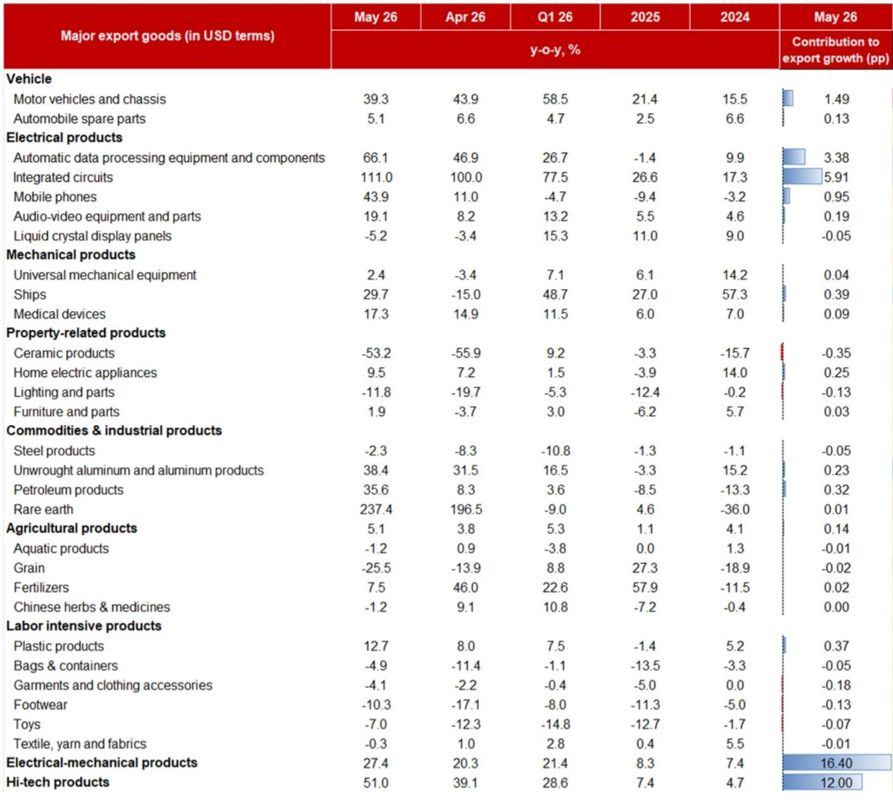
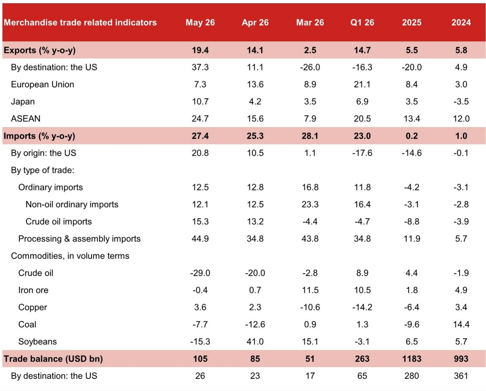
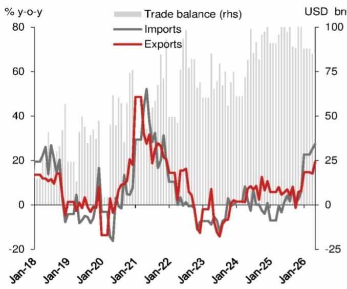

# China's Trade Surge Is a Price-Driven Mirage, Not a Volume Recovery

The headline numbers for China's May trade data are striking. Export growth accelerated to 19.4% year-on-year, imports rose 27.4%, and the trade surplus ballooned to USD 105.4 billion. On the surface, this looks like a resounding vote of confidence in China's export machine. The conventional narrative would point to a post-tariff normalization, a rebound in global demand, and a resilient Chinese manufacturing sector.

That narrative is dangerously incomplete. A careful dissection of the data reveals a fundamentally different story. The surge in China's trade is overwhelmingly a price phenomenon, not a volume recovery. The global AI supercycle is creating an extraordinary price distortion in semiconductor trade, which now accounts for nearly half of China's export growth. Meanwhile, physical trade volumes in key categories are contracting. This is not a sign of health. It is a signal that China's trade structure is becoming increasingly dependent on a single, potentially fragile, price-driven driver.

The strategic question for investors and policymakers is not whether May's data is good or bad. The question is whether this pattern is sustainable, and what happens when the price tailwind fades. The answer will reshape how we evaluate China's economic trajectory for the remainder of the year.

## The AI Supercycle Has Hijacked China's Export Growth, Creating a Dangerous Dependency

The single most important insight from the May trade data is the outsized role of the global AI boom. By our estimates, AI-related exports, primarily integrated circuits and automatic data processing equipment, contributed 9.3 percentage points to headline export growth. This marks two consecutive months where AI-related products have accounted for roughly half of China's total export growth.

This is not a broad-based export recovery. It is a concentrated, price-driven phenomenon. The volume growth of integrated circuit exports actually slowed to just 2.1% year-on-year in May, down from 3.7% in April. The value growth, however, surged to 110.9%. The difference is entirely price. Chip prices alone contributed 106.5 percentage points to the growth rate. In other words, China is exporting roughly the same number of chips, but earning dramatically more because global semiconductor prices have exploded.

The implications are profound. China's export performance is now a leveraged play on the global AI investment cycle. If semiconductor prices stabilize or decline, the headline export numbers will collapse, even if volumes remain steady. This creates a vulnerability that is not captured by standard trade analysis. The market should be asking whether the current chip price levels are sustainable, and what the second-order effects of a price correction would be on China's trade balance, corporate earnings, and currency.

## The Semiconductor Price Shock Is Now the Dominant Driver of Import Growth, Surpassing Energy

The import side of the ledger tells an even more extreme version of the same story. Import growth of 27.4% was well above expectations, but the composition reveals a stark concentration. Integrated circuits alone contributed 10.8 percentage points to import growth, or 39.4% of the total. The price effect on the import side was even more dramatic than on exports. IC import prices contributed 69.8 percentage points to growth, up from 39.2 points in April, while volume growth turned negative at -1.0%.

This is the mirror image of the export story. China is paying dramatically more for the same or fewer chips. The sharp increase in import prices likely reflects the pass-through of second-quarter contract price increases for DRAM and NAND memory chips, which are critical inputs for AI servers and data centers.

Energy, by contrast, played a much smaller role than headline numbers might suggest. Crude oil imports contributed only 1.9 percentage points to import growth, despite a 15.3% value increase. In volume terms, crude oil imports collapsed by 29.0% year-on-year, reflecting both the Strait of Hormuz supply disruption and Beijing's deliberate reduction of purchases at elevated prices.

The strategic takeaway is clear. China's import growth is not being driven by a surge in real economic activity or industrial production. It is being driven by the same semiconductor price shock that is distorting the export side. The energy shock is a secondary factor. This means that the trade surplus, while large, is not a sign of competitive strength. It is the arithmetic result of two price distortions moving in opposite directions: China exports chips at high prices and imports chips at even higher prices, with the net effect still positive due to the larger volume of chip imports.

## The US Trade Rebound Is a Statistical Artifact, Not a Structural Improvement

Export growth to the United States surged to 37.3% year-on-year in May, the highest reading since March 2021. This has been interpreted by some as evidence that tariff tensions are easing and that US demand for Chinese goods is recovering. The reality is more complicated and less reassuring.

Three factors explain the rebound, none of which represent a durable improvement in bilateral trade relations. First, the base effect is extraordinarily favorable. In April and May of last year, US-bound exports slumped by 20.9% and 35.2% respectively, due to the unprecedented tariff war. Comparing against those depressed levels mechanically inflates the current growth rate. Second, the US Supreme Court struck down IEEPA-based tariffs in late February, leading to a temporary net reduction in effective tariff rates. The effective US tariff rate on China dropped to approximately 27.7% in March, down from much higher levels. Third, a significant portion of AI-related demand, particularly for chips and computing equipment, originates from the United States. This is not a recovery in traditional Chinese exports to American consumers. It is the US AI boom pulling in Chinese intermediate goods.

The policy backdrop remains uncertain. On June 2, the Trump administration announced new Section 301 tariffs of 10.0-12.5% on 60 trade partners, with 12.5% on China. While our US economics team views this as continuity rather than escalation, it signals that tariff risks remain elevated. The fact that exporters may front-load shipments ahead of potential tariff increases in the second half of the year adds a layer of artificial demand that will reverse.

For investors, the implication is that the US-China trade normalization story is overblown. The May data is backward-looking and distorted by base effects, policy quirks, and the AI cycle. The underlying trend is one of decoupling, not re-engagement.

## What the Report Does Not Fully Answer: The Sustainability of the Semiconductor Price Cycle

The report provides an extraordinarily detailed decomposition of the semiconductor trade, but it leaves a critical question unanswered: how long can the current price dynamics persist? The data shows that chip prices are now the dominant driver of both export and import growth, with volume growth either slowing or turning negative. This is a classic sign of a price shock that is not accompanied by a commensurate increase in real demand.

The report notes that the sharp increase in IC import prices likely reflects the pass-through of Q2 contract price increases for DRAM and NAND. But it does not analyze the supply side dynamics that would determine whether these price increases are sustainable. Memory chip prices are notoriously cyclical. The current upcycle is driven by AI-related demand for high-bandwidth memory and server-grade DRAM, but the supply response from major producers like Samsung, SK Hynix, and Micron is not discussed. If supply catches up to demand, prices could correct sharply.

Furthermore, the report does not address the potential for substitution or demand destruction at these price levels. If chip prices remain elevated, downstream industries in China that rely on imported semiconductors may face margin compression or reduced output. This could create a negative feedback loop that reduces both import and export volumes.

Investors need to ask themselves: what is the probability that chip prices decline by 20% in the next six months? If that scenario materializes, China's trade surplus would shrink dramatically, and the headline growth numbers that are currently driving market sentiment would reverse. This is a risk that is not priced into current expectations.

## A Decision Framework for Interpreting China's Trade Data Going Forward

Given the structural distortions in the current data, investors need a new framework for evaluating China's trade performance. The traditional approach of looking at headline growth rates and trade balances is no longer sufficient. Instead, we recommend a three-part framework.

First, separate price from volume. The May data makes clear that price effects are overwhelming volume effects. Going forward, investors should track volume growth rates for key categories, particularly integrated circuits and crude oil, as a more reliable signal of real economic activity. If volume growth remains negative or flat while value growth is high, the trade numbers are telling us about global pricing dynamics, not about Chinese competitiveness.

Second, disaggregate by technology cycle. The AI supercycle is creating a bifurcation in trade performance. High-tech products, particularly semiconductors and computing equipment, are booming. Labor-intensive products, such as clothing, shoes, and toys, are contracting. This is not a uniform recovery. It is a structural shift that favors certain sectors and penalizes others. Investors should position accordingly, overweighting AI-related supply chain exposures and underweighting traditional export sectors.

Third, monitor policy risk separately from trade performance. The US tariff regime remains in flux, and the latest Section 301 announcements suggest that the direction of travel is toward higher, not lower, barriers. The fact that exporters may front-load shipments creates a temporary boost that will reverse. Investors should not extrapolate the May data into a sustained trend. Instead, they should build scenarios around different tariff outcomes and assess which sectors are most exposed.

## The Full Picture Requires Granular Analysis

The May trade data contains a wealth of information that cannot be fully captured in a summary. The regional breakdowns, the product-level contributions, and the price-volume decompositions all contain signals that are critical for portfolio construction and risk management. For example, the divergence between export growth to the EU, which slowed to 7.3%, and export growth to ASEAN, which accelerated to 24.7%, tells a story about supply chain reconfiguration that has direct implications for logistics, manufacturing, and trade finance.

The original report contains detailed charts and tables that allow readers to see these patterns for themselves. The full dataset, including the contributions of individual products to overall growth and the breakdown of trade by destination, is essential for making informed decisions.

Join the community to read the full report and review the original charts.

*This article is for learning and discussion only and does not constitute investment advice.*

Personal reading notes and learning share only. Not investment advice.

