## US Industrials & Tech

# US Industrials & Tech: The Data Center Project Pipeline - Capacity, Construction & Cancellations (May '26)

Chad Dillard

+1 917 344 8469

chad.dillard@bernsteinsg.com

Alasdair Leslie

+44 20 7762 4952

alasdair.leslie@bernsteinsg.com

Madison Rezaei

+1 917 344 8622

madison.rezaei@bernsteinsg.com

Varun Govindaraj

+1 917 344 8543

varun.govindaraj@bernsteinsg.com

Gautam Chhugani

+91 226 842 1416

gautam.chhugani@bernsteinsg.com

Mark Shmulik

+1 917 344 8508

mark.shmulik@bernsteinsg.com

Mark L. Moerdler, Ph.D.

+1 917 344 8506

mark.moerdler@bernsteinsg.com

Stacy A. Rasgon, Ph.D.

+1 213 559 5917

stacy.rasgon@bernsteinsg.com

Alex Wang, CFA

+852 2123 2613

alex.wang@bernsteinsg.com

Daniel Zhu

+1 917 344 8309

daniel.zhu@bernsteinsg.com

Connor Cerniglia, CFA

+1 917 344 8472

connor.cerniglia@bernsteinsg.com

## Specialist Sales

Steve Song

+1 917 344 8401

steve.song@bernsteinsg.com

In this note, we update our monthly Data Center Capacity Tracker series, a comprehensive monitor of N. American data center capacity by stage of development, operator, and geography. To gain recurring access to the excel-based version of this data feed, please reach out to your salesperson. For our server model and performance of semi/hardware suppliers in AI supply chain, see our latest AI Server Pulse check.

Project Pipeline. Over the last month, the data center project pipeline grew by 10%, up 29 GW to 324 GW. Developers (22 GW) and crypto miners (6 GW) drove the majority of the growth this month, accounting for 75% and 21% of the increase, respectively. Of the developers, the largest contributors were O'Leary Ventures (15 GW) and Carlyle Group (3 GW), while Core Scientific (2.3 GW), Riot (1.4 GW), and TeraWulf (1.2 GW) contributed most for crypto miners. Hyperscalers actually saw capacity in pipeline decline marginally this month. From a geographic standpoint, O'Leary Ventures drove the 8 GW increase in pipeline to Utah, while Texas remained a close second at 6 GW.

Under Construction. In May data center capacity under construction increased by 4.4 GW to 63 GW. Hyperscalers (1.4 GW), developers (1.3 GW) and neoclouds (726 MW) contributed to \~80% of new construction. Meta (638 MW) and Amazon (536 MW) contributed to \~90% of the hyperscalers' increase. Of the colocators, Digital Realty (237 MW) and STACK (153 MW) drove \~60% of their increase. New construction was largest in Texas (1.3 GW) and Missouri (1.2 GW) driving 60% of new construction in the month.

Stranded Capacity. The rise in local data center opposition/NIMBY continues driving stranded capacity higher. This grew by 1.9 GW to 34 GW, representing 11% of total pipeline, which remains up vs. 7-9% last summer, but is beginning to stabilize. The entirety of the increase is captured by projects that are unaccounted for.

Behind-the-meter power continues accelerating. During the month, the BTM pipeline grew by 12% or 14 GW M/M and by 48% or 42 GW YTD to 129 GW. For comparison, only 16 GW of BTM capacity is currently under construction, up 3 GW M/M. Currently, only 4% of the installed base of data centers use this approach, but 25% of the capacity under construction will use it and 40% of the projects in the pipeline will use it. Moreover, BTM projects accounted for nearly 50% of the additions to May's pipeline. The massive ramp in BTM supports CAT's plan to 3x large engine capacity and the recent entry into the prime power market by CMI. Developers added the most (18 GW) to the BTM pipeline last month, and have been the most aggressive YTD (35 GW or 80%+ of total BTM additions). From an operator type perspective, neoclouds are most reliant on BTM (64% of pipeline), followed by developers (50% of pipeline), and hyperscalers (36% of pipeline). BTM is also a tailwind for electrical equipment players (ETN, HUBB) as onsite generation projects spend \~30% more on electrical distribution equipment than a project only connected to the grid.

Electricals TAM update. Based on the current pipeline and company-disclosed \$M/MW opportunity, we estimate the following data center TAMs: PWR $4.4T$ , ETN $758B$ , LGN $329B$ , VRT $1T$ , Schneider $865B$ , ABB $648B$ , as well as several other OEMs.

BERNSTEIN TICKER TABLE

<table><tr><td rowspan="2">Ticker</td><td colspan="4">9 Jun 2026</td><td>TTMRel.</td><td colspan="4">Adjusted EPS</td><td colspan="3">Adjusted P/E (x)</td></tr><tr><td>Rating</td><td>Cur</td><td>Closing Price</td><td>Price Target</td><td>Perf.</td><td>Cur</td><td>2025A</td><td>2026E</td><td>2027E</td><td>2025A</td><td>2026E</td><td>2027E</td></tr><tr><td>CAT (Caterpillar)</td><td>M</td><td>USD</td><td>914.70</td><td>879.00</td><td>134.8%</td><td>USD</td><td>19.08</td><td>24.01</td><td>28.30</td><td>47.9</td><td>38.1</td><td>32.3</td></tr><tr><td>CMI (Cummins)</td><td>M</td><td>USD</td><td>669.23</td><td>700.00</td><td>84.3%</td><td>USD</td><td>20.51</td><td>27.35</td><td>32.25</td><td>32.6</td><td>24.5</td><td>20.8</td></tr><tr><td>ETN (Eaton)</td><td>O</td><td>USD</td><td>401.72</td><td>534.00</td><td>3.6%</td><td>USD</td><td>12.07</td><td>13.29</td><td>16.32</td><td>33.3</td><td>30.2</td><td>24.6</td></tr><tr><td>HUBB (Hubbell)</td><td>O</td><td>USD</td><td>486.47</td><td>584.00</td><td>5.0%</td><td>USD</td><td>18.33</td><td>19.70</td><td>21.95</td><td>26.5</td><td>24.7</td><td>22.2</td></tr><tr><td>J (Jacobs)</td><td>O</td><td>USD</td><td>125.44</td><td>163.00</td><td>(21.9)%</td><td>USD</td><td>6.12</td><td>7.27</td><td>8.33</td><td>20.5</td><td>17.3</td><td>15.1</td></tr><tr><td>LGN (Legence)</td><td>O</td><td>USD</td><td>85.58</td><td>103.00</td><td>NA</td><td>USD</td><td>298.82</td><td>479.93</td><td>567.27</td><td>35.6</td><td>22.1</td><td>18.7</td></tr><tr><td>OSK (Oshkosh Corp)</td><td>M</td><td>USD</td><td>132.62</td><td>138.00</td><td>(1.4)%</td><td>USD</td><td>10.78</td><td>11.08</td><td>14.10</td><td>12.3</td><td>12.0</td><td>9.4</td></tr><tr><td>PWR (Quanta Services)</td><td>M</td><td>USD</td><td>691.95</td><td>725.00</td><td>78.1%</td><td>USD</td><td>10.75</td><td>13.90</td><td>15.84</td><td>64.4</td><td>49.8</td><td>43.7</td></tr><tr><td>TRMB (Trimble)</td><td>O</td><td>USD</td><td>52.95</td><td>85.00</td><td>(47.6)%</td><td>USD</td><td>3.14</td><td>3.59</td><td>4.46</td><td>16.9</td><td>14.8</td><td>11.9</td></tr><tr><td>URI (United Rentals)</td><td>O</td><td>USD</td><td>1,094.17</td><td>1,153.00</td><td>32.5%</td><td>USD</td><td>42.11</td><td>47.78</td><td>53.00</td><td>26.0</td><td>22.9</td><td>20.6</td></tr><tr><td>NVDA (NVIDIA)</td><td>O</td><td>USD</td><td>208.19</td><td>315.00</td><td>24.3%</td><td>USD</td><td>4.77</td><td>9.19</td><td></td><td>43.6</td><td>22.7</td><td>16.6</td></tr><tr><td>AVGO (Broadcom)</td><td>O</td><td>USD</td><td>392.16</td><td>550.00</td><td>40.0%</td><td>USD</td><td>6.82</td><td>11.60</td><td>18.69</td><td>57.5</td><td>33.8</td><td>21.0</td></tr><tr><td>AMD (Advanced Micro)</td><td>O</td><td>USD</td><td>475.51</td><td>525.00</td><td>265.5%</td><td>USD</td><td>4.17</td><td>6.95</td><td>14.60</td><td>113.9</td><td>68.4</td><td>32.6</td></tr><tr><td>INTC (Intel)</td><td>M</td><td>USD</td><td>107.92</td><td>65.00</td><td>368.4%</td><td>USD</td><td>0.43</td><td>1.04</td><td>1.35</td><td>253.1</td><td>103.3</td><td>79.8</td></tr><tr><td>EQIX (Equinix)</td><td>O</td><td>USD</td><td>1,059.84</td><td>1,222.00</td><td>(3.5)%</td><td>USD</td><td>14.96</td><td>17.88</td><td>21.36</td><td>70.8</td><td>59.3</td><td>49.6</td></tr><tr><td>DLR (Digital Realty)</td><td>O</td><td>USD</td><td>184.93</td><td>232.00</td><td>(16.3)%</td><td>USD</td><td>3.87</td><td>2.74</td><td>2.37</td><td>47.8</td><td>67.6</td><td>77.9</td></tr><tr><td>CRWV (CoreWeave)</td><td>U</td><td>USD</td><td>98.45</td><td>67.00</td><td>(56.8)%</td><td>USD</td><td>(1.20)</td><td>(4.20)</td><td>(2.41)</td><td>35.5</td><td>13.9</td><td>7.4</td></tr><tr><td>AMZN (Amazon)</td><td>O</td><td>USD</td><td>244.19</td><td>315.00</td><td>(8.1)%</td><td>USD</td><td>7.17</td><td>8.78</td><td>11.12</td><td>34.0</td><td>27.8</td><td>22.0</td></tr><tr><td>META (Meta)</td><td>O</td><td>USD</td><td>584.59</td><td>850.00</td><td>(37.1)%</td><td>USD</td><td>23.49</td><td>33.54</td><td>37.04</td><td>24.9</td><td>17.4</td><td>15.8</td></tr><tr><td>GOOGL (Alphabet)</td><td>M</td><td>USD</td><td>364.26</td><td>390.00</td><td>83.6%</td><td>USD</td><td>10.81</td><td>14.47</td><td>14.32</td><td>33.7</td><td>25.2</td><td>25.4</td></tr><tr><td>2308.TT (Delta)</td><td>O</td><td>TWD</td><td>2,200.00</td><td>2,620.00</td><td>411.7%</td><td>TWD</td><td>23.09</td><td>37.09</td><td>58.40</td><td>95.3</td><td>59.3</td><td>37.7</td></tr><tr><td>2360.TT (Chroma ATE)</td><td>O</td><td>TWD</td><td>2,210.00</td><td>1,660.00</td><td>514.5%</td><td>TWD</td><td>27.50</td><td>33.22</td><td>43.66</td><td>80.4</td><td>66.5</td><td>50.6</td></tr><tr><td>2382.TT (Quanta)</td><td>U</td><td>TWD</td><td>380.50</td><td>250.00</td><td>(1.3)%</td><td>TWD</td><td>18.91</td><td>21.07</td><td>23.08</td><td>20.1</td><td>18.1</td><td>16.5</td></tr><tr><td>3037.TT (Unimicron)</td><td>O</td><td>TWD</td><td>884.00</td><td>990.00</td><td>697.1%</td><td>TWD</td><td>4.36</td><td>14.06</td><td>25.10</td><td>202.7</td><td>62.9</td><td>35.2</td></tr><tr><td>FERG (Ferguson)</td><td>O</td><td>USD</td><td>235.44</td><td>310.00</td><td>(11.7)%</td><td>USD</td><td>10.58</td><td>11.38</td><td>12.60</td><td>22.3</td><td>20.7</td><td>18.7</td></tr><tr><td>FERG.LN (Ferguson)</td><td>O</td><td>GBp</td><td>17,210</td><td>22,963</td><td>(11.8)%</td><td>USD</td><td>10.58</td><td>11.38</td><td>12.60</td><td>21.7</td><td>20.2</td><td>18.3</td></tr><tr><td>SU.FP (Schneider)</td><td>O</td><td>EUR</td><td>263.45</td><td>310.00</td><td>2.1%</td><td>EUR</td><td>8.43</td><td>10.22</td><td>11.95</td><td>31.3</td><td>25.8</td><td>22.0</td></tr><tr><td>SIE.GR (Siemens)</td><td>O</td><td>EUR</td><td>264.90</td><td>300.00</td><td>6.5%</td><td>EUR</td><td>12.23</td><td>10.73</td><td>10.83</td><td>26.2</td><td>23.5</td><td>23.1</td></tr><tr><td>ABBN.SW (ABB)</td><td>M</td><td>CHF</td><td>80.52</td><td>70.00</td><td>55.9%</td><td>USD</td><td>2.56</td><td>2.92</td><td>3.21</td><td>39.4</td><td>34.5</td><td>31.4</td></tr><tr><td>LR.FP (Legrand)</td><td>O</td><td>EUR</td><td>138.20</td><td>170.00</td><td>13.2%</td><td>EUR</td><td>5.22</td><td>6.01</td><td>6.80</td><td>26.5</td><td>23.0</td><td>20.3</td></tr><tr><td>ENR.GR (Siemens Energy)</td><td>O</td><td>EUR</td><td>150.00</td><td>210.00</td><td>64.3%</td><td>EUR</td><td>1.63</td><td>4.21</td><td>5.84</td><td>83.7</td><td>34.8</td><td>25.4</td></tr><tr><td>PRY.IM (Prysmian)</td><td>O</td><td>EUR</td><td>142.40</td><td>110.00</td><td>126.3%</td><td>EUR</td><td>4.30</td><td>4.58</td><td>5.45</td><td>33.1</td><td>31.1</td><td>26.1</td></tr><tr><td>MSFT (Microsoft)</td><td>O</td><td>USD</td><td>403.41</td><td>646.00</td><td>(34.7)%</td><td>USD</td><td>13.64</td><td>16.85</td><td>19.16</td><td>29.6</td><td>23.9</td><td>21.1</td></tr><tr><td>ORCL (Oracle)</td><td>O</td><td>USD</td><td>205.81</td><td>319.00</td><td>(4.4)%</td><td>USD</td><td>6.03</td><td>7.50</td><td>8.70</td><td>34.1</td><td>27.4</td><td>23.7</td></tr><tr><td>IREN (IREN)</td><td>O</td><td>USD</td><td>54.02</td><td>100.00</td><td>394.6%</td><td>USD</td><td>269.67</td><td>233.06</td><td>1,296</td><td></td><td>18.8%</td><td>120.0%</td></tr><tr><td>CIFR (Cipher)</td><td>O</td><td>USD</td><td>23.04</td><td>32.00</td><td>447.0%</td><td>USD</td><td>22.24</td><td>50.72</td><td>636.93</td><td></td><td></td><td></td></tr><tr><td>WULF (TeraWulf)</td><td>O</td><td>USD</td><td>25.30</td><td>36.00</td><td>439.4%</td><td>USD</td><td>(23.11)</td><td>115.77</td><td>768.30</td><td>(15.2)</td><td>(14.6)</td><td>(43.9)</td></tr><tr><td>CLSK (Cleanspark)</td><td>O</td><td>USD</td><td>15.97</td><td>24.00</td><td>37.3%</td><td>USD</td><td>297.76</td><td>317.24</td><td>578.49</td><td>59.4%</td><td>39.4%</td><td>(0.0)%</td></tr><tr><td>MARA (MARA)</td><td>M</td><td>USD</td><td>13.31</td><td>17.00</td><td>(39.6)%</td><td>USD</td><td>132.06</td><td>270.27</td><td>544.24</td><td>(3.6)</td><td>4.0</td><td>(10.9)</td></tr><tr><td>RIOT (Riot)</td><td>O</td><td>USD</td><td>25.30</td><td>30.00</td><td>121.7%</td><td>USD</td><td>164.30</td><td>281.69</td><td>405.58</td><td>(13.0)</td><td>18.6</td><td>(32.7)</td></tr><tr><td>CORZ (Core Scientific)</td><td>O</td><td>USD</td><td>27.01</td><td>32.00</td><td>91.2%</td><td>USD</td><td></td><td></td><td></td><td>(30.7)</td><td>(29.3)</td><td>103.9</td></tr><tr><td>VRT (Vertiv)</td><td>O</td><td>USD</td><td>289.52</td><td>416.00</td><td>146.6%</td><td>USD</td><td>4.20</td><td>6.52</td><td>9.21</td><td>69.0</td><td>44.4</td><td>31.4</td></tr><tr><td>NVT (nVent)</td><td>O</td><td>USD</td><td>163.80</td><td>218.00</td><td>120.7%</td><td>USD</td><td>3.34</td><td>4.79</td><td>6.19</td><td>49.0</td><td>34.2</td><td>26.5</td></tr><tr><td>TT (Trane)</td><td>O</td><td>USD</td><td>470.76</td><td>550.00</td><td>(8.7)%</td><td>USD</td><td>13.06</td><td>14.96</td><td>17.61</td><td>36.0</td><td>31.5</td><td>26.7</td></tr></table>

O - Outperform, M - Market-Perform, U - Underperform, NR - Not Rated, CS - Coverage Suspended  
CAT estimate is Adjusted EPS EBITDA (M); LGN, IREN, CIFR, WULF, CLSK, MARA, RIOT estimate is EBITDA (M); AMZN, META, GOOGL, 2308.TT, 2360.TT,  
2382.TT, 3037.TT, ENR.GR estimate is Reported EPS; SIE.GR estimate is Reported EPS Organic Sales Growth (%) EBITA (M); ABBN.SW estimate is  
Adjusted EPS EBITA (M) Organic Sales Growth (%) EBITDA (M); PRY.IM estimate is Adjusted EPS Organic Sales Growth (%); CORZ estimate is ; LGN,  
CRWV valuation is EV/EBITDA (x); AMZN, META, GOOGL, 2308.TT, 2360.TT, 2382.TT, 3037.TT, WULF, MARA, RIOT, CORZ valuation is Reported P/E (x);  
IREN valuation is CFO CAGR; CIFR valuation is ; CLSK valuation is EBITDA CAGR; NVDA base year is 2026;  
Source: Bloomberg, Bernstein estimates and analysis.

<table><tr><td rowspan="2">Ticker</td><td colspan="4">9 Jun 2026</td><td rowspan="2">TTMRel.</td><td colspan="4">Adjusted EPS</td><td colspan="3">Adjusted P/E (x)</td></tr><tr><td>Rating</td><td>Cur</td><td>Closing Price</td><td>Price Target</td><td>Cur</td><td>2025A</td><td>2026E</td><td>2027E</td><td>2025A</td><td>2026E</td><td>2027E</td></tr><tr><td>JCI (Johnson Controls)</td><td>O</td><td>USD</td><td>147.75</td><td>176.00</td><td>23.2%</td><td>USD</td><td>3.78</td><td>5.06</td><td>6.04</td><td>39.1</td><td>29.2</td><td>24.5</td></tr><tr><td>CARR (Carrier)</td><td>M</td><td>USD</td><td>71.24</td><td>75.00</td><td>(21.0)%</td><td>USD</td><td>2.57</td><td>2.81</td><td>3.20</td><td>27.7</td><td>25.4</td><td>22.3</td></tr><tr><td>SPX</td><td></td><td></td><td>7,266.99</td><td></td><td></td><td></td><td></td><td></td><td></td><td></td><td></td><td></td></tr><tr><td>ASIAX</td><td></td><td></td><td>1,920.52</td><td></td><td></td><td></td><td></td><td></td><td></td><td></td><td></td><td></td></tr><tr><td>EDME</td><td></td><td></td><td>1,532.70</td><td></td><td></td><td></td><td></td><td></td><td></td><td></td><td></td><td></td></tr></table>

O - Outperform, M - Market-Perform, U - Underperform, NR - Not Rated, CS - Coverage Suspended  
CAT estimate is Adjusted EPS EBITDA (M); LGN, IREN, CIFR, WULF, CLSK, MARA, RIOT estimate is EBITDA (M); AMZN, META, GOOGL, 2308.TT, 2360.TT, 2382.TT, 3037.TT, ENR.GR estimate is Reported EPS; SIE.GR estimate is Reported EPS Organic Sales Growth (%) EBITA (M); ABBN.SW estimate is Adjusted EPS EBITA (M) Organic Sales Growth (%) EBITDA (M); PRY.IM estimate is Adjusted EPS Organic Sales Growth (%); CORZ estimate is ; LGN, CRWV valuation is EV/EBITDA (x); AMZN, META, GOOGL, 2308.TT, 2360.TT, 2382.TT, 3037.TT, WULF, MARA, RIOT, CORZ valuation is Reported P/E (x); IREN valuation is CFO CAGR; CIFR valuation is ; CLSK valuation is EBITDA CAGR; NVDA base year is 2026;
Source: Bloomberg, Bernstein estimates and analysis.

## INVESTMENT IMPLICATIONS

US Machinery & Electrical Equipment: our latest data center capacity tracking exercise is further supportive of the short and long-term tailwinds seen in the electrification space. We see all data center exposed names in our coverage benefiting from attractive multi-year end market growth where bottlenecks persist, demand for equipment and labor is high, and backlogs remain healthy. Remain Outperform on ETN (\$534), HUBB (\$584), LGN (\$103), J (\$163), TRMB (\$85), and URI (\$1,153). Remain Market-Perform on CAT (\$879), CMI (\$700), OSK (\$138) and PWR (\$725).

European Capital Goods: We rate Schneider (PT €310), Siemens (€300), Legrand (€170), Siemens Energy (€210), and Prysmian (€110) Outperform, and rate ABB (CHF 70) Market-Perform.

US Communications Infrastructure: We rate DLR $232$ and EQIX $1,222$ Outperform. We rate CRWV $67$ Underperform.

US Multi-Industrials: We rate VRT (PT \$416), NVT (PT \$218), TT (PT \$550), and JCI (PT \$176) outperform. We are rate CARR (PT \$75) Market-Perform.

Bitcoin miners/Emerging AI Infra: Crypto miners remain well positioned to solve ‘time to compute’ given their planned 30GW power portfolio and operating ability to deliver ‘warm powered shells’ in time. Over the past two years, miners have contracted 6 GW of power capacity to hyperscalers, neoclouds and AI-chip manufacturers across 17 deals worth over \$110Bn. The contracted 6 GW represents \~20% of the 30 GW pipeline of crypto miners, allowing runway for new contracts. We rate WULF Outperform (PT\$36), CIFR Outperform (PT\$32), IREN Outperform (PT\$100), CORZ Outperform (PT\$32), RIOT Outperform (PT\$30), CLSK Outperform (PT\$24), and MARA Market-perform (PT\$17).

US Internet: We rate Amazon Outperform with PT of \$315. We rate Meta Outperform with PT of \$850. We rate Google Market-Perform with PT of \$390.

Global Software: Microsoft (Outperform \$646) started to shift from spending \~60% of their CAPEX on datacenters (land, building and improvements) to \~33% as the start to approach having enough global capacity to meet demand and growing datacenter capacity more in-line with Cloud / AI revenue growth. Note that some of their recent datacenter capacity was added via leased capacity and via shorter term neoCloud contracts but the direct is in-line with our thesis. Oracle (Outperform, \$319) leases all their datacenter capacity and the capacity to meet their current contracts are already included in leased capacity being built by 3 $^{rd}$ parties.

US Semiconductors & Semicap Equipment: NVDA (Outperform, \$300): The datacenter opportunity is significant, and still early, with material upside still possible. AVGO (Outperform, \$525): A strong 2025 AI trajectory seems set to accelerate into 2026, bolstered by software, cash deployment, and superb margins & FCF. AMD (Outperform, \$525): Expectations remain high, but exposure to AI demand driving both a CPU and GPU story can provide substantial growth. INTC (Market-Perform, \$65): Server strength is helping the company get back on their feet, and narrative/headlines may fuel the vibe for now.

Asia Tech Hardware: We rate Chroma Outperform, with PT = NT\$1,660.00. We rate Delta Outperform, with PT = NT \$2,620.00. We rate Unimicron Outperform, with PT = NT\$990.00. We rate Quanta Computer Underperform, with PT = NT

\$250.00.

US Business Services: We rate Ferguson Outperform with a \$310 (GBp 22,963) target price, maintaining our EV/EBITDA multiple of 18.0x and a P/E multiple of 24.5x.

## DETAILS

EXHIBIT 1: Data Center Capacity Dashboard

<table><tr><td rowspan="2"></td><td colspan="7">Monthly</td></tr><tr><td>May-26</td><td>Apr-26</td><td>Dec-25</td><td>May-25</td><td>% Y/Y</td><td>% M/M</td><td>% YTD</td></tr><tr><td colspan="8">All Capacity (in GW)</td></tr><tr><td>Pipeline</td><td>324.0</td><td>294.9</td><td>226.1</td><td>99.0</td><td>227%</td><td>10%</td><td>43%</td></tr><tr><td>% of &#x27;25 Electricity Demand</td><td>24%</td><td>22%</td><td>17%</td><td>7%</td><td>--</td><td>--</td><td>--</td></tr><tr><td>Years to Clear Pipeline</td><td>10</td><td>10</td><td>0</td><td>0</td><td>--</td><td>--</td><td>--</td></tr><tr><td>Δ in Pipeline</td><td>29.1</td><td>13.9</td><td>9.2</td><td></td><td>--</td><td>110%</td><td>217%</td></tr><tr><td>Under Construction</td><td>63.0</td><td>58.6</td><td>42.1</td><td>22.1</td><td>185%</td><td>7%</td><td>50%</td></tr><tr><td>Δ in Construction</td><td>4.4</td><td>6.5</td><td>3.9</td><td></td><td>--</td><td>-32%</td><td>12%</td></tr><tr><td>Total Stranded Capacity</td><td>34.3</td><td>32.4</td><td>21.2</td><td>8.1</td><td>324%</td><td>6%</td><td>61%</td></tr><tr><td>Δ in Stranded Capacity</td><td>1.9</td><td>3.4</td><td>0.4</td><td></td><td>--</td><td>-45%</td><td>420%</td></tr><tr><td>% Cancellation Rate</td><td>7%</td><td>25%</td><td>4%</td><td></td><td></td><td></td><td></td></tr><tr><td colspan="8">BTM Capacity (in MW)</td></tr><tr><td>Pipeline</td><td>128.9</td><td>114.9</td><td>87.1</td><td>0.0</td><td>--</td><td>12%</td><td>48%</td></tr><tr><td>% of Total</td><td>40%</td><td>39%</td><td>39%</td><td>0%</td><td>--</td><td>--</td><td>--</td></tr><tr><td>Δ in Pipeline</td><td>14.1</td><td>3.3</td><td>87.1</td><td></td><td>--</td><td>323%</td><td>-84%</td></tr><tr><td>% of Total</td><td>48%</td><td>24%</td><td>947%</td><td></td><td></td><td></td><td></td></tr><tr><td>Under Construction</td><td>15.9</td><td>13.0</td><td>7.3</td><td>0.0</td><td>--</td><td>22%</td><td>117%</td></tr><tr><td>Δ in Construction</td><td>2.8</td><td>2.7</td><td>7.3</td><td></td><td>--</td><td>4%</td><td>-61%</td></tr><tr><td>% of Total</td><td>64%</td><td>42%</td><td>187%</td><td></td><td></td><td></td><td></td></tr><tr><td>Total Stranded Capacity</td><td>5.5</td><td>5.5</td><td>0.9</td><td>0.0</td><td>--</td><td>0%</td><td>518%</td></tr><tr><td>Δ in Stranded Capacity</td><td>0.0</td><td>1.7</td><td>0.9</td><td></td><td>--</td><td>-100%</td><td>-100%</td></tr><tr><td>% of Total</td><td>4%</td><td>5%</td><td>1%</td><td>--</td><td></td><td></td><td></td></tr><tr><td>% Cancellation Rate</td><td>0%</td><td>51%</td><td>1%</td><td>--</td><td></td><td></td><td></td></tr></table>

Source: Aterio, Bernstein analysis

## KEY CHARTS

EXHIBIT 2: Current Data Center Capacity by Stage  
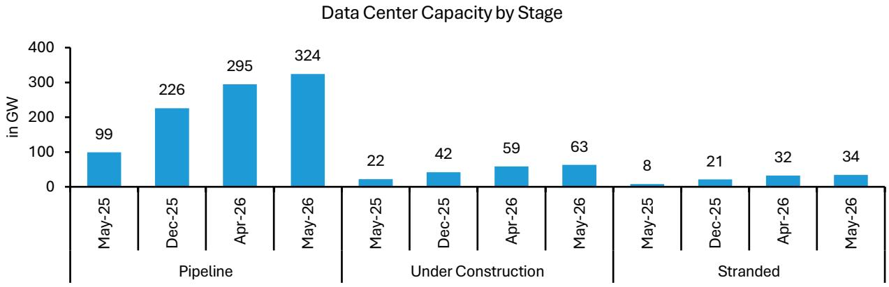

bar chart

Data Center Capacity by Stage
| Stage | Date | Capacity (in GW) |
| :--- | :--- | :--- |
| Pipeline | May-25 | 99 |
| Pipeline | Dec-25 | 226 |
| Pipeline | Apr-26 | 295 |
| Pipeline | May-26 | 324 |
| Under Construction | May-25 | 22 |
| Under Construction | Dec-25 | 42 |
| Under Construction | Apr-26 | 59 |
| Under Construction | May-26 | 63 |
| Stranded | May-25 | 8 |
| Stranded | Dec-25 | 21 |
| Stranded | Apr-26 | 32 |
| Stranded | May-26 | 34 |

Stranded capacity = delayed + cancelled + not approved/withdrawn capacity  
Source: Aterio, Bernstein analysis

EXHIBIT 3: It Will Take 10 Years to Clear the Current Data Center Pipeline Based on TTM Build Rates  
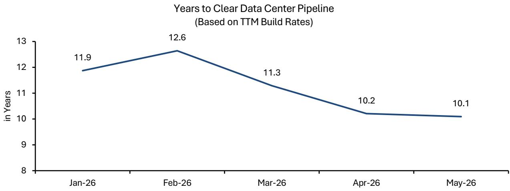

line chart

| Month   | Years to Clear Data Center Pipeline |
| ------- | ------------------------------------ |
| Jan-26  | 11.9                                 |
| Feb-26  | 12.6                                 |
| Mar-26  | 11.3                                 |
| Apr-26  | 10.2                                 |
| May-26  | 10.1                                 |

Source: Aterio, Bernstein analysis

EXHIBIT 4: Data Center Capacity (in GW) by Stage of Development  
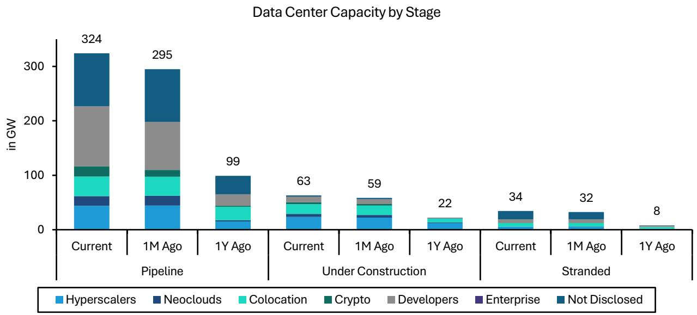

stacked bar chart

| Stage             | Time Period | Hyperscalers | Neoclouds | Colocation | Crypto | Developers | Enterprise | Not Disclosed |
| ----------------- | ----------- | ------------ | --------- | ---------- | ------ | ---------- | ---------- | ------------- |
| Pipeline          | Current     | 50           | 20        | 30         | 10     | 100        | 0          | 100           |
| Pipeline          | 1M Ago      | 50           | 20        | 30         | 10     | 100        | 0          | 100           |
| Pipeline          | 1Y Ago      | 20           | 10        | 20         | 5      | 20         | 0          | 30            |
| Under Construction| Current     | 30           | 10        | 20         | 5      | 10         | 0          | 5             |
| Under Construction| 1M Ago     | 20           | 10        | 15         | 5      | 10         | 0          | 5             |
| Under Construction| 1Y Ago     | 10           | 5         | 10         | 5      | 5          | 0          | 5             |
| Stranded          | Current     | 5            | 5         | 5          | 5      | 5          | 0          | 10            |
| Stranded          | 1M Ago      | 5            | 5         | 5          | 5      | 5          | 0          | 5             |
| Stranded          | 1Y Ago      | 5            | 5         | 5          | 5      | 5          | 0          | 5             |

Stranded capacity = delayed + cancelled + not approved/withdrawn capacity  
Source: Aterio, Bernstein analysis

EXHIBIT 5: Data Center Capacity by Stage of Development (% Mix)  
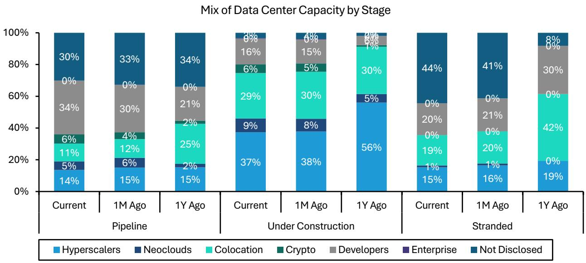

stacked bar chart

| Stage | Time Period | Hyperscalers | Neoclouds | Colocation | Crypto | Developers | Enterprise | Not Disclosed |
|-------|-------------|--------------|-----------|------------|--------|------------|------------|---------------|
| Pipeline | Current | 14% | 5% | 11% | 6% | 34% | 0% | 30% |
| Pipeline | 1M Ago | 15% | 6% | 12% | 4% | 30% | 0% | 33% |
| Pipeline | 1Y Ago | 15% | 2% | 25% | 2% | 21% | 0% | 34% |
| Under Construction | Current | 37% | 9% | 29% | 6% | 16% | 0% | 8% |
| Under Construction | 1M Ago | 38% | 8% | 30% | 5% | 15% | 0% | 4% |
| Under Construction | 1Y Ago | 56% | 5% | 30% | 1% | 5% | 0% | 2% |
| Stranded | Current | 15% | 1% | 19% | 0% | 20% | 0% | 44% |
| Stranded | 1M Ago | 16% | 1% | 20% | 0% | 21% | 0% | 41% |
| Stranded | 1Y Ago | 19% | 0% | 42% | 0% | 30% | 0% | 8% |

Stranded capacity = delayed + cancelled + not approved/withdrawn capacity  
Source: Aterio, Bernstein analysis

EXHIBIT 6: Data Center Capacity (in GW) by Operator  
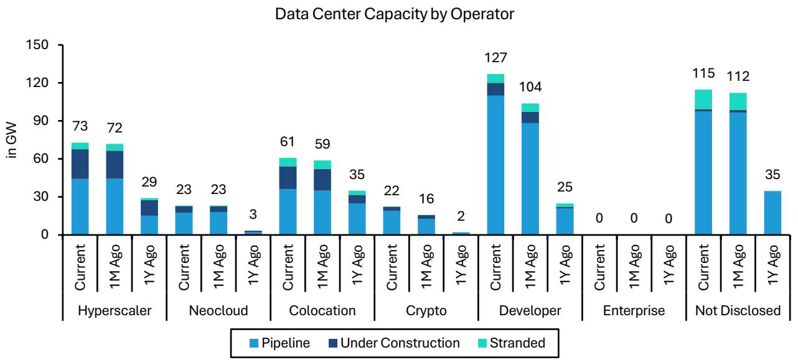

stacked bar chart

Data Center Capacity by Operator
| Operator | Category | Current (GW) | 1M Ago (GW) | 1Y Ago (GW) |
| :--- | :--- | :--- | :--- | :--- |
| Hyperscaler | Pipeline | 45 | 28 | 73 |
| Hyperscaler | Under Construction | 20 | 16 | 72 |
| Hyperscaler | Stranded | 5 | 5 | 9 |
| Neocloud | Pipeline | 18 | 10 | 29 |
| Neocloud | Under Construction | 8 | 5 | 23 |
| Neocloud | Stranded | 2 | 2 | 23 |
| Colocation | Pipeline | 32 | 24 | 61 |
| Colocation | Under Construction | 20 | 16 | 59 |
| Colocation | Stranded | 5 | 3 | 35 |
| Crypto | Pipeline | 18 | 10 | 22 |
| Crypto | Under Construction | 10 | 5 | 16 |
| Crypto | Stranded | 2 | 0 | 2 |
| Developer | Pipeline | 110 | 104 | 127 |
| Developer | Under Construction | 8 | 10 | 25 |
| Developer | Stranded | 5 | 5 | 5 |
| Enterprise | Pipeline | 0 | 0 | 0 |
| Enterprise | Under Construction | 0 | 0 | 0 |
| Enterprise | Stranded | 0 | 0 | 0 |
| Not Disclosed | Pipeline | 92 | 92 | 115 |
| Not Disclosed | Under Construction | 5 | 5 | 112 |
| Not Disclosed | Stranded | 10 | 10 | 35 |

Stranded capacity = delayed + cancelled + not approved/withdrawn capacity  
Source: Aterio, Bernstein analysis

EXHIBIT 7: Data Center Capacity by Operator (% Mix)  

stacked bar chart

Mix of Data Center Capacity by Operator
| Operator | Period | Pipeline (%) | Under Construction (%) | Stranded (%) |
| :--- | :--- | :--- | :--- | :--- |
| Hyperscaler | Current | 61 | 32 | 7 |
| Hyperscaler | 1M Ago | 62 | 31 | 7 |
| Hyperscaler | 1Y Ago | 52 | 43 | 5 |
| Neocloud | Current | 75 | 24 | 2 |
| Neocloud | 1M Ago | 78 | 20 | 2 |
| Neocloud | 1Y Ago | 64 | 36 | 0 |
| Colocation | Current | 60 | 30 | 1 |
| Colocation | 1M Ago | 59 | 29 | 1 |
| Colocation | 1Y Ago | 71 | 19 | 0 |
| Crypto | Current | 84 | 16 | 0 |
| Crypto | 1M Ago | 80 | 19 | 0 |
| Crypto | 1Y Ago | 90 | 10 | 0 |
| Developer | Current | 87 | 8 | 0 |
| Developer | 1M Ago | 85 | 9 | 0 |
| Developer | 1Y Ago | 85 | 5 | 0 |
| Enterprise | Current | 37 | 63 | 0 |
| Enterprise | 1M Ago | 37 | 63 | 0 |
| Enterprise | 1Y Ago | 100 | 0 | 0 |
| Not Disclosed | Current | 85 | 21 | 3 |
| Not Disclosed | 1M Ago | 86 | 21 | 2 |
| Not Disclosed | 1Y Ago | 97 | 12 | 0 |

Stranded capacity = delayed + cancelled + not approved/withdrawn capacity  
Source: Aterio, Bernstein analysis

EXHIBIT 8: Stranded Capacity Has Largely Stabilized in '26 at 10-11% of Total Pipeline  
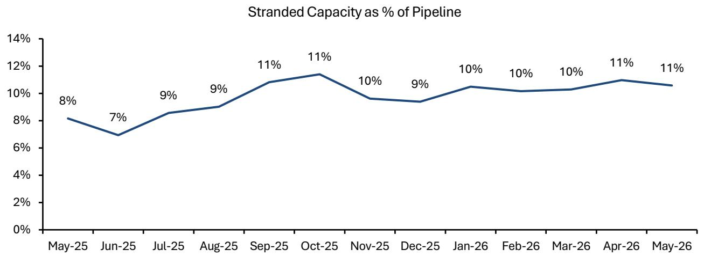

line chart

| Month    | Stranded Capacity as % of Pipeline |
| -------- | ---------------------------------- |
| May-25   | 8%                                 |
| Jun-25   | 7%                                 |
| Jul-25   | 9%                                 |
| Aug-25   | 9%                                 |
| Sep-25   | 11%                                |
| Oct-25   | 11%                                |
| Nov-25   | 10%                                |
| Dec-25   | 9%                                 |
| Jan-26   | 10%                                |
| Feb-26   | 10%                                |
| Mar-26   | 10%                                |
| Apr-26   | 11%                                |
| May-26   | 11%                                |

Stranded capacity = delayed + cancelled + not approved/withdrawn capacity  
Source: Aterio, Bernstein analysis

EXHIBIT 9: Behind The Meter: Only $4\%$ of the Installed Base, But $25\%$ of What's Under Construction, and $40\%$ of The Project Pipeline  

bar chart

Behind-the-Meter Mix of Project by Stage
| Stage | Percentage (%) |
| :--- | :--- |
| Active | 4 |
| Construction | 25 |
| Pipeline | 40 |
| Stranded | 16 |

Stranded capacity = delayed + cancelled + not approved/withdrawn capacity  
Source: Aterio, Bernstein analysis

## WHAT'S NEW THIS MONTH

EXHIBIT 10: Real Estate Developers and Crypto Companies Are Driving the Increase in Pipeline, Adding Nearly 30 GW This Month  
Changes to Data Center Capacity by Stage This Month  
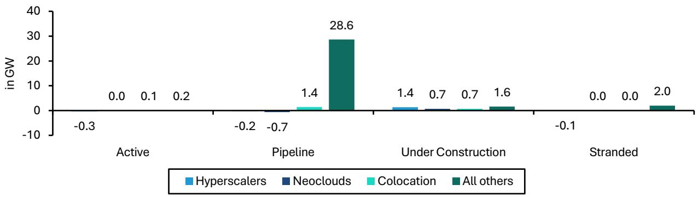

bar chart

| Category          | Hyperscalers | Neoclouds | Colocation | All others |
| ----------------- | ------------ | --------- | ---------- | ---------- |
| Active            | -0.3         | 0.0       | 0.1        | 0.2        |
| Pipeline          | -0.7         | 1.4       | 0.7        | 28.6       |
| Under Construction| 1.4          | 0.7       | 0.7        | 1.6        |
| Stranded          | -0.1         | 0.0       | 0.0        | 2.0        |

Stranded capacity = delayed + cancelled + not approved/withdrawn capacity
Source: Aterio, Bernstein analysis

EXHIBIT 11: Hyperscalers' Pipeline Remained Relatively Flat This Month, Though They Broke Ground on 1+ GW of New Capacity  
Changes to Hyperscaler Data Center Capacity by Stage This Month  
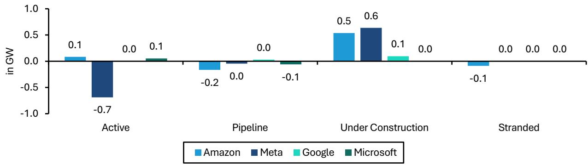

bar chart

| Category | Amazon (in GW) | Meta (in GW) | Google (in GW) | Microsoft (in GW) |
| :--- | :--- | :--- | :--- | :--- |
| Active | 0.1 | -0.7 | 0.0 | 0.1 |
| Pipeline | -0.2 | 0.0 | 0.0 | -0.1 |
| Under Construction | 0.5 | 0.6 | 0.1 | 0.0 |
| Stranded | -0.1 | 0.0 | 0.0 | 0.0 |

Stranded capacity = delayed + cancelled + not approved/withdrawn capacity
Source: Aterio, Bernstein analysis

## ELECTRICAL OEM DATA CENTER TAM

EXHIBIT 12: Quantifying Companies' Data Center TAM Based on 1) Current Capacity in Pipeline, and 2) Given \$M per MW Opportunity. We Estimate 70% of the Current Pipeline Are AI Builds (Based on Recent ETN Commentary That 70% of Current Construction Being AI)

Data Center TAM (\$B)
Based on Current Capacity in Pipeline  
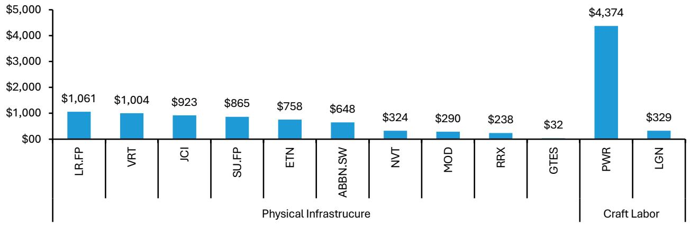

bar chart

| Category | Value ($) |
| :--- | :--- |
| LR.FP | 1,061 |
| VRT | 1,004 |
| JCI | 923 |
| SU.FP | 865 |
| ETN | 758 |
| ABBN.SW | 648 |
| NVT | 324 |
| MOD | 290 |
| RRX | 238 |
| GTES | 32 |
| PWR | 4,374 |
| LGN | 329 |

Source: Company reports, Aterio, Bernstein analysis

EXHIBIT 13: Breakdown Between AI vs. non-AI \$M per MW TAM and the \$TAM Based on Current Pipeline

<table><tr><td rowspan="2">Company</td><td rowspan="2">Ticker</td><td colspan="2">$M per MW</td><td rowspan="2">TAM ($B) Based on Pipeline</td></tr><tr><td>non-AI</td><td>AI</td></tr><tr><td colspan="5">Physical Infrastrucure</td></tr><tr><td>Eaton</td><td>ETN</td><td>$1.9</td><td>$2.6</td><td>$758</td></tr><tr><td>Schneider Electric</td><td>SU.FP</td><td>$1.2</td><td>$3.3</td><td>$865</td></tr><tr><td>ABB</td><td>ABBN.SW</td><td>$2.0</td><td>$2.0</td><td>$648</td></tr><tr><td>Vertiv</td><td>VRT</td><td>$2.8</td><td>$3.3</td><td>$1004</td></tr><tr><td>nVent</td><td>NVT</td><td>$1.0</td><td>$1.0</td><td>$324</td></tr><tr><td>Legrand</td><td>LR.FP</td><td>$2.8</td><td>$3.5</td><td>$1061</td></tr><tr><td>Johnson Controls</td><td>JCI</td><td>$2.5</td><td>$3.0</td><td>$923</td></tr><tr><td>Modine</td><td>MOD</td><td>$0.7</td><td>$1.0</td><td>$290</td></tr><tr><td>Regal Rexnord</td><td>RRX</td><td>$0.7</td><td>$0.7</td><td>$238</td></tr><tr><td>Gates Industrial</td><td>GTES</td><td>$0.1</td><td>$0.1</td><td>$32</td></tr><tr><td colspan="5">Craft Labor</td></tr><tr><td>Quanta</td><td>PWR</td><td>$13.5</td><td>$13.5</td><td>$4,374</td></tr><tr><td>Legence</td><td>LGN</td><td>$0.5</td><td>$1.2</td><td>$329</td></tr></table>

Source: Company reports, Aterio, Bernstein analysis

## TRACKING HYPERSCALER CAPEX

EXHIBIT 14: Consensus is Anticipating \~\$640B in Capex Spend From the Top 4 Hyperscalers in '26, Up 78% Y/Y. '27 Currently Expects 27% Growth to \$812B  
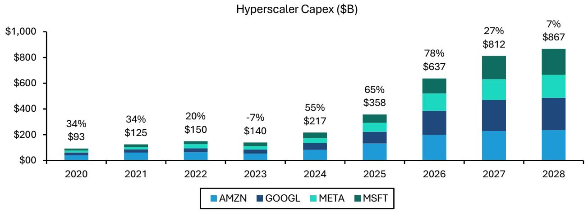

stacked bar chart

| Year | AMZN | GOOGL | META | MSFT |
|------|------|-------|------|------|
| 2020 | $93  |       |      |      |
| 2021 |      | $125  |      |      |
| 2022 |      |       | $150 |      |
| 2023 |      |       |      | $140 |
| 2024 | $217 |       |      |      |
| 2025 | $358 |       |      |      |
| 2026 | $637 |       |      |      |
| 2027 | $812 |       |      |      |
| 2028 | $867 |       |      |      |

Source: Company reports, Bloomberg estimates (2026-28), Bernstein analysis

EXHIBIT 15: YTD, Consensus' Hyperscaler Capex Estimates Are Up 60%+ For 2026-28  
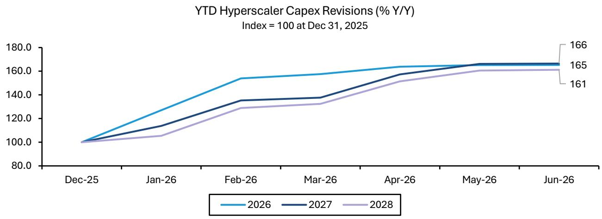

line chart

| Month    | 2026 | 2027 | 2028 |
| -------- | ---- | ---- | ---- |
| Jun-26   | 166  | 165  | 161  |

Source: Bloomberg estimates (2026-28), Bernstein analysis

## PIPELINE: TOTALS 324 GW, 10 YEARS' WORTH OF CONSTRUCTION WORK

## PIPELINE BY OPERATOR

EXHIBIT 16: Capacity in Pipeline is Up to 324 GW, Up 29 GW Month-Over-Month  
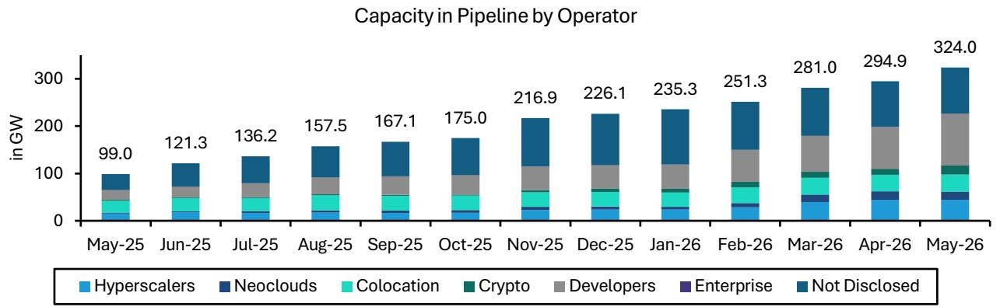

stacked bar chart

| Month    | Hyperscalers | Neoclouds | Colocation | Crypto | Developers | Enterprise | Not Disclosed |
|----------|--------------|-----------|------------|--------|------------|------------|---------------|
| May-25   | 10           | 30        | 20         | 10     | 10         | 5          | 10            |
| Jun-25   | 15           | 35        | 25         | 10     | 15         | 5          | 15            |
| Jul-25   | 20           | 40        | 30         | 10     | 20         | 5          | 20            |
| Aug-25   | 25           | 45        | 35         | 10     | 25         | 5          | 25            |
| Sep-25   | 30           | 50        | 40         | 10     | 30         | 5          | 30            |
| Oct-25   | 35           | 55        | 45         | 10     | 35         | 5          | 35            |
| Nov-25   | 40           | 60        | 50         | 10     | 40         | 5          | 40            |
| Dec-25   | 45           | 65        | 55         | 10     | 45         | 5          | 45            |
| Jan-26   | 50           | 70        | 60         | 10     | 50         | 5          | 50            |
| Feb-26   | 55           | 75        | 65         | 10     | 55         | 5          | 55            |
| Mar-26   | 60           | 80        | 70         | 10     | 60         | 5          | 60            |
| Apr-26   | 65           | 85        | 75         | 10     | 65         | 5          | 65            |
| May-26   | 70           | 90        | 80         | 10     | 70         | 5          | 70            |

Source: Aterio, Bernstein analysis

EXHIBIT 17: The Current Pipeline is Dominated by Real Estate Developers, Hyperscalers, and Colocators  
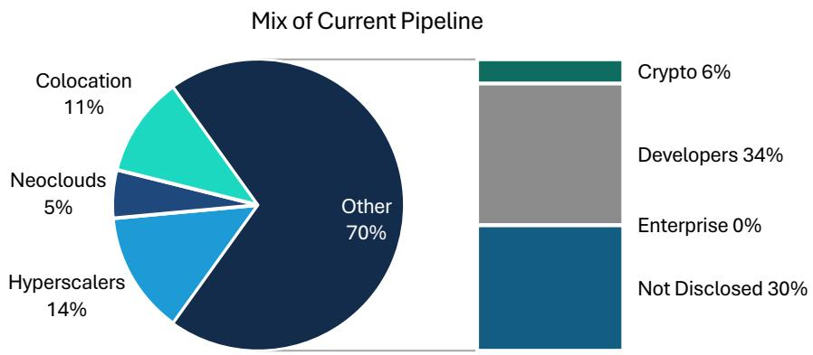

pie chart

Mix of Current Pipeline
| Category | Percentage (%) |
| :--- | :--- |
| Crypto | 6 |
| Developers | 34 |
| Enterprise | 0 |
| Not Disclosed | 30 |
| Hyperscalers | 14 |
| Neoclouds | 5 |
| Colocation | 11 |
Other | 70 |

Source: Aterio, Bernstein analysis

EXHIBIT 18: The Pipeline Has Grown by 225 GW in the LTM, with Real Estate Developers Contributing the Most Incremental Capacity  
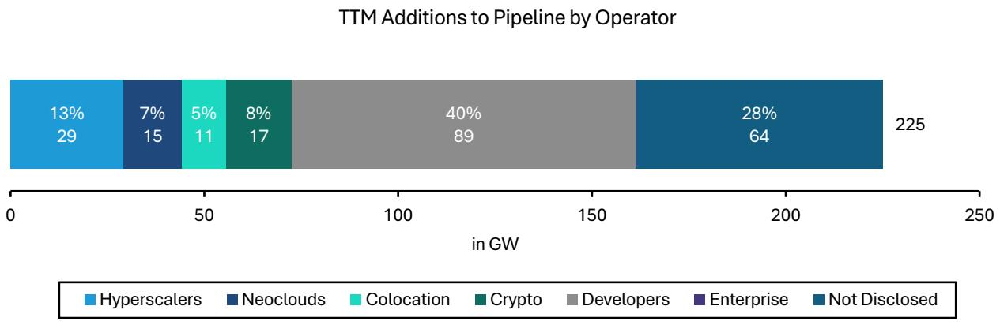

stacked bar chart

| Operator        | Percentage | Value |
| --------------- | ---------- | ----- |
| Hyperscalers    | 13%        | 29    |
| Neoclouds       | 7%         | 15    |
| Colocation      | 5%         | 11    |
| Crypto          | 8%         | 17    |
| Developers      | 40%        | 89    |
| Enterprise      | 28%        | 64    |
| Not Disclosed   | 28%        | 64    |
| Total           | 225        | 225   |

Source: Aterio, Bernstein analysis

## M/M CHANGE IN PIPELINE BY OPERATOR

EXHIBIT 19: This Month Saw 29 GW Added to the Pipeline  
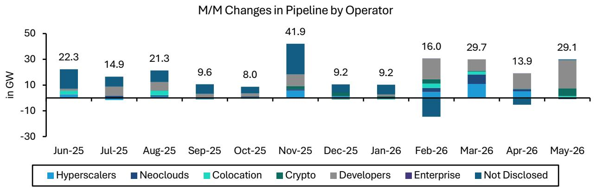

stacked bar chart

M/M Changes in Pipeline by Operator
| Month | Hyperscalers (in GW) | Neoclouds (in GW) | Colocation (in GW) | Crypto (in GW) | Developers (in GW) | Enterprise (in GW) | Not Disclosed (in GW) |
| :--- | :--- | :--- | :--- | :--- | :--- | :--- | :--- |
| Jun-25 | 7.0 | 1.0 | 1.0 | 0.0 | 0.0 | 0.0 | 14.9 |
| Jul-25 | 3.0 | 0.0 | 0.0 | 0.0 | 5.0 | 0.0 | 14.9 |
| Aug-25 | 4.0 | 1.0 | 1.0 | 0.0 | 5.0 | 0.0 | 13.3 |
| Sep-25 | 1.0 | 1.0 | 1.0 | 0.0 | 2.0 | 0.0 | 9.6 |
| Oct-25 | 1.0 | 0.0 | 0.0 | 0.0 | 2.0 | 0.0 | 8.0 |
| Nov-25 | 7.0 | 1.0 | 1.0 | 1.0 | 8.0 | 0.0 | 41.9 |
| Dec-25 | 1.0 | 1.0 | 1.0 | 1.0 | 2.0 | 0.0 | 9.2 |
| Jan-26 | 1.0 | 1.0 | 1.0 | 1.0 | 2.0 | 0.0 | 9.2 |
| Feb-26 | -5.0 | -3.0 | -3.0 | -3.0 | 14.0 | -3.0 | -16.0 |
| Mar-26 | 11.0 | 4.0 | 2.0 | 1.0 | 7.0 | 0.0 | 29.7 |
| Apr-26 | -7.0 | -3.0 | -3.0 | -3.0 | 8.0 | -3.0 | -8.9 |
| May-26 | -4.0 | -3.0 | -3.0 | -3.0 | 18.0 | -3.0 | 29.1 |
The chart displays the cumulative M/M changes in pipeline by operator over time, with each bar representing a month and its corresponding total change in MW for that operator category.

Source: Aterio, Bernstein analysis

EXHIBIT 20: Real Estate Developers Drove the Vast Majority of the Increase with 22 GW  
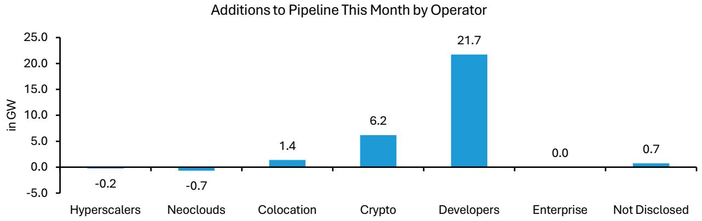

bar chart

| Operator        | Additions to Pipeline This Month by Operator (in GW) |
| --------------- | ---------------------------------------------------- |
| Hyperscalers    | -0.2                                                 |
| Neoclouds       | -0.7                                                 |
| Colocation      | 1.4                                                  |
| Crypto          | 6.2                                                  |
| Developers      | 21.7                                                 |
| Enterprise      | 0.0                                                  |
| Not Disclosed   | 0.7                                                  |

Source: Aterio, Bernstein analysis

## PIPELINE BY HYPERSCALER

EXHIBIT 21: Hyperscalers' Capacity in Pipeline Remained Flat Month-Over-Month at 44 GW, Though Still \~2x vs. the Start of the Year  
Capacity in Pipeline by Hyperscaler  
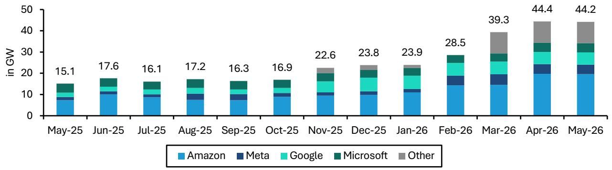

stacked bar chart

| Month | Amazon (in GW) | Meta (in GW) | Google (in GW) | Microsoft (in GW) | Other (in GW) |
| :--- | :--- | :--- | :--- | :--- | :--- |
| May-25 | 7.5 | 1.5 | 3.0 | 4.0 | 15.1 |
| Jun-25 | 9.0 | 1.5 | 3.0 | 4.0 | 17.6 |
| Jul-25 | 8.5 | 1.5 | 3.0 | 4.0 | 16.1 |
| Aug-25 | 8.5 | 1.5 | 3.0 | 4.0 | 17.2 |
| Sep-25 | 8.0 | 1.5 | 3.0 | 4.0 | 16.3 |
| Oct-25 | 9.0 | 1.5 | 3.0 | 4.0 | 16.9 |
| Nov-25 | 10.0 | 1.5 | 4.0 | 4.0 | 22.6 |
| Dec-25 | 10.0 | 1.5 | 4.0 | 4.0 | 23.8 |
| Jan-26 | 11.0 | 1.5 | 4.0 | 4.0 | 23.9 |
| Feb-26 | 14.0 | 3.0 | 4.0 | 4.0 | 28.5 |
| Mar-26 | 14.0 | 3.0 | 4.0 | 4.0 | 39.3 |
| Apr-26 | 19.0 | 3.0 | 4.0 | 4.0 | 44.4 |
| May-26 | 19.0 | 3.0 | 4.0 | 4.0 | 44.2 |

Source: Aterio, Bernstein analysis

EXHIBIT 22: Amazon Has Been the Most Aggressive of the Hyperscalers, Adding 12 GW to the 26 GW Added to Pipeline in the LTM  
Mix of Hyperscalers' Current Pipeline  
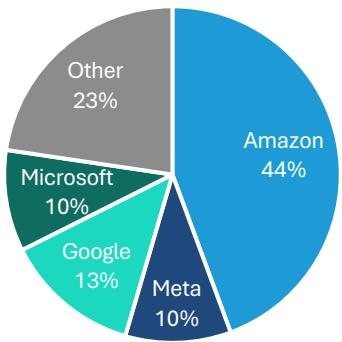

pie chart

| Company | Share (%) |
| :--- | :--- |
| Amazon | 44 |
| Microsoft | 10 |
| Google | 13 |
| Meta | 10 |
| Other | 23 |

Source: Aterio, Bernstein analysis

EXHIBIT 23: The Hyperscaler Pipeline Has Grown by 29 GW in the LTM, with Amazon Driving 40%+ of Incremental Capacity  
TTM Additions to Pipeline by Hyperscaler  
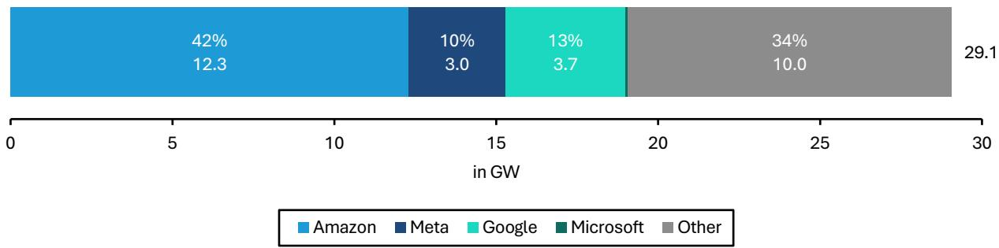

stacked bar chart

| Company | Percentage (%) | Value (in GW) |
| :--- | :--- | :--- |
| Amazon | 42 | 12.3 |
| Meta | 10 | 3.0 |
| Google | 13 | 3.7 |
| Microsoft | 34 | 10.0 |
| Other | 29.1 | 29.1 |

Source: Aterio, Bernstein analysis

## M/M CHANGE IN PIPELINE BY HYPERSCALER

EXHIBIT 24: In Aggregate, Hyperscalers' Pipeline Remained Flat Month-Over-Month  
M/M Changes in Pipeline by Hyperscaler  
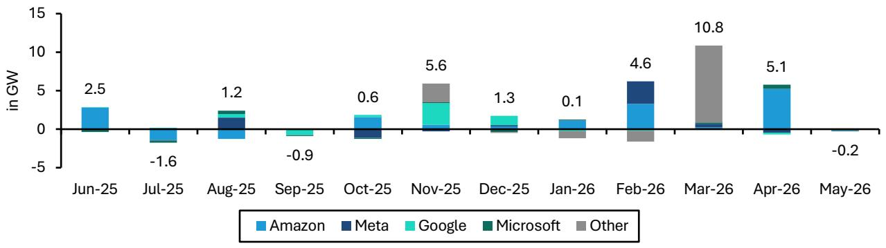

stacked bar chart

| Month | Amazon (in GW) | Meta (in GW) | Google (in GW) | Microsoft (in GW) | Other (in GW) |
| :--- | :--- | :--- | :--- | :--- | :--- |
| Jun-25 | 2.5 | 0.0 | 0.0 | 0.0 | 0.0 |
| Jul-25 | -1.6 | 0.0 | 0.0 | 0.0 | 0.0 |
| Aug-25 | 1.2 | 1.2 | 0.3 | 0.4 | 0.0 |
| Sep-25 | -0.9 | 0.0 | -1.1 | 0.0 | 0.0 |
| Oct-25 | 0.6 | -1.1 | 0.0 | 0.0 | 0.0 |
| Nov-25 | 5.6 | 0.3 | 3.3 | 0.0 | 1.8 |
| Dec-25 | 1.3 | 0.3 | 0.7 | 0.0 | 0.0 |
| Jan-26 | 0.1 | 0.0 | 0.0 | 0.0 | -1.1 |
| Feb-26 | 4.6 | 2.4 | 0.0 | 0.0 | -2.4 |
| Mar-26 | 10.8 | 0.6 | 0.3 | 0.1 | 11.4 |
| Apr-26 | 5.1 | 0.3 | 0.3 | 0.3 | 0.0 |
| May-26 | -0.2 | 0.0 | 0.0 | 0.0 | 0.0 |

Source: Aterio, Bernstein analysis

EXHIBIT 25: Google Was the Only Hyperscaler to Marginally Increase Capacity in Pipeline  
Additions to Pipeline This Month by Hyperscaler  
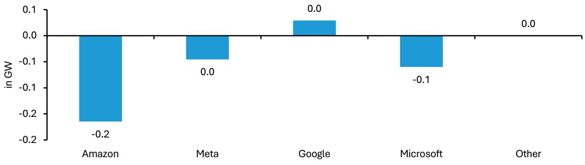

bar chart

| Company | Change in GW (GW) |
| :--- | :--- |
| Amazon | -0.2 |
| Meta | 0.0 |
| Google | 0.0 |
| Microsoft | -0.1 |
| Other | 0.0 |

Source: Aterio, Bernstein analysis

## PIPELINE BY NEOCLOUD

EXHIBIT 26: After Nearly Tripling Capacity in the Pipeline YTD Through April, the Neoclouds Saw the Pipeline Decrease in May  
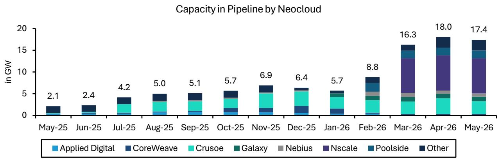

stacked bar chart

| Month    | Applied Digital | CoreWeave | Crusoe | Galaxy | Nebius | Nscale | Poolside | Other |
|----------|-----------------|-----------|--------|--------|--------|--------|----------|-------|
| May-25   | 0.0             | 0.0       | 0.0    | 0.0    | 0.0    | 0.0    | 0.0      | 2.1   |
| Jun-25   | 0.5             | 0.0       | 0.0    | 0.0    | 0.0    | 0.0    | 0.0      | 2.4   |
| Jul-25   | 0.5             | 0.5       | 1.5    | 0.0    | 0.0    | 0.0    | 0.0      | 4.2   |
| Aug-25   | 0.5             | 0.5       | 1.5    | 0.0    | 0.0    | 0.0    | 0.0      | 5.0   |
| Sep-25   | 1.0             | 0.5       | 2.0    | 0.0    | 0.0    | 0.0    | 0.0      | 5.1   |
| Oct-25   | 1.0             | 1.0       | 2.5    | 0.0    | 0.0    | 0.0    | 0.0      | 5.7   |
| Nov-25   | 1.5             | 1.5       | 3.5    | 0.0    | 0.0    | 0.0    | 0.0      | 6.9   |
| Dec-25   | 1.5             | 1.5       | 3.5    | 0.0    | 0.0    | 0.0    | 0.0      | 6.4   |
| Jan-26   | 1.5             | 1.5       | 2.5    | 1.5    | 1.5    | 1.5    | 1.5      | 5.7   |
| Feb-26   | 1.5             | 1.5       | 2.5    | 1.5    | 1.5    | 1.5    | 1.5      | 8.8   |
| Mar-26   | 1.5             | 1.5       | 2.5    | 1.5    | 1.5    | 6.3    | 1.5      | 16.3  |
| Apr-26   | 1.5             | 1.5       | 3.5    | 1.5    | 1.5    | 7.4    | 1.5      | 18.0  |
| May-26   | 1.5             | 1.5       | 3.5    | 1.5    | 1.5    | 7.4    | 1.5      | 17.4  |

Source: Aterio, Bernstein analysis

EXHIBIT 27: Nscale and Crusoe Make Up \~70% of the Current Neocloud Pipeline  
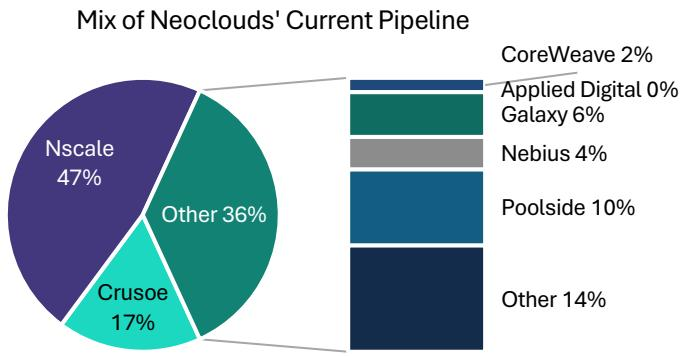

pie chart

Mix of Neoclouds' Current Pipeline
| Category | Percentage (%) |
| :--- | :--- |
| Nscale | 47 |
| Other | 36 |
| Crusoe | 17 |
| Poolside | 10 |
| Nebius | 4 |
| Applied Digital | 0 |
| CoreWeave | 2 |

Source: Aterio, Bernstein analysis

EXHIBIT 28: Nscale Has Added 8 GW to Neoclouds' TTM Pipeline Growth, or 50%+ of the Increase  
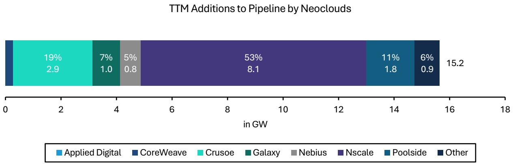

stacked bar chart

| Category       | Value | Percentage |
| -------------- | ----- | ---------- |
| Applied Digital | 0.9   | 6%         |
| CoreWeave      | 0.9   | 6%         |
| Crusoe         | 2.9   | 19%        |
| Galaxy         | 1.0   | 7%         |
| Nebius         | 0.8   | 5%         |
| Nscale         | 8.1   | 53%        |
| Poolside       | 1.8   | 11%        |
| Other          | 0.9   | 15.2       |

Source: Aterio, Bernstein analysis

## PIPELINE BY COLOCATOR

EXHIBIT 29: The Pipeline Amongst Colocators is Up 6+ GW YTD  
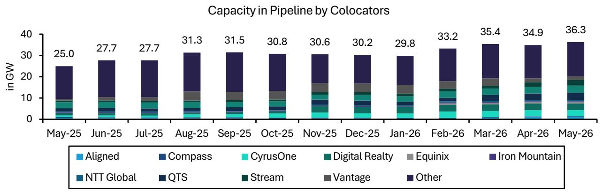

stacked bar chart

| Month    | Aligned | Compass | CyrusOne | Digital Realty | Equinix | Iron Mountain | NTT Global | QTS  | Stream | Vantage | Other |
|----------|---------|---------|----------|----------------|---------|---------------|------------|------|--------|---------|-------|
| May-25   | 1.0     | 0.5     | 1.0      | 1.0            | 0.5     | 8.0           | 0.5        | 0.5  | 0.5    | 0.5     | 8.0   |
| Jun-25   | 1.0     | 0.5     | 1.0      | 1.0            | 0.5     | 8.0           | 0.5        | 0.5  | 0.5    | 0.5     | 8.0   |
| Jul-25   | 1.0     | 0.5     | 1.0      | 1.0            | 0.5     | 8.0           | 0.5        | 0.5  | 0.5    | 0.5     | 8.0   |
| Aug-25   | 1.0     | 0.5     | 1.0      | 1.0            | 0.5     | 8.0           | 0.5        | 0.5  | 0.5    | 0.5     | 8.0   |
| Sep-25   | 1.0     | 0.5     | 1.0      | 1.0            | 0.5     | 8.0           | 0.5        | 0.5  | 0.5    | 0.5     | 8.0   |
| Oct-25   | 1.0     | 0.5     | 1.0      | 1.0            | 0.5     | 8.0           | 0.5        | 0.5  | 0.5    | 0.5     | 8.0   |
| Nov-25   | 1.0     | 0.5     | 1.0      | 1.0            | 0.5     | 8.0           | 0.5        | 0.5  | 0.5    | 0.5     | 8.0   |
| Dec-25   | 1.0     | 0.5     | 1.0      | 1.0            | 0.5     | 8.0           | 0.5        | 0.5  | 0.5    | 0.5     | 8.0   |
| Jan-26   | 1.0     | 0.5     | 1.0      | 1.0            | 0.5     | 8.0           | 0.5        | 0.5  | 0.5    | 0.5     | 8.0   |
| Feb-26   | 1.0     | 0.5     | 1.0      | 1.0            | 0.5     | 8.0           | 0.5        | 0.5  | 0.5    | 0.5     | 8.0   |
| Mar-26   | 1.0     | 0.5     | 1.0      | 1.0            | 0.5     | 8.0           | 0.5        | 0.5  | 0.5    | 0.5     | 8.0   |
| Apr-26   | 1.0     | 0.5     | 1.0      | 1.0            | 0.5     | 8.0           | 0.5        | 0.5  | 0.5    | 0.5     | 8.0   |
| May-26   | 1.0     | 0.5     | 1.0      | 1.0            | 0.5     | 8.0           | 0.5        | 0.5  | 0.5    | 0.5     | 8.0   |

Source: Aterio, Bernstein analysis

EXHIBIT 30: Digital Realty, STACK, and QTS Currently Hold the Most Capacity Share of Pipeline  
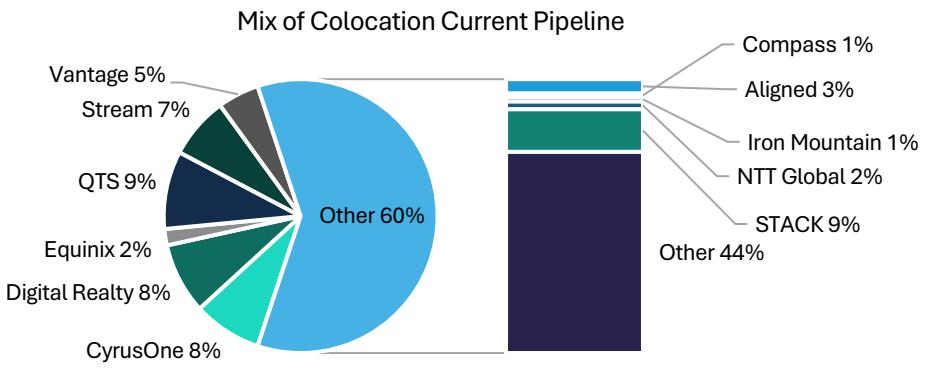

pie chart

Mix of Colocation Current Pipeline
| Category | Percentage (%) |
| :--- | :--- |
| Other | 60 |
| Vantage | 5 |
| Stream | 7 |
| QTS | 9 |
| Equinix | 2 |
| Digital Realty | 8 |
| CyrusOne | 8 |
| Compass | 1 |
| Aligned | 3 |
| Iron Mountain | 1 |
| NTT Global | 2 |
| STACK | 9 |
| Other | 44 |

Source: Aterio, Bernstein analysis

EXHIBIT 31: The Greatest Contribution to Colocators' Pipeline Was Digital Realty with 2 GW or \~20% of the TTM Increase  
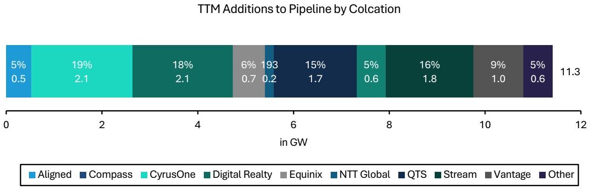

stacked bar chart

| Category | Segment 1 | Segment 2 | Segment 3 | Segment 4 | Segment 5 | Segment 6 | Segment 7 | Segment 8 | Segment 9 | Segment 10 | Segment 11 | Segment 12 |
| --- | --- | --- | --- | --- | --- | --- | --- | --- | --- | --- | --- | --- |
| Aligned | 5% | 0.5 |  |  |  |  |  |  |  |  |  |  |
| Compass |  |  | 19% |  |  |  |  |  |  |  |  |  |
| CyrusOne |  | 2.1 |  |  |  |  |  |  |  |  |  |  |
| Digital Realty |  |  | 18% | 2.1 |  |  |  |  |  |  |  |  |
| Equinix |  |  |  |  |  |  |  |  |  |  |  |  |
| NTT Global |  |  |  |  |  |  |  |  |  |  |  |  |
| QTS |  |  |  |  |  |  |  |  |  |  |  |  |
| Stream |  |  |  |  |  |  | 16% | 1.8 |  |  |  |  |
| Vantage |  |  |  |  |  |  | 9% | 1.0 |  |  |  |  |
| Other |  |  |  |  |  |  | 5% | 0.6 |  |  |  | 11.3 |

Source: Aterio, Bernstein analysis

## PIPELINE BY CRYPTO MINER

EXHIBIT 32: Bitcoin Miners' Power Advantage: Access to \~30GW planned power  
Bitcoin Miners - Planned Power Portfolio (MW)  
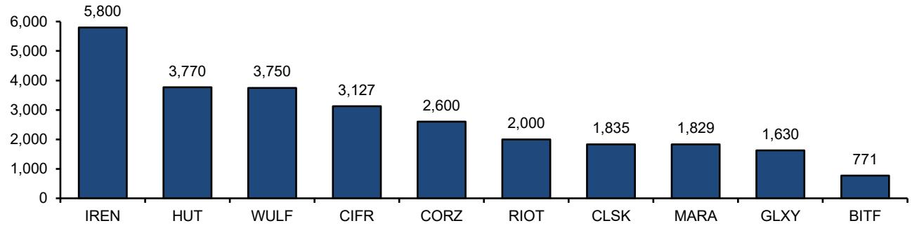

bar chart

| Category | Value |
|---|---|
| IREN | 5,800 |
| HUT | 3,770 |
| WULF | 3,750 |
| CIFR | 3,127 |
| CORZ | 2,600 |
| RIOT | 2,000 |
| CLSK | 1,835 |
| MARA | 1,829 |
| GLXY | 1,630 |
| BITF | 771 |

HUT includes 1.7GW power under exclusivity; CIFR excludes 500MW Milsing site  
Source: Company filings, Bernstein analysis

EXHIBIT 33: Bitcoin miners still have significant power runway available for AI/HPC deployments  
Bitcoin Miners - Available vs Contracted AI capacity (gross MW)  
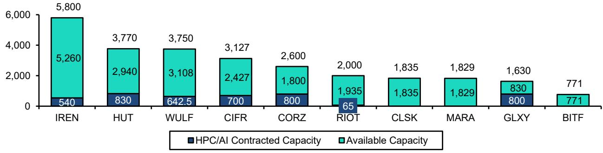

stacked bar chart

| Company | HPC/AI Contracted Capacity | Available Capacity |
| :--- | :--- | :--- |
| IREN | 540 | 5,260 |
| HUT | 830 | 2,940 |
| WULF | 642.5 | 3,108 |
| CIFR | 700 | 2,427 |
| CORZ | 800 | 1,800 |
| RIOT | 65 | 1,935 |
| CLSK | - | 1,835 |
| MARA | - | 1,829 |
| GLXY | 800 | 830 |
| BITF | - | 771 |

RIOT contracted MW assuming PUE 1.3  
Source: Company filings, Bernstein analysis

EXHIBIT 34: Bitcoin miners have contracted 20% of their power pipeline to neoclouds, hyperscalers, AI chip makers, etc.  
Bitcoin miners - Power pipeline, contracted MW and progress (GW)  
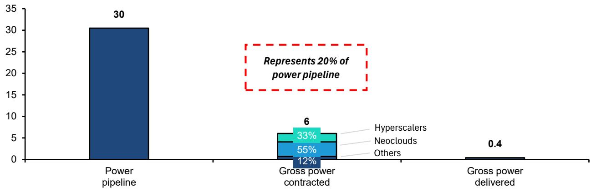

bar chart

| Category               | Value | Percentage |
| ---------------------- | ----- | ---------- |
| Power pipeline         | 30    | 20%        |
| Gross power contracted | 6     | 33%        |
| Gross power delivered  | 0.4   | 0.4%       |

Under grid connected power, 'others' includes AI chipmakers, undisclosed counterparties (e.g. HUT has not disclosed 'investment grade counterparty'), etc.  
Source: Company filings, Bernstein analysis

## PIPELINE BY GEOGRAPHY

EXHIBIT 35: ERCOT (Texas) is Expected to Add 24% of All Capacity in Pipeline  
Capacity in Pipeline by RTO  
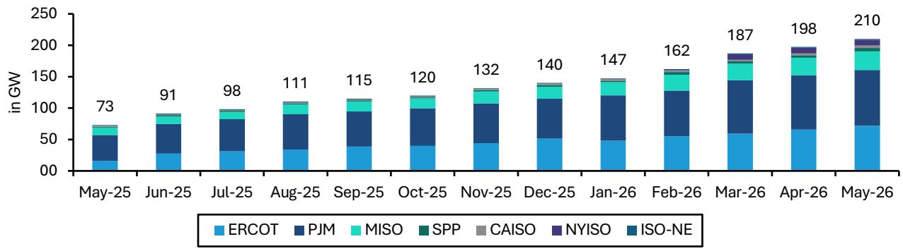

stacked bar chart

| Month    | ERCOT | PJM  | MISO | SPP  | CAISO | NYISO | ISO-NE |
|----------|-------|------|------|------|-------|-------|--------|
| May-25   | 18    | 40   | 10   | 5    | 0     | 0     | 0      |
| Jun-25   | 25    | 45   | 10   | 5    | 0     | 0     | 0      |
| Jul-25   | 30    | 50   | 10   | 5    | 0     | 0     | 0      |
| Aug-25   | 35    | 55   | 10   | 5    | 0     | 0     | 0      |
| Sep-25   | 40    | 60   | 10   | 5    | 0     | 0     | 0      |
| Oct-25   | 45    | 65   | 10   | 5    | 0     | 0     | 0      |
| Nov-25   | 50    | 70   | 10   | 5    | 0     | 0     | 0      |
| Dec-25   | 55    | 75   | 10   | 5    | 0     | 0     | 0      |
| Jan-26   | 60    | 80   | 10   | 5    | 0     | 0     | 0      |
| Feb-26   | 65    | 85   | 10   | 5    | 0     | 0     | 0      |
| Mar-26   | 70    | 90   | 10   | 5    | 0     | 0     | 0      |
| Apr-26   | 75    | 95   | 10   | 5    | 0     | 0     | 0      |
| May-26   | 80    | 100  | 10   | 5    | 0     | 0     | 0      |

Source: Aterio, Bernstein analysis

EXHIBIT 36: Texas Has 2x Capacity in Pipeline as the Next Largest State  
Capacity in Pipeline by Top 10 States  
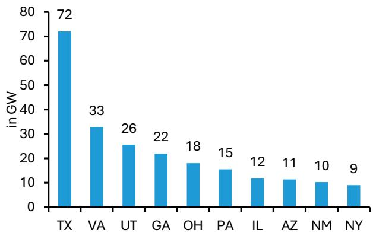

bar chart

| State | in GW |
| :--- | :--- |
| TX | 72 |
| VA | 33 |
| UT | 26 |
| GA | 22 |
| OH | 18 |
| PA | 15 |
| IL | 12 |
| AZ | 11 |
| NM | 10 |
| NY | 9 |

Source: Aterio, Bernstein analysis

EXHIBIT 37: Utah Saw The Most Capacity Added to Pipeline This Month Behind O'Leary Ventures  
Capacity Added to Pipeline This Month  
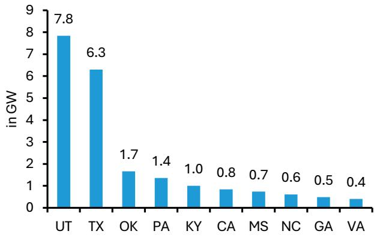

bar chart

| State | Power Consumption (in GW) |
| :--- | :--- |
| UT | 7.8 |
| TX | 6.3 |
| OK | 1.7 |
| PA | 1.4 |
| KY | 1.0 |
| CA | 0.8 |
| MS | 0.7 |
| NC | 0.6 |
| GA | 0.5 |
| VA | 0.4 |

Source: Aterio, Bernstein analysis

EXHIBIT 38: Capacity in Pipeline Shows a Clear Shift - Data Centers Are Moving Inland  
Mix of Capacity in Pipeline by State  
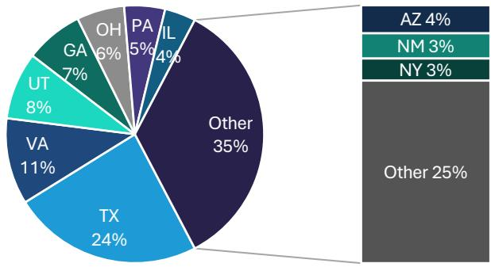

pie chart

| Category | Percentage (%) |
| :--- | :--- |
| AZ | 4 |
| NM | 3 |
| NY | 3 |
| Other | 25 |
| VA | 11 |
| UT | 8 |
| GA | 7 |
| OH | 6 |
| PA | 5 |
| IL | 4 |
| Other | 35 |

Source: Aterio, Bernstein analysis

## UNDER CONSTRUCTION

## UNDER CONSTRUCTION: OPERATOR TYPE

EXHIBIT 39: Capacity Under Construction is Up to 63 GW, 32% Higher Than Current Active Capacity  
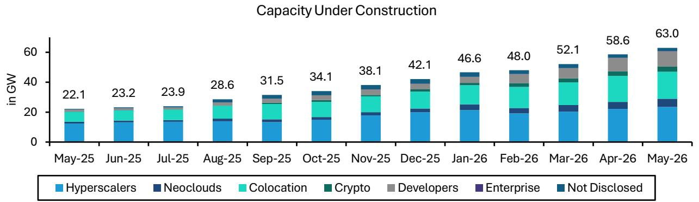

stacked bar chart

| Month    | Hyperscalers | Neoclouds | Colocation | Crypto | Developers | Enterprise | Not Disclosed |
| -------- | ------------ | --------- | ---------- | ------ | ---------- | ---------- | ------------- |
| May-25   | 14.0         | 1.0       | 3.0        | 0.0    | 0.0        | 0.0        | 0.0           |
| Jun-25   | 14.0         | 1.0       | 3.0        | 0.0    | 0.0        | 0.0        | 0.0           |
| Jul-25   | 14.0         | 1.0       | 3.0        | 0.0    | 0.0        | 0.0        | 0.0           |
| Aug-25   | 14.0         | 1.0       | 3.0        | 0.0    | 0.0        | 0.0        | 0.0           |
| Sep-25   | 14.0         | 1.0       | 3.0        | 0.0    | 0.0        | 0.0        | 0.0           |
| Oct-25   | 14.0         | 1.0       | 3.0        | 0.0    | 0.0        | 0.0        | 0.0           |
| Nov-25   | 14.0         | 1.0       | 3.0        | 0.0    | 0.0        | 0.0        | 0.0           |
| Dec-25   | 14.0         | 1.0       | 3.0        | 0.0    | 0.0        | 0.0        | 0.0           |
| Jan-26   | 14.0         | 1.0       | 3.0        | 0.0    | 0.0        | 0.0        | 0.0           |
| Feb-26   | 14.0         | 1.0       | 3.0        | 0.0    | 0.0        | 0.0        | 0.0           |
| Mar-26   | 14.0         | 1.0       | 3.0        | 0.0    | 0.0        | 0.0        | 0.0           |
| Apr-26   | 14.0         | 1.0       | 3.0        | 0.0    | 0.0        | 0.0        | 0.0           |
| May-26   | 14.0         | 1.0       | 3.0        | 0.0    | 0.0        | 0.0        | 63.0          |

Source: Aterio, Bernstein analysis

EXHIBIT 40: Hyperscalers and Colos Are Responsible For Nearly 70% of Current Construction  
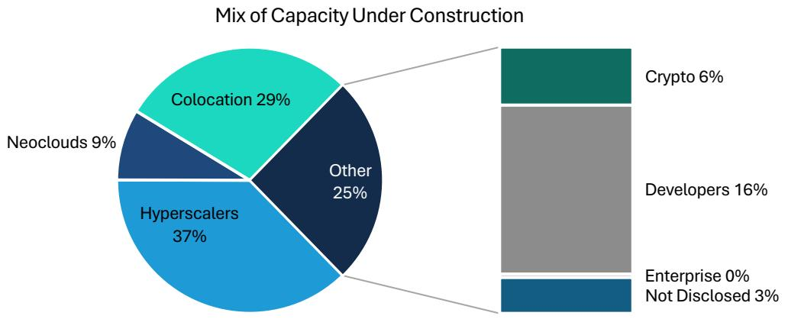

pie chart

Mix of Capacity Under Construction
| Category | Percentage (%) |
| :--- | :--- |
| Hyperscalers | 37 |
| Colocation | 29 |
| Neoclouds | 9 |
| Other | 25 |
| Crypto | 6 |
| Developers | 16 |
| Enterprise | 0 |
| Not Disclosed | 3 |

Source: Aterio, Bernstein analysis

EXHIBIT 41: Capacity Under Construction Has Grown to 41 GW in the LTM. Hyperscalers and Colocators Have Contributed the Most Incremental Capacity, or Nearly 60%  
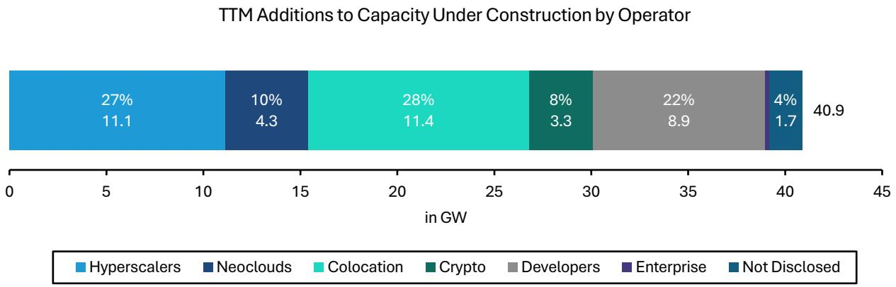

stacked bar chart

| Operator      | Percentage | Value |
| ------------- | ---------- | ----- |
| Hyperscalers  | 27%        | 11.1  |
| Neoclouds     | 10%        | 4.3   |
| Colocation    | 28%        | 11.4  |
| Crypto        | 8%         | 3.3   |
| Developers    | 22%        | 8.9   |
| Enterprise    | 4%         | 1.7   |
| Not Disclosed  | -          | 40.9  |

Source: Aterio, Bernstein analysis

## M/M CHANGE IN UNDER CONSTRUCTION: OPERATOR TYPE

EXHIBIT 42: Capacity Under Construction Grew by 4.4 GW This Month  
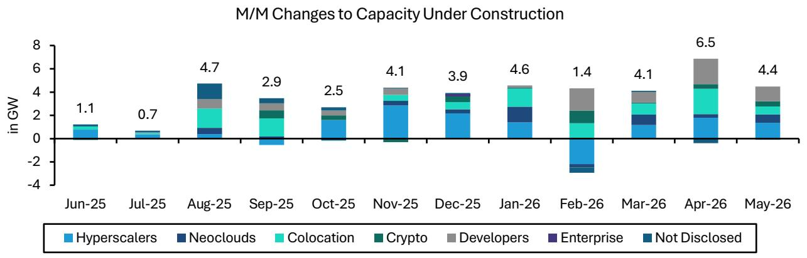

stacked bar chart

| Month    | Hyperscalers | Neoclouds | Colocation | Crypto | Developers | Enterprise | Not Disclosed |
|----------|--------------|-----------|------------|--------|------------|------------|---------------|
| Jun-25   | 1.1          | 0.0       | 0.0        | 0.0    | 0.0        | 0.0        | 0.0           |
| Jul-25   | 0.7          | 0.0       | 0.0        | 0.0    | 0.0        | 0.0        | 0.0           |
| Aug-25   | 4.7          | 0.0       | 1.0        | 0.0    | 0.0        | 0.0        | 0.0           |
| Sep-25   | 2.9          | 0.0       | 1.0        | 0.0    | 0.0        | 0.0        | 0.0           |
| Oct-25   | 2.5          | 0.0       | 0.0        | 0.0    | 0.0        | 0.0        | 0.0           |
| Nov-25   | 4.1          | 0.0       | 1.0        | 0.0    | 0.0        | 0.0        | 0.0           |
| Dec-25   | 3.9          | 0.0       | 1.0        | 0.0    | 0.0        | 0.0        | 0.0           |
| Jan-26   | 4.6          | 1.0       | 1.0        | 0.0    | 0.0        | 0.0        | 0.0           |
| Feb-26   | -3.5         | -1.5      | -1.5       | -1.5   | -1.5       | -1.5       | -1.5          |
| Mar-26   | 4.1          | 1.5       | 1.5        | 1.5    | 1.5        | 1.5        | 1.5           |
| Apr-26   | 6.5          | 2.5       | 2.5        | 2.5    | 2.5        | 2.5        | 2.5           |
| May-26   | 4.4          | 1.5       | 1.5        | 1.5    | 1.5        | 1.5        | 1.5           |

Source: Aterio, Bernstein analysis

EXHIBIT 43: Hyperscalers and Developers Drove \~70% of the Increase  
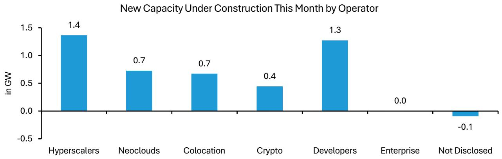

bar chart

| Operator        | New Capacity (in GW) |
| --------------- | -------------------- |
| Hyperscalers    | 1.4                  |
| Neoclouds       | 0.7                  |
| Colocation      | 0.7                  |
| Crypto          | 0.4                  |
| Developers      | 1.3                  |
| Enterprise      | 0.0                  |
| Not Disclosed   | -0.1                 |

Source: Aterio, Bernstein analysis

## UNDER CONSTRUCTION: HYPERSCALERS

EXHIBIT 44: Hyperscalers' Capacity Under Construction is Up to 24 GW  
Capacity Under Construction by Hyperscaler  
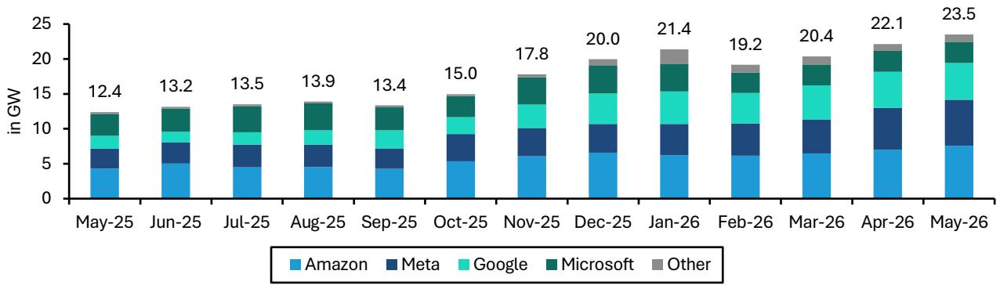

stacked bar chart

| Month    | Amazon | Meta  | Google | Microsoft | Other |
| -------- | ------ | ----- | ------ | --------- | ----- |
| May-25   | 4.0    | 3.0   | 2.0    | 3.0       | 0.0   |
| Jun-25   | 4.5    | 3.0   | 2.0    | 3.0       | 0.0   |
| Jul-25   | 4.5    | 3.0   | 2.0    | 3.0       | 0.0   |
| Aug-25   | 4.5    | 3.0   | 2.0    | 3.0       | 0.0   |
| Sep-25   | 4.5    | 3.0   | 2.0    | 3.0       | 0.0   |
| Oct-25   | 5.0    | 4.0   | 2.0    | 3.0       | 0.0   |
| Nov-25   | 6.0    | 4.0   | 3.0    | 3.0       | 0.0   |
| Dec-25   | 6.5    | 4.5   | 4.0    | 3.5       | 0.0   |
| Jan-26   | 6.5    | 5.0   | 4.5    | 3.5       | 1.4   |
| Feb-26   | 6.5    | 5.0   | 4.5    | 3.5       | 1.2   |
| Mar-26   | 6.5    | 5.0   | 4.5    | 3.5       | 1.2   |
| Apr-26   | 7.0    | 6.0   | 5.0    | 3.5       | 1.2   |
| May-26   | 7.5    | 6.5   | 5.5    | 3.5       | 1.2   |

Source: Aterio, Bernstein analysis

EXHIBIT 45: Amazon, Google, and Meta Are Responsible For 80%+ of All Hyperscale Construction  
Mix of Hypescalers' Capacity Under Construction  
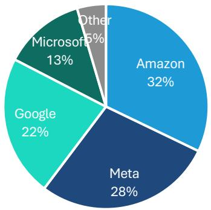

pie chart

| Company | Share (%) |
| :--- | :--- |
| Amazon | 32 |
| Meta | 28 |
| Google | 22 |
| Microsoft | 13 |
| Other | 5 |

Source: Aterio, Bernstein analysis

EXHIBIT 46: Hyperscalers Have Started Construction of 11 GW of Capacity in the LTM. Microsoft Has Been the Least Active in Adding to Construction  
TTM Additions to Capacity Under Construction by Hyperscaler  
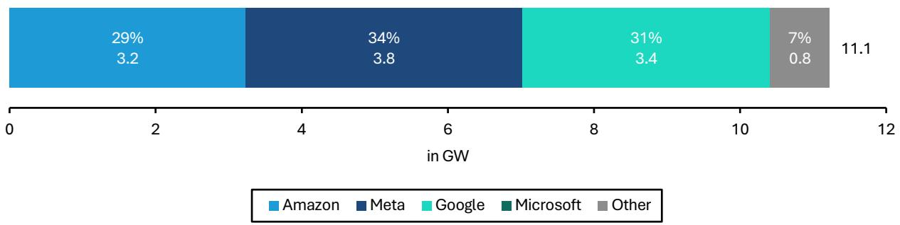

stacked bar chart

| Company | Percentage (%) | Value (in GW) |
| :--- | :--- | :--- |
| Amazon | 29 | 3.2 |
| Meta | 34 | 3.8 |
| Google | 31 | 3.4 |
| Microsoft | 7 | 0.8 |
| Other | 11.1 | 11.1 |

Source: Aterio, Bernstein analysis

## M/M CHANGE IN UNDER CONSTRUCTION: HYPERSCALER

EXHIBIT 47: Hyperscalers Broke Ground on 1.4 GW of New Capacity Under Construction This Month  
M/M Change in Capacity Under Construction by Hyperscaler  
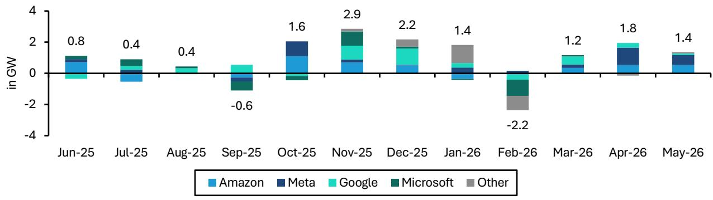

stacked bar chart

| Month | Amazon (in GW) | Meta (in GW) | Google (in GW) | Microsoft (in GW) | Other (in GW) |
| :--- | :--- | :--- | :--- | :--- | :--- |
| Jun-25 | 0.8 | 0.0 | -0.3 | 0.1 | 0.0 |
| Jul-25 | 0.4 | -0.4 | 0.1 | 0.2 | 0.0 |
| Aug-25 | 0.4 | 0.0 | 0.3 | 0.0 | 0.0 |
| Sep-25 | 0.0 | 0.0 | -0.6 | -0.7 | -0.1 |
| Oct-25 | 1.6 | 0.7 | 0.1 | -0.2 | 0.1 |
| Nov-25 | 2.9 | 0.7 | 1.1 | 1.1 | 0.3 |
| Dec-25 | 2.2 | 0.4 | 1.4 | 1.3 | 0.4 |
| Jan-26 | 1.4 | 0.2 | -0.2 | 0.1 | 1.4 |
| Feb-26 | -2.2 | 0.0 | -0.4 | -0.8 | -1.8 |
| Mar-26 | 1.2 | 0.3 | 0.3 | 0.3 | 0.1 |
| Apr-26 | 1.8 | 1.1 | 0.3 | 0.1 | 0.1 |
| May-26 | 1.4 | 0.3 | 0.1 | 0.1 | 0.1 |

Source: Aterio, Bernstein analysis

EXHIBIT 48: Led by Amazon and Meta with a Combined 1.1 GW  
New Capacity Under Construction This Month by Hyperscaler  
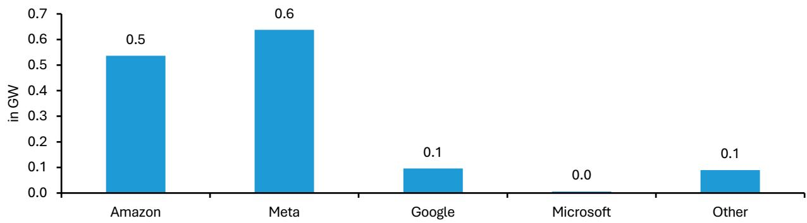

bar chart

| Company | Power Consumption (in GW) |
| :--- | :--- |
| Amazon | 0.5 |
| Meta | 0.6 |
| Google | 0.1 |
| Microsoft | 0.0 |
| Other | 0.1 |

Source: Aterio, Bernstein analysis

## UNDER CONSTRUCTION: GEOGRAPHY

EXHIBIT 49: ERCOT and PJM Have 14 GW and 17 GW of Capacity Under Construction, or \~50% of Total  
Capacity Under Construction by RTO  
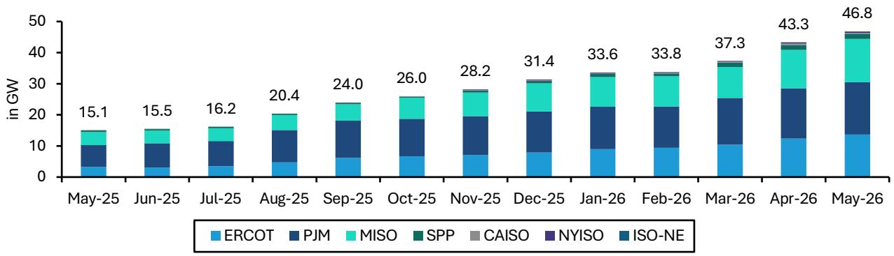

stacked bar chart

| Month    | ERCOT | PJM  | MISO | SPP  | CAISO | NYISO | ISO-NE |
|----------|-------|------|------|------|-------|-------|--------|
| May-25   | 3.0   | 5.0  | 3.0  | 0.0  | 0.0   | 0.0   | 0.0    |
| Jun-25   | 3.0   | 5.0  | 3.0  | 0.0  | 0.0   | 0.0   | 0.0    |
| Jul-25   | 3.0   | 5.0  | 3.0  | 0.0  | 0.0   | 0.0   | 0.0    |
| Aug-25   | 4.0   | 7.0  | 4.0  | 0.0  | 0.0   | 0.0   | 0.0    |
| Sep-25   | 6.0   | 9.0  | 5.0  | 0.0  | 0.0   | 0.0   | 0.0    |
| Oct-25   | 6.0   | 9.0  | 6.0  | 0.0  | 0.0   | 0.0   | 0.0    |
| Nov-25   | 7.0   | 11.0 | 7.0  | 1.0  | 0.0   | 0.0   | 0.0    |
| Dec-25   | 8.0   | 12.0 | 8.0  | 1.0  | 1.0   | 1.0   | 1.4    |
| Jan-26   | 9.0   | 13.0 | 9.0  | 1.0  | 1.0   | 1.0   | 1.6    |
| Feb-26   | 9.0   | 13.0 | 9.0  | 1.0  | 1.0   | 1.0   | 1.8    |
| Mar-26   | 11.0  | 15.0 | 11.0 | 1.0  | 1.0   | 1.0   | 2.3    |
| Apr-26   | 13.0  | 17.0 | 13.0 | 1.0  | 1.0   | 1.0   | 2.8    |
| May-26   | 14.0  | 19.0 | 15.0 | 1.0  | 1.0   | 1.0   | 3.8    |

Source: Aterio, Bernstein analysis

EXHIBIT 50: About 25 GW of Capacity Under Construction Sits in Texas and Virginia  
Capacity Under Construction by Top 10 States  
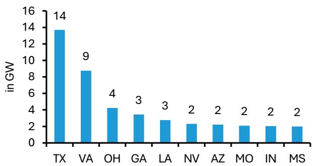

bar chart

| State | Power (in GW) |
| :--- | :--- |
| TX | 14 |
| VA | 9 |
| OH | 4 |
| GA | 3 |
| LA | 3 |
| NV | 2 |
| AZ | 2 |
| MO | 2 |
| IN | 2 |
| MS | 2 |

Source: Aterio, Bernstein analysis

EXHIBIT 51: TX, MO, IA, and VA Saw the Greatest Additions to Capacity Under Construction This Month  
New Capacity Under Construction
This Month  
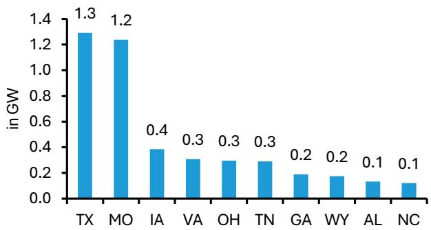

bar chart

| State | Power Consumption (in GW) |
| :--- | :--- |
| TX | 1.3 |
| MO | 1.2 |
| IA | 0.4 |
| VA | 0.3 |
| OH | 0.3 |
| TN | 0.3 |
| GA | 0.2 |
| WY | 0.2 |
| AL | 0.1 |
| NC | 0.1 |

Source: Aterio, Bernstein analysis

EXHIBIT 52: 50% of Construction is Concentrated in Texas, Virginia, Ohio, and Georgia  
Mix of Capacity Under Construction by State  
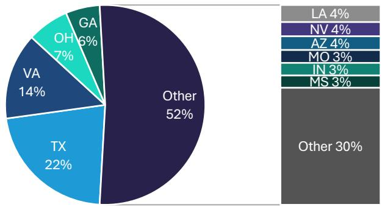

pie chart

| Category | Percentage (%) |
| :--- | :--- |
| Other | 52 |
| TX | 22 |
| VA | 14 |
| OH | 7 |
| GA | 6 |
| LA | 4 |
| NV | 4 |
| AZ | 4 |
| MO | 3 |
| IN | 3 |
| MS | 3 |
| Other | 30 |

Source: Aterio, Bernstein analysis

## STRANDED CAPACITY: CANCELLED, DELAYED OR NOT APPROVED

EXHIBIT 53: In the Last 12 Months, NIMBY Has Caused a Stark Rise in Stranded Capacity Which is Now Up to 34 GW  
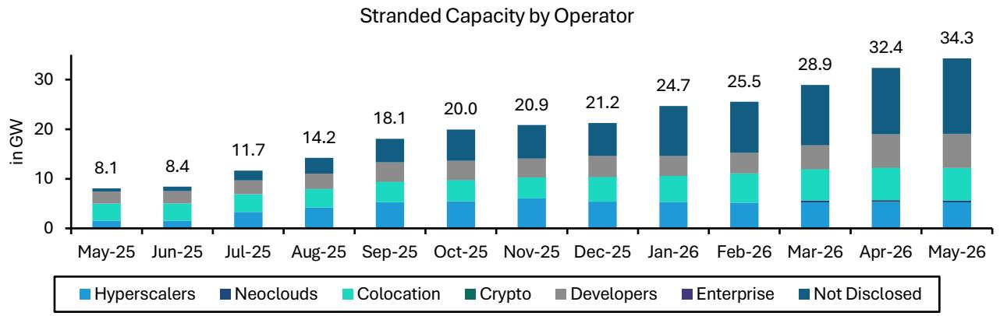

stacked bar chart

| Month    | Hyperscalers | Neoclouds | Colocation | Crypto | Developers | Enterprise | Not Disclosed |
|----------|--------------|-----------|------------|--------|------------|------------|---------------|
| May-25   | 1.0          | 0.5       | 2.0        | 0.5    | 1.0        | 0.0        | 0.0           |
| Jun-25   | 1.0          | 0.5       | 2.0        | 0.5    | 1.0        | 0.0        | 0.0           |
| Jul-25   | 2.0          | 1.0       | 2.0        | 0.5    | 1.0        | 0.0        | 0.0           |
| Aug-25   | 3.0          | 1.5       | 2.0        | 0.5    | 1.0        | 0.0        | 0.0           |
| Sep-25   | 4.0          | 2.0       | 2.0        | 0.5    | 1.0        | 0.0        | 0.0           |
| Oct-25   | 4.0          | 2.0       | 2.0        | 0.5    | 1.0        | 0.0        | 0.0           |
| Nov-25   | 5.0          | 2.5       | 2.0        | 0.5    | 1.0        | 0.0        | 0.0           |
| Dec-25   | 4.0          | 3.0       | 2.0        | 0.5    | 1.0        | 0.0        | 0.0           |
| Jan-26   | 4.0          | 3.5       | 2.0        | 0.5    | 1.0        | 0.0        | 0.0           |
| Feb-26   | 4.0          | 4.0       | 2.0        | 0.5    | 1.0        | 0.0        | 0.0           |
| Mar-26   | 4.0          | 4.5       | 2.0        | 0.5    | 1.0        | 0.0        | 0.0           |
| Apr-26   | 4.0          | 5.0       | 2.0        | 0.5    | 1.0        | 0.0        | 0.0           |
| May-26   | 4.0          | 5.5       | 2.0        | 0.5    | 1.0        | 0.0        | 0.0           |

Source: Aterio, Bernstein analysis

EXHIBIT 54: While Most of These Projects' Developers Haven't Been Public (40%+ Not Disclosed), 40% of The Capacity Has Been Centered in Developers and Colos  
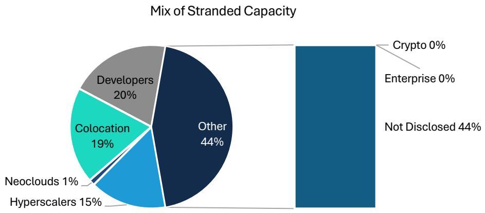

pie chart

Mix of Stranded Capacity
| Category | Percentage (%) |
| :--- | :--- |
| Developers | 20 |
| Colocation | 19 |
| Neoclouds | 1 |
| Hyperscalers | 15 |
| Crypto | 0 |
| Enterprise | 0 |
| Not Disclosed | 44 |

Source: Aterio, Bernstein analysis

EXHIBIT 55: In the LTM, Hyperscalers Are Seeing Less Relative Stranded Capacity  
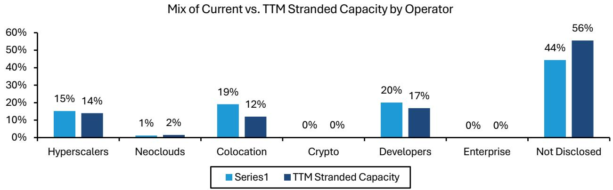

bar chart

Mix of Current vs. TTM Stranded Capacity by Operator
| Operator | Series1 (%) | TTM Stranded Capacity (%) |
| :--- | :--- | :--- |
| Hyperscalers | 15 | 14 |
| Neoclouds | 1 | 2 |
| Colocation | 19 | 12 |
| Crypto | 0 | 0 |
| Developers | 20 | 17 |
| Enterprise | 0 | 0 |
| Not Disclosed | 44 | 56 |

Source: Aterio, Bernstein analysis

## POLITICS OF POWER: TRACKING THE RISE OF "NIMBY"

EXHIBIT 56: 55% of Americans Would Strongly Oppose New Data Center Construction Near Where They Live  
Americans' Attitudes Toward Data Centers  
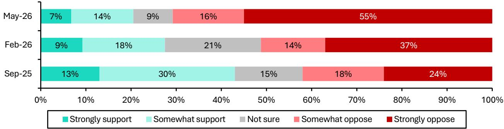

stacked bar chart

| Date | Strongly support (%) | Somewhat support (%) | Not sure (%) | Somewhat oppose (%) | Strongly oppose (%) |
|---|---|---|---|---|---|
| May-26 | 7 | 14 | 9 | 16 | 55 |
| Feb-26 | 9 | 18 | 21 | 14 | 37 |
| Sep-25 | 13 | 30 | 15 | 18 | 24 |

Source: Heatmap Pro, Embold Research, Bernstein analysis

EXHIBIT 57: There Are Currently 19 States Restricting or Considering Restrictions on New Data Center Construction  
States' Legislation Toward New Data Center Construction  
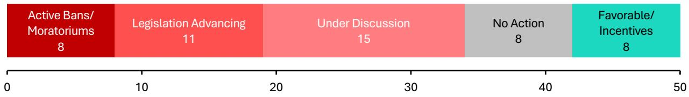

bar chart

| Category | Value |
|---|---|
| Active Bans/Moratoriums | 8 |
| Legislation Advancing | 11 |
| Under Discussion | 15 |
| No Action | 8 |
| Favorable/Incentives | 8 |

Source: DataCenterBans.com, Bernstein analysis

EXHIBIT 58: Individual States' Attitudes Toward New Data Center Construction  
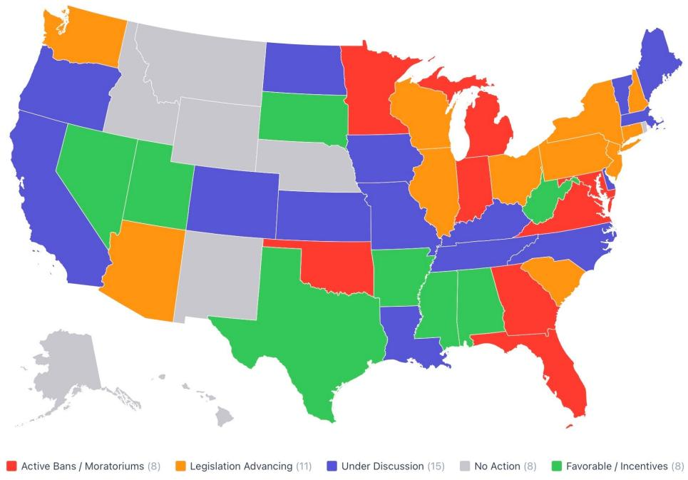

choropleth map

| State | Category |
| --- | --- |
| California | Active Bans / Moratoriums |
| Texas | No Action |
| Florida | Favorable / Incentives |
| New York | Under Discussion |
| Pennsylvania | Under Discussion |
| Illinois | Under Discussion |
| Ohio | Under Discussion |
| Michigan | Active Bans / Moratoriums |
| Georgia | Favorable / Incentives |
| North Carolina | Favorable / Incentives |
| Virginia | Under Discussion |
| Washington | No Action |
| Arizona | Favorable / Incentives |
| Massachusetts | Favorable / Incentives |
| Tennessee | Favorable / Incentives |
| Indiana | Favorable / Incentives |
| Maryland | Favorable / Incentives |
| Missouri | Favorable / Incentives |
| Colorado | Favorable / Incentives |
| Connecticut | Favorable / Incentives |
| Alabama | Favorable / Incentives |
| Louisiana | Favorable / Incentives |
| Kentucky | Favorable / Incentives |
| West Virginia | Favorable / Incentives |
| Maine | Favorable / Incentives |
| New Hampshire | Favorable / Incentives |
| Rhode Island | Favorable / Incentives |
| Montana | Favorable / Incentives |
| Delaware | Favorable / Incentives |
| South Dakota | Favorable / Incentives |
| North Dakota | Favorable / Incentives |
| Oklahoma | Favorable / Incentives |
| Utah | Favorable / Incentives |
| Idaho | Favorable / Incentives |
| Nevada | Favorable / Incentives |
| Minnesota | Favorable / Incentives |
| Iowa | Favorable / Incentives |
| Indiana | Favorable / Incentives |
| Philippines | Favorable / Incentives |
| Michigan | Favorable / Incentives |
| Wisconsin | Favorable / Incentives |
| Minnesota | Favorable / Incentives |
| Kansas | Favorable / Incentives |
| Nebraska | Favorable / Incentives |
| South Dakota | Favorable / Incentives |
| South Carolina | Favorable / Incentives |
| West Virginia | Favorable / Incentives |
| Mississippi | Favorable / Incentives |
| Alabama | Favorable / Incentives |
| Louisiana | Favorable / Incentives |
| Georgia | Favorable / Incentives |
| Florida | Favorable / Incentives |
| Arkansas | Favorable / Incentives |
| Louisiana | Under Discussion |
| Mississippi | Under Discussion |
| Alabama | Under Discussion |
| Louisiana | Under Discussion |
| Georgia | Under Discussion |
| North Carolina | Under Discussion |
| West Virginia | Under Discussion |
| Maine | Under Discussion |
| Vermont | Under Discussion |
| New Hampshire | Under Discussion |
| Maine | Under Discussion |
| Massachusetts | Under Discussion |
| Rhode Island | Under Discussion |
| Connecticut | Under Discussion |
| New Jersey | Under Discussion |
| Delaware | Under Discussion |
| Maryland | Under Discussion |
| Alaska | No Action |
| Hawaii | No Action |
| Hawaii | No Action |
| Hawaii | No Action |
| Hawaii | No Action |
| Hawaii | No Action |
| Hawaii | No Action |
| Hawaii | No Action |
| Hawaii | No Action |
| Hawaii | No Action |
| Hawaii | No Action |
| Hawaii | No Action |
| Hawaii | No Action |
| Hawaii | NoAction |
| Hawaii | No Action |
| Hawaii | No Action |
| Hawaii | No Action |
| Hawaii | No Action |
| Hawaii | No Action |
| Hawaii | No Action |
| Hawaii | No Action |
| Hawaii | No Action |
| Hawaii | No Action |
| Hawaii | No Action |
| Hawaii | No Action |
| Hawaii | No Action |
| Alaska | No Action |
| Hawaii | No Action |
| Hawaii | No Action |
| Hawaii | No Action |
| Hawaii | No Action |
| Hawaii | No Action |
| Hawaii | No Action |
| Hawaii | No Action |
| Hawaii | No Action |
| Hawaii | No Action |
| Hawaii | No Action |
| Hawaii | No Action |
| Hawaii | No Action |
| Hawaii | No Action |
| Hawaii | No Action |
| Hawaii | No Action |
| Hawaii | No Action |
| Hawaii | No Action |
| Hawaii | No Action |
| Hawaii | No Action |
| Hawaii | No Action |
| Hawaii | No Action |
| Hawaii | No Action |
| Hawaii | No Action |
| Hawaii | No Action |
| Alaska | No Action |
| Hawaii | No Action |
| Hawaii | No Action |
| Hawaii | No Action |
| Hawaii | No Action |
| Hawaii | No Action |
| Hawaii | No Action |
| Hawaii | No Action |
| Hawaii | No Action |
| Hawaii | No Action |
| Hawaii | No Action |
| Hawaii | No Action |

Source: DataCenterBans.com

## TRACKING THE RISE IN BEHIND-THE-METER POWER

EXHIBIT 59: Behind The Meter: Only 4% of the Installed Base, But 25% of What's Under Construction, and 40% of The Project Pipeline  
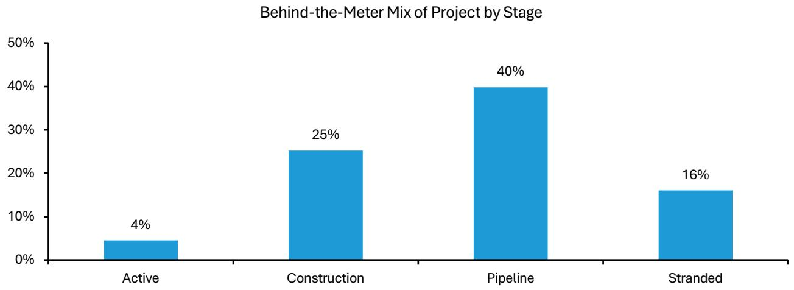

bar chart

Behind-the-Meter Mix of Project by Stage
| Stage | Percentage (%) |
| :--- | :--- |
| Active | 4 |
| Construction | 25 |
| Pipeline | 40 |
| Stranded | 16 |

Stranded capacity = delayed + cancelled + not approved/withdrawn capacity
Source: Aterio, Bernstein analysis

EXHIBIT 60: YTD, BTM Trends Have Remained Largely Consistent, Though the Mix of BTM in Capacity Under Construction Has Gained Greater Share of Mix  
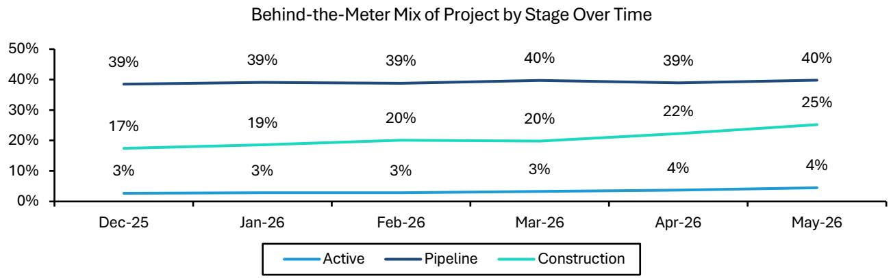

line chart

| Month   | Active | Pipeline | Construction |
|---------|--------|----------|--------------|
| Dec-25  | 3%     | 39%      | 17%          |
| Jan-26  | 3%     | 39%      | 19%          |
| Feb-26  | 3%     | 39%      | 20%          |
| Mar-26  | 3%     | 40%      | 20%          |
| Apr-26  | 4%     | 39%      | 22%          |
| May-26  | 4%     | 40%      | 25%          |

Source: Aterio, Bernstein analysis

EXHIBIT 61: BTM as a % of New Projects Added to Pipeline Every Month: Avergaing 41% Since January, Up to 48% in May. Still Generating Share Gains Relative to Current Share of Active (4%) and Construction (25%)  
Change in BTM Pipeline vs. Change in Total Pipeline  
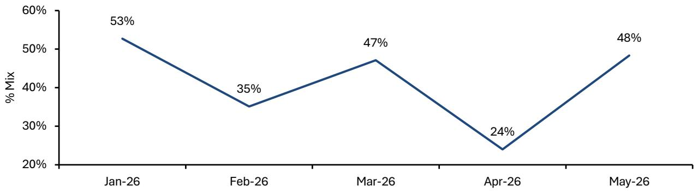

line chart

| Month | % Mix (%) |
|---|---|
| Jan-26 | 53 |
| Feb-26 | 35 |
| Mar-26 | 47 |
| Apr-26 | 24 |
| May-26 | 48 |

Source: Aterio, Bernstein analysis

EXHIBIT 62: There Are 129 GW of BTM Capacity in the Pipeline. The Vast Majority Has Yet to Be Disclosed; Developers Dominate the Known Portion  
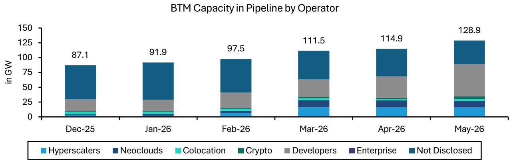

stacked bar chart

| Month    | Hyperscalers | Neoclouds | Colocation | Crypto | Developers | Enterprise | Not Disclosed |
| -------- | ------------ | --------- | ---------- | ------ | ---------- | ---------- | ------------- |
| Dec-25   | 0            | 0         | 0          | 0      | 30         | 0          | 47.1          |
| Jan-26   | 0            | 0         | 0          | 0      | 30         | 0          | 91.9          |
| Feb-26   | 0            | 0         | 0          | 0      | 35         | 0          | 97.5          |
| Mar-26   | 10           | 10        | 5          | 0      | 35         | 0          | 111.5         |
| Apr-26   | 15           | 15        | 5          | 0      | 40         | 0          | 114.9         |
| May-26   | 20           | 20        | 5          | 0      | 50         | 0          | 128.9         |

Source: Aterio, Bernstein analysis

EXHIBIT 63: BTM Represents 64% and 36% of Neocloud and Hyperscaler Pipelines, Respectively (Likely Higher Given Capacity Sitting in “Not Disclosed”)  
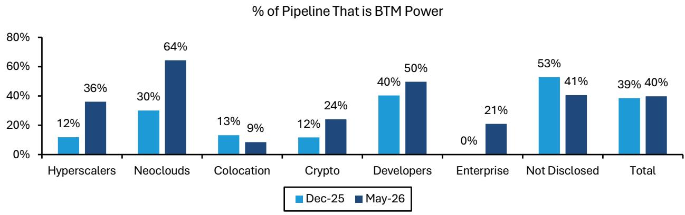

bar chart

% of Pipeline That is BTM Power
| Category | Dec-25 (%) | May-26 (%) |
| :--- | :--- | :--- |
| Hyperscalers | 12 | 36 |
| Neoclouds | 30 | 64 |
| Colocation | 13 | 9 |
| Crypto | 12 | 24 |
| Developers | 40 | 50 |
| Enterprise | 0 | 21 |
| Not Disclosed | 53 | 41 |
| Total | 39 | 40 |

Source: Aterio, Bernstein analysis

EXHIBIT 64: Stargate (SoftBank/OpenAI/Oracle) Has Led The Rise in BTM Power in Pipeline For Hyperscalers (10 GW)  
BTM Capacity in Pipeline by Hyperscaler  
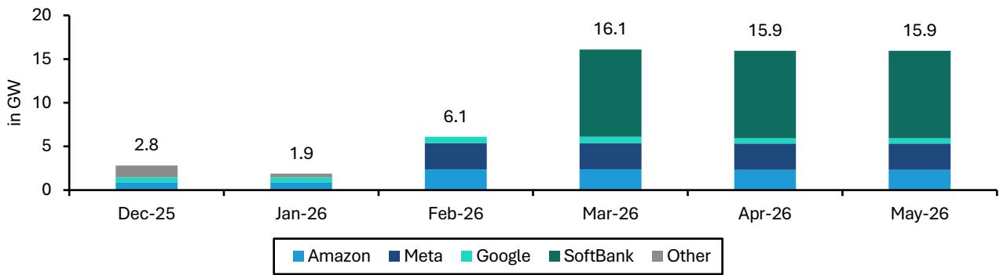

stacked bar chart

| Month    | Amazon | Meta | Google | SoftBank | Other |
| -------- | ------ | ---- | ------ | -------- | ----- |
| Dec-25   | 0.5    | 0.3  | 0.2    | 0.4      | 2.8   |
| Jan-26   | 0.5    | 0.3  | 0.2    | 0.4      | 1.9   |
| Feb-26   | 2.0    | 2.0  | 0.5    | 0.0      | 6.1   |
| Mar-26   | 2.0    | 2.0  | 0.5    | 9.0      | 16.1  |
| Apr-26   | 2.0    | 2.0  | 0.5    | 9.0      | 15.9  |
| May-26   | 2.0    | 2.0  | 0.5    | 9.0      | 15.9  |

Source: Aterio, Bernstein analysis

EXHIBIT 65: There Are Currently 16 GW of BTM Capacity Under Construction, Up 3 GW Month-Over-Month  
BTM Capacity Under Construction by Operator  
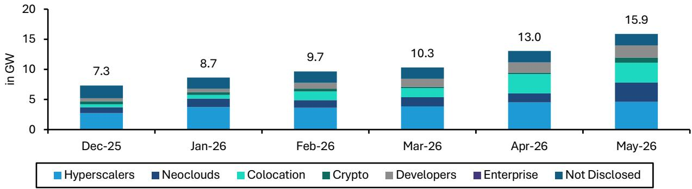

stacked bar chart

| Month    | Hyperscalers | Neoclouds | Colocation | Crypto | Developers | Enterprise | Not Disclosed |
| -------- | ------------ | --------- | ---------- | ------ | ---------- | ---------- | ------------- |
| Dec-25   | 3.0          | 1.0       | 0.5        | 0.5    | 0.5        | 0.5        | 1.0           |
| Jan-26   | 3.5          | 1.0       | 0.5        | 0.5    | 0.5        | 0.5        | 1.0           |
| Feb-26   | 3.5          | 1.0       | 0.5        | 0.5    | 0.5        | 0.5        | 1.0           |
| Mar-26   | 4.0          | 1.0       | 0.5        | 0.5    | 0.5        | 0.5        | 1.0           |
| Apr-26   | 4.5          | 1.0       | 1.0        | 0.5    | 0.5        | 0.5        | 1.0           |
| May-26   | 4.5          | 2.0       | 1.5        | 0.5    | 1.0        | 0.5        | 1.0           |

Source: Aterio, Bernstein analysis

EXHIBIT 66: Meta Owns the Vast Majority of the 4.6 GW of BTM Capacity Under Construction by Hyperscalers  
BTM Capacity Under Construction by Hyperscaler  
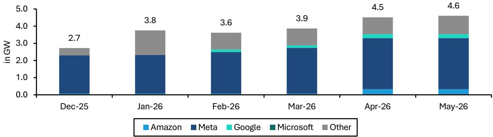

stacked bar chart

| Month   | Amazon | Meta | Google | Microsoft | Other |
|---------|--------|------|--------|-----------|-------|
| Dec-25  |        | 2.3  |        |           | 0.7   |
| Jan-26  |        | 2.3  |        |           | 1.8   |
| Feb-26  |        | 2.4  |        |           | 1.0   |
| Mar-26  |        | 2.7  |        |           | 1.1   |
| Apr-26  | 0.4    | 2.9  |        |           | 1.3   |
| May-26  | 0.4    | 3.1  |        |           | 1.4   |

Source: Aterio, Bernstein analysis

## EXHIBIT 67: Why Are Data Center Operators Choosing BTM Power? Per Crusoe, the Average BTM Data Center Project Can Be Energized in 18 Months vs. Years Via The Traditional Route

Data Center Development - Master Timeline  
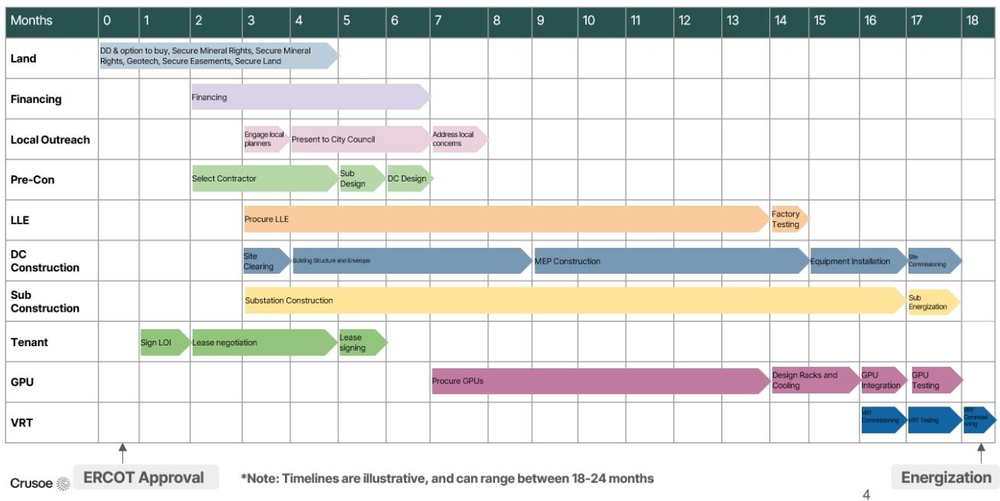

timeline diagram

| Land | DD & option to buy, Secure Mineral Rights, Secure Mineral Rights, Geotech, Secure Easements, Secure Land |  |  |  |  |  |  |  |  |  |  |  |  |  |  |  |  |  |  |  |  |
| --- | --- | --- | --- | --- | --- | --- | --- | --- | --- | --- | --- | --- | --- | --- | --- | --- | --- | --- | --- | --- | --- |
| Financing |  |  |  | Financing |  |  |  |  |  |  |  |  |  |  |  |  |  |  |  |  |  |
| Local Outreach |  |  |  | Engage local planners | Present to City Council |  | Address local concerns |  |  |  |  |  |  |  |  |  |  |  |  |  |  |
| Pre-Con |  |  | Select Contractor | Sub Design | DC Design |  |  |  |  |  |  |  |  |  |  |  |  |  |  |  |  |

Source: Crusoe

## ACTIVE CAPACITY

## ACTIVE CAPACITY BY OPERATOR

EXHIBIT 68: Active Capacity Sits at 48 GW With Hyperscalers (25 GW) and Colos (20GW) Leading the Way  
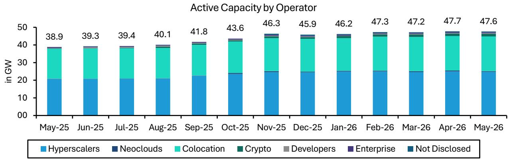

stacked bar chart

| Month    | Hyperscalers | Neoclouds | Colocation | Crypto | Developers | Enterprise | Not Disclosed |
|----------|--------------|-----------|------------|--------|------------|------------|---------------|
| May-25   | 20.0         | 0.0       | 15.0       | 0.0    | 0.0        | 0.0        | 0.0           |
| Jun-25   | 20.0         | 0.0       | 15.0       | 0.0    | 0.0        | 0.0        | 0.0           |
| Jul-25   | 20.0         | 0.0       | 15.0       | 0.0    | 0.0        | 0.0        | 0.0           |
| Aug-25   | 20.0         | 0.0       | 15.0       | 0.0    | 0.0        | 0.0        | 0.0           |
| Sep-25   | 22.0         | 0.0       | 16.0       | 0.0    | 0.0        | 0.0        | 0.0           |
| Oct-25   | 23.0         | 0.0       | 17.0       | 0.0    | 0.0        | 0.0        | 0.0           |
| Nov-25   | 24.0         | 0.0       | 18.0       | 0.0    | 0.0        | 0.0        | 0.0           |
| Dec-25   | 24.0         | 0.0       | 18.0       | 0.0    | 0.0        | 0.0        | 0.0           |
| Jan-26   | 24.0         | 0.0       | 18.0       | 0.0    | 0.0        | 0.0        | 0.0           |
| Feb-26   | 24.0         | 0.0       | 18.0       | 0.0    | 0.0        | 0.0        | 0.0           |
| Mar-26   | 24.0         | 0.0       | 18.0       | 0.0    | 0.0        | 0.0        | 0.0           |
| Apr-26   | 24.0         | 0.0       | 18.0       | 0.0    | 0.0        | 0.0        | 0.0           |
| May-26   | 24.0         | 0.0       | 18.0       | 0.0    | 0.0        | 0.0        | 0.0           |

Source: Aterio, Bernstein analysis

EXHIBIT 69: Hyperscalers and Colos Account For 90%+ of Current Capacity  
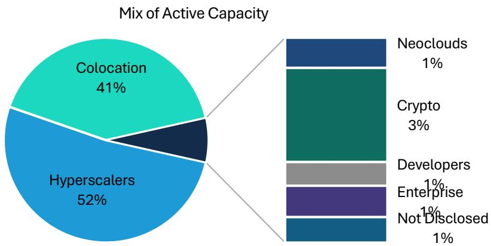

pie chart

Mix of Active Capacity
| Category | Percentage (%) |
| :--- | :--- |
| Colocation | 41 |
| Hyperscalers | 52 |
| Neoclouds | 1 |
| Crypto | 3 |
| Developers | 1 |
| Enterprise | 1 |
| Not Disclosed | 1 |

Source: Aterio, Bernstein analysis

EXHIBIT 70: Hyperscalers and Colos Accounted For \~80% of the 9 GW of New Capacity Added in the Last 12 Months  
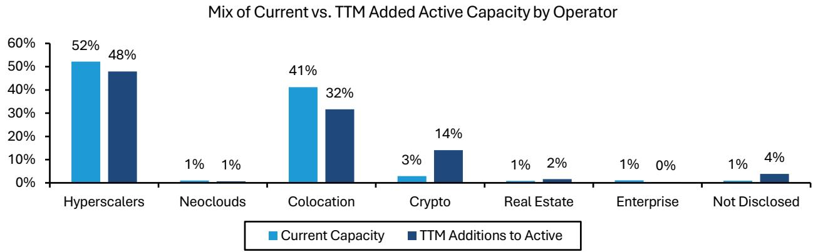

bar chart

Mix of Current vs. TTM Added Active Capacity by Operator
| Operator | Current Capacity (%) | TTM Additions to Active (%) |
| :--- | :--- | :--- |
| Hyperscalers | 52 | 48 |
| Neoclouds | 1 | 1 |
| Colocation | 41 | 32 |
| Crypto | 3 | 14 |
| Real Estate | 1 | 2 |
| Enterprise | 1 | 0 |
| Not Disclosed | 1 | 4 |

Source: Aterio, Bernstein analysis

## ACTIVE CAPACITY BY HYPERSCALERS

EXHIBIT 71: Active Capacity by Hyperscalers is Up to \~25 GW With Amazon (9 GW) Leading the Way. Meta, Google, and Microsoft Each Have \~5 GW Available  
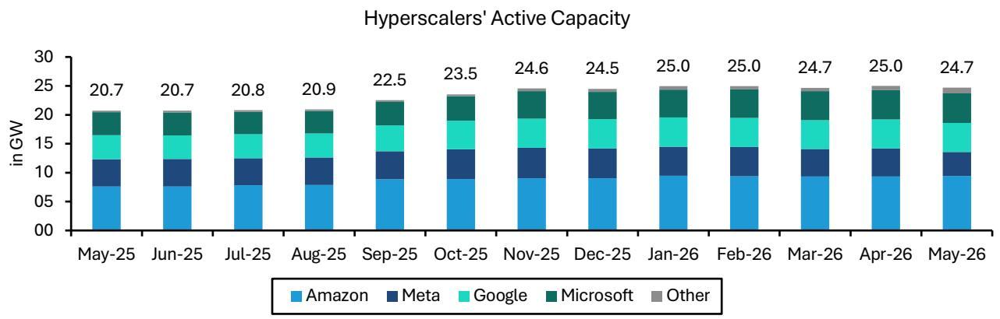

stacked bar chart

| Month    | Amazon | Meta | Google | Microsoft | Other |
| -------- | ------ | ---- | ------ | --------- | ----- |
| May-25   | 8.0    | 5.0  | 4.0    | 3.0       | 0.0   |
| Jun-25   | 8.0    | 5.0  | 4.0    | 3.0       | 0.0   |
| Jul-25   | 8.0    | 5.0  | 4.0    | 3.0       | 0.0   |
| Aug-25   | 8.0    | 5.0  | 4.0    | 3.0       | 0.0   |
| Sep-25   | 9.0    | 5.0  | 4.0    | 3.0       | 0.0   |
| Oct-25   | 9.0    | 5.0  | 4.0    | 3.0       | 0.0   |
| Nov-25   | 9.0    | 5.0  | 4.0    | 3.0       | 0.0   |
| Dec-25   | 9.0    | 5.0  | 4.0    | 3.0       | 0.0   |
| Jan-26   | 9.0    | 5.0  | 4.0    | 3.0       | 0.0   |
| Feb-26   | 9.0    | 5.0  | 4.0    | 3.0       | 0.0   |
| Mar-26   | 9.0    | 5.0  | 4.0    | 3.0       | 0.0   |
| Apr-26   | 9.0    | 5.0  | 4.0    | 3.0       | 0.0   |
| May-26   | 9.0    | 5.0  | 4.0    | 3.0       | 0.0   |

Source: Aterio, Bernstein analysis

EXHIBIT 72: Current Hyperscaler Capacity is Dominated by Amazon. The Other 3 Each Have 20% of the Market  
Mix of Hyperscalers' Active Capacity  
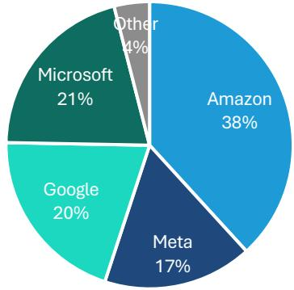

pie chart

| Company | Share (%) |
| :--- | :--- |
| Amazon | 38 |
| Meta | 17 |
| Google | 20 |
| Microsoft | 21 |
| Other | 4 |

Source: Aterio, Bernstein analysis

EXHIBIT 73: Amazon Has Been the Most Aggressive in Adding Capacity in the Last 12 Months Relative to its Current Capacity  
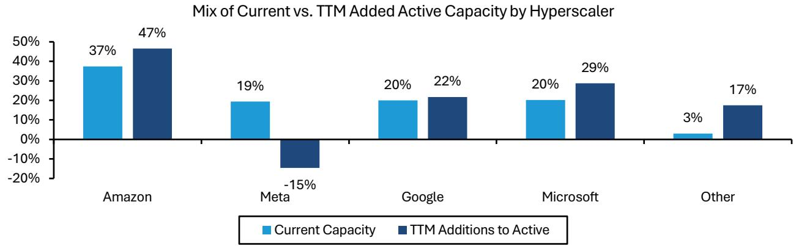

bar chart

Mix of Current vs. TTM Added Active Capacity by Hyperscaler
| Company | Current Capacity (%) | TTM Additions to Active (%) |
| :--- | :--- | :--- |
| Amazon | 37 | 47 |
| Meta | 19 | -15 |
| Google | 20 | 22 |
| Microsoft | 20 | 29 |
| Other | 3 | 17 |

Source: Aterio, Bernstein analysis

## ACTIVE CAPACITY BY GEOGRAPHY

EXHIBIT 74: PJM (Where Virginia Resides) Houses \~40% of All Active Data Center Capacity  
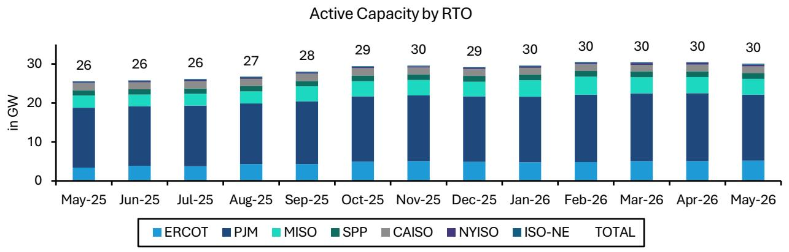

stacked bar chart

| Month    | ERCOT | PJM  | MISO | SPP  | CAISO | NYISO | ISO-NE | TOTAL |
|----------|-------|------|------|------|-------|-------|--------|-------|
| May-25   | 3     | 14   | 3    | 2    | 1     | 1     | 1      | 26    |
| Jun-25   | 3     | 14   | 3    | 2    | 1     | 1     | 1      | 26    |
| Jul-25   | 3     | 14   | 3    | 2    | 1     | 1     | 1      | 26    |
| Aug-25   | 3     | 14   | 3    | 2    | 1     | 1     | 1      | 27    |
| Sep-25   | 3     | 14   | 3    | 2    | 1     | 1     | 1      | 28    |
| Oct-25   | 3     | 14   | 3    | 2    | 1     | 1     | 1      | 29    |
| Nov-25   | 3     | 14   | 3    | 2    | 1     | 1     | 1      | 30    |
| Dec-25   | 3     | 14   | 3    | 2    | 1     | 1     | 1      | 29    |
| Jan-26   | 3     | 14   | 3    | 2    | 1     | 1     | 1      | 30    |
| Feb-26   | 3     | 14   | 3    | 2    | 1     | 1     | 1      | 30    |
| Mar-26   | 3     | 14   | 3    | 2    | 1     | 1     | 1      | 30    |
| Apr-26   | 3     | 14   | 3    | 2    | 1     | 1     | 1      | 30    |
| May-26   | 3     | 14   | 3    | 2    | 1     | 1     | 1      | 30    |

Source: Aterio, Bernstein analysis

EXHIBIT 75: Virginia is the Top State For Active Capacity With 11 GW  
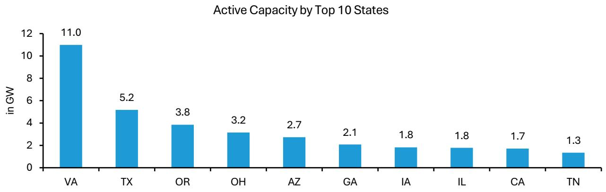

bar chart

| State | Active Capacity (in GW) |
|-------|--------------------------|
| VA    | 11.0                     |
| TX    | 5.2                      |
| OR    | 3.8                      |
| OH    | 3.2                      |
| AZ    | 2.7                      |
| GA    | 2.1                      |
| IA    | 1.8                      |
| IL    | 1.8                      |
| CA    | 1.7                      |
| TN    | 1.3                      |

Source: Aterio, Bernstein analysis

EXHIBIT 76: Virginia Alone Accounts For \~25% of Active Data Center Capacity  
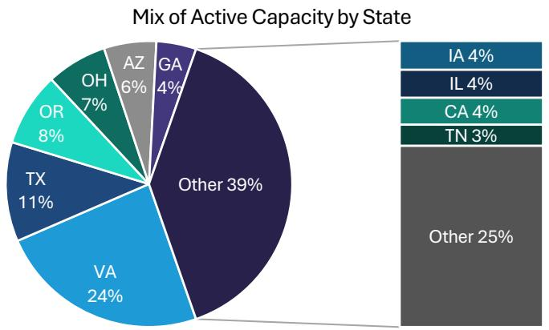

pie chart

Mix of Active Capacity by State
| State | Percentage (%) |
| :--- | :--- |
| IA | 4 |
| IL | 4 |
| CA | 4 |
| TN | 3 |
| Other | 25 |
| VA | 24 |
| TX | 11 |
| OR | 8 |
| OH | 7 |
| AZ | 6 |
| GA | 4 |

Source: Aterio, Bernstein analysis

## I. REQUIRED DISCLOSURES

References to "Bernstein" or the "Firm" in these disclosures relate to the following entities: Bernstein Institutional Services LLC (April 1, 2024 onwards), Bernstein & Co., LLC (pre April 1, 2024), Bernstein Autonomous LLP, BSG France S.A. (April 1, 2024 onwards), Bernstein (Hong Kong) Limited 盛博香港有限公司, Bernstein (Canada) Limited, Bernstein (India) Private Limited (SEBI registration no. INH000006378), Bernstein (Singapore) Private Limited, Bernstein Japan KK (サンフォード・C・バーンスタイン株式会社) and analysts employed by SG Africa Technologies & Services to produce Bernstein under a Global Services Agreement in place between Bernstein and SG.

Bernstein is part of a joint venture between SG (SG) and AllianceBernstein, L.P. (AB). Unless specifically noted otherwise, for purposes of these disclosures, references to Bernstein's “affiliates” relate to both SG and AB and their respective affiliates.

## VALUATION METHODOLOGY

This research publication covers six or more companies. For valuation methodology and other company disclosures:

Please visit: https://bernstein-autonomous.bluematrix.com/sellside/Disclosures.action.

Or, you can also write to the Director of Compliance, Bernstein Institutional Services LLC, 245 Park Avenue, New York, NY 10167.

## RISKS

This research publication covers six or more companies. For risks and other company disclosures:

Please visit: https://bernstein-autonomous.bluematrix.com/sellside/Disclosures.action.

Or, you can also write to the Director of Compliance, Bernstein Institutional Services LLC, 245 Park Avenue, New York, NY 10167.

An associate contributing to this report has a financial interest in the equity or debt securities of Amazon.Com Inc.

An associate contributing to this report has a financial interest in the equity or debt securities of Meta Platforms Inc..

An associate contributing to this report has a financial interest in the equity or debt securities of Alphabet Inc.

## RATINGS DEFINITIONS, BENCHMARKS AND DISTRIBUTION

## EQUITY RATINGS DEFINITIONS

## Bernstein brand

The Bernstein brand rates stocks based on forecasts of relative performance for the next 12 months versus the S&P 500 for stocks listed on the U.S. and Canadian exchanges, versus the Bloomberg Europe Developed Markets Large and Mid Cap Price Return Index EUR (EDME) for stocks listed on the European exchanges and emerging markets exchanges outside of the Asia Pacific region, versus the Bloomberg Japan Large and Mid Cap Price Return Index USD (JPL) for stocks listed on the Japanese exchanges, and versus the Bloomberg Asia ex-Japan Large and Mid Cap Price Return Index (ASIAX) for stocks listed on the Asian (ex-Japan) exchanges -unless otherwise specified.

The Bernstein brand has three categories of ratings:

- Outperform: Stock will outpace the market index by more than 15 pp  
• Market-Perform: Stock will perform in line with the market index to within +/-15 pp  
• Underperform: Stock will trail the performance of the market index by more than 15 pp

Coverage Suspended: Coverage of a company under the Bernstein brand has been suspended. Ratings and price targets are suspended temporarily, are no longer current, and should therefore not be relied upon.

Not Rated: A rating assigned when the stock cannot be accurately valued, or the performance of the company accurately predicted, at the present time. The covering analyst may continue to publish research reports on the company to update investors on events and developments.

Not Covered (NC) denotes companies that are not under coverage.

Bernstein brand stock ratings are based on a 12-month time horizon.

## Autonomous brand – common stocks

The Autonomous brand rates common stocks as indicated below. As our benchmarks we use the Bloomberg Europe 500 Banks And Financial Services Index (BEBANKS) and Bloomberg Europe Dev Mkt Financials Large and Mid Cap Price Ret Index EUR (EDMFI) index for developed European banks and Payments, the Bloomberg Europe 500 Insurance Index (BEINSUR) for European insurers, the S&P 500 and S&P Financials for US banks and Payments coverage, S5LIFE for US Insurance, the S&P Insurance Select Industry (SPSIINS) for US Non-Life Insurers coverage, and the Bloomberg Emerging Markets Financials Large, Mid and Small Cap Price Return Index (EMLSF) for emerging market banks and insurers and Payments. Ratings are stated relative to the sector (not the market).

The Autonomous brand has three categories of common stock ratings:

\- Outperform (OP): Stock will outpace the relevant index by more than 10 pp

\- Neutral (N): Stock will perform in line with the market index to within +/-10 pp

• Underperform (UP): Stock will trail the performance of the relevant index by more than 10 pp

Coverage Suspended: Coverage of a company under the Autonomous research brand has been suspended. Ratings and price targets are suspended temporarily, are no longer current, and should therefore not be relied upon.

Not Rated: A rating assigned when the stock cannot be accurately valued, or the performance of the company accurately predicted, at the present time. The covering analyst may continue to publish research reports on the company to update investors on events and developments.

Those denoted as ‘Feature’ (e.g., Feature Outperform FOP, Feature Under Outperform FUP) are our core ideas.

Not Covered (NC) denotes companies that are not under coverage.

Autonomous brand common stock ratings are based on a 12-month time horizon.

## Autonomous brand – preferred stocks

The Autonomous brand has three categories of preferred stock ratings:

- Outperform (OP): The total return of the preferred instrument is expected to outperform preferred securities of other issuers operating in similar sectors or rating categories over the next six months.  
- Neutral (N): The total return of the preferred instrument is expected to perform in line with preferred securities of other issuers operating in similar sectors or rating categories over the next six months.  
- Underperform (UP): The total return of the preferred instrument is expected to underperform preferred securities of other issuers operating in similar sectors or rating categories over the next six months.

Autonomous preferred stock ratings are based on a 6-month time horizon.

## AUTONOMOUS CREDIT RESEARCH

Where this report contains investment recommendations for credit instruments, as defined in article 3(1)(35) of the Market Abuse Regulation, the information below is presented to comply with its disclosure requirements.

The report may also include reference(s) to published opinions by other Autonomous or Bernstein analysts covering the equity securities of the issuer(s) referenced herein. Please note an investment recommendation for credit instruments published by the author(s) of this report may differ from the published view of the analyst covering equity securities for the issuer(s) contained in this report and vice versa.

## CREDIT RATINGS DEFINITIONS

The Autonomous brand has three categories of credit ratings:

- Credit Outperform (C-OP): The total return of the Reference Credit Instrument is expected to outperform the credit spread of bonds of other issuers operating in similar sectors or rating categories over the next six months.  
- Credit Neutral (C-N): The total return of the Reference Credit Instrument is expected to perform in line with the credit spread of bonds of other issuers operating in similar sectors or rating categories over the next six months.  
- Credit Underperform (C-UP): The total return of the Reference Credit Instrument is expected to underperform the credit spread of bonds of other issuers operating in similar sectors or rating categories over the next six months.

Autonomous credit ratings are based on a 6-month time horizon.

A list of all investment recommendations produced by the author(s) of this report alongside credit ratings history are available upon request.

It is at the sole discretion of the Firm as to when to initiate, update and cease research coverage. The Firm has established, maintains and relies on information barriers to control the flow of information contained in one or more areas (i.e. the private side) within the Firm, and into other areas, units, groups or affiliates (i.e. public side) of the Firm

DISTRIBUTION OF EQUITY RATINGS/INVESTMENT BANKING SERVICES

<table><tr><td>Equity Rating</td><td>Market Abuse Regulation (MAR) and FINRA Rating Category</td><td>Global Rating Distribution</td><td>Investment Banking Relationships*</td></tr><tr><td>Outperform</td><td>BUY</td><td>51.1%</td><td>16.5%</td></tr><tr><td>Market-Perform (Bernstein Brand) Neutral (Autonomous Brand)</td><td>HOLD</td><td>36.3%</td><td>17.8%</td></tr><tr><td>Underperform</td><td>SELL</td><td>12.6%</td><td>14.9%</td></tr></table>

\* These figures represent the percentage of companies within each equity rating category for which affiliates of Bernstein have provided investment banking services within the previous 12 months.  
As of March 31, 2026. All figures are updated quarterly.

Prior to April 1, 2024, Bernstein & Co., LLC. issued the ratings and price target information in the graph(s) below for the following companies: Caterpillar Inc, Cummins Inc, Jacobs Solutions Inc, Oshkosh Corp, Quanta Services Inc, Trimble Inc, United Rentals Inc, NVIDIA Corp, Broadcom Inc, Advanced Micro Devices Inc, Intel Corp, Amazon.Com Inc, Meta Platforms Inc., Alphabet Inc, Microsoft Corp and Oracle Corp.

## PRICE CHARTS/ RATINGS AND PRICE TARGET HISTORY

This research publication covers six or more companies. For price chart and other company disclosures, please visit https://bernstein-autonomous.bluematrix.com/sellside/Disclosures.action or you can write to the Director of Compliance, Bernstein Institutional Services LLC, 245 Park Avenue, New York, NY 10167.

## CONFLICTS OF INTEREST

SG and/or its affiliate.s is acting as Joint Bookrunner for Alphabet Inc's bond issue (EUR, 3, 6, 9, 13, 19, 39Y).

SG and/or an affiliate(s) acted as Joint Global Coordinator and Joint deal manager in Schneider's convertible bond issue (EUR 800m, 8Y)

All statements in this report attributable to Gartner represent Bernstein's interpretation of data, research opinion or viewpoints published as part of a syndicated subscription service by Gartner, Inc., and have not been reviewed by Gartner. Each Gartner publication speaks as of its original publication date (and not as of the date of this report). The opinions expressed in Gartner publications are not representations of fact, and are subject to change without notice.

Gautam Chhugani and Stacy A. Rasgon maintains long positions in various crypto currencies.

AB and/or its affiliates beneficially own 1% or more of a class of common equity securities of the following companies: Eaton Corp PLC, Oshkosh Corp, United Rentals Inc, Prysmian SpA and Core Scientific Inc.

Bernstein Autonomous LLP or BSG France SA, beneficially, has either a net long or short position of 0.5% or more of the total issued share capital of a class of common equity securities of the following MiFID eligible securities: Eaton Corp PLC, Oshkosh Corp, Quanta Services Inc, United Rentals Inc, Broadcom Inc, Digital Realty Trust, Inc., Meta Platforms Inc., Alphabet Inc, Prysmian SpA, Core Scientific Inc, Trane Technologies PLC and Carrier Global Corporation.

SG and/or its affiliates beneficially own 1% or more of a class of common equity securities of the following companies: Prysmian SpA, Cipher Digital Inc and Riot Platforms Inc.

Bernstein and/or affiliates have received compensation for investment banking services in the past twelve months from Caterpillar Inc, Legence Corp., CoreWeave, Inc., Amazon.Com Inc, Alphabet Inc, Schneider Electric SA, Siemens AG, Legrand SA and Microsoft Corp.

An affiliate of Bernstein has received compensation for non-investment banking securities-related products or services in the previous twelve months from the following clients: Caterpillar Inc, Equinix, Inc., CoreWeave, Inc., Siemens AG, Prysmian SpA and Microsoft Corp.

Bernstein and/or affiliates have received compensation for non-investment banking securities-related products or services in the previous twelve months from the following clients: Caterpillar Inc, Cummins Inc, Legence Corp., Intel Corp, Equinix, Inc., CoreWeave, Inc., Amazon.Com Inc, Alphabet Inc, Schneider Electric SA, Siemens AG, ABB Ltd, Legrand SA, Siemens Energy AG, Microsoft Corp and Carrier Global Corporation.

Bernstein has received compensation for non-investment banking securities-related products or services in the previous twelve months from the following clients: NVIDIA Corp and Microsoft Corp.

Bernstein and/or affiliates expect to receive or intend to seek compensation for investment banking services in the next three months from Caterpillar Inc, Legence Corp., CoreWeave, Inc., Amazon.Com Inc, Alphabet Inc, Schneider Electric SA and Legrand SA.

Bernstein and/or affiliates had an investment banking client relationship during the past twelve months with Caterpillar Inc, Legence Corp., CoreWeave, Inc., Amazon.Com Inc, Alphabet Inc, Schneider Electric SA, Siemens AG, Legrand SA and Microsoft Corp.

Certain affiliates of Bernstein act as market maker or liquidity provider in the equities securities of: Caterpillar Inc, Cummins Inc, Eaton Corp PLC, Hubbell Incorporated, Oshkosh Corp, Quanta Services Inc, Trimble Inc, United Rentals Inc, NVIDIA Corp, Broadcom Inc, Advanced Micro Devices Inc, Intel Corp, Amazon.Com Inc, Meta Platforms Inc., Alphabet Inc, Ferguson Enterprises Inc., Schneider Electric SA, Siemens AG, ABB Ltd, Legrand SA, Siemens Energy AG, Prysmian SpA, Microsoft Corp, Oracle Corp, Cipher Digital Inc, TeraWulf Inc, Vertiv Holdings Co, nVent Electric PLC, Trane Technologies PLC, Johnson Controls International PLC and Carrier Global Corporation.

Certain affiliates of Bernstein act as market maker or liquidity provider in the debt securities of: Caterpillar Inc, Cummins Inc, Eaton Corp PLC, Broadcom Inc, Intel Corp, Equinix, Inc., Amazon.Com Inc, Meta Platforms Inc., Alphabet Inc, Schneider Electric SA, Siemens AG, Legrand SA, Siemens Energy AG, Oracle Corp, Riot Platforms Inc and Carrier Global Corporation.

Affiliates of Bernstein managed or co-managed in the past twelve months a public offering of securities of Caterpillar Inc, Legence Corp., CoreWeave, Inc., Amazon.Com Inc, Alphabet Inc, Schneider Electric SA and Legrand SA.

## OTHER MATTERS

The legal entity(ies) employing the analyst(s) listed in this report, and their location, can be determined by the country code of their phone number, as follows:

+1 Bernstein Institutional Services LLC; New York, New York, USA

+44 Bernstein Autonomous LLP; London UK

+212 SG Africa Technologies & Services; Casablanca, Morocco

+33 BSG France S.A.; Paris, France  
+34 BSG France S.A.; Madrid, Spain  
+41 Bernstein Autonomous LLP; Geneva, Switzerland  
+49 BSG France S.A.; Frankfurt, Germany  
+91 Bernstein (India) Private Limited; Mumbai, India  
+852 Bernstein (Hong Kong) Limited 盛博香港有限公司; Hong Kong, China  
+65 Bernstein (Singapore) Private Limited; Singapore  
+81 Bernstein Japan KK; Tokyo, Japan

Where this report has been prepared by research analyst(s) employed by a non-US affiliate, such analyst(s), is/are (unless otherwise expressly noted below) not registered as associated persons of Bernstein Institutional Services LLC or any other SEC-registered broker-dealer and are not licensed or qualified as research analysts with FINRA. Accordingly, such analyst(s) may not be subject to FINRA's restrictions regarding (among other things) communications by research analysts with a subject company, interactions between research analysts and investment banking personnel, participation by research analysts in solicitation and marketing activities relating to investment banking transactions, public appearances by research analysts, and trading securities held by a research analyst account.

Where this report has been prepared by research analyst(s) employed by SG Africa Technologies & Services (part of the SG group of companies), it has been prepared on behalf of a Bernstein company under a Global Services Agreement in place between Bernstein and SG.

## CERTIFICATION

Each research analyst listed in this report, who is primarily responsible for the preparation of the content of this report, certifies that all of the views expressed in this publication accurately reflect that analyst's personal views about any and all of the subject securities or issuers and that no part of that analyst's compensation was, is, or will be, directly or indirectly, related to the specific recommendations or views in this publication.

## II. ADDITIONAL GLOBAL CONFLICT DISCLOSURES

It is at the sole discretion of the Firm as to when to initiate, update and cease research coverage. The Firm has established, maintains and relies on information barriers to control the flow of information contained in one or more areas (i.e., the private side) within the Firm, and into other areas, units, groups or affiliates (i.e., public side) of the Firm.

## III. OTHER IMPORTANT INFORMATION AND DISCLOSURES

Separate branding is maintained for “Bernstein” and “Autonomous” research products.

- Bernstein produces a number of different types of research products including, among others, fundamental analysis and quantitative analysis under both the “Autonomous” and “Bernstein” brands. Recommendations contained within one type of research product may differ from recommendations contained within other types of research products, whether as a result of differing time horizons, methodologies or otherwise. Furthermore, views or recommendations within a research product issued under one brand may differ from views or recommendations under the same type of research product issued under the other brand. The Research Ratings System for the two brands and other information related to those Rating Systems are included in the previous section.  
- Autonomous operates as a separate business unit within the following entities: Bernstein Institutional Services LLC, Bernstein Autonomous LLP, Bernstein (Hong Kong) Limited 盛博香港有限公司 and Bernstein (India) Private Limited. For information relating to “Autonomous” branded products (including certain Sales materials) please visit: www.autonomous.com. For information relating to Bernstein branded products please visit: www.bernsteinresearch.com.

Analysts are compensated based on aggregate contributions to the research franchise as measured by account penetration, productivity and proactivity of investment ideas. No analysts are compensated based on performance in, or contributions to, generating investment banking revenues.

This report has been produced by an independent analyst as defined in Article 3 (1)(34)(i) of EU 596/2014 Market Abuse Regulation (“MAR”) and the same article of MAR as it forms part of United Kingdom domestic law by virtue of the European Union (Withdrawal) Act 2018.

To our readers in the United States: Bernstein Institutional Services LLC, a broker-dealer registered with the U.S. Securities and Exchange Commission (“SEC”) and a member of the U.S. Financial Industry Regulatory Authority, Inc. (“FINRA”) is distributing this publication in the United States and accepts responsibility for its contents. Where this material contains an analysis of debt product(s), such material is intended only for institutional investors and is not subject to the US independence and disclosure standards applicable to debt research prepared for retail investors.

Bernstein Institutional Services LLC may act as principal for its own account or as agent for another person (including an affiliate) in sales or purchases of any security which is a subject of this report. This report does not purport to meet the objectives or needs of any specific individuals, entities or accounts.

To our readers in Canada: If this publication pertains to a Canadian domiciled company, it is being distributed in Canada by Bernstein (Canada) Limited, which is licensed and regulated by the Canadian Investment Regulatory Organization. If the publication pertains to a non-Canadian domiciled company, it is being distributed by Bernstein Institutional Services LLC, which is licensed and regulated by both the SEC and FINRA, into Canada under the International Dealers Exemption.

This document may not be passed onto any person in Canada unless that person qualifies as "permitted client" as defined in Section 1.1 of NI 31-103.

To our readers in Brazil: This report has been prepared by Bernstein Institutional Services LLC, and Banco BTG Pactual S.A. ("BTG") is responsible for the distribution of this report in Brazil.

To readers in the United Kingdom: This publication has been issued or approved for issue in the United Kingdom by Bernstein Autonomous LLP, authorised and regulated by the Financial Conduct Authority and located at 60 London Wall, London EC2M 5SH, +44 (0)20-7170-5000. Registered in England & Wales No OC343985.

This document is for distribution only to persons who (i) have professional experience in matters relating to investments falling within Article 19(5) of the Financial Services and Markets Act 2000 (Financial Promotion) Order 2005 (as amended, the “Financial Promotion Order”), (ii) are persons falling within Article 49(2)(a) to (d) (“high net worth companies, unincorporated associations, etc.”) of the Financial Promotion Order, (iii) are outside the United Kingdom, or (iv) are persons to whom an invitation or inducement to engage in investment activity (within the meaning of section 21 of the FSMA) in connection with the issue or sale of any securities may otherwise lawfully be communicated or caused to be communicated (all such persons together being referred to as “relevant persons”). This document is directed only at relevant persons and must not be acted on or relied on by persons who are not relevant persons. Any investment or investment activity to which this document relates is available only to relevant persons and will be engaged in only with relevant persons.

To our readers in the member states of the EEA: This publication is being distributed by BSG France SA, which is authorised and regulated by the Autorité de Contrôle Prudentiel et de Résolution (ACPR) and Autorité des Marchés Financiers (AMF).

To our readers in Hong Kong: This publication is being distributed in Hong Kong by Bernstein (Hong Kong) Limited 盛博香港有限公司, which is licensed and regulated by the Hong Kong Securities and Futures Commission (Central Entity No. AXC846) to carry out Type 4 (Advising on Securities) regulated activities and subject to the licensing conditions mentioned in the SFC Public Register (https://www.sfc.hk/publicregWeb/corp/AXC846/details)). This publication is solely for professional investors, as defined in the Securities and Futures Ordinance (Cap. 571). The purpose of this report is solely to provide an analysis of the issuers referred to in this report and is not intended for any purpose contrary to the laws of Hong Kong.

To our readers in Singapore: This publication is being distributed in Singapore by Bernstein (Singapore) Private Limited, only to accredited investors or institutional investors, as defined in the Securities and Futures Act 2001 of Singapore ("SFA"). Recipients in Singapore should contact Bernstein (Singapore) Private Limited in respect of matters arising from, or in connection with, this publication. Bernstein (Singapore) Private Limited is regulated by the Monetary Authority of Singapore and licensed under the SFA as a capital markets services licence holder for dealing in capital markets products that are securities and collective investment schemes and an exempt financial adviser for advising on, issuing and promulgating analyses and reports on securities. Bernstein (Singapore) Private Limited is registered in Singapore with Company Registration No. 20213710W and located at One Raffles Quay, #27-11 South Tower, Singapore 048583, +65-6230-4612.

To our readers in the People's Republic of China: The securities referred to in this document are not being offered or sold and may not be offered or sold, directly or indirectly, in the People's Republic of China (for such purposes, not including the Hong Kong and Macau Special Administrative Regions or Taiwan, the "PRC") in contravention of any applicable laws of the PRC.

This document does not constitute an offer to sell or the solicitation of an offer to buy any securities in the PRC to any person to whom it is unlawful to make the offer or solicitation in the PRC.

We do not represent that this document may be lawfully distributed, or that any securities may be lawfully offered, in compliance with any applicable registration or other requirements in the PRC, or pursuant to an exemption available thereunder, or assume any responsibility for facilitating any such distribution or offering. In particular, no action has been taken by us which would permit a public offering of any securities or distribution of this document in the PRC. Accordingly, the securities are not being offered or sold within the PRC by means of this document or any other document. Neither this document nor any advertisement or other offering material may be distributed or published in the PRC, except under circumstances that will result in compliance with any applicable laws and regulations.

To our readers in Japan: This publication is being distributed in Japan by Bernstein Japan KK (サンフォード・C・バーンスタイン株式会社), which is registered in Japan as a Financial Instruments Business Operator with the Kanto Local Finance Bureau (registration number: The Director-General of Kanto Local Finance Bureau (FIBO) No.3387) and regulated by the Financial Services Agency. It is also a member of Japan Investment Advisers Association. This publication is solely for qualified institutional investors in Japan only, as defined in Article 2, paragraph (3), items (i) of the Financial Instruments and Exchange Act.

For the institutional client readers in Japan who have been granted access to the Bernstein website by Daiwa Group Inc. ("Daiwa"), your access to this document should not be construed as meaning that Bernstein is providing you with investment advice for any purposes. Whilst Bernstein has prepared this document, your relationship is, and will remain with, Daiwa, and Bernstein has neither any contractual relationship with you nor any obligations towards you.

To our readers in Australia: Bernstein (Hong Kong) Limited 盛博香港有限公司 is responsible for distributing research in Australia. It is regulated by the Securities and Exchange Commission under U.S. laws, by the Financial Conduct Authority under U.K. laws, which differs from Australian laws. Bernstein (Hong Kong) Limited 盛博香港有限公司 is exempt from the requirement to hold an Australian financial services license under the Corporations Act 2001 in respect of the provision of the following financial services to wholesale clients:

• providing financial product advice;  
• dealing in a financial product;  
• making a market for a financial product; and  
• providing a custodial or depository service.

To our readers in India: This publication is being distributed in India by Bernstein (India) Private Limited (SCB India) which is licensed and regulated by Securities and Exchange Board of India ("SEBI") as a research analyst entity under the SEBI (Research Analyst) Regulations, 2014, having registration no. INH000006378 and as a stock broker having registration no. INZ000213537. SCB India is currently engaged in the business of providing research and stock broking services. Please refer to www.bernsteinresearch.in for more information.

- SCB India is a Private limited company incorporated under the Companies Act, 2013, on April 12, 2017 bearing corporate identification number U65999MH2017FTC293762, and registered office at Level 3A, 4th Floor, First International Financial Centre, Plot Nos C-54 and C-55, G Block, Near CBI Office, Bandra Kurla Complex, Bandra (East), Mumbai 400098, Maharashtra, India (Phone No: +91-22-68421401).  
- For details of Associates (i.e., affiliates/group companies) of SCB India, kindly email MUM-BERNSTEIN-InCompliance@bernsteinsg.com.  
• SCB India does not have any disciplinary history as on the date of this report.  
- Except as noted above, SCB India and/or its Associates (i.e., affiliates/group companies), the Research Analysts authoring this report, and their relatives

• do not have any financial interest in the subject company  
• do not have actual/beneficial ownership of one percent or more in securities of the subject company;  
• is not engaged in any investment banking activities for Indian companies, as such;  
• have not managed or co-managed a public offering in the past twelve months for any Indian companies;

- have not received any compensation for investment banking services or merchant banking services from the subject company in the past 12 months;  
• have not received compensation for brokerage services from the subject company in the past twelve months;  
- have not received any compensation or other benefits from the subject company or third party related to the specific recommendations or views in this report; and  
- do not currently, but may in the future, act as a market maker in the financial instruments of the companies covered in the report.  
• do not have any conflict of interest in the subject company as of the date of this report.

\- Except as noted above, the subject company has not been a client of SCB India during twelve months preceding the date of distribution of this research report. Neither SCB India nor its Associates (i.e., affiliates/group companies) have received compensation for products or services other than investment banking, merchant banking or brokerage services from the subject company in the past twelve months.

\- The principal research analyst(s) who prepared this report, members of the analysts' team, and members of their households are not an officer, director, employee or advisory board member of the companies covered in the report.

\- Our Compliance officer / Grievance officer is Ms. Rupal Talati, who can be reached at +91-22-68421451, or MUM-BERNSTEIN-InCompliance@bernsteinsg.com / Scbin-investorgrievance@bernsteinsg.com

\- The Research investor charter and Terms & Conditions of SCB India are available on its website and may be accessed at Bernstein (India) Private Limited (https://bernsteinresearch.in/) for your reference.

\- Disclaimer: Registration granted by SEBI, and certification from NISM, is in no way a guarantee of performance of the intermediary or provide any assurance of returns to investors. Investments in securities market are subject to market risks. Read all the related documents carefully before investing.

To our readers in Switzerland: This document is provided in Switzerland by or through Bernstein Autonomous LLP, and is provided only to qualified investors as defined in article 10 of the Swiss Collective Investment Scheme Act (“CISA”) and related provisions of the Collective Investment Scheme Ordinance and in strict compliance with applicable Swiss law and regulations. The products mentioned in this document may not be suitable for all types of investors. This document is based on the Directives on the Independence of Financial Research issued by the Swiss Bankers Association (SBA) in January 2008.

To our readers in the Middle East: Bernstein Autonomous LLP, DIFC branch has its principal office at Gate Village 06, DIFC, Dubai, UAE. Bernstein Autonomous LLP, DIFC branch is regulated by the Dubai Financial Services Authority (DFSA) with the registration number CL10040 and is provisioned for Arranging Deals in Investments and Advising on Financial Products. All communications and services are directed at Professional Clients and Market Counterparties only (as defined in the DFSA rulebook). Persons other than Professional Clients and Market Counterparties, such as Retail Clients, are not the intended recipients of our communications or services.

## LEGAL

All research publications are disseminated to our clients through posting on the firm's password protected websites, bernsteinresearch.com and autonomous.com. Certain, but not all, research publications are also made available to clients through third-party vendors or redistributed to clients through alternate electronic means as a convenience.

This publication has been published and distributed in accordance with the Firm's policy for management of conflicts of interest in investment research, a copy of which is available from Bernstein Institutional Services LLC, Director of Compliance, 245 Park Avenue, New York, NY 10167. Additional disclosures and information regarding Bernstein's business are available on our website www.bernsteinresearch.com.

The securities described herein may not be eligible for sale in all jurisdictions or to certain categories of investors where that permission profile is not consistent with the licenses held by the entities noted herein. This document is for distribution only as may be permitted by law. This publication is not directed to, or intended for distribution to or use by, any person or entity who is a citizen or resident of, or located in any locality, state, country or other jurisdiction where such distribution, publication, availability or use would be contrary to law or regulation or which would subject any of the entities referenced herein or any of their subsidiaries or affiliates to any registration or licensing requirement within such jurisdiction. This publication is based upon public sources we believe to be reliable, but no representation is made by us that the publication is accurate or complete. We do not undertake to advise you of any change in the reported information or in the opinions herein. This publication was prepared and issued by entity referred to herein for distribution to eligible counterparties or professional clients. This publication is not an offer to buy or sell any security, and it does not constitute investment, legal or tax advice. The investments referred to herein may not be suitable for you. Investors must make their own investment decisions in consultation with their professional advisors in light of their specific circumstances. The value of investments may fluctuate, and investments that are denominated in foreign currencies may fluctuate in value as a result of exposure to exchange rate movements. Information about past performance of an investment is not necessarily a guide to, indicator of, or assurance of, future performance.

This report is directed to and intended only for our clients who are “eligible counterparties”, “professional clients”, “institutional investors” and/or “professional investors” as defined by the aforementioned regulators, and must not be redistributed to retail clients as defined by the aforementioned regulators. Retail clients who receive this report should note that the services of the entities noted herein are not available to them and should not rely on the material herein to make an investment decision. The result of such act will not hold the entities noted herein liable for any loss thus incurred as the entities noted herein are not registered/authorised/licensed to deal with retail clients and will not enter into any contractual agreement/arrangement with retail clients. This report is provided subject to the terms and conditions of any agreement that the clients may have entered into with the entities noted herein. All research reports are disseminated on a simultaneous basis to eligible clients through electronic publication to our client portal.

The information in this report was prepared by Bernstein solely for the internal business use of our clients. Clients may store, display, analyze, reformat and print the information in this report for this limited use only. Clients may not copy, alter, create derivative works, resell, reverse engineer, commercially exploit, share or distribute any part of the information contained herein for any purpose without Bernstein's express written consent. These restrictions include extracting data or using the content to develop indices or other products. Further, you may not use this report, or any portion of this report, to train or finetune any third-party machine learning or artificial intelligence system, or as a prompt or input into any such system. You also may not, without Bernstein's express written consent, do any of the foregoing in connection with your own internal machine learning or artificial intelligence system.

Bernstein may use artificial intelligence tools in the preparation of its materials. Any such materials are reviewed by Bernstein's research analysts prior to publication.

This report has been prepared for information purposes only and is based on current public information that we consider reliable, but the entities noted herein do not warrant or represent (express or implied) as to the sources of information or data contained herein are accurate, complete, not misleading or as to its fitness for the purpose intended even though the entities noted herein rely on reputable or trustworthy data providers, it should not be relied upon as such. Opinions expressed are the author(s)' current opinions as of the date appearing on the material only and we do not undertake to advise you of any change in the reported information or in the opinions herein.

Any references to SG herein are purely factual, based upon publicly available information, and included for comparative purposes only. They do not constitute an opinion or recommendation with respect to the securities of SG.

This publication was prepared and issued by the entity referred to herein for distribution to eligible counterparties or professional clients. The information in this report is intended for general circulation and does not constitute an offer to buy or sell any security, investment, legal or tax advice nor a personal recommendation, as defined by any of the aforementioned regulators. It does not take into account the particular investment objectives, financial situations, or needs of individual investors. The report has not been reviewed by any of the aforementioned regulators and does not represent any official recommendation from the aforementioned regulators. The investments referred to herein may not be suitable for you. Investors must make their own investment decisions in consultation with advice sought from a financial adviser regarding the suitability of the investment product, taking into account the specific investment objectives, financial situation or particular needs of any recipient of the recommendation, before the recipient makes a commitment to purchase the investment product.

The analysis contained herein is based on numerous assumptions. Different assumptions could result in materially different results. The information in this report does not constitute, or form part of, any offer to sell or issue, or any offer to purchase or subscribe for shares, or to induce engagement in any other investment activity. The value of any securities or financial instruments mentioned in this report may fluctuate subject to market conditions. Information about past performance of an investment is not necessarily a guide to, indicative of, or assurance of future performance. Estimates of future performance mentioned by the research analyst in this report are based on assumptions that may not be realized due to unforeseen factors like market volatility/fluctuation. In relation to securities or financial instruments denominated in a foreign currency other than the clients' home currency, movements in exchange rates will have an effect on the value, either favorable or unfavorable. Before acting on any recommendations in this report, recipients should consider the appropriateness of investing in the subject securities or financial instruments mentioned in this report and, if necessary, seek independent professional advice.

The securities described herein may not be eligible for sale in all jurisdictions or to certain categories of investors where that permission profile is not consistent with the licenses held by the entities noted herein. This document is for distribution only as may be permitted by law. It is not directed to, or intended for distribution to or use by, any person or entity who is a citizen or resident of or located in any locality, state, country or other jurisdiction where such distribution, publication, availability or use would be contrary to law or regulation or would subject the entities noted herein to any regulation or licensing requirement within such jurisdiction.

Source: Bloomberg Index Services Limited. BLOOMBERG® is a trademark and service mark of Bloomberg Finance L.P. and its affiliates (collectively “Bloomberg”). Bloomberg or Bloomberg’s licensors own all proprietary rights in the Bloomberg Indices. Neither Bloomberg nor Bloomberg’s licensors approves or endorses this material, or guarantees the accuracy or completeness of any information herein, or makes any warranty, express or implied, as to the results to be obtained therefrom and, to the maximum extent allowed by law, neither shall have any liability or responsibility for injury or damages arising in connection therewith.

No part of this material may be reproduced, distributed or transmitted or otherwise made available without prior consent of the entities noted herein. Copyright Bernstein Institutional Services LLC Bernstein Autonomous LLP, BSG France S.A., Bernstein (Hong Kong) Limited 盛博香港有限公司, Bernstein (Canada) Limited, Bernstein (India) Private Limited (SEBI registration no. INH000006378), Bernstein (Singapore) Private Limited and Bernstein Japan KK (サンフォード・C・バーンスタイン株式会社). All rights reserved. The trademarks and service marks contained herein are the property of their respective owners. Any unauthorized use or disclosure is strictly prohibited. The entities noted herein may pursue legal action if the unauthorized use results in any defamation and/or reputational risk to the entities noted herein and research published under the Bernstein and Autonomous brands.