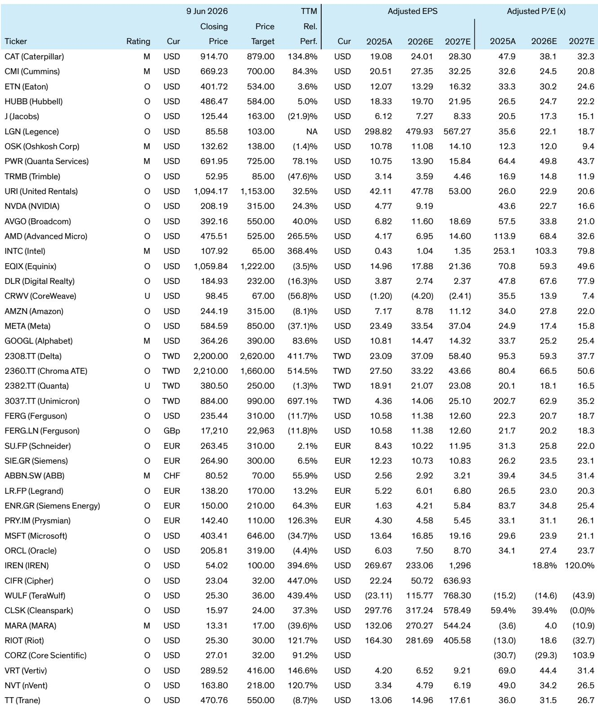
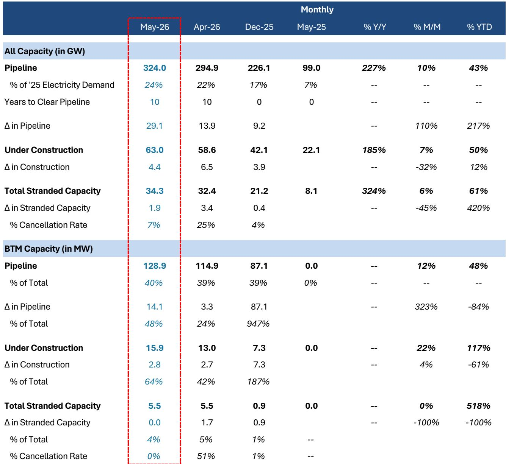
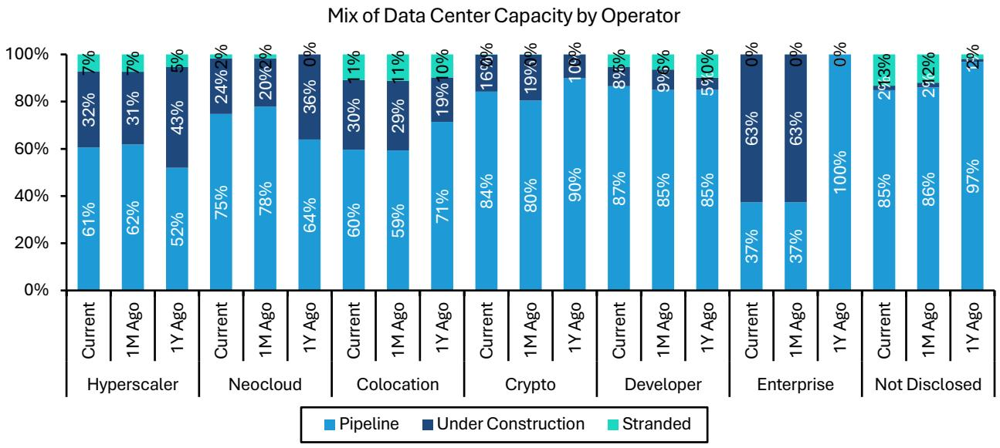

# The Data Center Pipeline Has Reached 324 GW, But the Real Story Is Not Just Scale—It Is the Structural Shift Toward Behind-the-Meter Power

The data center construction pipeline in North America has grown to 324 gigawatts, a 10% increase in a single month. That headline number is impressive, but it masks a more consequential transformation. The composition of that pipeline is changing faster than its size. Developers and crypto miners accounted for 96% of the month's additions, while hyperscaler capacity actually declined. More critically, behind-the-meter power projects now represent 40% of the pipeline, up from just 4% of the installed base. This is not merely a scaling story. It is a re-engineering of how data centers source energy, which carries profound implications for electrical equipment suppliers, construction firms, and the competitive dynamics among operators.

The strategic question for investors is no longer simply whether data center capacity is growing. It is whether the market is correctly pricing the winners and losers in a world where power architecture is becoming the binding constraint. The report from a leading investment bank provides the data to frame that question, but the answers require interpretation.

## The Pipeline Is Growing, But the Mix Matters More Than the Total

The headline figure of 324 GW in the pipeline is a useful starting point, but it can mislead. A 10% monthly increase is certainly robust, but the composition of that growth reveals where the momentum truly lies. Developers added 22 GW, and crypto miners added 6 GW. Together, these two groups accounted for 75% and 21% of the total increase, respectively. Hyperscalers, by contrast, saw their pipeline capacity decline marginally.

This divergence matters for several reasons. First, it suggests that the hyperscalers, who have dominated the narrative around AI infrastructure, may be shifting their strategy. Rather than building capacity themselves, they may be increasingly relying on developers and third-party operators to shoulder the construction risk. Second, the active role of crypto miners is a signal that the line between digital asset infrastructure and AI compute infrastructure is blurring. Miners have access to large power portfolios and operational expertise in managing energy-intensive facilities. Their growing presence in the data center pipeline indicates they are repurposing that capability for AI workloads.

The geographic distribution of new pipeline additions reinforces this shift. O'Leary Ventures drove an 8 GW increase in Utah, while Texas added 6 GW. These are not the traditional data center hubs. The migration toward regions with available power and favorable regulatory environments is accelerating. Investors should watch for whether this geographic dispersion creates localized bottlenecks in electrical grid capacity that further incentivize behind-the-meter solutions.

## Behind-the-Meter Power Is No Longer a Niche Strategy—It Is Becoming the Dominant Architecture

The most striking data point in the report is the acceleration of behind-the-meter power. The BTM pipeline grew 12% in a single month and 48% year-to-date, reaching 129 GW. To put that in perspective, only 16 GW of BTM capacity is currently under construction. The gap between pipeline and construction suggests that the industry is planning for a massive shift in how data centers are powered, but execution remains early.

Currently, only 4% of the installed base of data centers uses behind-the-meter power. But 25% of capacity under construction will use it, and 40% of projects in the pipeline will use it. Moreover, BTM projects accounted for nearly 50% of the additions to the May pipeline. This is not a gradual evolution. It is a structural break.

The implications are far-reaching. Behind-the-meter power means data centers are no longer passive consumers of grid electricity. They become active participants in energy generation, often relying on natural gas turbines, fuel cells, or on-site renewable generation paired with storage. This shift has direct consequences for equipment suppliers. The report notes that onsite generation projects spend approximately 30% more on electrical distribution equipment than grid-only projects. That is a direct tailwind for companies like Eaton, Hubbell, and others in the electrical equipment space.

But the implications go beyond equipment spending. Behind-the-meter power changes the risk profile of data center projects. It reduces dependence on grid interconnection timelines, which have become a major bottleneck. It also changes the competitive dynamics. Neoclouds are most reliant on BTM, with 64% of their pipeline using this approach, followed by developers at 50% and hyperscalers at 36%. This suggests that neoclouds are willing to take on more operational complexity in exchange for faster time-to-market and greater control over power costs.

## Stranded Capacity Is Rising, But the Nature of the Risk Is Shifting

Stranded capacity grew by 1.9 GW to 34 GW, representing 11% of the total pipeline. That is up from 7-9% last summer, but the report notes it is beginning to stabilize. The entirety of the increase is captured by projects that are unaccounted for, meaning they lack clear operator or developer attribution.

This is a subtle but important distinction. Stranded capacity that is attributable to a specific operator can be tracked, analyzed, and potentially revived. Unattributed stranded capacity is more concerning because it may represent speculative projects that never had a realistic path to completion. The stabilization of the stranded rate suggests that the industry is becoming more disciplined about which projects enter the pipeline, but the absolute level remains high enough to warrant caution.

The rise in local opposition and NIMBYism is a real and growing constraint. It is not evenly distributed. Some regions are more welcoming than others, and the geographic dispersion of new pipeline additions reflects this. Investors should evaluate data center exposure not just by operator type but by geographic concentration. A developer with a heavy concentration in a region with active opposition faces different risks than one diversified across multiple states.

The open question is whether stranded capacity will eventually convert into construction or whether it will be written off. The report does not provide a clear answer, but the stabilization trend is a positive signal. If stranded capacity continues to stabilize or decline over the next several months, it would support the thesis that the pipeline is becoming more realistic.

## The Electrical Equipment Total Addressable Market Is Vast, But Not All Players Are Equally Positioned

The report provides updated total addressable market estimates for electrical equipment suppliers based on the current pipeline. The numbers are staggering: Quanta Services at $4.4 trillion, Vertiv at $1 trillion, Schneider at $865 billion, Eaton at $758 billion, ABB at $648 billion, and Legence at $329 billion. These figures are based on company-disclosed dollars per megawatt opportunity and the current pipeline.

These TAM estimates should be treated with care. They represent the total revenue opportunity over the life of the pipeline, not annual revenue. They also assume that the entire pipeline converts to construction, which is unlikely given historical conversion rates. But even adjusting for realistic conversion assumptions, the opportunity is enormous.

The more important question is which players are best positioned to capture that value. The shift toward behind-the-meter power favors companies with exposure to electrical distribution equipment, generators, and power management systems. The report explicitly calls out Eaton and Hubbell as beneficiaries of the 30% spending uplift from BTM projects. But the opportunity is not uniform across the value chain. Companies focused on cooling, structural components, or low-voltage equipment may see less benefit from the BTM shift.

The report's investment implications are clear on this point. The analysts remain Outperform on Eaton, Hubbell, Legence, Jacobs, Trimble, and United Rentals. They are Market-Perform on Caterpillar, Cummins, Oshkosh, and Quanta Services. This differentiation reflects the view that not all exposure to data center growth is created equal. Companies with direct exposure to the electrical bottleneck and the BTM shift are seen as having more pricing power and more durable demand.

## What the Report Does Not Fully Answer: The Conversion Rate Problem and the Competitive Dynamics Among Operators

The report provides excellent data on pipeline size, composition, and trends. But it leaves several critical questions unanswered. The first is the conversion rate. How much of the 324 GW pipeline will actually become operational capacity? Historical conversion rates in infrastructure projects are notoriously low, often in the 20-40% range for early-stage pipelines. The report does not provide a historical benchmark or a methodology for estimating conversion.

The second unanswered question is the competitive dynamics among operator types. The report notes that developers and crypto miners are driving pipeline growth while hyperscaler capacity declined. But it does not explain why. Are hyperscalers shifting to a build-to-suit model where they lease capacity from developers rather than building themselves? Or are they facing internal capital allocation constraints that slow their own construction? The answer matters for which suppliers benefit and how pricing evolves.

The third open question is the role of neoclouds. They are the most reliant on behind-the-meter power, with 64% of their pipeline using this approach. But neoclouds are also the most financially fragile operator type. The report rates CoreWeave Underperform with a price target of $67, well below its current price. If neoclouds face funding challenges, their BTM-heavy pipeline could be at higher risk of cancellation or delay.

These are not criticisms of the report. They are the natural limitations of a data-driven exercise. The report provides the raw material for analysis, but investors must apply their own judgment about conversion rates, operator viability, and competitive dynamics.

## A Decision Framework for Investors: Four Questions to Evaluate Data Center Exposure

For investors trying to translate this report into actionable decisions, a structured framework is useful. Consider four questions when evaluating any company with data center exposure.

First, what is the company's exposure to behind-the-meter power? The report makes clear that BTM is the fastest-growing segment of the pipeline and carries a 30% spending uplift for electrical equipment. Companies with direct exposure to generators, power distribution, and onsite energy management are better positioned than those focused on grid-connected infrastructure.

Second, what is the company's exposure to the conversion risk? Companies that get paid at the design or equipment procurement stage face different risks than those that get paid at the construction or commissioning stage. Equipment suppliers like Eaton and Vertiv may see revenue earlier in the cycle and with less conversion risk than construction firms.

Third, what is the company's geographic diversification? The pipeline is shifting toward regions like Utah and Texas, away from traditional hubs like Northern Virginia. Companies with concentrated exposure to a single region face higher risk from local opposition, regulatory changes, or grid constraints.

Fourth, what is the company's exposure to operator type? Developers and crypto miners are driving pipeline growth, but their financial profiles differ. Hyperscalers have stronger balance sheets but are adding less capacity. Neoclouds are growing fast but face funding risks. Investors should understand which operator types drive a company's revenue and whether that exposure aligns with the most viable segments of the pipeline.

These four questions will not produce a single answer, but they will help investors differentiate between companies that are merely exposed to the data center theme and those that are structurally positioned to benefit from the specific shifts underway.

## The Full Report Contains the Charts and Data to Test These Hypotheses

The analysis above is based on the May update of the Data Center Capacity Tracker, which provides a comprehensive view of North American data center capacity by stage of development, operator, and geography. The report includes detailed breakdowns of pipeline additions, construction starts, stranded capacity, and behind-the-meter adoption. It also includes the full ticker table with ratings, price targets, and valuation metrics for over 40 companies across machinery, electrical equipment, semiconductors, internet, and crypto mining.

The charts in the original report show the month-over-month trends in a way that text alone cannot capture. They reveal the trajectory of BTM adoption, the geographic concentration of new construction, and the relative contribution of different operator types. For investors who want to test the hypotheses in this article against the actual data, the full report is essential.

Join the community to read the full report and review the original charts.

*This article is for learning and discussion only and does not constitute investment advice.*

Personal reading notes and learning share only. Not investment advice.

