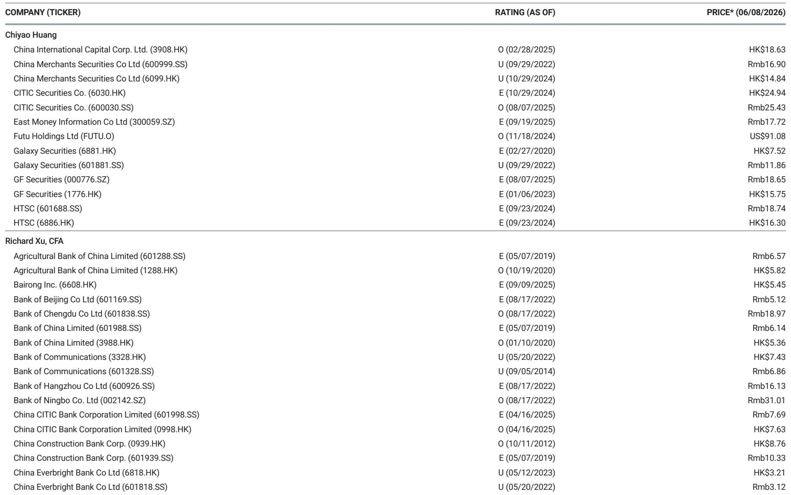
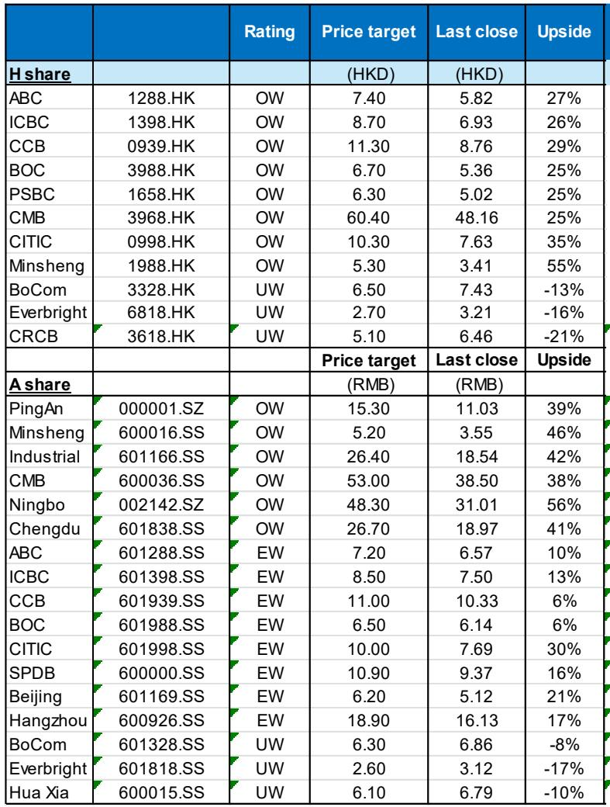
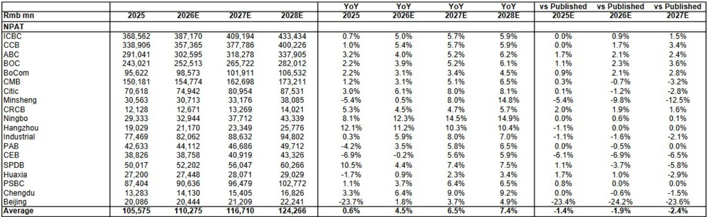

# China’s Financial System Is Entering a More Sustainable Growth Phase — Without a Stimulus Crutch

The dominant narrative on China’s economy has long oscillated between two poles: either the government unleashes massive stimulus to prop up growth, or the financial system suffers from overcapacity, margin compression, and rising credit risk. A growing body of evidence now suggests a third path is emerging — one in which the financial sector improves its fundamentals not because of a policy injection, but because structural shifts in the real economy are creating a healthier operating environment for banks and other financial intermediaries.

This is not a forecast of a dramatic boom. It is a more consequential argument: that China’s financial system is undergoing a quiet regime change. The key signals — an earlier-than-expected net interest margin (NIM) rebound, a moderation in loan growth that reflects genuine discipline rather than demand weakness, a recovery in consumption payment data, and a notable improvement in industrial profitability — all point to a system that is becoming more self-sustaining. For investors who have spent years worrying about the fragility of China’s banks, this shift warrants a fundamental reassessment.

The argument rests on a simple but powerful insight: high-quality development, while less visually dramatic than a credit-fueled boom, produces a more durable earnings trajectory for financial institutions. The report parsing we have reviewed provides the empirical backbone for this thesis. This article draws on that analysis to explain why the current cycle is different, what risks remain, and how investors should position themselves.

## The Positive Loop Is Already Visible in Payment and Export Data, Not Just Policy Intent

The most compelling evidence for a structural improvement in China’s financial system comes not from bank balance sheets but from real economy data that leads financial performance. Total system payment volume surged 29% year-on-year in the first quarter of 2026, a dramatic acceleration from the 5% growth recorded in the fourth quarter of 2025. This is not a statistical fluke. UnionPay payment growth rebounded to 11.2% year-on-year, and bank card consumption turned positive at 3.2% year-on-year after declining through much of 2025. NetsUnion payment volume moderated slightly to 7.2% year-on-year, but that moderation comes after an extended period of very strong growth and likely reflects a normalization of digital payment trends rather than a deterioration in underlying activity.

The connection to the financial sector is direct. Payment volumes are a leading indicator for fee income at banks, particularly for credit card and transaction-related revenue. When payment data improves, it signals that consumers are spending again and that merchants are seeing higher transaction volumes. This translates into healthier non-interest income for banks, which has been a sore point in recent years as fee waivers and regulatory caps squeezed revenue streams.

What makes this recovery different from previous cycles is its composition. The report parsing highlights that strong export growth, supported by technology and industrial upgrades, is offsetting the risks that accumulated from prior stimulus. This is not a consumption-led recovery fueled by household leverage. It is an export and industrial-led recovery that is generating corporate profits without requiring banks to extend excessive new credit. The PPI is gradually easing, and industrial profitability is improving. When companies earn more, they borrow less, and the loans they do take are of higher quality.

The so-what for investors is clear: the positive loop between real economy improvement and financial sector health is already operational. Banks do not need to wait for a policy catalyst to see better earnings. The catalyst is already embedded in the data.

## Net Interest Margin Rebound Is Arriving Earlier Than Expected, and It Reflects Balance Sheet Discipline, Not Loan Pricing Power

For years, the consensus view on China’s banks has been that NIM compression is structural and irreversible. The logic seemed airtight: as the economy slows, loan demand weakens, forcing banks to lower lending rates. Meanwhile, deposit competition keeps funding costs elevated. The result is a relentless squeeze on the core source of bank profitability.

The report parsing challenges this narrative by presenting evidence that NIM rebound is occurring earlier than expected. This is not a cyclical bounce driven by a sudden spike in loan demand. It is a structural improvement driven by two factors: more rational loan growth and a shift in the composition of household savings.

Loan growth has moderated significantly. Total social financing (TSF) growth slowed to 7.8% year-on-year in April, with renminbi loan growth decelerating further to 5.6%. Renminbi loans actually declined by 401 billion renminbi in April 2026, compared with an increase of 88 billion renminbi in the same month last year. This is not a sign of economic weakness. It is a sign that banks are no longer forced to lend at any cost. The removal of quantitative targets for inclusive small and medium enterprise loans — a policy change highlighted in the report parsing — has freed banks from the obligation to grow loan books at unsustainable rates.

When loan growth becomes more rational, pricing power improves. Banks can focus on lending to higher-quality borrowers at appropriate spreads rather than chasing volume to meet policy targets. The NIM rebound is therefore a direct consequence of regulatory evolution, not market dynamics alone.

At the same time, household financial behavior is shifting. New household savings are increasingly being directed toward investments rather than deposits. This reduces the pressure on banks to offer high deposit rates to retain funding, which in turn supports NIM. The combination of slower loan growth and more stable funding costs is creating a much more favorable margin environment than most analysts anticipated.

The implication is that the peak of NIM compression is behind us. For bank investors, this is the single most important variable to track. If NIM stabilizes and then gradually expands, the earnings trajectory for China’s banks shifts from defensive to growth-oriented.

## Industrial Overcapacity Risks Are Declining, Which Reduces the Probability of a Credit Crisis

One of the most persistent fears about China’s financial system has been the risk that overcapacity in industrial sectors would lead to a wave of corporate defaults, dragging down bank asset quality. The report parsing provides a detailed sector-by-sector analysis that should alleviate these concerns.

Manufacturing fixed asset investment growth dropped to 1.2% year-on-year in April from 4.1% in March, reflecting a high base from the previous year. But crucially, manufacturing profit growth accelerated to 20.4% year-on-year in April 2026. When profits grow faster than investment, the gap between capacity and demand narrows. The overall gross margin for manufacturing improved by 6 basis points year-on-year, supported by both a PPI rebound and cost control measures.

The sector-level data is even more telling. According to the report parsing, 84.5% of sectors — measured by liabilities — slowed their capital expenditure in April 2026 compared with the first half of 2024. At the same time, 37.2% of sectors showed better profit trends. This is a classic pattern of capacity rationalization: companies stop investing in new capacity when margins are under pressure, and as supply growth slows, pricing power returns.

The sectors that are slowing capex while improving profits include general equipment, specific equipment, ferrous metal processing, non-ferrous metal processing, and non-metal mineral products. These are exactly the sectors that were most associated with overcapacity concerns in previous cycles. The fact that they are now demonstrating better profit trends while reducing investment suggests that the structural adjustment is working.

For banks, this is profoundly positive. The probability of a systemic credit event driven by industrial overcapacity is declining. Loan-loss provisions can be released rather than increased, and credit costs — which have been a major drag on bank earnings — should trend lower over the coming years.

The one caveat is that not all sectors are improving. Electrical equipment, instrumentation, furniture, and automobiles are still showing deteriorating profit trends despite slowing investment. Banks with concentrated exposure to these sectors will need to remain vigilant. But the overall direction of travel is clear: the industrial sector is healing, and the credit risk environment is improving.

## The Report Raises an Unanswered Question: Can the Positive Loop Survive a Global Demand Shock?

For all the encouraging data, the report parsing leaves one critical question open. The current recovery is heavily dependent on export growth, which in turn relies on global demand. The report notes that year-to-date export growth remained strong at 14.5% year-on-year in April, and that this export strength is supported by technology and industrial upgrades. But exports are an external variable, not something China’s policymakers or banks can control.

What happens if global demand softens? A slowdown in advanced economies, a sharp appreciation of the renminbi, or an escalation in trade tensions could all compress export growth. The report parsing does not model this scenario in detail. It acknowledges that there has been some volatility in monthly export data — March saw a notable fluctuation — but the overall narrative remains optimistic.

The question investors need to answer is whether the domestic drivers of financial sector improvement are strong enough to withstand an external shock. If the NIM rebound is primarily a function of rational loan growth and better funding costs, it may persist even if export growth moderates. But if the improvement in industrial profitability is heavily dependent on export demand, then a global slowdown could reverse the positive loop.

The report parsing provides some evidence that domestic factors are gaining strength. Consumption payment data is recovering, and household financial assets are growing. But consumption in China remains below pre-pandemic trends, and the property sector — while no longer a drag — has not yet become a positive contributor to growth. The transition from an export-led to a consumption-led model is still incomplete.

This is the analytical frontier. The report does not fully answer how resilient the financial system would be to a significant deterioration in the external environment. Investors should monitor global demand indicators, trade policy developments, and the trajectory of Chinese household consumption as leading indicators for the sustainability of the current positive loop.

## A Decision Framework for Investors: How to Evaluate Bank Quality in the New Regime

The shift from a stimulus-dependent financial system to a more self-sustaining one requires a different approach to bank analysis. The old framework — which focused on loan growth rates, policy direction, and NIM sensitivity to rate cuts — is no longer sufficient. A new decision framework should prioritize the following four factors.

First, assess balance sheet discipline. In the old regime, banks that grew faster were often rewarded by the market, even if that growth came at the expense of pricing and credit quality. In the new regime, slower loan growth is a positive signal. It indicates that the bank is not being forced to lend into weak demand and that it has the flexibility to choose higher-quality borrowers. Look for banks that are voluntarily moderating loan growth and focusing on high-return segments.

Second, evaluate fee income resilience. With NIM stabilizing but not yet expanding dramatically, fee income becomes a critical differentiator. Banks with strong payment processing businesses, wealth management franchises, and investment banking capabilities will outperform those that rely primarily on net interest income. The recovery in payment data is a positive signal for fee income, but the quality of that recovery will vary by institution.

Third, analyze credit cost trajectories. The decline in industrial overcapacity risk should lead to lower credit costs across the sector, but the magnitude of the improvement will depend on each bank’s sector exposure. Banks with heavy exposure to electrical equipment or automobiles may not see the same benefit as those focused on general equipment or non-ferrous metals. A granular analysis of loan book composition is essential.

Fourth, monitor the shift in household financial behavior. The movement of household savings from deposits to investments is a structural trend that will benefit banks with strong wealth management and asset management capabilities. Banks that can capture this flow will see more stable funding costs and higher non-interest income, while banks that rely on deposit-heavy business models may face margin pressure.

This framework is not exhaustive, but it provides a starting point for distinguishing between banks that are merely benefiting from the cyclical tailwind and those that are building sustainable competitive advantages in the new regime.

## Join the Community to Read the Full Report and Review the Original Charts

The analysis presented here is based on a parsing of a detailed research report on China’s financial sector. The full report contains a wealth of additional data — including sector-level breakdowns of investment and profit trends, detailed payment volume charts, and TSF decomposition — that cannot be fully captured in a single article. The charts that accompany the original report are essential for understanding the magnitude and timing of the shifts described here.

For investors who want to make informed decisions about China’s financial sector, the full report provides the granularity and context needed to apply the decision framework outlined above. The original data on payment trends, industrial profitability by sector, and loan growth dynamics are the building blocks of a robust investment thesis.

Join the community to read the full report and review the original charts.

*This article is for learning and discussion only and does not constitute investment advice.*

Personal reading notes and learning share only. Not investment advice.

