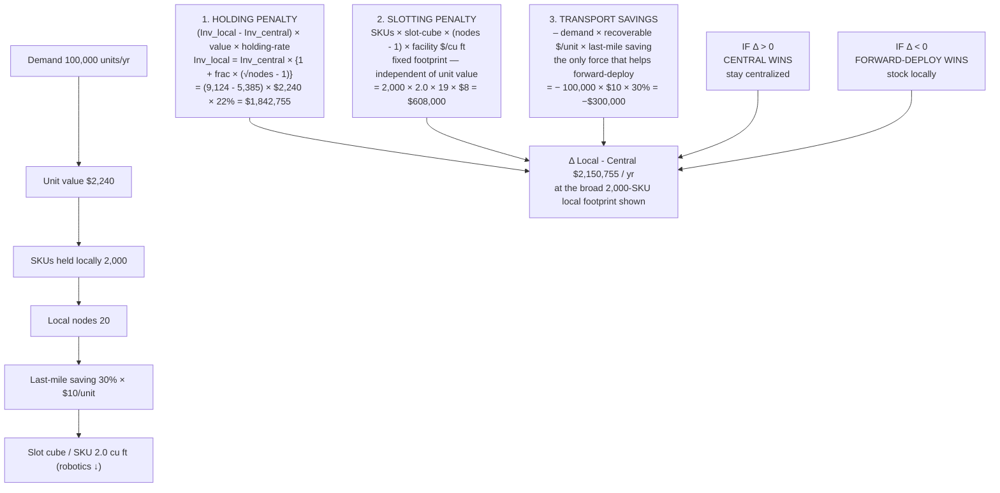

你是麦肯锡/投研风格的微信公众号财经文章主笔，擅长用金字塔原理把研报内容转化为“有主张、有层次、有洞察、但仍保留完整报告阅读欲望”的长文。

【目标】
- 基于下面的研报解析内容，写一篇微信公众号文章 Markdown。
- 风格：稳重、专业、克制、有洞察，像咨询公司合伙人写给高净值读者/产业决策者的研报导读。
- 长度：约 3000 字，允许上下浮动 15%。
- 不要使用 emoji。
- 可以基于报告内容做适度发散，但必须是从原文逻辑推出的判断，不要编造数据、公司动作或引用。
- 不要把研报所有正文内容讲完，要留下明确但自然的伏笔，让读者愿意加入社群阅读完整报告。

【金字塔原理写作原则】
1. 结论先行：文章开头先回答“这份报告最值得看的判断是什么”，而不是介绍背景。
2. 统领思想：全文只能服务一个主判断，避免变成摘要合集。
3. 纵向回答：每一层都要回答上一层提出的“为什么”或“所以呢”。
4. 横向 MECE：每个一级小节必须彼此独立、共同支撑主判断，避免重叠。
5. Synthesis over summary：不要复述报告段落，要提炼“这些事实合在一起意味着什么”。
6. So what：每个小节末尾必须落到对行业、公司、竞争格局、资产定价或读者观察框架的含义。
7. Action title：所有 `##` 小标题必须是“直接讲述洞察的完整句子”，不能是目录标签。

【标题与小标题硬性要求】
- `# 标题` 必须直接表达一个判断，例如“市场真正低估的不是需求，而是供给侧的再定价”。
- `# 标题` 必须包含报告机构的中文名称。已识别机构名：`Bernstein`。标题格式建议：`# Bernstein：一句主判断`。如果识别机构名为空，请从研报标题/正文中识别机构并使用中文名，例如GS、摩根斯坦利、HSBC、JPM、UBS、Citi、美国银行、BARC、DB、NOM。
- 机构名只要求出现在 `# 标题` 中，正文可以克制提及，不要为了重复机构名牺牲可读性。
- 禁止使用以下机械标题：
  - 一、核心判断
  - 二、真正重要的是结构性变量
  - 三、报告没有说透
  - 四、对读者的启发
  - 关键变化
  - 投资启示
  - 总结
- 所有 `##` 标题都要像麦肯锡报告里的 action title：读完标题就知道这一节结论。
- 小标题可以带序号，但序号后必须是一句洞察，例如：`## 1. 这轮变化真正考验的是企业能否把规模转化为议价权`。

【建议结构，但不要机械照抄标题】
1. `# 标题`：机构中文名 + 一句主判断，不超过 40 字。
2. 开头 4-6 段：直接给出主判断、为什么现在重要、报告提供了什么新信号。
3. 4-6 个 `##` 小节：每个小节标题都是洞察句，不是栏目名。
4. 至少一个小节讨论“报告尚未完全回答的关键问题”，但标题也要是洞察句。
5. 至少一个小节给出读者的观察框架，但不要命名为“对读者的启发”。
6. 文末自然承接未解问题，引导读者加入社群/微信群继续讨论。不要照抄固定话术，请基于本文未解问题每次重新写一段自然 CTA；语义可以参考：欢迎来星球微信群里继续讨论。
7. 在免责声明前，单独插入这张图片链接：``
8. 结尾只输出英文灰色免责声明：`
Personal reading notes and learning share only. Not investment advice.
`

【hook 要求】
- 不要硬插“加入社群”。
- hook 应该来自正文自然出现的未解问题，比如：关键假设尚未验证、竞争优势仍需拆解、图表背后的二阶影响没有展开。
- 文末 CTA 要像“顺着这些未解问题继续读完整报告/继续讨论”，不是广告口吻。
- CTA 必须每篇重新写，不能固定输出“加入社群，领取完整研报解读与原始图表”。可以类似“欢迎来星球微信群里继续讨论”。

【图片要求】
- 不要主动生成 MinerU 图片 markdown；系统会在文章生成后自动插入 MinerU 原始图片。
- 但文末免责声明前必须保留知识星球图片：``。

【内容边界】
- 只能基于研报原文和解析结果推导，不要编造数据、公司动作、引用。
- 遇到不确定内容，要用“这里仍需验证”“报告没有完全展开”等表达。
- 避免“震惊”“爆款”“一文看懂”等浮夸表达。
- 不要出现小红书话题标签。
- 不要出现 emoji。
- 不要隐藏报告机构名；标题必须出现机构中文名。正文如需概括来源，可写“这份Bernstein研报”或“该机构报告”，但不要编造机构观点以外的信息。
- 不要解释你的思考过程，不要输出多余说明。

【研报解析内容】
"""
# Airfreight & Surface Transportation

# Transports: An empirical look at how much of the fulfillment market Supply Chain by Amazon could realistically eat

David Vernon

+1 917 344 8333

david.vernon@bernsteinsg.com

Mark Shmulik

+1 917 344 8508

mark.shmulik@bernsteinsg.com

Justine Weiss

+1 917 344 8433

justine.weiss@bernsteinsg.com

Deeksha Pandey

+1 917 344 8447

deeksha.pandey@bernsteinsg.com

Wenhuan Chang

+1 917 344 8546

wenhuan.chang@bernsteinsg.com

## Specialist Sales

Steve Song

+1 917 344 8401

steve.song@bernsteinsg.com

Over the last several weeks, the market has been trying to gauge the potential for Amazon Supply Chain Services and what it could mean for the shipping market (UPS and FDX). In today's note, we lay out the supply chain math behind the structural limitations of a forward deployed inventory model and quantify what percent of the market might realistically use "Supply Chain by Amazon."

Background and context. Supply chains are engineered around specific strategic priorities that vary greatly across industries. Design choices reflect the product's characteristics (value density, shelf life, damage sensitivity, handling requirements), customer requirements (order quantity, speed, reliability, customization, kitting), and demand patterns (volatility, seasonality, geographic concentration). They are also shaped by cost-to-serve economics, as shippers work to minimize the sum of transport costs, inventory handling costs (including storage and real estate), and soft costs like financing, obsolescence, and markdowns. Because these factors vary across verticals, Amazon's supply chain is not suitable for many industries.

Our thesis: Amazon's forward-deployed (local-stocking) model is only suitable for a subset of supply chains. That model wins on “cheap-to-carry, fast-to-sell, low-value-density” assortments where the shipper lacks the volume to extract a strategic carrier discount. It is structurally uneconomic for “expensive-to-carry, slow-to-sell, high-value-density, heterogeneous” assortments (unless turns are unrealistically high). The decision between the two models comes down to the trade-off between Holding Costs, Slotting Costs, and Transport Savings (Exhibit 1). We reached this conclusion by building a comprehensive, transparent toy model to pressure-test the thesis and then abstracting the key findings to package in a more compact, tunable model (Exhibit 2). The key structural determinants on which companies might be able to use a forward inventory model like Amazon's are product value and how much of the transport savings can be realized (sensitivities in Exhibit 4). The cost wedge that decides it is not transportation, it is inventory carrying cost plus fixed slotting footprint.

We estimate an upper boundary of $\sim 20\%$ of current physical retail sales could be suitable for a forward-deployed model (Exhibit 5). Tolerance to data protection and service failure limit the realistic market to low-to-mid single digits (Exhibit 6), with sector level considerations laid out in Exhibit 7. Our goal here is to present a framework an investor can use to reach a conclusion on how big of a risk this is — as such, while we present our view, there is as much value in the analytical framework (and if you think more than 1 one in 5 suitable shippers might take the plunge, then the risk is higher).

BERNSTEIN TICKER TABLE

<table><tr><td rowspan="2">Ticker</td><td colspan="4">9 Jun 2026</td><td rowspan="2">TTMRel.Perf.</td><td colspan="4">Adjusted EPS</td><td colspan="3">Adjusted P/E (x)</td></tr><tr><td>Rating</td><td>Cur</td><td>Closing Price</td><td>Price Target</td><td>Cur</td><td>2025A</td><td>2026E</td><td>2027E</td><td>2025A</td><td>2026E</td><td>2027E</td></tr><tr><td>FDX (FedEx)</td><td>O</td><td>USD</td><td>331.76</td><td>470.00</td><td>52.1%</td><td>USD</td><td>18.26</td><td>19.96</td><td>23.26</td><td>18.2</td><td>16.6</td><td>14.3</td></tr><tr><td>UPS (United Parcel)</td><td>O</td><td>USD</td><td>107.87</td><td>130.00</td><td>(21.8)%</td><td>USD</td><td>7.16</td><td>7.56</td><td>8.70</td><td>15.1</td><td>14.3</td><td>12.4</td></tr><tr><td>AMZN (Amazon)</td><td>O</td><td>USD</td><td>244.19</td><td>315.00</td><td>(13.1)%</td><td>USD</td><td>7.17</td><td>8.78</td><td>11.12</td><td>34.0</td><td>27.8</td><td>22.0</td></tr><tr><td>SPX</td><td></td><td></td><td>7,386.65</td><td></td><td></td><td></td><td></td><td></td><td></td><td></td><td></td><td></td></tr></table>

O - Outperform, M - Market-Perform, U - Underperform, NR - Not Rated, CS - Coverage Suspended  
AMZN estimate is Reported EPS; AMZN valuation is Reported P/E (x);  
Note - target price not adjusted for FDX Freight split  
Source: Bloomberg, Bernstein estimates and analysis.

## INVESTMENT IMPLICATIONS

We do not see a significant risk to UPS and FDX parcel volume from Amazon's Supply Chain Services launch. Amazon has built an amazing fulfillment model, but supply chain constraints limit the addressable market to \~20% of the market (based on retail sales). Of that amount, data and service tolerance factors would likely further limit the risk to a low-to-mid single digit number. Like all things Amazon, one has to pay attention, but the inventory hit to higher value shippers will likely mean continued demand for longer distance transportation networks.

## DETAILS

Over the last several weeks, the market has been trying to gauge the potential for Amazon Supply Chain Services and what it could mean for the shipping market (UPS and FDX). In today's note, we lay out the supply chain math behind the structural limitations of a forward deployed inventory model and quantify what percent of the market might realistically use "Supply Chain by Amazon."

## BACKGROUND AND CONTEXT

Before we dig into the model, we are going to set the stage by saying that supply chains are not one size fits all. There is no one supply chain to rule them all. Supply chains are engineered around specific strategic priorities that vary greatly across industries. Design choices reflect the product's characteristics (value density, shelf life, damage sensitivity, handling requirements), customer requirements (order quantity, speed, reliability, customization, kitting), and demand patterns (volatility, seasonality, geographic concentration). They are also shaped by cost-to-serve economics, as shippers work to minimize the sum of transport costs, inventory handling costs (including storage and real estate), and soft costs like financing, obsolescence, and markdowns. High-velocity, low-value goods favor dense, forward-deployed networks that minimize last-mile cost and cycle time, while high-value, slow-moving assortments favor centralized inventory to preserve pooling benefits and reduce holding cost. Network topology (number and type of nodes), the balance between in-house assets and outsourced capacity, and the level of automation are all tuned to that specific mix of product, service promise, and economics. As a result, a grocery chain, a fashion retailer, and a B2B industrial distributor may all “ship boxes,” but the underlying supply chains are built to do very different jobs—and those structural differences determine whether a model like Amazon’s forward-deployed network is a natural fit or a fundamental mismatch. However impressive one thinks the pipes that Amazon has built may be, they may not work for every supply chain...but how do you support that conclusion with data?

## THE CRUX OF THE MATTER

Our thesis is based on the idea that the Amazon Supply Chain Services model forward deploys inventory closer to the customer to shorten lead times and lower transport costs at the expense of having more investment in inventory and facilities. The primary risk to UPS or FDX from Amazon “opening its supply chain” is the idea that other shippers will want to use that model. For a retailer operating out of a more traditional fulfillment center set up (call it 2-4 fulfillment centers + longer distance shipping via common carrier), the decision comes down The trade-off between a “local” inventory model like Amazon vs. a more “central” model across Holding Costs, Slotting Costs, and Transport Savings (as illustrated in Exhibit 1):

## EXHIBIT 1: The crux of our thesis: going local with something like Amazon SCS only makes sense if transport savings more than offset the cost of having and managing more inventory

i.e. negative $\Delta$ means local stocking is cheaper overall

# Δ (Local – Central) = Holding penalty + Slotting penalty – Transport savings

Forward deployment works only when delivery savings outweigh the inventory and operating cost of fragmenting stock across more nodes.

## Holding penalty

- Unit value — higher-value inventory makes each extra unit of safety stock more expensive to carry.  
- Turn rate — slower-moving assortments lose more from breaking pooling and duplicating inventory across nodes.  
- Network fragmentation — more stocking points increase required safety stock via the square-root-of-n effect.

## Slotting penalty

- Cube and handling profile — bulky, fragile, or awkward items consume more labor and constrained forward capacity.  
• Assortment breadth — long-tail SKU sets are harder to justify in high-cost forward locations.  
• Facility economics — dense, automated nodes favor standardized, parcel-friendly inventory over special-case product flows.

## Transport savings

- Distance to customer — the closer stock sits to demand, the more linehaul and last-mile cost can be reduced.  
- Order urgency — categories where faster delivery changes conversion or loyalty create more economic upside.  
- Parcelability — small, standard items capture the biggest savings from Amazon's high-density sortation and delivery network.

Source: Bernstein

We built a comprehensive, transparent toy model to pressure-test the thesis. The intent of the analysis is to expose the relationships underpinning supply chain trade-offs, and we were not trying to build an absolute forecast with any precision. The model compares two archetypes—a single pooled central node and a multi-node forward-deployed network—holding service levels constant and asking how the cost to serve changes when inventory is fragmented. Incremental inventory in the local model is driven by a damped square-root-of-n effect (partial loss of pooling), forward nodes carry a higher slotting cost because their space is scarcer and more operationally expensive, and forward deployment yields a transport benefit by shortening average delivery distance and lowering factor cost. At the SKU level, this structure favors low-value, high-turn, parcel-friendly items and penalizes high-value, slow-turn, bulky assortments; we then scale that intuition to retail verticals using industry sales weights and suitability scores, and further haircut the “structural” opportunity by asking what share of shippers are realistically willing to share data with Amazon and accept platform dependence. Once we had the comprehensive model built, we ran a number of sensitives and narrowed down the 10-12 key assumptions that matter. While the comprehensive model relies on over 50+ assumptions, we wanted to abstract away the noise and make the primary assumptions visible and tunable. The base calculation of the abstract model is shown below in Exhibit 2.

EXHIBIT 2: Quantifying the tradeoffs on whether a merchant might want to move to a forward-deployed inventory model like Amazon

Forward-Deploy Breakeven — How the Companion Model Computes the Decision

One equation: $\Delta$ (Local - Central) = Holding penalty + Slotting penalty - Transport savings $\rightarrow$ forward-deploy wins when $\Delta < 0$

INPUTS

THE THREE FORCES

DECISION

flowchart

WHAT THE STRUCTURE TELLS YOU

## Holding dominates

Spreading stock over 20 nodes multiplies safety stock by $\sim$ √N. At \$2,240/unit it is the single largest cost — and rises with value.

## Slotting is structural

Grows with SKU breadth, not unit value. Robotics (lower slot-cube) trims it, but cannot offset the holding penalty alone.

## Transport is the only win

Last-mile savings help, but are bounded by the recoverable per-unit gap — here just \$300k. It rarely outweighs the penalties, and is very difficult to scale.

Inv = average inventory units. frac = share of demand that loses pooling across nodes (default 20%). Parameters calibrated so the companion reconciles to the full toy model at base case.

Companion to SCS Toy Model V5

Source: Bernstein

## EXHIBIT 3: Our abstract toy model calculates the cost differential of deploying inventory locally

## Forward-Deploy Breakeven — Simple Companion Model

One decision: does stocking locally beat shipping from a central hub? $\Delta = Holding penalty + Slotting penalty - Transport savings$ . Local wins when $\Delta < 0$ .

INPUTS (edit yellow cells)

<table><tr><td>Annual demand (units)</td><td>100,000</td></tr><tr><td>Avg unit value ($)</td><td>$50</td></tr><tr><td>SKUs held locally</td><td>2,000</td></tr><tr><td>Local nodes</td><td>20</td></tr><tr><td>Last-mile saving multiplier (×$10/unit)</td><td>0.4×</td></tr><tr><td>Slot cube per SKU (cu ft)</td><td>2.0</td></tr><tr><td colspan="2">Fixed parameters (from full model)</td></tr><tr><td>Holding rate (%/yr)</td><td>22%</td></tr><tr><td>Recoverable transport $/unit</td><td>$9.0</td></tr><tr><td>Facility $ per cu ft/yr</td><td>$8.0</td></tr><tr><td>Service factor Z</td><td>1.65</td></tr><tr><td>Lead time (wk) × repln</td><td>2.0</td></tr><tr><td>Fraction of demand that fragments</td><td>20%</td></tr></table>

<table><tr><td colspan="2">THE THREE FORCES (per year)</td><td>$ / year</td></tr><tr><td>Central avg inventory (units)</td><td>5,385</td><td></td></tr><tr><td>Local avg inventory (units)</td><td>9,124</td><td></td></tr><tr><td colspan="2">1. Holding penalty (cost of going local)</td><td>$41,133</td></tr><tr><td colspan="2">2. Slotting penalty (cost of going local)</td><td>$608,000</td></tr><tr><td colspan="2">3. Transport savings (benefit of going local)</td><td>-$360,000</td></tr></table>

<table><tr><td>Δ Local – Central ($/yr)</td><td>$289,133</td></tr><tr><td>Verdict</td><td>CENTRAL WINS</td></tr></table>

Total units shipped per year

Inventory value per unit (holding-cost driver)

Assortment breadth per local node

Forward-deploy footprint (1 = central)

Per-unit transport saving vs central long-haul

Shelf space per SKU — LOWER for robotic/Kiva

Slow-moving share that loses pooling

Pooled hub stock, calibrated to full model

Local = Central×[1+frac×(Vnodes-1)]

Extra inventory × value × holding rate

SKUs × slot cube × (nodes-1) × \$/cu ft

Demand × \$/unit × discount (negative = saving)

Negative $\Delta \rightarrow$ local stocking cheaper overall

Source: Bernstein

## EXHIBIT 4: The key structural determinants on which companies might be able to use a forward inventory model like Amazon's are product value and how much of the transport savings can be realized

## Breakeven map: unit value × transport-saving multiplier (Δ \$/yr)

Teal = forward-deploy wins ( $\Delta < 0$ ). Saving multiplier scales the recoverable \$10/unit baseline (1.0 $\times$ = full \$10; >1.0 $\times$ = extra line-haul/zone-skip savings — unbounded, not a % of cost). Local wins only in the low-value / high-multiplier corner.

<table><tr><td>value ↓ / saving multiplier →</td><td>0.2×</td><td>0.4×</td><td>0.6×</td><td>0.8×</td><td>1.0×</td><td>1.2×</td></tr><tr><td>$50</td><td>$469,133</td><td>$289,133</td><td>$109,133</td><td>-$70,867</td><td>-$250,867</td><td>-$430,867</td></tr><tr><td>$100</td><td>$510,266</td><td>$330,266</td><td>$150,266</td><td>-$29,734</td><td>-$209,734</td><td>-$389,734</td></tr><tr><td>$200</td><td>$592,532</td><td>$412,532</td><td>$232,532</td><td>$52,532</td><td>-$127,468</td><td>-$307,468</td></tr><tr><td>$400</td><td>$757,063</td><td>$577,063</td><td>$397,063</td><td>$217,063</td><td>$37,063</td><td>-$142,937</td></tr><tr><td>$800</td><td>$1,086,127</td><td>$906,127</td><td>$726,127</td><td>$546,127</td><td>$366,127</td><td>$186,127</td></tr><tr><td>$1,600</td><td>$1,744,254</td><td>$1,564,254</td><td>$1,384,254</td><td>$1,204,254</td><td>$1,024,254</td><td>$844,254</td></tr></table>

Source: Bernstein

## ESTIMATING THE ADDRESSABLE MARKET

We now turn our attention to market sizing. We estimate an upper boundary of $\sim 20\%$ of retail sales could be suitable for a forward deployed model (Exhibit 5). Tolerance to data protection and service failure limit the realistic market to low-to-mid single digits (Exhibit 6), with sector level considerations laid out in Exhibit 7. Our goal here is to present a framework an investor can use to reach a conclusion on how big of a risk this is - as such, while we present our view there is as much value in the analytical framework (and if you think more than 1 one in 5 suitable shippers might take the plunge, then the risk is higher). There two sets of issues to consider:

\- Suitability: What percent of industry sales under consideration could use the Amazon supply chain model? We assign eac

[中间内容因长度限制已省略]

ence system.

Bernstein may use artificial intelligence tools in the preparation of its materials. Any such materials are reviewed by Bernstein's research analysts prior to publication.

This report has been prepared for information purposes only and is based on current public information that we consider reliable, but the entities noted herein do not warrant or represent (express or implied) as to the sources of information or data contained herein are accurate, complete, not misleading or as to its fitness for the purpose intended even though the entities noted herein rely on reputable or trustworthy data providers, it should not be relied upon as such. Opinions expressed are the author(s)' current opinions as of the date appearing on the material only and we do not undertake to advise you of any change in the reported information or in the opinions herein.

Any references to SG herein are purely factual, based upon publicly available information, and included for comparative purposes only. They do not constitute an opinion or recommendation with respect to the securities of SG.

This publication was prepared and issued by the entity referred to herein for distribution to eligible counterparties or professional clients. The information in this report is intended for general circulation and does not constitute an offer to buy or sell any security, investment, legal or tax advice nor a personal recommendation, as defined by any of the aforementioned regulators. It does not take into account the particular investment objectives, financial situations, or needs of individual investors. The report has not been reviewed by any of the aforementioned regulators and does not represent any official recommendation from the aforementioned regulators. The investments referred to herein may not be suitable for you. Investors must make their own investment decisions in consultation with advice sought from a financial adviser regarding the suitability of the investment product, taking into account the specific investment objectives, financial situation or particular needs of any recipient of the recommendation, before the recipient makes a commitment to purchase the investment product.

The analysis contained herein is based on numerous assumptions. Different assumptions could result in materially different results. The information in this report does not constitute, or form part of, any offer to sell or issue, or any offer to purchase or subscribe for shares, or to induce engagement in any other investment activity. The value of any securities or financial instruments mentioned in this report may fluctuate subject to market conditions. Information about past performance of an investment is not necessarily a guide to, indicative of, or assurance of future performance. Estimates of future performance mentioned by the research analyst in this report are based on assumptions that may not be realized due to unforeseen factors like market volatility/fluctuation. In relation to securities or financial instruments denominated in a foreign currency other than the clients' home currency, movements in exchange rates will have an effect on the value, either favorable or unfavorable. Before acting on any recommendations in this report, recipients should consider the appropriateness of investing in the subject securities or financial instruments mentioned in this report and, if necessary, seek independent professional advice.

The securities described herein may not be eligible for sale in all jurisdictions or to certain categories of investors where that permission profile is not consistent with the licenses held by the entities noted herein. This document is for distribution only as may be permitted by law. It is not directed to, or intended for distribution to or use by, any person or entity who is a citizen or resident of or located in any locality, state, country or other jurisdiction where such distribution, publication, availability or use would be contrary to law or regulation or would subject the entities noted herein to any regulation or licensing requirement within such jurisdiction.

Source: Bloomberg Index Services Limited. BLOOMBERG® is a trademark and service mark of Bloomberg Finance L.P. and its affiliates (collectively “Bloomberg”). Bloomberg or Bloomberg’s licensors own all proprietary rights in the Bloomberg Indices. Neither Bloomberg nor Bloomberg’s licensors approves or endorses this material, or guarantees the accuracy or completeness of any information herein, or makes any warranty, express or implied, as to the results to be obtained therefrom and, to the maximum extent allowed by law, neither shall have any liability or responsibility for injury or damages arising in connection therewith.

No part of this material may be reproduced, distributed or transmitted or otherwise made available without prior consent of the entities noted herein. Copyright Bernstein Institutional Services LLC Bernstein Autonomous LLP, BSG France S.A., Bernstein (Hong Kong) Limited 盛博香港有限公司, Bernstein (Canada) Limited, Bernstein (India) Private Limited (SEBI registration no. INH000006378), Bernstein (Singapore) Private Limited and Bernstein Japan KK (サンフォード・C・バーンスタイン株式会社). All rights reserved. The trademarks and service marks contained herein are the property of their respective owners. Any unauthorized use or disclosure is strictly prohibited. The entities noted herein may pursue legal action if the unauthorized use results in any defamation and/or reputational risk to the entities noted herein and research published under the Bernstein and Autonomous brands.
"""
