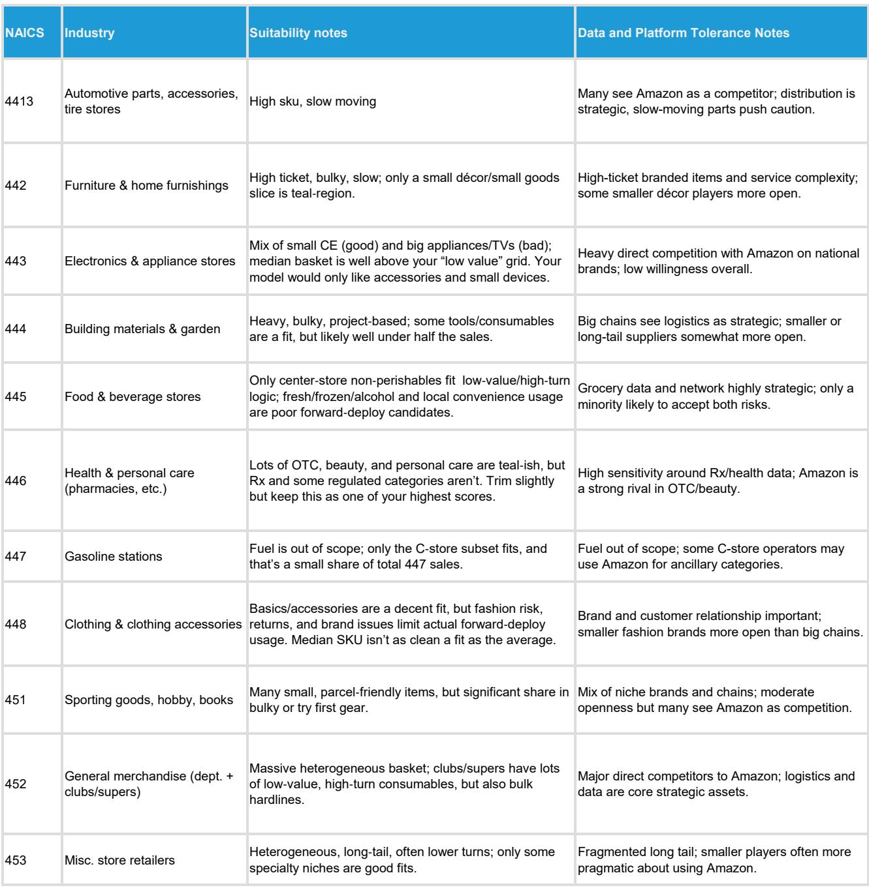
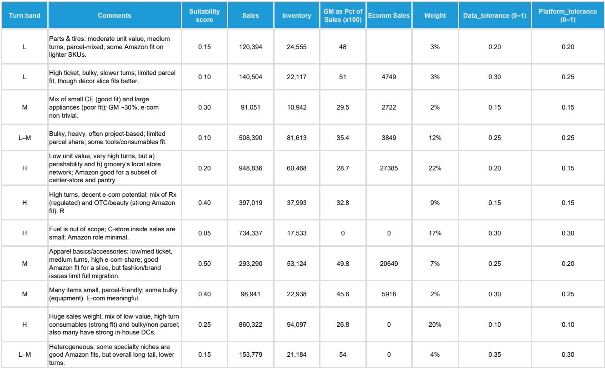
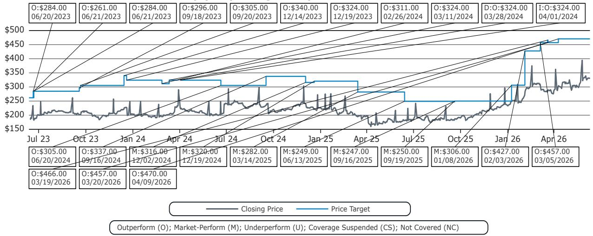

# Bernstein：亚马逊供应链的真实威胁，被市场高估了

过去几周，市场对亚马逊推出“Supply Chain by Amazon”的讨论持续升温。投资者最关心的问题是：当亚马逊向第三方卖家开放其强大的履约网络，UPS和FedEx的包裹业务会不会遭遇结构性冲击？

直觉上，答案似乎是肯定的。亚马逊的履约能力有目共睹——Prime两日达甚至当日达已经成为行业标准，其物流基础设施的投入和效率也让传统承运商相形见绌。如果更多商家能够接入这套体系，UPS和FedEx的份额流失似乎是必然。

但Bernstein这份研报给出了一个反直觉的核心判断：**亚马逊的前置库存模型在供应链结构上存在天然局限，真正适合采用该模式的零售市场上限约为20%，而考虑到数据隐私和服务容错等现实约束，实际可渗透的市场可能只有低个位数百分比。**

这不是一个关于“亚马逊能不能做”的问题，而是一个关于“哪些供应链结构天然不适合前置库存”的问题。Bernstein的分析框架揭示了决定这一问题的三个核心变量：持有成本、货位成本和运输节省。当这三者的数学关系摆到台面上，亚马逊供应链的真实威胁边界就清晰了。

## 1. 供应链不是万能模板，前置库存模型只在特定品类中成立

要理解Bernstein的核心论点，首先要接受一个基本前提：供应链不是“一刀切”的解决方案。不同品类的产品属性、客户需求和成本结构，决定了完全不同的网络拓扑设计。

Bernstein在报告中明确指出，供应链设计需要权衡三大类成本：运输成本、库存处理成本（包括仓储和地产），以及软性成本（如融资成本、过时折价和降价损失）。高周转、低价值密度的商品，适合采用密集的前置网络以最小化最后一公里成本和周期时间；而高价值、慢周转的商品，则更适合集中化库存以保持合并效应并降低持有成本。

亚马逊的模型本质上是一种“前置库存”模型——将库存分散部署在离消费者更近的位置，以此缩短交付时间并降低运输成本，代价是更高的库存投资和设施投入。这种模型在“便宜运输、快速销售、低价值密度”的商品类别中具有优势，但在“昂贵运输、慢速销售、高价值密度、品类异质性高”的商品中，结构性不经济。

这一判断的市场含义是明确的：**并非所有零售品类都能从亚马逊的供应链服务中受益，大多数品类甚至可能因为前置库存而承担更高的总成本。** 对于UPS和FedEx而言，它们的高价值客户群体——比如工业品、医疗设备、高端消费品等——天然不适合亚马逊的模型，这些客户的长距离运输需求不会消失。

## 2. 决定胜负的不是运输成本，而是库存持有成本和货位成本

Bernstein构建了一个透明的数学模型来量化前置库存与传统集中库存的成本差异。模型的核心公式很简单：Delta（本地-集中）= 持有惩罚 + 货位惩罚 - 运输节省。当Delta为负数时，前置库存模型才更优。

这个公式揭示了一个反直觉的结论：**决定一个品类是否适合前置库存的关键变量，不是运输成本，而是库存持有成本和货位成本。**

具体来看三个变量：

持有惩罚是最具决定性的因素。当库存从集中节点分散到20个本地节点时，安全库存量会按照平方根法则放大。对于单价超过200美元的商品，这种库存碎片化带来的持有成本增长，几乎不可能被运输节省所抵消。

货位惩罚是一个结构性变量。它随SKU广度增长，但与商品单价无关。对于品类繁多的零售商，将数千个SKU分散部署到每个本地节点，意味着每个节点都需要承担固定的货位成本。即使机器人技术能够降低单位货位需求，也无法从根本上改变这一成本结构。

运输节省是唯一有利于前置库存的变量，但其规模有限。Bernstein的模型假设每单位运输可节省约9-10美元，即使将节省幅度放大到1.2倍，对于单价超过400美元的商品，前置库存仍然不经济。

Bernstein的敏感性分析清晰地展示了这一点：在单价50美元、运输节省乘数0.4倍的情况下，Delta为正28.9万美元，集中模型胜出；只有在单价50美元以下且运输节省乘数超过0.8倍时，前置库存才可能占优。**这意味着亚马逊供应链服务的主要目标客户，只能是那些单价低、周转快、且能够实现显著运输节省的品类。**

## 3. 20%的上限与个位数的现实：数据隐私和服务容错进一步压缩市场

基于上述模型，Bernstein估算出前置库存模型理论上的可服务市场上限约为当前实体零售额的20%。这个数字已经相当保守，但现实约束会让实际可渗透市场进一步缩小到低个位数百分比。

这里有两个关键约束条件：

第一，数据隐私。使用亚马逊供应链服务意味着商家需要与亚马逊共享详细的销售数据、库存信息和客户行为数据。对于许多品牌商和零售商而言，这是不可接受的。它们不愿意将核心商业数据暴露给一个既是平台又是竞争对手的实体。Bernstein在报告中提到，对数据保护的容忍度会显著限制实际采用率。

第二，服务容错。亚马逊的履约网络虽然高效，但并非没有缺陷。对于高价值商品或对交付时间有严格要求的品类，商家可能不愿意将全部履约控制权交给第三方。一旦出现服务失败，品牌声誉的损失可能远超运输成本节省带来的收益。

这两个约束条件叠加，意味着即使理论上适合前置库存的品类中，也只有一小部分商家会真正选择采用亚马逊的供应链服务。**Bernstein的结论是：对UPS和FedEx的包裹量而言，来自亚马逊供应链服务的风险是可控的，远没有市场担忧的那么严重。**

## 4. 报告尚未完全回答的关键问题：亚马逊的定价策略和长期竞争动态

虽然Bernstein的分析框架具有很强的说服力，但报告对几个关键问题没有给出充分答案，这恰恰是投资者需要持续跟踪的方向。

第一个问题是亚马逊的定价策略。Bernstein的模型假设运输节省是固定的，但亚马逊完全可能通过补贴或交叉补贴来压低价格，以吸引更多商家入驻。如果亚马逊愿意在短期内牺牲利润来扩大市场份额，那么前置库存的经济学边界可能会被暂时打破。报告没有深入讨论亚马逊的定价弹性空间。

第二个问题是长期竞争动态。即使当前只有低个位数百分比的商家适合采用亚马逊模型，但随着电商渗透率提升、消费者对配送速度的期望进一步提高，以及亚马逊持续优化其履约网络，适合前置库存的品类边界可能会扩大。报告没有讨论这种动态变化的速度和方向。

第三个问题是UPS和FedEx的应对策略。如果亚马逊的供应链服务确实对特定品类构成威胁，UPS和FedEx是否会调整自身的服务产品来防御？它们能否通过技术投资或网络优化来缩小与亚马逊的成本差距？报告对此着墨不多。

这些未解问题意味着，投资者不能简单地将Bernstein的结论视为“亚马逊供应链服务无关紧要”。更合理的解读是：**在现有条件下，亚马逊供应链服务的威胁是有限且可控的，但投资者需要持续跟踪上述变量，以判断这一判断是否会被颠覆。**

## 5. 投资者的观察框架：用这三个问题评估亚马逊供应链的真实风险

基于Bernstein的分析，投资者可以建立一个简洁的观察框架来评估亚马逊供应链服务的实际影响：

第一，关注品类结构。UPS和FedEx的收入中，高价值、慢周转品类的占比是多少？如果这些品类占比较高，亚马逊的威胁就相对有限。反之，如果低价值、高周转品类的占比在上升，则需要警惕。

第二，关注客户行为。哪些客户正在测试或采用亚马逊供应链服务？这些客户是否属于Bernstein模型中的“适合前置库存”类别？如果采用者集中在低单价品类，风险可控；如果开始向中高单价品类渗透，则需要重新评估。

第三，关注亚马逊的定价策略。亚马逊是否在通过补贴或折扣来吸引高价值品类商家？如果出现这种迹象，说明亚马逊正在尝试突破Bernstein模型的经济学边界，届时需要重新审视前置库存的适用性。

这个框架的价值在于，它提供了一个结构化的方式来区分“噪音”和“信号”。在市场情绪波动时，投资者可以用这三个问题来检验自己的判断是否偏离了基本的经济学逻辑。

---

Bernstein的这份研报之所以值得深入阅读，不是因为它给出了一个简单的结论，而是因为它提供了一个可检验、可调整的分析框架。对于UPS和FedEx的投资者而言，真正的风险不是亚马逊供应链服务的存在本身，而是市场对这一威胁的过度反应导致估值错位。而对于亚马逊的投资者而言，这份报告也提供了一个难得的视角：即使是亚马逊，也无法通过一己之力改变供应链的基本物理学。

如果你想进一步了解Bernstein报告中关于各细分品类的具体适用性评分，以及模型中50多个假设参数的详细设定，欢迎来知识星球微信群里继续讨论。那里我们会分享完整的原始图表和更细致的拆解。

Personal reading notes and learning share only. Not investment advice.

