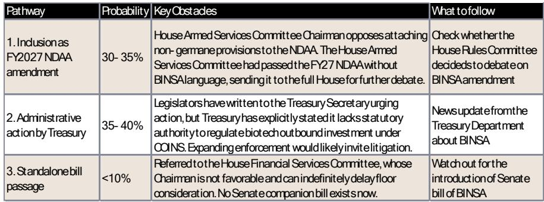

# The BINSA Act Is Likely to Fail, But the Real Question Is What Comes After It

The most important takeaway from the latest expert call on US outbound investment restrictions in Chinese biotech is not that the BINSA Act faces low odds of passage. It is that the market has already priced in a certain level of regulatory risk, and the real strategic uncertainty lies elsewhere. Investors who focus solely on the legislative probability miss the deeper structural story: the US regulatory apparatus is being pressured from multiple directions, and the biotech sector sits at an awkward intersection of national security rhetoric, commercial reality, and administrative inertia.

This matters now because the window for making clear-eyed investment decisions in China healthcare is narrowing, not because of the bill itself, but because the noise around it obscures more fundamental shifts. The expert call, hosted by a global investment bank, confirms that the BINSA Act has less than a 40% chance of becoming law in this Congressional session. Yet the very fact that the bill was introduced signals a persistent bipartisan appetite for expanding the scope of outbound controls. The question is not whether this specific bill passes, but whether the logic behind it will eventually find a more viable legislative vehicle.

The report makes a compelling case that the Treasury Department, the lead agency for the existing COINS Act, is at most lukewarm on BINSA. The administrative difficulties of implementing biotech outbound restrictions are substantial, and the agency has explicitly stated it lacks statutory authority in this area. But administrative reluctance is not the same as permanent protection. The pattern in US technology regulation has been one of gradual expansion: what starts as a narrow semiconductor-focused rule eventually broadens to adjacent domains. The biotech sector should not assume it is permanently exempt.

What follows is a structured analysis of the report's findings, organized around the key strategic insights that should inform investment decisions in China healthcare. Each section builds on the central thesis: the BINSA Act is unlikely to pass in its current form, but the forces that produced it are not going away, and the industry's response will shape the regulatory landscape for years to come.

## The BINSA Act's Legislative Odds Are Low, But the Logic Behind It Has More Staying Power Than the Bill Itself

The expert assigns a probability of less than 30-40% to any pathway to enactment, with standalone passage at under 10%. The most plausible route, inclusion as an amendment to the FY2027 NDAA, faces a key obstacle: the House Armed Services Committee Chairman opposes attaching non-germane provisions to the defense authorization bill. The House version of the NDAA has already cleared committee without BINSA language, and there is no companion bill in the Senate. These are concrete procedural barriers, not vague political headwinds.

Yet the low probability should not be mistaken for irrelevance. The bill was introduced by bipartisan Michigan legislators, reflecting the interests of the state's biopharma industry base rather than a broad national security consensus. This is a double-edged observation. On one hand, it means the bill lacks the broad coalition needed for swift passage. On the other hand, it demonstrates that regional economic interests can still generate legislative momentum even without national consensus. The biotech sector's exclusion from the original COINS Act was not accidental; semiconductors, AI, and quantum computing were prioritized because they are obviously military-enabling and already heavily securitized. Biotech has a massive civilian and commercial footprint, making it less intuitive to the median legislator as hard technology. But that perception can change, especially if a high-profile security incident involving biotech data or dual-use research were to occur.

The report notes that several senior senators maintain a hawkish posture and are supportive of BINSA, while opposition is concentrated among free-market-oriented members and Massachusetts senators, whose state hosts a concentration of biopharma companies with direct economic exposure. This is not a stable equilibrium. The persuadable independent-leaning senators represent the primary lobbying target for both sides, and the balance could shift with changes in the geopolitical environment or a new administration's priorities.

## Industry Lobbying Is a Powerful Counterweight, But It Also Reveals the Sector's Vulnerabilities

The expert highlights that the BINSA Act faces significant challenges from US large pharma, which is lobbying actively to block the bill entirely or secure substantial modifications. The industry's arguments are straightforward: large pharmas and global biotechs rely on Chinese clinical trials, manufacturing, and partnerships; outbound restrictions could disrupt R&D pipelines, delay drug approvals, and raise costs; and routine licensing and collaboration would be at risk if biotech were swept into a blunt outbound regime.

This lobbying effort is effective in the short term, but it also exposes a structural vulnerability. The industry's reliance on Chinese partners is precisely what makes it a target for national security arguments. The BIOSECURE Act's procurement rules and supply chain scrutiny have already created a precedent for treating biotech as a security concern. The business coalitions arguing that adding outbound capital controls would impose additional uncertainty are correct, but their argument implicitly concedes that the existing BIOSECURE-style restrictions are already in place. The cumulative effect of multiple regulatory layers could eventually reach a tipping point where the cost of compliance outweighs the benefits of Chinese partnerships, even without a formal outbound investment ban.

The report's framing of industry pushback as a "counterweight" is accurate but incomplete. The lobbying effort is defensive, not proactive. It seeks to block or narrow the BINSA Act, but it does not address the underlying perception that Chinese biotech partnerships pose a national security risk. Until the industry offers a compelling affirmative case for why these partnerships are in the US national interest, the regulatory pressure will continue to build, and the terms of engagement will be set by legislators and regulators, not by the companies themselves.

## Even If BINSA Fails, the Regulatory Trajectory Points Toward Increased Scrutiny of China Biotech

The expert expects that any enacted version of BINSA would include significant carve-outs: a narrower definition of covered foreign biotech entity, exemptions for licensing arrangements and clinical trial collaborations, higher value thresholds for transaction review, a passive investment exception, and a national interest waiver at the Treasury's discretion. This is a reasonable prediction, but it also reveals the direction of travel. The fact that such carve-outs are being discussed means that the baseline expectation is already moving toward some form of regulation.

Consider the current situation. US PE/VC firms are already prohibited from making equity investments, joint ventures, or convertible bond investments in Chinese biotech companies involved in sensitive technologies such as genomics. Non-prohibited investments require a 30-day advance filing, and Treasury review can extend to 120 days, materially impairing deal execution timelines. The bill applies to all US persons and their globally controlled subsidiaries, meaning that routing transactions through European or Japanese affiliates to circumvent the rules would constitute a violation carrying severe penalties.

This is not a hypothetical future state. This is the current regulatory environment, even without BINSA. The BINSA Act would expand the scope, but the infrastructure for monitoring and restricting outbound investment in biotech is already being built. The Treasury Department's reluctance to expand its authority is a meaningful obstacle, but it is not an insurmountable one. A future administration could take a different view, or Congress could find a different legislative vehicle.

The report's analysis of the 1260H List update is instructive in this context. Wuxi Apptec's inclusion on the list was well anticipated by the market, and the expert notes that the impact is minimal because only federal funded projects would be prohibited from partnering with the company. But the listing itself is significant: it demonstrates that the regulatory machinery is operating, and that companies can be added to restricted lists through administrative processes rather than legislation. The expert anticipates that Wuxi Apptec will move quickly to initiate an appeal, consistent with how similarly situated companies have responded to prior listings. This is the right strategy, but it also underscores the reactive posture that Chinese biotech companies are forced to adopt.

## What the Report Does Not Fully Answer: The Second-Order Effects on Deal Structure and Valuation

The report provides a thorough analysis of the legislative pathway and the industry response, but it leaves several important questions unanswered. These are not criticisms of the report, which is focused on the immediate regulatory risk. Rather, they are the questions that investors should be asking themselves as they consider the longer-term implications.

First, how will the uncertainty around outbound investment restrictions affect the valuation of Chinese biotech companies that rely on US capital? The report notes that US PE/VC firms are currently prohibited from making certain types of investments, and the review process for non-prohibited investments can extend to 120 days. This creates a structural disadvantage for Chinese biotech companies seeking US funding, even if no new legislation is passed. The uncertainty itself is a cost, and it will be priced into the equity of affected companies.

Second, what is the contingency plan for Chinese biotech companies that currently depend on US partnerships for clinical trials, manufacturing, or licensing? The report mentions that large pharmas and global biotechs rely on Chinese partners, but it does not explore how quickly these partnerships could be restructured or replaced. The industry lobbying effort assumes that these partnerships are essential, but that assumption has not been tested under sustained regulatory pressure.

Third, how will the regulatory environment in Europe and Asia respond to the US trajectory? The report notes that the bill applies to US persons and their globally controlled subsidiaries, but companies headquartered outside the US with only a US subsidiary would not be subject to the bill if the relevant transaction is directed by the foreign parent. This creates a potential arbitrage opportunity, but it also invites regulatory responses from other jurisdictions. The US is not the only country concerned about technology transfer and national security.

These are not idle questions. They will determine the actual impact of the regulatory environment on investment returns, regardless of whether the BINSA Act passes or fails.

## A Decision Framework for Investors Navigating China Biotech Regulatory Risk

Given the complexity of the regulatory landscape and the uncertainty around legislative outcomes, investors need a structured approach to decision-making. The following framework is derived from the report's analysis and the expert's insights, and it is designed to help investors separate signal from noise.

The first dimension is time horizon. For investors with a short-term horizon of six to twelve months, the BINSA Act is unlikely to pass, and the immediate regulatory risk is low. The market has already priced in the 1260H List inclusion for Wuxi Apptec, and the expert expects the company to pursue an appeal. Short-term investors should focus on company-specific fundamentals and the broader market environment, rather than legislative developments.

For investors with a medium-term horizon of one to three years, the risk profile is more complex. Even if BINSA does not pass in this Congressional session, the forces that produced it will persist. A new administration could take a more aggressive stance, or a different legislative vehicle could emerge. Medium-term investors should assess their portfolio's exposure to Chinese biotech companies that rely on US partnerships, and they should consider whether the potential returns justify the regulatory uncertainty.

For investors with a long-term horizon of three to five years, the question is not whether regulation will increase, but how and when. The pattern in US technology regulation has been one of gradual expansion, and biotech is unlikely to remain permanently exempt. Long-term investors should focus on companies that have diversified their funding sources, reduced their dependence on US partnerships, or developed technologies that are clearly in the civilian and commercial domain rather than dual-use.

The second dimension is company-specific exposure. The report distinguishes between companies that are directly affected by the 1260H List and those that are not. But the more important distinction is between companies that have structured their operations to withstand regulatory pressure and those that have not. Companies with strong domestic funding sources, diversified clinical trial networks, and clear commercial applications are better positioned than those that rely on US venture capital and partnerships with US pharma.

The third dimension is scenario planning. Investors should consider three scenarios: a baseline scenario in which no new legislation passes and the current regulatory environment persists; a moderate scenario in which a watered-down version of BINSA passes with significant carve-outs; and a severe scenario in which broad outbound investment restrictions are enacted. Each scenario has different implications for different types of companies, and investors should position their portfolios accordingly.

## Join the Community to Read the Full Report and Review the Original Charts

The analysis above is based on a single expert call, and while the insights are valuable, they are necessarily limited by the scope of the discussion. The full report includes detailed pathway analysis, probability estimates, and a comprehensive overview of the 1260H List implications that could not be fully captured here. More importantly, the original charts provide visual context for the legislative process and the industry dynamics that are driving the regulatory debate.

For investors who want to make informed decisions about China healthcare, the full report is an essential resource. It provides the granular detail that is necessary for portfolio construction and risk management, and it offers a framework for monitoring the regulatory environment as it evolves.

The questions raised in this article are not the final word on the subject. The regulatory landscape is shifting, and new developments will emerge. The best way to stay ahead of these changes is to engage with the full analysis and to join a community of investors who are thinking systematically about the intersection of geopolitics, regulation, and biotechnology.

Join the community to read the full report and review the original charts.

*This article is for learning and discussion only and does not constitute investment advice.*

Personal reading notes and learning share only. Not investment advice.

